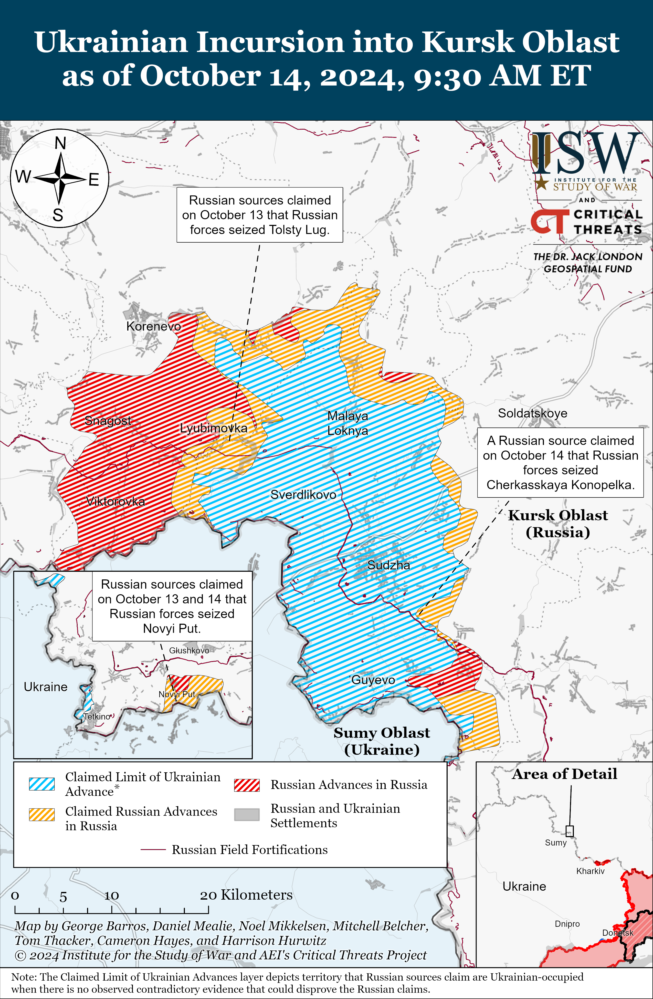
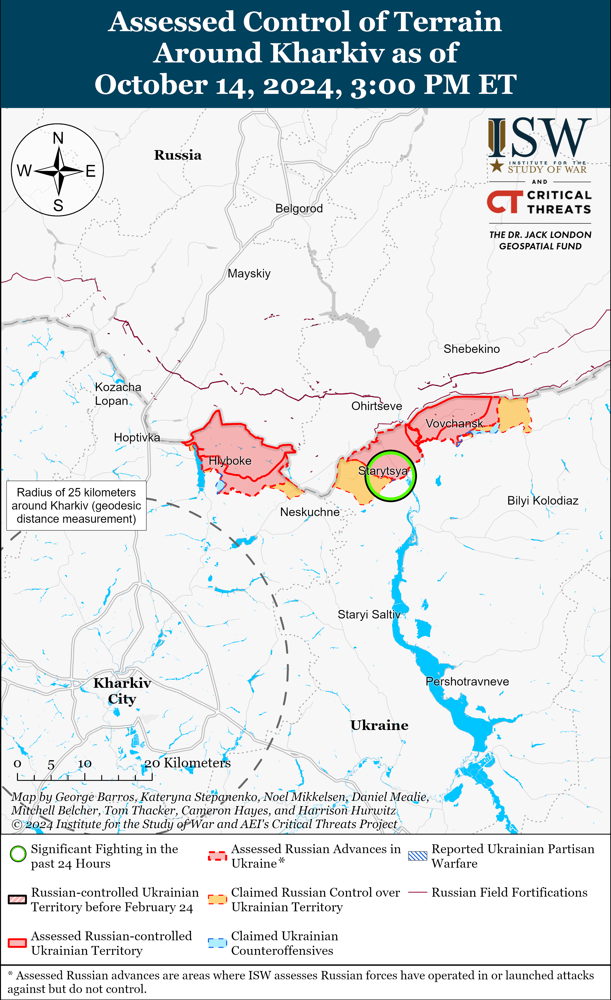
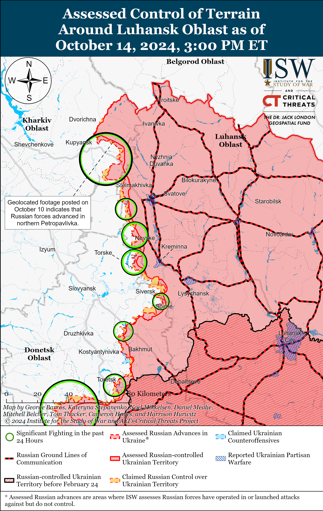
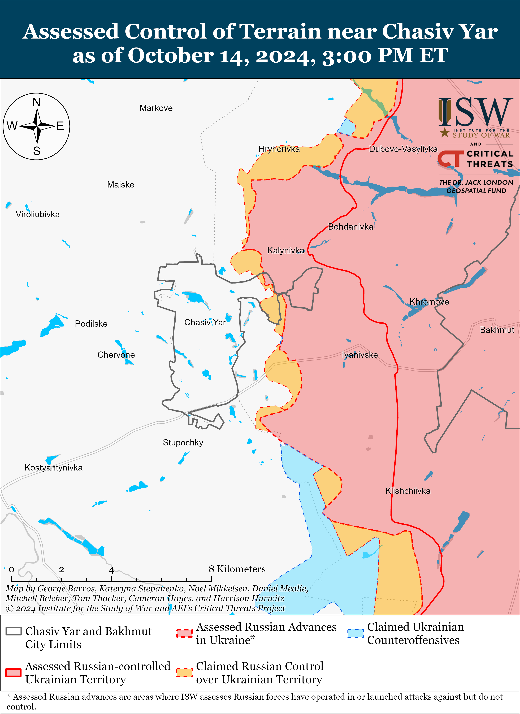
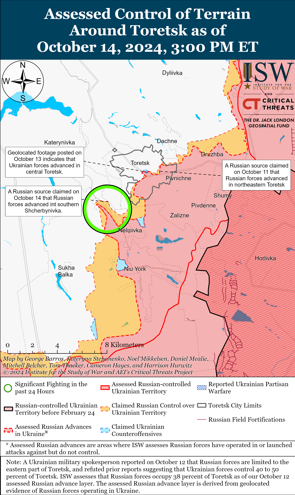
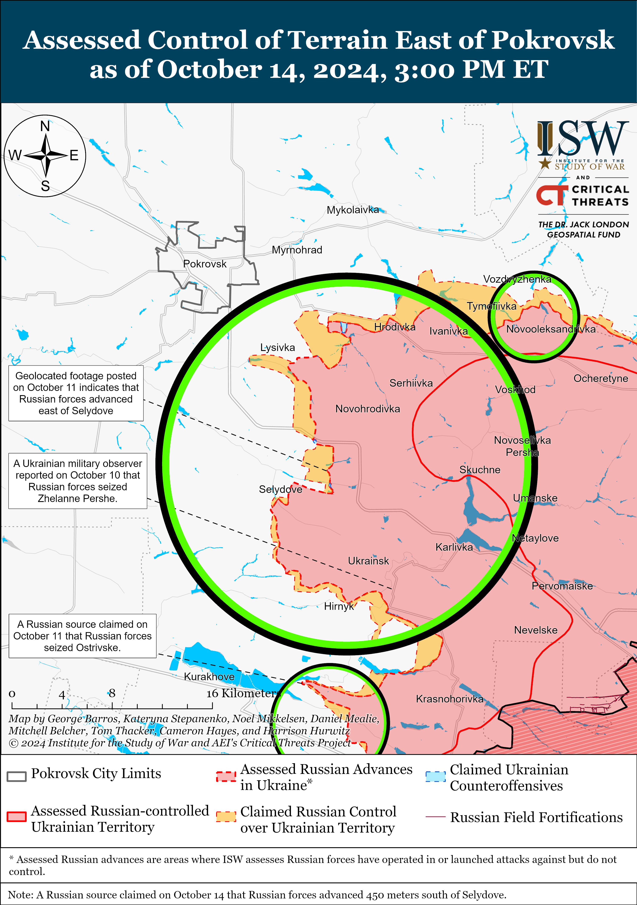
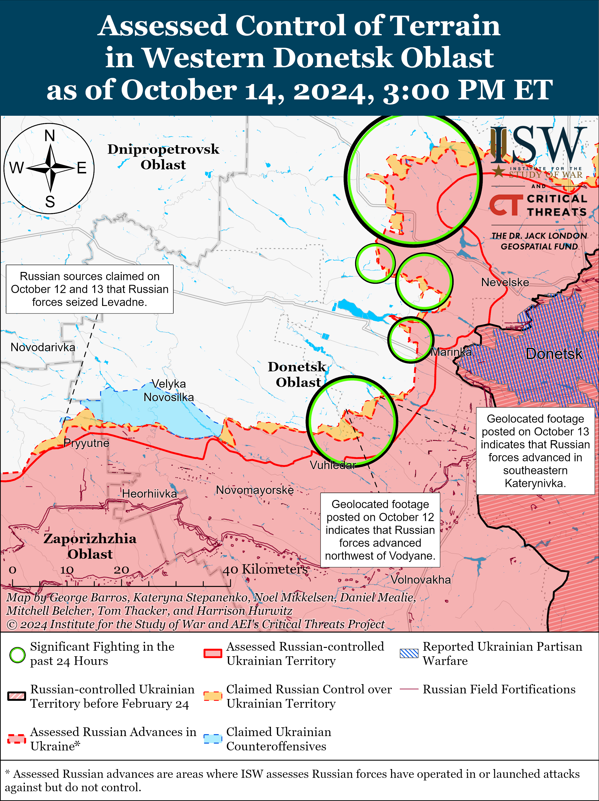
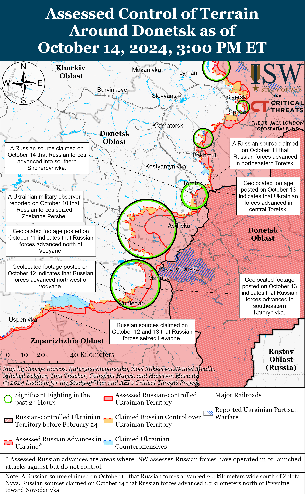
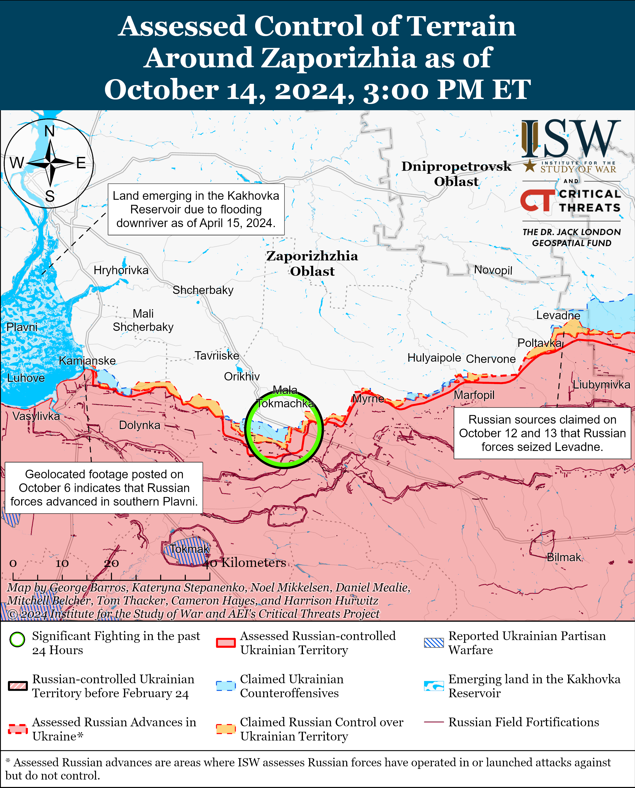
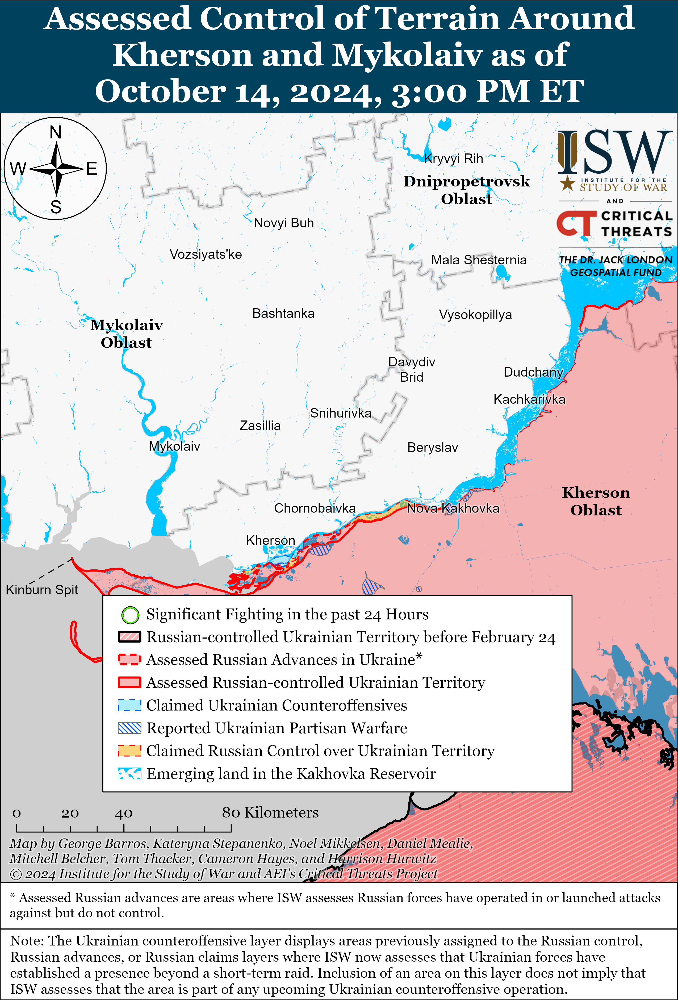

# Russian Offensive Campaign Assessment, October 14, 2024

**October 14, 2024, 5:50pm ET**

**Click** [**here**](https://storymaps.arcgis.com/stories/36a7f6a6f5a9448496de641cf64bd375) **to see ISW’s interactive map of the Russian invasion of Ukraine. This map is updated daily alongside the static maps present in this report.**

**Click** [**here**](https://storymaps.arcgis.com/stories/83a2f24901c941d581c0c523ecd2619b) **to see ISW's interactive map of Ukraine's offensive in Kursk Oblast.**

**Click** [**here**](https://understandingwar.maps.arcgis.com/apps/instant/3dviewer/index.html?appid=1602762dbcde419bb957dea358449580) **to see ISW’s 3D control of terrain topographic map of Ukraine. Use of a computer (not a mobile device) is strongly recommended for using this data-heavy tool.**

**Click** [**here**](https://storymaps.arcgis.com/stories/733fe90805894bfc8562d90b106aa895) **to access ISW’s archive of interactive time-lapse maps of the Russian invasion of Ukraine. These maps complement the static control-of-terrain map that ISW produces daily by showing a dynamic frontline. ISW will update this time-lapse map archive monthly.**

**Note: The data cut-off for this product was 12pm ET on October 1. ISW will cover subsequent reports in the October 15 Russian Offensive Campaign Assessment.**

**Russian Defense Minister Andrei Belousov arrived in the People's Republic of China (PRC) for an official visit on October 14, highlighting continued Russia-PRC defense cooperation against the backdrop of bilateral naval exercises in the Pacific Ocean.** Belousov met with PRC Defense Minister Dong Jun in Beijing on August 14 and discussed the role of bilateral cooperation in enhancing each state's respective defensive capabilities and maintaining global security and regional stability.[[1]](#_ednbd17f8dcd852ece8a40acb4bbe8419041) Dong emphasized that Russia and the PRC share a common desire to develop military cooperation and open new avenues for unspecified joint defense cooperation.[[2]](#_ednbd17f8dcd852ece8a40acb4bbe8419042) The Russian Ministry of Defense (MoD) notably published footage on October 14 of ongoing joint Russia-PRC People's Liberation Army (PLA) anti-submarine naval exercises in the northwestern Pacific Ocean and claimed that a detachment of Russian and PLA naval vessels are conducting a joint patrol of the Asia–Pacific region.[[3]](#_ednbd17f8dcd852ece8a40acb4bbe8419043) Such joint naval exercises are manifestations of intensified Russia-PRC defense cooperation, as each party can learn valuable lessons from one another during combined exercises, improving interoperability and potentially shaping military doctrine in the future. Russian forces have experience repelling Ukrainian autonomous naval drone strikes against Russian naval and port infrastructure, and the PLA may hope to absorb some of these lessons in planning for the PRC's potential future actions against Taiwan. Taiwan's MoD warned that the PRC launched "massive military drills" encircling Taiwan with warships on October 14, which overlapped with Belousov's visit.[[4]](#_ednbd17f8dcd852ece8a40acb4bbe8419044)

**Russian forces struck civilian vessels docked at Ukrainian ports for the fourth time since October 5, part of an apparent Russian strike campaign targeting port areas to undermine Ukraine's grain corridor, spoil international support for Ukraine, and push Ukraine into premature negotiations.** Odesa Oblast officials reported that Russian forces struck the port of Odesa with a ballistic missile during the day on October 14, hitting the civilian vessels *NS Moon* flying the Belize flag and the *Optima* dry cargo vessel flying the Palau flag, as well as port infrastructure and a grain warehouse.[[5]](#_ednbd17f8dcd852ece8a40acb4bbe8419045) The officials stated that Russian strikes on October 7 already damaged the *Optima*. Ukrainian sources reported that Russian forces most recently struck civilian vessels docked at the port of Odesa overnight on October 5 to 6 and on October 7 and 9.[[6]](#_ednbd17f8dcd852ece8a40acb4bbe8419046) Russian ultranationalist milbloggers responded to the October 9 strike with rhetoric supporting existing Kremlin narratives aimed at undermining confidence in the grain corridor as well as attempting to justify the strike.[[7]](#_ednbd17f8dcd852ece8a40acb4bbe8419047) Milbloggers explicitly called for further Russian strikes against Ukrainian grain infrastructure, civilian vessels at Ukrainian ports, and other targets that would further degrade Ukraine's economic potential. ISW recently assessed that Russian strikes against civilian vessels and other grain corridor infrastructure are almost certainly intended to undermine Western confidence in Ukraine's ability to enforce and defend the corridor, influence ongoing Western discussions about long-term support for Ukraine, and impede Ukraine's ability to survive economically during the war.[[8]](#_ednbd17f8dcd852ece8a40acb4bbe8419048)

**Key Takeaways:**

- **Russian Defense Minister Andrei Belousov arrived in the People's Republic of China (PRC) for an official visit on October 14, highlighting continued Russia-PRC defense cooperation against the backdrop of bilateral naval exercises in the Pacific Ocean.**
- **Russian forces struck civilian vessels docked at Ukrainian ports for the fourth time since October 5, part of an apparent Russian strike campaign targeting port areas to undermine Ukraine's grain corridor, spoil international support for Ukraine, and push Ukraine into premature negotiations.**
- **Russian sources claimed that Russian forces recaptured positions in Kursk Oblast.**
- **Ukrainian forces recently regained positions in central Toretsk.**
- **Russian forces recently conducted a reduced battalion-sized mechanized assault in the Kurakhove direction and recently made confirmed advances northeast of Vuhledar.**
- **Russian opposition outlet *Verstka* reported on October 11 that sources within the Russian Presidential Administration stated that the Kremlin's "Time of Heroes" program, which places veterans of the war in Ukraine into government positions after returning to Russia, is meant to increase the popularity of contract military service and boost recruitment.**
- **Russian occupation officials continue to pathologize Ukrainian identity in an effort to indoctrinate children in occupied Ukraine.**

****

***We do not report in detail on Russian war crimes because these activities are well-covered in Western media and do not directly affect the military operations we are assessing and forecasting. We will continue to evaluate and report on the effects of these criminal activities on the Ukrainian military and the Ukrainian population and specifically on combat in Ukrainian urban areas. We utterly condemn Russian violations of the laws of armed conflict and the Geneva Conventions and crimes against humanity even though we do not describe them in these reports.***

- Ukrainian Operations in the Russian Federation
- Russian Main Effort – Eastern Ukraine (comprised of three subordinate main efforts)
- Russian Subordinate Main Effort #1 – Push Ukrainian forces back from the international border with Belgorod Oblast and approach to within tube artillery range of Kharkiv City
- Russian Subordinate Main Effort #2 – Capture the remainder of Luhansk Oblast and push westward into eastern Kharkiv Oblast and encircle northern Donetsk Oblast
- Russian Subordinate Main Effort #3 – Capture the entirety of Donetsk Oblast
- Russian Supporting Effort – Southern Axis
- Russian Air, Missile, and Drone Campaign
- Russian Mobilization and Force Generation Efforts
- Russian Technological Adaptations
- Activities in Russian-occupied areas
- Ukrainian Defense Industrial Base Efforts
- Russian Information Operations and Narratives
- Significant Activity in Belarus

**Ukrainian Operations in the Russian Federation**

Russian forces reportedly recaptured territory in the main Ukrainian salient in Kursk Oblast on October 14. Russian milbloggers claimed that Russian forces recaptured Tolsty Lug (southeast of Korenevo), and one milblogger claimed that elements of the Russian 11th Airborne (VDV) Brigade recaptured Cherkasskaya Konopelka (southeast of Sudzha).[[9]](#_ednbd17f8dcd852ece8a40acb4bbe8419049) The milblogger later claimed that they could not confirm the Russian capture of Cherkasskaya Konopelka but that Russian forces had recaptured the "Lotos" gas station north of the settlement.[[10]](#_ednbd17f8dcd852ece8a40acb4bbe84190410) Russian milbloggers also claimed that Russian forces recaptured territory southeast of Koreveno near Novoivanovka and southeast of Sudzha near Borky and Plekhovo.[[11]](#_ednbd17f8dcd852ece8a40acb4bbe84190411) ISW has not observed confirmation of any of these Russian claims, however. A Russian milblogger claimed that reports that Russian forces have advanced to the outskirts of Sudzha are false, and ISW has only collected sufficient data to assess that Russian forces are around seven kilometers from the outskirts of Sudzha at the closest point, although Russian forces may be closer.[[12]](#_ednbd17f8dcd852ece8a40acb4bbe84190412) Russian sources claimed that Russian forces conducted offensive operations near Kremyanoye (east of Korenevo), Lyubimovka (southeast of Korenevo), Zeleny Shlyakh (immediately east of Lyubimovka), Novoivanovka, Fanaseevka (southeast of Sudzha), and Plekhovo.[[13]](#_ednbd17f8dcd852ece8a40acb4bbe84190413) Russian sources, including the Russian Ministry of Defense (MoD), claimed that Ukrainian forces counterattacked near Olgovka (east of Korenevo), Lyubimovka, Tolsty Lug, Nizhny Klin (southeast of Lyubimovka), Zeleny Shlyakh, and Cherkasskaya Konopelka.[[14]](#_ednbd17f8dcd852ece8a40acb4bbe84190414) Elements of the Russian 106th VDV Division are reportedly operating near Lyubimovka; elements of the 83rd VDV Brigade are reportedly operating near Tolsty Lug and Pokrovsky (southwest of Tolsty Lug); and elements of the 810th Naval Infantry Brigade (Black Sea Fleet [BSF], Southern Military District [SMD]), 155th Naval Infantry Brigade (Pacific Fleet, Eastern Military District [EMD]), 98th VDV Division, and 22nd Spetsnaz Brigade (Russian General Staff Main Directorate [GRU]) are reportedly operating in the Kursk direction.[[15]](#_ednbd17f8dcd852ece8a40acb4bbe84190415)

Russian forces reportedly recaptured territory in Glushkovsky Raion (west of the main Ukrainian salient in Kursk Oblast) on October 14. Russian milbloggers claimed that Russian forces seized Novy Put (southwest of Glushkovo) and have pushed Ukrainian forces out of most of the Ukrainian salient south of Veseloye (also southwest of Glushkovo).[[16]](#_ednbd17f8dcd852ece8a40acb4bbe84190416) ISW has not observed confirmation of these claims, however. Russian sources claimed that Ukrainian forces counterattacked near Novy Put.[[17]](#_ednbd17f8dcd852ece8a40acb4bbe84190417) Elements of the Russian 56th VDV Regiment (106th VDV Division) are reportedly operating in Glushkovsky Raion.[[18]](#_ednbd17f8dcd852ece8a40acb4bbe84190418)

A Russian milblogger claimed that the autumnal muddy season (rasputitsa) has begun in Kursk Oblast and that Russian forces' reliance on tracked vehicles gives Russian forces an advantage over Ukrainian wheeled vehicles.[[19]](#_ednbd17f8dcd852ece8a40acb4bbe84190419) The milblogger noted that the mud is affecting both Ukrainian and Russian combat operations. ISW previously assessed that the approaching muddy season likely impacted the Russian operational calculus to intensify counterattacks in Kursk Oblast on October 10.[[20]](#_ednbd17f8dcd852ece8a40acb4bbe84190420)

Chechen Akhmat Spetsnaz Commander Apty Alaudinov claimed on October 14 that Russian forces have recaptured roughly half of the territory that Ukrainian forces occupied in Kursk Oblast since the beginning of the Kursk Oblast incursion in August 2024.[[21]](#_ednbd17f8dcd852ece8a40acb4bbe84190421) ISW has observed visual evidence or Russian claims of Russian forces recapturing approximately 46 percent of the territory within the Ukrainian salient in Kursk Oblast.

Ukraine's Main Military Intelligence Directorate (GUR) reported on October 14 that a fire started by unspecified actors destroyed a Russian Tu-134 aircraft belonging to the 117th Military Transport Aviation Regiment after a fire broke out at the "Orenburg-2" Military Airfield near Orenburg City, Russia on the night of October 12 to 13.[[22]](#_ednbd17f8dcd852ece8a40acb4bbe84190422) The GUR stated that Russian forces use Tu-134 aircraft to transport senior Ministry of Defense (MoD) staff. ISW cannot independently verify the destruction of the aircraft or the actors responsible at this time.

**Russian Main Effort – Eastern Ukraine**

**Russian Subordinate Main Effort #1 – Kharkiv Oblast** **(Russian objective: Push Ukrainian forces back from the international border with Belgorod Oblast and approach to within tube artillery range of Kharkiv City)**

Russian forces reportedly advanced within Vovchansk (northeast of Kharkiv City) amid continued offensive operations in northern Kharkiv Oblast on October 14. Russian milbloggers claimed that Russian forces advanced along Korolenka Street in northern Vovchansk, although ISW has not yet observed visual evidence of this claim.[[23]](#_ednbd17f8dcd852ece8a40acb4bbe84190423) Ukrainian sources reported that Russian forces conducted ground attacks near Starytsya (southwest of Vovchansk) on October 13 and 14.[[24]](#_ednbd17f8dcd852ece8a40acb4bbe84190424) Elements of the Russian 16th Spetsnaz Brigade (Russian General Staff's Main Directorate [GRU]) reportedly continue to operate in northern Kharkiv Oblast, and elements of the 18th Motorized Rifle Division (11th Army Corps [AC], Leningrad Military District [LMD]) reportedly continue to operate near Lyptsi (north of Kharkiv City).[[25]](#_ednbd17f8dcd852ece8a40acb4bbe84190425)

****

**Russian Subordinate Main Effort #2 – Luhansk Oblast** **(Russian objective: Capture the remainder of Luhansk Oblast and push westward into eastern Kharkiv Oblast and northern Donetsk Oblast)**

Russian forces reportedly marginally advanced northwest of Kreminna amid continued offensive operations along the Kupyansk-Svatove-Kreminna line on October 14. A Russian milblogger claimed that elements of the Russian 144th Motorized Rifle Division (20th Combined Arms Army [CAA], Moscow Military District [MMD]) advanced east of Novosadove (northwest of Kreminna), but ISW has not observed visual confirmation of these claims.[[26]](#_ednbd17f8dcd852ece8a40acb4bbe84190426) Ukrainian Severodonetsk City Administration Head Roman Vlasenko stated that Russian forces are focusing their attacks northwest of Kreminna in the directions of Zhuravka Balka and Makiivka and south of Kreminna in the directions of Bilohorivka and the Serebryanske forest area.[[27]](#_ednbd17f8dcd852ece8a40acb4bbe84190427) Russian forces also continued attacks northeast of Kupyansk near Synkivka; east of Kupyansk near Petropavlivka; southeast of Kupyansk near Pishchane, Stepova Novoselivka, Lozova, and Kolisnykivka; west of Svatove near Kopanky and Vyshneve; southwest of Svatove near Novoyehorivka, Druzhelyubivka, Hrekivka, Nevske, Terny, and Yampolivka; and west of Kreminna near Torske and Zarichne on October 13 and 14.[[28]](#_ednbd17f8dcd852ece8a40acb4bbe84190428) Elements of the Russian 25th Motorized Rifle Brigade (6th CAA, Leningrad Military District [LMD]) are reportedly operating in the Kupyansk direction.[[29]](#_ednbd17f8dcd852ece8a40acb4bbe84190429)

  
 **Russian Subordinate Main Effort #3 – Donetsk Oblast (Russian objective: Capture the entirety of Donetsk Oblast, the claimed territory of Russia’s proxies in Donbas)**

Russian forces conducted offensive operations east of Siversk near Verkhnokamyanske on October 14, but there were no confirmed changes to the frontline.[[30]](#_ednbd17f8dcd852ece8a40acb4bbe84190430)

Russian forces conducted offensive operations near Chasiv Yar on October 14, but there were no confirmed changes to the frontline. A Russian milblogger claimed on October 14 that Russian forces advanced along the T0504 Bakhmut-Kostyantynivka highway east of Chasiv Yar and in fields southwest of Hryhorivka (northeast of Chasiv Yar), however ISW has not observed confirmation of these claims.[[31]](#_ednbd17f8dcd852ece8a40acb4bbe84190431) Russian forces conducted offensive operations near Chasiv Yar, north of Chasiv Yar near Orikhovo-Vasylivka, and south of Chasiv Yar near Stupochky on October 13 and 14.[[32]](#_ednbd17f8dcd852ece8a40acb4bbe84190432) Elements of the Russian 177th Naval Infantry Regiment (Caspian Flotilla) are reportedly operating in the Chasiv Yar direction.[[33]](#_ednbd17f8dcd852ece8a40acb4bbe84190433) Elements of the Russian 1008th Motorized Rifle Regiment (6th Motorized Rifle Division, 3rd Army Corps [AC]) are reportedly operating in the forest area east of Stupochky.[[34]](#_ednbd17f8dcd852ece8a40acb4bbe84190434)

Ukrainian forces recently regained lost positions in central Toretsk amid continued Russian offensive operations in the area on October 14. Geolocated footage published on October 13 shows elements of the Russian 132nd Motorized Rifle Brigade (51st Combined Arms Army [CAA] [formerly 1st Donetsk People's Republic AC], Southern Military District [SMD]) shelling Ukrainian forces in central Toretsk, indicating that Ukrainian forces recently regained positions in the area.[[35]](#_ednbd17f8dcd852ece8a40acb4bbe84190435) A Russian milblogger claimed on October 14 that Russian forces advanced in southern Shcherbynivka (west of Toretsk), but ISW has not observed confirmation of this claim.[[36]](#_ednbd17f8dcd852ece8a40acb4bbe84190436) Russian forces conducted offensive operations near Toretsk and Shcherbynivka on October 13 and 14.[[37]](#_ednbd17f8dcd852ece8a40acb4bbe84190437) Elements of the Russian "Lavina" Battalion (132nd Motorized Rifle Brigade, 51st CAA, SMD) are reportedly operating within Toretsk.[[38]](#_ednbd17f8dcd852ece8a40acb4bbe84190438)

Russian forces conducted offensive operations near Pokrovsk on October 14, but there were no confirmed changes to the frontline. Russian forces conducted offensive operations east of Pokrovsk near Promin, Novotoretske, Myrolyubivka, and Myrnohrad and southeast of Pokrovsk near Sukhyi Yar, Hirnyk, Lysivka, Selydove, Tsukuryne, Kreminna Balka, Izmailivka, Novohrodivka, Krutyi Yar, Novodmytrivka, Kurakhivka, Novoselydivka, Zhelanne Druhe, and Zoryane on October 13 and 14.[[39]](#_ednbd17f8dcd852ece8a40acb4bbe84190439) Russian milbloggers claimed that Russian forces advanced near Myrnohrad, but ISW has not observed confirmation of this claim.[[40]](#_ednbd17f8dcd852ece8a40acb4bbe84190440)

Russian forces recently conducted a reinforced-platoon mechanized assault in the Kurakhove direction amid continued offensive operations in the area on October 14. Geolocated footage published on October 13 indicates that Ukrainian forces recently repelled a Russian-reduced battalion-sized mechanized assault consisting of 25 armored vehicles and five tanks in the Kurakhove direction.[[41]](#_ednbd17f8dcd852ece8a40acb4bbe84190441) Ukrainian forces reportedly destroyed seven of the armored vehicles and one tank. Russian milbloggers continued to claim on October 14 that Russian forces seized Ostrivske (east of Kurakhove), but ISW has yet to observe confirmation that Russian forces have seized the entire settlement.[[42]](#_ednbd17f8dcd852ece8a40acb4bbe84190442) Russian forces conducted offensive operations east of Kurakhove near Maksymilyanivka on October 14.[[43]](#_ednbd17f8dcd852ece8a40acb4bbe84190443) Elements of the Russian 238th Artillery Brigade and 20th Motorized Rifle Division (both of the 8th CAA, SMD) are reportedly operating near Dalne (south of Kurakhove), and elements of the 5th Motorized Rifle Brigade (51st CAA, SMD) are reportedly operating near Ostrivske.[[44]](#_ednbd17f8dcd852ece8a40acb4bbe84190444) Elements of the Russian 20th Motorized Rifle Division (8th CAA, SMD), including its 255th Motorized Rifle Regiment, are reportedly operating in the Kurakhove direction.[[45]](#_ednbd17f8dcd852ece8a40acb4bbe84190445)

Russian forces recently made confirmed advances southwest of Donetsk City near Vuhledar amid continued offensive operations in the area on October 14. Geolocated footage published on October 12 indicates that Russian forces recently advanced northwest of Vodyane (northeast of Vuhledar).[[46]](#_ednbd17f8dcd852ece8a40acb4bbe84190446) Russian milbloggers claimed on October 14 that Russian forces advanced northwest of Vodyane and northwest of Vuhledar, but ISW has not observed confirmation of these claims.[[47]](#_ednbd17f8dcd852ece8a40acb4bbe84190447) Russian forces continued offensive operations near northeast of Vuhledar near Kostyantynivka, Antonivka, Katerynivka, and Vodyane; northwest of Vuhledar towards Bohoyavlenka; and west of Vuhledar near Zolota Nyva on October 13 and 14.[[48]](#_ednbd17f8dcd852ece8a40acb4bbe84190448) Elements of the Russian “Karia” detachment of the 68th AC (Eastern Military District [EMD]) are reportedly operating near Katerynivka.[[49]](#_ednbd17f8dcd852ece8a40acb4bbe84190449) Elements of the Russian 5th Tank Brigade (36th CAA, EMD) are reportedly operating near Zolota Nyva.[[50]](#_ednbd17f8dcd852ece8a40acb4bbe84190450)

Russian forces reportedly advanced in the Donetsk-Zaporizhia Oblast border area on October 14, but there were no confirmed changes to the frontline. Russian milbloggers claimed on October 14 that Russian forces advanced northeast of Pryyutne and north of Levadne (both southwest of Velyka Novosilka), but ISW has not observed confirmation of these claims.[[51]](#_ednbd17f8dcd852ece8a40acb4bbe84190451) Ukrainian Mariupol Mayoral Advisor Petro Andryushchenko stated on October 14 that Russian forces have transferred large amounts of personnel from Novoazovsk towards Vremivka or Polohy (west of Vremivka) on October 13.[[52]](#_ednbd17f8dcd852ece8a40acb4bbe84190452) The Ukrainian General Staff reported that Russian forces struck near Novodarivka (southwest of Velyka Novosilka) with 60 unguided aerial rockets.[[53]](#_ednbd17f8dcd852ece8a40acb4bbe84190453) Elements of the Russian ”Storm” Detachment of the 336th Naval Infantry Brigade (Baltic Fleet, Leningrad Military District [LMD]) are reportedly operating in Levadne.[[54]](#_ednbd17f8dcd852ece8a40acb4bbe84190454)

**Russian Supporting Effort – Southern Axis** **(Russian objective: Maintain frontline positions and secure rear areas against Ukrainian strikes)**

Russian forces conducted ground assaults in western Zaporizhia Oblast near Robotyne, Mala Tokmachka (northeast of Robotyne), and Novodanylivka (north of Robotyne) on October 13 and 14 but did not make any confirmed gains.[[55]](#_ednbd17f8dcd852ece8a40acb4bbe84190455)

The Ukrainian General Staff reported on October 13 and 14 that Russian forces conducted assaults in the Dnipro direction, likely referring to left (east) bank Kherson Oblast and the islands in the Dnipro River Delta.[[56]](#_ednbd17f8dcd852ece8a40acb4bbe84190456)

Ukrainian Navy Spokesperson Captain Third Rank Dmytro Pletenchuk reiterated on October 14 that Russian forces are prioritizing allocating resources to protect the Kerch Strait Bridge — more so than towards protecting other critical infrastructure, such as oil depots.[[57]](#_ednbd17f8dcd852ece8a40acb4bbe84190457) Pletenchuk noted that Russian forces are no longer able to use naval assets to protect the bridge, likely due to the threat of Ukrainian strikes, but are now using booms, barriers, and aviation to protect the bridge. Pletenchuk previously stated that Russian forces were constructing structures near the bridge — possibly either a hydrotechnical or barrier structure — and placed an unspecified number of air defense systems in occupied Crimea to defend the bridge against Ukrainian drone and missile strikes.[[58]](#_ednbd17f8dcd852ece8a40acb4bbe84190458)

**

**

**Russian Air, Missile, and Drone Campaign** **(Russian Objective: Target Ukrainian military and civilian infrastructure in the rear and on the frontline)**

Russian forces did not conduct missile or drone strikes against Ukraine overnight on October 13 to 14. Ukrainian Air Force Communications Department Acting Head Colonel Yuriy Ihnat stated that the night of October 13-14 was the first night in 48 days (since August 29) that Russian forces did not attempt to strike Ukraine with Shahed drones.[[59]](#_ednbd17f8dcd852ece8a40acb4bbe84190459)

*See topline text for reporting on the Russian missile strike against the port of Odesa during the day on October 14.*

**Russian Mobilization and Force Generation Efforts** **(Russian objective: Expand combat power without conducting general mobilization)**

Russian opposition outlet *Verstka* reported on October 11 that sources within the Russian Presidential Administration stated that the Kremlin's "Time of Heroes" program, which places veterans of the war in Ukraine into government positions after returning to Russia, is meant to increase the popularity of contract military service and boost recruitment.[[60]](#_ednbd17f8dcd852ece8a40acb4bbe84190460) Presidential Administration sources reportedly stated that the Kremlin's recent rush to appoint military personnel to government positions is in part due to the situation at the front in Ukraine. Some of the Russian veterans who have received political positions through the program have reportedly not actually begun working in their new workplaces, and sources stated that the program selects positions in which the veterans will not actually have any "political weight." A source within the Russian Federation Council reportedly stated that the Kremlin is trying to use appointments through the "Time of Heroes" program to prove that military personnel are "well employed in civilian life." *Verstka*'s sources stated that some of the veteran appointees in the Federation Council lack higher education and that other senators do not accept or communicate with them. The Kremlin leveraged the Russian regional elections in early September 2024 to integrate Russian veterans, including those from the "Time of Heroes" program, into government positions.[[61]](#_ednbd17f8dcd852ece8a40acb4bbe84190461) Samara Oblast Governor Vyacheslav Fedorishchev appointed a veteran of the war in Ukraine as the oblast's acting vice-governor and head of the anti-corruption department on October 14.[[62]](#_ednbd17f8dcd852ece8a40acb4bbe84190462)

Russian authorities reportedly continue to impress migrants into signing military contracts. *Radio Free Europe/Radio Liberty's* (RFE/RL) *Current Time* outlet reported on October 14 that Russian prison authorities are using threats of punishment to force prisoners from Tajikistan and Uzbekistan to renounce their native citizenship, apply for Russian citizenship, and sign contracts with the Russian military to fight in Ukraine.[[63]](#_ednbd17f8dcd852ece8a40acb4bbe84190463) *Current Time* reported that prisoners stated that Russian prison guards are intentionally treating Tajik and Uzbek prisoners poorly to coerce them to sign Russian military contracts.

The Russian Ministry of Defense (MoD) claimed on October 13 that the Russian military created a first-person view (FPV) drone operator course within the Russian “Dnepr” Grouping of Force operating in occupied Kherson Oblast.[[64]](#_ednbd17f8dcd852ece8a40acb4bbe84190464) The training will reportedly include tactical and technical theory, computer simulations, and practical hands-on training. The Russian ultranationalist milblogger community recently expressed mass outrage after a Russian military commander disbanded a specialized drone unit and committed drone operators to frontal assaults in Donetsk Oblast, resulting in the operators' deaths, and the Russian MoD may be attempting to appease this outrage by dedicating resources to specialized drone operator training.[[65]](#_ednbd17f8dcd852ece8a40acb4bbe84190465)

**Russian Technological Adaptations** **(Russian objective: Introduce technological innovations to optimize systems for use in Ukraine)**

Nothing significant to report.

**Ukrainian Defense Industrial Efforts** **(Ukrainian objective: Develop its defense industrial base to become more self-sufficient in cooperation with US, European, and international partners)**

*ISW is suspending publishing coverage of Ukrainian defense industrial efforts until further notice.*

**Activities in Russian-occupied areas** **(Russian objective: Consolidate administrative control of annexed areas; forcibly integrate Ukrainian citizens into Russian sociocultural, economic, military, and governance systems)**

Russian occupation officials continue to pathologize Ukrainian identity in an effort to indoctrinate children in occupied Ukraine. Kherson Oblast occupation Information Policy Department Head Yevgeny Brykov emphasized on October 14 the merits of Russian "military-patriotic education" as a "cure" for Ukrainian "ideologies" and claimed that pro-Ukrainian sentiments in children are a "virus" that Russia needs to treat.[[66]](#_ednbd17f8dcd852ece8a40acb4bbe84190466) Various Ukrainian officials discussed Russian military-patriotic education and indoctrination efforts aimed at eliminating Ukrainian identity and pro-Ukrainian sentiment in occupied areas, strongly emphasizing the insidious effect of Russian efforts to pathologize Ukrainian identity and to claim that it is somehow "dangerous" or "deviant."[[67]](#_ednbd17f8dcd852ece8a40acb4bbe84190467) Social media footage circulated on October 14 shows a group of primary school-aged children in occupied Mariupol participating in "Orlyata Rossii," which ISW has previously reported is a branch of the Kremlin-funded "Movement of the First" youth organization that works to spread pro-Russian and hyper-militaristic ideals among youth in occupied Ukraine and within Russia.[[68]](#_ednbd17f8dcd852ece8a40acb4bbe84190468) Ukrainian Mariupol Mayoral Advisor Petro Andryushchenko warned that "Orlyata Rossii" is intended to expand "ideological influence" over young Ukrainian children and raise them to support and potentially fight in the Russian military in the future.[[69]](#_ednbd17f8dcd852ece8a40acb4bbe84190469) Ukrainian Berdyansk City Head Victoria Halitsina noted that Russian occupation authorities in Berdyansk are increasingly threatening parents with fines if they do not send their children to Russian-run schools and reported that the Russian occupation of Berdyansk has militarized school curricula.[[70]](#_ednbd17f8dcd852ece8a40acb4bbe84190470)

**Russian Information Operations and Narratives**

Russian sources promoted threatening narratives accusing Central Asian states of anti-Russian actions in an effort to undermine the agency of Central Asian states and the role of the US in the region. A prominent Kremlin-awarded milblogger, who notably runs several media and information policy schools in Central Asia, complained on October 14 that history textbooks in Kazakhstan and other unspecified Central Asian states describe Russia as an "oppressor, colonizer, and strangler" and claimed that Central Asian states are increasingly pursuing an agenda that is "hostile" to Russian interests.[[71]](#_ednbd17f8dcd852ece8a40acb4bbe84190471) The milblogger also accused Kazakhstan of being insufficiently supportive of the propagation of the Russian language in Kazakhstan.[[72]](#_ednbd17f8dcd852ece8a40acb4bbe84190472) The milblogger notably concluded that the gradual transition of the Kazakh population away from pro-Russian sentiments closely parallels factors that gave rise to the "special military operation" — directly comparing Kazakhstan's efforts to safeguard its national, cultural, and linguistic autonomy to Russia's alleged justifications for its full-scale invasion of Ukraine. Russia employed the falsely constructed concept that Russian speakers abroad were "under attack" to justify its military aggression against Ukraine.[[73]](#_ednbd17f8dcd852ece8a40acb4bbe84190473) Another prominent Kremlin-affiliated milblogger claimed that the US is increasingly attempting to undermine Russia's position in Kazakhstan by working with the Kazakh government on nuclear research — a narrative that mirrors Russian information operations about supposed American biolabs in Ukraine.[[74]](#_ednbd17f8dcd852ece8a40acb4bbe84190474)

Russian officials continue to invoke international humanitarian and human rights laws in order to deflect from Russia's continue violation of such laws and norms. Kremlin-appointed Human Rights Commissioner Tatiana Moskalkova suggested on October 14 that Ukraine forcibly removed up to 1,000 Russians from Kursk Oblast since the start of Ukraine's Kursk Oblast incursion and claimed that Ukrainian authorities deported children to Austria from Ukraine after Russia's invasion in 2022.[[75]](#_ednbd17f8dcd852ece8a40acb4bbe84190475) Moskalkova notably did not provide evidence of the alleged forced removals or deportations. ISW previously reported that Russian authorities failed to provide humanitarian support for residents of Kursk Oblast following Ukraine's incursion into Kursk Oblast in August 2024, leaving a vacuum which Ukrainian authorities filled in order to fulfil their international legal requirements to the civilian population.[[76]](#_ednbd17f8dcd852ece8a40acb4bbe84190476) Moskalkova's baseless accusations are in part intended to undermine Ukraine's efforts to provide support for Russian civilians and to deflect from the well-documented roster of Russian human rights and humanitarian law abuses against Ukrainian soldiers and civilians.[[77]](#_ednbd17f8dcd852ece8a40acb4bbe84190477)

**Significant activity in Belarus** **(Russian efforts to increase its military presence in Belarus and further integrate Belarus into Russian-favorable frameworks and Wagner Group activity in Belarus)**

Nothing significant to report.

**Note: ISW does not receive any classified material from any source, uses only publicly available information, and draws extensively on Russian, Ukrainian, and Western reporting and social media as well as commercially available satellite imagery and other geospatial data as the basis for these reports. References to all sources used are provided in the endnotes of each update.**

---

[[1]](#_ednbd17f8dcd852ece8a40acb4bbe841904ref1) [https://ria](https://ria/) dot ru/20241014/belousov-1977950089.html; <https://t.me/mod_russia/44482>; <https://t.me/mod_russia/44485;> https://t.me/mod\_russia/44486

[[2]](#_ednbd17f8dcd852ece8a40acb4bbe841904ref2) https://t.me/mod\_russia/44486

[[3]](#_ednbd17f8dcd852ece8a40acb4bbe841904ref3) https://t.me/mod\_russia/44474

[[4]](#_ednbd17f8dcd852ece8a40acb4bbe841904ref4) https://t.me/bbcrussian/71564

[[5]](#_ednbd17f8dcd852ece8a40acb4bbe841904ref5) https://suspilne dot media/odesa/857591-armia-rf-udarila-balistikou-po-odesi-odna-ludina-zaginula-e-poraneni-poskodzeno-dva-sudna/; https://t.me/odeskaODA/7067; https://t.me/OleksiyKuleba/4987

[[6]](#_ednbd17f8dcd852ece8a40acb4bbe841904ref6) <https://www.understandingwar.org/backgrounder/russian-offensive-campaign-assessment-october-10-2024>; https://t.me/odeskaODA/6995 ; https://armyinform.comdot ua/2024/10/10/tretya-raketna-ataka-na-czyvilne-sudno-za-chotyry-dni-rosiya-zabrala-zhyttya-shesty-lyudej/ ; https://meduza dot io/news/2024/10/09/rossiya-udarila-po-portovoy-infrastrukture-odesskoy-oblasti-pyat-chelovek-pogibli-povrezhdeno-grazhdanskoe-sudno; https://t.me/odeskaODA/6969; https://suspilne dot media/odesa/853013-armia-rf-skeruvala-na-odesu-balisticni-raketi-e-zagiblij-ta-patero-travmovanih/; https://t.me/OleksiyKuleba/4957 ; https://armyinform.com dot ua/2024/10/08/armiya-rf-atakuvala-balistykoyu-czyvilne-sudno-v-portah-odeshhyny-ye-zagybli-ta-poraneni/ ; https://t.me/odeskaODA/6943 ; https://meduza dot io/news/2024/10/06/rossiya-atakovala-odesskuyu-oblast-dronami-i-raketami-pod-udar-popali-sklady-gazoprovod-i-suhogruz

[[7]](#_ednbd17f8dcd852ece8a40acb4bbe841904ref7) <https://t.me/boris_rozhin/140642>; <https://t.me/dva_majors/55036>

[[8]](#_ednbd17f8dcd852ece8a40acb4bbe841904ref8) https://www.understandingwar.org/backgrounder/russian-offensive-campaign-assessment-october-10-2024

[[9]](#_ednbd17f8dcd852ece8a40acb4bbe841904ref9) <https://t.me/dva_majors/55011>; <https://t.me/DKulko/669>; <https://t.me/motopatriot/28473;> <https://t.me/motopatriot/28494>

[[10]](#_ednbd17f8dcd852ece8a40acb4bbe841904ref10) https://t.me/motopatriot/28456

[[11]](#_ednbd17f8dcd852ece8a40acb4bbe841904ref11) <https://t.me/RVvoenkor/78680>; https://t.me/dva\_majors/55011

[[12]](#_ednbd17f8dcd852ece8a40acb4bbe841904ref12) https://t.me/boris\_rozhin/140738

[[13]](#_ednbd17f8dcd852ece8a40acb4bbe841904ref13) <https://t.me/RVvoenkor/78680>; <https://t.me/RVvoenkor/78680> ; <https://t.me/rybar/64416> ; <https://t.me/warhistoryalconafter/189306>; <https://t.me/dva_majors/54997;> <https://t.me/DKulko/669>; <https://t.me/motopatriot/28473;> https://t.me/motopatriot/28456

[[14]](#_ednbd17f8dcd852ece8a40acb4bbe841904ref14) <https://t.me/rybar/64416>; <https://t.me/dva_majors/55011>; https://t.me/mod\_russia/44483

[[15]](#_ednbd17f8dcd852ece8a40acb4bbe841904ref15) <https://t.me/RVvoenkor/78741>; <https://t.me/dva_majors/55034>; <https://t.me/voin_dv/11330>; <https://t.me/EnotHersonVDV/4353;> <https://t.me/sashakots/49524>; <https://t.me/sashakots/49526>; <https://t.me/epoddubny/21341;> <https://t.me/DKulko/669>; <https://t.me/motopatriot/28473;> <https://t.me/voin_dv/11333>; <https://t.me/russian_airborne/7632>

[[16]](#_ednbd17f8dcd852ece8a40acb4bbe841904ref16) <https://t.me/NgP_raZVedka/19181>; <https://t.me/zovpobedy/13405> ; <https://t.me/boris_rozhin/140663>

[[17]](#_ednbd17f8dcd852ece8a40acb4bbe841904ref17) <https://t.me/rybar/64416>; <https://t.me/zovpobedy/13405> ; <https://t.me/boris_rozhin/140663>

[[18]](#_ednbd17f8dcd852ece8a40acb4bbe841904ref18) <https://t.me/RVvoenkor/78693>; https://t.me/dva\_majors/54992

[[19]](#_ednbd17f8dcd852ece8a40acb4bbe841904ref19) https://t.me/boris\_rozhin/140759

[[20]](#_ednbd17f8dcd852ece8a40acb4bbe841904ref20) https://isw.pub/UkrWar101124

[[21]](#_ednbd17f8dcd852ece8a40acb4bbe841904ref21) <https://tass> dot ru/armiya-i-opk/22119289

[[22]](#_ednbd17f8dcd852ece8a40acb4bbe841904ref22) <https://gur.gov> dot ua/content/spalyly-vorozhu-tushku-na-rosii-znyshcheno-viiskovo-transportnyi-litak-tu-134.html

[[23]](#_ednbd17f8dcd852ece8a40acb4bbe841904ref23) <https://t.me/motopatriot/28467;> <https://t.me/DnevnikDesantnika/17283>

[[24]](#_ednbd17f8dcd852ece8a40acb4bbe841904ref24) <https://www.facebook.com/GeneralStaff.ua/posts/pfbid02DkgfdXQHUF4eXUueG6LTb6gZHTuaANtNfrCNpF5bJMsDSJ6kebNQNZnfyvtPTv9cl;> <https://www.facebook.com/GeneralStaff.ua/posts/pfbid04frdtK6kHTFjLcvaKKqvDRkRN2hCBVg7bFEK2YwM4Wim5zHEeWKZQBGuUwwfADrKl;> <https://t.me/otukharkiv/2081>

[[25]](#_ednbd17f8dcd852ece8a40acb4bbe841904ref25) <https://t.me/milinfolive/132745;> https://t.me/zvizdecmanhustu/2267

[[26]](#_ednbd17f8dcd852ece8a40acb4bbe841904ref26) https://t.me/z\_arhiv/28564

[[27]](#_ednbd17f8dcd852ece8a40acb4bbe841904ref27) https://t.me/luhanskaVTSA/21983

[[28]](#_ednbd17f8dcd852ece8a40acb4bbe841904ref28) <https://www.facebook.com/GeneralStaff.ua/posts/pfbid0usqvidb5NNaBqWoJZQvXSpE8DrfjP8m18nxFmSKk99EbgWR5PZP74WvbmM96aZ6Yl>; <https://www.facebook.com/GeneralStaff.ua/posts/pfbid02DkgfdXQHUF4eXUueG6LTb6gZHTuaANtNfrCNpF5bJMsDSJ6kebNQNZnfyvtPTv9cl>; https://www.facebook.com/GeneralStaff.ua/posts/pfbid04frdtK6kHTFjLcvaKKqvDRkRN2hCBVg7bFEK2YwM4Wim5zHEeWKZQBGuUwwfADrKl

[[29]](#_ednbd17f8dcd852ece8a40acb4bbe841904ref29) https://t.me/boris\_rozhin/140698

[[30]](#_ednbd17f8dcd852ece8a40acb4bbe841904ref30) https://www.facebook.com/GeneralStaff.ua/posts/pfbid0usqvidb5NNaBqWoJZQvXSpE8DrfjP8m18nxFmSKk99EbgWR5PZP74WvbmM96aZ6Yl ; <https://www.facebook.com/GeneralStaff.ua/posts/pfbid02DkgfdXQHUF4eXUueG6LTb6gZHTuaANtNfrCNpF5bJMsDSJ6kebNQNZnfyvtPTv9cl>; https://www.facebook.com/GeneralStaff.ua/posts/pfbid04frdtK6kHTFjLcvaKKqvDRkRN2hCBVg7bFEK2YwM4Wim5zHEeWKZQBGuUwwfADrKl

[[31]](#_ednbd17f8dcd852ece8a40acb4bbe841904ref31) https://t.me/z\_arhiv/28561 ; https://t.me/z\_arhiv/28555

[[32]](#_ednbd17f8dcd852ece8a40acb4bbe841904ref32) https://www.facebook.com/GeneralStaff.ua/posts/pfbid0usqvidb5NNaBqWoJZQvXSpE8DrfjP8m18nxFmSKk99EbgWR5PZP74WvbmM96aZ6Yl ; <https://www.facebook.com/GeneralStaff.ua/posts/pfbid02DkgfdXQHUF4eXUueG6LTb6gZHTuaANtNfrCNpF5bJMsDSJ6kebNQNZnfyvtPTv9cl>; https://www.facebook.com/GeneralStaff.ua/posts/pfbid04frdtK6kHTFjLcvaKKqvDRkRN2hCBVg7bFEK2YwM4Wim5zHEeWKZQBGuUwwfADrKl

[[33]](#_ednbd17f8dcd852ece8a40acb4bbe841904ref33) <https://t.me/RVvoenkor/78728>; https://t.me/DnevnikDesantnika/17280

[[34]](#_ednbd17f8dcd852ece8a40acb4bbe841904ref34) https://t.me/motopatriot/28476

[[35]](#_ednbd17f8dcd852ece8a40acb4bbe841904ref35) <https://t.me/drezdennow/616>; https://x.com/AudaxonX/status/1845536361144832448

[[36]](#_ednbd17f8dcd852ece8a40acb4bbe841904ref36) https://t. me/z\_arhiv/28558

[[37]](#_ednbd17f8dcd852ece8a40acb4bbe841904ref37) https://www.facebook.com/GeneralStaff.ua/posts/pfbid0usqvidb5NNaBqWoJZQvXSpE8DrfjP8m18nxFmSKk99EbgWR5PZP74WvbmM96aZ6Yl ; https://www.facebook.com/GeneralStaff.ua/posts/pfbid02DkgfdXQHUF4eXUueG6LTb6gZHTuaANtNfrCNpF5bJMsDSJ6kebNQNZnfyvtPTv9cl; https://www.facebook.com/GeneralStaff.ua/posts/pfbid04frdtK6kHTFjLcvaKKqvDRkRN2hCBVg7bFEK2YwM4Wim5zHEeWKZQBGuUwwfADrKl

[[38]](#_ednbd17f8dcd852ece8a40acb4bbe841904ref38) https://t.me/boris\_rozhin/140660

[[39]](#_ednbd17f8dcd852ece8a40acb4bbe841904ref39) https://www.facebook.com/GeneralStaff.ua/posts/pfbid0usqvidb5NNaBqWoJZQvXSpE8DrfjP8m18nxFmSKk99EbgWR5PZP74WvbmM96aZ6Yl ; <https://www.facebook.com/GeneralStaff.ua/posts/pfbid02DkgfdXQHUF4eXUueG6LTb6gZHTuaANtNfrCNpF5bJMsDSJ6kebNQNZnfyvtPTv9cl>; https://www.facebook.com/GeneralStaff.ua/posts/pfbid04frdtK6kHTFjLcvaKKqvDRkRN2hCBVg7bFEK2YwM4Wim5zHEeWKZQBGuUwwfADrKl

[[40]](#_ednbd17f8dcd852ece8a40acb4bbe841904ref40) <https://t.me/dva_majors/55011>; <https://t.me/warhistoryalconafter/189306>; <https://t.me/dva_majors/54997>

[[41]](#_ednbd17f8dcd852ece8a40acb4bbe841904ref41) <https://www.facebook.com/watch/?v=1713953349381167&rdid=Nq3NH7UazIfotXFK>; <https://t.me/odshbr79/395> ; <https://t.me/ButusovPlus/14271>; [https://mil.in](https://mil.in/) dot ua/uk/news/79-brygada-vidbyla-masovnyj-mehanizovanyj-shturm/; <https://x.com/GirkinGirkin/status/1845456282603458595;> <https://x.com/klinger66/status/1845467415582232943>; https://x.com/klinger66/status/1845467415582232943

[[42]](#_ednbd17f8dcd852ece8a40acb4bbe841904ref42) https://t.me/warhistoryalconafter/189347; https://t.me/motopatriot/28472; https://x.com/GirkinGirkin/status/1845668896621097395 ; <https://t.me/boris_rozhin/140734>; <https://t.me/milinfolive/132800>; https://t.me/boris\_rozhin/140734

[[43]](#_ednbd17f8dcd852ece8a40acb4bbe841904ref43) <https://www.facebook.com/GeneralStaff.ua/posts/pfbid02DkgfdXQHUF4eXUueG6LTb6gZHTuaANtNfrCNpF5bJMsDSJ6kebNQNZnfyvtPTv9cl>

[[44]](#_ednbd17f8dcd852ece8a40acb4bbe841904ref44) <https://t.me/nm_dnr/12816> ; https://t.me/Sladkov\_plus/11578; https://t.me/NeoficialniyBeZsonoV/40542;%20https://t.me/mod\_russia/44477

[[45]](#_ednbd17f8dcd852ece8a40acb4bbe841904ref45) <https://t.me/RVvoenkor/78736>; https://t.me/boris\_rozhin/140632

[[46]](#_ednbd17f8dcd852ece8a40acb4bbe841904ref46) [https://t.](https://t/)me/creamy\_caprice/7113; [https://t.](https://t/)me/ssternenko/34829; [https://t.](https://t/)me/motopatriot/28486

[[47]](#_ednbd17f8dcd852ece8a40acb4bbe841904ref47) <https://t.me/z_arhiv/28570>; https://t.me/motopatriot/28486

[[48]](#_ednbd17f8dcd852ece8a40acb4bbe841904ref48) https://www.facebook.com/GeneralStaff.ua/posts/pfbid0usqvidb5NNaBqWoJZQvXSpE8DrfjP8m18nxFmSKk99EbgWR5PZP74WvbmM96aZ6Yl ; <https://www.facebook.com/GeneralStaff.ua/posts/pfbid02DkgfdXQHUF4eXUueG6LTb6gZHTuaANtNfrCNpF5bJMsDSJ6kebNQNZnfyvtPTv9cl>; https://www.facebook.com/GeneralStaff.ua/posts/pfbid04frdtK6kHTFjLcvaKKqvDRkRN2hCBVg7bFEK2YwM4Wim5zHEeWKZQBGuUwwfADrKl

[[49]](#_ednbd17f8dcd852ece8a40acb4bbe841904ref49) https://t.me/voin\_dv/11323

[[50]](#_ednbd17f8dcd852ece8a40acb4bbe841904ref50) https://t.me/dva\_majors/55038

[[51]](#_ednbd17f8dcd852ece8a40acb4bbe841904ref51) [ttps://t.me/zovpobedy/13413](https://t.me/zovpobedy/13413); <https://t.me/boris_rozhin/140748>; https://t.me/zovpobedy/13413; https://t.me/boris\_rozhin/140748

[[52]](#_ednbd17f8dcd852ece8a40acb4bbe841904ref52) https://t.me/andriyshTime/28345

[[53]](#_ednbd17f8dcd852ece8a40acb4bbe841904ref53) https://www.facebook.com/GeneralStaff.ua/posts/pfbid0usqvidb5NNaBqWoJZQvXSpE8DrfjP8m18nxFmSKk99EbgWR5PZP74WvbmM96aZ6Yl

[[54]](#_ednbd17f8dcd852ece8a40acb4bbe841904ref54) https://t.me/oruzhejnyj\_master/3957

[[55]](#_ednbd17f8dcd852ece8a40acb4bbe841904ref55)<https://www.facebook.com/GeneralStaff.ua/posts/pfbid0usqvidb5NNaBqWoJZQvXSpE8DrfjP8m18nxFmSKk99EbgWR5PZP74WvbmM96aZ6Yl> ; <https://www.facebook.com/GeneralStaff.ua/posts/pfbid02DkgfdXQHUF4eXUueG6LTb6gZHTuaANtNfrCNpF5bJMsDSJ6kebNQNZnfyvtPTv9cl> ;

<https://www.facebook.com/GeneralStaff.ua/posts/pfbid04frdtK6kHTFjLcvaKKqvDRkRN2hCBVg7bFEK2YwM4Wim5zHEeWKZQBGuUwwfADrKl>

[[56]](#_ednbd17f8dcd852ece8a40acb4bbe841904ref56) <https://www.facebook.com/GeneralStaff.ua/posts/pfbid0usqvidb5NNaBqWoJZQvXSpE8DrfjP8m18nxFmSKk99EbgWR5PZP74WvbmM96aZ6Yl> ; <https://www.facebook.com/GeneralStaff.ua/posts/pfbid02DkgfdXQHUF4eXUueG6LTb6gZHTuaANtNfrCNpF5bJMsDSJ6kebNQNZnfyvtPTv9cl> ;<https://www.facebook.com/GeneralStaff.ua/posts/pfbid04frdtK6kHTFjLcvaKKqvDRkRN2hCBVg7bFEK2YwM4Wim5zHEeWKZQBGuUwwfADrKl>

[[57]](#_ednbd17f8dcd852ece8a40acb4bbe841904ref57) [https://armyinform](https://armyinform/) dot com.ua/2024/10/14/najczinnisha-zabavka-okupantiv-u-vms-zsu-rozpovily-yakyj-obyekt-najpylnishe-zahyshhayut-rosiyany/ ; <https://www.youtube.com/watch?v=j5TqaWCCdUg>

[[58]](#_ednbd17f8dcd852ece8a40acb4bbe841904ref58) <https://www.understandingwar.org/backgrounder/russian-offensive-campaign-assessment-september-5-2024> ; https://www.understandingwar.org/backgrounder/russian-offensive-campaign-assessment-september-26-2024

[[59]](#_ednbd17f8dcd852ece8a40acb4bbe841904ref59) <https://armyinform> dot com.ua/2024/10/14/vpershe-za-48-dib-nich-v-ukrayini-mynula-bez-atak-shahedamy/

[[60]](#_ednbd17f8dcd852ece8a40acb4bbe841904ref60) <https://verstka> dot media/kak-uchastnikam-voyni-v-ukraine-ne-udaetsia-ustroitsia-vo-vlasti

[[61]](#_ednbd17f8dcd852ece8a40acb4bbe841904ref61) https://www.understandingwar.org/backgrounder/russian-offensive-campaign-assessment-september-9-2024

[[62]](#_ednbd17f8dcd852ece8a40acb4bbe841904ref62) <https://tass> dot ru/politika/22115137/amp

[[63]](#_ednbd17f8dcd852ece8a40acb4bbe841904ref63) [https://www.currenttime](https://www.currenttime/) dot tv/a/migrantov-v-koloniyah-v-rossii-prinuzhdayut-ehat-na-front-svedem-schety-s-zhiznyu-no-ne-otkazhemsya-ot-grazhdanstva-i-ne-poedem-na-voynu-/33153540.html; [https://meduza](https://meduza/) dot io/news/2024/10/14/nastoyaschee-vremya-osuzhdennye-v-rossii-migranty-iz-tadzhikistana-i-uzbekistana-pozhalovalis-chto-ih-zastavlyayut-idti-na-voynu-s-ukrainoy

[[64]](#_ednbd17f8dcd852ece8a40acb4bbe841904ref64) <https://t.me/mod_russia/44460>

[[65]](#_ednbd17f8dcd852ece8a40acb4bbe841904ref65) <https://understandingwar.org/backgrounder/russian-offensive-campaign-assessment-september-27-2024>

[[66]](#_ednbd17f8dcd852ece8a40acb4bbe841904ref66) https://t.me/andriyshTime/28346

[[67]](#_ednbd17f8dcd852ece8a40acb4bbe841904ref67) [https://suspilne](https://suspilne/) dot media/857197-rozstril-rosianami-polonenih-na-kursini-ta-obstril-mist-na-doneccini-964-den-vijni-onlajn/?anchor=live\_1728886461&utm\_source=copylink&utm\_medium=ps; <https://t.me/berdmisk/10670;> https://t.me/andriyshTime/28346

[[68]](#_ednbd17f8dcd852ece8a40acb4bbe841904ref68) <https://t.me/andriyshTime/28346>; https://www.understandingwar.org/backgrounder/russian-offensive-campaign-assessment-november-15-2023

[[69]](#_ednbd17f8dcd852ece8a40acb4bbe841904ref69) https://t.me/andriyshTime/28346

[[70]](#_ednbd17f8dcd852ece8a40acb4bbe841904ref70) https://t.me/berdmisk/10670

[[71]](#_ednbd17f8dcd852ece8a40acb4bbe841904ref71) <https://t.me/rybar/64427>; https://www.understandingwar.org/backgrounder/russian-offensive-campaign-assessment-june-11-2024

[[72]](#_ednbd17f8dcd852ece8a40acb4bbe841904ref72) https://t.me/rybar/64405

[[73]](#_ednbd17f8dcd852ece8a40acb4bbe841904ref73) <https://www.understandingwar.org/backgrounder/russian-offensive-campaign-assessment-february-28-2024>; https://isw.pub/UkrWar020624 ; https://isw.pub/UkrWar012724 ; https://isw.pub/UkrWar012224 ; https://isw.pub/UkrWar011624

[[74]](#_ednbd17f8dcd852ece8a40acb4bbe841904ref74) https://t.me/boris\_rozhin/140687

[[75]](#_ednbd17f8dcd852ece8a40acb4bbe841904ref75) <https://t.me/sotaproject/88467;> <https://t.me/tass_agency/279148> ; [https://meduza](https://meduza/) dot io/news/2024/10/14/moskalkova-zayavila-chto-vsu-nasilno-vyvezli-iz-kurskoy-oblasti-bolee-tysyachi-zhiteley; [https://aif](https://aif/) dot ru/politics/russia/bol-slyozy-i-nadezhda-moskalkova-rasskazala-o-spasyonnyh-ot-ognya-i-razluki

[[76]](#_ednbd17f8dcd852ece8a40acb4bbe841904ref76) https://www.understandingwar.org/backgrounder/russian-offensive-campaign-assessment-august-15-2024

[[77]](#_ednbd17f8dcd852ece8a40acb4bbe841904ref77) <https://press.un.org/en/2023/sc15395.doc.htm>; <https://www.europarl.europa.eu/news/en/agenda/briefing/2024-03-11/12/ukrainian-children-deported-to-russia-plenary-debate>; <https://cl.usembassy.gov/forced-transfer-and-deportation-of-children-during-russias-illegal-war-against-ukraine/>; https://ukraine.un.org/en/264368-un-says-russia-continues-torture-execute-ukrainian-pows

View Citations
