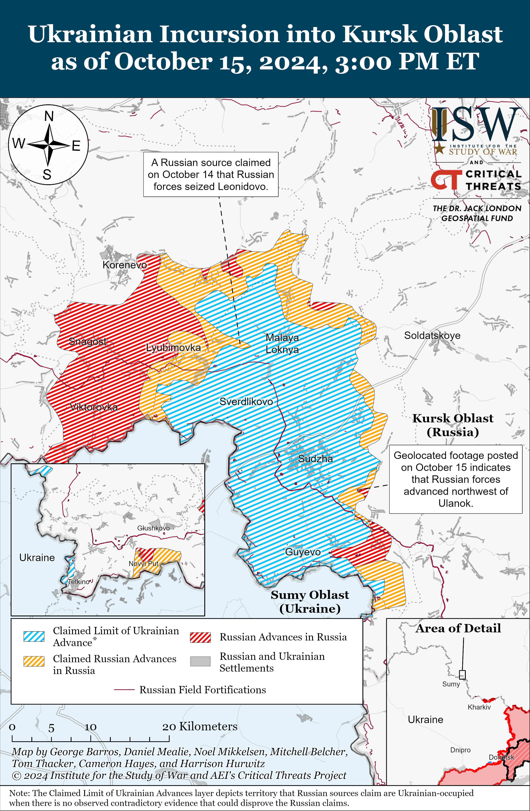
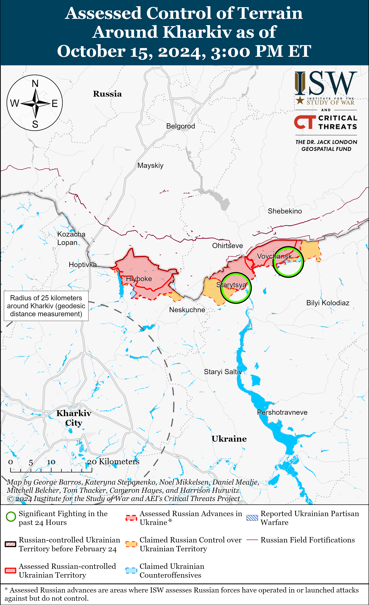
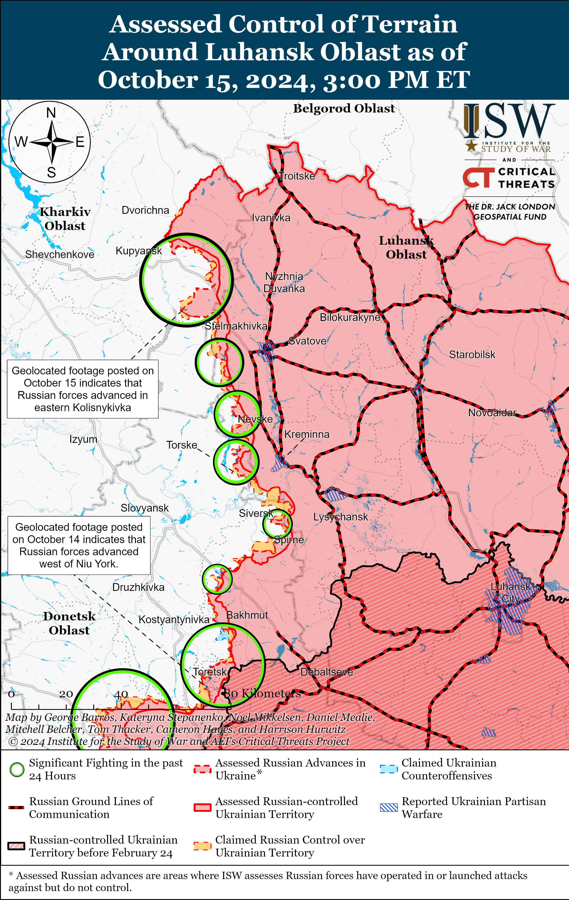
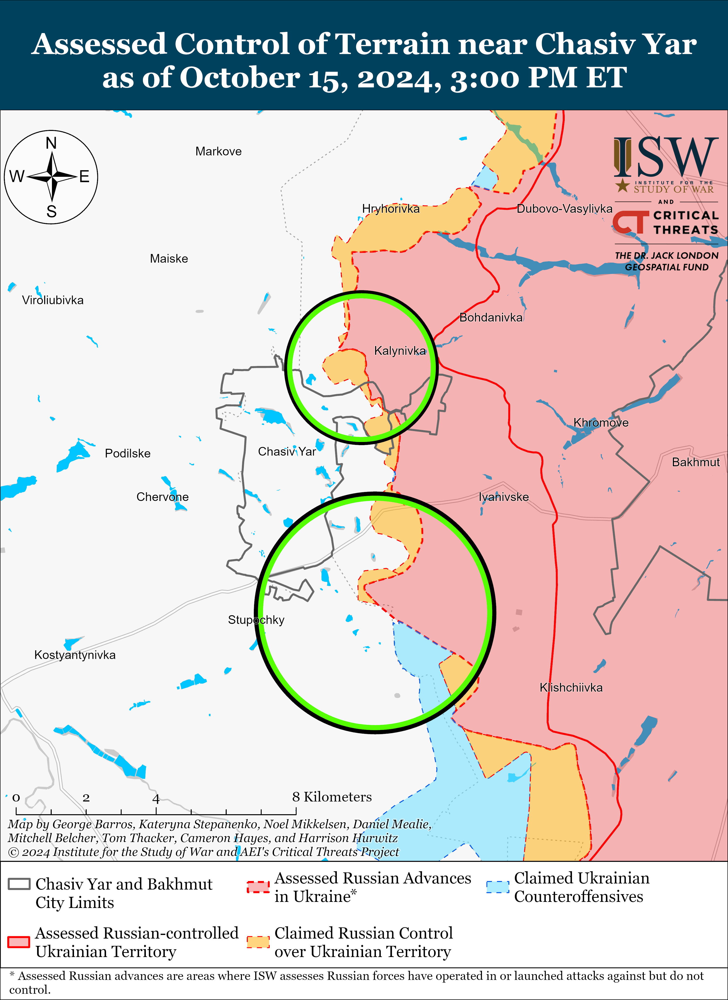
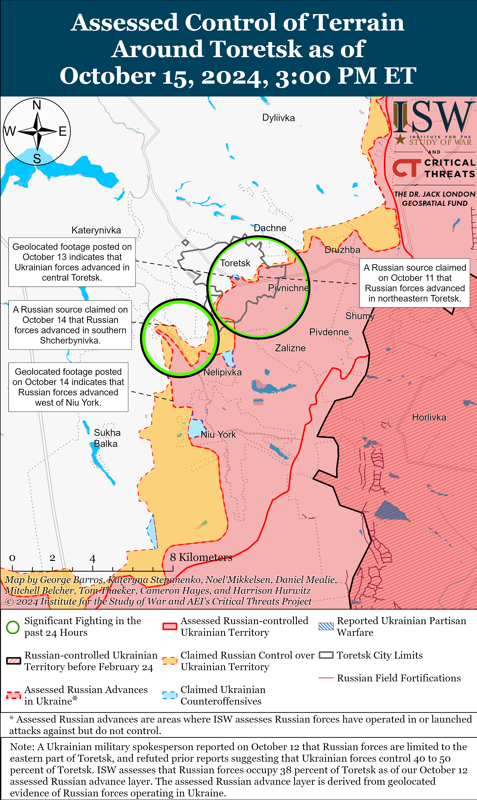
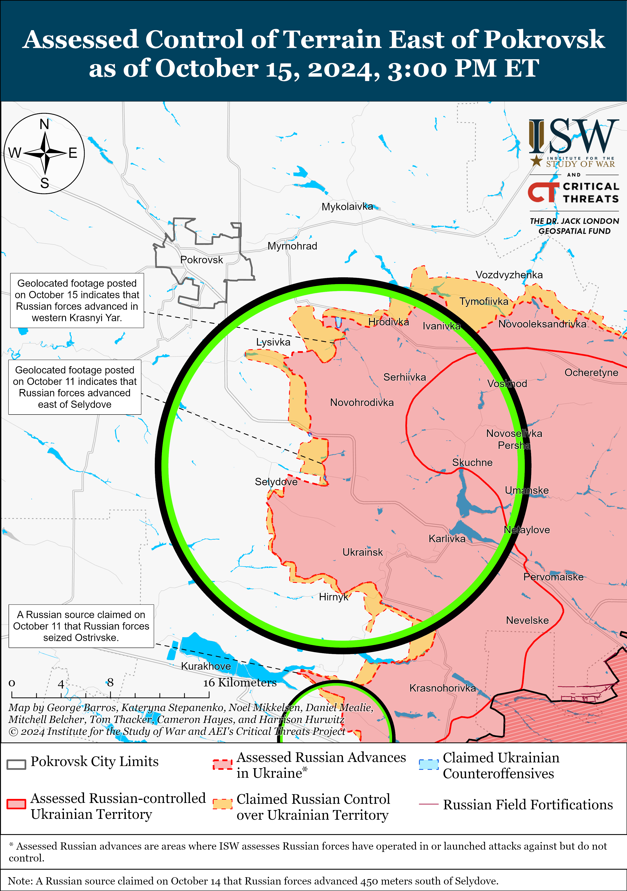
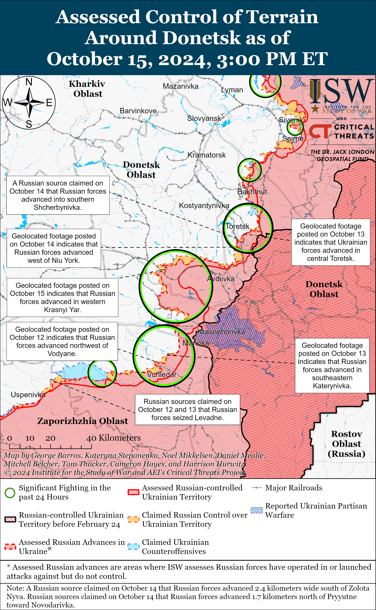
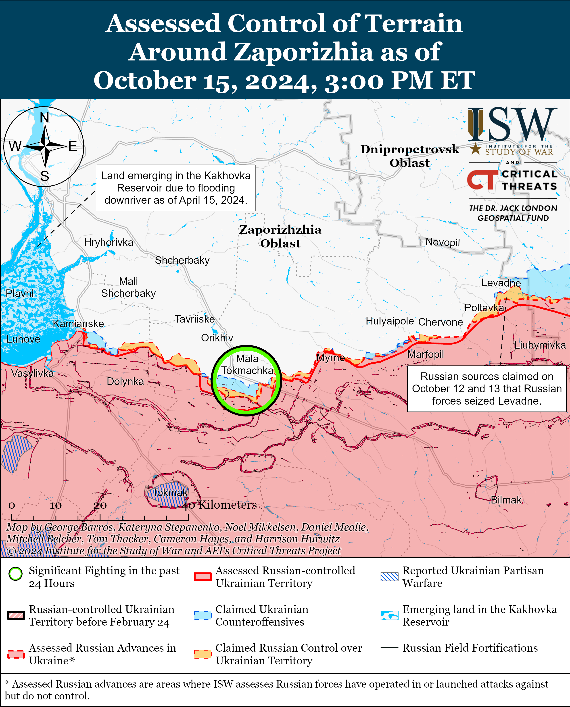
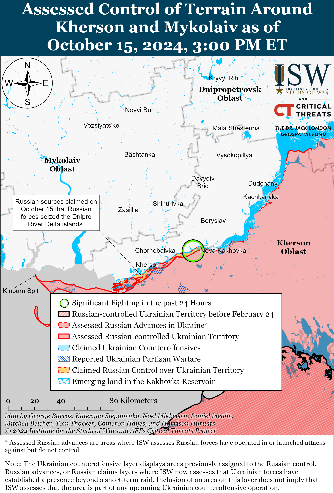

# Russian Offensive Campaign Assessment, October 15, 2024

**October 15, 2024, 7:20pm ET**

**Click** [**here**](https://storymaps.arcgis.com/stories/36a7f6a6f5a9448496de641cf64bd375) **to see ISW’s interactive map of the Russian invasion of Ukraine. This map is updated daily alongside the static maps present in this report.**

**Click** [**here**](https://storymaps.arcgis.com/stories/83a2f24901c941d581c0c523ecd2619b) **to see ISW's interactive map of Ukraine's offensive in Kursk Oblast.**

**Click** [**here**](https://understandingwar.maps.arcgis.com/apps/instant/3dviewer/index.html?appid=1602762dbcde419bb957dea358449580) **to see ISW’s 3D control of terrain topographic map of Ukraine. Use of a computer (not a mobile device) is strongly recommended for using this data-heavy tool.**

**Click** [**here**](https://storymaps.arcgis.com/stories/733fe90805894bfc8562d90b106aa895) **to access ISW’s archive of interactive time-lapse maps of the Russian invasion of Ukraine. These maps complement the static control-of-terrain map that ISW produces daily by showing a dynamic frontline. ISW will update this time-lapse map archive monthly.**

**Note: The data cut-off for this product was 1:30pm ET on October 15. ISW will cover subsequent reports in the October 16 Russian Offensive Campaign Assessment.**

**The Kremlin is likely leveraging the recent June 2024 Russia-North Korea comprehensive strategic partnership agreement in part to offset Russian force generation and border security requirements—further cementing Russian President Vladimir Putin's commitment to avoiding mobilization for as long as possible.** Ukrainian outlets *Suspilne* and *Liga* reported on October 15, citing anonymous military intelligence sources, that the Russian 11th Airborne (VDV) Brigade is forming a 3,000-person “battalion” staffed by North Korean citizens (the numerical strength is far beyond a battalion’s).[[1]](#_edn957aa6050666811c32ce9a5868c96cc31) Ukrainian intelligence sources assessed that the “battalion” will likely be involved in ongoing Russian defensive operations in Kursk Oblast and reported that up to 18 North Korean soldiers have already deserted their positions in Bryansk and Kursk oblasts before the unit has been committed to combat operations.[[2]](#_edn957aa6050666811c32ce9a5868c96cc32) ISW cannot independently confirm the veracity of these reports, but Russian officials notably did not deny them on October 15. Putin submitted the text of the Russia-North Korea comprehensive strategic partnership agreement, which both countries signed in June 2024, to the Russian State Duma for ratification on October 14.[[3]](#_edn957aa6050666811c32ce9a5868c96cc33) Kremlin Spokesperson Dmitry Peskov emphasized in a comment to Kremlin newswire *TASS* that the Russia-North Korea agreement is "unambiguous" in its provision of "mutual defense and security cooperation."[[4]](#_edn957aa6050666811c32ce9a5868c96cc34) The Kremlin is likely using the "mutual defense" provision of the agreement to provide the legal justification for the deployment of North Korean soldiers to the combat zone in Russia in response to the Ukrainian incursion into Kursk Oblast. ISW has recently observed reports that a small contingent of North Korean personnel was operating near occupied Donetsk City.[[5]](#_edn957aa6050666811c32ce9a5868c96cc35)

Beyond the legal justification, however, the Kremlin's willingness to enter into a mutual defense agreement with North Korea, resulting in the reported commitment of North Korean personnel into combat operations in Russia, highlights Putin's continued reliance on pursuing alternative force generation avenues instead of committing to declaring partial or general mobilization. ISW has reported at length on Putin's continued reliance on crypto-mobilization and the formation of new volunteer formations to avoid the domestic ramifications of conducting a society-wide general mobilization or another partial mobilization wave.[[6]](#_edn957aa6050666811c32ce9a5868c96cc36) This dilemma has become particularly acute for Putin since Ukraine's August 2024 Kursk Oblast incursion, as the Russian military had to reckon with new manpower requirements introduced by the need to defend an entirely new front within Russia itself. Putin's response to the Kursk incursion has been consistent with his handling of Russian force generation throughout the war thus far, however, and he has maintained his unwillingness to counter the incursion more seriously with a wider mobilization, instead focusing on the ad hoc creation of new territorial defense units, the redeployment of existing units from Ukraine, and the use of conscripts.[[7]](#_edn957aa6050666811c32ce9a5868c96cc37) The use of North Korean personnel under the mutual defense clause of the Russia-North Korea agreement is part of the same wider effort. Putin appears more willing to absorb North Korean personnel into the Russian military and resort to other irregular force generation efforts than to call for a wider mobilization to actually address the combat situation in the theater of operations.

**The Kremlin has elected to address the recent controversy regarding its reliance on conscripts to repel Ukraine’s incursion into Kursk Oblast by offering financial incentives to any personnel involved in defending the state border.** The Russian Ministry of Defense (MoD) proposed on October 14 expanding the criteria for Russian combat veteran status to include soldiers who have defended against an "invasion into Russia" or "armed provocations on the state border," which likely includes conscripts and local territorial defense elements involved in facing Ukraine’s incursion into Kursk Oblast.[[8]](#_edn957aa6050666811c32ce9a5868c96cc38) Legal Russian combat veteran status would entitle these personnel to veterans' pensions and other social benefits, and Kremlin newswire *TASS* noted that the Russian federal expenditures to expand the list of military personnel classified as combat veterans will exceed 3.4 billion rubles (about $35 million) in 2025-2027.[[9]](#_edn957aa6050666811c32ce9a5868c96cc39) Current Russian federal law stipulates that Russian conscripts cannot participate in combat operations, and the Russian MoD has instead relied on conscripts to conduct border security functions along the border with Ukraine to free up combat power to deploy elsewhere in the theater.[[10]](#_edn957aa6050666811c32ce9a5868c96cc310) Ukraine’s incursion into Kursk Oblast exposed the vulnerability of Russia's border security and conscription policies, as Russian conscripts actively participated in combat operations in the region in response to the incursion.[[11]](#_edn957aa6050666811c32ce9a5868c96cc311) The Russian MoD’s vague proposal to extend veteran statuses to personnel involved in border security functions is likely another loophole that will allow the Kremlin to covertly rely on conscripts to defend the border without the need to formally amend the Russian legal restrictions on the use of conscripts in combat. The proposal also likely aims to appease conscripts and their families by providing financial compensation and incentives with the likely aim of avoiding backlash similar to the controversies the Soviet Union and later Russia faced over the use of conscripts in combat operations in Afghanistan and Chechnya.[[12]](#_edn957aa6050666811c32ce9a5868c96cc312) Putin could have chosen to amend the Russian law to formally allow conscripts to conduct combat functions but instead chose to expand the combat veteran eligibility criteria and increase spending for combat veterans.[[13]](#_edn957aa6050666811c32ce9a5868c96cc313) The provision of veteran statuses also likely aims to incentivize recruitment into newly formed territorial defense formations such as BARS-Kursk and BARS-Belgorod. Putin has been increasingly turning to issuing a wide variety of long term financial incentives to generate manpower, appease mobilized personnel and their families, and prolong his war effort in Ukraine, and Putin‘s persistent reliance on these incentives suggests that he remains concerned about the possible negative consequences on the stability of his regime if he demands involuntary sacrifices from Russian society.[[14]](#_edn957aa6050666811c32ce9a5868c96cc314)

**Russian President Vladimir Putin signed a law allowing Russian Investigative Committee Head Alexander Bastrykin to stay in his position despite reaching retirement age (again) demonstrating Putin's continued preference for keeping curated loyalists from his inner circle in positions of power.** Putin signed a law on October 14 allowing the Russian head of state (himself) to "extend the term of office of the head of the Investigative Committee who has reached the age of 70."[[15]](#_edn957aa6050666811c32ce9a5868c96cc315) Bastrykin turned 71 in August 2024 and has held his position since 2011. The previous law stated that the maximum age for Investigative Committee officials was 65 but that Putin could extend this term to 70.[[16]](#_edn957aa6050666811c32ce9a5868c96cc316) Putin has taken similar steps in recent years to raise the retirement ages of government and military officials — current Russian Security Council Deputy Chairperson and then Russian President Dmitry Medvedev lowered the age limit for civil servants from 65 to 60 in 2010, but Putin raised this to 70 in 2013 when he returned to the presidency.[[17]](#_edn957aa6050666811c32ce9a5868c96cc317) Putin also signed laws in 2021 that allowed the president to extend the term of army generals, marshals, fleet admirals, and presidential appointees.[[18]](#_edn957aa6050666811c32ce9a5868c96cc318) Putin's continuous raising of the retirement age allows him to keep those within his inner circle who are loyal to him in positions of power. Bastrykin was notably a classmate of Putin's at university.[[19]](#_edn957aa6050666811c32ce9a5868c96cc319) Bastrykin has also recently positioned himself as a prominent figure in Russia's ultranationalist community, specifically appealing to ultranationalist animus towards migrants.[[20]](#_edn957aa6050666811c32ce9a5868c96cc320) Putin has likely calculated that having a loyalist like Bastrykin rhetorically lead the ultranationalist community is beneficial for the Kremlin's recent wider efforts to appeal to and co-opt this community, and has manipulated the law accordingly.[[21]](#_edn957aa6050666811c32ce9a5868c96cc321) Putin recently promoted younger members of his inner circle, such as 52-year-old Presidential Aide Alexei Dyumin, to positions within the Kremlin, but these younger appointees have also been loyal Putin supporters for decades.[[22]](#_edn957aa6050666811c32ce9a5868c96cc322)

**Key Takeaways:**

- **The Kremlin is likely leveraging the recent June 2024 Russia-North Korea comprehensive strategic partnership agreement in part to offset Russian force generation and border security requirements—further cementing Russian President Vladimir Putin's commitment to avoiding mobilization for as long as possible.**
- **The Kremlin has elected to address the recent controversy regarding its reliance on conscripts to repel Ukraine’s incursion into Kursk Oblast by offering financial incentives to any personnel involved in defending the state border.**
- **Russian President Vladimir Putin signed a law allowing Russian Investigative Committee Head Alexander Bastrykin to stay in his position despite reaching retirement age (again) demonstrating Putin's continued preference for keeping curated loyalists from his inner circle in positions of power.**
- **Russian forces recently advanced in Kursk Oblast and near Kupyansk, Toretsk, and Pokrovsk.**

**A former Russian Storm-Z instructor and milblogger heavily criticized Russian forces' reliance on the partially-encrypted communications platform Discord following Russia's recent ban of the platform.******

***We do not report in detail on Russian war crimes because these activities are well-covered in Western media and do not directly affect the military operations we are assessing and forecasting. We will continue to evaluate and report on the effects of these criminal activities on the Ukrainian military and the Ukrainian population and specifically on combat in Ukrainian urban areas. We utterly condemn Russian violations of the laws of armed conflict and the Geneva Conventions and crimes against humanity even though we do not describe them in these reports.***

- Ukrainian Operations in the Russian Federation
- Russian Main Effort – Eastern Ukraine (comprised of three subordinate main efforts)
- Russian Subordinate Main Effort #1 – Push Ukrainian forces back from the international border with Belgorod Oblast and approach to within tube artillery range of Kharkiv City
- Russian Subordinate Main Effort #2 – Capture the remainder of Luhansk Oblast and push westward into eastern Kharkiv Oblast and encircle northern Donetsk Oblast
- Russian Subordinate Main Effort #3 – Capture the entirety of Donetsk Oblast
- Russian Supporting Effort – Southern Axis
- Russian Air, Missile, and Drone Campaign
- Russian Mobilization and Force Generation Efforts
- Russian Technological Adaptations
- Activities in Russian-occupied areas
- Ukrainian Defense Industrial Base Efforts
- Russian Information Operations and Narratives
- Significant Activity in Belarus

**Ukrainian Operations in the Russian Federation**

Russian forces recently advanced on the eastern edge of the Ukrainian salient in Kursk Oblast amid continued fighting along the entire salient on October 15. Geolocated footage published on October 15 shows Russian forces advancing to a windbreak northwest of Ulanok (southeast of Sudzha) during a roughly platoon-sized mechanized assault.[[23]](#_edn957aa6050666811c32ce9a5868c96cc323) A Russian milblogger claimed that elements of the 40th and 810th naval infantry brigades (Pacific and Black Sea fleets, respectively) and 30th Motorized Rifle Regiment (72nd Motorized Rifle Division, 44th Army Corps [AC], Leningrad Military District [LMD]) are advancing along the Borki-Ozerki line (just south of Ulanok) in an attempt to outflank Ukrainian forces in the area southeast of Sudzha.[[24]](#_edn957aa6050666811c32ce9a5868c96cc324) ISW most recently observed elements of the 40th Naval Infantry Brigade operating near Zolota Nyva (Donetsk-Zaporizhia Oblast border area) as of October 11, suggesting that the Russian military command may have recently redeployed some portion of the 40th Brigade to Kursk Oblast.[[25]](#_edn957aa6050666811c32ce9a5868c96cc325) Russian milbloggers claimed that Russian forces seized Leonidovo and advanced in fields southeast of Olgovka (both southeast of Korenevo).[[26]](#_edn957aa6050666811c32ce9a5868c96cc326) ISW has not yet observed confirmation of these claims, however. Chechen Akhmat Spetsnaz Commander Apty Alaudinov claimed on October 15 that Russian forces’ main goal in Kursk Oblast is to "lure" Ukrainian forces into an encirclement and "destroy" encircled Ukrainian forces.[[27]](#_edn957aa6050666811c32ce9a5868c96cc327) Russian sources reported continued fighting throughout the Kursk Oblast salient southeast of Korenevo near Tolsty Lug, Zeleny Shlyakh, Nizhny Klin, Lyubimovka, and Novoivanovka; east of Sudzha near Russkaya Konopelka; and southeast of Sudzha near Borki.[[28]](#_edn957aa6050666811c32ce9a5868c96cc328) Elements of the Russian 155th Naval Infantry Brigade (Pacific Fleet) and 51st Airborne (VDV) Regiment (106th VDV Division) reportedly continue operating in Kursk Oblast.[[29]](#_edn957aa6050666811c32ce9a5868c96cc329)

Limited positional engagements continued west of the Kursk Oblast salient in Glushkovsky Raion on October 15, but there were no confirmed changes to the frontline. Russian sources reported continued fighting near Novy Put (southwest of Glushkovo).[[30]](#_edn957aa6050666811c32ce9a5868c96cc330) Elements of the Russian 22nd Spetsnaz Brigade (Russian General Staff Main Directorate [GRU]) are reportedly operating in Glushkovsky Raion.[[31]](#_edn957aa6050666811c32ce9a5868c96cc331)

Russian sources complained about the poor organization of Russian anti-tank defenses in Kursk Oblast, claiming that the placement of "dragon's teeth" roadblocks has led to accidental civilian harm and deaths of servicemembers. A Russian insider source claimed that a Russian first responder who was driving an evacuation car down the road in Rylsky Raion, Kursk Oblast, crashed into the dragon's teeth in the dark, causing severe damage to the vehicle.[[32]](#_edn957aa6050666811c32ce9a5868c96cc332) Russian milbloggers claimed that "dozens" of Russian service personnel and civilians have died in accidents related to the dragon's teeth in Kursk Oblast, suggesting that there is exceedingly poor communication between Russian field commanders, local law enforcement, and engineering troops regarding the construction of such fortifications.[[33]](#_edn957aa6050666811c32ce9a5868c96cc333)

**Russian Main Effort – Eastern Ukraine**

**Russian Subordinate Main Effort #1 – Kharkiv Oblast** **(Russian objective: Push Ukrainian forces back from the international border with Belgorod Oblast and approach to within tube artillery range of Kharkiv City)**

Geolocated footage published on October 14 shows Ukrainian drones repelling a platoon-sized Russian attack conducted by elements of the 155th Naval Infantry Brigade (Pacific Fleet) near the Belgorod-Kharkiv Oblast border in the settlement of Zhuravleevka (directly on the international border north of Kharkiv City and about 10km northwest of Hlyboke).[[34]](#_edn957aa6050666811c32ce9a5868c96cc334) Russian forces likely launched the mechanized assault in an attempt to support dwindling offensive operations in the Hlyboke-Lyptsi area north of Kharkiv City but appear to have been unsuccessful.

Russian forces continued limited offensive operations in northern Kharkiv Oblast on October 15 but did not make any confirmed advances. The Ukrainian General Staff reported that Russian forces conducted ground attacks northeast of Kharkiv City near Vovchansk, Tykhe (east of Vovchansk), and Starytsya (southwest of Vovchansk) on October 14 and 15.[[35]](#_edn957aa6050666811c32ce9a5868c96cc335) A Russian milblogger claimed that Russian reconnaissance and special operations groups are active in and near Vovchansk and that Russian forces are intensely firing on the road between Vovchansk and Lyptsi in order to inhibit Ukrainian communications and logistics.[[36]](#_edn957aa6050666811c32ce9a5868c96cc336)

****

**Russian Subordinate Main Effort #2 – Luhansk Oblast (Russian objective: Capture the remainder of Luhansk Oblast and push westward into eastern Kharkiv Oblast and northern Donetsk Oblast)**

Russian forces recently advanced southeast of Kupyansk amid continued offensive operations along the Kupyansk-Svatove-Kreminna line on October 14 and 15. Geolocated footage published on October 15 indicates that Russian forces recently advanced into southeastern Kolisnykivka (southeast of Kupyansk).[[37]](#_edn957aa6050666811c32ce9a5868c96cc337) Russian milbloggers claimed that Russian forces interdicted the Kupyansk-Borova highway near Kruhlyakivka (northwest of Svatove) and advanced one kilometer from the Zhuravka Gully towards Makiivka (northwest of Kreminna) and 1.4 kilometers towards Terny (west of Kreminna).[[38]](#_edn957aa6050666811c32ce9a5868c96cc338) ISW has not observed visual confirmation of these claims, however. Kharkiv Oblast Military Administration Head Oleh Synehubov announced on October 15 mandatory evacuations for all Ukrainian citizens living in Kupyansk, Kindrashivka, Kurylivka, and Borova hromadas (including Kupyansk City) due to the ”worsening military situation” in the area, which has made it challenging to provide residents with electricity and humanitarian aid.[[39]](#_edn957aa6050666811c32ce9a5868c96cc339) Russian forces continued attacks northeast of Kupyansk near Synkivka, Kucherivka, Pershotravneve, and Holubivka; east of Kupyansk near Petropavlivka; southeast of Kupyansk near Lozova, Novoosynove, Pishchane, Hlushkivka, Kruhlyakivka, Kolisnykivka, and Stepova Novoselivka and towards Hrushivka; west of Svatove near Vyshneve; southwest of Svatove near Novoyehorivka, Makiivka, Novolyubivka, Hrekivka, Yampolivka, and Nevske; and west of Kreminna near Torske, Terny, and Zarichne on October 14 and 15.[[40]](#_edn957aa6050666811c32ce9a5868c96cc340)

  
 **Russian Subordinate Main Effort #3 – Donetsk Oblast (Russian objective: Capture the entirety of Donetsk Oblast, the claimed territory of Russia’s proxies in Donbas)**

Russian forces continued offensive operations east of Siversk near Verkhnokamyanske on October 15, but there were no confirmed changes to the frontline.[[41]](#_edn957aa6050666811c32ce9a5868c96cc341) Elements of the Russian “Siberia” Cossack Brigade are reportedly operating in the Soledar-Bakhmut direction, and reconnaissance elements of the Russian 3rd Combined Arms Army [CAA] formerly 2nd Luhansk People's Republic Army Corps [AC]) are reportedly operating in the direction of Riznykivka (west of Siversk) as of October 15.[[42]](#_edn957aa6050666811c32ce9a5868c96cc342)

Russian forces continued offensive operations near Chasiv Yar on October 15, but there were no confirmed changes to the frontline. Russian forces conducted offensive operations northeast of Chasiv Yar near Orikhovo-Vasylivka; north of Chasiv Yar near Kalynivka; south of Chasiv Yar near Predtechyne and Dyliivka on October 14 and 15.[[43]](#_edn957aa6050666811c32ce9a5868c96cc343) Russian milbloggers claimed that Russian forces advanced in western Kalynivka and up to 900 meters deep across the Siverskyi-Donets Donbas Canal west of Ivanivske (east of Chasiv Yar) along the T0504 Bakhmut-Kostyantynivka highway.[[44]](#_edn957aa6050666811c32ce9a5868c96cc344) Elements of Chechen "Akhmat" Spetsnaz are reportedly operating west of Ivanivske, and elements of the 98th Airborne (VDV) Division are reportedly operating near Chasiv Yar.[[45]](#_edn957aa6050666811c32ce9a5868c96cc345) Ukrainian Luhansk Group of Forces Spokesperson Major Anastasiya Bobovnikova reported on October 15 that Russian forces are trying to take advantage of the current dry weather in Donetsk Oblast and are intensifying artillery and first-person view (FPV) drone strikes in order to advance before the onset of winter weather.[[46]](#_edn957aa6050666811c32ce9a5868c96cc346) Bobovnikova stated that Russian forces have reduced the tempo of their assaults near Chasiv Yar and that the most intense Russian assaults are occurring near Toretsk.

Russian forces recently advanced near Toretsk amid continued offensive operations in the area on October 15. Geolocated footage published on October 14 indicates that Russian forces recently advanced west of Niu York (south of Toretsk).[[47]](#_edn957aa6050666811c32ce9a5868c96cc347) Russian milbloggers claimed that Russian forces also advanced within Toretsk, but ISW has not observed confirmation of this claim.[[48]](#_edn957aa6050666811c32ce9a5868c96cc348)  Donetsk People's Republic (DNR) Head Denis Pushilin claimed that Russian forces have seized over 2/3 of Toretsk, but ISW has only observed visual confirmation or Russian claims that suggest that Russian forces have seized 42 percent of the settlement.[[49]](#_edn957aa6050666811c32ce9a5868c96cc349) Russian forces conducted offensive operations near Toretsk; northeast of Toretsk near Dachne; and west of Toretsk near Shcherbynivka on October 14 and 15.[[50]](#_edn957aa6050666811c32ce9a5868c96cc350) A Russian milblogger claimed that Ukrainian defensive positions in high-rise buildings in Toretsk are complicating Russian advances.[[51]](#_edn957aa6050666811c32ce9a5868c96cc351)

****

Russian forces recently advanced southeast of Pokrovsk amid continued offensive operations in the area on October 14 and 15. Geolocated footage published on October 15 shows that Russian forces recently advanced in western Krasnyi Yar (southeast of Pokrovsk).[[52]](#_edn957aa6050666811c32ce9a5868c96cc352) Russian milbloggers claimed that Russian forces operating southeast of Pokrovsk entered the Selydove Reinforced Concrete Plant on Selydove’s easternmost outskirts, and advanced to the outskirts of Lysivka and by 800 meters near Tsukuryne.[[53]](#_edn957aa6050666811c32ce9a5868c96cc353) ISW has not observed visual evidence of these claims. Russian forces continued offensive operations east of Pokrovsk near Myrolyubivka, Myrnohrad, Promin, and Hrodivka; south of Pokrovsk in the direction of Novotroitske; and southeast of Pokrovsk near Krasnyi Yar, Selydove, Krutyi Yar, Lysivka, Tsukuryne, Mykolaivka, Sukhyi Yar, Kreminna Balka, Novodmytrivka, Novoselydivka, Izmailivka, Hirnyk, Zoryane, Kurakhivka,  and Novopavlivka on October 14 and 15.[[54]](#_edn957aa6050666811c32ce9a5868c96cc354) Reconnaissance elements of the Russian 238th Artillery Brigade (8th CAA, Southern Military District [SMD]) are operating in the direction of Kurakhivka.[[55]](#_edn957aa6050666811c32ce9a5868c96cc355)

Russian forces conducted assaults east of Kurakhove near Maksymilyanivka and Heorhiivka on October 14 and 15 but did not make confirmed advances.[[56]](#_edn957aa6050666811c32ce9a5868c96cc356)

****

Russian forces attacked southwest of Donetsk City near Vuhledar on October 14 and 15 but did not make confirmed territorial gains. Russian forces continued offensive operations northeast of Vuhledar near Kostyantynivka, Antonivka, Katerynivka, and Vodyane; and northwest of Vuhledar near Bohoyavlenka.[[57]](#_edn957aa6050666811c32ce9a5868c96cc357) The Russian ”Siberia” crew of the 36th Motorized Rifle Brigade (29th CAA, Eastern Military District [EMD]) is reportedly operating near Vuhledar and in the direction of Bohoyavlenka; and drone operators of the Russian 14th Spetsnaz Brigade (Russian General Staff Main Directorate [GRU]) are operating in the Bohoyavlenka direction alongside artillery elements of the 200th Artillery Brigade (29th CAA, EMD) and elements of the 14th Engineering Brigade.[[58]](#_edn957aa6050666811c32ce9a5868c96cc358)

Russian sources claimed that Russian forces advanced in the Donetsk-Zaporizhia Oblast border area on October 14 and 15, but ISW has not observed visual evidence confirming these claims. Russian milbloggers claimed that Russian forces advanced in the fields north of Novodonetske (southeast of Velyka Novosilka) and north of Levadne (southwest of Velyka Novosilka).[[59]](#_edn957aa6050666811c32ce9a5868c96cc359) Russian forces reportedly attacked towards Rozdolne (northeast of Velyka Novosilka).[[60]](#_edn957aa6050666811c32ce9a5868c96cc360)****

**Russian Supporting Effort – Southern Axis (Russian objective: Maintain frontline positions and secure rear areas against Ukrainian strikes)**

Russian forces conducted ground attacks in western Zaporizhia Oblast near Mala Tokmachka (northeast of Robotyne) and Novodanylivka (north of Robotyne) on October 14 and 15.[[61]](#_edn957aa6050666811c32ce9a5868c96cc361) Elements of the Russian 4th Military Base (58th Combined Arms Army [CAA], Southern Military District [SMD]) are reportedly operating near Kamyanske (northwest of Robotyne), and elements of the 1141st Artillery Regiment (7th Airborne [VDV] Division) are reportedly operating near Verbove (east of Robotyne).[[62]](#_edn957aa6050666811c32ce9a5868c96cc362) Ukrainian Khortytsia Group of Forces Spokesperson Colonel Vladyslav Voloshyn reported on October 15 that Russian forces are conducting regular missile and drone strikes, counterbattery fire, and offensive actions in southern Ukraine but are not accumulating forces for large-scale offensive operations in the area.[[63]](#_edn957aa6050666811c32ce9a5868c96cc363) Voloshyn stated that Russian forces are most active in southern Ukraine in the area between Velyka Novosilka and  Pryyutne (southwest of Velyka Novosilka) and near Orikhiv (north of Robotyne) and Hulyaipole (northwest of Robotyne). Voloshyn stated that Russian forces are transferring personnel to forward positions and preparing for assaults near Robotyne but are not redeploying units from other sectors of the front to this area.

Russian forces reportedly recently advanced on the islands in the Dnipro River Delta, but there were no confirmed changes to the frontline in the Kherson direction on October 15. The Ukrainian General Staff reported on October 14 and 15 that Russian forces conducted assaults in the Dnipro direction, likely referring to left (east) bank Kherson Oblast and the islands in the Dnipro River Delta.[[64]](#_edn957aa6050666811c32ce9a5868c96cc364) Russian sources, including Kherson Oblast occupation senator Konstantin Basyuk, claimed that Russian forces had pushed Ukrainian forces out of the islands in the Dnipro River Delta. ISW has not observed confirmation that Russian forces have advanced on Velykyi Potemkin and Kruhlyk islands, however.[[65]](#_edn957aa6050666811c32ce9a5868c96cc365) Voloshyn stated that Russian forces are trying to take control of the islands at the mouth of the Dnipro River, are transferring personnel to the area, and may intensify assault operations soon.[[66]](#_edn957aa6050666811c32ce9a5868c96cc366) Elements of the Russian BARS-33 Detachment (Russian Combat Army Reserve) are reportedly operating in the Kherson direction, and elements of the 80th Arctic Motorized Rifle Brigade (14th Army Corps [AC], Leningrad Military District [LMD] are reportedly operating on the islands of the Dnipro River Delta.[[67]](#_edn957aa6050666811c32ce9a5868c96cc367)

Ukrainian Navy Spokesperson Captain Third Rank Dmytro Pletenchuk reported on October 14 that the Dniprovska Gulf (Dnipro-Buh estuary) is likely heavily mined due to a significant number of mines that likely washed into the area following the Russian destruction of the Kakhovka Hydroelectric Power Plant (KHPP) in June 2023.[[68]](#_edn957aa6050666811c32ce9a5868c96cc368) Pletenchuk noted that the gulf remains a combat zone and that both Ukrainian and Russian forces have fire control over the area, so Ukrainian authorities cannot investigate the extent of the mining. Pletenchuk stated that Russian forces are attempting to transfer small boats to the Dniprovska Gulf, noting that these vessels must be small enough for Russian forces to easily transfer overland.

**Russian Air, Missile, and Drone Campaign (Russian Objective: Target Ukrainian military and civilian infrastructure in the rear and on the frontline)**

Russian forces conducted a series of missile and drone strikes against Ukraine overnight on October 14 to 15. The Ukrainian Air Force reported that Russian forces launched seven S-300/S-400 air defense missiles at Ukraine from occupied Crimea; two Kh-59 guided aerial missiles at Chernihiv and Sumy oblasts from over Kursk Oblast; and 17 unspecified strike drones (likely Shahed-136/131 drones) from Kursk Oblast and Primorsko-Akhtarsk, Krasnodar Krai.[[69]](#_edn957aa6050666811c32ce9a5868c96cc369) The Ukrainian Air Force reported that Ukrainian air defenses downed 12 Russian drones over Mykolaiv, Kyiv, Odesa, Poltava, Chernihiv, Kirovohrad, and Cherkasy oblasts, and that Ukrainian electronic warfare (EW) countermeasures caused four drones to become lost in Ukraine.[[70]](#_edn957aa6050666811c32ce9a5868c96cc370) Mykolaiv Oblast Head Vitaliy Kim stated that Russian forces struck infrastructure, retail buildings, and residential areas in Mykolaiv City with S-300 missiles.[[71]](#_edn957aa6050666811c32ce9a5868c96cc371) A Russian milblogger claimed that Russian drones struck a Ukrainian airfield in Oleksandriya, Kirovohrad Oblast.[[72]](#_edn957aa6050666811c32ce9a5868c96cc372)

A Ukrainian soldier who operates in a mobile air defense unit stated on October 15 that Russian Shahed drones were previously very slow, difficult to maneuver, and could only fly at low altitudes but that Russian forces have since upgraded the components in the Shahed drones to fly faster and higher.[[73]](#_edn957aa6050666811c32ce9a5868c96cc373) The Ukrainian soldier noted that Ukrainian mobile fire groups have also improved their equipment and tactics in order to continue shooting down Shahed drones.

**Russian Mobilization and Force Generation Efforts (Russian objective: Expand combat power without conducting general mobilization)**

Russian authorities continue to increase one-time payments in an effort to recruit contract soldiers and avoid further mobilization but still struggle to attract new personnel. Krasnodar Krai Head Veniamin Kondratyev signed a decree on October 15 increasing the regional payment from 1.2 million rubles (about $12,370) to 1.5 million rubles (about $15,463), and Russian news outlet *Kommersant* noted that the total sum of federal and regional one-time payments to new contract soldiers in Krasnodar Krai is 2.3 million rubles (about $23,710).[[74]](#_edn957aa6050666811c32ce9a5868c96cc374) Ukrainian military observer Petro Chernyk stated on October 15 that Russia is only recruiting about 36,000-38,000 new personnel per month but suffered about 1,200 losses per day on average in September 2024 (totaling about 36,000 casualties), indicating that current Russian recruitment efforts are likely largely meant to directly replace battlefield casualties rather than staffing operational or strategic reserve formations.[[75]](#_edn957aa6050666811c32ce9a5868c96cc375)

A former Russian Storm-Z instructor and milblogger heavily criticized Russian forces' reliance on the partially-encrypted communications platform Discord following Russia's recent ban of the platform.[[76]](#_edn957aa6050666811c32ce9a5868c96cc376) The milblogger claimed that Discord was one of the most widespread communications systems that Russian forces used, even at the brigade and regimental command levels, and that Russian forces rely on Discord and Starlink (allegedly the only way Russian forces can access Discord) rather than the officially-distributed "Glaz/Groza" software package for horizontal communications. The milblogger cited several other milbloggers who previously raised concern with Discord – including Junior Sergeant Dmitry Lysakovsky alias "Goodwin," a Russian drone operator whose death in a Russian infantry assault sparked outrage over the Russian Ministry of Defense (MoD)'s misuse of technical specialists – but noted that people have advocated to ban Discord but failed to propose any meaningful alternatives for Russian frontline communications. Russian federal censor Roskomnadzor banned Discord in Russia on October 8 for allegedly violating Russian censorship laws, likely degrading some frontline Russian forces' *ad hoc* communications systems in the near term.[[77]](#_edn957aa6050666811c32ce9a5868c96cc377)

**Russian Technological Adaptations** **(Russian objective: Introduce technological innovations to optimize systems for use in Ukraine)**

Russian milbloggers posted footage on October 15 reportedly of new munitions for Russian TOS thermobaric artillery systems and claimed that these munitions have significantly increased ranges from the prior versions, noting that Russian forces have already fielded these rockets in the Kupyansk direction.[[78]](#_edn957aa6050666811c32ce9a5868c96cc378)  
   
 **Ukrainian Defense Industrial Efforts** **(Ukrainian objective: Develop its defense industrial base to become more self-sufficient in cooperation with US, European, and international partners)**

*ISW is suspending publishing coverage of Ukrainian defense industrial efforts until further notice.*

**Activities in Russian-occupied areas (Russian objective: Consolidate administrative control of annexed areas; forcibly integrate Ukrainian citizens into Russian sociocultural, economic, military, and governance systems)**

*ISW is not publishing reporting on activities in Russian-occupied areas today.*

**Russian Information Operations and Narratives**

Russian officials spread false narratives about Ukraine's alleged mistreatment of detainees, likely in order to deflect from Russia's own mistreatment of those held in Russian captivity. Russian and occupation officials, including Russian propagandist and *RT* editor-in-chief Margarita Simonyan, falsely claimed that a Ukrainian woman died in a pretrial detention center after Ukrainian authorities detained her for raising a Russian flag at a monument in Odesa City.[[79]](#_edn957aa6050666811c32ce9a5868c96cc379) The Odesa Oblast National Police reportedly told Russian independent outlet *Mozhem Obyasnit* (We Can Explain) that the woman is alive and under house arrest.[[80]](#_edn957aa6050666811c32ce9a5868c96cc380) These false claims notably follow Ukrainian officials' October 11 confirmation that Ukrainian journalist Viktoriya Roshchyna recently died in Russian captivity.[[81]](#_edn957aa6050666811c32ce9a5868c96cc381)

Russian media and milbloggers widely amplified statements by Polish officials about Ukrainian refugees' role in Polish society on October 15, likely in an attempt to drive a wedge between Ukraine and its European partners, particularly Poland.[[82]](#_edn957aa6050666811c32ce9a5868c96cc382)

Russian milbloggers attempted to frame Ukraine's defense against Russia's full-scale invasion as Ukrainian attempts to gain control over Russian territory, likely as part of efforts to deflect attention from Russia's own territorial ambitions in Ukraine and discredit Ukraine's incursion into Kursk Oblast. Russian milbloggers claimed that the Ukrainian military is spreading narratives among military personnel about Ukraine's alleged historical territorial claims deep into eastern Russia in order to "justify" Ukraine's Kursk Oblast incursion.[[83]](#_edn957aa6050666811c32ce9a5868c96cc383)

**Significant activity in Belarus** **(Russian efforts to increase its military presence in Belarus and further integrate Belarus into Russian-favorable frameworks and Wagner Group activity in Belarus)**

A delegation from the People's Republic of China (PRC) Central Military Commission's General Department of Logistics met with Belarusian Assistant to the Defense Minister for Military Economy and Finance and Head of the Belarusian Ministry of Defense's (MoD) Main Financial and Economic Department Igor Mozhilovsky on October 15.[[84]](#_edn957aa6050666811c32ce9a5868c96cc384) The parties reportedly discussed financial support for the Belarusian and PRC militaries and new, unspecified areas of cooperation.[[85]](#_edn957aa6050666811c32ce9a5868c96cc385) Russian Defense Minister Andrei Belousov met with PRC Defense Minister Dong Jun in Beijing on October 14 and discussed Russian-PRC military cooperation.[[86]](#_edn957aa6050666811c32ce9a5868c96cc386)

**Note: ISW does not receive any classified material from any source, uses only publicly available information, and draws extensively on Russian, Ukrainian, and Western reporting and social media as well as commercially available satellite imagery and other geospatial data as the basis for these reports. References to all sources used are provided in the endnotes of each update.**

[[1]](#_edn957aa6050666811c32ce9a5868c96cc3ref1) <https://news.liga> dot net/ua/politics/news/rosiia-formuie-batalion-z-pivnichnokoreiskykh-hromadian-na-bazi-buriatskoi-bryhady-dzherelo; <https://suspilne> dot media/858415-rf-formue-osoblivij-buratskij-bataljon-ukomplektovanij-gromadanami-kndr-dzerela-v-rozvidci/

[[2]](#_edn957aa6050666811c32ce9a5868c96cc3ref2) https://suspilne dot media/858415-rf-formue-osoblivij-buratskij-bataljon-ukomplektovanij-gromadanami-kndr-dzerela-v-rozvidci/ ; [https://news](https://news/) dot liga.net/ua/politics/news/rosiia-formuie-batalion-z-pivnichnokoreiskykh-hromadian-na-bazi-buriatskoi-bryhady-dzherelo; [https://mil.in](https://mil.in/) dot ua/uk/news/rosiya-formuye-bataljon-iz-pivnichnokorejskyh-gromadyan-liga/#google\_vignette ; https://suspilne dot media/858583-vijskovi-kndr-vze-tikaut-z-pozicij-na-kordoni-iz-branskou-ta-kurskou-oblastami-dzerela/; [https://www.pravda.com](https://www.pravda.com/) dot ua/rus/news/2024/10/15/7479792/; [https://suspilne](https://suspilne/) dot media/858021-vibuhi-v-mikolaevi-ustanovi-v-ukraini-masovo-otrimali-listi-pro-minuvanna-965-den-vijni-onlajn/?anchor=live\_1728997194&utm\_source=copylink&utm\_medium=ps

[[3]](#_edn957aa6050666811c32ce9a5868c96cc3ref3) [https://www.interfax](https://www.interfax/) dot ru/russia/986705; [https://sozd.duma.gov](https://sozd.duma.gov/) dot ru/bill/740196-8; <https://t.me/tass_agency/279291;> [https://meduza](https://meduza/) dot io/news/2024/10/14/putin-vnes-v-gosdumu-proekt-zakona-o-ratifikatsii-dogovora-o-partnerstve-s-kndr-on-podrazumevaet-sozdanie-voennogo-soyuza; <https://t.me/sotaproject/88507>; https://t.me/astrapress/66345

[[4]](#_edn957aa6050666811c32ce9a5868c96cc3ref4) https://t.me/tass\_agency/279416

[[5]](#_edn957aa6050666811c32ce9a5868c96cc3ref5) <https://isw.pub/UkrWar100924>; https://isw.pub/UkrWar100924

[[6]](#_edn957aa6050666811c32ce9a5868c96cc3ref6) <https://isw.pub/UkrWar082924>; <https://www.understandingwar.org/backgrounder/russian-offensive-campaign-assessment-august-21-2024-0>; https://www.understandingwar.org/backgrounder/russian-offensive-campaign-assessment-february-26-2023; https://www.understandingwar.org/backgrounder/russian-offensive-campaign-assessment-march-12-2023; https://www.understandingwar.org/backgrounder/russian-offensive-campaign-assessment-august-10-2024

[[7]](#_edn957aa6050666811c32ce9a5868c96cc3ref7) https://isw.pub/UkrWar082924

[[8]](#_edn957aa6050666811c32ce9a5868c96cc3ref8) https://t.me/tass\_agency/279286; https://tass dot ru/armiya-i-opk/22120167

[[9]](#_edn957aa6050666811c32ce9a5868c96cc3ref9) https://tass dot ru/armiya-i-opk/22120167

[[10]](#_edn957aa6050666811c32ce9a5868c96cc3ref10) <http://www.kremlin> dot ru/acts/bank/8002; <https://base.garant> dot ru/180912/; https://www.understandingwar.org/backgrounder/russian-offensive-campaign-assessment-july-15-2024 ; https://www.understandingwar.org/backgrounder/russian-offensive-campaign-assessment-july-7-2024 ; https://www.understandingwar.org/backgrounder/russian-offensive-campaign-assessment-june-24-2024 ; https://www.understandingwar.org/backgrounder/russian-offensive-campaign-assessment-april-1-2024 ; <https://understandingwar.org/backgrounder/russian-offensive-campaign-assessment-march-29-2024>; https://understandingwar.org/backgrounder/russian-offensive-campaign-assessment-august-8-2024

[[11]](#_edn957aa6050666811c32ce9a5868c96cc3ref11) <https://www.understandingwar.org/backgrounder/russian-offensive-campaign-assessment-august-10-2024>; <https://www.understandingwar.org/backgrounder/russian-offensive-campaign-assessment-august-19-2024>; <https://www.understandingwar.org/backgrounder/russian-offensive-campaign-assessment-august-13-2024>; <https://www.reuters.com/world/europe/ukraines-kursk-incursion-tests-young-russian-conscripts-mettle-2024-08-29/>; <https://www.themoscowtimes> dot com/2024/08/14/russias-use-of-inexperienced-conscripts-for-kursk-defense-raises-questions-a86018; <https://www.washingtonpost.com/world/2024>; https://www.washingtonpost.com/world/2024/08/25/ukraine-kursk-offensive-russia-videos//08/16/ukraine-russia-soldiers-conscripts-kursk/

[[12]](#_edn957aa6050666811c32ce9a5868c96cc3ref12) <https://jamestown.org/program/russia-experiencing-a-new-afghan-syndrome-with-soldiers-returning-from-ukraine/>; <https://www.economist.com/culture/2022/09/22/the-soviet-invasion-of-afghanistan-echoes-in-todays-war>; https://ciaotest.cc.columbia.edu/olj/sa/sa\_aug00bag01.html

[[13]](#_edn957aa6050666811c32ce9a5868c96cc3ref13) <https://www.understandingwar.org/backgrounder/russian-offensive-campaign-assessment-october-6-2024>; <https://understandingwar.org/backgrounder/russian-offensive-campaign-assessment-april-4-2024>; <https://www.understandingwar.org/backgrounder/russian-offensive-campaign-assessment-september-1-2024>; https://www.understandingwar.org/backgrounder/russian-offensive-campaign-assessment-august-10-2024

[[14]](#_edn957aa6050666811c32ce9a5868c96cc3ref14) <https://www.understandingwar.org/backgrounder/russian-offensive-campaign-assessment-august-17-2024>; <https://www.understandingwar.org/backgrounder/russian-offensive-campaign-assessment-may-29-2024;> <https://www.understandingwar.org/backgrounder/russian-offensive-campaign-assessment-may-29-2024>;  https://www.understandingwar.org/backgrounder/russian-offensive-campaign-assessment-october-5-2024

[[15]](#_edn957aa6050666811c32ce9a5868c96cc3ref15) <http://publication> dot pravo.gov.ru/document/0001202410140013?index=2; <https://meduza> dot io/news/2024/10/14/putin-razreshil-sebe-prodlevat-polnomochiya-bastrykina-na-postu-glavy-sk; <https://www.svoboda.org/a/putin-podpisal-ukaz-o-prodlenii-polnomochiy-glavy-sk-posle-70-let/33158190.html>

[[16]](#_edn957aa6050666811c32ce9a5868c96cc3ref16) https://meduza dot io/news/2024/10/14/putin-razreshil-sebe-prodlevat-polnomochiya-bastrykina-na-postu-glavy-sk; <https://www.svoboda.org/a/putin-podpisal-ukaz-o-prodlenii-polnomochiy-glavy-sk-posle-70-let/33158190.html>

[[17]](#_edn957aa6050666811c32ce9a5868c96cc3ref17) <https://www.forbes> dot ru/society/480729-putin-uvelicil-predel-nyj-vozrast-dla-nekotoryh-dolznostej-gossluzby-do-70-let ; <https://meduza> dot io/feature/2022/01/31/vazhnye-istorii-podschitali-sredniy-vozrast-vysshih-putinskih-chinovnikov-oni-pochti-sravnyalis-s-brezhnevskimi-no-vse-esche-molozhe-amerikanskih

[[18]](#_edn957aa6050666811c32ce9a5868c96cc3ref18) <https://www.rbc> dot ru/rbcfreenews/61a4bb369a794785229e635f; <https://tass> dot ru/politika/10868729

[[19]](#_edn957aa6050666811c32ce9a5868c96cc3ref19) <https://www.kommersant> dot ru/doc/777085

[[20]](#_edn957aa6050666811c32ce9a5868c96cc3ref20) https://isw.pub/UkrWar063024; https://www.understandingwar.org/backgrounder/russian-offensive-campaign-assessment-june-29-2024

[[21]](#_edn957aa6050666811c32ce9a5868c96cc3ref21) <https://isw.pub/UkrWar091524>; <https://isw.pub/UkrWar090624> ; <https://www.understandingwar.org/backgrounder/russian-offensive-campaign-assessment-january-17-2024>; https://www.understandingwar.org/backgrounder/russian-offensive-campaign-assessment-november-22-2023 ; https://isw.pub/UkrWar123123 ; https://www.understandingwar.org/backgrounder/russian-offensive-campaign-assessment-january-17-2024 ; https://isw.pub/UkrWar072924 ;

[[22]](#_edn957aa6050666811c32ce9a5868c96cc3ref22) https://isw.pub/UkrWar093024

[[23]](#_edn957aa6050666811c32ce9a5868c96cc3ref23) <https://t.me/WarArchive_ua/21247>; <https://t.me/stepova_61/491>; <https://t.me/creamy_caprice/7118>; <https://t.me/z_arhiv/28587>

[[24]](#_edn957aa6050666811c32ce9a5868c96cc3ref24) https://t.me/DnevnikDesantnika/17340

[[25]](#_edn957aa6050666811c32ce9a5868c96cc3ref25) https://www.understandingwar.org/backgrounder/russian-offensive-campaign-assessment-october-11-2024

[[26]](#_edn957aa6050666811c32ce9a5868c96cc3ref26) <https://t.me/z_arhiv/28573>; <https://t.me/DnevnikDesantnika/17288>

[[27]](#_edn957aa6050666811c32ce9a5868c96cc3ref27) <https://t.me/tass_agency/279408>

[[28]](#_edn957aa6050666811c32ce9a5868c96cc3ref28) <https://t.me/mod_russia/44519>; <https://t.me/DnevnikDesantnika/17327;> <https://t.me/rybar/64446>; <https://t.me/RVvoenkor/78775;> https://t.me/DnevnikDesantnika/17340

[[29]](#_edn957aa6050666811c32ce9a5868c96cc3ref29) <https://t.me/ButusovPlus/14290;> <https://t.me/dva_majors/55056>; <https://t.me/motopatriot/28510>

[[30]](#_edn957aa6050666811c32ce9a5868c96cc3ref30) <https://t.me/DnevnikDesantnika/17327;> <https://t.me/rybar/64446;> <https://t.me/RVvoenkor/78775>

[[31]](#_edn957aa6050666811c32ce9a5868c96cc3ref31) <https://t.me/sashakots/49549>

[[32]](#_edn957aa6050666811c32ce9a5868c96cc3ref32) https://t.me/vchkogpu/51729

[[33]](#_edn957aa6050666811c32ce9a5868c96cc3ref33) <https://t.me/ButusovPlus/14303>; https://t.me/philologist\_zov/1571; https://mil.in dot ua/uk/news/rosiyany-ponesly-vtraty-na-kurshhyni-cherez-svoyi-zuby-drakona/; <https://t.me/boris_rozhin/140782;> <https://t.me/istories_media/7838> ; <https://t.me/rustroyka1945/18394>; https://t.me/philologist\_zov/1569

[[34]](#_edn957aa6050666811c32ce9a5868c96cc3ref34) <https://t.me/WarArchive_ua/21218>; <https://t.me/spartan_ngu/1882>; <https://t.me/ButusovPlus/14308>

[[35]](#_edn957aa6050666811c32ce9a5868c96cc3ref35) <https://www.facebook.com/GeneralStaff.ua/posts/pfbid03zYMWb2yuvo9PvpQ1DdZmhVBGt34VQjKufWDk1ZmohwswPhiK2xz7i8SkNNVi8Kvl;> <https://www.facebook.com/GeneralStaff.ua/posts/pfbid0k6PX6odDQ5WttPugvw679ALhahKn1veVSZnGQjezU2jMubvaTSdhDcZWUPBFassVl;> https://www.facebook.com/GeneralStaff.ua/posts/pfbid027qz4hFxomEsTdqLrNUaiAqwmYBYMPTjdc2XjPJKmL2z5cGrXBiac59YceYY7qgnEl

[[36]](#_edn957aa6050666811c32ce9a5868c96cc3ref36) <https://t.me/Sladkov_plus/11592>

[[37]](#_edn957aa6050666811c32ce9a5868c96cc3ref37) <https://t.me/creamy_caprice/7119>; <https://t.me/ngu_3027/3250>; https://t.me/z\_arhiv/28591

[[38]](#_edn957aa6050666811c32ce9a5868c96cc3ref38) <https://t.me/Sladkov_plus/11592> ; <https://t.me/DnevnikDesantnika/17294;> <https://t.me/DnevnikDesantnika/17311>

[[39]](#_edn957aa6050666811c32ce9a5868c96cc3ref39) [https://suspilne](https://suspilne/) dot media/kharkiv/858557-primusovu-evakuaciu-ditej-z-borivskoi-gromadi-ta-obovazkovu-dla-vsih-z-gromad-kupansini-ogolosili-15-zovtna/ ; <https://www.radiosvoboda.org/a/news-kupyansk-evakuatsiya-tsyvilni-ova-viyna/33159794.html> ; <https://t.me/bbcrussian/71628>; <https://t.me/dva_majors/55146>; [https://suspilne](https://suspilne/) dot media/kharkiv/858557-primusovu-evakuaciu-ditej-z-borivskoi-gromadi-ta-obovazkovu-dla-vsih-z-gromad-kupansini-ogolosili-15-zovtna/

[[40]](#_edn957aa6050666811c32ce9a5868c96cc3ref40) <https://www.facebook.com/GeneralStaff.ua/posts/pfbid03zYMWb2yuvo9PvpQ1DdZmhVBGt34VQjKufWDk1ZmohwswPhiK2xz7i8SkNNVi8Kvl> ; <https://www.facebook.com/GeneralStaff.ua/posts/pfbid0k6PX6odDQ5WttPugvw679ALhahKn1veVSZnGQjezU2jMubvaTSdhDcZWUPBFassVl> ; <https://www.facebook.com/GeneralStaff.ua/posts/pfbid027qz4hFxomEsTdqLrNUaiAqwmYBYMPTjdc2XjPJKmL2z5cGrXBiac59YceYY7qgnEl> ; <https://www.facebook.com/GeneralStaff.ua/posts/pfbid03zYMWb2yuvo9PvpQ1DdZmhVBGt34VQjKufWDk1ZmohwswPhiK2xz7i8SkNNVi8Kvl> ; <https://www.facebook.com/GeneralStaff.ua/posts/pfbid0k6PX6odDQ5WttPugvw679ALhahKn1veVSZnGQjezU2jMubvaTSdhDcZWUPBFassVl> ; <https://www.facebook.com/GeneralStaff.ua/posts/pfbid027qz4hFxomEsTdqLrNUaiAqwmYBYMPTjdc2XjPJKmL2z5cGrXBiac59YceYY7qgnEl>

[[41]](#_edn957aa6050666811c32ce9a5868c96cc3ref41) <https://www.facebook.com/GeneralStaff.ua/posts/pfbid0k6PX6odDQ5WttPugvw679ALhahKn1veVSZnGQjezU2jMubvaTSdhDcZWUPBFassVl>

[[42]](#_edn957aa6050666811c32ce9a5868c96cc3ref42) <https://t.me/NeoficialniyBeZsonoV/40566>; <https://t.me/kazachestvo_ru/2332> ; <https://t.me/RVvoenkor/78774> ; <https://t.me/sashakots/49558>

[[43]](#_edn957aa6050666811c32ce9a5868c96cc3ref43) <https://www.facebook.com/GeneralStaff.ua/posts/pfbid03zYMWb2yuvo9PvpQ1DdZmhVBGt34VQjKufWDk1ZmohwswPhiK2xz7i8SkNNVi8Kvl> ; <https://www.facebook.com/GeneralStaff.ua/posts/pfbid0k6PX6odDQ5WttPugvw679ALhahKn1veVSZnGQjezU2jMubvaTSdhDcZWUPBFassVl>; https://www.facebook.com/GeneralStaff.ua/posts/pfbid027qz4hFxomEsTdqLrNUaiAqwmYBYMPTjdc2XjPJKmL2z5cGrXBiac59YceYY7qgnEl

[[44]](#_edn957aa6050666811c32ce9a5868c96cc3ref44) <https://t.me/DnevnikDesantnika/17294>; <https://t.me/dva_majors/55079>; <https://t.me/rusich_army/17712>; https://t.me/DnevnikDesantnika/17330

[[45]](#_edn957aa6050666811c32ce9a5868c96cc3ref45) https://t.me/DnevnikDesantnika/17294; <https://t.me/voin_dv/11350>; <https://t.me/EnotHersonVDV/4367>

[[46]](#_edn957aa6050666811c32ce9a5868c96cc3ref46) <https://armyinform> dot com.ua/2024/10/15/zahopyty-yaknajbilshe-do-zymy-okupanty-namagayutsya-maksymalno-prosunutysya-do-holodiv/ ; https://youtu.be/j5TqaWCCdUg

[[47]](#_edn957aa6050666811c32ce9a5868c96cc3ref47) https://t.me/creamy\_caprice/7114; <https://www.youtube.com/watch?v=pfxnfDyoH8A>

[[48]](#_edn957aa6050666811c32ce9a5868c96cc3ref48) <https://t.me/DnevnikDesantnika/17294>; https://t.me/wargonzo/22601

[[49]](#_edn957aa6050666811c32ce9a5868c96cc3ref49) <https://tass> dot ru/politika/22122487

[[50]](#_edn957aa6050666811c32ce9a5868c96cc3ref50) <https://www.facebook.com/GeneralStaff.ua/posts/pfbid03zYMWb2yuvo9PvpQ1DdZmhVBGt34VQjKufWDk1ZmohwswPhiK2xz7i8SkNNVi8Kvl> ; <https://www.facebook.com/GeneralStaff.ua/posts/pfbid0k6PX6odDQ5WttPugvw679ALhahKn1veVSZnGQjezU2jMubvaTSdhDcZWUPBFassVl>; <https://www.facebook.com/GeneralStaff.ua/posts/pfbid02Hsdv5S3NRKCguJwdAKHRhF4uawN8FZk9vq3tTeqdZ6PHhEuJy6mJwyjNuSbqstoQl>

[[51]](#_edn957aa6050666811c32ce9a5868c96cc3ref51) https://t.me/DnevnikDesantnika/17317

[[52]](#_edn957aa6050666811c32ce9a5868c96cc3ref52) https://x.com/MikiValbuena/status/1846127605965009144;  https://x.com/MikiValbuena/status/1846125496792133860; <https://x.com/MikiValbuena/status/1846123032072409185>; <https://t.me/otukharkiv/2109> ; [https://armyinform](https://armyinform/) dot com.ua/2024/10/15/klasychnyj-myasnyj-pid-pokrovskom-rosiyany-atakuyut-hvylyamy-pihoty/; <https://t.me/immitis71/707>

[[53]](#_edn957aa6050666811c32ce9a5868c96cc3ref53) <https://t.me/DnevnikDesantnika/17320>; <https://t.me/wargonzo/22601>; <https://t.me/RVvoenkor/78786><https://t.me/dva_majors/55079>

[[54]](#_edn957aa6050666811c32ce9a5868c96cc3ref54) <https://www.facebook.com/GeneralStaff.ua/posts/pfbid03zYMWb2yuvo9PvpQ1DdZmhVBGt34VQjKufWDk1ZmohwswPhiK2xz7i8SkNNVi8Kvl> ; <https://www.facebook.com/GeneralStaff.ua/posts/pfbid0k6PX6odDQ5WttPugvw679ALhahKn1veVSZnGQjezU2jMubvaTSdhDcZWUPBFassVl;> <https://www.facebook.com/GeneralStaff.ua/posts/pfbid02Hsdv5S3NRKCguJwdAKHRhF4uawN8FZk9vq3tTeqdZ6PHhEuJy6mJwyjNuSbqstoQl;> <https://t.me/DnevnikDesantnika/17320> ; <https://t.me/wargonzo/22601>; <https://t.me/RVvoenkor/78786;> h[ttps://t.me/dva\_majors/55079;](https://t.me/dva_majors/55079) <https://t.me/voenkorKotenok/59560;> <https://t.me/voenkorKotenok/59560>

[[55]](#_edn957aa6050666811c32ce9a5868c96cc3ref55) <https://t.me/RVvoenkor/78794>

[[56]](#_edn957aa6050666811c32ce9a5868c96cc3ref56) <https://www.facebook.com/GeneralStaff.ua/posts/pfbid03zYMWb2yuvo9PvpQ1DdZmhVBGt34VQjKufWDk1ZmohwswPhiK2xz7i8SkNNVi8Kvl> ; <https://www.facebook.com/GeneralStaff.ua/posts/pfbid0k6PX6odDQ5WttPugvw679ALhahKn1veVSZnGQjezU2jMubvaTSdhDcZWUPBFassVl;> <https://www.facebook.com/GeneralStaff.ua/posts/pfbid02Hsdv5S3NRKCguJwdAKHRhF4uawN8FZk9vq3tTeqdZ6PHhEuJy6mJwyjNuSbqstoQl;> <https://t.me/motopatriot/28512>

[[57]](#_edn957aa6050666811c32ce9a5868c96cc3ref57) <https://www.facebook.com/GeneralStaff.ua/posts/pfbid03zYMWb2yuvo9PvpQ1DdZmhVBGt34VQjKufWDk1ZmohwswPhiK2xz7i8SkNNVi8Kvl> ; <https://www.facebook.com/GeneralStaff.ua/posts/pfbid0k6PX6odDQ5WttPugvw679ALhahKn1veVSZnGQjezU2jMubvaTSdhDcZWUPBFassVl;> <https://www.facebook.com/GeneralStaff.ua/posts/pfbid02Hsdv5S3NRKCguJwdAKHRhF4uawN8FZk9vq3tTeqdZ6PHhEuJy6mJwyjNuSbqstoQl;> <https://t.me/NgP_raZVedka/19184> ; <https://t.me/NgP_raZVedka/19188> ; <https://t.me/NgP_raZVedka/19189>

[[58]](#_edn957aa6050666811c32ce9a5868c96cc3ref58) <https://t.me/voin_dv/11339;> https://t.me/voin\_dv/11351 (Vuhledar); <https://t.me/voin_dv/11348>; <https://t.me/voin_dv/11349>; <https://t.me/boris_rozhin/140845;> <https://t.me/voin_dv/11343> (Bohyavlenka)

[[59]](#_edn957aa6050666811c32ce9a5868c96cc3ref59) <https://t.me/dva_majors/55079>; <https://t.me/wargonzo/22601;> <https://t.me/boris_rozhin/140824>; https://t.me/RVvoenkor/78790; https://t.me/z\_arhiv/28578

[[60]](#_edn957aa6050666811c32ce9a5868c96cc3ref60) <https://www.facebook.com/GeneralStaff.ua/posts/pfbid03zYMWb2yuvo9PvpQ1DdZmhVBGt34VQjKufWDk1ZmohwswPhiK2xz7i8SkNNVi8Kvl>

[[61]](#_edn957aa6050666811c32ce9a5868c96cc3ref61) <https://www.facebook.com/GeneralStaff.ua/posts/pfbid02Hsdv5S3NRKCguJwdAKHRhF4uawN8FZk9vq3tTeqdZ6PHhEuJy6mJwyjNuSbqstoQl>; <https://www.facebook.com/GeneralStaff.ua/posts/pfbid0k6PX6odDQ5WttPugvw679ALhahKn1veVSZnGQjezU2jMubvaTSdhDcZWUPBFassVl> ; https://www.facebook.com/GeneralStaff.ua/posts/pfbid03zYMWb2yuvo9PvpQ1DdZmhVBGt34VQjKufWDk1ZmohwswPhiK2xz7i8SkNNVi8Kvl

[[62]](#_edn957aa6050666811c32ce9a5868c96cc3ref62) <https://t.me/vrogov/17676>; https://t.me/mod\_russia/44543

[[63]](#_edn957aa6050666811c32ce9a5868c96cc3ref63) https://youtu.be/j5TqaWCCdUg; https://armyinform dot com.ua/2024/10/15/na-pivdni-okupanty-formuyut-shturmovi-grupy-u-zsu-rozpovily-chy-ye-zagroza-velykogo-nastupu/

[[64]](#_edn957aa6050666811c32ce9a5868c96cc3ref64) <https://www.facebook.com/GeneralStaff.ua/posts/pfbid03zYMWb2yuvo9PvpQ1DdZmhVBGt34VQjKufWDk1ZmohwswPhiK2xz7i8SkNNVi8Kvl>; <https://www.facebook.com/GeneralStaff.ua/posts/pfbid0k6PX6odDQ5WttPugvw679ALhahKn1veVSZnGQjezU2jMubvaTSdhDcZWUPBFassVl> ; https://www.facebook.com/GeneralStaff.ua/posts/pfbid02Hsdv5S3NRKCguJwdAKHRhF4uawN8FZk9vq3tTeqdZ6PHhEuJy6mJwyjNuSbqstoQl

[[65]](#_edn957aa6050666811c32ce9a5868c96cc3ref65) <https://t.me/tass_agency/279364>; <https://t.me/NeoficialniyBeZsonoV/40584>; <https://t.me/vesticrimea/18939>

[[66]](#_edn957aa6050666811c32ce9a5868c96cc3ref66) https://youtu.be/j5TqaWCCdUg; https://armyinform dot com.ua/2024/10/15/na-pivdni-okupanty-formuyut-shturmovi-grupy-u-zsu-rozpovily-chy-ye-zagroza-velykogo-nastupu/

[[67]](#_edn957aa6050666811c32ce9a5868c96cc3ref67) <https://t.me/dva_majors/55089>; <https://t.me/dva_majors/55088>; <https://t.me/NeoficialniyBeZsonoV/40584>; <https://t.me/vesticrimea/18939>

[[68]](#_edn957aa6050666811c32ce9a5868c96cc3ref68) https://armyinform dot com.ua/2024/10/14/akvatoriya-dniprovsko-buzkogo-lymanu-nadzvychajno-zabrudnena-vybuhovymy-predmetamy-shho-tam-roblyat-rosiyany/; https://www.youtube.com/watch?v=j5TqaWCCdUg

[[69]](#_edn957aa6050666811c32ce9a5868c96cc3ref69) https://t.me/kpszsu/21284

[[70]](#_edn957aa6050666811c32ce9a5868c96cc3ref70) https://t.me/kpszsu/21284

[[71]](#_edn957aa6050666811c32ce9a5868c96cc3ref71) https://armyinform dot com.ua/2024/10/15/rosiya-vdaryla-raketamy-s-300-po-mykolayevu-zagynula-zhinka-16-poranenyh/; https://t.me/mykolaivskaODA/11756 ; https://meduza dot io/news/2024/10/15/nikolaev-popal-pod-raketnyy-udar-povrezhdeny-restoran-zhilye-doma-i-ob-ekt-infrastruktury-odin-chelovek-pogib-16-raneny; https://suspilne dot media/mykolaiv/858561-kim-pro-obstrili-mikolaeva-rosijska-armia-vidnovila-ataki-raketami-s-300/

[[72]](#_edn957aa6050666811c32ce9a5868c96cc3ref72) https://t.me/epoddubny/21352

[[73]](#_edn957aa6050666811c32ce9a5868c96cc3ref73) https://t.me/otukharkiv/2104

[[74]](#_edn957aa6050666811c32ce9a5868c96cc3ref74) <https://www.kommersant> dot ru/doc/7231822

[[75]](#_edn957aa6050666811c32ce9a5868c96cc3ref75) ttps://armyinform dot com.ua/2024/10/15/chy-zmozhut-okupanty-zahopyty-vzymku-usyu-donechchynu-dumka-eksperta/

[[76]](#_edn957aa6050666811c32ce9a5868c96cc3ref76) https://t.me/philologist\_zov/1570

[[77]](#_edn957aa6050666811c32ce9a5868c96cc3ref77) https://understandingwar.org/backgrounder/russian-offensive-campaign-assessment-october-9-2024

[[78]](#_edn957aa6050666811c32ce9a5868c96cc3ref78) https://t.me/sashakots/49552; https://t.me/epoddubny/21354

[[79]](#_edn957aa6050666811c32ce9a5868c96cc3ref79) <https://lenta> dot ru/news/2024/10/15/mat-vyshedshey-s-flagom-rossii-v-odesse-zhenschiny-oprovergla-sluhi-o-ee-smerti-ona-nahoditsya-pod-domashnim-arestom/ ; <https://lenta> dot ru/news/2024/10/13/simonyan-sravnila-vyvesivshuyu-flag-rossii-v-odesse-zhenschinu-s/ ; <https://www.gazeta> dot ru/social/2024/10/15/19915957.shtml; <https://t.me/mozhemobyasnit/19108>; <https://aif> dot ru/politics/world/po-zavetam-gitlera-nacisty-ubili-odessitku-arestovannuyu-za-flag-rossii

[[80]](#_edn957aa6050666811c32ce9a5868c96cc3ref80) <https://armyinform> dot com.ua/2024/10/15/yakyj-fejk-vygadala-rf-na-protyvagu-istoriyi-iz-zagybellyu-u-rosijskomu-poloni-ukrayinskoyi-zhurnalistky-viktoriyi-roshhynoyi/; https://t.me/mozhemobyasnit/19108

[[81]](#_edn957aa6050666811c32ce9a5868c96cc3ref81) https://isw.pub/UkrWar101124

[[82]](#_edn957aa6050666811c32ce9a5868c96cc3ref82) <https://t.me/sashakots/49556;> <https://t.me/dva_majors/55144>; <https://t.me/RVvoenkor/78800>  ;  <https://www.gazeta> dot ru/social/news/2024/10/15/24156181.shtml; <https://tass> dot ru/obschestvo/22126349; <https://rg> dot ru/2024/10/15/polskij-ministr-raskritikoval-roskoshnyj-obraz-zhizni-ukraincev-v-strane.html ; <https://www.rbc> dot ru/politics/15/10/2024/670e790f9a794709fcf145f8?from=newsfeed; <https://ria> dot ru/20241015/polsha-1978192722.html

[[83]](#_edn957aa6050666811c32ce9a5868c96cc3ref83) <https://t.me/warhistoryalconafter/189495>; <https://t.me/dva_majors/55071>; <https://t.me/dva_majors/55077>; <https://t.me/designersmil/9213>

[[84]](#_edn957aa6050666811c32ce9a5868c96cc3ref84) <https://belta> dot by/society/view/voennye-belarusi-i-kitaja-obsudili-finansovoe-obespechenie-vooruzhennyh-sil-dvuh-gosudarstv-668334-2024/

[[85]](#_edn957aa6050666811c32ce9a5868c96cc3ref85) <https://belta> dot by/society/view/voennye-belarusi-i-kitaja-obsudili-finansovoe-obespechenie-vooruzhennyh-sil-dvuh-gosudarstv-668334-2024/

[[86]](#_edn957aa6050666811c32ce9a5868c96cc3ref86) https://isw.pub/UkrWar101424
