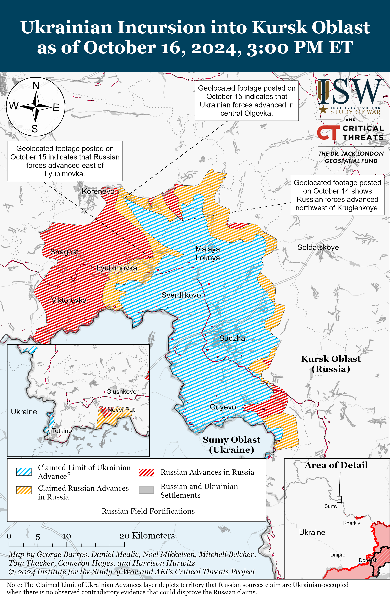
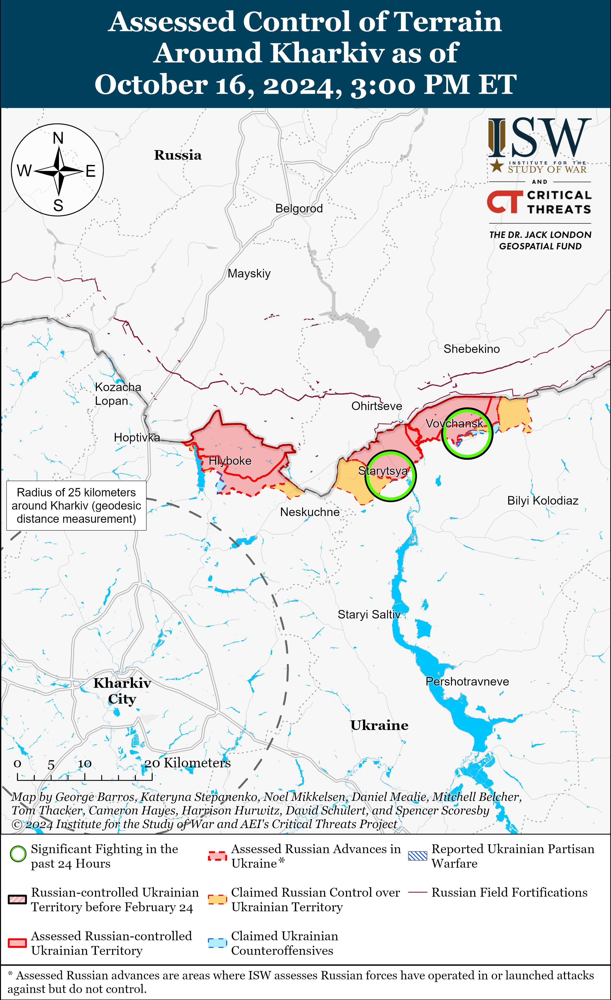
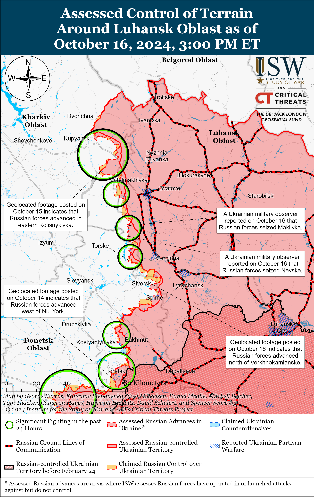
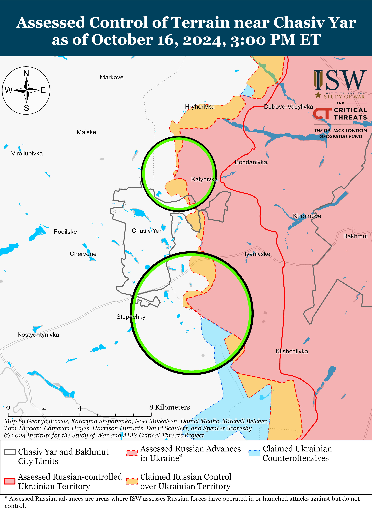
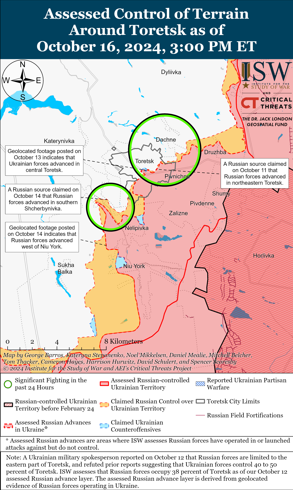
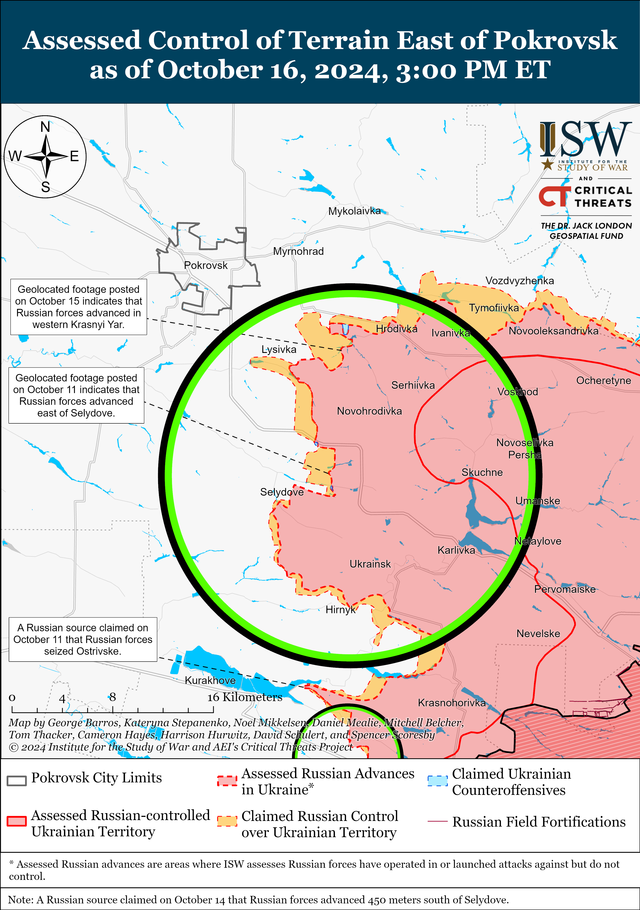
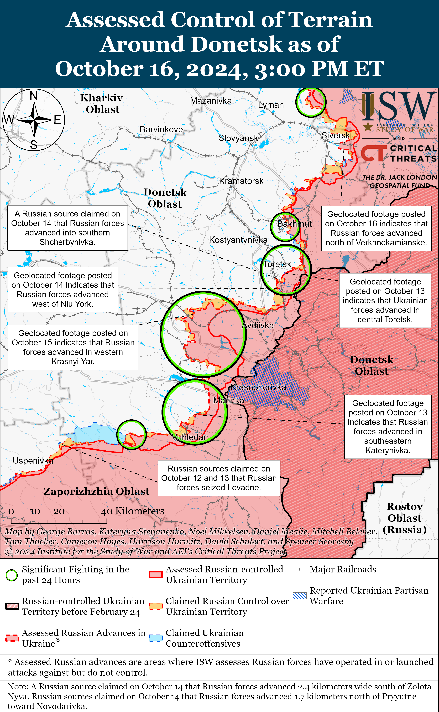
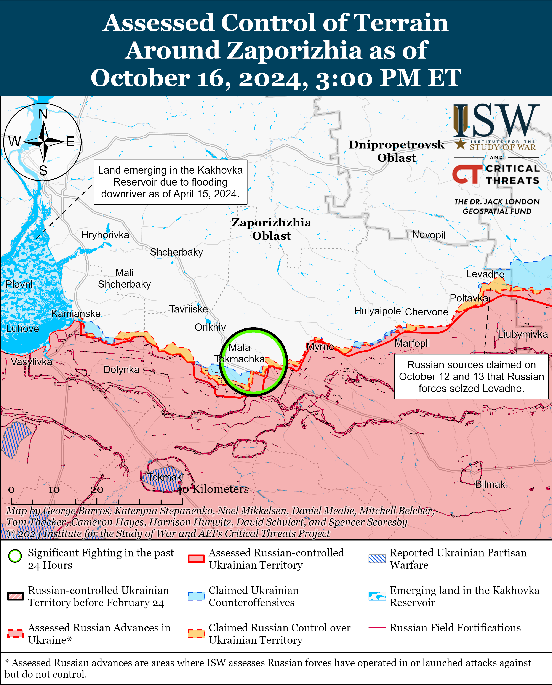
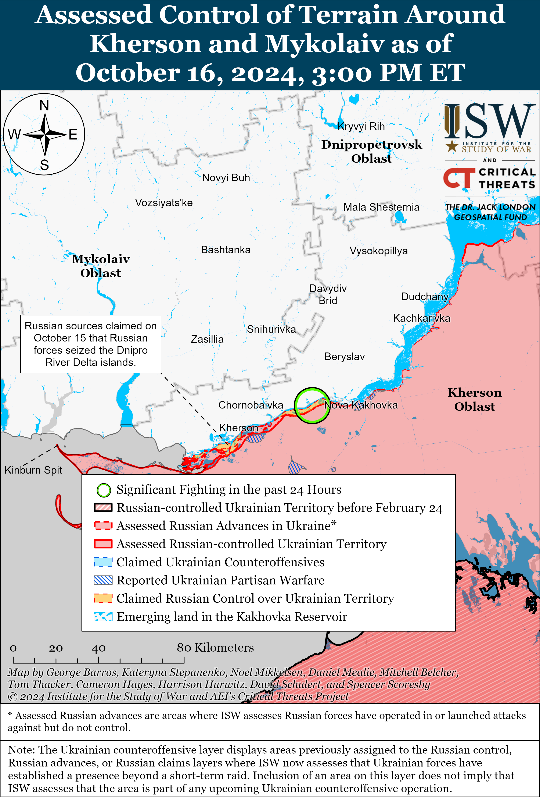

# Russian Offensive Campaign Assessment, October 16, 2024

**October 16, 2024, 6:15pm ET**

**Click** [**here**](https://storymaps.arcgis.com/stories/36a7f6a6f5a9448496de641cf64bd375) **to see ISW’s interactive map of the Russian invasion of Ukraine. This map is updated daily alongside the static maps present in this report.**

**Click** [**here**](https://storymaps.arcgis.com/stories/83a2f24901c941d581c0c523ecd2619b) **to see ISW's interactive map of Ukraine's offensive in Kursk Oblast.**

**Click** [**here**](https://understandingwar.maps.arcgis.com/apps/instant/3dviewer/index.html?appid=1602762dbcde419bb957dea358449580) **to see ISW’s 3D control of terrain topographic map of Ukraine. Use of a computer (not a mobile device) is strongly recommended for using this data-heavy tool.**

**Click** [**here**](https://storymaps.arcgis.com/stories/733fe90805894bfc8562d90b106aa895) **to access ISW’s archive of interactive time-lapse maps of the Russian invasion of Ukraine. These maps complement the static control-of-terrain map that ISW produces daily by showing a dynamic frontline. ISW will update this time-lapse map archive monthly.**

**Note: The data cut-off for this product was 12:30pm ET on October 16. ISW will cover subsequent reports in the October 17 Russian Offensive Campaign Assessment.**

**Ukrainian President Volodymyr Zelensky presented Ukraine's five-part Victory Plan aimed at winning the war by the end of 2025 to the Verkhovna Rada on October 16, which includes a promise to contribute experienced Ukrainian troops to defending NATO's eastern flank following the resolution of the war in Ukraine.** Zelensky stated that Ukraine's Victory Plan is intended to end the war "no later than" 2025 and is composed of five points, including: an immediate invitation to join NATO; continued Western support and aid including equipping Ukrainian brigades, supporting Ukraine's ability to use Western-provided weapons to strike military targets in Russia and increasing intelligence sharing with Ukraine; Western and Ukrainian non-nuclear strategic deterrence against Russia; Western investment in Ukraine's strategic economic growth; and a promise that Ukrainian forces will "replace" certain Western military contingents currently stationed in Europe after the war's conclusion.[[1]](#_edn5e6e3a9b79f7bae1d6d738a77f43c3a11) Zelensky stated that Ukrainian forces will use their experience in the war to strengthen NATO's defense and ensure security in Europe and noted that Ukrainian units could replace unspecified contingents of US forces in Europe in the future. Zelensky noted that there are several secret aspects of the plan that he has shared with Ukraine's Western allies. Zelensky stated that Ukraine's fate is connected to the fate of its neighbors in the Baltics, Balkans, Caucasus, and Central Asia and warned that Ukraine and the West must support Ukraine's sovereignty and territorial integrity or risk future Russian aggression. Ukrainian and Western officials expressed support for Zelensky's plan on October 16, and Zelensky noted that he will present the plan to the European Council on October 17.[[2]](#_edn5e6e3a9b79f7bae1d6d738a77f43c3a12)

**Russian President Vladimir Putin's current theory of victory in Ukraine seeks to protract the war and posits that Russian forces can outlast Western support for Ukraine and collapse Ukrainian resistance by winning a war of attrition. Russia will likely face serious medium- and long-term constraints that will undermine this strategic effort, however.** Putin and the Russian military command have committed the Russian military to a year-long offensive effort along the frontline in eastern and northeastern Ukraine that seeks to exhaust Ukrainian forces and prevent Ukraine from accumulating the necessary manpower and materiel to conduct counteroffensive operations that contest Russia's theater-wide initiative.[[3]](#_edn5e6e3a9b79f7bae1d6d738a77f43c3a13) Putin and the Russian military command likely view retaining the theater-wide initiative as a strategic priority and have shown themselves to be tolerant of protracted offensive operations that result in gradual, creeping advances far short of their intended operational objectives.[[4]](#_edn5e6e3a9b79f7bae1d6d738a77f43c3a14) The Russian military is currently attempting to eliminate a challenge to its theater-wide initiative in Kursk Oblast following the Ukrainian incursion in early August 2024 while maintaining offensive pressure in eastern Ukraine in pursuit of longstanding operational objectives.[[5]](#_edn5e6e3a9b79f7bae1d6d738a77f43c3a15) The Russian military's intensified Summer 2024 offensive operation to seize Pokrovsk and reduce the wider Ukrainian salient in western Donetsk Oblast will likely culminate in the coming months, although the Russian military command will likely continue to commit Russian forces to the overall strategic effort to retain the theater-wide initiative and exhaust Ukrainian forces well past this operational culmination point regardless of the state of Russian forces' combat effectiveness.[[6]](#_edn5e6e3a9b79f7bae1d6d738a77f43c3a16) Putin's theory of victory relies on Russian forces conducting consistent offensive operations indefinitely, but these grinding assaults will likely degrade available Russian manpower and materiel significantly enough that Russian forces will have to decrease offensive tempo on at least select sectors of the front — presenting Ukrainian forces with opportunities to contest and perhaps seize the battlefield initiative in these areas.[[7]](#_edn5e6e3a9b79f7bae1d6d738a77f43c3a17)

**Medium- to long-term constraints on Russian force-generation capacity and Russian military-industrial production will undermine Russia's ability to support consistent offensive operations that seek to protract the war and overwhelm Ukraine through attrition.** ISW has observed a steady widespread increase in financial incentives that Russian authorities are offering for concluding a military contract with the Russian Ministry of Defense (MoD), suggesting that Russia is exhausting recruitment pools of willing volunteers.[[8]](#_edn5e6e3a9b79f7bae1d6d738a77f43c3a18) Russian authorities have reportedly expressed concerns that ongoing recruitment efforts are producing diminishing results, and Putin remains committed to avoiding another partial mobilization call-up of reservists despite growing signs of force-generation constraints.[[9]](#_edn5e6e3a9b79f7bae1d6d738a77f43c3a19) Putin retains the option to conduct another partial mobilization wave — as he did in Fall 2022 — but will likely only do so under immense pressure or once the ongoing crypto-mobilization campaign seriously fails. Russian offensive operations in Ukraine have resulted in pronounced equipment losses, particularly for armored vehicles, and Russian military industrial production capacity will likely fail to replace these losses in the medium- to long-term.[[10]](#_edn5e6e3a9b79f7bae1d6d738a77f43c3a110) Russia currently relies on refurbishing a large but finite stock of Soviet-era equipment to replace its outsized losses in Ukraine and appears to be depleting stockpiles at an increased rate.[[11]](#_edn5e6e3a9b79f7bae1d6d738a77f43c3a111) Russia is leveraging partnerships with North Korea and Iran to acquire ammunition and military equipment and is engaging with the People's Republic of China (PRC) to acquire critical components for defense production, but these international procurement efforts will not address all the Russian materiel requirements in Ukraine.[[12]](#_edn5e6e3a9b79f7bae1d6d738a77f43c3a112) Putin appears just as reluctant to conduct a full-scale economic mobilization as he is to conduct another mobilization wave, and it remains unclear if critical bottlenecks and worsening labor shortages would even allow Russia to rapidly and fully mobilize its economy for the war effort in the event that Putin permitted it.[[13]](#_edn5e6e3a9b79f7bae1d6d738a77f43c3a113)

**Imprisoned ardent nationalist and former Russian officer Igor Girkin notably questioned the Kremlin's articulated theory of victory and assessed that 2025 and possibly late 2024 will be “a serious test” for Russia because the Kremlin has yet to address medium- to long-term force-generation and defense-industrial-capacity constraints.** Girkin published a series of letters from prison written between September 28 and October 12 in which he argued that the Kremlin’s current strategy depends on the outcome of the US presidential elections, implying that the Kremlin anticipates that Russia will be able to outlast Western support for Ukraine based on the policies of a new US administration.[[14]](#_edn5e6e3a9b79f7bae1d6d738a77f43c3a114) Girkin acknowledged that he does not have access to reliable tactical forecasts due to his imprisonment but noted that the Kremlin has yet to fix its systematic defense industrial base (DIB) and manpower problems since launching the full-scale invasion in February 2022 and that these problems may soon lead to military-economic crises in Russia. Girkin claimed that the Kremlin has exaggerated its military capabilities, resulting in the Russian DIB failing to catch up to war-time equipment needs. Girkin emphasized that the Russian full-scale invasion of Ukraine has long “consumed” or “is finishing” remaining Russian weapon reserves. Girkin also noted that Russia has expended trained personnel as if they are “endless and inexhaustible,” and that the war has already “eaten up" Russian professional forces. Girkin implied that subsequent Russian force generation efforts are detrimental to the Russian economy because the Kremlin now needs to generate forces from its labor force. Girkin argued that the Kremlin’s lack of long-term strategic planning and poor tactical planning created conditions in which the Russian military and DIB systems respond to emerging problems only after these problems become “critically dangerous.” Girkin notably claimed that the Kremlin has wasted the time it has had to correct these “gross mistakes,” noting that the Kremlin missed the opportunity that the West and Ukraine “kindly provided” to Russia “via their own incompetence and degradation” by delaying the provision of US aid to Ukraine in Winter 2023–2024 and Spring 2024. Girkin routinely pointed out Russia's long-term military and political vulnerabilities prior to his arrest in July 2023. Girkin is also notably one of the first voices within the Russian ultranationalist information space to openly question the Kremlin's theory of victory.

**Girkin also assessed that Russian Summer–Fall 2024 offensive campaign did not accomplish its goals in the entire theater and is unlikely to do so ahead of the muddy season, although Russian forces are continuing intense offensive operations in several operational directions in Ukraine.** Girkin stated that the Russian offensive operation north and northeast of Kharkiv City has “stalled” with very insignificant territorial advances; that Russian offensives in Donetsk Oblast merely “pushed” Ukrainian positions but did not break through the frontline; and that Russian forces are spending their reserves on repelling Ukraine’s incursion into Kursk Oblast.[[15]](#_edn5e6e3a9b79f7bae1d6d738a77f43c3a115) Girkin argued that the Russian seizure of Vuhledar in western Donetsk Oblast was “unsurprising” because Russian forces once again failed to encircle Ukrainian forces, which are now able to consolidate on a shortened frontline to the northwest of the settlement. Girkin assessed that the Ukrainian Summer–Fall 2024 defensive operation was successful in achieving its goals of repelling Russian offensives with minimal territorial losses; delivering strong counterattacks; preserving unused reserves; and maintaining morale within the military and society.

**US President Joe Biden announced a new military assistance package for Ukraine worth $425 million following a phone call with Ukrainian President Volodymyr Zelensky on October 16.**[[16]](#_edn5e6e3a9b79f7bae1d6d738a77f43c3a116) Biden stated that the package will include additional air defense capabilities, air-to-ground munitions, armored vehicles, and unspecified munitions and that the US will provide Ukraine will hundreds of air defense interceptors, dozens of tactical air defense systems, hundreds of armored personnel carriers and infantry fighting vehicles, and thousands of additional armored vehicles in the coming months. The Department of Defense (DoD) specified that the package will include additional munitions for National Advanced Surface-to-Air Missile Systems (NASAMS), RIM-7 missiles and support for air defense, Stinger anti-aircraft missiles, munitions for High Mobility Artillery Rocket Systems (HIMARS), air-to-ground munitions, 155mm and 105mm artillery munitions, tube-launched, optically tracked, wire-guided (TOW) missiles, Javelin and AT-4 anti-armor systems, High Mobility Multipurpose Wheeled Vehicles (HMMWVs), and other munitions and equipment. The DoD noted that this is the Biden administration’s 67th tranche of equipment drawn from DoD inventories provided to Ukraine since August 2021.The Australian government announced that it will provide Ukraine with 49 M1A1 Abrams tanks as part a new aid package to Ukraine worth 245 million Australian dollars (about $164 million).[[17]](#_edn5e6e3a9b79f7bae1d6d738a77f43c3a117)

**The South Korean Ministry of Defense (MoD) stated on October 16 that it is "closely" monitoring indications that North Korean troops are directly supporting Russia's war effort in Ukraine amid reports that the Russian military is training North Korean soldiers.[[18]](#_edn5e6e3a9b79f7bae1d6d738a77f43c3a118)** The South Korean National Intelligence Service also announced on October 16 that it is tracking the possibility that North Korean troops are participating in Russia's war effort and that it is coordinating with Ukrainian intelligence services.[[19]](#_edn5e6e3a9b79f7bae1d6d738a77f43c3a119) Sources in Ukraine's military and intelligence services told Ukrainian outlets *RBC Ukraine* and *Suspilne* that the Russian military is currently training over 10,000 North Korean soldiers in Russia's Far East and are preparing to transfer some of them to border areas near Ukraine in order to free up Russian military personnel for rotations.[[20]](#_edn5e6e3a9b79f7bae1d6d738a77f43c3a120) Ukrainian outlets *Suspilne* and *Liga* reported on October 15, citing anonymous military intelligence sources, that the Russian 11th Airborne (VDV) Brigade is forming a 3,000-person “battalion” staffed by North Korean citizens (the numerical strength is far beyond a battalion’s), which the Russian military will likely deploy to defensive operations in Kursk Oblast.[[21]](#_edn5e6e3a9b79f7bae1d6d738a77f43c3a121) ISW has not observed reports that North Korean troops are involved in combat operations, however. NATO Secretary General Mark Rutte stated on October 16 that NATO does not have "definitive" information that North Korean troops are fighting in Ukraine.[[22]](#_edn5e6e3a9b79f7bae1d6d738a77f43c3a122) The *New York Times* (NYT) reported on October 16 that unspecified US military and intelligence officials "expressed some skepticism" that a significant number of North Korean personnel were fighting in Ukraine, but stated that they had "little doubt" that North Korean engineers and observers are operating in occupied Ukraine and Russia in part to build and operate North Korean-provided ballistic missiles for Russian forces.[[23]](#_edn5e6e3a9b79f7bae1d6d738a77f43c3a123)

**Key Takeaways:**

- **Ukrainian President Volodymyr Zelensky presented Ukraine's five-part Victory Plan aimed at winning the war by the end of 2025 to the Verkhovna Rada on October 16, which includes a promise to contribute experienced Ukrainian troops to defending NATO's eastern flank following the resolution of the war in Ukraine.**
- **Russian President Vladimir Putin's current theory of victory in Ukraine seeks to protract the war and posits that Russian forces can outlast Western support for Ukraine and collapse Ukrainian resistance by winning a war of attrition. Russia will likely face serious medium- and long-term constraints that will undermine this strategic effort, however.**
- **Imprisoned ardent nationalist and former Russian officer Igor Girkin notably questioned the Kremlin's articulated theory of victory and assessed that 2025 and possibly late 2024 will be “a serious test” for Russia because the Kremlin has yet to address medium- to long-term force-generation and defense-industrial-capacity constraints.**
- **Girkin also assessed that Russian Summer–Fall 2024 offensive campaign did not accomplish its goals in the entire theater and is unlikely to do so ahead of the muddy season, although Russian forces are continuing intense offensive operations in several operational directions in Ukraine.**
- **US President Joe Biden announced a new military assistance package for Ukraine worth $425 million following a phone call with Ukrainian President Volodymyr Zelensky on October 16.**
- **The South Korean Ministry of Defense (MoD) stated on October 16 that it is "closely" monitoring indications that North Korean troops are directly supporting Russia's war effort in Ukraine amid reports that the Russian military is training North Korean soldiers.**
- **Russian forces recently advanced in northern Kharkiv Oblast, near Kreminna, near Siversk, and near Toretsk.**

***We do not report in detail on Russian war crimes because these activities are well-covered in Western media and do not directly affect the military operations we are assessing and forecasting. We will continue to evaluate and report on the effects of these criminal activities on the Ukrainian military and the Ukrainian population and specifically on combat in Ukrainian urban areas. We utterly condemn Russian violations of the laws of armed conflict and the Geneva Conventions and crimes against humanity even though we do not describe them in these reports.***

- Ukrainian Operations in the Russian Federation
- Russian Main Effort – Eastern Ukraine (comprised of three subordinate main efforts)
- Russian Subordinate Main Effort #1 – Push Ukrainian forces back from the international border with Belgorod Oblast and approach to within tube artillery range of Kharkiv City
- Russian Subordinate Main Effort #2 – Capture the remainder of Luhansk Oblast and push westward into eastern Kharkiv Oblast and encircle northern Donetsk Oblast
- Russian Subordinate Main Effort #3 – Capture the entirety of Donetsk Oblast
- Russian Supporting Effort – Southern Axis
- Russian Air, Missile, and Drone Campaign
- Russian Mobilization and Force Generation Efforts
- Russian Technological Adaptations
- Activities in Russian-occupied areas
- Ukrainian Defense Industrial Base Efforts
- Russian Information Operations and Narratives
- Significant Activity in Belarus

****

**Ukrainian Operations in the Russian Federation**

Poor weather is reportedly slowing down and complicating Russian and Ukrainian mechanized advances in the Ukrainian salient in Kursk Oblast. A Ukrainian serviceman operating in Kursk Oblast reported that Russian forces are attacking in small infantry groups on amphibious combat vehicles and that communication issues between Ukrainian units, possibly caused by poor weather conditions, may be facilitating Russian counterattacks in Kursk Oblast. The serviceman noted that the current Ukrainian to Russian manpower ratio is one to five servicemen, and that Ukrainian forces continue to attack despite manpower disadvantages and coordination problems.[[24]](#_edn5e6e3a9b79f7bae1d6d738a77f43c3a124) The serviceman expressed skepticism that Russian forces will begin assaults on Sudzha in the coming weeks or months, noting that poor weather is complicating Russian efforts to advance on dirt roads using amphibious combat vehicles. Russian sources also acknowledged that rainy and muddy conditions are complicating combat operations for both sides in Kursk Oblast and that Russian forces are increasingly relying on artillery fire.[[25]](#_edn5e6e3a9b79f7bae1d6d738a77f43c3a125) A former Russian Storm-Z instructor and milblogger claimed that Russian forces successfully advanced on the northwestern flank of the Ukrainian salient in Kursk Oblast at first, but then stalled and have not achieved any significant advances since.[[26]](#_edn5e6e3a9b79f7bae1d6d738a77f43c3a126)

Russian forces recently advanced on the western side of the Ukrainian salient in Kursk Oblast amid continued fighting along the entire salient on October 15 and 16. Geolocated footage published on October 16 shows that Russian forces recently advanced east of Lyubimovka and in western Zelenyy Shlyakh (both southeast of Korenevo), and geolocated footage published on October 14 shows that Russian forces advanced in the fields northwest of Kruglenkoye (southeast of Korenevo).[[27]](#_edn5e6e3a9b79f7bae1d6d738a77f43c3a127) Geolocated footage published on October 15 showed Russian forces striking Ukrainian forces in a building in Olgovka (immediately east of Korenevo), indicating that Ukrainian forces recently regained some positions in Olgovka.[[28]](#_edn5e6e3a9b79f7bae1d6d738a77f43c3a128) The Ukrainian serviceman fighting in Kursk Oblast reported on October 16 that Russian and Ukrainian forces are currently fighting for Olgovka and Novoivanovka (northeast of Zelenyy Shlyakh), which are partially under Ukrainian control.[[29]](#_edn5e6e3a9b79f7bae1d6d738a77f43c3a129) Russian and Ukrainian forces reportedly continued fighting southeast of Korenevo near Tolstyi Lug, Lyubimovka, Zelenyy Shlyakh, Nizhnyi Klin, Malaya Lokhnya, and Novoivanovka; east of Korenevo near Olgovka; northeast of Sudzha near Russkoye Porechnoye, Nizhnyaya Parovaya, and Nechayev; south of Sudzha near Plekhovo; and southeast of Sudzha near Russkaya Konopelka and Fanaseevka.[[30]](#_edn5e6e3a9b79f7bae1d6d738a77f43c3a130)

Russian and Ukrainian forces continued limited positional engagements in Glushkovsky Raion (west of the main Ukrainian salient in Kursk Oblast) on October 15 and 16 but did not make confirmed advances. A Kremlin-affiliated milblogger claimed that fighting continued on the northern outskirts of Novyi Put (southwest of Glushkovo) but that there is no confirmation that Russian forces seized the settlement.[[31]](#_edn5e6e3a9b79f7bae1d6d738a77f43c3a131) Another prominent Russian milblogger claimed that Russian forces seized the “Konstantinovka” Checkpoint on the international border between Kursk and Sumy oblasts.[[32]](#_edn5e6e3a9b79f7bae1d6d738a77f43c3a132)

Russian sources claimed that Russian forces removed “dragon’s teeth” anti-tank defenses that have led to accidental civilian harm and death of Russian servicemen following some backlash in the Russian information space about poor organization of these defenses in Kursk Oblast.[[33]](#_edn5e6e3a9b79f7bae1d6d738a77f43c3a133) The former Russian Storm-Z instructor observed that Russian state media began to acknowledge the problematic placement of the “dragon’s teeth” roadblocks along key highways and reported that Russian forces have since removed these anti-tank defenses from presumably the R200 highway near Bolshoye Soldatskoye (northeast of Sudzha).[[34]](#_edn5e6e3a9b79f7bae1d6d738a77f43c3a134)

**Russian Main Effort – Eastern Ukraine**

**Russian Subordinate Main Effort #1 – Kharkiv Oblast** **(Russian objective: Push Ukrainian forces back from the international border with Belgorod Oblast and approach to within tube artillery range of Kharkiv City)**

Ukrainian forces reportedly recently advanced north of Kharkiv City amid continued fighting in northern Kharkiv Oblast on October 16. Ukraine's Main Military Intelligence Directorate (GUR) stated on October 16 that GUR units cleared a forest area 400 hectares in size north of Lyptsi (north of Kharkiv City) on October 15, although ISW has yet to observe visual evidence indicating where the forest area is.[[35]](#_edn5e6e3a9b79f7bae1d6d738a77f43c3a135) GUR reported that GUR units "destroyed" three unspecified Russian motorized rifle battalions as well as the "Storm" detachment and a reconnaissance company of the 7th Motorized Rifle Regiment (11th Army Corps [AC], Leningrad Military District [LMD]) during the operation to clear the forest.[[36]](#_edn5e6e3a9b79f7bae1d6d738a77f43c3a136) Russian forces conducted ground assaults northeast of Kharkiv City near Vovchansk and Starytsya on October 15 and 16 but did not make any confirmed gains.[[37]](#_edn5e6e3a9b79f7bae1d6d738a77f43c3a137) Ukraine's Kharkiv Group of Forces published footage on October 16 showing Ukrainian forces recently repelling a platoon-sized Russian mechanized assault in an unspecified area of the Kharkiv direction and reported that Ukrainian forces destroyed three Russian armored vehicles during the assault.[[38]](#_edn5e6e3a9b79f7bae1d6d738a77f43c3a138)

****

**Russian Subordinate Main Effort #2 – Luhansk Oblast (Russian objective: Capture the remainder of Luhansk Oblast and push westward into eastern Kharkiv Oblast and northern Donetsk Oblast)**

Russian forces recently advanced northwest of Svatove amid continued offensive operations along the Kupyansk-Svatove line on October 16. Geolocated footage published on October 12 indicates that Russian forces recently advanced along a windbreak east of Kruhlyakivka (northwest of Svatove).[[39]](#_edn5e6e3a9b79f7bae1d6d738a77f43c3a139) Russian milbloggers claimed that Russian forces advanced further within eastern and southeastern Kolisnykivka (northwest of Svatove and immediately north of Kruhlyakivka), although ISW has not observed visual confirmation of these Russian claims.[[40]](#_edn5e6e3a9b79f7bae1d6d738a77f43c3a140) A Russian milblogger noted that Russian forces are particularly concentrating offensive activity against Ukrainian positions near Kolisnykivka.[[41]](#_edn5e6e3a9b79f7bae1d6d738a77f43c3a141) Russian forces continued offensive operations east of Kupyansk near Kucherivka and Petropavlivka and northwest of Svatove near Novoosynove, Hlushkivka, Pishchane, Lozova, Kruhlyakivka, Kolisnykivka, and Vyshneve on October 15 and 16.[[42]](#_edn5e6e3a9b79f7bae1d6d738a77f43c3a142)

Russian forces recently seized Nevske and most of Makiivka (both northwest of Kreminna) amid continued offensive operations in the Kreminna area on October 16. Geolocated footage published on October 16 indicates that Russian forces recently advanced in northern Nevske and suggests that widespread Russian claims that Russian forces seized the settlement are accurate.[[43]](#_edn5e6e3a9b79f7bae1d6d738a77f43c3a143) The Russian Ministry of Defense (MoD) claimed on October 16 that Russian forces seized Nevske.[[44]](#_edn5e6e3a9b79f7bae1d6d738a77f43c3a144) Ukrainian military observer Kostyantyn Mashovets stated that elements of the Russian 59th Tank Regiment and 283rd Motorized Rifle Regiment (both 144th Motorized Rifle Division, 20th Combined Arms Army [CAA], Moscow Military District [MMD]) seized Nevske and are attempting to advance west across the Zherebets River in the direction of Novolyubivka and south in the direction of Novosadove.[[45]](#_edn5e6e3a9b79f7bae1d6d738a77f43c3a145) Mashovets reported that elements of the 237th Tank Regiment and 252nd Motorized Rifle Regiment (both 3rd Motorized Rifle Division, 20th CAA, MMD) seized Makiivka, crossed the Zherebets River in the area, and established up to a company-sized bridgehead on the west (right) bank of the Zherebets River.[[46]](#_edn5e6e3a9b79f7bae1d6d738a77f43c3a146) ISW has observed confirmation of Russian forces operating in western Makiivka on the west bank of the Zherebets River but has yet to observe confirmation of Russian forces operating in the southwesternmost part of the settlement that is on the western bank of the Zherebets River. Russian forces continued offensive operations northwest of Kreminna near Hrekivka, Makiiivka, and Nevske and west of Kreminna near Terny, Torske, and Zarichne on October 15 and 16.[[47]](#_edn5e6e3a9b79f7bae1d6d738a77f43c3a147) A Russian milblogger claimed on October 15 that Russian forces repelled a Ukrainian sabotage and reconnaissance group near Shypylivka (southeast of Kreminna).[[48]](#_edn5e6e3a9b79f7bae1d6d738a77f43c3a148)

Mashovets reported that Russian forces are preparing to intensify assaults in the Kreminna area but indicated that Russian forces in the area likely lack the reserves necessary to sustain prolonged intensified offensive operations.[[49]](#_edn5e6e3a9b79f7bae1d6d738a77f43c3a149) Mashovets stated that Russian forces have finished forming assault companies within the 37th Motorized Rifle Regiment (67th Motorized Rifle Division, 25th CAA, Central Military District [CMD]) and are transferring armored vehicles from the 11th Tank Brigade (25th CAA, CMD ) to its 19th Tank Regiment in preparation for planned intensified offensive operations on the west bank of the Zherebets River.[[50]](#_edn5e6e3a9b79f7bae1d6d738a77f43c3a150) Mashovets stated that Russian forces are forming assault companies in the Kreminna area with 10 to 12 armored vehicles each, presumably to conduct mechanized assaults at their doctrinal end-strengths.[[51]](#_edn5e6e3a9b79f7bae1d6d738a77f43c3a151) Mashovets added that elements of the 144th Motorized Rifle Division have been conducting routine platoon-sized mechanized assaults in the Kreminna area throughout September and early October 2024.[[52]](#_edn5e6e3a9b79f7bae1d6d738a77f43c3a152) Mashovets reported that the Russian Western Grouping of Forces (responsible for the entire Kupyansk-Svatove-Kreminna line) has elements of the 361st, 362nd, and 353rd motorized rifle regiments (all 67th Motorized Rifle Division) in a reserve in the Kreminna area totaling roughly between 6,000 and 7,000 personnel.[[53]](#_edn5e6e3a9b79f7bae1d6d738a77f43c3a153) Russian forces intensified their efforts to reach the Oskil River along the entire Kupyansk-Svatove-Kreminna line in late September 2024, although a reserve of 7,000 personnel will likely constrain how long Russian forces can sustain this intensified offensive tempo in the Kreminna area.[[54]](#_edn5e6e3a9b79f7bae1d6d738a77f43c3a154)

**Russian Subordinate Main Effort #3 – Donetsk Oblast (Russian objective: Capture the entirety of Donetsk Oblast, the claimed territory of Russia’s proxies in Donbas)**

Russian forces recently advanced near Siversk amid continued offensive operations in the area on October 16. Geolocated footage published on October 16 indicates that Russian forces recently advanced north of Verkhnokamyanske (east of Siversk).[[55]](#_edn5e6e3a9b79f7bae1d6d738a77f43c3a155) Ukrainian Luhansk Group of Forces Spokesperson Major Anastasiya Bobovnikova reported on October 15 that Ukrainian forces repelled a roughly platoon-sized Russian mechanized assault in the Siversk direction.[[56]](#_edn5e6e3a9b79f7bae1d6d738a77f43c3a156)

Russian forces continued offensive operations near Chasiv Yar on October 16, but there were no confirmed changes to the frontline. Russian forces conducted offensive operations north of Chasiv Yar near Kalynivka and south of Chasiv Yar near Stupochky and Predtechyne.[[57]](#_edn5e6e3a9b79f7bae1d6d738a77f43c3a157) A Russian milblogger claimed that Ukrainian forces are successfully repelling Russian attacks southeast of Chasiv Yar despite Russian forces alleged fire control over the main Ukrainian ground lines of communication (GLOCs) near Chasiv Yar.[[58]](#_edn5e6e3a9b79f7bae1d6d738a77f43c3a158) Elements of the Russian 98th Airborne (VDV) Division reportedly continue operating near Chasiv Yar.[[59]](#_edn5e6e3a9b79f7bae1d6d738a77f43c3a159)

****

Russian forces recently advanced near Toretsk amid continued offensive operations in the area on October 16. Geolocated footage published on October 15 and 16 indicates that Russian forces advanced in eastern Toretsk and in western Druzhba (east of Toretsk).[[60]](#_edn5e6e3a9b79f7bae1d6d738a77f43c3a160) Russian forces conducted offensive operations near Toretsk; northeast of Toretsk near Dachne; and west of Toretsk near Shcherbynivka on October 15 and 16.[[61]](#_edn5e6e3a9b79f7bae1d6d738a77f43c3a161) Bobovnikova reported on October 15 that Russian artillery and aviation have destroyed all of the buildings that Ukrainian forces could use as defensive positions in Toretsk.[[62]](#_edn5e6e3a9b79f7bae1d6d738a77f43c3a162) Elements of the Russian 1st "Slavic" Motorized Rifle Brigade and 132nd Motorized Rifle Brigade (both of the 51st Guards Combined Arms Army [CAA], formerly the 1st Donetsk People's Republic Army Corps [DNR AC]) are reportedly operating in the Toretsk direction.[[63]](#_edn5e6e3a9b79f7bae1d6d738a77f43c3a163)

****

Russian forces continued offensive operations in the Pokrovsk direction on October 16 but did not make any confirmed advances. The Russian Ministry of Defense (MoD) claimed on October 16 that Russian forces seized Krasnyi Yar (southeast of Pokrovsk), and a Russian milblogger claimed that Russian forces advanced southwest of Selydove (southeast of Pokrovsk).[[64]](#_edn5e6e3a9b79f7bae1d6d738a77f43c3a164) ISW has not observed visual confirmation of these claims, however. Footage published on October 16 purportedly shows elements of the Russian "Siberskiye Medvedi" (Siberian Bears) Battalion of the 74th Motorized Rifle Brigade (41st CAA, Central Military District [CMD]) raising a Russian flag over the House of Culture in southeastern Krasnyi Yar, although ISW previously assessed that Russian forces had advanced in the area.[[65]](#_edn5e6e3a9b79f7bae1d6d738a77f43c3a165) Several Russian milbloggers claimed that Russian forces are attempting to encircle Selydove.[[66]](#_edn5e6e3a9b79f7bae1d6d738a77f43c3a166) A Ukrainian soldier operating in the area stated that Russian forces are attempting to both bypass Selydove and advance to the settlement's outskirts.[[67]](#_edn5e6e3a9b79f7bae1d6d738a77f43c3a167) Russian forces continued ground attacks east of Pokrovsk near Promin and Myrolyubivka; and southeast of Pokrovsk near Novotroitske, Krasnyi Yar, Selydove, Krutyi Yar, Tsukuryne, Zoriane, Zhelanne Druhe, Izmailivka, Novodmytrivka, Hirnyk, Novoselydivka, and Kreminna Balka on October 15 and 16.[[68]](#_edn5e6e3a9b79f7bae1d6d738a77f43c3a168) One Russian milblogger noted that worsening weather conditions in the Pokrovsk direction have recently slowed the tempo of fighting in the area.[[69]](#_edn5e6e3a9b79f7bae1d6d738a77f43c3a169) Russian Defense Minister Andrei Belousov credited elements of the Russian 15th Motorized Rifle Brigade (2nd CAA, CMD) with the recent seizure of Mykhailivka (southeast of Pokrovsk), and ISW assessed that Russian forces had seized the settlement as of September 22.[[70]](#_edn5e6e3a9b79f7bae1d6d738a77f43c3a170)

Russian forces continued offensive operations east of Kurakhove near Heorhiivka on October 15 and 16 but did not make any confirmed advances.[[71]](#_edn5e6e3a9b79f7bae1d6d738a77f43c3a171) A Ukrainian brigade operating in the Kurahove direction published footage on October 15 showing Ukrainian forces repelling at least a platoon-sized Russian mechanized assault in an unspecified area in the Kurakhove direction.[[72]](#_edn5e6e3a9b79f7bae1d6d738a77f43c3a172) A Ukrainian soldier operating in the area stated that Ukrainian forces repelled a platoon-sized Russian mechanized assault and a reinforced platoon-sized Russian mechanized assault on the morning of October 16 in unspecified areas of the Kurakhove direction.[[73]](#_edn5e6e3a9b79f7bae1d6d738a77f43c3a173)

Russian forces continued offensive operations southwest of Donetsk City near Vuhledar on October 15 and 16 but did not make any confirmed advances. Russian milbloggers claimed that Russian forces advanced west of Vodyane (northeast of Vuhledar) and near Zolota Nyva (northwest of Vuhledar).[[74]](#_edn5e6e3a9b79f7bae1d6d738a77f43c3a174) Fighting continued near Zolota Nyva and Bohoyavlenka (northwest of Vuhledar) on October 15 and 16.[[75]](#_edn5e6e3a9b79f7bae1d6d738a77f43c3a175) Elements of the Russian 1472nd Motorized Rifle Regiment (68th AC, Eastern Military District [EMD]) reportedly continue operating near Katerynivka (northeast of Vuhledar); drone operators of the 36th Motorized Rifle Brigade (29th CAA, EMD) reportedly continue operating near Bohoyavlenka; and elements of the 37th Motorized Rifle Brigade (36th CAA, EMD) reportedly continue operating near Zolota Nyva.[[76]](#_edn5e6e3a9b79f7bae1d6d738a77f43c3a176)

Russian forces attacked in the Donetsk-Zaporizhia Oblast border area near Rozdolne (northeast of Velyka Novosilka) on October 15 and 16 but did not make any confirmed advances.[[77]](#_edn5e6e3a9b79f7bae1d6d738a77f43c3a177)

****

**Russian Supporting Effort – Southern Axis (Russian objective: Maintain frontline positions and secure rear areas against Ukrainian strikes)**

Russian forces conducted ground attacks in western Zaporizhia Oblast near Mala Tokmachka (northeast of Robotyne) on October 15 and 16 but did not make any confirmed advances.[[78]](#_edn5e6e3a9b79f7bae1d6d738a77f43c3a178) A Russian milblogger claimed on October 15 that Russian forces started to advance into northern Kamyanske (south of Stepnohirsk), although ISW has not observed visual confirmation of this claim.[[79]](#_edn5e6e3a9b79f7bae1d6d738a77f43c3a179) The milblogger claimed that elevation changes within Kamyanske and the Dnipro River Reservoir east of the settlement are making it difficult for Russian forces to advance in the settlement.[[80]](#_edn5e6e3a9b79f7bae1d6d738a77f43c3a180) A Russian milblogger claimed that rainy weather in Zaporizhia Oblast has flooded Russian trenches and complicated the use of wheeled vehicles to deliver ammunition and provisions to frontline positions.[[81]](#_edn5e6e3a9b79f7bae1d6d738a77f43c3a181) Elements of the Russian "Valkiriya" Special Detachment (4th Military Base, 58th Combined Arms Army [CAA], Southern Military District [SMD]) reportedly continue operating near Kamyanske.[[82]](#_edn5e6e3a9b79f7bae1d6d738a77f43c3a182)

Russian forces continued attacks in left (east) bank Kherson Oblast on October 15 and 16 but did not make any confirmed advances.[[83]](#_edn5e6e3a9b79f7bae1d6d738a77f43c3a183) Elements of the Russian BARS-33 (Russian Combat Army Reserve) reportedly continue to operate in the Kherson direction.[[84]](#_edn5e6e3a9b79f7bae1d6d738a77f43c3a184) A Russian milblogger claimed on October 16 that Russian forces repelled a Ukrainian raid on the Russian-occupied Kinburn Spit on the night of October 15 to 16.[[85]](#_edn5e6e3a9b79f7bae1d6d738a77f43c3a185) ISW has not observed visual evidence or independent reporting of this claim, however.

**Russian Air, Missile, and Drone Campaign (Russian Objective: Target Ukrainian military and civilian infrastructure in the rear and on the frontline)**

Russian forces conducted a large series of drone and missile strikes against Ukraine on the night of October 15 to 16. The Ukrainian Air Force reported that Russian forces struck an unspecified target in Donetsk Oblast with an S-300/400 missile launched from occupied Donetsk Oblast; targeted Chernihiv Oblast with a Kh-59 cruise missile launched from the airspace over Kursk Oblast; and launched 136 strike drones of an unspecified type from Kursk and Oryol oblasts and Primorsko-Akhtarsk, Krasnodar Krai.[[86]](#_edn5e6e3a9b79f7bae1d6d738a77f43c3a186) The Ukrainian Air Force reported as of 0700 that Ukrainian forces has downed 51 drones over Sumy, Cherkasy, Kirovohrad, Ternopil, Kherson, Kharkiv, Zhytomyr, Donetsk, Dnipropetrovsk, Mykolaiv, Kyiv, Poltava, Chernihiv, and Chernivtsi oblasts and later reported as of 1300 that Ukrainian forces downed a total of 68 Russian drones.[[87]](#_edn5e6e3a9b79f7bae1d6d738a77f43c3a187) The Ukrainian Air Force reported that Ukrainian electronic warfare (EW) interference caused 64 Russian drones to become "lost" in Ukrainian air space and miss their targets and that two drones returned to Russian air space and two drones struck unspecified targets in Ukraine. Kyiv City Military Administration Head Serhii Popko reported that Ukrainian forces destroyed all the Russian drones that targeted Kyiv City.[[88]](#_edn5e6e3a9b79f7bae1d6d738a77f43c3a188) Ternopil Oblast Military Administration Head Vyachezlav Nehoda stated that Ukrainian authorities put out a fire at an industrial facility in Ternopil Oblast caused by a Russian drone strike.[[89]](#_edn5e6e3a9b79f7bae1d6d738a77f43c3a189) The Russian Ministry of Defense (MoD) and Russian milbloggers claimed that Russian missiles struck an armored vehicle plant in Mykolaiv City, but ISW has not observed further confirmation of this claim.[[90]](#_edn5e6e3a9b79f7bae1d6d738a77f43c3a190)

Mykolaiv Oblast Military Administration Head Vitaly Kim reported on October 15 that Russian forces struck Ochakiv with an S-300 missile on the morning of October 15.[[91]](#_edn5e6e3a9b79f7bae1d6d738a77f43c3a191)

**Russian Mobilization and Force Generation Efforts (Russian objective: Expand combat power without conducting general mobilization)**

Russian and People's Republic of China (PRC) People's Liberation Army (PLA) Navy vessels participated in a joint rescue at sea training session in the East China Sea on October 17.[[92]](#_edn5e6e3a9b79f7bae1d6d738a77f43c3a192) Russia's *Admiral Panteleyev* and *Admiral Tributs* destroyers and the PLA's *Xining* and *Wuxi* destroyers, *Linyi* frigate, and *Taihu* integrated supply ship were involved in the exercise and are currently jointly patrolling the Asia-Pacific region. The Russian Ministry of Defense (MoD) previously published footage of the ongoing joint Russia-PRC naval exercises and patrols.[[93]](#_edn5e6e3a9b79f7bae1d6d738a77f43c3a193) ISW has noted that these exercises are manifestations of intensified Russia-PRC defense cooperation and may facilitate opportunities for the PLA to learn lessons from the war in Ukraine when planning potential future actions against Taiwan.[[94]](#_edn5e6e3a9b79f7bae1d6d738a77f43c3a194)

Russian Defense Minister Andrei Belousov inspected submarine production facilities and housing of Russia's Pacific Fleet in Kamchatka Krai on October 16 as part of Russia's efforts to modernize its navy.[[95]](#_edn5e6e3a9b79f7bae1d6d738a77f43c3a195) Russian Submarine Forces Commander Vice Admiral Vladimir Dmitriev told Belousov that recent modernizations to the facilities have helped Russia produce seven nuclear submarines, including five Borey-class and two Yasen-class strategic missile cruises, within the Russian MoD's established deadlines. Russian authorities will reportedly complete the construction of 14 new facilities in 2025 that will increase the berthing front and expand the combat capabilities of Russia's submarine forces.

The Russian MoD claimed on October 16 that two Belgorod Oblast deputy governors and other regional and municipal authorities temporarily suspended their regional service contracts and joined the BARS-Belgorod detachment.[[96]](#_edn5e6e3a9b79f7bae1d6d738a77f43c3a196) The Russian MoD noted that Russian authorities are still staffing and training the detachment and claimed that residents from other federal subjects have applied to join the detachment. The Russian MoD reiterated that the detachment will be responsible for: protecting and defending life-support facilities and socially-important infrastructure objects; combatting Ukrainian drones; detecting and combatting Ukrainian sabotage and reconnaissance groups; evacuating civilians; and ensuring the counter-terrorism regime in Belgorod Oblast.[[97]](#_edn5e6e3a9b79f7bae1d6d738a77f43c3a197) The Russian MoD is likely amplifying claims that regional officials joined the detachment in order to encourage other Russian citizens to apply and to create the illusion that Russia's elite are sharing the burden of the war.

**Russian Technological Adaptations** **(Russian objective: Introduce technological innovations to optimize systems for use in Ukraine)**

Nothing significant to report.

**Ukrainian Defense Industrial Efforts** **(Ukrainian objective: Develop its defense industrial base to become more self-sufficient in cooperation with US, European, and international partners)**

*ISW is suspending publishing coverage of Ukrainian defense industrial efforts until further notice.*

**Activities in Russian-occupied areas (Russian objective: Consolidate administrative control of annexed areas; forcibly integrate Ukrainian citizens into Russian sociocultural, economic, military, and governance systems)**

*ISW is not publishing reporting on activities in Russian-occupied areas today.*

**Russian Information Operations and Narratives**

Nothing significant to report.

**Significant activity in Belarus** **(Russian efforts to increase its military presence in Belarus and further integrate Belarus into Russian-favorable frameworks and Wagner Group activity in Belarus)**

Nothing significant to report.

**Note: ISW does not receive any classified material from any source, uses only publicly available information, and draws extensively on Russian, Ukrainian, and Western reporting and social media as well as commercially available satellite imagery and other geospatial data as the basis for these reports. References to all sources used are provided in the endnotes of each update.**

---

[[1]](#_edn5e6e3a9b79f7bae1d6d738a77f43c3a1ref1) <https://www.president.gov> dot ua/en/news/haj-nasha-spilna-robota-za-planom-peremogi-yaknajshvidshe-ob-93849 ; <https://apnews.com/article/ukraine-victory-plan-unveiled-zelenskyy-parliament-f3525550f6986f590777193a7385c0c5> ; <https://www.washingtonpost.com/world/2024/10/16/zelensky-victory-plan-ukraine-nato-russia/> ; <https://www.facebook.com/ppu.gov.ua/posts/pfbid0GkDpgVVdbcAQsD43hZNKvCfdFzf13ZNPVW1yQLn77nwgutCDZFKhspxYCEFRyCkKl>

[[2]](#_edn5e6e3a9b79f7bae1d6d738a77f43c3a1ref2) <https://t.me/oleksiihoncharenko/43948> ; https://suspilne dot media/859491-rutte-nato-obgovorue-plan-peremogi-ukraini/ ; <https://www.youtube.com/live/vXFJ72_Axm8> ; https://suspilne dot media/859539-korotkostrokove-zaprosenna-ukraini-v-alans-ne-obgovoruetsa-predstavnica-ssa-pri-nato/ ; https://www.ukrinform dot ua/rubric-polytics/3916858-korotkostrokove-zaprosenna-ukraini-do-nato-poki-oficijno-ne-obgovoruetsa-postpred-ssa.html

[[3]](#_edn5e6e3a9b79f7bae1d6d738a77f43c3a1ref3) <https://www.understandingwar.org/backgrounder/russian-offensive-campaign-assessment-june-7-2024> ; https://understandingwar.org/backgrounder/how-delays-western-aid-gave-russia-initiative-ukrainian-counteroffensive-kharkiv

[[4]](#_edn5e6e3a9b79f7bae1d6d738a77f43c3a1ref4) https://www.understandingwar.org/backgrounder/russian-offensive-campaign-assessment-june-7-2024 ; https://understandingwar.org/backgrounder/how-delays-western-aid-gave-russia-initiative-ukrainian-counteroffensive-kharkiv

[[5]](#_edn5e6e3a9b79f7bae1d6d738a77f43c3a1ref5) https://www.understandingwar.org/backgrounder/russian-offensive-campaign-assessment-august-17-2024

[[6]](#_edn5e6e3a9b79f7bae1d6d738a77f43c3a1ref6) <https://www.understandingwar.org/backgrounder/russian-offensive-campaign-assessment-august-17-2024> ; <https://isw.pub/UkrWar101124> ; https://isw.pub/UkrWar100324

[[7]](#_edn5e6e3a9b79f7bae1d6d738a77f43c3a1ref7) https://www.understandingwar.org/backgrounder/russian-offensive-campaign-assessment-june-7-2024 ; https://understandingwar.org/backgrounder/how-delays-western-aid-gave-russia-initiative-ukrainian-counteroffensive-kharkiv

[[8]](#_edn5e6e3a9b79f7bae1d6d738a77f43c3a1ref8) <https://isw.pub/UkrWar100524> ; https://isw.pub/UkrWar091524

[[9]](#_edn5e6e3a9b79f7bae1d6d738a77f43c3a1ref9) <https://isw.pub/UkrWar100524> ; https://isw.pub/UkrWar091924

[[10]](#_edn5e6e3a9b79f7bae1d6d738a77f43c3a1ref10) https://isw.pub/UkrWar100624

[[11]](#_edn5e6e3a9b79f7bae1d6d738a77f43c3a1ref11) <https://isw.pub/UkrWar072524> ; <https://isw.pub/UkrWar072424> ; <https://isw.pub/UkrWar091524> ; <https://isw.pub/UkrWar100624> ; https://isw.pub/UkrWar031124

[[12]](#_edn5e6e3a9b79f7bae1d6d738a77f43c3a1ref12) https://www.understandingwar.org/backgrounder/iran-update-april-26-2024; <https://www.understandingwar.org/backgrounder/russian-offensive-campaign-assessment-september-15-2024> ; <https://understandingwar.org/backgrounder/russian-offensive-campaign-assessment-september-24-2024>

[[13]](#_edn5e6e3a9b79f7bae1d6d738a77f43c3a1ref13) <https://isw.pub/UkrWar020224> ; <https://www.understandingwar.org/backgrounder/russian-offensive-campaign-assessment-may-15-2024> ; <https://isw.pub/UkrWar041524> ; https://isw.pub/UkrWar040424

[[14]](#_edn5e6e3a9b79f7bae1d6d738a77f43c3a1ref14) https://t.me/strelkovii/6907

[[15]](#_edn5e6e3a9b79f7bae1d6d738a77f43c3a1ref15) <https://x.com/wartranslated/status/1846535358365728932/photo/3>; https://t.me/strelkovii/6919

[[16]](#_edn5e6e3a9b79f7bae1d6d738a77f43c3a1ref16) <https://www.defense.gov/News/Releases/Release/Article/3937146/biden-administration-announces-additional-security-assistance-for-ukraine/>; <https://www.whitehouse.gov/briefing-room/statements-releases/2024/10/16/readout-of-president-bidens-call-with-president-zelenskyy-of-ukraine-15/>

[[17]](#_edn5e6e3a9b79f7bae1d6d738a77f43c3a1ref17) <https://www.abc.net.au/news/2024-10-16/ukraine-to-receive-aging-australian-abrams-tanks/104480368>

[[18]](#_edn5e6e3a9b79f7bae1d6d738a77f43c3a1ref18) <https://news.koreaherald> dot com/view.php?ud=20241016050735 ; <https://www.koreatimes.co> dot kr/www/nation/2024/10/103\_384398.html ; <https://world.kbs.co> dot kr/service/news\_view.htm?lang=e&Seq\_Code=188494

[[19]](#_edn5e6e3a9b79f7bae1d6d738a77f43c3a1ref19) <https://news.kbs.co> dot kr/news/pc/view/view.do?ncd=8083229 ; <https://news.kbs.co> dot kr/news/pc/view/view.do?ncd=8083009

[[20]](#_edn5e6e3a9b79f7bae1d6d738a77f43c3a1ref20) https://www.rbc dot ua/rus/news/rosiya-gotue-ponad-10-tisyach-viyskovih-kndr-1729062105.html ; https://suspilne dot media/858837-soldati-kndr-vouut-na-boci-rf-v-ukraini-v-pidrozdili-asgard-provedut-rozsliduvanna-966-den-vijni-onlajn/?anchor=live\_1729065640&utm\_source=copylink&utm\_medium=ps

[[21]](#_edn5e6e3a9b79f7bae1d6d738a77f43c3a1ref21) https://www.understandingwar.org/backgrounder/russian-offensive-campaign-assessment-october-15-2024

[[22]](#_edn5e6e3a9b79f7bae1d6d738a77f43c3a1ref22) <https://www.nytimes.com/2024/10/16/world/asia/north-korea-ukraine-russia.html>

[[23]](#_edn5e6e3a9b79f7bae1d6d738a77f43c3a1ref23) https://www.nytimes.com/2024/10/16/world/asia/north-korea-ukraine-russia.html

[[24]](#_edn5e6e3a9b79f7bae1d6d738a77f43c3a1ref24) https://suspilne dot media/859287-za-naseleni-punkti-olgovka-ta-novoivanivka-u-kurskij-oblasti-rf-trivaut-boi-vijskovij/

[[25]](#_edn5e6e3a9b79f7bae1d6d738a77f43c3a1ref25) https://dzen dot ru/a/Zw5ehEI-vz7bjhla; <https://t.me/wargonzo/22633>; https://tsargrad dot tv/articles/sprjatatsja-negde-kapkan-zahlopyvaetsja-v-kurskoj-oblasti-vrag-poluchil-udar-otkuda-ne-zhdal\_1068010

[[26]](#_edn5e6e3a9b79f7bae1d6d738a77f43c3a1ref26) https://t.me/philologist\_zov/1580

[[27]](#_edn5e6e3a9b79f7bae1d6d738a77f43c3a1ref27) <https://t.me/WarArchive_ua/21267>; <https://t.me/ButusovPlus/14325>; <https://t.me/WarArchive_ua/21269;> <https://x.com/giK1893/status/1846446405889491284;> <https://x.com/moklasen/status/1846565036476538918>

[[28]](#_edn5e6e3a9b79f7bae1d6d738a77f43c3a1ref28) <https://x.com/giK1893/status/1846273430657945697>; <https://t.co/Lz2r5YhpRu>

[[29]](#_edn5e6e3a9b79f7bae1d6d738a77f43c3a1ref29) https://suspilne dot media/859287-za-naseleni-punkti-olgovka-ta-novoivanivka-u-kurskij-oblasti-rf-trivaut-boi-vijskovij/

[[30]](#_edn5e6e3a9b79f7bae1d6d738a77f43c3a1ref30) <https://t.me/mod_russia/44571;> <https://t.me/rybar/64468>; <https://t.me/dva_majors/55158;> <https://t.me/DnevnikDesantnika/17357> ; <https://t.me/rusich_army/17733> ; <https://t.me/rusich_army/17739> ; <https://t.me/wargonzo/22633;> <https://t.me/rusich_army/17732;> https://t.me/DnevnikDesantnika/17390

[[31]](#_edn5e6e3a9b79f7bae1d6d738a77f43c3a1ref31) <https://t.me/rybar/64468>

[[32]](#_edn5e6e3a9b79f7bae1d6d738a77f43c3a1ref32) https://www.1tv dot ru/news/2024-10-16/489610-rozhin\_soobschil\_ob\_osvobozhdenii\_vs\_rf\_kpp\_na\_granitse\_kurskoy\_i\_sumskoy\_oblastey; <https://t.me/DnevnikDesantnika/17384>

[[33]](#_edn5e6e3a9b79f7bae1d6d738a77f43c3a1ref33) https://www.understandingwar.org/backgrounder/russian-offensive-campaign-assessment-october-15-2024

[[34]](#_edn5e6e3a9b79f7bae1d6d738a77f43c3a1ref34) <https://t.me/philologist_zov/1578;> <https://t.me/philologist_zov/1579>

[[35]](#_edn5e6e3a9b79f7bae1d6d738a77f43c3a1ref35) https://t.me/DIUkraine/4674 ; https://suspilne dot media/858837-soldati-kndr-vouut-na-boci-rf-v-ukraini-v-pidrozdili-asgard-provedut-rozsliduvanna-966-den-vijni-onlajn/?anchor=live\_1729069173&utm\_source=copylink&utm\_medium=ps

[[36]](#_edn5e6e3a9b79f7bae1d6d738a77f43c3a1ref36) https://t.me/DIUkraine/4674 ; https://suspilne dot media/858837-soldati-kndr-vouut-na-boci-rf-v-ukraini-v-pidrozdili-asgard-provedut-rozsliduvanna-966-den-vijni-onlajn/?anchor=live\_1729069173&utm\_source=copylink&utm\_medium=ps

[[37]](#_edn5e6e3a9b79f7bae1d6d738a77f43c3a1ref37) <https://www.facebook.com/GeneralStaff.ua/posts/pfbid0Y9nADxNjMmxo1Crvu54WsCwzEVsuppVDFfiLFLqKuPFut5Noi6QtZPVfmHuG6HARl> ; <https://www.facebook.com/GeneralStaff.ua/posts/pfbid02i1iEW72HoBsEK2c2eYGrbaG7cBciHvEnvTPesBWyjtcZJoVXsutnf2LKTjZ3PPncl> ; <https://www.facebook.com/GeneralStaff.ua/posts/pfbid0cR94qmDAGzmTMbiTi5E6rHKSJBC76y4jFTYsZZbT7JMyTwr5pHzGRoEPTKJkLcDtl> ; https://t.me/otukharkiv/2125

[[38]](#_edn5e6e3a9b79f7bae1d6d738a77f43c3a1ref38) https://t.me/otukharkiv/2123

[[39]](#_edn5e6e3a9b79f7bae1d6d738a77f43c3a1ref39) https://t.me/WarArchive\_ua/21264; https://t.me/ombr\_28/1322

[[40]](#_edn5e6e3a9b79f7bae1d6d738a77f43c3a1ref40) <https://t.me/DnevnikDesantnika/17361> ; <https://t.me/motopatriot/28560> ;

[[41]](#_edn5e6e3a9b79f7bae1d6d738a77f43c3a1ref41) https://t.me/DnevnikDesantnika/17361

[[42]](#_edn5e6e3a9b79f7bae1d6d738a77f43c3a1ref42) <https://www.facebook.com/GeneralStaff.ua/posts/pfbid0Y9nADxNjMmxo1Crvu54WsCwzEVsuppVDFfiLFLqKuPFut5Noi6QtZPVfmHuG6HARl> ; <https://www.facebook.com/GeneralStaff.ua/posts/pfbid02i1iEW72HoBsEK2c2eYGrbaG7cBciHvEnvTPesBWyjtcZJoVXsutnf2LKTjZ3PPncl> ; https://www.facebook.com/GeneralStaff.ua/posts/pfbid0cR94qmDAGzmTMbiTi5E6rHKSJBC76y4jFTYsZZbT7JMyTwr5pHzGRoEPTKJkLcDtl

[[43]](#_edn5e6e3a9b79f7bae1d6d738a77f43c3a1ref43) https://t.me/tass\_agency/279632 ; <https://t.me/mod_russia/44569> ; <https://t.me/DnevnikDesantnika/17373> ; https://t.me/boris\_rozhin/140930 ; https://t.me/motopatriot/28562 ; <https://t.me/epoddubny/21361> ; https://t.me/sashakots/49568 ; https://t.me/vysokygovorit/17650 ; https://t.me/voenkorKotenok/59586

[[44]](#_edn5e6e3a9b79f7bae1d6d738a77f43c3a1ref44) https://t.me/mod\_russia/44567

[[45]](#_edn5e6e3a9b79f7bae1d6d738a77f43c3a1ref45) https://t.me/zvizdecmanhustu/2271

[[46]](#_edn5e6e3a9b79f7bae1d6d738a77f43c3a1ref46) https://t.me/zvizdecmanhustu/2271

[[47]](#_edn5e6e3a9b79f7bae1d6d738a77f43c3a1ref47) <https://www.facebook.com/GeneralStaff.ua/posts/pfbid0Y9nADxNjMmxo1Crvu54WsCwzEVsuppVDFfiLFLqKuPFut5Noi6QtZPVfmHuG6HARl> ; <https://www.facebook.com/GeneralStaff.ua/posts/pfbid02i1iEW72HoBsEK2c2eYGrbaG7cBciHvEnvTPesBWyjtcZJoVXsutnf2LKTjZ3PPncl> ; https://www.facebook.com/GeneralStaff.ua/posts/pfbid0cR94qmDAGzmTMbiTi5E6rHKSJBC76y4jFTYsZZbT7JMyTwr5pHzGRoEPTKJkLcDtl

[[48]](#_edn5e6e3a9b79f7bae1d6d738a77f43c3a1ref48) https://t.me/DnevnikDesantnika/17341

[[49]](#_edn5e6e3a9b79f7bae1d6d738a77f43c3a1ref49) <https://t.me/zvizdecmanhustu/2271> ; https://t.me/zvizdecmanhustu/2272

[[50]](#_edn5e6e3a9b79f7bae1d6d738a77f43c3a1ref50) https://t.me/zvizdecmanhustu/2272

[[51]](#_edn5e6e3a9b79f7bae1d6d738a77f43c3a1ref51) https://t.me/zvizdecmanhustu/2272

[[52]](#_edn5e6e3a9b79f7bae1d6d738a77f43c3a1ref52) https://t.me/zvizdecmanhustu/2271

[[53]](#_edn5e6e3a9b79f7bae1d6d738a77f43c3a1ref53) https://t.me/zvizdecmanhustu/2271

[[54]](#_edn5e6e3a9b79f7bae1d6d738a77f43c3a1ref54) https://isw.pub/UkrWar092724

[[55]](#_edn5e6e3a9b79f7bae1d6d738a77f43c3a1ref55) https://t.me/OTU\_Luhansk/79; https://t.me/creamy\_caprice/7128

[[56]](#_edn5e6e3a9b79f7bae1d6d738a77f43c3a1ref56) https://armyinform.com dot ua/2024/10/15/na-siverskomu-napryamku-vorog-shturmuvav-bronetehnikoyu-yaki-rezultaty/

[[57]](#_edn5e6e3a9b79f7bae1d6d738a77f43c3a1ref57) <https://www.facebook.com/GeneralStaff.ua/posts/pfbid0cR94qmDAGzmTMbiTi5E6rHKSJBC76y4jFTYsZZbT7JMyTwr5pHzGRoEPTKJkLcDtl> ; <https://www.facebook.com/GeneralStaff.ua/posts/pfbid02i1iEW72HoBsEK2c2eYGrbaG7cBciHvEnvTPesBWyjtcZJoVXsutnf2LKTjZ3PPncl> ; <https://www.facebook.com/GeneralStaff.ua/posts/pfbid0Y9nADxNjMmxo1Crvu54WsCwzEVsuppVDFfiLFLqKuPFut5Noi6QtZPVfmHuG6HARl>

[[58]](#_edn5e6e3a9b79f7bae1d6d738a77f43c3a1ref58) https://t.me/rusich\_army/17742

[[59]](#_edn5e6e3a9b79f7bae1d6d738a77f43c3a1ref59) <https://t.me/wargonzo/22633> ; <https://t.me/boris_rozhin/140913>

[[60]](#_edn5e6e3a9b79f7bae1d6d738a77f43c3a1ref60) https://t.me/creamy\_caprice/7122; <https://t.me/kozakgyluntv/19499>; https://x.com/AudaxonX/status/1846317553980772803; https://t.me/ua\_42nd\_ombr/631; https://x.com/AudaxonX/status/1846454914140033451; <https://www.youtube.com/watch?v=ukczvwZ-d0g>

[[61]](#_edn5e6e3a9b79f7bae1d6d738a77f43c3a1ref61) <https://www.facebook.com/GeneralStaff.ua/posts/pfbid0cR94qmDAGzmTMbiTi5E6rHKSJBC76y4jFTYsZZbT7JMyTwr5pHzGRoEPTKJkLcDtl> ; <https://www.facebook.com/GeneralStaff.ua/posts/pfbid02i1iEW72HoBsEK2c2eYGrbaG7cBciHvEnvTPesBWyjtcZJoVXsutnf2LKTjZ3PPncl> ; <https://www.facebook.com/GeneralStaff.ua/posts/pfbid0Y9nADxNjMmxo1Crvu54WsCwzEVsuppVDFfiLFLqKuPFut5Noi6QtZPVfmHuG6HARl> ; <https://t.me/wargonzo/22633>

[[62]](#_edn5e6e3a9b79f7bae1d6d738a77f43c3a1ref62) [https://armyinform.com](https://armyinform.com/) dot ua/2024/10/15/na-siverskomu-napryamku-vorog-shturmuvav-bronetehnikoyu-yaki-rezultaty/ - tactics/sitrep at bottom

[[63]](#_edn5e6e3a9b79f7bae1d6d738a77f43c3a1ref63) <https://t.me/nm_dnr/12823>

[[64]](#_edn5e6e3a9b79f7bae1d6d738a77f43c3a1ref64) https://t.me/mod\_russia/44568 ; https://t.me/z\_arhiv/28597

[[65]](#_edn5e6e3a9b79f7bae1d6d738a77f43c3a1ref65) https://t.me/RVvoenkor/78834 ; https://t.me/urga\_74/2140 ; https://t.me/motopatriot/28563 ; https://t.me/boris\_rozhin/140932

[[66]](#_edn5e6e3a9b79f7bae1d6d738a77f43c3a1ref66) <https://t.me/DnevnikDesantnika/17388> ; <https://t.me/wargonzo/22633> ; <https://t.me/RVvoenkor/78838>

[[67]](#_edn5e6e3a9b79f7bae1d6d738a77f43c3a1ref67) https://t.me/stanislav\_osman/7346

[[68]](#_edn5e6e3a9b79f7bae1d6d738a77f43c3a1ref68) https://www.facebook.com/GeneralStaff.ua/posts/pfbid0Y9nADxNjMmxo1Crvu54WsCwzEVsuppVDFfiLFLqKuPFut5Noi6QtZPVfmHuG6HARl ; https://www.facebook.com/GeneralStaff.ua/posts/pfbid02i1iEW72HoBsEK2c2eYGrbaG7cBciHvEnvTPesBWyjtcZJoVXsutnf2LKTjZ3PPncl ; https://www.facebook.com/GeneralStaff.ua/posts/pfbid0cR94qmDAGzmTMbiTi5E6rHKSJBC76y4jFTYsZZbT7JMyTwr5pHzGRoEPTKJkLcDtl ; https://t.me/voenkorKotenok/59583

[[69]](#_edn5e6e3a9b79f7bae1d6d738a77f43c3a1ref69) https://t.me/voenkorKotenok/59583

[[70]](#_edn5e6e3a9b79f7bae1d6d738a77f43c3a1ref70) https://www.understandingwar.org/backgrounder/russian-offensive-campaign-assessment-september-22-2024

[[71]](#_edn5e6e3a9b79f7bae1d6d738a77f43c3a1ref71) https://www.facebook.com/GeneralStaff.ua/posts/pfbid0Y9nADxNjMmxo1Crvu54WsCwzEVsuppVDFfiLFLqKuPFut5Noi6QtZPVfmHuG6HARl ; https://www.facebook.com/GeneralStaff.ua/posts/pfbid02i1iEW72HoBsEK2c2eYGrbaG7cBciHvEnvTPesBWyjtcZJoVXsutnf2LKTjZ3PPncl ; https://www.facebook.com/GeneralStaff.ua/posts/pfbid0cR94qmDAGzmTMbiTi5E6rHKSJBC76y4jFTYsZZbT7JMyTwr5pHzGRoEPTKJkLcDtl

[[72]](#_edn5e6e3a9b79f7bae1d6d738a77f43c3a1ref72) https://t.me/odshbr79/396 ; https://mil.in dot ua/uk/news/desantnyky-79-brygady-vidbyly-shturm-rosiyan-na-kurahivskomu-napryamku/

[[73]](#_edn5e6e3a9b79f7bae1d6d738a77f43c3a1ref73) https://t.me/stanislav\_osman/7351

[[74]](#_edn5e6e3a9b79f7bae1d6d738a77f43c3a1ref74) <https://t.me/wargonzo/22633> ; <https://t.me/rybar/64469>

[[75]](#_edn5e6e3a9b79f7bae1d6d738a77f43c3a1ref75) https://www.facebook.com/GeneralStaff.ua/posts/pfbid0Y9nADxNjMmxo1Crvu54WsCwzEVsuppVDFfiLFLqKuPFut5Noi6QtZPVfmHuG6HARl ; https://www.facebook.com/GeneralStaff.ua/posts/pfbid02i1iEW72HoBsEK2c2eYGrbaG7cBciHvEnvTPesBWyjtcZJoVXsutnf2LKTjZ3PPncl ; <https://www.facebook.com/GeneralStaff.ua/posts/pfbid0cR94qmDAGzmTMbiTi5E6rHKSJBC76y4jFTYsZZbT7JMyTwr5pHzGRoEPTKJkLcDtl> ; <https://t.me/wargonzo/22633>

[[76]](#_edn5e6e3a9b79f7bae1d6d738a77f43c3a1ref76) <https://t.me/voin_dv/11364> ; <https://t.me/voin_dv/11362> ; <https://t.me/voin_dv/11359>

[[77]](#_edn5e6e3a9b79f7bae1d6d738a77f43c3a1ref77) <https://www.facebook.com/GeneralStaff.ua/posts/pfbid02i1iEW72HoBsEK2c2eYGrbaG7cBciHvEnvTPesBWyjtcZJoVXsutnf2LKTjZ3PPncl> ; <https://www.facebook.com/GeneralStaff.ua/posts/pfbid0cR94qmDAGzmTMbiTi5E6rHKSJBC76y4jFTYsZZbT7JMyTwr5pHzGRoEPTKJkLcDtl>

[[78]](#_edn5e6e3a9b79f7bae1d6d738a77f43c3a1ref78) <https://www.facebook.com/GeneralStaff.ua/posts/pfbid0Y9nADxNjMmxo1Crvu54WsCwzEVsuppVDFfiLFLqKuPFut5Noi6QtZPVfmHuG6HARl> ; https://www.facebook.com/GeneralStaff.ua/posts/pfbid02i1iEW72HoBsEK2c2eYGrbaG7cBciHvEnvTPesBWyjtcZJoVXsutnf2LKTjZ3PPncl ; <https://www.facebook.com/GeneralStaff.ua/posts/pfbid0cR94qmDAGzmTMbiTi5E6rHKSJBC76y4jFTYsZZbT7JMyTwr5pHzGRoEPTKJkLcDtl>

[[79]](#_edn5e6e3a9b79f7bae1d6d738a77f43c3a1ref79) https://t.me/wargonzo/22641

[[80]](#_edn5e6e3a9b79f7bae1d6d738a77f43c3a1ref80) https://t.me/wargonzo/22641

[[81]](#_edn5e6e3a9b79f7bae1d6d738a77f43c3a1ref81) https://t.me/dva\_majors/55203

[[82]](#_edn5e6e3a9b79f7bae1d6d738a77f43c3a1ref82) https://t.me/RVvoenkor/78808

[[83]](#_edn5e6e3a9b79f7bae1d6d738a77f43c3a1ref83) https://www.facebook.com/GeneralStaff.ua/posts/pfbid0Y9nADxNjMmxo1Crvu54WsCwzEVsuppVDFfiLFLqKuPFut5Noi6QtZPVfmHuG6HARl ; https://www.facebook.com/GeneralStaff.ua/posts/pfbid02i1iEW72HoBsEK2c2eYGrbaG7cBciHvEnvTPesBWyjtcZJoVXsutnf2LKTjZ3PPncl ; https://www.facebook.com/GeneralStaff.ua/posts/pfbid0cR94qmDAGzmTMbiTi5E6rHKSJBC76y4jFTYsZZbT7JMyTwr5pHzGRoEPTKJkLcDtl

[[84]](#_edn5e6e3a9b79f7bae1d6d738a77f43c3a1ref84) https://t.me/dva\_majors/55168 ; https://t.me/dva\_majors/55169

[[85]](#_edn5e6e3a9b79f7bae1d6d738a77f43c3a1ref85) https://t.me/rusich\_army/17737

[[86]](#_edn5e6e3a9b79f7bae1d6d738a77f43c3a1ref86) <https://t.me/kpszsu/21378>

[[87]](#_edn5e6e3a9b79f7bae1d6d738a77f43c3a1ref87) <https://t.me/kpszsu/21378> ; <https://t.me/kpszsu/21393>

[[88]](#_edn5e6e3a9b79f7bae1d6d738a77f43c3a1ref88) <https://t.me/VA_Kyiv/8582> ; [https://armyinform.com](https://armyinform.com/) dot ua/2024/10/16/rosiya-vidnovyla-ataky-dronamy-po-kyyevu-zagroza-nejtralizovana-shhe-na-pidstupah-do-stolyczi/

[[89]](#_edn5e6e3a9b79f7bae1d6d738a77f43c3a1ref89) <https://t.me/V_Negoda_TODA/630> ; https://t.me/ternopilskaODA/9410

[[90]](#_edn5e6e3a9b79f7bae1d6d738a77f43c3a1ref90) <https://t.me/tass_agency/279589> ; <https://t.me/tass_agency/279591> ; https://t.me/mod\_russia/44562 ; <https://t.me/DnevnikDesantnika/17372> ; <https://t.me/rybar/64484> ; <https://t.me/RVvoenkor/78819> ; <https://t.me/The_Wrong_Side/18932>; <https://t.me/voin_dv/11363>; <https://t.me/voin_dv/11363>

[[91]](#_edn5e6e3a9b79f7bae1d6d738a77f43c3a1ref91) <https://t.me/mykolaivskaODA/11774>

[[92]](#_edn5e6e3a9b79f7bae1d6d738a77f43c3a1ref92) https://t.me/mod\_russia/44564

[[93]](#_edn5e6e3a9b79f7bae1d6d738a77f43c3a1ref93) https://isw.pub/UkrWar101424

[[94]](#_edn5e6e3a9b79f7bae1d6d738a77f43c3a1ref94) https://isw.pub/UkrWar101424

[[95]](#_edn5e6e3a9b79f7bae1d6d738a77f43c3a1ref95) https://t.me/mod\_russia/44580

[[96]](#_edn5e6e3a9b79f7bae1d6d738a77f43c3a1ref96) <https://t.me/mod_russia/44565> ; <https://t.me/mod_russia/44575>

[[97]](#_edn5e6e3a9b79f7bae1d6d738a77f43c3a1ref97) <https://www.understandingwar.org/backgrounder/russian-offensive-campaign-assessment-september-5-2024> ; https://www.understandingwar.org/backgrounder/russian-offensive-campaign-assessment-october-1-2024

View Citations
