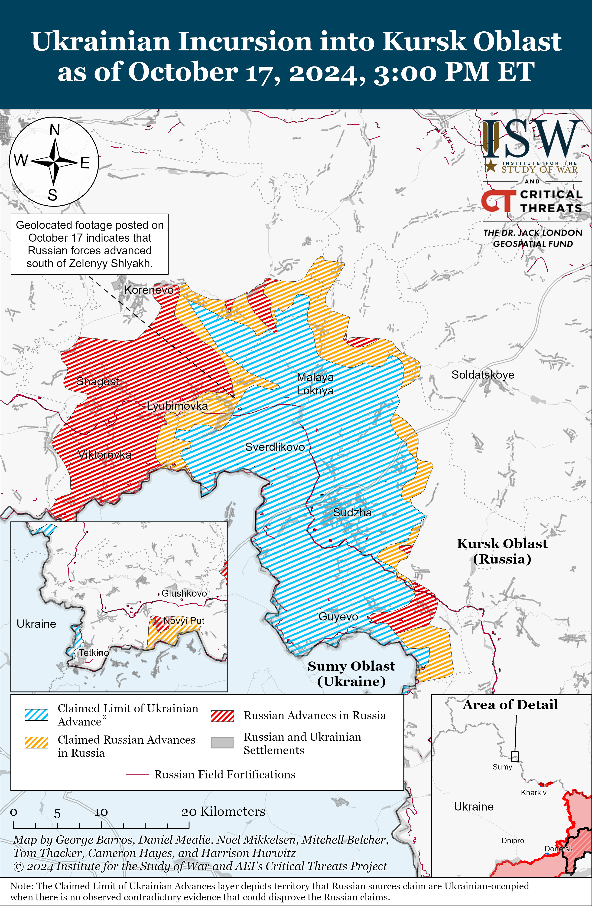
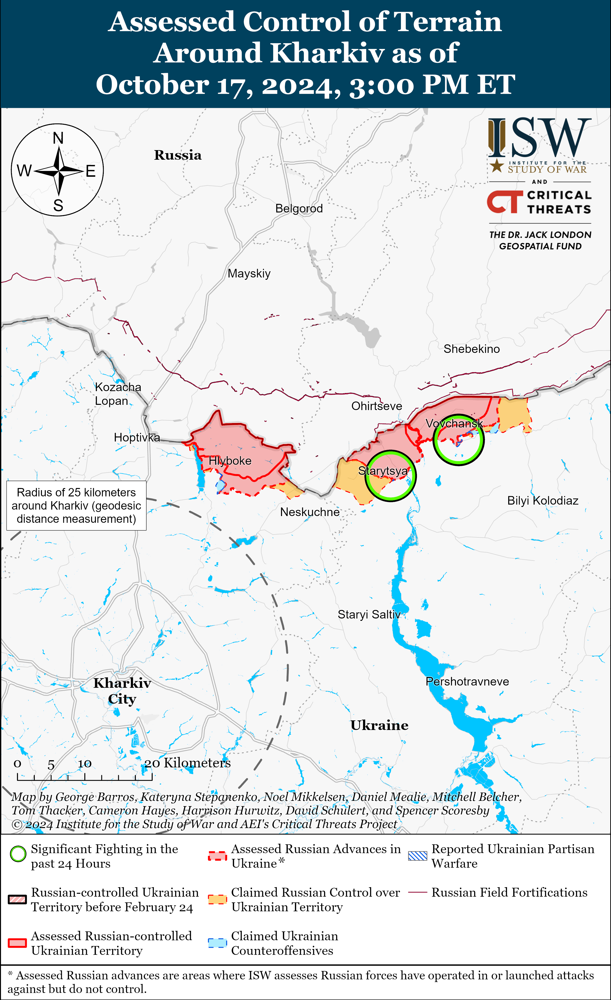
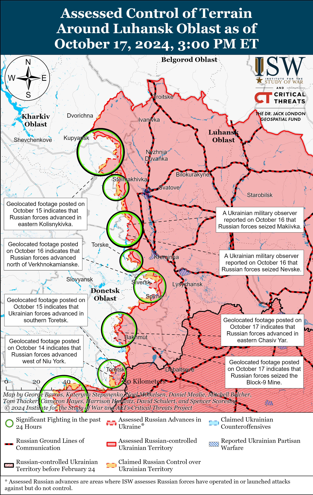
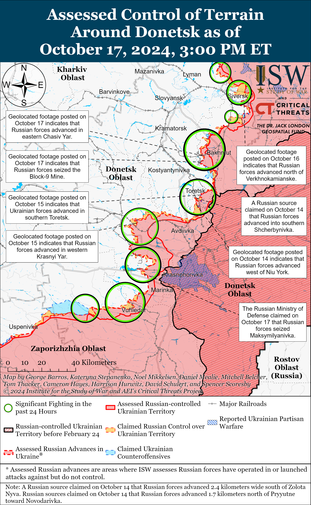
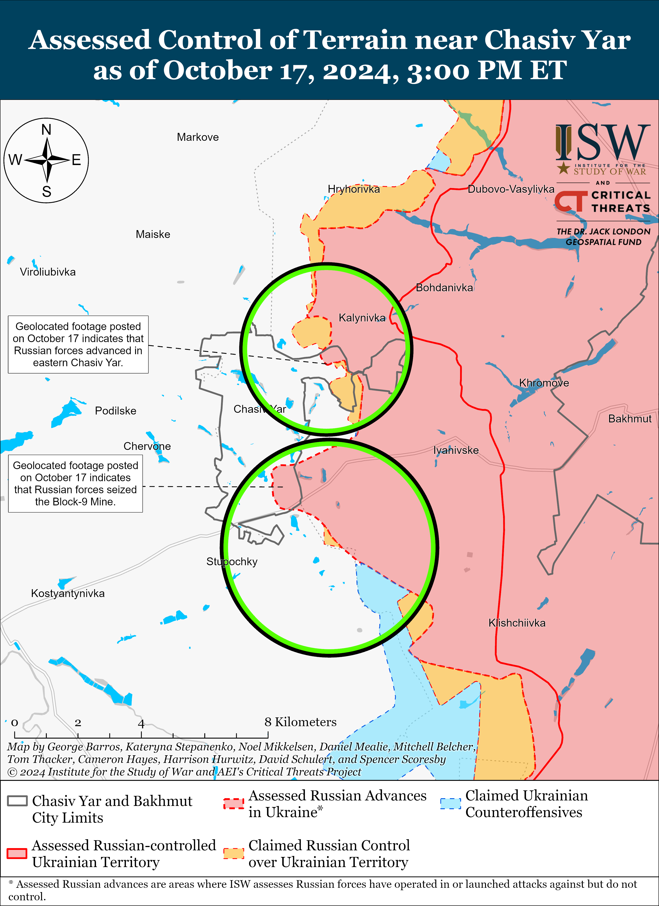
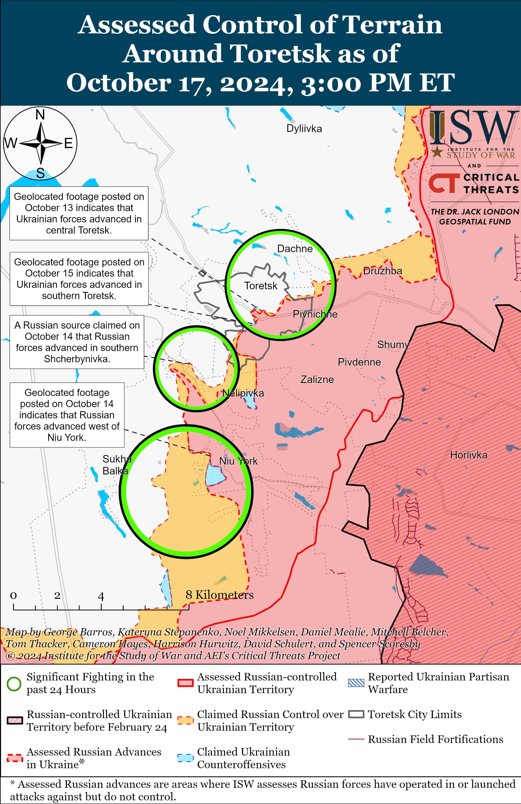
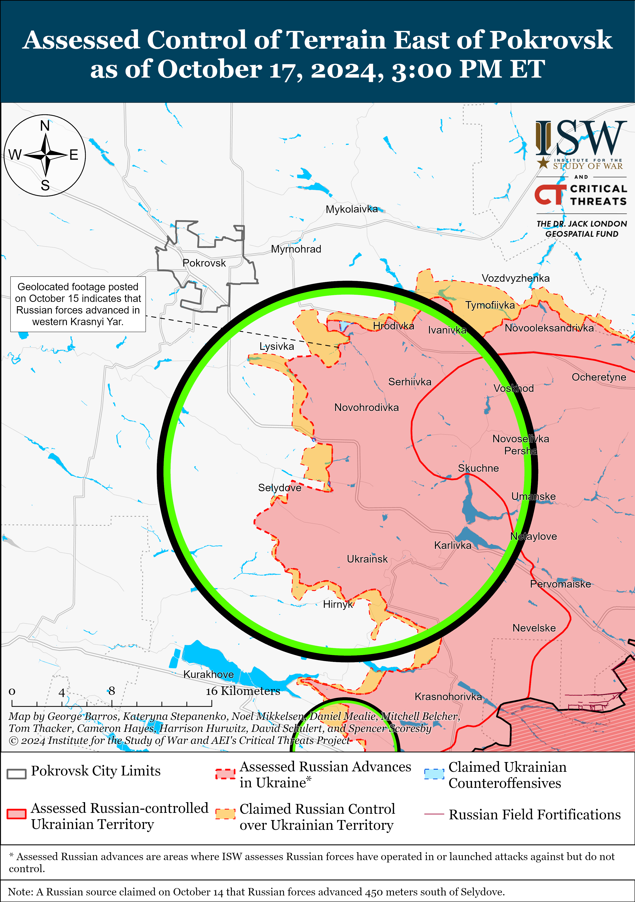
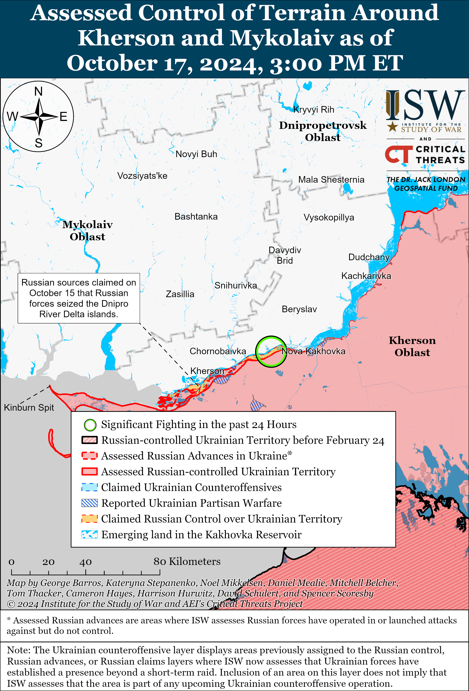
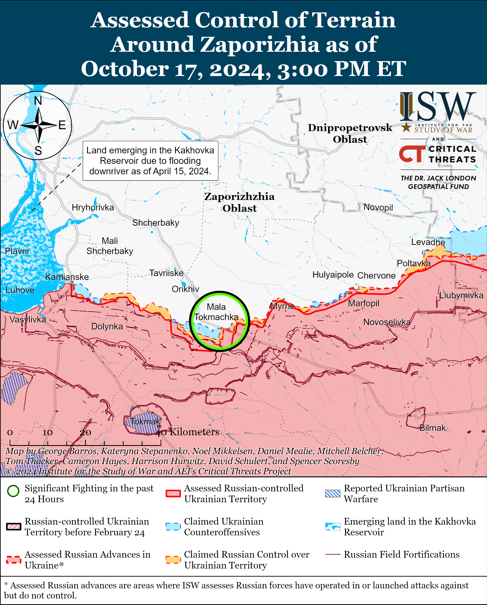

# Russian Offensive Campaign Assessment, October 17, 2024

**October 17, 2024, 4:35pm ET**

**Click** [**here**](https://storymaps.arcgis.com/stories/36a7f6a6f5a9448496de641cf64bd375) **to see ISW’s interactive map of the Russian invasion of Ukraine. This map is updated daily alongside the static maps present in this report.**

**Click** [**here**](https://storymaps.arcgis.com/stories/83a2f24901c941d581c0c523ecd2619b) **to see ISW's interactive map of Ukraine's offensive in Kursk Oblast.**

**Click** [**here**](https://understandingwar.maps.arcgis.com/apps/instant/3dviewer/index.html?appid=1602762dbcde419bb957dea358449580) **to see ISW’s 3D control of terrain topographic map of Ukraine. Use of a computer (not a mobile device) is strongly recommended for using this data-heavy tool.**

**Click** [**here**](https://storymaps.arcgis.com/stories/733fe90805894bfc8562d90b106aa895) **to access ISW’s archive of interactive time-lapse maps of the Russian invasion of Ukraine. These maps complement the static control-of-terrain map that ISW produces daily by showing a dynamic frontline. ISW will update this time-lapse map archive monthly.**

**Note: The data cut-off for this product was 12:00pm ET on October 17. ISW will cover subsequent reports in the October 18 Russian Offensive Campaign Assessment.**

**Russian sources reported on October 16 that unspecified actors killed the deputy commander of Russia's Special Operations Forces (SSO) Training Center, Nikita Klenkov, near Moscow City.[[1]](#_edn04c6c02da4869dcbe5e7a157a175f5f31)** Klenkov reportedly fought in the war in Ukraine as part of military unit 43292 and was a high-ranking officer of the Russian Main Military Intelligence Directorate (GRU). Russian authorities claimed that Klenkov's murder was a planned contract killing and opened a criminal investigation into the murder but have yet to accuse Ukraine or other Western actors of being involved in the murder.[[2]](#_edn04c6c02da4869dcbe5e7a157a175f5f32) ISW cannot independently verify these claims.

**The European Union (EU) issued a statement on October 16 condemning Russian executions of Ukrainian prisoners of war (POWs) and noted that at least 177 Ukrainian POWs have died in Russian captivity since February 2022.[[3]](#_edn04c6c02da4869dcbe5e7a157a175f5f33)** The EU called Russia's increasingly frequent executions of Ukrainian POWs a grave breach of the Geneva Convention, highlighting that the executions demonstrate Russia’s systemic disregard for international law. The Geneva Convention on POWs prohibits the inhumane treatment and execution of POWs or persons who are clearly rendered *hors de combat*.[[4]](#_edn04c6c02da4869dcbe5e7a157a175f5f34) ISW has recently observed an increase in Russian forces executing Ukrainian POWs throughout the theater of war.[[5]](#_edn04c6c02da4869dcbe5e7a157a175f5f35) Head of the Ukrainian Department for Combating Crimes in Conditions of Armed Conflict Yuri Bilousov stated on October 4 that Ukrainian sources documented evidence indicating that Russian forces have executed 93 Ukrainian POWs on the battlefield since the start of the full-scale invasion and that 80 percent of the recorded cases occurred in 2024.[[6]](#_edn04c6c02da4869dcbe5e7a157a175f5f36)

**Key Takeaways:**

- **Russian sources reported on October 16 that unspecified actors killed the deputy commander of Russia's Special Operations Forces (SSO) Training Center, Nikita Klenkov, near Moscow City.**
- **The European Union (EU) issued a statement on October 16 condemning Russian executions of Ukrainian prisoners of war (POWs) and noted that at least 177 Ukrainian POWs have died in Russian captivity since February 2022.**
- **Ukrainian forces recently advanced near Toretsk and Pokrovsk.**
- **Russian forces recently advanced in Kursk Oblast and near Chasiv Yar, Pokrovsk, and Kurakhove.**

***We do not report in detail on Russian war crimes because these activities are well-covered in Western media and do not directly affect the military operations we are assessing and forecasting. We will continue to evaluate and report on the effects of these criminal activities on the Ukrainian military and the Ukrainian population and specifically on combat in Ukrainian urban areas. We utterly condemn Russian violations of the laws of armed conflict and the Geneva Conventions and crimes against humanity even though we do not describe them in these reports.***

- Ukrainian Operations in the Russian Federation
- Russian Main Effort – Eastern Ukraine (comprised of three subordinate main efforts)
- Russian Subordinate Main Effort #1 – Push Ukrainian forces back from the international border with Belgorod Oblast and approach to within tube artillery range of Kharkiv City
- Russian Subordinate Main Effort #2 – Capture the remainder of Luhansk Oblast and push westward into eastern Kharkiv Oblast and encircle northern Donetsk Oblast
- Russian Subordinate Main Effort #3 – Capture the entirety of Donetsk Oblast
- Russian Supporting Effort – Southern Axis
- Russian Air, Missile, and Drone Campaign
- Russian Mobilization and Force Generation Efforts
- Russian Technological Adaptations
- Activities in Russian-occupied areas
- Ukrainian Defense Industrial Base Efforts
- Russian Information Operations and Narratives
- Significant Activity in Belarus

**Ukrainian Operations in the Russian Federation**

Russian forces advanced on the Western side of the Ukrainian salient in Kursk Oblast amid continued fighting along the salient on October 17. Geolocated footage published on October 17 indicates that Russian forces advanced south of Zelenyy Shlyakh (southeast of Korenevo).[[7]](#_edn04c6c02da4869dcbe5e7a157a175f5f37) Russian forces reportedly continued fighting southeast of Korenevo near Lyubimovka, Malaya Loknya, and Novoivanovka; and south of Sudzha near Plekhovo.[[8]](#_edn04c6c02da4869dcbe5e7a157a175f5f38) Ukrainian forces reportedly counterattacked southeast of Korenevo in the direction of Tolsty Lug, Lyubimovka, Zelenyy Shlyakh, and Nizhnyi Klin; and southeast of Sudzha near Russkaya Konopelka.[[9]](#_edn04c6c02da4869dcbe5e7a157a175f5f39) A Russian milblogger claimed that rainy weather is impacting Russian and Ukrainian operations in Kursk Oblast.[[10]](#_edn04c6c02da4869dcbe5e7a157a175f5f310) Elements of the Russian 106th Airborne (VDV) Division and the 155th Naval Infantry Brigade (Pacific Fleet, Eastern Military District [EMD]) are reportedly operating near Lyubimovka.[[11]](#_edn04c6c02da4869dcbe5e7a157a175f5f311) Elements of the Russian 83rd Airborne Assault Brigade (VDV) are reportedly operating near Tolsty Lug.[[12]](#_edn04c6c02da4869dcbe5e7a157a175f5f312)

A Kremlin-affiliated Russian milblogger claimed that Russian forces continued assaults in Glushkovsky Raion west of the main Ukrainian salient in Kursk Oblast on October 16 and 17, including near Novy Put (south of Glushkovo).[[13]](#_edn04c6c02da4869dcbe5e7a157a175f5f313)

Ukrainian Pivnich (Northern) Group of Forces Spokesperson Colonel Vadym Mysnyk stated on October 17 that Russian forces are conducting strikes against Chernihiv, Sumy, and Kharkiv oblasts less frequently, but that Russian forces continue to conduct glide bomb strikes against Ukrainian positions in Kursk Oblast.[[14]](#_edn04c6c02da4869dcbe5e7a157a175f5f314) Mysnyk stated that Russian forces dropped 34 glide bombs on Ukrainian positions and settlements in Kursk Oblast in recent days.

**Russian Main Effort – Eastern Ukraine**

**Russian Subordinate Main Effort #1 – Kharkiv Oblast** **(Russian objective: Push Ukrainian forces back from the international border with Belgorod Oblast and approach to within tube artillery range of Kharkiv City)**

Russian forces continued assaults northeast of Kharkiv City near Vovchansk and Starytsya on October 16 and 17, but there were no confirmed changes near the frontline.[[15]](#_edn04c6c02da4869dcbe5e7a157a175f5f315) The spokesperson for a Ukrainian brigade operating in the Kharkiv direction reported on October 17 that the October 15 Ukrainian operation that cleared a forest area 400 hectares in size north of Lypsti (north of Kharkiv City) was the result of a long-term Ukrainian effort to push Russian forces back towards the international border between Kharkiv and Belgorod oblasts.[[16]](#_edn04c6c02da4869dcbe5e7a157a175f5f316)

A Russian milblogger claimed that Ukrainian sabotage and reconnaissance groups entered a forest area west of Zhuravlevka, Belgorod Oblast (immediately across the international border north of Kharkiv City and just northwest of the Russian salient in northern Kharkiv Oblast) and unsuccessfully attempted to establish a foothold in the area before being repelled by Russian forces.[[17]](#_edn04c6c02da4869dcbe5e7a157a175f5f317)

**Russian Subordinate Main Effort #2 – Luhansk Oblast** **(Russian objective: Capture the remainder of Luhansk Oblast and push westward into eastern Kharkiv Oblast and northern Donetsk Oblast)**

Russian forces continued assaults along the Kupyansk-Svatove-Kreminna line on October 17, but there were no confirmed changes to the frontline. Kharkiv Oblast Military Administration Head Oleh Synehubov reported that Russian forces recently advanced to an unspecified position within four kilometers of Kupyansk and noted that Ukrainian authorities are evacuating civilians from Kupyansk and the surrounding areas.[[18]](#_edn04c6c02da4869dcbe5e7a157a175f5f318) A Russian milblogger claimed that Russian forces are operating three kilometers away from the northern administrative boundaries of Kupyansk, however.[[19]](#_edn04c6c02da4869dcbe5e7a157a175f5f319) Russian forces continued assaults northeast of Kupyansk near Holubivka, Petropavlivka, and in the direction of Kucherivka; east of Kupyansk near Stepova Novoselivka and Pishchane; southeast of Kupyansk near Hlushkivka, Kolisnykivka, and Kruhlyakivka; west of Svatove near Lozova, Vyshneve, and Nadiya; southwest of Svatove near Hrekivka, Druzhelyubivka, and in the direction of Katerynivka and Novomykhailivka; northwest of Kreminna near Novosadove, Makiivka, and Nevske; west of Kreminna near Terny and Torske; and southwest of Kreminna near Dibrova and Serebryanka on October 16 and 17.[[20]](#_edn04c6c02da4869dcbe5e7a157a175f5f320) Russian milbloggers amplified footage purportedly showing Russian forces striking a bridge across the Oskil River along the P-79 highway between Borova and Horokhovatka (both west of Svatove).[[21]](#_edn04c6c02da4869dcbe5e7a157a175f5f321)

**Russian Subordinate Main Effort #3 – Donetsk Oblast (Russian objective: Capture the entirety of Donetsk Oblast, the claimed territory of Russia’s proxies in Donbas)**

Russian forces continued offensive operations northeast of Siversk near Bilohorivka on October 17 but did not make any confirmed gains.[[22]](#_edn04c6c02da4869dcbe5e7a157a175f5f322)

Russian forces recently advanced within and southeast of Chasiv Yar amid continued offensive operations in the area on October 17. Geolocated footage published on October 17 indicates that Russian forces recently advanced further in eastern Chasiv Yar during a reinforced platoon-sized mechanized assault and recently advanced into the "Block-9" mine southeast of Chasiv Yar.[[23]](#_edn04c6c02da4869dcbe5e7a157a175f5f323) Russian forces continued offensive operations near Chasiv Yar itself, north of Chasiv Yar near Hryhorivka and Mynkivka, east of Chasiv Yar near Ivanivske, and south of Chasiv Yar near Stupochky on October 16 and 17.[[24]](#_edn04c6c02da4869dcbe5e7a157a175f5f324)

Ukrainian forces recently regained territory within Toretsk amid continued Russian offensive operations in the area on October 17. Geolocated footage published on October 15 indicates that Ukrainian forces recently regained positions in central Toretsk.[[25]](#_edn04c6c02da4869dcbe5e7a157a175f5f325) Russian milbloggers claimed that Russian forces advanced up to 2.17 kilometers in depth north of Niu York (south of Toretsk), although ISW has not observed visual confirmation of this claim.[[26]](#_edn04c6c02da4869dcbe5e7a157a175f5f326) Russian forces continued offensive operations near Toretsk, south of Toretsk near Nelipivka, west of Toretsk near Shcherbynivka, and southwest of Toretsk near Sukha Balka on October 16 and 17.[[27]](#_edn04c6c02da4869dcbe5e7a157a175f5f327) Elements of the Russian 132nd Motorized Rifle Brigade (51st Guards Combined Arms Army [CAA], formerly the 1st Donetsk People's Republic Army Corps [DNR AC]) are reportedly operating in the Toretsk direction.[[28]](#_edn04c6c02da4869dcbe5e7a157a175f5f328)

Russian forces recently advanced southeast of Pokrovsk and Ukrainian forces recently advanced east of Pokrovsk. Geolocated footage published on October 17 indicates that Russian forces operating southeast of Pokrovsk recently made gains in eastern Lysivka (west of Novohrodivka), seized a water treatment facility west of Novohrodivka, and advanced along a windbreak southwest of Selydove during what appears to have been a company-sized Russian mechanized assault.[[29]](#_edn04c6c02da4869dcbe5e7a157a175f5f329) Geolocated footage published on October 17 indicates that Ukrainian forces recently regained marginal ground near Mykolaivka (east of Pokrovsk and west of Hrodivka).[[30]](#_edn04c6c02da4869dcbe5e7a157a175f5f330) Russian milbloggers claimed that Russian forces operating southeast of Pokrovsk also advanced along a front 4.35 kilometers wide on Selydove's northwestern outskirts, south of Tsukuryne, and east of Novoselydivka.[[31]](#_edn04c6c02da4869dcbe5e7a157a175f5f331) ISW has not observed confirmation of these Russian claims, however. Russian forces continued offensive operations east of Pokrovsk near Promin and southeast of Pokrovsk near Sukhi Yar, Lysivka, Selydove, Izmailivka, Novodmytrivka, Novoselydivka, Hirnyk, and Zoryane.[[32]](#_edn04c6c02da4869dcbe5e7a157a175f5f332) A Russian milblogger claimed that small Russian infantry assault groups in the Pokrovsk direction are working in pairs in which one group attempts to establish a tactical foothold at a forward position while the other group follows behind for support.[[33]](#_edn04c6c02da4869dcbe5e7a157a175f5f333) Elements of the Russian "Black Knives Division" are reportedly attacking near Selydove.[[34]](#_edn04c6c02da4869dcbe5e7a157a175f5f334) Ukrainian military observer Kostyantyn Mashovets stated on October 17 that the Russian Central Grouping of Forces operating in the Toretsk, Pokrovsk, and Kurakhove directions received 1,622 troops in the last two weeks of September (September 16 to 30) to reinforce advanced units and to replace losses.[[35]](#_edn04c6c02da4869dcbe5e7a157a175f5f335)

Russian forces recently advanced east of Kurakhove and continued offensive operations in the area on October 17. Geolocated footage published on October 11 indicates that Russian forces recently advanced within Maksymilyanivka.[[36]](#_edn04c6c02da4869dcbe5e7a157a175f5f336) Russian sources, including the Russian Ministry of Defense (MoD), claimed on October 17 that Russian forces fully seized Maksymilyanivka, although ISW has not observed confirmation of this claim.[[37]](#_edn04c6c02da4869dcbe5e7a157a175f5f337) Russian forces continued offensive operations east of Kurakhove near Heorhiivka and Hostre on October 16 and 17.[[38]](#_edn04c6c02da4869dcbe5e7a157a175f5f338)

Russian forces continued offensive operations southwest of Donetsk City on October 17 but did not make any confirmed advances in the area. Russian milbloggers claimed that elements of the 39th Motorized Rifle Brigade (68th Army Corps [AC], Eastern Military District [EMD]) advanced up to a kilometer and established a foothold on the southern outskirts of Katerynivka, although ISW has not observed visual confirmation of this claim.[[39]](#_edn04c6c02da4869dcbe5e7a157a175f5f339) Russian forces continued offensive operations near Antonivka, Kostyantynivka, Vodyane, Bohoyavlenka, Novoukrainka, and Zolota Nyva on October 16 and 17.[[40]](#_edn04c6c02da4869dcbe5e7a157a175f5f340) Elements of the Russian 1472nd Motorized Rifle Regiment (68th AC) are also reportedly operating near Katerynivka.[[41]](#_edn04c6c02da4869dcbe5e7a157a175f5f341)

Russian and Ukrainian sources did not report any fighting in the Donetsk-Zaporizhia Oblast border area on October 17.

**Russian Supporting Effort – Southern Axis** **(Russian objective: Maintain frontline positions and secure rear areas against Ukrainian strikes)**

Russian forces continued ground attacks in western Zaporizhia Oblast on October 17, but there were no confirmed changes to the frontline. Russian forces conducted assaults northwest of Robotyne, near Mala Tokmachka (northeast of Robotyne), north of Verbove (east of Robotyne), in the direction of Novodanylivka (north of Robotyne), and in Kamyanske (south of Stepnohirsk) on October 16 and 17.[[42]](#_edn04c6c02da4869dcbe5e7a157a175f5f342) Elements of the Russian 35th Combined Arms Army (CAA) (Eastern Military District [EMD]) reportedly continue to operate in the Polohy (eastern Zaporizhia Oblast) direction.[[43]](#_edn04c6c02da4869dcbe5e7a157a175f5f343)

Russian forces continued attacks in east (left) bank Kherson Oblast on October 16 and 17 but did not make any confirmed advances.[[44]](#_edn04c6c02da4869dcbe5e7a157a175f5f344) Air defense elements of the Russian 18th CAA (Southern Military District [SMD]) reportedly continue operating in the Kherson direction.[[45]](#_edn04c6c02da4869dcbe5e7a157a175f5f345)

Ukrainian military observer Kostyantyn Mashovets reported on October 17 that the Russian military command began testing observation balloons to conduct aerial reconnaissance and defend the Russian Black Sea Fleet (BSF) assets in the port of Novorossiysk, Russia from Ukrainian strikes in September 2024.[[46]](#_edn04c6c02da4869dcbe5e7a157a175f5f346)

**Russian Air, Missile, and Drone Campaign** **(Russian Objective: Target Ukrainian military and civilian infrastructure in the rear and on the frontline)**

Russian forces conducted a series of missile and drone strikes against Ukraine overnight on October 16 to 17. The Ukrainian Air Force reported that Russian forces launched a Kh-59 cruise missile from airspace over Kursk Oblast and launched 56 unspecified strike drones, likely Shahed drones, from Kursk Oblast, Oryol Oblast, and Primorsko-Akhtarsk, Krasnodar Krai.[[47]](#_edn04c6c02da4869dcbe5e7a157a175f5f347) The Ukrainian Air Force reported that Ukrainian air defenses downed 22 Russian drones over Sumy, Kyiv, Poltava, Chernihiv, Zhytomyr, Mykolaiv, Cherkasy, Odesa, and Ternopil oblasts as of 0500 on October 17.[[48]](#_edn04c6c02da4869dcbe5e7a157a175f5f348) The Ukrainian Air Force reported that Ukrainian electronic warfare (EW) interference caused 27 Russian drones to become ”lost” in Ukrainian air space and miss their targets, that two drones left Ukrainian airspace and flew into Belarusian airspace, and that five Russian drones struck infrastructure facilities along the frontline in Ukraine. Kyiv City Military Administration Head Serhii Popko and Kyiv City Mayor Vitaliy Klitschko reported that Russian drones struck an apartment building and a kindergarten in Desnyan raion, Kyiv City.[[49]](#_edn04c6c02da4869dcbe5e7a157a175f5f349) Ukrainian officials stated that Russian forces also struck energy infrastructure in Mykolaiv Oblast overnight.[[50]](#_edn04c6c02da4869dcbe5e7a157a175f5f350)

**Russian Mobilization and Force Generation Efforts** **(Russian objective: Expand combat power without conducting general mobilization)**

Russian Security Council Deputy Chairperson Dmitry Medvedev claimed on October 17 that Russian forces have recruited roughly 78 percent of their annual recruitment goal thus far in 2024. Medvedev did not specify Russia's total contract service recruitment goal, however.[[51]](#_edn04c6c02da4869dcbe5e7a157a175f5f351) Russian President Vladimir Putin signed a decree in September 2024 establishing the intended staffing of the Russian military at 1.5 million combat personnel, a 350,000 increase from a similar decree in 2023.[[52]](#_edn04c6c02da4869dcbe5e7a157a175f5f352) Medvedev stated on July 4 that Russian forces had recruited about 190,000 new contract soldiers in 2024 and that about 1,000 people sign contracts with the Russian Ministry of Defense (MoD) daily, a decrease from Medvedev's October 2023 claim that 1,600 people sign military service contracts with the MoD daily.[[53]](#_edn04c6c02da4869dcbe5e7a157a175f5f353)

The Russian MoD stated on October 17 that Russian and the People's Republic of China (PRC) People's Liberation Army (PLA) warships entered Qingdao Port in the PRC and will remain there until October 20 following joint naval patrol exercises.[[54]](#_edn04c6c02da4869dcbe5e7a157a175f5f354)

**Russian Technological Adaptations** **(Russian objective: Introduce technological innovations to optimize systems for use in Ukraine)**

Some Russian defense enterprises are struggling with quality control issues due to Western sanctions. Former Russian space agency Roscosmos head and current Zaporizhia Oblast occupation senator Dmitry Rogozin complained on October 17 that the Ulyanovsk Automobile Plant (UAZ) is having quality control issues and that UAZ and the Russian BARS-Sarmat detachment will soon sign an agreement for the detachment to participate in quality control testing.[[55]](#_edn04c6c02da4869dcbe5e7a157a175f5f355) The press service of Russian defense industrial base (DIB) company Sollers, which owns UAZ, responded on October 17 that these quality control issues are due to Western sanctions.[[56]](#_edn04c6c02da4869dcbe5e7a157a175f5f356) Rogozin previously complained about the quality of engines in UAZ Patriot trucks, which Russian forces use for transport in Ukraine.[[57]](#_edn04c6c02da4869dcbe5e7a157a175f5f357)

Ukrainian military observer Kostyantyn Mashovets stated on October 17 that Russia's Chkalov Novosibirsk Aviation Plant transferred nine Su-34 aircraft to Russian aircraft manufacturers in 2024 and delivered the most recent batch of three Su-34 aircraft to Russian forces in September 2024.[[58]](#_edn04c6c02da4869dcbe5e7a157a175f5f358) Mashovets stated that Russia's defense industrial base (DIB) has produced between 170 and 172 Su-34 aircraft since beginning serial production of the aircraft in the late 2000s or early 2010s.

**Ukrainian Defense Industrial Efforts** **(Ukrainian objective: Develop its defense industrial base to become more self-sufficient in cooperation with US, European, and international partners)**

*ISW is permanently suspending regular coverage of Ukrainian defense industrial efforts and will cover any notable inflections in topline text or separate special editions moving forward.*

**Activities in Russian-occupied areas** **(Russian objective: Consolidate administrative control of annexed areas; forcibly integrate Ukrainian citizens into Russian sociocultural, economic, military, and governance systems)**

*ISW is not publishing reporting on activities in Russian-occupied areas today.*

**Russian Information Operations and Narratives**

*ISW is permanently suspending regular coverage of Russian information operations and narratives as a section in the daily updates and will cover any notable inflections in topline text or separate special editions moving forward.*

**Significant activity in Belarus** **(Russian efforts to increase its military presence in Belarus and further integrate Belarus into Russian-favorable frameworks and Wagner Group activity in Belarus)**

Ukrainian military observer Kostyantyn Mashovets stated on October 17 that the Belarusian military command continues to enhance its air defense and air force capabilities.[[59]](#_edn04c6c02da4869dcbe5e7a157a175f5f359) Mashovets stated that Belarusian forces are forming the 62nd Anti-aircraft Missile Regiment in Grodno (near the Belarusian border with Lithuania) which will be armed with Russian-provided TOR-M1/M2 air defense systems. Mashovets stated the Russian military command deployed an operational group of anti-aircraft missile forces of the Russian 11th Army of the Air Force and Air Defense of the Aerospace Forces consisting of elements of the 1533rd Anti-Aircraft Missile Regiment (93rd Air Defense Division) and 1530th Anti-Aircraft Missile Regiment (25th Air Defense Division) to the Baranovichi, Mazyr, and Zyabrovka airfields in Belarus. Mashovets also stated that there are up to 610 Russian servicemembers, six to seven Pantsir air defense systems, and up to 15 to 16 launchers and other elements of Russian-provided S-300/400 air defense systems in Belarus.

**Note: ISW does not receive any classified material from any source, uses only publicly available information, and draws extensively on Russian, Ukrainian, and Western reporting and social media as well as commercially available satellite imagery and other geospatial data as the basis for these reports. References to all sources used are provided in the endnotes of each update.**

---

[[1]](#_edn04c6c02da4869dcbe5e7a157a175f5f3ref1) <https://t.me/istories_media/7854> ; <https://t.me/rbc_news/105187> ; <https://t.me/tass_agency/279685> ; <https://t.me/tass_agency/279700> ; <https://t.me/gsuskmosobl/2626> ; [https://meduza](https://meduza/) dot io/news/2024/10/16/v-podmoskovie-ubili-zamkomandira-voyskovoy-chasti-vernuvshegosya-s-voyny-nedelyu-nazad-tass-pishet-chto-ubiystvo-zakaznoe ; <https://t.me/vchkogpu/51782> ; <https://t.me/vchkogpu/51783>

[[2]](#_edn04c6c02da4869dcbe5e7a157a175f5f3ref2) <https://t.me/tass_agency/279685> ; <https://t.me/tass_agency/279700> ; <https://t.me/gsuskmosobl/2626> ; [https://meduza](https://meduza/) dot io/news/2024/10/16/v-podmoskovie-ubili-zamkomandira-voyskovoy-chasti-vernuvshegosya-s-voyny-nedelyu-nazad-tass-pishet-chto-ubiystvo-zakaznoe

[[3]](#_edn04c6c02da4869dcbe5e7a157a175f5f3ref3) https://www.eeas.europa dot eu/eeas/ukrainerussia-statement-high-representative-killing-ukrainian-prisoners-war\_en ; https://suspilne dot media/859611-es-zasudiv-rozstrili-rosieu-ukrainskih-vijskovopolonenih/

[[4]](#_edn04c6c02da4869dcbe5e7a157a175f5f3ref4) https://www.ohchr.org/en/instruments-mechanisms/instruments/geneva-convention-relative-treatment-prisoners-war

[[5]](#_edn04c6c02da4869dcbe5e7a157a175f5f3ref5) https://www.understandingwar.org/backgrounder/russian-offensive-campaign-assessment-october-13-2024

[[6]](#_edn04c6c02da4869dcbe5e7a157a175f5f3ref6) https://armyinform.com dot ua/2024/10/04/93-ukrayinskyh-vijskovopolonenyh-stratyly-rosiyany-na-poli-boyu-80-czogo-roku/; https://suspilne dot media/851175-rosiani-stratili-na-poli-bou-93-ukrainskih-vijskovih-aki-zdalisa-u-polon-ofis-genprokurora/; https://www.voanews.com/a/kyiv-says-russia-has-executed-93-ukrainian-pows-since-start-of-war/7811441.html

[[7]](#_edn04c6c02da4869dcbe5e7a157a175f5f3ref7) https://x.com/giK1893/status/1846842712177197222; https://t.me/brygada47/1029; https://t.me/bigcatsinfo/3633; https://t.me/khornegroup/2852; https://t.me/creamy\_caprice/7140

[[8]](#_edn04c6c02da4869dcbe5e7a157a175f5f3ref8) https://t.me/mod\_russia/44606

[[9]](#_edn04c6c02da4869dcbe5e7a157a175f5f3ref9) https://t.me/mod\_russia/44606

[[10]](#_edn04c6c02da4869dcbe5e7a157a175f5f3ref10) https://t.me/Sladkov\_plus/11607

[[11]](#_edn04c6c02da4869dcbe5e7a157a175f5f3ref11) <https://t.me/rusich_army/17759>; https://t.me/RVvoenkor/78891

[[12]](#_edn04c6c02da4869dcbe5e7a157a175f5f3ref12) https://t.me/rusich\_army/17759

[[13]](#_edn04c6c02da4869dcbe5e7a157a175f5f3ref13) <https://t.me/rybar/64493>

[[14]](#_edn04c6c02da4869dcbe5e7a157a175f5f3ref14) https://armyinform dot com.ua/2024/10/17/vtrychi-bilshe-rosiyany-byut-kabamy-po-kurshhyni-v-razy-intensyvnishe/ ; <https://www.youtube.com/watch?v=j5TqaWCCdUg>

[[15]](#_edn04c6c02da4869dcbe5e7a157a175f5f3ref15) <https://www.facebook.com/GeneralStaff.ua/posts/pfbid0VDxXQ3QHasCuZJf3GcuVeBMdsLFiiyQtwJXiUdGYsjM3pbk7Ja8P8RcUDrxMwCKBl> ; <https://www.facebook.com/GeneralStaff.ua/posts/pfbid02QStcKR6o3ENGLEDtW4YEEyVRhjxY3dDGoPyeQwmnYnipKEQcur9mSXF5whGYpJF5l> ; <https://www.facebook.com/GeneralStaff.ua/posts/pfbid0KcSWBRUpFkxvTPA7asYUF3zaQ3yWFc6MZ59JaJCvyH6pr1Y5NxiL9vPd3coaTA81l> ; <https://t.me/otukharkiv/2142>

[[16]](#_edn04c6c02da4869dcbe5e7a157a175f5f3ref16) <https://armyinform.com> dot ua/2024/10/17/kulminacziya-tryvaloyi-operacziyi-na-pivnochi-harkivshhyny-voroga-posunuly-do-kordonu/ ; https://youtu.be/aDXWlQ2K0dM

[[17]](#_edn04c6c02da4869dcbe5e7a157a175f5f3ref17) <https://t.me/RVvoenkor/78864>

[[18]](#_edn04c6c02da4869dcbe5e7a157a175f5f3ref18) [https://suspilne](https://suspilne/) dot media/859613-zasidanna-ramstajn-vidbudetsa-onlajn-nova-dopomoga-vid-ssa-ta-boi-v-kurskij-oblasti-967-den-vijni-onlajn/?anchor=live\_1729168866&utm\_source=copylink&utm\_medium=ps

[[19]](#_edn04c6c02da4869dcbe5e7a157a175f5f3ref19) https://t.me/notes\_veterans/20027

[[20]](#_edn04c6c02da4869dcbe5e7a157a175f5f3ref20) <https://www.facebook.com/GeneralStaff.ua/posts/pfbid0VDxXQ3QHasCuZJf3GcuVeBMdsLFiiyQtwJXiUdGYsjM3pbk7Ja8P8RcUDrxMwCKBl> ; <https://www.facebook.com/GeneralStaff.ua/posts/pfbid02QStcKR6o3ENGLEDtW4YEEyVRhjxY3dDGoPyeQwmnYnipKEQcur9mSXF5whGYpJF5l> ; <https://www.facebook.com/GeneralStaff.ua/posts/pfbid0KcSWBRUpFkxvTPA7asYUF3zaQ3yWFc6MZ59JaJCvyH6pr1Y5NxiL9vPd3coaTA81l> ; <https://t.me/RVvoenkor/78876> ; <https://t.me/tass_agency/279788>

[[21]](#_edn04c6c02da4869dcbe5e7a157a175f5f3ref21) <https://t.me/sashakots/49581> ; <https://t.me/epoddubny/21370> ; https://t.me/notes\_veterans/20027

[[22]](#_edn04c6c02da4869dcbe5e7a157a175f5f3ref22) https://www.facebook.com/GeneralStaff.ua/posts/pfbid0VDxXQ3QHasCuZJf3GcuVeBMdsLFiiyQtwJXiUdGYsjM3pbk7Ja8P8RcUDrxMwCKBl

[[23]](#_edn04c6c02da4869dcbe5e7a157a175f5f3ref23) https://t.me/creamy\_caprice/7136; <https://t.me/rt_russian/218238> ; https://t.me/creamy\_caprice/7143; <https://t.me/EnotHersonVDV/4421>

[[24]](#_edn04c6c02da4869dcbe5e7a157a175f5f3ref24) <https://www.facebook.com/GeneralStaff.ua/posts/pfbid0VDxXQ3QHasCuZJf3GcuVeBMdsLFiiyQtwJXiUdGYsjM3pbk7Ja8P8RcUDrxMwCKBl> ; <https://www.facebook.com/GeneralStaff.ua/posts/pfbid02QStcKR6o3ENGLEDtW4YEEyVRhjxY3dDGoPyeQwmnYnipKEQcur9mSXF5whGYpJF5l> ; https://www.facebook.com/GeneralStaff.ua/posts/pfbid0KcSWBRUpFkxvTPA7asYUF3zaQ3yWFc6MZ59JaJCvyH6pr1Y5NxiL9vPd3coaTA81l

[[25]](#_edn04c6c02da4869dcbe5e7a157a175f5f3ref25) https://t.me/creamy\_caprice/7129; https://t.me/orbSparta\_Officially/217

[[26]](#_edn04c6c02da4869dcbe5e7a157a175f5f3ref26) <https://t.me/DnevnikDesantnika/17433> ; https://t.me/RVvoenkor/78876

[[27]](#_edn04c6c02da4869dcbe5e7a157a175f5f3ref27) <https://www.facebook.com/GeneralStaff.ua/posts/pfbid0VDxXQ3QHasCuZJf3GcuVeBMdsLFiiyQtwJXiUdGYsjM3pbk7Ja8P8RcUDrxMwCKBl> ; <https://www.facebook.com/GeneralStaff.ua/posts/pfbid02QStcKR6o3ENGLEDtW4YEEyVRhjxY3dDGoPyeQwmnYnipKEQcur9mSXF5whGYpJF5l> ; https://www.facebook.com/GeneralStaff.ua/posts/pfbid0KcSWBRUpFkxvTPA7asYUF3zaQ3yWFc6MZ59JaJCvyH6pr1Y5NxiL9vPd3coaTA81l

[[28]](#_edn04c6c02da4869dcbe5e7a157a175f5f3ref28) https://t.me/milinfolive/132990

[[29]](#_edn04c6c02da4869dcbe5e7a157a175f5f3ref29) https://t.me/creamy\_caprice/7141; <https://t.me/jagers68/300> ; <https://t.me/shershni68/308> ; <https://x.com/Bielitzling/status/1846949313944969595> ;  <https://t.me/creamy_caprice/7134> ; <https://t.me/UralArmor90/526>

[[30]](#_edn04c6c02da4869dcbe5e7a157a175f5f3ref30) https://x.com/EerikMatero/status/1846961655818641456; https://t.me/urga\_74/2154

[[31]](#_edn04c6c02da4869dcbe5e7a157a175f5f3ref31) <https://t.me/RVvoenkor/78876> ; <https://t.me/z_arhiv/28617> ; https://t.me/voenkorKotenok/59596 ; https://t.me/DnevnikDesantnika/17459

[[32]](#_edn04c6c02da4869dcbe5e7a157a175f5f3ref32) <https://www.facebook.com/GeneralStaff.ua/posts/pfbid0VDxXQ3QHasCuZJf3GcuVeBMdsLFiiyQtwJXiUdGYsjM3pbk7Ja8P8RcUDrxMwCKBl> ; <https://www.facebook.com/GeneralStaff.ua/posts/pfbid02QStcKR6o3ENGLEDtW4YEEyVRhjxY3dDGoPyeQwmnYnipKEQcur9mSXF5whGYpJF5l> ; https://www.facebook.com/GeneralStaff.ua/posts/pfbid0KcSWBRUpFkxvTPA7asYUF3zaQ3yWFc6MZ59JaJCvyH6pr1Y5NxiL9vPd3coaTA81l

[[33]](#_edn04c6c02da4869dcbe5e7a157a175f5f3ref33) https://t.me/voenkorKotenok/59595

[[34]](#_edn04c6c02da4869dcbe5e7a157a175f5f3ref34) https://t.me/creamy\_caprice/7134; https://t.me/UralArmor90/526

[[35]](#_edn04c6c02da4869dcbe5e7a157a175f5f3ref35) https://t.me/zvizdecmanhustu/2273 ; https://www.facebook.com/pashtetof/posts/pfbid02C4Hgu6arCsm5jEWHAL2PZXXW6JvBrWXgQtDi2fuTKsLSJbt3NYRFw8hZCsAK4hP6l

[[36]](#_edn04c6c02da4869dcbe5e7a157a175f5f3ref36) https://t.me/razvedkavperedZ/794; https://t.me/creamy\_caprice/7138

[[37]](#_edn04c6c02da4869dcbe5e7a157a175f5f3ref37) https://t.me/z\_arhiv/28629; https://t.me/mod\_russia/44602

[[38]](#_edn04c6c02da4869dcbe5e7a157a175f5f3ref38) <https://www.facebook.com/GeneralStaff.ua/posts/pfbid0VDxXQ3QHasCuZJf3GcuVeBMdsLFiiyQtwJXiUdGYsjM3pbk7Ja8P8RcUDrxMwCKBl> ; <https://www.facebook.com/GeneralStaff.ua/posts/pfbid02QStcKR6o3ENGLEDtW4YEEyVRhjxY3dDGoPyeQwmnYnipKEQcur9mSXF5whGYpJF5l> ; <https://www.facebook.com/GeneralStaff.ua/posts/pfbid0KcSWBRUpFkxvTPA7asYUF3zaQ3yWFc6MZ59JaJCvyH6pr1Y5NxiL9vPd3coaTA81l>

[[39]](#_edn04c6c02da4869dcbe5e7a157a175f5f3ref39) <https://t.me/voin_dv/11377> ; <https://t.me/RVvoenkor/78876> ; https://t.me/DnevnikDesantnika/17434

[[40]](#_edn04c6c02da4869dcbe5e7a157a175f5f3ref40) <https://www.facebook.com/GeneralStaff.ua/posts/pfbid0KcSWBRUpFkxvTPA7asYUF3zaQ3yWFc6MZ59JaJCvyH6pr1Y5NxiL9vPd3coaTA81l> ; <https://www.facebook.com/GeneralStaff.ua/posts/pfbid02QStcKR6o3ENGLEDtW4YEEyVRhjxY3dDGoPyeQwmnYnipKEQcur9mSXF5whGYpJF5l> ; <https://www.facebook.com/GeneralStaff.ua/posts/pfbid0VDxXQ3QHasCuZJf3GcuVeBMdsLFiiyQtwJXiUdGYsjM3pbk7Ja8P8RcUDrxMwCKBl> ; <https://t.me/wargonzo/22644> ; <https://t.me/voin_dv/11377> ;

[[41]](#_edn04c6c02da4869dcbe5e7a157a175f5f3ref41) https://t.me/boris\_rozhin/141022

[[42]](#_edn04c6c02da4869dcbe5e7a157a175f5f3ref42)<https://www.facebook.com/GeneralStaff.ua/posts/pfbid0VDxXQ3QHasCuZJf3GcuVeBMdsLFiiyQtwJXiUdGYsjM3pbk7Ja8P8RcUDrxMwCKBl> ; <https://www.facebook.com/GeneralStaff.ua/posts/pfbid02QStcKR6o3ENGLEDtW4YEEyVRhjxY3dDGoPyeQwmnYnipKEQcur9mSXF5whGYpJF5l> ;https://www.facebook.com/GeneralStaff.ua/posts/pfbid0KcSWBRUpFkxvTPA7asYUF3zaQ3yWFc6MZ59JaJCvyH6pr1Y5NxiL9vPd3coaTA81lf ; <https://t.me/wargonzo/22644> ;<https://t.me/dva_majors/55239>

[[43]](#_edn04c6c02da4869dcbe5e7a157a175f5f3ref43) https://t.me/voin\_dv/11373

[[44]](#_edn04c6c02da4869dcbe5e7a157a175f5f3ref44)<https://www.facebook.com/GeneralStaff.ua/posts/pfbid0VDxXQ3QHasCuZJf3GcuVeBMdsLFiiyQtwJXiUdGYsjM3pbk7Ja8P8RcUDrxMwCKBl> ; <https://www.facebook.com/GeneralStaff.ua/posts/pfbid02QStcKR6o3ENGLEDtW4YEEyVRhjxY3dDGoPyeQwmnYnipKEQcur9mSXF5whGYpJF5l> ; <https://www.facebook.com/GeneralStaff.ua/posts/pfbid0KcSWBRUpFkxvTPA7asYUF3zaQ3yWFc6MZ59JaJCvyH6pr1Y5NxiL9vPd3coaTA81l>

[[45]](#_edn04c6c02da4869dcbe5e7a157a175f5f3ref45) <https://t.me/dva_majors/55237>

[[46]](#_edn04c6c02da4869dcbe5e7a157a175f5f3ref46) https://t.me/zvizdecmanhustu/2274

[[47]](#_edn04c6c02da4869dcbe5e7a157a175f5f3ref47) <https://t.me/kpszsu/21436>

[[48]](#_edn04c6c02da4869dcbe5e7a157a175f5f3ref48) <https://t.me/kpszsu/21436>

[[49]](#_edn04c6c02da4869dcbe5e7a157a175f5f3ref49) https://t.me/VA\_Kyiv/8606 ; https://suspilne dot media/859613-zasidanna-ramstajn-vidbudetsa-onlajn-nova-dopomoga-vid-ssa-ta-boi-v-kurskij-oblasti-967-den-vijni-onlajn/?anchor=live\_1729144330&utm\_source=copylink&utm\_medium=ps ; https://t.me/astrapress/66474 ; https://t.me/vitaliy\_klitschko/3621

[[50]](#_edn04c6c02da4869dcbe5e7a157a175f5f3ref50) <https://t.me/mykolaivskaODA/11789>; <https://armyinform> dot com.ua/2024/10/17/mykolayivshhyna-pid-udarom-vorog-poshkodyv-energosystemu/; <https://t.me/SJTF_Odes/11647>

[[51]](#_edn04c6c02da4869dcbe5e7a157a175f5f3ref51) https://t.me/tass\_agency/279919

[[52]](#_edn04c6c02da4869dcbe5e7a157a175f5f3ref52) <https://www.understandingwar.org/backgrounder/russian-offensive-campaign-assessment-september-16-2024>; <https://iz> dot ru/1759872/2024-09-16/putin-postanovil-uvelichit-shtatnuiu-chislennost-vooruzhennykh-sil

[[53]](#_edn04c6c02da4869dcbe5e7a157a175f5f3ref53) <https://www.vedomosti> dot ru/politics/news/2024/07/04/1048074-medvedev-kontrakti-s-minoboroni; <https://www.vedomosti> dot ru/society/news/2023/10/25/1002510-medvedev-zaimetsya-doukomplektovaniem-kontraktnikami

[[54]](#_edn04c6c02da4869dcbe5e7a157a175f5f3ref54) https://t.me/mod\_russia/44609

[[55]](#_edn04c6c02da4869dcbe5e7a157a175f5f3ref55) https://t.me/dva\_majors/55272 ; https://t.me/rogozin\_do/6426 ; https://t.me/rbc\_news/105245

[[56]](#_edn04c6c02da4869dcbe5e7a157a175f5f3ref56) . https://t.me/rbc\_news/105245 ; https://www.rbc dot ru/business/17/10/2024/6710cee49a7947277c10edef?utm\_source=telegram&utm\_medium=messenger

[[57]](#_edn04c6c02da4869dcbe5e7a157a175f5f3ref57) https://t.me/rogozin\_do/6060

[[58]](#_edn04c6c02da4869dcbe5e7a157a175f5f3ref58) https://t.me/zvizdecmanhustu/2273

[[59]](#_edn04c6c02da4869dcbe5e7a157a175f5f3ref59) https://t.me/zvizdecmanhustu/2273 ; https://www.facebook.com/pashtetof/posts/pfbid02C4Hgu6arCsm5jEWHAL2PZXXW6JvBrWXgQtDi2fuTKsLSJbt3NYRFw8hZCsAK4hP6l

View Citations
