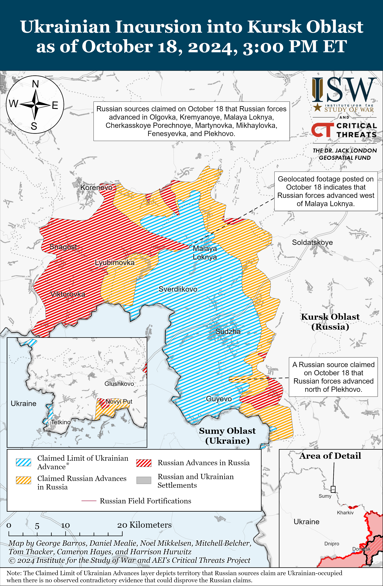
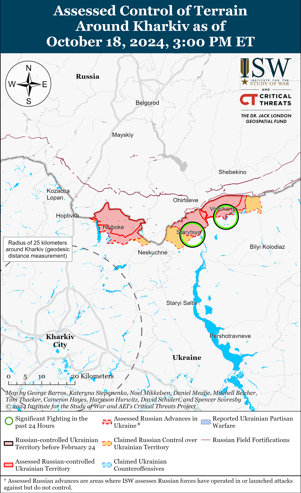
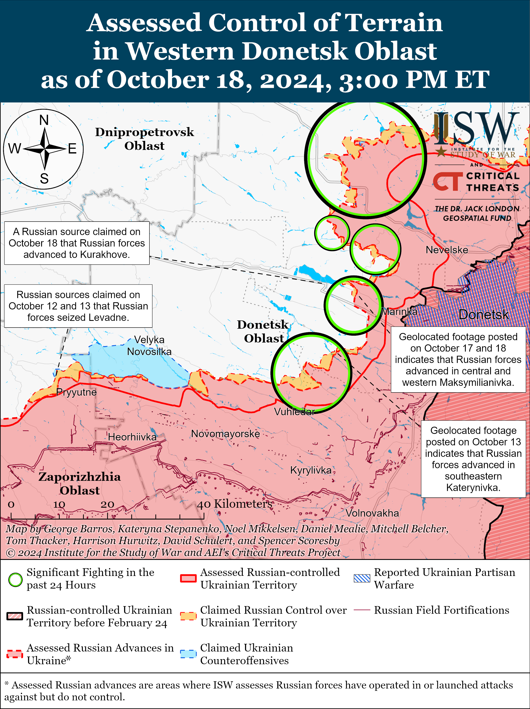
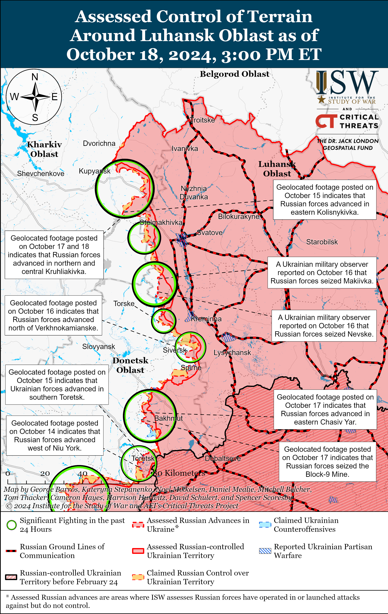
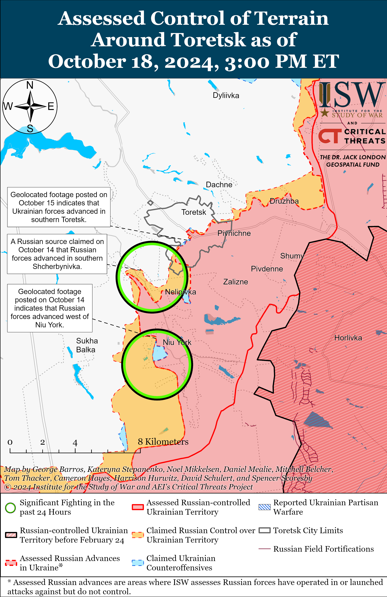
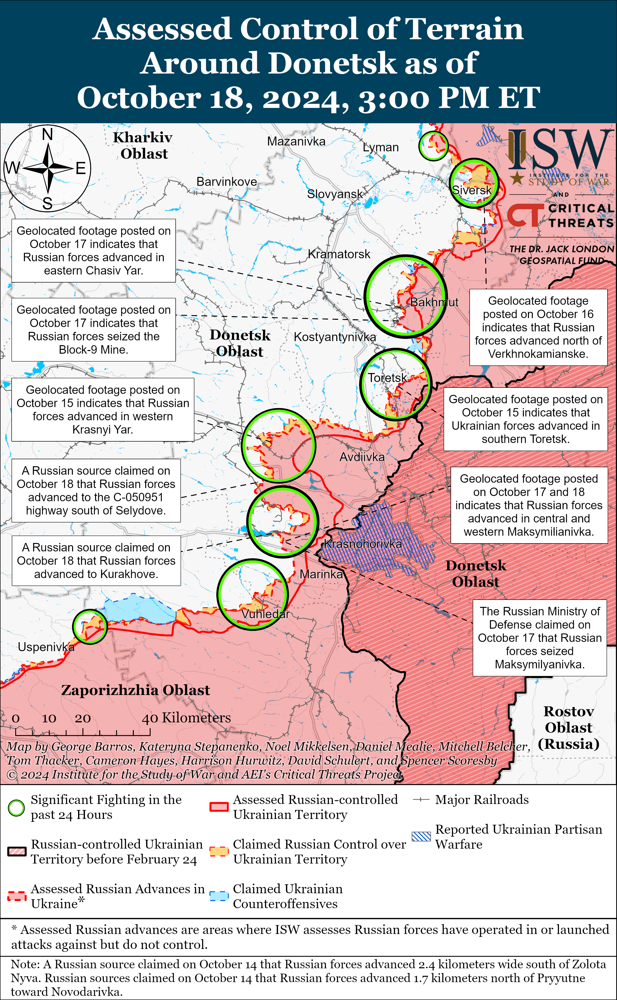
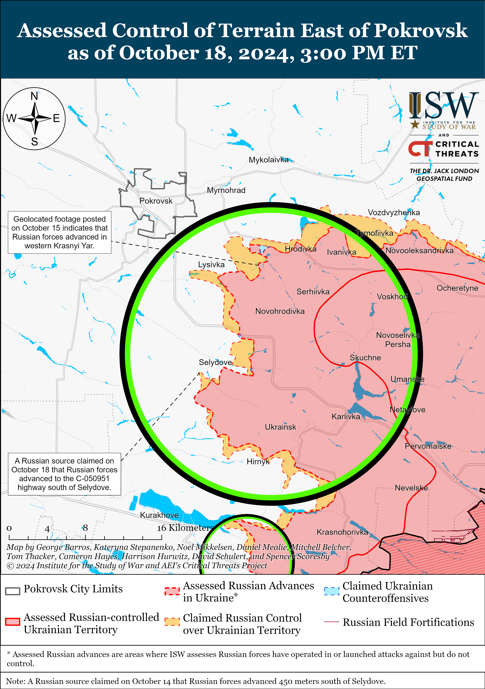
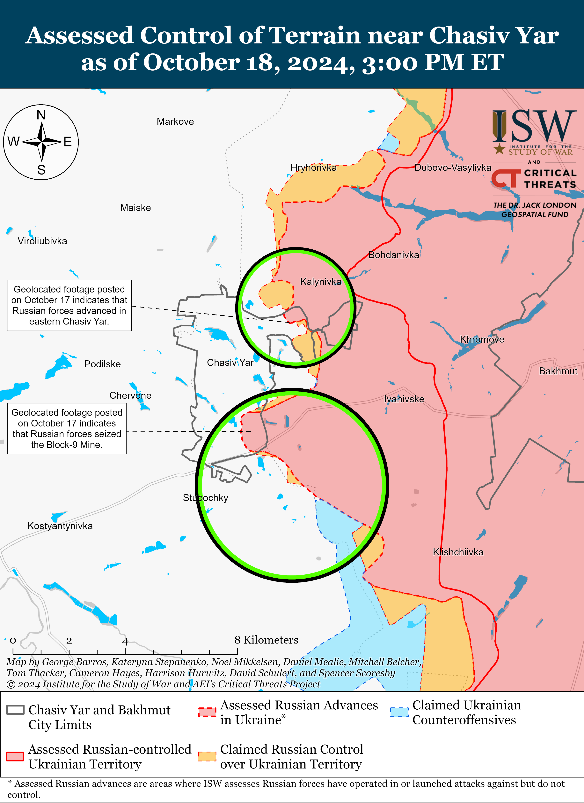
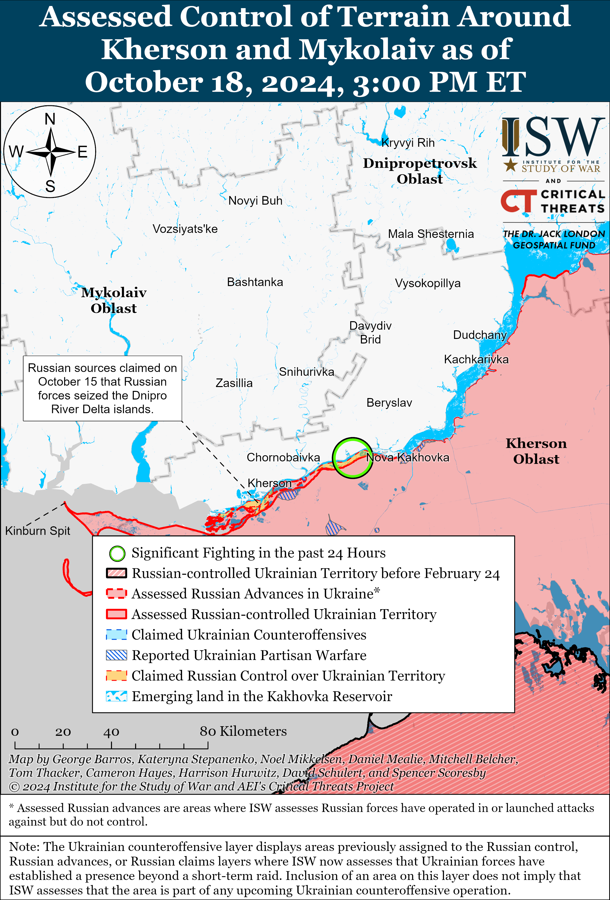
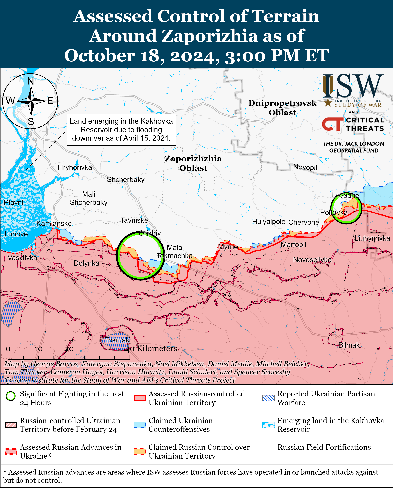

# Russian Offensive Campaign Assessment, October 18, 2024

**, 7:30 pm ET**

**Click** [**here**](https://storymaps.arcgis.com/stories/36a7f6a6f5a9448496de641cf64bd375) **to see ISW’s interactive map of the Russian invasion of Ukraine. This map is updated daily alongside the static maps present in this report.**

**Click** [**here**](https://storymaps.arcgis.com/stories/83a2f24901c941d581c0c523ecd2619b) **to see ISW's interactive map of Ukraine's offensive in Kursk Oblast.**

**Click** [**here**](https://understandingwar.maps.arcgis.com/apps/instant/3dviewer/index.html?appid=1602762dbcde419bb957dea358449580) **to see ISW’s 3D control of terrain topographic map of Ukraine. Use of a computer (not a mobile device) is strongly recommended for using this data-heavy tool.**

**Click** [**here**](https://storymaps.arcgis.com/stories/733fe90805894bfc8562d90b106aa895) **to access ISW’s archive of interactive time-lapse maps of the Russian invasion of Ukraine. These maps complement the static control-of-terrain map that ISW produces daily by showing a dynamic frontline. ISW will update this time-lapse map archive monthly.**

**Note: The data cut-off for this product was 11:45am ET on October 18. ISW will cover subsequent reports in the October 19 Russian Offensive Campaign Assessment.**

**South Korea's National Intelligence Service (NIS) reported that North Korea transferred roughly 1,500 North Korean special forces to eastern Russia, where they are reportedly training before deploying to participate in Russia's war against Ukraine.** The NIS stated on October 18 that seven Russian Pacific Fleet ships transported roughly 1,500 North Korean special forces from Chongjin, Hamhung, and Musudan in North Korea to Vladivostok, Russia between October 8 and 13 and that North Korea will send a second batch of military personnel to Russia soon.[[1]](#_edncc962f282571381140529d8bc561e95b1) The NIS stated that North Korean servicemembers are currently stationed in Vladivostok, Ussuriysk, Khabarovsk, and Blagoveshchensk in eastern Russia. The NIS stated that the Russian military has issued the North Korean personnel Russian uniforms, weapons, and fake identification cards claiming that the North Koreans are residents of the Sakha and Buryatia republics. The NIS posted satellite imagery showing a Russian transport ship near North Korea and an estimated 640 North Korean personnel gathered at Russian military facilities in Ussuryisk and Khabarovsk on October 16. South Korea's Yonhap News Agency reported on October 18 that the NIS also stated that North Korea recently decided to send four brigades totaling 12,000 personnel to the war in Ukraine.[[2]](#_edncc962f282571381140529d8bc561e95b2) Ukraine's Main Military Intelligence Directorate (GUR) Head Lieutenant General Kyrylo Budanov told *The War Zone* on October 17 that there are nearly 11,000 North Korean infantry troops training in eastern Russia and that they will be ready to fight in Ukraine by November 1.[[3]](#_edncc962f282571381140529d8bc561e95b3) Budanov stated that the first cadre of 2,600 North Korean soldiers will deploy to Kursk Oblast but that it is unclear where the remaining troops will deploy. ISW cannot independently verify these statements but has no basis to question the veracity of these intelligence reports, which are consistent with previous reports from South Korean and Ukrainian officials about North Korean troops training in Russia before deploying to the war in Ukraine, including to Kursk Oblast.[[4]](#_edncc962f282571381140529d8bc561e95b4) ISW has also observed recent reports that a limited number of North Korean military personnel, mainly engineering personnel, are likely operating near occupied Donetsk City.[[5]](#_edncc962f282571381140529d8bc561e95b5)

**A number of sources provided footage purporting to substantiate these intelligence reports. The footage appears consistent with reports of North Korean troop deployments to Russia but does not independently validate the intelligence reports.** A Russian Telegram channel posted footage on October 18 purportedly showing North Korean soldiers marching at a Russian training ground, and the footage was later geolocated to Sergeevka, Primorsky Krai.[[6]](#_edncc962f282571381140529d8bc561e95b6) Ukrainian outlet *Suspilne*, along with *Vox Ukraine*'s fact-checking project *VoxCheck,* reported that they could neither confirm nor deny that the soldiers in the footage are North Korean as the speech in the video is hard to hear and there are no clear external signs to indicate that the soldiers are North Korean.[[7]](#_edncc962f282571381140529d8bc561e95b7) The Ukrainian Center for Strategic Communications (Stratcom) posted additional footage on October 18 reportedly showing Russian forces outfitting North Korean troops with Russian uniforms and equipment at the Sergeevka training ground.[[8]](#_edncc962f282571381140529d8bc561e95b8) ISW cannot independently verify the presence of North Korean troops in either of the videos and cannot verify the location of the second video.

*Suspilne* stated that the footage of North Korean troops marching was filmed at the base of the Russian 127th Motorized Rifle Division (5th Combined Arms Army, Eastern Military District) in Sergeevka.[[9]](#_edncc962f282571381140529d8bc561e95b9) ISW has observed reports that elements of the 127th Division's 143rd Motorized Rifle Regiment were operating in Kursk Oblast as of late August 2024, while other elements of the division, including its 394th Motorized Rifle Regiment, have been operating in the Donetsk-Zaporizhia Oblast border area since at least June 2024.[[10]](#_edncc962f282571381140529d8bc561e95b10) Both the 394th and 143rd motorized rifle regiments are based in Sergeevka.[[11]](#_edncc962f282571381140529d8bc561e95b11) ISW continues to assess that the Kremlin is likely leveraging its June 2024 Russia-North Korea comprehensive strategic partnership agreement, which Russian President Vladimir Putin submitted for ratification on October 14, to in part offset Russian force generation and border security requirements – further cementing Putin's commitment to avoiding mobilization for as long as possible.[[12]](#_edncc962f282571381140529d8bc561e95b12)

**Russian forces appear to be further intensifying mechanized activity in western Donetsk Oblast amid initial reports of the start of autumnal muddy ground conditions.** Ukrainian National Guard Spokesperson Ruslan Muzychuk stated on October 18 that Russian forces are increasingly supporting infantry-led assaults with armored vehicles ahead of the onset of muddy ground conditions in Ukraine in Fall 2024.[[13]](#_edncc962f282571381140529d8bc561e95b13) Muzychuk stated that Russian forces have recently increased their use of armored personnel carriers and tanks in assaults in the Pokrovsk and Kurakhove directions but noted that Ukrainian forces are effectively destroying Russian armored vehicles in these directions.[[14]](#_edncc962f282571381140529d8bc561e95b14) Muzychuk stated that Ukrainian forces recently repelled several platoon-sized Russian mechanized assaults on the eastern outskirts of Selydove (southeast of Pokrovsk).[[15]](#_edncc962f282571381140529d8bc561e95b15) A Ukrainian brigade operating in the Kurakhove direction reported on October 17 that Russian forces conducted a battalion-sized mechanized assault near Kostyantynivka (southwest of Donetsk City).[[16]](#_edncc962f282571381140529d8bc561e95b16) The brigade reported that Russian forces attacked near Kostyantynivka with 27 armored vehicles and six tanks and that Ukrainian forces damaged or destroyed 14 armored vehicles and four tanks. Geolocated footage published on October 18 indicates that Ukrainian forces recently repelled a battalion-sized Russian mechanized assault near Maksymilyanivka (east of Kurakhove).[[17]](#_edncc962f282571381140529d8bc561e95b17) The Ukrainian brigade that repelled the recent attack near Maksymilyanivka reported that Russian forces attacked in two waves with a total of 33 armored vehicles and that Ukrainian forces damaged or destroyed 19 Russian armored vehicles.[[18]](#_edncc962f282571381140529d8bc561e95b18) Russian forces also conducted a company-sized mechanized assault near Selydove, as well as a reduced battalion-sized mechanized assault and several company-sized and platoon-sized mechanized assaults in the Kurakhove direction over the past week.[[19]](#_edncc962f282571381140529d8bc561e95b19) ISW observed three battalion-sized mechanized assaults in western Donetsk Oblast in the last week alone - a notable increase in tempo, as ISW only observed reports of Russian forces conducting four battalion-sized mechanized assaults in eastern Ukraine from late July to early October 2024.[[20]](#_edncc962f282571381140529d8bc561e95b20)

Russian and Ukrainian sources have recently reported worsening ground conditions throughout the frontline in Ukraine, and the arrival or the impending arrival of muddy ground conditions are likely prompting the Russian military command to intensify mechanized offensive operations in western Donetsk Oblast.[[21]](#_edncc962f282571381140529d8bc561e95b21) ISW previously noted that the Russian military command may intend for this intensified mechanized activity to facilitate advances across open fields before the onset of seasonal rainy weather and muddy ground conditions and to allow Russian forces to consolidate positions in preparation for future offensive operations in the coming months.[[22]](#_edncc962f282571381140529d8bc561e95b22) Muddy ground conditions will likely constrain Russian infantry maneuver and Russian forces' use of motorcycles and other small, wheeled vehicles along the frontline, and the Russian military command may assess that advances during the current, less muddy weather conditions will limit the number of open fields that Russian infantry will have to cross later after ground conditions deteriorate. Russian forces may be able to more successfully employ tracked vehicles (the Soviet versions of which are designed to operate in such conditions) in muddy ground conditions, and muddy ground conditions may incentivize Russian forces to use armored vehicles and tanks in place of the smaller wheeled vehicles on which Russian infantry have come to rely to conduct assaults in certain frontline sectors.[[23]](#_edncc962f282571381140529d8bc561e95b23)

ISW continues to assess that Russian forces will continue offensive operations following the fall muddy season, though adverse weather conditions will likely degrade the effectiveness of Russian infantry until weather and ground conditions improve.[[24]](#_edncc962f282571381140529d8bc561e95b24) Russian forces notably made a concerted effort to regain the theater-wide initiative during the period of the most difficult weather conditions for mechanized offensive operations in Fall 2023 and may seek to retain the theater-wide initiative through consistent offensive pressure in Fall 2024 under similar weather conditions.[[25]](#_edncc962f282571381140529d8bc561e95b25)

**Russian President Vladimir Putin continues to signal his disinterest in meaningful peace negotiations with Ukraine while using the upcoming BRICS summit to legitimize Kremlin information operations falsely portraying Ukraine as unwilling to negotiate.** Putin met with prominent media organization heads from BRICS member states in Moscow on October 18 and claimed that Russia is willing to negotiate with Ukraine but later countered that Russia is "ready to continue this fight" and that "victory will be ours."[[26]](#_edncc962f282571381140529d8bc561e95b26) Putin's October 18 statements are the latest in a series of contradictory statements from Putin and other senior Kremlin officials that attempt to portray Russia as willing to negotiate while simultaneously signaling that the Kremlin is unwilling to accept terms that do not amount to Ukraine's capitulation and destruction.[[27]](#_edncc962f282571381140529d8bc561e95b27) Putin also claimed on October 18 that Russia needs to create conditions for an enduring peace and falsely portrayed Ukraine as the aggressor state in the war, further indicating that these conditions amount to eliminating Ukraine's ability to defend itself against possible future Russian aggression.[[28]](#_edncc962f282571381140529d8bc561e95b28) Putin used the meeting to promote alternative peace plans by Brazil and the People's Republic of China (PRC), the key principles of which favor Russia. ISW continues to assess that the Kremlin is uninterested in good-faith peace negotiations with Ukraine and that the Kremlin only invokes the concept of "peace plans" or "negotiations" to prompt the West to pressure Ukraine into preemptive concessions regarding Ukraine's sovereignty and territorial integrity.[[29]](#_edncc962f282571381140529d8bc561e95b29)

**Putin used ongoing conversations about security guarantees in Ukraine's Victory Plan to further boilerplate nuclear saber-ratting information operations that aim to discredit Ukraine to its Western partners and prevent Western aid to Ukraine.** German outlet *Bild* claimed on October 17 that a Ukrainian official who specializes in weapons procurement stated several months ago that Ukraine would only need a few weeks to develop its first nuclear bomb.[[30]](#_edncc962f282571381140529d8bc561e95b30) Ukrainian President Volodymyr Zelensky and the Ukrainian Ministry of Foreign Affairs (MFA) denied the *Bild* allegations on October 17.[[31]](#_edncc962f282571381140529d8bc561e95b31) Putin responded to a question on October 18 about the *Bild* article and Zelensky's recent statements about Ukraine's need for more concrete security guarantees during his meeting with BRICS member states media organizations, claiming that Russia will respond with an "appropriate reaction" should Ukraine take steps to develop a nuclear weapon, which Putin labeled as a "dangerous provocation."[[32]](#_edncc962f282571381140529d8bc561e95b32) Putin has routinely engaged in nuclear saber-ratting in order to push the West into self-deterrence, particularly during critical moments in Western policy discussions about support for Ukraine.[[33]](#_edncc962f282571381140529d8bc561e95b33) ISW continues to assess that Russia's nuclear saber-ratting is not indicative of Russia's willingness to use nuclear weapons and that Russia is very unlikely to use nuclear weapons in Ukraine or elsewhere.[[34]](#_edncc962f282571381140529d8bc561e95b34) In the 1994 Budapest Memorandum, Russia specifically committed to "respect" and "refrain from the threat or use force" against Ukraine's sovereignty and territorial integrity – making no exceptions for Crimea or the Donbas region – in exchange for Ukraine's commitment to give the Soviet nuclear weapons on its soil to Russia.[[35]](#_edncc962f282571381140529d8bc561e95b35)

**Western partners continue to announce new military assistance to Ukraine.** Germany announced on October 17 a new military aid package for Ukraine, which includes eight Leopard tanks; 20 Marder infantry fighting vehicles; two TRML-4D radar systems; 4,000 unspecified attack drones; 42,000 40mm artillery ammunition rounds; and one IRIS-T SLM and IRIS-T SLS air defense system each.[[36]](#_edncc962f282571381140529d8bc561e95b36) NATO Secretary General Mark Rutte announced on October 17 that NATO is working to provide Ukraine with the remainder of the promised 40 billion euros (about $43 billion) worth of military aid - 20.9 billion euros (about $31 billion) of which NATO has already provided - by the next NATO summit in June 2025.[[37]](#_edncc962f282571381140529d8bc561e95b37) Canadian Defense Minister Bill Blair announced on October 18 that Canada will provide 64.8 million Canadian dollars (about $47 million) worth of military aid to Ukraine, which will include small arms, ammunition, protective gear, and funding for the training of Ukrainian forces.[[38]](#_edncc962f282571381140529d8bc561e95b38) Dutch Prime Minister Dick Schoof announced on October 17 that the Netherlands will allocate 271 million euros (about $294 million) to purchase artillery shells for Ukraine.[[39]](#_edncc962f282571381140529d8bc561e95b39) Latvian Defense Minister Andris Spruds and Lithuanian Defense Minister Laurynas Kasčiūnas announced on October 18 that Latvia, Lithuania, and Estonia will allocate 0.25 percent of their GDPs to support Ukraine.[[40]](#_edncc962f282571381140529d8bc561e95b40) Denmark announced on October 17 that it will allocate 2.4 billion Danish kroner (about $348 million) to Ukraine for the purchase of new military equipment and has signed agreements with international partners to donate materiel to support Ukraine's equipment of its new brigades.[[41]](#_edncc962f282571381140529d8bc561e95b41)

**The US Department of State (DoS) program Rewards for Justice offered a reward of up to $10 million for information leading to the identification or location of foreigners involved in interfering in US elections, including members of prominent Kremlin-awarded milblogger channel *Rybar*.[[42]](#_edncc962f282571381140529d8bc561e95b42)** Rewards for Justice announced the award on October 18 and specified that the *Rybar* channel manages several social media channels, including at least one propaganda channel on X (formerly Twitter), that are trying to promote internal division and discord in the US and promote the interests of the Russian government.[[43]](#_edncc962f282571381140529d8bc561e95b43) Rewards for Justice identified nine *Rybar* employees who are of particular interest to the DoS: *Rybar* founder and director Mikhail Zvinchuk; creative director Valeriya Zvinchuk; video department head Alexander Kan; foreign language resources head Tatyana Kosterova; regional manager Olga Kuznetsova; designer and content team lead Maksim Matveyev; content head of a propaganda channel Alexander Minin; and Vladimir Berkutov and Alexander Minin, who both work on the propaganda channel.[[44]](#_edncc962f282571381140529d8bc561e95b44) Rewards for Justice noted that deceased Wagner Group financier Yevgeny Prigozhin funded *Rybar* before his death and that Russian state defense conglomerate Rostec currently funds the channel.[[45]](#_edncc962f282571381140529d8bc561e95b45) The Kremlin has coopted the *Rybar* channel as part of efforts to strengthen the Kremlin's control over the Russian information space, and ISW has previously assessed that the *Rybar* channel is also attempting to expand its influence in the international information space, including by supporting Iranian-backed Iraqi efforts to gain greater control over the Iraqi information space.[[46]](#_edncc962f282571381140529d8bc561e95b46)

**Ukrainian Human Rights Ombudsman Dmytro Lubinets reported on October 18 that Ukraine has recorded more than 100 confirmed cases of Russian forces executing Ukrainian prisoners of war (POWs) amid a recent theater-wide increase in Russian executions of Ukrainian POWs.[[47]](#_edncc962f282571381140529d8bc561e95b47)** Lubinets stated that the number of Russian executions of Ukrainian POWs is likely much higher. ISW has recently observed an increase in Russian violations of different aspects of the Geneva Convention on POWs, which prohibits the inhumane treatment and execution of POWs or persons who are clearly rendered *hors de combat.[**[48]**](#_edncc962f282571381140529d8bc561e95b48)* The European Union (EU) reported on October 16 that at least 177 Ukrainian POWs have died in Russian captivity since February 2022.[[49]](#_edncc962f282571381140529d8bc561e95b49) Head of the Ukrainian Department for Combating Crimes in Conditions of Armed Conflict Yuri Bilousov stated on October 4 that Russian forces have executed 93 Ukrainian POWs on the battlefield since the start of the full-scale invasion and that 80 percent of the recorded cases occurred in 2024, suggesting a clear and systemic increase in the pace of such war crimes.[[50]](#_edncc962f282571381140529d8bc561e95b50)

**Key Takeaways:**

- **South Korea's National Intelligence Service (NIS) reported that North Korea transferred roughly 1,500 North Korean special forces to eastern Russia, where they are reportedly training before deploying to participate in Russia's war against Ukraine.**
- **A number of sources provided footage purporting to substantiate these intelligence reports. The footage appears consistent with reports of North Korean troop deployments to Russia but does not independently validate the intelligence reports.**
- **Russian forces appear to be further intensifying mechanized activity in western Donetsk Oblast amid initial reports of the start of autumnal muddy ground conditions.**
- **Russian President Vladimir Putin continues to signal his disinterest in meaningful peace negotiations with Ukraine while using the upcoming BRICS summit to legitimize Kremlin information operations falsely portraying Ukraine as unwilling to negotiate.**
- **Putin used ongoing conversations about security guarantees in Ukraine's Victory Plan to further boilerplate nuclear saber-ratting information operations that aim to discredit Ukraine to its Western partners and prevent Western aid to Ukraine.**
- **Western partners continue to announce new military assistance to Ukraine.**
- **The US Department of State (DoS) program Rewards for Justice offered a reward of up to $10 million for information leading to the identification or location of foreigners involved in interfering in US elections, including members of prominent Kremlin-awarded milblogger channel *Rybar*.**
- **Ukrainian Human Rights Ombudsman Dmytro Lubinets reported on October 18 that Ukraine has recorded more than 100 confirmed cases of Russian forces executing Ukrainian prisoners of war (POWs) amid a recent theater-wide increase in Russian executions of Ukrainian POWs.**
- **Russian forces recently advanced in Kursk Oblast and near Kupyansk, Kreminna, Kurakhove, and Velyka Novosilka.**

****

***We do not report in detail on Russian war crimes because these activities are well-covered in Western media and do not directly affect the military operations we are assessing and forecasting. We will continue to evaluate and report on the effects of these criminal activities on the Ukrainian military and the Ukrainian population and specifically on combat in Ukrainian urban areas. We utterly condemn Russian violations of the laws of armed conflict and the Geneva Conventions and crimes against humanity even though we do not describe them in these reports.***

- Ukrainian Operations in the Russian Federation
- Russian Main Effort – Eastern Ukraine (comprised of three subordinate main efforts)
- Russian Subordinate Main Effort #1 – Push Ukrainian forces back from the international border with Belgorod Oblast and approach to within tube artillery range of Kharkiv City
- Russian Subordinate Main Effort #2 – Capture the remainder of Luhansk Oblast and push westward into eastern Kharkiv Oblast and encircle northern Donetsk Oblast
- Russian Subordinate Main Effort #3 – Capture the entirety of Donetsk Oblast
- Russian Supporting Effort – Southern Axis
- Russian Air, Missile, and Drone Campaign
- Russian Mobilization and Force Generation Efforts
- Russian Technological Adaptations
- Activities in Russian-occupied areas
- Ukrainian Defense Industrial Base Efforts
- Russian Information Operations and Narratives
- Significant Activity in Belarus

**Ukrainian Operations in the Russian Federation**

Russian forces recently advanced within the main Ukrainian salient in Kursk Oblast amid continued fighting along the salient on October 18. Geolocated footage published on October 18 shows that Russian forces, reportedly elements of the Russian 155th Naval Infantry Brigade (Pacific Fleet, Eastern Military District [EMD]), advanced in fields west of Malaya Loknya (north of Sudzha) during a roughly platoon-sized mechanized assault.[[51]](#_edncc962f282571381140529d8bc561e95b51) Russian milbloggers claimed that Russian forces have formed tactical semi-encirclements of Ukrainian forces near Lyubimovka and Tolsty Lug (both southeast of Korenevo), that Ukrainian forces are withdrawing from Zeleny Shlyakh (immediately east of Lyubimovka) and Plekhovo (south of Sudzha), and that Russian forces may have seized Plekhovo.[[52]](#_edncc962f282571381140529d8bc561e95b52) Milbloggers claimed that Russian forces also advanced southeast of Korenevo near Zeleny Shlyakh and Darino; east of Korenevo near Kremyanoye and in Olgovka; northeast of Sudzha in Cherkasskoye Porechnoye, Mykhailivka, and Martynovka; north of Sudzha near Malaya Loknya; east of Sudzha near Agronom; and southeast of Sudzha near Plekhovo and Fanaseyevka.[[53]](#_edncc962f282571381140529d8bc561e95b53) ISW has not observed visual confirmation of these Russian claims. Russian sources claimed that Russian forces repelled Ukrainian counterattacks near Zeleny Shlyakh and Lyubimovka.[[54]](#_edncc962f282571381140529d8bc561e95b54) Elements of the Russian 22nd Spetsnaz Brigade (Russian General Staff Main Directorate [GRU]) reportedly continue to operate in Kursk Oblast, and elements of the Russian 106th Airborne (VDV) Division reportedly continue to operate near Lyubimovka.[[55]](#_edncc962f282571381140529d8bc561e95b55)

Fighting continued in Glushkovsky Raion west of the main Ukrainian salient in Kursk Oblast near Novy Put (southwest of Glushkovo) on October 18, but there were no confirmed changes to the frontline.[[56]](#_edncc962f282571381140529d8bc561e95b56) A Russian milblogger claimed that Russian forces pushed Ukrainian forces from Novy Put.[[57]](#_edncc962f282571381140529d8bc561e95b57)  
   
 Belgorod Oblast Head Vyacheslav Gladkov denied reports on October 18 that a Ukrainian sabotage and reconnaissance group entered Zhuravlevka, Belgorod Oblast (north of Kharkiv City across the international border) and claimed that Russian forces still fully control the village.[[58]](#_edncc962f282571381140529d8bc561e95b58)

**Russian Main Effort – Eastern Ukraine**

**Russian Subordinate Main Effort #1 – Kharkiv Oblast** **(Russian objective: Push Ukrainian forces back from the international border with Belgorod Oblast and approach to within tube artillery range of Kharkiv City)**

Russian forces continued assaults northeast of Kharkiv City near Vovchansk and Starytsya on October 17 and 18, but there were no confirmed changes to the frontline.[[59]](#_edncc962f282571381140529d8bc561e95b59) A Russian milblogger claimed on October 18 that Russian forces advanced in central Vovchansk, although ISW has not observed confirmation of this claim.[[60]](#_edncc962f282571381140529d8bc561e95b60) Ukrainian sources reported on October 18 that Ukrainian forces counterattacked in an unspecified area of the Kharkiv Oblast border area.[[61]](#_edncc962f282571381140529d8bc561e95b61) Ukrainian Kharkiv Group of Forces Spokesperson Lieutenant Colonel Yevgeny Romanov stated on October 18 that Ukrainian forces operating in the Kharkiv direction have recorded Russian use of low-quality 122mm and 152mm North Korean artillery shells but noted that it is difficult to distinguish between old Soviet or North Korean ammunition.[[62]](#_edncc962f282571381140529d8bc561e95b62)

****

**Russian Subordinate Main Effort #2 – Luhansk Oblast (Russian objective: Capture the remainder of Luhansk Oblast and push westward into eastern Kharkiv Oblast and northern Donetsk Oblast)**

Russian forces recently advanced along the Kupyansk-Svatove-Kreminna line amid continued Russian offensive operations in the area on October 18. Geolocated footage published on October 17 and 18 indicates that Russian forces advanced into central and northern Kruhlyakivka (south of Kupyansk) and into a forest area west of Dibrova (west of Kreminna).[[63]](#_edncc962f282571381140529d8bc561e95b63) Russian milbloggers claimed that Russian forces advanced near Vyshneve (west of Svatove) and that elements of the Russian 144th Motorized Rifle Division (20th Combined Arms Army [CAA], Moscow Military District [MMD]) advanced near Nevske and Novosadove (both northwest of Kreminna), although ISW has not observed visual confirmation of these claims.[[64]](#_edncc962f282571381140529d8bc561e95b64) Russian forces continued offensive operations north of Kupyansk near Holubivka; northeast of Kupyansk near Synkivka; southeast of Kupyansk near Stepova Novoselivka, Kolisnykivka, Lozova, Novoosynove, and Pishchane; west of Svatove near Vyshneve and Nadiya; southwest of Svatove near Hrekivka and Druzhelyubivka, and in the direction of Katerynivka and Novomykhailivka; northwest of Kreminna near Novosadove, Nevske, and Makiivka; west of Kreminna near Terny and Torske; southwest of Kreminna near Serebryanka; south of Kreminna near Bilohorivka; and near Kreminna itself on October 17 to 18.[[65]](#_edncc962f282571381140529d8bc561e95b65) A Russian milblogger claimed on October 18 that rainy weather is impacting Ukrainian operations near Kreminna.[[66]](#_edncc962f282571381140529d8bc561e95b66) Elements of the Russian 59th Tank Regiment and 254th Motorized Rifle Regiment (both of the 144th Motorized Rifle Division, 20th CAA, MMD) are reportedly operating near Nevske.[[67]](#_edncc962f282571381140529d8bc561e95b67)

Unspecified actors, possibly Ukrainian partisans, may have used an improvised explosive device (IED) to destroy a Russian military vehicle and kill the commander of the Russian 273rd Command Intelligence Center (25th Combined Arms Army), Dmitry Pervukh, in the center of occupied Luhansk City.[[68]](#_edncc962f282571381140529d8bc561e95b68) Russian authorities opened an investigation into the explosion and reported that the explosion killed a man and injured a woman but did not specify their identities.[[69]](#_edncc962f282571381140529d8bc561e95b69)

 

**Russian Subordinate Main Effort #3 – Donetsk Oblast (Russian objective: Capture the entirety of Donetsk Oblast, the claimed territory of Russia’s proxies in Donbas)**

Russian milbloggers claimed on October 17 and 18 that Russian forces advanced north of Verkhnokamyanske (east of Siversk) but there were no confirmed changes to the frontline in the Siversk direction.[[70]](#_edncc962f282571381140529d8bc561e95b70)

Russian forces continued offensive operations near Chasiv Yar on October 18, but there were no confirmed changes to the frontline. Russian milbloggers claimed on October 17 and 18 that Russian forces advanced southeast of Chasiv Yar and northwest of Kalynivka (north of Chasiv Yar), although ISW has not observed confirmation of these claims.[[71]](#_edncc962f282571381140529d8bc561e95b71) Russian forces conducted offensive operations near Chasiv Yar, north of Chasiv Year near Hryhorivka and Mynkivka, east of Chasiv Yar near Ivanisvke, and south of Chasiv Yar near Stupochky on October 17 and 18.[[72]](#_edncc962f282571381140529d8bc561e95b72) Elements of the Russian 98th Airborne (VDV) Division reportedly continue to operate near Chasiv Yar.[[73]](#_edncc962f282571381140529d8bc561e95b73)

Russian forces continued offensive operations north of Toretsk near Dyliivka; near Toretsk itself; west of Toretsk near Shcherbynivka and in the direction of Romanivka; and southwest of Toretsk in the direction of Sukha Balka; and south of Toretsk near Nelipivka on October 17 and 18, but there were no confirmed changes to the frontline.[[74]](#_edncc962f282571381140529d8bc561e95b74) Ukrainian Luhansk Group of Forces Spokesperson Major Anastasiya Bobovnikova stated that small Russian assault groups are attacking in Toretsk but are struggling to gain a foothold in the settlement.[[75]](#_edncc962f282571381140529d8bc561e95b75) Elements of the Russian 132nd Motorized Rifle Brigade (51st Combined Arms Army [CAA], formerly 1st Donetsk People's Republic Army Corps [DNR AC]) are reportedly operating within Toretsk.[[76]](#_edncc962f282571381140529d8bc561e95b76)

Russian forces continued offensive operations east and southeast of Pokrovsk on October 18, but there were no confirmed changes to the frontline. Russian milbloggers claimed that Russian forces operating southeast of Pokrovsk advanced along a railroad line south of Selydove to cut the Selydove-Kurakhove highway and advanced northwest and south of Tsukuryne.[[77]](#_edncc962f282571381140529d8bc561e95b77) Ukrainian National Guard Spokesperson Ruslan Muzychuk stated that Russian forces are concentrating forces and attacking Selydove from Marynivka (northeast of Selydove) and Mykhailivka (east of Seldyove).[[78]](#_edncc962f282571381140529d8bc561e95b78) Russian forces continued assaults east of Pokrovsk near Promin and Novotoretske and southeast of Pokrovsk near Sukhyi Yar, Lysivka, Selydove, Mykhailivka, Novoselydivka, Novodmytrivka, Izmailivka, Hirnyk, Zhelanne Druhe, Zoryane, and in the direction of Vyshneve on October 17 and 18.[[79]](#_edncc962f282571381140529d8bc561e95b79)

Russian forces recently advanced east of Kurakhove amid continued offensive operations in the area on October 18. Geolocated footage published on October 17 and 18 indicates that Russian forces recently advanced within central and western Maksymilyanivka and south of the settlement during a battalion-sized mechanized assault.[[80]](#_edncc962f282571381140529d8bc561e95b80) Russian milbloggers widely claimed that Russian forces seized Maksymilyanivka and are clearing Ukrainian forces from the settlement.[[81]](#_edncc962f282571381140529d8bc561e95b81) A Russian milblogger claimed that Russian forces advanced into the outskirts of Kurakhove.[[82]](#_edncc962f282571381140529d8bc561e95b82) ISW has not observed confirmation of these Russian claims, however. Russian forces continued offensive operations near Kurakhove itself and east of Kurakhove near Hostre, Heorhiivka, and Dalnye on October 17 and 18.[[83]](#_edncc962f282571381140529d8bc561e95b83) Elements of the Russian 150th Motorized Rifle Division (8th CAA, Southern Military District [SMD]), including its 102nd Motorized Rifle Regiment, are reportedly operating near Maksymilyanivka.[[84]](#_edncc962f282571381140529d8bc561e95b84)

Russian forces continued offensive operations southwest of Donetsk City on October 18 but there were no confirmed changes to the frontline. A Russian milblogger claimed that Russian forces advanced one kilometer in depth near Katerynivka.[[85]](#_edncc962f282571381140529d8bc561e95b85) Russian forces continued assaults near Antonivka, Katerynivka, Kostyantynivka, Vodyane, Katerynivka, Bohoyavlenka, Vuhledar, and Levadne on October 17 and 18.[[86]](#_edncc962f282571381140529d8bc561e95b86) Elements of the Russian 5th Tank Brigade (36th CAA, Eastern Military District [EMD]) are reportedly operating in the Kurakhove direction.[[87]](#_edncc962f282571381140529d8bc561e95b87)

Russian forces recently advanced in the Donetsk-Zaporizhia Oblast border area amid continued Russian offensive operations in the area on October 18. Geolocated footage published on October 18 indicates that Russian forces recently advanced north of Pryyutne (southwest of Velyka Novosilka).[[88]](#_edncc962f282571381140529d8bc561e95b88) The Russian Ministry of Defense (MoD) claimed on October 18 that Russian forces seized Levadne (southwest of Velyka Novosilka) over the course of last week, although ISW has not confirmed this claim.[[89]](#_edncc962f282571381140529d8bc561e95b89)

**   **

**Russian Supporting Effort – Southern Axis (Russian objective: Maintain frontline positions and secure rear areas against Ukrainian strikes)**

Russian forces continued ground attacks in western Zaporizhia Oblast on October 17 and 18, but there were no confirmed changes to the frontline. Russian forces conducted assaults north of Robotyne in the direction of Novodanylivka and northwest of Robotyne near Novoandriivka.[[90]](#_edncc962f282571381140529d8bc561e95b90) A Russian milblogger claimed on October 18 that Ukrainian electronic warfare (EW) systems and Russian shortages of available generators at frontline positions are impacting the effectiveness of Russian radio communications in the Zaporizhia direction.[[91]](#_edncc962f282571381140529d8bc561e95b91) A Russian servicemember reportedly told the milblogger that their unit can only operate the generator long enough to charge their devices to sustain critical communications on Telegram and to reach Russian commanders during emergencies. Ukrainian National Guard Spokesperson Ruslan Muzychuk stated on October 18 that Russian forces are conducting low-intensity combat operations in southern Ukraine.[[92]](#_edncc962f282571381140529d8bc561e95b92)

Russian forces continued attacks in east (left) bank Kherson Oblast on October 17 and 18 but did not make any confirmed advances.[[93]](#_edncc962f282571381140529d8bc561e95b93) Muzychuk stated that Russian forces are conducting aerial reconnaissance and preparing to conduct assaults on unspecified islands in the Dnipro River Delta.[[94]](#_edncc962f282571381140529d8bc561e95b94) Elements of the Russian BARS-33 Detachment (Russian Combat Army Reserve) reportedly continue to operate in the Kherson direction.[[95]](#_edncc962f282571381140529d8bc561e95b95)

Russian milbloggers claimed that air defense and EW units of the Russian 31st Air Defense Division (4th Air Force and Air Defense Army, Southern Military District [SMD] and Russian Aerospace Forces [VKS]) neutralized eight Ukrainian cruise missiles over occupied Crimea on the evening of October 17.[[96]](#_edncc962f282571381140529d8bc561e95b96)

 

**Russian Air, Missile, and Drone Campaign (Russian Objective: Target Ukrainian military and civilian infrastructure in the rear and on the frontline)**

Russian forces conducted a large series of drone strikes against Ukraine on the night of October 17 to 18. The Ukrainian Air Force reported that Russian forces launched at least 135 Shahed drones and drones of an unknown type from Kursk and Oryol oblasts and Primorsko-Akhtarsk, Krasnodar Krai.[[97]](#_edncc962f282571381140529d8bc561e95b97) The Ukrainian Air Force reported that Ukrainian forces shot down 80 drones over Odesa, Sumy, Cherkasy, Kyiv, Zhytomyr, Kirovohrad, Chernihiv, Poltava, Khmelnytskyi, Rivne, Kharkiv, Kherson, Volyn, and Vinnytsia oblasts; that 44 drones were "lost in location," possibly due to Ukrainian electronic warfare (EW) countermeasures; that two drones flew into Belarusian airspace; and that up to 10 drones were still flying over central Ukraine as of the morning of October 18. A Russian milblogger claimed that Russian Shahed drones struck Ukrainian airfields in Rivne and Zhytomyr oblasts, but ISW has not observed visual evidence or Ukrainian reporting on these alleged strikes.[[98]](#_edncc962f282571381140529d8bc561e95b98)

The Romanian Ministry of Defense (MoD) stated on October 18 that Romania scrambled four fighter jets after a small flying object, likely a drone, entered and flew 14 kilometers deep into Romanian airspace.[[99]](#_edncc962f282571381140529d8bc561e95b99)

**Russian Mobilization and Force Generation Efforts (Russian objective: Expand combat power without conducting general mobilization)**

Select Russian authorities are reportedly pushing back against the Kremlin's recruitment demands on Russian federal subjects. Russian opposition outlet *Mobilization News* stated on October 18 that Sverdlovsk Oblast Governor Yevgeny Kuyvashev is unhappy with the Russian Ministry of Defense (MoD)'s "unrealistic plans" for recruiting contract soldiers (*kontraktniki*) from the Urals and is lobbying for the Kremlin to reduce the number of military personnel Sverdlovsk Oblast authorities must recruit.[[100]](#_edncc962f282571381140529d8bc561e95b100) *Mobilization News* stated that regional industrialists and heads of unspecified defense industrial enterprises that are suffering from labor shortages will support Kuyvashev. Russian federal subjects have recently increased many of the regional one-time payments paid to *kontrakniki* upon signing up for military service, suggesting that the Russian MoD is struggling to attract new personnel but is still relying on its crypto-mobilization campaigns to generate new forces.[[101]](#_edncc962f282571381140529d8bc561e95b101)

**Russian Technological Adaptations** **(Russian objective: Introduce technological innovations to optimize systems for use in Ukraine)**

Nothing significant to report.

**Ukrainian Defense Industrial Efforts** **(Ukrainian objective: Develop its defense industrial base to become more self-sufficient in cooperation with US, European, and international partners)**

*ISW is permanently suspending regular coverage of Ukrainian defense industrial efforts and will cover any notable inflections in topline text or separate special editions moving forward.*

**Activities in Russian-occupied areas (Russian objective: Consolidate administrative control of annexed areas; forcibly integrate Ukrainian citizens into Russian sociocultural, economic, military, and governance systems)**

*ISW is not reporting on activities in Russian-occupied areas today.*

**Russian Information Operations and Narratives**

*ISW is permanently suspending regular coverage of Russian information operations and narratives as a section in the daily updates and will cover any notable inflections in topline text or separate special editions moving forward.*

**Significant activity in Belarus** **(Russian efforts to increase its military presence in Belarus and further integrate Belarus into Russian-favorable frameworks and Wagner Group activity in Belarus)**

Nothing significant to report.

**Note: ISW does not receive any classified material from any source, uses only publicly available information, and draws extensively on Russian, Ukrainian, and Western reporting and social media as well as commercially available satellite imagery and other geospatial data as the basis for these reports. References to all sources used are provided in the endnotes of each update.**

---

[[1]](#_edncc962f282571381140529d8bc561e95bref1) [https://www.nis](https://www.nis/) dot go.kr/CM/1\_4/view.do?seq=320

[[2]](#_edncc962f282571381140529d8bc561e95bref2) <https://en.yna.co> dot kr/view/AEN20241018006852315

[[3]](#_edncc962f282571381140529d8bc561e95bref3) https://www.twz.com/news-features/nearly-11000-north-korean-troops-in-russia-preparing-to-enter-the-fight-says-ukraines-spy-boss

[[4]](#_edncc962f282571381140529d8bc561e95bref4) <https://isw.pub/UkrWar101124> ; <https://isw.pub/UkrWar101624> ; https://www.understandingwar.org/backgrounder/russian-offensive-campaign-assessment-october-15-2024

[[5]](#_edncc962f282571381140529d8bc561e95bref5) https://isw.pub/UkrWar100924

[[6]](#_edncc962f282571381140529d8bc561e95bref6) <https://t.co/C8tMfRvknK>; <https://x.com/GeoConfirmed/status/1847225352281563393>; https://x.com/cyber\_boroshno/status/1847221510659772633

[[7]](#_edncc962f282571381140529d8bc561e95bref7)  https://suspilne dot media/860979-suspilne-ta-voxcheck-ne-mozut-pidtverditi-ci-sprostuvati-naavnist-vijskovih-kndr-v-posirenomu-v-merezi-video/

[[8]](#_edncc962f282571381140529d8bc561e95bref8) https://x.com/StratcomCentre/status/1847317531477844036

[[9]](#_edncc962f282571381140529d8bc561e95bref9) https://suspilne dot media/860979-suspilne-ta-voxcheck-ne-mozut-pidtverditi-ci-sprostuvati-naavnist-vijskovih-kndr-v-posirenomu-v-merezi-video/

[[10]](#_edncc962f282571381140529d8bc561e95bref10) <https://www.understandingwar.org/backgrounder/russian-offensive-campaign-assessment-october-13-2024>; <https://www.understandingwar.org/backgrounder/russian-offensive-campaign-assessment-august-22-2024>; <https://www.understandingwar.org/backgrounder/russian-offensive-campaign-assessment-june-5-2024> ; <https://understandingwar.org/backgrounder/russian-offensive-campaign-assessment-august-2-2024>; <https://www.understandingwar.org/backgrounder/russian-offensive-campaign-assessment-july-24-2024>

[[11]](#_edncc962f282571381140529d8bc561e95bref11) https://www.understandingwar.org/sites/default/files/October%2012%2C%202023%20Russian%20Orbat\_Final.pdf

[[12]](#_edncc962f282571381140529d8bc561e95bref12) https://isw.pub/UkrWar101524

[[13]](#_edncc962f282571381140529d8bc561e95bref13) <https://youtu.be/j5TqaWCCdUg> ; [https://armyinform.com](https://armyinform.com/) dot ua/2024/10/18/shturmuyut-panczernykamy-na-shodi-chomu-vorog-vse-chastishe-vykorystovuye-bronetehniku/

[[14]](#_edncc962f282571381140529d8bc561e95bref14) <https://youtu.be/j5TqaWCCdUg> ; [https://armyinform.com](https://armyinform.com/) dot ua/2024/10/18/shturmuyut-panczernykamy-na-shodi-chomu-vorog-vse-chastishe-vykorystovuye-bronetehniku/

[[15]](#_edncc962f282571381140529d8bc561e95bref15) https://armyinform.com dot ua/2024/10/18/ohopyty-selydove-z-yakoyu-metoyu-vorog-bye-po-mistu-j-okolyczyah-aviacziyeyu-ta-artoyu/

[[16]](#_edncc962f282571381140529d8bc561e95bref16) https://t.me/odshbr79/397

[[17]](#_edncc962f282571381140529d8bc561e95bref17) https://t.me/oaembr46/1092; <https://t.me/creamy_caprice/7157> ; [https://armyinform.com](https://armyinform.com/) dot ua/2024/10/18/znyshheno-5-tankiv-ta-10-bmp-desantnyky-vidbyly-chergovyj-shturm-okupantiv/

[[18]](#_edncc962f282571381140529d8bc561e95bref18) <https://t.me/oaembr46/1092>

[[19]](#_edncc962f282571381140529d8bc561e95bref19) <https://www.understandingwar.org/backgrounder/russian-offensive-campaign-assessment-october-14-2024> ; <https://www.understandingwar.org/backgrounder/russian-offensive-campaign-assessment-october-16-2024> ; <https://www.understandingwar.org/backgrounder/russian-offensive-campaign-assessment-october-17-2024> ; <https://understandingwar.org/backgrounder/russian-offensive-campaign-assessment-october-11-2024>

[[20]](#_edncc962f282571381140529d8bc561e95bref20) https://understandingwar.org/backgrounder/russian-offensive-campaign-assessment-october-9-2024

[[21]](#_edncc962f282571381140529d8bc561e95bref21) <https://isw.pub/UkrWar101124> ; <https://isw.pub/UkrWar100924> ; <https://understandingwar.org/backgrounder/russian-offensive-campaign-assessment-october-17-2024> ; <https://www.understandingwar.org/backgrounder/russian-offensive-campaign-assessment-october-16-2024>

[[22]](#_edncc962f282571381140529d8bc561e95bref22) <https://isw.pub/UkrWar100924>

[[23]](#_edncc962f282571381140529d8bc561e95bref23) <https://www.understandingwar.org/backgrounder/russian-offensive-campaign-assessment-june-25-2024> ; <https://www.understandingwar.org/backgrounder/russian-offensive-campaign-assessment-september-21-2024> ; <https://www.understandingwar.org/backgrounder/russian-offensive-campaign-assessment-september-30-2024> ; <https://www.understandingwar.org/backgrounder/russian-offensive-campaign-assessment-july-21-2024>

[[24]](#_edncc962f282571381140529d8bc561e95bref24) <https://isw.pub/UkrWar100924>

[[25]](#_edncc962f282571381140529d8bc561e95bref25) https://isw.pub/UkrWar120923 ; <https://understandingwar.org/backgrounder/how-delays-western-aid-gave-russia-initiative-ukrainian-counteroffensive-kharkiv> ; <https://www.understandingwar.org/backgrounder/russian-offensive-campaign-assessment-october-9-2024>

[[26]](#_edncc962f282571381140529d8bc561e95bref26) <http://www.kremlin> dot ru/events/president/news/75349

[[27]](#_edncc962f282571381140529d8bc561e95bref27) https://isw.pub/UkrWar092324; https://www.understandingwar.org/backgrounder/russian-offensive-campaign-assessment-september-22-2024; ; https://isw.pub/UkrWar090924; https://isw.pub/UkrWar081924; https://www.understandingwar.org/backgrounder/russian-offensive-campaign-assessment-august-17-2024

[[28]](#_edncc962f282571381140529d8bc561e95bref28) http://www.kremlin dot ru/events/president/news/75349

[[29]](#_edncc962f282571381140529d8bc561e95bref29) <https://isw.pub/UkrWar092324>; <https://www.understandingwar.org/backgrounder/russian-offensive-campaign-assessment-september-22-2024>; ; <https://isw.pub/UkrWar090924>; <https://isw.pub/UkrWar081924>; https://www.understandingwar.org/backgrounder/russian-offensive-campaign-assessment-august-17-2024

[[30]](#_edncc962f282571381140529d8bc561e95bref30) <https://www.bild> dot de/politik/ausland-und-internationales/selenskyj-gibt-dem-westen-die-wahl-nato-beitritt-oder-atom-waffe-671102f9e9471210bb6a7dc9

[[31]](#_edncc962f282571381140529d8bc561e95bref31) <https://suspilne> dot media/860381-mi-nikoli-ne-govorili-pro-te-so-gotuemosa-stvoriti-adernu-zbrou-zelenskij/ ; <https://www.youtube.com/live/bzSLPq0AoyU>; <https://mfa.gov> dot ua/news/komentar-rechnika-mzs-georgiya-tihogo-shchodo-insinuacij-pro-plani-rozrobki-ukrayinoyu-zbroyi-masovogo-znishchennya

[[32]](#_edncc962f282571381140529d8bc561e95bref32) <http://kremlin> dot ru/events/president/news/75349

[[33]](#_edncc962f282571381140529d8bc561e95bref33) <https://isw.pub/UkrWar092524>; https://www.understandingwar.org/sites/default/files/May%2021%2C%202024%2C%20Russian%20Offensive%20Campaign%20Assessment%20PDF.pdf; https://www.understandingwar.org/backgrounder/russian-offensive-campaign-assessment-may-31-2024; https://understandingwar.org/backgrounder/russian-offensive-campaign-assessment-june-28-2024

[[34]](#_edncc962f282571381140529d8bc561e95bref34) https://isw.pub/UkrWar092524

[[35]](#_edncc962f282571381140529d8bc561e95bref35) https://treaties.un.org/doc/Publication/UNTS/Volume%203007/Part/volume-3007-I-52241.pdf

[[36]](#_edncc962f282571381140529d8bc561e95bref36) https://www.bundesregierung dot de/breg-en/news/military-support-ukraine-2054992; https://t.me/bbcrussian/71750 ; https://www.bundesregierung dot de/breg-en/news/military-support-ukraine-2054992

[[37]](#_edncc962f282571381140529d8bc561e95bref37) <https://www.youtube.com/live/bzSLPq0AoyU>; [https://suspilne](https://suspilne/) dot media/860363-nato-na-slahu-do-dosagnenna-40-mlrd-evro-vijskovoi-dopomogi-ukraini-za-rik-rutte/; https://www.nato.int/cps/en/natohq/opinions\_229582.htm

[[38]](#_edncc962f282571381140529d8bc561e95bref38) https://www.reuters.com/world/canada-give-c65-million-military-aid-ukraine-2024-10-18/; https://suspilne dot media/860621-kanada-nadast-ukraini-se-odin-paket-vijskovoi-dopomogi-na-47-mln/ ; https://t.me/bbcrussian/71762 ; https://www.cbc.ca/news/politics/military-aid-ukraine-1.7356287

[[39]](#_edncc962f282571381140529d8bc561e95bref39) https://x.com/MinPres/status/1846907533287432293?t=Zv0CcnY4Iuy4Q7T3WycF2A

[[40]](#_edncc962f282571381140529d8bc561e95bref40)https://www.facebook.com/rustemumerov.ua/posts/pfbid02o5hutA3neWSPUxRkeHZuqxHYK2jswqSYyBRJwofq8tnhHkLwgPjNxbGUdXXhRy3Ql ; https://armyinform.com dot ua/2024/10/18/latviya-pidtverdyla-vydilennya-120-miljoniv-yevro-na-dopomogu-ukrayini/; https://armyinform dot com.ua/2024/10/18/lytva-vydilyt-chastynu-vvp-na-oboronu-ukrayiny/; https://www.facebook.com/rustemumerov.ua/posts/pfbid026QzA4wHPiv9dFoXhfQrq1St3WT8sVWUrdjLDUiZ5NguNY6czEXZFPHNVVMAQU8spl

[[41]](#_edncc962f282571381140529d8bc561e95bref41) <https://suspilne> dot media/861133-dania-vidilila-vijskovu-dopomogu-ukraini-348-mln/; https://x.com/troelslundp/status/1847251445394895245?ref\_src=twsrc%5Etfw%7Ctwcamp%5Etweetembed%7Ctwterm%5E1847251445394895245%7Ctwgr%5Eea7adba338da2ccb86f8cda7263382c09587c660%7Ctwcon%5Es1\_c10&ref\_url=https%3A%2F%2Fsuspilne.media%2F861133-dania-vidilila-vijskovu-dopomogu-ukraini-348-mln%2F

[[42]](#_edncc962f282571381140529d8bc561e95bref42) <https://rewardsforjustice.net/rewards/rybar/>; https://rewardsforjustice.net/rewards/rybar-employees/

[[43]](#_edncc962f282571381140529d8bc561e95bref43) https://rewardsforjustice.net/rewards/rybar/

[[44]](#_edncc962f282571381140529d8bc561e95bref44) https://rewardsforjustice.net/rewards/rybar-employees/

[[45]](#_edncc962f282571381140529d8bc561e95bref45) https://rewardsforjustice.net/rewards/rybar/

[[46]](#_edncc962f282571381140529d8bc561e95bref46) <https://isw.pub/UkrWar082824>; <https://isw.pub/UkrWar082624>; <https://isw.pub/UkrWar061124>; <https://www.understandingwar.org/backgrounder/russian-offensive-campaign-assessment-june-9-2024>; <https://www.understandingwar.org/backgrounder/russian-offensive-campaign-assessment-april-25-2024>; https://www.understandingwar.org/backgrounder/russian-offensive-campaign-assessment-november-16-2023

[[47]](#_edncc962f282571381140529d8bc561e95bref47) <https://t.me/dmytro_lubinetzs/6994>; https://suspilne dot media/861041-lubinec-v-ogpu-e-dani-pro-ponad-100-vipadkiv-strati-ukrainskih-polonenih/

[[48]](#_edncc962f282571381140529d8bc561e95bref48) <https://www.ohchr.org/en/instruments-mechanisms/instruments/geneva-convention-relative-treatment-prisoners-war>; https://www.understandingwar.org/backgrounder/russian-offensive-campaign-assessment-october-13-2024

[[49]](#_edncc962f282571381140529d8bc561e95bref49) https://www.eeas.europa dot eu/eeas/ukrainerussia-statement-high-representative-killing-ukrainian-prisoners-war\_en ; https://suspilne dot media/859611-es-zasudiv-rozstrili-rosieu-ukrainskih-vijskovopolonenih/

[[50]](#_edncc962f282571381140529d8bc561e95bref50) https://armyinform.com dot ua/2024/10/04/93-ukrayinskyh-vijskovopolonenyh-stratyly-rosiyany-na-poli-boyu-80-czogo-roku/; https://suspilne dot media/851175-rosiani-stratili-na-poli-bou-93-ukrainskih-vijskovih-aki-zdalisa-u-polon-ofis-genprokurora/; https://www.voanews.com/a/kyiv-says-russia-has-executed-93-ukrainian-pows-since-start-of-war/7811441.html

[[51]](#_edncc962f282571381140529d8bc561e95bref51) https://t.me/voynareal\_ua/47181; <https://t.me/creamy_caprice/7158>; https://x.com/moklasen/status/1847287615671746916; https://x.com/GirkinGirkin/status/1847277709006680100; https://t.me/ua\_dshv/4078

[[52]](#_edncc962f282571381140529d8bc561e95bref52) <https://t.me/NgP_raZVedka/19195>; <https://t.me/dva_majors/55303>; <https://t.me/DnevnikDesantnika/17536>; <https://t.me/rybar/64547>; <https://t.me/vrogov/17706>; <https://t.me/wargonzo/22665>; https://t.me/rybar/64527

[[53]](#_edncc962f282571381140529d8bc561e95bref53) https://t.me/RVvoenkor/78950; https://t.me/rybar/64547

[[54]](#_edncc962f282571381140529d8bc561e95bref54) <https://t.me/mod_russia/44648>; https://t.me/NgP\_raZVedka/19195

[[55]](#_edncc962f282571381140529d8bc561e95bref55) <https://t.me/sashakots/49602>; https://t.me/rusich\_army/17800

[[56]](#_edncc962f282571381140529d8bc561e95bref56) <https://t.me/wargonzo/22665>; https://t.me/rybar/64547

[[57]](#_edncc962f282571381140529d8bc561e95bref57) <https://t.me/rybar/64527;> https://t.me/rybar/64547

[[58]](#_edncc962f282571381140529d8bc561e95bref58) https://t.me/tass\_agency/280052 ; https://t.me/epoddubny/21377

[[59]](#_edncc962f282571381140529d8bc561e95bref59)<https://www.facebook.com/GeneralStaff.ua/posts/pfbid02ovrJ9MgNQuEv2zCPVriCig97YX1kfBeD9jd6zY3fKYfpdsLFHV3jN17LaQr7fZkbl>; <https://www.facebook.com/GeneralStaff.ua/posts/pfbid02bAqrG5bVnJujrWVaqpykCvkSCzm565bZMNyQ5Bcetw8qzNNrzUL7Fmhj6m6JLLLgl>; https://www.facebook.com/GeneralStaff.ua/posts/pfbid01MDFnywoqcMg2ELz8P95e4mWeHp4uBwb2A8PB7xVisnWF58umkBTAKpGB3RK7Qunl

[[60]](#_edncc962f282571381140529d8bc561e95bref60) <https://t.me/z_arhiv/28657>

[[61]](#_edncc962f282571381140529d8bc561e95bref61) https://t.me/ButusovPlus/14366 ; https://t.me/ab3army/4751

[[62]](#_edncc962f282571381140529d8bc561e95bref62) <https://youtu.be/aDXWlQ2K0dM> ; [https://armyinform.com](https://armyinform.com/) dot ua/2024/10/18/pivnichnokorejski-snaryady-ye-v-otu-harkiv-oczinyly-yakist-boyeprypasiv-z-kndr/

[[63]](#_edncc962f282571381140529d8bc561e95bref63) <https://t.me/ombr_63/935>;<https://x.com/foosint/status/1847224510329573488> ; <https://t.me/feniksdpsu/261> ; <https://t.me/creamy_caprice/7156> ; <https://t.me/feniksdpsu/259> ; <https://t.me/Zabolocini>

[[64]](#_edncc962f282571381140529d8bc561e95bref64) <https://t.me/z_arhiv/28654> ; <https://t.me/z_arhiv/28641>

[[65]](#_edncc962f282571381140529d8bc561e95bref65)<https://www.facebook.com/GeneralStaff.ua/posts/pfbid01MDFnywoqcMg2ELz8P95e4mWeHp4uBwb2A8PB7xVisnWF58umkBTAKpGB3RK7Qunl> ; <https://www.facebook.com/GeneralStaff.ua/posts/pfbid02ovrJ9MgNQuEv2zCPVriCig97YX1kfBeD9jd6zY3fKYfpdsLFHV3jN17LaQr7fZkbl> ;

<https://www.facebook.com/GeneralStaff.ua/posts/pfbid02bAqrG5bVnJujrWVaqpykCvkSCzm565bZMNyQ5Bcetw8qzNNrzUL7Fmhj6m6JLLLgl>

[[66]](#_edncc962f282571381140529d8bc561e95bref66) <https://t.me/tass_agency/280050>

[[67]](#_edncc962f282571381140529d8bc561e95bref67) <https://t.me/mod_russia/44647>

[[68]](#_edncc962f282571381140529d8bc561e95bref68)<https://t.me/WarArchive_ua/21345> ; <https://t.me/dva_majors/55336> ; <https://t.me/vrogov/17714> ; <https://t.me/kazansky2017/13888> ; https://www.rbc dot ua/rus/news/tsentri-luganska-vibuhnulo-avto-komu-mogli-1729257094.html

[[69]](#_edncc962f282571381140529d8bc561e95bref69) <https://www.rbc> dot ru/rbcfreenews/67124b8d9a79479238609682; <https://t.me/sledcom_press/16566>; https://t.me/sledcom\_press/16567

[[70]](#_edncc962f282571381140529d8bc561e95bref70) <https://t.me/DnevnikDesantnika/17466>; https://t.me/boris\_rozhin/141156

[[71]](#_edncc962f282571381140529d8bc561e95bref71) <https://t.me/rybar/64519>; https://t.me/rybar/64519

[[72]](#_edncc962f282571381140529d8bc561e95bref72) <https://www.facebook.com/GeneralStaff.ua/posts/pfbid02ovrJ9MgNQuEv2zCPVriCig97YX1kfBeD9jd6zY3fKYfpdsLFHV3jN17LaQr7fZkbl>; <https://www.facebook.com/GeneralStaff.ua/posts/pfbid02bAqrG5bVnJujrWVaqpykCvkSCzm565bZMNyQ5Bcetw8qzNNrzUL7Fmhj6m6JLLLgl>; https://www.facebook.com/GeneralStaff.ua/posts/pfbid01MDFnywoqcMg2ELz8P95e4mWeHp4uBwb2A8PB7xVisnWF58umkBTAKpGB3RK7Qunl

[[73]](#_edncc962f282571381140529d8bc561e95bref73) https://t.me/z\_arhiv/28644

[[74]](#_edncc962f282571381140529d8bc561e95bref74) <https://www.facebook.com/GeneralStaff.ua/posts/pfbid02ovrJ9MgNQuEv2zCPVriCig97YX1kfBeD9jd6zY3fKYfpdsLFHV3jN17LaQr7fZkbl> ; <https://www.facebook.com/GeneralStaff.ua/posts/pfbid02bAqrG5bVnJujrWVaqpykCvkSCzm565bZMNyQ5Bcetw8qzNNrzUL7Fmhj6m6JLLLgl>  ; <https://www.facebook.com/GeneralStaff.ua/posts/pfbid01MDFnywoqcMg2ELz8P95e4mWeHp4uBwb2A8PB7xVisnWF58umkBTAKpGB3RK7Qunl>

[[75]](#_edncc962f282571381140529d8bc561e95bref75) https://armyinform dot com.ua/2024/10/17/u-sylah-oborony-rozpovily-pro-shaleni-vtraty-rosiyan-u-toreczku/; https://www.youtube.com/watch?v=j5TqaWCCdUg

[[76]](#_edncc962f282571381140529d8bc561e95bref76) <https://t.me/milinfolive/133106>

[[77]](#_edncc962f282571381140529d8bc561e95bref77) <https://t.me/DnevnikDesantnika/17459> ; <https://t.me/dva_majors/55306> ; [https://t.me/z\_arhiv/28648 ;](https://t.me/z_arhiv/28648%20;) <https://t.me/dva_majors/55303> ; <https://t.me/voenkorKotenok/59607> ; <https://t.me/voenkorKotenok/59625>  ; <https://t.me/DnevnikDesantnika/17528>

[[78]](#_edncc962f282571381140529d8bc561e95bref78) <https://youtu.be/j5TqaWCCdUg> ; [https://armyinform.com](https://armyinform.com/) dot ua/2024/10/18/ohopyty-selydove-z-yakoyu-metoyu-vorog-bye-po-mistu-j-okolyczyah-aviacziyeyu-ta-artoyu/

[[79]](#_edncc962f282571381140529d8bc561e95bref79) <https://www.facebook.com/GeneralStaff.ua/posts/pfbid02ovrJ9MgNQuEv2zCPVriCig97YX1kfBeD9jd6zY3fKYfpdsLFHV3jN17LaQr7fZkbl> ; <https://www.facebook.com/GeneralStaff.ua/posts/pfbid02bAqrG5bVnJujrWVaqpykCvkSCzm565bZMNyQ5Bcetw8qzNNrzUL7Fmhj6m6JLLLgl>  ; <https://www.facebook.com/GeneralStaff.ua/posts/pfbid01MDFnywoqcMg2ELz8P95e4mWeHp4uBwb2A8PB7xVisnWF58umkBTAKpGB3RK7Qunl> ; <https://t.me/dva_majors/55303>

[[80]](#_edncc962f282571381140529d8bc561e95bref80) <https://x.com/PuenteUribarri/status/1847157381962100948;> <https://x.com/99Dominik_/status/1847166614992572573;> <https://x.com/99Dominik_/status/1847163769920610757;> <https://x.com/99Dominik_/status/1847266464824279500> ; https://t.me/oaembr46/1092; <https://t.me/creamy_caprice/7157> ; [https://armyinform.com](https://armyinform.com/) dot ua/2024/10/18/znyshheno-5-tankiv-ta-10-bmp-desantnyky-vidbyly-chergovyj-shturm-okupantiv/

 ; https://t.me/korrzakadrom/1208; <https://t.me/creamy_caprice/7145>

[[81]](#_edncc962f282571381140529d8bc561e95bref81) <https://t.me/wargonzo/22665> ; <https://t.me/motopatriot/28567>  ; <https://t.me/z_arhiv/28639> ; <https://t.me/milinfolive/133024>  ; <https://t.me/DnevnikDesantnika/17500>

[[82]](#_edncc962f282571381140529d8bc561e95bref82) <https://t.me/voenkorKotenok/59607>

[[83]](#_edncc962f282571381140529d8bc561e95bref83) <https://www.facebook.com/GeneralStaff.ua/posts/pfbid02ovrJ9MgNQuEv2zCPVriCig97YX1kfBeD9jd6zY3fKYfpdsLFHV3jN17LaQr7fZkbl> ; <https://www.facebook.com/GeneralStaff.ua/posts/pfbid02bAqrG5bVnJujrWVaqpykCvkSCzm565bZMNyQ5Bcetw8qzNNrzUL7Fmhj6m6JLLLgl>  ; <https://www.facebook.com/GeneralStaff.ua/posts/pfbid01MDFnywoqcMg2ELz8P95e4mWeHp4uBwb2A8PB7xVisnWF58umkBTAKpGB3RK7Qunl>

[[84]](#_edncc962f282571381140529d8bc561e95bref84) <https://t.me/z_arhiv/28639> ; <https://t.me/milinfolive/133024> ; <https://t.me/nm_dnr/12837>

[[85]](#_edncc962f282571381140529d8bc561e95bref85) <https://t.me/dva_majors/55303>

[[86]](#_edncc962f282571381140529d8bc561e95bref86) <https://www.facebook.com/GeneralStaff.ua/posts/pfbid02ovrJ9MgNQuEv2zCPVriCig97YX1kfBeD9jd6zY3fKYfpdsLFHV3jN17LaQr7fZkbl> ; <https://www.facebook.com/GeneralStaff.ua/posts/pfbid02bAqrG5bVnJujrWVaqpykCvkSCzm565bZMNyQ5Bcetw8qzNNrzUL7Fmhj6m6JLLLgl>  ; <https://www.facebook.com/GeneralStaff.ua/posts/pfbid01MDFnywoqcMg2ELz8P95e4mWeHp4uBwb2A8PB7xVisnWF58umkBTAKpGB3RK7Qunl>

[[87]](#_edncc962f282571381140529d8bc561e95bref87) <https://t.me/boris_rozhin/141122>

[[88]](#_edncc962f282571381140529d8bc561e95bref88) https://x.com/giK1893/status/1847250922591678830; https://x.com/giK1893/status/1847253698465972534; https://t.me/SJTF\_Odes/11656; https://t.me/WarArchive\_ua/21344; https://t.me/creamy\_caprice/7160

[[89]](#_edncc962f282571381140529d8bc561e95bref89) https://t.me/mod\_russia/44646

[[90]](#_edncc962f282571381140529d8bc561e95bref90) <https://www.facebook.com/GeneralStaff.ua/posts/pfbid02ovrJ9MgNQuEv2zCPVriCig97YX1kfBeD9jd6zY3fKYfpdsLFHV3jN17LaQr7fZkbl> ;

<https://www.facebook.com/GeneralStaff.ua/posts/pfbid02bAqrG5bVnJujrWVaqpykCvkSCzm565bZMNyQ5Bcetw8qzNNrzUL7Fmhj6m6JLLLgl> ;

<https://www.facebook.com/GeneralStaff.ua/posts/pfbid01MDFnywoqcMg2ELz8P95e4mWeHp4uBwb2A8PB7xVisnWF58umkBTAKpGB3RK7Qunl>

[[91]](#_edncc962f282571381140529d8bc561e95bref91) <https://t.me/dva_majors/55339>

[[92]](#_edncc962f282571381140529d8bc561e95bref92) [https://armyinform.com](https://armyinform.com/) dot ua/2024/10/18/stala-liniya-oborony-ta-borotba-z-rozviddronamy-u-sylah-oborony-rozpovily-pro-sytuacziyu-na-pivdni/; <https://youtu.be/j5TqaWCCdUg>

[[93]](#_edncc962f282571381140529d8bc561e95bref93) <https://www.facebook.com/GeneralStaff.ua/posts/pfbid02ovrJ9MgNQuEv2zCPVriCig97YX1kfBeD9jd6zY3fKYfpdsLFHV3jN17LaQr7fZkbl> ;

<https://www.facebook.com/GeneralStaff.ua/posts/pfbid02bAqrG5bVnJujrWVaqpykCvkSCzm565bZMNyQ5Bcetw8qzNNrzUL7Fmhj6m6JLLLgl> ;

<https://www.facebook.com/GeneralStaff.ua/posts/pfbid01MDFnywoqcMg2ELz8P95e4mWeHp4uBwb2A8PB7xVisnWF58umkBTAKpGB3RK7Qunl>

[[94]](#_edncc962f282571381140529d8bc561e95bref94) [https://armyinform.com](https://armyinform.com/) dot ua/2024/10/18/stala-liniya-oborony-ta-borotba-z-rozviddronamy-u-sylah-oborony-rozpovily-pro-sytuacziyu-na-pivdni/; <https://youtu.be/j5TqaWCCdUg>

[[95]](#_edncc962f282571381140529d8bc561e95bref95) <https://t.me/dva_majors/55300>;<https://t.me/dva_majors/55309>

[[96]](#_edncc962f282571381140529d8bc561e95bref96) <https://t.me/rusich_army/17794> ; <https://t.me/rybar/64539>

[[97]](#_edncc962f282571381140529d8bc561e95bref97) https://t.me/kpszsu/21475

[[98]](#_edncc962f282571381140529d8bc561e95bref98) https://t.me/DnevnikDesantnika/17509

[[99]](#_edncc962f282571381140529d8bc561e95bref99) https://www.reuters.com/world/europe/romania-scrambles-jets-after-drone-breaches-airspace-2024-10-17/?taid=671194a0f3ef050001dc8f62&utm\_campaign=trueAnthem:+Trending+Content&utm\_medium=trueAnthem&utm\_source=twitter

[[100]](#_edncc962f282571381140529d8bc561e95bref100) https://t.me/mobilizationnews/20601

[[101]](#_edncc962f282571381140529d8bc561e95bref101) https://www.understandingwar.org/backgrounder/russian-offensive-campaign-assessment-october-15-2024

View Citations
