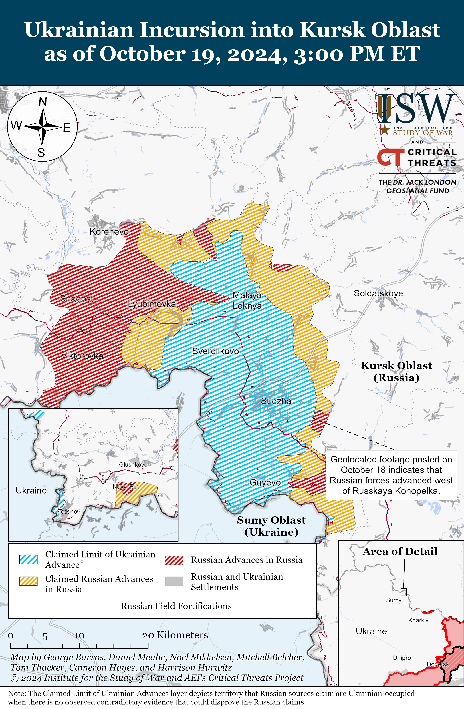
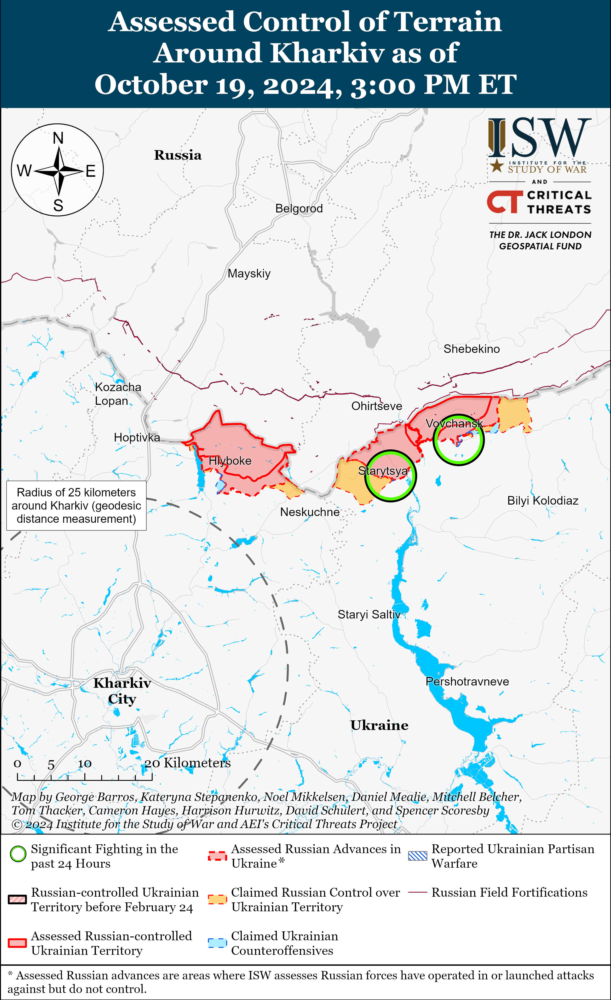
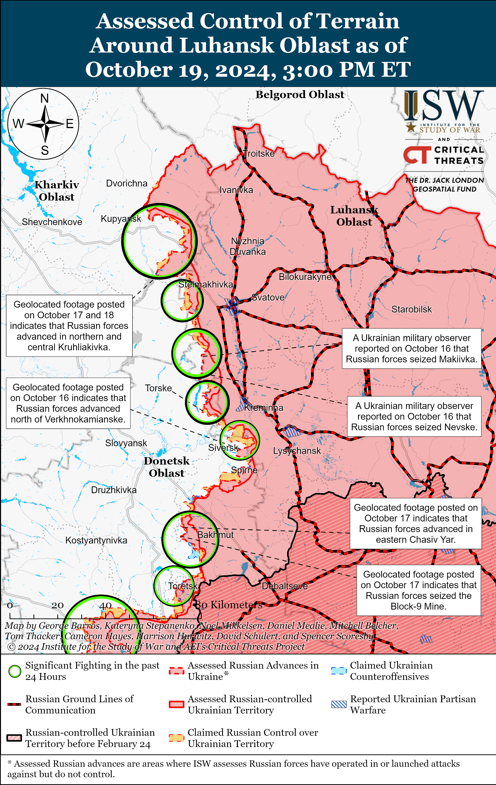
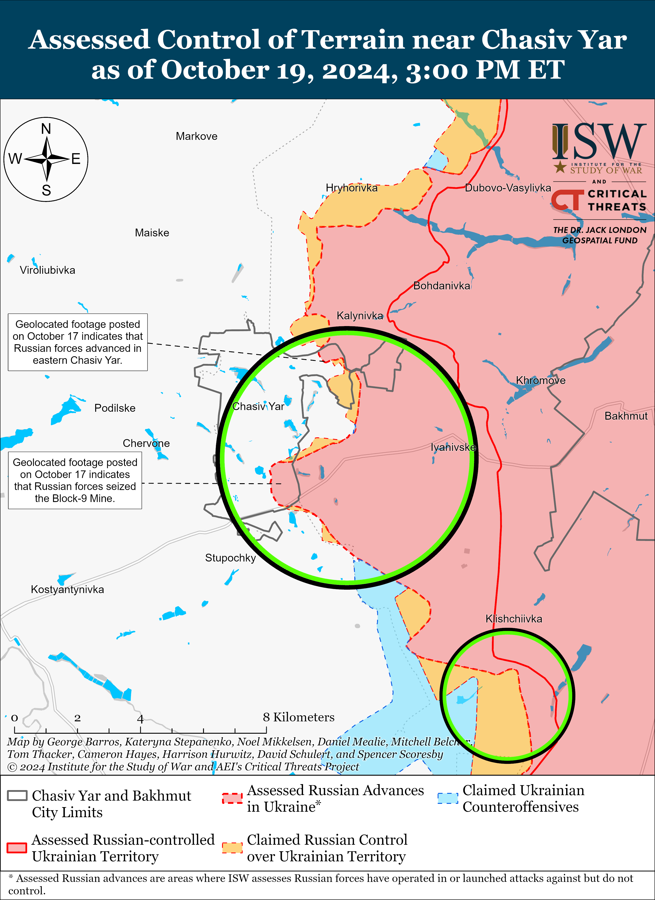
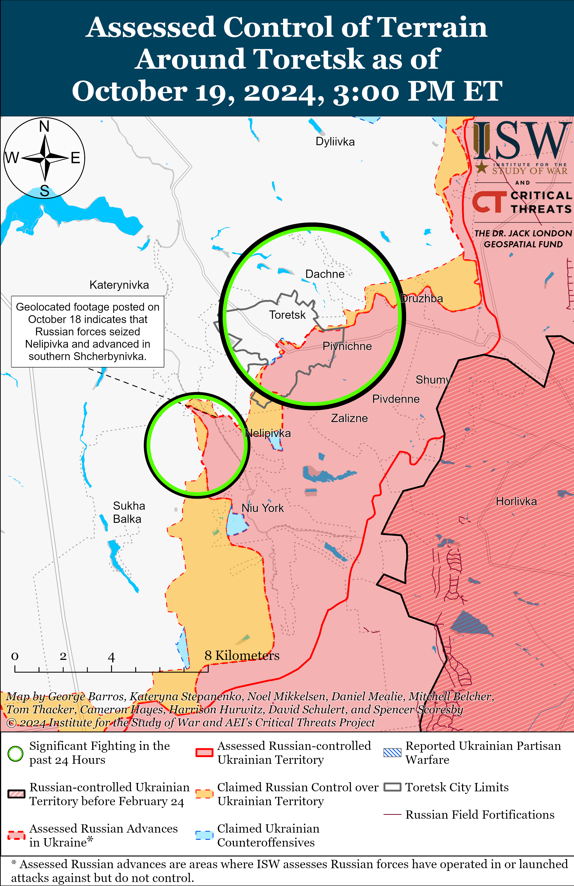
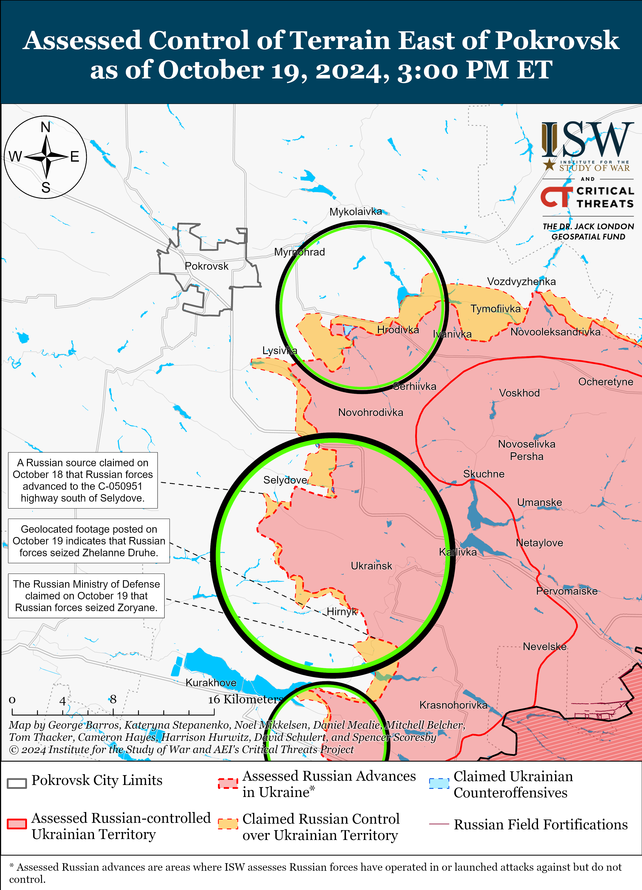
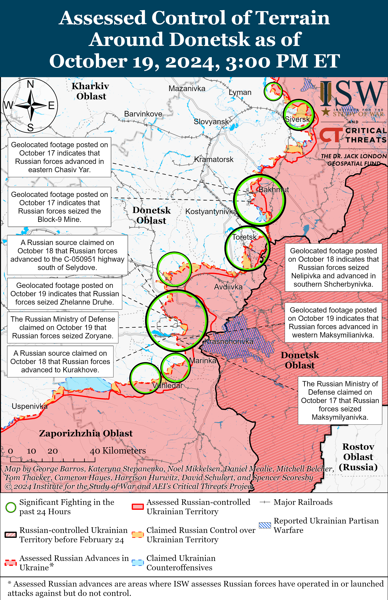
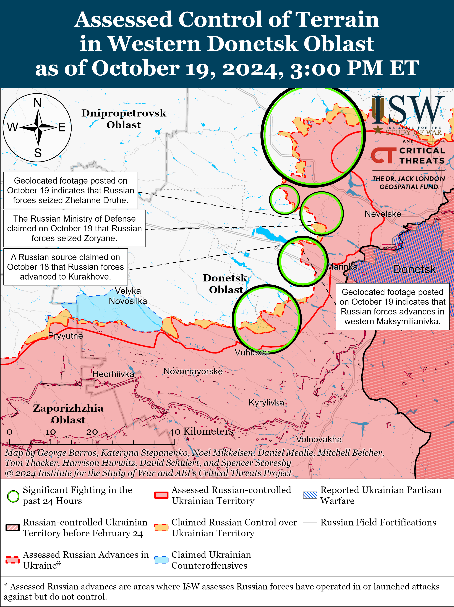
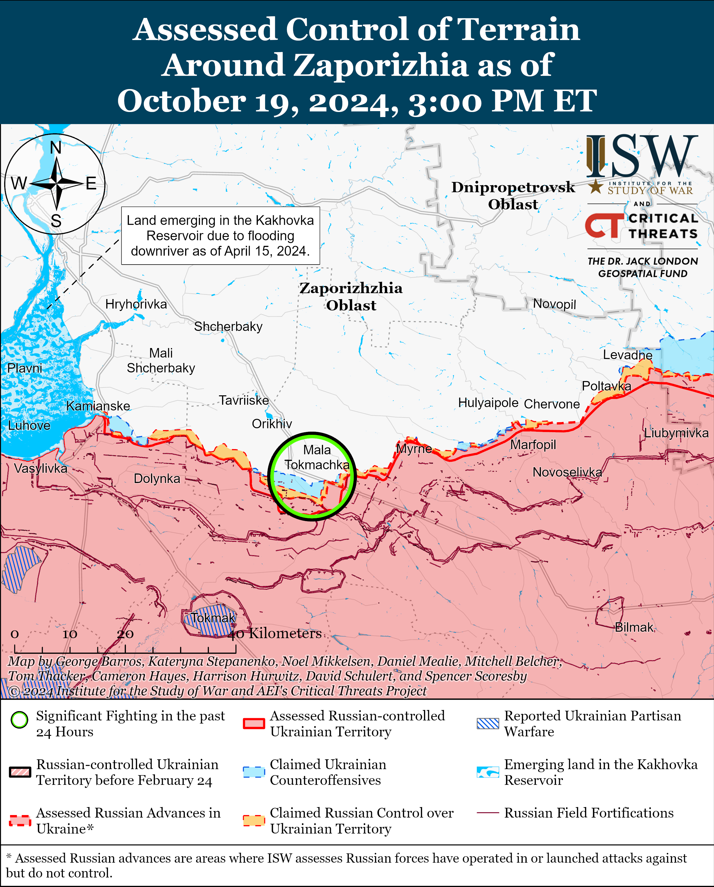
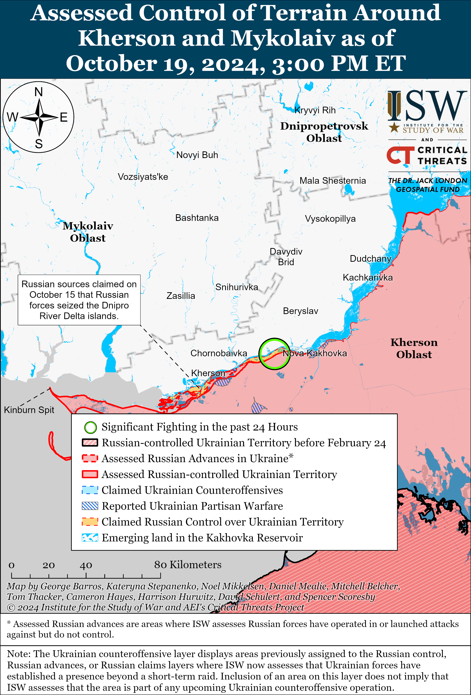

# Russian Offensive Campaign Assessment, October 19, 2024

**Angelica Evans, Christina Harward, Davit Gasparyan, Nicole Wolkov, and Frederick W. Kagan**

**October 19, 2024, 3pm ET**

**Click**[**here**](https://storymaps.arcgis.com/stories/36a7f6a6f5a9448496de641cf64bd375)**to see ISW’s interactive map of the Russian invasion of Ukraine. This map is updated daily alongside the static maps present in this report.**

**Click**[**here**](https://storymaps.arcgis.com/stories/83a2f24901c941d581c0c523ecd2619b)**to see ISW’s interactive map of Ukraine’s offensive in Kursk Oblast.**

**Click**[**here**](https://understandingwar.maps.arcgis.com/apps/instant/3dviewer/index.html?appid=1602762dbcde419bb957dea358449580)**to see ISW’s 3D control of terrain topographic map of Ukraine. Use of a computer (not a mobile device) is strongly recommended for using this data-heavy tool.**

**Click**[**here**](https://storymaps.arcgis.com/stories/733fe90805894bfc8562d90b106aa895)**to access ISW’s archive of interactive time-lapse maps of the Russian invasion of Ukraine. These maps complement the static control-of-terrain map that ISW produces daily by showing a dynamic frontline. ISW will update this time-lapse map archive monthly.**

**Note: The data cut-off for this product was 11:45am ET on October 19. ISW will cover subsequent reports in the October 20 Russian Offensive Campaign Assessment.**

**Ukrainian drones reportedly struck the “Kremniy El” microelectronic plant in Bryansk City on the night of October 18 to 19.**Russian opposition outlet *Astra* reported on October 19 that Ukrainian drones struck the plant and noted that “Kremniy El” is one of Russia’s largest microelectronic manufacturers and that the Russian Ministry of Defense (MoD) is one of the company’s main customers.[1] Head of the Ukrainian Center for Countering Disinformation Lieutenant Andriy Kovalenko acknowledged the report of the strike and stated that the plant manufactures microelectronics for Russian Pantsir air defense systems, Iskander missiles, radars, electronic warfare (EW) systems, and drones.[2] Ukrainian outlet *RBC Ukraine* and Ukrainian open-source intelligence group CyberBoroshno published photos showing the aftermath of the strike and damage to a building at the plant.[3] Bryansk Oblast Governor Alexander Bogomaz claimed on October 19 that debris from a downed Ukrainian drone struck and caused a fire at a “non-residential building” in Bryansk Oblast, possibly referring to the plant.[4]

**Ukraine and Russia conducted a one-for-one prisoner of war (POW) exchange on October 18 – the fourth exchange since the start of Ukrainian operations in Kursk Oblast in August 2024.** Ukrainian President Volodymyr Zelensky announced on October 19 that Ukraine returned 95 POWs, including Ukrainian servicemembers who defended the Azovstal Steel Plant in Mariupol in early 2022, Ukrainian National Guardsmen, servicemembers of the Ukrainian State Border Service, and other Ukrainian military personnel.[5] The Russian MoD claimed on October 18 that Russian authorities also returned 95 Russian POWs and that the United Arab Emirates (UAE) mediated the exchange.[6] The Ukrainian Coordination Headquarters for the Treatment of POWs noted that many of the returned Ukrainian POWs had serious illnesses and severe injuries and experienced weight loss due to torture and malnutrition in Russian captivity.[7]   ISW previously observed that the frequency of POW exchanges between Ukraine and Russia has significantly increased since the start of the Ukrainian incursion into Kursk Oblast on August 6, with both sides exchanging a total of 267 POWs each in three separate exchanges prior to the most recent October 18 POW exchange.[8] Russia and Ukraine only conducted three POW exchanges between January 1 and August 6, 2024, in comparison. ISW continues to assess that theUkrainian incursion into Kursk Oblast has likely increasingly incentivized Russia to engage in POW exchanges.

**Ukraine’s Prosecutor General’s Office reported on October 18 that Ukrainian authorities opened an investigation into the execution of a Ukrainian prisoner of war (POW) in Bakhmut Raion in September 2024.[9]**Ukraine’s Prosecutor General’s Office reported that the Donetsk Oblast Prosecutor’s Office opened a pre-trial investigation into violations of the laws and customs of war and intentional murder in connection with Russian forces shooting an unarmed and injured Ukrainian POW near the Phenol Plant in Niu York, Donetsk Oblast on September 6, 2024. ISW has recently observed an increase in Russian violations of different aspects of the Geneva Convention on POWs, which prohibits the inhumane treatment and execution of POWs or persons who are clearly rendered *hors de combat*.[10]

**Key Takeaways:**

- **Ukrainian drones reportedly struck the “Kremniy El” microelectronic plant in Bryansk City on the night of October 18 to 19.**
- **Ukraine and Russia conducted a one-for-one prisoner of war (POW) exchange on October 18 – the fourth exchange since the start of Ukrainian operations in Kursk Oblast in August 2024.**
- **Ukraine’s Prosecutor General’s Office reported on October 18 that Ukrainian authorities opened an investigation into the execution of a Ukrainian prisoner of war (POW) in Bakhmut Raion in September 2024.**
- **Russian forces recently advanced within the main Ukrainian salient in Kursk oblast and near Toretsk, Pokrovsk, and Donetsk City.**

***We do not report in detail on Russian war crimes because these activities are well-covered in Western media and do not directly affect the military operations we are assessing and forecasting. We will continue to evaluate and report on the effects of these criminal activities on the Ukrainian military and the Ukrainian population and specifically on combat in Ukrainian urban areas. We utterly condemn Russian violations of the laws of armed conflict and the Geneva Conventions and crimes against humanity even though we do not describe them in these reports.***

- Ukrainian Operations in the Russian Federation
- Russian Main Effort – Eastern Ukraine (comprised of three subordinate main efforts)
- Russian Subordinate Main Effort #1 – Push Ukrainian forces back from the international border with Belgorod Oblast and approach to within tube artillery range of Kharkiv City
- Russian Subordinate Main Effort #2 – Capture the remainder of Luhansk Oblast and push westward into eastern Kharkiv Oblast and encircle northern Donetsk Oblast
- Russian Subordinate Main Effort #3 – Capture the entirety of Donetsk Oblast
- Russian Supporting Effort – Southern Axis
- Russian Air, Missile, and Drone Campaign
- Russian Mobilization and Force Generation Efforts
- Russian Technological Adaptations
- Activities in Russian-occupied areas
- Ukrainian Defense Industrial Base Efforts
- Russian Information Operations and Narratives
- Significant Activity in Belarus

**Ukrainian Operations in the Russian Federation**

Russian forces recently advanced within the main Ukrainian salient in Kursk Oblast and continued fighting in the area on October 19. Geolocated footage published on October 18 indicates that Russian forces recently advanced west of Russkaya Konopelka (east of Sudzha).[11] Russian milbloggers claimed that elements of the Russian 106th Airborne (VDV) Division seized and cleared Lyubimovka (southeast of Korenevo) and that Russian forces seized Leonidovo (southeast of Korenevo) and are advancing toward Malaya Loknya and Viktorovka (both southeast of Korenevo).[12] Russian milbloggers also claimed that Russian forces advanced near Martynovka (northeast of Sudzha) and seized most of and partially encircled Plekhovo (southeast of Sudzha).[13]

Russian sources claimed that Ukrainian forces conducted counterattacks within the main Ukrainian salient in Kursk Oblast on October 19. Russian sources, including the Russian MoD, claimed that Ukrainian forces counterattacked near Leonidovo, Lyubimovka, and Zeleny Shlyakh (southeast of Korenevo).[14]

A Russian milblogger claimed on October 19 that Russian forces repelled limited Ukrainian attacks across the international border near Volfino and Tetkino in Glushkovsky Raion (west of the main Ukrainian salient in Kursk Oblast).[15] Elements of the Russian 1434th Akhmat “Chechnya” Regiment reportedly continue operating in Glushkovsky Raion.[16]

**Russian Main Effort – Eastern Ukraine**

**Russian Subordinate Main Effort #1 – Kharkiv Oblast (Russian objective: Push Ukrainian forces back from the international border with Belgorod Oblast and approach to within tube artillery range of Kharkiv City)**

Russian forces continued offensive operations northeast of Kharkiv City near Vovchansk and Starytsya on October 18 and 19 but did not make any confirmed advances.[17]

**Russian Subordinate Main Effort #2 – Luhansk Oblast (Russian objective: Capture the remainder of Luhansk Oblast and push westward into eastern Kharkiv Oblast and northern Donetsk Oblast)**

Russian forces recently advanced southeast of Kupyansk during a reinforced company-sized mechanized assault on October 19. Geolocated footage published on October 19 indicates that Russian forces recently advanced along Luhova Street in southwestern Kruhlyakivka (southeast of Kupyansk) during a reinforced company-sized mechanized assault.[18] The Ukrainian units that repelled the attack reported that Ukrainian forces destroyed eight Russian armored vehicles and three tanks and damaged six additional armored vehicles during the mechanized assault.[19] This advance places Russian forces within meters of the Oskil River and is part of the Russian military command’s effort to establish a foothold directly on the Oskil River to pressure the Ukrainian salient to the north between Kupyansk-Vuzlovyi and Hlushkivka and the wider Ukrainian salient south of Kruhlyakivka.[20]

Ukrainian forces marginally advanced southeast of Kupyansk amid ongoing Russian offensive operations along the Kupyansk-Svatove-Kremina line on October 19. Geolocated footage published on October 18 indicates that Ukrainian forces recently retook positions along Osinnia Street in northern Kruhlyakivka.[21] Ukraine’s Main Military Intelligence Directorate (GUR) stated on October 18 that Ukrainian forces pushed Russian forces from Kruhlaykivka between October 7 and October 14 and destroyed a platoon’s worth of Russian personnel in the settlement.[22] Russian milbloggers claimed that Russian forces advanced in Kolesnykivka (southeast of Kupyansk) and into Torske (west of Kreminna), but ISW has not observed visual confirmation of these claims.[23] Russian forces continued offensive operations northeast of Kupyansk near Hlubivka and Synkivka; east of Kupyansk near Kucherivka, Lozova, Pishchane, and Stepova Novoselivka; southeast of Kupyansk near Novoosynove, Kolisnykivka and Kruhlyakivka; east of Svatove near Vyshneve; southeast of Svatove near Novomykhailivka, Hrekivka, Druzhelyubivka, and Makiivka; west of Kreminna near Terny and Torske; and southwest of Kreminna near Serebryanka on October 18 and 19.[24] Elements of the Russian 144th Motorized Rifle Division (20th Combined Arms Army [CAA], Moscow Military District [MMD]) are reportedly operating in the Lyman direction.[25]

**Russian Subordinate Main Effort #3 – Donetsk Oblast (Russian objective: Capture the entirety of Donetsk Oblast, the claimed territory of Russia’s proxies in Donbas)**

Neither Ukrainian nor Russian sources reported offensive operations in the Siversk direction on October 19. A Russian source claimed that unfavorable weather in the Siversk direction is not allowing Russian and Ukrainian forces to fully use drones.[26]

Russian forces continued offensive operations near Chasiv Yar on October 19, but there were no confirmed changes to the frontline. Russian forces conducted offensive operations near and within Chasiv Yar; south of Chasiv Yar towards Stupochky and Predtechyne; and southeast of Chasiv Yar near Andriivka on October 18 and 19.[27] Russian milbloggers claimed that elements of the Russian 331st Airborne (VDV) Regiment (98th VDV Division) advanced 300 meters in Zhovtnevyi Microraion (eastern Chasiv Yar) and that Russian forces attacked with armored vehicle support within the microraion.[28] A Russian source claimed that Russian forces are struggling to move within Chasiv Yar due to Ukrainian first-person view (FPV) drone operations.[29] Elements of the Russian 17th Artillery Brigade (3rd Army Corps [AC]) are reportedly operating near Kurdyumivka (southeast of Chasiv Yar), and elements of the “Sever-V” Reconnaissance and Assault Brigade (Russian Volunteer Corps) and “Rodnya” Battalion are reportedly operating in the Chasiv Yar direction.[30]

Russian forces recently advanced in the Toretsk direction amid continued offensive operations in the area on October 19. Geolocated footage published on October 18 indicates that Russian forces recently advanced in eastern Toretsk.[31] Additional geolocated footage published on October 18 shows Ukrainian forces striking a Russian platoon-sized mechanized assault consisting of four infantry fighting vehicles in southern Shcherbynivka (west of Toretsk), indicating that Russian forces recently advanced in the area and likely seized Nelipivka (southwest of Toretsk and south of Shcherbynivka).[32] Russian forces conducted offensive operations north of Toretsk near Dyliivka and in the direction of Oleksandro-Shultyne and near and within Toretsk on October 18 and 19.[33] Ukrainian Luhansk Group of Forces Spokesperson Major Anastasiya Bobovnikova reported on October 18 that the Russian motorized rifle brigades operating near Toretsk are using few armored vehicles as their equipment is very old and that these units are less well-equipped compared to VDV units.[34] Bobovnikova stated that Russian forces are attacking in small groups under cover of artillery, mortars, and drones but are struggling to gain a foothold and find shelter in the buildings within Toretsk that Russian strikes have almost completely destroyed.[35] Elements of the Russian 72nd Motorized Rifle Brigade (6th Motorized Rifle Division, 3rd AC) are reportedly operating in the Pleshchiivka direction (northwest of Toretsk).[36]

Russian forces recently advanced in the Pokrovsk direction amid continued offensive operations in the area on October 19. Geolocated footage published on October 19 indicates that Russian forces recently advanced on the southern outskirts of Vozdvyzhenka (east of Pokrovsk).[37] Additional geolocated footage published on October 19 shows Ukrainian forces striking Russian forces in northern Zoryane, southeast of Zoryane, and in the satellite community northeast of Zoryane, indicating that Russian forces recently advanced in the area and likely seized Zhelanna Druhe (northeast of Zoryane).[38] The Russian MoD claimed that Russian forces seized Zoryane, and a Russian milblogger claimed that Russian forces advanced 0.5 kilometers in Lysivka (southeast of Pokrovsk), 1.2 kilometers west of the Korotchenka mine (on the eastern outskirts of Selydove), and one kilometer west of the Novohrodivska Mine No. 2.[39] ISW has not observed confirmation of these claims, however. Russian forces conducted offensive operations east of Pokrovsk near Myrolyubivka and Promin and southeast of Pokrovsk near Novoukrainka, Novodmytrivka, Zhelanne Druhe, Novoselydivka, Hirnyk, Kurakhivka, Selydove, and Mykhailivka on October 18 and 19.[40]

Russian forces recently advanced west of Donetsk City and conducted a reinforced platoon-sized mechanized assault in the area on October 19. Geolocated footage published on October 19 indicates that Russian forces recently advanced in western Maksymilyanivka.[41] Additional geolocated footage published on October 19 shows Ukrainian forces repelling a Russian reinforced platoon-sized mechanized assault consisting of three armored vehicles and two tanks south of Maksymilyanivka, indicating that Russian forces recently advanced in the area.[42] Ukrainian forces also recently repelled a Russian battalion-sized mechanized assault near Maksymilyanivka, and ISW continues to assess that the arrival or impending arrival of muddy ground conditions due to seasonal rainy weather is likely prompting the Russian military command to intensify mechanized assaults in western Donetsk Oblast.[43] Russian forces conducted offensive operations near Kurakhove, Heorhiivka, Maksymilyanivka, and Dalnye on October 18 and 19.[44] A Russian milblogger claimed that Ukrainian forces unsuccessfully counterattacked with armored vehicle support near Maksymilyanivka.[45] Elements of the Russian 5th Motorized Rifle Brigade (51st Combined Arms Army [CAA], formerly 1st Donetsk People’s Republic [DNR] AC) are reportedly operating near Hostre, and elements of the Russian 33rd Motorized Rifle Regiment (20th Motorized Rifle Division, 8th CAA, Southern Military District [SMD]) are reportedly operating in the south Donetsk direction (west and southwest of Donetsk City).[46]

Russian forces recently advanced southwest of Donetsk City near Vuhledar amid continued offensive operations in the area on October 19. Geolocated footage published on October 19 indicates that Russian forces recently marginally advanced in western Zolota Nyva (northeast of Vuhledar).[47] Russian forces conducted offensive operations northwest of Vuhledar near Antonivka, Katerynivka, and Kostyantynivka and north of Vuhledar near Bohoyavlenka on October 18 and 19.[48] A Russian milblogger claimed that Russian forces occupy half of Katerynivka, and another milblogger claimed that reports that Russian forces seized the settlement are inaccurate.[49] ISW has not observed visual confirmation that Russian forces occupy half of Katerynivka. Elements of the “Storm-2” Detachment of the 39th Motorized Rifle Brigade (68th AC, Eastern Military District [EMD]) are reportedly operating near Kostyantynivka and Katerynivka; elements of the 57th Motorized Rifle Brigade (5th CAA, EMD) are reportedly operating near the Pivdennodonbaska Mine No. 3 in western Vodyane (northeast of Vuhledar); and elements of the 36th Motorized Rifle Brigade (29th CAA, EMD) are reportedly operating north of Vuhledar.[50]

Russian forces continued assaults in the Donetsk-Zaporizhia Oblast border area on October 19, but there were no confirmed changes to the frontline. Russian milbloggers claimed on October 18 and 19 that Russian forces advanced 700 meters from Levadne and Pryyutne in the direction of Novodarivka (all southwest of Velyka Novosilka), but ISW has not observed confirmation of these claims.[51]

**Russian Supporting Effort – Southern Axis (Russian objective: Maintain frontline positions and secure rear areas against Ukrainian strikes)**

Russian forces continued assaults northeast of Robotyne near Mala Tokmachka and north of Robotyne in the direction of Novodanylivka on October 18 and 19, but there were no confirmed changes to the frontline.[52]

Russian forces continued assaults in the Kherson direction on October 18 and 19, including in east (left) bank Kherson Oblast and on the islands at the mouth of the Dnipro River southwest of Kherson City, but there were no confirmed changes to the frontline.[53] A Russian milblogger claimed that Russian forces struck a bridge across the Konka River along the Kherson City-Mykolaiv City M-14 highway just north of Oleshky (east of Kherson City in east bank Kherson Oblast).[54]

**Russian Air, Missile, and Drone Campaign (Russian Objective: Target Ukrainian military and civilian infrastructure in the rear and on the frontline)**

Russian forces conducted a series of drone and missile strikes against Ukraine on the night of October 18 to 19. The Ukrainian Air Force reported that Russian forces launched up to 98 Shahed drones and drones of an unknown type from Primorsko-Akhtarsk and Yeysk, Krasnodar Krai and Kursk Oblast and six Kh-59/69 cruise missiles from the Black Sea.[55] The Ukrainian Air Force reported that Ukrainian forces downed four Kh-59/69 cruise missiles and 42 drones over Odesa, Sumy, Cherkasy, Kyiv, Kirovohrad, Chernihiv, Poltava, Mykolaiv and Kherson oblasts and that 46 Russian drones were “lost in location,” possibly due to Ukrainian electronic warfare (EW) countermeasures, as of noon local time. The Kyiv City Military Administration reported that Ukrainian forces downed all of the drones Russia launched at Kyiv City, but that falling drone debris damaged civilian property in Dniprovskyi and Darnytskyi raions.[56] Russian milbloggers claimed that Russian forces struck Cherkasy International Airport and energy infrastructure in Cherkasy and Sumy oblasts, although ISW has not observed visual evidence or Ukrainian reporting on these alleged strikes.[57]

**Russian Mobilization and Force Generation Efforts (Russian objective: Expand combat power without conducting general mobilization)**

The Russian government may increase defense spending in 2024 beyond the previously allocated amount. Russian Finance Minister Anton Siluanov claimed on October 19 that the Russian government may spend an additional 1.5 trillion rubles (about $16 billion) in 2024 in addition to what the Russian government already allocated for the federal budget in part due to the needs of the Russian war effort in Ukraine.[58] Siluanov claimed that the Russian government needs additional funds to subsidize banks, service the public debt, and meet the additional needs of the Russian MoD and law enforcement agencies due to Russia’s war in Ukraine.

The Russian MoD continues to propose benefits incentivizing voluntary participation in Russia’s war against Ukraine. The Russian MoD submitted a draft resolution on October 18 proposing to issue combat veteran status to volunteers participating in the war in Ukraine from the beginning of their participation.[59] The draft resolution would not require a volunteer to submit an application to Russian military authorities to obtain combat veteran status but would require the military unit conducting the recruitment to submit the volunteer’s information to Russian authorities. This is likely part of ongoing efforts by Russian authorities to incentivize voluntary recruitment and to minimize the need to conduct an unpopular wave of involuntary mobilization.

Russian authorities for the first time revoked the Russian citizenship of migrants who failed to register for Russian military service. The Khabarovsk Krai Ministry of Internal Affairs (MVD) announced on October 19 that it revoked the Russian citizenship of three Tajik migrants who had failed to register for military service in Russia.[60] Russian legislators passed a bill in August 2024 allowing the Russian government to terminate the naturalized citizenship of migrants who do not immediately register for military service.[61]

**Russian Technological Adaptations (Russian objective: Introduce technological innovations to optimize systems for use in Ukraine)**

Nothing significant to report.

**Ukrainian Defense Industrial Efforts (Ukrainian objective: Develop its defense industrial base to become more self-sufficient in cooperation with US, European, and international partners)**

*ISW is permanently suspending regular coverage of Ukrainian defense industrial efforts and will cover any notable inflections in topline text or separate special editions moving forward.*

**Activities in Russian-occupied areas (Russian objective: Consolidate administrative control of annexed areas; forcibly integrate Ukrainian citizens into Russian sociocultural, economic, military, and governance systems)**

*ISW is not publishing reporting on activities in Russian-occupied areas today.*

**Russian Information Operations and Narratives**

*ISW is permanently suspending regular coverage of Russian information operations and narratives as a section in the daily updates and will cover any notable inflections in topline text or separate special editions moving forward.*

**Significant activity in Belarus (Russian efforts to increase its military presence in Belarus and further integrate Belarus into Russian-favorable frameworks and Wagner Group activity in Belarus)**

Nothing significant to report.

**Note: ISW does not receive any classified material from any source, uses only publicly available information, and draws extensively on Russian, Ukrainian, and Western reporting and social media as well as commercially available satellite imagery and other geospatial data as the basis for these reports. References to all sources used are provided in the endnotes of each update.**

---

[1] https://t.me/astrapress/66629 ; https://mil.in dot ua/uk/news/drony-atakuvaly-rosijskyj-zavod-mikroelektroniky-kremnyj-el/ ; https://t.me/astrapress/66655

[2] https://t.me/RBC\_ua\_news/115606 ; https://24tv dot ua/vibuhi-rosiyi-19-zhovtnya-urazheno-zavod-kremniy-bryansku\_n2666269

[3] https://t.me/kiber\_boroshno/10385 ; https://t.me/RBC\_ua\_news/115606

[4] https://t.me/avbogomaz/8696 ; https://t.me/avbogomaz/8698 ; https://t.me/tass\_agency/280327

[5] https://t.me/V\_Zelenskiy\_official/12107 ; https://armyinform.com dot ua/2024/10/19/z-rosijskogo-polonu-povernuly-95-lyudej-sered-nyh-zahysnyky-azovstali/; https://suspilne dot media/861249-ukraina-povernula-95-vijskovih-z-rosijskogo-polonu-u-mezah-obminu-z-rosieu/; https://gur dot gov.ua/content/ukraina-povernula-z-rosiiskoho-polonu-95-zakhysnykiv.html; https://t.me/severrealii/27830

[6] https://t.me/tass\_agency/280242 ; https://t.me/tass\_agency/280243 ; https://t.me/mod\_russia/44666

[7] https://t.me/Koord\_shtab/8622

[8] https://understandingwar.org/backgrounder/russian-offensive-campaign-assessment-september-14-2024

[9] https://t.me/pgo\_gov\_ua/26796 ; https://armyinform.com dot ua/2024/10/18/na-bahmutskomu-napryamku-okupanty-rozstrilyaly-jmovirno-poranenogo-vijskovosluzhbovczya-zsu/

[10] https://www.ohchr.org/en/instruments-mechanisms/instruments/geneva-convention-relative-treatment-prisoners-war; https://understandingwar.org/backgrounder/russian-offensive-campaign-assessment-october-13-2024 ; https://understandingwar.org/backgrounder/russian-offensive-campaign-assessment-october-18-2024

[11] https://www.facebook.com/118obrTro/videos/532691602813137/?mibextid=rS40aB7S9Ucbxw6v; https://t.me/creamy\_caprice/7161

[12] https://t.me/RVvoenkor/78962 ; https://t.me/RVvoenkor/78967 ; https://t.me/rybar/64559 ; https://t.me/NgP\_raZVedka/19198 ; https://t.me/dva\_majors/55393 ; https://t.me/DnevnikDesantnika/17571 ; https://t.me/RVvoenkor/78968 ; https://t.me/DnevnikDesantnika/17562 ; https://t.me/DnevnikDesantnika/17565; https://t.me/DnevnikDesantnika/17594

[13] https://t.me/DnevnikDesantnika/17571 ; https://t.me/dva\_majors/55393

[14] ttps://t.me/mod\_russia/44689 ; https://t.me/RVvoenkor/78962 ; https://t.me/RVvoenkor/78967

[15] https://t.me/dva\_majors/55393

[16] https://t.me/DnevnikDesantnika/17588

[17] https://www.facebook.com/GeneralStaff.ua/posts/pfbid02fXSsZKaQnAkbyFqLadQ9DbUwjAWA9iNhmj3v9sq28mnXZP2h1VGKhmuMKhvhbcLxl ; https://www.facebook.com/GeneralStaff.ua/posts/pfbid0hhavAdCGUq7WXefhxHB4Uem1wbKUXgjzcsoHanpQ7CBgyDMmZN19eis7WzzdKfPwl ; https://www.facebook.com/GeneralStaff.ua/posts/pfbid0cpx3U7wXrr7n5oBA4tZgA5BNxEQhqmnxVwbaw1N1XXhzUzBdbHRJTBLCdBDDcgKol

[18] https://t.me/fedorenkoys/631; https://t.me/creamy\_caprice/7169

[19] https://t.me/fedorenkoys/631

[20] https://understandingwar.org/backgrounder/russian-offensive-campaign-assessment-september-27-2024

[21] https://t.me/DIUkraine/4679; https://t.me/WarArchive\_ua/21385

[22] https://gur.gov dot ua/content/shturm-kruhliakivky-spetspryznachentsi-hur-zachystyly-vid-rosiian-vazhlyvyi-raion.html ; https://armyinform.com dot ua/2024/10/18/shturm-kruglyakivky-speczpryznachenczi-gur-zachystyly-vid-rosiyan-vazhlyvyj-rajon/

[23] https://t.me/dva\_majors/55393 ; https://t.me/z\_arhiv/28685

[24] https://www.facebook.com/GeneralStaff.ua/posts/pfbid02fXSsZKaQnAkbyFqLadQ9DbUwjAWA9iNhmj3v9sq28mnXZP2h1VGKhmuMKhvhbcLxl ; https://www.facebook.com/GeneralStaff.ua/posts/pfbid0hhavAdCGUq7WXefhxHB4Uem1wbKUXgjzcsoHanpQ7CBgyDMmZN19eis7WzzdKfPwl ; https://www.facebook.com/GeneralStaff.ua/posts/pfbid0cpx3U7wXrr7n5oBA4tZgA5BNxEQhqmnxVwbaw1N1XXhzUzBdbHRJTBLCdBDDcgKol ; https://t.me/dva\_majors/55393

[25] https://t.me/vysokygovorit/17677  ; https://t.me/sashakots/49614 ; https://t.me/epoddubny/21388 ; https://t.me/vysokygovorit/17686

[26] https://t.me/tass\_agency/280319; https://tass dot ru/armiya-i-opk/22164345

[27] https://www.facebook.com/GeneralStaff.ua/posts/pfbid02fXSsZKaQnAkbyFqLadQ9DbUwjAWA9iNhmj3v9sq28mnXZP2h1VGKhmuMKhvhbcLxl; https://www.facebook.com/GeneralStaff.ua/posts/pfbid0hhavAdCGUq7WXefhxHB4Uem1wbKUXgjzcsoHanpQ7CBgyDMmZN19eis7WzzdKfPwl; https://www.facebook.com/GeneralStaff.ua/posts/pfbid0cpx3U7wXrr7n5oBA4tZgA5BNxEQhqmnxVwbaw1N1XXhzUzBdbHRJTBLCdBDDcgKol; https://t.me/RVvoenkor/78978; https://t.me/wargonzo/22681; https://t.me/DnevnikDesantnika/17603

[28] https://t.me/DnevnikDesantnika/17557; https://t.me/DnevnikDesantnika/17603 ; https://t.me/RVvoenkor/78978

[29] https://t.me/wargonzo/22687

[30] https://t.me/nm\_dnr/12843; https://t.me/RVvoenkor/78972 ; https://t.me/wargonzo/22676

[31] https://x.com/AudaxonX/status/1847377443168063529; https://t [dot] me/hayabusachef/6628; https://t.me/hayabusachef/6629

[32] https://x.com/AudaxonX/status/1847350901453049991; https://x.com/AudaxonX/status/1847351149700976854; https://t.me/OBiloshytskiy/1022; https://t.me/OBiloshytskiy/1022; https://t.me/creamy\_caprice/7162

[33] https://www.facebook.com/GeneralStaff.ua/posts/pfbid02fXSsZKaQnAkbyFqLadQ9DbUwjAWA9iNhmj3v9sq28mnXZP2h1VGKhmuMKhvhbcLxl ; https://www.facebook.com/GeneralStaff.ua/posts/pfbid0hhavAdCGUq7WXefhxHB4Uem1wbKUXgjzcsoHanpQ7CBgyDMmZN19eis7WzzdKfPwl; https://www.facebook.com/GeneralStaff.ua/posts/pfbid0cpx3U7wXrr7n5oBA4tZgA5BNxEQhqmnxVwbaw1N1XXhzUzBdbHRJTBLCdBDDcgKol; https://t.me/wargonzo/22681; https://t.me/RVvoenkor/79003

[34] https://youtu.be/j5TqaWCCdUg ; https://armyinform.com dot ua/2024/10/18/drevni-behy-ta-motolygy-chomu-na-toreczkomu-napryamku-vorog-zastosovuye-zastarilu-bronetehniku/

[35] https://youtu.be/j5TqaWCCdUg ; https://armyinform.com dot ua/2024/10/18/u-toreczku-syly-oborony-uspishno-kontratakuyut-odnak-zakripytysya-na-ruyinah-ukraj-vazhko/

[36] https://t.me/boris\_rozhin/141228

[37] https://t.me/mash\_donbass/7513; https://t.me/creamy\_caprice/7165; https://x.com/Playfra0/status/1847597024901787762

[38] https://t.me/opbr\_zsu/378; https://t.me/creamy\_caprice/7164 ;

[39] https://t.me/mod\_russia/44685; https://t.me/DnevnikDesantnika/17557; https://t.me/DnevnikDesantnika/17592

[40] https://www.facebook.com/GeneralStaff.ua/posts/pfbid02fXSsZKaQnAkbyFqLadQ9DbUwjAWA9iNhmj3v9sq28mnXZP2h1VGKhmuMKhvhbcLxl; https://www.facebook.com/GeneralStaff.ua/posts/pfbid0hhavAdCGUq7WXefhxHB4Uem1wbKUXgjzcsoHanpQ7CBgyDMmZN19eis7WzzdKfPwl ; https://www.facebook.com/GeneralStaff.ua/posts/pfbid0cpx3U7wXrr7n5oBA4tZgA5BNxEQhqmnxVwbaw1N1XXhzUzBdbHRJTBLCdBDDcgKol; https://t.me/DnevnikDesantnika/17592

[41] https://t.me/ssternenko/35091; https://t.me/creamy\_caprice/7167

[42] https://t.me/oaembr46/1093; https://t.me/creamy\_caprice/7170

[43] https://understandingwar.org/backgrounder/russian-offensive-campaign-assessment-october-18-2024

[44] https://t.me/rybar/64554

[45] https://t.me/NgP\_raZVedka/19199

[46] https://t.me/rybar/64554; https://t.me/dva\_majors/55396

[47] https://t.me/pidrozdilshadowoficial/614; https://t.me/creamy\_caprice/7168

[48] https://www.facebook.com/GeneralStaff.ua/posts/pfbid02fXSsZKaQnAkbyFqLadQ9DbUwjAWA9iNhmj3v9sq28mnXZP2h1VGKhmuMKhvhbcLxl; https://www.facebook.com/GeneralStaff.ua/posts/pfbid0hhavAdCGUq7WXefhxHB4Uem1wbKUXgjzcsoHanpQ7CBgyDMmZN19eis7WzzdKfPwl ; https://www.facebook.com/GeneralStaff.ua/posts/pfbid0cpx3U7wXrr7n5oBA4tZgA5BNxEQhqmnxVwbaw1N1XXhzUzBdbHRJTBLCdBDDcgKol; https://t.me/wargonzo/22681

[49] https://t.me/NgP\_raZVedka/19199; https://t.me/wargonzo/22681

[50] https://t.me/boris\_rozhin/141270; https://t.me/voin\_dv/11407 ; https://t.me/voin\_dv/11408

[51] https://t.me/DnevnikDesantnika/17600 ; https://t.me/voenkorKotenok/59630

[52] https://www.facebook.com/GeneralStaff.ua/posts/pfbid0cpx3U7wXrr7n5oBA4tZgA5BNxEQhqmnxVwbaw1N1XXhzUzBdbHRJTBLCdBDDcgKol ; https://www.facebook.com/GeneralStaff.ua/posts/pfbid0hhavAdCGUq7WXefhxHB4Uem1wbKUXgjzcsoHanpQ7CBgyDMmZN19eis7WzzdKfPwl ; https://www.facebook.com/GeneralStaff.ua/posts/pfbid02fXSsZKaQnAkbyFqLadQ9DbUwjAWA9iNhmj3v9sq28mnXZP2h1VGKhmuMKhvhbcLxl ; https://t.me/wargonzo/22681

[53] https://www.facebook.com/GeneralStaff.ua/posts/pfbid0cpx3U7wXrr7n5oBA4tZgA5BNxEQhqmnxVwbaw1N1XXhzUzBdbHRJTBLCdBDDcgKol ; https://www.facebook.com/GeneralStaff.ua/posts/pfbid0hhavAdCGUq7WXefhxHB4Uem1wbKUXgjzcsoHanpQ7CBgyDMmZN19eis7WzzdKfPwl ; https://www.facebook.com/GeneralStaff.ua/posts/pfbid02fXSsZKaQnAkbyFqLadQ9DbUwjAWA9iNhmj3v9sq28mnXZP2h1VGKhmuMKhvhbcLxl ; https://t.me/SJTF\_Odes/11659

[54] https://t.me/boris\_rozhin/141230

[55] https://t.me/kpszsu/21537

[56] https://t.me/VA\_Kyiv/8662

[57] https://t.me/DnevnikDesantnika/17593 ; https://t.me/boris\_rozhin/141289 ; https://t.me/DnevnikDesantnika/17593 ; https://t.me/boris\_rozhin/141247 ; https://t.me/boris\_rozhin/141289

[58] https://www.rbc dot ru/economics/19/10/2024/67128a499a7947f9080aeed2?from=from\_main\_1 ; https://meduza dot io/news/2024/10/19/rashody-byudzheta-v-2024-godu-mogut-uvelichit-esche-na-1-5-trilliona-rubley-ih-potratyat-na-lgotnuyu-ipoteku-i-voynu

[59] https://www.rbc dot ru/rbcfreenews/67127e479a7947e718ec8434 ; https://www.vedomosti dot ru/society/news/2024/10/18/1069689-minoboroni-hochet-ustanovit ; https://regulation.gov dot ru/Regulation/Npa/PublicView?npaID=151738#  ; https://t.me/tass\_agency/280225; https://t.me/DnevnikDesantnika/17582

[60] https://t.me/tass\_agency/280367 ; https://t.me/mobilizationnews/20613 ; https://t.me/mvd\_27/4340

[61] https://understandingwar.org/backgrounder/russian-offensive-campaign-assessment-august-2-2024
