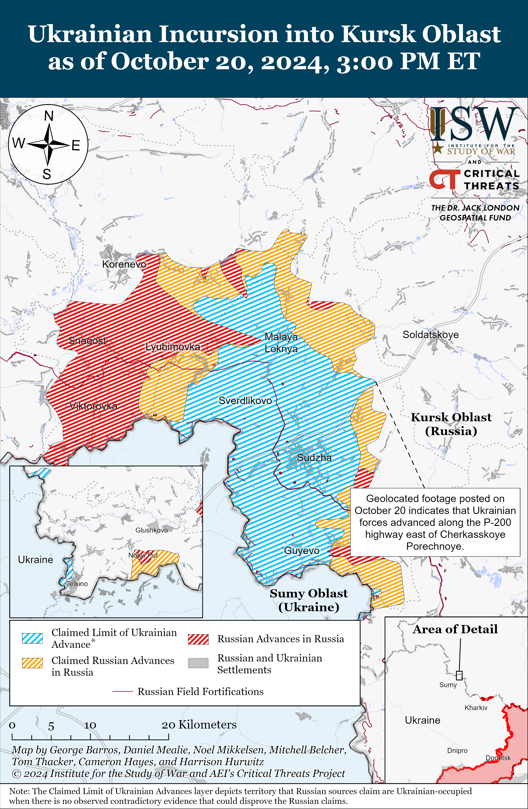
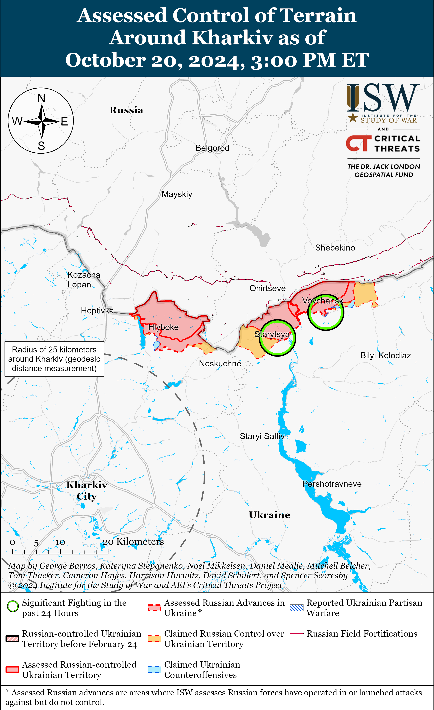
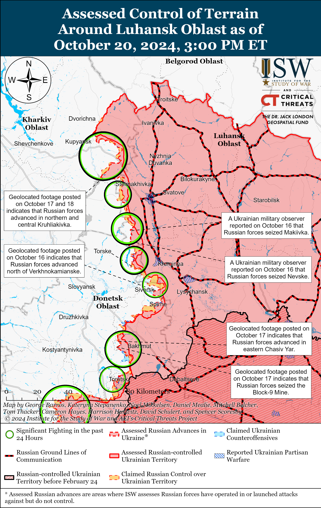
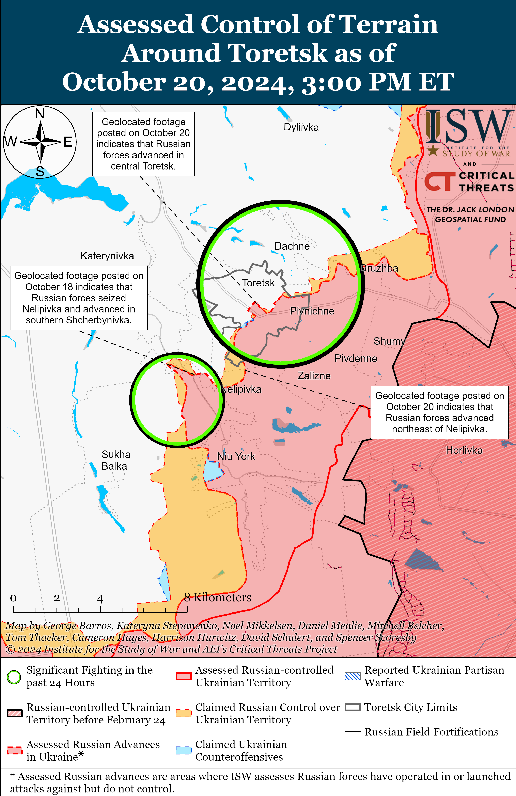
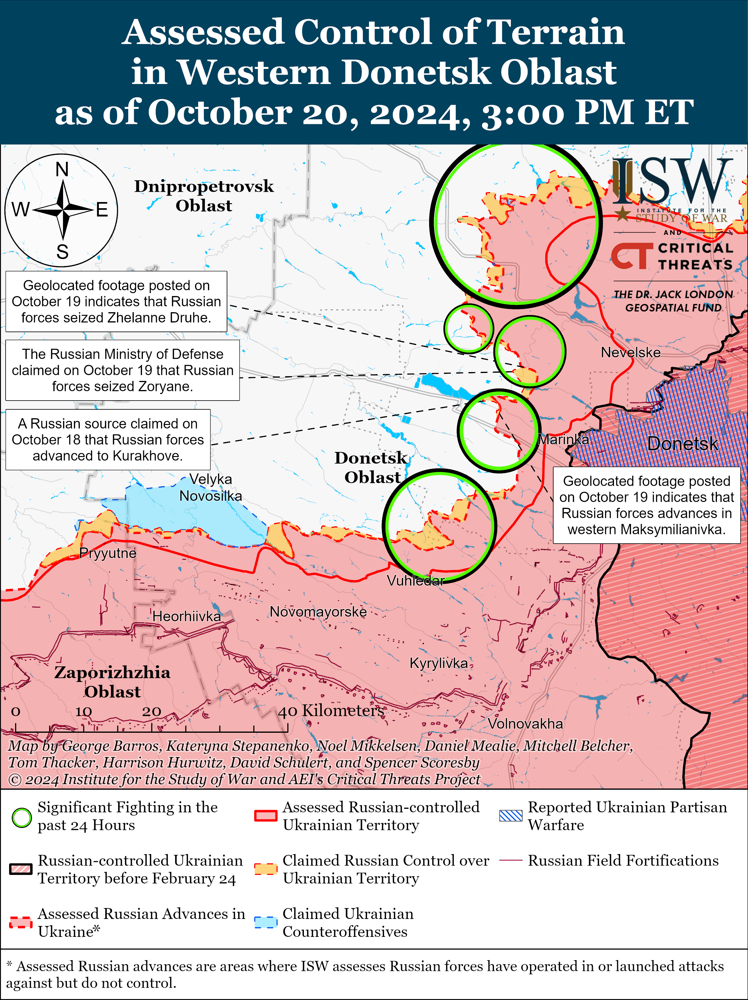
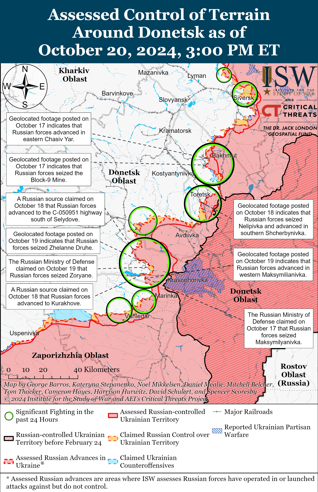
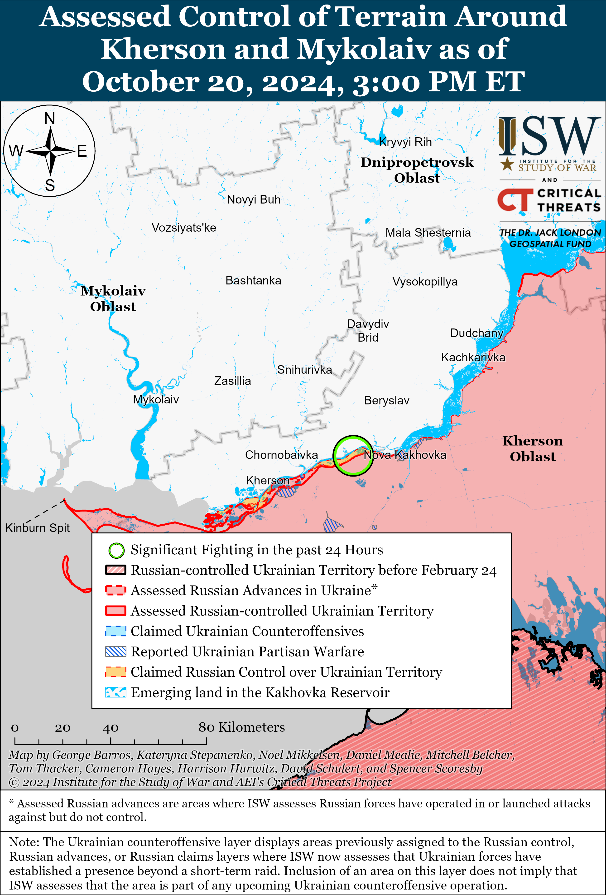

# Russian Offensive Campaign Assessment, October 20, 2024

**October 20, 2024, 3:50 pm ET**

**Click** [**here**](https://storymaps.arcgis.com/stories/36a7f6a6f5a9448496de641cf64bd375) **to see ISW’s interactive map of the Russian invasion of Ukraine. This map is updated daily alongside the static maps present in this report.**

**Click** [**here**](https://storymaps.arcgis.com/stories/83a2f24901c941d581c0c523ecd2619b) **to see ISW's interactive map of Ukraine's offensive in Kursk Oblast.**

**Click** [**here**](https://understandingwar.maps.arcgis.com/apps/instant/3dviewer/index.html?appid=1602762dbcde419bb957dea358449580) **to see ISW’s 3D control of terrain topographic map of Ukraine. Use of a computer (not a mobile device) is strongly recommended for using this data-heavy tool.**

**Click** [**here**](https://storymaps.arcgis.com/stories/733fe90805894bfc8562d90b106aa895) **to access ISW’s archive of interactive time-lapse maps of the Russian invasion of Ukraine. These maps complement the static control-of-terrain map that ISW produces daily by showing a dynamic frontline. ISW will update this time-lapse map archive monthly.**

**Note: The data cut-off for this product was 11:30am ET on October 20. ISW will cover subsequent reports in the October 21 Russian Offensive Campaign Assessment.**

**Ukrainian forces conducted drone strikes against the Lipetsk-2 Air Base near Lipetsk City and Russian state-owned defense enterprise Sverdlov in Dzerzhinsk, Nizhny Novgorod Oblast on the night of October 19 to 20.** The Ukrainian General Staff reported that forces from Ukraine's Security Service (SBU), Main Military Intelligence Directorate (GUR), and Special Operations Forces (SSO) struck the Lipetsk-2 Air Base and caused a fire and secondary explosions.[[1]](#_edn3ff17411b8f31054167bbeb5937773731) The Ukrainian General Staff stated that Ukrainian forces targeted ammunition depots, fuel storage, and aircraft and noted that the Russian military bases Su-34 fighter-bomber, Su-35 fighter, and MiG-31 interceptor/fighter fixed-wing aircraft at the base. Lipetsk Oblast Governor Igor Artamonov claimed that Russian forces intercepted drones over Lipetsk City and Oblast and that a crashed drone caused a fire in an unspecified area.[[2]](#_edn3ff17411b8f31054167bbeb5937773732) The Ukrainian General Staff reported that forces from Ukraine's SBU, GUR, and SSO also struck the Sverdlov Plant, causing secondary explosions.[[3]](#_edn3ff17411b8f31054167bbeb5937773733) The Sverdlov plant produces chemicals for artillery ammunition and stores and produces glide bombs, and sources in Ukrainian intelligence told Western and Ukrainian news outlets that the plant is one of Russia's largest explosives factories.[[4]](#_edn3ff17411b8f31054167bbeb5937773734) Geolocated footage published on October 20 shows an explosion near the Sverdlov Plant.[[5]](#_edn3ff17411b8f31054167bbeb5937773735) The US imposed sanctions on the Sverdlov Plant in July 2023 for its support of Russia's war effort in Ukraine.[[6]](#_edn3ff17411b8f31054167bbeb5937773736) Nizhny Novgorod Oblast Governor Gleb Nikitin claimed that Russian forces repelled a Ukrainian drone strike on the Dzerzhinsk industrial zone and that several plant employees received minor injuries.[[7]](#_edn3ff17411b8f31054167bbeb5937773737)

**Moldovan authorities have yet to announce the results of the October 20 presidential election and European Union (EU) referendum, but both the election and referendum have passed the required voter turnout threshold to be valid.** Current Moldovan President Maia Sandu is up for re-election, and the referendum — if passed — would change the Moldovan Constitution to define EU membership as one of Moldova's "strategic objectives."[[8]](#_edn3ff17411b8f31054167bbeb5937773738) The presidential election and referendum results will both be considered valid, as they surpassed the 33.33 percent voter turnout requirement.[[9]](#_edn3ff17411b8f31054167bbeb5937773739) The Moldovan Central Election Commission (CEC) reported that about 51 percent of registered voters had already voted in the presidential election by the end of the voting period within Moldova, but polling stations abroad are still open as of the time of this publication.[[10]](#_edn3ff17411b8f31054167bbeb59377737310) Moldovan media reported that 42.44 percent of voters had already participated in the referendum as of 1800 local time in Moldova.[[11]](#_edn3ff17411b8f31054167bbeb59377737311) ISW recently assessed that, although Moldova stands to advance its path towards European integration with the October 20 election and referendum, the Kremlin will continue its efforts to sabotage Moldova's EU accession and destabilize Moldovan democracy into the next decade.[[12]](#_edn3ff17411b8f31054167bbeb59377737312)

Moldovan authorities reported several attempted electoral violations, including attempts by pro-Russian actors to influence the results of the election and destabilize Moldova through violent protests and other kinetic activities. The Moldovan General Police Inspectorate reported that authorities have observed 113 electoral violations within Moldova as of 1830 local time, including photographing the ballot, damaging the ballot, and organizing the transport of voters.[[13]](#_edn3ff17411b8f31054167bbeb59377737313) The Moldovan CEC stated that "observers" from unspecified pro-Russian Moldovan political parties requested access to polling stations in Russia and Romania but that authorities denied their requests as they had not officially registered as observers before the deadline.[[14]](#_edn3ff17411b8f31054167bbeb59377737314) The Moldovan Ministry of Foreign Affairs (MFA) stated on October 20 that unspecified actors "artificially" created large lines at the two polling stations in Russia as part of attempts to illegally transport voters to the polling stations.[[15]](#_edn3ff17411b8f31054167bbeb59377737315) Moldovan *IPN News Agency* reported that unspecified actors gave Moldovan voters at the polling station in Moscow "invitations" to a restaurant, claiming that the Moldovan embassy in Russia organized the event — a claim that embassy representatives denied.[[16]](#_edn3ff17411b8f31054167bbeb59377737316) The "Cultural Educational Center of Moldova," which is reportedly affiliated with US-sanctioned, Kremlin-linked Moldovan opposition politician Ilan Shor, reportedly offered voters in Moscow "Moldovan citizen in Russia" cards that offered free services, such as internet, medical, legal, and banking services in Russia.[[17]](#_edn3ff17411b8f31054167bbeb59377737317) Moldovan media reported a bomb threat at a polling station in Italy but did not specify the responsible actor.[[18]](#_edn3ff17411b8f31054167bbeb59377737318) Director of Moldova's Intelligence and Security Service Alexandru Musteata reported on October 17 that Moldovan authorities found that foreign instructors affiliated with the Wagner Group had trained a group of about 100 young, pro-Russian Moldovans at "guerilla camps" in Serbia and Bosnia and Herzegovina.[[19]](#_edn3ff17411b8f31054167bbeb59377737319) Musteata stated that the Moldovans learned how to challenge law enforcement, use weapons and objects to cause non-lethal injuries, use improvised explosive devices (IEDs), and handle drones with explosive attachments. The Moldovan police also reported that over 300 Moldovans learned about protest tactics at a training ground near Moscow and that Shor's Eurasia non-profit organization funded the training. Kremlin authorities and pro-Kremlin Moldovan actors may plan to ignite protests after the election as part of efforts to destabilize Moldovan society and discredit the results.

**Russian sources claimed on October 20 that former Russian Yukos Oil Company Vice President for Corporate Management Mikhail Rogachev was found dead in a possible suicide after falling from a window in Moscow**.[[20]](#_edn3ff17411b8f31054167bbeb59377737320) Russian sources claimed that Rogachev left a suicide note and had been suffering from late-stage cancer.[[21]](#_edn3ff17411b8f31054167bbeb59377737321) One Russian insider source, claiming to cite unspecified people within Rogachev's "inner circle," denied that Rogachev had cancer and claimed that his death was unexpected for his family.[[22]](#_edn3ff17411b8f31054167bbeb59377737322) Rogachev held various positions in Yukos from 1996 to 2007, including vice president, before becoming the executive director of the Russian private investment fund ONEXIM Group and later the deputy general director of the Russian mining and metallurgical company Nornickel.[[23]](#_edn3ff17411b8f31054167bbeb59377737323) Russian opposition activist Mikhail Khodorkovsky owned Yukos until Russian authorities arrested Khodorkovsky, likely for political reasons, in 2003 and closed the company in 2007.[[24]](#_edn3ff17411b8f31054167bbeb59377737324)

**Key Takeaways:**

- **Ukrainian forces conducted drone strikes against the Lipetsk-2 Air Base near Lipetsk City and Russian state-owned defense enterprise Sverdlov in Dzerzhinsk, Nizhny Novgorod Oblast on the night of October 19 to 20.**
- **Moldovan authorities have yet to announce the results of the October 20 presidential election and European Union (EU) referendum, but both the election and referendum have passed the required voter turnout threshold to be valid.**
- **Russian sources claimed on October 20 that former Russian Yukos Oil Company Vice President for Corporate Management Mikhail Rogachev was found dead in a possible suicide after falling from a window in Moscow.**
- **Ukrainian forces recently advanced north of Sudzha and Russian forces recently marginally advanced near Toretsk and Selydove.**

****

***We do not report in detail on Russian war crimes because these activities are well-covered in Western media and do not directly affect the military operations we are assessing and forecasting. We will continue to evaluate and report on the effects of these criminal activities on the Ukrainian military and the Ukrainian population and specifically on combat in Ukrainian urban areas. We utterly condemn Russian violations of the laws of armed conflict and the Geneva Conventions and crimes against humanity even though we do not describe them in these reports.***

- Ukrainian Operations in the Russian Federation
- Russian Main Effort — Eastern Ukraine (comprised of three subordinate main efforts)
- Russian Subordinate Main Effort #1 — Push Ukrainian forces back from the international border with Belgorod Oblast and approach to within tube artillery range of Kharkiv City
- Russian Subordinate Main Effort #2 — Capture the remainder of Luhansk Oblast and push westward into eastern Kharkiv Oblast and encircle northern Donetsk Oblast
- Russian Subordinate Main Effort #3 — Capture the entirety of Donetsk Oblast
- Russian Supporting Effort — Southern Axis
- Russian Air, Missile, and Drone Campaign
- Russian Mobilization and Force Generation Efforts
- Russian Technological Adaptations
- Activities in Russian-occupied areas
- Ukrainian Defense Industrial Base Efforts
- Russian Information Operations and Narratives
- Significant Activity in Belarus

**Ukrainian Operations in the Russian Federation**

Ukrainian forces recently advanced north of Sudzha amid continued fighting in Ukraine's main salient in Kursk Oblast on October 20. Geolocated footage published on October 20 indicates that Ukrainian forces recently advanced east of Cherkassoye Porechnoye (north of Sudzha).[[25]](#_edn3ff17411b8f31054167bbeb59377737325) Russian sources claimed that Russian forces attacked north of Sudzha near Malaya Loknya and southeast of Sudzha near Plekhovo and that Ukrainian forces attacked southeast of Korenevo near Kruglenkoye and Leonidovo.[[26]](#_edn3ff17411b8f31054167bbeb59377737326) A Kremlin-affiliated Russian milblogger claimed that information about Russian forces seizing Plekhovo is unconfirmed.[[27]](#_edn3ff17411b8f31054167bbeb59377737327) Elements of the Russian 155th Naval Infantry Brigade (Pacific Fleet, Eastern Military District [EMD]) are reportedly operating near Zeleny Shlyakh (southeast of Korenevo), and elements of the "Alabai" reconnaissance group are reportedly operating in Kursk Oblast.[[28]](#_edn3ff17411b8f31054167bbeb59377737328)

Neither Ukrainian nor Russian sources reported on ground attacks in Glushkovsky Raion (west of the main Ukrainian salient in Kursk Oblast) on October 20.

*Please see topline text about Ukrainian strikes in Russia.*

**Russian Main Effort — Eastern Ukraine**

**Russian Subordinate Main Effort #1 — Kharkiv Oblast** **(Russian objective: Push Ukrainian forces back from the international border with Belgorod Oblast and approach to within tube artillery range of Kharkiv City)**

Russian forces continued offensive operations northeast of Kharkiv City near Vovchansk and Starytsya on October 19 and 20 but did not make any confirmed advances.[[29]](#_edn3ff17411b8f31054167bbeb59377737329)

****

**Russian Subordinate Main Effort #2 — Luhansk Oblast (Russian objective: Capture the remainder of Luhansk Oblast and push westward into eastern Kharkiv Oblast and northern Donetsk Oblast)**

Russian forces reportedly advanced near Kupyansk amid continued offensive operations along the Kupyansk-Svatove-Kreminna line on October 19. Russian milbloggers claimed that Russian forces advanced in central and southern Kruhlyakivka (south of Kupyansk) and that Russian forces occupy at least half of the settlement.[[30]](#_edn3ff17411b8f31054167bbeb59377737330) ISW has not observed confirmation of these claims, however. Russian sources claimed that Russian forces conducted three separate mechanized assaults of an unspecified echelon against Kruhlyakivka on October 19.[[31]](#_edn3ff17411b8f31054167bbeb59377737331) Russian forces conducted offensive operations north of Kupyansk near Holubivka; east of Kupyansk near Kucherivka; northwest of Svatove near Novoosynove, Lozova, Kolsynivka, Kruhlyakivka, and Stepova Novoselivka; northwest of Kreminna near Hrekivka, Novomyhailivka, Yampolivka, and Novosadove; and west of Kreminna near Zarichne and Terny; and south of Kreminna near Serebryanka on October 19 and 20.[[32]](#_edn3ff17411b8f31054167bbeb59377737332) A Russian source claimed that Russian aviation is striking unspecified Ukrainian crossings over the Oskil River.[[33]](#_edn3ff17411b8f31054167bbeb59377737333) Elements of the Russian 1st Guards Tank Army (Moscow Military District [MMD]) are reportedly operating in Kruhlyakivka, and elements of the 16th Spetsnaz Brigade (Russian General Staff's Main Intelligence Directorate [GRU]) are reportedly operating near Petropavlivka (east of Kupyansk).[[34]](#_edn3ff17411b8f31054167bbeb59377737334)

**Russian Subordinate Main Effort #3 — Donetsk Oblast (Russian objective: Capture the entirety of Donetsk Oblast, the claimed territory of Russia’s proxies in Donbas)**

Neither Russian nor Ukrainian sources reported Russian offensive operations in the Siversk direction on October 20.

Russian forces continued offensive operations near Chasiv Yar on October 20, but there were no confirmed changes to the frontline. Russian milbloggers claimed that Russian forces advanced in the Zhovtnevyi Microraion of eastern Chasiv Yar and south of Chasiv Yar, but ISW has not observed confirmation of these claims.[[35]](#_edn3ff17411b8f31054167bbeb59377737335) Ukrainian Luhansk Group of Forces Spokesperson Major Anastasiya Bobovnikova stated that Russian forces are attempting to cross the Siverskyi Donets-Donbas Canal disguised in civilian clothes - a war crime, if confirmed.[[36]](#_edn3ff17411b8f31054167bbeb59377737336) Russian forces continued assaults near Chasiv Yar itself, south of Chasiv Yar towards Stupochky and Predtechyne, and southeast of Chasiv Yar near Andriivka on October 19 and 20.[[37]](#_edn3ff17411b8f31054167bbeb59377737337) Elements of the Russian 217th Airborne (VDV) Regiment (98th VDV Division) and the 1st Detachment of the Russian "Volki" Brigade (Russian Volunteer Corps) are reportedly operating near Chasiv Yar.[[38]](#_edn3ff17411b8f31054167bbeb59377737338)

Russian forces recently advanced near Toretsk amid continued offensive operations in the area on October 20. Geolocated footage published on October 20 indicates that Russian forces recently advanced northeast of Nelipivka (south of Toretsk) and along Druzhby Street in central Toretsk.[[39]](#_edn3ff17411b8f31054167bbeb59377737339) Russian milbloggers claimed that Russian forces also advanced south of Toretsk, including near Niu York, but ISW has not observed visual confirmation of further Russian advances in this area.[[40]](#_edn3ff17411b8f31054167bbeb59377737340) Russian forces continued offensive operations north of Toretsk near Oleksandro-Shultyne, near Toretsk itself, and southwest of Toretsk near Shcherbynivka on October 19 and 20.[[41]](#_edn3ff17411b8f31054167bbeb59377737341)

Russian forces recently marginally advanced southeast of Pokrovsk amid continued offensive operations east and southeast of the settlement on October 20. Geolocated footage published on October 20 indicates that Russian forces recently marginally advanced on the northeastern outskirts of Selydove (southeast of Pokrovsk).[[42]](#_edn3ff17411b8f31054167bbeb59377737342) Russian milbloggers claimed that Russian forces advanced along unspecified streets in eastern Selydove and are attacking the settlement from the north and south.[[43]](#_edn3ff17411b8f31054167bbeb59377737343) Select Russian milbloggers claimed that Russian forces advanced to the outskirts of Vyshneve (south of Pokrovsk and immediately west of Selydove) from the south along the railway line.[[44]](#_edn3ff17411b8f31054167bbeb59377737344) Russian milbloggers also claimed that Russian forces advanced into Vozdvyzhenka (east of Pokrovsk) and near Hirnyk (southeast of Pokrovsk).[[45]](#_edn3ff17411b8f31054167bbeb59377737345) ISW has not observed confirmation of these claims, however. Russian forces continued assaults east of Pokrovsk near Vozdvyzhenka, Promin, Myrolyubivka, and Novotoretske and southeast of Pokrovsk near Sukhyi Yar, Mykhailivka, Selydove, Novodmytrivka, Hirnyk, Zhelanne Druhe, and Zoryane on October 19 and 20.[[46]](#_edn3ff17411b8f31054167bbeb59377737346) Russian milblogger claimed that Russian forces repelled a platoon-sized Ukrainian mechanized counterattack near Tsukuryne (southeast of Pokrovsk and Selydove).[[47]](#_edn3ff17411b8f31054167bbeb59377737347) Elements of the Russian 15th Motorized Rifle Brigade (2nd Combined Arms Army [CAA], Central Military District [CMD]) reportedly continue to operate in the Pokrovsk direction.[[48]](#_edn3ff17411b8f31054167bbeb59377737348)

Russian forces continued offensive operations east of Kurakhove on October 20, but there were no confirmed changes to the frontline. Russian milbloggers claimed that Russian forces advanced further within and south of Maksymilyanivka, but ISW has not observed confirmation of this claim.[[49]](#_edn3ff17411b8f31054167bbeb59377737349) Russian forces continued assaults near Maksymilyanivka and Kurakhove on October 19 and 20.[[50]](#_edn3ff17411b8f31054167bbeb59377737350) Elements of the Russian 150th Motorized Rifle Division (8th CAA, Southern Military District [SMD]) and the 2nd Assault Detachment of the 39th Motorized Rifle Brigade (68th Army Corps [AC], Eastern Military District [EMD]) are reportedly operating in the Kurakhove direction.[[51]](#_edn3ff17411b8f31054167bbeb59377737351)

Russian forces continued offensive operations southwest of Donetsk City near Vuhledar on October 20, but there were no confirmed changes to the frontline. Russian milbloggers claimed that Russian forces advanced near Katerynivka, Antonivka (both northeast of Vuhledar), and Bohoyavlenka (north of Vuhledar) and advanced 4.5 kilometers in depth in the direction of Novoukrainka (northwest of Vuhledar), but ISW has not observed confirmation of these claims.[[52]](#_edn3ff17411b8f31054167bbeb59377737352) One Russian milblogger claimed that Russian forces have seized up to 45 percent of Katerynivka, but ISW currently assesses that Russian forces control no more than 30 percent of the settlement.[[53]](#_edn3ff17411b8f31054167bbeb59377737353) Russian forces continued assaults near Antonivka, Katerynivka, Yelizavetivka, Vodyane, and Bohoyavlenka on October 19 and 20.[[54]](#_edn3ff17411b8f31054167bbeb59377737354) Elements of the Russian 36th Motorized Rifle Brigade (29th CAA, EMD) are reportedly operating north of Vuhledar, and elements of the 14th Spetsnaz Brigade (Special Forces of the Main Directorate of the General Staff of the Russian Armed Forces [GRU]) are reportedly operating near Bohoyavlenka.[[55]](#_edn3ff17411b8f31054167bbeb59377737355)

Neither Russian nor Ukrainian sources reported on Russian ground activity in the Donetsk-Zaporizhia Oblast border area on October 20.

**  **

**Russian Supporting Effort — Southern Axis (Russian objective: Maintain frontline positions and secure rear areas against Ukrainian strikes)**

Russian forces continued assaults near Robotyne and northeast of Robotyne near Mala Tokmachka on October 19 and 20, but there were no confirmed changes to the frontline.[[56]](#_edn3ff17411b8f31054167bbeb59377737356) Elements of the Russian 7th Air Assault (VDV) Division are reportedly operating in Zaporizhia Oblast.[[57]](#_edn3ff17411b8f31054167bbeb59377737357)

Russian forces continued attacks in east (left) bank Kherson Oblast on October 19 and 20 but did not make any confirmed advances.[[58]](#_edn3ff17411b8f31054167bbeb59377737358) Elements of the Russian BARS-33 Detachment (Russian Combat Army Reserve) reportedly continue to operate in the Kherson direction.[[59]](#_edn3ff17411b8f31054167bbeb59377737359)

**Russian Air, Missile, and Drone Campaign (Russian Objective: Target Ukrainian military and civilian infrastructure in the rear and on the frontline)**

Russian forces conducted a series of drone and missile strikes against Ukraine on the night of October 19 to 20. The Ukrainian Air Force reported that Russian forces launched 49 Shahed drones and drones of an unspecified type alongside two Iskander-M ballistic missiles.[[60]](#_edn3ff17411b8f31054167bbeb59377737360) The Ukrainian Air Force reported that Ukrainian forces downed 31 drones over Vinnytsia, Khmelnytskyi, Zhytomyr, Lviv, Odesa, Sumy, Poltava, Cherkasy, Kyiv, Mykolaiv, Dnipropetrovsk, and Donetsk oblasts; that 13 drones were “lost in location,” possibly due to Ukrainian electronic warfare (EW) countermeasures; and that two drones flew toward Belarus. Ukrainian officials reported on October 20 that Russian forces struck Kryvyi Rih, Dnipropetrovsk Oblast with two ballistic missiles, damaging civilian infrastructure.[[61]](#_edn3ff17411b8f31054167bbeb59377737361) The Kyiv City Military Administration reported on October 20 that Russian forces launched several waves of drones strikes targeting Kyiv City from the south and northeast and that Ukrainian forces downed about 10 drones.[[62]](#_edn3ff17411b8f31054167bbeb59377737362) Kharkiv Oblast Military Administration Head Oleh Synehubov reported on October 20 that Russian forces struck Kharkiv City, Derhachi Raion, and Solonytsivka Hromada with three KAB glide bombs.[[63]](#_edn3ff17411b8f31054167bbeb59377737363) Ukrainian officials reported on October 19 that Russian forces conducted three airstrikes on Zaporizhzhia City, damaging civilian infrastructure, and that Russian forces conducted two KAB glide bomb strikes near Zaporizhzhia City, hitting a supermarket.[[64]](#_edn3ff17411b8f31054167bbeb59377737364)

**Russian Mobilization and Force Generation Efforts (Russian objective: Expand combat power without conducting general mobilization)**

Former Russian space agency Roscosmos head and current Zaporizhia Oblast occupation senator Dmitry Rogozin highlighted problems in the Russian defense industrial base (DIB) and defense technology development in an interview with Russian outlet *Moskovsky Komsomolets* published on October 20.[[65]](#_edn3ff17411b8f31054167bbeb59377737365) Rogozin claimed that "unprofessional" managers in Russian defense industrial enterprises are preventing widespread technological adaptations in the Russian military. Rogozin claimed that Russian pilots need a "backup" navigation system to operate their aircraft and drop bombs in areas with Ukrainian electronic warfare (EW) interference and sarcastically claimed that the Russian Black Sea Fleet (BSF) had to "change its registration" due to Ukrainian naval drone strikes. Rogozin claimed that Russian forces have successfully used "Vandal" first-person view (FPV) drones with fiber optic cables in the Kursk direction since the drone is reportedly more resistant to EW but noted that Russian forces need more trench EW systems and more EW resistant drones. Rogozin claimed that the newly formed Russian BARS-Sarmat Detachment (Russian Combat Army Reserve) will provide feedback on the technology it tests on the battlefield to the Russian DIB in order to improve its products for the Russian military. Rogozin also tacitly praised Ukraine's establishment of its Unmanned Systems Forces and advocated for the Russian military to create a new branch for unmanned systems or robotic systems.

A Russian milblogger and former Storm-Z instructor complained on October 19 that the Russian military is incurring unnecessary losses by using specialists in assault operations and failing to provide sufficient training to new personnel.[[66]](#_edn3ff17411b8f31054167bbeb59377737366) The milblogger claimed that Russian forces are using specialists, including but not limited to drone operators, to conduct assaults, which is unnecessarily exhausting valuable Russian military resources. The milblogger also claimed that the Russian military incurs unnecessary losses because it fails to sufficiently train new personnel in first aid, engineering basics, sapper work, unit coordination, and coordination with aerial reconnaissance and fire support.

**Russian Technological Adaptations** **(Russian objective: Introduce technological innovations to optimize systems for use in Ukraine)**

Nothing significant to report.

**Ukrainian Defense Industrial Efforts** **(Ukrainian objective: Develop its defense industrial base to become more self-sufficient in cooperation with US, European, and international partners)**

*ISW is permanently suspending regular coverage of Ukrainian defense industrial efforts and will cover any notable inflections in topline text or separate special editions moving forward.*

**Activities in Russian-occupied areas (Russian objective: Consolidate administrative control of annexed areas; forcibly integrate Ukrainian citizens into Russian sociocultural, economic, military, and governance systems)**

*ISW is not publishing reporting on activities in Russian-occupied areas today.*

**Russian Information Operations and Narratives**

*ISW is permanently suspending regular coverage of Russian information operations and narratives as a section in the daily updates and will cover any notable inflections in topline text or separate special editions moving forward.*

**Significant activity in Belarus** **(Russian efforts to increase its military presence in Belarus and further integrate Belarus into Russian-favorable frameworks and Wagner Group activity in Belarus)**

Nothing significant to report.

**Note: ISW does not receive any classified material from any source, uses only publicly available information, and draws extensively on Russian, Ukrainian, and Western reporting and social media as well as commercially available satellite imagery and other geospatial data as the basis for these reports. References to all sources used are provided in the endnotes of each update.**

---

[[1]](#_edn3ff17411b8f31054167bbeb593777373ref1) https://www.facebook.com/GeneralStaff.ua/posts/pfbid0ccT5GHLFv5N3g7W9gpwTyqbJxZFLvWb8wRCnyQqm1BKKnS5hydbANRikvi4BuUHl

[[2]](#_edn3ff17411b8f31054167bbeb593777373ref2) <https://t.me/igor_artamonov48/3558> ; <https://t.me/igor_artamonov48/3562>

[[3]](#_edn3ff17411b8f31054167bbeb593777373ref3) https://www.facebook.com/GeneralStaff.ua/posts/pfbid0ccT5GHLFv5N3g7W9gpwTyqbJxZFLvWb8wRCnyQqm1BKKnS5hydbANRikvi4BuUHl

[[4]](#_edn3ff17411b8f31054167bbeb593777373ref4) https://www.newsweek.com/russia-sverdlov-explosives-plant-ukraine-drone-attacks-dzerzhinsk-nizhny-novgorod-1971796 ; https://armyinform.com dot ua/2024/10/20/rosiyany-zbyly-svoyim-najbilshym-zavodom-z-vyrobnycztva-vybuhivky-kilka-ukrayinskyh-droniv/

[[5]](#_edn3ff17411b8f31054167bbeb593777373ref5) <https://x.com/Dmojavensis/status/1847899184038629708> ; <https://x.com/nexta_tv/status/1847888499346718736>

[[6]](#_edn3ff17411b8f31054167bbeb593777373ref6) <https://www.state.gov/imposing-additional-sanctions-on-those-supporting-russias-war-against-ukraine/> ; https://sanctionssearch.ofac.treas.gov/Details.aspx?id=44204

[[7]](#_edn3ff17411b8f31054167bbeb593777373ref7) https://t.me/glebnikitin\_nn/5270

[[8]](#_edn3ff17411b8f31054167bbeb593777373ref8) https://understandingwar.org/backgrounder/russia-poses-long-term-threats-moldova%E2%80%99s-european-integration-beyond-october-elections

[[9]](#_edn3ff17411b8f31054167bbeb593777373ref9) [https://www.legis](https://www.legis/) dot md/cautare/getResults?doc\_id=144550&lang=ro# ; <https://understandingwar.org/backgrounder/russia-poses-long-term-threats-moldova%E2%80%99s-european-integration-beyond-october-elections>

[[10]](#_edn3ff17411b8f31054167bbeb593777373ref10) <https://pv.cec> dot md/

[[11]](#_edn3ff17411b8f31054167bbeb593777373ref11) <https://www.ipn> dot md/en/cec-has-declared-the-constitutional-referendum-on-moldovas-accession-8013\_1108251.html; <https://www.zdg> dot md/stiri/live-text-alegeri-2024-cec-informeaza-ca-la-12-sectii-de-votare-alegatorii-testeaza-semnarea-pe-tablete-digitale/

[[12]](#_edn3ff17411b8f31054167bbeb593777373ref12) https://understandingwar.org/backgrounder/russia-poses-long-term-threats-moldova%E2%80%99s-european-integration-beyond-october-elections

[[13]](#_edn3ff17411b8f31054167bbeb593777373ref13) https://t.me/Politia\_Republicii\_Moldova/10465

[[14]](#_edn3ff17411b8f31054167bbeb593777373ref14) <https://www.ipn> dot md/ro/pseudo-observatori-respinsi-la-cateva-sectii-de-votare-din-8013\_1108215.html

[[15]](#_edn3ff17411b8f31054167bbeb593777373ref15) <https://newsmaker> dot md/rus/novosti/mid-moldovy-ocheredi-na-izbiratelnyh-uchastkah-v-moskve-sozdany-iskusstvenno/

[[16]](#_edn3ff17411b8f31054167bbeb593777373ref16) <https://www.ipn> dot md/ro/falsa-invitatie-distribuita-alegatorilor-din-moscova-in-numele-ambasadei-8013\_1108247.html

[[17]](#_edn3ff17411b8f31054167bbeb593777373ref17) <https://www.ipn> dot md/ro/falsa-invitatie-distribuita-alegatorilor-din-moscova-in-numele-ambasadei-8013\_1108247.html

[[18]](#_edn3ff17411b8f31054167bbeb593777373ref18) <https://tv8> dot md/2024/10/20/foto-de-la-mic-la-mare-la-votare-imaginile-surprinse-in-sectiile-de-vot-deschise-in-romania/267900; <https://www.jurnal> dot md/ro/news/d2e667dcf5dbf81c/alerta-cu-bomba-la-sediul-unei-sectii-de-vot-in-italia.html

[[19]](#_edn3ff17411b8f31054167bbeb593777373ref19) <https://www.occrp> dot org/en/news/pro-russian-moldovans-trained-by-wagner-instructors-to-destabilize-country-police-say; https://www.rferl.org/a/chisinau-referendum-moldova-west-russia/33161943.html

[[20]](#_edn3ff17411b8f31054167bbeb593777373ref20) https://www.mk dot ru/incident/2024/10/19/v-moskve-pogib-odin-iz-byvshikh-rukovoditeley-yukosa.html ; https://novayagazeta dot eu/articles/2024/10/20/byvshii-vitse-prezident-iukos-ep-mikhail-rogachev-naiden-mertvym-v-moskve-news ; https://rtvi dot com/news/byvshij-top-menedzher-yukosa-najden-mertvym-vozle-svoego-doma-v-czentre-moskvy/ ; https://www.rbc dot ru/business/19/10/2024/671405519a794718bba03c4e ; <https://tass> dot ru/proisshestviya/22167993

[[21]](#_edn3ff17411b8f31054167bbeb593777373ref21) <https://t.me/mash/58582;> https://www.mk dot ru/incident/2024/10/19/v-moskve-pogib-odin-iz-byvshikh-rukovoditeley-yukosa.html ; https://novayagazeta dot eu/articles/2024/10/20/byvshii-vitse-prezident-iukos-ep-mikhail-rogachev-naiden-mertvym-v-moskve-news ; https://rtvi dot com/news/byvshij-top-menedzher-yukosa-najden-mertvym-vozle-svoego-doma-v-czentre-moskvy/ ; https://www.rbc dot ru/business/19/10/2024/671405519a794718bba03c4e ; https://tass dot ru/proisshestviya/22167993

[[22]](#_edn3ff17411b8f31054167bbeb593777373ref22) https://t.me/vchkogpu/51863

[[23]](#_edn3ff17411b8f31054167bbeb593777373ref23) <https://tass> dot ru/proisshestviya/22167993; <https://www.forbes> dot ru/society/523443-v-moskve-pogib-byvsij-vice-prezident-ukosa

[[24]](#_edn3ff17411b8f31054167bbeb593777373ref24) <https://apnews.com/article/mikhail-khodorkovsky-russia-putin-b59a782cf1802c0f37c7bb9a0c98139a>; https://www.amnesty.org/en/latest/press-release/2010/12/russia-must-overturn-unfair-conviction-businessman/

[[25]](#_edn3ff17411b8f31054167bbeb593777373ref25) <https://t.me/creamy_caprice/7179>; <https://t.me/VARVARGROUP/361>

[[26]](#_edn3ff17411b8f31054167bbeb593777373ref26) <https://t.me/RVvoenkor/79017>; <https://t.me/rybar/64582>; https://t.me/RVvoenkor/79017

[[27]](#_edn3ff17411b8f31054167bbeb593777373ref27) https://t.me/rybar/64582

[[28]](#_edn3ff17411b8f31054167bbeb593777373ref28) <https://t.me/RVvoenkor/79017>; https://t.me/boris\_rozhin/141404

[[29]](#_edn3ff17411b8f31054167bbeb593777373ref29) https://www.facebook.com/GeneralStaff.ua/posts/pfbid02Ko2xaoMCEYXTz1d29UC1YzYUxSA64G7diPjDReabwuuyoVJ4Ui9eVAn63EPiwNQel ; https://www.facebook.com/GeneralStaff.ua/posts/pfbid02VBED6hCAJMjFyNJWBBgeCUtxRd4TRcGg5VbpcWB1LxNbz6FqJiPJEXzaHPzs6kSCl ; https://www.facebook.com/GeneralStaff.ua/posts/pfbid02AunGWcWWBtZDRoxBL7y54T3yAYNg9H4osjUrN9L35aiLKTFVVxCkxdnLg3zhC4N9l

[[30]](#_edn3ff17411b8f31054167bbeb593777373ref30) <https://t.me/rybar/64581> ; <https://t.me/RVvoenkor/79022> ; <https://t.me/z_arhiv/28700>

[[31]](#_edn3ff17411b8f31054167bbeb593777373ref31) <https://t.me/RVvoenkor/79022>; <https://t.me/DnevnikDesantnika/17663>;

[[32]](#_edn3ff17411b8f31054167bbeb593777373ref32) <https://www.facebook.com/GeneralStaff.ua/posts/pfbid02Ko2xaoMCEYXTz1d29UC1YzYUxSA64G7diPjDReabwuuyoVJ4Ui9eVAn63EPiwNQel>; <https://www.facebook.com/GeneralStaff.ua/posts/pfbid02VBED6hCAJMjFyNJWBBgeCUtxRd4TRcGg5VbpcWB1LxNbz6FqJiPJEXzaHPzs6kSCl> ; <https://www.facebook.com/GeneralStaff.ua/posts/pfbid02AunGWcWWBtZDRoxBL7y54T3yAYNg9H4osjUrN9L35aiLKTFVVxCkxdnLg3zhC4N9l>; https://t.me/rybar/64581

[[33]](#_edn3ff17411b8f31054167bbeb593777373ref33) https://t.me/rybar/64581

[[34]](#_edn3ff17411b8f31054167bbeb593777373ref34) <https://t.me/rybar/64581>; <https://t.me/DnevnikDesantnika/17663>; https://t.me/boris\_rozhin/141399

[[35]](#_edn3ff17411b8f31054167bbeb593777373ref35) [https://t.me/dva\_majors/554](https://t.me/dva_majors/55456) ; <https://t.me/z_arhiv/28704>

[[36]](#_edn3ff17411b8f31054167bbeb593777373ref36) [https://suspilne](https://suspilne/) dot media/donbas/861841-taktika-tarakana-rosiani-perebigaut-cerez-kanal-ta-peredagautsa-v-civilne-situacia-bila-casovogo-aru/

[[37]](#_edn3ff17411b8f31054167bbeb593777373ref37) <https://www.facebook.com/GeneralStaff.ua/posts/pfbid02Ko2xaoMCEYXTz1d29UC1YzYUxSA64G7diPjDReabwuuyoVJ4Ui9eVAn63EPiwNQel> ; <https://www.facebook.com/GeneralStaff.ua/posts/pfbid02VBED6hCAJMjFyNJWBBgeCUtxRd4TRcGg5VbpcWB1LxNbz6FqJiPJEXzaHPzs6kSCl> ; <https://www.facebook.com/GeneralStaff.ua/posts/pfbid02AunGWcWWBtZDRoxBL7y54T3yAYNg9H4osjUrN9L35aiLKTFVVxCkxdnLg3zhC4N9l> ; <https://t.me/wargonzo/22707>

[[38]](#_edn3ff17411b8f31054167bbeb593777373ref38) <https://t.me/dva_majors/55469> ; <https://t.me/dva_majors/55481> ; <https://t.me/DnevnikDesantnika/17632>

[[39]](#_edn3ff17411b8f31054167bbeb593777373ref39) <https://t.me/OBiloshytskiy/1031>; <https://t.me/creamy_caprice/7177> ; <https://t.me/creamy_caprice/7178>; <https://t.me/OBiloshytskiy/1032>

[[40]](#_edn3ff17411b8f31054167bbeb593777373ref40) <https://t.me/wargonzo/22707> ; <https://t.me/dva_majors/55456>

[[41]](#_edn3ff17411b8f31054167bbeb593777373ref41) <https://www.facebook.com/GeneralStaff.ua/posts/pfbid02Ko2xaoMCEYXTz1d29UC1YzYUxSA64G7diPjDReabwuuyoVJ4Ui9eVAn63EPiwNQel> ; <https://www.facebook.com/GeneralStaff.ua/posts/pfbid02VBED6hCAJMjFyNJWBBgeCUtxRd4TRcGg5VbpcWB1LxNbz6FqJiPJEXzaHPzs6kSCl> ; <https://www.facebook.com/GeneralStaff.ua/posts/pfbid02AunGWcWWBtZDRoxBL7y54T3yAYNg9H4osjUrN9L35aiLKTFVVxCkxdnLg3zhC4N9l>

[[42]](#_edn3ff17411b8f31054167bbeb593777373ref42) https://t.me/creamy\_caprice/7176; <https://t.me/ghost_of_khortytsia/177>

[[43]](#_edn3ff17411b8f31054167bbeb593777373ref43) <https://t.me/RVvoenkor/79030> ; <https://t.me/DnevnikDesantnika/17637> ; <https://t.me/DnevnikDesantnika/17668>

[[44]](#_edn3ff17411b8f31054167bbeb593777373ref44) <https://t.me/boris_rozhin/141427> ; <https://t.me/boris_rozhin/141438> ; <https://t.me/DnevnikDesantnika/17668>

[[45]](#_edn3ff17411b8f31054167bbeb593777373ref45) <https://t.me/DnevnikDesantnika/17667> ; <https://t.me/RVvoenkor/79057> ; <https://t.me/boris_rozhin/141437> ; <https://t.me/DnevnikDesantnika/17658>

[[46]](#_edn3ff17411b8f31054167bbeb593777373ref46) <https://www.facebook.com/GeneralStaff.ua/posts/pfbid02Ko2xaoMCEYXTz1d29UC1YzYUxSA64G7diPjDReabwuuyoVJ4Ui9eVAn63EPiwNQel> ; <https://www.facebook.com/GeneralStaff.ua/posts/pfbid02VBED6hCAJMjFyNJWBBgeCUtxRd4TRcGg5VbpcWB1LxNbz6FqJiPJEXzaHPzs6kSCl> ; <https://www.facebook.com/GeneralStaff.ua/posts/pfbid02AunGWcWWBtZDRoxBL7y54T3yAYNg9H4osjUrN9L35aiLKTFVVxCkxdnLg3zhC4N9l> ; <https://t.me/dva_majors/55456> ; <https://t.me/wargonzo/22707>

[[47]](#_edn3ff17411b8f31054167bbeb593777373ref47) <https://t.me/voenkorKotenok/59650> ; <https://t.me/wargonzo/22707>

[[48]](#_edn3ff17411b8f31054167bbeb593777373ref48) <https://t.me/RVvoenkor/79016>

[[49]](#_edn3ff17411b8f31054167bbeb593777373ref49) <https://t.me/dva_majors/55456> ; <https://t.me/z_arhiv/28694> ; <https://t.me/wargonzo/22707>

[[50]](#_edn3ff17411b8f31054167bbeb593777373ref50) <https://www.facebook.com/GeneralStaff.ua/posts/pfbid02Ko2xaoMCEYXTz1d29UC1YzYUxSA64G7diPjDReabwuuyoVJ4Ui9eVAn63EPiwNQel> ; <https://www.facebook.com/GeneralStaff.ua/posts/pfbid02VBED6hCAJMjFyNJWBBgeCUtxRd4TRcGg5VbpcWB1LxNbz6FqJiPJEXzaHPzs6kSCl> ; <https://www.facebook.com/GeneralStaff.ua/posts/pfbid02AunGWcWWBtZDRoxBL7y54T3yAYNg9H4osjUrN9L35aiLKTFVVxCkxdnLg3zhC4N9l>

[[51]](#_edn3ff17411b8f31054167bbeb593777373ref51) <https://t.me/nm_dnr/12845>

[[52]](#_edn3ff17411b8f31054167bbeb593777373ref52) <https://t.me/voin_dv/11420> ; <https://t.me/NgP_raZVedka/19204> ; <https://t.me/wargonzo/22707> ; <https://t.me/dva_majors/55456> ; <https://t.me/dva_majors/55456> ; <https://t.me/basurin_e/14975>

[[53]](#_edn3ff17411b8f31054167bbeb593777373ref53) <https://t.me/NgP_raZVedka/19204>

[[54]](#_edn3ff17411b8f31054167bbeb593777373ref54) <https://www.facebook.com/GeneralStaff.ua/posts/pfbid02Ko2xaoMCEYXTz1d29UC1YzYUxSA64G7diPjDReabwuuyoVJ4Ui9eVAn63EPiwNQel> ; <https://www.facebook.com/GeneralStaff.ua/posts/pfbid02VBED6hCAJMjFyNJWBBgeCUtxRd4TRcGg5VbpcWB1LxNbz6FqJiPJEXzaHPzs6kSCl> ; <https://www.facebook.com/GeneralStaff.ua/posts/pfbid02AunGWcWWBtZDRoxBL7y54T3yAYNg9H4osjUrN9L35aiLKTFVVxCkxdnLg3zhC4N9l> ; <https://t.me/NgP_raZVedka/19205>

[[55]](#_edn3ff17411b8f31054167bbeb593777373ref55) <https://t.me/voin_dv/11410> ; <https://t.me/boris_rozhin/141398> ; <https://t.me/voin_dv/11415>

[[56]](#_edn3ff17411b8f31054167bbeb593777373ref56) https://www.facebook.com/GeneralStaff.ua/posts/pfbid02Ko2xaoMCEYXTz1d29UC1YzYUxSA64G7diPjDReabwuuyoVJ4Ui9eVAn63EPiwNQel ; https://www.facebook.com/GeneralStaff.ua/posts/pfbid02VBED6hCAJMjFyNJWBBgeCUtxRd4TRcGg5VbpcWB1LxNbz6FqJiPJEXzaHPzs6kSCl ; https://www.facebook.com/GeneralStaff.ua/posts/pfbid02AunGWcWWBtZDRoxBL7y54T3yAYNg9H4osjUrN9L35aiLKTFVVxCkxdnLg3zhC4N9l

[[57]](#_edn3ff17411b8f31054167bbeb593777373ref57) https://t.me/mod\_russia/44738

[[58]](#_edn3ff17411b8f31054167bbeb593777373ref58) https://www.facebook.com/GeneralStaff.ua/posts/pfbid02Ko2xaoMCEYXTz1d29UC1YzYUxSA64G7diPjDReabwuuyoVJ4Ui9eVAn63EPiwNQel ; https://www.facebook.com/GeneralStaff.ua/posts/pfbid02AunGWcWWBtZDRoxBL7y54T3yAYNg9H4osjUrN9L35aiLKTFVVxCkxdnLg3zhC4N9l

[[59]](#_edn3ff17411b8f31054167bbeb593777373ref59) https://t.me/dva\_majors/55466 ; https://t.me/dva\_majors/55467 ; https://t.me/dva\_majors/55489

[[60]](#_edn3ff17411b8f31054167bbeb593777373ref60) https://t.me/kpszsu/21631

[[61]](#_edn3ff17411b8f31054167bbeb593777373ref61) <https://t.me/vilkul/8196>; <https://t.me/dnipropetrovskaODA/16810> ; <https://t.me/dnipropetrovskaODA/16815>

[[62]](#_edn3ff17411b8f31054167bbeb593777373ref62) https://t.me/VA\_Kyiv/8690

[[63]](#_edn3ff17411b8f31054167bbeb593777373ref63) https://t.me/synegubov/11656

[[64]](#_edn3ff17411b8f31054167bbeb593777373ref64) https://t.me/pgo\_gov\_ua/26808; https://suspilne dot media/zaporizhzhia/861653-armia-rf-atakuvala-zaporizza-e-poraneni/ ; https://t.me/zoda\_gov\_ua/34529

[[65]](#_edn3ff17411b8f31054167bbeb593777373ref65) <https://www.mk> dot ru/politics/2024/10/20/dmitriy-rogozin-realno-na-nashikh-glazakh-proizoshla-voennotekhnicheskaya-revolyuciya.html

[[66]](#_edn3ff17411b8f31054167bbeb593777373ref66) https://t.me/philologist\_zov/1601

View Citations
