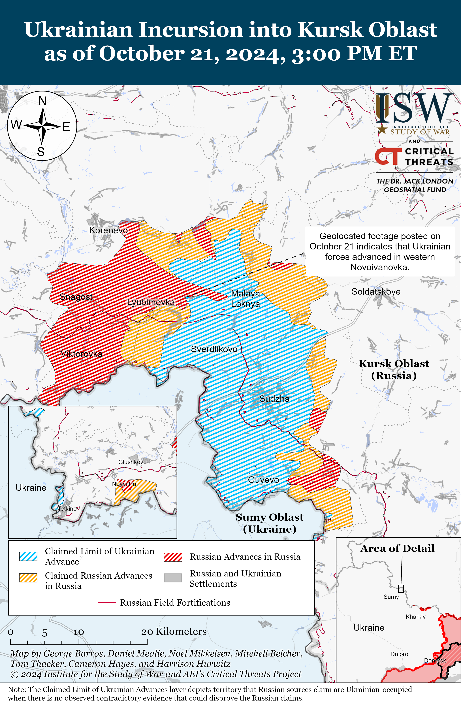
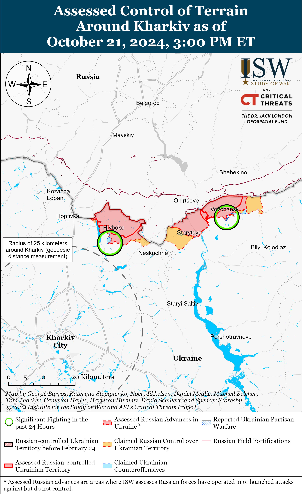
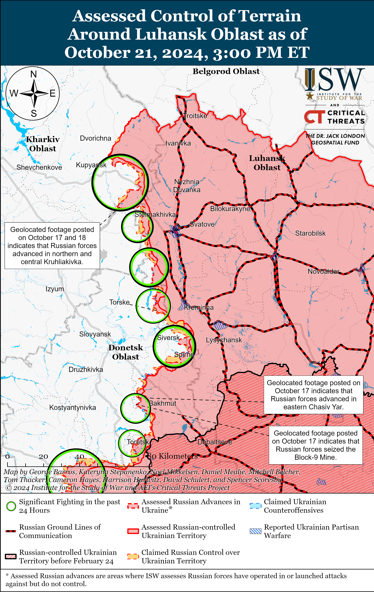
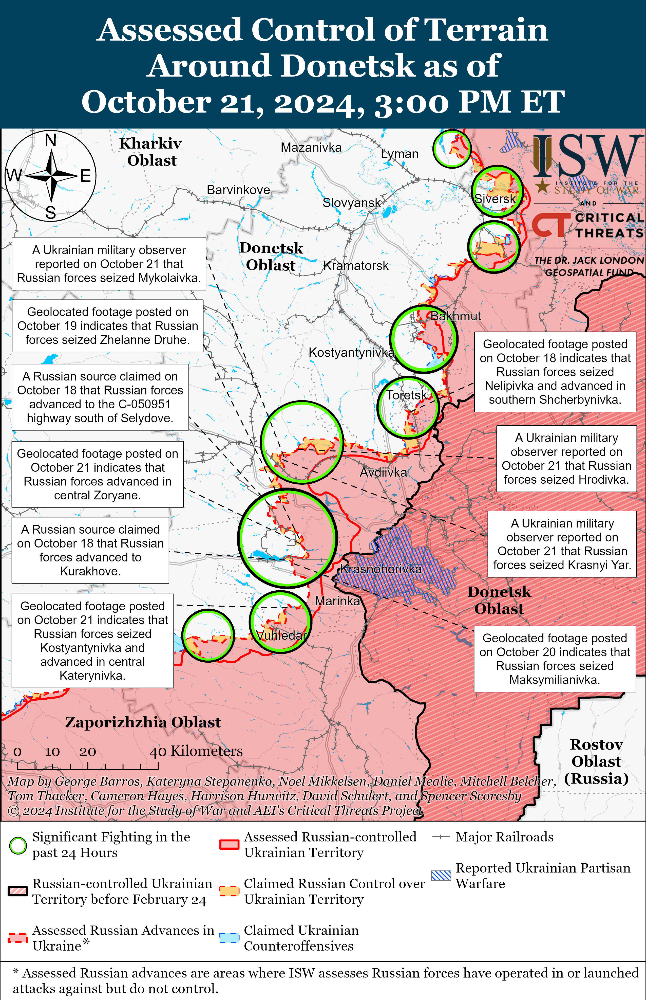
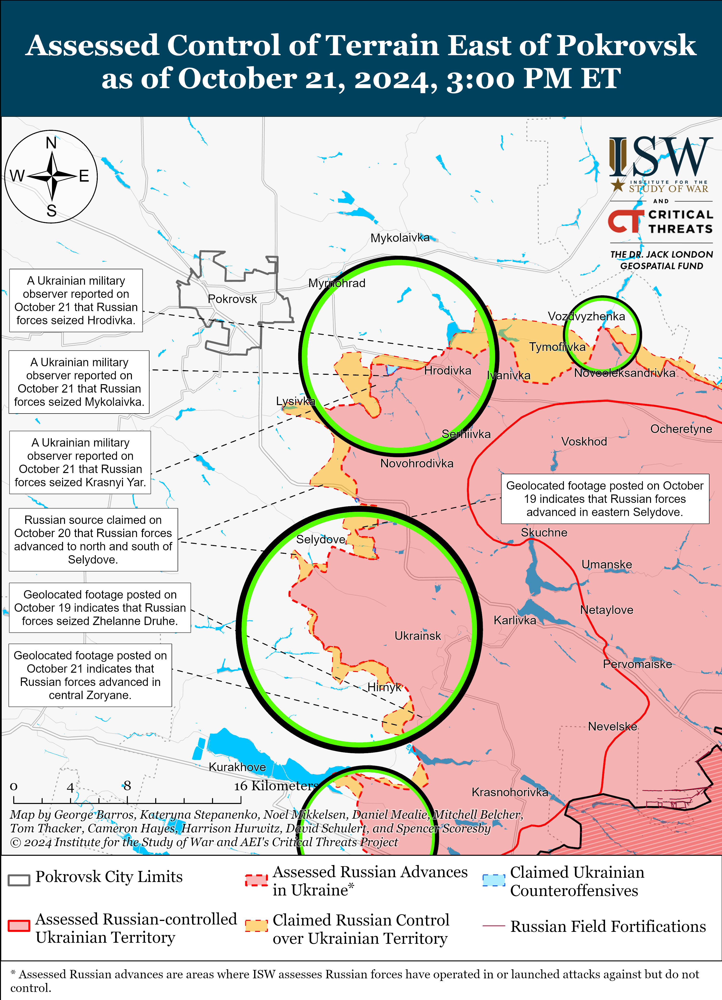
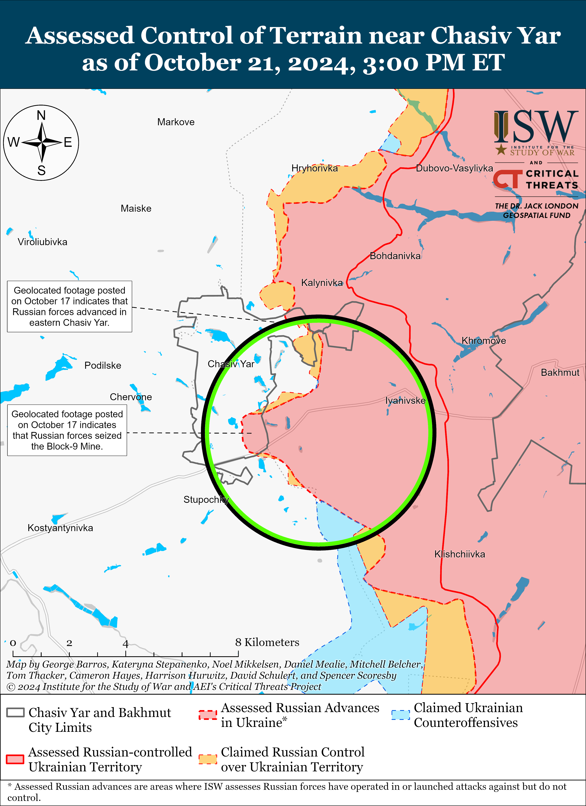
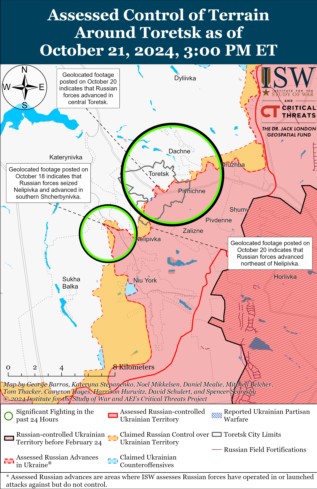
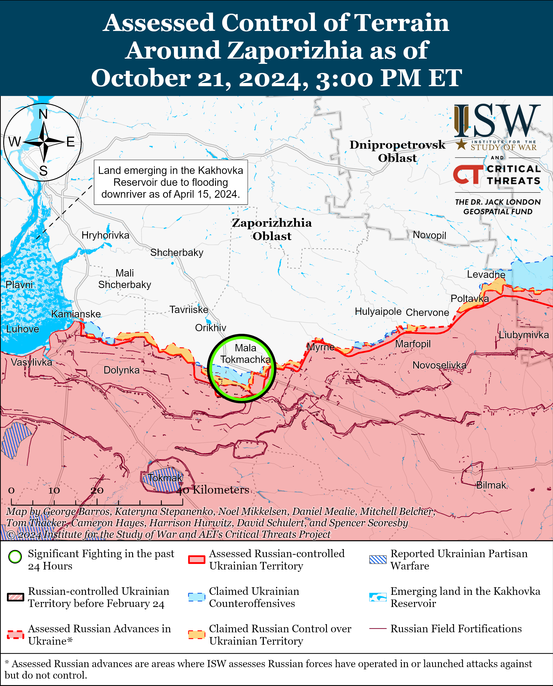
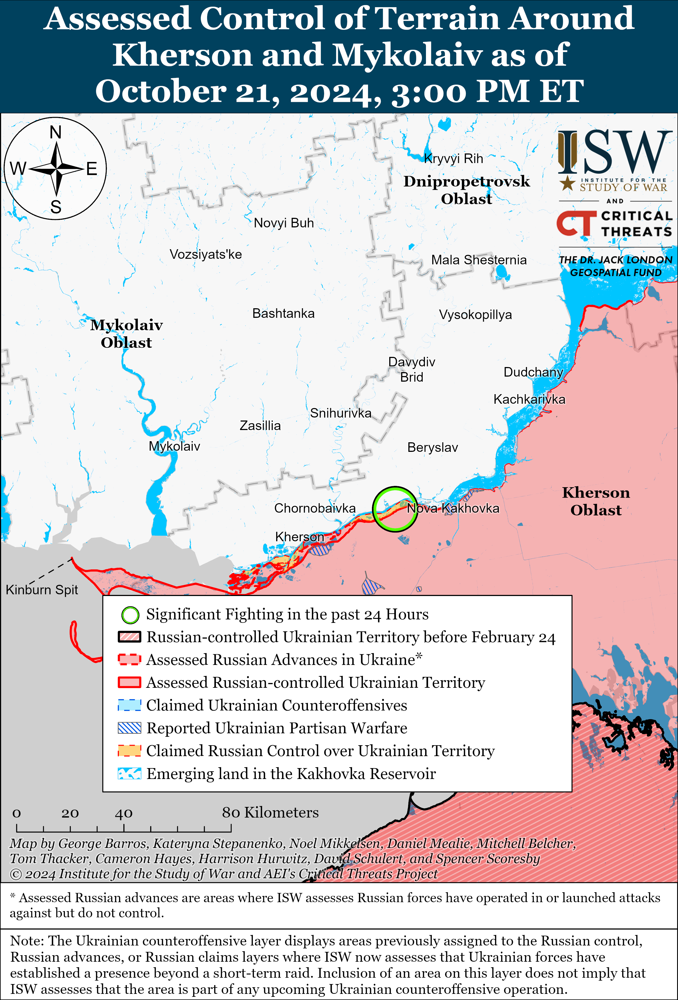

# Russian Offensive Campaign Assessment, October 21, 2024

**October 21, 2024, 6:35pm ET**

**Click** [**here**](https://storymaps.arcgis.com/stories/36a7f6a6f5a9448496de641cf64bd375) **to see ISW’s interactive map of the Russian invasion of Ukraine. This map is updated daily alongside the static maps present in this report.**

**Click** [**here**](https://storymaps.arcgis.com/stories/83a2f24901c941d581c0c523ecd2619b) **to see ISW's interactive map of Ukraine's offensive in Kursk Oblast.**

**Click** [**here**](https://understandingwar.maps.arcgis.com/apps/instant/3dviewer/index.html?appid=1602762dbcde419bb957dea358449580) **to see ISW’s 3D control of terrain topographic map of Ukraine. Use of a computer (not a mobile device) is strongly recommended for using this data-heavy tool.**

**Click** [**here**](https://storymaps.arcgis.com/stories/733fe90805894bfc8562d90b106aa895) **to access ISW’s archive of interactive time-lapse maps of the Russian invasion of Ukraine. These maps complement the static control-of-terrain map that ISW produces daily by showing a dynamic frontline. ISW will update this time-lapse map archive monthly.**

**Note: The data cut-off for this product was 2pm ET on October 21. ISW will cover subsequent reports in the October 22 Russian Offensive Campaign Assessment.**

**Moldova's October 20 European Union (EU) referendum passed by an extremely narrow margin in large part due to support from the Moldovan diaspora, and current Moldovan President Maia Sandu will face Alexandr Stoianoglo in a second round of voting on November 3. Several Moldovan and European officials reported potential Russian interference in the election, and the Kremlin and its affiliates in Moldova will likely continue their malign influence efforts in the leadup to the November 3 runoff.** The Moldovan Central Election Commission (CEC) completed the vote count on October 21 and reported that 50.46 percent (751,235) voted in favor of the EU referendum and that 49.54 percent (737,639) voted against — a difference of only 13,596 votes.[[1]](#_edn373451ef64bc0e98d972a2a6966268721) The CEC reported that Sandu took first place in the presidential election with 42.45 percent (656,354) and Stoianoglo took second with 25.98 percent (401,726). Sandu failed to gain the majority vote required to win in the first round, and she and Stoianoglo will move to the second round. Moldovan authorities counted votes from polling stations abroad last, during which the number of votes in favor of the referendum and Sandu greatly increased. Sandu stated early on October 21 while Moldovan authorities were still counting votes that "criminal groups" and "foreign forces" — likely referring to Russia and Kremlin-linked Moldovan opposition politician Ilan Shor — used tens of millions of euros to spread propaganda to destabilize Moldova.[[2]](#_edn373451ef64bc0e98d972a2a6966268722) Sandu stated that Moldovan authorities have evidence that the criminal groups wanted to buy 300,000 Moldovan votes and that the scale of fraud was "unprecedented." The European Network of Election Monitoring Organizations' (ENEMO) International Election Observation Mission reported on October 21 that it found "massive malign foreign interference attempts" ahead of the October 20 election despite Moldovan authorities' efforts to counter misinformation and vote buying schemes.[[3]](#_edn373451ef64bc0e98d972a2a6966268723) The BBC reported that it witnessed at least one instance of vote buying at a polling station in the pro-Russian breakaway Moldovan republic of Transnistria after a voter exited the poll and asked where she would receive her promised payment.[[4]](#_edn373451ef64bc0e98d972a2a6966268724) Moldovan authorities previously reported that Shor used a Russian state bank to distribute at least $15 million to Shor-affiliated regional leaders and voters in Moldova in September 2024 alone.[[5]](#_edn373451ef64bc0e98d972a2a6966268725)

**Kremlin officials and Russian milbloggers claimed that Moldovan authorities falsified the results of the election and referendum and continued to promote long-standing Kremlin narratives targeting Moldova's path towards European integration.** Russian Ministry of Foreign Affairs (MFA) Spokesperson Maria Zakharova claimed that Moldovan authorities used "totalitarian" methods during the election campaign and that the number of votes supporting the referendum "inexplicably" began to increase during the later stages of counting.[[6]](#_edn373451ef64bc0e98d972a2a6966268726) Zakharova claimed that the West is trying to turn Moldova into a "Russophobic NATO appendage deprived of sovereignty." Kremlin Spokesperson Dmitry Peskov accused Moldovan authorities of persecuting opposition forces and claimed that Russian authorities are monitoring the allegedly questionable increase in the number of votes for Sandu and in support of the referendum.[[7]](#_edn373451ef64bc0e98d972a2a6966268727) Several Russian milbloggers, including Kremlin-affiliated milbloggers, claimed that Moldovan authorities falsified the election results and adjusted the referendum's voter turnout numbers.[[8]](#_edn373451ef64bc0e98d972a2a6966268728) One milblogger called for Russian authorities to create a network of "analytical and information centers" that will study how to influence processes in Moldova and promote Russia's state interests in Russia.[[9]](#_edn373451ef64bc0e98d972a2a6966268729)

**US Secretary of Defense Llyod Austin travelled to Kyiv on October 21 and announced a new $400 million military aid package for Ukraine.[[10]](#_edn373451ef64bc0e98d972a2a69662687210)** The aid package includes additional HIMARS ammunition; 155mm and 105mm artillery ammunition; 60mm, 81mm, and 120mm mortar systems and rounds; tube-launched, optically tracked, wire-guided (TOW) missiles; Javelin anti-armor systems; M113 armored personnel carriers; satellite communication equipment; and small arms and ammunition.[[11]](#_edn373451ef64bc0e98d972a2a69662687211)

**Russia appears to be scrambling to reduce tensions with South Korea following credible reports of intensified North Korean cooperation with Russia, including South Korean and Ukrainian intelligence warnings that a contingent of North Korean troops has deployed for training to Russia.** South Korea's Foreign Ministry summoned Russia's Ambassador to South Korea, Georgy Zinoviev, over reports of the deployment of North Korean military personnel to Russia.[[12]](#_edn373451ef64bc0e98d972a2a69662687212) The Russian Embassy in South Korea falsely framed the event as a voluntary meeting, as opposed to a diplomatic summons, and notably claimed that any cooperation between Russia and North Korea "is not directed against the security interests" of Seoul.[[13]](#_edn373451ef64bc0e98d972a2a69662687213) Kremlin Spokesperson Dmitry Peskov claimed that Russia-North Korea cooperation "should not cause concern" to other states, and that information about the alleged presence of North Korean troops in Russia may be "contradictory."[[14]](#_edn373451ef64bc0e98d972a2a69662687214) The Kremlin's apparent desire to assure South Korea that its cooperation with North Korea is not a threat to Seoul suggests that the Kremlin remains very concerned about the prospect of Seoul's potential pivot towards providing Ukraine with necessary military support, and the implications of worsened relations with Seoul for Russian security interests in the Asia Pacific region. Russia has previously attempted to court Seoul in order to mitigate the impacts of its growing reliance on North Korea, as ISW has noted.[[15]](#_edn373451ef64bc0e98d972a2a69662687215)

**Russian forces continue to systematically perpetrate war crimes, including the continued executions of Ukrainian prisoners of war (POWs) and use of chemical weapons.** Ukrainian officials reported on October 21 that Russian forces executed two unarmed Ukrainian POWs near Selydove, Donetsk Oblast on October 18 by shooting them while restrained at point-blank range.[[16]](#_edn373451ef64bc0e98d972a2a69662687216) ISW assessed that Russian forces have recently increased systematic executions of Ukrainian POWs in violation of the Geneva Convention on POWs, which forbids the inhumane treatment and execution of POWs.[[17]](#_edn373451ef64bc0e98d972a2a69662687217) A Russian milblogger also posted footage and openly claimed on October 20 that Russian forces are using chloropicrin (a pesticide and lung damaging agent) against Ukrainian forces.[[18]](#_edn373451ef64bc0e98d972a2a69662687218) The US Department of State announced on May 1 that it had determined that Russian forces are using chloropicrin and riot control agents (RCAs) in violation of the Chemical Weapons Convention (CWC), to which Russia is a signatory.[[19]](#_edn373451ef64bc0e98d972a2a69662687219) Ukrainian officials have previously reported that Russian forces are increasingly equipping grenades with chloropicrin.[[20]](#_edn373451ef64bc0e98d972a2a69662687220) The apparent systematic perpetration of war crimes throughout the entire theater suggests that Russian forces continue to operate at a low level of discipline, and that Russian field commanders are doing nothing to prevent their subordinates from engaging in such criminal behaviors, or may even be encouraging them. There is no evidence that Russia is holding Russian personnel accountable for the violations of the laws of war that have been reported.

**Key Takeaways:**

- **Moldova's October 20 European Union (EU) referendum passed by an extremely narrow margin in large part due to support from the Moldovan diaspora, and current Moldovan President Maia Sandu will face Alexandr Stoianoglo in a second round of voting on November 3. Several Moldovan and European officials reported potential Russian interference in the election, and the Kremlin and its affiliates in Moldova will likely continue their malign influence efforts in the leadup to the November 3 runoff.**
- **Kremlin officials and Russian milbloggers claimed that Moldovan authorities falsified the results of the election and referendum and continued to promote long-standing Kremlin narratives targeting Moldova's path towards European integration.**
- **US Secretary of Defense Llyod Austin travelled to Kyiv on October 21 and announced a new $400 million military aid package for Ukraine.**
- **Russia appears to be scrambling to reduce tensions with South Korea following credible reports of intensified North Korean cooperation with Russia, including South Korean and Ukrainian intelligence warnings that a contingent of North Korean troops has deployed for training to Russia.**
- **Russian forces continue to systematically perpetrate war crimes, including the continued executions of Ukrainian prisoners of war (POWs) and use of chemical weapons.**
- **Ukrainian forces recently advanced in the western part of the Kursk Oblast salient.**
- **Russian forces advanced west of Kreminna, southeast of Pokrovsk, and southeast of Kurakhove.**
- **Russian forces recently conducted several mechanized attacks of various echelons in the Kurakhove direction.**
- **Russian occupation authorities continue to coerce occupied Ukrainian populations into signing contracts with the Russian Ministry of Defense (MoD).**

****

***We do not report in detail on Russian war crimes because these activities are well-covered in Western media and do not directly affect the military operations we are assessing and forecasting. We will continue to evaluate and report on the effects of these criminal activities on the Ukrainian military and the Ukrainian population and specifically on combat in Ukrainian urban areas. We utterly condemn Russian violations of the laws of armed conflict and the Geneva Conventions and crimes against humanity even though we do not describe them in these reports.***

- Ukrainian Operations in the Russian Federation
- Russian Main Effort – Eastern Ukraine (comprised of three subordinate main efforts)
- Russian Subordinate Main Effort #1 – Push Ukrainian forces back from the international border with Belgorod Oblast and approach to within tube artillery range of Kharkiv City
- Russian Subordinate Main Effort #2 – Capture the remainder of Luhansk Oblast and push westward into eastern Kharkiv Oblast and encircle northern Donetsk Oblast
- Russian Subordinate Main Effort #3 – Capture the entirety of Donetsk Oblast
- Russian Supporting Effort – Southern Axis
- Russian Air, Missile, and Drone Campaign
- Russian Mobilization and Force Generation Efforts
- Russian Technological Adaptations
- Activities in Russian-occupied areas
- Ukrainian Defense Industrial Base Efforts
- Russian Information Operations and Narratives
- Significant Activity in Belarus

**Ukrainian Operations in the Russian Federation**

Ukrainian forces recently advanced on the western side of the Ukrainian salient in Kursk Oblast amid continued fighting within and west of the salient. Geolocated footage published on October 21 shows that Ukrainian forces advanced in western Novoivanovka (southeast of Korenevo).[[21]](#_edn373451ef64bc0e98d972a2a69662687221) Fighting reportedly continued southwest of Glushkovo (west of the Kursk Oblast salient) near Novyi Put and Veseloye; southeast of Korenevo near Nizhny Klin, Novoivanovka, Lyubimovka, Leonidovo, and Zeleny Shlyakh; northeast of Sudzha near Cherkasskoye Porechnoye; east of Sudzha near Kolmakov; and south of Sudzha near Plekhovo and Cherkasskaya Konopelka on October 20 and 21.[[22]](#_edn373451ef64bc0e98d972a2a69662687222) Russian milbloggers claimed that Ukrainian forces attempted to cross the international border near Volfino (southwest of Glushkovo), and that Ukrainian forces deployed additional reserves near the Kruglenkoye-Nikolskiy line (northwest of Sudzha and southeast of Korenevo,) where they launched an attack with two mechanized company tactical groups.[[23]](#_edn373451ef64bc0e98d972a2a69662687223) Elements of the Russian 106th Airborne (VDV) Division, 83rd Separate VDV Brigade, and 56th VDV Regiment (7th VDV Division) are operating near Lyubimovka and Zeleny Shlyakh; elements of the 56th VDV Regiment are also operating near Novyi Put; and elements of the Russian 155th Naval Infantry Brigade (Pacific Fleet, Eastern Military District [EMD]) are operating in Kursk Oblast.[[24]](#_edn373451ef64bc0e98d972a2a69662687224) Medical elements of the Russian “Chernye Volki” ("Black Wolves”) evacuation detachment recently redeployed from the Bakhmut direction to the Kursk direction.[[25]](#_edn373451ef64bc0e98d972a2a69662687225) Elements of the Russian "Arbat,” "Pyatnashka,” "Sarmat,” and "Arkhangely” units (all part of the Dikaya Division of Donbas [Russian Volunteer Corps]) are reportedly operating in Kursk Oblast.[[26]](#_edn373451ef64bc0e98d972a2a69662687226)

Russian sources are trying to justify the slow rate of Russian advances in Kursk Oblast by falsely framing this direction as uniquely challenging. A commander of the Chechen “Akhmat” Spetsnaz detachment claimed that fighting in Kursk Oblast is very intense and claimed that the Kursk direction is the most difficult frontline area of the entire theater.[[27]](#_edn373451ef64bc0e98d972a2a69662687227) The detachment commander claimed that Russian forces are fighting against 14 Ukrainian brigades and 'Western private military companies,” also likely in attempt to explain away the slower Russian pace in the area.[[28]](#_edn373451ef64bc0e98d972a2a69662687228)

Russian microelectronics manufacturer “Kremniy El Group” - one of the largest manufacturers of microelectronics and chips in Russia - announced on October 21 that it has temporarily suspended its operations due to Ukrainian drone strikes on the plant’s production and administrative buildings overnight on October 18 and 19.[[29]](#_edn373451ef64bc0e98d972a2a69662687229) “Kremniy El Group" announced that the drone strikes damaged special power supply facilities, and “Kremniy El Group” CEO Oleg Dantsev emphasized that the manufacturer is facing difficulties purchasing spare parts to repair the energy infrastructure.[[30]](#_edn373451ef64bc0e98d972a2a69662687230)

The Ukrainian General Staff announced that Ukrainian forces struck a Russian Buk-M3 air defense system overnight on October 21 approximately 60 kilometers from the frontline.[[31]](#_edn373451ef64bc0e98d972a2a69662687231) The Ukrainian General Staff did not specify whether Ukrainian forces struck the Buk-M3 system in Russia or occupied Ukraine.

**Russian Main Effort – Eastern Ukraine**

**Russian Subordinate Main Effort #1 – Kharkiv Oblast** **(Russian objective: Push Ukrainian forces back from the international border with Belgorod Oblast and approach to within tube artillery range of Kharkiv City)**

Russian forces continued offensive operations northeast of Kharkiv City near Vovchansk and Lyptsi on October 20 and 21 but did not make any confirmed advances.[[32]](#_edn373451ef64bc0e98d972a2a69662687232)

**Russian Subordinate Main Effort #2 – Luhansk Oblast** **(Russian objective: Capture the remainder of Luhansk Oblast and push westward into eastern Kharkiv Oblast and northern Donetsk Oblast)**

Russian forces advanced west of Kreminna amid continued offensive operations along the Kupyansk-Svatove-Kreminna line on October 21. Geolocated footage published on October 21 shows Ukrainian forces repelling a Russian platoon-sized mechanized assault consisting of at least three armored vehicles, during which Russian forces advanced east of Terny (west of Kreminna).[[33]](#_edn373451ef64bc0e98d972a2a69662687233) Russian forces continued offensive operations north of Kupyansk near Holubivka; east of Kupyansk near Petropavlivka; southeast of Kupyansk near Kruhlyakivka, Kolisnykivka, Lozova, Novoosynove, and Pishchane; west of Svatove near Vyshneve; southwest of Svatove near Yampolivka, Hrekivka, and in the direction of Novomykhailivka; northwest of Kreminna near Novosadove; west of Kreminna near Zarichne and Terny; and southwest of Kreminna near Serebryanske forest on October 20 to 21.[[34]](#_edn373451ef64bc0e98d972a2a69662687234) Elements of the Russian BARS-9 (Russian Combat Army Reserve) are reportedly operating in the Kupyansk-Svatove direction.[[35]](#_edn373451ef64bc0e98d972a2a69662687235)

  
 **Russian Subordinate Main Effort #3 – Donetsk Oblast (Russian objective: Capture the entirety of Donetsk Oblast, the claimed territory of Russia’s proxies in Donbas)**

Russian forces conducted limited offensive operations in the Siversk direction on October 21 but did not advance. The Ukrainian General Staff reported that Russian forces unsuccessfully attacked east of Siversk near Verkhnokamyanske; southeast of Siversk near Ivano-Darivka; and south of Siversk near Pereizne.[[36]](#_edn373451ef64bc0e98d972a2a69662687236) Ukrainian Luhansk Group of Forces Spokesperson Major Anastasiya Bobovnikova stated that Russian forces continue to use various types of equipment, ranging from tanks and infantry fighting vehicles to golf carts and motorcycles, to conduct assaults in the Siversk direction.[[37]](#_edn373451ef64bc0e98d972a2a69662687237)

Russian forces reportedly continued to advance south of Chasiv Yar on October 21, but there were no confirmed changes to the frontline in this area. Several milbloggers claimed that Russian forces advanced up to one kilometer in depth south of the T0504 Bakhmut-Kostyantynivka highway towards Stupochky (south of Chasiv Yar), although ISW has not yet observed confirmation of this claim.[[38]](#_edn373451ef64bc0e98d972a2a69662687238) Russian milbloggers claimed that Russian forces operating in this area are between seven and eight kilometers from the outskirts of Kostyantynivka, which is relatively consistent with ISW's assessment of control of terrain south of Chasiv Yar.[[39]](#_edn373451ef64bc0e98d972a2a69662687239) Elements of the Russian 331st and 217th Airborne (VDV) regiments (both of the 98th VDV Division) and the 3rd Combined Arms Army (formerly 2nd Luhansk People's Republic Army Corps [LNR AC]) are reportedly operating near Chasiv Yar.[[40]](#_edn373451ef64bc0e98d972a2a69662687240)

Russian forces continued offensive operations in the Toretsk direction on October 21 but did not make any confirmed advances. A Russian milblogger claimed that Russian forces advanced along Druzhby Street in central Toretsk, although ISW has not yet observed confirmation of this claim.[[41]](#_edn373451ef64bc0e98d972a2a69662687241) Russian milbloggers claimed that intense fighting is occurring street-to-street within Toretsk, and that Russian forces are also fighting northeast of Toretsk near Druzhba and south of Toretsk near Nelipivka.[[42]](#_edn373451ef64bc0e98d972a2a69662687242) The Ukrainian General Staff reported that Russian forces conducted ground attacks near Toretsk itself and west of Toretsk in the direction of Shcherbynivka.[[43]](#_edn373451ef64bc0e98d972a2a69662687243) Ukrainian military observer Kostyantyn Mashovets noted that elements of the Russian 1st, 9th, and 132nd motorized rifle brigades (all of the 51st Combined Arms Army [CAA], formerly 1st Donetsk People's Republic [DNR] AC) are operating in the Toretsk direction, and reported that elements of the 132nd Motorized Rifle Brigade's 109th Motorized Rifle Regiment were responsible for the capture of Niu York (south of Toretsk) and advances into Nelipivka.[[44]](#_edn373451ef64bc0e98d972a2a69662687244)

Russian forces recently made confirmed advances southeast of Pokrovsk amid continued offensive operations in the Pokrovsk direction on October 21. Geolocated footage published on October 21 indicates that Russian forces have advanced to Lysychanska Street in northeastern Selydove (southeast of Pokrovsk).[[45]](#_edn373451ef64bc0e98d972a2a69662687245) A Russian milblogger claimed that Russian forces also advanced to Stepna Street in southeastern Selydove and westward along the E-50 highway north of Selydove, although ISW has not yet observed confirmation of these claims.[[46]](#_edn373451ef64bc0e98d972a2a69662687246) Additional geolocated footage published on October 21 indicates that elements of the 110th Motorized Rifle Brigade (51st CAA) advanced to Zelena Street in central Zoryane (southeast of Selydove), consistent with several milblogger claims that Russian forces crossed the Vovcha River in Zoryane and advanced into the center of the settlement with the intent of attacking northwestward into Hirnyk.[[47]](#_edn373451ef64bc0e98d972a2a69662687247) Russian security forces told Kremlin newswire *TASS* on October 21 that Ukrainian forces have begun withdrawing from Hirnyk, although ISW cannot confirm this claim.[[48]](#_edn373451ef64bc0e98d972a2a69662687248) Several Russian milbloggers claimed that Russian forces have established fire control over all roads leading into Selydove, complicating Ukrainian logistics in the Pokrovsk direction.[[49]](#_edn373451ef64bc0e98d972a2a69662687249) Mashovets noted that while Russian forces are having some success southeast of Pokrovsk, the Russian command has failed to properly prioritize Pokrovsk itself as the main operational effort, leading to the tactical "fragmentation" of Russian objectives in this area into much more localized efforts, such as the effort to surround Selydove.[[50]](#_edn373451ef64bc0e98d972a2a69662687250) Mashovets also confirmed that elements of the Russian 30th and 15th motorized rifle brigades (both of the 2nd Combined Arms Army [CAA], Central Military District [CMD]), with support of the 74th Motorized Rifle Brigade (41st CAA, CMD) recently seized Hrodivka, Mykolaivka, and Krasnyi Yar (all southeast of Pokrovsk), which Russian sources initially claimed Russian forces seized between late September to mid-October.[[51]](#_edn373451ef64bc0e98d972a2a69662687251) The Ukrainian General Staff reported that Russian forces continued offensive operations east of Pokrovsk near Sukha Balka, Vozdvyzhenka, and Myrolyubivka; southeast of Pokrovsk near Promin, Selydove, Lysivka, Mykhailivka, and Sukhyi Yar; and south of Pokrovsk in the direction of Novotroiitske.[[52]](#_edn373451ef64bc0e98d972a2a69662687252) Mashovets noted that elements of the 2nd CAA are fighting near Selydove, while elements of the 90th Tank Division (CMD), with support of elements of the 51st and 2nd CAAs are operating south of Selydove.[[53]](#_edn373451ef64bc0e98d972a2a69662687253) Elements of the "Maxim Krivonos" volunteer detachment, allegedly formed by former members of the Ukrainian Armed Forces who defected to fight on the side of Russia, are also reportedly fighting near Pokrovsk.[[54]](#_edn373451ef64bc0e98d972a2a69662687254)

Russian forces recently advanced southeast of Kurakhove during several mechanized assaults of varying echelons. Geolocated footage published on October 20 shows Russian forces advancing north of Kostyantynivka (southeast of Kurakhove) during a reinforced company-sized mechanized assault consisting of 19 armored vehicles and four tanks.[[55]](#_edn373451ef64bc0e98d972a2a69662687255) Additional geolocated footage published on October 21 indicates that Russian forces advanced south of Katerynivka (west of Kostyantynivka and southeast of Kurakhove) during a reduced platoon-sized mechanized assault.[[56]](#_edn373451ef64bc0e98d972a2a69662687256) This footage suggests that Russian forces have seized Kostyantynivka, which the Russian Ministry of Defense (MoD) originally claimed in August 2024.[[57]](#_edn373451ef64bc0e98d972a2a69662687257) A Ukrainian brigade operating near Maksymilyanivka (east of Kurakhove) additionally posted recent footage of Ukrainian forces repelling a reinforced company-sized mechanized attack from Maksymilyanivka towards Kurakhove.[[58]](#_edn373451ef64bc0e98d972a2a69662687258) Geolocated footage published on October 20 shows that Russian forces advanced in the "dacha area east of Kurakhove, suggesting that Russian forces have likely seized the entirety of Maksymilyanivka.[[59]](#_edn373451ef64bc0e98d972a2a69662687259) The Ukrainian General Staff reported continued offensive operations near Kurakhove itself; northeast of Kurakhove near Kurakhivka; east of Kurakhove near Maksymilyanivka; and southeast of Kurakhove near Antonivka and Kostyantynivka.[[60]](#_edn373451ef64bc0e98d972a2a69662687260) Mashovets reported that elements of the 51st CAA, 90th Tank Division (CMD), and 150th Motorized Rifle Division (8th CAA, Southern Military District [SMD]) are operating east of Kurakhove.[[61]](#_edn373451ef64bc0e98d972a2a69662687261)

Russian forces continued offensive operations southwest of Donetsk City near Vuhledar on October 21 but did not make any confirmed advances. A Russian milblogger claimed that Russian forces advanced near Bohoyavlenka (northwest of Vuhledar) and in field areas northeast of Vuhledar, although ISW has not yet observed confirmation of these claims.[[62]](#_edn373451ef64bc0e98d972a2a69662687262) The Ukrainian General Staff reported that Russian forces conducted ground attacks northeast of Vuhledar near Vodyane, near Bohoyavlenka, and northwest of Vuhledar towards Novoukraiinka.[[63]](#_edn373451ef64bc0e98d972a2a69662687263) Elements of the Russian 14th Guards Spetsnaz Brigade (Main Directorate of the General Staff of the Russian Armed Forces [GRU]), 29th CAA (Eastern Military District [EMD]), and drone operators of the 36th Motorized Rifle Brigade (29th CAA, EMD) are reportedly operating in the western Donetsk Oblast area and near Vuhledar.[[64]](#_edn373451ef64bc0e98d972a2a69662687264)

Neither Russian nor Ukrainian sources reported fighting in the Donetsk-Zaporizhia Oblast border area on October 21.

**

 

 

 

 

**

**Russian Supporting Effort – Southern Axis** **(Russian objective: Maintain frontline positions and secure rear areas against Ukrainian strikes)**

Russian forces continued assaults near Robotyne and northeast of Robotyne near Mala Tokmachka on October 20 and 21, but there were no confirmed changes to the frontline.[[65]](#_edn373451ef64bc0e98d972a2a69662687265)

Russian forces continued attacks in east (left) bank Kherson Oblast on October 20 and 21 but did not make any confirmed advances.[[66]](#_edn373451ef64bc0e98d972a2a69662687266) Elements of the Russian BARS-33 Detachment (Russian Combat Army Reserve) and the 52nd Airborne (VDV) Artillery Brigade are reportedly operating in the Kherson direction.[[67]](#_edn373451ef64bc0e98d972a2a69662687267)

 

**Russian Air, Missile, and Drone Campaign** **(Russian Objective: Target Ukrainian military and civilian infrastructure in the rear and on the frontline)**

Russian forces conducted a series of drone and missile strikes against Ukraine on the night of October 20 to 21. The Ukrainian Air Force reported that Russian forces launched one Iskander-M/North Korean KN-23 ballistic missile launched from occupied Crimea; one Kh-35 and one Kh-31P missile over the Black Sea; and 116 strike drones (including Shahed-136/131s) from Kursk Oblast, Oryol Oblast, and Primorsko-Akhtarsk, Krasnodar Krai.[[68]](#_edn373451ef64bc0e98d972a2a69662687268) The Ukrainian Air Force reported that Ukrainian forces downed 59 drones over Odesa, Mykolaiv, Kherson, Vinnytsya, Khmelnytskyi, Zhytomyr, Kyiv, Sumy, Kirovohrad, Cherkasy, Chernihiv, and Poltava oblasts; that 45 drones were "lost,” possibly due to Ukrainian electronic warfare (EW) countermeasures; and that 10 drones remained in Ukrainian air space as of 0930 local time. Ukrainian President Volodymyr Zelensky reported on October 20 that Russian forces launched 129 Iranian-made Shahed drones on the night of October 18, amounting to a total of 6,130 Shahed launches since the start of 2024.[[69]](#_edn373451ef64bc0e98d972a2a69662687269) Dnipropetrovsk Oblast Head Serhiy Lysak reported on October 21 that Russian forces conducted a missile strike against Kryvyi Rih and damaged civilian infrastructure, including a cultural site.[[70]](#_edn373451ef64bc0e98d972a2a69662687270) Russian milbloggers claimed that Russian Iskander-M missiles struck a hotel housing foreign EW specialists in Kryvyi Rih, Dnipropetrovsk Oblast on October 21, though ISW is unable to verify this claim.[[71]](#_edn373451ef64bc0e98d972a2a69662687271) The Kyiv City Military Administration reported on October 21 that Russian forces launched several waves of drone strikes targeting Kyiv City and that Ukrainian forces downed up to 10 drones.[[72]](#_edn373451ef64bc0e98d972a2a69662687272) Odesa Oblast Head Oleh Kiper reported on October 21 that Russian forces launched a combined missile and drone strike targeting port infrastructure in Odesa Oblast.[[73]](#_edn373451ef64bc0e98d972a2a69662687273) Romensky Raion Representative Valentina Nazarenko reported on October 21 that Russian aviation struck critical infrastructure in Romensky Raion, Sumy Oblast and that Ukrainian forces destroyed four Shaheds over Sumy Oblast.[[74]](#_edn373451ef64bc0e98d972a2a69662687274) A Russian milblogger claimed that a Russian Shahed strike damaged an electrical substation near Anastasivka and Lypova Dolyna, Sumy Oblast and cut off power to Romny, Sumy Oblast and other neighboring settlements in Romensky Raion and near Lypova Dolyna.[[75]](#_edn373451ef64bc0e98d972a2a69662687275) Ukraine's Northern Group of Forces reported on October 21 that Russian forces damaged three critical infrastructure objects in Anastasivka, Lypova Dolyna, and Romny, Sumy Oblast.[[76]](#_edn373451ef64bc0e98d972a2a69662687276) The Zaporizhia Oblast Military Administration reported on October 21 that Russian forces conducted a ballistic missile strike on a residential area in Zaporizhia City.[[77]](#_edn373451ef64bc0e98d972a2a69662687277) Russian milbloggers claimed that Russian missiles struck port areas and damaged oil infrastructure near Chornomorsk, Odesa Oblast on October 20 to 21.[[78]](#_edn373451ef64bc0e98d972a2a69662687278) A Russian milblogger claimed that Russian forces struck a Ukrainian military drone production plant in Zaporizhia City, which the milblogger alleged Ukrainian forces used to strike Crimea.[[79]](#_edn373451ef64bc0e98d972a2a69662687279) A Russian milblogger claimed on October 21 that Russian Shahed drones struck a Ukrainian air base and damaged one Ukrainian Su-27 fighter jet near Ozerne, Zhytomyr Oblast, but ISW cannot confirm this claim.[[80]](#_edn373451ef64bc0e98d972a2a69662687280)

 Kharkiv Oblast National Police Head Volodymyr Tymoshko reported on October 21 that Russian forces struck three raions in Kharkiv City with KAB-250 glide bombs, resulting in civilian casualties.[[81]](#_edn373451ef64bc0e98d972a2a69662687281) Russian opposition outlet *Sever Realii* reported on October 20 that Russian forces used four guided aerial bombs and Grom-E1 hybrid bombs to strike civilian infrastructure in Kharkiv Oblast.[[82]](#_edn373451ef64bc0e98d972a2a69662687282) Kharkiv Oblast Head Oleh Synehubov reported on October 21 that Russian forces struck the Osnovyansky Raion of Kharkiv City with one KAB bomb and used six guided aerial bombs to strike elsewhere in Kharkiv Oblast.[[83]](#_edn373451ef64bc0e98d972a2a69662687283) Tymoshko noted that the Russian strikes were 'chaotic” in nature and intended to 'terrorize the civilian population” instead of targeting Ukrainian military targets.[[84]](#_edn373451ef64bc0e98d972a2a69662687284)

Occupied Zaporizhia Oblast Governor Yevgeny Balitsky baselessly claimed on October 21 that Western countries may organize a false flag operation to destroy the Kyiv Hydroelectric Power Plant and blame Russia for the destruction of the plant.[[85]](#_edn373451ef64bc0e98d972a2a69662687285)

**Russian Mobilization and Force Generation Efforts** **(Russian objective: Expand combat power without conducting general mobilization)**

Russian authorities continue to increase one-time payments in an effort to recruit volunteers for contract military service and avoid further mobilization. Russian sources reported on October 21 that authorities in Moscow Oblast reportedly increased the one-time enlistment bonuses to contract soldiers to 2.3 million rubles (about $23,759), which includes all categories of military personnel.[[86]](#_edn373451ef64bc0e98d972a2a69662687286) A Russian milblogger complained on October 21 that efforts of Russian authorities to increase the rate of contract-to-mobilized servicemembers leads to increases in unmotivated personnel.[[87]](#_edn373451ef64bc0e98d972a2a69662687287) Another Russian milblogger responded by claiming that Russian authorities who loosen regulations on the rights of mobilized and contract soldiers are those who want to advance their own careers at the expense of the lives of Russian servicemembers.[[88]](#_edn373451ef64bc0e98d972a2a69662687288)

Russian occupation authorities continue to coerce occupied Ukrainian populations into signing contracts with the Russian Ministry of Defense (MoD). Luhansk Oblast Military Administration Head Artem Lysohor reported on October 21 that Russian occupation authorities are offering money and social packages to schoolchildren in Starobilsk, Luhansk Oblast for signing contracts with the Russian MoD.[[89]](#_edn373451ef64bc0e98d972a2a69662687289) Teachers in Russian-occupied Ukrainian territories emphasize signing of such contract as the most financially beneficial form of military service.

Ukraine’s Main Military Intelligence Directorate (GUR) reported on October 21 that unspecified actors murdered the Chief of Staff of the Russian 52nd Aviation Squadron of Heavy Bombardment Regiment, Dmitry Golenkov, near Suponevo, Bryansk Oblast.[[90]](#_edn373451ef64bc0e98d972a2a69662687290)

**Russian Technological Adaptations** **(Russian objective: Introduce technological innovations to optimize systems for use in Ukraine)**

Ukrainian forces reportedly shot down a Russian “Orion” reconnaissance and strike drone over Kursk Oblast, which could carry up to four air-to-surface missiles.[[91]](#_edn373451ef64bc0e98d972a2a69662687291) Ukrainian military officials reported that Russian “Orion” drones are dangerous because they can both conduct aerial reconnaissance and inflict strikes on ground targets.[[92]](#_edn373451ef64bc0e98d972a2a69662687292)

Russian sources claimed that Russia will conduct tests of the Tallamho Design Bureau’s “T1-am” modernized drone direction finding system, which can now operate via cellular signal.[[93]](#_edn373451ef64bc0e98d972a2a69662687293) Russian sources claimed that the use of cellular signal will allow Russia to place sensors at any distance and will make drone detection calculations more accurate. Russian sources said that this transition to cellular signal will allow acoustic reconnaissance systems to detect drone flying along riverbeds, which Russian forces can currently hear but not see. The T1-am system reportedly can include up to 250 sensors, which are deployed around facilities in the rear or along the international border, particularly in Belgorod Oblast.

**Activities in Russian-occupied areas** **(Russian objective: Consolidate administrative control of annexed areas; forcibly integrate Ukrainian citizens into Russian sociocultural, economic, military, and governance systems)**

*ISW is not publishing reporting on activities in Russian-occupied areas today.*

**Significant activity in Belarus** **(Russian efforts to increase its military presence in Belarus and further integrate Belarus into Russian-favorable frameworks and Wagner Group activity in Belarus)**

Belarusian President Alexander Lukashenko announced on October 21 that Belarus and Russia are discussing the construction of the Moscow-Brest expressway.[[94]](#_edn373451ef64bc0e98d972a2a69662687294)

The Belarusian Ministry of Defense (MoD) reported that that a Belarusian delegation participated in a forum for young officers of the Shanghai Cooperation Organization (SCO) in Beijing on October 21.[[95]](#_edn373451ef64bc0e98d972a2a69662687295)

**Note: ISW does not receive any classified material from any source, uses only publicly available information, and draws extensively on Russian, Ukrainian, and Western reporting and social media as well as commercially available satellite imagery and other geospatial data as the basis for these reports. References to all sources used are provided in the endnotes of each update.**

---

[[1]](#_edn373451ef64bc0e98d972a2a696626872ref1) <https://pv.cec> dot md/cec-template-referendum-results.html

[[2]](#_edn373451ef64bc0e98d972a2a696626872ref2) [https://newsmaker](https://newsmaker/) dot md/ro/dimensiunea-fraudei-este-fara-precedent-maia-sandu-dupa-afisarea-primelor-rezultatele/; https://x.com/sandumaiamd/status/1848130004028125266

[[3]](#_edn373451ef64bc0e98d972a2a696626872ref3) <https://enemo> dot org/storage/uploads/QS8aYy9j1jaipfrf4AmVQE8DmWlRxGgDCb3AACtx.pdf

[[4]](#_edn373451ef64bc0e98d972a2a696626872ref4) https://www.bbc.com/news/articles/c1wnr5qdxe7o

[[5]](#_edn373451ef64bc0e98d972a2a696626872ref5) https://www.understandingwar.org/backgrounder/russia-poses-long-term-threats-moldova%E2%80%99s-european-integration-beyond-october-elections

[[6]](#_edn373451ef64bc0e98d972a2a696626872ref6) <https://www.mid> dot ru/ru/foreign\_policy/news/1976983/

[[7]](#_edn373451ef64bc0e98d972a2a696626872ref7) https://www.rbc dot ru/politics/21/10/2024/671613919a7947d182b2ebdd; [https://ria](https://ria/) dot ru/20241021/moldaviya-1979088595.html

[[8]](#_edn373451ef64bc0e98d972a2a696626872ref8) <https://t.me/pezdicide/3669>; <https://t.me/rybar/64621;> <https://t.me/rybar/64610> ; <https://t.me/wargonzo/22724>; <https://t.me/wargonzo/22731> ; <https://t.me/rybar/64596>; <https://t.me/dva_majors/55552> ; <https://t.me/notes_veterans/20083>; <https://t.me/boris_rozhin/141536> ; <https://t.me/yurist_yug/1056>

[[9]](#_edn373451ef64bc0e98d972a2a696626872ref9) https://t.me/dva\_majors/55578

[[10]](#_edn373451ef64bc0e98d972a2a696626872ref10) https://www.defense.gov/News/News-Stories/Article/Article/3941006/austin-affirms-united-states-unwavering-support-for-ukraine-during-visit-to-kyiv/

[[11]](#_edn373451ef64bc0e98d972a2a696626872ref11) https://x.com/laraseligman/status/1848332848312328573

[[12]](#_edn373451ef64bc0e98d972a2a696626872ref12) https://www.reuters.com/world/asia-pacific/russian-ambassador-seoul-summoned-over-nkorean-troop-deployment-yonhap-reports-2024-10-21/

[[13]](#_edn373451ef64bc0e98d972a2a696626872ref13) https://t.me/rembskorea/5293

[[14]](#_edn373451ef64bc0e98d972a2a696626872ref14) https://t.me/tass\_agency/280642

[[15]](#_edn373451ef64bc0e98d972a2a696626872ref15) https://isw.pub/UkrWar011924

[[16]](#_edn373451ef64bc0e98d972a2a696626872ref16) https://suspilne dot media/donbas/862691-poblizu-selidovogo-na-doneccini-rosijski-vijska-rozstrilali-dvoh-polonenih-bijciv-zsu-prokuratura/ ; https://www.facebook.com/don.gp.gov.ua/posts/pfbid0yaSrHE3E1ZpogfgCQGps3392ZFnNT3EEEjykUakcR1Y5WHXt2CkjgNCHWL4Yi2Pjl ; https://t.me/dmytro\_lubinetzs/7018

[[17]](#_edn373451ef64bc0e98d972a2a696626872ref17) <https://www.ohchr.org/en/instruments-mechanisms/instruments/geneva-convention-relative-treatment-prisoners-war>; https://www.understandingwar.org/backgrounder/russian-offensive-campaign-assessment-october-18-2024

[[18]](#_edn373451ef64bc0e98d972a2a696626872ref18) https://avia dot pro/news/dshrg-rusich-soobshchaet-o-primenenii-hlorpikrina; https://t.me/ButusovPlus/14437; https://www.reddit.com/r/tjournal\_refugees/comments/1g87oji/%D1%89%D0%B8%D1%80%D0%BE%D1%81%D0%B5%D1%80%D0%B4%D0%BD%D0%B5\_%D0%B7%D1%96%D0%B7%D0%BD%D0%B0%D0%BD%D0%BD%D1%8F\_%D0%B2%D1%96%D0%B4\_%D0%BD%D0%B5%D0%BD%D0%B0%D1%86%D0%B8%D1%81%D1%82%D1%96%D0%B2/; https://t.me/dshrg2/2431

[[19]](#_edn373451ef64bc0e98d972a2a696626872ref19) <https://www.state.gov/imposing-new-measures-on-russia-for-its-full-scale-war-and-use-of-chemical-weapons-against-ukraine-2/>; https://www.understandingwar.org/backgrounder/russian-offensive-campaign-assessment-may-2-2024

[[20]](#_edn373451ef64bc0e98d972a2a696626872ref20) https://isw.pub/UkrWar031124 ; https://isw.pub/UkrWar013024 ; https://isw.pub/UkrWar032524

[[21]](#_edn373451ef64bc0e98d972a2a696626872ref21) https://t.me/brygada47/1031; https://t.me/creamy\_caprice/7199; https://t.me/WarArchive\_ua/21460

[[22]](#_edn373451ef64bc0e98d972a2a696626872ref22) <https://t.me/mod_russia/44760;> <https://t.me/rybar/64598;> <https://t.me/NgP_raZVedka/19208;> <https://t.me/rusich_army/17844> <https://t.me/rusich_army/17844;> <https://t.me/rusich_army/17851;> <https://t.me/DnevnikDesantnika/17717>

[[23]](#_edn373451ef64bc0e98d972a2a696626872ref23) <https://t.me/dva_majors/55547>; <https://t.me/rybar/64608;> <https://t.me/rybar/64598;> <https://t.me/wargonzo/22726;> <https://t.me/basurin_e/14979> ; <https://t.me/shot_shot/73072>

[[24]](#_edn373451ef64bc0e98d972a2a696626872ref24) <https://t.me/Sladkov_plus/11629>; <https://t.me/Sladkov_plus/11621;> <https://t.me/dva_majors/55562> ; <https://t.me/boris_rozhin/141535;> <https://t.me/rusich_army/17851;> https://t.me/RVvoenkor/79065

[[25]](#_edn373451ef64bc0e98d972a2a696626872ref25) https://t.me/boris\_rozhin/141448

[[26]](#_edn373451ef64bc0e98d972a2a696626872ref26) https://t.me/zovgrad/21690

[[27]](#_edn373451ef64bc0e98d972a2a696626872ref27) <https://t.me/tass_agency/280582>

[[28]](#_edn373451ef64bc0e98d972a2a696626872ref28) <https://t.me/tass_agency/280578>

[[29]](#_edn373451ef64bc0e98d972a2a696626872ref29) <https://www.understandingwar.org/backgrounder/russian-offensive-campaign-assessment-october-19-2024>; <https://t.me/istories_media/7894> ; [https://group-kremny](https://group-kremny/) dot ru/news/osnovnaya-zadacha-vozobnovlenie-proizvodstva/ ; [https://www.platan](https://www.platan/) dot ru/brands/kremn.shtml ; <https://t.me/kiber_boroshno/10385;> <https://t.me/kiber_boroshno/10404;> <https://www.rbc> dot ru/politics/21/10/2024/671642879a79479fe92836c6; <https://group-kremny> dot ru/news/osnovnaya-zadacha-vozobnovlenie-proizvodstva/

[[30]](#_edn373451ef64bc0e98d972a2a696626872ref30) https://t.me/istories\_media/7894

[[31]](#_edn373451ef64bc0e98d972a2a696626872ref31) [qdpudHoGYGMN8CitwKg5JfknJFzKsxjGfEjjHejpEl](https://www.facebook.com/GeneralStaff.ua/posts/pfbid02Gj8bRtXRmA21LvPDzhndq1UqdpudHoGYGMN8CitwKg5JfknJFzKsxjGfEjjHejpEl)

[[32]](#_edn373451ef64bc0e98d972a2a696626872ref32)<https://www.facebook.com/GeneralStaff.ua/posts/pfbid02gV9P6PQmmQMhNaLy95evcsAN7ic5ArDH8RsQeoQA9maq3rHJaktTCRvsDibg6Pqql> ; <https://www.facebook.com/GeneralStaff.ua/posts/pfbid0wJX8RAgNhSUU2LW4iP9ZctwwAgbZLGrjhb1H5Y2iYkQsAjsHxNHTs1csXfTqgXYFl> ; <https://www.facebook.com/GeneralStaff.ua/posts/pfbid09Vz3hGka7MdJWezBzarGHKJhsW7ceXNMstwmY3rfAjyZB2PJEAEmLhvF3s12KSD8l> ; <https://t.me/otukharkiv/2201>

[[33]](#_edn373451ef64bc0e98d972a2a696626872ref33) https://t.me/OMIBr\_60/558; https://t.me/creamy\_caprice/7195

[[34]](#_edn373451ef64bc0e98d972a2a696626872ref34) <https://www.facebook.com/GeneralStaff.ua/posts/pfbid02gV9P6PQmmQMhNaLy95evcsAN7ic5ArDH8RsQeoQA9maq3rHJaktTCRvsDibg6Pqql>; <https://www.facebook.com/GeneralStaff.ua/posts/pfbid0wJX8RAgNhSUU2LW4iP9ZctwwAgbZLGrjhb1H5Y2iYkQsAjsHxNHTs1csXfTqgXYFl>; <https://www.facebook.com/GeneralStaff.ua/posts/pfbid09Vz3hGka7MdJWezBzarGHKJhsW7ceXNMstwmY3rfAjyZB2PJEAEmLhvF3s12KSD8l>; https://t.me/rusich\_army/17844

[[35]](#_edn373451ef64bc0e98d972a2a696626872ref35) https://t.me/boris\_rozhin/141542

[[36]](#_edn373451ef64bc0e98d972a2a696626872ref36) <https://www.facebook.com/GeneralStaff.ua/posts/pfbid02gV9P6PQmmQMhNaLy95evcsAN7ic5ArDH8RsQeoQA9maq3rHJaktTCRvsDibg6Pqql>; <https://www.facebook.com/GeneralStaff.ua/posts/pfbid0wJX8RAgNhSUU2LW4iP9ZctwwAgbZLGrjhb1H5Y2iYkQsAjsHxNHTs1csXfTqgXYFl>

[[37]](#_edn373451ef64bc0e98d972a2a696626872ref37) https://armyinform dot com.ua/2024/10/21/shturmy-odynakiv-ta-proryvy-na-golf-karah-de-i-chomu-vorog-transformuye-svoyu-taktyku/ ; https://suspilne dot media/donbas/862481-rosijska-armia-zmensila-kilkist-atak-na-troh-napramkah-na-doneccini-so-ce-oznacae/ ; <https://www.youtube.com/watch?v=aDXWlQ2K0dM>

[[38]](#_edn373451ef64bc0e98d972a2a696626872ref38) <https://t.me/dva_majors/55547>; <https://t.me/rybar/64608;> <https://t.me/DnevnikDesantnika/17674;> <https://t.me/DnevnikDesantnika/17697;> <https://t.me/RVvoenkor/79066>

[[39]](#_edn373451ef64bc0e98d972a2a696626872ref39) <https://t.me/RVvoenkor/79066;> <https://t.me/DnevnikDesantnika/17697;> <https://t.me/DnevnikDesantnika/17674>

[[40]](#_edn373451ef64bc0e98d972a2a696626872ref40) <https://t.me/voin_dv/11431>; <https://t.me/dva_majors/55535;> <https://t.me/boris_rozhin/141517>

[[41]](#_edn373451ef64bc0e98d972a2a696626872ref41) <https://t.me/z_arhiv/28710>

[[42]](#_edn373451ef64bc0e98d972a2a696626872ref42) <https://t.me/dva_majors/55547>; <https://t.me/rybar/64608;> <https://t.me/DnevnikDesantnika/17672;> <https://t.me/RVvoenkor/79106>

[[43]](#_edn373451ef64bc0e98d972a2a696626872ref43) <https://www.facebook.com/GeneralStaff.ua/posts/pfbid0wJX8RAgNhSUU2LW4iP9ZctwwAgbZLGrjhb1H5Y2iYkQsAjsHxNHTs1csXfTqgXYFl;> <https://www.facebook.com/GeneralStaff.ua/posts/pfbid09Vz3hGka7MdJWezBzarGHKJhsW7ceXNMstwmY3rfAjyZB2PJEAEmLhvF3s12KSD8l>

[[44]](#_edn373451ef64bc0e98d972a2a696626872ref44) https://t.me/zvizdecmanhustu/2279

[[45]](#_edn373451ef64bc0e98d972a2a696626872ref45) https://t.me/ghost\_of\_khortytsia/179; https://t.me/creamy\_caprice/7194

[[46]](#_edn373451ef64bc0e98d972a2a696626872ref46) https://t.me/motopatriot/28571

[[47]](#_edn373451ef64bc0e98d972a2a696626872ref47) https://t.me/nm\_dnr/12847; <https://t.me/creamy_caprice/7192>; <https://t.me/RVvoenkor/79092;> <https://t.me/z_arhiv/28729>

[[48]](#_edn373451ef64bc0e98d972a2a696626872ref48) <https://t.me/tass_agency/280690>

[[49]](#_edn373451ef64bc0e98d972a2a696626872ref49) <https://t.me/tass_agency/280604;> <https://t.me/dva_majors/55547>; <https://t.me/rybar/64608;> <https://t.me/DnevnikDesantnika/17698>

[[50]](#_edn373451ef64bc0e98d972a2a696626872ref50) <https://t.me/zvizdecmanhustu/2281;> <https://t.me/zvizdecmanhustu/2278>

[[51]](#_edn373451ef64bc0e98d972a2a696626872ref51) https://t.me/zvizdecmanhustu/2281

[[52]](#_edn373451ef64bc0e98d972a2a696626872ref52) <https://www.facebook.com/GeneralStaff.ua/posts/pfbid02gV9P6PQmmQMhNaLy95evcsAN7ic5ArDH8RsQeoQA9maq3rHJaktTCRvsDibg6Pqql>; <https://www.facebook.com/GeneralStaff.ua/posts/pfbid0wJX8RAgNhSUU2LW4iP9ZctwwAgbZLGrjhb1H5Y2iYkQsAjsHxNHTs1csXfTqgXYFl>

[[53]](#_edn373451ef64bc0e98d972a2a696626872ref53) <https://t.me/zvizdecmanhustu/2281>

[[54]](#_edn373451ef64bc0e98d972a2a696626872ref54) <https://t.me/RVvoenkor/79113;> <https://ria> dot ru/20240823/ukraina-1967939158.html; https://t.me/freeukrainianrepublic

[[55]](#_edn373451ef64bc0e98d972a2a696626872ref55) https://t.me/WarArchive\_ua/21448; <https://t.me/odshbr79/399>; https://t.me/ButusovPlus/14441

[[56]](#_edn373451ef64bc0e98d972a2a696626872ref56) https://t.me/opforukraine/42; https://t.me/creamy\_caprice/7196

[[57]](#_edn373451ef64bc0e98d972a2a696626872ref57) https://x.com/Ukraine\_Twi/status/1848312679338836469; https://x.com/klinger66/status/1848323740620173518; https://t.me/mod\_russia/42775; https://t.me/WarArchive\_ua/21448; https://t [dot] me/odshbr79/399

[[58]](#_edn373451ef64bc0e98d972a2a696626872ref58) [https://armyinform](https://armyinform/) dot com.ua/2024/10/21/yak-zhe-vono-goryt-desantnyky-pokazaly-chergovu-nevdalu-sprobu-proryvu-okupantiv/; <https://www.facebook.com/oaembr46/videos/2787752321388663/> ; https://suspilne dot media/862161-zelenskij-sklikav-zasidanna-rnbo-cerez-falsivi-invalidnosti-obstril-harkova-971-den-vijni-onlajn/?anchor=live\_1729506350&utm\_source=copylink&utm\_medium=ps ; <https://t.me/ua_dshv/4100>

[[59]](#_edn373451ef64bc0e98d972a2a696626872ref59) https://smotrim dot ru/article/4185561?utm\_source=internal&utm\_medium=vesti; https://t.me/creamy\_caprice/7181; https://t.me/mod\_russia/44602

[[60]](#_edn373451ef64bc0e98d972a2a696626872ref60) <https://www.facebook.com/GeneralStaff.ua/posts/pfbid02gV9P6PQmmQMhNaLy95evcsAN7ic5ArDH8RsQeoQA9maq3rHJaktTCRvsDibg6Pqql>; <https://www.facebook.com/GeneralStaff.ua/posts/pfbid0wJX8RAgNhSUU2LW4iP9ZctwwAgbZLGrjhb1H5Y2iYkQsAjsHxNHTs1csXfTqgXYFl>

[[61]](#_edn373451ef64bc0e98d972a2a696626872ref61) <https://t.me/zvizdecmanhustu/2282>

[[62]](#_edn373451ef64bc0e98d972a2a696626872ref62) https://t.me/z\_arhiv/28744

[[63]](#_edn373451ef64bc0e98d972a2a696626872ref63) <https://www.facebook.com/GeneralStaff.ua/posts/pfbid0wJX8RAgNhSUU2LW4iP9ZctwwAgbZLGrjhb1H5Y2iYkQsAjsHxNHTs1csXfTqgXYFl>

[[64]](#_edn373451ef64bc0e98d972a2a696626872ref64) <https://t.me/voin_dv/11425>; <https://t.me/voin_dv/11428>; <https://t.me/voin_dv/11427>

[[65]](#_edn373451ef64bc0e98d972a2a696626872ref65) <https://www.facebook.com/GeneralStaff.ua/posts/pfbid02gV9P6PQmmQMhNaLy95evcsAN7ic5ArDH8RsQeoQA9maq3rHJaktTCRvsDibg6Pqql>; <https://www.facebook.com/GeneralStaff.ua/posts/pfbid0wJX8RAgNhSUU2LW4iP9ZctwwAgbZLGrjhb1H5Y2iYkQsAjsHxNHTs1csXfTqgXYFl>; <https://www.facebook.com/GeneralStaff.ua/posts/pfbid09Vz3hGka7MdJWezBzarGHKJhsW7ceXNMstwmY3rfAjyZB2PJEAEmLhvF3s12KSD8l>

[[66]](#_edn373451ef64bc0e98d972a2a696626872ref66) https://www.facebook.com/GeneralStaff.ua/posts/pfbid02gV9P6PQmmQMhNaLy95evcsAN7ic5ArDH8RsQeoQA9maq3rHJaktTCRvsDibg6Pqql; https://www.facebook.com/GeneralStaff.ua/posts/pfbid0wJX8RAgNhSUU2LW4iP9ZctwwAgbZLGrjhb1H5Y2iYkQsAjsHxNHTs1csXfTqgXYFl; https://www.facebook.com/GeneralStaff.ua/posts/pfbid09Vz3hGka7MdJWezBzarGHKJhsW7ceXNMstwmY3rfAjyZB2PJEAEmLhvF3s12KSD8l

[[67]](#_edn373451ef64bc0e98d972a2a696626872ref67) <https://t.me/dva_majors/55555>; https://meduza dot io/feature/2024/10/21/vlasti-rf-otpravlyayut-na-voynu-urozhentsev-drugih-gosudarstv-v-hersonskoy-oblasti-voyuyut-vyhodtsy-s-kuby-fotografii

[[68]](#_edn373451ef64bc0e98d972a2a696626872ref68) <https://t.me/kpszsu/21696>

[[69]](#_edn373451ef64bc0e98d972a2a696626872ref69) [https://armyinform](https://armyinform/) dot com.ua/2024/10/20/prezydent-vijna-prodovzhytsya-yakshho-ne-zupynyty-soyuz-rosiyi-ta-pivnichnoyi-koreyi/; [https://www.president](https://www.president/) dot gov.ua/news/za-cej-tizhden-u-nas-ye-pidtrimka-vid-partneriv-za-planom-pe-93949

[[70]](#_edn373451ef64bc0e98d972a2a696626872ref70) <https://t.me/dnipropetrovskaODA/16837>; [https://armyinform](https://armyinform/) dot com.ua/2024/10/21/kryvyj-rig-znovu-pid-udarom-rosijski-rakety-poshkodyly-obyekt-kultury/ ; [https://armyinform](https://armyinform/) dot com.ua/2024/10/21/raketna-ataka-na-kryvyj-rig-poraneno-dytynu-ta-troye-doroslyh/;<https://t.me/dnipropetrovskaODA/16830>; <https://t.me/dnipropetrovskaODA/16836> ; [https://suspilne](https://suspilne/) dot media/dnipro/862383-vijska-rf-znovu-zavdali-raketnogo-udaru-po-krivomu-rogu/

[[71]](#_edn373451ef64bc0e98d972a2a696626872ref71) <https://t.me/boris_rozhin/141524> ;<https://t.me/boris_rozhin/141529> ;<https://t.me/rusich_army/17857>

[[72]](#_edn373451ef64bc0e98d972a2a696626872ref72) [https://armyinform](https://armyinform/) dot com.ua/2024/10/21/pyatygodynna-tryvoga-v-kyyevi-ulamky-droniv-sprychynyly-pozhezhi-ta-poshkodzhennya/; <https://t.me/VA_Kyiv/8701> ; [https://armyinform](https://armyinform/) dot com.ua/2024/10/21/ataka-droniv-na-kyyivshhynu-znyshheno-vsi-czili-ale-ulamky-poshkodyly-zhytlovi-budynky/; <https://t.me/kyivoda/21678> ; <https://t.me/VA_Kyiv/8698> ; <https://suspilne> dot media/862173-rosijska-armia-bezpilotnikami-atakuvala-kiiv-so-vidomo/ ; <https://suspilne> dot media/kyiv/862221-poskodzeni-budinki-avtomobili-ta-rinok-naslidki-rosijskoi-ataki-kiivsini/

[[73]](#_edn373451ef64bc0e98d972a2a696626872ref73) [https://armyinform](https://armyinform/) dot com.ua/2024/10/21/pozhezhi-ta-rujnuvannya-raketna-ataka-po-pryportovij-infrastrukturi-odeshhyny/;<https://t.me/odeskaODA/7178>

[[74]](#_edn373451ef64bc0e98d972a2a696626872ref74) [https://suspilne](https://suspilne/) dot media/sumy/862211-rf-atakuvala-energeticnij-obekt-v-romenskomu-rajoni-na-sumsini/ ;<https://www.facebook.com/permalink.php?story_fbid=pfbid0264g5AwpcZgxmQVNNGtTh9jitWSiQpsxonkyb81FE789bB34HWYULgGnqfVjiD83Sl&id=100068589042866>

[[75]](#_edn373451ef64bc0e98d972a2a696626872ref75) <https://t.me/boris_rozhin/141529>

[[76]](#_edn373451ef64bc0e98d972a2a696626872ref76) <https://www.facebook.com/kommander.nord/posts/pfbid0zbrd6EyXCnLRg12ErkpiMggvWU3SbmSfqruSuVP2jVosY1SE9oPvstoc75CbRaS6l?locale=ru_RU> ;<https://t.me/tass_agency/280626>

[[77]](#_edn373451ef64bc0e98d972a2a696626872ref77) <https://t.me/zoda_gov_ua/34589>

[[78]](#_edn373451ef64bc0e98d972a2a696626872ref78) https://t.me/dva\_majors/55525 ; https://t.me/basurin\_e/14994 ; https://t.me/basurin\_e/14980 ; https://t.me/rusich\_army/17852 ; https://t.me/boris\_rozhin/141529

[[79]](#_edn373451ef64bc0e98d972a2a696626872ref79) <https://t.me/tass_agency/280589>

[[80]](#_edn373451ef64bc0e98d972a2a696626872ref80) <https://t.me/boris_rozhin/141529>

[[81]](#_edn373451ef64bc0e98d972a2a696626872ref81) [https://www.npu](https://www.npu/) dot gov.ua/news/stanom-na-0300-u-kharkovi-12-liudei-postrazhdaly-cherez-rosiiski-obstrily-politseiski-zadokumentuvaly-naslidky-vorozhoi-ataky?v=6715a26fe43ee; <https://armyinform> dot com.ua/2024/10/21/pravoohoronczi-pokazaly-moment-udaru-po-harkovu-zrosla-kilkist-postrazhdalyh/

[[82]](#_edn373451ef64bc0e98d972a2a696626872ref82) <https://t.me/severrealii/27841>

[[83]](#_edn373451ef64bc0e98d972a2a696626872ref83) <https://t.me/synegubov/11674> ; <https://t.me/synegubov/11670>

[[84]](#_edn373451ef64bc0e98d972a2a696626872ref84) [https://www.npu](https://www.npu/) dot gov.ua/news/stanom-na-0300-u-kharkovi-12-liudei-postrazhdaly-cherez-rosiiski-obstrily-politseiski-zadokumentuvaly-naslidky-vorozhoi-ataky?v=6715a26fe43ee; <https://armyinform> dot com.ua/2024/10/21/pravoohoronczi-pokazaly-moment-udaru-po-harkovu-zrosla-kilkist-postrazhdalyh/

[[85]](#_edn373451ef64bc0e98d972a2a696626872ref85) <https://t.me/tass_agency/280588>

[[86]](#_edn373451ef64bc0e98d972a2a696626872ref86) https://news-balashiha dot ru/incident/2024/10/21/111260.html; https://t.me/voenkorKotenok/59664

[[87]](#_edn373451ef64bc0e98d972a2a696626872ref87) https://t.me/dva\_majors/55585

[[88]](#_edn373451ef64bc0e98d972a2a696626872ref88) https://t.me/zhivoff/17529

[[89]](#_edn373451ef64bc0e98d972a2a696626872ref89) https://t.me/luhanskaVTSA/22123 ; https://suspilne dot media/donbas/862259-proponuut-grosi-ta-socpaket-starsoklasnikiv-u-starobilskomu-rajoni-agituut-pidpisati-kontrakt-z-armieu-rf/

[[90]](#_edn373451ef64bc0e98d972a2a696626872ref90) [https://armyinform](https://armyinform/) dot com.ua/2024/10/21/na-rosiyi-zabyly-nasmert-molotkom-lotchyka-vynnogo-u-raketnyh-udarah-po-dnipru/; [https://gur](https://gur/) dot gov.ua/content/molotok-spravedlyvosti-na-rosii-likvidovano-voiennoho-zlochyntsia-dmitriia-golienkova.html ; https://suspilne dot media/862243-pid-branskom-u-rosii-znajdeno-tilo-nacalnika-aviacijnoi-eskadrili-vks-rf-gur-mo/; [https://gur.gov](https://gur.gov/) dot ua/content/molotok-spravedlyvosti-na-rosii-likvidovano-voiennoho-zlochyntsia-dmitriia-golienkova.html; https://t.me/astrapress/66805; https://t.me/ButusovPlus/14438

[[91]](#_edn373451ef64bc0e98d972a2a696626872ref91) https://armyinform dot com.ua/2024/10/20/desantnyky-zbyly-na-kurshhyni-bpla-z-4-raketamy/; <https://t.me/ua_dshv/4099>

[[92]](#_edn373451ef64bc0e98d972a2a696626872ref92) https://armyinform dot com.ua/2024/10/20/desantnyky-zbyly-na-kurshhyni-bpla-z-4-raketamy/; <https://t.me/ua_dshv/4099>

[[93]](#_edn373451ef64bc0e98d972a2a696626872ref93) <https://t.me/motopatriot/28577>; <https://t.me/northernwarriors/536>; <https://t.me/bes_pilot/1090>

[[94]](#_edn373451ef64bc0e98d972a2a696626872ref94) <https://t.me/belta_telegramm/274003>; <https://belta> dot by/president/view/belarus-i-rossija-obsuzhdajut-stroitelstvo-skorostnoj-magistrali-moskva-brest-669690-2024/

[[95]](#_edn373451ef64bc0e98d972a2a696626872ref95) <https://t.me/modmilby/42678>

View Citations
