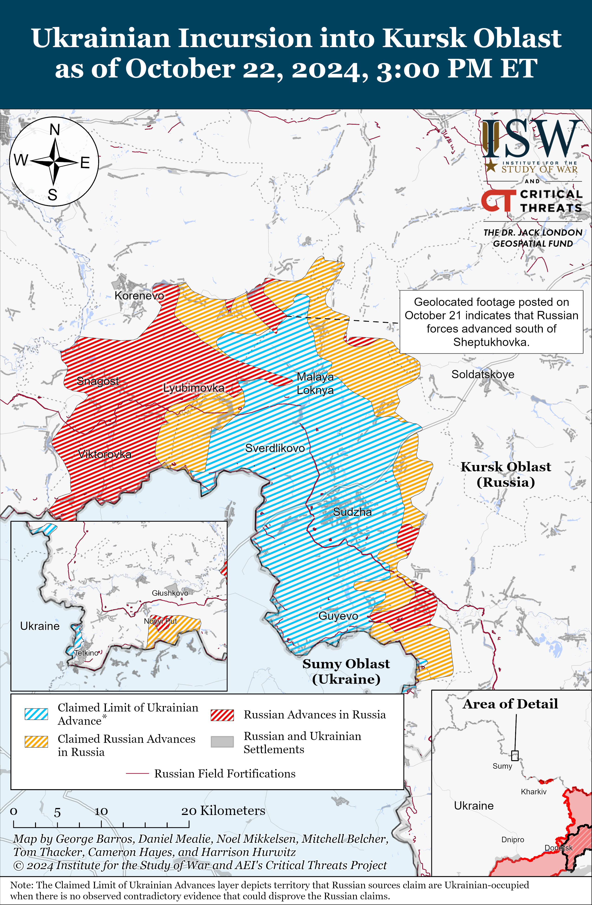
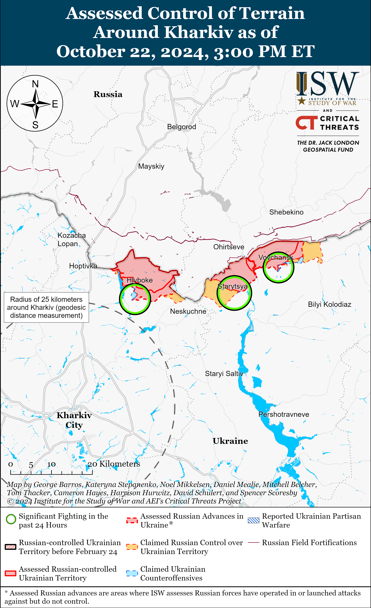
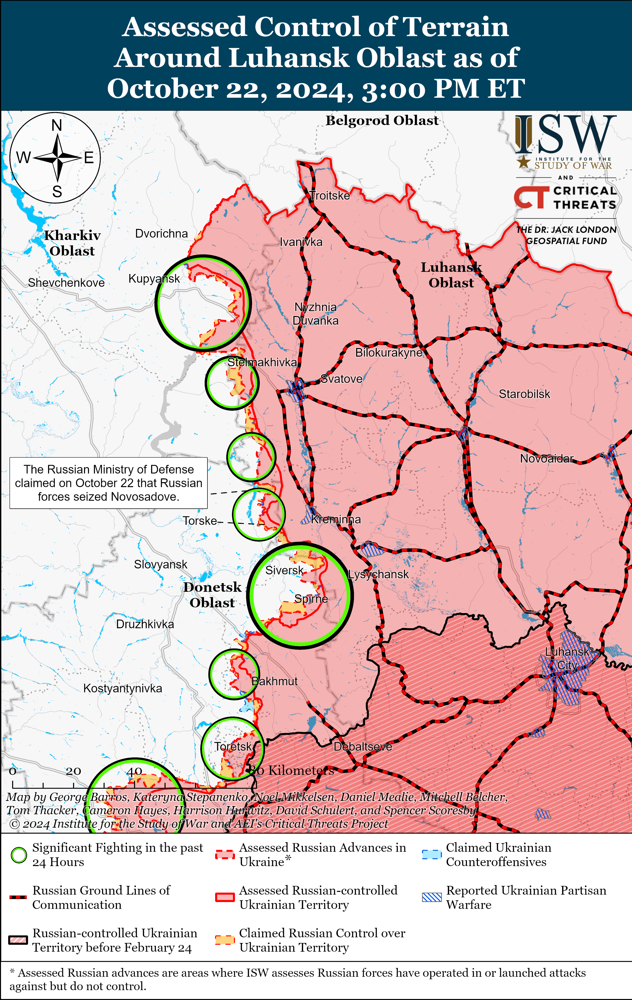
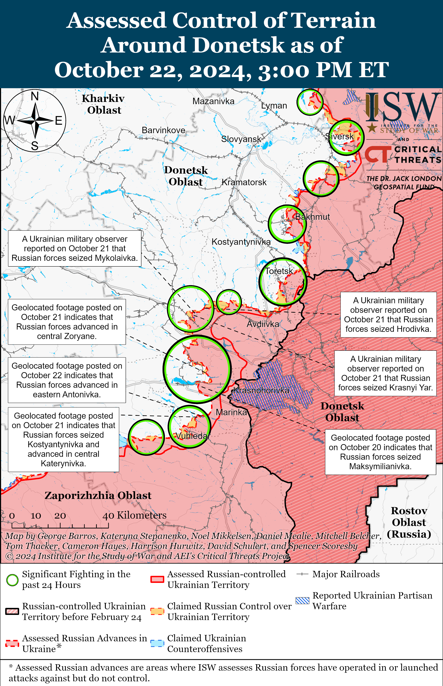
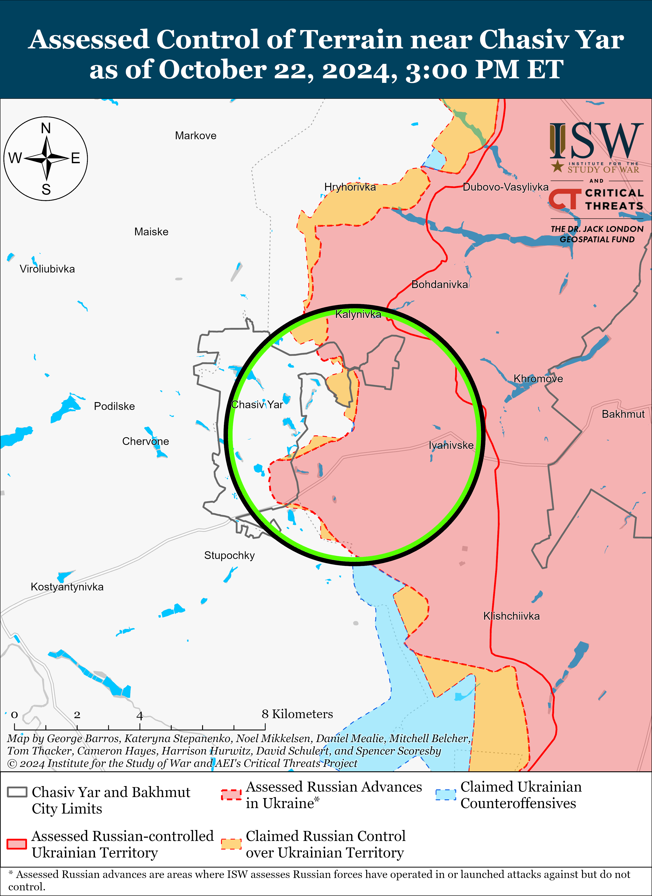
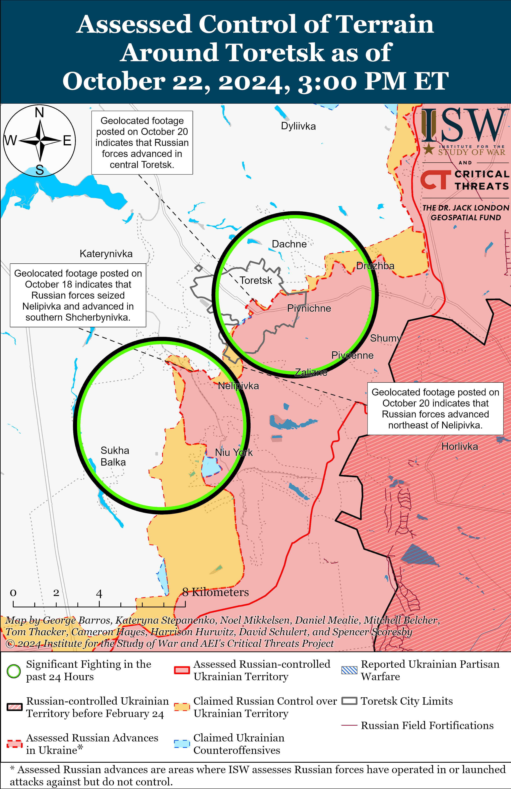
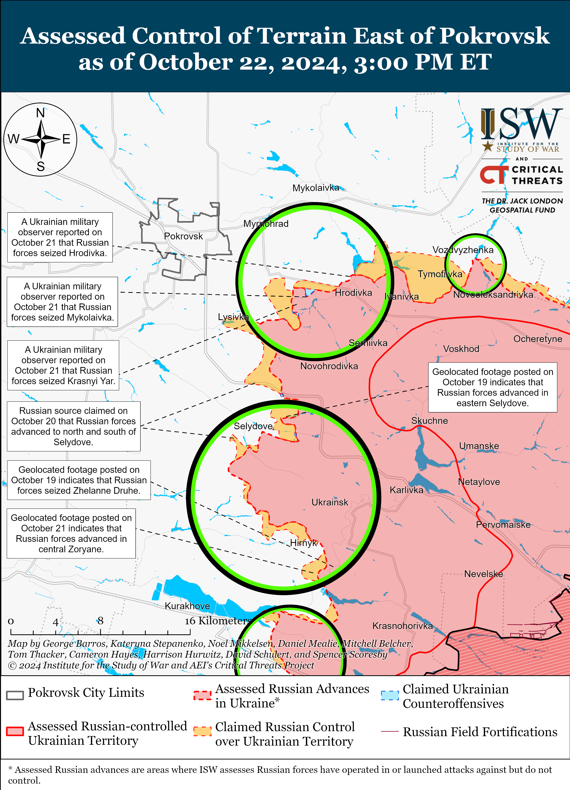
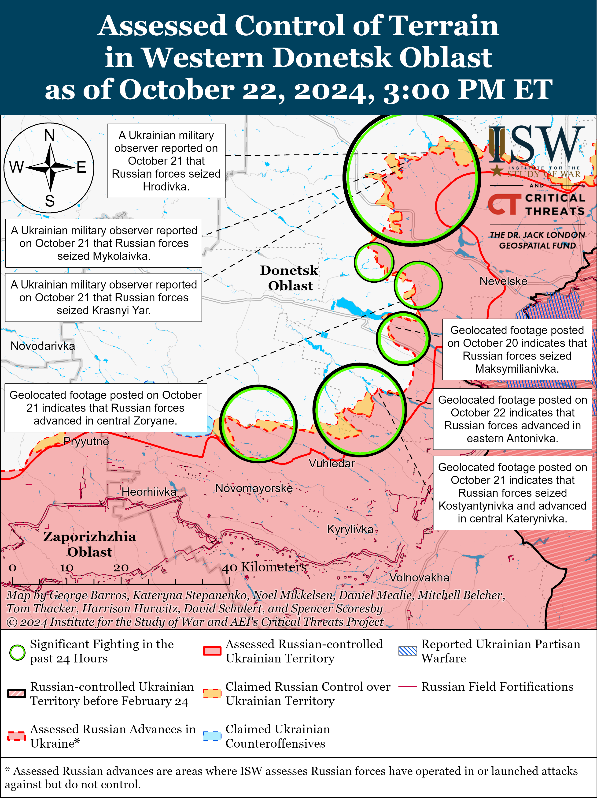
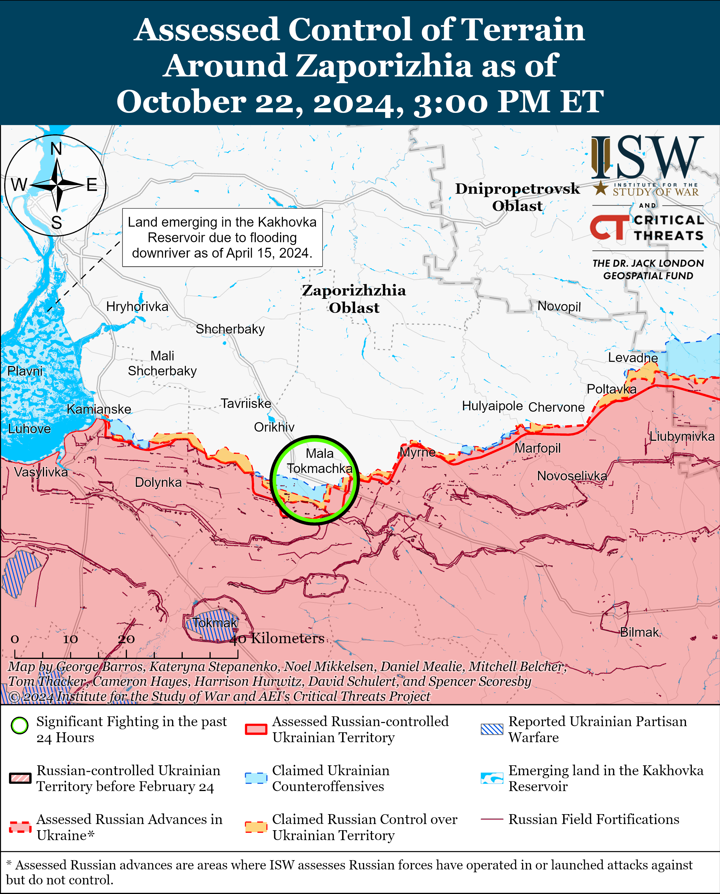
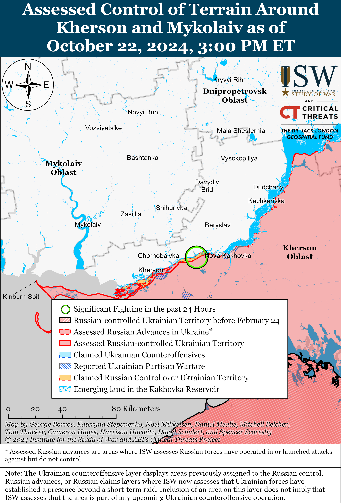

# Russian Offensive Campaign Assessment, October 22, 2024

**October 22, 2024, 5:40pm ET**

**Click** [**here**](https://storymaps.arcgis.com/stories/36a7f6a6f5a9448496de641cf64bd375) **to see ISW’s interactive map of the Russian invasion of Ukraine. This map is updated daily alongside the static maps present in this report.**

**Click** [**here**](https://storymaps.arcgis.com/stories/83a2f24901c941d581c0c523ecd2619b) **to see ISW's interactive map of Ukraine's offensive in Kursk Oblast.**

**Click** [**here**](https://understandingwar.maps.arcgis.com/apps/instant/3dviewer/index.html?appid=1602762dbcde419bb957dea358449580) **to see ISW’s 3D control of terrain topographic map of Ukraine. Use of a computer (not a mobile device) is strongly recommended for using this data-heavy tool.**

**Click** [**here**](https://storymaps.arcgis.com/stories/733fe90805894bfc8562d90b106aa895) **to access ISW’s archive of interactive time-lapse maps of the Russian invasion of Ukraine. These maps complement the static control-of-terrain map that ISW produces daily by showing a dynamic frontline. ISW will update this time-lapse map archive monthly.**

**Note: The data cut-off for this product was 1pm ET on October 22. ISW will cover subsequent reports in the October 23 Russian Offensive Campaign Assessment.**

**Ukrainian forces conducted a series of drone strikes on the night of October 21 to 22 targeting distilleries in Russia that reportedly manufacture products for the Russian military.** Tula Oblast Governor Dmitry Milyaev claimed that a Ukrainian drone strike damaged distilleries in Yefremov and Luzhlovsky.[[1]](#_edn93adb0528de04c6616c5b78b079c29311) Russian opposition outlet *Astra* reported that the Ukrainian drone strike also damaged local Ministry of Internal Affairs (MVD) and Federal Security Service (FSB) buildings near the distillery in Yefremov.[[2]](#_edn93adb0528de04c6616c5b78b079c29312) Russian opposition and insider sources posted footage showing a fire near the Yefremov distillery, synthetic rubber plant (just northwest of the distillery), and thermal power plant (just northeast of the distillery).[[3]](#_edn93adb0528de04c6616c5b78b079c29313) Tambov Oblast Governor Maksim Egorov claimed that a drone struck the Biokhim enterprise in Rasskozovo, starting a fire.[[4]](#_edn93adb0528de04c6616c5b78b079c29314) Biokhim produces ethyl alcohol, and its website claims that it manufactures products that are of "strategic importance to the [Russian] state."[[5]](#_edn93adb0528de04c6616c5b78b079c29315) Voronezh Oblast Governor Aleksander Gusev claimed that Russian forces "suppressed" a drone that then fell on an unspecified industrial enterprise in Voronezh Oblast, damaging a workshop.[[6]](#_edn93adb0528de04c6616c5b78b079c29316) Head of the Ukrainian Center for Countering Disinformation Andriy Kovalenko stated that Russia uses alcohol factories to manufacture fuel for military needs and explosives.[[7]](#_edn93adb0528de04c6616c5b78b079c29317)

**South Korea may be considering directly sending weapons and intelligence personnel to Ukraine in response to the reported deployment of North Korean troops to Russia to participate in Russia's war in Ukraine.** South Korea's *Yonhap News Agency* reported on October 22 that a South Korean government source stated that South Korea is considering sending South Korean military personnel, likely from intelligence units, to Ukraine to monitor North Korean forces' tactics and combat capabilities and to question captured North Koreans.[[8]](#_edn93adb0528de04c6616c5b78b079c29318) The source also reportedly stated that South Korea will prioritize giving Ukraine defensive weapons over lethal aid but, if South Korea were to provide lethal weapons, Seoul will first try to find a way to provide them indirectly to Ukraine. South Korean National Security Director Chang Ho-jin stated on June 20 following the initial creation of the Russian-North Korean strategic partnership agreement on June 19 that the agreement had encouraged South Korea to change its long-standing policy prohibiting the transfer of arms to Ukraine, and *Yonhap News Agency* reported on June 21 that South Korea was considering sending 155mm artillery shells and unspecified air defense systems to Ukraine.[[9]](#_edn93adb0528de04c6616c5b78b079c29319) South Korea's continued consideration of sending lethal aid to Ukraine comes against the backdrop of threats from Russian President Vladimir Putin on June 20, when Putin stated that Seoul would be making "a very big mistake" if it decided to supply arms to Ukraine.[[10]](#_edn93adb0528de04c6616c5b78b079c293110)

Ukraine's Main Military Intelligence Directorate (GUR) Head Lieutenant General Kyrylo Budanov told *The War Zone* on October 22 that the first North Korean military personnel are expected to arrive in Kursk Oblast on October 23 but that it is unclear how large the force grouping will be or how they will be equipped.[[11]](#_edn93adb0528de04c6616c5b78b079c293111) *Newsweek* reported that a South Korean government official stated that North Korea sent fighter pilots to Vladivostok, Primorsky Krai in September 2024, possibly to train on Russian combat aircraft that Russia has allegedly supplied to North Korea, or to supplement Russia's pilot shortages.[[12]](#_edn93adb0528de04c6616c5b78b079c293112)

**Thirty-six world leaders, including from the People’s Republic of China (PRC), India, South Africa, and Iran, arrived in Kazan, Republic of Tatarstan, for the 16th annual BRICS summit held from October 22 to 24 during which Russia will likely seek to establish mechanisms to enhance its war effort in Ukraine.** UN Secretary General Antonio Guterres, the Taliban’s Minister of Trade and Industry Nooruddin Azizi, Serbian Deputy Prime Minister Aleksandar Vulin, Turkish President Recep Tayyip Erdogan, and other world leaders also arrived in Kazan on October 22.[[13]](#_edn93adb0528de04c6616c5b78b079c293113) Russian President Vladimir Putin met with PRC President Xi Jinping on the sidelines of the BRICS summit during which both leaders emphasized the importance of multifaceted Russia-PRC relations while Xi highlighted BRICS as a format for global strategic cooperation.[[14]](#_edn93adb0528de04c6616c5b78b079c293114) Putin also met with Indian Prime Minister Narendra Modi and South African President Cyril Ramaphosa with whom he discussed bilateral ties, the creation of a multipolar world order, and the use of national currencies in mutual trade settlements.[[15]](#_edn93adb0528de04c6616c5b78b079c293115) Modi reiterated the need to find  "the earliest possible" peaceful solution to the war in Ukraine and reaffirmed India’s role as a potential mediator.[[16]](#_edn93adb0528de04c6616c5b78b079c293116)

Indian Foreign Secretary Vikram Misri reported on October 22 that India returned 85 Indian citizens who had involuntarily joined the Russian military to fight in Ukraine and that Modi would negotiate with Russian authorities the return of 20 more Indian nationals during the BRICS summit.[[17]](#_edn93adb0528de04c6616c5b78b079c293117) Russia will likely use the BRICS summit as an opportunity to showcase its efforts at enhancing global ties with non-Western states and possibly establish deals and trade mechanisms through which it can support its war efforts in Ukraine by mitigating the impacts of Western sanctions.

**A recent Russian opinion poll suggests that Russian President Vladimir Putin enjoys widespread support among Russian citizens even though many do not agree with some of the Kremlin's policies, including the war in Ukraine.** Russian opposition outlets *Meduza* and *Current Time* reported on October 22 that they viewed the results of a recent poll conducted by independent Russian opposition polling organization Chronicles between September 10 and 17.[[18]](#_edn93adb0528de04c6616c5b78b079c293118) The Chronicles survey found that 78 percent of respondents stated that they generally approve of Putin's activities as Russian president but wanted the government to prioritize issues that are "directly opposite of the actual actions" of Putin, such as domestic social and economic problems (83 percent), a peace treaty with Ukraine that includes mutual concessions (61 percent), and the restoration of relations with Western states (43 percent). Putin has refrained from transferring the Russian economy to a full wartime footing, but the Russian government has nevertheless heavily focused Russian federal spending on defense and national security instead of social policies.[[19]](#_edn93adb0528de04c6616c5b78b079c293119) Putin has demonstrated that he is uninterested in agreeing to Russian concessions to Ukraine, repeatedly indicating that he is not interested in negotiations that do not result in Ukraine's complete capitulation and even demanding that Ukrainian forces withdraw from areas of eastern and southern Ukraine that Russian forces do not currently occupy.[[20]](#_edn93adb0528de04c6616c5b78b079c293120) Putin has repeatedly tried to distance himself from incompetent, corrupt, and overly bureaucratic Russian officials and has attempted to posture himself as a capable and caring leader who can quickly resolve average Russians' issues, despite the fact that he is behind the decision-making that most of the population appears to take issue with.[[21]](#_edn93adb0528de04c6616c5b78b079c293121)

**Key Takeaways:**

- **Ukrainian forces conducted a series of drone strikes on the night of October 21 to 22 targeting distilleries in Russia that reportedly manufacture products for the Russian military.**
- **South Korea may be considering directly sending weapons and intelligence personnel to Ukraine in response to the reported deployment of North Korean troops to Russia to participate in Russia's war in Ukraine.**
- **Thirty-six world leaders, including from the People’s Republic of China (PRC), India, South Africa, and Iran, arrived in Kazan, Republic of Tatarstan, for the 16th annual BRICS summit held from October 22 to 24 during which Russia will likely seek to establish mechanisms to enhance its war effort in Ukraine.**
- **A recent Russian opinion poll suggests that Russian President Vladimir Putin enjoys widespread support among Russian citizens even though many do not agree with some of the Kremlin's policies, including about the war.**
- **Russian forces recently advanced in Kursk Oblast and near Kurakhove and Vuhledar.**
- **Russian forces conducted multilateral military exercises with international partners. Iran hosted Russian and Omani naval forces as part of the "IMEX 2024" naval drills, which took place between October 19-20 in the Indian Ocean.**

***We do not report in detail on Russian war crimes because these activities are well-covered in Western media and do not directly affect the military operations we are assessing and forecasting. We will continue to evaluate and report on the effects of these criminal activities on the Ukrainian military and the Ukrainian population and specifically on combat in Ukrainian urban areas. We utterly condemn Russian violations of the laws of armed conflict and the Geneva Conventions and crimes against humanity even though we do not describe them in these reports.***

- Ukrainian Operations in the Russian Federation
- Russian Main Effort – Eastern Ukraine (comprised of three subordinate main efforts)
- Russian Subordinate Main Effort #1 – Push Ukrainian forces back from the international border with Belgorod Oblast and approach to within tube artillery range of Kharkiv City
- Russian Subordinate Main Effort #2 – Capture the remainder of Luhansk Oblast and push westward into eastern Kharkiv Oblast and encircle northern Donetsk Oblast
- Russian Subordinate Main Effort #3 – Capture the entirety of Donetsk Oblast
- Russian Supporting Effort – Southern Axis
- Russian Air, Missile, and Drone Campaign
- Russian Mobilization and Force Generation Efforts
- Russian Technological Adaptations
- Activities in Russian-occupied areas
- Significant Activity in Belarus

**Ukrainian Operations in the Russian Federation**

Russian forces recently advanced in the northern part of the Kursk Oblast salient. Geolocated footage published on October 21 indicates that Russian forces advanced in fields south of Sheptukhovka (southeast of Korenevo) during two platoon-sized mechanized assaults.[[22]](#_edn93adb0528de04c6616c5b78b079c293122) Russian sources reported intense fighting and Ukrainian counterattacks southeast of Korenevo, particularly near Zeleny Shlyakh, Novoivanovka, and Lyubimovka.[[23]](#_edn93adb0528de04c6616c5b78b079c293123) Ukrainian sources stated that Ukrainian forces are using M1 Abrams tanks in Kursk Oblast for the first time in attacks near Novoivanovka.[[24]](#_edn93adb0528de04c6616c5b78b079c293124) A Russian milblogger claimed that fighting also continued west of the main Kursk Oblast salient in Glushkovsky Raion near Novy Put (southwest of Glushkovo).[[25]](#_edn93adb0528de04c6616c5b78b079c293125) Elements of the Russian 137th Airborne (VDV) Regiment (106th VDV Division), 1434th "Akhmat-Chechnya" Regiment (likely a mobilized regiment), and 155th Naval Infantry Brigade (Pacific Fleet, Eastern Military District [EMD]) are reportedly operating near Lyubimovka, while elements of the 11th VDV Brigade are operating southeast of Sudzha.[[26]](#_edn93adb0528de04c6616c5b78b079c293126) Elements of the 810th Naval Infantry Brigade (Black Sea Fleet, Southern Military District [SMD]), 83rd VDV Brigade, and 56th VDV Regiment (7th VDV Division) are also operating throughout Kursk Oblast.[[27]](#_edn93adb0528de04c6616c5b78b079c293127)

*Please see topline text about Ukrainian strikes in Russia.*

**Russian Main Effort – Eastern Ukraine**

**Russian Subordinate Main Effort #1 – Kharkiv Oblast** **(Russian objective: Push Ukrainian forces back from the international border with Belgorod Oblast and approach to within tube artillery range of Kharkiv City)**

Russian forces continued limited offensive operations in northern Kharkiv Oblast on October 22 but did not make any confirmed advances. Ukrainian sources stated on October 22 that Russian forces conducted unsuccessful offensive operations northeast of Kharkiv City near Vovchansk and Starytsya (southwest of Vovchansk) and north of Kharkiv City near Lyptsi.[[28]](#_edn93adb0528de04c6616c5b78b079c293128) Ukrainian Kharkiv Group of Forces Spokesperson Lieutenant Colonel Yevhenii Romanov stated on October 21 that Russian forces began using drones with wired communications in northern Kharkiv Oblast.[[29]](#_edn93adb0528de04c6616c5b78b079c293129) Romanov stated that the wired drones effectively act as conventional anti-tank guided missiles but that their effectiveness is impeded by the length of connective fiber optic wire, added weight of the wire, and the susceptibility to catch on obstacles. Romanov noted that Ukrainian forces have already developed methods to counter the wired Russian drones. Elements of the Russian 7th Motorized Rifle Regiment (11th Army Corps [AC], Leningrad Military District [LMD]) continue to operate near Lyptsi.[[30]](#_edn93adb0528de04c6616c5b78b079c293130)

**Russian Subordinate Main Effort #2 – Luhansk Oblast (Russian objective: Capture the remainder of Luhansk Oblast and push westward into eastern Kharkiv Oblast and northern Donetsk Oblast)**

Russian forces continued offensive operations along the Kupyansk-Svatove-Kreminna line on October 22, but did not make any confirmed advances. The Russian Ministry of Defense (MoD) claimed on October 22 that Russian forces seized Novosadove (northwest of Kreminna).[[31]](#_edn93adb0528de04c6616c5b78b079c293131) A Russian milblogger claimed on October 22 that Russian forces advanced northwest and southwest of Stelmakhivka (southeast of Kupyansk).[[32]](#_edn93adb0528de04c6616c5b78b079c293132) ISW has not observed confirmation of these claims. Russian forces continued offensive operations northwest of Kupyansk near Lyman Pershyi; east of Kupyansk near Petropavlivka; southeast of Kupyansk near Zelenyi Hai, Stelmakhivka, Lozova, and Pishchane; west of Svatove near Dzherelne and Vyshneve; southwest of Svatove near Hrekivka, and in the direction of Katerynivka and Novomykhailivka; northwest of Kreminna near Makiivka, Novosadove; and west of Kreminna near Torske and Terny on October 21 to 22.[[33]](#_edn93adb0528de04c6616c5b78b079c293133) Elements of the Russian 423rd Motorized Rifle Regiment (4th Tank Division, 1st Guards Tank Army [GTA], Moscow Military District [MMD]) and27th Motorized Rifle Brigade (2nd Combined Arms Army [CAA], Central Military District [CMD]) are operating near Stelmakhivka.[[34]](#_edn93adb0528de04c6616c5b78b079c293134)

**Russian Subordinate Main Effort #3 – Donetsk Oblast (Russian objective: Capture the entirety of Donetsk Oblast, the claimed territory of Russia’s proxies in Donbas)**

Russian forces continued offensive operations east of Siversk near Verkhnokamyanske, southeast of Siversk near Vyimka, and south of Siversk near Pereizne on October 21 and 22, but there were no confirmed changes to the frontline.[[35]](#_edn93adb0528de04c6616c5b78b079c293135) Elements of the Russian 2nd Artillery Brigade (3rd Combined Arms Army [CAA], formerly 2nd Luhansk People's Republic Army Corps [LNR AC]) are reportedly operating near Vyimka.[[36]](#_edn93adb0528de04c6616c5b78b079c293136)

Russian forces continued offensive operations in the Chasiv Yar direction on October 22, but there were no confirmed changes to the frontline. Russian forces conducted offensive operations northeast of Chasiv Yar near Vasyukivka and near Chasiv Yar itself on October 21 and 22.[[37]](#_edn93adb0528de04c6616c5b78b079c293137) The spokesperson of a Ukrainian brigade operating in the Chasiv Yar direction stated that Russian forces have conducted assaults every day in the past month and that Russian forces took advantage of foggy weather to cross the Siverskyi-Donets Donbas Canal recently.[[38]](#_edn93adb0528de04c6616c5b78b079c293138) Elements of the Russian 1442nd Motorized Rifle Regiment (6th Motorized Rifle Division, 3rd AC) are reportedly operating in the Chasiv Yar direction; elements of the 8th "Hispaniola" Volunteer Brigade (Russian Volunteer Corps) are reportedly operating in northeastern Chasiv Yar; and elements of the 98th Airborne (VDV) Division are reportedly operating within Chasiv Yar.[[39]](#_edn93adb0528de04c6616c5b78b079c293139)

Russian forces continued offensive operations in the Toretsk direction on October 22, but there were no confirmed changes to the frontline. Russian forces conducted offensive operations near Toretsk itself and west of Toretsk near Shcherbynivka on October 21 and 22.[[40]](#_edn93adb0528de04c6616c5b78b079c293140) A Russian milblogger claimed that Russian forces are transferring a large number of reinforcements from an unspecified sector of the front to Toretsk, which the milblogger claimed is currently the Russian military's main attack direction.[[41]](#_edn93adb0528de04c6616c5b78b079c293141)

Russian forces continued offensive operations in the Pokrovsk direction on October 22 but did not make any confirmed advances. Geolocated footage published on October 22 indicates that Ukrainian forces continue to operate west of Krasnyi Yar (southeast of Pokrovsk).[[42]](#_edn93adb0528de04c6616c5b78b079c293142) Russian milbloggers claimed that Russian forces advanced near Selydove (southeast of Pokrovsk) and in northern Hirnyk (southeast of Selydove and southeast of Pokrovsk), although ISW has not observed visual evidence of these claims.[[43]](#_edn93adb0528de04c6616c5b78b079c293143) Russian forces continued attacking east of Pokrovsk near Promin, Sukha Balka, Vozdvyzhenka, and Myrolyubivka and southeast of Pokrovsk near Selydove, Lysivka, Mykhailivka, Krasnyi Yar, Krutyi Yar, Hirnyk, Novodmytrivka, Zoryane, Novoselydivka, and Izmailivka on October 21 and 22.[[44]](#_edn93adb0528de04c6616c5b78b079c293144) A Ukrainian officer in a brigade operating in the Pokrovsk direction stated that rainy conditions reduce the Russian military's ability to operate reconnaissance and strike drones but do not affect Russian artillery operations.[[45]](#_edn93adb0528de04c6616c5b78b079c293145) The officer stated that Ukrainian electronic warfare (EW) systems are able to deactivate half of the Russian drones that approach Ukrainian positions.

Russian forces recently advanced east of Kurakhove amid continued offensive operations in the area on October 22. Geolocated footage published on October 22 showing Ukrainian forces repelling a roughly reduced company-sized Russian mechanized assault indicates that Russian forces advanced westward along the O0510 Marinka-Kurakhove highway, east of Kurakhove.[[46]](#_edn93adb0528de04c6616c5b78b079c293146) Russian forces continued attacking east and southeast of Kurakhove near Hostre, Dalne, and Heorhiivka on October 21 and 22.[[47]](#_edn93adb0528de04c6616c5b78b079c293147)

Russian forces recently advanced southwest of Donetsk City near Vuhledar amid continued Russian offensive operations in the area on October 22. Geolocated footage published on October 22 showing Ukrainian forces striking Russian personnel of the Russian 33rd Motorized Rifle Regiment (20th Motorized Rifle Division, 8th CAA, Southern Military District [SMD]) indicates that Russian forces advanced in eastern Antonivka (northeast of Vuhledar).[[48]](#_edn93adb0528de04c6616c5b78b079c293148) Russian milbloggers claimed that Russian forces advanced northeast of Vuhledar near Antonivka, within Katerynivka, north of Vodyane, and northwest of Vuhledar near Bohoyavlenka, although ISW has not observed visual confirmation of these claims.[[49]](#_edn93adb0528de04c6616c5b78b079c293149) Russian forces continued attacking near Antonivka, Katerynivka, and Yelyzavetivka (all northeast of Vuhledar); Bohoyavlenka and Novoukrainka (northwest of Vuhledar); and Zolota Nyva (west of Vuhledar) on October 21 and 22.[[50]](#_edn93adb0528de04c6616c5b78b079c293150) Elements of the Russian 39th Motorized Rifle Brigade (68th AC, Eastern Military District [EMD]) reportedly continue operating near Vuhledar; elements of the 37th Motorized Rifle Brigade (36th CAA, EMD) reportedly continue operating near Zolota Nyva; and elements of the "Aleppo" drone detachment of the 1472nd Motorized Rifle Regiment (68th AC, EMD) reportedly continue operating near Yelyzavetivka.[[51]](#_edn93adb0528de04c6616c5b78b079c293151)

Neither Russian nor Ukrainian forces reported on ground activity in the Donetsk-Zaporizhia Oblast border area on October 22. Snipers of the Russian 38th Motorized Rifle Brigade (35th CAA, EMD) are reportedly operating in the Polohy direction (south of Hulyaipole).[[52]](#_edn93adb0528de04c6616c5b78b079c293152)

**Russian Supporting Effort – Southern Axis (Russian objective: Maintain frontline positions and secure rear areas against Ukrainian strikes)**

Russian forces continued assaults northeast of Robotyne near Mala Tokmachka on October 21 and 22, but there were no confirmed advances.[[53]](#_edn93adb0528de04c6616c5b78b079c293153) Ukrainian forces are reportedly counterattacking in Kamyanske (northwest of Robotyne).[[54]](#_edn93adb0528de04c6616c5b78b079c293154) Elements of the Russian 38th Motorized Rifle Brigade (35th Combined Arms Army [CAA], Eastern Military District [EMD]) are reportedly operating in the Polohy (eastern Zaporizhia Oblast) direction.[[55]](#_edn93adb0528de04c6616c5b78b079c293155)

Russian forces continued attacks in east (left) bank Kherson Oblast on October 21 but did not make any confirmed advances.[[56]](#_edn93adb0528de04c6616c5b78b079c293156)

**Russian Air, Missile, and Drone Campaign (Russian Objective: Target Ukrainian military and civilian infrastructure in the rear and on the frontline)**

Russian forces conducted a series of drone strikes against Ukraine on the night of October 21 to 22, mainly targeting Sumy Oblast. Ukraine's Air Force reported that Russian forces launched 60 drones, including Shahed-136/131s and other drones of an unspecified type, from in Kursk Oblast and Yeysk and Primorsko-Akhtarsk, Krasnodar Krai.[[57]](#_edn93adb0528de04c6616c5b78b079c293157) Ukrainian forces shot down 17 drones over Dnipropetrovsk, Cherkasy, Donetsk, Zaporizhia, Kyiv, Kherson, and Kharkiv oblasts and 25 over Sumy Oblast.[[58]](#_edn93adb0528de04c6616c5b78b079c293158) Ukraine's Air Force reported that 10 drones got "lost," likely due to Ukrainian electronic warfare (EW) interference, one flew into Belarusian airspace, three flew back into Russian airspace, and one remained in Ukrainian airspace as of the morning of October 22.[[59]](#_edn93adb0528de04c6616c5b78b079c293159) Sumy Oblast officials reported that Shahed drones targeted Sumy City, killing three and damaging civilian infrastructure.[[60]](#_edn93adb0528de04c6616c5b78b079c293160)

**Russian Mobilization and Force Generation Efforts (Russian objective: Expand combat power without conducting general mobilization)**

Russian forces conducted multilateral military exercises with international partners. Iran hosted Russian and Omani naval forces as part of the "IMEX 2024" naval drills, which took place between October 19-20 in the Indian Ocean.[[61]](#_edn93adb0528de04c6616c5b78b079c293161) The exercises were intended to bolster collective security and increase multilateral cooperation between Iran, Russia, and Oman. Saudi Arabia, Qatar, India, Pakistan, Bangladesh, and Thailand observed the drills.[[62]](#_edn93adb0528de04c6616c5b78b079c293162) Such joint naval exercises are intended to posture against the United States in its regional areas of interest and increase the interoperability of various participating forces. Russian personnel of the 201st Military Base (Central Military District) additionally began the joint "Frontier-2024" as part of the Russian-led Collective Security Treaty Organization (CSTO)'s Collective Rapid Reaction Force format. Kazakh, Kyrgyz, and Tajik military personnel are participating in the exercises, which will practice fighting in mountain and desert terrain and providing air defense cover in such environments.[[63]](#_edn93adb0528de04c6616c5b78b079c293163)

The Kremlin posthumously awarded the Order of Courage to a Russian drone operator whose death sparked intense criticism amongst the Russian ultranationalist milblogger community. Russian milbloggers and media claimed that the Kremlin awarded Junior Sergeant Dmitry Lysakovsky (alias Goodwin), a deceased drone operator from the Russian 87th Separate Rifle Regiment (1st "Slavic" Motorized Rifle Brigade, 51st Combined Arms Army [CAA], formerly 1st Donetsk People's Republic Army Corps [DNR AC]) with the Order of Courage on October 22.[[64]](#_edn93adb0528de04c6616c5b78b079c293164) ISW previously reported that Lysakovsky died in combat on September 13 after the Russian command disbanded his specialized drone unit and committed him to a frontal assault in Donetsk Oblast as punishment for criticizing the Russian command.[[65]](#_edn93adb0528de04c6616c5b78b079c293165) Lysakovsky’s death caused outrage within the Russian milblogger community as Russian milbloggers claimed that the 51st CAA’s practice of sending specialists to conduct frontal assaults as punishment for dissent is indicative of poor Russian command discipline and degrades the quality of Russian forces. ISW previously reported that Russian Defense Minister Andrei Belousov met with Russian milbloggers on September 27 to quell Russian milbloggers’ complaints about the death of Lysakovsky and another prominent Russian drone operator.[[66]](#_edn93adb0528de04c6616c5b78b079c293166)  The Kremlin's decision to posthumously award Goodwin with military honors is likely an additional effort to appease the complaints of the milblogger communities.

**Russian Technological Adaptations** **(Russian objective: Introduce technological innovations to optimize systems for use in Ukraine)**

Kremlin newswire *TASS* claimed on October 22 that the Russian company TsBK presented a new mini- first-person view (FPV) hexacopter drone that can carry a six-kilogram payload up to 12 kilometers without remote equipment and signal repeaters, or up to 20 kilometers with remote equipment and signal repeaters.[[67]](#_edn93adb0528de04c6616c5b78b079c293167)

**Activities in Russian-occupied areas (Russian objective: Consolidate administrative control of annexed areas; forcibly integrate Ukrainian citizens into Russian sociocultural, economic, military, and governance systems)**

*ISW is not publishing reporting on activities in Russian-occupied areas today.*

**Significant activity in Belarus** **(Russian efforts to increase its military presence in Belarus and further integrate Belarus into Russian-favorable frameworks and Wagner Group activity in Belarus)**

The Belarusian Ministry of Defense (MoD) announced on October 22 that it has begun the routine dispatch of citizens called up for military service to their respective military units.[[68]](#_edn93adb0528de04c6616c5b78b079c293168) The Belarusian MoD noted that about 10,000 Belarusian citizens will enter units of the Belarusian Armed Forces, Ministry of Internal Affairs, Border Service, and various security agencies between October 22 and November 23. Personnel who have served the terms of their compulsory military service will in turn be released from their units during the same time period.

**Note: ISW does not receive any classified material from any source, uses only publicly available information, and draws extensively on Russian, Ukrainian, and Western reporting and social media as well as commercially available satellite imagery and other geospatial data as the basis for these reports. References to all sources used are provided in the endnotes of each update.**

---

[[1]](#_edn93adb0528de04c6616c5b78b079c2931ref1) <https://t.me/dmilyaev/1537>; https://t.me/astrapress/66940

[[2]](#_edn93adb0528de04c6616c5b78b079c2931ref2) https://t.me/astrapress/66940

[[3]](#_edn93adb0528de04c6616c5b78b079c2931ref3) <https://t.me/vchkogpu/51902>; <https://t.me/vchkogpu/51899>; <https://t.me/vchkogpu/51900> ; <https://t.me/astrapress/66892>

[[4]](#_edn93adb0528de04c6616c5b78b079c2931ref4) <https://t.me/egorovmb/4544>;

[[5]](#_edn93adb0528de04c6616c5b78b079c2931ref5) <https://biohim68rsk> dot ucoz.ru/index/o\_predprijatii/0-17; https://www.rbc dot ru/politics/22/10/2024/671724f09a794740bd0555af?from=newsfeed; <https://meduza> dot io/news/2024/10/22/ukrainskie-bespilotniki-atakovali-dva-spirtzavoda-v-tulskoy-oblasti-i-odin-v-tambovskoy

[[6]](#_edn93adb0528de04c6616c5b78b079c2931ref6) <https://t.me/gusev_36/2905>; https://t.me/gusev\_36/2906

[[7]](#_edn93adb0528de04c6616c5b78b079c2931ref7) <https://newsukraine> dot rbc.ua/news/russia-s-distilleries-hit-by-ukrainian-drones-1729586609.html

[[8]](#_edn93adb0528de04c6616c5b78b079c2931ref8) <https://en.yna> dot co.kr/view/AEN20241022003400315?section=nk/nk; <https://www.twz.com/news-features/south-korea-could-send-advisors-weapons-to-ukraine-over-north-korean-troop-movements>

[[9]](#_edn93adb0528de04c6616c5b78b079c2931ref9) https://isw.pub/UkrWar062324

[[10]](#_edn93adb0528de04c6616c5b78b079c2931ref10) https://isw.pub/UkrWar062324

[[11]](#_edn93adb0528de04c6616c5b78b079c2931ref11) https://www.twz.com/news-features/south-korea-could-send-advisors-weapons-to-ukraine-over-north-korean-troop-movements

[[12]](#_edn93adb0528de04c6616c5b78b079c2931ref12) https://www.newsweek.com/north-korea-news-pilots-could-fly-russian-warplanes-ukraine-report-1972650

[[13]](#_edn93adb0528de04c6616c5b78b079c2931ref13) <https://t.me/tass_agency/280979>; <https://t.me/tass_agency/280818>; <https://t.me/tass_agency/280830> ; <https://t.me/tass_agency/280905;> <https://t.me/tass_agency/280842>; <https://t.me/tass_agency/280975>; <https://t.me/tass_agency/280976>; <https://t.me/tass_agency/280995>; <https://t.me/tass_agency/280997> ; <https://t.me/tass_agency/281002> ; <https://t.me/tass_agency/281006;> <https://t.me/tass_agency/280785> ; <https://t.me/tass_agency/280795;> <https://t.me/rybar/64659>; [https://ria](https://ria/) dot ru/20241022/gazuani-1979362930.html; <https://www.theguardian.com/business/2024/oct/22/putin-brics-summit-russia-china-india-iran-kazan>; https://www.bloomberg.com/news/articles/2024-10-21/why-turkey-a-nato-member-wants-to-join-brics

[[14]](#_edn93adb0528de04c6616c5b78b079c2931ref14) http://kremlin dot ru/events/president/news/75370 ; http://kremlin dot ru/supplement/6214 ; https://t.me/tass\_agency/280874 ; https://t.me/tass\_agency/280969 ; https://t.me/tass\_agency/280970 ; https://t.me/tass\_agency/280971 ; https://t.me/tass\_agency/280981

[[15]](#_edn93adb0528de04c6616c5b78b079c2931ref15) http://kremlin dot ru/events/president/news/75369 ; http://kremlin dot ru/supplement/6213; https://t.me/MID\_Russia/46873; <https://t.me/MID_Russia/46868>; http://kremlin dot ru/events/president/news/75368 ; http://kremlin dot ru/supplement/6212; https://t.me/MID\_Russia/46867

[[16]](#_edn93adb0528de04c6616c5b78b079c2931ref16) http://kremlin dot ru/events/president/news/75368 ; http://kremlin dot ru/supplement/6212

[[17]](#_edn93adb0528de04c6616c5b78b079c2931ref17) <https://www.hindustantimes> dot com/india-news/85-indians-discharged-from-russian-army-india-working-for-release-of-20-more-101729523715856.html

[[18]](#_edn93adb0528de04c6616c5b78b079c2931ref18) https://meduza dot io/news/2024/10/22/proekt-hroniki-bolshinstvo-zayavlyayuschih-o-podderzhke-putina-rossiyan-hotyat-veschey-polnostyu-protivopolozhnyh-ego-deystviyam-naprimer-mira-s-ukrainoy ; https://www.currenttime dot tv/a/rossiya-putin-opros/33168308.html ; https://www.chronicles dot report/chapter13

[[19]](#_edn93adb0528de04c6616c5b78b079c2931ref19) <https://isw.pub/UkrWar093024>; <https://isw.pub/UkrWar100624> ; <https://isw.pub/UkrWar090124>; https://www.understandingwar.org/backgrounder/russian-offensive-campaign-assessment-may-15-2024

[[20]](#_edn93adb0528de04c6616c5b78b079c2931ref20) <https://isw.pub/UkrWar061424>; <https://www.understandingwar.org/backgrounder/russian-offensive-campaign-assessment-october-18-2024>; <https://isw.pub/UkrWar101824>; https://www.understandingwar.org/backgrounder/why-putin-remains-uninterested-meaningful-negotiations-ukraine

[[21]](#_edn93adb0528de04c6616c5b78b079c2931ref21) <https://www.understandingwar.org/backgrounder/russian-offensive-campaign-assessment-may-12-2024>; <https://www.understandingwar.org/backgrounder/russian-offensive-campaign-assessment-august-12-2024>; <https://isw.pub/UkrWar121423>

[[22]](#_edn93adb0528de04c6616c5b78b079c2931ref22) <https://x.com/moklasen/status/1848451574622007703>; <https://t.me/ombr41/861>

[[23]](#_edn93adb0528de04c6616c5b78b079c2931ref23) <https://t.me/DnevnikDesantnika/17784;> <https://t.me/dva_majors/55652?single>; <https://t.me/dva_majors/55652>; <https://t.me/motopatriot/28604;> <https://t.me/rusich_army/17873;> <https://t.me/dva_majors/55619;> <https://t.me/motopatriot/28589;> <https://t.me/mod_russia/44816;> https://t.me/milinfolive/133389

[[24]](#_edn93adb0528de04c6616c5b78b079c2931ref24) <https://t.me/ButusovPlus/14463;> https://t.me/andriyshTime/28595 ; https://t.me/milinfolive/133333

[[25]](#_edn93adb0528de04c6616c5b78b079c2931ref25) <https://t.me/rybar/64633>

[[26]](#_edn93adb0528de04c6616c5b78b079c2931ref26) <https://t.me/rybar/64633>; <https://x.com/666_mancer/status/1848461968828731404> ; <https://t.me/kozhemiakoofficial/2020> ; <https://x.com/666_mancer/status/1848466859735322891>; <https://t.me/RVvoenkor/79141>

[[27]](#_edn93adb0528de04c6616c5b78b079c2931ref27) <https://t.me/mod_russia/44797;> <https://t.me/rusich_army/17873>

[[28]](#_edn93adb0528de04c6616c5b78b079c2931ref28)<https://www.facebook.com/GeneralStaff.ua/posts/pfbid02x3z8B5SiSL2hLYR65rL19LotJ9uxBT1rDnca7HBPWv9HqoyMqBKCRszbm2iXfFA8l>  ; <https://www.facebook.com/GeneralStaff.ua/posts/pfbid0AVkt4xHYu2GUs24v997tQo9VwTCzN2Z5oa5AMKTRUsH1juk2Cb9zhF8tYuXSyDeql>

[[29]](#_edn93adb0528de04c6616c5b78b079c2931ref29) [https://armyinform](https://armyinform/) dot com.ua/2024/10/21/drony-na-motuzochczi-zapuskayut-okupanty-na-harkivshhyni-chy-ye-poryatunok-vid-drotovyh-bpla/; <https://youtu.be/j5TqaWCCdUg>

[[30]](#_edn93adb0528de04c6616c5b78b079c2931ref30) <https://t.me/ButusovPlus/14464>

[[31]](#_edn93adb0528de04c6616c5b78b079c2931ref31) https://t.me/mod\_russia/44813; <https://t.me/DnevnikDesantnika/17765>; https://t.me/vysokygovorit/17712; <https://t.me/epoddubny/21412>; https://t.me/sashakots/49682

[[32]](#_edn93adb0528de04c6616c5b78b079c2931ref32) https://t.me/motopatriot/28608

[[33]](#_edn93adb0528de04c6616c5b78b079c2931ref33) <https://www.facebook.com/GeneralStaff.ua/posts/pfbid026YR2i8SftPa9gBL4qs593hzMvdQN6Q7TUXX4HJdkhbZXBaFU3JJDNLywGkBvQUmTl>; <https://www.facebook.com/GeneralStaff.ua/posts/pfbid0AVkt4xHYu2GUs24v997tQo9VwTCzN2Z5oa5AMKTRUsH1juk2Cb9zhF8tYuXSyDeql>; https://www.facebook.com/GeneralStaff.ua/posts/pfbid02x3z8B5SiSL2hLYR65rL19LotJ9uxBT1rDnca7HBPWv9HqoyMqBKCRszbm2iXfFA8l

[[34]](#_edn93adb0528de04c6616c5b78b079c2931ref34) https://t.me/motopatriot/28608

[[35]](#_edn93adb0528de04c6616c5b78b079c2931ref35) <https://t.me/epoddubny/21413>; <https://www.facebook.com/GeneralStaff.ua/posts/pfbid026YR2i8SftPa9gBL4qs593hzMvdQN6Q7TUXX4HJdkhbZXBaFU3JJDNLywGkBvQUmTl> ; https://www.facebook.com/GeneralStaff.ua/posts/pfbid0AVkt4xHYu2GUs24v997tQo9VwTCzN2Z5oa5AMKTRUsH1juk2Cb9zhF8tYuXSyDeql

[[36]](#_edn93adb0528de04c6616c5b78b079c2931ref36) https://t.me/epoddubny/21413

[[37]](#_edn93adb0528de04c6616c5b78b079c2931ref37) <https://www.facebook.com/GeneralStaff.ua/posts/pfbid026YR2i8SftPa9gBL4qs593hzMvdQN6Q7TUXX4HJdkhbZXBaFU3JJDNLywGkBvQUmTl>; <https://www.facebook.com/GeneralStaff.ua/posts/pfbid0AVkt4xHYu2GUs24v997tQo9VwTCzN2Z5oa5AMKTRUsH1juk2Cb9zhF8tYuXSyDeql> ; <https://www.facebook.com/GeneralStaff.ua/posts/pfbid02x3z8B5SiSL2hLYR65rL19LotJ9uxBT1rDnca7HBPWv9HqoyMqBKCRszbm2iXfFA8l>; https://t.me/wargonzo/22741

[[38]](#_edn93adb0528de04c6616c5b78b079c2931ref38) [https://suspilne](https://suspilne/) dot media/862945-ssa-vidilat-800-mln-na-virobnictvo-ukrainskih-bpla-seul-moze-nadislati-vijskovih-v-ukrainu-972-den-vijni-onlajn/?anchor=live\_1729600854&utm\_source=copylink&utm\_medium=ps; <https://www.youtube.com/watch?v=CwQl49tDPTk>

[[39]](#_edn93adb0528de04c6616c5b78b079c2931ref39) <https://t.me/dva_majors/55605>; <https://t.me/tass_agency/280812> ; <https://t.me/tass_agency/280824;> <https://t.me/dva_majors/55689>; https://t.me/belarusian\_silovik/43134

[[40]](#_edn93adb0528de04c6616c5b78b079c2931ref40) <https://www.facebook.com/GeneralStaff.ua/posts/pfbid0AVkt4xHYu2GUs24v997tQo9VwTCzN2Z5oa5AMKTRUsH1juk2Cb9zhF8tYuXSyDeql>; <https://www.facebook.com/GeneralStaff.ua/posts/pfbid026YR2i8SftPa9gBL4qs593hzMvdQN6Q7TUXX4HJdkhbZXBaFU3JJDNLywGkBvQUmTl>; https://t.me/wargonzo/22741

[[41]](#_edn93adb0528de04c6616c5b78b079c2931ref41) https://t.me/voenkorKotenok/59677

[[42]](#_edn93adb0528de04c6616c5b78b079c2931ref42) https://t.me/groupbpla/422; <https://t.me/creamy_caprice/7203>; <https://www.understandingwar.org/backgrounder/russian-offensive-campaign-assessment-october-21-2024>

[[43]](#_edn93adb0528de04c6616c5b78b079c2931ref43) https://t.me/rybar/64630 ; <https://t.me/voenkorKotenok/59687> ; <https://t.me/voenkorKotenok/59691> ; <https://t.me/boris_rozhin/141641> ; <https://t.me/dva_majors/55619> ; <https://t.me/NgP_raZVedka/19210> ; https://t.me/DnevnikDesantnika/17759

[[44]](#_edn93adb0528de04c6616c5b78b079c2931ref44) https://www.facebook.com/GeneralStaff.ua/posts/pfbid02x3z8B5SiSL2hLYR65rL19LotJ9uxBT1rDnca7HBPWv9HqoyMqBKCRszbm2iXfFA8l ; <https://www.facebook.com/GeneralStaff.ua/posts/pfbid0AVkt4xHYu2GUs24v997tQo9VwTCzN2Z5oa5AMKTRUsH1juk2Cb9zhF8tYuXSyDeql> ; https://www.facebook.com/GeneralStaff.ua/posts/pfbid026YR2i8SftPa9gBL4qs593hzMvdQN6Q7TUXX4HJdkhbZXBaFU3JJDNLywGkBvQUmTl ; <https://t.me/dva_majors/55619> ; <https://t.me/boris_rozhin/141641> ; <https://t.me/milinfolive/133392> ; <https://t.me/voenkorKotenok/59677>

[[45]](#_edn93adb0528de04c6616c5b78b079c2931ref45) <https://armyinform.com> dot ua/2024/10/22/negoda-chystyt-nebo-vid-droniv-na-pokrovskomu-napryamku/

[[46]](#_edn93adb0528de04c6616c5b78b079c2931ref46) https://t.me/creamy\_caprice/7202; https://t.me/oaembr46/1096

[[47]](#_edn93adb0528de04c6616c5b78b079c2931ref47) https://www.facebook.com/GeneralStaff.ua/posts/pfbid02x3z8B5SiSL2hLYR65rL19LotJ9uxBT1rDnca7HBPWv9HqoyMqBKCRszbm2iXfFA8l ; https://www.facebook.com/GeneralStaff.ua/posts/pfbid0AVkt4xHYu2GUs24v997tQo9VwTCzN2Z5oa5AMKTRUsH1juk2Cb9zhF8tYuXSyDeql ; https://www.facebook.com/GeneralStaff.ua/posts/pfbid026YR2i8SftPa9gBL4qs593hzMvdQN6Q7TUXX4HJdkhbZXBaFU3JJDNLywGkBvQUmTl

[[48]](#_edn93adb0528de04c6616c5b78b079c2931ref48) https://t.me/creamy\_caprice/7205; https://t.me/gimbatov34/3803; https://t.me/creamy\_caprice/7207; https://t.me/dva\_majors/55662

[[49]](#_edn93adb0528de04c6616c5b78b079c2931ref49) https://t.me/motopatriot/28597; <https://t.me/motopatriot/28584> ; <https://t.me/rybar/64630> ; <https://t.me/z_arhiv/28764> ; <https://t.me/RVvoenkor/79163> ; https://t.me/DnevnikDesantnika/17781

[[50]](#_edn93adb0528de04c6616c5b78b079c2931ref50) https://www.facebook.com/GeneralStaff.ua/posts/pfbid02x3z8B5SiSL2hLYR65rL19LotJ9uxBT1rDnca7HBPWv9HqoyMqBKCRszbm2iXfFA8l ; https://www.facebook.com/GeneralStaff.ua/posts/pfbid0AVkt4xHYu2GUs24v997tQo9VwTCzN2Z5oa5AMKTRUsH1juk2Cb9zhF8tYuXSyDeql ; <https://www.facebook.com/GeneralStaff.ua/posts/pfbid026YR2i8SftPa9gBL4qs593hzMvdQN6Q7TUXX4HJdkhbZXBaFU3JJDNLywGkBvQUmTl> ; <https://t.me/boris_rozhin/141641> ; <https://t.me/rybar/64652> ; <https://t.me/DnevnikDesantnika/17781>

[[51]](#_edn93adb0528de04c6616c5b78b079c2931ref51) https://t.me/dva\_majors/55647; <https://t.me/Mestb_Dobroj_Voli/13123> ; <https://t.me/voin_dv/11439> ; <https://t.me/voin_dv/11440>

[[52]](#_edn93adb0528de04c6616c5b78b079c2931ref52) https://t.me/voin\_dv/11432

[[53]](#_edn93adb0528de04c6616c5b78b079c2931ref53) <https://www.facebook.com/GeneralStaff.ua/posts/pfbid026YR2i8SftPa9gBL4qs593hzMvdQN6Q7TUXX4HJdkhbZXBaFU3JJDNLywGkBvQUmTl>; <https://www.facebook.com/GeneralStaff.ua/posts/pfbid0AVkt4xHYu2GUs24v997tQo9VwTCzN2Z5oa5AMKTRUsH1juk2Cb9zhF8tYuXSyDeql>; https://www.facebook.com/GeneralStaff.ua/posts/pfbid02x3z8B5SiSL2hLYR65rL19LotJ9uxBT1rDnca7HBPWv9HqoyMqBKCRszbm2iXfFA8l

[[54]](#_edn93adb0528de04c6616c5b78b079c2931ref54) https://t.me/tass\_agency/280968

[[55]](#_edn93adb0528de04c6616c5b78b079c2931ref55) https://t.me/voin\_dv/11432

[[56]](#_edn93adb0528de04c6616c5b78b079c2931ref56) https://www.facebook.com/GeneralStaff.ua/posts/pfbid026YR2i8SftPa9gBL4qs593hzMvdQN6Q7TUXX4HJdkhbZXBaFU3JJDNLywGkBvQUmTl

[[57]](#_edn93adb0528de04c6616c5b78b079c2931ref57) https://t.me/kpszsu/21744

[[58]](#_edn93adb0528de04c6616c5b78b079c2931ref58) <https://t.me/kpszsu/21744>; [https://armyinform](https://armyinform/) dot com.ua/2024/10/22/tragichna-nich-u-sumah-shahedy-zabraly-zhyttya-troh-lyudej-vklyuchno-z-dytynoyu/; <https://t.me/Sumy_news_ODA/30782>

[[59]](#_edn93adb0528de04c6616c5b78b079c2931ref59) https://t.me/kpszsu/21744

[[60]](#_edn93adb0528de04c6616c5b78b079c2931ref60) [https://armyinform](https://armyinform/) dot com.ua/2024/10/22/tragichna-nich-u-sumah-shahedy-zabraly-zhyttya-troh-lyudej-vklyuchno-z-dytynoyu/; <https://t.me/Sumy_news_ODA/30782;> https://t.me/suspilnesumy/25924

[[61]](#_edn93adb0528de04c6616c5b78b079c2931ref61) <https://www.reuters.com/world/iran-hosts-joint-naval-drills-with-russia-oman-indian-ocean-state-media-reports-2024-10-19/>

[[62]](#_edn93adb0528de04c6616c5b78b079c2931ref62) <https://www.voanews.com/a/iran-hosts-joint-naval-drills-with-russia-oman-in-indian-ocean/7828715.html> ; <https://www.reuters.com/world/iran-hosts-joint-naval-drills-with-russia-oman-indian-ocean-state-media-reports-2024-10-19/>

[[63]](#_edn93adb0528de04c6616c5b78b079c2931ref63) <https://t.me/odkb_csto/2116>; <https://t.me/MID_Russia/46869>

[[64]](#_edn93adb0528de04c6616c5b78b079c2931ref64) <https://t.me/voenkorKotenok/59689;> <https://t.me/wargonzo/22751> ; https://nn.tsargrad dot tv/news/guru-bpla-gudvin-nagrazhdjon-ordenom-muzhestva-posmertno\_1071541

[[65]](#_edn93adb0528de04c6616c5b78b079c2931ref65) <https://understandingwar.org/backgrounder/russian-offensive-campaign-assessment-september-24-2024> ; <https://www.understandingwar.org/backgrounder/russian-offensive-campaign-assessment-september-14-2024>

[[66]](#_edn93adb0528de04c6616c5b78b079c2931ref66) https://www.understandingwar.org/backgrounder/russian-offensive-campaign-assessment-september-27-2024

[[67]](#_edn93adb0528de04c6616c5b78b079c2931ref67) <https://t.me/tass_agency/280902>

[[68]](#_edn93adb0528de04c6616c5b78b079c2931ref68) https://t.me/modmilby/42698

View Citations
