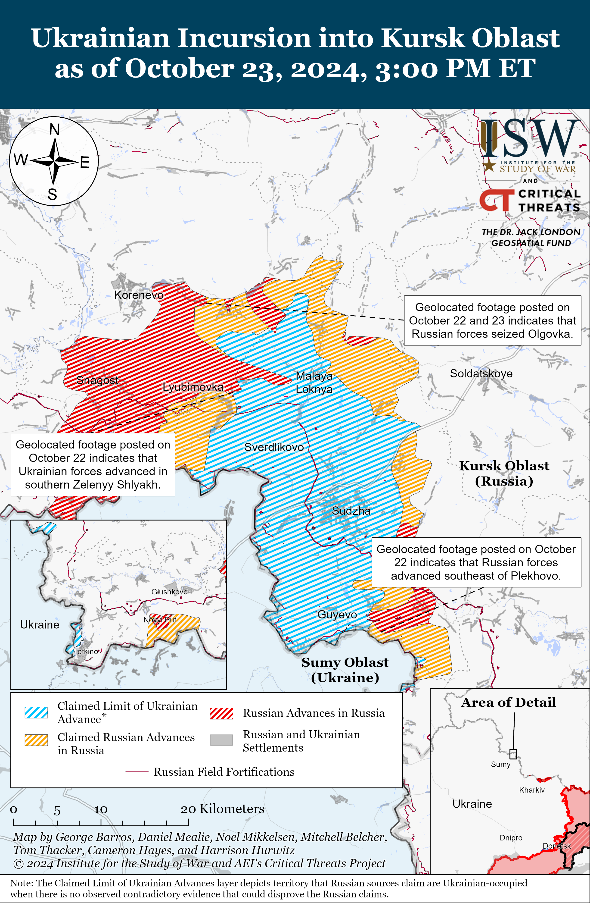
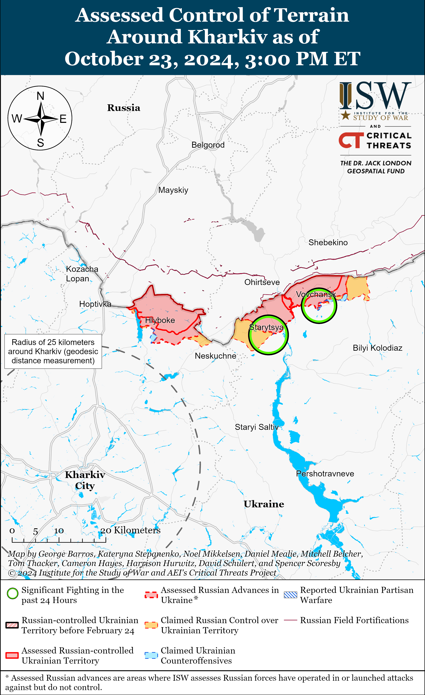
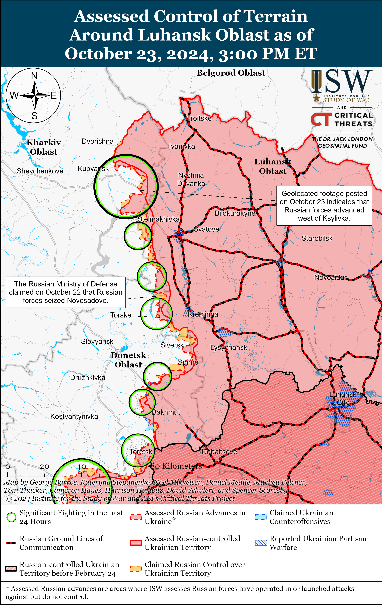
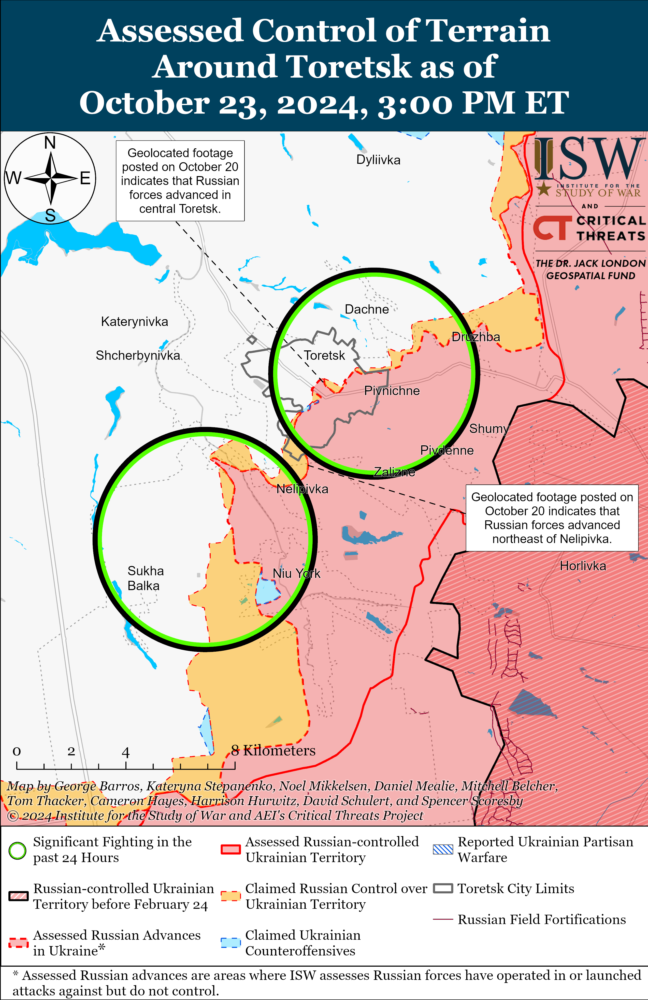
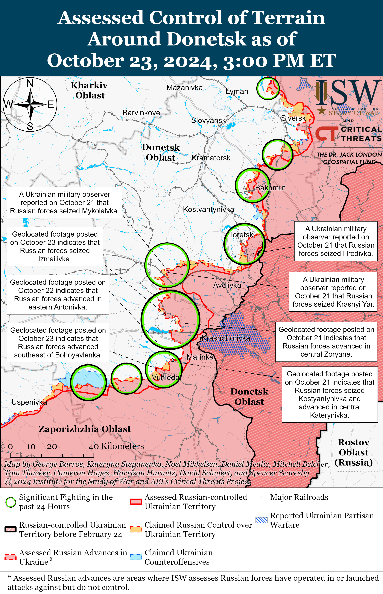
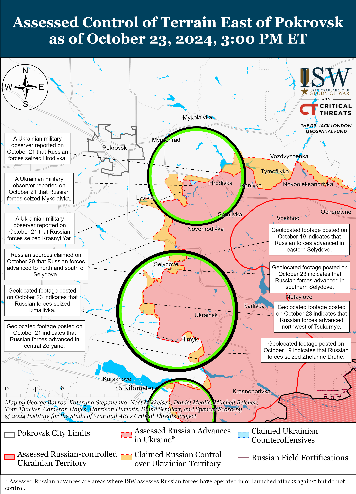
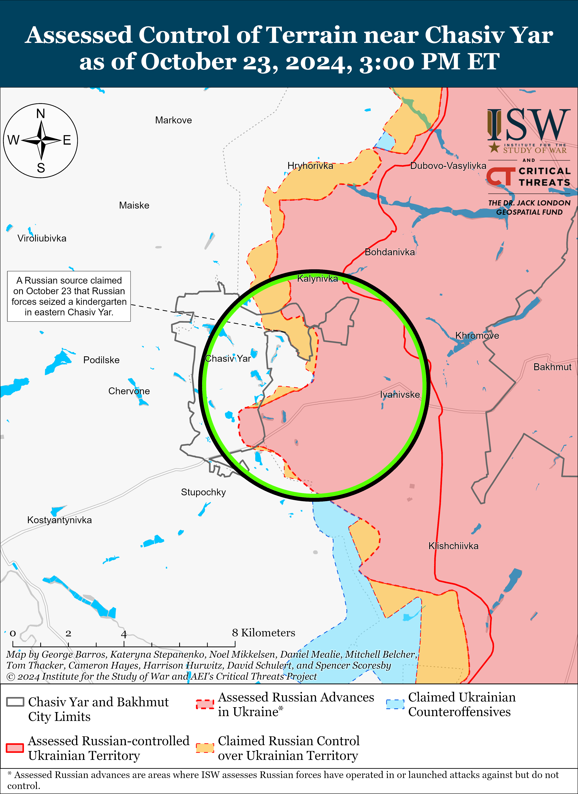
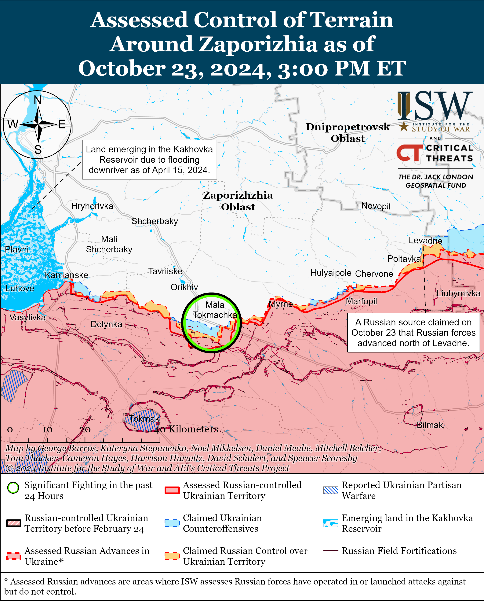
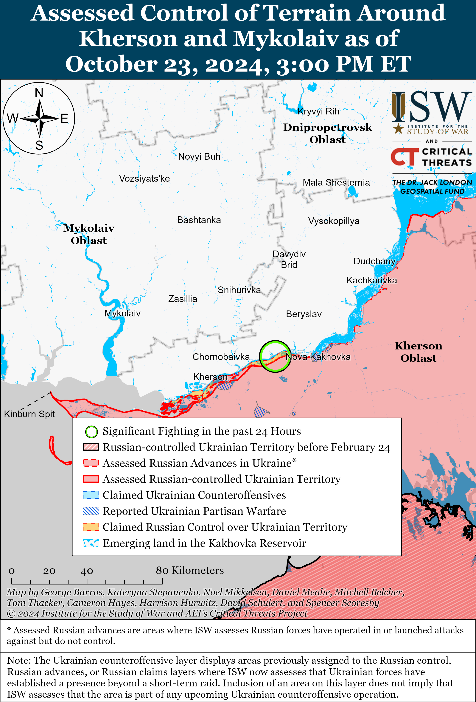

# Russian Offensive Campaign Assessment, October 23, 2024

**October 23, 2024, 7:45pm ET**

**Click** [**here**](https://www.understandingwar.org/backgrounder/interactive-map-portfolio) **to view ISW's portfolio of Russia-Ukraine interactive maps, including our control-of-terrain in Ukraine map, 3D control-of-terrain topographic map, and timelapse maps of the Russian invasion of Ukraine.**

**Note: The data cut-off for this product was 1:30pm ET on October 23. ISW will cover subsequent reports in the October 24 Russian Offensive Campaign Assessment.**

**The adoption of the Kazan Declaration on the second day of the BRICS summit in Kazan, Republic of Tatarstan on October 23 demonstrated that Russia has not yet secured the international support nor created the alternative security structure that the Kremlin desires.** The Kazan Declaration notably only mentioned Russia's war in Ukraine once.[[1]](#_edn3725ced9a7a54a13a62b10b7f29ef05f1) The declaration states that all signatories should act in accordance with the principles of the UN Charter — including the provision on respect for territorial integrity — and that BRICS states welcome "relevant" offers of mediation aimed at ensuring a peaceful settlement of the war through dialogue and diplomacy. Ukraine has emphasized that the "principles of the UN Charter" is a main avenue through which Ukraine can achieve peace and highlighted the illegality of Russia's war under international law.[[2]](#_edn3725ced9a7a54a13a62b10b7f29ef05f2) The Ukrainian Ministry of Foreign Affairs (MFA) responded to the Kazan Declaration, stating that it shows that Russia failed to "export" its views on changing the world order and global security architecture to BRICS summit participant states.[[3]](#_edn3725ced9a7a54a13a62b10b7f29ef05f3) The Ukrainian MFA stated that the declaration also demonstrates that BRICS states are not unified around Russia's war against Ukraine, likely since many of these countries support the UN Charter's principles. Ukraine's Foreign Intelligence Service similarly assessed that the BRICS summit will not result in the international community's approval of an alternative system of international settlements that Russia wants and stated that India, the United Arab Emirates (UAE), Brazil, and South Africa opposed the transformation of BRICS into an anti-US coalition.[[4]](#_edn3725ced9a7a54a13a62b10b7f29ef05f4)

**People’s Republic of China (PRC) President Xi Jinping reiterated the PRC’s longstanding position calling for de-escalation in Russia’s war in Ukraine and discouraged the involvement of third parties in the war amid reports of Russia preparing to deploy North Korean troops to Ukraine.** Xi emphasized the need to promote “a rapid de-escalation" of Russia’s war in Ukraine and avoid “adding fuel to the fire” during the 16th annual BRICS summit in Kazan on October 23.[[5]](#_edn3725ced9a7a54a13a62b10b7f29ef05f5) Xi also stated that BRICS members must prevent the spreading of the war to “third parties” and avoid the escalation of hostilities. Xi stated that the PRC, Brazil and countries of the Global South created a group of “Friends of Peace,” which aims to unite voices in support of a peaceful resolution of Russia’s war in Ukraine.[[6]](#_edn3725ced9a7a54a13a62b10b7f29ef05f6) Xi had previously called for de-escalation of the war and attempted to position the PRC as an impartial third-party mediator for a negotiated peace settlement between Russia and Ukraine.[[7]](#_edn3725ced9a7a54a13a62b10b7f29ef05f7) Russia has been increasingly leveraging partnerships with North Korea and Iran, and Ukrainian President Volodymyr Zelensky has accused Russia of directly involving North Korea in the war amid reports of North Korean combat forces training in Russia for possible participation in the war.[[8]](#_edn3725ced9a7a54a13a62b10b7f29ef05f8)

**Iranian President Masoud Pezeshkian reiterated Iran’s intentions to increase ties with Russia and the People’s Republic of China (PRC) at the BRICS Summit in Kazan, Russia, on October 23.[[9]](#_edn3725ced9a7a54a13a62b10b7f29ef05f9) *NOTE: This text also appears in ISW-CTP's October 23 Iran Update.*** Pezeshkian met with Russian President Vladimir Putin to discuss Russo-Iranian economic and strategic relations on the sidelines of the summit.[[10]](#_edn3725ced9a7a54a13a62b10b7f29ef05f10) Pezeshkian stated that the two officials will finalize and sign memorandums soon, suggesting that both states will sign the new comprehensive strategic partnership agreement.[[11]](#_edn3725ced9a7a54a13a62b10b7f29ef05f11) Putin authorized the signing of the deal on September 18.[[12]](#_edn3725ced9a7a54a13a62b10b7f29ef05f12) It is in Iran’s interests to have a formalized agreement with Russia. Iran presumably will seek greater international support as Israel’s ground and air offensives on the Gaza Strip and Lebanon have disrupted some elements of Iran’s proxy network. This disruption is particularly notable given that Hezbollah’s capabilities — which now appear degraded by Israeli action at a minimum — have long served as Iran’s principal deterrence against Israeli attack.[[13]](#_edn3725ced9a7a54a13a62b10b7f29ef05f13) Russia has discouraged Israeli attack on nuclear facilities, demonstrating the advantages of strong Iranian relations with Russia.[[14]](#_edn3725ced9a7a54a13a62b10b7f29ef05f14) The Pezeshkian administration’s policy continues former President Ebrahim Raisi’s "neighborhood policy.” This policy is centered on building relations with regional and extra-regional states, thus demonstrating the administration’s efforts to mitigate the impact of international sanctions and bolster the Iranian economy. The Iranian regime calculates that mitigating the impact of sanctions increases domestic stability and regime credibility.[[15]](#_edn3725ced9a7a54a13a62b10b7f29ef05f15) Russo-Iranian cooperation has accelerated since the start of Russia’s offensive campaign in Ukraine due to Iran’s military support in the war.

**Russian forces have made significant tactical advances into and around Selydove in recent days, but the Russian military command's apparent focus on securing Selydove has come at the expense of Russian forces' ability to sustain a meaningful offensive drive directly on Pokrovsk — Russia's self-defined operational objective on this sector of the front.** Geolocated footage published on October 22 and 23 shows that Russian forces have advanced along Skhidna Street in northeastern Selydove and northward along Berehova and Zakhysnykiv streets in eastern Selydove towards the center of the town.[[16]](#_edn3725ced9a7a54a13a62b10b7f29ef05f16) Geolocated footage published on October 23 also shows that elements of the Russian 114th Motorized Rifle Brigade (51st Combined Arms Army [CAA], formerly 1st Donetsk People's Republic Army Corps [DNR AC]) seized Izmailivka (southeast of Selydove), and additional geolocated footage published on October 23 indicates that Russian forces also advanced on the northeastern outskirts of Novoselydivka (west of Izmailivka and south of Selydove) and in fields northwest of Tsukuryne (also south of Selydove but north of the Izmailivka-Novoselydivka area).[[17]](#_edn3725ced9a7a54a13a62b10b7f29ef05f17) Russian sources widely claimed that Russian forces advanced into northern Selydove, reached the outskirts of Vyshneve (west of Selydove) via the C05091 road by pushing northwestward from Tsukuryne, and made territorial gains in Hirnyk (southeast of Selydove), although ISW has not yet observed confirmation of these claims.[[18]](#_edn3725ced9a7a54a13a62b10b7f29ef05f18)

Russian advances into Selydove, as well as territorial gains to the south and north of the town, may soon cause Ukrainian troops to withdraw from the area to avoid being trapped within a collapsing pocket. Ukrainian forces appear to have committed to a robust defense of Selydove, however, and have largely delayed Russian advances since Russian forces first began attacking into the settlement around August 2024.[[19]](#_edn3725ced9a7a54a13a62b10b7f29ef05f19) Selydove is not Russia's operational objective on this part of the front, notably, and Ukraine's decision to defend the settlement has likely fixed a relatively large contingent of Russian troops on the southern flank of Pokrovsk — which is Russia's primary, and operationally meaningful, objective in the area.[[20]](#_edn3725ced9a7a54a13a62b10b7f29ef05f20) Ukrainian military observer Kostyantyn Mashovets identified this dynamic on October 21, noting that the Russian command in the Pokrovsk direction is now facing several more localized "problems" that do not directly lend themselves to the Russian seizure of Pokrovsk.[[21]](#_edn3725ced9a7a54a13a62b10b7f29ef05f21) Mashovets emphasized that while a large number of Russian forces have been committed to the entire Pokrovsk front, a large contingent of 2nd Combined Arms Army (CAA) (Central Military District [CMD]) and 90th Tank Division (41st CAA, CMD) units are involved in trying to seize Selydove, as opposed to developing attacks on Pokrovsk.[[22]](#_edn3725ced9a7a54a13a62b10b7f29ef05f22) Mashovets concluded that the Russian command created a large operational reserve for Russian forces to attack Pokrovsk and Myrnohrad, but that these forces got bogged down in attacks on Selydove and the southern flank of Pokrovsk, which the Russian command had hoped to capture rapidly.[[23]](#_edn3725ced9a7a54a13a62b10b7f29ef05f23) A Russian milblogger and former Storm-Z instructor largely agreed with Mashovets' analysis, noting that despite the widely understood value of a Russian seizure of Pokrovsk, "the process is stalling."[[24]](#_edn3725ced9a7a54a13a62b10b7f29ef05f24) The milblogger stated that the Russian command's fixation on the southern flank of Pokrovsk has led to a "spreading of forces and resources" that has resulted in "excessive" Russian infantry losses and afforded Ukrainian troops additional time to further fortify Pokrovsk itself.

Russia may well take Selydove in the coming days, but the capture of Selydove does not inherently portend the seizure of Pokrovsk, and, in fact, the seizure of Selydove is likely to have exhausted and attrited Russian forces in a way that will likely reduce their combat effectiveness if they are ordered to pivot towards Pokrovsk. The Ukrainian defense of Pokrovsk and its approaches (namely the rail-line and the M-30 highway) has already stymied Russian advances towards the city, and attrition of Russian forces in the area will likely further slow these advances, damaging Russian offensive prospects in the area in the coming weeks.[[25]](#_edn3725ced9a7a54a13a62b10b7f29ef05f25)

**The Pentagon and White House confirmed the deployment of North Korean troops to Russia.** US Secretary of Defense Lloyd Austin reported on October 23 that the US government has evidence that there are North Korean troops in Russia but that it is unclear what they are doing.[[26]](#_edn3725ced9a7a54a13a62b10b7f29ef05f26) National Security Council Spokesperson John Kirby also stated on October 23 that North Korea deployed at least 3,000 personnel to Vladivostok, Primorsky Krai between early to mid-October but that it is unclear if these forces will enter combat alongside Russian forces.[[27]](#_edn3725ced9a7a54a13a62b10b7f29ef05f27) Ukrainian President Volodymyr Zelensky stated on October 22 that potentially two "brigades" of 6,000 North Korean personnel each (larger that the doctrinal endstrength of a typical brigade) are training in Russia.[[28]](#_edn3725ced9a7a54a13a62b10b7f29ef05f28) South Korea's *Yonhap News Agency* reported on October 23 that South Korea's National Intelligence Service (NIS) stated during a closed-door parliamentary intelligence committee meeting that North Korea has sent 3,000 troops to Russia so far to support Russia's war in Ukraine and will send a total of 10,000 by December 2024.[[29]](#_edn3725ced9a7a54a13a62b10b7f29ef05f29) *Yonhap News Agency* also reported that a NIS assessment stated that North Korean munitions factories that produce weapons that North Korea has shipped to Russia are operating at "full capacity."[[30]](#_edn3725ced9a7a54a13a62b10b7f29ef05f30) ISW will discuss the development of Russia-North Korea relations and assess the implications of recent North Korean troops deployments on the security situation both in Ukraine and on the Korean Peninsula in a forthcoming special edition.

**Russia and Belarus announced plans to conduct the “Zapad-2025” command staff exercise on an unspecified date in 2025 against the backdrop of deepening Russian-Belarusian security integration within the Union State framework.** Russian Defense Minister Andrei Belousov and Belarusian Defense Minister Lieutenant General Viktor Khrenin approved the plan for the Zapad-2025 exercises on October 23 during Belousov’s visit to Minsk.[[31]](#_edn3725ced9a7a54a13a62b10b7f29ef05f31) Khrenin announced that the Russian and Belarusian general staffs had already begun preparations for Zapad-2025 exercises and stated that these exercises will help to improve the combat readiness of the regional grouping of forces and the ability of Russian and Belarusian forces to jointly fulfill their tasks.[[32]](#_edn3725ced9a7a54a13a62b10b7f29ef05f32) Belousov noted that Russian and Belarusian forces will practice tasks that take into account "modern threats to Russia and Belarus,' including experiences from Russia’s full-scale invasion of Ukraine.[[33]](#_edn3725ced9a7a54a13a62b10b7f29ef05f33) Belousov and Khrenin also approved the Union State military security Work Plan for 2025 and 2027, emphasized the continuation of Russian-Belarusian cooperation in military-technical sphere, and reiterated that Moscow and Minsk are completing preparations for a new security concept under the Union State framework.[[34]](#_edn3725ced9a7a54a13a62b10b7f29ef05f34)  The last Zapad exercises — which have historically occurred once every four years — took place in September 2021, and the Russian Ministry of Defense (MoD) notably cancelled the planned 'Zapad-2023' exercises scheduled for September 2023.[[35]](#_edn3725ced9a7a54a13a62b10b7f29ef05f35) ISW will discuss the development and implications of the Union State security, economic, and societal integration in an upcoming report.

**Key Takeaways:**

- **The adoption of the Kazan Declaration on the second day of the BRICS summit in Kazan, Republic of Tatarstan on October 23 demonstrated that Russia has not yet secured the international support nor created the alternative security structure that the Kremlin desires.**
- **People’s Republic of China (PRC) President Xi Jinping reiterated the PRC’s longstanding position calling for de-escalation in Russia’s war in Ukraine and discouraged the involvement of third parties in the war amid reports of Russia preparing to deploy North Korean troops to Ukraine.**
- **Iranian President Masoud Pezeshkian reiterated Iran’s intentions to increase ties with Russia and the People’s Republic of China (PRC) at the BRICS Summit in Kazan, Russia, on October 23.**
- **Russian forces have made significant tactical advances into and around Selydove in recent days, but the Russian military command's apparent focus on securing Selydove has come at the expense of Russian forces' ability to sustain a meaningful offensive drive directly on Pokrovsk — Russia's self-defined operational objective on this sector of the front.**
- **The Pentagon and White House confirmed the deployment of North Korean troops to Russia.**
- **Russia and Belarus announced plans to conduct the “Zapad-2025” command staff exercise on an unspecified date in 2025 against the backdrop of deepening Russian-Belarusian security integration within the Union State framework.**
- **Ukrainian and Russian forces recently advanced in Kursk Oblast.**
- **Russian forces recently advanced near Kupyansk, Pokrovsk, and Vuhledar.**
- **The Russian military is reportedly coercing Russian conscripts into contract service in the Russian military by issuing enlistment bonuses to conscripts who never signed military service contracts with the Russian Ministry of Defense (MoD).**

****

***We do not report in detail on Russian war crimes because these activities are well-covered in Western media and do not directly affect the military operations we are assessing and forecasting. We will continue to evaluate and report on the effects of these criminal activities on the Ukrainian military and the Ukrainian population and specifically on combat in Ukrainian urban areas. We utterly condemn Russian violations of the laws of armed conflict and the Geneva Conventions and crimes against humanity even though we do not describe them in these reports.***

- Ukrainian Operations in the Russian Federation
- Russian Main Effort — Eastern Ukraine (comprised of three subordinate main efforts)
- Russian Subordinate Main Effort #1 — Push Ukrainian forces back from the international border with Belgorod Oblast and approach to within tube artillery range of Kharkiv City
- Russian Subordinate Main Effort #2 — Capture the remainder of Luhansk Oblast and push westward into eastern Kharkiv Oblast and encircle northern Donetsk Oblast
- Russian Subordinate Main Effort #3 — Capture the entirety of Donetsk Oblast
- Russian Supporting Effort — Southern Axis
- Russian Air, Missile, and Drone Campaign
- Russian Mobilization and Force Generation Efforts
- Russian Technological Adaptations
- Activities in Russian-occupied areas
- Significant Activity in Belarus

**Ukrainian Operations in the Russian Federation**

Ukrainian and Russian forces recently advanced in the main Ukrainian salient in Kursk Oblast amid continued fighting on October 23. Geolocated footage published on October 22 indicates that Ukrainian forces recently advanced in southern Zeleny Shlyakh (southeast of Korenevo).[[36]](#_edn3725ced9a7a54a13a62b10b7f29ef05f36) Russian sources claimed that Russian forces repelled a Ukrainian mechanized assault on Zeleny Shlyakh on October 22.[[37]](#_edn3725ced9a7a54a13a62b10b7f29ef05f37) Geolocated footage published on October 22 and 23 indicates that Russian forces recently recaptured Olgovka (east of Korenevo) and regained positions southeast of Plekhovo (southeast of Sudzha).[[38]](#_edn3725ced9a7a54a13a62b10b7f29ef05f38) Russian sources, including the Russian Ministry of Defense (MoD), claimed that Ukrainian forces unsuccessfully counterattacked near Plekhovo, Malaya Lokyna (north of Sudzha), Sudzha, Pokrovsky (southeast of Korenevo), and Zeleny Shlyakh.[[39]](#_edn3725ced9a7a54a13a62b10b7f29ef05f39) Elements of the Russian 155th Naval Infantry Brigade (Pacific Fleet, Eastern Military District [EMD]) and "Kamerton" detachment (Chechen "Akhmat" Spetsnaz) are reportedly operating near Sudzha; elements of the 11th Airborne (VDV) Brigade are reportedly operating near Cherkasskaya Konopelka (east of Sudzha); elements of the 810th Naval Infantry Brigade (Black Sea Fleet, Southern Military District [SMD]) are reportedly operating near Malaya Loknya; elements of the 106th VDV Division and 1434th "Akhmat-Chechnya" Regiment (likely a mobilized regiment) are reportedly operating near Lyubimovka (southeast of Korenevo); and elements of the "Kashtan" detachment (Chechen "Akhmat" Spetsnaz) and 76th VDV Division are reportedly operating in Kursk Oblast.[[40]](#_edn3725ced9a7a54a13a62b10b7f29ef05f40)

Neither Ukrainian nor Russian sources reported ground attacks west of the main Kursk Oblast salient in Glushkovsky Raion on October 23. Elements of the 56th VDV Regiment (7th VDV Division) are reportedly operating near Novy Put (southwest of Glushkovo).[[41]](#_edn3725ced9a7a54a13a62b10b7f29ef05f41)

Chechen Akhmat Spetsnaz Commander Apty Alaudinov acknowledged on October 23 that Russian forces have committed at least 187 confirmed crimes, including murder and rape, since Russian forces deployed to defend Kursk Oblast but claimed that Chechen Akhmat forces were not responsible.[[42]](#_edn3725ced9a7a54a13a62b10b7f29ef05f42)

Recent Ukrainian strikes against Russian ammunition depots may be reducing the ratio between Russian and Ukrainian artillery fires across the frontline. Ukrainian outlet *RBK-Ukraine* reported on October 23 that Ukrainian First Deputy Defense Minister Lieutenant General Ivan Havrylyuk stated that the ratio between Russian and Ukrainian artillery fires is now about one-to-two in favor of Russian forces — a significant reduction from one-to-seven or one-to-eight in early 2024 and from one-to-three at the start of Summer 2024.[[43]](#_edn3725ced9a7a54a13a62b10b7f29ef05f43) Havrylyuk attributed this reduction to Ukrainian strikes on Russian ammunition depots and to Ukraine's qualitatively superior Western artillery systems. Ukrainian forces notably struck the Oktyabrskii and Toropets ammunition depots in Tver Oblast and the Tikhoretsk ammunition depot in Krasnodar Krai in September 2024.[[44]](#_edn3725ced9a7a54a13a62b10b7f29ef05f44)

**Russian Main Effort — Eastern Ukraine**

**Russian Subordinate Main Effort #1 — Kharkiv Oblast** **(Russian objective: Push Ukrainian forces back from the international border with Belgorod Oblast and approach to within tube artillery range of Kharkiv City.**

Russian forces continued limited offensive operations in northern Kharkiv Oblast on October 23 but did not make any confirmed advances. Ukrainian sources stated that Russian forces conducted unsuccessful offensive operations northeast of Kharkiv City near Vovchansk and Starytsya (southwest of Vovchansk) on October 22 and 23.[[45]](#_edn3725ced9a7a54a13a62b10b7f29ef05f45) The spokesperson of a Ukrainian brigade operating in the Kharkiv direction stated on October 23 that the Russian military is replacing personnel in this direction with newly recruited contract soldiers, many of whom are convict recruits, instead of transferring personnel from other areas of the frontline to this direction.[[46]](#_edn3725ced9a7a54a13a62b10b7f29ef05f46) A Ukrainian officer operating in the Kharkiv direction stated on October 23 that Russian forces began conducting infantry-led assaults in small groups near Vovchansk.[[47]](#_edn3725ced9a7a54a13a62b10b7f29ef05f47)

**Russian Subordinate Main Effort #2 — Luhansk Oblast (Russian objective: Capture the remainder of Luhansk Oblast and push westward into eastern Kharkiv Oblast and northern Donetsk Oblast)**

Russian forces recently advanced in the Kupyansk direction amid continued Russian offensive operations along the Kupyansk-Svatove-Kreminna line. Geolocated footage published on October 23 indicates that Russian forces advanced westward along the N-26 highway west of Kyslivka (southeast of Kupyansk).[[48]](#_edn3725ced9a7a54a13a62b10b7f29ef05f48) The Russian Ministry of Defense (MoD) claimed on October 23 that Russian forces, including elements of the 7th Motorized Rifle Brigade (3rd Combined Arms Army [CAA], formerly 2nd Luhansk People's Republic [LNR] Army Corps [AC]), seized Serebryanka (southwest of Kreminna).[[49]](#_edn3725ced9a7a54a13a62b10b7f29ef05f49) A Russian milblogger denied the claim, however.[[50]](#_edn3725ced9a7a54a13a62b10b7f29ef05f50) Russian sources claimed that Russian forces advanced near Stelmakhivka (southeast of Kupyansk) and pushed Ukrainian forces up to 10 kilometers from the settlement, although ISW has not observed Russian advances 10 kilometers directly west of Stelmakhivka.[[51]](#_edn3725ced9a7a54a13a62b10b7f29ef05f51) Russian forces continued offensive operations north of Kupyansk near Holubivka; east of Kupyansk near Petropavlivka; northwest of Svatove near Pishchane, Kruhlyakivka, Stepova Novoselivka, Lozova, and Kolisnykivka; east of Svatove near Vyshene; northwest of Kreminna near Hrekivka and Novomykhailivka; and west of Kreminna near Terny and Torske.[[52]](#_edn3725ced9a7a54a13a62b10b7f29ef05f52) Ukrainian military observer Kostyantyn Mashovets stated on October 23 that Russian forces are frequently conducting platoon-sized to reduced company-sized mechanized assaults in the Kupyansk direction.[[53]](#_edn3725ced9a7a54a13a62b10b7f29ef05f53) Mashovets also stated that Russian units operating in the Kupyansk direction have deployed eight to 10 tactical missile systems, including Iskander systems, to the area.[[54]](#_edn3725ced9a7a54a13a62b10b7f29ef05f54) Mashovets stated that elements of the Russian 2nd Motorized Rifle Division, 4th Tank Division, 47th Tank Division, and 27th Motorized Rifle Brigade (both of the 1st Guards Tank Army, Moscow Military District [MMD]) are operating in the Krokhmalne-Hlushkivka direction.[[55]](#_edn3725ced9a7a54a13a62b10b7f29ef05f55) Mashovets stated that elements of the Russian 69th Motorized Rifle Division (6th CAA, Leningrad Military District [LMD]) and BARS-9 Detachment (Russian Combat Army Reserve) are operating in the Kupyansk direction.[[56]](#_edn3725ced9a7a54a13a62b10b7f29ef05f56)

  
 **Russian Subordinate Main Effort #3 — Donetsk Oblast (Russian objective: Capture the entirety of Donetsk Oblast, the claimed territory of Russia’s proxies in Donbas)**

The Ukrainian General Staff reported that Russian forces reportedly unsuccessfully attacked near Bondarne (southwest of Siversk and northeast of Chasiv Yar) on October 22.[[57]](#_edn3725ced9a7a54a13a62b10b7f29ef05f57) Artillery elements of the Russian 85th Separate Motorized Rifle Brigade (3rd Combined Arms Army [CAA], formerly 2nd Luhansk People's Republic Army Corps [LNR AC], Southern Military District [SMD]) reportedly continued to operate in the Siversk direction.[[58]](#_edn3725ced9a7a54a13a62b10b7f29ef05f58)

Russian sources claimed that Russian forces recently advanced in the Chasiv Yar direction, but ISW has not yet observed visual confirmation of these claims. Russian sources made unconfirmed claims that Russian forces advanced in northeastern and eastern Chasiv Yar.[[59]](#_edn3725ced9a7a54a13a62b10b7f29ef05f59) Ukrainian Luhansk Group of Forces Spokesperson Major Anastasiya Bobovnikova reported that some Russian assault groups occasionally cross the Siverskyi-Donets Donbas Canal but have not broken through Ukrainian defenses west of the canal.[[60]](#_edn3725ced9a7a54a13a62b10b7f29ef05f60) Bobovnikova added that Russian forces are unable to transfer vehicles across the canal because Ukrainian artillery and drone strikes are preventing the construction of pontoon crossings. Russian forces continued to attack northeast of Chasiv Yar near Hryhorivka.[[61]](#_edn3725ced9a7a54a13a62b10b7f29ef05f61) A Russian milblogger affiliated with the Russian Airborne (VDV) Forces claimed that Ukrainian forces are using first person view (FPV) drones to strike Russian military equipment as far as Pokrovske (about 27km east of Chasiv Yar) to interdict Russian ground lines of communications to Bakhmut.[[62]](#_edn3725ced9a7a54a13a62b10b7f29ef05f62) The milblogger added that it is too premature to talk about a Russian breakthrough in Chasiv Yar. Elements of the Russian 98th VDV Division’s 217th and 331st VDV regiments are reportedly operating in northeastern Chasiv Yar and near Stupky Holubovski 2 (a forest area southeast of Chasiv Yar), respectively.[[63]](#_edn3725ced9a7a54a13a62b10b7f29ef05f63) Elements of the 5th Anti-Aircraft Missile Regiment (98th VDV Division) and 88th 'Hispaniola' Volunteer Brigade and Sever-V Brigade (both of the Russian Volunteer Corps) are reportedly operating in the Chasiv Yar direction.[[64]](#_edn3725ced9a7a54a13a62b10b7f29ef05f64) Elements of the Russian 200th Motorized Rifle Brigade (14th AC, Leningrad Military District [LMD]) and other unspecified elements of the Russian Volunteer Corps are reportedly operating north of Chasiv Yar; and elements of the 4th Separate Motorized Rifle Brigade (3rd CAA) are operating south of Chasiv Yar.[[65]](#_edn3725ced9a7a54a13a62b10b7f29ef05f65)

Russian forces continued offensive operations in the Toretsk direction on October 23 but did not make confirmed advances. A Russian milblogger claimed that Russian forces advanced in southern Shcherbynivka (west of Toretsk), but ISW has not observed visual confirmation of this claim.[[66]](#_edn3725ced9a7a54a13a62b10b7f29ef05f66) Russian forces reportedly continued to attack within Toretsk and southwest of Toretsk near Nelipivka on October 22 and 23.[[67]](#_edn3725ced9a7a54a13a62b10b7f29ef05f67) A Ukrainian special purpose brigade reported that Russian forces launch hourly assaults on the outskirts of Niu York (south of Toretsk) but that the Ukrainian brigade was recently able to stabilize the frontline and slow the pace of Russian advances in the area.[[68]](#_edn3725ced9a7a54a13a62b10b7f29ef05f68) Elements of the Russian 51st CAA’s (formerly 1st Donetsk People's Republic [DNR] AC) 1st 'Slavic' Brigade and 132nd Motorized Rifle Brigade are reportedly operating near Toretsk.[[69]](#_edn3725ced9a7a54a13a62b10b7f29ef05f69) Elements of the 9th Motorized Rifle Brigade (51st CAA) are reportedly operating near Shcherbynivka.[[70]](#_edn3725ced9a7a54a13a62b10b7f29ef05f70)

  

*Please see topline text about Russian advances in the Pokrovsk direction.*

Russian forces continued assaults in the Kurakhove direction on October 23 but did not make confirmed advances. Russian forces reportedly attacked southeast of Kurakhove near Hostre and Dalne.[[71]](#_edn3725ced9a7a54a13a62b10b7f29ef05f71) Elements of the Russian 102nd Motorized Rifle Regiment (150th Motorized Rifle Division, 8th CAA, SMD) are reportedly operating near Maksymilyanivka (east of Kurakhove); an element of a reconnaissance battalion of the 238th Artillery Brigade (8th CAA) is reportedly operating near Dalne alongside elements of the 20th Guards Motorized Rifle Division (8th CAA) and 5th Motorized Rifle Brigade (51st CAA).[[72]](#_edn3725ced9a7a54a13a62b10b7f29ef05f72)

Russian forces recently advanced southwest of Donetsk City near Vuhledar amid continued Russian offensive operations in the area on October 23. Geolocated footage published on October 23 showed that Russian forces advanced in the fields southeast of Bohoyavlenka (west of Vuhledar), and Russian sources claimed that Russian forces made additional advances in the fields southeast of Bohoyavlenka.[[73]](#_edn3725ced9a7a54a13a62b10b7f29ef05f73) Russian forces continued offensive operations northeast of Vuhledar near Antonivka and Katerynivka;  northwest of Vuhledar near Bohoyavlenka and Novoukrainka; and west of Vuhledar near Zolota Nyva on October 22 and 23.[[74]](#_edn3725ced9a7a54a13a62b10b7f29ef05f74) A Russian milblogger claimed that elements of the Russian 33rd Motorized Rifle Regiment (20th Guards Motorized Rifle Division, 8th CAA) are operating near Antonivka.[[75]](#_edn3725ced9a7a54a13a62b10b7f29ef05f75)

Russian forces continued offensive operations in the Donetsk-Zaporizhia Oblast border area on October 22 and 23 but did not make confirmed advances. Russian milbloggers claimed that Russian forces advanced in the fields north of Levadne (southwest of Velyka Novosilka) and west of Staromayorske (south of Velyka Novosilka).[[76]](#_edn3725ced9a7a54a13a62b10b7f29ef05f76) The Ukrainian General Staff reported on October 22 and 23 that Russian forces attacked near Velyka Novosilka.[[77]](#_edn3725ced9a7a54a13a62b10b7f29ef05f77)

**Russian Supporting Effort — Southern Axis (Russian objective: Maintain frontline positions and secure rear areas against Ukrainian strikes)**

Russian forces continued assaults in western Zaporizhia Oblast near Robotyne and northeast of Robotyne near Mala Tokmachka and Novodanylivka on October 22 and 23, but there were no confirmed changes to the frontline.[[78]](#_edn3725ced9a7a54a13a62b10b7f29ef05f78)  Drone operators of the Russian 7th Guards Mountain Air Assault (VDV) Division are reportedly operating in the Zaporizhia direction, and elements of the Russian "Smuglyanka" detachment are reportedly operating near Mala Tokmachka.[[79]](#_edn3725ced9a7a54a13a62b10b7f29ef05f79)

Zaporizhia Oblast occupation head Yevgeny Balitsky claimed on October 23 that over 20 Ukrainian drones struck civilian infrastructure near Enerhodar and an administrative building in Vasylivka (east of Enerhodar) and cut off electricity to 13 nearby settlements. ISW cannot independently confirm this claim, however.[[80]](#_edn3725ced9a7a54a13a62b10b7f29ef05f80)

Russian forces continued attacks in east (left) bank Kherson Oblast on October 22 and 23 but did not make any confirmed advances.[[81]](#_edn3725ced9a7a54a13a62b10b7f29ef05f81) A Russian milblogger claimed on October 23 that Russian and Ukrainian mining efforts in the Kherson direction are limiting the number of safe Russian ground lines of communication (GLOCs) and preventing the effective delivery of ammunition and food to Russian soldiers in the Kherson direction.[[82]](#_edn3725ced9a7a54a13a62b10b7f29ef05f82) The Russian milblogger also claimed that Russian forces need naval drones in the Kherson direction to detect mines in remotely mined areas in the Dnipro River Delta area and that the naval drone deficit is causing Russian soldiers to make their own naval drones. Drone operators of the Russian 24th Motorized Rifle Regiment (70th Motorized Rifle Division, 18th Combined Arms Army [CAA], Southern Military District [SMD]) are reportedly operating near Kherson City.[[83]](#_edn3725ced9a7a54a13a62b10b7f29ef05f83) Drone operators and other elements of the Russian BARS-33 Detachment (Russian Combat Army Reserve) and drone operators of the Russian 104th VDV Regiment’s (76th VDV Division) 4th Company are reportedly operating in the Kherson direction.[[84]](#_edn3725ced9a7a54a13a62b10b7f29ef05f84)

The Russian Ministry of Defense (MOD) claimed on October 23 that Russian forces destroyed 10 Ukrainian drones over occupied Crimea and four naval drones in the Black Sea heading towards occupied Crimea.[[85]](#_edn3725ced9a7a54a13a62b10b7f29ef05f85)

 

**Russian Air, Missile, and Drone Campaign (Russian Objective: Target Ukrainian military and civilian infrastructure in the rear and on the frontline)**

Russian forces conducted a large series of drone strikes against Ukraine on the night of October 22 to 23, using Shahed-136/131s and other unspecified drone models. The Ukrainian Air Force reported that Russian forces launched 81 strike drones from Kursk Oblast and Primorsko-Akhtarsk, Krasnodar Krai and one Kh-31P guided missile from over the Black Sea towards Odesa Oblast.[[86]](#_edn3725ced9a7a54a13a62b10b7f29ef05f86) The Ukrainian Air Force reported that as of 0900 local time on October 23 Ukrainian forces had shot down 57 drones over Odesa, Mykolaiv, Vinnytsia, Sumy, Cherkasy, Khmelnytskyi, Ternopil, Kirovohrad, Kyiv, Poltava, Chernihiv and Kharkiv oblasts, that 15 drones had become "lost," likely due to Ukrainian electronic warfare (EW) interference, and that nine more remained in Ukrainian air space. Cherkasy Oblast sources reported that Russian drones struck civilian and transportation infrastructure in Cherkaskyi, Zolotonoskyi, and Umanskyi raions, including a bus station.[[87]](#_edn3725ced9a7a54a13a62b10b7f29ef05f87) A Russian milblogger claimed that Russian forces struck an airbase in Uman, although ISW has not observed confirmation of this claim.[[88]](#_edn3725ced9a7a54a13a62b10b7f29ef05f88) Ukraine's Southern Operational Command reported that the Kh-31P missile struck Odesa City.[[89]](#_edn3725ced9a7a54a13a62b10b7f29ef05f89) Kyiv Oblast Head Ruslan Kravchenko reported that debris from a damaged drone fell outside of unspecified settlements in Kyiv Oblast but did not cause any significant damage.[[90]](#_edn3725ced9a7a54a13a62b10b7f29ef05f90)

Russian forces appear to be adapting the tactics of their drone strike campaign to overcome Ukrainian anti-drone adaptations. A Russian milblogger highlighted Russia's recent use of "Gerbera" drones in strikes on Sumy Oblast, and another milblogger claimed that Russian forces use Gerbera drones in the first of three waves of drones launched at a specific target.[[91]](#_edn3725ced9a7a54a13a62b10b7f29ef05f91) The milblogger noted that Russian forces use the Gerbera drones, which are made from foam plastic and are indistinguishable from Shaheds on radars, to confuse and distract Ukrainian mobile fire groups by flying in circles at low altitude, while Shahed-type drones follow in the subsequent two waves, taking advantage of gaps in air defense generated by the deployment of the Gerberas.[[92]](#_edn3725ced9a7a54a13a62b10b7f29ef05f92) Ukrainian shoot-down rates of drone strikes remain high (typically well over 50 percent), however, suggesting that Russian forces have not yet adopted this tactic at the scale needed to cause battle-field wide impacts.

Russia is leveraging its domestication of Shahed-type drone production to increase the number of Shahed-type drones it is able employ in strikes against Ukraine. A Ukrainian military research expert told Ukrainian outlet *Suspilne Krym* on October 23 that there are now three types of distinct Shahed-type drones — those marked "M," which represents Iranian production; "I," which represents Russian domestic production with imported Iranian components; and "K," which represents Russian domestic production with domestic components.[[93]](#_edn3725ced9a7a54a13a62b10b7f29ef05f93) The Ukrainian expert noted that the number of Shaheds marked "I" and "K" is now very substantial, indicating that Russia has significantly increased its domestic production of Shahed models. Russia has reportedly learned how to produce drone fuselages and other components, which allowed Russia to launch an estimated 1,334 Shahed drones at Ukraine in the month of September alone.

**Russian Mobilization and Force Generation Efforts (Russian objective: Expand combat power without conducting general mobilization)**

The Russian military is reportedly coercing Russian conscripts into contract service in the Russian military by issuing enlistment bonuses to conscripts who never signed military service contracts with the Russian Ministry of Defense (MoD). Russian opposition outlets reported on October 23 that at least seven conscripts in the 232nd Rocket Artillery Brigade (Central Military District [CMD]) received a one-time direct deposit of 405,000 rubles (about $4,220) from Russian regional authorities under the decree regulating payments to conscripts and contract servicemen, despite not having signed a Russian military service contract.[[94]](#_edn3725ced9a7a54a13a62b10b7f29ef05f94) The Russian authorities have been incentivizing military contract service through large one-time payments (essentially signing bonuses) as part of ongoing crypto-mobilization efforts.[[95]](#_edn3725ced9a7a54a13a62b10b7f29ef05f95) Russian opposition outlets reported that the Russian military prohibited the conscripts from leaving their base to go to a bank to refuse the money transfer and later transferred them to Rostov Oblast.[[96]](#_edn3725ced9a7a54a13a62b10b7f29ef05f96) Russian opposition outlet *SOTA* reported that a man who had never served in the Russian military received a direct deposit of 660,514 rubles (about $6,900) from the Russian MoD even though he had not signed a Russian military service contract.[[97]](#_edn3725ced9a7a54a13a62b10b7f29ef05f97) Russian opposition outlet *Meduza* noted that conscripts in the 90th Tank Division (41st Combined Arms Army, CMD) complained in early October that they had received a one-time direct deposits of 305,000 rubles (about $3,500) from Russian regional authorities for allegedly signing Russian military contracts despite not actually having done so.[[98]](#_edn3725ced9a7a54a13a62b10b7f29ef05f98)

Russian state defense conglomerate Rostec CEO Sergei Chemezov stated on October 23 that Rostec plans to triple the volume of drone deliveries to the Russian military for use in Ukraine by the end of 2024.[[99]](#_edn3725ced9a7a54a13a62b10b7f29ef05f99) Chemezov claimed that Rostec subsidiaries produced four times more drones in 2023 than in 2022 and noted that the widespread drone usage has significantly changed warfighting in only several years.

**Russian Technological Adaptations** **(Russian objective: Introduce technological innovations to optimize systems for use in Ukraine)**

The head of the "Melodiya" Intelligence Center of the Russian 88th "Hispaniola" Volunteer Brigade (Russian Volunteer Corps) claimed on October 23 that Russian forces have started to test drone swarm technology, which allows Russian forces to overcome Ukrainian electronic warfare (EW) systems, near Chasiv Yar.[[100]](#_edn3725ced9a7a54a13a62b10b7f29ef05f100)

**Activities in Russian-occupied areas (Russian objective: Consolidate administrative control of annexed areas; forcibly integrate Ukrainian citizens into Russian sociocultural, economic, military, and governance systems)**

Russia continues to seize and exploit the economic potential of occupied Ukraine to bolster Russia's wartime economy. Donetsk Oblast occupation Minister of Industry and Trade Yevgeny Ponomarenko told Kremlin newswire *TASS* on October 20 that Mariupol occupation authorities plan to transfer the ownership of Mariupol's Azovmash and Azovelectrostal enterprises to Russian state defense conglomerate Rostec in order to resume production at the sites.[[101]](#_edn3725ced9a7a54a13a62b10b7f29ef05f101) Prior to Russia's invasion of Ukraine and the destruction that Russia's occupation of Mariupol has wrought on the city, Azovmash was the largest machine-building plant in all of Ukraine, while Azovelectrostal was a major supplier of steel products.[[102]](#_edn3725ced9a7a54a13a62b10b7f29ef05f102) Both Azovmash and Azovelectrostal suffered damage and lost their production capabilities due to Russia's invasion and occupation of Mariupol.[[103]](#_edn3725ced9a7a54a13a62b10b7f29ef05f103) Rostec will likely inject the enterprises with substantial investments in order to re-start their production of metal and machine parts, which Russia will likely use to support its defense industrial base's production effort to support the war. The seizure and exploitation of Ukrainian enterprises for Russian economic benefit is a critical component of Russia's occupation strategy in Ukraine — Ukrainian Zaporizhia Oblast Head Ivan Fedorov estimated that Russia had seized and transferred nearly 500 Ukrainian enterprises to Russian control as of March 2024.[[104]](#_edn3725ced9a7a54a13a62b10b7f29ef05f104) ISW has previously reported on the ways in which Russian officials and regime-linked actors, as well as the Russia state, have exploited Ukrainian economic assets for personal, military, and financial gain.[[105]](#_edn3725ced9a7a54a13a62b10b7f29ef05f105)

Ukrainian outlet *Suspilne* published an investigation on October 21 detailing Zaporizhia Oblast occupation head Yevgeny Balitsky's role in the illegal deportations of Ukrainian civilians, supporting ISW's long running assessments on Balitsky's admitted use of forced deportation as a punitive measure in occupied Zaporizhia Oblast.[[106]](#_edn3725ced9a7a54a13a62b10b7f29ef05f106) *Suspilne* found that Balitsky first signed a decree in July 2022 legalizing forced deportations within occupied Zaporizhia Oblast, entitled "on measures of responsibility for the commission of certain offences that encroach on public order and public safety." *Suspilne* emphasized that Balitsky has repeatedly positioned himself as an "ideologue" advocating for deportations of anyone who does not display explicitly pro-Russian views. ISW reported in February 2024 that Balitsky openly admitted to overseeing the forcible deportation of individuals who did not support Russia's invasion of Ukraine and assessed at the time that it shows the extent to which Russian occupation authorities are supporting and even promoting such illegal policies.[[107]](#_edn3725ced9a7a54a13a62b10b7f29ef05f107)

**Significant activity in Belarus** **(Russian efforts to increase its military presence in Belarus and further integrate Belarus into Russian-favorable frameworks and Wagner Group activity in Belarus)**

*See topline text.*

**Note: ISW does not receive any classified material from any source, uses only publicly available information, and draws extensively on Russian, Ukrainian, and Western reporting and social media as well as commercially available satellite imagery and other geospatial data as the basis for these reports. References to all sources used are provided in the endnotes of each update.**

---

[[1]](#_edn3725ced9a7a54a13a62b10b7f29ef05fref1) <http://static> dot kremlin.ru/media/events/files/ru/MUCfWDg0QRs3xfMUiCAmF3LEh02OL3Hk.pdf

[[2]](#_edn3725ced9a7a54a13a62b10b7f29ef05fref2) https://isw.pub/UkrWar092524

[[3]](#_edn3725ced9a7a54a13a62b10b7f29ef05fref3) <https://mfa.gov> dot ua/news/komentar-mzs-shchodo-pidsumkovoyi-deklaraciyi-samitu-briks-u-kazani

[[4]](#_edn3725ced9a7a54a13a62b10b7f29ef05fref4) <https://szru.gov> dot ua/news-media/news/lidery-briks-vystupyly-proty-planiv-rf-iz-peretvorennya-obiednannya-na-antyamerykansku-koalitsiyu

[[5]](#_edn3725ced9a7a54a13a62b10b7f29ef05fref5) <https://www.pravda> dot com.ua/eng/news/2024/10/23/7480995/; [https://english.www.gov](https://english.www.gov/) dot cn/news/202410/23/content\_WS6718e939c6d0868f4e8ec383.html ; <https://t.me/tass_agency/281161> ; <https://t.me/tass_agency/281179> http://kremlin dot ru/events/president/transcripts/75375 ; https://t.me/tass\_agency/281046 ; <https://t.me/tass_agency/281174>; tps://armyinform dot com.ua/2024/10/23/lidery-briks-vystupyly-proty-planiv-rf-iz-peretvorennya-obyednannya-na-antyamerykansku-koalicziyu/; https://szru dot gov.ua/news-media/news/lidery-briks-vystupyly-proty-planiv-rf-iz-peretvorennya-obiednannya-na-antyamerykansku-koalitsiyu

[[6]](#_edn3725ced9a7a54a13a62b10b7f29ef05fref6) http://kremlin dot ru/events/president/transcripts/75375 ;

[[7]](#_edn3725ced9a7a54a13a62b10b7f29ef05fref7) <https://www.euronews.com/my-europe/2022/12/01/chinas-xi-and-eus-michel-call-for-ukraine-de-escalation-at-meeting>; https://www.understandingwar.org/sites/default/files/Russian%20Operations%20Assessment%20March%2017%2C%202023.pdf

[[8]](#_edn3725ced9a7a54a13a62b10b7f29ef05fref8) https://t.me/V\_Zelenskiy\_official/12006

[[9]](#_edn3725ced9a7a54a13a62b10b7f29ef05fref9) <https://www.tasnimnews> dot com/fa/news/1403/08/02/3184686;

<https://www.tasnimnews> dot com/fa/news/1403/08/02/3184722

[[10]](#_edn3725ced9a7a54a13a62b10b7f29ef05fref10) https://www.mehrnews dot com/news/6266619

[[11]](#_edn3725ced9a7a54a13a62b10b7f29ef05fref11) https://www.mehrnews dot com/news/6266619

[[12]](#_edn3725ced9a7a54a13a62b10b7f29ef05fref12) <https://tass> dot com/world/1390491;

<http://en.kremlin> dot ru/acts/news/75137

[[13]](#_edn3725ced9a7a54a13a62b10b7f29ef05fref13) <https://www.criticalthreats.org/analysis/iran-update-october-22-2024>

[[14]](#_edn3725ced9a7a54a13a62b10b7f29ef05fref14) <https://www.reuters.com/world/russia-tells-israel-not-even-consider-attacking-iranian-nuclear-facilities-tass-2024-10-17/>

[[15]](#_edn3725ced9a7a54a13a62b10b7f29ef05fref15) <https://www.understandingwar.org/backgrounder/iran-update-august-24-2023>

[[16]](#_edn3725ced9a7a54a13a62b10b7f29ef05fref16) https://t.me/ghost\_of\_khortytsia/183; <https://t.me/creamy_caprice/7209>; <https://x.com/Playfra0/status/1849069350789009737>; <https://t.me/creamy_caprice/7211>; <https://t.me/karadag15brop/76;> <https://t.me/creamy_caprice/7217>; <https://t.me/diomeddog/3608>; <https://t.me/RVvoenkor/79230>; <https://t.me/motopatriot/28628> ; <https://t.me/boris_rozhin/141794>;  <https://t.me/DnevnikDesantnika/17838> ; https://t.me/voenkorKotenok/59717

[[17]](#_edn3725ced9a7a54a13a62b10b7f29ef05fref17) https://t.me/creamy\_caprice/7221; <https://t.me/rubpak/223;> <https://t.me/creamy_caprice/7219?single>; <https://t.me/mo114rf/56;> <https://t.me/z_arhiv/28802;> <https://t.me/RVvoenkor/79236;> <https://t.me/motopatriot/28631>; <https://t.me/mo114rf/57>; <https://t.me/motopatriot/28630>; <https://t.me/dva_majors/55772> ; <https://t.me/milinfolive/133443> ; <https://t.me/boris_rozhin/141798>; https://t.me/creamy\_caprice/7212; https://t.me/zhdanovrt/1457; <https://x.com/franfran2424/status/1849048080470933846>

[[18]](#_edn3725ced9a7a54a13a62b10b7f29ef05fref18) <https://t.me/RVvoenkor/79214;> <https://t.me/RVvoenkor/79206;> <https://t.me/z_arhiv/28787>

[[19]](#_edn3725ced9a7a54a13a62b10b7f29ef05fref19) <https://isw.pub/UkrWar082224>; https://x.com/wartranslated/status/1832015263023165819

[[20]](#_edn3725ced9a7a54a13a62b10b7f29ef05fref20) <https://www.understandingwar.org/backgrounder/russian-offensive-campaign-assessment-august-29-2024>; https://www.understandingwar.org/backgrounder/russian-offensive-campaign-assessment-september-5-2024

[[21]](#_edn3725ced9a7a54a13a62b10b7f29ef05fref21) https://t.me/zvizdecmanhustu/2278

[[22]](#_edn3725ced9a7a54a13a62b10b7f29ef05fref22) https://t.me/zvizdecmanhustu/2278

[[23]](#_edn3725ced9a7a54a13a62b10b7f29ef05fref23) https://t.me/zvizdecmanhustu/2281

[[24]](#_edn3725ced9a7a54a13a62b10b7f29ef05fref24) https://t.me/philologist\_zov/1606

[[25]](#_edn3725ced9a7a54a13a62b10b7f29ef05fref25) https://www.forbes.com/sites/davidaxe/2024/09/06/ukrainian-reinforcements-are-counterattacking-outside-pokrovsk/

[[26]](#_edn3725ced9a7a54a13a62b10b7f29ef05fref26) <https://www.washingtonpost.com/world/2024/10/23/austin-north-korea-troops-russia/>  ; [https://meduza](https://meduza/) dot io/news/2024/10/23/glava-pentagona-zayavil-chto-voennye-kndr-nahodyatsya-v-rossii-chto-oni-tam-delayut-neponyatno ; <https://www.reuters.com/world/north-korean-troops-russia-us-defense-secretary-says-2024-10-23/>

[[27]](#_edn3725ced9a7a54a13a62b10b7f29ef05fref27) https://www.cnn.com/2024/10/23/politics/lloyd-austin-north-korea-troops-russia/index.html

[[28]](#_edn3725ced9a7a54a13a62b10b7f29ef05fref28) <https://www.president> dot gov.ua/en/news/ye-sotni-faktiv-ochevidno-neobgruntovanih-invalidnostej-u-po-93981

[[29]](#_edn3725ced9a7a54a13a62b10b7f29ef05fref29) <https://en.yna.co> dot kr/view/AEN20241023012852320?section=nk/nk

[[30]](#_edn3725ced9a7a54a13a62b10b7f29ef05fref30) <https://en.yna> dot co.kr/view/AEN20241023005700315?section=nk/nk

[[31]](#_edn3725ced9a7a54a13a62b10b7f29ef05fref31) <https://t.me/modmilby/42742>; <https://t.me/modmilby/42737>; https://suspilne dot media/864193-rf-i-bilorus-provedut-cergovi-spilni-vijskovi-navcanna/; <https://t.me/mod_russia/44846>; https://t.me/mod\_russia/44850

[[32]](#_edn3725ced9a7a54a13a62b10b7f29ef05fref32) https://t.me/modmilby/42737

[[33]](#_edn3725ced9a7a54a13a62b10b7f29ef05fref33) <https://t.me/mod_russia/44850>; <https://t.me/tass_agency/281135>

[[34]](#_edn3725ced9a7a54a13a62b10b7f29ef05fref34) <https://t.me/mod_russia/44850>; <https://t.me/tass_agency/281116> ; https://t.me/modmilby/42737

[[35]](#_edn3725ced9a7a54a13a62b10b7f29ef05fref35) <https://www.understandingwar.org/backgrounder/russian-offensive-campaign-assessment-january-12-2023>; <https://www.understandingwar.org/backgrounder/russian-offensive-campaign-assessment-september-4-2023>

[[36]](#_edn3725ced9a7a54a13a62b10b7f29ef05fref36) <https://x.com/budeshta/status/1848770427700822265>; <https://t.me/warriorofnorth/3549>

[[37]](#_edn3725ced9a7a54a13a62b10b7f29ef05fref37) <https://t.me/rybar/64664>; https://t.me/RVvoenkor/79202

[[38]](#_edn3725ced9a7a54a13a62b10b7f29ef05fref38) <https://x.com/alexskichambe/status/1848797244029649047>; <https://x.com/alexskichambe/status/1848801605581475965>; <https://t.me/rugbygroup/72> ; <https://x.com/budeshta/status/1849112812649685382>; <https://t.me/warhistoryalconafter/190834> ; <https://t.me/warhistoryalconafter/190861> ; <https://t.me/warhistoryalconafter/190905>

[[39]](#_edn3725ced9a7a54a13a62b10b7f29ef05fref39) <https://t.me/mod_russia/44851>; https://t.me/rybar/64664

[[40]](#_edn3725ced9a7a54a13a62b10b7f29ef05fref40)  <https://t.me/rybar/64664>; <https://t.me/wargonzo/22768>; <https://t.me/wargonzo/22777;> <https://t.me/motopatriot/28609>; <https://t.me/rybar/64664>; <https://t.me/warhistoryalconafter/190638> ; <https://t.me/dva_majors/55741>; <https://t.me/rusich_army/17889>; <https://t.me/DnevnikDesantnika/17806>

[[41]](#_edn3725ced9a7a54a13a62b10b7f29ef05fref41) https://t.me/RVvoenkor/79209

[[42]](#_edn3725ced9a7a54a13a62b10b7f29ef05fref42) <https://meduza> dot io/news/2024/10/23/komandir-ahmata-zayavil-chto-rossiyskie-voennye-sovershili-187-prestupleniy-v-kurskoy-oblasti; <https://t.me/agentstvonews/7776>; https://www.youtube.com/watch?v=oADsefVPbk0

[[43]](#_edn3725ced9a7a54a13a62b10b7f29ef05fref43) <https://www.rbc> dot ua/rus/news/rozriv-snaryadah-mizh-rf-ta-ukrayinoyu-rekordno-1729666158.html/amp

[[44]](#_edn3725ced9a7a54a13a62b10b7f29ef05fref44) https://isw.pub/UkrWar092424 ; https://www.understandingwar.org/backgrounder/russian-offensive-campaign-assessment-september-22-2024 ; https://www.understandingwar.org/backgrounder/russian-offensive-campaign-assessment-september-21-2024 ; https://www.understandingwar.org/backgrounder/russian-offensive-campaign-assessment-september-18-2024

[[45]](#_edn3725ced9a7a54a13a62b10b7f29ef05fref45)<https://www.facebook.com/GeneralStaff.ua/posts/pfbid0VtQMdGBm5reUBA4yCF6m4p2LFy9b7tTewdHwDJJWGEY3AxyuAyYwg15Nfb2eLjDSl> ; <https://www.facebook.com/GeneralStaff.ua/posts/pfbid02qSmVM9iedLxXyXqoPm8furjdUTyEYrh4CNDgNdSXRGPC8JxAgjLR9NuxVKsTdB9Zl> ; <https://www.facebook.com/GeneralStaff.ua/posts/pfbid02ZtUSci6gSQQgEyP98zAyT1ZQVY9DG4iB8ZgJBsdLdmTNUwpBvDCNHhmT9jb4qNt6l> ; <https://t.me/otukharkiv/2220>

[[46]](#_edn3725ced9a7a54a13a62b10b7f29ef05fref46) [https://armyinform](https://armyinform/) dot com.ua/2024/10/23/dvoh-troh-tyzhniv-ne-bude-v-sylah-oborony-oczinyly-termin-prydatnosti-rosijskogo-soldata-na-harkivskomu-napryamku/; https://youtu.be/ScdUZNkwcYc

[[47]](#_edn3725ced9a7a54a13a62b10b7f29ef05fref47) <https://www.youtube.com/watch?v=j5TqaWCCdUg>; [https://armyinform.com](https://armyinform.com/) dot ua/2024/10/23/i-drit-ne-neskinchennyj-i-mozhe-zachepytys-rosijske-vundervaffe-ne-lyakaye-zahysnykiv-vovchanska/

[[48]](#_edn3725ced9a7a54a13a62b10b7f29ef05fref48) https://t.me/creamy\_caprice/7214; <https://t.me/fedorenkoys/637>

[[49]](#_edn3725ced9a7a54a13a62b10b7f29ef05fref49) <https://t.me/mod_russia/44848> ; <https://t.me/mod_russia/44855> ; <https://t.me/tass_agency/281186>

[[50]](#_edn3725ced9a7a54a13a62b10b7f29ef05fref50) <https://t.me/dva_majors/55755>

[[51]](#_edn3725ced9a7a54a13a62b10b7f29ef05fref51) <https://t.me/tass_agency/281069> ; <https://t.me/dva_majors/55716> ; https://t.me/Sladkov\_plus/11642  ; https://t.me/warhistoryalconafter/190803

[[52]](#_edn3725ced9a7a54a13a62b10b7f29ef05fref52) <https://www.facebook.com/GeneralStaff.ua/posts/pfbid0VtQMdGBm5reUBA4yCF6m4p2LFy9b7tTewdHwDJJWGEY3AxyuAyYwg15Nfb2eLjDSl> ; <https://www.facebook.com/GeneralStaff.ua/posts/pfbid02qSmVM9iedLxXyXqoPm8furjdUTyEYrh4CNDgNdSXRGPC8JxAgjLR9NuxVKsTdB9Zl> ; <https://www.facebook.com/GeneralStaff.ua/posts/pfbid02ZtUSci6gSQQgEyP98zAyT1ZQVY9DG4iB8ZgJBsdLdmTNUwpBvDCNHhmT9jb4qNt6l> ; <https://t.me/warhistoryalconafter/190803> ;

[[53]](#_edn3725ced9a7a54a13a62b10b7f29ef05fref53) https://t.me/zvizdecmanhustu/2289;

[[54]](#_edn3725ced9a7a54a13a62b10b7f29ef05fref54) https://t.me/zvizdecmanhustu/2287;

[[55]](#_edn3725ced9a7a54a13a62b10b7f29ef05fref55) https://t.me/zvizdecmanhustu/2286;

[[56]](#_edn3725ced9a7a54a13a62b10b7f29ef05fref56) https://t.me/zvizdecmanhustu/2286

[[57]](#_edn3725ced9a7a54a13a62b10b7f29ef05fref57) <https://www.facebook.com/GeneralStaff.ua/posts/pfbid02qSmVM9iedLxXyXqoPm8furjdUTyEYrh4CNDgNdSXRGPC8JxAgjLR9NuxVKsTdB9Zl>  ; <https://www.facebook.com/GeneralStaff.ua/posts/pfbid02ZtUSci6gSQQgEyP98zAyT1ZQVY9DG4iB8ZgJBsdLdmTNUwpBvDCNHhmT9jb4qNt6l>

[[58]](#_edn3725ced9a7a54a13a62b10b7f29ef05fref58) https://t.me/epoddubny/21435

[[59]](#_edn3725ced9a7a54a13a62b10b7f29ef05fref59) <https://t.me/rusich_army/17896> ; <https://t.me/boris_rozhin/141849>; <https://t.me/z_arhiv/28775>

[[60]](#_edn3725ced9a7a54a13a62b10b7f29ef05fref60) [https://armyinform](https://armyinform/) dot com.ua/2024/10/23/ridkisnyj-ptah-doletyt-do-seredyny-kanalu-sproba-proryvu-v-chasovomu-yaru-zahlynulasya/; <https://www.youtube.com/watch?v=j5TqaWCCdUg>

[[61]](#_edn3725ced9a7a54a13a62b10b7f29ef05fref61) <https://www.facebook.com/GeneralStaff.ua/posts/pfbid0VtQMdGBm5reUBA4yCF6m4p2LFy9b7tTewdHwDJJWGEY3AxyuAyYwg15Nfb2eLjDSl>

[[62]](#_edn3725ced9a7a54a13a62b10b7f29ef05fref62) <https://t.me/rusich_army/17896> ; https://t.me/boris\_rozhin/141849

[[63]](#_edn3725ced9a7a54a13a62b10b7f29ef05fref63) <https://t.me/rusich_army/17896>; <https://t.me/boris_rozhin/141849>; <https://t.me/z_arhiv/28775;> https://t.me/DnevnikDesantnika/17806

[[64]](#_edn3725ced9a7a54a13a62b10b7f29ef05fref64) <https://t.me/DnevnikDesantnika/17806;> <https://t.me/tass_agency/281070>

[[65]](#_edn3725ced9a7a54a13a62b10b7f29ef05fref65) <https://t.me/rusich_army/17896> ; https://t.me/boris\_rozhin/141849

[[66]](#_edn3725ced9a7a54a13a62b10b7f29ef05fref66) <https://t.me/motopatriot/28612;> https://t.me/DnevnikDesantnika/17849

[[67]](#_edn3725ced9a7a54a13a62b10b7f29ef05fref67) <https://www.facebook.com/GeneralStaff.ua/posts/pfbid0VtQMdGBm5reUBA4yCF6m4p2LFy9b7tTewdHwDJJWGEY3AxyuAyYwg15Nfb2eLjDSl;> [https://armyinform](https://armyinform/) dot com.ua/2024/10/22/znyshhennya-porcziyamy-azovczi-nyshhat-shturmovi-grupy-rosiyan-u-nyu-jorku/; <https://t.me/azov_media/6185>

[[68]](#_edn3725ced9a7a54a13a62b10b7f29ef05fref68) [https://armyinform](https://armyinform/) dot com.ua/2024/10/22/znyshhennya-porcziyamy-azovczi-nyshhat-shturmovi-grupy-rosiyan-u-nyu-jorku/; <https://t.me/azov_media/6185>

[[69]](#_edn3725ced9a7a54a13a62b10b7f29ef05fref69) <https://t.me/boris_rozhin/141795>; <https://t.me/sashakots/49712>

[[70]](#_edn3725ced9a7a54a13a62b10b7f29ef05fref70) https://t.me/boris\_rozhin/141795

[[71]](#_edn3725ced9a7a54a13a62b10b7f29ef05fref71) <https://www.facebook.com/GeneralStaff.ua/posts/pfbid0VtQMdGBm5reUBA4yCF6m4p2LFy9b7tTewdHwDJJWGEY3AxyuAyYwg15Nfb2eLjDSl> ; <https://www.facebook.com/GeneralStaff.ua/posts/pfbid02qSmVM9iedLxXyXqoPm8furjdUTyEYrh4CNDgNdSXRGPC8JxAgjLR9NuxVKsTdB9Zl> ; <https://www.facebook.com/GeneralStaff.ua/posts/pfbid02ZtUSci6gSQQgEyP98zAyT1ZQVY9DG4iB8ZgJBsdLdmTNUwpBvDCNHhmT9jb4qNt6l>

[[72]](#_edn3725ced9a7a54a13a62b10b7f29ef05fref72) <https://t.me/RVvoenkor/79245> ; <https://t.me/nm_dnr/12862;> <https://t.me/nm_dnr/12872>

[[73]](#_edn3725ced9a7a54a13a62b10b7f29ef05fref73) https://t.me/creamy\_caprice/7215; <https://t.me/voin_dv/11450>; https://t.me/z\_arhiv/28794

[[74]](#_edn3725ced9a7a54a13a62b10b7f29ef05fref74) <https://www.facebook.com/GeneralStaff.ua/posts/pfbid0VtQMdGBm5reUBA4yCF6m4p2LFy9b7tTewdHwDJJWGEY3AxyuAyYwg15Nfb2eLjDSl;> <https://www.facebook.com/GeneralStaff.ua/posts/pfbid02qSmVM9iedLxXyXqoPm8furjdUTyEYrh4CNDgNdSXRGPC8JxAgjLR9NuxVKsTdB9Zl> ; <https://www.facebook.com/GeneralStaff.ua/posts/pfbid02ZtUSci6gSQQgEyP98zAyT1ZQVY9DG4iB8ZgJBsdLdmTNUwpBvDCNHhmT9jb4qNt6l;> <https://t.me/dva_majors/55716;> <https://t.me/wargonzo/22754> ; <https://t.me/voenkorKotenok/59714;> <https://t.me/voin_dv/11449>; <https://t.me/dva_majors/55716>

[[75]](#_edn3725ced9a7a54a13a62b10b7f29ef05fref75) https://t.me/warhistoryalconafter/190803

[[76]](#_edn3725ced9a7a54a13a62b10b7f29ef05fref76) <https://t.me/z_arhiv/28791>; <https://t.>me/z\_arhiv/28781

[[77]](#_edn3725ced9a7a54a13a62b10b7f29ef05fref77) <https://www.facebook.com/GeneralStaff.ua/posts/pfbid02qSmVM9iedLxXyXqoPm8furjdUTyEYrh4CNDgNdSXRGPC8JxAgjLR9NuxVKsTdB9Zl> ; <https://www.facebook.com/GeneralStaff.ua/posts/pfbid02ZtUSci6gSQQgEyP98zAyT1ZQVY9DG4iB8ZgJBsdLdmTNUwpBvDCNHhmT9jb4qNt6l>

[[78]](#_edn3725ced9a7a54a13a62b10b7f29ef05fref78)<https://www.facebook.com/GeneralStaff.ua/posts/pfbid0VtQMdGBm5reUBA4yCF6m4p2LFy9b7tTewdHwDJJWGEY3AxyuAyYwg15Nfb2eLjDSl>  ; <https://www.facebook.com/GeneralStaff.ua/posts/pfbid02qSmVM9iedLxXyXqoPm8furjdUTyEYrh4CNDgNdSXRGPC8JxAgjLR9NuxVKsTdB9Zl> ; <https://www.facebook.com/GeneralStaff.ua/posts/pfbid02ZtUSci6gSQQgEyP98zAyT1ZQVY9DG4iB8ZgJBsdLdmTNUwpBvDCNHhmT9jb4qNt6l>

[[79]](#_edn3725ced9a7a54a13a62b10b7f29ef05fref79) <https://t.me/dva_majors/55742> ; <https://t.me/dva_majors/55705> ; <https://t.me/DnevnikDesantnika/17787>

[[80]](#_edn3725ced9a7a54a13a62b10b7f29ef05fref80) https://t.me/DnevnikDesantnika/17819 ; https://t.me/tass\_agency/281084  ; https://t.me/dva\_majors/55720

[[81]](#_edn3725ced9a7a54a13a62b10b7f29ef05fref81)<https://www.facebook.com/GeneralStaff.ua/posts/pfbid02qSmVM9iedLxXyXqoPm8furjdUTyEYrh4CNDgNdSXRGPC8JxAgjLR9NuxVKsTdB9Zl> ; <https://www.facebook.com/GeneralStaff.ua/posts/pfbid02ZtUSci6gSQQgEyP98zAyT1ZQVY9DG4iB8ZgJBsdLdmTNUwpBvDCNHhmT9jb4qNt6l>

[[82]](#_edn3725ced9a7a54a13a62b10b7f29ef05fref82) <https://t.me/dva_majors/55785> ; <https://x.com/GirkinGirkin/status/1849074132773732723>

[[83]](#_edn3725ced9a7a54a13a62b10b7f29ef05fref83) <https://t.me/dva_majors/55690>

[[84]](#_edn3725ced9a7a54a13a62b10b7f29ef05fref84) <https://t.me/dva_majors/55733> ; <https://t.me/dva_majors/55734> ; <https://t.me/dva_majors/55805>

[[85]](#_edn3725ced9a7a54a13a62b10b7f29ef05fref85) <https://t.me/mod_russia/44842>

[[86]](#_edn3725ced9a7a54a13a62b10b7f29ef05fref86) https://t.me/kpszsu/21782

[[87]](#_edn3725ced9a7a54a13a62b10b7f29ef05fref87) [https://suspilne](https://suspilne/) dot media/cherkasy/863907-na-cerkasini-zbili-sist-droniv-vlucili-u-avtovokzal/; https://suspilne dot media/cherkasy/863987-vibite-sklo-poskodzeni-stini-ta-avtomobili-prokuratura-rozslidue-vlucanna-droniv-u-pidpriemstva-u-cerkasah/; [https://suspilne](https://suspilne/) dot media/cherkasy/864059-poskodzena-pokrivla-vibiti-vikna-dveri-e-rujnuvanna-stin-foto-vlucanna-saheda-v-avtostanciu-u-cerkasah/

[[88]](#_edn3725ced9a7a54a13a62b10b7f29ef05fref88) <https://t.me/DnevnikDesantnika/17818>

[[89]](#_edn3725ced9a7a54a13a62b10b7f29ef05fref89) https://www.facebook.com/PvKPivden/posts/pfbid02hui5N5GbHxsJdLxDFfWEXSYwhVJKwMKb2bZQPMX8JpcBZCCo3AaWmnDm8jyJryXTl

[[90]](#_edn3725ced9a7a54a13a62b10b7f29ef05fref90) https://www.facebook.com/RuslanKravchenkoKyiv/posts/pfbid0uexnmYCstyd15NRTFF2bpVPSkULk1yKwJ8gY9z5aMQryMsNCduxdFekELKN5CM3gl?locale=uk\_UA

[[91]](#_edn3725ced9a7a54a13a62b10b7f29ef05fref91) <https://t.me/warhistoryalconafter/190803>; <https://t.me/warhistoryalconafter/190567>; <https://t.me/warhistoryalconafter/190525?single;> https://t.me/DnevnikDesantnika/17848

[[92]](#_edn3725ced9a7a54a13a62b10b7f29ef05fref92) <https://t.me/DnevnikDesantnika/17848>; <https://en> dot defence-ua.com/weapon\_and\_tech/gerbera\_the\_new\_russian\_foam\_plastic\_killer\_drone\_showcased\_in\_detail\_video-11338.html

[[93]](#_edn3725ced9a7a54a13a62b10b7f29ef05fref93) <https://suspilne> dot media/crimea/863809-krim-ak-odin-z-osnovnih-majdancikiv-rf-dla-zapusku-sahediv-so-vidomo-pro-rosijske-virobnictvo-droniv-i-ak-ih-zbivati/

[[94]](#_edn3725ced9a7a54a13a62b10b7f29ef05fref94) <https://t.me/sotaproject/88803> ; <https://t.me/mobilizationnews/20655> ; https://meduza dot io/feature/2024/10/23/srochniki-iz-chasti-v-kurganskoy-oblasti-poluchili-po-405-tysyach-rubley-za-kontrakty-s-minoborony-kotorye-oni-ne-zaklyuchali ; https://74 dot ru/text/world/2024/10/09/74184035/ ; https://okno dot group/srochnikam-perevodyat-dengi-za-falshivye-kontrakty-i-uvozyat-na-front/

[[95]](#_edn3725ced9a7a54a13a62b10b7f29ef05fref95) <https://www.understandingwar.org/backgrounder/russian-offensive-campaign-assessment-june-25-2024> ; <https://www.understandingwar.org/backgrounder/russian-offensive-campaign-assessment-july-31-2024> ; <https://www.understandingwar.org/backgrounder/russian-offensive-campaign-assessment-august-23-2024> ; <https://understandingwar.org/backgrounder/russian-offensive-campaign-assessment-october-9-2024>

[[96]](#_edn3725ced9a7a54a13a62b10b7f29ef05fref96) https://meduza dot io/feature/2024/10/23/srochniki-iz-chasti-v-kurganskoy-oblasti-poluchili-po-405-tysyach-rubley-za-kontrakty-s-minoborony-kotorye-oni-ne-zaklyuchali ; https://74 dot ru/text/world/2024/10/09/74184035/ ; https://okno dot group/srochnikam-perevodyat-dengi-za-falshivye-kontrakty-i-uvozyat-na-front/

[[97]](#_edn3725ced9a7a54a13a62b10b7f29ef05fref97) https://t.me/sotaproject/88824

[[98]](#_edn3725ced9a7a54a13a62b10b7f29ef05fref98) <https://meduza> dot io/feature/2024/10/23/srochniki-iz-chasti-v-kurganskoy-oblasti-poluchili-po-405-tysyach-rubley-za-kontrakty-s-minoborony-kotorye-oni-ne-zaklyuchali

[[99]](#_edn3725ced9a7a54a13a62b10b7f29ef05fref99) https://tass dot ru/ekonomika/22197519

[[100]](#_edn3725ced9a7a54a13a62b10b7f29ef05fref100) <https://tass> dot ru/armiya-i-opk/22194713

[[101]](#_edn3725ced9a7a54a13a62b10b7f29ef05fref101) <https://tass> dot ru/ekonomika/22174101

[[102]](#_edn3725ced9a7a54a13a62b10b7f29ef05fref102) <https://www.azovmash> dot com/ua/history; <https://www.azovmash> dot com/ua/investors/1382088575; <https://vz> dot ru/news/2024/10/21/1293483.html

[[103]](#_edn3725ced9a7a54a13a62b10b7f29ef05fref103) <https://sprotyv.mod> dot gov.ua/vorog-planuye-stvoryty-kontsern-na-bazi-zahoplenogo-azovmashu/; <https://vz> dot ru/news/2024/10/21/1293483.html

[[104]](#_edn3725ced9a7a54a13a62b10b7f29ef05fref104) <https://t.me/ivan_fedorov_zp/5461>; https://www.understandingwar.org/sites/default/files/24-210-01%20ISW%20Occupation%20playbook.pdf

[[105]](#_edn3725ced9a7a54a13a62b10b7f29ef05fref105) https://www.understandingwar.org/backgrounder/russian-offensive-campaign-assessment-february-13-2023

[[106]](#_edn3725ced9a7a54a13a62b10b7f29ef05fref106) <https://suspilne> dot media/863617-stavlenna-ak-do-rabiv-hto-i-ak-deportuvav-ta-vidpravlav-u-trudove-rabstvo-ukrainciv-z-okupovanoi-castini-zaporizza/; https://www.understandingwar.org/backgrounder/russian-offensive-campaign-assessment-february-21-2024

[[107]](#_edn3725ced9a7a54a13a62b10b7f29ef05fref107) https://www.understandingwar.org/backgrounder/russian-offensive-campaign-assessment-february-21-2024

View Citations
