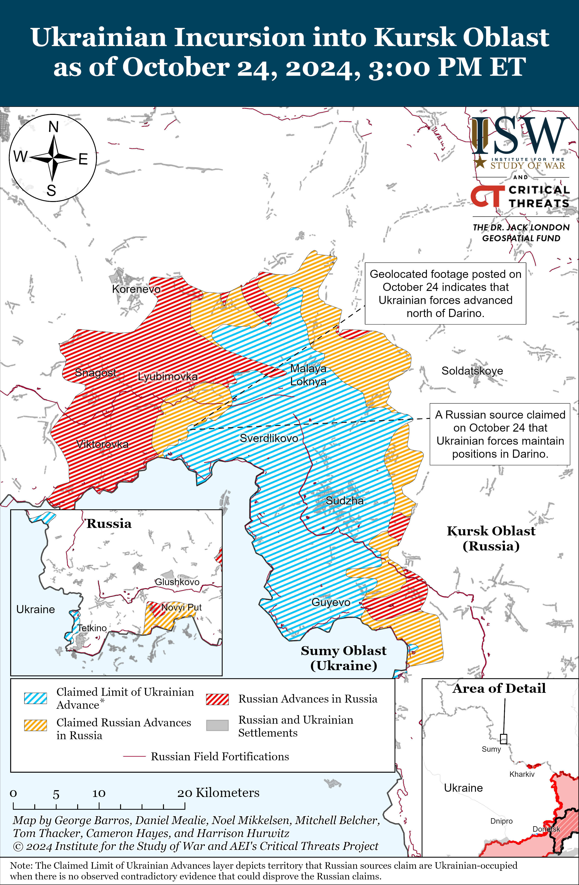
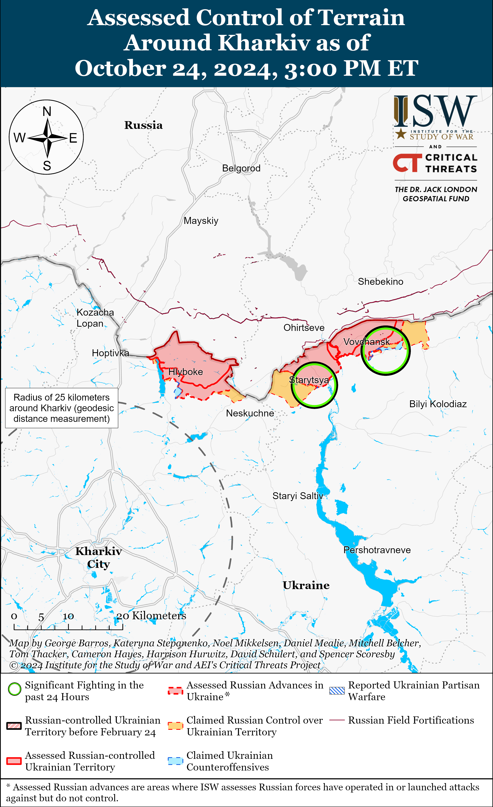
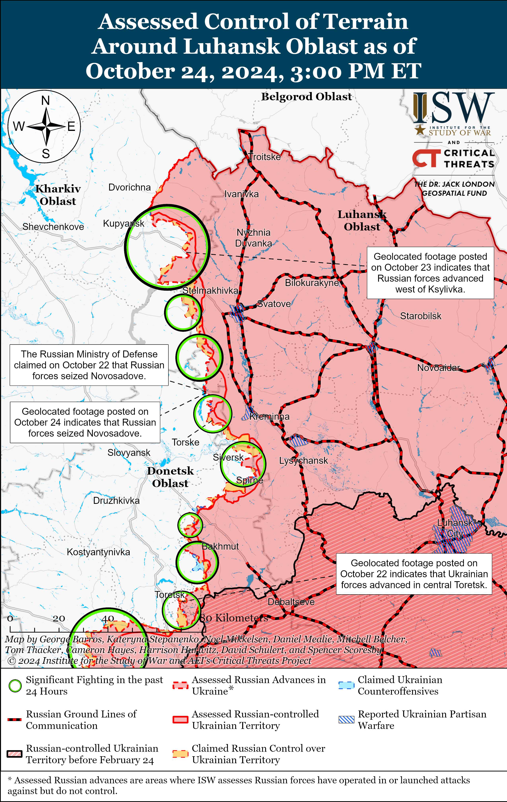
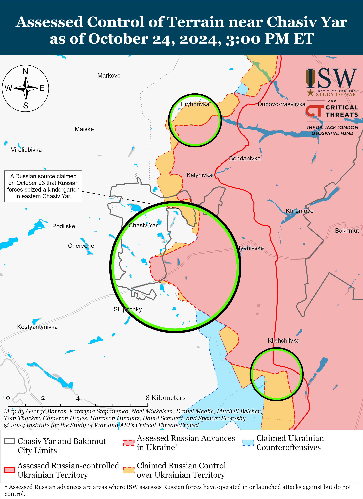
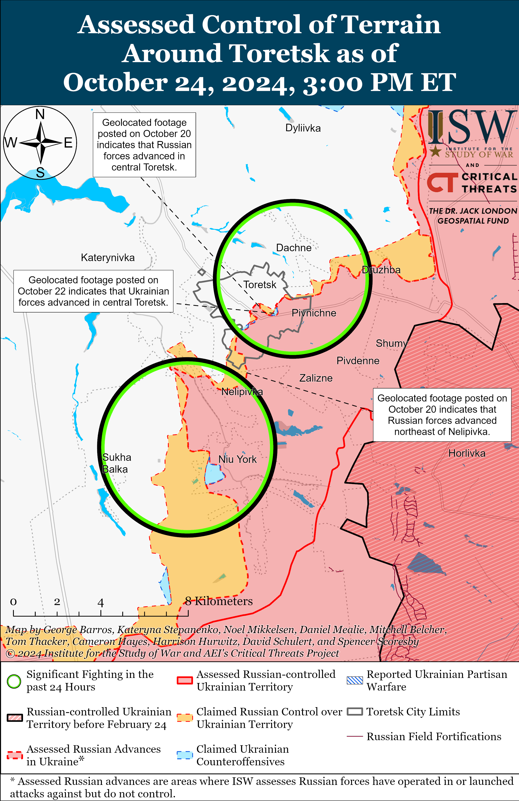
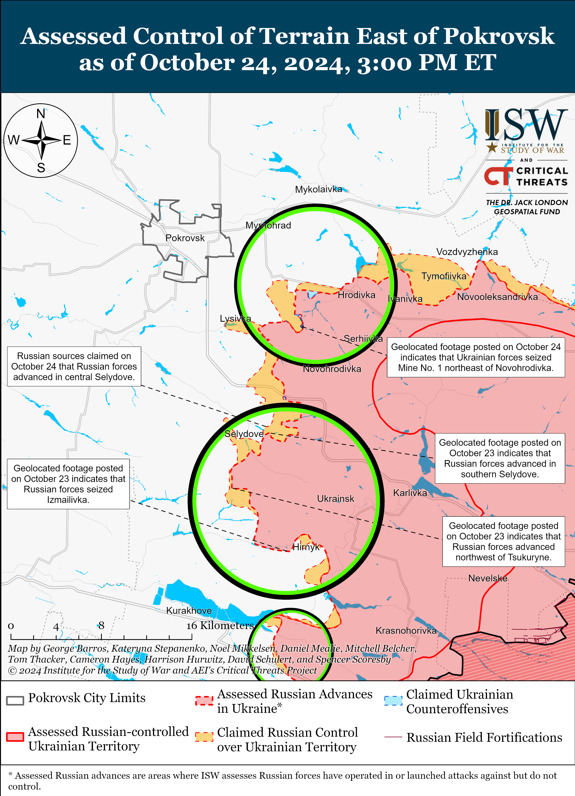
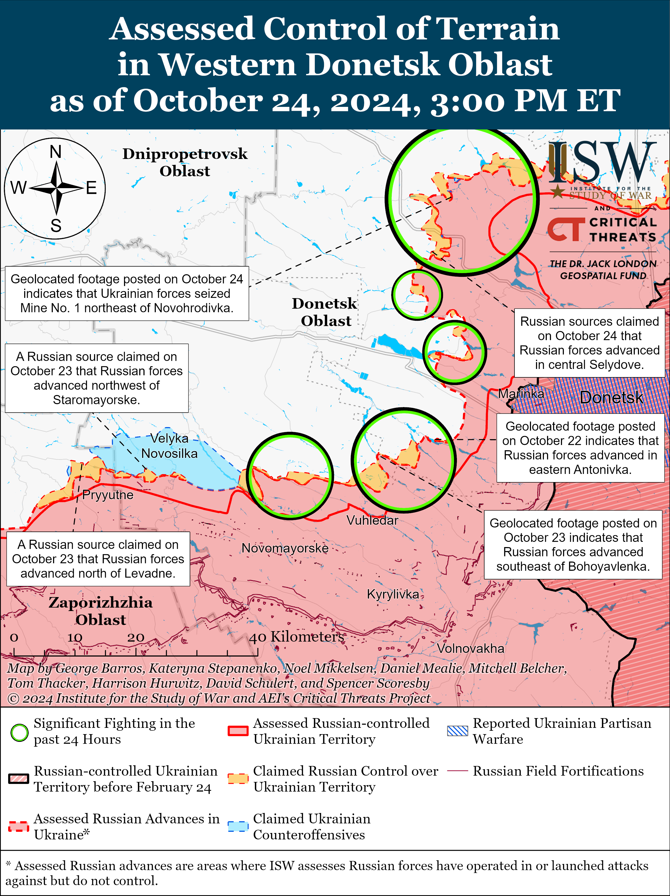
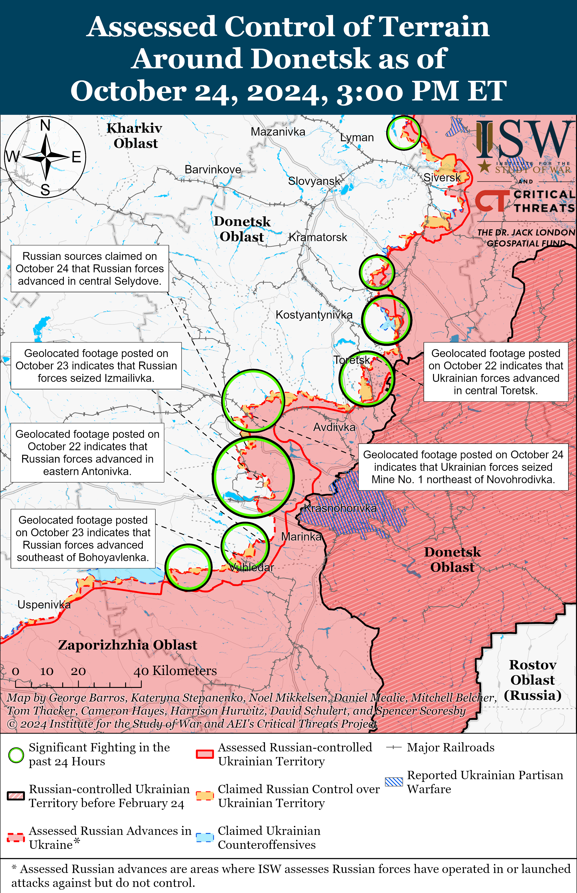
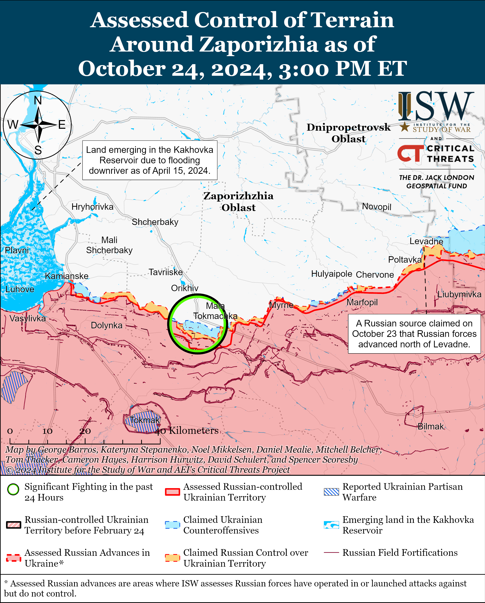
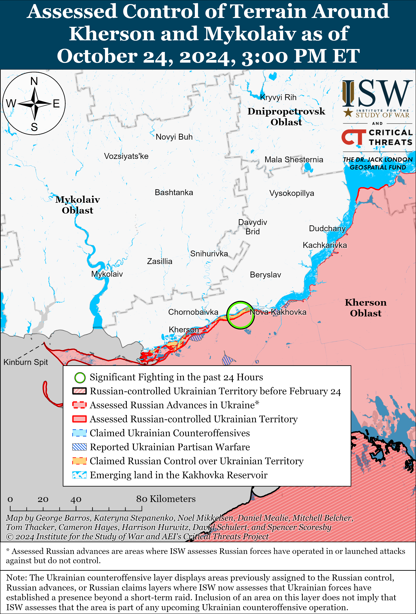

# Russian Offensive Campaign Assessment, October 24, 2024

**Nicole Wolkov, Christina Harward, Angelica Evans, Kateryna Stepanenko, Nate Trotter, William Runkel, and Frederick W. Kagan**

**October 24, 2024, 7:15pm ET**

**Click** [**here**](https://storymaps.arcgis.com/stories/36a7f6a6f5a9448496de641cf64bd375) **to see ISW’s interactive map of the Russian invasion of Ukraine. This map is updated daily alongside the static maps present in this report.**

**Click** [**here**](https://storymaps.arcgis.com/stories/83a2f24901c941d581c0c523ecd2619b) **to see ISW’s interactive map of Ukraine’s offensive in Kursk Oblast.**

**Click** [**here**](https://understandingwar.maps.arcgis.com/apps/instant/3dviewer/index.html?appid=1602762dbcde419bb957dea358449580) **to see ISW’s 3D control of terrain topographic map of Ukraine. Use of a computer (not a mobile device) is strongly recommended for using this data-heavy tool.**

**Click** [**here**](https://storymaps.arcgis.com/stories/733fe90805894bfc8562d90b106aa895) **to access ISW’s archive of interactive time-lapse maps of the Russian invasion of Ukraine. These maps complement the static control-of-terrain map that ISW produces daily by showing a dynamic frontline. ISW will update this time-lapse map archive monthly.**

**Note: The data cut-off for this product was 1:15pm ET on October 24. ISW will cover subsequent reports in the October 25 Russian Offensive Campaign Assessment.**

**Russian President Vladimir Putin failed to deny the presence of North Korean military personnel in Russia on October 24, amid official Ukrainian reports that the first North Korean military units arrived in Kursk Oblast on October 23.** Ukraine’s Main Military Intelligence Directorate (GUR) reported on October 24 that the first units of North Korean personnel arrived in Kursk Oblast on October 23.[1] The GUR reported that the North Korean personnel trained at the Baranovsky military training ground in Ussuriysk, Primorsky Krai; the Donguz military training ground in Ulan-Ude, Republic of Buryatia; the Yekaterinoslavsky military training ground in Yekaterinslavka, Amur Oblast; the 248th military training ground in Knyazye-Volkonskoye, Khabarovsk Krai; and the 249th military training ground in Primorsky Krai. The GUR reported that the Russian military spent several weeks coordinating with the North Korean military units. The GUR reported that North Korea has transferred roughly 12,000 North Korean personnel, including 500 officers and three generals, to Russia and that Russian Deputy Defense Minister Colonel General Yunus-Bek Yevkurov is responsible for overseeing the training and adaptation of the North Korean military personnel. The GUR noted that the Russian military is providing ammunition and other personal kit to the North Korean personnel. Russian President Vladimir Putin responded to a question at a press conference after the BRICS summit in Kazan, Republic of Tatarstan, regarding recently released South Korean intelligence satellite imagery reportedly showing North Korean troops in Russia.[2] Putin wryly responded that “photos are a serious thing” and “reflect something.”[3] Putin reiterated the mutual defense article in the Russian-North Korean strategic partnership agreement with North Korea, announced in June 2024 and officially ratified by the Russian State Duma on October 24, 2024.[4]

**Belarusian President Alexander Lukashenko strongly hinted that Belarusian forces will not fight in Ukraine and appeared to question Russian President Vladimir Putin’s likely efforts to introduce North Korean forces into Russia’s war against Ukraine in the process.** Lukashenko answered a question from the *BBC* on October 23 about reports of North Korean troops going to fight alongside Russian forces in Ukraine, claiming that these reports are “rubbish,” that Russian President Vladimir Putin would “never try to persuade” another state to involve its army in Russia’s war in Ukraine, and that the deployment of armed forces from any state – including from Belarus – to the frontline in Ukraine would be a “step towards the escalation” of the war.[5] Lukashenko claimed that if “we” (Belarussians) got involved in the war, this would be the “path to escalation” and that NATO would deploy forces to Ukraine in response to another country’s involvement. Lukashenko continued to deny that Belarus was involved in the Russia’s launch of its full-scale invasion of Ukraine in part from Belarussian territory. Lukashenko also gave an interview on October 23 to Russian state-run TV channel *Rossiya 1* in which he claimed that he did not think that the Russian leadership or military needs North Korean troops as there are enough Russian forces on the front and Russia has significant mobilization resources.[6] Lukashenko claimed that Moscow understands that the deployment of North Korean forces to the war would be “undesirable for Russia” and that the West will respond by sending NATO troops to Ukraine. Kremlin newswire *TASS* notably did not report on Lukashenko’s statements about how the use of North Korean forces in Russia’s war against Ukraine is not in Russia’s interests and only reported on his claims that NATO would deploy troops to Ukraine in response to the participation of North Korean forces in the war.[7]

**The Kremlin is reportedly attempting to portray the BRICS summit in Kazan, Republic of Tatarstan as evidence of widespread international support for Russia – especially to domestic audiences in Russia.** Russian opposition outlet *Meduza* reported on October 24 that it reviewed the Russian Presidential Administration’s manual to Russian state media and propagandists with guidelines about how to frame the ongoing BRICS summit in Kazan.[8] The manual reportedly highlighted three themes: Russian President Vladimir Putin is the “informal lead of the world majority,” Western elites are “panicking,” and “anxiety” is prevalent in the West generally. The Kremlin reportedly told media outlets to report that the BRICS summit “has the world’s attention” and proves that “attempts to isolate” Russia after its full-scale invasion of Ukraine have “failed.” *Meduza* reported that media outlets are supposed to highlight how Putin establishes “strategic ties that are not limited to one direction” in contrast to the West’s alleged “fleeting alliances” (NATO celebrated its 75th anniversary this year). Russian state media and propagandists recently published articles highlighting many of these themes, sometimes even word for word as reportedly written in the manual.”[9] Russian opposition outlet *Verstka* reported on October 24 that pro-Russian bots on Russian social media site VKontakte (VK) have left over 10,000 comments in two days about the BRICS summit – reportedly one of the largest Kremlin bot efforts recently.[10] The bots were promoting the idea that Russia is not internationally isolated, that BRICS’ influence is growing, that anti-Russian sanctions are decreasing in importance, and that Russian forces are achieving successes in Ukraine. A Russian insider source claimed on October 24 that unspecified Kremlin-linked sources stated that BRICS states largely do not support Russia’s position on its war in Ukraine, forcing the Kremlin to push this topic into the background in order to achieve some kind of “serious international association.”[11] The insider source claimed that multiple meetings during the summit discussed the People’s Republic of China’s (PRC) and Brazil’s peace proposals – which favor Russia – but that these discussions “ultimately led to nothing.” ISW assessed on October 23 that the adoption of the Kazan Declaration on the second day of the BRICS summit demonstrated that Russia has not yet secured the international support nor created the alternative security structure that the Kremlin desires.[12]

**Russian President Vladimir Putin attempted to project Russian confidence in the Russian military’s ability to repel the Ukrainian incursion into Kursk Oblast at a press conference after the BRICS summit on October 24.** Putin claimed that Russian forces have surrounded roughly 2,000 Ukrainian soldiers who are now “blocked” in Kursk Oblast.[13] Putin notably failed to acknowledge that the Ukrainian salient in Kursk Oblast extends from the Ukrainian-Russian international border and that Ukrainian forces can freely transit the sections of the border under Ukrainian control. Putin also claimed that Ukrainian forces have lost roughly 26,000 personnel during the operation in Kursk Oblast in the past “month and a bit” – likely a gross exaggeration.

**Ukrainian authorities are investigating another execution of Ukrainian prisoners of war (POWs) by Russian forces in the Pokrovsk direction against the backdrop of Russian forces’ increasingly frequent POW executions across the theater.** The Ukrainian Prosecutor General’s Office stated on October 24 that it is opening a pre-trial investigation into the murder of Ukrainian POWs by Russian forces near Selydove (southeast of Pokrovsk).[14] The Prosecutor General’s Office reported that Russian forces captured four Ukrainian servicemembers near Selydove on October 6 and filmed their interrogations, and that Ukrainian forces discovered the bodies of the four killed servicemembers after regaining the lost positions on October 7. The Prosecutor General’s Office did not publish photographs or footage confirming this report.[15] Ukrainian Human Rights Ombudsman Dmytro Lubinets stated on October 24 that he sent letters to the United Nations (UN) and International Committee of the Red Cross (ICRC) about Russian forces’ violation of the Geneva Convention on the Treatment of POWs.[16]  Ukrainian officials notably recently reported that Russian forces executed two unarmed Ukrainian POWs near Selydove on October 18.[17]

**Key Takeaways:**

- **Russian President Vladimir Putin failed to deny the presence of North Korean military personnel in Russia on October 24, amid official Ukrainian reports that the first North Korean military units arrived in Kursk Oblast on October 23.**
- **Belarusian President Alexander Lukashenko strongly hinted that Belarusian forces will not fight in Ukraine and appeared to question Russian President Vladimir Putin’s likely efforts to introduce North Korean forces into Russia’s war against Ukraine in the process.**
- **The Kremlin is reportedly attempting to portray the BRICS summit in Kazan, Republic of Tatarstan as evidence of widespread international support for Russia – especially to domestic audiences in Russia.**
- **Russian President Vladimir Putin attempted to project Russian confidence in the Russian military’s ability to repel the Ukrainian incursion into Kursk Oblast at a press conference after the BRICS summit on October 24.**
- **Ukrainian authorities are investigating another execution of Ukrainian prisoners of war (POWs) by Russian forces in the Pokrovsk direction against the backdrop of Russian forces’ increasingly frequent POW executions across the theater.**
- **Ukrainian forces recently advanced in Kursk Oblast and near Toretsk and Pokrovsk.**
- **Russian forces recently advanced near Kreminna and Siversk.**
- **The Russian Ministry of Internal Affairs (MVD), Ministry of Defense (MoD), and Rosgvardia reportedly each have their own Akhmat units that perform different functions in different sectors of the front and rear.**

***We do not report in detail on Russian war crimes because these activities are well-covered in Western media and do not directly affect the military operations we are assessing and forecasting. We will continue to evaluate and report on the effects of these criminal activities on the Ukrainian military and the Ukrainian population and specifically on combat in Ukrainian urban areas. We utterly condemn Russian violations of the laws of armed conflict and the Geneva Conventions and crimes against humanity even though we do not describe them in these reports.***

- Ukrainian Operations in the Russian Federation
- Russian Main Effort – Eastern Ukraine (comprised of three subordinate main efforts)
- Russian Subordinate Main Effort #1 – Push Ukrainian forces back from the international border with Belgorod Oblast and approach to within tube artillery range of Kharkiv City
- Russian Subordinate Main Effort #2 – Capture the remainder of Luhansk Oblast and push westward into eastern Kharkiv Oblast and encircle northern Donetsk Oblast
- Russian Subordinate Main Effort #3 – Capture the entirety of Donetsk Oblast
- Russian Supporting Effort – Southern Axis
- Russian Air, Missile, and Drone Campaign
- Russian Mobilization and Force Generation Efforts
- Russian Technological Adaptations
- Activities in Russian-occupied areas
- Significant Activity in Belarus

**Ukrainian Operations in the Russian Federation**

A Kremlin-affiliated Russian milblogger claimed on October 23 that Ukrainian forces maintain positions along the railway line south of Novy Put (south of Glushkovo) in Glushkovsky Raion west of the main Ukrainian salient in Kursk Oblast.[18]

Ukrainian forces recently advanced southeast of Korenevo within the main Ukrainian salient in Kursk Oblast amid continued Russian assaults in the area on October 24. Geolocated footage published on October 24 indicates that Ukrainian forces recently advanced along the Snagost River north of Darino  and likely maintain positions in Darino and Nikolaevo-Darino (both southeast of Korenevo).[19] A Russian milblogger claimed that Russian forces advanced in the area between Sheptukovka and Khitrovka (both east of Korenevo) and advanced west of Tolsty Lug (south of Korenevo) in the direction of Zeleny Shlyakhk (southeast of Korenevo).[20] ISW has not observed confirmation of this claim, however. Russian milbloggers claimed that Russian forces control the western half of Novoivanovka (southeast of Korenevo) and that Ukrainian forces are operating in the eastern outskirts of the settlement.[21] Russian sources, including the Russian Ministry of Defense (MoD), claimed that Ukrainian forces attacked southeast of Korenevo near Darino, Obukhovka, Nizhny Klin, Lyubimovka, Zeleny Shlyakh, and Novoivanovka and south of Sudzha near Plekhovo.[22] Elements of the Russian 137th Airborne (VDV) Regiment (106th VDV Division) reportedly participated in the Russian seizure of Lyubimovka.[23] Elements of the Russian 83rd Separate VDV Brigade are reportedly operating near Darino, and elements of the 8th Company of an unspecified motorized rifle regiment subordinated to the Russian Aerospace Forces (VKS) are reportedly operating near Olgovka (east of Korenevo).[24]

A Ukrainian brigade operating in the Kursk direction reported on October 24 that Ukrainian forces destroyed a Russian Strela-10 air defense system with a first-person view (FPV) drone in Kursk Oblast.[25]

**Russian Main Effort – Eastern Ukraine**

**Russian Subordinate Main Effort #1 – Kharkiv Oblast (Russian objective: Push Ukrainian forces back from the international border with Belgorod Oblast and approach to within tube artillery range of Kharkiv City)**

Russian forces continued offensive operations in northern Kharkiv Oblast on October 24 but did not make any confirmed advances. Russian forces continued ground attacks northeast of Kharkiv City near Vovchansk, Starytsya (southwest of Vovchansk), and Tykhe (east of Vovchansk) on October 23 and 24.[26] Russian milbloggers claimed on October 24 that Ukrainian forces attacked near Hatyshche (northwest of Vovchansk).[27] The spokesperson of a Ukrainian brigade operating in the Kharkiv direction stated on October 24 that Russian forces have established high-quality fortifications built deep into the ground in the Kharkiv direction by digging “multi-story holes.”[28]  The spokesperson also stated that Russian forces have not conducted mechanized assaults in the Kharkiv direction for “a long time” and noted that the Russian military might be preparing for the onset of winter to change battlefield conditions. The spokesperson reported that the lack of foliage will make activity on the battlefield more visible, making areas more difficult to defend.[29] Elements of the Rosgvardia’s 116th Special Purpose Brigade are reportedly operating near Hatyshche, and elements of the Russian 7th Motorized Rifle Regiment (11th Army Corps [AC], Leningrad Military District [LMD]) reportedly continue operating near Lyptsi (north of Kharkiv City).[30]

**Russian Subordinate Main Effort #2 – Luhansk Oblast (Russian objective: Capture the remainder of Luhansk Oblast and push westward into eastern Kharkiv Oblast and northern Donetsk Oblast)**

Russian forces recently advanced northwest of Kreminna amid continued offensive operations along the Kupyansk-Svatove-Kreminna line on October 24. Geolocated footage published on October 24 shows a Russian flag flying in central Novosadove (northwest of Kreminna), indicating that Russian forces seized the settlement and fields east of the settlement.[31] The Russian MoD claimed on October 22 that Russian forces seized Novosadove, and Russian milbloggers recently claimed that elements of the 144th Motorized Rifle Division (20th Combined Arms Army [CAA], Moscow Military District [MMD]) participated in the seizure of the settlement.[32] A Russian milblogger claimed that the seizure of Novosadove enables Russian forces to launch new offensive operations on the left bank of the Zherebets River and claimed that Russian forces also recently pushed Ukrainian forces from Nevske (northwest of Kreminna).[33] Russian milbloggers also claimed that Russian forces consolidated positions in Kruhlyakivka (southeast of Kupyansk) and advanced further east from Novosadove,  west of Kyslivka (southeast of Kupyansk), and south of Makiivka (northwest of Kreminna).[34] ISW has not observed visual confirmation of these claims, however. Russian forces continued offensive operations north of Kupyansk near Holubivka; southeast of Kupyansk near Pishchane, Kruhlyakivka, Stepova Novoselivka, and Lozova; east of Svatove near Vyshneve; northwest of Kreminna near Hrekivka, Novomykhailivka, Druzhelyubivka, Katerynivka, and Tverdokhlibove; west of Kreminna near Terny, Torske, and Zarichne; and southwest of Kreminna near Serebryanka.[35] The Russian MoD posted footage on October 24 claiming to show Russian forces striking bridge crossings across the Oskil River west of Kupyansk-Vuzlovyi.[36]

**Russian Subordinate Main Effort #3 – Donetsk Oblast (Russian objective: Capture the entirety of Donetsk Oblast, the claimed territory of Russia’s proxies in Donbas)**

Russian forces recently advanced southeast of Siversk amid continued offensive operations in the area on October 24. Geolocated footage published on October 24 shows that Russian forces recently advanced along a railroad line southeast of Vyimka (southeast of Siversk).[37] The Ukrainian General Staff reported that Russian forces attacked near Vyimka on October 24.[38] Artillery elements of the Russian 85th Separate Motorized Rifle Brigade (3rd Combined Arms Army [CAA], formerly 2nd Luhansk People’s Republic’s Army Corps [LNR AC], Southern Military District [SMD]) are reportedly operating south of Siversk.[39]

Russian forces continued offensive operations in the Chasiv Yar direction on October 24 but did not advance. Russian forces reportedly continued to attack in eastern Chasiv Yar; northeast of Chasiv Yar near Hryhorivka; and south of Chasiv Yar near Predtechyne, Bila Hora, and Stupochky on October 23 and 24.[40] Elements of the Russian 98th Airborne (VDV) Division reportedly continued to operate near Chasiv Yar.[41]

Ukrainian forces recently regained tactical positions in central Toretsk amid continued Russian assaults in and around the settlement on October 24. Geolocated footage published on October 22 and 23 showed Ukrainian forces operating along Dzerzhynskoho Street in central Toretsk, where ISW previously observed Russian advances – indicating that Ukrainian forces recently regained lost positions in the area.[42] A Russian source claimed that Russian forces advanced in southern Shcherbynivka (west of Toretsk), but ISW has not observed visual evidence to confirm this claim.[43] Russian forces continued to attack in Toretsk and southwest of Toretsk near Nelipivka on October 23 and 24.[44] Elements of the 132nd Motorized Rifle Brigade (51st CAA, formerly 1st Donetsk People’s Republic [DNR] AC) and ”Russkiye Yastreby” (Russian Hawks) drone operators of an unspecified parent formation are reportedly operating in the Toretsk direction.[45]

Russian forces continued to prioritize offensive operations in Selydove (southeast of Pokrovsk) on October 24 at the expense of the northern flank of Pokrovsk. Russian sources continued to claim that Russian forces advanced further into southern and central Selydove and in the fields north of the settlement.[46] ISW has not observed visual confirmation of these claims. Ukrainian servicemembers told Ukrainian broadcaster *Suspilne* on October 24 that Russian forces control a large part of Selydove, and one Ukrainian servicemember stated that Russian forces control roughly 85 percent of the town.[47] Ukrainian National Guard Spokesperson Ruslan Muzychyk did not confirm these statements and responded that Ukrainian forces are trying to stop large Russian groups from securing positions, from reaching the urban development, and from advancing on the northern and eastern outskirts of Selydove, including from Mykhailivka (east of Selydove).[48] ISW has not observed visual confirmation of the Ukrainian servicemember’s statement about the extent of Russian advances in Selydove. The spokesperson of a Ukrainian National Guard brigade reported on October 24 that the northern and eastern outskirts of Selydove are contested “grey zones” and that Ukrainian forces held off Russian advances around Selydove after Russian forces launched massive attacks on the town from the north, east, and south on October 21.[49] The spokesperson added that Russian forces transferred military units from the northern flank of the Pokrovsk direction to strengthen the attacks on Selydove, are transferring medium-sized groups to infiltrate Selydove’s outskirts, and are treating the seizure of Selydove as the top priority. The spokesperson observed that Russian forces launched infantry assaults without mechanized support, that these assaults have proven effective because of the overwhelming number of Russian reserves concentrated in the area, and that Russian forces used better prepared infantry elements to launch the second wave of attacks on Selydove. The spokesperson added that Russian forces also transferred different types of electronic warfare (EW) systems to prevent Ukrainian reconnaissance drones from operating in Selydove, which had likely facilitated Russia’s recent advances in the town alongside Russian artillery, air, and glide bomb strikes. ISW assessed on October 23 that the Russian military command’s apparent focus on securing Selydove has come at the expense of Russian forces’ ability to sustain a meaningful offensive drive directly on Pokrovsk — Russia’s self-defined operational objective on this sector of the front.[50] Russian sources claimed that elements of the Russian 433rd Motorized Rifle Regiment (27th Motorized Rifle Division, 2nd Combined Arms Army [CAA], Central Military District [CMD]) are reportedly operating in central Selydove, and elements of the 15th Motorized Rifle Brigade (2nd CAA) are reportedly operating near Mykhailivka.[51]

Ukrainian forces reportedly recently successfully counterattacked northeast of Selydove amid continued Russian assaults east and southeast of Pokrovsk on October 24. Geolocated footage published on October 23 and 24 shows a Ukrainian mechanized counterattack near the Novohrodivka Mine No. 1/3 (northeast of Selydove and southeast of Pokrovsk).[52] Russian sources made unconfirmed claims that Russian forces advanced in the field south of Sukhyi Yar (northwest of Novohrodivka), along the railway line in eastern Vyshneve (south of Pokrovsk), and reached the outskirts of Novodmytrivka (southwest of Selydove) and that assault elements of the Russian 114th Motorized Rifle Brigade (51st CAA) reportedly entered Novoselydivka (south of Selydove).[53] Russian forces continued to attack east of Pokrovsk near Myrolyubivka, Novotoretske, Promin, Mykhailivka, Krutyi Yar, and Sukha Balka; south of Pokrovsk near Novodmytrivka and Kreminna Balka; and southeast of Pokrovsk near Selydove, Lysivka, Sukhyi Yar, Mykolaivka, Hirnyk, Zoryane, and Krasnyi Yar on October 23 and 24.[54]

Russian forces continued assaults in the Kurakhove direction on October 24 but did not advance. Russian forces reportedly attacked east of Kurakhove near Maksymilyanivka and southeast of Kurakhove near Hostre and Dalne.[55] Drone elements of the Russian “Rem&Rop” detachment of the 1472nd Motorized Rifle Regiment (68th AC, Eastern Military District [EMD]) and drone elements of the 3rd Motorized Rifle Battalion of the 39th Motorized Rifle Brigade (68th AC) are reportedly operating in the Kurakhove direction; and elements of the 102nd Motorized Rifle Regiment (150th Motorized Rifle Division, 8th CAA, SMD) are reportedly operating near Maksymilyanivka.[56]

Russian forces continued offensive operations southwest of Donetsk City near Vuhledar on October 24 but did not make any confirmed advances. Russian milbloggers claimed that Russian forces marginally advanced southeast of Bohoyavlenka (north of Vuhledar), although ISW has not observed visual confirmation of this claim.[57] Russian forces continued ground attacks northeast of Vuhledar near Antonivka, Katerynivka, and Kostyantynivka; north of Vuhledar near Bohoyavlenka; west of Vuhledar near Zolota Nyva; and northwest of Vuhledar near Novoukrainka on October 23 and 24.[58] Drone operators of the Russian 36th Motorized Rifle Brigade (20th CAA, EMD) are reportedly operating near Bohoyavlenka.[59]

Neither Russian nor Ukrainian sources reported Russian ground activity in the Donetsk-Zaporizhia Oblast border area on October 24.

**Russian Supporting Effort – Southern Axis (Russian objective: Maintain frontline positions and secure rear areas against Ukrainian strikes)**

Russian forces continued assaults in western Zaporizhia Oblast northeast of Robotyne near Novodanylivka on October 23 and 24, but there were no confirmed changes to the frontline.[60] A Russian milblogger claimed on October 24 that recent Russian advances in the Zaporizhia direction could indicate that Russia may begin prioritizing offensive operations in the Zaporizhia direction in the near future.[61] The milblogger claimed that the Russian ”Dnepr” Grouping of Forces reportedly created several new brigades in occupied Kherson Oblast and that Russian forces may intensify offensive operations in the Zaporizhia direction if Russian forces continue to degrade both Ukrainian reserves in Kursk Oblast and Ukrainian morale in other parts of the frontline. The Russian milblogger claimed that the need to advance through open fields and worsening weather conditions in Zaporizhia Oblast may cause difficulties for Russian operations in this direction. Another Russian milblogger claimed on October 24 that Ukrainian forces are intensifying the use of first-person view (FPV) drones, reconnaissance drones, and hexacopters to strike Russian artillery positions in the Zaporizhia direction.[62]

Ukraine’s Southern Operational Command reported on October 24 that Ukrainian forces reportedly struck a Russian Buk-M2 air defense system in southern Ukraine on October 23, and a Ukrainian journalist reported that Ukrainian forces used a HIMARS system to strike the Buk-M2.[63] The Ukrainian General Staff reported on October 21 that Ukrainian forces struck a Russian Buk-M3 air defense system on the night of October 20 to 21 approximately 60 kilometers from the frontline in an unspecified area of Russia or occupied Ukraine.[64]

Russian forces continued attacks in east (left) bank Kherson Oblast on October 23 and 24 but did not make any confirmed advances.[65] A Russian milblogger claimed on October 24 that Ukrainian forces are mining the floodplain of the Dnipro River to hinder future Russian advances in the Kherson direction.[66] Drone operators of the Russian 80th Arctic Motorized Rifle Brigade (14th Army Corps [AC], Leningrad Military District [LMD]) reportedly continue to operate in the Kherson direction.[67]

The Russian MOD claimed on October 24 that Russian forces destroyed three Ukrainian drones over the Black Sea.[68] Sevastopol occupation governor Mikhail Razvozhaev claimed that Russian air defenses shot down a Ukranian missile over occupied Sevastopol.[69]

Ukrainian Navy Spokesperson Captain Third Rank Dmytro Pletenchuk stated on October 24 that the Russian Black Sea Fleet (BSF) is concerned that Ukrainian forces can strike Russian BSF ships in port in Novorossiysk, Krasnodar Krai, but that the BSF does not have an alternative port location to station BSF ships in the Black Sea region.[70] Pletenchuk noted that several Russian vessels have recently sortied from Russia’s Novorossiysk base en masse and that Russian forces are sortieing the ships in order to limit the risk of possible Ukrainian drone strikes and further destruction of BSF vessels.

**Russian Air, Missile, and Drone Campaign (Russian Objective: Target Ukrainian military and civilian infrastructure in the rear and on the frontline)**

Russian forces conducted a series of drone and missile strikes against Ukraine on the night of October 23 to 24. Ukraine’s Air Force reported that Russian forces launched 50 strike drones, including Shahed-136/131 drones and other drones of an unidentified type, from Oryol and Kursk oblasts and occupied Crimea; two Kh-22 cruise missiles from over the Black Sea; and two Kh-59 cruise missiles from the airspace over Bryansk Oblast.[71] Ukrainian forces reportedly shot down 40 drones over Odesa, Mykolaiv, Dnipropetrovsk, Vinnytsya, Zhytomyr, Khmelnytskyi, Cherkasy, Kirovohrad, Kyiv, Poltava, and Chernihiv oblasts.[72] Ukraine’s Air Force reported that seven Russian drones became “locally lost,” likely due to Ukrainian electronic warfare (EW) interference, that two drones flew into Belarusian airspace, and that one drone remained in Ukrainian airspace as of 0830 local time on October 24.[73] Kyiv Oblast Military Administration Head Ruslan Kravchenko reported on October 24 that debris from Russian drones damaged two businesses and a transformer in Kyiv Oblast.[74] Khmelnytskyi Oblast officials reported on October 24 that Ukrainian air defenses shot down eight Russian Shahed drones over Khmelnytskyi Oblast and that debris from the destroyed Shahed drones damaged a hotel in Starokostyantyniv.[75]

**Russian Mobilization and Force Generation Efforts (Russian objective: Expand combat power without conducting general mobilization)**

The Russian Ministry of Internal Affairs (MVD), Ministry of Defense (MoD), and Rosgvardia reportedly each have their own Akhmat units that perform different functions in different sectors of the front and rear.[76] A Russian servicemember of the “Aida” group of “Akhmat” Spetsnaz explained the structure of the Akhmat forces, claiming that the Russian MVD, MoD, and Rosgvardia each have their own Akhmat detachments. The Russian MoD reportedly oversees the Akhmat Sever, Akhmat Yug, Akhmat Vostok, Akhmat Rossiya, Akhmat Chechnya, and Akhmat Spetsnaz units, and the MVD reportedly oversees Akhmat units that carry out police functions. The servicemember noted that Rosgvardia units, including its Akhmat-1 unit, are not fighting on the frontline in Ukraine but are operating in the rear, whereas MoD Akhmat units are the only ones on the frontline. The servicemember claimed that each Akhmat element has its own commander and battalion commanders and function as full military units. The servicemember noted that Apty Alaudinov is only responsible for the Akhmat Spetsnaz, and that the Russian 204th Spetsnaz Regiment (3rd Combined Arms Army [CAA], formerly Luhansk People’s Republic’s 2nd Army Corps [LNR AC]) is part of the Akhmat Spetsnaz. ISW observed reports that the 78th “Sever-Akhmat” Motorized Rifle Regiment (42nd Motorized Rifle Division, 58th Combined Arms Army [CAA], Southern Military District [SMD]) were operating near Chasiv Yar as of early August 2024; that elements of the “Yug-Akhmat” Battalion were operating near Robotyne as of early July 2024; that elements of the “Vostok-Akhmat” Battalion were operating near Robotyne as of February 2024; and that elements of the 1434th “Akhmat-Chechnya” Regiment and Akhmat Spetsnaz were operating in Kursk Oblast as of October 2024.[77]

Russian opposition news outlet *Agentsvo* reported on October 23 that Russian state and private structures have already spent 1.46 billion rubles ($15.1 million) on anti-drone protections so far in 2024 and will likely spend at least two million rubles ($20.7 million) in all of 2024 – 13 percent more than in all of 2023.[78] *Agentsvo* noted that total spending on drone defense may be higher as the only available data is from state and private structures that must operate through the government procurement website. Natalia Kotlyar, the deputy director for business development at the Vector Research Institute, a subsidiary of Russian state defense conglomerate Rostec, claimed on October 22 to Russian state business outlet *Vedomosti* that the Russian anti-drone protection market could reach 30 billion rubles ($311.6 million) by the end of 2024.[79]

**Russian Technological Adaptations (Russian objective: Introduce technological innovations to optimize systems for use in Ukraine)**

Nothing significant to report.

**Activities in Russian-occupied areas (Russian objective: Consolidate administrative control of annexed areas; forcibly integrate Ukrainian citizens into Russian sociocultural, economic, military, and governance systems)**

*ISW is not publishing reporting on activities in Russian-occupied areas today.*

**Significant activity in Belarus (Russian efforts to increase its military presence in Belarus and further integrate Belarus into Russian-favorable frameworks and Wagner Group activity in Belarus)**

*See topline text.*

**Note: ISW does not receive any classified material from any source, uses only publicly available information, and draws extensively on Russian, Ukrainian, and Western reporting and social media as well as commercially available satellite imagery and other geospatial data as the basis for these reports. References to all sources used are provided in the endnotes of each update.**

[1] https://t.me/DIUkraine/4723

[2] https://understandingwar.org/backgrounder/russian-offensive-campaign-assessment-october-18-2024

[3] http://www.kremlin dot ru/events/president/news/75385

[4] http://www.kremlin dot ru/events/president/news/75385 ; https://t.me/MID\_Russia/46997

[5] https://www.bbc.com/news/articles/c62938gl6q1o

[6] https://president dot gov.by/ru/events/interv-u-zurnalistke-vgtrk-ol-ge-skabeevoj

[7] https://tass dot ru/mezhdunarodnaya-panorama/22207415

[8] https://meduza dot io/feature/2024/10/24/my-prochitali-metodichku-kremlya-o-tom-kak-propagandisty-dolzhny-rasskazyvat-rossiyanam-pro-sammit-briks-v-kazani-da-putin-snova-vseh-pereigral

[9] https://www.kp dot ru/daily/27651/5001424/ ; https://ria.ru/20241022/metshin-1979241265.html; https://t.me/margaritasimonyan/14395; https://www.pnp dot ru/politics/leonid-sluckiy-zapad-v-panike-ot-usileniya-briks.html; https://aif dot ru/politics/volodin-sammit-briks-pokazal-chto-plan-ssha-i-es-po-izolyacii-rf-provalilsya

[10] https://verstka dot media/10-tysyach-kommentariev-za-dva-dnya-vo-vremya-sammita-briks-kremleboty-organizovali-odnu-iz-krupnejshih-propagandistskih-kampanij?

[11] https://t.me/kremlin\_sekret/16370

[12] https://isw.pub/UkrWar102324

[13] http://www.kremlin dot ru/events/president/news/75385 ; https://t.me/tass\_agency/281504 ; https://t.me/tass\_agency/281505 ; https://t.me/tass\_agency/281523 ; https://t.me/tass\_agency/281526

[14] https://www.gp dot gov.ua/ua/posts/cergovii-vojennii-zlocin-rosiyan-poblizu-selidovogo-rozpocato-rozsliduvannya-za-faktom-vbivstva-4-polonenix-biiciv-ngu

[15] https://meduza dot io/news/2024/10/24/vlasti-ukrainy-zayavili-chto-rossiyskie-voennye-vzyali-v-plen-chetyreh-boytsov-natsgvardii-v-rayone-selidovo-doprosili-na-kameru-i-ubili; https://www.gp dot gov.ua/ua/posts/cergovii-vojennii-zlocin-rosiyan-poblizu-selidovogo-rozpocato-rozsliduvannya-za-faktom-vbivstva-4-polonenix-biiciv-ngu

[16] https://t.me/dmytro\_lubinetzs/7049

[17] https://understandingwar.org/backgrounder/russian-offensive-campaign-assessment-october-21-2024

[18] https://t.me/rybar/64699

[19] https://x.com/alexskichambe/status/1849472393443762530; https://t.me/brigada83/417

[20] https://t.me/DnevnikDesantnika/17909

[21] https://t.me/motopatriot/28683

 ; https://t.me/rusich\_army/17913

[22] ttps://t.me/mod\_russia/44891  ; https://t.me/rybar/64699  ; https://t.me/DnevnikDesantnika/17857 ; https://t.me/rusich\_army/17904   ; https://t.me/DnevnikDesantnika/17872

[23] https://t.me/RVvoenkor/79266  ; https://t.me/DnevnikDesantnika/17857

[24] https://t.me/motopatriot/28669 ; https://t.me/motopatriot/28682 ; https://t.me/DnevnikDesantnika/17909  (Darino) ; https://t.me/dva\_majors/55866 ; https://t.me/dva\_majors/55867 ; https://t.me/motopatriot/28663  (Olgovka)

[25] https://armyinform dot com.ua/2024/10/24/spalyly-u-sarayi-na-kurshhyni-teroboronczi-vrazyly-vorozhyj-zrk/; https://t.me/kriladopekla/259

[26] https://www.facebook.com/GeneralStaff.ua/posts/pfbid0ShjJB2D4tiL72rp1dp3PoxN8GT93SfFdAkkyjhx9wrxyrmcHoxebK9g6zqXhzkzWl ; https://www.facebook.com/GeneralStaff.ua/posts/pfbid023HvJJ2gy3QTZfDMKJnsZXBLkqyjM2XDF9btjnLwsZp6E8U9LbD4Ungee8aa3tV11l ; https://www.facebook.com/GeneralStaff.ua/posts/pfbid02P8SvhuBZaMn3Cqy45DbXmcHxgJMsVibWWYcg94rKFeGf4ZNwRRHJi4zuraF6kgT8l ; https://t.me/otukharkiv/2245 ; https://t.me/motopatriot/28681 ; https://t.me/DnevnikDesantnika/17901

[27] https://t.me/motopatriot/28681 ; https://t.me/DnevnikDesantnika/17901

[28] https://armyinform dot com.ua/2024/10/24/propoloty-lyesopolku-v-sylah-oborony-rozpovily-pro-speczyfiku-vyzvolennya-harkivshhyny/

[29] https://armyinform.com dot ua/2024/10/24/lystochkom-vzhe-ne-prykrytysya-yak-osin-zminyt-obstanovku-na-poli-boyu/

[30] https://t.me/motopatriot/28681 ; https://t.me/kraken\_kha/657

[31] https://t.me/creamy\_caprice/7229; https://t.me/vysokygovorit/17741

[32] https://t.me/motopatriot/28673; https://t.me/vysokygovorit/17741 ; https://understandingwar.org/backgrounder/russian-offensive-campaign-assessment-october-22-2024

[33] https://t.me/rybar/64723

[34] https://t.me/RVvoenkor/79271 ; https://t.me/DnevnikDesantnika/17852 ; https://t.me/dva\_majors/55822 ; https://t.me/z\_arhiv/28812 ; https://t.me/z\_arhiv/28821

[35] https://www.facebook.com/GeneralStaff.ua/posts/pfbid023HvJJ2gy3QTZfDMKJnsZXBLkqyjM2XDF9btjnLwsZp6E8U9LbD4Ungee8aa3tV11l ; https://www.facebook.com/GeneralStaff.ua/posts/pfbid02P8SvhuBZaMn3Cqy45DbXmcHxgJMsVibWWYcg94rKFeGf4ZNwRRHJi4zuraF6kgT8l ; https://www.facebook.com/GeneralStaff.ua/posts/pfbid0ShjJB2D4tiL72rp1dp3PoxN8GT93SfFdAkkyjhx9wrxyrmcHoxebK9g6zqXhzkzWl ; https://www.facebook.com/GeneralStaff.ua/posts/pfbid023HvJJ2gy3QTZfDMKJnsZXBLkqyjM2XDF9btjnLwsZp6E8U9LbD4Ungee8aa3tV11l ; https://www.facebook.com/GeneralStaff.ua/posts/pfbid02P8SvhuBZaMn3Cqy45DbXmcHxgJMsVibWWYcg94rKFeGf4ZNwRRHJi4zuraF6kgT8l

[36] https://t.me/mod\_russia/44880 ; https://t.me/RVvoenkor/79291 ; https://t.me/epoddubny/21437

[37] https://x.com/MikiValbuena/status/1849364772468203714; https://x.com/MikiValbuena/status/1849371450542600703; https://x.com/strategicbakery/status/1849372156523651184; https://x.com/MikiValbuena/status/1849373114175484322; https://t.me/OGSHB\_109/789

[38] https://www.facebook.com/GeneralStaff.ua/posts/pfbid0ShjJB2D4tiL72rp1dp3PoxN8GT93SfFdAkkyjhx9wrxyrmcHoxebK9g6zqXhzkzWl

[39] https://t.me/epoddubny/21439

[40] https://www.facebook.com/GeneralStaff.ua/posts/pfbid0ShjJB2D4tiL72rp1dp3PoxN8GT93SfFdAkkyjhx9wrxyrmcHoxebK9g6zqXhzkzWl; https://www.facebook.com/GeneralStaff.ua/posts/pfbid023HvJJ2gy3QTZfDMKJnsZXBLkqyjM2XDF9btjnLwsZp6E8U9LbD4Ungee8aa3tV11l ; https://www.facebook.com/GeneralStaff.ua/posts/pfbid02P8SvhuBZaMn3Cqy45DbXmcHxgJMsVibWWYcg94rKFeGf4ZNwRRHJi4zuraF6kgT8l ; https://t.me/dva\_majors/55822 ; https://t.me/wargonzo/22781;

[41] https://t.me/DnevnikDesantnika/17872

[42] https://x.com/AudaxonX/status/1849187165655212052; https://t.me/ZParaBellumMD/12141

[43] https://t.me/motopatriot/28679

[44] https://www.facebook.com/GeneralStaff.ua/posts/pfbid023HvJJ2gy3QTZfDMKJnsZXBLkqyjM2XDF9btjnLwsZp6E8U9LbD4Ungee8aa3tV11l  ; https://www.facebook.com/GeneralStaff.ua/posts/pfbid02P8SvhuBZaMn3Cqy45DbXmcHxgJMsVibWWYcg94rKFeGf4ZNwRRHJi4zuraF6kgT8l; https://armyinform dot com.ua/2024/10/24/ataky-v-styli-shalenogo-maksa-okupanty-praktykuyut-zombi-shturmy-na-dyvnij-tehniczi/; https://www.youtube.com/watch?v=j5TqaWCCdUg  ; https://t.me/wargonzo/22781 ; https://www.facebook.com/butusov.yuriy/posts/pfbid02Hv9u6v5Pr5cL2bxThq3eNKr7jySrHJTumMTJUHpqpWyGyhmaTW5TJda3fHzBZG7kl

[45] https://t.me/sashakots/49712; https://t.me/RtrDonetsk/27716 ; https://t.me/milinfolive/133501; https://t.me/boris\_rozhin/141914; https://t.me/astrahandm/12987 ; https://t.me/boris\_rozhin/141951

[46] https://t.me/RVvoenkor/79292; https://t.me/z\_arhiv/28815; https://t.me/milinfolive/133459

[47] https://t.me/muchnoyairborne/10756; https://suspilne dot media/donbas/865003-z-vidkritih-dzerel-nemozlivo-pidtverditi-okupaciu-85-mista-voxcheck-dla-suspilnogo-proanalizuvav-dani-pro-selidove/

[48] https://suspilne dot media/donbas/864951-vulicni-boi-sira-zona-ta-aku-castinu-mista-kontroluut-sili-oboroni-so-vidomo-pro-oboronu-selidovogo-dani-ngu/; https://www.youtube.com/watch?v=j5TqaWCCdUg ; https://armyinform.com dot ua/2024/10/24/yak-paczyuky-v-komoru-okupanty-namagayutsya-prosochytysya-v-selydove/;

[49] https://suspilne dot media/donbas/864951-vulicni-boi-sira-zona-ta-aku-castinu-mista-kontroluut-sili-oboroni-so-vidomo-pro-oboronu-selidovogo-dani-ngu/ ; https://www.youtube.com/watch?v=j5TqaWCCdUg ; https://armyinform.com dot ua/2024/10/24/yak-paczyuky-v-komoru-okupanty-namagayutsya-prosochytysya-v-selydove/

[50] https://understandingwar.org/backgrounder/russian-offensive-campaign-assessment-october-23-2024

[51] https://t.me/ukraina\_ru/221470 ; https://t.me/boris\_rozhin/141934; https://t.me/mod\_russia/44895;

[52] https://t.me/skalabatalion/406; https://x.com/small10space/status/1849184005842673787; https://x.com/moklasen/status/1849191778940842095

[53] https://t.me/milinfolive/133459; https://t.me/rybar/64697; https://t.me/motopatriot/28684; https://t.me/RVvoenkor/79292  ; https://t.me/rybar/64697; https://t.me/dva\_majors/55822 ; https://t.me/dva\_majors/55823 ; https://t.me/DnevnikDesantnika/17897

[54] https://www.facebook.com/GeneralStaff.ua/posts/pfbid0ShjJB2D4tiL72rp1dp3PoxN8GT93SfFdAkkyjhx9wrxyrmcHoxebK9g6zqXhzkzWl; https://www.facebook.com/GeneralStaff.ua/posts/pfbid023HvJJ2gy3QTZfDMKJnsZXBLkqyjM2XDF9btjnLwsZp6E8U9LbD4Ungee8aa3tV11l; https://www.facebook.com/GeneralStaff.ua/posts/pfbid02P8SvhuBZaMn3Cqy45DbXmcHxgJMsVibWWYcg94rKFeGf4ZNwRRHJi4zuraF6kgT8l; https://t.me/rybar/64697 ; https://t.me/RVvoenkor/79318; https://t.me/dva\_majors/55822 ; https://t.me/dva\_majors/55823

[55] https://www.facebook.com/GeneralStaff.ua/posts/pfbid0ShjJB2D4tiL72rp1dp3PoxN8GT93SfFdAkkyjhx9wrxyrmcHoxebK9g6zqXhzkzWl; https://www.facebook.com/GeneralStaff.ua/posts/pfbid023HvJJ2gy3QTZfDMKJnsZXBLkqyjM2XDF9btjnLwsZp6E8U9LbD4Ungee8aa3tV11l; https://www.facebook.com/GeneralStaff.ua/posts/pfbid02P8SvhuBZaMn3Cqy45DbXmcHxgJMsVibWWYcg94rKFeGf4ZNwRRHJi4zuraF6kgT8l  ; https://t.me/DnevnikDesantnika/17856

[56] https://t.me/voin\_dv/11463; https://t.me/voin\_dv/11467; https://t.me/milinfolive/133466

[57] https://t.me/z\_arhiv/28818 ; https://t.me/wargonzo/22781 ; https://t.me/boris\_rozhin/141952 ; https://t.me/voin\_dv/11459

[58] https://www.facebook.com/GeneralStaff.ua/posts/pfbid0ShjJB2D4tiL72rp1dp3PoxN8GT93SfFdAkkyjhx9wrxyrmcHoxebK9g6zqXhzkzWl ; https://www.facebook.com/GeneralStaff.ua/posts/pfbid023HvJJ2gy3QTZfDMKJnsZXBLkqyjM2XDF9btjnLwsZp6E8U9LbD4Ungee8aa3tV11l ; https://www.facebook.com/GeneralStaff.ua/posts/pfbid02P8SvhuBZaMn3Cqy45DbXmcHxgJMsVibWWYcg94rKFeGf4ZNwRRHJi4zuraF6kgT8l ; https://t.me/DnevnikDesantnika/17856 ; https://t.me/DnevnikDesantnika/17900

[59] https://t.me/voin\_dv/11464; https://t.me/voin\_dv/11465

[60]https://www.facebook.com/GeneralStaff.ua/posts/pfbid0ShjJB2D4tiL72rp1dp3PoxN8GT93SfFdAkkyjhx9wrxyrmcHoxebK9g6zqXhzkzWl ; https://www.facebook.com/GeneralStaff.ua/posts/pfbid023HvJJ2gy3QTZfDMKJnsZXBLkqyjM2XDF9btjnLwsZp6E8U9LbD4Ungee8aa3tV11l ; https://www.facebook.com/GeneralStaff.ua/posts/pfbid02P8SvhuBZaMn3Cqy45DbXmcHxgJMsVibWWYcg94rKFeGf4ZNwRRHJi4zuraF6kgT8l

[61] https://t.me/vysokygovorit/17738

[62] https://t.me/dva\_majors/55876

[63] https://armyinform dot com.ua/2024/10/23/salyut-za-50-mln-na-pivdni-yaskravo-znyshhyly-rosijskyj-zrk/; https://t.me/SJTF\_Odes/11687; https://t.me/ButusovPlus/14511

[64] https://understandingwar.org/backgrounder/russian-offensive-campaign-assessment-october-21-2024

[65] https://www.facebook.com/GeneralStaff.ua/posts/pfbid02P8SvhuBZaMn3Cqy45DbXmcHxgJMsVibWWYcg94rKFeGf4ZNwRRHJi4zuraF6kgT8l ; https://www.facebook.com/GeneralStaff.ua/posts/pfbid023HvJJ2gy3QTZfDMKJnsZXBLkqyjM2XDF9btjnLwsZp6E8U9LbD4Ungee8aa3tV11l

[66] https://t.me/dva\_majors/55822

[67] https://t.me/NeoficialniyBeZsonoV/40815 ; https://t.me/NeoficialniyBeZsonoV/40816

[68] https://t.me/mod\_russia/44872

[69] https://t.me/tass\_agency/281322 ; https://t.me/razvozhaev/8498

[70] https://armyinform dot com.ua/2024/10/24/trenuvannya-ryvka-chornomorskyj-flot-posyleno-gotuyetsya-tikaty/; https://www.youtube.com/watch?v=j5TqaWCCdUg

[71] https://t.me/kpszsu/21821 ; https://armyinform dot com.ua/2024/10/24/chotyrnadczyata-ataka-z-pochatku-zhovtnya-drony-kamikadze-letily-na-kyyiv-z-kurshhyny/; https://t.me/VA\_Kyiv/8764

[72] https://t.me/mykolaivskaODA/11868 ; https://suspilne dot media/864557-zmina-nacalnika-v-silah-bezpilotnih-sistem-dodatkova-dopomoga-vid-ssa-974-den-vijni-onlajn/?anchor=live\_1729746021&utm\_source=copylink&utm\_medium=ps ; https://t.me/kpszsu/21821 ; https://suspilne dot media/kyiv/863669-usi-bezpilotniki-aki-zagrozuvali-kievu-buli-zneskodzeni-kmva/ ; https://t.me/VA\_Kyiv/8764

[73] https://t.me/kpszsu/21821

[74] https://www.facebook.com/RuslanKravchenkoKyiv/posts/pfbid0VYJtdCxL7BhEcMj8SFKiZ4o7tNy32B4M913fdoEhSqNdk1NVBaSfn3BPoiZM21BCl ; https://suspilne dot media/kyiv/864627-na-kiivsini-poskodzeno-budivli-dvoh-pidpriemstv-i-transformator-naslidki-ataki-bezpilotnikami/; https://armyinform dot com.ua/2024/10/24/devyatygodynna-tryvoga-na-kyyivshhyni-v-odnomu-z-rajoniv-ulamky-poshkodyly-transformator/

[75] https://suspilne dot media/khmelnytskiy/862181-vibuhi-na-hmelniccini-24-zovtna-so-vidomo-2/ ; https://www.facebook.com/sergii.tiurin.public/posts/pfbid022egKKggidGxPQ9aggBYAj279DrCDDvy72WvmK5oz5umDFPnDYmDH5yq1re5ZJdZPl ; https://suspilne dot media/khmelnytskiy/864819-dahu-nema-povnistu-batka-vidvezli-do-likarni-zitelka-starokostantinova-rozpovila-pro-naslidki-sahednoi-ataki/

[76] https://t.me/boris\_rozhin/141928; https://t.me/iamsniper/8224

[77] https://understandingwar.org/backgrounder/russian-offensive-campaign-assessment-august-1-2024; https://understandingwar.org/backgrounder/russian-offensive-campaign-assessment-july-5-2024; https://understandingwar.org/backgrounder/russian-offensive-campaign-assessment-february-27-2024; https://understandingwar.org/backgrounder/russian-offensive-campaign-assessment-october-23-2024

[78] https://t.me/agentstvonews/7781

[79] https://www.vedomosti dot ru/technology/articles/2024/10/22/1070079-rossiiskii-rinok-zaschiti-ot-dronov-dostignet-30-mlrd-rublei?utm\_campaign=vedomosti\_public&amp;utm\_content=1070079-rossiiskii-rinok-zaschiti-ot-dronov-dostignet-30-mlrd-rublei&amp;utm\_medium=social&amp;utm\_source=telegram\_ved; https://t.me/agentstvonews/7781
