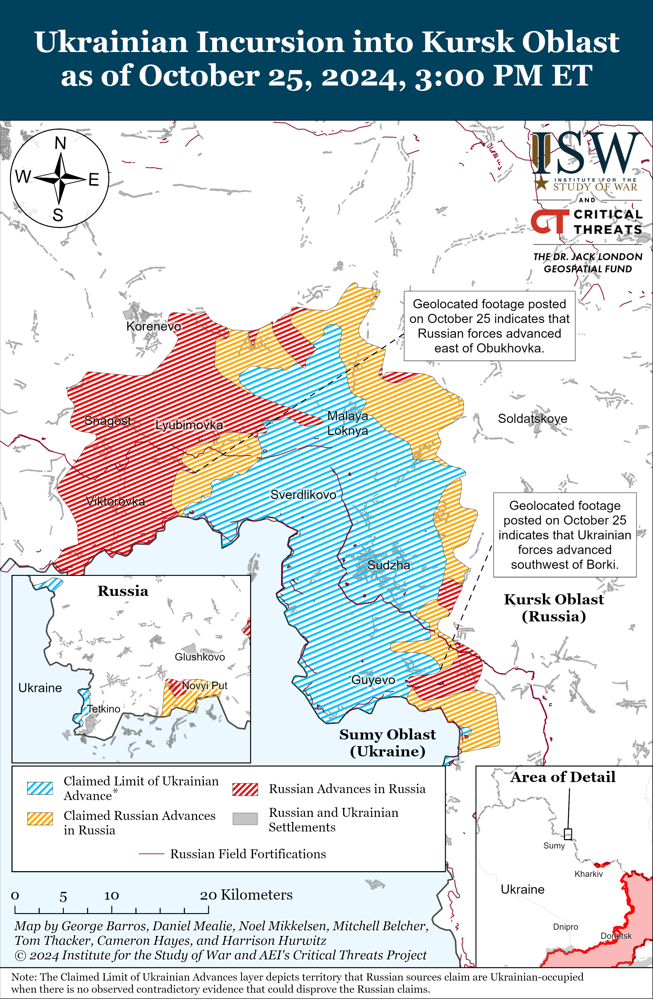
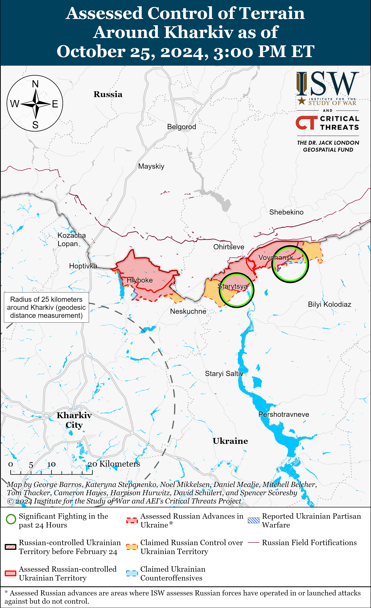
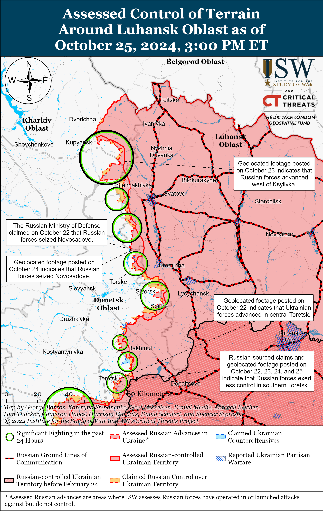
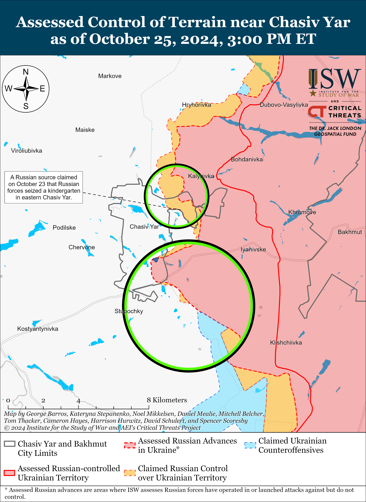
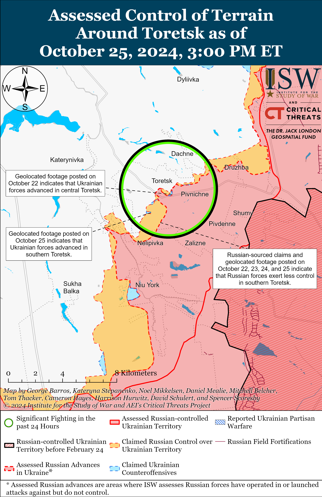
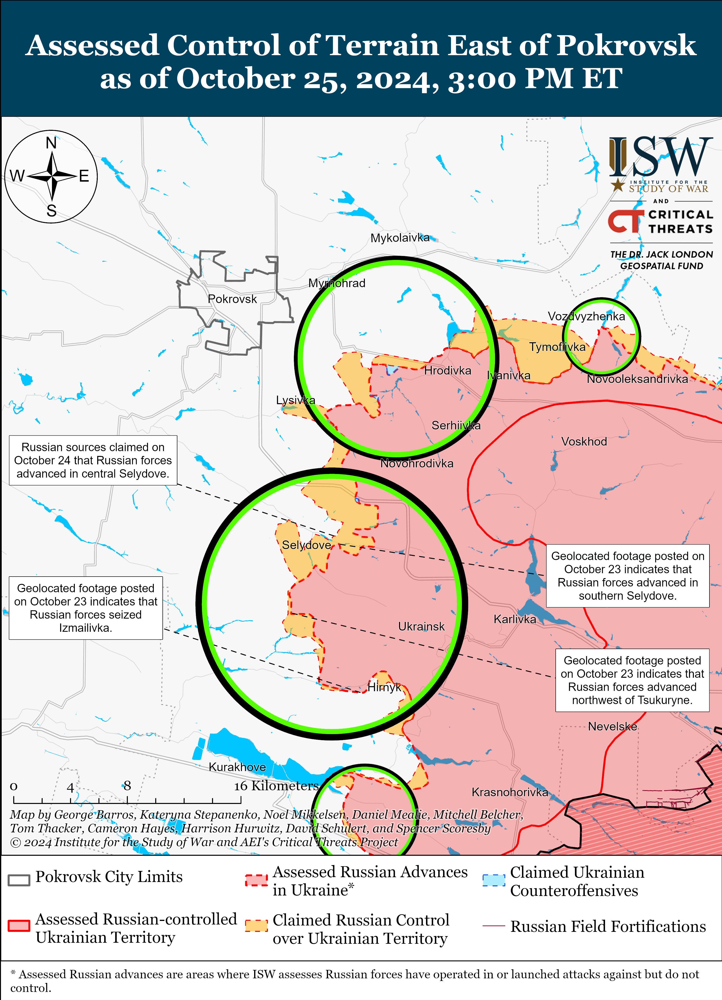
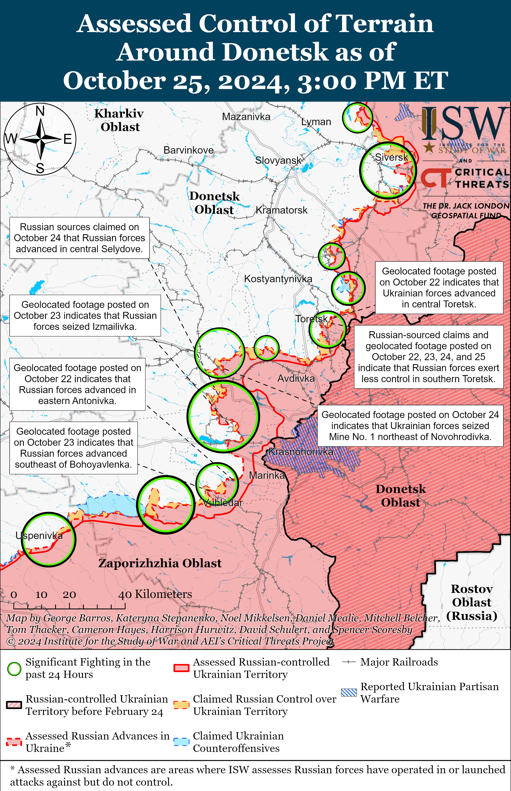
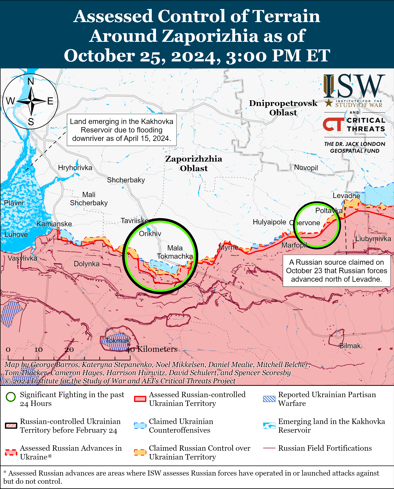
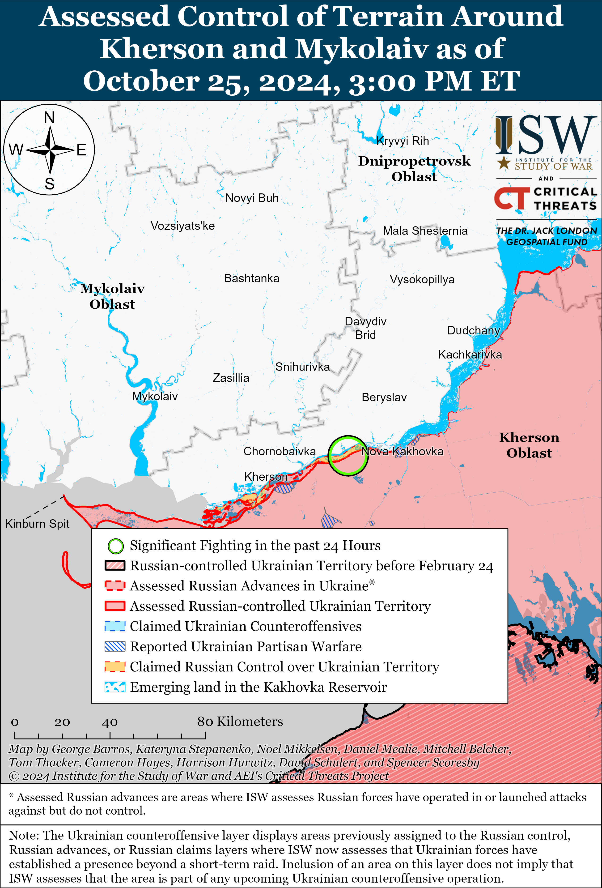

# Russian Offensive Campaign Assessment, October 25, 2024

**October 25, 2024, 7:05 pm ET**

**Click** [**here**](https://storymaps.arcgis.com/stories/36a7f6a6f5a9448496de641cf64bd375) **to see ISW’s interactive map of the Russian invasion of Ukraine. This map is updated daily alongside the static maps present in this report.**

**Click** [**here**](https://storymaps.arcgis.com/stories/83a2f24901c941d581c0c523ecd2619b) **to see ISW's interactive map of Ukraine's offensive in Kursk Oblast.**

**Click** [**here**](https://understandingwar.maps.arcgis.com/apps/instant/3dviewer/index.html?appid=1602762dbcde419bb957dea358449580) **to see ISW’s 3D control of terrain topographic map of Ukraine. Use of a computer (not a mobile device) is strongly recommended for using this data-heavy tool.**

**Click** [**here**](https://storymaps.arcgis.com/stories/733fe90805894bfc8562d90b106aa895) **to access ISW’s archive of interactive time-lapse maps of the Russian invasion of Ukraine. These maps complement the static control-of-terrain map that ISW produces daily by showing a dynamic frontline. ISW will update this time-lapse map archive monthly.**

**Note: The data cut-off for this product was 12:45pm ET on October 25. ISW will cover subsequent reports in the October 26 Russian Offensive Campaign Assessment.**

**Ukrainian President Volodymyr Zelensky warned that Russia will imminently deploy North Korean forces to unspecified combat zones on October 27 and 28, as Russian and North Korean officials continued to issue vague yet suggestive statements regarding the possible presence of North Korean troops in Russia**.[**[1]**](#_ednd26ca1eec8bf948674dfe27baecc47211) Zelensky stressed that Russia's involvement of North Korean forces in combat is an escalatory step and urged the international community to apply pressure on Moscow and Pyongyang. Dutch Defense Minister Ruben Brekelmans confirmed on October 25 that Dutch intelligence assesses that Russia is deploying at least 1,500 North Korean forces likely to Kursk Oblast.[[2]](#_ednd26ca1eec8bf948674dfe27baecc47212) Ukraine’s Main Military Intelligence Directorate (GUR) published an intercepted audio recording on October 25 in which elements of the Russian 810th Naval Infantry Brigade (Black Sea Fleet, Southern Military District [SMD]) operating in Kursk Oblast reportedly expressed concerns about the ability of North Korean troops to adjust to Russian command culture and language upon their deployment to the region.[[3]](#_ednd26ca1eec8bf948674dfe27baecc47213) A spokesperson of a Ukrainian air assault brigade operating in the Kursk direction stated that Ukrainian forces have not yet observed North Korean troops in Kursk Oblast and emphasized that North Korean forces do not have experience fighting in large-scale, technologically-driven wars.[[4]](#_ednd26ca1eec8bf948674dfe27baecc47214) Head of Ukraine’s Center for Military Legal Research Oleksandr Mysyenko stated on October 25 that Russia’s efforts to directly involve North Korean forces in the war are ultimately indicative of Russia's inability to recruit sufficient personnel amid systematic yet likely unsuccessful attempts to recruit volunteers domestically.[[5]](#_ednd26ca1eec8bf948674dfe27baecc47215)

North Korean Vice Foreign Minister Kim Jong Gyu failed to deny reports of North Korean troop deployments to Russia but claimed that such deployments would be in line with principles of international law.[[6]](#_ednd26ca1eec8bf948674dfe27baecc47216) Russian President Vladimir Putin once again failed to deny the presence of the North Korean troops in Russia during an interview with Russian state TV channel *Rossiya 1* on October 25 following the conclusion of the BRICS summit in Kazan, Republic of Tatarstan and stated that it is Russia’s sovereign decision to activate the Treaty on Comprehensive Strategic Partnership between Russia and North Korea signed on June 18, 2024.[[7]](#_ednd26ca1eec8bf948674dfe27baecc47217) Russian Deputy Foreign Minister Sergei Ryabkov similarly claimed that the provision of military assistance under the treaty is a signal of deterrence and that military assistance will be activated only in the event of “aggression” against any of the parties to the treaty.[[8]](#_ednd26ca1eec8bf948674dfe27baecc47218) The participation of North Korean troops in combat operations in Kursk Oblast or frontline areas in Ukraine would make North Korea an active combatant and belligerent in Russia's war in Ukraine. The Kremlin may be setting information operations to accuse Ukraine of being the aggressor in Russia's invasion of Ukraine to justify its use of North Korean forces as combatants in its war.

**Russian President Vladimir Putin signaled that Western “Ukraine fatigue” is encouraging Russia to continue its full-scale invasion of Ukraine and pursue its theory of victory predicated on Russia outlasting Western support for Ukraine.** Putin responded to a question during an interview with Russian state TV channel *Rossiya 1* on October 25 following the conclusion of the BRICS summit in Kazan, Republic of Tatarstan on whether exhausted Ukrainian troops, Western war fatigue, or Russian military’s power is contributing to the success of Russian theater-wide offensive operations.[[9]](#_ednd26ca1eec8bf948674dfe27baecc47219) Putin responded by stating that Russia should continue to double down on its war effort in Ukraine and not pay attention to discussions of the enemy's fatigue. Putin added that the West is “beginning to realistically assess the situation around Ukraine” and “change its rhetoric” about the need for Russia’s “strategic defeat,” and that Russia can “only praise” the West for this rhetorical shift away from complete Russian defeat in Ukraine. Putin later stated in the interview that any outcome of Russia’s war in Ukraine must be in Russia’s favor and be based on the "realities on the battlefield," indicating that Russia remains committed to its original goal of forcing the Ukrainian government to capitulate and destroying Ukraine’s statehood and military and that Western hesitance in support for Ukraine only encourages Russia's commitment to this goal. ISW continues to assess that Putin’s theory of victory rests on a critical assumption that the West will abandon Ukraine to Russian victory, either of its own accord or in response to Russian efforts to persuade the West to do so, and that it is far from clear that the West will do so.[[10]](#_ednd26ca1eec8bf948674dfe27baecc472110)

**Putin also continued to exaggerate Russian progress in Kursk Oblast, likely in an attempt to reassure domestic audiences of the Russian military's ability to suppress Ukraine's incursion into Kursk Oblast.** Putin responded to a question during his interview with Russian state TV channel *Rossiya 1* on October 25 about his earlier claims on October 24 that Russian forces “blocked” roughly 2,000 Ukrainian soldiers in Kursk Oblast.[[11]](#_ednd26ca1eec8bf948674dfe27baecc472111) Putin doubled down on this claim, stating that Ukrainian forces that are “encircled” in Kursk Oblast “do not even really understand that they are encircled.”[[12]](#_ednd26ca1eec8bf948674dfe27baecc472112) Putin also claimed that Ukrainian forces have lost control over encircled units and emphasized that the Russian Ministry of Defense (MoD) had not publicly reported on claimed successful Russian infiltration of some Ukrainian positions in Kursk Oblast. Putin once again failed to acknowledge that the Ukrainian salient in Kursk Oblast extends from the Ukrainian-Russian international border and that Ukrainian forces can freely transit the sections of the border under Ukrainian control. Ukrainian Commander-in-Chief Colonel General Oleksandr Syrskyi notably refuted Putin’s October 24 claims of Ukrainian forces being encircled and suffering significant losses, and in turn, reported that Russian manpower casualties total 17,819 personnel (including 711 prisoners of war [POWs]) since August 8.[[13]](#_ednd26ca1eec8bf948674dfe27baecc472113) ISW cannot independently verify Ukrainian estimates of Russian losses, however, Russian and Ukrainian reporting indicates that Ukrainian forces are continuing to operate in Kursk Oblast.[[14]](#_ednd26ca1eec8bf948674dfe27baecc472114) Putin’s exaggerated statistics on Ukrainian losses are likely part of his attempt to explain away Russia’s inability to decisively repel the Ukrainian incursion into Kursk Oblast after nearly three months in the context of the likely imminent deployment of North Korean troops to combat in this area.

**Russian President Vladimir Putin promoted former Donetsk People’s Republic (DNR) “Sparta” Battalion Commander and Plenipotentiary Representative in the Urals Lieutenant Colonel Artyom Zhoga to the Russian Security Council, likely in an ongoing effort to establish younger, pro-war figures within the Kremlin.** Putin signed a decree on October 25 adding Zhoga to the Russian Security Council — a key Russian consultative body that informs Putin’s decisions on national security issues.[[15]](#_ednd26ca1eec8bf948674dfe27baecc472115) Zhoga previously served as a member of Putin's re-election campaign initiatives group, and the Kremlin previously highlighted Zhoga and an interaction between Zhoga and Putin to announce Putin's presidential bid in December 2023.[[16]](#_ednd26ca1eec8bf948674dfe27baecc472116) Zhoga is also the highest-profile Kremlin appointee from the ”Time of Heroes” professional training program that aims to prepare Russian veterans to take municipal, regional, and federal government positions.[[17]](#_ednd26ca1eec8bf948674dfe27baecc472117) Zhoga is now the youngest member of the Russian Security Council at 49 years old. A Russian Telegram channel that routinely shares insider information commented on Zhoga’s appointment, stating that Putin typically includes newly appointed plenipotentiaries in the Russian Security Council, and Putin appointed Zhoga as the Presidential Representative to the Ural Federal Okrug on October 2.[[18]](#_ednd26ca1eec8bf948674dfe27baecc472118) The Telegram channel added that Zhoga’s appointment significantly increased the influence of Russian Presidential Administration First Deputy Head Sergei Kiriyenko’s group within the Kremlin.[[19]](#_ednd26ca1eec8bf948674dfe27baecc472119) Kiriyenko has been a leading figure in the Kremlin’s efforts to establish a new elite via the ”Time of Heroes” program.[[20]](#_ednd26ca1eec8bf948674dfe27baecc472120) Zhoga’s appointment follows the promotion of presidential aide and close personal ally Alexei Dyumin to the Russian Security Council on September 30.[[21]](#_ednd26ca1eec8bf948674dfe27baecc472121) Dyumin had been the youngest-ever member of the council before Zhoga.[[22]](#_ednd26ca1eec8bf948674dfe27baecc472122) ISW continues to assess that Putin appears to be using the "Time of Heroes" program to militarize the Russian government, further solidify a pro-war ideology in the Russian state and society, and form a new, highly militarized elite class.[[23]](#_ednd26ca1eec8bf948674dfe27baecc472123)

**Kremlin Spokesperson Dmitry Peskov claimed that Russia does not seek to “influence” elections of other countries "unlike the West" amid continued evidence to the contrary.[[24]](#_ednd26ca1eec8bf948674dfe27baecc472124)** Peskov stated on October 25 that the January 2025 presidential elections in Belarus are an “internal matter” but that everyone in Russia will support Belarusian President Alexander Lukashenko's candidacy nevertheless. Peskov claimed that while the West interfered in the 2020 Belarusian presidential elections, the West will likely fail to do so again given that Belarus has learned from previous experience. Peskov also accused the West of unprecedented attempts to interfere in the Georgian and Moldovan elections and claimed that Moscow is not trying to influence the elections of these countries. Peskov’s accusations come amid statements from Moldovan officials, including Moldovan President Maia Sandu, about unprecedented levels of election interference from Kremlin-linked officials in the first round of Moldovan presidential elections that were held on October 20.[[25]](#_ednd26ca1eec8bf948674dfe27baecc472125) Sandu stated on October 21 that Moldovan authorities have evidence that criminal groups wanted to buy 300,000 Moldovan votes against Moldova’s European Union (EU) membership referendum and Sandu herself in favor of pro-Russian presidential candidates. The Georgian parliamentary elections will be held on October 26 and Russian officials and milbloggers have launched information operations portraying Georgian Dream as the stable choice for Georgia’s future and discrediting openly pro-Western opposition parties while suggesting that a Georgian Dream victory could lead to territorial reconciliation, including potential compromises on the Russian-occupied regions of Abkhazia and South Ossetia.[[26]](#_ednd26ca1eec8bf948674dfe27baecc472126) Russia has a rich history of attempting to influence elections in post-Soviet countries in its favor through war, economic pressures, political threats, information operations, and other modes of meddling.[[27]](#_ednd26ca1eec8bf948674dfe27baecc472127)

**Russian authorities swiftly responded to xenophobic riots in Korkino, Chelyabinsk Oblast on October 25, a marked change from Russian authorities' slow and disorganized response to the October 2023 antisemitic riots in the Republic of Dagestan.[[28]](#_ednd26ca1eec8bf948674dfe27baecc472128)** Russian Investigative Committee Head Alexander Bastrykin ordered a federal-level investigation into the murder of a female taxi driver purportedly by a member of the local Roma community in Korkino and the ensuing riots during which roughly 150 people attacked the home of several Roma people.[[29]](#_ednd26ca1eec8bf948674dfe27baecc472129) Russian authorities reportedly quickly quelled the riot, detained 30 people, and blocked a Telegram channel accused of encouraging locals to participate in the riot.[[30]](#_ednd26ca1eec8bf948674dfe27baecc472130) Russian authorities have consistently struggled to balance placating xenophobic sentiments among Russian ultranationalists and Russian communities with maintaining Russia's economic and internal security, particularly given Russia's dependence on migrants and non-ethnic Russian communities for economic growth and force generation.[[31]](#_ednd26ca1eec8bf948674dfe27baecc472131) ISW has previously noted that the Kremlin is working to develop the capacity to use information operations on social media platforms to trigger kinetic activity, and the role of social media accounts in provoking such riots highlights the influence that such Russian operations could have abroad.[[32]](#_ednd26ca1eec8bf948674dfe27baecc472132)

**German arms manufacturer Rheinmetall announced on October 24 that it recently delivered 20 additional Marder infantry fighting vehicles to Ukraine and noted that Germany financed the delivery of the vehicles.[[33]](#_ednd26ca1eec8bf948674dfe27baecc472133)**

**Key Takeaways:**

- **Ukrainian President Volodymyr Zelensky warned that Russia will imminently deploy North Korean forces to unspecified combat zones on October 27 and 28, as Russian and North Korean officials continued to issue vague yet suggestive statements regarding the possible presence of North Korean troops in Russia.**
- **Russian President Vladimir Putin signaled that Western “Ukraine fatigue” is encouraging Russia to continue its full-scale invasion of Ukraine and pursue its theory of victory predicated on Russia outlasting Western support for Ukraine.**
- **Putin also continued to exaggerate Russian progress in Kursk Oblast, likely in an attempt to reassure domestic audiences of the Russian military's ability to suppress Ukraine's incursion into Kursk Oblast.**
- **Russian President Vladimir Putin promoted former Donetsk People’s Republic (DNR) “Sparta” Battalion Commander and Plenipotentiary Representative in the Urals Lieutenant Colonel Artyom Zhoga to the Russian Security Council, likely in an ongoing effort to establish younger, pro-war figures within the Kremlin.**
- **Kremlin Spokesperson Dmitry Peskov claimed that Russia does not seek to “influence” elections of other countries "unlike the West" amid continued evidence to the contrary.**
- **Russian authorities swiftly responded to xenophobic riots in Korkino, Chelyabinsk Oblast on October 25, a marked change from Russian authorities' slow and disorganized response to the October 2023 antisemitic riots in the Republic of Dagestan.**
- **German arms manufacturer Rheinmetall announced on October 24 that it recently delivered 20 additional Marder infantry fighting vehicles to Ukraine and noted that Germany financed the delivery of the vehicles.**
- **Ukrainian forces advanced near Borki and regained lost territory near Chasiv Yar and Toretsk.**
- **Russian forces advanced near Siversk, Pokrovsk, and regained territory near Obukhovka.**
- **The Kremlin is continuing to forge new state-affiliated veteran societies and organizations likely in an ongoing effort to replace veteran organizations that have been critical of Russia’s conduct of war in Ukraine.**

***We do not report in detail on Russian war crimes because these activities are well-covered in Western media and do not directly affect the military operations we are assessing and forecasting. We will continue to evaluate and report on the effects of these criminal activities on the Ukrainian military and the Ukrainian population and specifically on combat in Ukrainian urban areas. We utterly condemn Russian violations of the laws of armed conflict and the Geneva Conventions and crimes against humanity even though we do not describe them in these reports.***

- Ukrainian Operations in the Russian Federation
- Russian Main Effort – Eastern Ukraine (comprised of three subordinate main efforts)
- Russian Subordinate Main Effort #1 – Push Ukrainian forces back from the international border with Belgorod Oblast and approach t within tube artillery range of Kharkiv City
- Russian Subordinate Main Effort #2 – Capture the remainder of Luhansk Oblast and push westward into eastern Kharkiv Oblast and encircle northern Donetsk Oblast
- Russian Subordinate Main Effort #3 – Capture the entirety of Donetsk Oblast
- Russian Supporting Effort – Southern Axis
- Russian Air, Missile, and Drone Campaign
- Russian Mobilization and Force Generation Efforts
- Russian Technological Adaptations
- Activities in Russian-occupied areas
- Significant Activity in Belarus

**Ukrainian Operations in the Russian Federation**

Ukrainian and Russian forces recently advanced in Ukraine's main salient in Kursk Oblast amid continued fighting on October 25. Geolocated footage published on October 25 indicates that Ukrainian forces recently advanced west of Borki (southeast of Sudzha).[[34]](#_ednd26ca1eec8bf948674dfe27baecc472134) Additional geolocated footage published on October 25 indicates that Russian forces recently recaptured positions east of Obukhovka (southeast of Korenevo).[[35]](#_ednd26ca1eec8bf948674dfe27baecc472135) Russian milbloggers claimed that Russian forces also advanced near Novoivanovka (southeast of Korenevo) and Plekhovo (southeast of Sudzha).[[36]](#_ednd26ca1eec8bf948674dfe27baecc472136) A Kremlin-affiliated milblogger claimed that reports that Russian forces recaptured Darino (southeast of Korenevo and southeast of Lyubimovka) are unconfirmed.[[37]](#_ednd26ca1eec8bf948674dfe27baecc472137) Russian sources, including the Russian Ministry of Defense (MoD), claimed that Ukrainian forces unsuccessfully counterattacked southeast of Korenevo near Novoivanovka, Zeleny Shlyakh, and Alexandriya; east of Sudzha near Russkaya Konopelka; and southeast of Sudzha near Plekhovo.[[38]](#_ednd26ca1eec8bf948674dfe27baecc472138) A Russian milblogger claimed on October 24 that Ukrainian forces seized positions south of Kireyevka (north of Sudzha and on the northeastern edge of the Ukrainian main salient in Kursk Oblast).[[39]](#_ednd26ca1eec8bf948674dfe27baecc472139) Elements of the Russian 155th Naval Infantry Brigade (Pacific Fleet, Eastern Military District [EMD]) reportedly continue to operate in Kursk Oblast.[[40]](#_ednd26ca1eec8bf948674dfe27baecc472140)

Fighting continued in Glushkovsky Raion west of the main Ukrainian salient in Kursk Oblast on October 25, but there were no confirmed changes to the frontline. Russian sources, including the Russian MoD, claimed that Ukrainian forces unsuccessfully attacked with one tank and two armored fighting vehicles near Novy Put (south of Glushkovo).[[41]](#_ednd26ca1eec8bf948674dfe27baecc472141) A Russian milblogger claimed that there are unconfirmed reports that some Ukrainian forces withdrew beyond the international border into Ukraine following fighting near Novy Put, but ISW has not observed confirmation of this claim.[[42]](#_ednd26ca1eec8bf948674dfe27baecc472142)

**Russian Main Effort – Eastern Ukraine**

**Russian Subordinate Main Effort #1 – Kharkiv Oblast** **(Russian objective: Push Ukrainian forces back from the international border with Belgorod Oblast and approach to within tube artillery range of Kharkiv City)**

Russian forces continued offensive operations in northern Kharkiv Oblast on October 25 but did not make any confirmed advances. Russian forces continued ground attacks northeast of Kharkiv City near Vovchansk and Starytsya (southwest of Vovchansk) on October 24 and 25.[[43]](#_ednd26ca1eec8bf948674dfe27baecc472143)

**Russian Subordinate Main Effort #2 – Luhansk Oblast (Russian objective: Capture the remainder of Luhansk Oblast and push westward into eastern Kharkiv Oblast and northern Donetsk Oblast)**

Russian forces continued offensive operations along the Kupyansk-Svatove-Kreminna line on October 25, but there were no confirmed changes to the frontline. Russian sources claimed that Russian forces advanced two kilometers near Stelmakhivka (west of Svatove) and that Russian forces control "most of" Kruhlyakivka (south of Kupyansk).[[44]](#_ednd26ca1eec8bf948674dfe27baecc472144) ISW has not observed confirmation of this claim of Russian advances and has only observed visual confirmation that Russian forces occupy roughly 25 percent of Kruhlyakivka. Russian forces continued offensive operations north of Kupyansk near Holubivka; southeast of Kupyansk near Pishchane, Kruhlyakivka, Lozova, Kolisnykivka, and Novoosynove; west of Svatove near Vyshneve; southwest of Svatove near Druzhelyubivka; northwest of Kreminna near Hrekivka, Katerynivka, and Tverdokhlibove; west of Kreminna near Terny, Zarichne, and Torske; and south of Kreminna near Serebryanka.[[45]](#_ednd26ca1eec8bf948674dfe27baecc472145) Russian milbloggers claimed that Russian forces are continuing to destroy bridges over the Oskil River in order to sever Ukrainian ground lines of communication (GLOCs) in the Kupyansk direction, with one Russian milblogger claiming that Russian forces destroyed the last crossing over the river.[[46]](#_ednd26ca1eec8bf948674dfe27baecc472146)

Ukrainian forces continue to strike Russian air defenses in the Russian near rear. The Ukrainian General Staff reported on October 25 that Ukrainian forces struck a Russian Buk-M3 air defense system and destroyed the 9C36 radar system of a Buk-M2 air defense system in occupied Luhansk Oblast "several tens of kilometers" from the frontline on the night of October 24 to 25.[[47]](#_ednd26ca1eec8bf948674dfe27baecc472147) Ukrainian official sources reported that Ukrainian forces struck a Russian Buk-M3 system on the night of October 20 to 21 in an unspecified area roughly 60 kilometers from the frontline as well as a Russian Buk-M2 system in southern Ukraine on October 23. [[48]](#_ednd26ca1eec8bf948674dfe27baecc472148)

**Russian Subordinate Main Effort #3 – Donetsk Oblast (Russian objective: Capture the entirety of Donetsk Oblast, the claimed territory of Russia’s proxies in Donbas)**

Russian forces recently advanced east of Siversk amid continued offensive operations in the area on October 25. Geolocated footage published on October 16 indicates that Russian forces recently advanced southwest of Verkhnokamyanka (east of Siversk) during a platoon-sized Russian mechanized assault.[[49]](#_ednd26ca1eec8bf948674dfe27baecc472149) The Ukrainian General Staff reported that Russian forces attacked near Vyimka and Ivano-Darivka (both southeast of Siversk) on October 24 and 25.[[50]](#_ednd26ca1eec8bf948674dfe27baecc472150) Elements of the Russian 2nd Artillery Brigade (3rd Combined Arms Army [CAA], formerly 2nd Luhansk People’s Republic [LNR] Army Corps [AC]) are reportedly operating near Vyimka.[[51]](#_ednd26ca1eec8bf948674dfe27baecc472151)

Ukrainian forces recently regained positions near Chasiv Yar amid continued Russian offensive operations in the area on October 25. Geolocated footage published on October 24 shows that Ukrainian forces are operating southeast of Chasiv Yar at Mine Block 9 where ISW previously observed Russian forces operating - indicating that Ukrainian forces recently regained lost positions in the area.[[52]](#_ednd26ca1eec8bf948674dfe27baecc472152) A Russian milblogger claimed that Russian forces advanced into a forested area east of Chasiv Yar, but ISW has not observed visual evidence to confirm this claim.[[53]](#_ednd26ca1eec8bf948674dfe27baecc472153) Russian forces attacked near Chasiv Yar and Predtechyne (south of Chasiv Yar) on October 24 and 25.[[54]](#_ednd26ca1eec8bf948674dfe27baecc472154) A Russian milblogger claimed that rainy weather conditions are forcing Russian forces to utilize vehicles more suitable for muddy conditions, including all-terrain vehicles (ATVs) and SUVs, instead of motorcycles in Bakhmut Raion.[[55]](#_ednd26ca1eec8bf948674dfe27baecc472155) The milblogger noted that Russian infantry movement is currently "slow, labor-intensive, and generally ineffective." Elements of the Russian 4th Motorized Rifle Brigade (3rd CAA) are reportedly operating south of Chasiv Yar.[[56]](#_ednd26ca1eec8bf948674dfe27baecc472156) Elements of the Russian 98th Airborne (VDV) Division and the 88th "Hispaniola" Volunteer Brigade (Russian Volunteer Corps) are reportedly operating in Chasiv Yar.[[57]](#_ednd26ca1eec8bf948674dfe27baecc472157)

Ukrainian forces recently regained positions in southern Toretsk amid continued Russian assaults in and around the settlement on October 25. Geolocated footage published on October 25 shows that Ukrainian forces are operating along Tobolenka Street in southern Toretsk where ISW previously observed confirmed Russian advances – indicating that Ukrainian forces recently regained lost positions in the area.[[58]](#_ednd26ca1eec8bf948674dfe27baecc472158) A Russian milblogger claimed that Russian forces advanced in Shcherbynivka (west of Toretsk), but ISW has not observed visual evidence to confirm this claim.[[59]](#_ednd26ca1eec8bf948674dfe27baecc472159) Russian forces attacked near Toretsk on October 25.[[60]](#_ednd26ca1eec8bf948674dfe27baecc472160) Elements of the Russian 2nd Motorized Rifle Battalion of the 9th Motorized Rifle Brigade (51st CAA, formerly 1st Donetsk People's Republic [DNR] AC, Southern Military District [SMD]) and the ”Sparta” Reconnaissance Battalion (51st CAA) are reportedly operating near Nelipivka (northwest of Toretsk) and Toretsk, respectively.[[61]](#_ednd26ca1eec8bf948674dfe27baecc472161)

****

Russian forces recently advanced southeast of Pokrovsk amid continued Russian offensive operations east and southeast of the town on October 25. Geolocated footage published on October 24 indicates that elements of the "Maxim Krivonos" volunteer detachment, allegedly formed by former members of the Ukrainian Armed Forces who defected to fight for Russia, recently regained positions near Mine No. 1 northeast of Novohrodivka (southeast of Pokrovsk).[[62]](#_ednd26ca1eec8bf948674dfe27baecc472162) Russian milbloggers claimed that Russian forces continued to advance within and near Selydove (southeast of Pokrovsk), including in Seldyove's 11th Microraion in the northern part of the settlement, and advanced along Berehova, Tsentralna, and Shevchenka streets within central and eastern Selydove.[[63]](#_ednd26ca1eec8bf948674dfe27baecc472163) Russian milbloggers claimed that Russian forces advanced along the railway line into Vyshneve (south of Pokrovsk and west of Seldyove) and advanced into eastern Kreminna Balka from Tsukuryne (both south of Selydove), although one milblogger noted that Ukrainian forces maintain positions in Vyshneve.[[64]](#_ednd26ca1eec8bf948674dfe27baecc472164) Russian milbloggers also claimed that Russian forces advanced into eastern Novodmytrivka (southeast of Selydove) and near Novoselydivka (south of Selydove) and seized positions in western Hirnyk (southeast of Selydove).[[65]](#_ednd26ca1eec8bf948674dfe27baecc472165) Russian forces continued assaults east of Pokrovsk near Myrolyubivka, Novotoretske, Vozdvyzhenka, and Krutyi Yar and southeast of Pokrovsk near Krasnyi Yar, Lysivka, Sukhyi Yar, Novohrodivka, Marynivka, Mykolaivka, Selydove, Mykhailivka, Novodmytrivka, Hirnyk, Zoryane, Izmailivka, and Novoselydivka on October 24 and 25.[[66]](#_ednd26ca1eec8bf948674dfe27baecc472166) Elements of the Russian "Black Hussars" detachment of the Russian 15th Motorized Rifle Brigade and the 27th Motorized Rifle Division (both of the 2nd CAA, Central Military District [CMD]), including its 506th Motorized Rifle Regiment, are reportedly operating near Selydove.[[67]](#_ednd26ca1eec8bf948674dfe27baecc472167) Elements of the Russian "Mora" detachment reportedly continue to operate near Memryk (southeast of Pokrovsk).[[68]](#_ednd26ca1eec8bf948674dfe27baecc472168)

Russian forces continued offensive operations east of Kurakhove on October 25, but there were no confirmed changes to the frontline in this area. A Russian milblogger claimed that Russian forces are advancing south of Heorhiivka.[[69]](#_ednd26ca1eec8bf948674dfe27baecc472169) A Russian milblogger claimed that Russian forces have encircled roughly 20 Ukrainian servicemembers in Hostre and that Ukrainian forces are engaging Russian forces with small arms fire, although another Russian milblogger denied this claim.[[70]](#_ednd26ca1eec8bf948674dfe27baecc472170) Russian forces continued offensive operations near Maksymilyanivka and Hostre on October 24 and 25.[[71]](#_ednd26ca1eec8bf948674dfe27baecc472171) Elements of the Russian 238th Artillery Brigade (8th CAA, Southern Military District [SMD]) are reportedly operating near Dalnye (south of Kurakhove).[[72]](#_ednd26ca1eec8bf948674dfe27baecc472172)

Russian forces continued offensive operations southeast of Donetsk City on October 25, but there were no confirmed changes to the frontline. Russian forces continued offensive operations northeast of Vuhledar near Kostyantynivka, Katerynivka, Antonivka, and Vodyane and north of Vuhledar near Novoukrainka and Bohoyavlenka on October 24 and 25.[[73]](#_ednd26ca1eec8bf948674dfe27baecc472173) Russian milbloggers claimed that Russian forces advanced near Katerynivka, in an area 3.85 kilometers wide and 1.5 kilometers in depth near Bohoyavlenka from Vodyane and Vuhledar, and into Shakhtarske (west of Vuhledar).[[74]](#_ednd26ca1eec8bf948674dfe27baecc472174) ISW has not observed confirmation of these claims, however. Elements of the Russian 57th Motorized Rifle Brigade (5th CAA, Eastern Military District [EMD]) are reportedly operating near Bohoyavlenka.[[75]](#_ednd26ca1eec8bf948674dfe27baecc472175) Elements of the Russian 26th Radio, Chemical, and Biological Protection Regiment (36th CAA, Eastern Military District [EMD]) are reportedly operating near Novodonetske (west of Vuhledar).[[76]](#_ednd26ca1eec8bf948674dfe27baecc472176)

Neither Russian nor Ukrainian sources reported on Russian activity in the Donetsk-Zaporizhia Oblast border area on October 25.

**Russian Supporting Effort – Southern Axis (Russian objective: Maintain frontline positions and secure rear areas against Ukrainian strikes)**

Russian forces continued assaults in western Zaporizhia Oblast northeast of Robotyne near Novoandrivka and north of Robotyne in the direction of Novodanylivka on October 24 and 25 but there were no confirmed changes to the frontline.[[77]](#_ednd26ca1eec8bf948674dfe27baecc472177) Ukrainian Volunteer Army Spokesperson Serhiy Bratchuk reported on October 25 that Russian forces are transferring additional reserve forces to the Zaporizhia direction from rear areas of Russian-occupied Ukraine.[[78]](#_ednd26ca1eec8bf948674dfe27baecc472178) Bratchuk noted that Russian forces are intensifying assault operations in the Zaporizhia direction and that Russian sabotage and reconnaissance groups are operating more actively and trying to identify vulnerabilities in Ukrainian defenses in this direction.

Russian forces continued attacks in east (left) bank Kherson Oblast on October 24 and 25 but did not make any confirmed advances.[[79]](#_ednd26ca1eec8bf948674dfe27baecc472179) Elements of the Russian 80th Arctic Brigade (14th Army Corps [AC], Leningrad Military District [LMD]) reportedly continue operating in the Kherson direction.[[80]](#_ednd26ca1eec8bf948674dfe27baecc472180) Elements of the Russian BARS-33 Detachment (Russian Combat Army Reserve) reportedly continue to operate in the Kherson direction.[[81]](#_ednd26ca1eec8bf948674dfe27baecc472181)

**Russian Air, Missile, and Drone Campaign (Russian Objective: Target Ukrainian military and civilian infrastructure in the rear and on the frontline)**

Russian forces conducted a series of drone strikes against Ukraine on the night of October 24 to 25. The Ukrainian Air Force reported that Russian forces launched 63 Shahed-136/131 drones and other drones of an unidentified type from Oryol and Kursk oblasts and Primorsko-Akhtarsk, Krasnodar Krai.[[82]](#_ednd26ca1eec8bf948674dfe27baecc472182) Ukrainian forces reportedly destroyed 36 drones over Odesa, Kyiv, Mykolaiv, Dnipropetrovsk, Vinnytsia, Kirovohrad, Zhytomyr, Khmelnytskyi, Cherkasy, Lviv, Rivne, and Poltava oblasts as of 1000 local time on October 25, and 16 Russian drones were reportedly "lost in location," possibly due to Ukrainian electronic warfare (EW) countermeasures. Kyiv City Military Administration Head Serhiy Popko reported that drone debris fell in Darnytskyi Raion, starting a fire in an open area.[[83]](#_ednd26ca1eec8bf948674dfe27baecc472183)

**Russian Mobilization and Force Generation Efforts (Russian objective: Expand combat power without conducting general mobilization)**

The Russian government signed a bill on October 25 that will allow military personnel on leave to receive medical care at any hospital or clinic, likely in part to placate Russian ultranationalists and milbloggers.[[84]](#_ednd26ca1eec8bf948674dfe27baecc472184) The Russian government signed this bill into law based on Russian President Vladimir Putin’s instructions, and this law will be in effect for the duration of the Russian full-scale invasion of Ukraine.[[85]](#_ednd26ca1eec8bf948674dfe27baecc472185) The Russian Ministry of Defense (MoD) previously only allowed Russian servicemen to seek medical assistance at Russian MoD-affiliated hospitals while on vacations, which is not available in all Russian regions. Russian milbloggers claimed that they raised this problem during their first meeting with Defense Minister Andrei Belousov, and ISW had routinely assessed that Belousov’s meetings with milbloggers are likely part of the ongoing Kremlin effort to coopt the Russian milblogger community.[[86]](#_ednd26ca1eec8bf948674dfe27baecc472186)

The Kremlin is continuing to forge new state-affiliated veterans societies and organizations likely in an ongoing effort to replace veterans organizations that have been critical of Russia’s conduct of war in Ukraine. The Russian MoD announced on October 25 that the founding meeting of the “SVOi” Military Brotherhood (a play on Russia's use of the term "special military operation" [SVO] and the Russian word "svoi" - which means our own) took place in the Central House of the Russian Army (CDRA) in Moscow, and that military personnel and veterans of Russia’s full-scale invasion of Ukraine organized the event.[[87]](#_ednd26ca1eec8bf948674dfe27baecc472187) The Russian MoD claimed that the All-Russian Public Organization of Veterans and its chairperson, Army General Viktor Yermakov, and the leaders of the other veteran organizations also initiated the founding of the “SVOi” organization. The “SVOi” organization will reportedly focus on providing assistance to Russian servicemen and paying tribute to deceased personnel. Russian veteran organizations, notably the All-Russian Officers Assembly and the Moscow Oblast detachment of the ”Airborne Union” veteran association, had previously criticized the Kremlin’s conduct of the war and command changes, respectively.[[88]](#_ednd26ca1eec8bf948674dfe27baecc472188) The Kremlin may be attempting to form new state-run veteran organizations to prevent veterans from criticizing or opposing the regime.

**Russian Technological Adaptations** **(Russian objective: Introduce technological innovations to optimize systems for use in Ukraine)**

Nothing significant to report.

**Activities in Russian-occupied areas (Russian objective: Consolidate administrative control of annexed areas; forcibly integrate Ukrainian citizens into Russian sociocultural, economic, military, and governance systems)**

*ISW is not reporting on activities in Russian-occupied areas today.*

**Significant activity in Belarus** **(Russian efforts to increase its military presence in Belarus and further integrate Belarus into Russian-favorable frameworks and Wagner Group activity in Belarus)**

Belarusian President Alexander Lukashenko claimed on October 25 that the prospect of Belarus joining the Russian Federation is impossible and infeasible and that Russian President Vladimir Putin has never "set himself the goal of conquering Ukraine."[[89]](#_ednd26ca1eec8bf948674dfe27baecc472189)

**Note: ISW does not receive any classified material from any source, uses only publicly available information, and draws extensively on Russian, Ukrainian, and Western reporting and social media as well as commercially available satellite imagery and other geospatial data as the basis for these reports. References to all sources used are provided in the endnotes of each update.**

---

[[1]](#_ednd26ca1eec8bf948674dfe27baecc4721ref1) https://t.me/V\_Zelenskiy\_official/12188 ; https://armyinform.com dot ua/2024/10/25/kurska-operacziya-ta-novi-zagrozy-glava-derzhavy-pro-uchast-pivnichnokorejskyh-soldativ/ ; https://suspilne dot media/865729-persi-vijskovi-kndr-zajdut-u-zoni-bojovih-dij-27-28-zovtna-zelenskij/ ; https://t.me/RVvoenkor/79383

[[2]](#_ednd26ca1eec8bf948674dfe27baecc4721ref2) https://x.com/DefensieMin/status/1849723779263418868 ; https://suspilne dot media/865791-rozvidka-niderlandiv-u-rosii-rozgortaut-sili-z-1500-vijskovih-kndr/

[[3]](#_ednd26ca1eec8bf948674dfe27baecc4721ref3) https://t.me/DIUkraine/4725

[[4]](#_ednd26ca1eec8bf948674dfe27baecc4721ref4) <https://www.youtube.com/watch?v=j5TqaWCCdUg> ; [https://armyinform.com](https://armyinform.com/) dot ua/2024/10/25/armiya-ne-pershoyi-svizhosti-pivnichnokorejski-generaly-ne-mayut-dosvidu-tehnologichnoyi-vijny/

[[5]](#_ednd26ca1eec8bf948674dfe27baecc4721ref5) https://armyinform.com dot ua/2024/10/25/strana-ogromnaya-ne-vstala-navishho-rf-dodala-korejskyj-sous-u-vijnu-z-ukrayinoyu/

[[6]](#_ednd26ca1eec8bf948674dfe27baecc4721ref6) <https://www.usnews.com/news/world/articles/2024-10-25/north-korea-says-dispatch-of-troops-if-true-would-be-in-line-with-international-norms> ; <https://www.reuters.com/world/north-korea-says-dispatch-troops-if-true-would-be-line-with-international-norms-2024-10-25/> ; <https://t.me/bbcrussian/72030>

[[7]](#_ednd26ca1eec8bf948674dfe27baecc4721ref7) [https://smotrim](https://smotrim/) dot ru/video/2884913

[[8]](#_ednd26ca1eec8bf948674dfe27baecc4721ref8) https://t.me/tass\_agency/281686

[[9]](#_ednd26ca1eec8bf948674dfe27baecc4721ref9) <https://tass> dot ru/politika/22226293; [https://smotrim](https://smotrim/) dot ru/video/2884913

[[10]](#_ednd26ca1eec8bf948674dfe27baecc4721ref10) https://www.understandingwar.org/backgrounder/russian-offensive-campaign-assessment-june-7-2024

[[11]](#_ednd26ca1eec8bf948674dfe27baecc4721ref11) https://smotrim dot ru/video/2884913; https://understandingwar.org/backgrounder/russian-offensive-campaign-assessment-october-24-2024

[[12]](#_ednd26ca1eec8bf948674dfe27baecc4721ref12) <https://ria> dot ru/20241025/kurskaya-1979974687.html

[[13]](#_ednd26ca1eec8bf948674dfe27baecc4721ref13) <https://www.facebook.com/CinCAFofUkraine/posts/pfbid02jTvBsBbjeMyRN8S9GYebMXzVDYBmH3E3ymZqmteAeWwpP9Z17ur2j4tW4VferT97l> ; <https://t.me/osirskiy/905> ; https://armyinform.com dot ua/2024/10/25/oleksandr-syrskyj-sprostuvav-zayavy-pro-otochennya-ukrayinskyh-vijsk-u-kurskij-oblasti/

[[14]](#_ednd26ca1eec8bf948674dfe27baecc4721ref14) <https://t.me/mod_russia/44922;> <https://www.facebook.com/GeneralStaff.ua/posts/pfbid02amutndrjNzqw4ExSdXDxt1WoQtfJDFmeVZ3GAeoNCijwNLjwD8fyjtdQNCKEeUq8l>; <https://www.facebook.com/GeneralStaff.ua/posts/pfbid02qzDnTzMwgCvpkK9PLm7XLwNScLWEHrBkCRZBN3Sat3yDNbvLCambGJqfPqNjik93l>

[[15]](#_ednd26ca1eec8bf948674dfe27baecc4721ref15) [https://www.rbc](https://www.rbc/) dot ru/rbcfreenews/671b91359a7947fbb91de1db; <https://t.me/tass_agency/281683;> <https://t.me/wargonzo/22807>

[[16]](#_ednd26ca1eec8bf948674dfe27baecc4721ref16) https://www.understandingwar.org/backgrounder/russian-offensive-campaign-assessment-october-3-2024

[[17]](#_ednd26ca1eec8bf948674dfe27baecc4721ref17) <https://www.themoscowtimes> dot com/2024/10/25/putin-appoints-former-separatist-commander-to-security-council-a86811

[[18]](#_ednd26ca1eec8bf948674dfe27baecc4721ref18) <https://www.understandingwar.org/backgrounder/russian-offensive-campaign-assessment-october-3-2024>; https://t.me/kremlin\_sekret/16381

[[19]](#_ednd26ca1eec8bf948674dfe27baecc4721ref19) https://t.me/kremlin\_sekret/16381

[[20]](#_ednd26ca1eec8bf948674dfe27baecc4721ref20) https://understandingwar.org/backgrounder/russian-offensive-campaign-assessment-october-7-2024

[[21]](#_ednd26ca1eec8bf948674dfe27baecc4721ref21) https://www.understandingwar.org/backgrounder/russian-offensive-campaign-assessment-september-30-2024

[[22]](#_ednd26ca1eec8bf948674dfe27baecc4721ref22) https://www.understandingwar.org/backgrounder/russian-offensive-campaign-assessment-september-30-2024

[[23]](#_ednd26ca1eec8bf948674dfe27baecc4721ref23) https://www.understandingwar.org/backgrounder/russian-offensive-campaign-assessment-october-3-2024

[[24]](#_ednd26ca1eec8bf948674dfe27baecc4721ref24) https://t.me/tass\_agency/281669

[[25]](#_ednd26ca1eec8bf948674dfe27baecc4721ref25) https://newsmaker dot md/ro/dimensiunea-fraudei-este-fara-precedent-maia-sandu-dupa-afisarea-primelor-rezultatele/; https://x.com/sandumaiamd/status/1848130004028125266

[[26]](#_ednd26ca1eec8bf948674dfe27baecc4721ref26) https://vk dot com/video-70034991\_456252990; https://www.politico dot eu/article/russia-georgia-deal-occupied-regions-abkhazia-south-ossetia-foreign-minister-sergey-lavrov-unga-georgian-dream/; <https://t.me/rybar/64553>; https://www.understandingwar.org/backgrounder/russia-or-west-stakes-georgia%E2%80%99s-election

[[27]](#_ednd26ca1eec8bf948674dfe27baecc4721ref27) <https://www.atlanticcouncil.org/in-depth-research-reports/report/foreign-interference-in-ukraine-s-election/>; https://www.npr.org/sections/the-picture-show/2024/10/18/g-s1-28762/photos-moldova-referendum-vote-russia-meddling <https://www.atlanticcouncil.org/blogs/new-atlanticist/russia-is-directly-and-indirectly-meddling-in-georgias-upcoming-election/>; <https://www.france24> dot com/en/europe/20240229-pro-russian-separatists-in-moldova-seek-moscow-s-protection; https://www.csis.org/analysis/moldovas-moment

[[28]](#_ednd26ca1eec8bf948674dfe27baecc4721ref28) <https://isw.pub/UkrWar111823> ; <https://isw.pub/UkrWar110223> ; <https://isw.pub/UkrWar103023> ; <https://isw.pub/UkrWar102923>

[[29]](#_ednd26ca1eec8bf948674dfe27baecc4721ref29) https://t.me/sledcom\_press/16717 ; <https://t.me/RVvoenkor/79380> ; [https://t.me/RVvoenkor/79344 ;](https://t.me/RVvoenkor/79344%20;) <https://t.me/milinfolive/133533> ; <https://t.me/motopatriot/28707> ; <https://t.me/rybar/64749>

[[30]](#_ednd26ca1eec8bf948674dfe27baecc4721ref30) <https://t.me/dva_majors/55889> ; <https://t.me/tass_agency/281639;> <https://t.me/tass_agency/281573> ; <https://t.me/tass_agency/281644>

[[31]](#_ednd26ca1eec8bf948674dfe27baecc4721ref31) <https://isw.pub/UkrWar071924> ; <https://isw.pub/UkrWar071524> ; <https://isw.pub/UkrWar062824> ; <https://isw.pub/UkrWar06272024> ; <https://isw.pub/UkrWar041024>

[[32]](#_ednd26ca1eec8bf948674dfe27baecc4721ref32) https://www.understandingwar.org/backgrounder/russian-offensive-campaign-assessment-september-6-2024

[[33]](#_ednd26ca1eec8bf948674dfe27baecc4721ref33) <https://www.rheinmetall> dot com/de/media/news-watch/news/2024/10/2024-10-25-rheinmetall-liefert-weitere-marder-gefechtsfahrzeuge-an-ukraine; https://suspilne dot media/865669-rheinmetall-peredav-ukraini-se-20-bojovih-masin-marder/

[[34]](#_ednd26ca1eec8bf948674dfe27baecc4721ref34) https://t.me/creamy\_caprice/7242; https://t.me/ZParaBellumMD/12214

[[35]](#_ednd26ca1eec8bf948674dfe27baecc4721ref35) https://x.com/giK1893/status/1849789561188003912; https://t.me/kvadrat\_ua/25568; https://t.me/creamy\_caprice/7246

[[36]](#_ednd26ca1eec8bf948674dfe27baecc4721ref36) https://t.me/dva\_majors/55898

[[37]](#_ednd26ca1eec8bf948674dfe27baecc4721ref37) https://t.me/rybar/64738

[[38]](#_ednd26ca1eec8bf948674dfe27baecc4721ref38) <https://t.me/mod_russia/44922>; <https://t.me/dva_majors/55898>; https://t.me/motopatriot/28727

[[39]](#_ednd26ca1eec8bf948674dfe27baecc4721ref39) https://t.me/rybar/64738

[[40]](#_ednd26ca1eec8bf948674dfe27baecc4721ref40) https://t.me/ButusovPlus/14541

[[41]](#_ednd26ca1eec8bf948674dfe27baecc4721ref41) <https://t.me/mod_russia/44922>; <https://t.me/dva_majors/55898>; https://t.me/rybar/64738

[[42]](#_ednd26ca1eec8bf948674dfe27baecc4721ref42) https://t.me/rybar/64738

[[43]](#_ednd26ca1eec8bf948674dfe27baecc4721ref43) https://www.facebook.com/GeneralStaff.ua/posts/pfbid02amutndrjNzqw4ExSdXDxt1WoQtfJDFmeVZ3GAeoNCijwNLjwD8fyjtdQNCKEeUq8l ; https://www.facebook.com/GeneralStaff.ua/posts/pfbid02ysNiKbKdfzbhiSffCz8g2LiYywKHd8UmzetpjnxiESmUZbEL1vsJ9sTdFRh9oM9cl ; <https://www.facebook.com/GeneralStaff.ua/posts/pfbid02qzDnTzMwgCvpkK9PLm7XLwNScLWEHrBkCRZBN3Sat3yDNbvLCambGJqfPqNjik93l>; https://t.me/dva\_majors/55898

[[44]](#_ednd26ca1eec8bf948674dfe27baecc4721ref44) <https://t.me/Sladkov_plus/11669>; <https://t.me/tass_agency/281595>; <https://t.me/tass_agency/281595>

[[45]](#_ednd26ca1eec8bf948674dfe27baecc4721ref45) <https://www.facebook.com/GeneralStaff.ua/posts/pfbid02ysNiKbKdfzbhiSffCz8g2LiYywKHd8UmzetpjnxiESmUZbEL1vsJ9sTdFRh9oM9cl> ; <https://www.facebook.com/GeneralStaff.ua/posts/pfbid02qzDnTzMwgCvpkK9PLm7XLwNScLWEHrBkCRZBN3Sat3yDNbvLCambGJqfPqNjik93l> ; <https://www.facebook.com/GeneralStaff.ua/posts/pfbid02amutndrjNzqw4ExSdXDxt1WoQtfJDFmeVZ3GAeoNCijwNLjwD8fyjtdQNCKEeUq8l> ; <https://www.facebook.com/GeneralStaff.ua/posts/pfbid02ysNiKbKdfzbhiSffCz8g2LiYywKHd8UmzetpjnxiESmUZbEL1vsJ9sTdFRh9oM9cl>

[[46]](#_ednd26ca1eec8bf948674dfe27baecc4721ref46) <https://t.me/dva_majors/55898;> <https://t.me/Sladkov_plus/11669> ;

[[47]](#_ednd26ca1eec8bf948674dfe27baecc4721ref47) <https://www.facebook.com/share/p/EUk8z94X4ESv9jgy/> ; [https://armyinform.com](https://armyinform.com/) dot ua/2024/10/25/zsu-znyshhyly-rosijski-raketni-kompleksy-na-okupovanij-terytoriyi-luganshhyny/

[[48]](#_ednd26ca1eec8bf948674dfe27baecc4721ref48) <https://understandingwar.org/backgrounder/russian-offensive-campaign-assessment-october-24-2024> ; <https://www.understandingwar.org/backgrounder/russian-offensive-campaign-assessment-october-21-2024>

[[49]](#_ednd26ca1eec8bf948674dfe27baecc4721ref49) <https://x.com/GermanObserver1/status/1849827607061188715>;<https://t.me/OTU_Luhansk/79>;<https://x.com/GermanObserver1/status/1849827604250939421>

[[50]](#_ednd26ca1eec8bf948674dfe27baecc4721ref50)https://www.facebook.com/GeneralStaff.ua/posts/pfbid02amutndrjNzqw4ExSdXDxt1WoQtfJDFmeVZ3GAeoNCijwNLjwD8fyjtdQNCKEeUq8l ; https://www.facebook.com/GeneralStaff.ua/posts/pfbid02ysNiKbKdfzbhiSffCz8g2LiYywKHd8UmzetpjnxiESmUZbEL1vsJ9sTdFRh9oM9cl ; https://www.facebook.com/GeneralStaff.ua/posts/pfbid02qzDnTzMwgCvpkK9PLm7XLwNScLWEHrBkCRZBN3Sat3yDNbvLCambGJqfPqNjik93l

[[51]](#_ednd26ca1eec8bf948674dfe27baecc4721ref51) <https://t.me/sashakots/49751>

[[52]](#_ednd26ca1eec8bf948674dfe27baecc4721ref52) <https://x.com/moklasen/status/1849876436036849973;><https://t.me/z4lpr/829>

[[53]](#_ednd26ca1eec8bf948674dfe27baecc4721ref53) <https://t.me/motopatriot/28732>

[[54]](#_ednd26ca1eec8bf948674dfe27baecc4721ref54)https://www.facebook.com/GeneralStaff.ua/posts/pfbid02amutndrjNzqw4ExSdXDxt1WoQtfJDFmeVZ3GAeoNCijwNLjwD8fyjtdQNCKEeUq8l ;

https://www.facebook.com/GeneralStaff.ua/posts/pfbid02ysNiKbKdfzbhiSffCz8g2LiYywKHd8UmzetpjnxiESmUZbEL1vsJ9sTdFRh9oM9cl ; <https://t.me/wargonzo/22800>

https://www.facebook.com/GeneralStaff.ua/posts/pfbid02qzDnTzMwgCvpkK9PLm7XLwNScLWEHrBkCRZBN3Sat3yDNbvLCambGJqfPqNjik93l ; https://t.me/wargonzo/22800

[[55]](#_ednd26ca1eec8bf948674dfe27baecc4721ref55) <https://t.me/SnpSpN/355> ;<https://t.me/motopatriot/28716>

[[56]](#_ednd26ca1eec8bf948674dfe27baecc4721ref56) <https://x.com/moklasen/status/1849876436036849973;><https://t.me/z4lpr/829>

[[57]](#_ednd26ca1eec8bf948674dfe27baecc4721ref57) <https://t.me/SnpSpN/355> ; <https://t.me/motopatriot/28716;>

[[58]](#_ednd26ca1eec8bf948674dfe27baecc4721ref58) <https://t.me/creamy_caprice/7242>;<https://t.me/ZParaBellumMD/12214>

[[59]](#_ednd26ca1eec8bf948674dfe27baecc4721ref59) <https://t.me/DnevnikDesantnika/17967>

[[60]](#_ednd26ca1eec8bf948674dfe27baecc4721ref60) <https://www.facebook.com/GeneralStaff.ua/posts/pfbid02amutndrjNzqw4ExSdXDxt1WoQtfJDFmeVZ3GAeoNCijwNLjwD8fyjtdQNCKEeUq8l;> https://t.me/wargonzo/22800

[[61]](#_ednd26ca1eec8bf948674dfe27baecc4721ref61) <https://t.me/NeoficialniyBeZsonoV/40870>

[[62]](#_ednd26ca1eec8bf948674dfe27baecc4721ref62) <https://x.com/Bielitzling/status/1849520461975020000>; <https://t.me/freeukrainianrepublic/660>

[[63]](#_ednd26ca1eec8bf948674dfe27baecc4721ref63) <https://t.me/dva_majors/55898> ; <https://t.me/DnevnikDesantnika/17963> ; <https://t.me/wargonzo/22800> ; <https://t.me/rybar/64734> ; <https://t.me/motopatriot/28710> ; <https://t.me/dva_majors/55937> ; <https://t.me/motopatriot/28734> ; <https://t.me/RVvoenkor/79364> ; <https://t.me/rusich_army/17936> ; <https://t.me/rusich_army/17930> ; <https://t.me/DnevnikDesantnika/17968>

[[64]](#_ednd26ca1eec8bf948674dfe27baecc4721ref64) <https://t.me/RVvoenkor/79392> ; <https://t.me/motopatriot/28710> ; <https://t.me/motopatriot/28728> ; <https://t.me/dva_majors/55937> ; <https://t.me/motopatriot/28742> ; <https://t.me/motopatriot/28748> ; <https://t.me/milinfolive/133567> ; <https://t.me/dva_majors/55939> ; <https://t.me/dva_majors/55940> ; <https://t.me/osetin20/9505> ; <https://t.me/DnevnikDesantnika/17968>

[[65]](#_ednd26ca1eec8bf948674dfe27baecc4721ref65) <https://t.me/RVvoenkor/79367> ; <https://t.me/boris_rozhin/142010> ; <https://t.me/motopatriot/28756>

[[66]](#_ednd26ca1eec8bf948674dfe27baecc4721ref66) <https://t.me/rybar/64734> ; <https://www.facebook.com/GeneralStaff.ua/posts/pfbid02amutndrjNzqw4ExSdXDxt1WoQtfJDFmeVZ3GAeoNCijwNLjwD8fyjtdQNCKEeUq8l> ; <https://www.facebook.com/GeneralStaff.ua/posts/pfbid02ysNiKbKdfzbhiSffCz8g2LiYywKHd8UmzetpjnxiESmUZbEL1vsJ9sTdFRh9oM9cl> ; <https://www.facebook.com/GeneralStaff.ua/posts/pfbid02qzDnTzMwgCvpkK9PLm7XLwNScLWEHrBkCRZBN3Sat3yDNbvLCambGJqfPqNjik93l>

[[67]](#_ednd26ca1eec8bf948674dfe27baecc4721ref67) <https://t.me/motopatriot/28710> ; <https://t.me/motopatriot/28729>

[[68]](#_ednd26ca1eec8bf948674dfe27baecc4721ref68) <https://t.me/rusich_army/17939>

[[69]](#_ednd26ca1eec8bf948674dfe27baecc4721ref69) <https://t.me/RVvoenkor/79367>

[[70]](#_ednd26ca1eec8bf948674dfe27baecc4721ref70) <https://t.me/motopatriot/28744> ; <https://t.me/voenkorKotenok/59742>

[[71]](#_ednd26ca1eec8bf948674dfe27baecc4721ref71) <https://www.facebook.com/GeneralStaff.ua/posts/pfbid02amutndrjNzqw4ExSdXDxt1WoQtfJDFmeVZ3GAeoNCijwNLjwD8fyjtdQNCKEeUq8l> ; <https://www.facebook.com/GeneralStaff.ua/posts/pfbid02ysNiKbKdfzbhiSffCz8g2LiYywKHd8UmzetpjnxiESmUZbEL1vsJ9sTdFRh9oM9cl> ; <https://www.facebook.com/GeneralStaff.ua/posts/pfbid02qzDnTzMwgCvpkK9PLm7XLwNScLWEHrBkCRZBN3Sat3yDNbvLCambGJqfPqNjik93l>

[[72]](#_ednd26ca1eec8bf948674dfe27baecc4721ref72) <https://t.me/nm_dnr/12877>

[[73]](#_ednd26ca1eec8bf948674dfe27baecc4721ref73) <https://www.facebook.com/GeneralStaff.ua/posts/pfbid02amutndrjNzqw4ExSdXDxt1WoQtfJDFmeVZ3GAeoNCijwNLjwD8fyjtdQNCKEeUq8l> ; <https://www.facebook.com/GeneralStaff.ua/posts/pfbid02ysNiKbKdfzbhiSffCz8g2LiYywKHd8UmzetpjnxiESmUZbEL1vsJ9sTdFRh9oM9cl> ; <https://www.facebook.com/GeneralStaff.ua/posts/pfbid02qzDnTzMwgCvpkK9PLm7XLwNScLWEHrBkCRZBN3Sat3yDNbvLCambGJqfPqNjik93l>

[[74]](#_ednd26ca1eec8bf948674dfe27baecc4721ref74) <https://t.me/RVvoenkor/79367> ; <https://t.me/voenkorKotenok/59742> ; <https://t.me/wargonzo/22800> ; <https://t.me/dva_majors/55895> ; <https://t.me/dva_majors/55898> ; <https://t.me/wargonzo/22800> ; <https://t.me/RVvoenkor/79368> ; https://t.me/RVvoenkor/79402

[[75]](#_ednd26ca1eec8bf948674dfe27baecc4721ref75) https://t.me/voin\_dv/11478

[[76]](#_ednd26ca1eec8bf948674dfe27baecc4721ref76) <https://t.me/basurin_e/15102>

[[77]](#_ednd26ca1eec8bf948674dfe27baecc4721ref77) https://www.facebook.com/GeneralStaff.ua/posts/pfbid02ysNiKbKdfzbhiSffCz8g2LiYywKHd8UmzetpjnxiESmUZbEL1vsJ9sTdFRh9oM9cl ; https://www.facebook.com/GeneralStaff.ua/posts/pfbid02qzDnTzMwgCvpkK9PLm7XLwNScLWEHrBkCRZBN3Sat3yDNbvLCambGJqfPqNjik93l

[[78]](#_ednd26ca1eec8bf948674dfe27baecc4721ref78) https://suspilne dot media/865379-udar-po-novij-posti-na-doneccini-ukrainski-organizacii-zasudili-vizit-genseka-oon-do-rosii-975-den-vijni-onlajn/?anchor=live\_1729865222&utm\_source=copylink&utm\_medium=ps ; https://suspilne dot media/zaporizhzhia/866011-vijskovi-rf-pidtaguut-rezervi-na-zaporizkomu-napramku-bratcuk/

[[79]](#_ednd26ca1eec8bf948674dfe27baecc4721ref79) https://www.facebook.com/GeneralStaff.ua/posts/pfbid02amutndrjNzqw4ExSdXDxt1WoQtfJDFmeVZ3GAeoNCijwNLjwD8fyjtdQNCKEeUq8l ; https://www.facebook.com/GeneralStaff.ua/posts/pfbid02qzDnTzMwgCvpkK9PLm7XLwNScLWEHrBkCRZBN3Sat3yDNbvLCambGJqfPqNjik93l

[[80]](#_ednd26ca1eec8bf948674dfe27baecc4721ref80) https://t.me/NeoficialniyBeZsonoV/40868

[[81]](#_ednd26ca1eec8bf948674dfe27baecc4721ref81) https://t.me/dva\_majors/55907

[[82]](#_ednd26ca1eec8bf948674dfe27baecc4721ref82) https://t.me/kpszsu/21886

[[83]](#_ednd26ca1eec8bf948674dfe27baecc4721ref83) https://t.me/VA\_Kyiv/8780

[[84]](#_ednd26ca1eec8bf948674dfe27baecc4721ref84) <https://tass> dot ru/obschestvo/22225153

[[85]](#_ednd26ca1eec8bf948674dfe27baecc4721ref85) <https://tas> dot ru/obschestvo/22225153

[[86]](#_ednd26ca1eec8bf948674dfe27baecc4721ref86) <https://www.understandingwar.org/backgrounder/russian-offensive-campaign-assessment-september-27-2024>; <https://t.me/dva_majors/55931> ; <https://t.me/Sladkov_plus/11668>; <https://t.me/boris_rozhin/142068;> https://t.me/RVvoenkor/79389

[[87]](#_ednd26ca1eec8bf948674dfe27baecc4721ref87) <https://tass> dot ru/armiya-i-opk/22228643

[[88]](#_ednd26ca1eec8bf948674dfe27baecc4721ref88) <https://understandingwar.org/backgrounder/russian-offensive-campaign-assessment-april-30-2023>; https://www.understandingwar.org/backgrounder/russian-offensive-campaign-assessment-may-23

[[89]](#_ednd26ca1eec8bf948674dfe27baecc4721ref89) <https://t.me/tass_agency/281571> ; <https://t.me/tass_agency/281574>

View Citations
