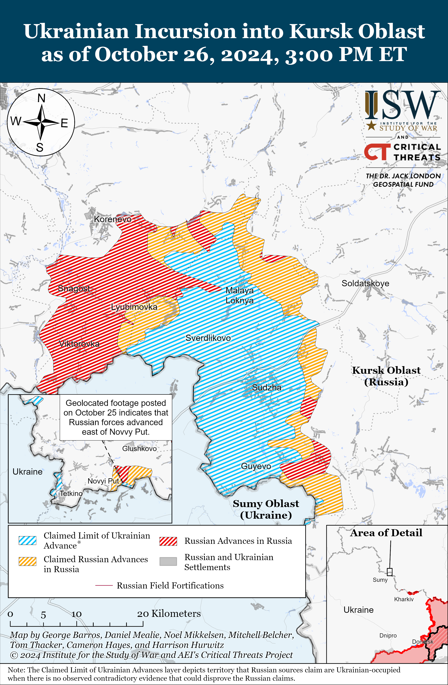
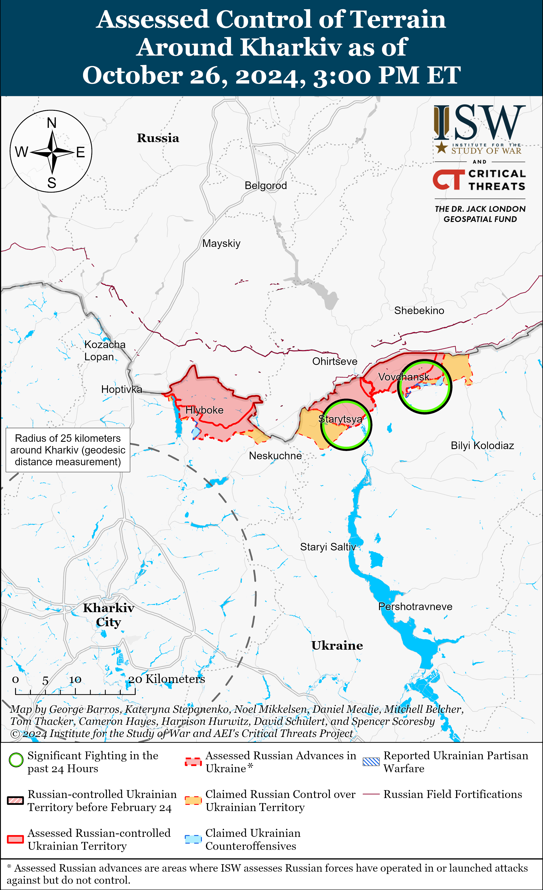
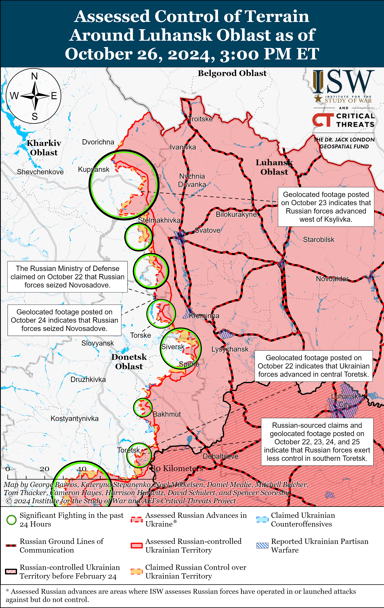
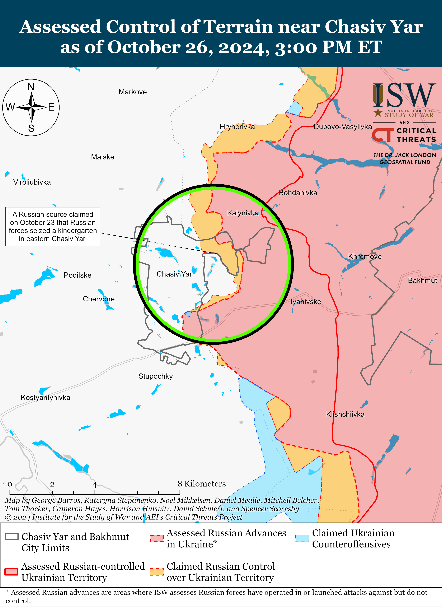
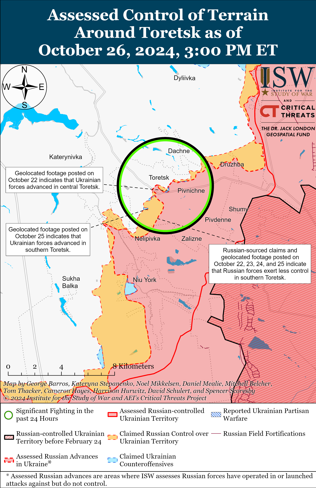
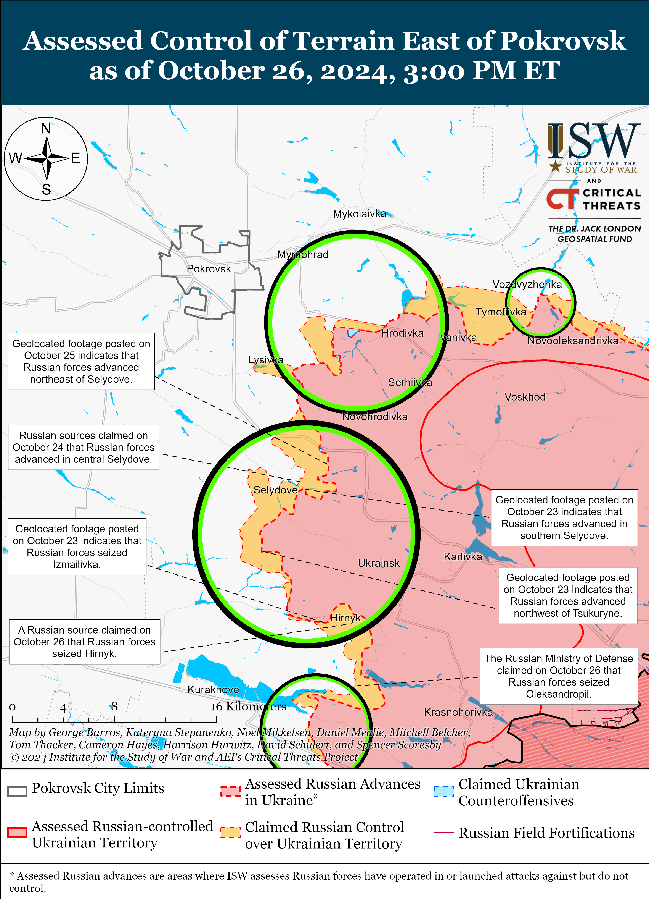
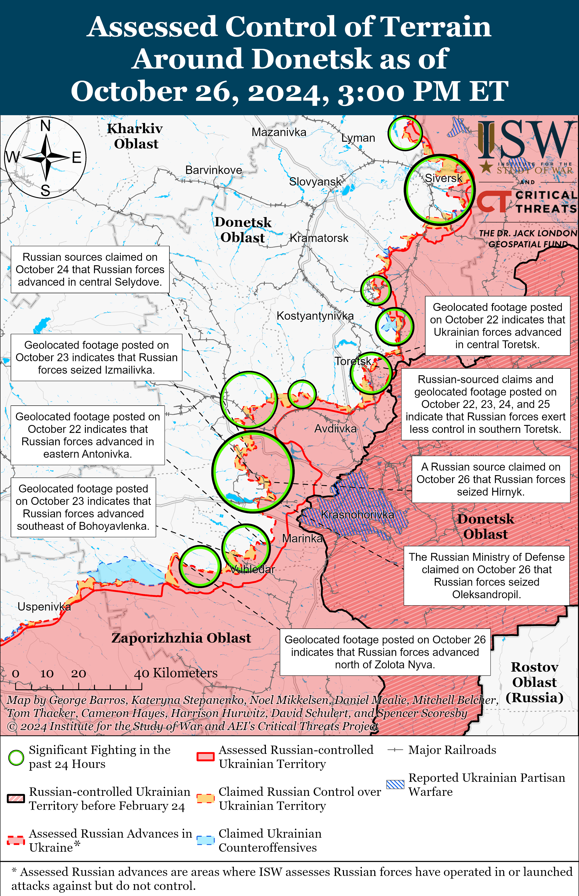
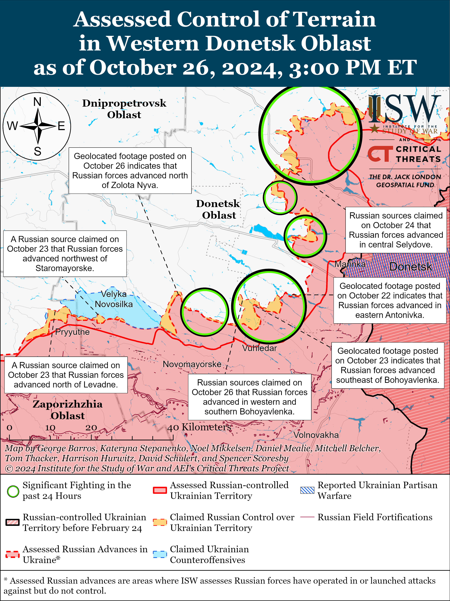
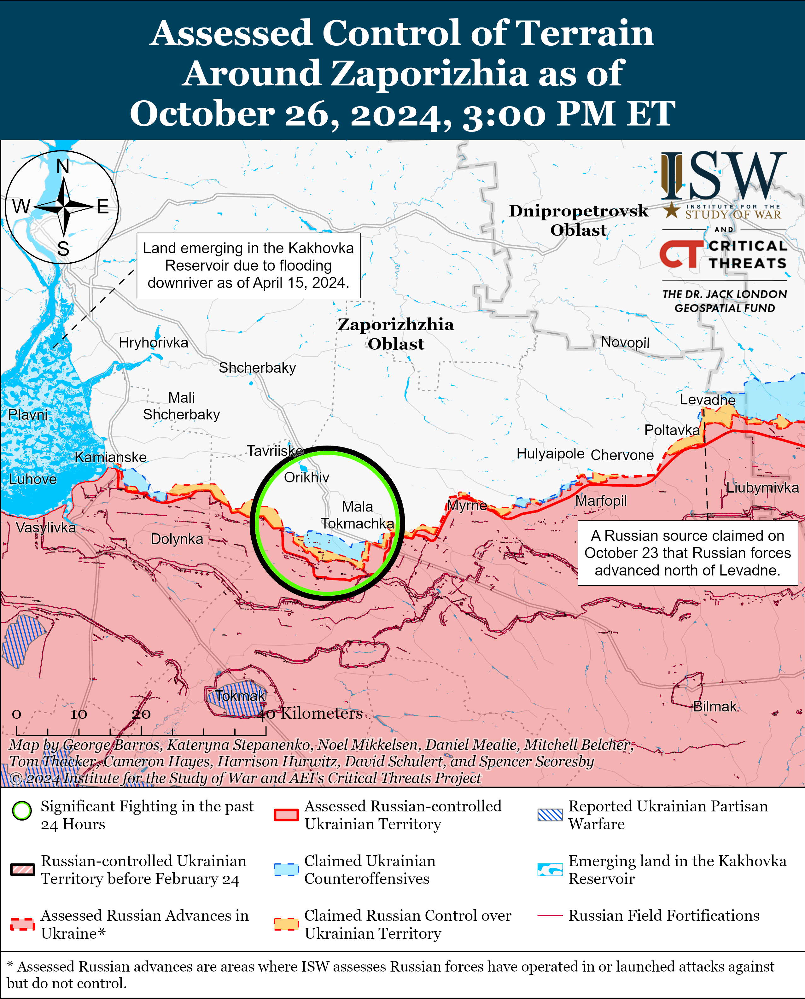
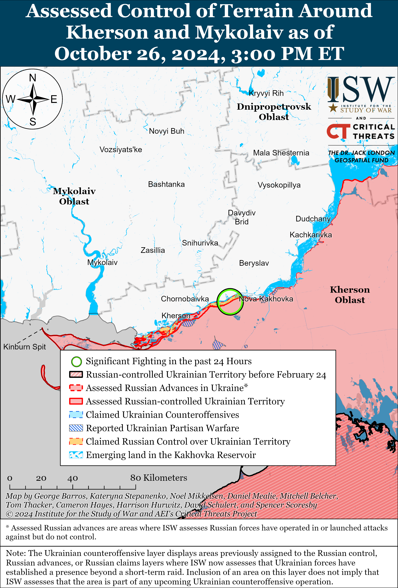

# Russian Offensive Campaign Assessment, October 26, 2024

**October 26, 2024, 5:45 pm ET**

**Click** [**here**](https://storymaps.arcgis.com/stories/36a7f6a6f5a9448496de641cf64bd375) **to see ISW’s interactive map of the Russian invasion of Ukraine. This map is updated daily alongside the static maps present in this report.**

**Click** [**here**](https://storymaps.arcgis.com/stories/83a2f24901c941d581c0c523ecd2619b) **to see ISW's interactive map of Ukraine's offensive in Kursk Oblast.**

**Click** [**here**](https://understandingwar.maps.arcgis.com/apps/instant/3dviewer/index.html?appid=1602762dbcde419bb957dea358449580) **to see ISW’s 3D control of terrain topographic map of Ukraine. Use of a computer (not a mobile device) is strongly recommended for using this data-heavy tool.**

**Click** [**here**](https://storymaps.arcgis.com/stories/733fe90805894bfc8562d90b106aa895) **to access ISW’s archive of interactive time-lapse maps of the Russian invasion of Ukraine. These maps complement the static control-of-terrain map that ISW produces daily by showing a dynamic frontline. ISW will update this time-lapse map archive monthly.**

**Note: The data cut-off for this product was 1:30pm ET on October 26. ISW will cover subsequent reports in the October 27 Russian Offensive Campaign Assessment.**

***The October 26, 2024 Georgian parliamentary election will be covered in a separate special edition.***

***Bloomberg*** **reported on October 25, citing South Korean intelligence documents, that a second group of North Korean soldiers will soon deploy to Russia.** *Bloomberg* reported that it viewed South Korean intelligence documents from an unspecified date that assessed that the first group of 1,500 North Korean "elite special forces" had arrived in Vladivostok, Primorsky Krai between October 8 and 13 and that this first group was part of a planned deployment of roughly 10,000 North Korean soldiers in total.[[1]](#_ednf5c6f7bfff9b3f1978165756671501b91) *Bloomberg* also reported that the documents assessed that North Korea has sent roughly 8 million rounds of 122mm and 152mm shells to Russia since August 2023, roughly 100 KN-23 Hwasong-11 ballistic missiles, and an unspecified number of Bulsae-4 anti-tank weapons. *Bloomberg*, citing two people familiar with the matter, stated that South Korean officials will share South Korea's assessments about North Korean-Russian cooperation with NATO officials at an October 28 NATO meeting. The *New York Times* (NYT), citing one unnamed Ukrainian official and two unnamed US officials, reported on October 25 that "several thousand" North Korean soldiers arrived at Kursk Oblast to participate in an upcoming Russian counteroffensive operation to push Ukrainian forces from their salient in Kursk Oblast.[[2]](#_ednf5c6f7bfff9b3f1978165756671501b92) The officials stated that North Korean forces have not engaged in combat operations yet and that the North Korean forces' task in Kursk oblast is unclear. The officials noted that a significant contingent of North Korean forces would help the Russian military to avoid pulling additional forces from eastern Ukraine to participate in counteroffensive operations in Kursk Oblast. A senior Ukrainian official told the NYT that a maximum number of 5,000 elite North Korean troops had likely arrived in Russia by October 21.[[3]](#_ednf5c6f7bfff9b3f1978165756671501b93) The participation of North Korean troops in combat operations in Kursk Oblast or frontline areas in Ukraine would make North Korea an active combatant and belligerent in Russia's invasion of Ukraine.

**German arms manufacturer Rheinmetall announced preparations to open additional defense industrial plants in Ukraine.** Rheinmetall CEO Armin Papperger announced on October 26 that Rheinmetall already opened one plant in Ukraine that serves as a maintenance and production facility for infantry fighting vehicles and main battle tanks and is on track to build a powder factory and a munitions manufacturing plant in Ukraine.[[4]](#_ednf5c6f7bfff9b3f1978165756671501b94) Papperger added that Rheinmetall expects to begin the production of the Lynx infantry fighting vehicles at the recently operational plant in Ukraine by the end of 2024. Rheinmetall also reportedly plans to open a joint production facility for air defense systems in Ukraine. Rheinmetall announced in March 2024 that it plans to open at least four weapons manufacturing plants in Ukraine.[[5]](#_ednf5c6f7bfff9b3f1978165756671501b95)

**Key Takeaways:**

- ***Bloomberg*** **reported on October 25, citing South Korean intelligence documents, that a second group of North Korean soldiers will soon deploy to Russia.**
- **German arms manufacturer Rheinmetall announced preparations to open additional defense industrial plants in Ukraine.**
- **Russian forces recently advanced in Glushkovsky Raion, Kursk Oblast and near Pokrovsk and Vuhledar.**
- **Russian military command is reportedly continuing to commit military specialists to assault operations and incurring unnecessary losses, likely in an effort to centralize control over Russian forces and maintain the tempo of Russian offensive operations throughout the theater.**

***We do not report in detail on Russian war crimes because these activities are well-covered in Western media and do not directly affect the military operations we are assessing and forecasting. We will continue to evaluate and report on the effects of these criminal activities on the Ukrainian military and the Ukrainian population and specifically on combat in Ukrainian urban areas. We utterly condemn Russian violations of the laws of armed conflict and the Geneva Conventions and crimes against humanity even though we do not describe them in these reports.***

- Ukrainian Operations in the Russian Federation
- Russian Main Effort – Eastern Ukraine (comprised of three subordinate main efforts)
- Russian Subordinate Main Effort #1 – Push Ukrainian forces back from the international border with Belgorod Oblast and approach to within tube artillery range of Kharkiv City
- Russian Subordinate Main Effort #2 – Capture the remainder of Luhansk Oblast and push westward into eastern Kharkiv Oblast and encircle northern Donetsk Oblast
- Russian Subordinate Main Effort #3 – Capture the entirety of Donetsk Oblast
- Russian Supporting Effort – Southern Axis
- Russian Air, Missile, and Drone Campaign
- Russian Mobilization and Force Generation Efforts
- Russian Technological Adaptations
- Activities in Russian-occupied areas
- Significant Activity in Belarus

**Ukrainian Operations in the Russian Federation**

Russian President Vladimir Putin continued to double down on his likely exaggerated claims about Russian progress in Kursk Oblast amid continued Ukrainian offensive operations and in the context of the likely imminent deployment of North Korean troops to combat in this area. Putin told Kremlin journalist Pavel Zarubin on October 25 that two weeks ago (likely the week of October 6 through 13) elements of the Russian 155th Naval Infantry Brigade (Pacific Fleet, Eastern Military District [EMD]) broke through Ukrainian defenses around 10 kilometers from the Russian-Ukrainian international border and advanced to unspecified positions near the border.[[6]](#_ednf5c6f7bfff9b3f1978165756671501b96) Putin claimed that elements of the Russian 810th Naval Infantry Brigade (Black Sea Fleet [BSF], Southern Military District [SMD]), 51st and 137th airborne (VDV) regiments (both part of the 106th VDV Division), 56th VDV Regiment (7th VDV Division), and 83rd Separate VDV Brigade participated in these operations. Putin once again claimed that Russian forces have encircled 2,000 Ukrainian forces in an area of about six kilometers by 15 kilometers. Putin also claimed that Russian forces guarantee the safety of Ukrainian prisoners of war (POW), although a spokesperson of a Ukrainian brigade operating in the Kursk direction reported that Russian commanders issued an order to not take Ukrainian POWs, and presumably instead to kill any Ukrainian servicemembers who surrender or are captured by Russian forces.[[7]](#_ednf5c6f7bfff9b3f1978165756671501b97) Ukrainian Commander-in-Chief Colonel General Oleksandr Syrskyi notably refuted Putin‘s earlier claims of Russian forces encircling Ukrainian forces in Kursk Oblast on October 25.[[8]](#_ednf5c6f7bfff9b3f1978165756671501b98) Putin’s interview with Zarubin was broadcasted on Russian state television and is likely part of the Kremlin’s ongoing effort to explain away Russia’s inability to decisively repel the Ukrainian incursion into Kursk Oblast after nearly three months and ahead of the reported imminent arrival of North Korean troops to Kursk Oblast. Putin may also be setting informational conditions to give Russian forces credit for any progress North Korean troops make in regaining control of Russian territory in Kursk.

Ukrainian forces recently launched a likely reinforced platoon-sized mechanized assault on Russian positions in Glushkovsky Raion west of the main Ukrainian salient in Kursk Oblast. Geolocated footage published on October 26 show that Ukrainian forces conducted a likely reinforced platoon-sized mechanized assault east of Novy Put (southwest of Glushkovo), and the footage indicates that Russian forces likely regained positions east of Novy Put at an earlier date and that Ukrainian forces likely maintain positions southeast of Novy Put along the Russian-Ukrainian international border.[[9]](#_ednf5c6f7bfff9b3f1978165756671501b99) Elements of the Russian 106th VDV Division are reportedly operating near Novy Put.[[10]](#_ednf5c6f7bfff9b3f1978165756671501b910)

Ukrainian and Russian forces continued to fight in Ukraine’s main salient in Kursk Oblast on October 26, but the frontline did not change. Russian sources, including the Russian Ministry of Defense (MoD), claimed that fighting continued southeast of Korenevo near Novoivanovka, Lyubimovka, and Zeleny Shlyakh; north of Sudzha near Kamyshovka; northwest of Sudzha near Pogrebki and Malaya Loknya; and south of Sudzha near Plekhovo on October 25 and 26.[[11]](#_ednf5c6f7bfff9b3f1978165756671501b911) Russian milbloggers claimed that Ukrainian forces continued to operate in Darino (southeast of Korenevo).[[12]](#_ednf5c6f7bfff9b3f1978165756671501b912) Elements of the 137th VDV Regiment (106th VDV Division) continued to operate near Lyubimovka and Zeleny Shlyakh.[[13]](#_ednf5c6f7bfff9b3f1978165756671501b913)

**Russian Main Effort – Eastern Ukraine**

**Russian Subordinate Main Effort #1 – Kharkiv Oblast** **(Russian objective: Push Ukrainian forces back from the international border with Belgorod Oblast and approach to within tube artillery range of Kharkiv City)**

Russian forces continued offensive operations in northern Kharkiv Oblast on October 26 but did not make any confirmed advances. Russian forces continued attacking near Vovchansk (northeast of Kharkiv City) and Starytsya (southwest of Vovchansk) on October 25 and 26.[[14]](#_ednf5c6f7bfff9b3f1978165756671501b914) Ukraine's Kharkiv Group of Forces Spokesperson Colonel Yevhenii Romanov stated that Ukrainian forces are preventing Russian forces from advancing toward Kharkiv City through Lyptsi (north of Kharkiv City) but that Russian forces have significantly destroyed most buildings in Lyptsi, leaving no habitable buildings in the settlement.[[15]](#_ednf5c6f7bfff9b3f1978165756671501b915)

**Russian Subordinate Main Effort #2 – Luhansk Oblast** **(Russian objective: Capture the remainder of Luhansk Oblast and push westward into eastern Kharkiv Oblast and northern Donetsk Oblast)**

Russian forces continued offensive operations along the Kupyansk-Svatove-Kreminna line on October 26 but did not make any confirmed advances. A Russian milblogger claimed that Russian forces advanced south of Kupyansk near Kolisnykivka and Kruhlyakivka; southeast of Kupyansk near Vyshneve; and northwest of Kreminna near Terny, although ISW has not observed visual evidence of these claims.[[16]](#_ednf5c6f7bfff9b3f1978165756671501b916) Russian forces continued attacking northeast of Kupyansk near Synkivka; north of Kupyansk near Holubivka and Kindrashivka; south of Kupyansk near Kruhlyakivka; southeast of Kupyansk near Stepova Novoselivka and Vyshneve; west of Svatove near Pershotravneve; northwest of Kreminna near Terny, Hrekivka, Nevske, and Makiivka; west of Kreminna near Torske; south of Kreminna near Hryhorivka; and southwest of Kreminna near Serebryanka and the Serebryanske forest area on October 25 and 26.[[17]](#_ednf5c6f7bfff9b3f1978165756671501b917)

**Russian Subordinate Main Effort #3 – Donetsk Oblast** **(Russian objective: Capture the entirety of Donetsk Oblast, the claimed territory of Russia’s proxies in Donbas)**

Russian forces continued offensive operations in northeast of Siversk near Bilohorivka and southeast of Siversk near Ivano-Daryivka and Vyimka on October 25 and 26, but there were no confirmed changes to the frontline in this area.[[18]](#_ednf5c6f7bfff9b3f1978165756671501b918) Ukrainian military observer Kostyantyn Mashovets stated on October 26 that elements of the Russian 6th, 7th, and 123th motorized rifle brigades (3rd Combined Arms Army [CAA], formerly 2nd Luhansk People's Republic Army Corps [LNR AC], Southern Military District [SMD]) and reserves of the 1102nd Motorized Rifle Regiment (3rd CAA) are unsuccessfully attacking near Bilohorivka, Ivano-Daryivka, and Vyimka and east of Siversk near Verkhnokamyanske.[[19]](#_ednf5c6f7bfff9b3f1978165756671501b919) Mashovets stated that elements of the Russian 85th and 88th motorized rifle brigades (3rd CAA) are attacking south of Siversk along the railway line in the direction of Pereizne and towards Fedorivka. Mashovets stated that Russian forces have two regiments (possibly one airborne [VDV] regiment and one motorized rifle regiment) from the Russian “mobilization reserve” and two reserve battalions of the 3rd CAA in their operational reserve in the Siversk direction.[[20]](#_ednf5c6f7bfff9b3f1978165756671501b920) Mashovets stated that Russian forces have no tanks and roughly three dozen armored vehicles in reserve in this direction.

Russian forces continued offensive operations near Chasiv Yar on October 25 and 26, but there were no confirmed changes to the frontline.[[21]](#_ednf5c6f7bfff9b3f1978165756671501b921) Mashovets stated that elements of the Russian 98th VDV Division and 200th Motorized Rifle Brigade (14th AC, Leningrad Military District [LMD]) recently marginally advanced across the Siverskyi-Donets Donbas Canal south of Hryhorivka (north of Chasiv Yar) and that elements of the Russian Volunteer Corps and the 2nd "Veterany" Assault Brigade (Russian Volunteer Corps and reportedly subordinated to Redut private military company [PMC]) recently advanced near Kalynivka (north of Chasiv Yar) and seized part of the Zhovtnevyi Microraion (eastern Chasiv Yar).[[22]](#_ednf5c6f7bfff9b3f1978165756671501b922) Mashovets stated that elements of the Russian 6th Motorized Rifle Division (3rd AC) recently unsuccessfully attacked southeast of Chasiv Yar near Ivanivske and Kurdyumivka.[[23]](#_ednf5c6f7bfff9b3f1978165756671501b923) Mashovets stated that Russian forces have up to three regiments, including one VDV regiment of the 98th VDV Division and two motorized rifle regiments currently in Rostov Oblast, and up to three battalions of the 3rd AC in their operational reserve in the Kramatorsk direction.[[24]](#_ednf5c6f7bfff9b3f1978165756671501b924) Mashovets estimated that Russian forces currently have six to eight tanks and 85-88 armored vehicles in reserve in this direction.

Russian forces continued offensive operations near Toretsk itself and southwest of Toretsk in the direction of Shcherbynivka on October 25 and 26, but there were no confirmed changes to the frontline.[[25]](#_ednf5c6f7bfff9b3f1978165756671501b925)

Russian forces recently marginally advanced east and southeast of Pokrovsk amid continued offensive operations in the area on October 26. Geolocated footage published on October 25 and 26 indicates that Russian forces recently advanced into the eastern outskirts of Novotoretske (east of Pokrovsk), west of Novohrodivka (southeast of Pokrovsk), into the Korotchenko mine waste heap northeast of Selydove (southeast of Pokrovsk), and into northern Oleksandropil (southeast of Pokrovsk).[[26]](#_ednf5c6f7bfff9b3f1978165756671501b926) Russian milbloggers claimed that elements of the Russian 71st Separate Spetsnaz Brigade raised a flag over the waste heap northeast of Selydove and that Russian forces advanced one kilometer within Seldyove.[[27]](#_ednf5c6f7bfff9b3f1978165756671501b927) The Russian Ministry of Defense (MoD) claimed that elements of the Russian 110th Motorized Rifle Brigade (51st CAA, formerly 1st Donetsk People's Republic [DNR] AC, SMD) seized Oleksandropil, and Russian milbloggers claimed that elements of the Russian 114th Motorized Rifle Brigade (51st CAA) seized Hirnyk (southeast of Selydove) and advanced to Mine No. 42 southwest of Hirnyk.[[28]](#_ednf5c6f7bfff9b3f1978165756671501b928) Russian milbloggers claimed that Russian forces advanced to the train station in southern Vyshneve (southwest of Selydove), west of Tsukuryne (southeast of Selydove), and further northeast of Novodmytrivka (south of Selydove).[[29]](#_ednf5c6f7bfff9b3f1978165756671501b929) Russian milbloggers claimed that Russian forces operating east of Pokrovsk advanced north of Hrodivka and west of Krasnyi Yar.[[30]](#_ednf5c6f7bfff9b3f1978165756671501b930) Russian forces continued assaults east of Pokrovsk near Vozdvyzhenka, Myrolyubivka, Promin, and Krutyi Yar and southeast of Pokrovsk near Lyskivka, Mykolaivka, Selydove, Novoselydivka, Novodmytrivka, Izmailivka, and Stepanivka on October 25 and 26.[[31]](#_ednf5c6f7bfff9b3f1978165756671501b931) Elements of the Russian 74th Motorized Rifle Brigade (41st CAA, Central Military District [CMD]) are reportedly operating near Novotoretske (east of Pokrovsk), and elements of the Russian "Borz" and "Storm" assault battalions are reportedly operating southeast of Pokrovsk near Zoryane.[[32]](#_ednf5c6f7bfff9b3f1978165756671501b932)

Russian forces continued offensive operations east of Kurakhove near Hostre, and Dalne on October 25 and 26, but there were no confirmed changes to the frontline.[[33]](#_ednf5c6f7bfff9b3f1978165756671501b933) Artillerymen of the Russian 102nd Motorized Rifle Regiment (150th Motorized Rifle Division, 8th CAA, SMD) and the 291st Artillery Brigade (58th CAA, SMD) are reportedly operating near Kurakhove.[[34]](#_ednf5c6f7bfff9b3f1978165756671501b934)

Russian forces recently advanced southeast of Donetsk City near Vuhledar amid continued offensive operations in the area on October 26. Geolocated footage published on October 26 indicates that Russian forces advanced west of Pobieda (southwest of Donetsk City).[[35]](#_ednf5c6f7bfff9b3f1978165756671501b935) Geolocated footage published on October 26 showing a Russian reinforced platoon-seized assault and another Russian reduced company-seized assault indicates that Russian forces recently advanced north of Zolota Nyva and north and northwest of Prechystivka (both west of Vuhledar).[[36]](#_ednf5c6f7bfff9b3f1978165756671501b936) Russian milbloggers claimed that Russian forces advanced in southern and western Bohoyavlenka (north of Vuhledar), reached the outskirts of Novoukrainka (northwest of Vuhledar), and gained a foothold in the southeastern outskirts of Shakhtarske (northwest of Vuhledar), although ISW has not observed visual evidence of these claims.[[37]](#_ednf5c6f7bfff9b3f1978165756671501b937) Russian forces continued attacking southwest of Donetsk City and northeast of Vuhledar near Antonivka, Yelyzavetivka, and Katerynivka  and north of Vuhledar near Bohoyavlenka on October 25 and 26.[[38]](#_ednf5c6f7bfff9b3f1978165756671501b938) Elements of the Russian 14th Spetsnaz Brigade (Special Forces of the Main Directorate of the General Staff of the Russian Armed Forces [GRU]) are reportedly operating near Bohoyavlenka; and elements of the Russian 40th Naval Infantry Brigade (Pacific Fleet, Eastern Military District [EMD] operating in the Zolota Nyva-Prechystivka area.[[39]](#_ednf5c6f7bfff9b3f1978165756671501b939)

Neither Russian nor Ukrainian sources reported on Russian activity in the Donetsk-Zaporizhia Oblast border area on October 26.

**Russian Supporting Effort – Southern Axis** **(Russian objective: Maintain frontline positions and secure rear areas against Ukrainian strikes)**

Russian forces reportedly attacked north of Robotyne in the direction of Novodanylivka on October 26.[[40]](#_ednf5c6f7bfff9b3f1978165756671501b940) New recruits of the 1430th Motorized Rifle Regiment (58th Combined Arms Army [CAA], Southern Military District [SMD]) are reportedly training in the Zaporizhia direction; and drone operators of the 150th Separate Anti-Tank Artillery Battalion (42nd Motorized Rifle Division, 58th CAA) are reportedly operating in the Zaporizhia direction.[[41]](#_ednf5c6f7bfff9b3f1978165756671501b941)

Russian forces continued attacking in east (left) bank Kherson Oblast on October 25 and 26 but did not make any confirmed advances.[[42]](#_ednf5c6f7bfff9b3f1978165756671501b942) A milblogger affiliated with the Russian Air Force claimed that an unspecified Russian military helicopter crashed in the Kerch Strait near occupied Crimea.[[43]](#_ednf5c6f7bfff9b3f1978165756671501b943)

**Russian Air, Missile, and Drone Campaign** **(Russian Objective: Target Ukrainian military and civilian infrastructure in the rear and on the frontline)**

Russian forces launched another missile and drone strike targeting Ukrainian rear areas overnight on October 25 and 26, resulting in the destruction of civilian infrastructure. The Ukrainian Air Force reported that Russian forces launched three Iskander-M/KN-23 ballistic missiles from occupied Crimea, two Kh-59 cruise missiles from Bryansk Oblast, two missiles of an unknown type from Belgorod Oblast, and 91 Shahed-type and other unidentified strike drones from Kursk and Oryol oblasts.[[44]](#_ednf5c6f7bfff9b3f1978165756671501b944) The Ukrainian Air Force reported that Ukrainian forces reportedly shot down 44 drones as of 1200 local time over Kirovohrad, Sumy, Chernihiv, Kyiv, Cherkasy, Vinnytsia, Zhytomyr, Khmelnytskyi, and Kursk oblasts; that 44 Russian drones became ”locally lost;” that one drone flew into Belarusian airspace; and that one drone remained in the Ukrainian airspace as of 1200 local time. The Ukrainian Air Force reported that Russian forces struck civilian infrastructure in Sumy Oblast and Dnipro City, resulting in civilian casualties. Dnipropetrovsk Oblast and Ukrainian state officials reported that Russian strikes against Dnipro City destroyed a two-floor residential building and killed four civilians and damaged the Mechnikov Hospital (one of the largest Ukrainian medical facilities) and other civilian infrastructure.[[45]](#_ednf5c6f7bfff9b3f1978165756671501b945) A Russian milblogger claimed that Russian forces targeted the Mechnikov Hospital with Iskander-M missiles but missed, possibly due to the Ukrainian use of electronic warfare (EW) systems.[[46]](#_ednf5c6f7bfff9b3f1978165756671501b946) Ukrainian regional officials also reported that Russian Shahed drones struck residential buildings and a hotel in Starokostiantyniv, Khmelnytskyi Oblast, and a high-rise apartment building in Solomyanskyi Raion, Kyiv City.[[47]](#_ednf5c6f7bfff9b3f1978165756671501b947)

**Russian Mobilization and Force Generation Efforts** **(Russian objective: Expand combat power without conducting general mobilization)**

The Russian military command is reportedly continuing to commit military specialists to assault operations and incurring unnecessary losses, likely in an effort to centralize control over Russian forces and maintain the tempo of Russian offensive operations throughout the theater. A former Russian Storm Z instructor and milblogger claimed on October 26 that he received a message from the frontlines that the Russian military command is transferring a group of experienced Russian drone operators to infantry units in an unspecified direction.[[48]](#_ednf5c6f7bfff9b3f1978165756671501b948) The milblogger accused the Russian military command of failing to effectively use drone specialists and hindering the Russian military from achieving parity with or even superiority over Ukrainian drone operations. ISW previously assessed that the Russian military command has been indiscriminately committing specialists to grinding assault operations, partly in support of Russia’s ongoing force centralization efforts and in an attempt to maintain the offensive tempo in eastern Ukraine.[[49]](#_ednf5c6f7bfff9b3f1978165756671501b949)

**Russian Technological Adaptations** **(Russian objective: Introduce technological innovations to optimize systems for use in Ukraine)**

Nothing significant to report.

**Activities in Russian-occupied areas** **(Russian objective: Consolidate administrative control of annexed areas; forcibly integrate Ukrainian citizens into Russian sociocultural, economic, military, and governance systems)**

*ISW is not publishing reporting on activities in Russian-occupied areas today.*

**Significant activity in Belarus** **(Russian efforts to increase its military presence in Belarus and further integrate Belarus into Russian-favorable frameworks and Wagner Group activity in Belarus)**

Nothing significant to report.

**Note: ISW does not receive any classified material from any source, uses only publicly available information, and draws extensively on Russian, Ukrainian, and Western reporting and social media as well as commercially available satellite imagery and other geospatial data as the basis for these reports. References to all sources used are provided in the endnotes of each update.**

---

[[1]](#_ednf5c6f7bfff9b3f1978165756671501b9ref1) https://www.bloomberg.com/news/articles/2024-10-25/north-korea-to-send-more-troops-to-russia-soon-intelligence-documents-reveal

[[2]](#_ednf5c6f7bfff9b3f1978165756671501b9ref2) https://www.nytimes.com/2024/10/25/world/europe/north-korean-troops-arrive-kursk-russia.html

[[3]](#_ednf5c6f7bfff9b3f1978165756671501b9ref3) https://www.nytimes.com/2024/10/25/world/europe/north-korean-troops-arrive-kursk-russia.html

[[4]](#_ednf5c6f7bfff9b3f1978165756671501b9ref4) [https://newsukraine.rbc dot ua/news/four-rheinmetall-plants-set-to-launch-in-1729944205.html](https://newsukraine.rbc.ua/news/four-rheinmetall-plants-set-to-launch-in-1729944205.html); <https://euromaidanpress> dot com/2024/10/26/german-arms-giant-rheinmetall-to-open-second-ukraine-plant-with-four-in-total/

[[5]](#_ednf5c6f7bfff9b3f1978165756671501b9ref5) <https://newsukraine> dot rbc.ua/news/rheinmetall-plans-to-construct-four-weapon-1710433612.html

[[6]](#_ednf5c6f7bfff9b3f1978165756671501b9ref6) <https://t.me/tass_agency/281740> ; <https://t.me/tass_agency/281741> ; <https://t.me/tass_agency/281742> ; <https://t.me/tass_agency/281743> ; <https://t.me/tass_agency/281744> ; <https://t.me/tass_agency/281745> ; [https://smotrim](https://smotrim/) dot ru/video/2885131 ; [https://iz](https://iz/) dot ru/1780498/2024-10-25/putin-soobshchil-ob-okruzhenii-vs-rf-2-tys-ukrainskikh-boevikov-v-kurskoi-oblasti

[[7]](#_ednf5c6f7bfff9b3f1978165756671501b9ref7) [https://armyinform](https://armyinform/) dot com.ua/2024/10/26/na-kurskomu-napryamku-rosiyany-otrymaly-nakaz-ne-braty-v-polon-ukrayinskyh-vijskovyh/

[[8]](#_ednf5c6f7bfff9b3f1978165756671501b9ref8) https://www.understandingwar.org/backgrounder/russian-offensive-campaign-assessment-october-25-2024

[[9]](#_ednf5c6f7bfff9b3f1978165756671501b9ref9) <https://t.me/creamy_caprice/7262>; <https://t.me/khornegroup/2875;> <https://t.me/rybar/64781;> <https://t.me/boris_rozhin/142214>; <https://t.me/wargonzo/22812>

[[10]](#_ednf5c6f7bfff9b3f1978165756671501b9ref10) <https://t.me/RVvoenkor/79445>; <https://t.me/DnevnikDesantnika/18029>

[[11]](#_ednf5c6f7bfff9b3f1978165756671501b9ref11) <https://t.me/mod_russia/44955>; <https://t.me/rybar/64781;> <https://t.me/RVvoenkor/79411;> <https://t.me/RVvoenkor/79419;> <https://t.me/dva_majors/55958;> <https://t.me/boris_rozhin/142199>; <https://t.me/milinfolive/133579>

[[12]](#_ednf5c6f7bfff9b3f1978165756671501b9ref12) <https://t.me/motopatriot/28801;> <https://t.me/rybar/64781>

[[13]](#_ednf5c6f7bfff9b3f1978165756671501b9ref13) <https://t.me/RVvoenkor/79411;> <https://t.me/RVvoenkor/79419>

[[14]](#_ednf5c6f7bfff9b3f1978165756671501b9ref14) <https://www.facebook.com/GeneralStaff.ua/posts/pfbid028Vn1oSR8trA1cxgH4qgw3zhsRex6s9zeXhfFo13RAG1pdgcMnf3UXL9EdaRBEJ1Pl> ; <https://www.facebook.com/GeneralStaff.ua/posts/pfbid029qCxD8XM7EL5zaAoivLtN4rsTsqkc8utdraZa6MAQQkC5NFiDY7jfcGDRvgQckaZl> ; <https://www.facebook.com/GeneralStaff.ua/posts/pfbid02rmyrjNsiLzttL7TGUr23JbWRdGxwrTjcq2szCTjVz2tGrnRZkUZaFhZ89mZXNp6hl>

[[15]](#_ednf5c6f7bfff9b3f1978165756671501b9ref15) <https://armyinform.com> dot ua/2024/10/26/harkiv-u-nebezpeczi-u-zsu-prokomentuvaly-vazhlyvist-zvilnennya-lypcziv/

[[16]](#_ednf5c6f7bfff9b3f1978165756671501b9ref16) <https://t.me/z_arhiv/28880> ; <https://t.me/z_arhiv/28867> ; https://t.me/z\_arhiv/28841

[[17]](#_ednf5c6f7bfff9b3f1978165756671501b9ref17) <https://www.facebook.com/GeneralStaff.ua/posts/pfbid028Vn1oSR8trA1cxgH4qgw3zhsRex6s9zeXhfFo13RAG1pdgcMnf3UXL9EdaRBEJ1Pl> ; <https://www.facebook.com/GeneralStaff.ua/posts/pfbid029qCxD8XM7EL5zaAoivLtN4rsTsqkc8utdraZa6MAQQkC5NFiDY7jfcGDRvgQckaZl> ; https://www.facebook.com/GeneralStaff.ua/posts/pfbid02rmyrjNsiLzttL7TGUr23JbWRdGxwrTjcq2szCTjVz2tGrnRZkUZaFhZ89mZXNp6hl

[[18]](#_ednf5c6f7bfff9b3f1978165756671501b9ref18) <https://www.facebook.com/GeneralStaff.ua/posts/pfbid028Vn1oSR8trA1cxgH4qgw3zhsRex6s9zeXhfFo13RAG1pdgcMnf3UXL9EdaRBEJ1Pl> ; <https://www.facebook.com/GeneralStaff.ua/posts/pfbid029qCxD8XM7EL5zaAoivLtN4rsTsqkc8utdraZa6MAQQkC5NFiDY7jfcGDRvgQckaZl> ; <https://www.facebook.com/GeneralStaff.ua/posts/pfbid02rmyrjNsiLzttL7TGUr23JbWRdGxwrTjcq2szCTjVz2tGrnRZkUZaFhZ89mZXNp6hl>

[[19]](#_ednf5c6f7bfff9b3f1978165756671501b9ref19) https://t.me/zvizdecmanhustu/2298

[[20]](#_ednf5c6f7bfff9b3f1978165756671501b9ref20) <https://t.me/zvizdecmanhustu/2297>

[[21]](#_ednf5c6f7bfff9b3f1978165756671501b9ref21) https://www.facebook.com/GeneralStaff.ua/posts/pfbid029qCxD8XM7EL5zaAoivLtN4rsTsqkc8utdraZa6MAQQkC5NFiDY7jfcGDRvgQckaZl

 ; [https://www.facebook.com/GeneralStaff.ua/posts/pfbid02rmyrjNsiLzttL7TGUr23JbWRdGxwrTjcq2szCTjVz2tGrnRZkUZaFhZ89mZXNp6hl ;](https://www.facebook.com/GeneralStaff.ua/posts/pfbid02rmyrjNsiLzttL7TGUr23JbWRdGxwrTjcq2szCTjVz2tGrnRZkUZaFhZ89mZXNp6hl%20;) <https://t.me/wargonzo/22812>

[[22]](#_ednf5c6f7bfff9b3f1978165756671501b9ref22) https://t.me/zvizdecmanhustu/2298

[[23]](#_ednf5c6f7bfff9b3f1978165756671501b9ref23) <https://t.me/zvizdecmanhustu/2299>

[[24]](#_ednf5c6f7bfff9b3f1978165756671501b9ref24) <https://t.me/zvizdecmanhustu/2297>

[[25]](#_ednf5c6f7bfff9b3f1978165756671501b9ref25) <https://www.facebook.com/GeneralStaff.ua/posts/pfbid028Vn1oSR8trA1cxgH4qgw3zhsRex6s9zeXhfFo13RAG1pdgcMnf3UXL9EdaRBEJ1Pl> ; <https://www.facebook.com/GeneralStaff.ua/posts/pfbid029qCxD8XM7EL5zaAoivLtN4rsTsqkc8utdraZa6MAQQkC5NFiDY7jfcGDRvgQckaZl> ; <https://www.facebook.com/GeneralStaff.ua/posts/pfbid02rmyrjNsiLzttL7TGUr23JbWRdGxwrTjcq2szCTjVz2tGrnRZkUZaFhZ89mZXNp6hl>

[[26]](#_ednf5c6f7bfff9b3f1978165756671501b9ref26) <https://t.me/creamy_caprice/7258>; <https://t.me/urga_74/2258> ; <https://t.me/creamy_caprice/7265>; <https://t.me/ggwpteam2504/148> ; <https://t.me/creamy_caprice/7253>; <https://t.me/voenacher/73567> ; <https://t.me/creamy_caprice/7255>; <https://t.me/nm_dnr/12884>

[[27]](#_ednf5c6f7bfff9b3f1978165756671501b9ref27) <https://t.me/DnevnikDesantnika/18019> ; <https://t.me/RVvoenkor/79446> ; <https://t.me/DnevnikDesantnika/18024> ; <https://t.me/z_arhiv/28853>  ; <https://t.me/rybar/64810>

[[28]](#_ednf5c6f7bfff9b3f1978165756671501b9ref28) <https://t.me/RVvoenkor/79434> ; <https://t.me/DnevnikDesantnika/18017> ; <https://t.me/z_arhiv/28856> ; <https://t.me/nm_dnr/12884> ; <https://t.me/epoddubny/21454> ; <https://t.me/mod_russia/44953>  <https://t.me/vysokygovorit/17772> ; <https://t.me/wargonzo/22819> ; <https://t.me/z_arhiv/28873> ; <https://t.me/RVvoenkor/79458> ; <https://t.me/DnevnikDesantnika/18032> ;  <https://t.me/milinfolive/133647> ; <https://t.me/RVvoenkor/79434> ; <https://t.me/motopatriot/28785>; <https://t.me/motopatriot/28786> ; <https://t.me/boris_rozhin/142146>; https://t.me/boris\_rozhin/142157

[[29]](#_ednf5c6f7bfff9b3f1978165756671501b9ref29) <https://t.me/RVvoenkor/79432> ; <https://t.me/warhistoryalconafter/191364> ; <https://t.me/dva_majors/55947> ; <https://t.me/dva_majors/55958> ; <https://t.me/z_arhiv/28853>  ; <https://t.me/rusich_army/17962> ; <https://t.me/sashakots/49778> ; <https://t.me/rybar/64811> ; <https://t.me/motopatriot/28802> ; <https://t.me/motopatriot/28813> ; <https://t.me/motopatriot/28807>

[[30]](#_ednf5c6f7bfff9b3f1978165756671501b9ref30) https://t.me/vysokygovorit/17774

[[31]](#_ednf5c6f7bfff9b3f1978165756671501b9ref31) <https://t.me/wargonzo/22812> ; <https://www.facebook.com/GeneralStaff.ua/posts/pfbid028Vn1oSR8trA1cxgH4qgw3zhsRex6s9zeXhfFo13RAG1pdgcMnf3UXL9EdaRBEJ1Pl> ; <https://www.facebook.com/GeneralStaff.ua/posts/pfbid029qCxD8XM7EL5zaAoivLtN4rsTsqkc8utdraZa6MAQQkC5NFiDY7jfcGDRvgQckaZl> ; <https://www.facebook.com/GeneralStaff.ua/posts/pfbid02rmyrjNsiLzttL7TGUr23JbWRdGxwrTjcq2szCTjVz2tGrnRZkUZaFhZ89mZXNp6hl>

[[32]](#_ednf5c6f7bfff9b3f1978165756671501b9ref32) <https://t.me/wargonzo/22817> ; <https://t.me/motopatriot/28802>

[[33]](#_ednf5c6f7bfff9b3f1978165756671501b9ref33) https://www.facebook.com/GeneralStaff.ua/posts/pfbid028Vn1oSR8trA1cxgH4qgw3zhsRex6s9zeXhfFo13RAG1pdgcMnf3UXL9EdaRBEJ1Pl ; <https://www.facebook.com/GeneralStaff.ua/posts/pfbid029qCxD8XM7EL5zaAoivLtN4rsTsqkc8utdraZa6MAQQkC5NFiDY7jfcGDRvgQckaZl> ; <https://www.facebook.com/GeneralStaff.ua/posts/pfbid02rmyrjNsiLzttL7TGUr23JbWRdGxwrTjcq2szCTjVz2tGrnRZkUZaFhZ89mZXNp6hl>

[[34]](#_ednf5c6f7bfff9b3f1978165756671501b9ref34) <https://t.me/nm_dnr/12885> ; <https://t.me/RVvoenkor/79406>

[[35]](#_ednf5c6f7bfff9b3f1978165756671501b9ref35) https://t.me/creamy\_caprice/7250; https://t.me/mechanized33/467; https://x.com/klinger66/status/1850168034448622071

[[36]](#_ednf5c6f7bfff9b3f1978165756671501b9ref36) https://x.com/giK1893/status/1849927458864181470; https://t.me/creamy\_caprice/7251; https://t.me/morpex\_V/3287; https://t.me/creamy\_caprice/7260; https://t.me/SPN\_SIGMA/930; https://t.me/z\_arhiv/28849; https://t.me/creamy\_caprice/7266; https://t.me/opbr\_zsu/384

[[37]](#_ednf5c6f7bfff9b3f1978165756671501b9ref37) <https://t.me/z_arhiv/28849> ; <https://t.me/RVvoenkor/79473> ; <https://t.me/wargonzo/22812> ; <https://t.me/DnevnikDesantnika/18037> ; https://t.me/ne\_rybar/2479 ; https://t.me/rybar/64814

[[38]](#_ednf5c6f7bfff9b3f1978165756671501b9ref38) <https://www.facebook.com/GeneralStaff.ua/posts/pfbid028Vn1oSR8trA1cxgH4qgw3zhsRex6s9zeXhfFo13RAG1pdgcMnf3UXL9EdaRBEJ1Pl> ; <https://www.facebook.com/GeneralStaff.ua/posts/pfbid029qCxD8XM7EL5zaAoivLtN4rsTsqkc8utdraZa6MAQQkC5NFiDY7jfcGDRvgQckaZl> ; https://www.facebook.com/GeneralStaff.ua/posts/pfbid02rmyrjNsiLzttL7TGUr23JbWRdGxwrTjcq2szCTjVz2tGrnRZkUZaFhZ89mZXNp6hl

[[39]](#_ednf5c6f7bfff9b3f1978165756671501b9ref39) <https://t.me/voin_dv/11492> ; <https://t.me/rybar/64814>

[[40]](#_ednf5c6f7bfff9b3f1978165756671501b9ref40) https://www.facebook.com/GeneralStaff.ua/posts/pfbid028Vn1oSR8trA1cxgH4qgw3zhsRex6s9zeXhfFo13RAG1pdgcMnf3UXL9EdaRBEJ1Pl

[[41]](#_ednf5c6f7bfff9b3f1978165756671501b9ref41) <https://t.me/dva_majors/55997>; <https://t.me/milinfolive/133604>

[[42]](#_ednf5c6f7bfff9b3f1978165756671501b9ref42) <https://www.facebook.com/GeneralStaff.ua/posts/pfbid028Vn1oSR8trA1cxgH4qgw3zhsRex6s9zeXhfFo13RAG1pdgcMnf3UXL9EdaRBEJ1Pl>; <https://www.facebook.com/GeneralStaff.ua/posts/pfbid029qCxD8XM7EL5zaAoivLtN4rsTsqkc8utdraZa6MAQQkC5NFiDY7jfcGDRvgQckaZl>; https://www.facebook.com/GeneralStaff.ua/posts/pfbid02rmyrjNsiLzttL7TGUr23JbWRdGxwrTjcq2szCTjVz2tGrnRZkUZaFhZ89mZXNp6hl

[[43]](#_ednf5c6f7bfff9b3f1978165756671501b9ref43) <https://t.me/vchkogpu/52079> ; <https://t.me/astrapress/67203;> https://t.me/fighter\_bomber/18566

[[44]](#_ednf5c6f7bfff9b3f1978165756671501b9ref44) <https://t.me/kpszsu/21943>

[[45]](#_ednf5c6f7bfff9b3f1978165756671501b9ref45) [https://armyinform](https://armyinform/) dot com.ua/2024/10/26/vid-raketnogo-udaru-po-dnipru-zagynula-druzhyna-ta-donka-policzejskogo/; <https://t.me/dnipropetrovskaODA/16993> ; <https://t.me/dnipropetrovskaODA/16991> ; <https://t.me/dnipropetrovskaODA/16983> ; <https://t.me/dnipropetrovskaODA/16982>; <https://t.me/dnipropetrovskaODA/16972>; <https://t.me/dnipropetrovskaODA/16971>; <https://t.me/dnipropetrovskaODA/16969>; <https://t.me/dnipropetrovskaODA/16971>; <https://t.me/dnipropetrovskaODA/16968> ; <https://t.me/dnipropetrovskaODA/16965>; <https://t.me/dnipropetrovskaODA/16966;> https://armyinform dot com.ua/2024/10/26/raketnyj-udar-po-dnipru-sered-majzhe-20-poranenyh-4-dytyny/; <https://t.me/dsns_telegram/34082>; https://armyinform dot com.ua/2024/10/26/prezydent-vidreaguvav-na-rosijski-obstrily-nadijnyj-myr-mozhlyvyj-lyshe-cherez-sylu/; <https://x.com/USAmbKyiv/status/1850143899852878143>

[[46]](#_ednf5c6f7bfff9b3f1978165756671501b9ref46) https://t.me/DnevnikDesantnika/18018

[[47]](#_ednf5c6f7bfff9b3f1978165756671501b9ref47) https://armyinform dot com.ua/2024/10/25/u-bagatopoverhivku-solom%ca%bcyanskogo-rajonu-vluchyv-shahed-pochalasya-pozhezha/; <https://t.me/vitaliy_klitschko/3639>; https://armyinform dot com.ua/2024/10/26/naslidky-udaru-po-kyyevu-drony-zrujnuvaly-budynok-u-solomyanskomu-rajoni-ye-zagybli/; <https://t.me/dsns_telegram/34079;> [https://armyinform](https://armyinform/) dot com.ua/2024/10/26/vorog-prodovzhuye-teroryzuvaty-myrne-naselennya-hmelnychchyny/; https://www.facebook.com/share/p/ZQ6ipjK6BT5kfcfo/

[[48]](#_ednf5c6f7bfff9b3f1978165756671501b9ref48) https://t.me/philologist\_zov/1625

[[49]](#_ednf5c6f7bfff9b3f1978165756671501b9ref49) https://www.understandingwar.org/backgrounder/russian-offensive-campaign-assessment-september-26-2024

View Citations
