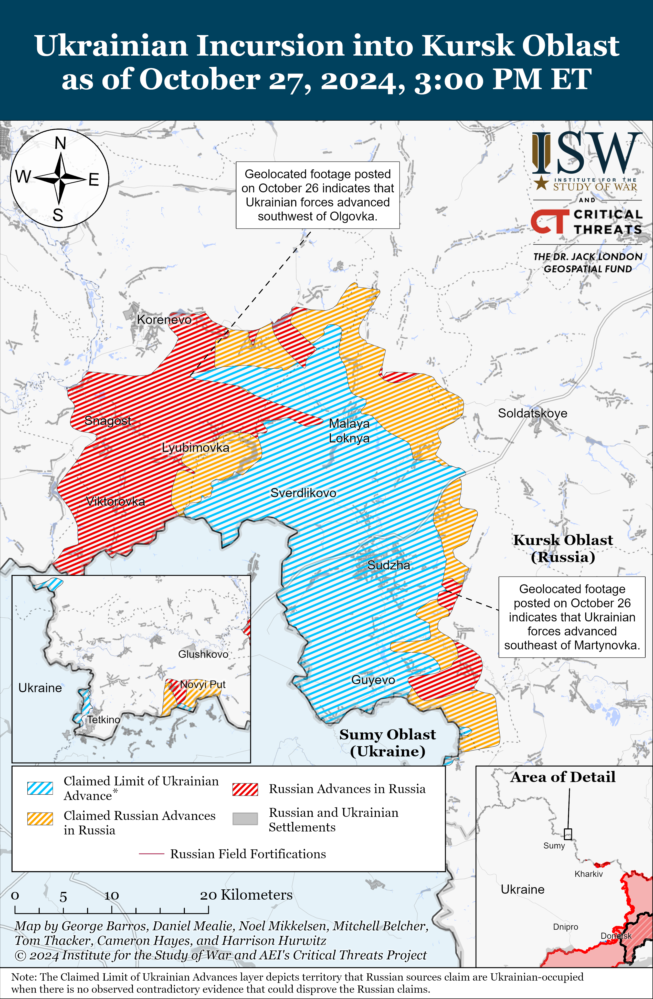
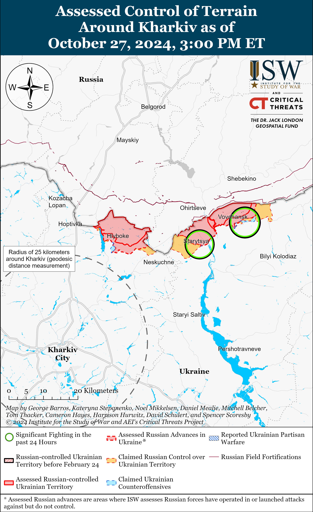
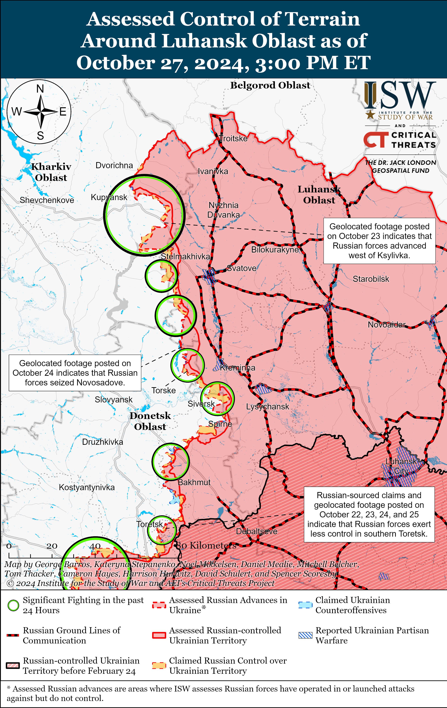
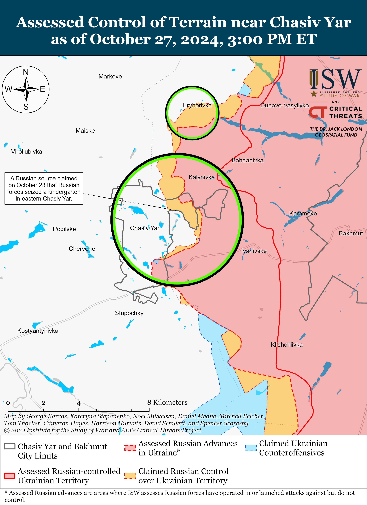
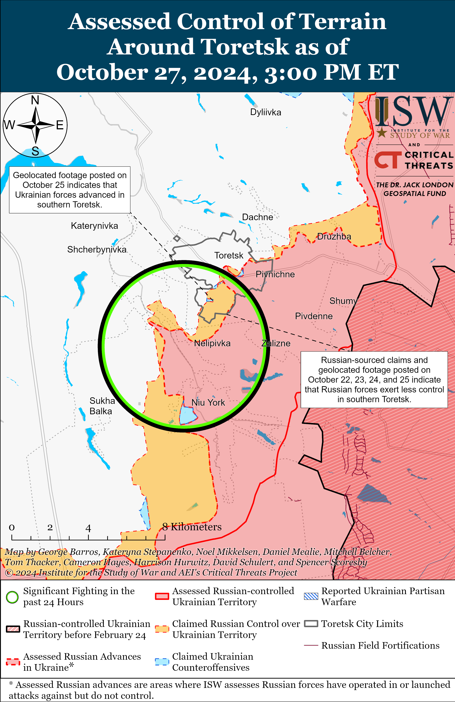
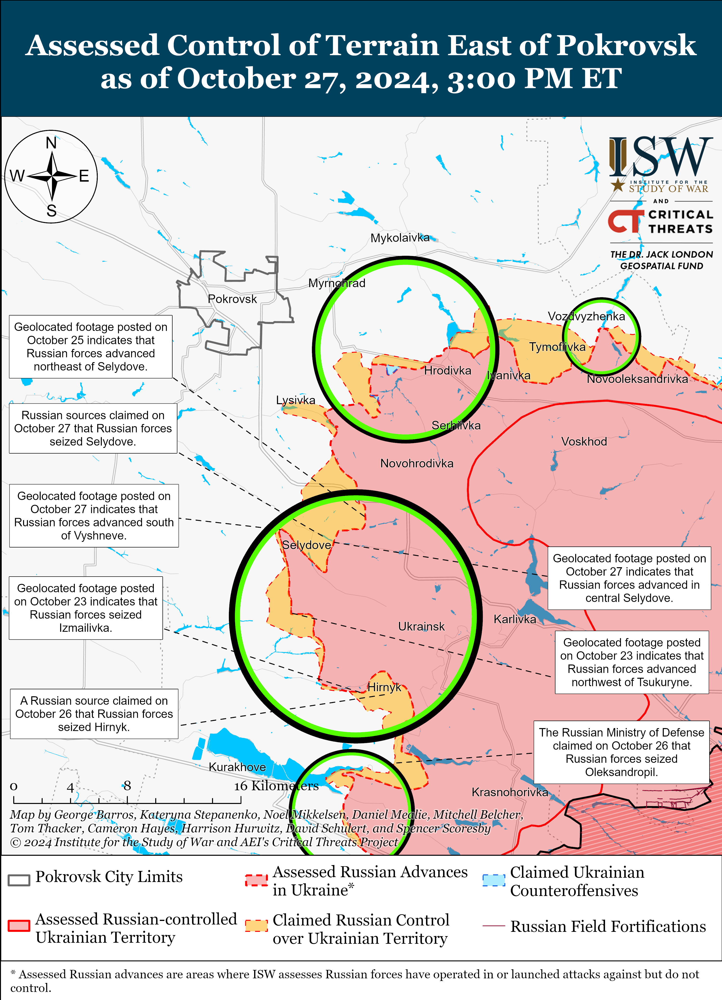
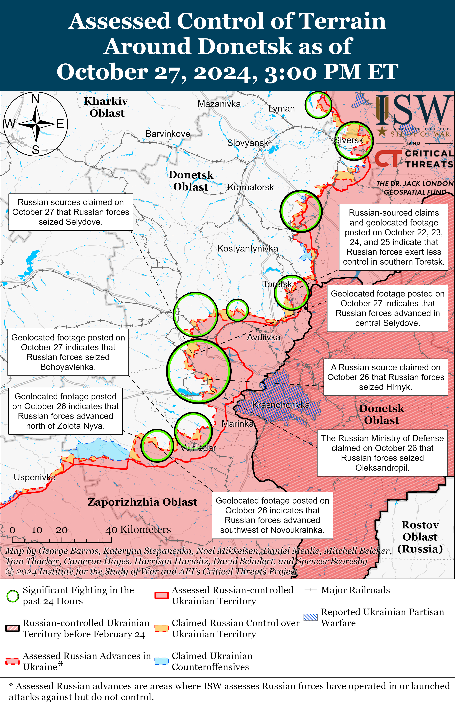
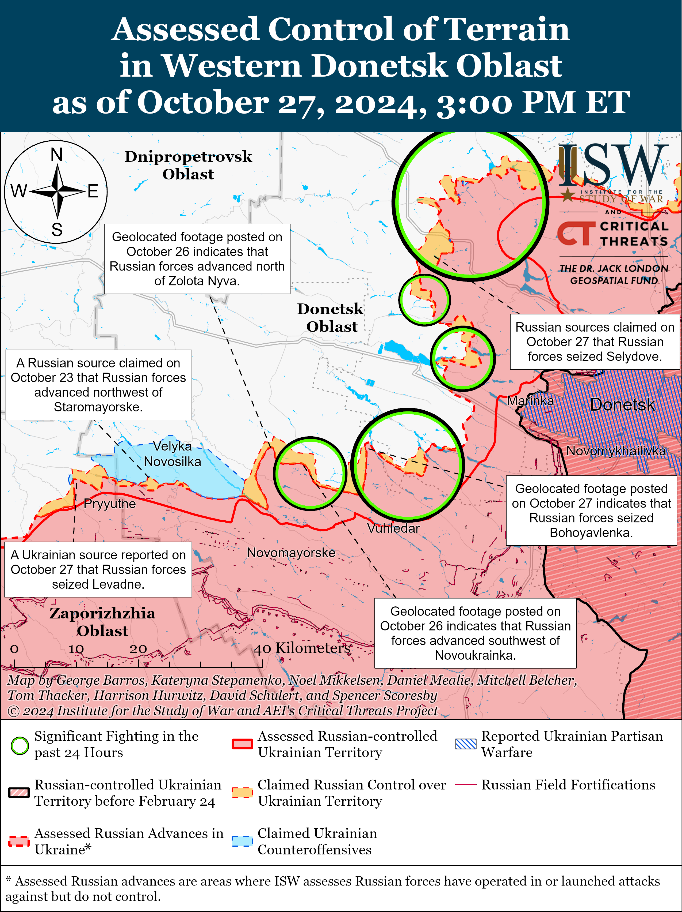
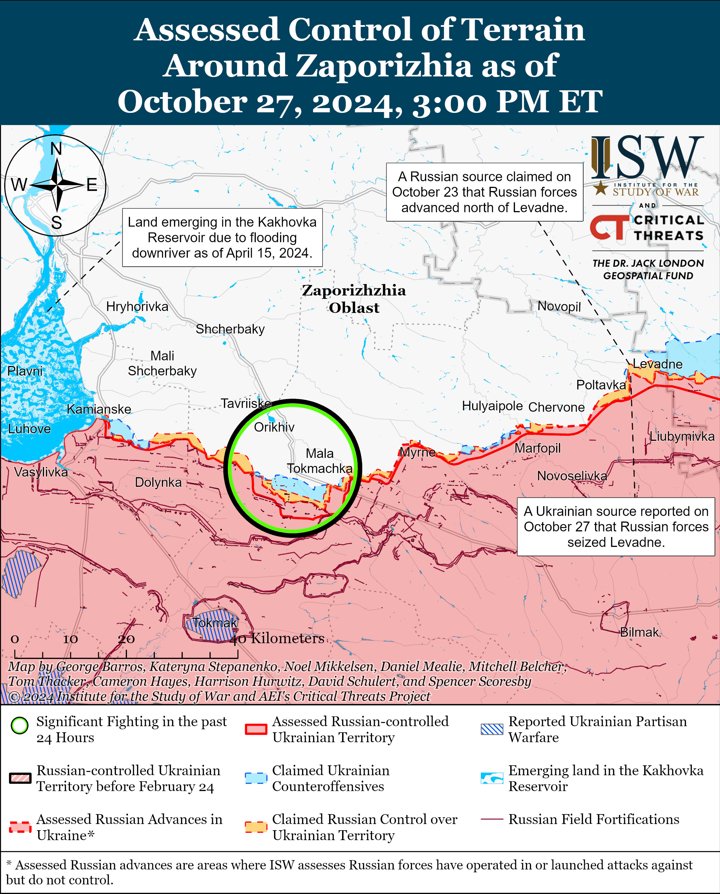
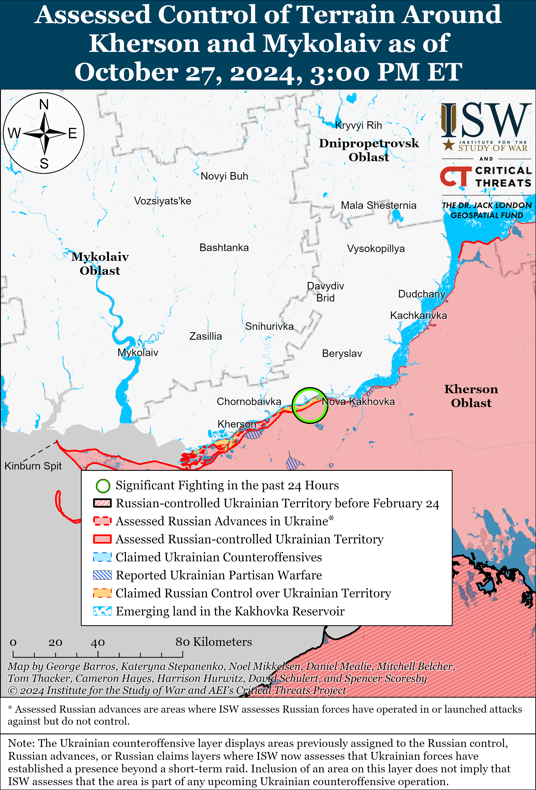

# Russian Offensive Campaign Assessment, October 27, 2024

**October 27, 2024, 5pm ET**

**Click** [**here**](https://storymaps.arcgis.com/stories/36a7f6a6f5a9448496de641cf64bd375) **to see ISW’s interactive map of the Russian invasion of Ukraine. This map is updated daily alongside the static maps present in this report.**

**Click** [**here**](https://storymaps.arcgis.com/stories/83a2f24901c941d581c0c523ecd2619b) **to see ISW's interactive map of Ukraine's offensive in Kursk Oblast.**

**Click** [**here**](https://understandingwar.maps.arcgis.com/apps/instant/3dviewer/index.html?appid=1602762dbcde419bb957dea358449580) **to see ISW’s 3D control of terrain topographic map of Ukraine. Use of a computer (not a mobile device) is strongly recommended for using this data-heavy tool.**

**Click** [**here**](https://storymaps.arcgis.com/stories/733fe90805894bfc8562d90b106aa895) **to access ISW’s archive of interactive time-lapse maps of the Russian invasion of Ukraine. These maps complement the static control-of-terrain map that ISW produces daily by showing a dynamic frontline. ISW will update this time-lapse map archive monthly.**

**Note: The data cut-off for this product was 11:30am ET on October 27. ISW will cover subsequent reports in the October 28 Russian Offensive Campaign Assessment.**

**ISW will cover updates on the Georgian parliamentary election and Moldovan presidential first round election and EU referendum in a separate special edition publication.**

**Russia's economy and war effort is coming under increasing strain, which will pose increasingly acute challenges to Russian President Vladimir Putin's ability to sustain the war over the long-term.** The *Washington Post* reported on October 27 that the Russian economy is "in danger of overheating," noting that Russia's excessively high military spending has fueled economic growth in a way that has forced Russian companies to artificially raise their salaries in order to fulfill labor demands by remaining competitive with Russia’s high military salaries.[[1]](#_edn9e4658e01677d8cd4509b116598247651) The *Washington Post* quoted Russian Central Bank Head Elvira Nabiullina, who warned in July 2024 that Russia's labor force and production capacity are "almost exhausted." The *Washington Post* noted that private Russian companies are struggling to keep up with Russian military salaries and are increasingly having to offer wages several times higher than the typical industry averages. ISW has recently reported that Russian regional authorities are significantly increasing the one-time signing bonuses for Russian contract servicemembers in order to sustain Russia’s rate of force generation (roughly 30,000 troops per month), which underscores the fact that Russia does not have an indefinite pool of manpower and must financially and socially reckon with the ever-growing costs of replenishing its frontline losses via various force-generation avenues.[[2]](#_edn9e4658e01677d8cd4509b116598247652) The *Washington Post* also noted that Russia's stringent migration policies, particularly after the March 2024 Crocus City Hall attack, have further depleted Russia's labor pool and amplified economic frictions. This has particularly become the case as migrant workers are increasingly identifying Russia as a hostile and unattractive place to relocate for work.[[3]](#_edn9e4658e01677d8cd4509b116598247653) ISW has reported at length on the balance that Putin is trying to strike between catering to his pro-war ultranationalist constituency, which espouses extreme anti-migrant sentiments, and his practical need to leverage migrant labor both economically and militarily.[[4]](#_edn9e4658e01677d8cd4509b116598247654)

Putin very likely assesses that calling another partial mobilization wave, or introducing general mobilization, will be too costly to his regime, and has therefore resorted to crypto-mobilization efforts that appear to be placing greater and greater strains on the Russian wartime economy. The recent appearance of North Korean troops in Russia, and their reported deployment to the combat zone in Kursk Oblast, further suggests that Putin's entire force-generation system is very tenuous.[[5]](#_edn9e4658e01677d8cd4509b116598247655) The costs of fueling the war will increase as Russia continues to burn through manpower and materiel on the frontline. Russian resources are finite, and Putin cannot reckon with these costs indefinitely. Russia's economy will reach a burnout point. That burnout point will inflict great costs on Russian society, which may force Putin to make major decisions about how to resource Russia’s war or change Russia’s mode of warfighting to preserve his regime’s stability.

**Key Takeaways:**

- **Russia's economy and war effort is coming under increasing strain, which will pose increasingly acute challenges to Russian President Vladimir Putin's ability to sustain the war over the long-term.**
- **Ukrainian and Russian forces both advanced within the main Ukrainian salient in Kursk Oblast.**
- **Russian forces advanced in and near Selydove and northwest of Vuhledar.**
- **Russian authorities are using Cossack organizations to militarize Russian children and build out Russia's force generation reserve in the long term.**

***We do not report in detail on Russian war crimes because these activities are well-covered in Western media and do not directly affect the military operations we are assessing and forecasting. We will continue to evaluate and report on the effects of these criminal activities on the Ukrainian military and the Ukrainian population and specifically on combat in Ukrainian urban areas. We utterly condemn Russian violations of the laws of armed conflict and the Geneva Conventions and crimes against humanity even though we do not describe them in these reports.***

- Ukrainian Operations in the Russian Federation
- Russian Main Effort – Eastern Ukraine (comprised of three subordinate main efforts)
- Russian Subordinate Main Effort #1 – Push Ukrainian forces back from the international border with Belgorod Oblast and approach to within tube artillery range of Kharkiv City
- Russian Subordinate Main Effort #2 – Capture the remainder of Luhansk Oblast and push westward into eastern Kharkiv Oblast and encircle northern Donetsk Oblast
- Russian Subordinate Main Effort #3 – Capture the entirety of Donetsk Oblast
- Russian Supporting Effort – Southern Axis
- Russian Air, Missile, and Drone Campaign
- Russian Mobilization and Force Generation Efforts
- Russian Technological Adaptations
- Activities in Russian-occupied areas
- Significant Activity in Belarus

**Ukrainian Operations in the Russian Federation**

Ukrainian forces recently advanced within the main Ukrainian salient in Kursk Oblast amid continued Ukrainian ground attacks in the area on October 27. Geolocated footage published on October 26 indicates that Ukrainian forces recently advanced southwest of Olgovka (east of Korenevo) and east of Kolmakov (east of Sudzha).[[6]](#_edn9e4658e01677d8cd4509b116598247656) Russian sources, including the Ministry of Defense (MoD), claimed on October 27 that Ukrainian forces attacked southeast of Korenevo near Zeleny Shlyakh, Novoivanvoka, Daryino, Nizhny Klin, Pogrebki, and Nikolaevo-Daryino; and southeast of Sudzha near Plekhovo.[[7]](#_edn9e4658e01677d8cd4509b116598247657)

Russian forces recently marginally advanced within the main Ukrainian salient in Kursk Oblast. Geolocated footage published on October 26 indicates that Russian forces recently marginally advanced southeast of Martynovka (northeast of Sudzha).[[8]](#_edn9e4658e01677d8cd4509b116598247658) Elements of the Russian 137th Airborne (VDV) Regiment (106th VDV Division) are operating near Lyubimovka (southeast of Korenevo); elements of the 11th VDV Brigade are reportedly operating near Cherkasskaya Konopelka (southeast of Sudzha); and elements of the 810th Naval Infantry Brigade (Black Sea Fleet) and 155th Naval Infantry Brigade (Pacific Fleet, Eastern Military District [EMD]) are reportedly operating in unspecified areas of Kursk Oblast.[[9]](#_edn9e4658e01677d8cd4509b116598247659)

A Russian source claimed that Ukrainian forces attacked near Novy Put in Glushkovsky Raion, west of the main Ukrainian salient in Kursk Oblast, as of the evening of October 26.[[10]](#_edn9e4658e01677d8cd4509b1165982476510)

**Russian Main Effort – Eastern Ukraine**

**Russian Subordinate Main Effort #1 – Kharkiv Oblast** **(Russian objective: Push Ukrainian forces back from the international border with Belgorod Oblast and approach to within tube artillery range of Kharkiv City)**

Russian forces continued offensive operations in northern Kharkiv Oblast on October 27 but did not make any confirmed advances. Russian forces continued attacking northeast of Kharkiv City near Vovchansk and Starytsya (southwest of Vovchansk) on October 26 and 27.[[11]](#_edn9e4658e01677d8cd4509b1165982476511) Ukraine's Kharkiv Group of Forces Spokesperson Colonel Yevhenii Romanov stated 60 percent of the 122mm and 152mm artillery ammunition that Russian forces are firing in the Kharkiv direction is from North Korea.[[12]](#_edn9e4658e01677d8cd4509b1165982476512) Romanov stated that the North Korean shells are poor quality and do not hit their targets or explode at the right time. Romanov also noted that the Russian military may be delivering Iranian-provided ammunition to Russian forces in the area. Drone operators of the Russian 16th Spetsnaz Brigade (Russian General Staff's Main Intelligence Directorate [GRU]) are reportedly operating in Kharkiv Oblast.[[13]](#_edn9e4658e01677d8cd4509b1165982476513)

**Russian Subordinate Main Effort #2 – Luhansk Oblast (Russian objective: Capture the remainder of Luhansk Oblast and push westward into eastern Kharkiv Oblast and northern Donetsk Oblast)**

Russian forces continued operations along the Kupyansk-Svatove-Kreminna line on October 27 but did not make any confirmed advances. Geolocated footage published on October 26 shows Ukrainian forces successfully repelling a Russian platoon-sized mechanized assault northeast of Torske (west of Kreminna).[[14]](#_edn9e4658e01677d8cd4509b1165982476514) A Russian milblogger claimed that unspecified Russian Spetsnaz units are operating near Senkove (south of Kupyansk on the west bank of the Oskil River), although ISW has not observed any visual or independent confirmation that Russian forces have crossed the Oskil River.[[15]](#_edn9e4658e01677d8cd4509b1165982476515) Russian milbloggers claimed that Russian forces advanced within Pershotravneve (west of Svatove) and into the northern outskirts of Terny (west of Kreminna).[[16]](#_edn9e4658e01677d8cd4509b1165982476516) A Ukrainian battalion commander operating in the Kupyansk direction stated that Russian forces are intensifying glide bomb strikes against Kupyansk and the east (left) bank of the Oskil River in an attempt to gain a foothold on the left bank of the Oskil River and assault Kupyansk-Vuzlovyi (south of Kupyansk).[[17]](#_edn9e4658e01677d8cd4509b1165982476517) The Ukrainian commander stated that Ukrainian forces repelled a Russian reinforced battalion-sized mechanized assault in the Kupyansk direction two weeks ago, which may refer to the Russian reinforced battalion-sized mechanized assault launched in the Kupyansk direction on September 26.[[18]](#_edn9e4658e01677d8cd4509b1165982476518) Russian forces continued attacking northeast of Kupyansk near Synkivka; north of Kupyansk near Kindrashivka; south of Kupyansk near Kruhlyakivka, Kolisnykivka, Zahryzove; southeast of Kupyansk near Vyshneve, Lozova, and Berestove; east of Kupyansk near Petropavlivka; west of Svatove near Pershotravneve; northwest of Kreminna near Chereshchyna, Terny, Hrekivka, Novomykhailivka, and Makiivka; south of Kreminna near Hryhorivka; west of Kreminna near Torske and Zarichne; and southwest of Kreminna near Serebryanka on October 26 and 27.[[19]](#_edn9e4658e01677d8cd4509b1165982476519)

**Russian Subordinate Main Effort #3 – Donetsk Oblast (Russian objective: Capture the entirety of Donetsk Oblast, the claimed territory of Russia’s proxies in Donbas)**

The Ukrainian General Staff reported that Russian forces conducted unsuccessful ground attacks northeast of Siversk near Bilohorivka on October 26 and 27.[[20]](#_edn9e4658e01677d8cd4509b1165982476520) Elements of the Russian 85th Motorized Rifle Brigade (3rd Combined Arms Army [CAA], formerly 2nd Luhansk People's Republic Army Corps [LNR AC]) are reported operating in the Siversk direction.[[21]](#_edn9e4658e01677d8cd4509b1165982476521)

The Ukrainian General Staff reported that Russian forces conducted an unsuccessful ground attack near Orikhovo-Vasylivka (northeast of Chasiv Yar) on October 27.[[22]](#_edn9e4658e01677d8cd4509b1165982476522) Elements of the Russian 98th Airborne (VDV) Division are reportedly operating near Chasiv Yar.[[23]](#_edn9e4658e01677d8cd4509b1165982476523)

Russian forces continued offensive operations in the Toretsk direction on October 27 but did not advance. Russian and Ukrainian sources reported continued fighting within Toretsk itself; south of Toretsk near Niu-York; and west of Toretsk near Shcherbynivka.[[24]](#_edn9e4658e01677d8cd4509b1165982476524) Russian President Vladimir Putin claimed on October 27 that Russian forces control two-thirds (67 percent) of Toretsk, although ISW has only observed visual evidence to assess that Russian forces occupy about 23 percent of the city.[[25]](#_edn9e4658e01677d8cd4509b1165982476525)

Russian forces continued to advance in and near Selydove amid continued intensive offensive operations southeast of Pokrovsk. Geolocated footage published on October 27 shows Russian forces raising a flag over the Selydove City Council building, indicating that Russian forces have made advances into central Selydove.[[26]](#_edn9e4658e01677d8cd4509b1165982476526) Several Russian milbloggers claimed that Russian forces seized and are clearing the entirety of Selydove, although ISW has not yet observed confirmation of Russian forces operating in western Selydove.[[27]](#_edn9e4658e01677d8cd4509b1165982476527) Geolocated footage published on October 27 also shows that Russian forces recently advanced south of Vyshneve (just west of Selydove).[[28]](#_edn9e4658e01677d8cd4509b1165982476528) Some Russian sources claimed that Russian forces have also advanced into Vyshneve, although ISW has not yet observed confirmation of Russian forces operating within Vyshneve.[[29]](#_edn9e4658e01677d8cd4509b1165982476529) The Ukrainian General Staff reported that Russian forces attacked east of Pokrovsk near Promin, Myrolyubivka, and Vozdvyzhenka; and southeast of Pokrovsk near Krasnyi Yar, Krutyi Yar, Mykolaivka, Lysivka, and Selydove on October 26 and 27.[[30]](#_edn9e4658e01677d8cd4509b1165982476530) Elements of the Russian 114th Motorized Rifle Brigade (51st CAA, formerly 1st Donetsk People's Republic [DNR] AC) are reportedly operating near Hirnyk (southeast of Pokrovsk), and elements of the 1453rd Motorized Rifle Regiment (51st CAA) are reportedly operating in Selydove.[[31]](#_edn9e4658e01677d8cd4509b1165982476531) Elements of the 74th Separate Motorized Rifle Brigade (41st CAA, Central Military District [CMD]) are reportedly operating in the general Pokrovsk direction.[[32]](#_edn9e4658e01677d8cd4509b1165982476532)

Russian forces continued offensive operations east of Kurakhove on October 27 but did not make any confirmed advances. Russian and Ukrainian sources reported continued fighting west of Oleksandropil; near Dalne, Hostre, Maksymilyanivka, and Kurakhivka; and on the eastern outskirts of Kurakhove itself.[[33]](#_edn9e4658e01677d8cd4509b1165982476533) Elements of the 110th Motorized Rifle Brigade (51st CAA) are reportedly operating near Oleksandropil, and elements of the 102nd Motorized Rifle Regiment and 238th Artillery Brigade (both 8th CAA, Southern Military District [SMD]) and the 5th Motorized Rifle Brigade (51st CAA) are operating on the outskirt of Kurakhove.[[34]](#_edn9e4658e01677d8cd4509b1165982476534)

Russian forces recently advanced near Vuhledar amid continued offensive operations southwest of Donetsk City on October 27. Geolocated footage published on October 27 shows a Russian soldier raising the flag of the 36th Motorized Rifle Brigade (29th CAA, Eastern Military District [EMD]) over central Bohoyavlenka (northwest of Vuhledar), indicating that Russian forces have likely seized most of the settlement.[[35]](#_edn9e4658e01677d8cd4509b1165982476535) Russian security forces told Kremlin newswire *TASS* on October 27 that Ukrainian forces have withdrawn from most of their positions in Bohoyavlenka.[[36]](#_edn9e4658e01677d8cd4509b1165982476536) Additional geolocated footage published on October 26 shows that Russian forces have advanced in fields southwest of Novoukrainka (southwest of Bohoyavlenka and northwest of Vuhledar).[[37]](#_edn9e4658e01677d8cd4509b1165982476537) A Russian milblogger claimed that Russian forces also advanced in southern Novoukrainka, although ISW has not yet observed confirmation of this claim.[[38]](#_edn9e4658e01677d8cd4509b1165982476538) A Ukrainian brigade operating near Vuhledar posted footage on October 26 of a Ukrainian forces repelling a Russian mechanized assault near Zolota Nyva (west of Vuhledar) and reported that Russian forces used several dozens of pieces of equipment including tanks and armored vehicles, of which Ukrainian forces reportedly destroyed 20 pieces of equipment.[[39]](#_edn9e4658e01677d8cd4509b1165982476539) ISW cannot independently confirm when the mechanized assault took place, nor the echelon of the attack. Russian and Ukrainian sources reported continued fighting northeast of Vuhledar near Katerynivka, Antonivka, Kostyantynivka, and Yelyzavetivka, and near Bohoyavlenka, Novoukrainka, and Zolota Nyva.[[40]](#_edn9e4658e01677d8cd4509b1165982476540) Elements of the Russian 430th Motorized Rifle Regiment (likely a mobilized regiment), 14th Spetsnaz Brigade (Main Directorate of the General Staff of the Russian Armed Forces [GRU]), and 36th Motorized Rifle Brigade (29th CAA, EMD) are operating near Bohoyavlenka; elements of the 40th Naval Infantry Brigade (Pacific Fleet, EMD) and 36th CAA (EMD) are operating near Shakhtarske and Novoukrainka; elements of the 255th Motorized Rifle Regiment (20th Motorized Rifle Division, 8th CAA, SMD), 9th Motorized Rifle Brigade (51st CAA), and 1472nd Motorized Rifle Regiment (68th AC, EMD) are operating near Katerynivka; and elements of the 33rd Motorized Rifle Regiment (20th Motorized Rifle Division, 8th CAA, SMD) are operating near Antonivka.[[41]](#_edn9e4658e01677d8cd4509b1165982476541)

Neither Russian nor Ukrainian sources reported fighting in the Donetsk-Zaporizhia Oblast border area on October 27. Ukrainian Tavriisk Group of Forces Spokesperson Colonel Vladyslav Voloshyn confirmed on October 27 that Russian forces managed to recently seize Levadne (southwest of Velyka Novosilka) and noted that Ukrainian forces are conducting efforts to restore positions in the area even though Levadne is in a tactically challenging lowland area.[[42]](#_edn9e4658e01677d8cd4509b1165982476542)

**Russian Supporting Effort – Southern Axis (Russian objective: Maintain frontline positions and secure rear areas against Ukrainian strikes)**

Russian forces continued ground attacks in western Zaporizhia Oblast on October 27 but did not make any confirmed advances. Russian forces attacked in the vicinity of Novodanylivka (north of Robotyne) on October 26 and 27.[[43]](#_edn9e4658e01677d8cd4509b1165982476543) Ukraine's Tavriisk Group of Forces Spokesperson Colonel Vladyslav Voloshyn stated that the Ukrainian military has not detected Russian efforts to form offensive groups in southern Ukraine.[[44]](#_edn9e4658e01677d8cd4509b1165982476544)

Russian forces continued ground attacks in east (left) bank Kherson Oblast on October 26 and 27 but did not make any confirmed advances.[[45]](#_edn9e4658e01677d8cd4509b1165982476545) Elements of the Russian 104th Airborne (VDV) Division reportedly continue operating in Kherson Oblast.[[46]](#_edn9e4658e01677d8cd4509b1165982476546)

**Russian Air, Missile, and Drone Campaign (Russian Objective: Target Ukrainian military and civilian infrastructure in the rear and on the frontline)**

Russian forces conducted a series of drone strikes against Ukraine on the night of October 26 to 27. The Ukrainian Air Force reported that Russian forces launched 80 Shahed-136/131 drones and drones of an unidentified type from Oryol and Kursk oblasts and Primorsko-Akhtarsk, Krasnodar Krai.[[47]](#_edn9e4658e01677d8cd4509b1165982476547) The Ukrainian Air Force reported that Ukrainian forces downed 41 drones over Odesa, Mykolaiv, Kherson, Kyiv, Sumy, Kirovohrad, Cherkasy, Zhytomyr, Khmelnytskyi, and Chernihiv oblasts; that 32 drones became "lost," possibly due to Ukrainian electronic warfare (EW) countermeasures; and that one drone flew into Belarusian airspace as of 0930 local time on October 27.

Ukrainian President Volodymyr Zelensky stated on October 27 that Russian forces have launched 1,100 glide bombs, 560 strike drones, and 20 missiles of various types at Ukraine in the past week.[[48]](#_edn9e4658e01677d8cd4509b1165982476548)

**Russian Mobilization and Force Generation Efforts (Russian objective: Expand combat power without conducting general mobilization)**

Russian authorities are using Cossack organizations to militarize Russian children and build out Russia's force generation reserve in the long term. Russian opposition outlet *SOTA* reported on October 27 that another group of 300 children began training at the Patriotic Education Center in Belgorod Oblast, where they reportedly will learn about Cossack military culture, uniforms, and weapons handling.[[49]](#_edn9e4658e01677d8cd4509b1165982476549) *SOTA* noted that the Russian Presidential Fund is providing the funding for this program, which is aimed at "popularizing Cossack history and Cossack culture" and the "moral and patriotic education of the younger generation."[[50]](#_edn9e4658e01677d8cd4509b1165982476550) ISW has recently reported on Russia's use of Cossack organizations, including the youth-focused Cossack cadet corps, as a method of building out Russia's long term mobilization reserve.[[51]](#_edn9e4658e01677d8cd4509b1165982476551)

**Russian Technological Adaptations** **(Russian objective: Introduce technological innovations to optimize systems for use in Ukraine)**

Nothing significant to report.

**Activities in Russian-occupied areas (Russian objective: Consolidate administrative control of annexed areas; forcibly integrate Ukrainian citizens into Russian sociocultural, economic, military, and governance systems)**

*ISW is not publishing reporting on activities in Russian-occupied areas today.*

**Significant activity in Belarus** **(Russian efforts to increase its military presence in Belarus and further integrate Belarus into Russian-favorable frameworks and Wagner Group activity in Belarus)**

Russia will reportedly represent Belarus at the World Bank, likely as part of ongoing efforts to co-opt Belarusian foreign policy. Executive Director representing Russia at the World Bank Roman Marshavin announced on October 27 that Russia will represent Belarus at the World Bank starting in November 2024.[[52]](#_edn9e4658e01677d8cd4509b1165982476552) A Turkish national representing several European countries previously represented Belarus at the World Bank.[[53]](#_edn9e4658e01677d8cd4509b1165982476553) ISW will release a forthcoming long-form report about how the Kremlin seeks to de facto annex Belarus, including by establishing control of Belarusian monetary policy by imposing a Russian-Belarusian currency union using the Russian ruble.

**Note: ISW does not receive any classified material from any source, uses only publicly available information, and draws extensively on Russian, Ukrainian, and Western reporting and social media as well as commercially available satellite imagery and other geospatial data as the basis for these reports. References to all sources used are provided in the endnotes of each update.**

---

[[1]](#_edn9e4658e01677d8cd4509b11659824765ref1) https://www.washingtonpost.com/world/2024/10/27/russia-economy-overheating-inflation-interest-rates-war/?utm\_source=rss&utm\_medium=referral&utm\_campaign=wp\_homepage

[[2]](#_edn9e4658e01677d8cd4509b11659824765ref2) <https://www.understandingwar.org/backgrounder/russian-offensive-campaign-assessment-october-15-2024>; https://www.understandingwar.org/backgrounder/russian-offensive-campaign-assessment-october-18-2024

[[3]](#_edn9e4658e01677d8cd4509b11659824765ref3) https://www.washingtonpost.com/world/2024/10/27/russia-economy-overheating-inflation-interest-rates-war/?utm\_source=rss&utm\_medium=referral&utm\_campaign=wp\_homepage

[[4]](#_edn9e4658e01677d8cd4509b11659824765ref4) https://isw.pub/UkrWar071924 ; https://isw.pub/UkrWar071524 ; https://isw.pub/UkrWar062824 ; https://isw.pub/UkrWar06272024 ; <https://isw.pub/UkrWar041024>; https://understandingwar.org/backgrounder/russian-offensive-campaign-assessment-october-25-2024

[[5]](#_edn9e4658e01677d8cd4509b11659824765ref5) <https://www.nytimes.com/2024/10/25/world/europe/north-korean-troops-arrive-kursk-russia.html>; https://www.bloomberg.com/news/articles/2024-10-25/north-korea-to-send-more-troops-to-russia-soon-intelligence-documents-reveal

[[6]](#_edn9e4658e01677d8cd4509b11659824765ref6) (Olgovka) https://x.com/budeshta/status/1850413310405149002; <https://t.me/rusich_army/17973>

(Kolmakov) https://x.com/franfran2424/status/1850510495574335962; https://t.me/PubgWithoutSaving/121

[[7]](#_edn9e4658e01677d8cd4509b11659824765ref7) <https://t.me/mod_russia/44994> ; <https://t.me/rybar/64821> ; <https://t.me/dva_majors/56037> ; <https://t.me/boris_rozhin/142269>

[[8]](#_edn9e4658e01677d8cd4509b11659824765ref8) https://x.com/moklasen/status/1850255136225886670; https://t.me/foxtrot\_uav/92; https://t.me/severnnyi/2453; https://x.com/moklasen/status/1850255499737825463

[[9]](#_edn9e4658e01677d8cd4509b11659824765ref9) <https://t.me/rusich_army/17973> ; https://t.me/russian\_airborne/7779 ; <https://t.me/boris_rozhin/142239> ; https://t.me/boris\_rozhin/142216 ; https://t.me/ButusovPlus/14588

[[10]](#_edn9e4658e01677d8cd4509b11659824765ref10) https://t.me/rybar/64821

[[11]](#_edn9e4658e01677d8cd4509b11659824765ref11) <https://www.facebook.com/GeneralStaff.ua/posts/pfbid02kjJqR5hb2eMWxUX3G5qUi6cwjWALfPQEC2qdyEy3436c9fsr3rhfZLWjC356TkGul> ; https://www.facebook.com/GeneralStaff.ua/posts/pfbid02FsE4y9jEDBshbSGnnaSh1HreLVyaeXLz6uEwTAgZzHD5dSc8QkAPfu3991pQUkXUl ; <https://www.facebook.com/GeneralStaff.ua/posts/pfbid02JEcUY7Bi6n3fe4hYgpbAGSFQBQEbfMc9XYfQdH1nNnc6FL9GnhkHKkJmHzVtBh93l>

[[12]](#_edn9e4658e01677d8cd4509b11659824765ref12) https://armyinform.com dot ua/2024/10/26/spravzhnya-radyanska-yakist-chomu-v-zsu-zadovoleni-pivnichnokorejskymy-ta-iranskymy-boyeprypasamy/

[[13]](#_edn9e4658e01677d8cd4509b11659824765ref13) <https://t.me/boris_rozhin/142290>

[[14]](#_edn9e4658e01677d8cd4509b11659824765ref14) https://x.com/GermanObserver1/status/1850292721547694212; https://t.me/OMIBr\_60/579;<https://x.com/MikiValbuena/status/1850239140799164677>

[[15]](#_edn9e4658e01677d8cd4509b11659824765ref15) <https://t.me/Sladkov_plus/11682>

[[16]](#_edn9e4658e01677d8cd4509b11659824765ref16) <https://t.me/DnevnikDesantnika/18083> ; https://t.me/basurin\_e/15137

[[17]](#_edn9e4658e01677d8cd4509b11659824765ref17) https://armyinform.com dot ua/2024/10/27/prasuyut-kabamy-ta-prosuvayutsya-najdeshevshym-resursom-u-zsu-rozkryly-metu-okupantiv-na-kupyanshhyni/

[[18]](#_edn9e4658e01677d8cd4509b11659824765ref18) <https://understandingwar.org/backgrounder/russian-offensive-campaign-assessment-september-27-2024> ; https://armyinform.com dot ua/2024/10/27/prasuyut-kabamy-ta-prosuvayutsya-najdeshevshym-resursom-u-zsu-rozkryly-metu-okupantiv-na-kupyanshhyni/

[[19]](#_edn9e4658e01677d8cd4509b11659824765ref19)https://www.facebook.com/GeneralStaff.ua/posts/pfbid02JEcUY7Bi6n3fe4hYgpbAGSFQBQEbfMc9XYfQdH1nNnc6FL9GnhkHKkJmHzVtBh93l ; https://www.facebook.com/GeneralStaff.ua/posts/pfbid02FsE4y9jEDBshbSGnnaSh1HreLVyaeXLz6uEwTAgZzHD5dSc8QkAPfu3991pQUkXUl ; https://www.facebook.com/GeneralStaff.ua/posts/pfbid02kjJqR5hb2eMWxUX3G5qUi6cwjWALfPQEC2qdyEy3436c9fsr3rhfZLWjC356TkGul ; https://www.facebook.com/GeneralStaff.ua/posts/pfbid02JEcUY7Bi6n3fe4hYgpbAGSFQBQEbfMc9XYfQdH1nNnc6FL9GnhkHKkJmHzVtBh93l ; <https://www.facebook.com/GeneralStaff.ua/posts/pfbid02kjJqR5hb2eMWxUX3G5qUi6cwjWALfPQEC2qdyEy3436c9fsr3rhfZLWjC356TkGul>

[[20]](#_edn9e4658e01677d8cd4509b11659824765ref20) <https://www.facebook.com/GeneralStaff.ua/posts/pfbid02FsE4y9jEDBshbSGnnaSh1HreLVyaeXLz6uEwTAgZzHD5dSc8QkAPfu3991pQUkXUl>; <https://www.facebook.com/GeneralStaff.ua/posts/pfbid02JEcUY7Bi6n3fe4hYgpbAGSFQBQEbfMc9XYfQdH1nNnc6FL9GnhkHKkJmHzVtBh93l>

[[21]](#_edn9e4658e01677d8cd4509b11659824765ref21) <https://t.me/boris_rozhin/142303>

[[22]](#_edn9e4658e01677d8cd4509b11659824765ref22) https://www.facebook.com/GeneralStaff.ua/posts/pfbid02kjJqR5hb2eMWxUX3G5qUi6cwjWALfPQEC2qdyEy3436c9fsr3rhfZLWjC356TkGul

[[23]](#_edn9e4658e01677d8cd4509b11659824765ref23) https://t.me/boris\_rozhin/142295

[[24]](#_edn9e4658e01677d8cd4509b11659824765ref24) <https://www.facebook.com/GeneralStaff.ua/posts/pfbid02kjJqR5hb2eMWxUX3G5qUi6cwjWALfPQEC2qdyEy3436c9fsr3rhfZLWjC356TkGul>; <https://www.facebook.com/GeneralStaff.ua/posts/pfbid02FsE4y9jEDBshbSGnnaSh1HreLVyaeXLz6uEwTAgZzHD5dSc8QkAPfu3991pQUkXUl> ; <https://www.facebook.com/GeneralStaff.ua/posts/pfbid02JEcUY7Bi6n3fe4hYgpbAGSFQBQEbfMc9XYfQdH1nNnc6FL9GnhkHKkJmHzVtBh93l;> <https://t.me/epoddubny/21457>

[[25]](#_edn9e4658e01677d8cd4509b11659824765ref25) https://t.me/tass\_agency/281990

[[26]](#_edn9e4658e01677d8cd4509b11659824765ref26) <https://x.com/AudaxonX/status/1850572752035500233>; <https://t.me/ZParaBellumMD/12269>

[[27]](#_edn9e4658e01677d8cd4509b11659824765ref27) <https://t.me/RVvoenkor/79503>; <https://t.me/DnevnikDesantnika/18065;> <https://t.me/dva_majors/56037>; <https://t.me/rusich_army/17995;> <https://t.me/sashakots/49790;> <https://t.me/boris_rozhin/142260;> <https://t.me/boris_rozhin/142268;> https://t.me/RVvoenkor/79541

[[28]](#_edn9e4658e01677d8cd4509b11659824765ref28) <https://t.me/GeneralStaffZSU/18237>; <https://t.me/creamy_caprice/7281;> https://x.com/giK1893/status/1850517240971472968

[[29]](#_edn9e4658e01677d8cd4509b11659824765ref29) <https://t.me/RVvoenkor/79545> <https://t.me/z_arhiv/28920> ; <https://t.me/z_arhiv/28921;> <https://t.me/boris_rozhin/142344;> . <https://t.me/voenkorKotenok/59774>

[[30]](#_edn9e4658e01677d8cd4509b11659824765ref30) <https://www.facebook.com/GeneralStaff.ua/posts/pfbid02kjJqR5hb2eMWxUX3G5qUi6cwjWALfPQEC2qdyEy3436c9fsr3rhfZLWjC356TkGul>; <https://www.facebook.com/GeneralStaff.ua/posts/pfbid02FsE4y9jEDBshbSGnnaSh1HreLVyaeXLz6uEwTAgZzHD5dSc8QkAPfu3991pQUkXUl;> <https://www.facebook.com/GeneralStaff.ua/posts/pfbid02JEcUY7Bi6n3fe4hYgpbAGSFQBQEbfMc9XYfQdH1nNnc6FL9GnhkHKkJmHzVtBh93l>

[[31]](#_edn9e4658e01677d8cd4509b11659824765ref31) <https://t.me/AMinuteOfReadiness/627>; <https://t.me/motopatriot/28868>; <https://t.me/mo114rf/62>

[[32]](#_edn9e4658e01677d8cd4509b11659824765ref32) <https://t.me/urga_74/2268> ; <https://t.me/boris_rozhin/142241>

[[33]](#_edn9e4658e01677d8cd4509b11659824765ref33) <https://www.facebook.com/GeneralStaff.ua/posts/pfbid02kjJqR5hb2eMWxUX3G5qUi6cwjWALfPQEC2qdyEy3436c9fsr3rhfZLWjC356TkGul>; <https://www.facebook.com/GeneralStaff.ua/posts/pfbid02FsE4y9jEDBshbSGnnaSh1HreLVyaeXLz6uEwTAgZzHD5dSc8QkAPfu3991pQUkXUl>

[[34]](#_edn9e4658e01677d8cd4509b11659824765ref34) <https://t.me/DnevnikDesantnika/18043> (Oleksandropil); <https://t.me/boris_rozhin/142261;> <https://t.me/boris_rozhin/142322> (Kurakhove)

[[35]](#_edn9e4658e01677d8cd4509b11659824765ref35) <https://t.me/WarArchive_ua/21666;> <https://x.com/AudaxonX/status/1850463342550237480>; <https://t.me/voin_dv/11502>; <https://t.me/creamy_caprice/7271>; <https://x.com/GirkinGirkin/status/1850461961768554791>; [https://t.me/motopatriot/28843; https://t.me/motopatriot/28847](https://t.me/motopatriot/28843;)

[[36]](#_edn9e4658e01677d8cd4509b11659824765ref36) <https://t.me/tass_agency/282010>

[[37]](#_edn9e4658e01677d8cd4509b11659824765ref37) <https://x.com/giK1893/status/1850328879396773894>; <https://t.me/SPN_SIGMA/930;> <https://t.me/creamy_caprice/7269>; <https://t.me/SPN_SIGMA/930>

[[38]](#_edn9e4658e01677d8cd4509b11659824765ref38) <https://t.me/z_arhiv/28899>

[[39]](#_edn9e4658e01677d8cd4509b11659824765ref39) <https://t.me/opbr_zsu/384;> <https://t.me/ButusovPlus/14584;> [https://mil.in](https://mil.in/) dot ua/uk/news/prezydentska-brygada-rozbyla-shturmovi-pidrozdily-okupantiv-poblyzu-vugledara/

[[40]](#_edn9e4658e01677d8cd4509b11659824765ref40) <https://www.facebook.com/GeneralStaff.ua/posts/pfbid02kjJqR5hb2eMWxUX3G5qUi6cwjWALfPQEC2qdyEy3436c9fsr3rhfZLWjC356TkGul>; <https://www.facebook.com/GeneralStaff.ua/posts/pfbid02FsE4y9jEDBshbSGnnaSh1HreLVyaeXLz6uEwTAgZzHD5dSc8QkAPfu3991pQUkXUl;> <https://t.me/rybar/64819>

[[41]](#_edn9e4658e01677d8cd4509b11659824765ref41) <https://t.me/dva_majors/56017> (Antonivka); <https://t.me/z_arhiv/28915;> <https://t.me/voin_dv/11507> (Katerynivka); [https://t.me/motopatriot/28843; https://t.me/motopatriot/28847;](https://t.me/motopatriot/28843;) <https://t.me/z_arhiv/28917;> <https://t.me/voin_dv/11493> ; <https://t.me/voin_dv/11501> ; <https://t.me/voin_dv/11506> ; <https://t.me/voin_dv/11508> ; <https://t.me/voin_dv/11504> (Bohoyavlenka); <https://t.me/rybar/64819> (Shakhtarske-Novoukrainka)

[[42]](#_edn9e4658e01677d8cd4509b11659824765ref42) <https://armyinform.com> dot ua/2024/10/27/rajon-levadnogo-kontrolyuyut-zsu-uspih-voroga-maye-obmezhenyj-harakter/

[[43]](#_edn9e4658e01677d8cd4509b11659824765ref43) https://www.facebook.com/GeneralStaff.ua/posts/pfbid02FsE4y9jEDBshbSGnnaSh1HreLVyaeXLz6uEwTAgZzHD5dSc8QkAPfu3991pQUkXUl ; https://www.facebook.com/GeneralStaff.ua/posts/pfbid02JEcUY7Bi6n3fe4hYgpbAGSFQBQEbfMc9XYfQdH1nNnc6FL9GnhkHKkJmHzVtBh93l

[[44]](#_edn9e4658e01677d8cd4509b11659824765ref44) <https://armyinform.com> dot ua/2024/10/27/zaporizhzhya-the-economist-ta-mozhlyvi-plany-okupantiv-v-ouv-tavriya-nadaly-oficzijnyj-komentar/

[[45]](#_edn9e4658e01677d8cd4509b11659824765ref45) <https://www.facebook.com/GeneralStaff.ua/posts/pfbid02kjJqR5hb2eMWxUX3G5qUi6cwjWALfPQEC2qdyEy3436c9fsr3rhfZLWjC356TkGul> ; https://www.facebook.com/GeneralStaff.ua/posts/pfbid02FsE4y9jEDBshbSGnnaSh1HreLVyaeXLz6uEwTAgZzHD5dSc8QkAPfu3991pQUkXUl ; https://www.facebook.com/GeneralStaff.ua/posts/pfbid02JEcUY7Bi6n3fe4hYgpbAGSFQBQEbfMc9XYfQdH1nNnc6FL9GnhkHKkJmHzVtBh93l

[[46]](#_edn9e4658e01677d8cd4509b11659824765ref46) https://t.me/batalyon\_vostok/452; https://t.me/aleksandr\_skif/3289

[[47]](#_edn9e4658e01677d8cd4509b11659824765ref47) https://t.me/kpszsu/21984

[[48]](#_edn9e4658e01677d8cd4509b11659824765ref48) https://t.me/V\_Zelenskiy\_official/12206

[[49]](#_edn9e4658e01677d8cd4509b11659824765ref49) https://t.me/sotaproject/88984

[[50]](#_edn9e4658e01677d8cd4509b11659824765ref50) <https://t.me/sotaproject/88984>; [https://президентскиегранты](https://%D0%BF%D1%80%D0%B5%D0%B7%D0%B8%D0%B4%D0%B5%D0%BD%D1%82%D1%81%D0%BA%D0%B8%D0%B5%D0%B3%D1%80%D0%B0%D0%BD%D1%82%D1%8B) dot рф/public/application/item?id=eb7a92a6-7a60-431a-b87b-7f480460c515

[[51]](#_edn9e4658e01677d8cd4509b11659824765ref51) <https://www.understandingwar.org/backgrounder/russian-offensive-campaign-assessment-june-23-2024>; <https://www.understandingwar.org/backgrounder/russian-offensive-campaign-assessment-september-16-2024>; https://understandingwar.org/backgrounder/russian-offensive-campaign-assessment-july-19-2024

[[52]](#_edn9e4658e01677d8cd4509b11659824765ref52) <https://tass> dot ru/ekonomika/22241283

[[53]](#_edn9e4658e01677d8cd4509b11659824765ref53) https://www.worldbank.org/en/about/people/h/hayrettin-demircan

View Citations
