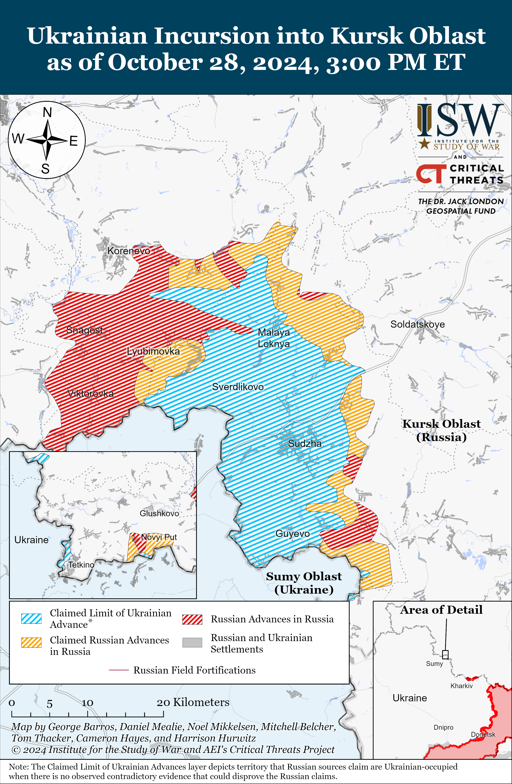
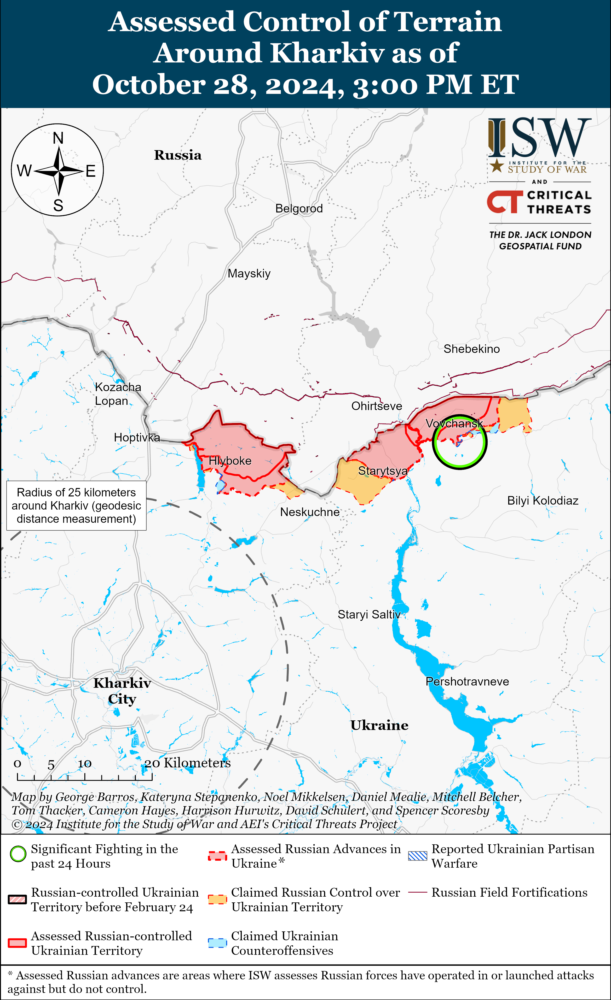
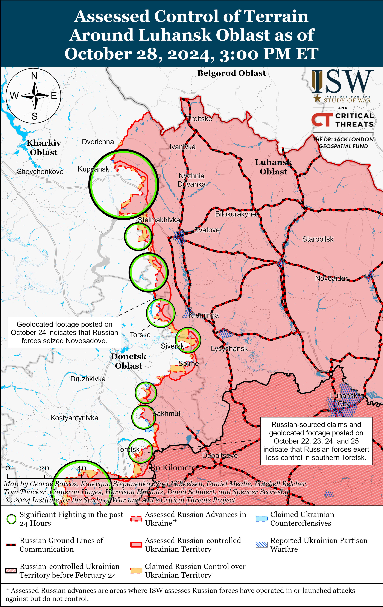
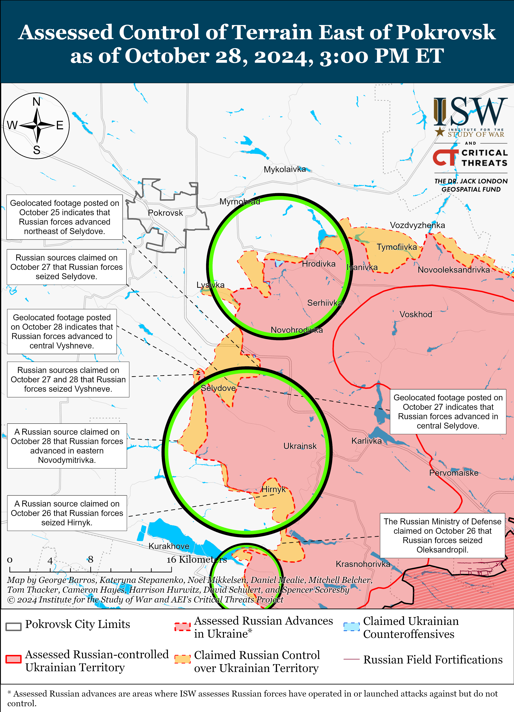
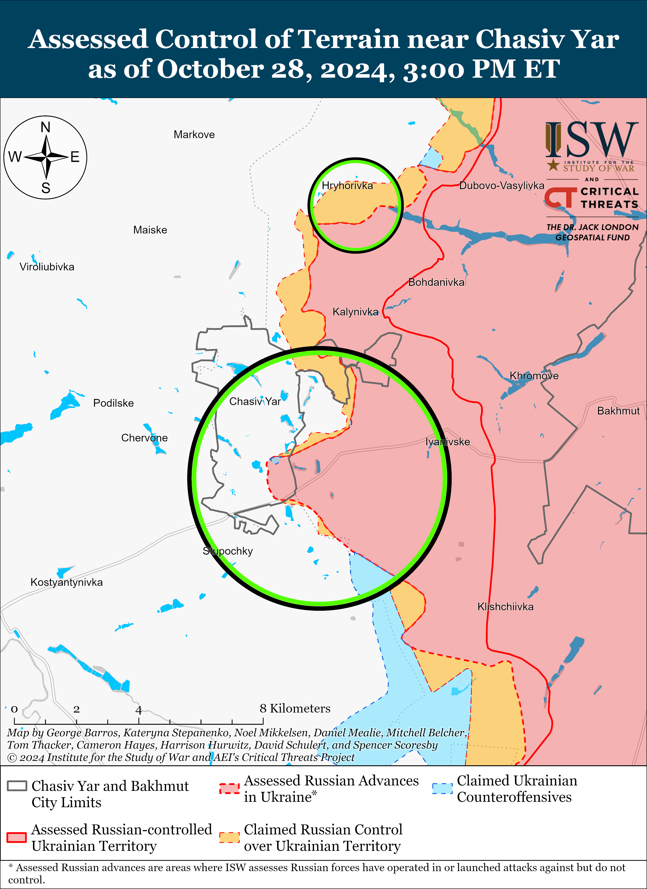
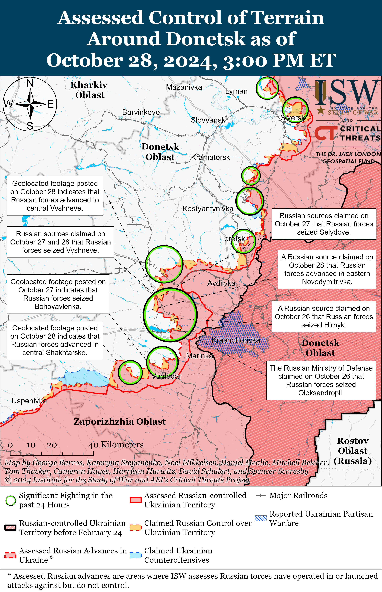
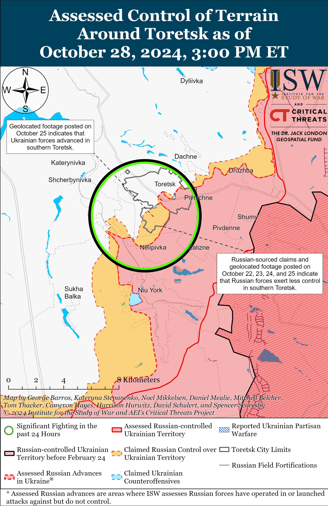
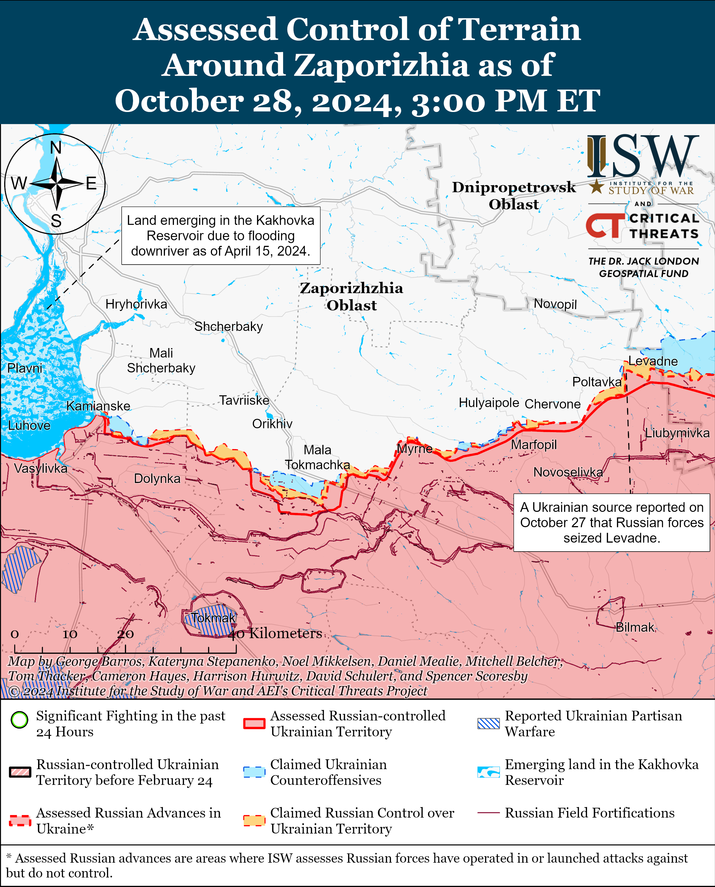
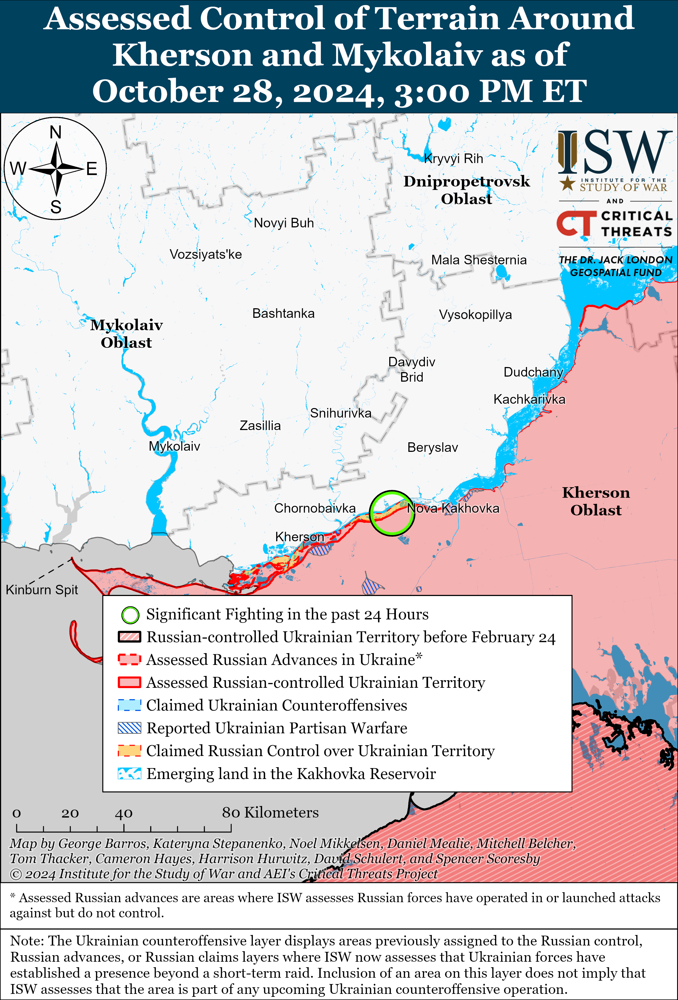
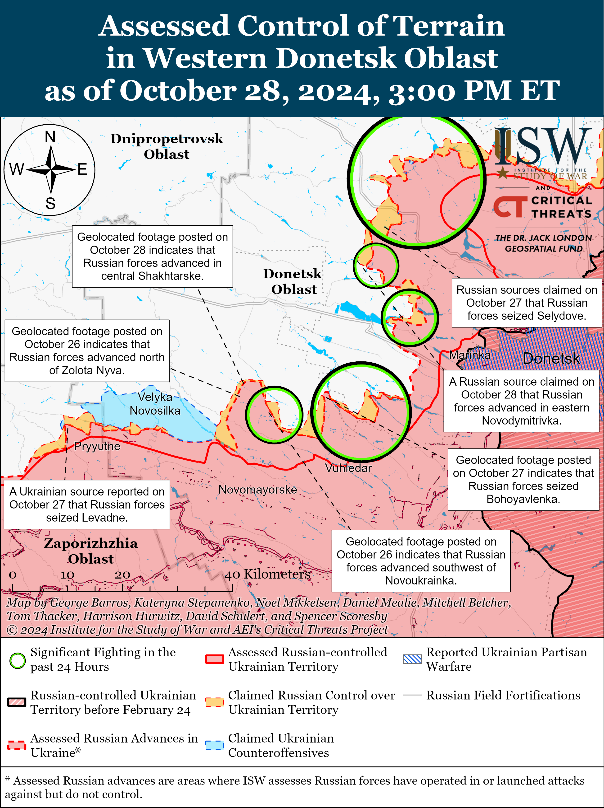

# Russian Offensive Campaign Assessment, October 28, 2024

**4:30pm ET**

**Click** [**here**](https://storymaps.arcgis.com/stories/36a7f6a6f5a9448496de641cf64bd375) **to see ISW’s interactive map of the Russian invasion of Ukraine. This map is updated daily alongside the static maps present in this report.**

**Click** [**here**](https://storymaps.arcgis.com/stories/83a2f24901c941d581c0c523ecd2619b) **to see ISW's interactive map of Ukraine's offensive in Kursk Oblast.**

**Click** [**here**](https://understandingwar.maps.arcgis.com/apps/instant/3dviewer/index.html?appid=1602762dbcde419bb957dea358449580) **to see ISW’s 3D control of terrain topographic map of Ukraine. Use of a computer (not a mobile device) is strongly recommended for using this data-heavy tool.**

**Click** [**here**](https://storymaps.arcgis.com/stories/733fe90805894bfc8562d90b106aa895) **to access ISW’s archive of interactive time-lapse maps of the Russian invasion of Ukraine. These maps complement the static control-of-terrain map that ISW produces daily by showing a dynamic frontline. ISW will update this time-lapse map archive monthly.**

**Note: The data cut-off for this product was 12:00pm ET on October 28. ISW will cover subsequent reports in the October 29 Russian Offensive Campaign Assessment.**

**NATO Secretary General Mark Rutte announced that South Korean intelligence officials shared evidence with NATO officials on October 28 that North Korean units are operating in Kursk Oblast.[[1]](#_edn4dc0aa25144fe1dc94ce306a185b82331)** Rutte stated that senior representatives from South Korea's National Intelligence Service and Ministry of National Defense and other Western allies shared intelligence assessments during a meeting on the morning of October 28 about North Korea's growing involvement in Russia's invasion of Ukraine. Rutte stated that the deployment of North Korean forces represented a significant escalation in North Korea's involvement in Russia's invasion of Ukraine, a breach of United National Security Council (UNSC) resolutions, and a “dangerous expansion” of Russia's invasion of Ukraine. Rutte, on behalf of NATO, called for Russia and North Korea to immediately cease these actions and stated that he will meet with South Korean President Yoon Suk Yeol and Ukrainian Defense Minister Rustem Umerov later on October 28. Ukraine’s Main Military Intelligence Directorate (GUR) reported on October 27 that Russian forces are transferring North Korean military personnel along the E38 Kursk-Voronezh highway in vehicles with civilian license plates.[[2]](#_edn4dc0aa25144fe1dc94ce306a185b82332) Ukraine's Pivnich (Northern) Operational Command Spokesperson Vadym Mysnyk stated on October 28 that Ukrainian forces have not engaged North Korean forces in combat or taken North Korean forces as prisoners of war (POWs), although Ukrainian intelligence has information indicating that North Korean forces have been transferred to Kursk Oblast.[[3]](#_edn4dc0aa25144fe1dc94ce306a185b82333) ISW previously noted that the involvement of North Korean troops in combat operations in Kursk Oblast or frontline areas in Ukraine would make North Korea an active combatant and belligerent in Russia's invasion of Ukraine.[[4]](#_edn4dc0aa25144fe1dc94ce306a185b82334)

**Ukrainian forces conducted another series of drone strikes against Russian distilleries on the night of October 27 to 28, reportedly to reduce Russian aviation capabilities.** Voronezh Oblast Governor Aleksander Gusev claimed that falling drone debris damaged two unspecified industrial enterprises in Anninsky and Novokhopersky raions.[[5]](#_edn4dc0aa25144fe1dc94ce306a185b82335) Geolocated footage shows a fire in Krasnoye, Novokhopersky Raion.[[6]](#_edn4dc0aa25144fe1dc94ce306a185b82336) Russian opposition outlet *Astra* reported that Ukrainian drones struck the Ethanol Spirit distillery in Krasnoye.[[7]](#_edn4dc0aa25144fe1dc94ce306a185b82337) Ukrainian Center for Countering Disinformation Head Andriy Kovalenko posted footage of a drone strike against a distillery in Krasnoye and noted that Russian distilleries produce rocket fuel and fuel for aviation brake systems, technical needs, and anti-icing agents.[[8]](#_edn4dc0aa25144fe1dc94ce306a185b82338) Kovalenko stated that Ukrainian strikes against Russian distilleries are meant to reduce Russian aviation capabilities.[[9]](#_edn4dc0aa25144fe1dc94ce306a185b82339) Ukrainian forces conducted a series of drone strikes on the night of October 21 to 22 targeting distilleries in Tula Oblast.[[10]](#_edn4dc0aa25144fe1dc94ce306a185b823310)

**Russian President Vladimir Putin briefly acknowledged Russia's labor shortages on October 28, but highlighted Russia's low unemployment rates in an attempt to reframe this challenge in a beneficial light and claim that the Russian economy is able to sustain a long war in Ukraine.** Putin held a meeting with the Russian government about the economy on October 28 and highlighted Russian industrial growth and low unemployment rates.[[11]](#_edn4dc0aa25144fe1dc94ce306a185b823311) Putin claimed that Russian industry has grown 4.5 percent in the first eight months of 2024 and that Russia's manufacturing and mechanical engineering sectors grew by 8.15 percent and almost 20 percent, respectively. Putin claimed that Russian unemployment is at a record low for the third month in a row at 2.4 percent and particularly highlighted low unemployment rates among Russians under the age of 25. Putin noted, however, the Russia's economy “slowed somewhat” in the third quarter of 2024 and that the Russian economy is facing “difficulties and imbalances,” such as international sanctions against Russia and Russian personnel, technology, and logistics shortages. Putin claimed that the 2025–2027 federal budget will focus on developing a supply-side economy, increasing the production of goods and services, launching new investment projects, and creating modern jobs in all sectors. The September 2024 draft bill of the 2025–2027 federal budget expected Russia to spend about 41 percent of its annual expenditures on national security and defense in 2025 — somewhat at odds with Putin's claimed desire to focus on goods and services and new investments.[[12]](#_edn4dc0aa25144fe1dc94ce306a185b823312) A Russian insider source claimed on October 28 that several major Russian political figures, including Deputy Prime Minister Marat Khusnullin, CEO of Russian financial development institution DOM.RF Vitaly Mutko, CEO of Russian state defense conglomerate Rostec Sergei Chemezov, and Russian elites Oleg Deripaska and Alexei Mordashov, are expressing their discontent with the Russian Central Bank's announcement to raise the key interest rate to 21 percent.[[13]](#_edn4dc0aa25144fe1dc94ce306a185b823313) ISW recently assessed that Russia's economy and war effort is coming under increasing strain, which will pose increasingly acute challenges to Putin's ability to sustain the war over the long term.[[14]](#_edn4dc0aa25144fe1dc94ce306a185b823314)

**The Moldovan Constitutional Court stated it that it will review the results of the October 20 European Union (EU) referendum on October 31, and the third runner up in the first round of the presidential election announced that he would not endorse a candidate in the runoff**.[[15]](#_edn4dc0aa25144fe1dc94ce306a185b823315) The Moldovan Central Election Commission submitted its reports on the referendum to the court on October 25, and the court has until November 4 to either confirm or reject the results, according to the Moldovan Electoral Code.[[16]](#_edn4dc0aa25144fe1dc94ce306a185b823316) ISW recently assessed that although there have been widespread Moldovan official reports about electoral violations in the October 20 vote, it is unclear if these reports will meet the required threshold for the Constitutional Court to nullify the referendum results.[[17]](#_edn4dc0aa25144fe1dc94ce306a185b823317) Renato Usatii, who came in third in the first round of the Moldovan presidential election with 213,169 votes, stated on October 28 that he would not endorse Maia Sandu or Alexandr Stoianoglo in the November 3 presidential run off.[[18]](#_edn4dc0aa25144fe1dc94ce306a185b823318) Vasile Tarlev, who gained 49,316 votes in the first round; Ion Chicu, who gained 31,797 votes; and Natalia Morari, who gained 9,444 votes all endorsed Stoianoglo. ISW recently assessed that Usatii's possible endorsement of Stoianoglo would likely have allowed Stoianoglo to seriously challenge Sandu in the second round, and it is unclear how Usatii's refusal to endorse either candidate will affect the outcome of the November 3 runoff.[[19]](#_edn4dc0aa25144fe1dc94ce306a185b823319)

**Georgian civil society, opposition, and international election observers continue to reject the results of the 2024 Georgian parliament elections amid a large-scale demonstration in Tbilisi on October 28.** Georgian President Salome Zourabichvili urged Georgian citizens to take to the streets of Tbilisi on October 28 to protest the election results that local Georgian and international election observation bodies have largely condemned for large-scale voting irregularities.[[20]](#_edn4dc0aa25144fe1dc94ce306a185b823320) Zourabichvili, alongside various representatives from pro-Western opposition parties, addressed thousands of peaceful protesters and stated that they will continue to reject the reportedly fraudulent and Russian-influenced election results and urged Georgians to continue to collect evidence of voting irregularities.[[21]](#_edn4dc0aa25144fe1dc94ce306a185b823321) Member of the opposition Unity-National Movement Party Giorgi Vashadze called for an international administration to hold snap elections without the participation of the Georgian Central Election Commission (CEC).[[22]](#_edn4dc0aa25144fe1dc94ce306a185b823322) Zourabichvili and the opposition stated that they will continue to challenge the election results and noted that they will clarify their next steps in the coming days. The Russian information space continued to express jubilation over the Georgian Dream victory while Russian Security Council Deputy Chairperson Dmitry Medvedev called for the arrest of Zourabichvili for “calling for a coup.”[[23]](#_edn4dc0aa25144fe1dc94ce306a185b823323) US State Department Spokesperson Matthew Miller stated on October 28 that the US will not rule out possible consequences to Georgian officials if the Georgian Dream party continued its anti-democratic trajectory, urging the party to conduct full investigations into allegations related to the results.[[24]](#_edn4dc0aa25144fe1dc94ce306a185b823324) Twenty-eight European Union (EU) ministers issued a joint statement on October 28 expressing concern over voting irregularities and stated that the violations of electoral integrity are “incompatible” with EU candidate country standards, highlighting a potential further deterioration in Georgia's EU membership prospects.[[25]](#_edn4dc0aa25144fe1dc94ce306a185b823325)

**Key Takeaways:**

- **NATO Secretary General Mark Rutte announced that South Korean intelligence officials shared evidence with NATO officials on October 28 that North Korean units are operating in Kursk Oblast.**
- **Ukrainian forces conducted another series of drone strikes against Russian distilleries on the night of October 27 to 28, reportedly to reduce Russian aviation capabilities.**
- **Russian President Vladimir Putin briefly acknowledged Russia's labor shortages on October 28, but highlighted Russia's low unemployment rates in an attempt to reframe this challenge in a beneficial light and claim that the Russian economy is able to sustain a long war in Ukraine.**
- **The Moldovan Constitutional Court stated it that it will review the results of the October 20 European Union (EU) referendum on October 31, and the third runner up in the first round of the presidential election announced that he would not endorse a candidate in the runoff**.
- **Georgian civil society, opposition, and international election observers continue to reject the results of the 2024 Georgian parliament elections amid a large-scale demonstration in Tbilisi on October 28.**
- **Russian forces recently marginally advanced near Kupyansk, southeast of Pokrovsk, and southwest of Donetsk City.**

****

***We do not report in detail on Russian war crimes because these activities are well-covered in Western media and do not directly affect the military operations we are assessing and forecasting. We will continue to evaluate and report on the effects of these criminal activities on the Ukrainian military and the Ukrainian population and specifically on combat in Ukrainian urban areas. We utterly condemn Russian violations of the laws of armed conflict and the Geneva Conventions and crimes against humanity even though we do not describe them in these reports.***

- Ukrainian Operations in the Russian Federation
- Russian Main Effort – Eastern Ukraine (comprised of three subordinate main efforts)
- Russian Subordinate Main Effort #1 – Push Ukrainian forces back from the international border with Belgorod Oblast and approach to within tube artillery range of Kharkiv City
- Russian Subordinate Main Effort #2 – Capture the remainder of Luhansk Oblast and push westward into eastern Kharkiv Oblast and encircle northern Donetsk Oblast
- Russian Subordinate Main Effort #3 – Capture the entirety of Donetsk Oblast
- Russian Supporting Effort – Southern Axis
- Russian Air, Missile, and Drone Campaign
- Russian Mobilization and Force Generation Efforts
- Russian Technological Adaptations
- Activities in Russian-occupied areas
- Significant Activity in Belarus

**Ukrainian Operations in the Russian Federation**

Fighting continued in the main Ukrainian salient in Kursk Oblast on October 28, but there were no confirmed changes to the frontline. A Russian source claimed that Russian forces advanced in Novoivanovka, but ISW has not observed confirmation of this claim.[[26]](#_edn4dc0aa25144fe1dc94ce306a185b823326) Russian sources, including the Russian Ministry of Defense (MoD), claimed that Ukrainian forces counterattacked east of Korenevo near Kremyanoye; southeast of Korenevo near Nizhny Klin, Novoivanovka, Alexandriya, Lyubimovka, and Darino; east of Sudzha near Russkaya Konopelka; and southeast of Sudzha near Plekhovo.[[27]](#_edn4dc0aa25144fe1dc94ce306a185b823327) A Kremlin-affiliated milblogger claimed that Russian sources' claims that Ukrainian forces recaptured Darino are unconfirmed.[[28]](#_edn4dc0aa25144fe1dc94ce306a185b823328) Elements of the Russian 137th Airborne (VDV) Regiment (106th VDV Division) are reportedly operating near Zeleny Shlyakh (southeast of Korenevo).[[29]](#_edn4dc0aa25144fe1dc94ce306a185b823329)

Fighting continued west of the main Ukrainian salient in Glushkovsky Raion on October 28, but there were no confirmed changes to the frontline. A Russian milblogger claimed that Ukrainian forces unsuccessfully attacked near Novy Put (south of Glushkovo), and another milblogger claimed that Russian forces have not completely pushed Ukrainian forces out of Novy Put.[[30]](#_edn4dc0aa25144fe1dc94ce306a185b823330) Ukrainian sources reported on October 28 that Ukrainian forces conducted a mechanized assault with at least three armored vehicles east of Novy Put.[[31]](#_edn4dc0aa25144fe1dc94ce306a185b823331)

Bryansk Oblast Governor Alexander Bogomaz claimed on October 27 that elements of the Russian military, Federal Security Service (FSB), and Rosgvardia repelled a “group of people” trying to cross the Russian-Ukrainian border near Manev, Klimovsky Raion, Bryansk Oblast.[[32]](#_edn4dc0aa25144fe1dc94ce306a185b823332) The Russian FSB made a similar claim on October 28, labeling the actors a “sabotage and reconnaissance group.”[[33]](#_edn4dc0aa25144fe1dc94ce306a185b823333)

**Russian Main Effort – Eastern Ukraine**

**Russian Subordinate Main Effort #1 – Kharkiv Oblast** **(Russian objective: Push Ukrainian forces back from the international border with Belgorod Oblast and approach to within tube artillery range of Kharkiv City)**

Russian forces continued limited offensive operations northeast of Kharkiv City near Vovchansk on October 27 and 28 but did not advance.[[34]](#_edn4dc0aa25144fe1dc94ce306a185b823334) Ukrainian military observer Kostyantyn Mashovets reported on October 28 that the Russian grouping in the Kharkiv direction is comprised mainly of forces of the Leningrad Military District's (LMD) 6th Combined Arms Army (CAA) and 11th Army Corps (AC).[[35]](#_edn4dc0aa25144fe1dc94ce306a185b823335) Mashovets noted that many elements of the 6th CAA and 11th AC are split between Russian efforts in northern Kharkiv Oblast and near Kupyansk.[[36]](#_edn4dc0aa25144fe1dc94ce306a185b823336) Mashovets reported that the 11th AC's 18th Motorized Rifle Division is predominantly responsible for operations near Lyptsi (north of Kharkiv City), and that Russia is currently forming the 68th Motorized Rifle Division as part of the 6th CAA to operate in this direction.[[37]](#_edn4dc0aa25144fe1dc94ce306a185b823337) Mashovets assessed that Russian forces in northern Kharkiv Oblast have three main tasks — to capture northern Vovchansk and advance into Tykhe (east of Vovchansk); to regain control of Hlyboke (north of Kharkiv City) and advance towards Lyptsi; and to pin Ukrainian forces in northern Kharkiv Oblast to distract them from efforts in Kursk Oblast and in the Kupyansk direction.[[38]](#_edn4dc0aa25144fe1dc94ce306a185b823338)

**Russian Subordinate Main Effort #2 – Luhansk Oblast** **(Russian objective: Capture the remainder of Luhansk Oblast and push westward into eastern Kharkiv Oblast and northern Donetsk Oblast)**

Russian forces recently marginally advanced southeast of Kupyansk amid ongoing offensive operations along the Kupyansk-Svatove-Kreminna line on October 28. Geolocated footage published on October 27 and 28 indicates that Russian forces recently marginally advanced southeast of Kupyansk within Kolisnykivka and southwest of Kruhlyakivka.[[39]](#_edn4dc0aa25144fe1dc94ce306a185b823339) Russian milbloggers claimed that Russian forces advanced east of Kupyansk near Pishchane and Stepova Novoselivka; south of Kupyansk in Zahryzove; northwest of Stelmakhivka (west of Svatove); from Novosadove in the direction of Terny (both west of Kreminna); and within Torske (west of Kreminna).[[40]](#_edn4dc0aa25144fe1dc94ce306a185b823340) Russian forces continued assaults northwest of Kupyansk near Kindrashivka; northeast of Kupyansk near Synivka, Petropavlivka, and Pershotravneve; southeast of Kupyansk near Kolisnykivka, Kruhlyakivka, and Zahryzove; west of Svatove near Lozova and Vyshneve; southwest of Svatove near Hrekivka, Cherneshchyna, Novomykhailivka, Makiivka; west of Kreminna near Zarichne, Terny, and Torske; and southwest of Kreminna near Serebryanka and Hryhorivka.[[41]](#_edn4dc0aa25144fe1dc94ce306a185b823341) Elements of the Russian 16th Spetsnaz Brigade are reportedly operating near Petropavlivka.[[42]](#_edn4dc0aa25144fe1dc94ce306a185b823342)

**Russian Subordinate Main Effort #3 – Donetsk Oblast** **(Russian objective: Capture the entirety of Donetsk Oblast, the claimed territory of Russia’s proxies in Donbas)**

Neither Russian nor Ukrainian sources reported ground activity in the Siversk direction on OCT 28.

Russian forces continued offensive operations near Chasiv Yar on October 28, but there were no confirmed changes to the frontline. Russian forces attacked near Chasiv Yar; northeast of Chasiv Yar near Orikhovo-Vasylivka; and south of Chasiv Year near Stupochky and Predtechyne on October 27 and 28.[[43]](#_edn4dc0aa25144fe1dc94ce306a185b823343) Elements of the Russian “Sever-V” and “Vostok-V” brigades and drone operators of the “Burevestnik” detachment (all part of the Russian Volunteer Corps) are reportedly operating near Chasiv Yar.[[44]](#_edn4dc0aa25144fe1dc94ce306a185b823344)

Russian forces continued offensive operations near Toretsk on October 28, but there were no confirmed changes to the frontline. A Russian milblogger claimed on October 28 that Russian forces advanced in central Toretsk, but ISW has not observed confirmation of this claim.[[45]](#_edn4dc0aa25144fe1dc94ce306a185b823345) Russian forces attacked near Toretsk; south of Toretsk near Niu-York; and west of Toretsk near Shcherbynivka on October 27 and 28.[[46]](#_edn4dc0aa25144fe1dc94ce306a185b823346) A Russian milblogger claimed on October 28 that Ukrainian forces counterattacked north of Sverdlov Street in Toretsk.[[47]](#_edn4dc0aa25144fe1dc94ce306a185b823347) Elements of the Russian 56th Separate Special Purpose Battalion (51st Guards Combined Arms Army [CAA], formerly the 1st Donetsk People’s Republic Army Crops [DNR AC]) are reportedly operating in the Toretsk direction.[[48]](#_edn4dc0aa25144fe1dc94ce306a185b823348)

Russian forces recently advanced southeast of Pokrovsk amid continued offensive operations in the area on October 28. Geolocated footage published on October 27 and 28 indicates that Russian forces recently advanced north of Selydove, within central Vyshneve, and near Novodmytrivka (all southeast of Pokrovsk).[[49]](#_edn4dc0aa25144fe1dc94ce306a185b823349) The Russian Ministry of Defense (MoD) claimed on October 28 that Russian forces seized Tsukuryne (southeast of Selydove), and Russian Defense Minister Andrei Belousov credited elements of the Russian 114th Motorized Rifle Brigade (51st CAA) with seizing the settlement.[[50]](#_edn4dc0aa25144fe1dc94ce306a185b823350) Russian milbloggers claimed on October 28 that Russian forces advanced northwest of Vyshneve, capturing the settlement; that Russian forces advanced southwest of Vyshneve; and that Russian forces advanced east of Kreminna Balka (south of Selydove), but ISW has not observed confirmation of these claims.[[51]](#_edn4dc0aa25144fe1dc94ce306a185b823351) Russian forces continued assaults east of Pokrovsk near Myrolyubivka, Promin, and Krutyi Yar and southeast of Pokrovsk near Selydove, Novodmytrivka, Kurakhivka, Novoselydivka, Tsukuryne, and Vyshneve on October 27 and 28.[[52]](#_edn4dc0aa25144fe1dc94ce306a185b823352) The commander of a Ukrainian company operating near Selydove stated on October 27 that Russian forces can “afford” to deploy 600 troops per week to infantry assaults in Selydove and that Russian forces appear to have enough reserve forces to constantly conduct assaults in the area.[[53]](#_edn4dc0aa25144fe1dc94ce306a185b823353) The spokesperson for a Ukrainian brigade operating near Selydove stated that Russian forces have transferred personnel from the northern area of the Pokrovsk direction to the Selydove area to support infantry assaults.[[54]](#_edn4dc0aa25144fe1dc94ce306a185b823354) The spokesperson also stated that Russian forces are conducting artillery strikes less frequently and prefer to conduct precise strikes with first-person view (FPV) drones attached to and dropped from a reconnaissance drone. Elements of the Russian 90th Tank Division (41st CAA, Central Military District [CMD]), the 30th Separate Reconnaissance Battalion (90th Guards Tank Division, 41st CAA, CMD), and the Russian 71st Separate Spetsnaz Brigade are reportedly operating in Selydove; and elements of the Russian “Black Hussars” detachment of the Russian 15th Motorized Rifle Brigade (2nd CAA, CMD) and BARS-Sarmat volunteer detachment (Russian Combat Army Reserve) are reportedly operating near Vyshneve.[[55]](#_edn4dc0aa25144fe1dc94ce306a185b823355)

Russian forces continued offensive operations east of Kurakhove near Maksymilyanivka and on the outskirts of Kurakhove itself on October 27 and 28, but there were no confirmed changes in the frontline.[[56]](#_edn4dc0aa25144fe1dc94ce306a185b823356)

Russian forces recently advanced southwest of Donetsk City near Vuhledar amid continued offensive operations in the area. Geolocated footage published on October 25 showing Ukrainian forces repelling a Russian reinforced platoon-sized mechanized assault southwest of Yelyzavetivka (northeast of Vuhledar) indicates that Russian forces recently advanced in the area.[[57]](#_edn4dc0aa25144fe1dc94ce306a185b823357) Additional geolocated footage published on October 28 showing Ukrainian forces repelling a Russian reinforced company-sized mechanized assault southwest of Katerynivka (northeast of Vuhledar) indicates that Russian forces recently advanced in the area.[[58]](#_edn4dc0aa25144fe1dc94ce306a185b823358) Additional geolocated footage published on October 28 indicates that Russian forces advanced northeast of Shakhtarske (northwest of Vuhledar).[[59]](#_edn4dc0aa25144fe1dc94ce306a185b823359) Russian sources claimed that Russian forces advanced near and within Katerynivka; near Bohoyavlenka (northwest of Vuhledar), Novoukrainka (northwest of Vuhledar), and Zolota Nyva (west of Vuhledar); and within Shakhtarske.[[60]](#_edn4dc0aa25144fe1dc94ce306a185b823360) ISW has not observed visual confirmation of these claims, however. Russian forces continued attacks northeast of Vuhledar near Katerynivka and Antonivka; northwest of Vuhledar near Bohoyavlenka, Novoukrainka, Shakhtarske; and west of Vuhledar near Zolota Nyva on October 27 and 28.[[61]](#_edn4dc0aa25144fe1dc94ce306a185b823361) Elements of the Russian 39th Motorized Rifle Brigade and 1472nd Motorized Rifle Regiment (both of the 68th AC, Eastern Military District [EMD]) are reportedly operating near Katerynivka; elements of the 57th Motorized Rifle Brigade (5th CAA, EMD) are reportedly operating near Bohoyavlenka; elements of the 37th Motorized Rifle Brigade (36th CAA, EMD) are reportedly operating near Shakhtarske; and elements of the 60th Motorized Rifle Brigade (5th CAA, EMD) are reportedly operating near Makarivka (west of Vuhledar and south of Velyka Novosilka).[[62]](#_edn4dc0aa25144fe1dc94ce306a185b823362)

Neither Russian nor Ukrainian sources reported fighting in the Donetsk-Zaporizhia Oblast border area on October 28.

   

**Russian Supporting Effort – Southern Axis** **(Russian objective: Maintain frontline positions and secure rear areas against Ukrainian strikes)**

Neither Russian nor Ukrainian sources reported ground attacks in western Zaporizhia Oblast on October 28. Elements of the Russian 42nd Motorized Rifle Division (58th Combined Arms Army [CAA], Southern Military District [SMD]) and the 49th Separate Air Assault Brigade (reportedly subordinated to the 58th CAA, SMD) are reportedly operating in the general Zaporizhia direction and northeast of Robotyne near Mala Tokmachka, respectively. [[63]](#_edn4dc0aa25144fe1dc94ce306a185b823363)

The Ukrainian General Staff reported that Russian forces continued ground attacks in the Dnipro direction, likely referring to east (left) bank Kherson Oblast and the islands of the Dnipro River Delta, on October 27 and 28. [[64]](#_edn4dc0aa25144fe1dc94ce306a185b823364)

  

**Russian Air, Missile, and Drone Campaign** **(Russian Objective: Target Ukrainian military and civilian infrastructure in the rear and on the frontline)**

Russian forces conducted a series of drone strikes against Ukraine on the night of October 27 to 28. The Ukrainian Air Force reported that Russian forces launched 100 Shahed-type and other unidentified strike drones from Kursk and Oryol oblasts and Primorsko-Akhtarsk, Krasnodar Krai.[[65]](#_edn4dc0aa25144fe1dc94ce306a185b823365) The Ukrainian Air Force reported that Ukrainian forces downed 66 drones over Sumy, Kharkiv, Chernihiv, Poltava, Kyiv, Zhytomyr, Rivne, Khmelnytskyi, Ternopil, Mykolaiv, Dnipropetrovsk, Kirovohrad, and Cherkasy oblasts as of 1030 local time. The Ukrainian Air Force reported that 24 Russian drones were “lost in location,” four drones flew into Russian and Belarusian air space, and several drones struck civilian infrastructure in Ukraine. Ukraine's Emergency Services reported that a Russian strike damaged residential infrastructure in Kharkiv City and Chuhuiv, Kharkiv Oblast.[[66]](#_edn4dc0aa25144fe1dc94ce306a185b823366)

**Russian Mobilization and Force Generation Efforts** **(Russian objective: Expand combat power without conducting general mobilization)**

The Russian government continues to manipulate criminal law in order to increase Russia's offensive capabilities. Rosgvardia announced via Russian media on October 28 that it will exempt gun owners whom authorities previously convicted of minor offenses from criminal liability if they donate their weapons for use in Ukraine.[[67]](#_edn4dc0aa25144fe1dc94ce306a185b823367) This “pardon-for-weapons” scheme continues a pattern of Russian authorities suspending criminal liabilities in order to increase military capacity--Russian authorities have recently codified procedures to commute individual criminal sentences in exchange for military service and appear to be extending this practice to generate greater access to small arms.[[68]](#_edn4dc0aa25144fe1dc94ce306a185b823368) Rosgvardia has accepted civilian weapons for use in combat in Ukraine since August 2024.[[69]](#_edn4dc0aa25144fe1dc94ce306a185b823369)

Novosibirsk City Mayor Maxim Kudryavtsev signed a resolution on October 24 granting employees from the Novosibirsk mayoral office a 100,000 ruble ($1,023) one-time payment for signing a contract with the Russian Ministry of Defense (MoD).[[70]](#_edn4dc0aa25144fe1dc94ce306a185b823370) ISW has reported at length on recent Russian efforts to incentivize contract recruitment by increasing one-time signing bonuses and assessed that such efforts appear to be increasing strain on Russia's war time economy.[[71]](#_edn4dc0aa25144fe1dc94ce306a185b823371)

**Russian Technological Adaptations** **(Russian objective: Introduce technological innovations to optimize systems for use in Ukraine)**

Nothing significant to report.

**Activities in Russian-occupied areas** **(Russian objective: Consolidate administrative control of annexed areas; forcibly integrate Ukrainian citizens into Russian sociocultural, economic, military, and governance systems)**

*ISW is not publishing reporting on activities in Russian-occupied areas today.*

**Significant activity in Belarus** **(Russian efforts to increase its military presence in Belarus and further integrate Belarus into Russian-favorable frameworks and Wagner Group activity in Belarus)**

Belarus and Russian federal subjects continue to cooperate, likely as part of sanctions evasion schemes. Belarusian President Alexander Lukashenko met with Sakhalin Oblast Governor Valery Limarenko on October 28 and called for increased cooperation in the sphere of import substitution.[[72]](#_edn4dc0aa25144fe1dc94ce306a185b823372)

The People's Republic of China (PRC) is likely learning lessons from the Russian military through Belarusian forces. Belarusian Special Operations Forces Commander Major General Vadim Denisenko stated on October 27 that representatives from the PRC, Uzbekistan, and Kazakhstan have participated in military exercises in Belarus in the past three to four months.[[73]](#_edn4dc0aa25144fe1dc94ce306a185b823373) Denisenko claimed that the PRC is interested in lessons Belarussian forces have learned related to the war in Ukraine, such as how to use drones, clear trenches, and storm buildings.

**Note: ISW does not receive any classified material from any source, uses only publicly available information, and draws extensively on Russian, Ukrainian, and Western reporting and social media as well as commercially available satellite imagery and other geospatial data as the basis for these reports. References to all sources used are provided in the endnotes of each update.**

---

[[1]](#_edn4dc0aa25144fe1dc94ce306a185b8233ref1) https://www.nato.int/cps/en/natohq/opinions\_230105.htm

[[2]](#_edn4dc0aa25144fe1dc94ce306a185b8233ref2) <https://t.me/DIUkraine/4740> ; https://suspilne dot media/867063-rosiani-perevozat-na-front-soldat-kndr-u-vantazivkah-z-civilnimi-nomerami-gur/; [https://gur](https://gur/) dot gov.ua/content/naimantsiv-z-kndr-rosiiany-vezut-na-front-vantazhivkamy-z-tsyvilnymy-nomeramy.html

[[3]](#_edn4dc0aa25144fe1dc94ce306a185b8233ref3) [https://armyinform.com](https://armyinform.com/) dot ua/2024/10/28/pivnichnyh-korejcziv-bachysh-chy-ye-vijskovi-z-kndr-na-kurshhyni/

[[4]](#_edn4dc0aa25144fe1dc94ce306a185b8233ref4) <https://isw.pub/UkrWar102524>

[[5]](#_edn4dc0aa25144fe1dc94ce306a185b8233ref5) <https://t.me/gusev_36/2930>; "<https://t.me/gusev_36/2931>; https://t.me/gusev\_36/2931; https://t.me/gusev\_36/2934

[[6]](#_edn4dc0aa25144fe1dc94ce306a185b8233ref6) <https://t.me/exilenova_plus/2985> ; <https://t.me/kiber_boroshno/10447>; <https://t.me/DniproOfficial/5089>

[[7]](#_edn4dc0aa25144fe1dc94ce306a185b8233ref7) <https://t.me/astrapress/67281>; https://t.me/astrapress/67276

[[8]](#_edn4dc0aa25144fe1dc94ce306a185b8233ref8) <https://t.me/akovalenko1989/8184>; https://t.me/akovalenko1989/8188

[[9]](#_edn4dc0aa25144fe1dc94ce306a185b8233ref9) https://t.me/akovalenko1989/8188

[[10]](#_edn4dc0aa25144fe1dc94ce306a185b8233ref10) https://www.understandingwar.org/backgrounder/russian-offensive-campaign-assessment-october-22-2024

[[11]](#_edn4dc0aa25144fe1dc94ce306a185b8233ref11) [http://kremlin](http://kremlin/) dot ru/events/president/news/75423

[[12]](#_edn4dc0aa25144fe1dc94ce306a185b8233ref12) https://isw.pub/UkrWar093024

[[13]](#_edn4dc0aa25144fe1dc94ce306a185b8233ref13) https://t.me/kremlin\_sekret/16395

[[14]](#_edn4dc0aa25144fe1dc94ce306a185b8233ref14) https://isw.pub/UkrWar102724

[[15]](#_edn4dc0aa25144fe1dc94ce306a185b8233ref15) <https://radiomoldova> dot md/p/42086/constitutional-court-to-validate-referendum-results-on-oct-31; https://x.com/ipn\_moldova/status/1850877508767432726

[[16]](#_edn4dc0aa25144fe1dc94ce306a185b8233ref16) https://www.understandingwar.org/backgrounder/possible-russian-gains-georgia-and-moldova

[[17]](#_edn4dc0aa25144fe1dc94ce306a185b8233ref17) https://www.understandingwar.org/backgrounder/possible-russian-gains-georgia-and-moldova

[[18]](#_edn4dc0aa25144fe1dc94ce306a185b8233ref18) <https://moldova> dot europalibera.org/a/usatii-nu-va-sprijini-niciun-candidat-in-turul-doi/33176207.html

[[19]](#_edn4dc0aa25144fe1dc94ce306a185b8233ref19) https://www.understandingwar.org/backgrounder/possible-russian-gains-georgia-and-moldova

[[20]](#_edn4dc0aa25144fe1dc94ce306a185b8233ref20) https://www.csce.gov/press-releases/chairman-wilson-calls-on-state-department-to-investigate-allegations-of-fraud-in-georgian-elections/; https://x.com/CharlesMichel/status/1850575679248593036?ref\_src=twsrc%5Etfw%7Ctwcamp%5Etweetembed%7Ctwterm%5E1850575679248593036%7Ctwgr%5E2c38facaeb0cffa480d06403c86f08939740edd8%7Ctwcon%5Es1\_c10&ref\_url=https%3A%2F%2Fcivil.ge%2Farchives%2F627971; https://civil dot ge/archives/631413; <https://www.ndi.org/publications/ndi-presents-preliminary-statement-georgian-elections-and-finds-pre-election-period>; https://www.cnn.com/2024/10/27/europe/georgia-election-russia-protests-intl-latam/index.html

[[21]](#_edn4dc0aa25144fe1dc94ce306a185b8233ref21) <https://www.pravda.com> dot ua/eng/news/2024/10/28/7481810/; <https://oc-media> dot org/live-updates-georgian-president-announces-protest-against-election-results/

[[22]](#_edn4dc0aa25144fe1dc94ce306a185b8233ref22) <https://news> dot am/eng/news/849613.html

[[23]](#_edn4dc0aa25144fe1dc94ce306a185b8233ref23) <https://x.com/MedvedevRussiaE/status/1850955959192936888>; <https://t.me/tass_agency/282080>; <https://t.me/boris_rozhin/142364>;

[[24]](#_edn4dc0aa25144fe1dc94ce306a185b8233ref24) <https://www.state.>gov/briefings/department-press-briefing-june-06-2024/#post-563929-GEORGIA

[[25]](#_edn4dc0aa25144fe1dc94ce306a185b8233ref25) <https://www.auswaertiges-amt> dot de/en/newsroom/news/elections-georgia/2681910

[[26]](#_edn4dc0aa25144fe1dc94ce306a185b8233ref26) https://t.me/rybar/64849

[[27]](#_edn4dc0aa25144fe1dc94ce306a185b8233ref27) <https://t.me/mod_russia/45036>; <https://t.me/rybar/64849>; https://t.me/dva\_majors/56110

[[28]](#_edn4dc0aa25144fe1dc94ce306a185b8233ref28) https://t.me/rybar/64849

[[29]](#_edn4dc0aa25144fe1dc94ce306a185b8233ref29) https://t.me/RVvoenkor/79587

[[30]](#_edn4dc0aa25144fe1dc94ce306a185b8233ref30) <https://t.me/rybar/64849>; https://t.me/rusich\_army/18006

[[31]](#_edn4dc0aa25144fe1dc94ce306a185b8233ref31) <https://t.me/brygada47/1037>; <https://mil.in> dot ua/uk/news/47-brygada-zahopyla-pozytsiyi-rosiyan-u-kurskij-oblasti/

[[32]](#_edn4dc0aa25144fe1dc94ce306a185b8233ref32) <https://t.me/avbogomaz/8842>;

[[33]](#_edn4dc0aa25144fe1dc94ce306a185b8233ref33) <https://tass> dot ru/proisshestviya/22252409

[[34]](#_edn4dc0aa25144fe1dc94ce306a185b8233ref34) <https://www.facebook.com/GeneralStaff.ua/posts/pfbid034NHBahwcubzUjnLusWtxFHReFgG66PuBLdJ8duXH6k3MgLWPy8MSrxhdPtTPgvSjl;> <https://www.facebook.com/GeneralStaff.ua/posts/pfbid0TC8JstdyU21C3erK1ChdLoQqLir7Z89xoKH3Wk3KTmNEo6fH9BLiiPAD9QBKzs2Rl>; <https://www.facebook.com/GeneralStaff.ua/posts/pfbid02WTc4aJCnkrMc6CUsL8dnU8BxWVhSwwwoReYr8o4ui2X8zBKHPeTr7gefvQxk9BJXl>

[[35]](#_edn4dc0aa25144fe1dc94ce306a185b8233ref35) https://t.me/zvizdecmanhustu/2302

[[36]](#_edn4dc0aa25144fe1dc94ce306a185b8233ref36) https://t.me/zvizdecmanhustu/2302

[[37]](#_edn4dc0aa25144fe1dc94ce306a185b8233ref37) https://t.me/zvizdecmanhustu/2303

[[38]](#_edn4dc0aa25144fe1dc94ce306a185b8233ref38) https://t.me/zvizdecmanhustu/2304

[[39]](#_edn4dc0aa25144fe1dc94ce306a185b8233ref39) https://t.me/oaembr77/643; <https://t.me/creamy_caprice/7285> ; https://t.me/feniksdpsu/309; <https://t.me/creamy_caprice/7283>

[[40]](#_edn4dc0aa25144fe1dc94ce306a185b8233ref40) <https://t.me/dva_majors/56110> ; <https://t.me/rybar/64857> ; <https://t.me/z_arhiv/28945> ; <https://t.me/z_arhiv/28951;> https://t.me/z\_arhiv/28945

[[41]](#_edn4dc0aa25144fe1dc94ce306a185b8233ref41) <https://t.me/boris_rozhin/142389> ; <https://t.me/motopatriot/28937> ; <https://www.facebook.com/GeneralStaff.ua/posts/pfbid034NHBahwcubzUjnLusWtxFHReFgG66PuBLdJ8duXH6k3MgLWPy8MSrxhdPtTPgvSjl> ; [https://www.facebook.com/GeneralStaff.ua/posts/pfbid0TC8JstdyU21C3erK1ChdLoQqLir7Z89xoKH3Wk3KTmNEo6fH9BLiiPAD9QBKzs2Rl ;](https://www.facebook.com/GeneralStaff.ua/posts/pfbid0TC8JstdyU21C3erK1ChdLoQqLir7Z89xoKH3Wk3KTmNEo6fH9BLiiPAD9QBKzs2Rl%20;) <https://www.facebook.com/GeneralStaff.ua/posts/pfbid02WTc4aJCnkrMc6CUsL8dnU8BxWVhSwwwoReYr8o4ui2X8zBKHPeTr7gefvQxk9BJXl>

[[42]](#_edn4dc0aa25144fe1dc94ce306a185b8233ref42) <https://t.me/boris_rozhin/142389>

[[43]](#_edn4dc0aa25144fe1dc94ce306a185b8233ref43) <https://www.facebook.com/GeneralStaff.ua/posts/pfbid034NHBahwcubzUjnLusWtxFHReFgG66PuBLdJ8duXH6k3MgLWPy8MSrxhdPtTPgvSjl>; <https://www.facebook.com/GeneralStaff.ua/posts/pfbid0TC8JstdyU21C3erK1ChdLoQqLir7Z89xoKH3Wk3KTmNEo6fH9BLiiPAD9QBKzs2Rl>; https://www.facebook.com/GeneralStaff.ua/posts/pfbid02WTc4aJCnkrMc6CUsL8dnU8BxWVhSwwwoReYr8o4ui2X8zBKHPeTr7gefvQxk9BJXl

[[44]](#_edn4dc0aa25144fe1dc94ce306a185b8233ref44) <https://t.me/tass_agency/282120>; <https://t.me/wargonzo/22847>; <https://t.me/wargonzo/22846>; https://t.me/RVvoenkor/79573

[[45]](#_edn4dc0aa25144fe1dc94ce306a185b8233ref45) https://t.me/rybar/64861

[[46]](#_edn4dc0aa25144fe1dc94ce306a185b8233ref46) <https://www.facebook.com/GeneralStaff.ua/posts/pfbid034NHBahwcubzUjnLusWtxFHReFgG66PuBLdJ8duXH6k3MgLWPy8MSrxhdPtTPgvSjl>; <https://www.facebook.com/GeneralStaff.ua/posts/pfbid0TC8JstdyU21C3erK1ChdLoQqLir7Z89xoKH3Wk3KTmNEo6fH9BLiiPAD9QBKzs2Rl>; https://www.facebook.com/GeneralStaff.ua/posts/pfbid02WTc4aJCnkrMc6CUsL8dnU8BxWVhSwwwoReYr8o4ui2X8zBKHPeTr7gefvQxk9BJXl

[[47]](#_edn4dc0aa25144fe1dc94ce306a185b8233ref47) https://t.me/rybar/64861

[[48]](#_edn4dc0aa25144fe1dc94ce306a185b8233ref48) https://t.me/nm\_dnr/12895

[[49]](#_edn4dc0aa25144fe1dc94ce306a185b8233ref49) <https://t.me/creamy_caprice/7282>; <https://t.me/opbr_zsu/385>; https://t.me/rusich\_army/17995 ; https://x.com/moklasen/status/1850961765301129433; https://t.me/shershni68/322

[[50]](#_edn4dc0aa25144fe1dc94ce306a185b8233ref50) <https://t.me/mod_russia/45030>; <https://t.me/tass_agency/282176;> https://t.me/mod\_russia/45032

[[51]](#_edn4dc0aa25144fe1dc94ce306a185b8233ref51) https://t.me/motopatriot/28903 ; https://t.me/rusich\_army/17995; https://t.me/RVvoenkor/79581; https://t.me/z\_arhiv/28939; https://t.me/dva\_majors/56110; <https://t.me/wargonzo/22836>; https://t.me/Sladkov\_plus/11684

[[52]](#_edn4dc0aa25144fe1dc94ce306a185b8233ref52) <https://www.facebook.com/GeneralStaff.ua/posts/pfbid034NHBahwcubzUjnLusWtxFHReFgG66PuBLdJ8duXH6k3MgLWPy8MSrxhdPtTPgvSjl>; <https://www.facebook.com/GeneralStaff.ua/posts/pfbid0TC8JstdyU21C3erK1ChdLoQqLir7Z89xoKH3Wk3KTmNEo6fH9BLiiPAD9QBKzs2Rl>; <https://www.facebook.com/GeneralStaff.ua/posts/pfbid02WTc4aJCnkrMc6CUsL8dnU8BxWVhSwwwoReYr8o4ui2X8zBKHPeTr7gefvQxk9BJXl> ; <https://t.me/motopatriot/28903> ; <https://t.me/DnevnikDesantnika/18140>

[[53]](#_edn4dc0aa25144fe1dc94ce306a185b8233ref53) <https://armyinform.com> dot ua/2024/10/27/idut-po-trupah-na-shodi-rosiyany-poklaly-za-tyzhden-600-vlasnyh-soldativ-za-selo-z-odniyeyi-vulyczi/ ; https://youtu.be/aDXWlQ2K0dM

[[54]](#_edn4dc0aa25144fe1dc94ce306a185b8233ref54) <https://armyinform.com> dot ua/2024/10/27/drony-matky-pid-selydovym-vorog-prorvavsya-do-mista-zavdyaky-znachnij-perevazi-v-zhyvij-syli/

[[55]](#_edn4dc0aa25144fe1dc94ce306a185b8233ref55) <https://t.me/RVvoenkor/79570>; <https://t.me/RVvoenkor/79550>; <https://t.me/motopatriot/28905>; https://t.me/rybar/64842

[[56]](#_edn4dc0aa25144fe1dc94ce306a185b8233ref56) https://www.facebook.com/GeneralStaff.ua/posts/pfbid034NHBahwcubzUjnLusWtxFHReFgG66PuBLdJ8duXH6k3MgLWPy8MSrxhdPtTPgvSjl ; <https://www.facebook.com/GeneralStaff.ua/posts/pfbid0TC8JstdyU21C3erK1ChdLoQqLir7Z89xoKH3Wk3KTmNEo6fH9BLiiPAD9QBKzs2Rl> ; <https://www.facebook.com/GeneralStaff.ua/posts/pfbid02WTc4aJCnkrMc6CUsL8dnU8BxWVhSwwwoReYr8o4ui2X8zBKHPeTr7gefvQxk9BJXl> ; https://t.me/warhistoryalconafter/191665 ; https://t.me/dva\_majors/56095

[[57]](#_edn4dc0aa25144fe1dc94ce306a185b8233ref57) https://t.me/creamy\_caprice/7284; https://t.me/osirskiy/906

[[58]](#_edn4dc0aa25144fe1dc94ce306a185b8233ref58) https://t.me/odshbr79/410; https://t.me/creamy\_caprice/7295

[[59]](#_edn4dc0aa25144fe1dc94ce306a185b8233ref59) https://t.me/creamy\_caprice/7296; https://t.me/morpex\_V/3310; https://x.com/moklasen/status/1850663572872802799

[[60]](#_edn4dc0aa25144fe1dc94ce306a185b8233ref60) https://t.me/rybar/64843; <https://t.me/z_arhiv/28925> ; <https://t.me/motopatriot/28933> ; <https://t.me/z_arhiv/28951> ; <https://t.me/dva_majors/56110> ; <https://t.me/motopatriot/28887>

[[61]](#_edn4dc0aa25144fe1dc94ce306a185b8233ref61) <https://www.facebook.com/GeneralStaff.ua/posts/pfbid02WTc4aJCnkrMc6CUsL8dnU8BxWVhSwwwoReYr8o4ui2X8zBKHPeTr7gefvQxk9BJXl> ; <https://www.facebook.com/GeneralStaff.ua/posts/pfbid034NHBahwcubzUjnLusWtxFHReFgG66PuBLdJ8duXH6k3MgLWPy8MSrxhdPtTPgvSjl> ; <https://www.facebook.com/GeneralStaff.ua/posts/pfbid0TC8JstdyU21C3erK1ChdLoQqLir7Z89xoKH3Wk3KTmNEo6fH9BLiiPAD9QBKzs2Rl> ; <https://t.me/z_arhiv/28925> ; https://t.me/rybar/64843 ; <https://t.me/dva_majors/56110>

[[62]](#_edn4dc0aa25144fe1dc94ce306a185b8233ref62) https://t.me/rybar/64843 ; <https://t.me/boris_rozhin/142430> ; <https://t.me/voin_dv/11523>

[[63]](#_edn4dc0aa25144fe1dc94ce306a185b8233ref63) <https://t.me/boris_rozhin/142390> ; <https://t.me/vrogov/17798>

[[64]](#_edn4dc0aa25144fe1dc94ce306a185b8233ref64) <https://www.facebook.com/GeneralStaff.ua/posts/pfbid02WTc4aJCnkrMc6CUsL8dnU8BxWVhSwwwoReYr8o4ui2X8zBKHPeTr7gefvQxk9BJXl> ; <https://www.facebook.com/GeneralStaff.ua/posts/pfbid0TC8JstdyU21C3erK1ChdLoQqLir7Z89xoKH3Wk3KTmNEo6fH9BLiiPAD9QBKzs2Rl> ; <https://www.facebook.com/GeneralStaff.ua/posts/pfbid034NHBahwcubzUjnLusWtxFHReFgG66PuBLdJ8duXH6k3MgLWPy8MSrxhdPtTPgvSjl>

[[65]](#_edn4dc0aa25144fe1dc94ce306a185b8233ref65) https://t.me/kpszsu/22029

[[66]](#_edn4dc0aa25144fe1dc94ce306a185b8233ref66) <https://t.me/dsns_telegram/34189>

[[67]](#_edn4dc0aa25144fe1dc94ce306a185b8233ref67) <https://t.me/tass_agency/282170>; [https://www.interfax](https://www.interfax/) dot ru/russia/988970; [https://meduza](https://meduza/) dot io/news/2024/10/28/rosgvardiya-poobeschala-osvobozhdat-ot-otvetstvennosti-za-melkie-narusheniya-vladeltsev-oruzhiya-esli-oni-sdadut-ego-na-nuzhdy-svo; [https://meduza](https://meduza/) dot io/news/2024/10/28/rosgvardiya-poobeschala-osvobozhdat-ot-otvetstvennosti-za-melkie-narusheniya-vladeltsev-oruzhiya-esli-oni-sdadut-ego-na-nuzhdy-svo

[[68]](#_edn4dc0aa25144fe1dc94ce306a185b8233ref68) <https://www.understandingwar.org/backgrounder/russian-offensive-campaign-assessment-june-25-2024>

; <https://www.understandingwar.org/backgrounder/russian-offensive-campaign-assessment-march-23-2024> ; <https://www.understandingwar.org/backgrounder/russian-offensive-campaign-assessment-april-28-2024>

[[69]](#_edn4dc0aa25144fe1dc94ce306a185b8233ref69) [https://meduza](https://meduza/) dot io/news/2024/10/28/rosgvardiya-poobeschala-osvobozhdat-ot-otvetstvennosti-za-melkie-narusheniya-vladeltsev-oruzhiya-esli-oni-sdadut-ego-na-nuzhdy-svo

[[70]](#_edn4dc0aa25144fe1dc94ce306a185b8233ref70) <https://t.me/mobilizationnews/20719>

[[71]](#_edn4dc0aa25144fe1dc94ce306a185b8233ref71) [https://isw.pub/UkrWar100524 ;](https://isw.pub/UkrWar100524%20;) <https://isw.pub/UkrWar102724>

[[72]](#_edn4dc0aa25144fe1dc94ce306a185b8233ref72) <https://mlyn> dot by/28102024/kak-uvelichit-vklad-dalnevostochnyh-regionov-vo-vneshnyuyu-torgovlyu-belarusi-i-rossii-mnenie-lukashenko/; https://t.me/pul\_1/14110

[[73]](#_edn4dc0aa25144fe1dc94ce306a185b8233ref73) <https://belta> dot by/society/view/s-kakimi-stranami-vooruzhennye-sily-belarusi-proveli-uchenija-rasskazal-komandujuschij-sso-671320-2024/

View Citations
