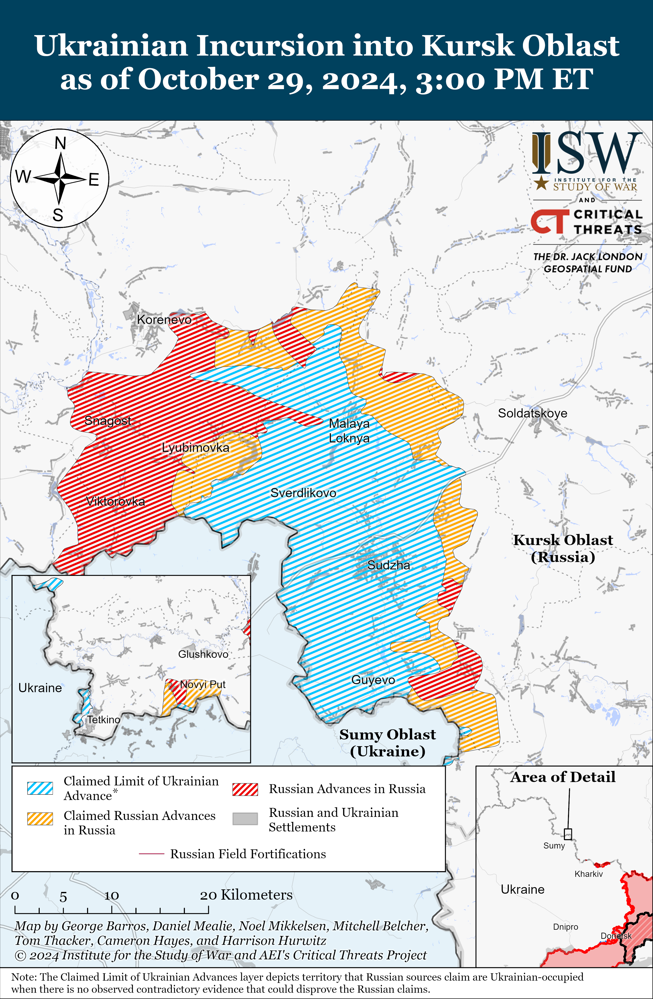
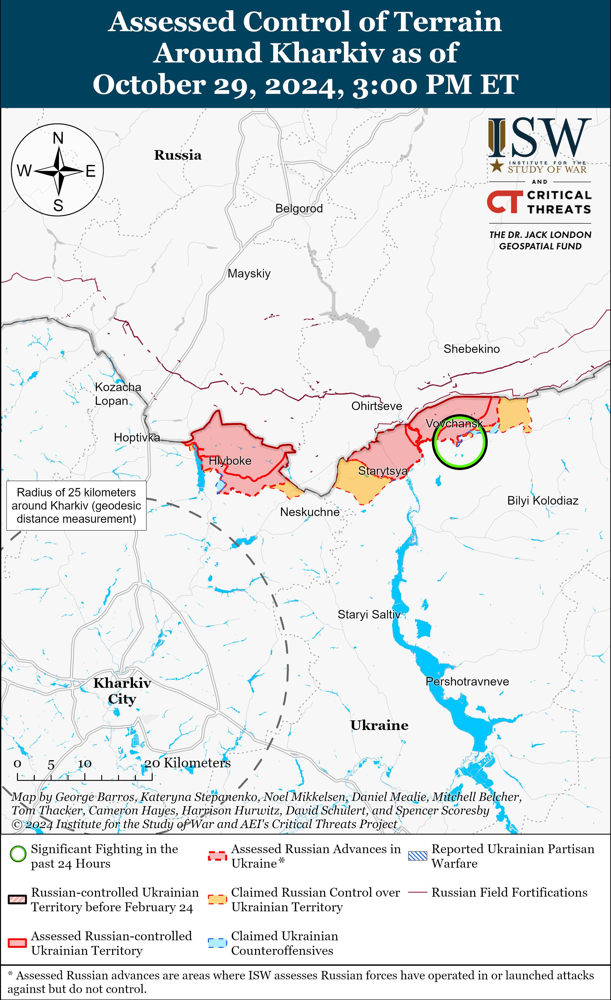
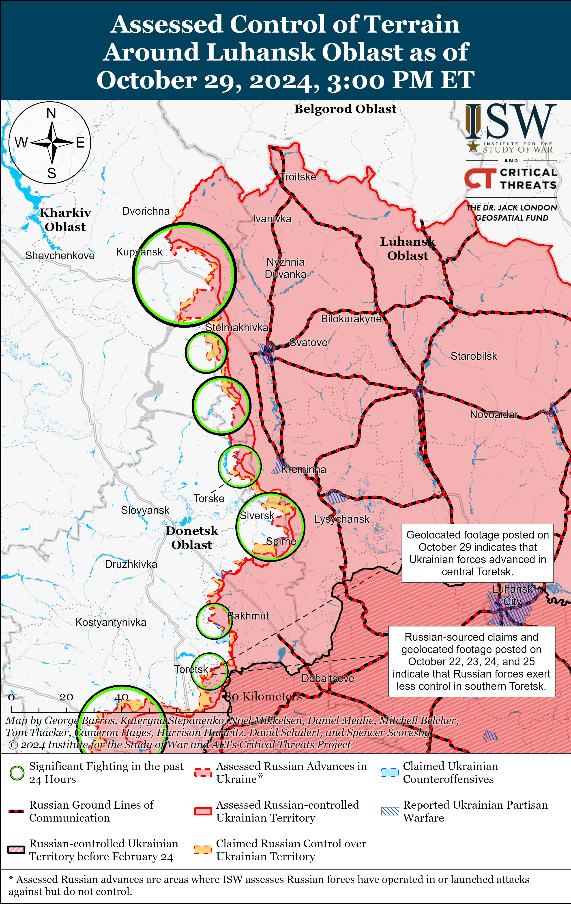
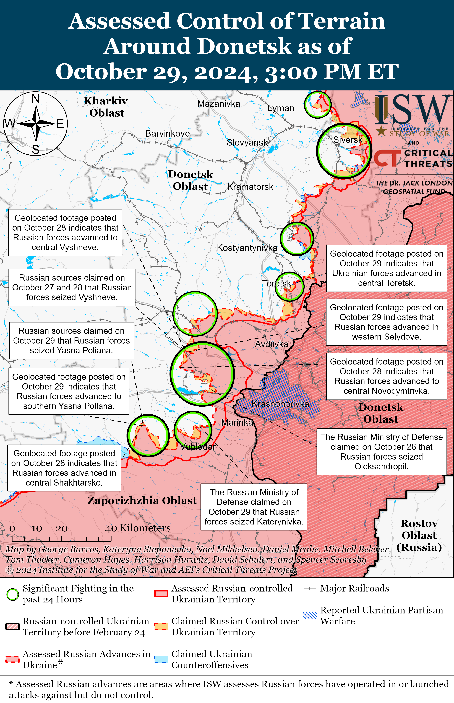
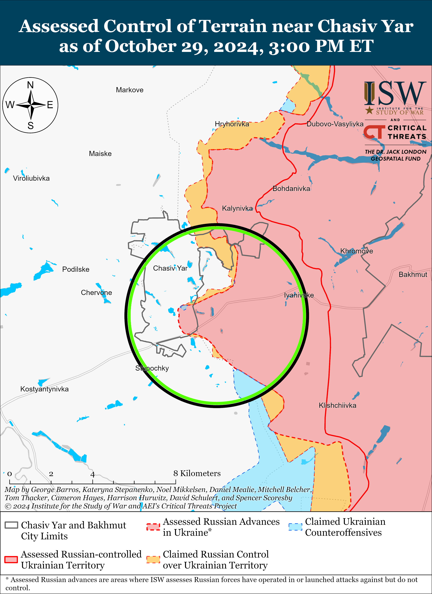
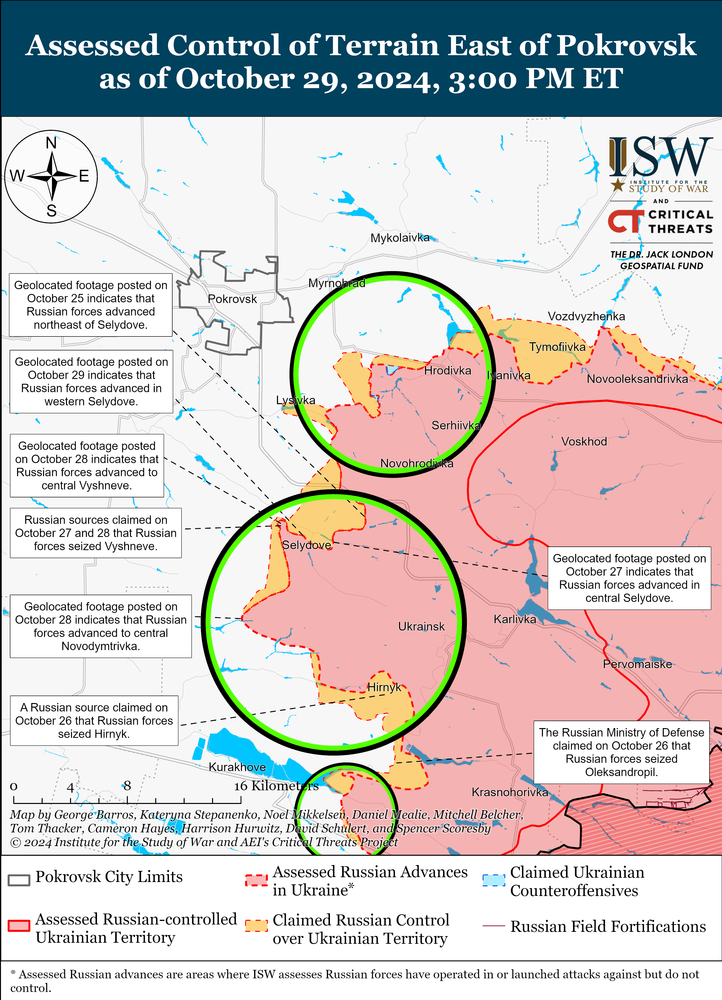
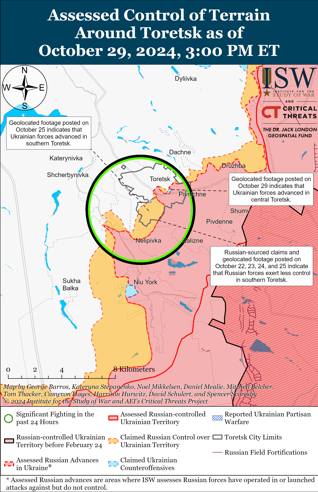
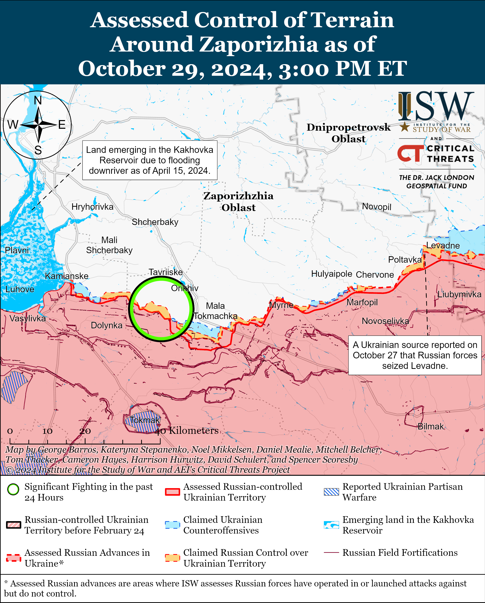
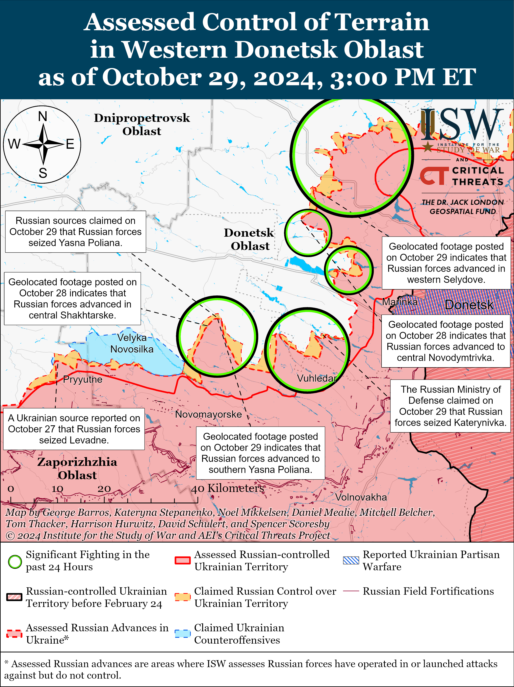
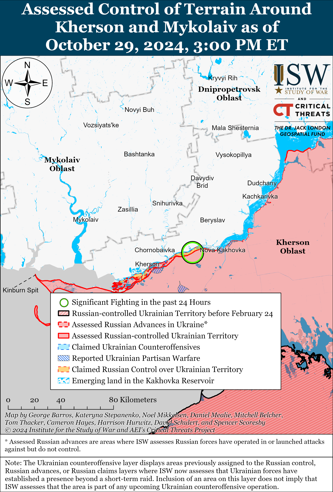

# Russian Offensive Campaign Assessment, October 29, 2024

**October 29, 2024, 6:10 pm ET**

**Click** [**here**](https://storymaps.arcgis.com/stories/36a7f6a6f5a9448496de641cf64bd375) **to see ISW’s interactive map of the Russian invasion of Ukraine. This map is updated daily alongside the static maps present in this report.**

**Click** [**here**](https://storymaps.arcgis.com/stories/83a2f24901c941d581c0c523ecd2619b) **to see ISW's interactive map of Ukraine's offensive in Kursk Oblast.**

**Click** [**here**](https://understandingwar.maps.arcgis.com/apps/instant/3dviewer/index.html?appid=1602762dbcde419bb957dea358449580) **to see ISW’s 3D control of terrain topographic map of Ukraine. Use of a computer (not a mobile device) is strongly recommended for using this data-heavy tool.**

**Click** [**here**](https://storymaps.arcgis.com/stories/733fe90805894bfc8562d90b106aa895) **to access ISW’s archive of interactive time-lapse maps of the Russian invasion of Ukraine. These maps complement the static control-of-terrain map that ISW produces daily by showing a dynamic frontline. ISW will update this time-lapse map archive monthly.**

**Note: The data cut-off for this product was 11:45am ET on October 29. ISW will cover subsequent reports in the October 30 Russian Offensive Campaign Assessment.**

**The rate of Russian advances in Ukraine has increased in recent weeks but remains slow and consistent with positional warfare rather than with rapid mechanized maneuver—emphasizing how generally stagnant Russian advances have been after over two and half years of war.** Recent Western reporting linking the Russian rate of advance in September 2024 with Russian advances at the start of the war is highly misleading.[[1]](#_edn96a33b6cd8f02310147b5a05768221491) ISW assesses that Russian forces advanced at an average rate of 1,265 square kilometers per day in March 2022—roughly 90 times the roughly 14 square kilometers that ISW calculates that Russian forces have taken per day in September 2024. Rapid Russian advances deep into Ukrainian territory, including the temporary seizure of large portions of Kyiv, Chernihiv, Sumy, and Kharkiv oblasts characterized the first month of the Russian full-scale invasion, whereas more recent Russian advances have been characterized by small-scale, localized, tactical advances.[[2]](#_edn96a33b6cd8f02310147b5a05768221492) Russian forces have been making gains in eastern Ukraine recently, but comparing those gains to the initial deep Russian penetration into Ukraine at the start of the war misleadingly frames these most recent advances. For example, Russian forces seized the settlement of Vuhledar as of October 1, 2024, have continued to advance north and northwest of Vuhledar, and have made significant tactical gains in and near Selydove (southeast of Pokrovsk) over the course of the past week.[[3]](#_edn96a33b6cd8f02310147b5a05768221493) These respective advances are tactically significant but do not represent a general increase in the pace of Russian advances across the frontline, much of which remains relatively stagnant, nor are they within two orders of magnitude of the rate of Russian advance in the first stage of the war.[[4]](#_edn96a33b6cd8f02310147b5a05768221494) The current rate of Russian advances is consistent, rather, with ISW's recent assessment that the Russian command has likely ordered Russian forces to significantly increase their tempo of mechanized attacks throughout the theater before the full onset of muddy ground conditions in the fall months.[[5]](#_edn96a33b6cd8f02310147b5a05768221495)

**Russian President Vladimir Putin attempted to use an annual Russian nuclear deterrence exercise to further boilerplate nuclear saber-rattling information operations that aim to influence Western decision making.** Putin participated via video conference in a Russian military training exercise on October 29 in which the strategic deterrence forces launched ground-launched Yars intercontinental ballistic missiles, submarine-launched Sineva and Bulava ballistic missiles, and air-launched cruise missiles.[[6]](#_edn96a33b6cd8f02310147b5a05768221496) Putin claimed that Russia's nuclear triad continues to guarantee Russian sovereignty and security and helps maintain the global balance of power. Putin also highlighted Russia's need to possess modern strategic deterrent forces given "growing geopolitical tensions" and the "emergence of new threats."[[7]](#_edn96a33b6cd8f02310147b5a05768221497) Putin also claimed that the Strategic Missile Forces are receiving new, unspecified fixed and mobile missile systems that allegedly have improved accuracy, reduced launch time, and increased capabilities. Russia previously conducted similar nuclear deterrence exercises using the same missile systems in October 2022 and 2023.[[8]](#_edn96a33b6cd8f02310147b5a05768221498) ISW continues to assess that Putin and other senior Russian officials attempt to leverage nuclear rhetoric and regular military exercises as a form of reflexive control in an effort to force Western decision-makers to self-deter and temper their support for Ukraine.[[9]](#_edn96a33b6cd8f02310147b5a05768221499)

**Recent Russian polling suggests that Russian domestic support for local government entities has somewhat declined over the past year, most likely in response to increased crypto-mobilization force generation efforts at the regional level.** Independent Russian polling organization Levada Center published on October 24 the results of a month-long poll conducted in September 2024 that found that 43 percent of respondents trust local government entities; that 69 percent of respondents trust the Russian military; and that 80 percent of respondents trust Russian President Vladimir Putin.[[10]](#_edn96a33b6cd8f02310147b5a057682214910) Similar Levada polling in September 2023 found that 45 percent trusted local government entities, that 72 percent trusted the Russian military, and that 76 percent trusted Putin. The Levada Center’s polling data indicate that Putin continues to rely on local government-level crypto-mobilization efforts to deflect discontent regarding Russian mobilization practices away from him and the federal government and onto local officials, while also avoiding having to call a general mobilization. The slight decrease in trust towards local officials and increase in trust in Putin are indicators that Putin's efforts to silo discontent away from himself and scapegoat lower-level officials for problems related to the war in Ukraine may be working.[[11]](#_edn96a33b6cd8f02310147b5a057682214911) ISW continues to assess that Putin will continue to instruct local government authorities to maintain crypto-mobilization efforts until federal-level mobilization efforts are necessary to achieve operational requirements in Ukraine.[[12]](#_edn96a33b6cd8f02310147b5a057682214912)

**Russian officials and milbloggers are conducting information operations that falsely portray the Georgian opposition's peaceful and legal challenges to the conduct of the October 26 parliamentary election results as a Western- and Ukrainian-sponsored illegal coup d'état.** Russian state media claimed on October 29 that the West is supporting the transfer of Ukraine-trained snipers to Georgia in order to organize false flag provocations and trigger a pro-Western coup akin to the Ukrainian Revolution of Dignity that started in 2013, which Russian actors have often labeled a Western-instigated illegal coup.[[13]](#_edn96a33b6cd8f02310147b5a057682214913) Russian Security Council Deputy Chairperson Dmitry Medvedev called on October 28 for the arrest of Georgian President Salome Zourabichvili, falsely claiming that she “called for a coup.”[[14]](#_edn96a33b6cd8f02310147b5a057682214914) Kremlin Spokesperson Dmitry Peskov and Russian Ministry of Foreign Affairs (MFA) Spokesperson Maria Zakharova baselessly suggested that the West ordered the opposition protests, which they claim are trying to destabilize Georgia.[[15]](#_edn96a33b6cd8f02310147b5a057682214915) Russian milbloggers also widely claimed that the West and Ukraine are sponsoring a revolution via the Georgian opposition and Zourabicvhili and that Georgian opposition reports of Russian interference in the Georgian elections are false, Western-backed talking points.[[16]](#_edn96a33b6cd8f02310147b5a057682214916)

The Russian information space continues to closely echo the rhetoric of the ruling Georgian Dream party. Georgian Prime Minister Kobakhidze rejected the claims of election irregularities on October 28, and Georgian Dream member of parliament and Vice-Speaker of Parliament Nino Tsilosani claimed on October 29 that the opposition is attempting to organize a coup.[[17]](#_edn96a33b6cd8f02310147b5a057682214917) ISW previously assessed that Georgian Dream’s rhetoric has increasingly echoed that of the Kremlin, particularly the Kremlin's narratives that aim to justify Russia's violation of the territorial integrity and sovereignty of post-Soviet countries that seek greater Western integration, including Georgia, Moldova, and Ukraine.[[18]](#_edn96a33b6cd8f02310147b5a057682214918)

**The Georgian protests have been peaceful and legal - far from the Russian claims of an illegal coup.** The pro-Western Georgian opposition and tens of thousands of Georgian civil society members gathered in central Tbilisi for a peaceful demonstration against the highly contested election results on October 28, in accordance with their constitutional right to peaceful assembly.[[19]](#_edn96a33b6cd8f02310147b5a057682214919) Neither Zourbachvili nor representatives of the Georgian opposition called for violence, and there have been no reports of notable clashes or confirmed reports of so-called Ukrainian snipers. The opposition has instead called for an organized contestation of the election results, asking Georgian civil society to continue their efforts to gather concrete evidence of voting irregularities while encouraging the international community to address the reportedly fraudulent election results.[[20]](#_edn96a33b6cd8f02310147b5a057682214920) The opposition also suggested holding internationally administered snap elections without the participation of the Georgian Central Election Commission (CEC), and the CEC responded on October 29, claiming that the opposition's statements were baseless and stating that the CEC was willing to cooperate with the Georgian Prosecutor’s Office to investigate the reports of electoral fraud.[[21]](#_edn96a33b6cd8f02310147b5a057682214921) The Georgian Constitution provides specific mechanisms through which Georgian officials can contest the election results — tools that Zourabichvili and members of the opposition can leverage amid mounting evidence of voting irregularities.[[22]](#_edn96a33b6cd8f02310147b5a057682214922) International and Georgian election observation bodies continue to document evidence suggesting systematic voting irregularities before and during the parliamentary elections with some calling the election neither free nor fair.[[23]](#_edn96a33b6cd8f02310147b5a057682214923)

**These concerted Russian efforts to baselessly discredit the Georgian pro-Western opposition and civil society are part of a common Kremlin tactic aimed at framing the valid and legal concerns of pro-Western political entities in the post-Soviet space as illegitimate and violent.** Russia has repeatedly accused pro-Western politicians and parties — or even ones simply not fully supportive of Russia — of acting beyond the confines of their domestic legal frameworks while also setting conditions for Russian aggression against these states or encouraging pro-Russian domestic actors to themselves engage in violence or repressions. Such efforts are a part of Russia’s strategic efforts to weaken the Western ambitions of post-Soviet countries and forcefully re-establish Russian imperial boundaries.[[24]](#_edn96a33b6cd8f02310147b5a057682214924)

**Key Takeaways:**

- **The rate of Russian advances in Ukraine has increased in recent weeks but remains slow and consistent with positional warfare rather than with rapid mechanized maneuver—emphasizing how generally stagnant Russian advances have been after over two and half years of war.**
- **Russian President Vladimir Putin attempted to use an annual Russian nuclear deterrence exercise to further boilerplate nuclear saber-rattling information operations that aim to influence Western decision making.**
- **Recent Russian polling suggests that Russian domestic support for local government entities has somewhat declined over the past year, most likely in response to increased crypto-mobilization force generation efforts at the regional level.**
- **Russian officials and milbloggers are conducting information operations that falsely portray the Georgian opposition's peaceful and legal challenges to the conduct of the October 26 parliamentary election results as a Western- and Ukrainian-sponsored illegal coup d'état.**
- **The Georgian protests have been peaceful and legal - far from the Russian claims of an illegal coup.**
- **These concerted Russian efforts to baselessly discredit the Georgian pro-Western opposition and civil society are part of a common Kremlin tactic aimed at framing the valid and legal concerns of pro-Western political entities in the post-Soviet space as illegitimate and violent.**
- **Ukrainian forces recently advanced in Toretsk, and Russian forces made advanced near Kupyansk, Pokrovsk, Kurakhove, and southwest of Donetsk City.**
- **The Russian Ministry of Defense (MOD) continues to rely on Russia's prison population to replace depleted Russian units on the frontline.**

****

***We do not report in detail on Russian war crimes because these activities are well-covered in Western media and do not directly affect the military operations we are assessing and forecasting. We will continue to evaluate and report on the effects of these criminal activities on the Ukrainian military and the Ukrainian population and specifically on combat in Ukrainian urban areas. We utterly condemn Russian violations of the laws of armed conflict and the Geneva Conventions and crimes against humanity even though we do not describe them in these reports.***

- Ukrainian Operations in the Russian Federation
- Russian Main Effort – Eastern Ukraine (comprised of three subordinate main efforts)
- Russian Subordinate Main Effort #1 – Push Ukrainian forces back from the international border with Belgorod Oblast and approach to within tube artillery range of Kharkiv City
- Russian Subordinate Main Effort #2 – Capture the remainder of Luhansk Oblast and push westward into eastern Kharkiv Oblast and encircle northern Donetsk Oblast
- Russian Subordinate Main Effort #3 – Capture the entirety of Donetsk Oblast
- Russian Supporting Effort – Southern Axis
- Russian Air, Missile, and Drone Campaign
- Russian Mobilization and Force Generation Efforts
- Russian Technological Adaptations
- Activities in Russian-occupied areas
- Significant Activity in Belarus

**Ukrainian Operations in the Russian Federation**

Fighting continued in the main Ukrainian salient in Kursk Oblast on October 29, but there were no confirmed changes to the frontline. The Russian Ministry of Defense (MoD) claimed that Russian forces repelled Ukrainian attacks southeast of Korenevo near Darino and Novoivanovka.[[25]](#_edn96a33b6cd8f02310147b5a057682214925) Fighting continued southeast of Korenevo near Lyubimovka, Nizhny Klin, Novoivanovka, Zeleny Shlyakh, and Nikolaevo-Darino and southeast of Sudzha near Plekhovo on October 28 and 29.[[26]](#_edn96a33b6cd8f02310147b5a057682214926)

Russian sources did not report ground activity in Glushkovsky Raion west of the main Ukrainian salient in Kursk Oblast on October 29.

Chechen Republic Head Ramzan Kadyrov claimed on October 29 that unspecified actors conducted a drone strike against an empty building at the Russian Spetsnaz University in Gudermes, Chechnya.[[27]](#_edn96a33b6cd8f02310147b5a057682214927) Kadyrov notably did not blame Ukrainian forces for launching the drone and claimed that Chechen authorities are investigating the strike.[[28]](#_edn96a33b6cd8f02310147b5a057682214928)

****

**Russian Main Effort – Eastern Ukraine**

**Russian Subordinate Main Effort #1 – Kharkiv Oblast** **(Russian objective: Push Ukrainian forces back from the international border with Belgorod Oblast and approach to within tube artillery range of Kharkiv City)**

Russian forces continued limited offensive operations northeast of Kharkiv City near Vovchansk on October 28 and 29 but did not advance.[[29]](#_edn96a33b6cd8f02310147b5a057682214929) A Ukrainian brigade spokesperson operating in the Kharkiv direction reported on October 29 that Russian forces are accumulating poorly trained new recruits and that worsening weather conditions and Ukrainian drones are forcing Russian units to operate at night.[[30]](#_edn96a33b6cd8f02310147b5a057682214930)

**Russian Subordinate Main Effort #2 – Luhansk Oblast (Russian objective: Capture the remainder of Luhansk Oblast and push westward into eastern Kharkiv Oblast and northern Donetsk Oblast)**

Russian forces recently advanced southeast of Kupyansk and west of Svatove amid continued offensive operations along the Kupyansk-Svatove-Kreminna line on October 29. Geolocated footage published on October 29 indicates that Russian forces recently advanced east of Kolisnykivka (southeast of Kupyansk) and in a field east of Andriivka (west of Svatove).[[31]](#_edn96a33b6cd8f02310147b5a057682214931) A Ukrainian battalion commander operating near Kupyansk stated on October 29 that Russian forces are trying to gain a foothold on the left bank of the Oskil River and that the majority of fighting remains concentrated south of Kupyansk near Kruhlyakivka.[[32]](#_edn96a33b6cd8f02310147b5a057682214932) Russian sources claimed on October 29 that Russian forces advanced near Kruhlyakivka, are engaged in heavy fighting 1.5 to five kilometers away from Kupyansk, and are approaching the northern outskirts of Terny (northwest of Kreminna).[[33]](#_edn96a33b6cd8f02310147b5a057682214933) Kharkiv Oblast occupation head Vitaly Ganchev, claimed on October 29 that Ukrainian authorities are leaving Kupyansk as Russian forces advance towards the city.[[34]](#_edn96a33b6cd8f02310147b5a057682214934) The Ukrainian General Staff reported that Russian forces continued offensive operations north of Kupyansk near Holubivka; northeast of Kupyansk near Synkivka; southeast of Kupyansk near Kolisnykivka, Kruhlyakivka, Lozova, Stepova Novoselivka, Zahryzove, Berestove, Cherneshchyna, and Novoosynove; southwest of Svatove near Druzhelyubivka and Hrekivka; northwest of Kreminna near Terny; and west of Kreminna near Yampolivka, Zarichne, and Torske.[[35]](#_edn96a33b6cd8f02310147b5a057682214935) Elements of the Russian 144th Motorized Rifle Division (20th Combined Arms Army [CAA], Moscow Military District [MMD]) are reportedly operating near Terny.[[36]](#_edn96a33b6cd8f02310147b5a057682214936)

Russian sources claimed on October 29 that Ukrainian forces struck residential buildings in occupied Luhansk City with two missiles of an unknown type, with one source claiming that Ukrainian forces either used Storm Shadow or ATACMS missiles.[[37]](#_edn96a33b6cd8f02310147b5a057682214937) Russian sources claimed that Russian authorities evacuated the industrial zone in Kamyanobridskyi Raion following an explosion in the area.[[38]](#_edn96a33b6cd8f02310147b5a057682214938) ISW has not yet observed Ukrainian reporting of the alleged strike and cannot verify the veracity of these Russian reports.

**Russian Subordinate Main Effort #3 – Donetsk Oblast (Russian objective: Capture the entirety of Donetsk Oblast, the claimed territory of Russia’s proxies in Donbas)**

Russian forces continued offensive operations near Siversk on October 29, but there were no confirmed changes to the frontline. Russian forces attacked northeast of Siversk near Bilohorivka; east of Siversk near Verkhnokamyanske; southeast of Siversk near Ivano-Darivka; and south of Siversk near Zvanivka on October 29.[[39]](#_edn96a33b6cd8f02310147b5a057682214939)

Russian forces continued offensive operations near Chasiv Yar and south of Chasiv Yar near Stupochky on October 28 and 29, but there were no confirmed changes to the frontline.[[40]](#_edn96a33b6cd8f02310147b5a057682214940)

Ukrainian forces recently regained lost positions in Toretsk amid continued Russian offensive operations in the area on October 29. Geolocated footage published on October 29 indicates that Ukrainian forces recently regained lost positions along Chervonyi Lane in central Toretsk.[[41]](#_edn96a33b6cd8f02310147b5a057682214941) Russian forces attacked near Toretsk and west of Toretsk near Shcherbynivka on October 28 and 29.[[42]](#_edn96a33b6cd8f02310147b5a057682214942) Elements of the Russian 56th Separate Special Purpose Battalion (51st Combined Arms Army [CAA], formerly the 1st Donetsk People’s Republic Army Corps [DNR AC]) are reportedly operating near Niu York (south of Toretsk).[[43]](#_edn96a33b6cd8f02310147b5a057682214943)

Russian forces recently advanced southeast of Pokrovsk amid continued offensive operations in the area on October 29. Geolocated footage published on October 29 indicates that Russian forces recently advanced in western and central Selydove (southeast of Pokrovsk).[[44]](#_edn96a33b6cd8f02310147b5a057682214944) Additional geolocated footage published on October 28 indicates that Russian forces recently advanced in central Novodmytrivka (southeast of Pokrovsk and southeast of Selydove).[[45]](#_edn96a33b6cd8f02310147b5a057682214945) The Russian MoD claimed that elements of the 114th Motorized Rifle Brigade (51st CAA) seized Hirnyk (southeast of Pokrovsk and Selydove) and that elements of the 30th Motorized Rifle Brigade (2nd CAA, Central Military District [CMD]), 15th Motorized Rifle Brigade (2nd CAA), and 433rd Motorized Rifle Regiment (27th Motorized Rifle Division, 2nd CAA) seized Selydove.[[46]](#_edn96a33b6cd8f02310147b5a057682214946) Russian milbloggers claimed that Russian forces advanced north and southeast of Novodmytrivka, southwest of Selydove, and south of Hirnyk.[[47]](#_edn96a33b6cd8f02310147b5a057682214947) ISW has not observed confirmation of these Russian claims, however. A Russian source claimed that small groups of Ukrainian forces are still operating in western Selydove.[[48]](#_edn96a33b6cd8f02310147b5a057682214948) Russian forces conducted offensive operations southeast of Pokrovsk near Zoryane, Kurakhivka, Kreminna Balka, Novoselydivka, and Novodmytrivka on October 28 and 29.[[49]](#_edn96a33b6cd8f02310147b5a057682214949) An officer of a Ukrainian brigade operating in the Pokrovsk direction stated on October 29 that the onset of rainy weather is causing Russian drone activity to somewhat decrease.[[50]](#_edn96a33b6cd8f02310147b5a057682214950) Elements of the Russian 27th Motorized Rifle Division (2nd CAA) are reportedly operating near Selydove, and elements of the 74th Motorized Rifle Brigade (41st CAA, CMD) are reportedly operating near Novotoretske (east of Pokrovsk).[[51]](#_edn96a33b6cd8f02310147b5a057682214951)

Russian forces recently advanced east of Kurakhove amid continued fighting in the area on October 29. Geolocated footage published on October 29 indicates that Russian forces recently advanced east of Kurakhove after conducting a platoon-sized mechanized assault with three tanks and a demining vehicle.[[52]](#_edn96a33b6cd8f02310147b5a057682214952) The Russian MoD claimed that elements of the 57th Motorized Rifle Regiment (6th Motorized Rifle Division, 3rd Army Corps) seized Katerynivka, and a Russian milblogger claimed that Russian forces advanced in eastern Kurakove.[[53]](#_edn96a33b6cd8f02310147b5a057682214953) ISW has not observed confirmation of these claims, however. Select Russian sources claimed that fighting is still ongoing for Katerynivka and that Russian forces do not control the entire settlement.[[54]](#_edn96a33b6cd8f02310147b5a057682214954) Russian forces continued offensive operations near Maksymilyanivka, Dalnye, Antonivka, Katerynivka, and Trudove on October 28 and 29.[[55]](#_edn96a33b6cd8f02310147b5a057682214955) Russian sources claimed that Ukrainian forces unsuccessfully counterattacked with the support of one tank near Kurakhove.[[56]](#_edn96a33b6cd8f02310147b5a057682214956) Elements of the Russian 255th Motorized Rifle Regiment (20th Motorized Rifle Division, 8th CAA, Southern Military District [SMD]) are reportedly operating in Katerynivka, and elements of the 238th Artillery Brigade (8th CAA) and 5th Tank Brigade (36th CAA, Eastern Military District [EMD]) are reportedly operating near Kurakhove.[[57]](#_edn96a33b6cd8f02310147b5a057682214957)

Russian forces recently advanced southwest of Donetsk City near Vuhledar amid continued offensive operations in the area on October 29. Geolocated footage published on October 29 indicates that Russian forces recently advanced northwest of Bohoyavlenka (northwest of Vuhledar) and in southern Yasna Polyana (northwest of Vuhledar).[[58]](#_edn96a33b6cd8f02310147b5a057682214958) The Russian MoD claimed that elements of the 36th Motorized Rifle Brigade (36th CAA, EMD), 57th Motorized Rifle Brigade (5th CAA, EMD), and 14th Spetsnaz Brigade (Main Directorate of the General Staff of the Russian Armed Forces [GRU]) seized Bohoyavlenka.[[59]](#_edn96a33b6cd8f02310147b5a057682214959) ISW assessed that Russian forces seized Bohoyavlenka as of October 27.[[60]](#_edn96a33b6cd8f02310147b5a057682214960) Russian milbloggers claimed that Russian forces seized Yasna Polyana and Shakhtarske (southwest of Yasna Polyana) and advanced west and east of Bohoyavlenka, in central Novoukrainka (northwest of Vuhledar and southeast of Yasna Polyana), and west of Novoukrainka.[[61]](#_edn96a33b6cd8f02310147b5a057682214961) ISW has not observed confirmation of these Russian claims, however. Select Russian sources claimed that Russian forces have not seized the entirety of Shakhtarske.[[62]](#_edn96a33b6cd8f02310147b5a057682214962) Russian forces conducted offensive operations northwest of Vuhledar near Novoukrainka, Yasna Polyana, and Shakhtarske, and Bohoyavlenka on October 28 and 29.[[63]](#_edn96a33b6cd8f02310147b5a057682214963) Elements of the Russian 5th Tank Brigade (36th CAA) and 40th Naval Infantry Brigade (Pacific Fleet, EMD) are reportedly operating in Yasna Polyana.[[64]](#_edn96a33b6cd8f02310147b5a057682214964)

A Russian source speculated that Russian forces are trying to bypass the Kurakhivske Reservoir (northeast of Kurakhove) from the northwest, south, and southwest – likely in order to avoid the difficult water terrain and attempt to push Ukrainian forces to withdraw from the Kurakhove area under threat of encirclement. The source claimed that Russian forces are trying to advance from Novodmytrivka (northwest of Kurakhove) to Andriivka (east of Kurakhove) via Sontsivka (southwest of Novodmytrivka ) and Shevchenko (between the Kurakhivske Reservoir and Andriivka).[[65]](#_edn96a33b6cd8f02310147b5a057682214965) The source claimed that Russian forces are also trying to bypass the area south of Kurakhove by advancing to Kostyantynopil (east of Kurakhove) from Yasna Polyana (south of Kostyantynopil and northwest of Vuhledar). The source claimed that Russian forces are attempting to advance to Uspenivka (south of Kurakhove and north of Vuhledar) in order to secure the Russian flank.

**Russian Supporting Effort – Southern Axis (Russian objective: Maintain frontline positions and secure rear areas against Ukrainian strikes)**

Russian forces continued ground attacks in western Zaporizhia Oblast on October 29 but did not make any confirmed advances. Russian sources claimed on October 29 that Russian forces broke through Ukrainian defenses north of Robotyne and are advancing towards Novodanylivka and Mala Tokmachka (north and northeast of Robotyne, respectively).[[66]](#_edn96a33b6cd8f02310147b5a057682214966) ISW has not observed confirmation of recent Russian advances north of Robotyne, however.

The Ukrainian General Staff reported that Russian forces continued ground attacks in the Dnipro direction, likely referring to east (left) bank Kherson Oblast and the islands of the Dnipro River Delta, on October 28 and 29.[[67]](#_edn96a33b6cd8f02310147b5a057682214967) A Russian milblogger claimed on October 29 that Ukrainian forces are mining waterways between the Dnipro River Delta islands and are disrupting Russian efforts to rearm and rotate units.[[68]](#_edn96a33b6cd8f02310147b5a057682214968) Elements of the Russian 28th Motorized Rifle Regiment (70th Motorized Rifle Division, 18th CAA, Southern Military District [SMD]) and the 76th Airborne (VDV) Division are reportedly operating in the Kherson direction and near Krynky, respectively.[[69]](#_edn96a33b6cd8f02310147b5a057682214969)

**Russian Air, Missile, and Drone Campaign (Russian Objective: Target Ukrainian military and civilian infrastructure in the rear and on the frontline)**

Russian forces conducted a mid-sized drone and ballistic missile strike against Ukraine on the night of October 28 to 29. The Ukrainian Air Force reported that Russian forces launched one Iskander-M ballistic missile from occupied Crimea towards Kryvyi Rih, Dnipropetrovsk Oblast, and 48 drones (including Shaheds and unspecified drone models) from Oryol and Kursk oblasts.[[70]](#_edn96a33b6cd8f02310147b5a057682214970) Ukraine's Air Force reported that Ukrainian forces shot down 26 drones over Kyiv, Cherkasy, Vinnytsia, Zhytomyr, Khmelnytskyi, Sumy, Chernihiv and Poltava oblasts, that 20 drones got "lost," likely due to electronic warfare (EW) interference, and that one flew back into Russian airspace. Russian drones damaged civilian infrastructure in the Solomyanskyi and Svyatoshynskyi raions of Kyiv City.[[71]](#_edn96a33b6cd8f02310147b5a057682214971) Dnipropetrovsk Oblast Head Serhii Lysak reported that the Iskander-M ballistic missile damaged residential infrastructure in Kryvyi Rih, wounding 11 and killing one.[[72]](#_edn96a33b6cd8f02310147b5a057682214972)

Russian forces also targeted Kharkiv City with a Grom-E1 hybrid air-launched guided missile on the morning of October 29.[[73]](#_edn96a33b6cd8f02310147b5a057682214973) Ukrainian Kharkiv Oblast official sources reported that the strike damaged residential and other civilian infrastructure in Osnovyanskyi Raion and killed four citizens.[[74]](#_edn96a33b6cd8f02310147b5a057682214974)

**Russian Mobilization and Force Generation Efforts (Russian objective: Expand combat power without conducting general mobilization)**

The Russian MOD continues to rely on Russia's prison population to replace depleted Russian units on the frontline. Ukraine’s Main Military Intelligence Directorate (GUR) reported on October 29 that Russian Defense Minister Andrei Belousov signed an order on October 10 authorizing the formation of Russian assault units in the Russian 1435th Motorized Rifle Regiment (27th Motorized Rifle Brigade, 1st Guards Tank Army, Moscow Military District [MMD]) and the Russian 1437th Motorized Rifle Regiment (15th Motorized Rifle Brigade, 2nd Combined Arms Army [CAA], Central Military District [CMD]) composed of Russian convicts afflicted with Hepatitis B and Hepatitis C.[[75]](#_edn96a33b6cd8f02310147b5a057682214975) The GUR reported that approximately 1,500 prisoners out of the 10,000 total prisoners affected with Hepatitis B and Hepatitis C expressed interest in joining Russian assault units. ISW has previously reported on Russian efforts to mobilize those who are partially or completely medically unfit in order to boost military recruitment efforts, as well as Russia's various convict recruitment schemes.[[76]](#_edn96a33b6cd8f02310147b5a057682214976)

**Russian Technological Adaptations** **(Russian objective: Introduce technological innovations to optimize systems for use in Ukraine)**

Nothing significant to report.

**Activities in Russian-occupied areas (Russian objective: Consolidate administrative control of annexed areas; forcibly integrate Ukrainian citizens into Russian sociocultural, economic, military, and governance systems)**

*ISW is not publishing reporting on activities in Russian-occupied areas today.*

**Significant activity in Belarus** **(Russian efforts to increase its military presence in Belarus and further integrate Belarus into Russian-favorable frameworks and Wagner Group activity in Belarus)**

Russian First Deputy Prime Minister Denis Manturov and Belarusian Prime Minster Roman Golovchenko met in Belarus on October 29 and discussed import substitution projects and cooperation in aircraft manufacturing – particularly for components of Il-76 transport cargo aircraft and Tu-214 passenger aircraft.[[77]](#_edn96a33b6cd8f02310147b5a057682214977)

**Note: ISW does not receive any classified material from any source, uses only publicly available information, and draws extensively on Russian, Ukrainian, and Western reporting and social media as well as commercially available satellite imagery and other geospatial data as the basis for these reports. References to all sources used are provided in the endnotes of each update.**

---

[[1]](#_edn96a33b6cd8f02310147b5a0576822149ref1) <https://www.reuters.com/world/europe/russia-took-196-square-km-ukraine-last-week-agentstvo-media-says-2024-10-29/>

[[2]](#_edn96a33b6cd8f02310147b5a0576822149ref2) <https://experience.arcgis.com/experience/c5eeec0f7ce5469ab6fc70176327fb0e/>; https://isw.pub/UkrWar102324

[[3]](#_edn96a33b6cd8f02310147b5a0576822149ref3) <https://www.understandingwar.org/backgrounder/russian-offensive-campaign-assessment-october-3-2024>; <https://www.understandingwar.org/backgrounder/russian-offensive-campaign-assessment-october-1-2024>; https://www.understandingwar.org/backgrounder/russian-offensive-campaign-assessment-october-23-2024

[[4]](#_edn96a33b6cd8f02310147b5a0576822149ref4) <https://www.understandingwar.org/backgrounder/russian-offensive-campaign-assessment-october-3-2024>; <https://www.understandingwar.org/backgrounder/russian-offensive-campaign-assessment-october-1-2024>; https://www.understandingwar.org/backgrounder/russian-offensive-campaign-assessment-october-23-2024

[[5]](#_edn96a33b6cd8f02310147b5a0576822149ref5) <https://isw.pub/UkrWar100924>

[[6]](#_edn96a33b6cd8f02310147b5a0576822149ref6) <http://kremlin> dot ru/events/president/news/75432

[[7]](#_edn96a33b6cd8f02310147b5a0576822149ref7) <http://kremlin> dot ru/events/president/news/75432

[[8]](#_edn96a33b6cd8f02310147b5a0576822149ref8) <https://meduza> dot io/news/2023/10/25/putin-provel-trenirovku-sil-yadernogo-sderzhivaniya-na-ney-otrabatyvalsya-massirovannyy-yadernyy-udar-v-otvet-na-yadernyy-udar-protivnika ; https://www.bbc.com/russian/news-63380771

[[9]](#_edn96a33b6cd8f02310147b5a0576822149ref9) <https://www.understandingwar.org/backgrounder/russian-offensive-campaign-assessment-may-6-2024> ; <https://isw.pub/UkrWar062824> ; <https://isw.pub/UkrWar052124>

[[10]](#_edn96a33b6cd8f02310147b5a0576822149ref10) [https://www.levada](https://www.levada/) dot ru/2024/10/24/institutsionalnoe-i-mezhlichnostnoe-doverie-sentyabr-2024/; <https://www.levada> dot ru/2023/10/12/institutsionalnoe-doverie-sentyabr-2023/

[[11]](#_edn96a33b6cd8f02310147b5a0576822149ref11) https://www.understandingwar.org/backgrounder/russian-offensive-campaign-assessment-august-12-2024

[[12]](#_edn96a33b6cd8f02310147b5a0576822149ref12) <https://www.understandingwar.org/backgrounder/russian-offensive-campaign-assessment-september-15-2024> ;

[[13]](#_edn96a33b6cd8f02310147b5a0576822149ref13) <https://www.rt> dot com/russia/606646-georgia-snipers-ukraine-reports/; <https://tass> dot com/world/1863735; <https://t.me/tass_agency/282254> ; <https://t.me/tass_agency/281722;> https://www.rt dot com/russia/606646-georgia-snipers-ukraine-reports/

[[14]](#_edn96a33b6cd8f02310147b5a0576822149ref14) https://t.me/tass\_agency/282263 ; https://x.com/MedvedevRussiaE/status/1850955959192936888

[[15]](#_edn96a33b6cd8f02310147b5a0576822149ref15) <https://t.me/tass_agency/282348>; https://t.me/tass\_agency/282270

[[16]](#_edn96a33b6cd8f02310147b5a0576822149ref16) <https://t.me/dva_majors/56182>; <https://t.me/NgP_raZVedka/19264>; <https://t.me/boris_rozhin/142478>; <https://t.me/boris_rozhin/142468>; <https://t.me/boris_rozhin/142467>; <https://t.me/boris_rozhin/142464>; https://t.me/boris\_rozhin/142461

[[17]](#_edn96a33b6cd8f02310147b5a0576822149ref17) <https://www.bbc.com/news/articles/c78ddj25kgvo>; https://www.interpressnews dot ge/ka/article/818520-nino-cilosani-gushindeli-akcia-mravalricxovani-ar-iqo-ukve-sakutari-amomrchevlis-mobilizebasac-vegar-axdenen-mati-amomrchevlis-didi-nacilic-tvlis-rom-archevnebi-samartlianad-caages

[[18]](#_edn96a33b6cd8f02310147b5a0576822149ref18) https://www.understandingwar.org/backgrounder/russia-or-west-stakes-georgia%E2%80%99s-election

[[19]](#_edn96a33b6cd8f02310147b5a0576822149ref19) <https://www.voanews.com/a/georgian-opposition-pushes-rally-to-challenge-election-results-/7841602.html>; <https://matsne> dot gov.ge/en/document/view/30346?publication=36; <https://www.rferl.org/a/georgia-election-protests-russia-eu/33176435.html>; https://apnews.com/article/georgia-election-russia-european-union-protests-f6667dd64b537bd2082bfc5396f4a955

[[20]](#_edn96a33b6cd8f02310147b5a0576822149ref20) <https://oc-media> dot org/georgia-live-updates-recriminations-continue-following-rigged-election/; <https://civil> dot ge/archives/631803

[[21]](#_edn96a33b6cd8f02310147b5a0576822149ref21) <https://oc-media> dot org/opposition-groups-demand-snap-election-under-international-administration/

[[22]](#_edn96a33b6cd8f02310147b5a0576822149ref22) <https://matsne.gov> dot ge/en/document/view/30346?publication=36

[[23]](#_edn96a33b6cd8f02310147b5a0576822149ref23) https://www.csce.gov/press-releases/chairman-wilson-calls-on-state-department-to-investigate-allegations-of-fraud-in-georgian-elections/; https://x.com/CharlesMichel/status/1850575679248593036?ref\_src=twsrc%5Etfw%7Ctwcamp%5Etweetembed%7Ctwterm%5E1850575679248593036%7Ctwgr%5E2c38facaeb0cffa480d06403c86f08939740edd8%7Ctwcon%5Es1\_c10&ref\_url=https%3A%2F%2Fcivil.ge%2Farchives%2F627971; https://civil dot ge/archives/631413; <https://www.ndi.org/publications/ndi-presents-preliminary-statement-georgian-elections-and-finds-pre-election-period>; <https://x.com/MediaFreedomEU/status/1851253912126271705?ref_src=twsrc%5Etfw%7Ctwcamp%5Etweetembed%7Ctwterm%5E1851253912126271705%7Ctwgr%5Edfac2b9fc9d639541bfbd40f0625e7bf6b31df09%7Ctwcon%5Es1_c10&ref_url=https%3A%2F%2Foc-media.org%2Fgeorgia-live-updates-recriminations-continue-following-rigged-election%2F>; https://www.eeas dot europa.eu/eeas/georgia-statement-high-representative-josep-borrell-latest-developments-following-parliamentary\_en; https://www.canada.ca/en/global-affairs/news/2024/10/statement-on-georgia-parliamentary-election.html; https://swedenherald dot se/article/kristersson-outright-cheating-in-georgia

[[24]](#_edn96a33b6cd8f02310147b5a0576822149ref24) <https://www.understandingwar.org/backgrounder/russia-or-west-stakes-georgia%E2%80%99s-election>; https://understandingwar.org/backgrounder/russia-poses-long-term-threats-moldova%E2%80%99s-european-integration-beyond-october-elections

[[25]](#_edn96a33b6cd8f02310147b5a0576822149ref25) <https://t.me/mod_russia/45092>

[[26]](#_edn96a33b6cd8f02310147b5a0576822149ref26) <https://t.me/mod_russia/45092> ; <https://t.me/rybar/64869> ; <https://t.me/dva_majors/56192> ; <https://t.me/RVvoenkor/79607>

[[27]](#_edn96a33b6cd8f02310147b5a0576822149ref27) https://t.me/RKadyrov\_95/5201

[[28]](#_edn96a33b6cd8f02310147b5a0576822149ref28) https://t.me/tass\_agency/282368 ; https://t.me/tass\_agency/282385

[[29]](#_edn96a33b6cd8f02310147b5a0576822149ref29)<https://www.facebook.com/GeneralStaff.ua/posts/pfbid02a8g5rwLBqoc7U9r8YKNosyrtZLPK87SEb25772ersphhtrm8cZmZ7hwbdGEsAm9gl> ;<https://www.facebook.com/GeneralStaff.ua/posts/pfbid02Q7Esow85Chm8wzyTMxhcGynZeBaJGQPk7pCPxhP2XrK3d1eobRvRynCkYNhK8mXAl> ;<https://www.facebook.com/GeneralStaff.ua/posts/pfbid02hAnuy58sKgPh9Fd2RTEpXN6sLqBveyh8gXryN4Cbm86VB9vFNYJPNWjL6mMAtVNFl>

[[30]](#_edn96a33b6cd8f02310147b5a0576822149ref30) [https://armyinform.com](https://armyinform.com/) dot ua/2024/10/28/u-sylah-oborony-rozpovily-pro-novi-pidrozdily-rosiyan-na-harkivskomu-napryamku/

[[31]](#_edn96a33b6cd8f02310147b5a0576822149ref31) <https://t.me/feniksdpsu/316>; <https://t.me/creamy_caprice/7315> ; <https://t.me/feniksdpsu/316>; <https://t.me/creamy_caprice/7315>

[[32]](#_edn96a33b6cd8f02310147b5a0576822149ref32) [https://armyinform.com](https://armyinform.com/) dot ua/2024/10/29/zamahnulysya-na-karbovanecz-otrymaly-kopijku-vtraty-voroga-na-kupyanshhyni-ne-spivmirni-z-rezultatom/

[[33]](#_edn96a33b6cd8f02310147b5a0576822149ref33) <https://t.me/DnevnikDesantnika/18213> ; <https://t.me/Sladkov_plus/11690> ; <https://t.me/tass_agency/282305>

[[34]](#_edn96a33b6cd8f02310147b5a0576822149ref34) <https://t.me/tass_agency/282415>

[[35]](#_edn96a33b6cd8f02310147b5a0576822149ref35) <https://www.facebook.com/GeneralStaff.ua/posts/pfbid02a8g5rwLBqoc7U9r8YKNosyrtZLPK87SEb25772ersphhtrm8cZmZ7hwbdGEsAm9gl> ; <https://www.facebook.com/GeneralStaff.ua/posts/pfbid02Q7Esow85Chm8wzyTMxhcGynZeBaJGQPk7pCPxhP2XrK3d1eobRvRynCkYNhK8mXAl> ; <https://www.facebook.com/GeneralStaff.ua/posts/pfbid02hAnuy58sKgPh9Fd2RTEpXN6sLqBveyh8gXryN4Cbm86VB9vFNYJPNWjL6mMAtVNFl> ; <https://www.facebook.com/GeneralStaff.ua/posts/pfbid02hAnuy58sKgPh9Fd2RTEpXN6sLqBveyh8gXryN4Cbm86VB9vFNYJPNWjL6mMAtVNFl> ; <https://www.facebook.com/GeneralStaff.ua/posts/pfbid02Q7Esow85Chm8wzyTMxhcGynZeBaJGQPk7pCPxhP2XrK3d1eobRvRynCkYNhK8mXAl> ;<https://www.facebook.com/GeneralStaff.ua/posts/pfbid02a8g5rwLBqoc7U9r8YKNosyrtZLPK87SEb25772ersphhtrm8cZmZ7hwbdGEsAm9gl> ; <https://t.me/dva_majors/56192>

[[36]](#_edn96a33b6cd8f02310147b5a0576822149ref36) <https://t.me/epoddubny/21476> ; <https://t.me/vysokygovorit/17792>

[[37]](#_edn96a33b6cd8f02310147b5a0576822149ref37) <https://t.me/tass_agency/282327> ; <https://t.me/tass_agency/282331> ; <https://t.me/tass_agency/282352> ; <https://t.me/voenkorKotenok/59816>; <https://t.me/boris_rozhin/142545> ; <https://t.me/RVvoenkor/79639> ; <https://t.me/rybar/64877> ; <https://t.me/motopatriot/28984> ; <https://t.me/boris_rozhin/142534>

[[38]](#_edn96a33b6cd8f02310147b5a0576822149ref38) <https://t.me/tass_agency/282354> ; <https://t.me/RVvoenkor/79643>

[[39]](#_edn96a33b6cd8f02310147b5a0576822149ref39) https://www.facebook.com/GeneralStaff.ua/posts/pfbid02a8g5rwLBqoc7U9r8YKNosyrtZLPK87SEb25772ersphhtrm8cZmZ7hwbdGEsAm9gl

[[40]](#_edn96a33b6cd8f02310147b5a0576822149ref40) <https://www.facebook.com/GeneralStaff.ua/posts/pfbid02a8g5rwLBqoc7U9r8YKNosyrtZLPK87SEb25772ersphhtrm8cZmZ7hwbdGEsAm9gl>; <https://www.facebook.com/GeneralStaff.ua/posts/pfbid02Q7Esow85Chm8wzyTMxhcGynZeBaJGQPk7pCPxhP2XrK3d1eobRvRynCkYNhK8mXAl>; https://www.facebook.com/GeneralStaff.ua/posts/pfbid02hAnuy58sKgPh9Fd2RTEpXN6sLqBveyh8gXryN4Cbm86VB9vFNYJPNWjL6mMAtVNFl

[[41]](#_edn96a33b6cd8f02310147b5a0576822149ref41) https://t.me/ZParaBellumMD/12326; https://x.com/AudaxonX/status/1851187848608706640

[[42]](#_edn96a33b6cd8f02310147b5a0576822149ref42) <https://www.facebook.com/GeneralStaff.ua/posts/pfbid02hAnuy58sKgPh9Fd2RTEpXN6sLqBveyh8gXryN4Cbm86VB9vFNYJPNWjL6mMAtVNFl>; <https://www.facebook.com/GeneralStaff.ua/posts/pfbid02Q7Esow85Chm8wzyTMxhcGynZeBaJGQPk7pCPxhP2XrK3d1eobRvRynCkYNhK8mXAl>; https://www.facebook.com/GeneralStaff.ua/posts/pfbid02a8g5rwLBqoc7U9r8YKNosyrtZLPK87SEb25772ersphhtrm8cZmZ7hwbdGEsAm9gl

[[43]](#_edn96a33b6cd8f02310147b5a0576822149ref43) https://t.me/boris\_rozhin/142479

[[44]](#_edn96a33b6cd8f02310147b5a0576822149ref44) https://t.me/creamy\_caprice/7312; https://t.me/rian\_ru/266850; https://x.com/zese\_z/status/1851272765803811317; <https://x.com/DD_Geopolitics/status/1851243455378514076>

[[45]](#_edn96a33b6cd8f02310147b5a0576822149ref45) https://t.me/WarArchive\_ua/21739; https://x.com/moklasen/status/1850972454656586191; https://t.me/kyianyn204/1849; https://t.me/creamy\_caprice/7298

[[46]](#_edn96a33b6cd8f02310147b5a0576822149ref46) <https://t.me/mod_russia/45083>; <https://t.me/mod_russia/45097> ; https://t.me/mod\_russia/45088

[[47]](#_edn96a33b6cd8f02310147b5a0576822149ref47) <https://t.me/z_arhiv/28965>; https://t.me/rybar/64875; https://t.me/motopatriot/28989;

[[48]](#_edn96a33b6cd8f02310147b5a0576822149ref48) https://t.me/motopatriot/28985

[[49]](#_edn96a33b6cd8f02310147b5a0576822149ref49) <https://www.facebook.com/GeneralStaff.ua/posts/pfbid02a8g5rwLBqoc7U9r8YKNosyrtZLPK87SEb25772ersphhtrm8cZmZ7hwbdGEsAm9gl>; <https://www.facebook.com/GeneralStaff.ua/posts/pfbid02Q7Esow85Chm8wzyTMxhcGynZeBaJGQPk7pCPxhP2XrK3d1eobRvRynCkYNhK8mXAl> ; https://www.facebook.com/GeneralStaff.ua/posts/pfbid02hAnuy58sKgPh9Fd2RTEpXN6sLqBveyh8gXryN4Cbm86VB9vFNYJPNWjL6mMAtVNFl

[[50]](#_edn96a33b6cd8f02310147b5a0576822149ref50) [https://armyinform.com](https://armyinform.com/) dot ua/2024/10/29/vony-vidchuvayut-lyshe-strah-ataky-rosiyan-na-pokrovskomu-napryamku-styhayut/

[[51]](#_edn96a33b6cd8f02310147b5a0576822149ref51) <https://t.me/motopatriot/28985>; https://t.me/motopatriot/28993

[[52]](#_edn96a33b6cd8f02310147b5a0576822149ref52) https://t.me/WarArchive\_ua/21752; https://t.me/oaembr46/1103;

[[53]](#_edn96a33b6cd8f02310147b5a0576822149ref53) <https://t.me/mod_russia/45083>; <https://t.me/z_arhiv/28965> ; <https://t.me/mod_russia/45085>

[[54]](#_edn96a33b6cd8f02310147b5a0576822149ref54) <https://t.me/dva_majors/56192>; <https://t.me/wargonzo/22858>; <https://t.me/RVvoenkor/79601>; https://t.me/mod\_russia/45085

[[55]](#_edn96a33b6cd8f02310147b5a0576822149ref55) <https://www.facebook.com/GeneralStaff.ua/posts/pfbid02a8g5rwLBqoc7U9r8YKNosyrtZLPK87SEb25772ersphhtrm8cZmZ7hwbdGEsAm9gl> ; <https://www.facebook.com/GeneralStaff.ua/posts/pfbid02Q7Esow85Chm8wzyTMxhcGynZeBaJGQPk7pCPxhP2XrK3d1eobRvRynCkYNhK8mXAl> ; https://www.facebook.com/GeneralStaff.ua/posts/pfbid02hAnuy58sKgPh9Fd2RTEpXN6sLqBveyh8gXryN4Cbm86VB9vFNYJPNWjL6mMAtVNFl

[[56]](#_edn96a33b6cd8f02310147b5a0576822149ref56) <https://t.me/NgP_raZVedka/19269>

[[57]](#_edn96a33b6cd8f02310147b5a0576822149ref57) <https://t.me/RVvoenkor/79601>; <https://t.me/nm_dnr/12899>; https://t.me/boris\_rozhin/142459

[[58]](#_edn96a33b6cd8f02310147b5a0576822149ref58) https://t.me/creamy\_caprice/7308; <https://t.me/voin_dv/11533>; https://x.com/creamy\_caprice/status/1851203196733030573

[[59]](#_edn96a33b6cd8f02310147b5a0576822149ref59) https://t.me/mod\_russia/45087

[[60]](#_edn96a33b6cd8f02310147b5a0576822149ref60) https://understandingwar.org/backgrounder/russian-offensive-campaign-assessment-october-27-2024

[[61]](#_edn96a33b6cd8f02310147b5a0576822149ref61) https://t.me/z\_arhiv/28976 ; https://t.me/RVvoenkor/79633; <https://t.me/z_arhiv/28968>; https://t.me/motopatriot/29006

[[62]](#_edn96a33b6cd8f02310147b5a0576822149ref62) <https://t.me/DnevnikDesantnika/18179>; <https://t.me/voin_dv/11547>; https://t.me/boris\_rozhin/142477

[[63]](#_edn96a33b6cd8f02310147b5a0576822149ref63) <https://www.facebook.com/GeneralStaff.ua/posts/pfbid02a8g5rwLBqoc7U9r8YKNosyrtZLPK87SEb25772ersphhtrm8cZmZ7hwbdGEsAm9gl>; <https://www.facebook.com/GeneralStaff.ua/posts/pfbid02Q7Esow85Chm8wzyTMxhcGynZeBaJGQPk7pCPxhP2XrK3d1eobRvRynCkYNhK8mXAl> ; https://www.facebook.com/GeneralStaff.ua/posts/pfbid02hAnuy58sKgPh9Fd2RTEpXN6sLqBveyh8gXryN4Cbm86VB9vFNYJPNWjL6mMAtVNFl

[[64]](#_edn96a33b6cd8f02310147b5a0576822149ref64) <https://t.me/DnevnikDesantnika/18218;> <https://t.me/voenkorKotenok/59817> ; <https://t.me/milinfolive/133882;> <https://t.me/RVvoenkor/79603>; https://t.me/RVvoenkor/79649

[[65]](#_edn96a33b6cd8f02310147b5a0576822149ref65) https://t.me/milinfolive/133892

[[66]](#_edn96a33b6cd8f02310147b5a0576822149ref66) <https://t.me/DnevnikDesantnika/18180> ; <https://t.me/voenkorKotenok/59800>

[[67]](#_edn96a33b6cd8f02310147b5a0576822149ref67) <https://www.facebook.com/GeneralStaff.ua/posts/pfbid02a8g5rwLBqoc7U9r8YKNosyrtZLPK87SEb25772ersphhtrm8cZmZ7hwbdGEsAm9gl> ; <https://www.facebook.com/GeneralStaff.ua/posts/pfbid02Q7Esow85Chm8wzyTMxhcGynZeBaJGQPk7pCPxhP2XrK3d1eobRvRynCkYNhK8mXAl>

 ; <https://www.facebook.com/GeneralStaff.ua/posts/pfbid02hAnuy58sKgPh9Fd2RTEpXN6sLqBveyh8gXryN4Cbm86VB9vFNYJPNWjL6mMAtVNFl>

[[68]](#_edn96a33b6cd8f02310147b5a0576822149ref68) <https://t.me/dva_majors/56177>

[[69]](#_edn96a33b6cd8f02310147b5a0576822149ref69) <https://t.me/dva_majors/56280> ; <https://t.me/motopatriot/28968> ; <https://t.me/vdvpskov/5814>

[[70]](#_edn96a33b6cd8f02310147b5a0576822149ref70) https://t.me/kpszsu/22071

[[71]](#_edn96a33b6cd8f02310147b5a0576822149ref71) [https://suspilne](https://suspilne/) dot media/867921-rosiani-atakuvali-harkiv-bombami-fab-500-svecia-ta-norvegia-vidilat-dopomogu-ukraini-979-den-vijni-onlajn/?anchor=live\_1730178701&utm\_source=copylink&utm\_medium=ps; <https://t.me/VA_Kyiv/8904>; <https://t.me/VA_Kyiv/8911>; https://armyinform.com dot ua/2024/10/29/naslidky-ataky-po-kyyevu-rozgermetyzacziya-gazovoyi-truby-ta-postrazhdali/; [https://t.me/VA\_Kyiv/891;](https://t.me/VA_Kyiv/8914) [https://t.me/VA\_Kyiv/8914;](https://t.me/VA_Kyiv/8914;%20) <https://t.me/dsns_telegram/34244>

[[72]](#_edn96a33b6cd8f02310147b5a0576822149ref72) <https://t.me/dnipropetrovskaODA/17064>; <https://t.me/dnipropetrovskaODA/17063>; <https://t.me/dnipropetrovskaODA/17061>; <https://t.me/dnipropetrovskaODA/17060>; <https://www.rbc> dot ua/ukr/news/raketniy-udar-krivomu-rogu-kilkist-poranenih-1730182506.html

[[73]](#_edn96a33b6cd8f02310147b5a0576822149ref73) [https://suspilne](https://suspilne/) dot media/kharkiv/867955-grom-e1-vdariv-po-privatnomu-sektoru-v-osnovanskomu-rajoni-harkova-cotiri-ludini-zaginuli/; https://armyinform.com dot ua/2024/10/29/po-harkovu-okupanty-vdaryly-gromom-zagynulo-4-lyudej/ ; <https://t.me/ihor_terekhov/1862>

[[74]](#_edn96a33b6cd8f02310147b5a0576822149ref74) [https://suspilne](https://suspilne/) dot media/kharkiv/867955-grom-e1-vdariv-po-privatnomu-sektoru-v-osnovanskomu-rajoni-harkova-cotiri-ludini-zaginuli/; https://armyinform.com dot ua/2024/10/29/po-harkovu-okupanty-vdaryly-gromom-zagynulo-4-lyudej/ ; <https://t.me/ihor_terekhov/1862;> <https://t.me/dsns_telegram/34251>;

[[75]](#_edn96a33b6cd8f02310147b5a0576822149ref75) <https://t.me/DIUkraine/4747> ; <https://www.pravda> dot com.ua/eng/news/2024/10/29/7481924/

[[76]](#_edn96a33b6cd8f02310147b5a0576822149ref76) <https://www.understandingwar.org/backgrounder/russian-offensive-campaign-assessment-january-16-2024> ; <https://www.understandingwar.org/backgrounder/russian-offensive-campaign-assessment-may-12-2023> ; <https://www.understandingwar.org/backgrounder/russian-offensive-campaign-assessment-march-7-2023>

[[77]](#_edn96a33b6cd8f02310147b5a0576822149ref77) <https://t.me/MID_Russia/47153> ; <https://t.me/belta_telegramm/275261>

View Citations
