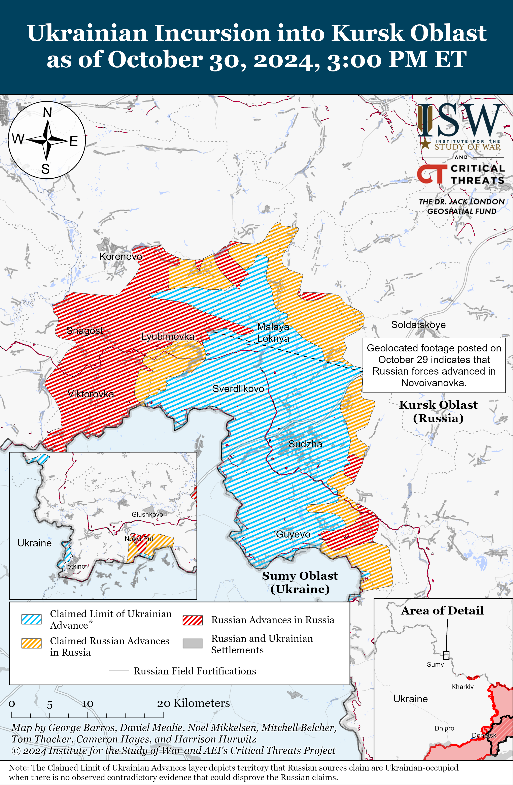
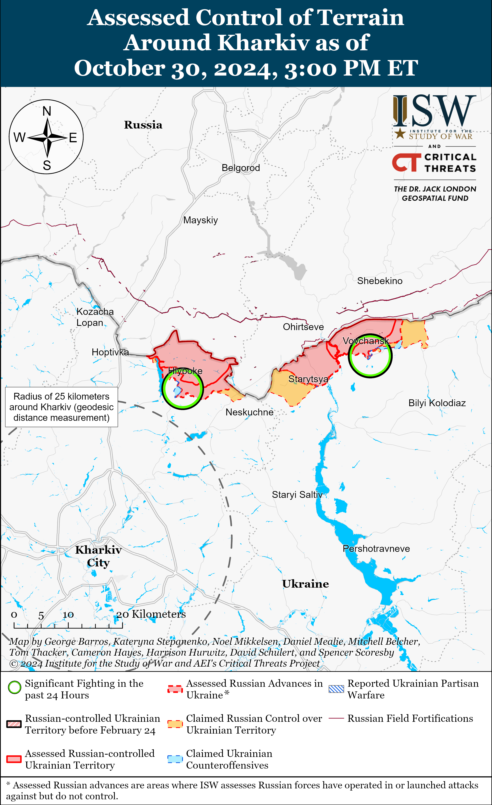
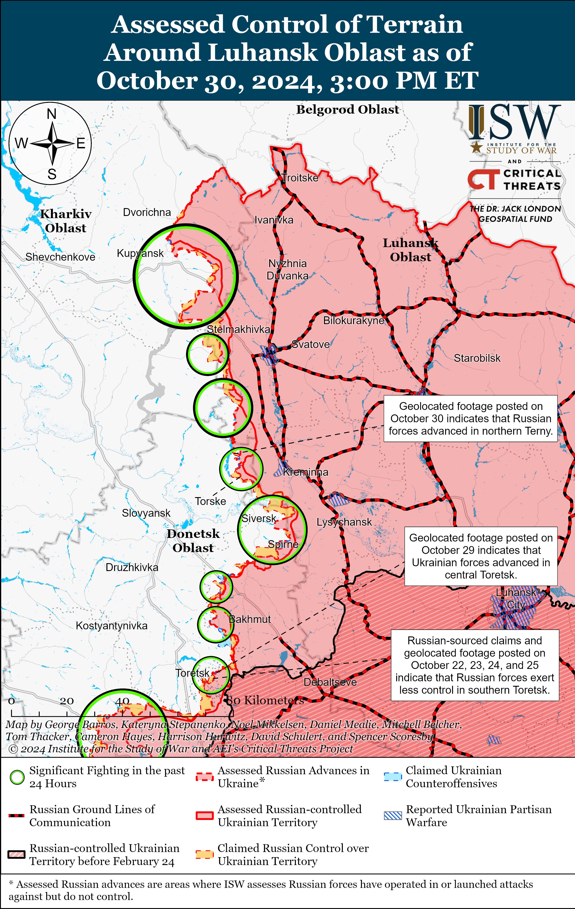
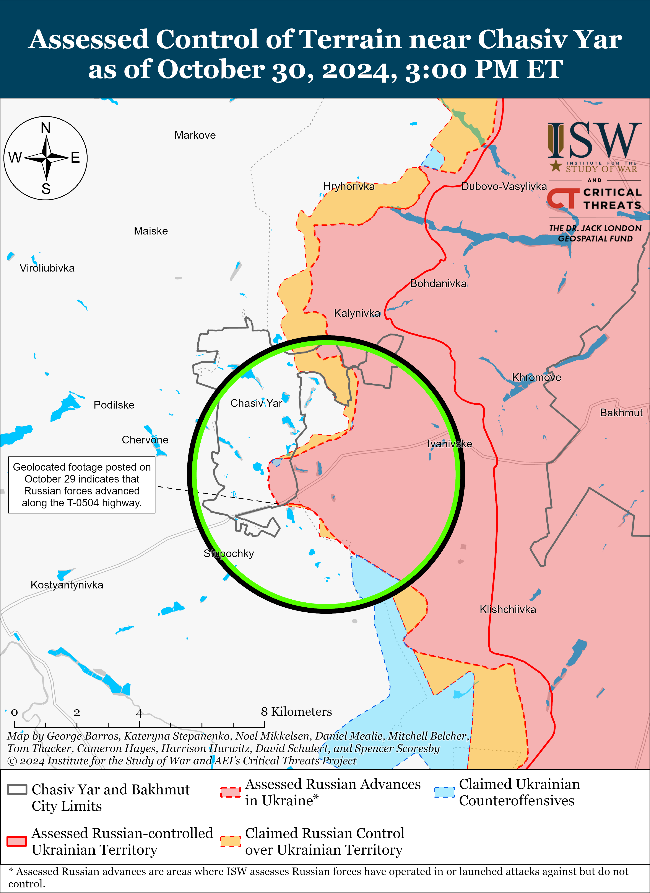
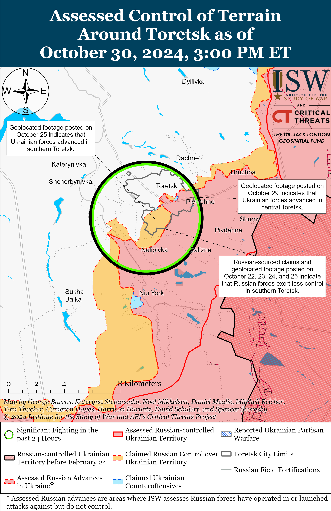
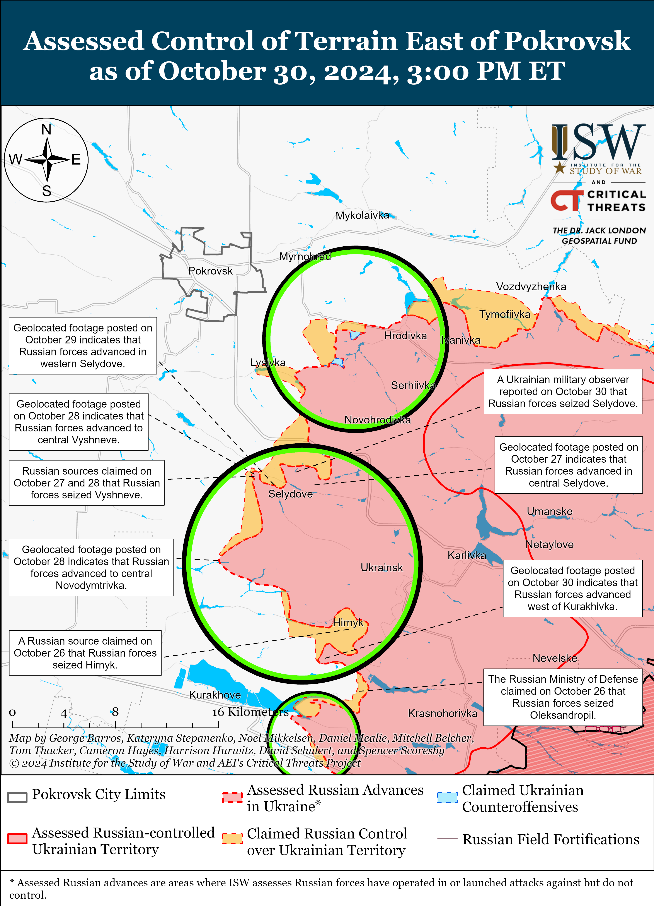
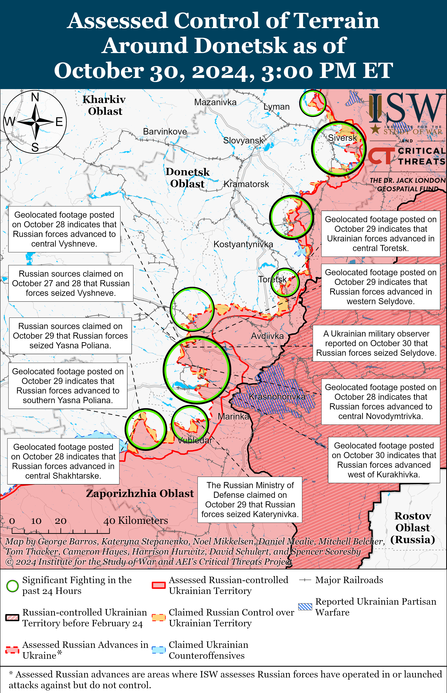
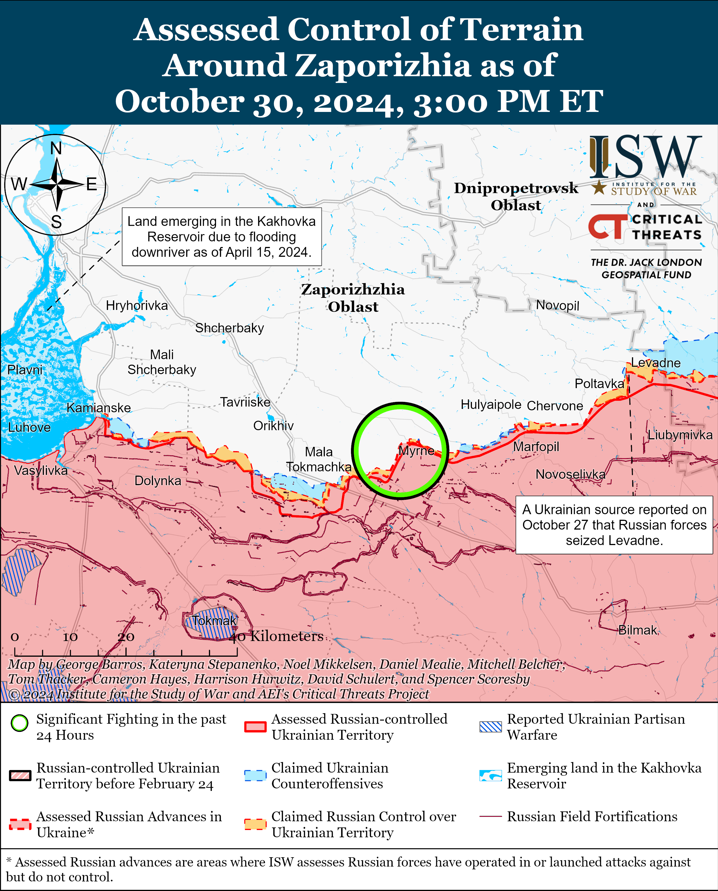
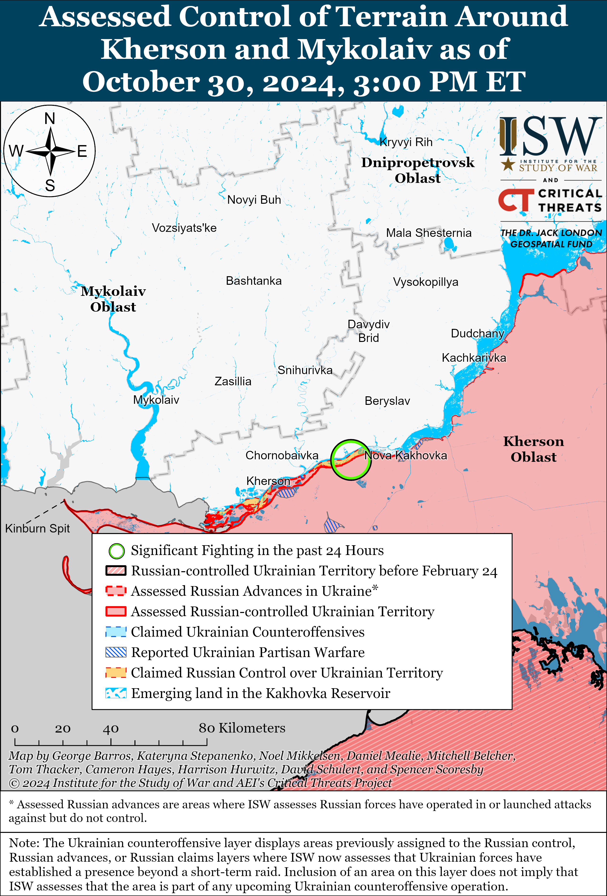

# Russian Offensive Campaign Assessment, October 30, 2024

**October 30, 2024, 6:40pm ET**

**Click** [**here**](https://storymaps.arcgis.com/stories/36a7f6a6f5a9448496de641cf64bd375) **to see ISW’s interactive map of the Russian invasion of Ukraine. This map is updated daily alongside the static maps present in this report.**

**Click** [**here**](https://storymaps.arcgis.com/stories/83a2f24901c941d581c0c523ecd2619b) **to see ISW's interactive map of Ukraine's offensive in Kursk Oblast.**

**Click** [**here**](https://understandingwar.maps.arcgis.com/apps/instant/3dviewer/index.html?appid=1602762dbcde419bb957dea358449580) **to see ISW’s 3D control of terrain topographic map of Ukraine. Use of a computer (not a mobile device) is strongly recommended for using this data-heavy tool.**

**Click** [**here**](https://storymaps.arcgis.com/stories/733fe90805894bfc8562d90b106aa895) **to access ISW’s archive of interactive time-lapse maps of the Russian invasion of Ukraine. These maps complement the static control-of-terrain map that ISW produces daily by showing a dynamic frontline. ISW will update this time-lapse map archive monthly.**

**Note: The data cut-off for this product was 11:30am ET on October 30. ISW will cover subsequent reports in the October 31 Russian Offensive Campaign Assessment.**

**Western intelligence officials reportedly stated that North Korean troops are in an unspecified area in occupied Ukraine.** *CNN*, citing two unspecified Western intelligence officials, reported on October 30 that a small number of North Korean personnel are in occupied Ukraine but did not specify their location — the first such confirmation from Western sources.[[1]](#_ednd70872882db87fcc7fdc9e4dc8bfb9b21) The intelligence officials stated that they expect the number of North Korean personnel in Ukraine to grow as they complete training in Russia. Ukrainian and South Korean officials reported in early October 2024 the presence of a limited number of North Korean personnel in occupied Donetsk City, mainly engineering personnel, who were likely repairing or somehow improving the quality of a large amount of low-quality ammunition that North Korea provided to the Russian military.[[2]](#_ednd70872882db87fcc7fdc9e4dc8bfb9b22) The reports from Western intelligence officials could refer to the same group of North Korean personnel or similar specialists conducting engineering work in occupied Ukraine. *Financial Times* reported on October 30 that senior unspecified Ukrainian intelligence officials have stated that Russian authorities transferred about 3,000 North Korean personnel to western Kursk Oblast from other areas in Russia in civilian vehicles and that the group consisted of a few hundred special forces servicemembers and regular troops.[[3]](#_ednd70872882db87fcc7fdc9e4dc8bfb9b23) North Korean Foreign Minister Choe Son Hui visited Russia on October 29 but did not specify the purpose of the visit.[[4]](#_ednd70872882db87fcc7fdc9e4dc8bfb9b24) *AP*, citing South Korean intelligence, reported on October 29 that Choe might have visited Russia to discuss the deployment of additional North Korean troops to Russia. Russian Foreign ministry Spokesperson Maria Zakharova claimed that the arrival of the North Korean foreign minister was pre-planned, in line with Russia–North Korea cooperation.[[5]](#_ednd70872882db87fcc7fdc9e4dc8bfb9b25)

**Ukrainian President Volodymyr Zelensky highlighted enhanced Ukraine–South Korea cooperation amid since-retracted reports that South Korea would consider providing direct military assistance to Ukraine.** Zelensky reported on October 29 that he had discussed enhanced intelligence cooperation with South Korean President Yoon Suk Yeol in order to develop an action plan and propose a set of countermeasures in response to Russian and North Korean escalation of the war.[[6]](#_ednd70872882db87fcc7fdc9e4dc8bfb9b26) Zelensky announced that the two countries will soon exchange delegations to coordinate their actions and that they will involve common partners in their proposed intelligence cooperation. South Korean news outlet *The Dong-A Ilbo* reported on October 30 that the South Korean government was considering providing 155mm artillery shells directly to Ukraine, but the South Korean presidential office denied these reports**,** stating that Ukrainian officials have not requested such assistance.[[7]](#_ednd70872882db87fcc7fdc9e4dc8bfb9b27)

**The Kremlin is reportedly struggling to prepare for the September 2026 Russian State Duma elections campaign due to uncertainty about the course of the war in the Ukraine, suggesting that the Kremlin is not confident that Russia will be able to win the war over the next two years.** Russian opposition outlet *Meduza* reported on October 30 that Presidential Administration First Deputy Head Sergei Kiriyenko has not started to plan the "contours" of the 2026 Duma elections even though the Kremlin usually does so two years in advance of the elections.[[8]](#_ednd70872882db87fcc7fdc9e4dc8bfb9b28) A source close to the Presidential Administration told *Meduza* that the Duma elections’ policy framing depends on whether the war in Ukraine will continue in 2026. *Meduza* reported that a source within United Russia's leadership stated that it is unclear if United Russia's 2026 campaign should feature military personnel or a person who "symbolizes a return to peaceful life," such as Prime Minister Mikhail Mishustin. A political strategist who works with the Kremlin and several regional governments reportedly stated that if the war continues during the 2026 election campaign season, then the Kremlin will need "a force that leans on ultra-patriotism," such as an entirely new political party or a "slightly updated" A Just Russia party. The source stated that if the war ends, then the Kremlin will need "moderate forces." A Just Russia notably held a congress on October 26 and announced that its new political course will be "patriotic socialism," which the party described as necessary during Russia's war in Ukraine and "firmly based on the great achievements of Russian civilization and the most important condition for [Russia's] further development."[[9]](#_ednd70872882db87fcc7fdc9e4dc8bfb9b29)

**The Kremlin simultaneously continues to militarize various levels of Russian government, likely in preparation for long-term war efforts in Ukraine and confrontation against NATO despite the reported lack of preparation for the Duma elections.** The "Time of Heroes" program, which Kiriyenko oversees, aims to place Russian veterans of the war in Ukraine in local, regional, and federal government positions; and ISW assesses that this program is part of Kremlin efforts to militarize Russian society and government.[[10]](#_ednd70872882db87fcc7fdc9e4dc8bfb9b210) The Kremlin has also pursued multiple efforts aimed at preparing Russian society and military for a potential large-scale conflict with NATO.[[11]](#_ednd70872882db87fcc7fdc9e4dc8bfb9b211) Although *Meduza's* reporting suggests the Kremlin may be willing to focus the 2026 Duma campaign on a return to peacetime should the war end by that time, the Kremlin likely views this as a short-term effort within an electoral body that wields little independent influence in the overall Russian political sphere. The "Time of Heroes" program is likely a better indicator of Russia's long-term trajectory under the current regime.

**The US Treasury and State departments sanctioned nearly 400 entities and individuals from over a dozen countries on October 30 in one of the largest concerted efforts to address Russian sanctions evasions via third parties to date.[[12]](#_ednd70872882db87fcc7fdc9e4dc8bfb9b212)** The sanctions targeted dozens of People’s Republic of China (PRC)–, Hong Kong–, and India-based companies while also impacting targets in Russia, the United Arab Emirates, Turkey, Thailand, Malaysia, Switzerland, among other countries. Russia has extensively used bilateral relations and devised mechanisms with countries, entities, and individuals to evade Western and international sanctions to support its war effort in Ukraine.[[13]](#_ednd70872882db87fcc7fdc9e4dc8bfb9b213)

**Key Takeaways:**

- **Western intelligence officials reportedly stated that North Korean troops are in an unspecified area in occupied Ukraine.**
- **Ukrainian President Volodymyr Zelensky highlighted enhanced Ukraine-South Korea cooperation amid since-retracted reports that South Korea would consider providing direct military assistance to Ukraine.**
- **The Kremlin is reportedly struggling to prepare for the September 2026 Russian State Duma elections campaign due to uncertainty about the course of the war in the Ukraine, suggesting that the Kremlin is not confident that Russia will be able to win the war over the next two years.**
- **The Kremlin simultaneously continues to militarize various levels of Russian government, likely in preparation for long-term war efforts in Ukraine and confrontation against NATO despite the reported lack of preparation for the Duma elections.**
- **The US Treasury and State departments sanctioned nearly 400 entities and individuals from over a dozen countries on October 30 in one of the largest concerted efforts to address Russian sanctions evasions via third parties to date.**
- **Ukrainian forces recently regained positions near Pokrovsk.**
- **Russian forces recently advanced in Kursk Oblast and near Kreminna, Chasiv Yar, Pokrovsk, and Kurakhove.**
- **Russian occupation authorities continue to advertise Russian military service to civilians in occupied Ukraine.**

***We do not report in detail on Russian war crimes because these activities are well-covered in Western media and do not directly affect the military operations we are assessing and forecasting. We will continue to evaluate and report on the effects of these criminal activities on the Ukrainian military and the Ukrainian population and specifically on combat in Ukrainian urban areas. We utterly condemn Russian violations of the laws of armed conflict and the Geneva Conventions and crimes against humanity even though we do not describe them in these reports.***

- Ukrainian Operations in the Russian Federation
- Russian Main Effort – Eastern Ukraine (comprised of three subordinate main efforts)
- Russian Subordinate Main Effort #1 – Push Ukrainian forces back from the international border with Belgorod Oblast and approach to within tube artillery range of Kharkiv City
- Russian Subordinate Main Effort #2 – Capture the remainder of Luhansk Oblast and push westward into eastern Kharkiv Oblast and encircle northern Donetsk Oblast
- Russian Subordinate Main Effort #3 – Capture the entirety of Donetsk Oblast
- Russian Supporting Effort – Southern Axis
- Russian Air, Missile, and Drone Campaign
- Russian Mobilization and Force Generation Efforts
- Russian Technological Adaptations
- Activities in Russian-occupied areas
- Significant Activity in Belarus

**Ukrainian Operations in the Russian Federation**

Russian forces recently advanced in the main Ukrainian salient in Kursk Oblast amid continued fighting in the area on October 30. Geolocated footage published on October 29 indicates that Russian forces recently advanced in central Novoivanovka (southeast of Korenevo).[[14]](#_ednd70872882db87fcc7fdc9e4dc8bfb9b214) Russian sources, including the Russian Ministry of Defense (MoD), claimed that Ukrainian forces counterattacked southeast of Korenevo near Darino, Nizhny Klin, Nikolayevo-Darino, Novoivanovka, and Tolsty Lug and southeast of Sudzha near Plekhovo.[[15]](#_ednd70872882db87fcc7fdc9e4dc8bfb9b215) Russian milbloggers claimed that large parts of Novoivanovka are contested "gray zones" and that Russian forces pushed Ukrainian forces out of Martynovka (northeast of Sudzha).[[16]](#_ednd70872882db87fcc7fdc9e4dc8bfb9b216) ISW has not observed confirmation of this claimed Russian advance, however. A Russian source claimed that Russian forces entered Plekhovo, but later stated that Russian military sources in the area reported that Russian forces are unable to gain a foothold in the area.[[17]](#_ednd70872882db87fcc7fdc9e4dc8bfb9b217) The spokesperson of a Ukrainian brigade operating in Kursk Oblast reported on October 29 that Russian forces have switched to using motorcycles, all-terrain vehicles (ATVs), and trucks following Ukrainian strikes against Russian heavy equipment.[[18]](#_ednd70872882db87fcc7fdc9e4dc8bfb9b218) The spokesperson stated that elements of the Russian 155th Naval Infantry Brigade (Pacific Fleet, Eastern Military District [EMD]) are operating in Kursk Oblast but are less combat effective following their defeat in Vuhledar in Winter 2022-2023 and are supplementing their previously "elite" forces with convict recruits. The spokesperson reported that elements of the 810th Naval Infantry Brigade (Black Sea Fleet, Southern Military District [SMD]) and 56th VDV Regiment (7th VDV Division) are also operating in Kursk Oblast. Elements of the Russian 137th Airborne (VDV) Regiment (106th VDV Division) are reportedly operating near Zeleny Shlyakh (southeast of Korenevo).[[19]](#_ednd70872882db87fcc7fdc9e4dc8bfb9b219)

Neither Russian nor Ukrainian sources reported fighting in Glushkovsky Raion west of the main Ukrainian salient on October 30. Elements of the 106th VDV Division are reportedly operating in Glushkovsky Raion.[[20]](#_ednd70872882db87fcc7fdc9e4dc8bfb9b220)

Chechen Republic Head Ramzan Kadyrov claimed on October 29 that the drone strike against the Russian Spetsnaz University in Gudermes, Chechnya killed Ukrainian prisoners of war (POWs) whom Russian forces were holding at the facility and blamed Ukraine for the strike.[[21]](#_ednd70872882db87fcc7fdc9e4dc8bfb9b221) ISW has not observed any independent information confirming Kadyrov's claim. Kadyrov did not blame Ukraine when he made his initial claims about the strike earlier on October 29.[[22]](#_ednd70872882db87fcc7fdc9e4dc8bfb9b222)

**Russian Main Effort – Eastern Ukraine**

**Russian Subordinate Main Effort #1 – Kharkiv Oblast** **(Russian objective: Push Ukrainian forces back from the international border with Belgorod Oblast and approach to within tube artillery range of Kharkiv City)**

Russian forces continued limited offensive operations north of Kharkiv City near Lyptsi and northeast of Kharkiv City near Vovchansk on October 29 and 30 but did not advance.[[23]](#_ednd70872882db87fcc7fdc9e4dc8bfb9b223)

**Russian Subordinate Main Effort #2 – Luhansk Oblast (Russian objective: Capture the remainder of Luhansk Oblast and push westward into eastern Kharkiv Oblast and northern Donetsk Oblast)**

Russian forces recently advanced east of Kupyansk and west of Kreminna amid continued offensive operations along the Kupyansk-Svatove-Kreminna line on October 30. Geolocated footage published on October 30 indicates that Russian forces recently advanced south of Stepova Novoselivka (east of Kupyansk) and north of Terny (west of Kreminna).[[24]](#_ednd70872882db87fcc7fdc9e4dc8bfb9b224) The Russian Ministry of Defense (MoD) claimed on October 30 that elements of the Russian 1st Tank Regiment and 15th Motorized Rifle Regiment (both of the 2nd Motorized Rifle Division, 1st Guards Tank Army [GTA], Moscow Military District [MMD]) seized Kruhlyakivka (south of Kupyansk).[[25]](#_ednd70872882db87fcc7fdc9e4dc8bfb9b225) Kharkiv Oblast occupation head Vitaly Ganchev claimed that the Russian seizure of Kruhlyakivka will sever an unspecified Ukrainian ground line of communication (GLOC) and prevent Ukrainian forces from accessing the east (right) bank of the Oskil River.[[26]](#_ednd70872882db87fcc7fdc9e4dc8bfb9b226) ISW has not observed visual evidence confirming that Russian forces seized Kruhlyakivka. Russian milbloggers made unconfirmed claims that Russian forces advanced southwest of Berestove, east of Lozova (both southeast of Kupyansk), north and south of Nevske, north of Novosadove (both northwest of Kreminna), and north of Terny (west of Kreminna).[[27]](#_ednd70872882db87fcc7fdc9e4dc8bfb9b227) ISW has not observed confirmation of these claims, however. The Ukrainian General Staff reported that Russian forces continued offensive operations north of Kupyansk near Holubivka; northeast of Kupyansk near Synkivka and Pershotravneve; southeast of Kupyansk near Kolisnykivka, Bohuslavka, Kruhlyakivka, Lozova, Stepova Novoselivka, Pishchane, Zahryzove, Vyshneve, Berestove, Zelenyi Hai, Cherneshchyna, and Novoosynove; west of Svatove near Stelmakhivka; southwest of Svatove near Druzhelyubivka and Hrekivka; northwest of Kreminna near Katerynivka, Novomykhailivka, and Nevske; west of Kreminna near Terny, Zarichne, Yampolivka, and Torske; and south of Kreminna near Serebryanka.[[28]](#_ednd70872882db87fcc7fdc9e4dc8bfb9b228) Assault elements of the Russian 144th Motorized Rifle Division (20th Combined Arms Army [CAA], MMD) are reportedly operating near Terny.[[29]](#_ednd70872882db87fcc7fdc9e4dc8bfb9b229)

A Ukrainian battalion commander operating near Kupyansk stated on October 30 that Russian forces are conducting mechanized assaults with armored vehicles and highly maneuverable two-wheeled vehicles, such as motorcycles.[[30]](#_ednd70872882db87fcc7fdc9e4dc8bfb9b230) A Ukrainian source reported on October 30 that Russian forces in the Kupyansk direction suffered over 4,000 casualties and lost over 150 pieces of equipment in the past six months.[[31]](#_ednd70872882db87fcc7fdc9e4dc8bfb9b231) The Ukrainian source stated that Ukrainian defenses near the Oskil River are preventing Russian forces from crossing the river from the east (left) bank.

**Russian Subordinate Main Effort #3 – Donetsk Oblast (Russian objective: Capture the entirety of Donetsk Oblast, the claimed territory of Russia’s proxies in Donbas)**

Russian forces continued offensive operations in the Siversk direction on October 29 and 30 but did not advance. The Ukrainian General Staff reported that Russian forces attacked northeast of Siversk near Bilohorivka; east of Siversk near Verkhnokamyanske; southeast of Siversk near Ivano-Darivka, and south of Siversk near Zvanivka.[[32]](#_ednd70872882db87fcc7fdc9e4dc8bfb9b232)

Russian forces recently advanced southeast of Chasiv Yar amid continued offensive operations on October 29 and 30. Geolocated footage published on October 29 shows that reportedly elements of the Russian “Akhmat” Spetsnaz group of the 2nd Motorized Rifle Territorial Defense Battalion (4th Motorized Rifle Brigade, 3rd Combined Arms Army [CAA], formerly 2nd Luhansk People’s Republic’s Army Corps [LNR AC], Southern Military District [SMD]) recently advanced along the T0504 Bakhmut-Kostyantynivka highway southeast of Chasiv Yar.[[33]](#_ednd70872882db87fcc7fdc9e4dc8bfb9b233) Ukrainian Luhansk Group of Forces Spokesperson Major Anastasiya Bobovnikova reported that Russian forces continued to launch attacks across the Siverskyi-Donets Donbas Canal with small infantry groups of two to three personnel but that they are unable to secure positions across the canal due to Ukrainian artillery and drone strikes.[[34]](#_ednd70872882db87fcc7fdc9e4dc8bfb9b234) Russian forces continued to attack south of Chasiv Yar near Stupochky on October 29 and 30.[[35]](#_ednd70872882db87fcc7fdc9e4dc8bfb9b235) Elements of the Russian 98th Airborne (VDV) Division reportedly continued operating in the Chasiv Yar direction, and elements of the 4th Motorized Rifle Brigade (3rd Army Corps [AC]) and 1008th Motorized Rifle Regiment (6th Motorized Rifle Division, 3rd AC) are reportedly operating south of Chasiv Yar.[[36]](#_ednd70872882db87fcc7fdc9e4dc8bfb9b236)

Russian forces continued offensive operations in the Toretsk direction on October 29 and 30 but did not advance. Russian forces reportedly continued to attack in Toretsk and west of Toretsk near Shcherbynivka.[[37]](#_ednd70872882db87fcc7fdc9e4dc8bfb9b237) Elements of the Russian "Somali" Battalion of the 9th Motorized Rifle Brigade (51st CAA, formerly 1st Donetsk People’s Republic’s [DNR] AC, SMD]) and “Sparta" Separate Reconnaissance Battalion (51st CAA) are reportedly operating in the Toretsk direction.[[38]](#_ednd70872882db87fcc7fdc9e4dc8bfb9b238)

Russian and Ukrainian forces recently advanced in the Pokrovsk direction amid continued offensive operations in the area on October 30. Geolocated footage published on October 30 indicates that Ukrainian forces regained positions northeast of Novohrodivka (southeast of Pokrovsk) that Russian forces seized on a prior, unspecified date.[[39]](#_ednd70872882db87fcc7fdc9e4dc8bfb9b239) Additional geolocated footage published on October 30 indicates that Russian forces recently advanced southeast of Promin (east of Pokrovsk).[[40]](#_ednd70872882db87fcc7fdc9e4dc8bfb9b240) Geolocated footage published on October 29 indicates that Russian forces advanced within and northwest of Selydove (southeast of Pokrovsk), and Ukrainian military observer Kostyantyn Mashovets stated on October 30 that Russian forces seized the settlement.[[41]](#_ednd70872882db87fcc7fdc9e4dc8bfb9b241) A Ukrainian deputy platoon commander operating in the Pokrovsk direction stated on October 30 that Ukrainian forces recently successfully repelled Russian attacks near Novooleksandrivka and Vozdvyzhenka (both east of Pokrovsk) and are forcing the Russian units in the area to redirect ground attacks to another unspecified direction, likely in the area southeast of Pokrovsk.[[42]](#_ednd70872882db87fcc7fdc9e4dc8bfb9b242) Russian forces continued attacking east of Pokrovsk near Myrnohrad, Promin, and Myrolyubivka; and southeast of Pokrovsk near Sukhyi Yar, Novohrodivka, Lysivka, Krutyi Yar, Selydove, and Vyshneve on October 29 and 30.[[43]](#_ednd70872882db87fcc7fdc9e4dc8bfb9b243) Mashovets stated that the Russian military has concentrated the main forces of the 2nd CAA and almost the entire 41st CAA (Central Military District [CMD]) along the Novohrodivka-Lozuvatske line (southeast and east of Pokrovsk).[[44]](#_ednd70872882db87fcc7fdc9e4dc8bfb9b244) Mashovets also reported that elements of the Russian 27th Motorized Rifle Division (2nd CAA, CMD) and 90th Tank Division (41st CAA, CMD) are operating near Selydove and in the Vyshneve-Hryhorivka and Novohrodivka-Lysivka areas (both southeast of Pokrovsk).[[45]](#_ednd70872882db87fcc7fdc9e4dc8bfb9b245) Mashovets stated that the Russian military recently transferred elements of the Russian 61st Naval Infantry Brigade (Leningrad Military District [LMD], formerly Northern Fleet), to the Pokrovsk direction from the Kherson direction.[[46]](#_ednd70872882db87fcc7fdc9e4dc8bfb9b246) ISW last observed reports in mid-September 2024 that elements of the 61st Naval Infantry Brigade were operating in the Kherson direction.[[47]](#_ednd70872882db87fcc7fdc9e4dc8bfb9b247)

Russian forces recently advanced in the Kurakhove direction amid continued offensive operations in the area on October 30. Geolocated footage published on October 30 indicates that Russian forces recently advanced southwest of Hirnyk (northeast of Kurakhove) and in the area of the Kurakhivka Central Processing Plant west of Kurakhivka (northeast of Kurakhove).[[48]](#_ednd70872882db87fcc7fdc9e4dc8bfb9b248) Additional geolocated footage published on October 29 showing Ukrainian forces repelling a Russian reinforced platoon-sized mechanized assault indicates that Russian forces recently advanced to eastern Kurakhove.[[49]](#_ednd70872882db87fcc7fdc9e4dc8bfb9b249) A Russian milblogger claimed that Russian forces seized Kurakhivka, although ISW has not observed visual evidence of this claim.[[50]](#_ednd70872882db87fcc7fdc9e4dc8bfb9b250) Russian forces continued attacking northwest of Kurakhove near Novodmytrivka; north of Kurakhove near Novoselydivka, Illinka, and Berestky; northeast of Kurakhove near Kurakhivka and Hostre; and west of Kurakhove near Maksymilyanivka on October 29 and 30.[[51]](#_ednd70872882db87fcc7fdc9e4dc8bfb9b251) Mashovets stated that elements of the Russian 5th, 110th, and 114th motorized rifle brigades (51st CAA, formerly 1st DNR AC), 90th Tank Division (41st CAA, CMD), and 150th Motorized Rifle Division (8th CAA, SMD) are operating near Kurakhivka and the Kurakhivske Reservoir (north of Kurakhove).[[52]](#_ednd70872882db87fcc7fdc9e4dc8bfb9b252)

Russian forces continued offensive operations in the Vuhledar area on October 30 but did not make any confirmed advances. A Russian milblogger claimed that elements of the Russian 5th Tank Brigade seized Yasna Polyana (northwest of Vuhledar).[[53]](#_ednd70872882db87fcc7fdc9e4dc8bfb9b253) Russian milbloggers claimed that Russian forces advanced northwest of Vuhledar near Bohoyavlenka, Novoukrainka, and Shakhtarske.[[54]](#_ednd70872882db87fcc7fdc9e4dc8bfb9b254) ISW has not observed visual evidence of these claims, however. Russian forces continued attacking northeast of Vuhledar near Antonivka, Katerynivka, and Dalne; and northwest of Vuhledar near Bohoyavlenka, Yasna Polyana, and Shakhtarske on October 29 and 30.[[55]](#_ednd70872882db87fcc7fdc9e4dc8bfb9b255)

Russian forces reportedly recently advanced in the Donetsk-Zaporizhia Oblast border area. Ukrainian Southern Group of Forces Spokesperson Colonel Vladyslav Voloshyn reported on October 29 that Russian forces recently marginally advanced near Levadne (southwest of Velyka Novosilka) after "constant" Russian assaults.[[56]](#_ednd70872882db87fcc7fdc9e4dc8bfb9b256)

A commander of a Ukrainian battalion operating in the Donetsk direction reported that Ukrainian forces struck a Russian TOR-M1 air defense system on October 30 in unspecified area of Donetsk Oblast using Switchblade 600 loitering munition systems.[[57]](#_ednd70872882db87fcc7fdc9e4dc8bfb9b257)

**Russian Supporting Effort – Southern Axis (Russian objective: Maintain frontline positions and secure rear areas against Ukrainian strikes)**

Russian sources claimed on October 29 and 30 that fighting continued near Robotyne.[[58]](#_ednd70872882db87fcc7fdc9e4dc8bfb9b258) A spokesperson of a Ukrainian brigade operating in the Zaporizhia Oblast reported on October 29 that Russian forces began using first person view drones with fiber optic wires stretching up to 10 kilometers in length against Ukrainian forces in the Zaporizhia direction.[[59]](#_ednd70872882db87fcc7fdc9e4dc8bfb9b259) The spokesperson added that these drones are reportedly immune to Ukrainian electronic warfare (EW) systems and that Ukrainian personnel had to shoot down these drones with small arms. The spokesperson observed that these drones are susceptible to air defense systems, have greatly limited ranges, and are ineffective in dense urban settings. Elements of the Russian 1430th Motorized Rifle Regiment (58th Combined Arms Army [CAA], Southern Military District [SMD]) and the BARS-11 “Kuban” detachment (Russian Combat Army Reserve) are reportedly operating in the Zaporizhia direction; and elements of the 7th Airborne (VDV) Division are operating in the Orikhiv direction.[[60]](#_ednd70872882db87fcc7fdc9e4dc8bfb9b260)

The Ukrainian General Staff reported that Russian forces continued ground attacks in the Dnipro direction, likely referring to east (left) bank Kherson Oblast and the islands of the Dnipro River Delta, on October 29 and 30. [[61]](#_ednd70872882db87fcc7fdc9e4dc8bfb9b261) Elements of the Russian 28th Motorized Rifle Regiment (70th Motorized Rifle Division, 18th CAA, SMD) and the BARS-33 Detachment reportedly continue to operate in the Kherson direction.[[62]](#_ednd70872882db87fcc7fdc9e4dc8bfb9b262)

Ukrainian Southern Group of Forces Spokesperson Colonel Vladyslav Voloshyn reported on October 29 that there are around 200,000 Russian troops in southern Ukraine and occupied Crimea.[[63]](#_ednd70872882db87fcc7fdc9e4dc8bfb9b263) Voloshyn stated that Russian forces have not created large offensive groupings in the southern direction but are creating additional small assault groups to conduct limited infantry attacks.

Geolocated footage published on October 30 indicates that a Ukrainian cluster munitions ATACMS strike damaged a Russian S-300/S-400 air defense system near Rusakivka, occupied Crimea on the night of October 27 and 28.[[64]](#_ednd70872882db87fcc7fdc9e4dc8bfb9b264)

**Russian Air, Missile, and Drone Campaign (Russian Objective: Target Ukrainian military and civilian infrastructure in the rear and on the frontline)**

Russian forces conducted another series of drone and missile strikes against Ukraine on the night of October 29 and 30. The Ukrainian Air Force reported that Russian forces launched one missile of unknown model from Belgorod Oblast towards Sumy Oblast and 62 drones (including Shaheds and unspecified drone models) from Oryol Oblast and Primorsko-Akhtarsk, Krasnodar Krai Oblast.[[65]](#_ednd70872882db87fcc7fdc9e4dc8bfb9b265) The Ukrainian Air Force reported that Ukrainian forces shot down 33 drones over Kyiv, Cherkasy, Khmelnytskyi, Kharkiv, Zaporizhia, Donetsk, Dnipropetrovsk, Sumy, Chernihiv, and Poltava oblasts, and that 25 drones were "locally lost," likely due to electronic warfare (EW) interference.[[66]](#_ednd70872882db87fcc7fdc9e4dc8bfb9b266) Kremlin newswire *TASS*, citing a Russian milblogger, claimed that Russian forces struck the Ukrainian General Staff building in Kyiv City, and Chechen Republic Head Ramzan Kadyrov claimed that the Russian strike was retaliation for the October 29 Ukrainian drone strike on the Spetsnaz University building in Chechnya.[[67]](#_ednd70872882db87fcc7fdc9e4dc8bfb9b267) ISW cannot confirm the veracity of these claims. Ukrainian regional authorities reported that Russian drone strikes damaged a kindergarten and residential building in Solomyanskyi Raion, Kyiv City; civilian infrastructure and private homes in Bohodukhivskyi Raion, Kharkiv Oblast; and a TV tower in Lozivskyi Raion, Kharkiv Oblast.[[68]](#_ednd70872882db87fcc7fdc9e4dc8bfb9b268) A Russian milblogger claimed on October 30 that Russian forces launched Shahed drone strikes against Ukrainian troops and equipment in Druzhkivka and Serhiivka, Donetsk Oblast.[[69]](#_ednd70872882db87fcc7fdc9e4dc8bfb9b269)

The German-based Kiel Institute published a report in September 2024, which assessed that Ukrainian air defenses had a 30 percent interception rate against Russian missiles and a 66 percent interception rate against Russian drones.[[70]](#_ednd70872882db87fcc7fdc9e4dc8bfb9b270) The report specified that Ukrainian air defenses had interception rates of 50 percent against Kalibr cruise missiles, 22 precent against Kh-59s and Kh-69 cruise missiles, four percent against Iskander ballistic missiles, and less than one percent against Kh-22 anti-ship missiles. The report estimated that Russian forces are using more than 1,000 glide bombs per month.

**Russian Mobilization and Force Generation Efforts (Russian objective: Expand combat power without conducting general mobilization)**

Russian occupation authorities continue to advertise Russian military service to civilians in occupied Ukraine. The Kherson Oblast occupation administration offered on October 30 a one-time payment of 800,000 rubles (about $8,200) and a 210,000-ruble (about $2,400) minimum monthly salary to individuals who sign contracts with the Russian military.[[71]](#_ednd70872882db87fcc7fdc9e4dc8bfb9b271) The Kherson Oblast occupation administration advertised that individuals who sign military contracts will receive combat veteran status, which would entitle them to social and economic benefits.

Russian milbloggers continue to voice concerns about the deployment of drone specialists in assault operations, blaming local leadership in occupied Donetsk while deflecting accountability from the Russian military command. A Russian milblogger complained on October 30 that the practice of sending specialists on assaults is a “Donetsk issue” whereby local elites act against Moscow's intentions in an effort to prevent federal authorities from intervening.[[72]](#_ednd70872882db87fcc7fdc9e4dc8bfb9b272) The milblogger called for the Russian military to implement "massive" systemic repressions and to "cleanse "the Russian military structure of "mafias." These complaints have emerged in the wake of a scandal involving drone operators in occupied Donetsk Oblast, who were killed in combat after they criticized their commander, who then disbanded their specialized drone unit.[[73]](#_ednd70872882db87fcc7fdc9e4dc8bfb9b273)

**Russian Technological Adaptations** **(Russian objective: Introduce technological innovations to optimize systems for use in Ukraine)**

Nothing significant to report.

**Activities in Russian-occupied areas (Russian objective: Consolidate administrative control of annexed areas; forcibly integrate Ukrainian citizens into Russian sociocultural, economic, military, and governance systems)**

*ISW is not publishing reporting on activities in Russian-occupied areas today.*

**Significant activity in Belarus** **(Russian efforts to increase its military presence in Belarus and further integrate Belarus into Russian-favorable frameworks and Wagner Group activity in Belarus)**

Belarusian Security Council Deputy State Secretary Alexander Neverovsky stated on October 30 that the Supreme State Council of the Union State may discuss the Union State's new security concept at its next meeting on December 5.[[74]](#_ednd70872882db87fcc7fdc9e4dc8bfb9b274)

**Note: ISW does not receive any classified material from any source, uses only publicly available information, and draws extensively on Russian, Ukrainian, and Western reporting and social media as well as commercially available satellite imagery and other geospatial data as the basis for these reports. References to all sources used are provided in the endnotes of each update.**

---

[[1]](#_ednd70872882db87fcc7fdc9e4dc8bfb9b2ref1) https://edition.cnn.com/2024/10/29/politics/north-korean-troops-ukraine/index.html

[[2]](#_ednd70872882db87fcc7fdc9e4dc8bfb9b2ref2) <https://isw.pub/UkrWar100524>; https://isw.pub/UkrWar100924

[[3]](#_ednd70872882db87fcc7fdc9e4dc8bfb9b2ref3) https://www.ft.com/content/f908deed-7bc5-4e8c-b20f-02d935beaaaf; https://meduzaio/news/2024/10/30/v-ukrainskoy-razvedke-zayavili-chto-severokoreyskih-voennyh-razmestili-v-kurskoy-oblasti-v-50-kilometrah-ot-granitsy

[[4]](#_ednd70872882db87fcc7fdc9e4dc8bfb9b2ref4) https://apnews.com/article/north-korea-russia-ukraine-war-choe-son-hui-foreign-minister-c67d98128d06e8959aa34f21428f5081

[[5]](#_ednd70872882db87fcc7fdc9e4dc8bfb9b2ref5) https://t.me/tass\_agency/282576

[[6]](#_ednd70872882db87fcc7fdc9e4dc8bfb9b2ref6) <https://t.me/V_Zelenskiy_official/12248>; https://mil dot in.ua/uk/news/ukrayina-ta-pivdenna-koreya-domovylysya-pro-obmin-rozviddanymy/

[[7]](#_ednd70872882db87fcc7fdc9e4dc8bfb9b2ref7) <https://en.yna.co> dot kr/view/AEN20241030007400315?input=tw; <https://x.com/YonhapNews/status/1851513245452157099>; <https://kyivindependent> dot com/south-korea-shells-ukraine/; https://suspilne dot media/868963-pivdenna-korea-rozgladae-postacanna-155-mm-snaradiv-v-ukrainu-u-vidpovid-na-vijska-kndr-u-rosii/; https://www.donga dot com/news/Politics/article/all/20241030/130322230/2

[[8]](#_ednd70872882db87fcc7fdc9e4dc8bfb9b2ref8) <https://meduza> dot io/feature/2024/10/30/neponyatno-kak-zhit-posle-svo-i-eto-pugaet

[[9]](#_ednd70872882db87fcc7fdc9e4dc8bfb9b2ref9) <https://www.vedomosti> dot ru/politics/articles/2024/10/28/1071257-spravedlivaya-rossiya-chistit

[[10]](#_ednd70872882db87fcc7fdc9e4dc8bfb9b2ref10) https://isw.pub/UkrWar090924

[[11]](#_ednd70872882db87fcc7fdc9e4dc8bfb9b2ref11) <https://isw.pub/UkrWar060424>; <https://isw.pub/UkrWar032024>; <https://isw.pub/UkrWar012324> ; <https://isw.pub/UkrWar041924> ; <https://isw.pub/UkrWar010324>;

[[12]](#_ednd70872882db87fcc7fdc9e4dc8bfb9b2ref12) <https://home.treasury.gov/news/press-releases/jy2700>; <https://www.state.gov/new-measures-targeting-third-country-enablers-supporting-russias-military-industrial-base/>; https://www.voanews.com/a/us-cracks-down-on-russia-s-sanctions-evasion-in-fresh-action/7844808.html

[[13]](#_ednd70872882db87fcc7fdc9e4dc8bfb9b2ref13) <https://www.understandingwar.org/backgrounder/russian-offensive-campaign-assessment-september-2-2024>; <https://www.understandingwar.org/backgrounder/russian-offensive-campaign-assessment-march-4-2024>; <https://www.understandingwar.org/backgrounder/russian-offensive-campaign-assessment-march-13-2024>; <https://www.understandingwar.org/backgrounder/russia-or-west-stakes-georgia%E2%80%99s-election>; https://www.understandingwar.org/backgrounder/russian-offensive-campaign-assessment-september-4-2024

[[14]](#_ednd70872882db87fcc7fdc9e4dc8bfb9b2ref14) https://t.me/creamy\_caprice/7323; https://t.me/fakhivtsi/250

[[15]](#_ednd70872882db87fcc7fdc9e4dc8bfb9b2ref15) <https://t.me/mod_russia/45144>; https://t.me/boris\_rozhin/142618

[[16]](#_ednd70872882db87fcc7fdc9e4dc8bfb9b2ref16) <https://t.me/boris_rozhin/142618>; https://t.me/voenkorKotenok/59863

[[17]](#_ednd70872882db87fcc7fdc9e4dc8bfb9b2ref17) <https://t.me/motopatriot/29043>; https://t.me/motopatriot/29059

[[18]](#_ednd70872882db87fcc7fdc9e4dc8bfb9b2ref18) <https://armyinform> dot com.ua/2024/10/29/u-47-brygadi-rozpovily-yak-nakryshyly-voroga-na-kurshhyni-amerykanskoyu-tehnikoyu/; https://www.youtube.com/watch?v=kVhiNNMufC8

[[19]](#_ednd70872882db87fcc7fdc9e4dc8bfb9b2ref19) https://t.me/DnevnikDesantnika/18237

[[20]](#_ednd70872882db87fcc7fdc9e4dc8bfb9b2ref20) https://t.me/mod\_russia/45152

[[21]](#_ednd70872882db87fcc7fdc9e4dc8bfb9b2ref21) https://t.me/RKadyrov\_95/5204

[[22]](#_ednd70872882db87fcc7fdc9e4dc8bfb9b2ref22) https://www.understandingwar.org/backgrounder/russian-offensive-campaign-assessment-october-29-2024

[[23]](#_ednd70872882db87fcc7fdc9e4dc8bfb9b2ref23)<https://www.facebook.com/GeneralStaff.ua/posts/pfbid0E8Y8fgxgtJkDQ7fJCxF9fkPMHWuvhdkCqsf6rGJk799HbdUB7bX831FFyNQ9icSzl> ; <https://www.facebook.com/GeneralStaff.ua/posts/pfbid0zufR9LK6Sgu8AWwe7DYQ9TRz3F145KLGW56LLhnoxYKf7dVa7F2wBNMYoruafmRSl> ;<https://www.facebook.com/GeneralStaff.ua/posts/pfbid02SsETcqouGHRm59numBPNALWLc92aaUh1RzwvbmNRWMHCTD8zXbFQxMBUozyonkphl>

[[24]](#_ednd70872882db87fcc7fdc9e4dc8bfb9b2ref24) https://t.me/OMIBr\_60/587; https://t.me/WarArchive\_ua/21798; ; https://x.com/blinzka/status/1851695278467715581; https://www.facebook.com/watch/?v=920446330133569

[[25]](#_ednd70872882db87fcc7fdc9e4dc8bfb9b2ref25) https://t.me/mod\_russia/45139; <https://t.me/epoddubny/21484>; https://t.me/mod\_russia/45141

[[26]](#_ednd70872882db87fcc7fdc9e4dc8bfb9b2ref26) <https://t.me/tass_agency/282554>

[[27]](#_ednd70872882db87fcc7fdc9e4dc8bfb9b2ref27) https://t.me/motopatriot/29026 ; https://t.me/motopatriot/29028 ; https://t.me/motopatriot/29057 ; <https://t.me/motopatriot/29058> ; https://t.me/OMIBr\_60/587; https://t.me/WarArchive\_ua/21798

[[28]](#_ednd70872882db87fcc7fdc9e4dc8bfb9b2ref28) <https://www.facebook.com/GeneralStaff.ua/posts/pfbid0E8Y8fgxgtJkDQ7fJCxF9fkPMHWuvhdkCqsf6rGJk799HbdUB7bX831FFyNQ9icSzl> ;https://www.facebook.com/GeneralStaff.ua/posts/pfbid0zufR9LK6Sgu8AWwe7DYQ9TRz3F145KLGW56LLhnoxYKf7dVa7F2wBNMYoruafmRSl ;

<https://www.facebook.com/GeneralStaff.ua/posts/pfbid02SsETcqouGHRm59numBPNALWLc92aaUh1RzwvbmNRWMHCTD8zXbFQxMBUozyonkphl> ; <https://t.me/dva_majors/56322> ; <https://t.me/boris_rozhin/142618> ; <https://t.me/RVvoenkor/79711> ; https://t.me/boris\_rozhin/142618

[[29]](#_ednd70872882db87fcc7fdc9e4dc8bfb9b2ref29) <https://t.me/RVvoenkor/79687>

[[30]](#_ednd70872882db87fcc7fdc9e4dc8bfb9b2ref30) https://armyinform dot com.ua/2024/10/30/shturm-najdeshevshym-resursom-okupanty-bigayut-v-chystomu-poli-v-krashhyh-tradycziyah-drugoyi-svitovoyi-vijny/

[[31]](#_ednd70872882db87fcc7fdc9e4dc8bfb9b2ref31) https://armyinform dot com.ua/2024/10/30/forsuvaty-oskil-katastrofa-dlya-yihnoyi-armiyi-chy-vchynyat-okupanty-samogubstvo/

[[32]](#_ednd70872882db87fcc7fdc9e4dc8bfb9b2ref32) <https://www.facebook.com/GeneralStaff.ua/posts/pfbid02SsETcqouGHRm59numBPNALWLc92aaUh1RzwvbmNRWMHCTD8zXbFQxMBUozyonkphl;> <https://www.facebook.com/GeneralStaff.ua/posts/pfbid0zufR9LK6Sgu8AWwe7DYQ9TRz3F145KLGW56LLhnoxYKf7dVa7F2wBNMYoruafmRSl> ; <https://www.facebook.com/GeneralStaff.ua/posts/pfbid0E8Y8fgxgtJkDQ7fJCxF9fkPMHWuvhdkCqsf6rGJk799HbdUB7bX831FFyNQ9icSzl>

[[33]](#_ednd70872882db87fcc7fdc9e4dc8bfb9b2ref33) https://t.me/creamy\_caprice/7319; https://t.me/shustryii\_i/1113

[[34]](#_ednd70872882db87fcc7fdc9e4dc8bfb9b2ref34) https://armyinform dot com.ua/2024/10/29/otu-lugansk-okupanty-ne-zakripylysya-za-kanalom-u-chasovomu-yaru/

[[35]](#_ednd70872882db87fcc7fdc9e4dc8bfb9b2ref35) <https://www.facebook.com/GeneralStaff.ua/posts/pfbid0zufR9LK6Sgu8AWwe7DYQ9TRz3F145KLGW56LLhnoxYKf7dVa7F2wBNMYoruafmRSl;> <https://www.facebook.com/GeneralStaff.ua/posts/pfbid02SsETcqouGHRm59numBPNALWLc92aaUh1RzwvbmNRWMHCTD8zXbFQxMBUozyonkphl;> <https://t.me/wargonzo/22872;> <https://t.me/motopatriot/29046;> <https://t.me/z_arhiv/28998>

[[36]](#_ednd70872882db87fcc7fdc9e4dc8bfb9b2ref36) <https://t.me/motopatriot/29046>; <https://t.me/DnevnikDesantnika/18237>

[[37]](#_ednd70872882db87fcc7fdc9e4dc8bfb9b2ref37) <https://www.facebook.com/GeneralStaff.ua/posts/pfbid0zufR9LK6Sgu8AWwe7DYQ9TRz3F145KLGW56LLhnoxYKf7dVa7F2wBNMYoruafmRSl;> <https://www.facebook.com/GeneralStaff.ua/posts/pfbid02SsETcqouGHRm59numBPNALWLc92aaUh1RzwvbmNRWMHCTD8zXbFQxMBUozyonkphl;> <https://t.me/dva_majors/56322;> <https://t.me/RVvoenkor/79671;> <https://t.me/wargonzo/22872>; https://t.me/boris\_rozhin/142618

[[38]](#_ednd70872882db87fcc7fdc9e4dc8bfb9b2ref38) <https://t.me/wargonzo/22871;> <https://t.me/wargonzo/22876>; <https://t.me/wargonzo/22884>; <https://t.me/wargonzo/22887>

[[39]](#_ednd70872882db87fcc7fdc9e4dc8bfb9b2ref39) https://t.me/skalabatalion/426; https://x.com/TuiteroMartin/status/1851686778287104382; https://x.com/TuiteroMartin/status/1851690017581638069

[[40]](#_ednd70872882db87fcc7fdc9e4dc8bfb9b2ref40) https://t.me/argus38/366; <https://t.me/creamy_caprice/7324>

[[41]](#_ednd70872882db87fcc7fdc9e4dc8bfb9b2ref41) https://t.me/creamy\_caprice/7317; https://t.me/groupPUMA/48; <https://x.com/blinzka/status/1851614018487619972> ; <https://t.me/zvizdecmanhustu/2306> ; <https://t.me/zvizdecmanhustu/2308>

[[42]](#_ednd70872882db87fcc7fdc9e4dc8bfb9b2ref42) https://armyinform dot com.ua/2024/10/30/filosof-zi-zbroyeyu-v-rukah-zamkomroty-platon-rozpoviv-pro-boyi-na-pokrovskomu-napryamku/

[[43]](#_ednd70872882db87fcc7fdc9e4dc8bfb9b2ref43) <https://www.facebook.com/GeneralStaff.ua/posts/pfbid0E8Y8fgxgtJkDQ7fJCxF9fkPMHWuvhdkCqsf6rGJk799HbdUB7bX831FFyNQ9icSzl> ; https://www.facebook.com/GeneralStaff.ua/posts/pfbid0zufR9LK6Sgu8AWwe7DYQ9TRz3F145KLGW56LLhnoxYKf7dVa7F2wBNMYoruafmRSl ; <https://www.facebook.com/GeneralStaff.ua/posts/pfbid02SsETcqouGHRm59numBPNALWLc92aaUh1RzwvbmNRWMHCTD8zXbFQxMBUozyonkphl> ; <https://t.me/motopatriot/29074> ; https://t.me/rusich\_army/18085

[[44]](#_ednd70872882db87fcc7fdc9e4dc8bfb9b2ref44) https://t.me/zvizdecmanhustu/2308

[[45]](#_ednd70872882db87fcc7fdc9e4dc8bfb9b2ref45) https://t.me/zvizdecmanhustu/2308

[[46]](#_ednd70872882db87fcc7fdc9e4dc8bfb9b2ref46) https://t.me/zvizdecmanhustu/2310

[[47]](#_ednd70872882db87fcc7fdc9e4dc8bfb9b2ref47) <https://www.understandingwar.org/backgrounder/russian-offensive-campaign-assessment-september-15-2024> ; <https://www.understandingwar.org/backgrounder/russian-offensive-campaign-assessment-september-20-2024> ; <https://www.understandingwar.org/backgrounder/russian-offensive-campaign-assessment-september-27-2024>

[[48]](#_ednd70872882db87fcc7fdc9e4dc8bfb9b2ref48) https://x.com/strategicbakery/status/1851526830743839099; <https://t.me/mo114rf/64>

[[49]](#_ednd70872882db87fcc7fdc9e4dc8bfb9b2ref49) https://x.com/moklasen/status/1851345403226054723; https://x.com/99Dominik\_/status/1851317271962038583; https://t.me/WarArchive\_ua/21791; https://t.me/oaembr46/1105; https://t.me/creamy\_caprice/7316

[[50]](#_ednd70872882db87fcc7fdc9e4dc8bfb9b2ref50) <https://t.me/voenkorKotenok/59858> ; https://t.me/voenkorKotenok/59862

[[51]](#_ednd70872882db87fcc7fdc9e4dc8bfb9b2ref51) <https://www.facebook.com/GeneralStaff.ua/posts/pfbid0E8Y8fgxgtJkDQ7fJCxF9fkPMHWuvhdkCqsf6rGJk799HbdUB7bX831FFyNQ9icSzl> ; https://www.facebook.com/GeneralStaff.ua/posts/pfbid0zufR9LK6Sgu8AWwe7DYQ9TRz3F145KLGW56LLhnoxYKf7dVa7F2wBNMYoruafmRSl ; https://www.facebook.com/GeneralStaff.ua/posts/pfbid02SsETcqouGHRm59numBPNALWLc92aaUh1RzwvbmNRWMHCTD8zXbFQxMBUozyonkphl ; <https://t.me/boris_rozhin/142618> ; https://t.me/voenkorKotenok/59847 ; <https://t.me/voenkorKotenok/59848> ; <https://t.me/voenkorKotenok/59861>

[[52]](#_ednd70872882db87fcc7fdc9e4dc8bfb9b2ref52) https://t.me/zvizdecmanhustu/2309

[[53]](#_ednd70872882db87fcc7fdc9e4dc8bfb9b2ref53) https://t.me/boris\_rozhin/142618

[[54]](#_ednd70872882db87fcc7fdc9e4dc8bfb9b2ref54) <https://t.me/z_arhiv/28987> ; <https://t.me/dva_majors/56322> ; <https://t.me/DnevnikDesantnika/18239> ; <https://t.me/wargonzo/22872> ; https://t.me/voenkorKotenok/59854 ; <https://t.me/voenkorKotenok/59856>

[[55]](#_ednd70872882db87fcc7fdc9e4dc8bfb9b2ref55) <https://www.facebook.com/GeneralStaff.ua/posts/pfbid0E8Y8fgxgtJkDQ7fJCxF9fkPMHWuvhdkCqsf6rGJk799HbdUB7bX831FFyNQ9icSzl> ; https://www.facebook.com/GeneralStaff.ua/posts/pfbid0zufR9LK6Sgu8AWwe7DYQ9TRz3F145KLGW56LLhnoxYKf7dVa7F2wBNMYoruafmRSl ; https://www.facebook.com/GeneralStaff.ua/posts/pfbid02SsETcqouGHRm59numBPNALWLc92aaUh1RzwvbmNRWMHCTD8zXbFQxMBUozyonkphl ; <https://t.me/rybar/64895> ; <https://t.me/DnevnikDesantnika/18239>

[[56]](#_ednd70872882db87fcc7fdc9e4dc8bfb9b2ref56) <https://armyinform.com> dot ua/2024/10/29/vorog-ne-stvoryv-nastupalnyh-ugrupuvan-na-pivdni-znachyh-prosuvan-nemaye/

[[57]](#_ednd70872882db87fcc7fdc9e4dc8bfb9b2ref57) <https://armyinform> dot com.ua/2024/10/30/lyubi-okupanty-panikuyut-shho-do-nyh-pryletilo-za-stilky-kilometriv-speczpryznachenczi-vdaryly-po-zrk-tor/; https://www.youtube.com/watch?v=aDXWlQ2K0dM

[[58]](#_ednd70872882db87fcc7fdc9e4dc8bfb9b2ref58) https://t.me/wargonzo/22872 ; <https://t.me/boris_rozhin/142618>

[[59]](#_ednd70872882db87fcc7fdc9e4dc8bfb9b2ref59) <https://www.youtube.com/watch?v=kVhiNNMufC8> ; <https://armyinform.com.ua/2024/10/29/u-sylah-oborony-rozpovily-pro-poyavu-nezvychnyh-vorozhyh-droniv-na-zaporizkomu-napryamku/>

[[60]](#_ednd70872882db87fcc7fdc9e4dc8bfb9b2ref60) <https://t.me/milinfolive/133916> ; <https://t.me/DnevnikDesantnika/18237> ; <https://t.me/wargonzo/22869>

[[61]](#_ednd70872882db87fcc7fdc9e4dc8bfb9b2ref61) <https://www.facebook.com/GeneralStaff.ua/posts/pfbid0E8Y8fgxgtJkDQ7fJCxF9fkPMHWuvhdkCqsf6rGJk799HbdUB7bX831FFyNQ9icSzl> ; <https://www.facebook.com/GeneralStaff.ua/posts/pfbid0zufR9LK6Sgu8AWwe7DYQ9TRz3F145KLGW56LLhnoxYKf7dVa7F2wBNMYoruafmRSl> ; <https://www.facebook.com/GeneralStaff.ua/posts/pfbid02SsETcqouGHRm59numBPNALWLc92aaUh1RzwvbmNRWMHCTD8zXbFQxMBUozyonkphl>

[[62]](#_ednd70872882db87fcc7fdc9e4dc8bfb9b2ref62) <https://t.me/dva_majors/56359> ; https://t.me/dva\_majors/56325

[[63]](#_ednd70872882db87fcc7fdc9e4dc8bfb9b2ref63) https://armyinform dot com.ua/2024/10/29/vorog-ne-stvoryv-nastupalnyh-ugrupuvan-na-pivdni-znachyh-prosuvan-nemaye/

[[64]](#_ednd70872882db87fcc7fdc9e4dc8bfb9b2ref64) <https://t.me/kiber_boroshno/10516>

[[65]](#_ednd70872882db87fcc7fdc9e4dc8bfb9b2ref65) <https://t.me/kpszsu/22096> ; <https://t.me/Sumy_news_ODA/30987>

[[66]](#_ednd70872882db87fcc7fdc9e4dc8bfb9b2ref66) <https://t.me/kpszsu/22096>

[[67]](#_ednd70872882db87fcc7fdc9e4dc8bfb9b2ref67) <https://t.me/tass_agency/282579> ; <https://t.me/tass_agency/282508;> <https://t.me/tass_agency/282619>

[[68]](#_ednd70872882db87fcc7fdc9e4dc8bfb9b2ref68) ttps://t.me/VA\_Kyiv/8974 ; ttps://t.me/VA\_Kyiv/8963 ; https://armyinform dot com.ua/2024/10/30/prylit-shaheda-v-televezhu-rajon-na-harkivshhyni-zalyshyvsya-bez-telebachennya/ ; https://www.youtube.com/watch?v=j5TqaWCCdUg

[[69]](#_ednd70872882db87fcc7fdc9e4dc8bfb9b2ref69) <https://t.me/boris_rozhin/142676>

[[70]](#_ednd70872882db87fcc7fdc9e4dc8bfb9b2ref70) https://www.ifw-kiel dot de/fileadmin/Dateiverwaltung/IfW-Publications/fis-import/1f9c7f5f-15d2-45c4-8b85-9bb550cd449d-Kiel\_Report\_no1.pdf

[[71]](#_ednd70872882db87fcc7fdc9e4dc8bfb9b2ref71) https://t.me/VGA\_Kherson/25519

[[72]](#_ednd70872882db87fcc7fdc9e4dc8bfb9b2ref72) <https://t.me/dva_majors/56333>; https://t.me/dva\_majors/56324

[[73]](#_ednd70872882db87fcc7fdc9e4dc8bfb9b2ref73) <https://understandingwar.org/backgrounder/russian-offensive-campaign-assessment-september-24-2024>; https://t.me/sashakots/49138

[[74]](#_ednd70872882db87fcc7fdc9e4dc8bfb9b2ref74) <https://belta> dot by/society/view/kontseptsiju-bezopasnosti-sojuznogo-gosudarstva-planiruetsja-rassmotret-na-zasedanii-vgs-672018-2024/

View Citations
