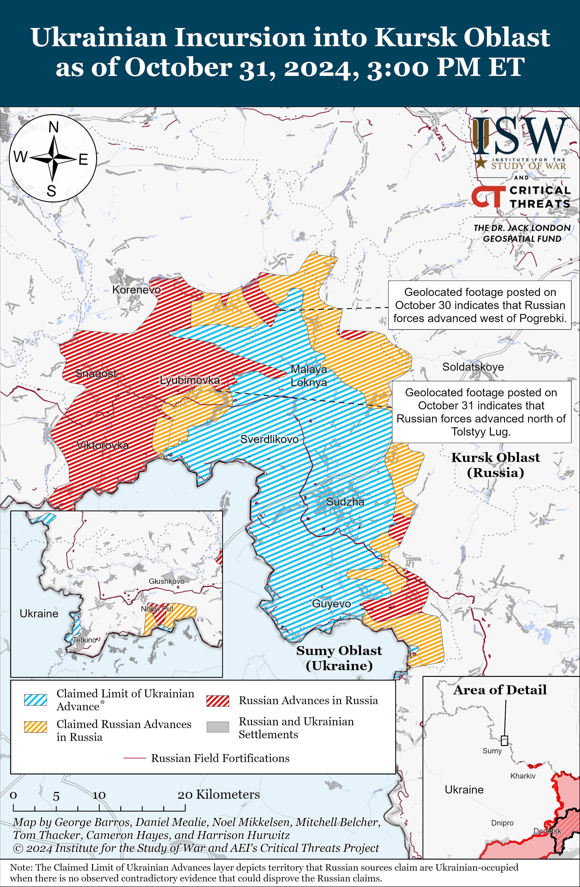
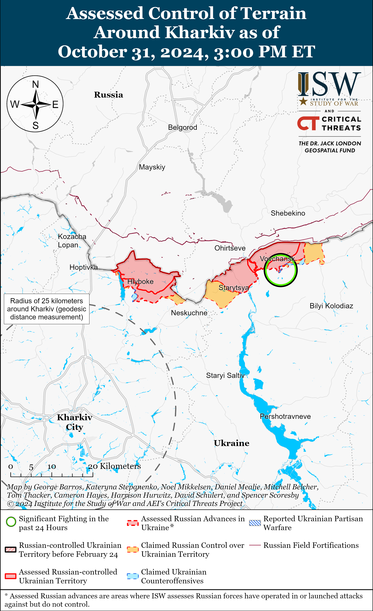
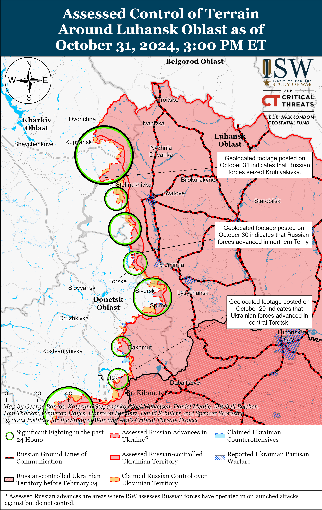
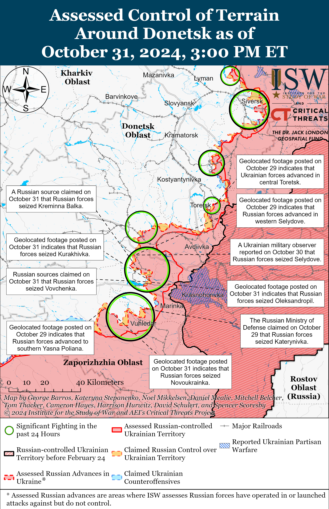
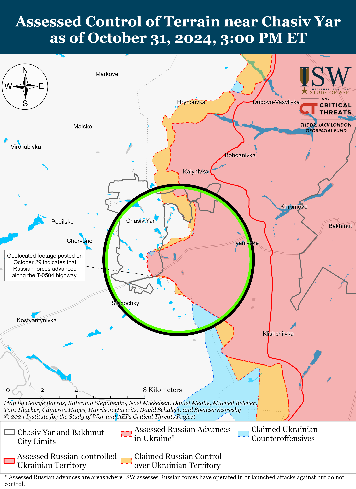
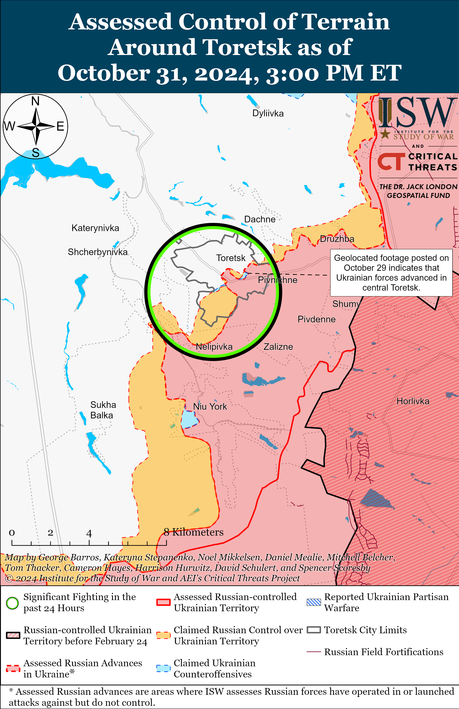
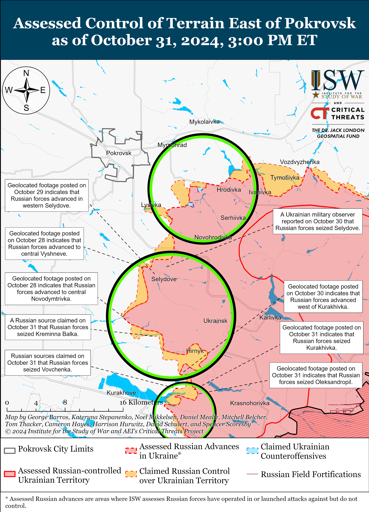
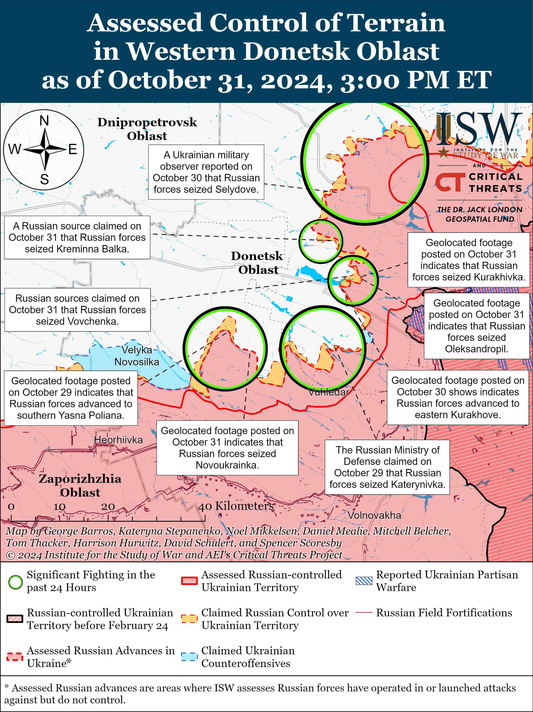
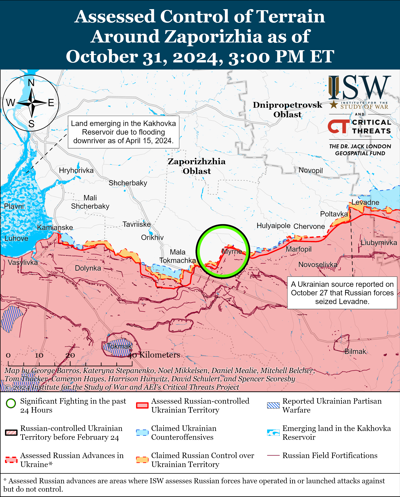
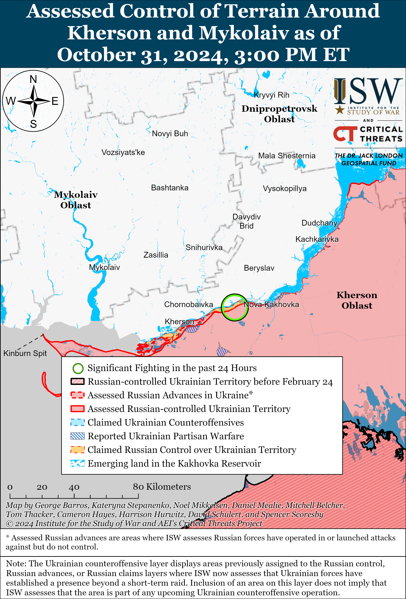

# Russian Offensive Campaign Assessment, October 31, 2024

**October 31, 2024, 6:50pm ET**

**Click** [**here**](https://storymaps.arcgis.com/stories/36a7f6a6f5a9448496de641cf64bd375) **to see ISW’s interactive map of the Russian invasion of Ukraine. This map is updated daily alongside the static maps present in this report.**

**Click** [**here**](https://storymaps.arcgis.com/stories/83a2f24901c941d581c0c523ecd2619b) **to see ISW's interactive map of Ukraine's offensive in Kursk Oblast.**

**Click** [**here**](https://understandingwar.maps.arcgis.com/apps/instant/3dviewer/index.html?appid=1602762dbcde419bb957dea358449580) **to see ISW’s 3D control of terrain topographic map of Ukraine. Use of a computer (not a mobile device) is strongly recommended for using this data-heavy tool.**

**Click** [**here**](https://storymaps.arcgis.com/stories/733fe90805894bfc8562d90b106aa895) **to access ISW’s archive of interactive time-lapse maps of the Russian invasion of Ukraine. These maps complement the static control-of-terrain map that ISW produces daily by showing a dynamic frontline. ISW will update this time-lapse map archive monthly.**

**Note: The data cut-off for this product was 1:00pm ET on October 31. ISW will cover subsequent reports in the November 1 Russian Offensive Campaign Assessment.**

**North Korea and Russia signed an agreement on October 30 to cooperate in the sphere of digital communications — the latest development in Russian-North Korean cooperation likely aimed at enhancing the Kremlin's digital authoritarianism tools to increase domestic repressions.** The North Korean Ministry of Information Technology and the Russian Ministry of Digital Development, Communications, and Mass Media signed a cooperation agreement on October 30 that includes cooperation in the fields of communications, information technology, and digital development.[[1]](#_edne8f247c1f45d9a26ddd27f900df4b9b41) Russia and North Korea signed an agreement on joint work between the Russian and North Korean prosecutor generals' offices in July 2024, after which Russian Prosecutor General Igor Krasnov stated that Russia wanted to learn about North Korean judicial practice, particularly in the spheres of communication and information technology.[[2]](#_edne8f247c1f45d9a26ddd27f900df4b9b42) ISW previously assessed that the North Korean-Russian judicial agreement was likely part of Kremlin efforts to increase Russia's arsenal of domestic control methods and consolidate control over the Russian information space, including via messaging platforms and virtual private network (VPN) services.[[3]](#_edne8f247c1f45d9a26ddd27f900df4b9b43) The details of the October 30 digital communications agreement are unclear, but it is likely similarly aimed at increasing Russia's tools for domestic information space repression.

**The South Korean government reportedly intends to send an unspecified number of South Korean personnel to Ukraine to monitor North Korean troops.** South Korean newspaper *Hankyoreh* reported on October 31 that a senior South Korean presidential office official stated on October 30 that South Korea has a "legitimate need" to analyze North Korean military activities in the war in Ukraine and "feels the need" to establish a team to monitor North Korean troops and the battlefield situation.[[4]](#_edne8f247c1f45d9a26ddd27f900df4b9b44) South Korean Defense Minister Kim Yong-hyun reportedly stated on October 31 that the South Korean defense minister can make the decision about the monitoring team's deployment without parliamentary approval. South Korea's *Yonhap News Agency* reported on October 22 that a South Korean government source stated that South Korea was considering sending South Korean military personnel, likely from intelligence units, to Ukraine to monitor North Korean forces' tactics and combat capabilities and to question captured North Koreans.[[5]](#_edne8f247c1f45d9a26ddd27f900df4b9b45) Ukrainian President Volodymyr Zelensky stated on October 29 that he discussed enhanced intelligence cooperation with South Korean President Yoon Suk Yeol.[[6]](#_edne8f247c1f45d9a26ddd27f900df4b9b46)

Ukrainian Center for Countering Disinformation Head Andriy Kovalenko reported on October 31 that 3,000 North Korean military personnel are in Kursk Oblast and that "separate" North Korean engineers are also present in occupied Donetsk Oblast.[[7]](#_edne8f247c1f45d9a26ddd27f900df4b9b47) Western intelligence officials reportedly told CNN on October 30 that a small number of North Korean personnel are in occupied Ukraine but did not specify their locations, and Ukrainian and South Korean officials reported in early October 2024 that a limited number of North Korean personnel, mainly engineering personnel, were in occupied Donetsk City.[[8]](#_edne8f247c1f45d9a26ddd27f900df4b9b48) Kovalenko's October 31 statement clarifies that North Korean personnel are reportedly in more than one location in the combat zone.

**Russian President Vladimir Putin continues to communicate that he is uninterested in a negotiated ceasefire and is committed to achieving his goal of destroying Ukrainian statehood.** *Bloomberg* reported on October 30 that Serbian President Alexander Vucic spoke with Putin in early October 2024 for the first time in two and a half years.[[9]](#_edne8f247c1f45d9a26ddd27f900df4b9b49) Vucic told *Bloomberg* that he brought up the subject of a ceasefire in Ukraine, to which Putin responded that Russia will fulfill all the goals of its "special miliary operation" in Ukraine, which ISW continues to assess are tantamount to the destruction of Ukrainian statehood and government.[[10]](#_edne8f247c1f45d9a26ddd27f900df4b9b410) Putin outright rejected any negotiated ceasefire during a press conference with Hungarian Prime Minister Viktor Orban on July 5, claiming that a ceasefire would allow Ukraine to regroup and rearm.[[11]](#_edne8f247c1f45d9a26ddd27f900df4b9b411) A negotiated ceasefire on current lines and under current circumstances will only benefit Russia and will afford the Kremlin time to further radicalize and militarize Russian society against Ukraine and the Russian military time to rest and reconstitute, likely before conducting a future attack on Ukraine.

**Ukraine's Western partners continue to provide military aid to Ukraine and ensure future aid provisions over the long-term.** United Kingdom (UK) Chancellor of the Exchequer Rachel Reeves stated on October 30 that the UK Ministry of Defense (MoD) budget for 2025 will ensure that the UK can provide three billion pounds ($3.87 billion) of "guaranteed" military support to Ukraine per year "for as long as it takes."[[12]](#_edne8f247c1f45d9a26ddd27f900df4b9b412) Norway announced on October 29 a new military aid package worth 500 million euros ($544 million) for Ukraine, including weapons and spare parts for F-16 fighter jets and NASAMS air defense systems.[[13]](#_edne8f247c1f45d9a26ddd27f900df4b9b413) Lithuania announced on October 30 that it will deliver unspecified ammunition, mortar rounds, and electricity generators to Ukraine this week (the week of October 27 through November 2).[[14]](#_edne8f247c1f45d9a26ddd27f900df4b9b414)

**The Russian military command continues to commit seriously wounded personnel to highly attritional infantry-led “meat” assaults in the Kurakhove direction as Russian President Vladimir Putin attempts to posture himself as deeply concerned with the medical treatment of Russian veterans.** A former Russian Storm-Z instructor and milblogger amplified reports accusing the Russian military command of committing wounded personnel of a medical company belonging to the 57th Motorized Rifle Regiment (20th Motorized Rifle Division, 8th Combined Arms Army [CAA], Southern Military District [SMD]) to the frontlines in the Kurakhove direction.[[15]](#_edne8f247c1f45d9a26ddd27f900df4b9b415) The milblogger summarized that the Russian military command failed to provide adequate medical treatment to the wounded  personnel and instead held them hostage in a “medical basement.” The Russian military command reportedly demanded bribes of 1.5 million rubles ($15,459) to release the wounded personnel from the basement and claimed that there are not enough people to support assault operations in the Kurakhove direction.[[16]](#_edne8f247c1f45d9a26ddd27f900df4b9b416) The milblogger noted that the Russian military command transferred wounded personnel to the frontlines to fight as part of assault companies. The milblogger stated that although Russian officials immediately responded to these complaints, closed the "medical basement," and transferred the remaining wounded personnel to hospitals, the practice of detaining wounded personnel in "medical basements" persists among other Russian military units that are fighting on different sectors of the front, such as the Russian 109th Rifle Regiment (132nd Motorized Rifle Brigade, 51st CAA, formerly 1st Donetsk People's Republic Army Corps [DNR AC]) operating in the Toretsk direction. The milblogger emphasized that the Russian military command is committing wounded personnel and specialists to assaults because it relies on "meat" assaults to sustain the tempo of Russian advances, resulting in heavy Russian manpower losses. Putin highlighted during a meeting with the Russian government on October 31 that he recently met with disabled Russian veterans who told Putin they were satisfied with government care and benefits, but tasked the Russian Ministry of Defense (MoD) and Presidential Administration to increase government support for disabled veterans, stating that government efforts in this sphere are "not enough."[[17]](#_edne8f247c1f45d9a26ddd27f900df4b9b417)

**The Moldovan Constitutional Court confirmed on October 31 the passing of the October 20 European Union (EU) referendum with a 50.72 percent turnout rate.[[18]](#_edne8f247c1f45d9a26ddd27f900df4b9b418)**

**Key Takeaways:**

- **North Korea and Russia signed an agreement on October 30 to cooperate in the sphere of digital communications — the latest development in Russian-North Korean cooperation likely aimed at enhancing the Kremlin's digital authoritarianism tools to increase domestic repressions.**
- **The South Korean government reportedly intends to send an unspecified number of South Korean personnel to Ukraine to monitor North Korean troops.**
- **Russian President Vladimir Putin continues to communicate that he is uninterested in a negotiated ceasefire and is committed to achieving his goal of destroying Ukrainian statehood.**
- **Ukraine's Western partners continue to provide military aid to Ukraine and ensure future aid provisions over the long-term.**
- **The Russian military command continues to commit seriously wounded personnel to highly attritional infantry-led “meat” assaults in the Kurakhove direction as Russian President Vladimir Putin attempts to posture himself as deeply concerned with the medical treatment of Russian veterans.**
- **The Moldovan Constitutional Court confirmed on October 31 the passing of the October 20 European Union (EU) referendum with a 50.72 percent turnout rate.**
- **Russian forces recently advanced near Kupyansk, Svatove, Pokrovsk, Kurakhove, and Vuhledar, and Ukrainian forces recently regained lost positions near Kurakhove.**

****

***We do not report in detail on Russian war crimes because these activities are well-covered in Western media and do not directly affect the military operations we are assessing and forecasting. We will continue to evaluate and report on the effects of these criminal activities on the Ukrainian military and the Ukrainian population and specifically on combat in Ukrainian urban areas. We utterly condemn Russian violations of the laws of armed conflict and the Geneva Conventions and crimes against humanity even though we do not describe them in these reports.***

- Ukrainian Operations in the Russian Federation
- Russian Main Effort – Eastern Ukraine (comprised of three subordinate main efforts)
- Russian Subordinate Main Effort #1 – Push Ukrainian forces back from the international border with Belgorod Oblast and approach to within tube artillery range of Kharkiv City
- Russian Subordinate Main Effort #2 – Capture the remainder of Luhansk Oblast and push westward into eastern Kharkiv Oblast and encircle northern Donetsk Oblast
- Russian Subordinate Main Effort #3 – Capture the entirety of Donetsk Oblast
- Russian Supporting Effort – Southern Axis
- Russian Air, Missile, and Drone Campaign
- Russian Mobilization and Force Generation Efforts
- Russian Technological Adaptations
- Activities in Russian-occupied areas
- Significant Activity in Belarus

**Ukrainian Operations in the Russian Federation**

Russian forces recently launched two mechanized counterattacks that resulted in marginal confirmed gains in the Ukrainian salient in Kursk Oblast. Geolocated footage published on October 30 showed Ukrainian forces repelling a Russian platoon-sized mechanized assault west of Pogrebki (northwest of Sudzha), indicating that Russian forces recently marginally advanced in the area.[[19]](#_edne8f247c1f45d9a26ddd27f900df4b9b419) Additional geolocated footage published on October 31 showed that elements of the Russian 83rd Separate Airborne (VDV) Brigade and the 155th Naval Infantry Brigade (Pacific Fleet, Eastern Military District [EMD]) launched a counterattack east of Lyubimovka (southeast of Korenevo) and marginally advanced in the area.[[20]](#_edne8f247c1f45d9a26ddd27f900df4b9b420) One Russian milblogger claimed that elements of the Russian 137th VDV Regiment (106th VDV Division) seized Lyubimovka, but other milbloggers claimed that battles are continuing in the area and that Ukrainian forces maintain limited positions near Lyubimovka and south of Olgovka (east of Korenevo).[[21]](#_edne8f247c1f45d9a26ddd27f900df4b9b421) Russian and Ukrainian forces continued combat engagements west of the Kursk Oblast salient near Novy Put; south of Korenevo near Darino; northeast of Sudzha near Martynovka; southeast of Korenevo near Novoivanovka and Zeleny Shlyakh; and southeast of Sudzha near Plekhovo.[[22]](#_edne8f247c1f45d9a26ddd27f900df4b9b422) Elements of the Russian 106th VDV Division and 56th VDV Regiment (7th VDV Division) are reportedly operating in Glushkovsky Raion (west of the Kursk Oblast salient).[[23]](#_edne8f247c1f45d9a26ddd27f900df4b9b423)

The Russian military command is reportedly ordering Russian forces into launching frontal assaults in the Kursk direction, resulting in heavy casualties. Seven servicemembers of the Russian 382nd Naval Infantry Battalion (810th Naval Infantry Brigade, Black Sea Fleet, Southern Military District [SMD]) published a video appeal on October 27 accusing the Russian military command of committing the battalion to costly frontal assaults in Kursk Oblast. The servicemembers announced that they will not return to the frontlines and noted that the battalion lost two of its four assault groups in combat.[[24]](#_edne8f247c1f45d9a26ddd27f900df4b9b424)

**Russian Main Effort – Eastern Ukraine**

**Russian Subordinate Main Effort #1 – Kharkiv Oblast** **(Russian objective: Push Ukrainian forces back from the international border with Belgorod Oblast and approach to within tube artillery range of Kharkiv City)**

Russian forces continued limited offensive operations northeast of Kharkiv City near Vovchansk on October 30 and 31 but did not advance.[[25]](#_edne8f247c1f45d9a26ddd27f900df4b9b425)

The spokesperson of a Ukrainian brigade operating in the Kharkiv direction stated on October 31 that Ukrainian forces are successfully defending against small-scale Russian infantry assaults in the Kharkiv direction and that Russian forces are using motorcycles, buggies, all-terrain vehicles (ATVs), and other unarmored vehicles to conduct these assaults.[[26]](#_edne8f247c1f45d9a26ddd27f900df4b9b426) A Russian milblogger claimed that Ukrainian forces are counterattacking near Hlyboke (north of Kharkiv City).[[27]](#_edne8f247c1f45d9a26ddd27f900df4b9b427) Drone operators of the Russian "Enot" drone detachment of the 136th Motorized Rifle Brigade (58th Combined Arms Army [CAA], Southern Military District [SMD]) are reportedly operating in the Vovchansk direction.[[28]](#_edne8f247c1f45d9a26ddd27f900df4b9b428)

**Russian Subordinate Main Effort #2 – Luhansk Oblast** **(Russian objective: Capture the remainder of Luhansk Oblast and push westward into eastern Kharkiv Oblast and northern Donetsk Oblast)**

Russian forces recently advanced southeast of Kupyansk and west of Svatove amid continued offensive operations along the Kupyansk-Svatove-Kreminna line on October 31. Geolocated footage published on October 31 indicates that Russian forces recently advanced west of Stelmakhivka (west of Svatove).[[29]](#_edne8f247c1f45d9a26ddd27f900df4b9b429) Additional geolocated footage published on October 31 indicates that elements of the Russian 2nd Motorized Rifle Division (1st Guards Tank Army [GTA], Moscow Military District [MMD]) recently advanced in northern Kruhlyakivka (southeast of Kupyansk) and have likely seized the settlement.[[30]](#_edne8f247c1f45d9a26ddd27f900df4b9b430) Russian milbloggers claimed on October 30 and 31 that elements of the Russian 27th Motorized Rifle Brigade (1st GTA, MMD) advanced west from Stelmakhivka and reached the administrative boundary of Luhansk Oblast, but ISW has not observed confirmation of this claim.[[31]](#_edne8f247c1f45d9a26ddd27f900df4b9b431) Russian sources claimed on October 30 and 31 that Russian forces advanced north of Kupyansk; 500 meters in depth near Synkivka (northeast of Kupyansk); near Petropavlivka (northeast of Kupyansk); towards Kolisnykivka (southeast of Kupyansk), near Pershotravneve (west of Svatove), and into the northern outskirts of Terny (northwest of Kreminna) and are preparing to advance south into Zahryzove (northwest of Svatove).[[32]](#_edne8f247c1f45d9a26ddd27f900df4b9b432)  ISW has not observed visual evidence confirming these claims, however. The Ukrainian General Staff reported that Russian forces continued offensive operations northwest of Kupyansk near Kindrashivka; northeast of Kupyansk near Synkivka, Petropavlivka, and Pershotravneve; east of Kupyansk near Pishchane; southeast of Kupyansk near Novoosynove, Kolisnykivka, Kruhlyakivka, and Zahryzove; northwest of Svatove near Berestove, Katerynivka, Bohuslavka, and Lozova; west of Svatove near Stepova Novoselivka, Vyshneve, and Zelenyi Hai; southwest of Svatove near Druzhelyubivka and Hrekivka; northwest of Kreminna near Terny; west of Kreminna near Zarichne; and southwest of Kreminna near the Serebryanske forest area. [[33]](#_edne8f247c1f45d9a26ddd27f900df4b9b433) A Russian milblogger stated on October 31 that Russian forces are anticipating a Ukrainian counterattack in the Kupyansk direction in the near future.[[34]](#_edne8f247c1f45d9a26ddd27f900df4b9b434) Elements of the Russian 403rd Motorized Regiment (likely a mobilized regiment) are reportedly operating near Lozova.[[35]](#_edne8f247c1f45d9a26ddd27f900df4b9b435)

**Russian Subordinate Main Effort #3 – Donetsk Oblast** **(Russian objective: Capture the entirety of Donetsk Oblast, the claimed territory of Russia’s proxies in Donbas)**

Russian forces continued offensive operations northeast of Siversk near Bilohorivka and east of Siversk near Verkhnokamyanske on October 30 and 31 but did not advance.[[36]](#_edne8f247c1f45d9a26ddd27f900df4b9b436) Elements of the Russian 85th Motorized Rifle Brigade (3rd Combined Arms Army [CAA], formerly 2nd Luhansk People's Republic [LNR] Army Corps [AC]) are reportedly operating near Vasyukivka (southeast of Siversk).[[37]](#_edne8f247c1f45d9a26ddd27f900df4b9b437)

Russian forces continued offensive operations near Chasiv Yar, including within Zhovtnevyi Microraion in eastern Chasiv Yar, on October 30 and 31 but did not make any confirmed advances.[[38]](#_edne8f247c1f45d9a26ddd27f900df4b9b438) Russian milbloggers claimed that Russian forces advanced along the T0504 Bakhmut-Kostyantynivka highway south of Chasiv Yar and two kilometers east of Stupochky (south of Chasiv Yar), but ISW has not observed confirmation of these claims.[[39]](#_edne8f247c1f45d9a26ddd27f900df4b9b439) The spokesperson of a Ukrainian brigade operating near Chasiv Yar reported on October 31 that small Russian infantry groups sometimes cross the Siverskyi-Donets Donbas Canal but are unable to advance significantly due to Ukrainian strikes.[[40]](#_edne8f247c1f45d9a26ddd27f900df4b9b440) A Russian milblogger noted that rainy weather near Chasiv Yar has turned the ground into "impassable mud."[[41]](#_edne8f247c1f45d9a26ddd27f900df4b9b441) Elements of the Russian 98th Airborne (VDV) Division are reportedly operating near Chasiv Yar.[[42]](#_edne8f247c1f45d9a26ddd27f900df4b9b442)

Russian forces continued offensive operations near Toretsk on October 31 but did not advance.[[43]](#_edne8f247c1f45d9a26ddd27f900df4b9b443)Ukrainian Luhansk Group of Forces Spokesperson Major Anastasiya Bobovnikova reported on October 31 that Russian forces have decreased the tempo of their assaults in Toretsk but have not decreased their artillery and air strikes.[[44]](#_edne8f247c1f45d9a26ddd27f900df4b9b444) Bobovnikova stated that Russian airstrikes are inaccurate and sometimes inflict friendly fire. Elements of the Russian "Sparta" Separate Reconnaissance Battalion (51st CAA, formerly 1st Donetsk People's Republic [DNR] AC) are reportedly operating in the Toretsk direction.[[45]](#_edne8f247c1f45d9a26ddd27f900df4b9b445)

Russian forces marginally advanced east and southeast of Pokrovsk amid continued Russian offensive operations on October 30 and 31. Geolocated footage published on October 31 indicates that Russian forces recently advanced south of Novotoretske (east of Pokrovsk) and northwest of Selydove (southeast of Pokrovsk).[[46]](#_edne8f247c1f45d9a26ddd27f900df4b9b446) Russian forces continued to attack east of Pokrovsk near Myrolyubivka, Myrnohrad, and Promin; south of Pokrovsk in the direction of Novooleksiivka and Hryhorivka; and southeast of Pokrovsk near Lysivka, Sukhyi Yar, Novohrodivka, Vyshneve, Krutyi Yar, Mykolaivka, and Selydove.[[47]](#_edne8f247c1f45d9a26ddd27f900df4b9b447) A spokesperson for a Ukrainian Brigade operating in the Pokrovsk direction reported that Russian forces began to use buggies to transport infantry for assaults and that elements of the Russian 74th Motorized Rifle Brigade (41st CAA, Central Military District [CMD]) and three other motorized rifle brigades are operating in the Ukrainian brigade’s area of responsibility.[[48]](#_edne8f247c1f45d9a26ddd27f900df4b9b448) Pokrovsk City Military Administration Head Serhiy Dobryak reported that Ukrainian authorities are blocking some areas of the city to prepare defenses and noted that Ukrainian forces have been constructing echeloned defenses in Pokrovsk from 2022.[[49]](#_edne8f247c1f45d9a26ddd27f900df4b9b449)

Ukrainian and Russian forces recently advanced northeast and southeast of Kurakhove amid continued fighting in the Kurakhove direction on October 31. Geolocated footage published on October 31 indicates that Ukrainian forces recently regained positions in a forested area southwest of Pobieda (southeast of Kurakhove).[[50]](#_edne8f247c1f45d9a26ddd27f900df4b9b450) Additional geolocated footage published on October 31 indicates that elements of the Russian 114th Motorized Rifle Brigade (51st CAA) advanced to the southwestern administrative boundaries of Kurakhivka (northeast of Kurkahove) and have likely seized the settlement.[[51]](#_edne8f247c1f45d9a26ddd27f900df4b9b451) Russian milbloggers claimed that Russian forces also seized Vovchenka (just southwest of Kurakhivka), although a Kremlin-affiliated Russian milblogger claimed that Ukrainian forces maintain positions in the settlement.[[52]](#_edne8f247c1f45d9a26ddd27f900df4b9b452) Russian milbloggers also claimed that a Russian armored assault group seized positions on the outskirts of Kurakhove and advanced near Novodmytrivka, Kreminna Balka, and Voznesenka (all north of Kurakhove); southwest of Hirnyk; west of Okelsandropil (both northeast of Kurakhove); and west of Pobieda (southeast of Kurakhove).[[53]](#_edne8f247c1f45d9a26ddd27f900df4b9b453) ISW has not observed confirmation of these claims, however. Russian forces continued offensive operations north of Kurakhove near Novoselydivka, Novodmytrivka, Kreminna Balka, and Illinka; northeast of Kurakhove near Kurakhivka, Voznesenka, Ostrivka and Hostre; and east of Kurakhove near Maksymilyanivka on October 30 and 31.[[54]](#_edne8f247c1f45d9a26ddd27f900df4b9b454)

Russian forces likely seized Novoukrainka (northwest of Vuhledar) amid continued offensive operations in the Vuhledar direction on October 31. Geolocated footage published on October 31 indicates that elements of the Russian 40th Naval Infantry Brigade (Pacific Fleet, Eastern Military District [EMD]) recently advanced into central Novoukrainka and likely seized the settlement.[[55]](#_edne8f247c1f45d9a26ddd27f900df4b9b455) Russian sources, including the Russian Ministry of Defense (MoD), claimed that Russian forces operating northwest of Vuhledar seized Yasna Polyana and that Russian forces advanced north of Bohoyavlenka (north of Vuhledar).[[56]](#_edne8f247c1f45d9a26ddd27f900df4b9b456) A Russian milblogger also claimed that Russian forces advanced into Trudove (north of Bohoyavlenka).[[57]](#_edne8f247c1f45d9a26ddd27f900df4b9b457) ISW has not observed confirmation of these claims, however. Russian forces continued assaults northeast of Vuhledar near Katerynivka, Yelyzavetivka, Dalne, and Antonivka; north of Vuhledar near Bohoyavlenka; and northwest of Vuhledar near Novoukrainka, Trudove, and Maksymivka on October 30 and 31.[[58]](#_edne8f247c1f45d9a26ddd27f900df4b9b458)

Russian and Ukrainian sources did not report any combat engagements in the Donetsk-Zaporizhia Oblast border area on October 30 and 31.

**Russian Supporting Effort – Southern Axis** **(Russian objective: Maintain frontline positions and secure rear areas against Ukrainian strikes)**

Russian forces continued assaults in western Zaporizhia Oblast on October 30 and 31 but did not make any confirmed gains. Russian forces continued assaults northeast of Robotyne near Charivne and north of Robotyne near Novodanylivka.[[59]](#_edne8f247c1f45d9a26ddd27f900df4b9b459) Drone operators of the Russian 38th Motorized Rifle Brigade (35th Combined Arms Army [CAA], Eastern Military District [EMD]) are reportedly operating in the Polohy direction (east of Robotyne).[[60]](#_edne8f247c1f45d9a26ddd27f900df4b9b460) An artillery battalion of the Russian 4th Military Base (58th Combined Arms Army, Southern Military District [SMD]) and elements of the Russian 7th Airborne Assault (VDV) Division are reportedly operating in the Zaporizhia direction.[[61]](#_edne8f247c1f45d9a26ddd27f900df4b9b461)

Berdyansk City occupation officials and Ukrainian sources reported that Ukrainian drones struck the port in Berdyansk and damaged surrounding buildings on October 31.[[62]](#_edne8f247c1f45d9a26ddd27f900df4b9b462)

The Ukrainian General Staff reported that Russian forces continued ground attacks in the Dnipro (Kherson) direction, likely referring to the east (left) bank Kherson Oblast and the islands of the Dnipro River Delta, on October 31.[[63]](#_edne8f247c1f45d9a26ddd27f900df4b9b463)

**Russian Air, Missile, and Drone Campaign** **(Russian Objective: Target Ukrainian military and civilian infrastructure in the rear and on the frontline)**

Russian forces conducted a series of drone and missile strikes against Ukraine on the night of October 30 to 31. The Ukrainian Air Force reported on October 31 that Russian forces launched four Iskander-M/KN-23 ballistic missiles from Rostov Oblast and occupied Crimea; eight Kh-59/69 cruise missiles from aircraft over the Black Sea; and 43 drones (including Shaheds and unspecified drone models) from Kursk and Oryol oblasts.[[64]](#_edne8f247c1f45d9a26ddd27f900df4b9b464) The Ukrainian Air Force reported that Russian missiles targeted a rail bridge across the Dniester Estuary in Zatoka, Odesa Oblast and unspecified targets in Kramatorsk, Donetsk Oblast. The Ukrainian Air Force reported that Ukrainian forces shot down 17 drones and two Kh-59/69 missiles over Odesa, Kyiv, Cherkasy, Kirovohrad, Kharkiv, Zaporizhia, Dnipropetrovsk, Donetsk, and Poltava oblasts as of 0800 local time; that 23 drones were "locally lost," likely due to electronic warfare (EW) interference; and that three drones flew back to Russian-controlled airspace. Cherkasy Oblast Military Administration Head Ihor Taburets reported on October 31 that Russian strikes damaged civilian enterprises in Cherkasy Oblast.[[65]](#_edne8f247c1f45d9a26ddd27f900df4b9b465) Ukrainian sources reported on October 31 that Russian drone debris fell in a field and started a fire in Podilskyi Raion, Kyiv Oblast.[[66]](#_edne8f247c1f45d9a26ddd27f900df4b9b466) Ukrainian officials reported on October 30 and 31 that Russian forces struck a nine-story residential building in Saltivskyi Raion, Kharkiv City with a FAB-500 glide bomb with unified planning and correction module (UMPC) and conducted two glide bomb strikes on a field in Odnorobivka, Kharkiv Oblast.[[67]](#_edne8f247c1f45d9a26ddd27f900df4b9b467) Kharkiv Oblast officials reported that the Russian strike on Saltivskyi Raion killed at least two people and injured 34.[[68]](#_edne8f247c1f45d9a26ddd27f900df4b9b468)

**Russian Mobilization and Force Generation Efforts** **(Russian objective: Expand combat power without conducting general mobilization)**

The Kremlin continues efforts to reintegrate Russian combat veterans into society upon their return to Russia. Russian Prime Minister Mikhail Mishustin stated on October 31 that Russian servicemembers fighting in the war in Ukraine will retain the jobs they previously held before entering military service.[[69]](#_edne8f247c1f45d9a26ddd27f900df4b9b469) Mishustin stated that this will allow Russian veterans to not "waste time" on searching for new employment after the completion of their military contract.

Russian federal subjects continue to increase financial incentives aimed at boosting Russian military recruitment. Samara Oblast authorities increased the payment to citizens who help recruit people who sign military contracts to 100,000 rubles ($1,026).[[70]](#_edne8f247c1f45d9a26ddd27f900df4b9b470) Russian business outlet *Kommersant* noted that the payment for recruiters in Samara Oblast was 15,000 rubles ($154) at the start of October 2024 but that it is unknown if these increased payments are actually leading to increased recruitment rates.

**Russian Technological Adaptations** **(Russian objective: Introduce technological innovations to optimize systems for use in Ukraine)**

Russian forces are reportedly starting to use Shahed-136 drones with thermobaric warheads. The Kyiv Scientific Research Institute of Forensic Expertise reported on October 29 that debris of Shahed-136 drones that Russian forces used in strike series from October 26 to 29 showed that Russian forces had modified the drones to include thermobaric warheads.[[71]](#_edne8f247c1f45d9a26ddd27f900df4b9b471)

Roselectronics, a subsidiary of Russian state defense conglomerate Rostec, claimed on October 30 that it developed a radar-absorbing coating for Russian TOS-1A thermobaric artillery systems that will render the system "invisible" to modern guidance systems and thermal imagers.[[72]](#_edne8f247c1f45d9a26ddd27f900df4b9b472)

**Activities in Russian-occupied areas** **(Russian objective: Consolidate administrative control of annexed areas; forcibly integrate Ukrainian citizens into Russian sociocultural, economic, military, and governance systems)**

*ISW is not publishing reporting on activities in Russian-occupied areas today.*

**Significant activity in Belarus** **(Russian efforts to increase its military presence in Belarus and further integrate Belarus into Russian-favorable frameworks and Wagner Group activity in Belarus)**

Russian Foreign Minister Sergei Lavrov met on October 31 with Belarusian Foreign Minister Maxim Ryzhenkov on the sidelines of the Second International Conference on Eurasian Security in Minsk and discussed deepening integration processes within the Union State, including in the fields of defense and security.[[73]](#_edne8f247c1f45d9a26ddd27f900df4b9b473)

**Note: ISW does not receive any classified material from any source, uses only publicly available information, and draws extensively on Russian, Ukrainian, and Western reporting and social media as well as commercially available satellite imagery and other geospatial data as the basis for these reports. References to all sources used are provided in the endnotes of each update.**

---

[[1]](#_edne8f247c1f45d9a26ddd27f900df4b9b4ref1) <https://tass> dot ru/politika/22275221

[[2]](#_edne8f247c1f45d9a26ddd27f900df4b9b4ref2) https://www.understandingwar.org/backgrounder/russian-offensive-campaign-assessment-july-22-2024

[[3]](#_edne8f247c1f45d9a26ddd27f900df4b9b4ref3) https://www.understandingwar.org/backgrounder/russian-offensive-campaign-assessment-july-22-2024

[[4]](#_edne8f247c1f45d9a26ddd27f900df4b9b4ref4) [https://english.hani.co](https://english.hani.co/) dot kr/arti/english\_edition/e\_international/1165284.html

[[5]](#_edne8f247c1f45d9a26ddd27f900df4b9b4ref5) https://isw.pub/UkrWar102224

[[6]](#_edne8f247c1f45d9a26ddd27f900df4b9b4ref6) https://isw.pub/UkrWar103024

[[7]](#_edne8f247c1f45d9a26ddd27f900df4b9b4ref7) https://t.me/akovalenko1989/8209

[[8]](#_edne8f247c1f45d9a26ddd27f900df4b9b4ref8) https://isw.pub/UkrWar103024

[[9]](#_edne8f247c1f45d9a26ddd27f900df4b9b4ref9) https://www.bloomberg.com/news/articles/2024-10-30/serb-leader-says-us-needs-to-push-hard-for-truce-in-ukraine

[[10]](#_edne8f247c1f45d9a26ddd27f900df4b9b4ref10) <https://www.bloomberg.com/news/articles/2024-10-30/serb-leader-says-us-needs-to-push-hard-for-truce-in-ukraine>; https://isw.pub/UkrWar122823; https://isw.pub/UkrWar122323; https://isw.pub/UkrWar121423

[[11]](#_edne8f247c1f45d9a26ddd27f900df4b9b4ref11) https://understandingwar.org/backgrounder/russian-offensive-campaign-assessment-july-5-2024

[[12]](#_edne8f247c1f45d9a26ddd27f900df4b9b4ref12) https://www.gov.uk/government/speeches/autumn-budget-2024-speech

[[13]](#_edne8f247c1f45d9a26ddd27f900df4b9b4ref13) https://t.me/ministry\_of\_defense\_ua/10819  ; <https://euromaidanpress> dot com/2024/10/31/norways-e-500-million-military-aid-package-to-ukraine-to-include-nasams-not-only-f-16s/; <https://mil> dot in.ua/en/news/norway-allocates-e350-million-for-military-aid-to-ukraine/

[[14]](#_edne8f247c1f45d9a26ddd27f900df4b9b4ref14) <https://kam> dot lt/lietuva-perdave-ukrainai-generatoriu-minu-ir-kitos-paramos/

[[15]](#_edne8f247c1f45d9a26ddd27f900df4b9b4ref15) <https://t.me/philologist_zov/1655>; <https://t.me/soldat_prav/7633>; https://t.me/soldat\_prav/7608

[[16]](#_edne8f247c1f45d9a26ddd27f900df4b9b4ref16) https://t.me/soldat\_prav/7608

[[17]](#_edne8f247c1f45d9a26ddd27f900df4b9b4ref17) https://rg dot ru/2024/10/30/putin-s-podderzhkoj-uchastnikov-svo-invalidov-ochen-mnogo-problem.html; http://kremlin dot ru/events/president/news/75456

[[18]](#_edne8f247c1f45d9a26ddd27f900df4b9b4ref18) <https://www.ipn> dot md/en/constitutional-court-confirms-results-of-october-20-referendum-8013\_1108601.html

[[19]](#_edne8f247c1f45d9a26ddd27f900df4b9b4ref19) <https://x.com/giK1893/status/1851741909519339638>; <https://x.com/giK1893/status/1851741912492920924>; <https://t.me/dragons_group5/1779>

[[20]](#_edne8f247c1f45d9a26ddd27f900df4b9b4ref20) <https://x.com/moklasen/status/1852049963171352747>; <https://x.com/OSINTua/status/1852002752462803054>; <https://x.com/moklasen/status/1852051510894682429>; <https://x.com/moklasen/status/1852053423186952285>

[[21]](#_edne8f247c1f45d9a26ddd27f900df4b9b4ref21) <https://t.me/RVvoenkor/79761>; <https://t.me/rybar/64935;> <https://t.me/wargonzo/22891>; <https://t.me/motopatriot/29091?single> ; <https://t.me/DnevnikDesantnika/18307>

[[22]](#_edne8f247c1f45d9a26ddd27f900df4b9b4ref22) <https://t.me/mod_russia/45184>; <https://t.me/RVvoenkor/79761>; <https://t.me/rusich_army/18110;> <https://t.me/DnevnikDesantnika/18307;> https://t.me/sashakots/49873 ; <https://t.me/smotri_z/36195>; <https://t.me/dva_majors/56392>

[[23]](#_edne8f247c1f45d9a26ddd27f900df4b9b4ref23) <https://t.me/RVvoenkor/79771> ; <https://t.me/DnevnikDesantnika/18295;> <https://t.me/DnevnikDesantnika/18295>

[[24]](#_edne8f247c1f45d9a26ddd27f900df4b9b4ref24) https://t.me/philologist\_zov/1660

[[25]](#_edne8f247c1f45d9a26ddd27f900df4b9b4ref25)<https://www.facebook.com/GeneralStaff.ua/posts/pfbid0DBc37kL3uvqtBJRREVSxjBgJB7rj5P9AabHhWrL25bN5NyBZ8CKPp5PojaydiUwxl>  ; <https://www.facebook.com/GeneralStaff.ua/posts/pfbid0vFhJrLcDWhKxvS5m34HrDZnzyfx8AuchhtqzjRTDVrbMbNgMfC6qFiLaXB2BT8Rrl>  ;<https://www.facebook.com/GeneralStaff.ua/posts/pfbid02Pcr4awoyM6wDETScYWCZQkwzAa1oQUzoGcqUrkaMpx5bGwqX5pusvXEsz8NepV7Ll>

[[26]](#_edne8f247c1f45d9a26ddd27f900df4b9b4ref26) <https://armyinform> dot com.ua/2024/10/31/ataky-tehnikoyu-v-odyn-kinecz-rosiyany-shturmuyut-na-usomu-shho-maye-kolesa/

[[27]](#_edne8f247c1f45d9a26ddd27f900df4b9b4ref27) https://t.me/vysokygovorit/17803

[[28]](#_edne8f247c1f45d9a26ddd27f900df4b9b4ref28) <https://t.me/wargonzo/22901> ; <https://t.me/enotbpla/8>

[[29]](#_edne8f247c1f45d9a26ddd27f900df4b9b4ref29) <https://t.me/ceroki24/1063;> <https://t.me/creamy_caprice/7331>

[[30]](#_edne8f247c1f45d9a26ddd27f900df4b9b4ref30) <https://t.me/tass_agency/282737> ; <https://t.me/mod_russia/45177> ; <https://t.me/RVvoenkor/79779> ; <https://t.me/boris_rozhin/142815> ; <https://x.com/GeoConfirmed/status/1851977602312933766;> <https://x.com/GirkinGirkin/status/1851901457424937388>

[[31]](#_edne8f247c1f45d9a26ddd27f900df4b9b4ref31) <https://t.me/rybar/64936> ; <https://t.me/motopatriot/29091?single>

[[32]](#_edne8f247c1f45d9a26ddd27f900df4b9b4ref32) <https://t.me/DnevnikDesantnika/18318> ; <https://t.me/z_arhiv/29031> ; [https://t.me/dva\_majors/56392\](https://t.me/dva_majors/56392/) ;<https://t.me/z_arhiv/29044> ; <https://t.me/Sladkov_plus/11705> ; <https://t.me/z_arhiv/29053> ; <https://t.me/DnevnikDesantnika/18307> ; <https://t.me/motopatriot/29091?single> ; <https://t.me/motopatriot/29086> ; <https://t.me/boris_rozhin/142809>

[[33]](#_edne8f247c1f45d9a26ddd27f900df4b9b4ref33) <https://www.facebook.com/GeneralStaff.ua/posts/pfbid0DBc37kL3uvqtBJRREVSxjBgJB7rj5P9AabHhWrL25bN5NyBZ8CKPp5PojaydiUwxl%20>; <https://www.facebook.com/GeneralStaff.ua/posts/pfbid02Pcr4awoyM6wDETScYWCZQkwzAa1oQUzoGcqUrkaMpx5bGwqX5pusvXEsz8NepV7Ll> ; <https://www.facebook.com/GeneralStaff.ua/posts/pfbid0DBc37kL3uvqtBJRREVSxjBgJB7rj5P9AabHhWrL25bN5NyBZ8CKPp5PojaydiUwxl> ; <https://www.facebook.com/GeneralStaff.ua/posts/pfbid0vFhJrLcDWhKxvS5m34HrDZnzyfx8AuchhtqzjRTDVrbMbNgMfC6qFiLaXB2BT8Rrl> ; <https://www.facebook.com/GeneralStaff.ua/posts/pfbid02Pcr4awoyM6wDETScYWCZQkwzAa1oQUzoGcqUrkaMpx5bGwqX5pusvXEsz8NepV7Ll> ; <https://t.me/rusich_army/18095> ; <https://t.me/DnevnikDesantnika/18327>

[[34]](#_edne8f247c1f45d9a26ddd27f900df4b9b4ref34) https://t.me/DnevnikDesantnika/18335

[[35]](#_edne8f247c1f45d9a26ddd27f900df4b9b4ref35) <https://t.me/motopatriot/29091?single>

[[36]](#_edne8f247c1f45d9a26ddd27f900df4b9b4ref36) <https://www.facebook.com/GeneralStaff.ua/posts/pfbid0DBc37kL3uvqtBJRREVSxjBgJB7rj5P9AabHhWrL25bN5NyBZ8CKPp5PojaydiUwxl>; https://www.facebook.com/GeneralStaff.ua/posts/pfbid0vFhJrLcDWhKxvS5m34HrDZnzyfx8AuchhtqzjRTDVrbMbNgMfC6qFiLaXB2BT8Rrl

[[37]](#_edne8f247c1f45d9a26ddd27f900df4b9b4ref37) https://t.me/epoddubny/21492

[[38]](#_edne8f247c1f45d9a26ddd27f900df4b9b4ref38) <https://www.facebook.com/GeneralStaff.ua/posts/pfbid0DBc37kL3uvqtBJRREVSxjBgJB7rj5P9AabHhWrL25bN5NyBZ8CKPp5PojaydiUwxl>; <https://www.facebook.com/GeneralStaff.ua/posts/pfbid0vFhJrLcDWhKxvS5m34HrDZnzyfx8AuchhtqzjRTDVrbMbNgMfC6qFiLaXB2BT8Rrl>; <https://t.me/DnevnikDesantnika/18307>; <https://t.me/wargonzo/22891>; <https://t.me/motopatriot/29091>

[[39]](#_edne8f247c1f45d9a26ddd27f900df4b9b4ref39) <https://t.me/motopatriot/29091>; <https://t.me/DnevnikDesantnika/18307>; https://t.me/DnevnikDesantnika/18330

[[40]](#_edne8f247c1f45d9a26ddd27f900df4b9b4ref40) <https://armyinform> dot com.ua/2024/10/31/kanalizacziya-rosiyan-u-chasovomu-yaru-protyvnyk-masovo-gyne-namagayuchys-peretnuty-kanal/; https://www.youtube.com/watch?v=aDXWlQ2K0dM

[[41]](#_edne8f247c1f45d9a26ddd27f900df4b9b4ref41) https://t.me/wargonzo/22890

[[42]](#_edne8f247c1f45d9a26ddd27f900df4b9b4ref42) https://t.me/DnevnikDesantnika/18295

[[43]](#_edne8f247c1f45d9a26ddd27f900df4b9b4ref43) <https://www.facebook.com/GeneralStaff.ua/posts/pfbid02Pcr4awoyM6wDETScYWCZQkwzAa1oQUzoGcqUrkaMpx5bGwqX5pusvXEsz8NepV7Ll>; https://t.me/wargonzo/22891

[[44]](#_edne8f247c1f45d9a26ddd27f900df4b9b4ref44) <https://armyinform> dot com.ua/2024/10/31/bajduzhe-na-svoyih-bijcziv-ta-tehniku-aviacziya-okupantiv-demonstruye-druzhnij-vogon/; https://www.youtube.com/watch?v=j5TqaWCCdUg

[[45]](#_edne8f247c1f45d9a26ddd27f900df4b9b4ref45) https://t.me/wargonzo/22898

[[46]](#_edne8f247c1f45d9a26ddd27f900df4b9b4ref46) https://t.me/creamy\_caprice/7333;  <https://t.me/ghost_of_khortytsia/186>; https://t.me/ChervonaKalynaBrigade/1879; https://x.com/MikiValbuena/status/1851912448707592626; https://x.com/MikiValbuena/status/1851930477474554026

[[47]](#_edne8f247c1f45d9a26ddd27f900df4b9b4ref47) <https://www.facebook.com/GeneralStaff.ua/posts/pfbid0DBc37kL3uvqtBJRREVSxjBgJB7rj5P9AabHhWrL25bN5NyBZ8CKPp5PojaydiUwxl;> <https://www.facebook.com/GeneralStaff.ua/posts/pfbid0vFhJrLcDWhKxvS5m34HrDZnzyfx8AuchhtqzjRTDVrbMbNgMfC6qFiLaXB2BT8Rrl;> <https://www.facebook.com/GeneralStaff.ua/posts/pfbid02Pcr4awoyM6wDETScYWCZQkwzAa1oQUzoGcqUrkaMpx5bGwqX5pusvXEsz8NepV7Ll;> <https://t.me/motopatriot/29091?single;> <https://t.me/voenkorKotenok/59873;> <https://t.me/voenkorKotenok/59883;> <https://t.me/rybar/64960>

[[48]](#_edne8f247c1f45d9a26ddd27f900df4b9b4ref48) <https://www.youtube.com/watch?v=vKm_kmOLuDg>; https://armyinform dot com.ua/2024/10/30/u-sylah-oborony-rozpovily-pro-vorozhi-shturmy-z-bagi-na-pokrovskomu-napryamku/

[[49]](#_edne8f247c1f45d9a26ddd27f900df4b9b4ref49) [https://suspilne](https://suspilne/) dot media/donbas/869217-ves-pokrovsk-ne-blokuvatimut-poasnenna-nacalnika-mva/; <https://youtu.be/WY8sDvZdWEA>

[[50]](#_edne8f247c1f45d9a26ddd27f900df4b9b4ref50) <https://x.com/giK1893/status/1851937028696338850;> <https://t.me/DroneCenterDNR/2399>

[[51]](#_edne8f247c1f45d9a26ddd27f900df4b9b4ref51) https://x.com/99Dominik\_/status/1851898972635304305; <https://t.me/mo114rf/65>

[[52]](#_edne8f247c1f45d9a26ddd27f900df4b9b4ref52) https://t.me/rybar/64932 ; [https://t.me/mo114rf/64 ;](https://t.me/mo114rf/64%20;) <https://t.me/NgP_raZVedka/19285> ; <https://t.me/DnevnikDesantnika/18324> ; <https://t.me/z_arhiv/29034>  <https://t.me/RVvoenkor/79780> ; <https://t.me/voenkorKotenok/59870>

[[53]](#_edne8f247c1f45d9a26ddd27f900df4b9b4ref53) <https://t.me/DnevnikDesantnika/18307> ; <https://t.me/z_arhiv/29028> ; <https://t.me/z_arhiv/29050> ; <https://t.me/motopatriot/29119>

[[54]](#_edne8f247c1f45d9a26ddd27f900df4b9b4ref54) <https://www.facebook.com/GeneralStaff.ua/posts/pfbid02Pcr4awoyM6wDETScYWCZQkwzAa1oQUzoGcqUrkaMpx5bGwqX5pusvXEsz8NepV7Ll> ; <https://www.facebook.com/GeneralStaff.ua/posts/pfbid0DBc37kL3uvqtBJRREVSxjBgJB7rj5P9AabHhWrL25bN5NyBZ8CKPp5PojaydiUwxl> ; <https://www.facebook.com/GeneralStaff.ua/posts/pfbid0vFhJrLcDWhKxvS5m34HrDZnzyfx8AuchhtqzjRTDVrbMbNgMfC6qFiLaXB2BT8Rrl>

[[55]](#_edne8f247c1f45d9a26ddd27f900df4b9b4ref55) <https://t.me/creamy_caprice/7334;> <https://t.me/dva_majors/56414> ; <https://t.me/RVvoenkor/79787>

[[56]](#_edne8f247c1f45d9a26ddd27f900df4b9b4ref56) <https://t.me/tass_agency/282791> ; <https://t.me/mod_russia/45182> ; <https://t.me/RVvoenkor/79767> ; <https://t.me/rybar/64936> ; <https://t.me/z_arhiv/29025> ; <https://t.me/boris_rozhin/142807>

[[57]](#_edne8f247c1f45d9a26ddd27f900df4b9b4ref57) <https://t.me/RVvoenkor/79805> ;

[[58]](#_edne8f247c1f45d9a26ddd27f900df4b9b4ref58) <https://www.facebook.com/GeneralStaff.ua/posts/pfbid02Pcr4awoyM6wDETScYWCZQkwzAa1oQUzoGcqUrkaMpx5bGwqX5pusvXEsz8NepV7Ll> ; <https://www.facebook.com/GeneralStaff.ua/posts/pfbid0DBc37kL3uvqtBJRREVSxjBgJB7rj5P9AabHhWrL25bN5NyBZ8CKPp5PojaydiUwxl> ; <https://www.facebook.com/GeneralStaff.ua/posts/pfbid0vFhJrLcDWhKxvS5m34HrDZnzyfx8AuchhtqzjRTDVrbMbNgMfC6qFiLaXB2BT8Rrl>

[[59]](#_edne8f247c1f45d9a26ddd27f900df4b9b4ref59)<https://www.facebook.com/GeneralStaff.ua/posts/pfbid0DBc37kL3uvqtBJRREVSxjBgJB7rj5P9AabHhWrL25bN5NyBZ8CKPp5PojaydiUwxl>  ; <https://www.facebook.com/GeneralStaff.ua/posts/pfbid0vFhJrLcDWhKxvS5m34HrDZnzyfx8AuchhtqzjRTDVrbMbNgMfC6qFiLaXB2BT8Rrl> ; https://t.me/wargonzo/22891

[[60]](#_edne8f247c1f45d9a26ddd27f900df4b9b4ref60) <https://t.me/voin_dv/11567>

[[61]](#_edne8f247c1f45d9a26ddd27f900df4b9b4ref61) <https://t.me/boris_rozhin/142753>  ;<https://t.me/rusich_army/18105>

[[62]](#_edne8f247c1f45d9a26ddd27f900df4b9b4ref62) <https://t.me/andriyshTime/28954> ;<https://t.me/andriyshTime/28962> ;<https://t.me/andriyshTime/28965> ; <https://t.me/astrapress/67504> ; <https://t.me/brdVP/21932> ; [https://mil.in](https://mil.in/) dot ua/uk/news/okupanty-zayavyly-pro-ataku-droniv-na-port-berdyanska/

[[63]](#_edne8f247c1f45d9a26ddd27f900df4b9b4ref63)<https://www.facebook.com/GeneralStaff.ua/posts/pfbid02Pcr4awoyM6wDETScYWCZQkwzAa1oQUzoGcqUrkaMpx5bGwqX5pusvXEsz8NepV7Ll>  ; <https://www.facebook.com/GeneralStaff.ua/posts/pfbid0DBc37kL3uvqtBJRREVSxjBgJB7rj5P9AabHhWrL25bN5NyBZ8CKPp5PojaydiUwxl>

[[64]](#_edne8f247c1f45d9a26ddd27f900df4b9b4ref64) <https://t.me/kpszsu/22152>

[[65]](#_edne8f247c1f45d9a26ddd27f900df4b9b4ref65) [https://suspilne](https://suspilne/) dot media/869509-rosiani-vlucili-u-bagatopoverhivku-u-harkovi-ukraina-gotue-novij-plan-do-drugogo-samitu-miru-981-den-vijni-onlajn/?anchor=live\_1730361760&utm\_source=copylink&utm\_medium=ps

[[66]](#_edne8f247c1f45d9a26ddd27f900df4b9b4ref66) [https://suspilne](https://suspilne/) dot media/869509-rosiani-vlucili-u-bagatopoverhivku-u-harkovi-ukraina-gotue-novij-plan-do-drugogo-samitu-miru-981-den-vijni-onlajn/?anchor=live\_1730357983&utm\_source=copylink&utm\_medium=ps ; [https://suspilne](https://suspilne/) dot media/869509-rosiani-vlucili-u-bagatopoverhivku-u-harkovi-ukraina-gotue-novij-plan-do-drugogo-samitu-miru-981-den-vijni-onlajn/?anchor=live\_1730361391&utm\_source=copylink&utm\_medium=ps ; <https://www.facebook.com/RuslanKravchenkoKyiv/posts/484127561307740?ref=embed_post> ; <https://t.me/VA_Kyiv/9020>

[[67]](#_edne8f247c1f45d9a26ddd27f900df4b9b4ref67) <https://t.me/synegubov/11801> ; <https://t.me/synegubov/11800> ; <https://t.me/synegubov/11806> ; <https://t.me/synegubov/11814> ; <https://t.me/ihor_terekhov/1866> ; <https://t.me/synegubov/11828> ; <https://t.me/V_Zelenskiy_official/12285> ; [https://suspilne](https://suspilne/) dot media/kharkiv/869637-udar-po-bagatopoverhivci-na-saltivci-30-zovtna-posukovi-roboti-trivaut-popri-zagrozu-obvalu/; <https://t.me/ihor_terekhov/1865>; [https://suspilne](https://suspilne/) dot media/kharkiv/869503-vibuh-u-harkovi-rosijska-aviacia-30-zovtna-zavdala-udariv-u-castini-mista-zniklo-svitlo/ ; <https://t.me/ihor_terekhov/1866;> [https://armyinform](https://armyinform/) dot com.ua/2024/10/31/z-pid-zavaliv-u-harkovi-distaly-tila-shhe-dvoh-zagyblyh-sered-nyh-15-richnyj-hlopchyk/

[[68]](#_edne8f247c1f45d9a26ddd27f900df4b9b4ref68) <https://t.me/ihor_terekhov/1865>; [https://suspilne](https://suspilne/) dot media/kharkiv/869503-vibuh-u-harkovi-rosijska-aviacia-30-zovtna-zavdala-udariv-u-castini-mista-zniklo-svitlo/ ; <https://t.me/ihor_terekhov/1866;> [https://armyinform](https://armyinform/) dot com.ua/2024/10/31/z-pid-zavaliv-u-harkovi-distaly-tila-shhe-dvoh-zagyblyh-sered-nyh-15-richnyj-hlopchyk/ ; [https://suspilne](https://suspilne/) dot media/kharkiv/869637-udar-po-bagatopoverhivci-na-saltivci-30-zovtna-posukovi-roboti-trivaut-popri-zagrozu-obvalu/

[[69]](#_edne8f247c1f45d9a26ddd27f900df4b9b4ref69) <https://ria> dot ru/20241031/mishustin-1981172041.html

[[70]](#_edne8f247c1f45d9a26ddd27f900df4b9b4ref70) https://t.me/idelrealii/38270

[[71]](#_edne8f247c1f45d9a26ddd27f900df4b9b4ref71) <https://unn> dot ua/news/rosiiany-zastosuvaly-bezpilotnyky-z-termobarychnoiu-boiovoiu-chastynoiu-dlia-ostannikh-atak-po-ukraini-kndise; <https://www.kommersant> dot ru/doc/7267722?from=63\_top\_main\_2

[[72]](#_edne8f247c1f45d9a26ddd27f900df4b9b4ref72) https://t.me/ruselectronics\_official/1074

[[73]](#_edne8f247c1f45d9a26ddd27f900df4b9b4ref73) <https://mid> dot ru/ru/foreign\_policy/news/1978454/

View Citations
