# Russian Offensive Campaign Assessment, November 1, 2024

**Karolina Hird, Angelica Evans, Kateryna Stepanenko, Grace Mappes,  
and Fredrick W. Kagan**

**November 1, 2024, 7:20pm ET**

**Click**[**here**](https://storymaps.arcgis.com/stories/36a7f6a6f5a9448496de641cf64bd375)**to see ISW’s interactive map of the Russian invasion of Ukraine. This map is updated daily alongside the static maps present in this report.**

**Click**[**here**](https://storymaps.arcgis.com/stories/83a2f24901c941d581c0c523ecd2619b)**to see ISW’s interactive map of Ukraine’s offensive in Kursk Oblast.**

**Click**[**here**](https://understandingwar.maps.arcgis.com/apps/instant/3dviewer/index.html?appid=1602762dbcde419bb957dea358449580)**to see ISW’s 3D control of terrain topographic map of Ukraine. Use of a computer (not a mobile device) is strongly recommended for using this data-heavy tool.**

**Click**[**here**](https://storymaps.arcgis.com/stories/733fe90805894bfc8562d90b106aa895)**to access ISW’s archive of interactive time-lapse maps of the Russian invasion of Ukraine. These maps complement the static control-of-terrain map that ISW produces daily by showing a dynamic frontline. ISW will update this time-lapse map archive monthly.**

**Note: The data cut-off for this product was 1:30pm ET on November 1. ISW will cover subsequent reports in the November 2 Russian Offensive Campaign Assessment.**

**Patriarch Kirill, head of the Kremlin-controlled Russian Orthodox Church Moscow Patriarchate (ROC MP), highlighted ongoing social and ideological divides within Russian society while reiterating boilerplate justifications for the war in Ukraine during a speech on October 31.**Kirill offered his assessment of the main external and internal threats to the Russian state during a meeting of the Bureau of the Presidium of the World Russian People’s Council, which include ethno-religious conflict, migration, and Russia’s ongoing invasion of Ukraine.[1] Kirill noted that while the war in Ukraine is the “most pressing threat” to the Russian state, some people within Russian society “prefer to ignore” what is happening on the frontline in Ukraine and the struggles of people who live in Russian border areas closer to the combat zone. Kirill criticized Russians who are unwilling to “give up their personal comforts” and who are relying on “frivolous entertainment” to distract them from the reality of the war.

Kirill’s rebuke of Russians who are apathetic and disinterested in the war suggests that the Kremlin may be increasingly concerned about the sustainability of Russian society’s support for the war. Recent Russian opinion polls have suggested that support for local Russian government entities and some Kremlin policies, including the invasion of Ukraine, may be wavering, although Russian citizens continue to widely support Russian President Vladimir Putin.[2] Additional polling has suggested that most Russians, particularly Russians who have not personally lost family members in Ukraine, are largely apathetic to the invasion and are able to avoid thinking about the invasion entirely as long as it does not personally affect them.[3] The Kremlin may be concerned about the growing cleavage between Russian citizens who have been immediately impacted by the invasion and Russians who have successfully insulated themselves and their families from the invasion. The Kremlin may also be concerned about apathy towards the invasion in the context of the possible societal reaction to conducting a second wave of mobilization, to which most Russians remain averse.[4] Kirill has previously acted as a key figure in injecting Kremlin narratives into the Russian information space, and the Kremlin may be in the early stages of justifying and preparing Russian society to support a future wave of mobilization.[5]

**Kirill also highlighted the growing trend of brutality and cruelty in the Russian military and attempted to excuse this trend as the emergence of a “neo-pagan” cult.[6]**Kirill stated on October 31 that neo-pagan preachers are trying to revive paganism and instill a “cult of brute force and cruelty” in Russia. Kirill added that neo-pagans are introducing a false belief that Christianity discourages personal heroism and valor and that “holy” Russian servicemen disprove this belief with their conduct, but he then noted that “neo-paganism” is present in the Russian army. Kirill concluded the segment by criticizing Halloween celebrations in Russia, and Kirill likely used the occasion to introduce a discussion about Russian servicemen committing brutal and cruel acts on the frontlines or upon their return to Russia from the frontlines.

ISW has observed numerous instances of Russian military personnel, especially former Wagner Group fighters, committing gruesome acts against fellow Russian servicemen on the frontlines, Ukrainian forces and civilians, and Russian citizens upon their return from the frontlines.[7] Russia is likely to see a significant rise of brutality and cruelty in its communities upon the arrival of more traumatized Russian servicemen home as long as it continues to brutalize its soldiers; refuses to provide the necessary psychological assistance to returning veterans; and militarizes its society, educational institutions, and government.

**Russian authorities also continue to identify conflict between ethnic Russians and minority groups as a critical issue.** Kirill identified “issues with migrants” and ethno-religious tensions as key internal threats to the Russian state during his October 31 speech, and Russian Security Council Deputy Chairperson Dmitry Medvedev noted on October 31 that Russia needs to address its migration issues.[8] Medvedev suggested that Russia should introduce “digital migrant profile[s],” which would reportedly allow Russian authorities to stop foreigners at any time and identify foreigners via electronic immigration or travel documents. ISW has reported at length on the balance that Putin is trying to strike between catering to his pro-war ultranationalist constituency, which espouses extreme anti-migrant sentiments, and his practical need to leverage migrant labor both economically and militarily.[9]

**Russian Foreign Minister Sergei Lavrov met with his North Korean counterpart Choe Son-hui in Moscow on November 1, securing strong affirmations of North Korea’s support for Russia amid updated Western reports on the number of North Korean troops deployed to Russia.[10]** Lavrov emphasized that Russia and North Korea share “respect and reverence” for their common history and claimed that Russian-North Korean relations are developing “at an accelerated pace in terms of the qualitative level of interaction in all areas.”[11] Choe claimed that North Korean dictator Kim Jong Un instructed North Korea to support Russia’s “holy war” against Ukraine until Russia’s victory.[12] Choe’s invocation of the concept of a “holy war” against Ukraine is notable, as the Russian Orthodox Church has used parallel language to rhetorically justify Russia’s illegal invasion of Ukraine as an existential and civilizational struggle—a struggle into which North Korea has now willingly entered.[13]

Choe’s visit to Moscow comes against the backdrop of reports that North Korean troops have already deployed to Kursk Oblast and will soon enter combat alongside Russian forces. US Secretary of Defense Lloyd Austin and US Secretary of State Antony Blinken held a joint press conference with South Korean Foreign Minister Cho Tae-yul and South Korean Defense Minister Kim Yong Hyun on October 31, during which Austin assessed that 8,000 North Korean soldiers are in Kursk Oblast and will enter into combat against Ukrainian forces in “the coming days.”[14] Austin stated that Russian forces have trained North Korean troops on how to use artillery systems, operate drones, and conduct basic tactical infantry maneuvers.

**North Korean troops are unlikely to present Russia with a long-term solution to its manpower concerns, despite Choe’s comments about Pyongyang’s indefinite commitment to Russia’s war effort.** Austin reported that Russian forces are suffering over 1,200 casualties a day (or about 36,000 casualties a month), and recent US estimates placed Russian recruitment at between 25,000-30,000 new soldiers per month—meaning Russia is just shy of being able to replace its current rate of frontline losses at a 1:1 ratio.[15] The 8,000 North Korean soldiers reportedly preparing to enter combat in Kursk Oblast thus represent about one week’s worth of casualties across the entire frontline. North Korea has committed an estimated total of 12,000 troops to Russia.[16] It remains unclear exactly how Russia intends to leverage North Korean manpower, but the commitment of North Korean troops into the type of highly attritional offensive operations that Russia has been pursuing is very likely to lead to high North Korean casualty rates.

ISW recently assessed that North Korea likely decided to engage in the war on Russia’s behalf in order to gain valuable combat experience in a modern war but noted that the way that the Russian command uses North Korean troops in combat will impact the ability of North Korean forces to meaningfully internalize and disseminate combat experience.[17] If North Korean troops face the same casualty rates as Russian forces, then the battlefield lessons Pyongyang hopes to learn will be undermined, and Kim is unlikely to commit his forces to face such losses on the battlefield indefinitely.

**The US Department of Defense (DoD) announced a new tranche of military assistance valued at $425 million to Ukraine on November 1.**The new tranche, which is drawn from DoD stockpiles, includes Stryker armored personnel carriers (APCs); munitions for National Advanced Surface-to-Air Missile Systems (NASAMS); Stinger man-portable air-defense system (MANPADS) missiles; air-to-ground munitions; HIMARS ammunition; 105mm and 155mm artillery ammunition; Tube-launched, Optically-tracked, Wire-guided (TOW) missiles; Counter-Unmanned Aerial Systems (c-UAS) equipment and munitions; and Javelin and AT-4 anti-armor systems.[18] The package also includes small arms and ammunition, medical equipment, and other equipment. US-provided equipment, in particular Stryker APCs, could assist Ukrainian forces in kitting or resupplying new or existing Ukrainian brigades, possibly alleviating some burdens that Ukrainian officials have previously identified in equipping new Ukrainian brigades.[19]

**Russian federal censor Roskomnadzor failed to enforce its plan to deanonymize Russian social media accounts by its stated November 1 deadline.**Roskomnadzor and the Russian Ministry of Digital Development published a draft resolution on October 4 requiring social media pages with an audience of over 10,000 subscribers to register their identity and contact information with the Russian government.[20] Russian officials specified that public discussion of the resolution would continue until October 31, meaning that the resolution should have come into force on November 1. A Russian milblogger claimed that he contacted Roskomnadzor on October 31 to verify if the resolution would go into effect on November 1 and that Roskomnadzor officials responded that the “law is still in development.”[21] Roskomnadzor reportedly told the milblogger that it will publish additional information about the law on Roskomnadzor’s website soon. Russian milbloggers commented on Roskomnadzor’s response, with one stating that Russia is passing “draconian laws” to leak milbloggers’ data but had failed to instruct the milbloggers on how to abide by the law before it was supposed to come into force.[22]

**Key Takeaways:**

- **Patriarch Kirill, head of the Kremlin-controlled Russian Orthodox Church Moscow Patriarchate (ROC MP), highlighted ongoing social and ideological divides within Russian society while reiterating boilerplate justifications for the war in Ukraine during a speech on October 31.**
- **Kirill also highlighted the growing trend of brutality and cruelty in the Russian military and attempted to excuse this trend as the emergence of a “neo-pagan” cult.**
- **Russian authorities also continue to identify conflict between ethnic Russians and minority groups as a critical issue.**
- **Russian Foreign Minister Sergei Lavrov met with his North Korean counterpart Choe Son-hui in Moscow on November 1, securing strong affirmations of North Korea’s support for Russia amid updated Western reports on the number of North Korean troops deployed to Russia.**
- **North Korean troops are unlikely to present Russia with a long-term solution to its manpower concerns, despite Choe’s comments about Pyongyang’s indefinite commitment to Russia’s war effort.**
- **The US Department of Defense (DoD) announced a new tranche of military assistance valued at $425 million to Ukraine on November 1.**
- **Russian federal censor Roskomnadzor failed to enforce its plan to deanonymize Russian social media accounts by its stated November 1 deadline.**
- **Ukrainian forces recently advanced north of Sudzha.**
- **Both Ukrainian and Russian forces recently advanced within central Vovchansk. Russian forces recently advanced northeast of Kupyansk and northwest of Kreminna.**
- **The Russian Ministry of Defense (MoD) introduced a new system on November 1 allowing Russian veterans and their families to confirm their veteran statuses digitally.**

[******](https://understandingwar.org/wp-content/uploads/2025/06/DraftUkraineCoT20November2012C202024.png)

***We do not report in detail on Russian war crimes because these activities are well-covered in Western media and do not directly affect the military operations we are assessing and forecasting. We will continue to evaluate and report on the effects of these criminal activities on the Ukrainian military and the Ukrainian population and specifically on combat in Ukrainian urban areas. We utterly condemn Russian violations of the laws of armed conflict and the Geneva Conventions and crimes against humanity even though we do not describe them in these reports.***

- Ukrainian Operations in the Russian Federation
- Russian Main Effort – Eastern Ukraine (comprised of three subordinate main efforts)
- Russian Subordinate Main Effort #1 – Push Ukrainian forces back from the international border with Belgorod Oblast and approach to within tube artillery range of Kharkiv City
- Russian Subordinate Main Effort #2 – Capture the remainder of Luhansk Oblast and push westward into eastern Kharkiv Oblast and encircle northern Donetsk Oblast
- Russian Subordinate Main Effort #3 – Capture the entirety of Donetsk Oblast
- Russian Supporting Effort – Southern Axis
- Russian Air, Missile, and Drone Campaign
- Russian Mobilization and Force Generation Efforts
- Russian Technological Adaptations
- Activities in Russian-occupied areas
- Significant Activity in Belarus

**Ukrainian Operations in the Russian Federation**

Ukrainian forces recently marginally advanced north of Sudzha amid continued assaults in the main Ukrainian salient in Kursk Oblast on November 1. Geolocated footage published on October 31 indicates that Ukrainian forces recently advanced west of and into southwestern Russkoye Porechnoye (north of Sudzha).[23] A Russian milblogger claimed that Russian forces advanced east of Korenevo near Kremyanoye, but ISW has not observed visual confirmation of this claim.[24] Russian sources claimed that Ukrainian forces continued assaults along the salient, including southeast of Korenevo near Novoivanovka and south of Sudzha near Plekhovo.[25] Elements of the Russian 83rd Separate Airborne (VDV) Brigade and the 810th Naval Infantry Brigade (Black Sea Fleet [BSF], Southern Military District [SMD]) are reportedly operating in Kursk Oblast.[26]

Neither Russian nor Ukrainian sources reported fighting in Glushkovsky Raion (west of the main Ukrainian salient in Kursk Oblast) on November 1.

Russian sources claimed on November 1 that Ukrainian forces conducted a series of drone strikes against Russia on the night of October 31 to November 1. The Russian Ministry of Defense (MoD) claimed that Russian forces downed 83 Ukrainian drones over Kursk, Bryansk, Voronezh, Oryol, and Belgorod oblasts and occupied Crimea.[27] Russian sources claimed that Ukrainian drones struck a fuel and energy complex in Ufa, Republic of Bashkortostan, and hit but did not damage an oil depot in Stavropol Krai, though footage of the strike showed a fire at the Stavropol Krai oil depot.[28]

**[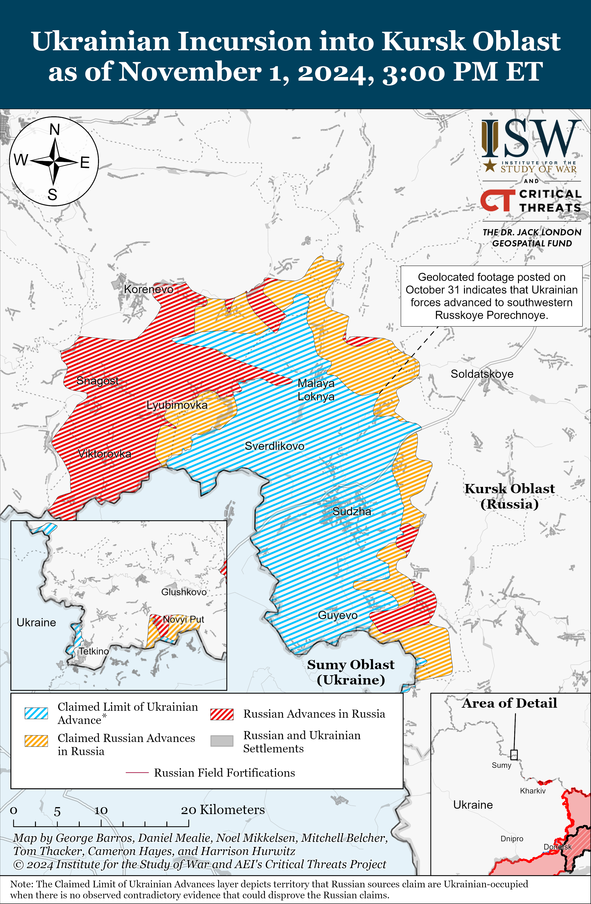](https://understandingwar.org/wp-content/uploads/2025/06/UAF20Kursk20Incursion20November2012C202024.png)**

**Russian Main Effort – Eastern Ukraine**

**Russian Subordinate Main Effort #1 – Kharkiv Oblast (Russian objective: Push Ukrainian forces back from the international border with Belgorod Oblast and approach to within tube artillery range of Kharkiv City)**

Ukrainian and Russian forces recently marginally advanced within central Vovchansk (northeast of Kharkiv City) amid continued limited Russian offensive operations in northern Kharkiv Oblast on November 1. Geolocated footage published on November 1 shows that Ukrainian forces seized a Russian position on Zernova Street in central Vovchansk, indicating that Russian forces had also advanced up to Zernova Street at a previous date.[29] Russian forces continued ground attacks near Lyptsi (north of Kharkiv City), within Vovchansk, and near Vovchanski Khutory (immediately east of Vovchansk) on October 31 and November 1.[30]

[**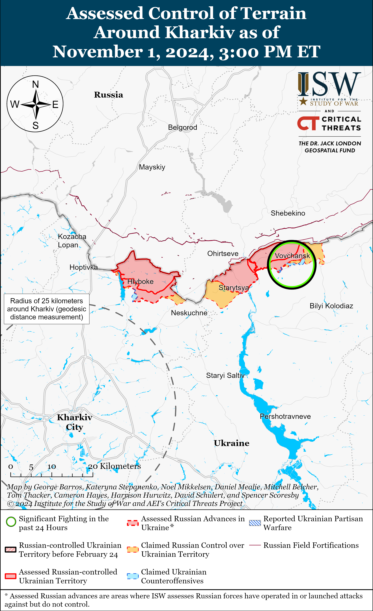**](https://understandingwar.org/wp-content/uploads/2025/06/Kharkiv20Battle20Map20Draft20November2012C202024.png)

[**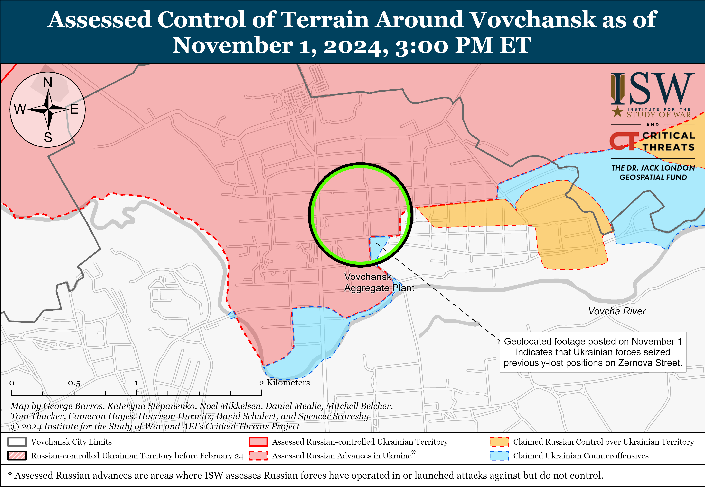**](https://understandingwar.org/wp-content/uploads/2025/06/Vovchansk20Battle20Map20Draft20November2012C202024.png)

**Russian Subordinate Main Effort #2 – Luhansk Oblast (Russian objective: Capture the remainder of Luhansk Oblast and push westward into eastern Kharkiv Oblast and northern Donetsk Oblast)**

Russian forces recently advanced northeast of Kupyansk and northwest of Kreminna amid continued offensive operations along the Kupyansk-Svatove-Kreminna line on November 1. Geolocated footage published on November 1 shows that Russian forces marginally advanced within western Petropavlivka (northeast of Kupyansk) and withi northeastern Terny (northwest of Kreminna).[31] The Russian Ministry of Defense (MoD) claimed on November 1 that Russian forces seized Kruhlyakivka (southeast of Kupyansk), and ISW assessed that Russian forces had seized the settlement as of October 31.[32] Russian forces also continued ground attacks southeast of Kupyansk near Kolisnynivka, Zahryzove, Lozova, Berestove, and Vyshneve; northwest of Kreminna near Druzhelyubivka, Katerynivka, Hrekivka, and Terny; and south of Kreminna in the Serebryanske forest area on October 31 and November 1.[33]

[**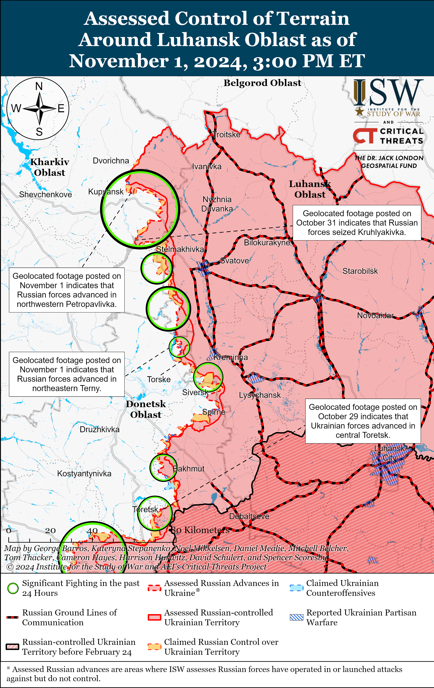**](https://understandingwar.org/wp-content/uploads/2025/06/Luhansk20Battle20Map20Draft20November2012C202024.png)

**Russian Subordinate Main Effort #3 – Donetsk Oblast (Russian objective: Capture the entirety of Donetsk Oblast, the claimed territory of Russia’s proxies in Donbas)**

Neither Russian nor Ukrainian sources reported fighting in the Siversk direction on November 1. A Russian milblogger claimed that elements of the Russian Aerospace Forces (VKS) are conducting daily airstrikes in the Siversk direction to support 3rd Combined Arms Army (CAA) (formerly 2nd Luhansk People’s Republic Army Corps [LNR AC]) ground operations in this direction.[34]

Russian forces conducted limited ground attacks near Chasiv Yar on November 1 but did not advance. The deputy commander of a Ukrainian brigade operating in the Chasiv Yar direction reported that Russian forces are conducting daily assaults in small groups, and Ukrainian Luhansk Group of Forces Spokesperson Major Anastasia Bobovnikova reported that Russian forces are attacking Ukrainian positions in groups of two to three personnel and hiding in foxholes or basements before rapidly trying to advance again.[35] Chechen Akhmat Spetsnaz Commander Apty Alaudinov claimed that Chechen Akhmat Spetsnaz forces recently advanced three kilometers past the Siverskyi Donets-Donbas Canal and seized a part of the Chasiv Yar-Kostyantynivka (T0504) road, likely in reference to recent Russian advances along the T0504 road across the canal just south of Chasiv Yar.[36] Fighting continued on the flanks of Chasiv Yar and south of Chasiv Yar near Stupochky on November 1.[37] Elements of the Russian 331st Airborne (VDV) and 5th Anti-Aircraft Missile regiments (both of the 98th VDV Division) are reportedly operating near Chasiv Yar.[38]

[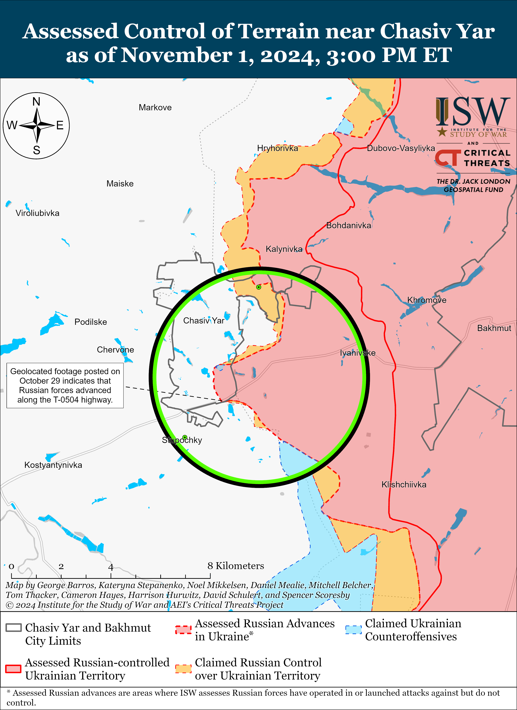](https://understandingwar.org/wp-content/uploads/2025/06/Chasiv20Yar20Battle20Map20Draft20November2012C202024.png)

Russian forces continued limited offensive operations near Toretsk on November 1 but did not make any confirmed advances. The Russian Ministry of Defense (MoD) claimed that elements of the Russian Southern Grouping of Forces recently seized Oleksandropil (southwest of Toretsk) and Katerynivka (northwest of Toretsk), although ISW has not observed confirmation of these claims and currently assesses that Russian forces are still about six kilometers southeast of the outskirts of Katerynivka.[39] The deputy chief-of-staff of a Ukrainian battalion operating in the Toretsk direction reported that the rate of Russian infantry assaults in the area has recently slowed because Russian forces are resting and replenishing personnel losses.[40] The Ukrainian General Staff reported that Russian forces conducted limited ground attacks near Toretsk on October 31 and November 1.[41] Elements of the Russian 132nd Motorized Rifle and 1st “Slavic” brigades (both of the 51st CAA, formerly 1st Donetsk People’s Republic [DNR] AC) reportedly continue operating in and near Toretsk.[42]

[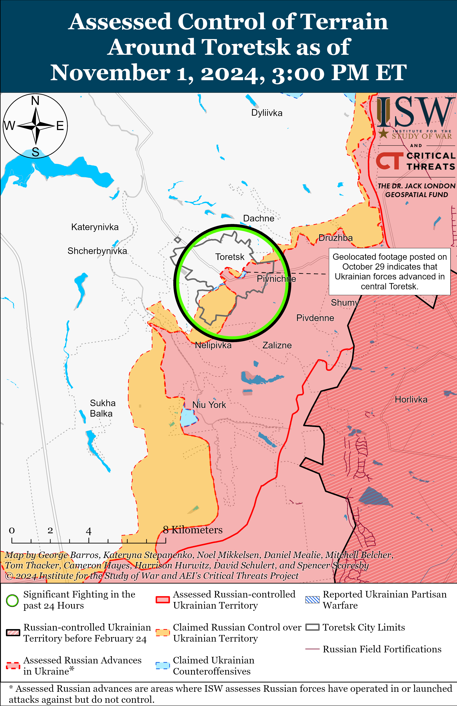](https://understandingwar.org/wp-content/uploads/2025/06/Toretsk20Battle20Map20Draft20November2012C202024.png)

Russian forces continued offensive operations in the Pokrovsk direction on November 1 but did not make any confirmed advances. Russian milbloggers claimed that Russian forces are continuing to advance beyond Selydove (southeast of Pokrovsk) and Vyshneve (just west of Selydove), although ISW has not observed recent visual evidence of these claims.[43] Russian and Ukrainian sources reported that fighting continued east of Pokrovsk near Sukha Balka, Hrodivka, Promin, and Myrolyubivka; and southeast of Pokrovsk near Lysivka, Novohrodivka, Krutyi Yar, Mykolaivka, and Vyshneve on October 31 and November 1.[44]

[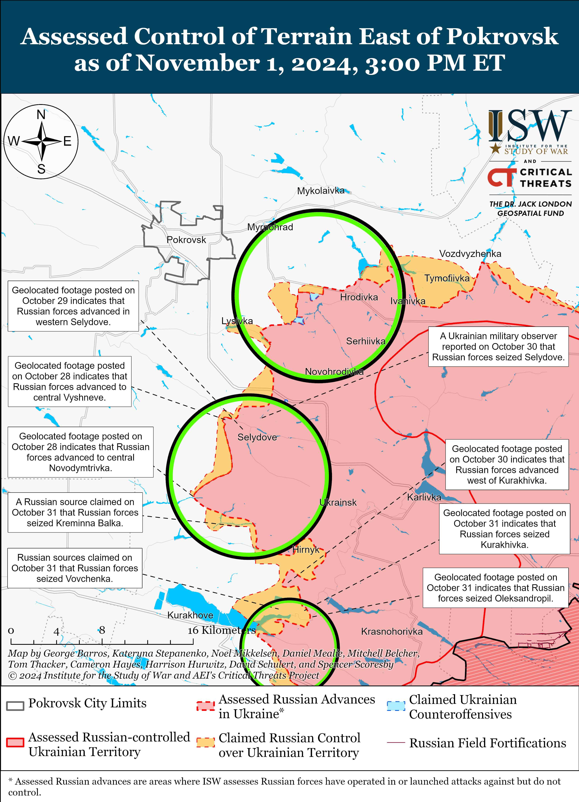](https://understandingwar.org/wp-content/uploads/2025/06/East20of20Pokrovsk20Battle20Map20Draft20November2012C202024.png)

Russian forces reportedly advanced in the Kurakhove direction amid continued offensive operations on November 1. Russian sources claimed that Russian forces advanced further west into Novoselydivka (north of Kurakhove) and north of Vovchenka (northeast of Kurakhove) and seized Stepanivka and Ilinka (just north of Kurakhove on the northeastern bank of the Kurakhivske Reservoir).[45] ISW has not yet observed confirmation of these claims, however. The spokesperson of a Ukrainian brigade operating near Kurakhove noted that the situation in this area is difficult but that Ukrainian forces have prepared defensive lines and fortifications in Kurakhove that will inhibit Russian advances into the settlement itself.[46] Russian and Ukrainian sources reported continued fighting northwest of Kurakhove near Novodmytrivka; north of Kurakhove near Novoselydivka, Voznesenka, and Kreminna Balka; northeast of Kurakhove near Ostrivske and Vovchenka; and east of Kurakhove near Maksymilyanivka on October 31 and November 1.[47] Elements of the Russian 114th Motorized Rifle Brigade (51st CAA) are reportedly operating in the Kurakhivka-Vovchenka area.[48]

[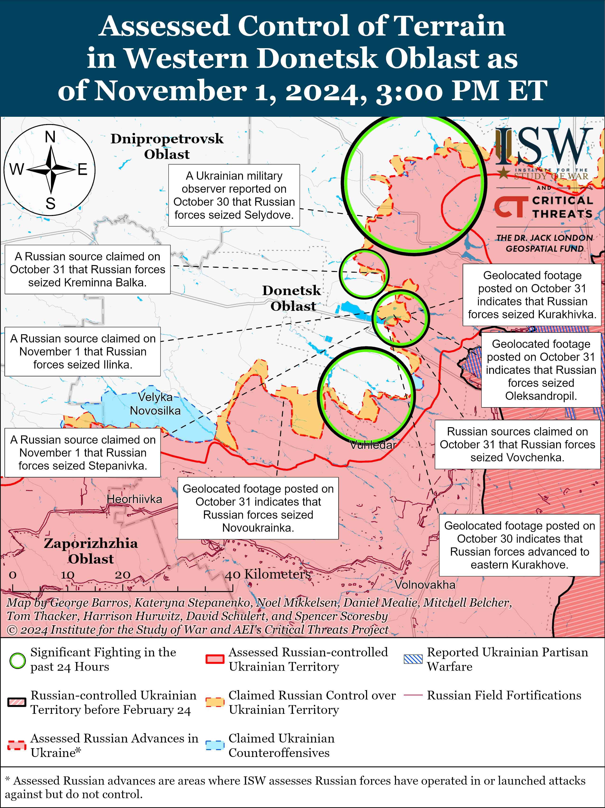](https://understandingwar.org/wp-content/uploads/2025/06/Vremivka20-20Marinka20Battle20Map20Draft20November2012C202024.png)

Russian forces reportedly advanced in the Vuhledar direction amid continued offensive operations on November 1. Russian milbloggers claimed that Russian forces advanced north and northeast of Novoukrainka (northwest of Vuhledar); north of Bohoyavlenka (northwest of Vuhledar); and into Trudove (north of Bohoyavlenka), although ISW has not observed confirmation of these claims.[49] Russian and Ukrainian sources reported fighting north of Vuhledar near Dalne; northeast of Vuhledar near Antonivka, Katerynivka, and Yelyzavetivka; and northwest of Vuhledar near Trudove, Bohoyavlenka, Shakhtarske, and Novoukrainka on October 31 and November 1.[50] Russian Defense Minister Andrei Belousov credited elements of the 40th Naval Infantry Brigade (Pacific Fleet, Eastern Military District [EMD]) on November 1 with the recently claimed seizure of Shakhtarske and Novoukrainka.[51] Elements of the “Kaira” detachment (68th AC, EMD) and 255th Motorized Rifle Regiment (20th Guards Motorized Rifle Division, 8th CAA, Southern Military District [SMD]) are operating northeast of Vuhledar near Yelyzavetivka and Pobieda, respectively, while elements of the 37th Motorized Rifle Brigade (36th CAA, EMD), 5th Tank Brigade (36th CAA), 36th Motorized Rifle Brigade (29th CAA, EMD), 14th Spetsnaz Brigade (Russian General Staff’s Main Intelligence Directorate [GRU]), and 200th Artillery Brigade (29th CAA) are all operating northwest of Vuhledar near Shakhtarske, Novoukrainka, and Yasna Polyana.[52]

[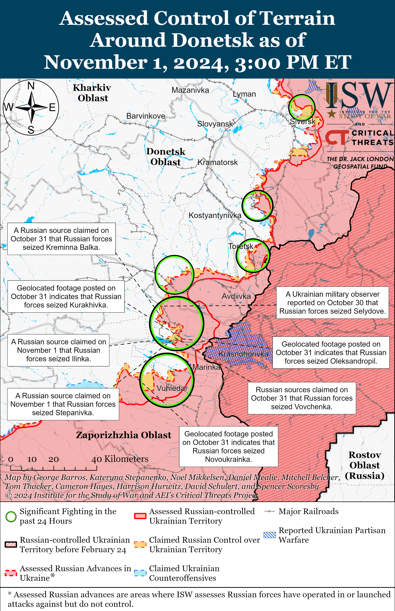](https://understandingwar.org/wp-content/uploads/2025/06/Donetsk20Battle20Map20Draft20November2012C202024.png)

**Russian Supporting Effort – Southern Axis (Russian objective: Maintain frontline positions and secure rear areas against Ukrainian strikes)**

Limited fighting continued in western Zaporizhia Oblast, including near Novodanylivka (north of Robotyne) on October 31 and November 1.[53] Elements of the Russian 42nd Motorized Rifle Division (58th Combined Arms Army [CAA], Southern Military District [SMD]) and elements of the Russian 7th Airborne (VDV) Division reportedly continue operating in the Zaporizhia direction.[54]

[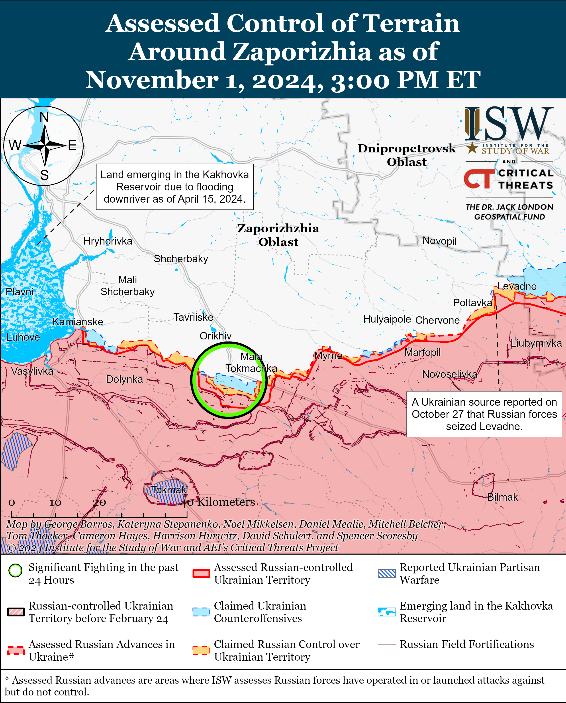](https://understandingwar.org/wp-content/uploads/2025/06/Zaporizhia20Battle20Map20Draft20November2012C202024.png)

Russian forces continued limited ground attacks in east (left) bank Kherson Oblast on October 31 and November 1, but there were no confirmed changes to the frontline.[55] Elements of the Russian BARS-33 (Russian Combat Army Reserve) Detachment and 80th Motorized Rifle Brigade (14th Army Corps [AC], Leningrad Military District [LMD]) reportedly continue to operate in the Kherson direction.[56]

[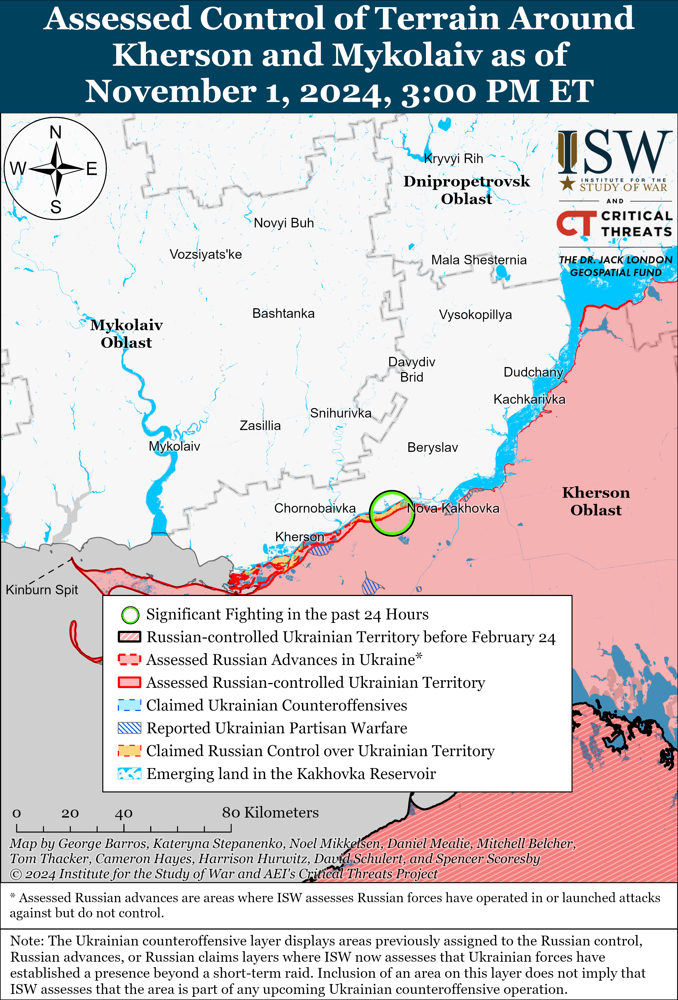](https://understandingwar.org/wp-content/uploads/2025/06/Kherson-Mykolaiv20Battle20Map20Draft20November2012C202024.png)

A Russian source claimed on October 31 that Ukrainian forces conducted a drone strike against a Russian Podlet radar station near Cape Tarkhankut, Crimea on October 23, and that Russian forces have not yet evacuated the station for repair as of October 31.[57]

**Russian Air, Missile, and Drone Campaign (Russian Objective: Target Ukrainian military and civilian infrastructure in the rear and on the frontline)**

Russian forces conducted a series of drone and missile strikes against Ukraine on the night of October 31 to November 1. The Ukrainian Air Force reported that Russian forces launched three Kh-59/69 cruise missiles from the airspace over occupied Kherson Oblast and 48 drones, including Shahed-type drones and other unidentified drone types, from Oryol and Kursk oblasts.[58] The Ukrainian Air Force reported that Ukrainian forces downed 31 drones over Kirovohrad, Kyiv, Cherkasy, Vinnytsia, Zhytomyr, Khmelnytskyi, Sumy, Chernihiv, Odesa, and Poltava oblasts; that 14 Russian drones were “lost in location,” presumably due to unspecified Ukrainian countermeasures; and that three drones flew into Belarusian airspace. The Ukrainian Air Force reported that Ukrainian forces also downed one Kh-59/69 missile and that the other two missiles did not strike their intended targets due to Ukrainian countermeasures. The Ukrainian Air Force reported that falling Russian drone debris struck several civilian enterprises and residential buildings in Poltava, Cherkasy, Kyiv, and Odesa oblasts. Cherkasy Oblast Head Ihor Taburets stated that Russian drones damaged several apartment buildings, destroyed an unspecified building, and struck a state enterprise near Zolotonosha, Cherkasy Oblast.[59] The Poltava Oblast Military Administration reported that Russian drones damaged residential buildings in the oblast, and Ukrainian Emergency Services reported that a Russian missile strike damaged a fire station in Odesa City.[60]

The Hajun Project, an independent Belarusian monitoring group, reported on November 1 that Russian drones entered Belarusian airspace near Lyubech, Chernihiv Oblast, and flew northwest towards Khoiniki and Mozyr in southeastern Belarus on the night of October 31 to November 1 and that Belarusian forces sortied a Belarusian Air Force fighter jet in response to the Russian drones.[61] The Hajun Project reported that 106 Shahed drones and one Orlan-10 reconnaissance drone have entered Belarusian airspace since July 2024 and that the number of Shaheds crossing into Belarusian airspace significantly increased from nine Shahed drones in July 2024 to 49 Shahed drones in October 2024.[62]

**Russian Mobilization and Force Generation Efforts (Russian objective: Expand combat power without conducting general mobilization)**

The Russian Ministry of Defense (MoD) introduced a new system on November 1 allowing Russian veterans and their families to confirm their veteran statuses digitally, likely in response to persistent Russian servicemen and milblogger complaints regarding inefficient and overly bureaucratic veteran registration processes.[63] The Russian MoD announced that veterans and their families can use the Unified Portal of State and Municipal Services to obtain electronic veterans status certificates that entitle them to state benefits. The Kremlin’s efforts to resolve long-standing problems with the compensation and recognition of veterans are likely a part of Russia’s efforts to continue the voluntary recruitment of Russian troops as opposed to declaring partial or general mobilization. The success of this voluntary recruitment relies at least in part on the Kremlin’s ability to fulfill its promises to Russian veterans. ISW continues to assess that the Kremlin’s efforts to avoid mobilization are committing Russia to long-term financial and societal responsibilities to support veterans and their families.[64]

The Russian system for the electronic distribution of conscription summonses became fully operational on November 1, likely as part of the Kremlin’s effort to improve its mobilization system which proved to be inefficient during partial mobilization in September 2022. The Russian government passed a resolution on April 19, 2024, which specified that the unified registry for Russian citizens responsible for military service will become operational on November 1, 2024.[65] The resolution stated that Russian men of conscription age will receive summonses electronically, and summonses will be marked as “received” even if selected men do not open them.[66] The Russian government previously launched the trial period for the electronic summons distribution system in September 2024 and began widely using the system for the Fall 2024 conscription cycle.[67] ISW has observed that Russian regional and military officials routinely distribute false or misleading summonses that follow the structure of conscription summonses, and it is possible that the Russian government will use this digital platform to coerce more Russians into enlisting in the Russian military under false pretenses.[68]

Several Russian federal subjects significantly increased the one-time military enlistment bonuses to incentivize volunteer recruitment and meet the Russian MoD’s regional recruitment quotas. Chuvashia Republic reportedly doubled its one-time military enlistment bonuses to one million rubles ($10,178) from 500,000 rubles ($5,089).[69] Orenburg Oblast similarly increased one-time military enlistment bonuses from 400,000 rubles ($4,079) to one million rubles, and Perm Krai officials are reportedly offering 4.52 million rubles ($46,000) for the first year of military service – including a one-time enlistment bonus of 1.5 million rubles ($15,268).[70] Ufa City officials in the Bashkortostan Republic are reportedly offering 500,000-ruble discounts for the purchase of apartments to people who enlist to fight in Ukraine.[71]

The Ukrainian Resistance Center reported that Chechen Republic Head Ramzan Kadyrov is reportedly preparing to deploy 84,000 troops from Chechnya to Ukraine due to the Kremlin’s ongoing problems with force generation.[72]

**Russian Technological Adaptations (Russian objective: Introduce technological innovations to optimize systems for use in Ukraine)**

Russian engineering company Vityaz – a subsidiary of Russia’s primary tank manufacturer Uralvagonzavod and Russian state-owned defense conglomerate Rostec – has expedited the production of mesh screens to protect Russian armored vehicles from Ukrainian drone strikes.[73] A Russian milblogger complained that the Russian defense industrial base (DIB) only began manufacturing protection for Russian armored vehicles in the third year of Russia’s full-scale invasion of Ukraine and that Russian bureaucracy and outdated standardization protocols caused these delays.[74]

A Russian insider source claimed that the Russian Ministry of Defense (MoD) is searching for replacements for American microcircuits in the Russian market, likely as a result of sanctions.[75] The insider source claimed that the Chelyabinsk “Polet” radio plant, which is part of Rostec, is a year late in supplying the Russian MoD with navigation, landing, and flight control systems and communications and lighting equipment. The insider source, citing a formal Russian MoD complaint, stated that the “Polet” plant was unable to purchase components necessary to construct these systems due to US-imposed sanctions. The “Polet” plant reportedly found two Russian microcircuits manufacturers to produce analogs to American components, but the production of these components will take an estimated 390 days.[76]

**Activities in Russian-occupied areas (Russian objective: Consolidate administrative control of annexed areas; forcibly integrate Ukrainian citizens into Russian sociocultural, economic, military, and governance systems)**

*ISW is not reporting on activities in Russian-occupied areas today.*

**Significant activity in Belarus (Russian efforts to increase its military presence in Belarus and further integrate Belarus into Russian-favorable frameworks and Wagner Group activity in Belarus)**

Belarusian President Alexander Lukashenko approved the draft of a Belarusian-Russian agreement on the procedure for the mutual enforcement of court decisions on October 31.[77]

**Note: ISW does not receive any classified material from any source, uses only publicly available information, and draws extensively on Russian, Ukrainian, and Western reporting and social media as well as commercially available satellite imagery and other geospatial data as the basis for these reports. References to all sources used are provided in the endnotes of each update.**

---

[1] http://www.patriarchia dot ru/db/text/6170962.html

[2] https://understandingwar.org/backgrounder/russian-offensive-campaign-assessment-october-22-2024 ; https://isw.pub/UkrWar102924

[3] https://isw.pub/UkrWar021624 ; https://isw.pub/UkrWar022524

[4] https://isw.pub/UkrWar022524

[5] https://understandingwar.org/backgrounder/russian-orthodox-church-declares-%E2%80%9Choly-war%E2%80%9D-against-ukraine-and-articulates-tenets ; https://understandingwar.org/backgrounder/russian-offensive-campaign-assessment-may-5-2024 ; https://isw.pub/UkrWar122023 ; https://isw.pub/UkrWar010523 ; https://twitter.com/OstapYarysh/status/1611056373416038400; https://twitter.com/Podolyak\_M/status/1610944729709170690; https://www.cnn.com/europe/live-news/russia-ukraine-war-news-1-5-23/h\_e66fbb8b87d3423d8117c4475adb45ce; https://www.c-span.org/video/?c5049510/user-clip-biden-putin-cease-fire

[6] http://www.patriarchia dot ru/db/text/6170962.html ; https://www.moscowtimes dot ru/2024/10/31/glava-rpts-predlozhil-ogranichit-rossiyanam-razvlecheniya-a146557 ; https://t.me/RVvoenkor/79860

[7] https://understandingwar.org/backgrounder/russian-offensive-campaign-assessment-october-2-2023; https://understandingwar.org/backgrounder/russian-offensive-campaign-assessment-june-19-2024; https://understandingwar.org/wp-content/uploads/2024/11/Russian20Offensive20Campaign20Assessment20October20172C2020242028PDF29.pdf

[8] http://www.patriarchia dot ru/db/text/6170962.html ; https://t.me/tass\_agency/282867 ; https://www.vedomosti dot ru/society/news/2024/10/31/1072268-medvedev-prizval; https://www.gazeta dot ru/politics/news/2024/10/31/24284269.shtml

[9] https://isw.pub/UkrWar071924 ; https://isw.pub/UkrWar071524 ; https://isw.pub/UkrWar062824 ; https://isw.pub/UkrWar06272024 ; https://isw.pub/UkrWar041024; https://understandingwar.org/backgrounder/russian-offensive-campaign-assessment-october-25-2024 ; https://understandingwar.org/backgrounder/russian-offensive-campaign-assessment-october-27-2024

[10] https://www.reuters.com/world/north-korean-foreign-minister-arrives-moscow-talks-2024-11-01/; https://t.me/tass\_agency/282969; https://t.me/MID\_Russia/47363; https://t.me/MID\_Russia/47362; https://t.me/MID\_Russia/47354

[11] https://t.me/MID\_Russia/47363

[12] https://www.yna.co dot kr/view/AKR20241101154251080?section=north-korea/all; https://t.me/tass\_agency/282987 https://meduza dot io/news/2024/11/01/glava-mid-severnoy-korei-zayavila-chto-kndr-do-pobednogo-dnya-budet-tverdo-stoyat-s-rossiyskimi-tovarischami-v-ih-svyaschennoy-voyne https://t.me/tass\_agency/282981; https://t.me/tass\_agency/282982

[13] https://understandingwar.org/backgrounder/russian-orthodox-church-declares-%E2%80%9Choly-war%E2%80%9D-against-ukraine-and-articulates-tenets

[14] https://www.defense.gov/News/News-Stories/Article/Article/3953130/north-korean-soldiers-likely-to-enter-russian-war-on-ukraine/

[15] https://www.csis.org/analysis/north-korean-troops-deploy-russia-whats-military-effect

[16] https://www.cnn.com/2024/10/24/europe/ukraine-north-korean-troops-spotted-kursk-intl-latam/index.html

[17] https://understandingwar.org/backgrounder/north-korea-joins-russias-war-against-ukraine-operational-and-strategic-implications

[18] https://www.defense.gov/News/Releases/Release/Article/3954004/biden-administration-announces-additional-security-assistance-for-ukraine/

[19] https://understandingwar.org/backgrounder/russian-offensive-campaign-assessment-july-3-2024; https://understandingwar.org/backgrounder/russian-offensive-campaign-assessment-july-10-2024; https://understandingwar.org/backgrounder/russian-offensive-campaign-assessment-july-12-2024

[20] https://understandingwar.org/backgrounder/russian-offensive-campaign-assessment-october-5-2024

[21] https://t.me/rebel\_jack\_review/19338

[22] https://t.me/AlexCarrier/9126; https://t.me/rybar/64970; https://t.me/dva\_majors/56500; https://t.me/boris\_rozhin/142942

[23] https://t.me/soiuzspaseniya/1662 ; https://x.com/giK1893/status/1852178017587728622

[24] https://t.me/dva\_majors/56499

[25] https://t.me/mod\_russia/45226 ; https://t.me/rybar/64961 ; https://t.me/wargonzo/22905

[26] https://t.me/rusich\_army/18133

[27] https://t.me/mod\_russia/45210

[28] https://t.me/dva\_majors/56499 ; https://t.me/tass\_agency/282870 ; https://meduza dot io/news/2024/11/01/ukrainskiy-dron-atakoval-neftebazu-v-stavropolie; https://t.me/bazabazon/32591; https://t.me/ostorozhno\_novosti/30910

[29] https://fb.watch/vAA30hSII0/; https://x.com/moklasen/status/1852301275456475606; https://x.com/moklasen/status/1852301583578452098

[30] https://www.facebook.com/GeneralStaff.ua/posts/pfbid0BPCabEScESChTvfp6zsrYPeSbRbNjBFJofcQtTqXRMgdXD5Jo9jBhEg8HMP25Hsyl; https://www.facebook.com/GeneralStaff.ua/posts/pfbid04ibau2KXeKfCx7Hn5b3eDGiQM2cgtcFLdUKd1u3dLjDQ9iM17ZHvtLNKMCaduqC6l; https://t.me/otukharkiv/2378; https://t.me/Sladkov\_plus/11729

[31] https://x.com/moklasen/status/1852266828157894660; https://t.me/WarArchive\_ua/21855; https://t.me/mb2omb30/72; https://t.me/creamy\_caprice/7337; https://t.me/omb\_97/287; https://t.me/creamy\_caprice/7342

[32] https://t.me/mod\_russia/45223; https://understandingwar.org/backgrounder/russian-offensive-campaign-assessment-october-31-2024

[33] https://www.facebook.com/GeneralStaff.ua/posts/pfbid04ibau2KXeKfCx7Hn5b3eDGiQM2cgtcFLdUKd1u3dLjDQ9iM17ZHvtLNKMCaduqC6l ; https://www.facebook.com/GeneralStaff.ua/posts/pfbid0BPCabEScESChTvfp6zsrYPeSbRbNjBFJofcQtTqXRMgdXD5Jo9jBhEg8HMP25Hsyl; https://www.facebook.com/GeneralStaff.ua/posts/pfbid05Ho9qQ7v2avqnDzXuA6qvpM71eZqRLtNFTHJBegcX3fBqXU6gxqAAyHYu4exterDl; https://t.me/rusich\_army/18118; https://t.me/Sladkov\_plus/11729

[34] https://t.me/sashakots/49878

[35] https://armyinform.com dot ua/2024/11/01/vbombarduvaty-v-zemlyu-nichni-ataky-dronamy-efektyvno-strymuyut-voroga/; https://suspilne dot media/donbas/870869-kilkist-sturmiv-zmensilas-rosiani-nakopicuut-sili-otu-lugansk/

[36] https://t.me/dva\_majors/56554

[37] https://www.facebook.com/GeneralStaff.ua/posts/pfbid05Ho9qQ7v2avqnDzXuA6qvpM71eZqRLtNFTHJBegcX3fBqXU6gxqAAyHYu4exterDl; https://www.facebook.com/GeneralStaff.ua/posts/pfbid0BPCabEScESChTvfp6zsrYPeSbRbNjBFJofcQtTqXRMgdXD5Jo9jBhEg8HMP25Hsyl; https://t.me/wargonzo/22905

[38] https://t.me/DnevnikDesantnika/18356

[39] https://t.me/mod\_russia/45223

[40] https://armyinform.com dot ua/2024/11/01/my-yih-potyhenku-vsih-horonymo-czvyntar-okupantiv-u-toreczku-roste-v-geometrychnij-progresiyi/

[41] https://www.facebook.com/GeneralStaff.ua/posts/pfbid04ibau2KXeKfCx7Hn5b3eDGiQM2cgtcFLdUKd1u3dLjDQ9iM17ZHvtLNKMCaduqC6l ; https://www.facebook.com/GeneralStaff.ua/posts/pfbid0BPCabEScESChTvfp6zsrYPeSbRbNjBFJofcQtTqXRMgdXD5Jo9jBhEg8HMP25Hsyl

[42] https://t.me/wargonzo/22918; https://t.me/nm\_dnr/12919

[43] https://t.me/rybar/64965; https://t.me/rusich\_army/18118; https://t.me/z\_arhiv/29082

[44] https://www.facebook.com/GeneralStaff.ua/posts/pfbid05Ho9qQ7v2avqnDzXuA6qvpM71eZqRLtNFTHJBegcX3fBqXU6gxqAAyHYu4exterDl; https://www.facebook.com/GeneralStaff.ua/posts/pfbid04ibau2KXeKfCx7Hn5b3eDGiQM2cgtcFLdUKd1u3dLjDQ9iM17ZHvtLNKMCaduqC6l ; https://www.facebook.com/GeneralStaff.ua/posts/pfbid0BPCabEScESChTvfp6zsrYPeSbRbNjBFJofcQtTqXRMgdXD5Jo9jBhEg8HMP25Hsyl; https://t.me/DnevnikDesantnika/18379

[45] https://t.me/boris\_rozhin/142866; https://t.me/voenkorKotenok/59903; https://t.me/DnevnikDesantnika/18395; https://t.me/NgP\_raZVedka/19296; https://t.me/RVvoenkor/79833

[46] https://armyinform dot com.ua/2024/11/01/vony-goryat-palayut-yih-rozryvaye-na-shmattya-na-pidstupah-do-kurahovogo-tryvayut-vazhki-boyi/; https://www.youtube.com/watch?v=aDXWlQ2K0dM

[47] https://www.facebook.com/GeneralStaff.ua/posts/pfbid05Ho9qQ7v2avqnDzXuA6qvpM71eZqRLtNFTHJBegcX3fBqXU6gxqAAyHYu4exterDl; https://www.facebook.com/GeneralStaff.ua/posts/pfbid0BPCabEScESChTvfp6zsrYPeSbRbNjBFJofcQtTqXRMgdXD5Jo9jBhEg8HMP25Hsyl; https://www.facebook.com/GeneralStaff.ua/posts/pfbid04ibau2KXeKfCx7Hn5b3eDGiQM2cgtcFLdUKd1u3dLjDQ9iM17ZHvtLNKMCaduqC6l; https://t.me/myro\_shnykov/6383 ; https://t.me/RVvoenkor/79815; https://t.me/rybar/64965; https://t.me/voenkorKotenok/59890; https://t.me/DnevnikDesantnika/18395

[48] https://t.me/dva\_majors/56481

[49] https://t.me/z\_arhiv/29072; https://t.me/RVvoenkor/79833;

[50] https://www.facebook.com/GeneralStaff.ua/posts/pfbid05Ho9qQ7v2avqnDzXuA6qvpM71eZqRLtNFTHJBegcX3fBqXU6gxqAAyHYu4exterDl; https://www.facebook.com/GeneralStaff.ua/posts/pfbid0BPCabEScESChTvfp6zsrYPeSbRbNjBFJofcQtTqXRMgdXD5Jo9jBhEg8HMP25Hsyl; https://www.facebook.com/GeneralStaff.ua/posts/pfbid04ibau2KXeKfCx7Hn5b3eDGiQM2cgtcFLdUKd1u3dLjDQ9iM17ZHvtLNKMCaduqC6l; https://t.me/rybar/64965; https://t.me/voenkorKotenok/59891; https://t.me/DnevnikDesantnika/18394

[51] https://t.me/mod\_russia/45225

[52]https://t.me/voin\_dv/11584; https://t.me/RVvoenkor/79808 (northeast of Vuhledar); https://t.me/rybar/64962 ; https://t.me/dva\_majors/56479; https://t.me/voin\_dv/11582; https://t.me/voin\_dv/11589; https://t.me/voin\_dv/11590 (northwest of Vuhledar)

[53] https://www.facebook.com/GeneralStaff.ua/posts/pfbid04ibau2KXeKfCx7Hn5b3eDGiQM2cgtcFLdUKd1u3dLjDQ9iM17ZHvtLNKMCaduqC6l ; https://www.facebook.com/GeneralStaff.ua/posts/pfbid0BPCabEScESChTvfp6zsrYPeSbRbNjBFJofcQtTqXRMgdXD5Jo9jBhEg8HMP25Hsyl

[54] https://t.me/dva\_majors/56560; https://t.me/DnevnikDesantnika/18356

[55] https://www.facebook.com/GeneralStaff.ua/posts/pfbid05Ho9qQ7v2avqnDzXuA6qvpM71eZqRLtNFTHJBegcX3fBqXU6gxqAAyHYu4exterDl; https://www.facebook.com/GeneralStaff.ua/posts/pfbid0BPCabEScESChTvfp6zsrYPeSbRbNjBFJofcQtTqXRMgdXD5Jo9jBhEg8HMP25Hsyl; https://www.facebook.com/GeneralStaff.ua/posts/pfbid0BPCabEScESChTvfp6zsrYPeSbRbNjBFJofcQtTqXRMgdXD5Jo9jBhEg8HMP25Hsyl; https://t.me/rusich\_army/18126

[56] https://t.me/dva\_majors/56515; https://t.me/NeoficialniyBeZsonoV/41094

[57] https://t.me/dosye\_shpiona/613

[58] https://t.me/kpszsu/22203

[59] https://suspilne dot media/cherkasy/870755-bahnuv-i-rozletilosa-vse-u-zolotonosi-na-cerkasini-likviduut-naslidki-vlucanna-droniv/

[60] https://t.me/poltavskaOVA/18810 ; https://t.me/dsns\_telegram/34395; https://suspilne dot media/odesa/870639-rosiani-atakuvali-odesu-raketami-31-zovtna-so-vidomo-pro-stan-travmovanih-ratuvalnikiv/

[61] https://t.me/Hajun\_BY/8197 ; https://t.me/Hajun\_BY/8198

[62] https://t.me/Hajun\_BY/8200; https://suspilne dot media/870841-belaruski-gaun-porahuvav-skilki-rosijskih-droniv-zaletili-v-bilorus-z-lipna/

[63] https://t.me/mod\_russia/45213; https://t.me/rusvesnasu/30108 ; https://t.me/RVvoenkor/79832 ; https://t.me/DnevnikDesantnika/18376; https://t.me/wargonzo/22910; https://t.me/boris\_rozhin/142903;

[64] https://understandingwar.org/backgrounder/russian-volunteer-units-and-battalions

[65] http://publication dot pravo.gov.ru/document/0001202404270025

[66] https://www.severreal.org/a/v-rossii-zarabotal-reestr-s-elektronnymi-povestkami-v-armiyu/33183018.html

[67] https://www.severreal.org/a/v-rossii-zarabotal-reestr-s-elektronnymi-povestkami-v-armiyu/33183018.html

[68] https://understandingwar.org/backgrounder/russian-offensive-campaign-assessment-november-18

[69] https://www.idelreal dot org/a/v-chuvashii-v-dva-raza-podnyali-razmer-regionalnyy-vyplaty-za-kontrakt-s-minoborony-na-voynu-s-ukrainoy/33183137.html; https://t.me/idelrealii/38289

[70] https://www.idelreal dot org/a/v-orenburgskoy-oblasti-razmer-regionalnoy-vyplaty-podnyali-v-1-5-raza/33182945.html; https://t.me/idelrealii/38287; https://t.me/mobilizationnews/20773

[71] https://ufa.rbc dot ru/ufa/31/10/2024/672380049a794775ec7b6428?from=from\_main\_6; https://www.idelreal dot org/a/v-ufe-obeschayut-skidku-v-polmilliona-rubley-na-kvartiru-tem-kto-poydet-na-voynu-s-ukrainoy/33182162.html; https://t.me/idelrealii/38283

[72] https://armyinform dot com.ua/2024/11/01/84-tysyachi-kadyrivcziv-najblyzhchym-chasom-planuyut-pomerty-v-ukrayini/; https://sprotyv dot mod.gov.ua/84-tysyachi-kadyrivtsiv-najblyzhchym-chasom-planuyut-pomerty-v-ukrayini/

[73] https://tass dot ru/armiya-i-opk/22258431; https://t.me/DnevnikDesantnika/18366; https://t.me/uvznews/2756

[74] https://t.me/dva\_majors/56501

[75] https://t.me/vchkogpu/52221

[76] https://t.me/vchkogpu/52221

[77] https://belta dot by/president/view/lukashenko-odobril-proekt-belorussko-rossijskogo-soglashenija-o-porjadke-vzaimnogo-ispolnenija-672404-2024/
