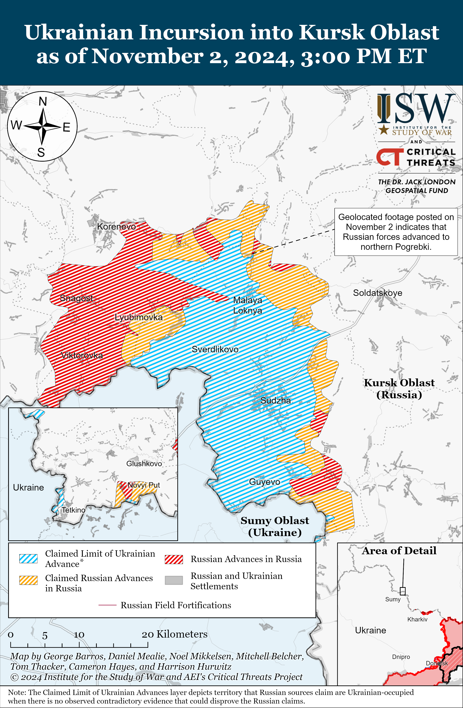
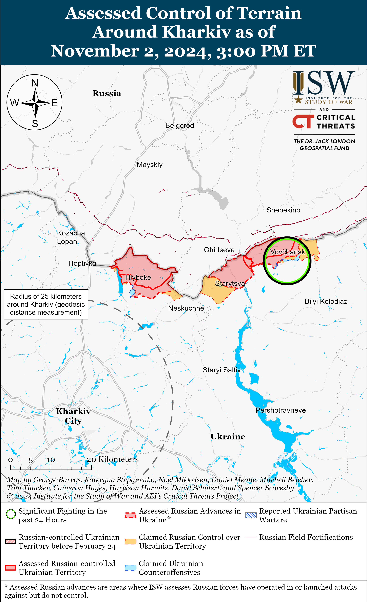
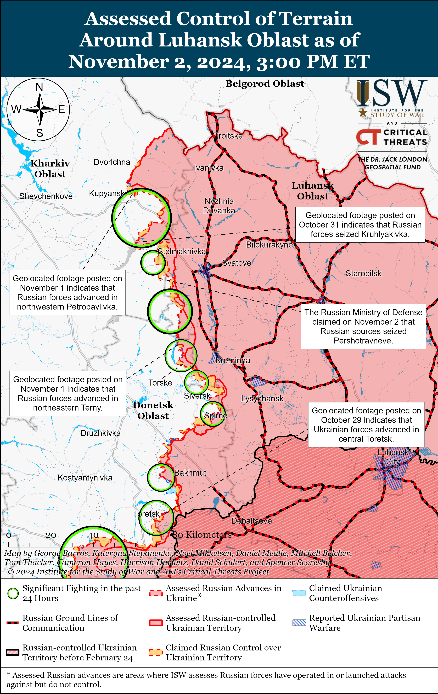
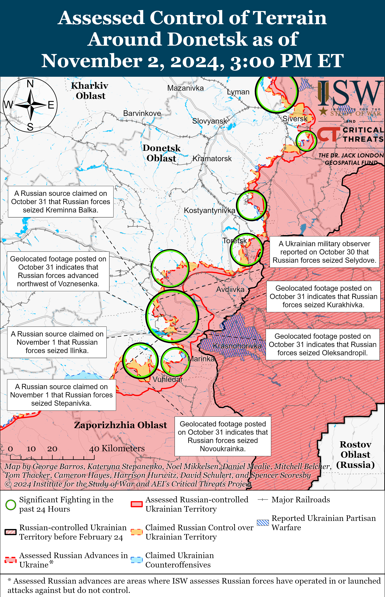
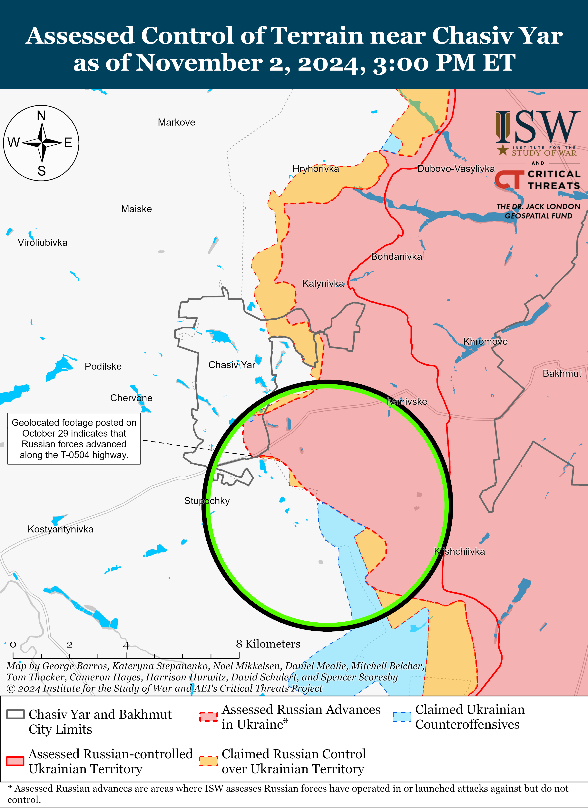
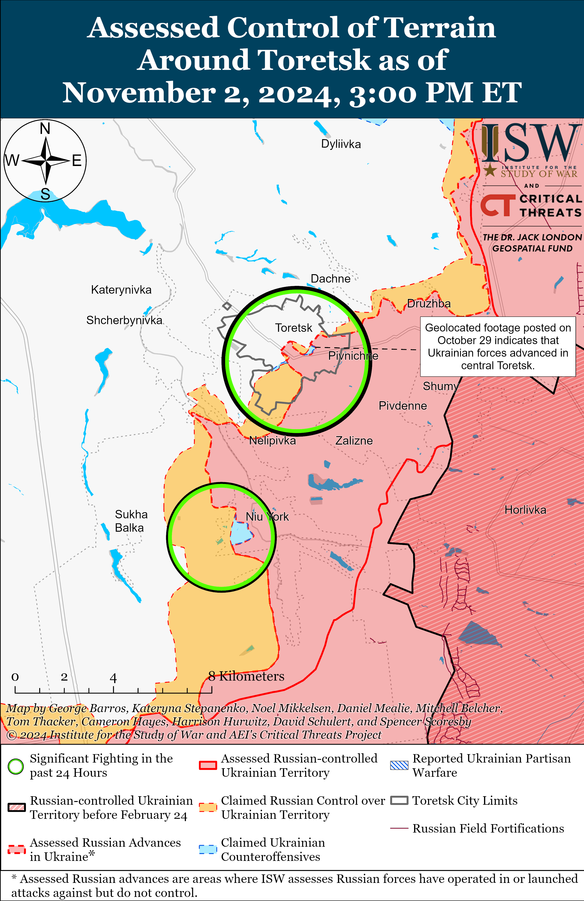
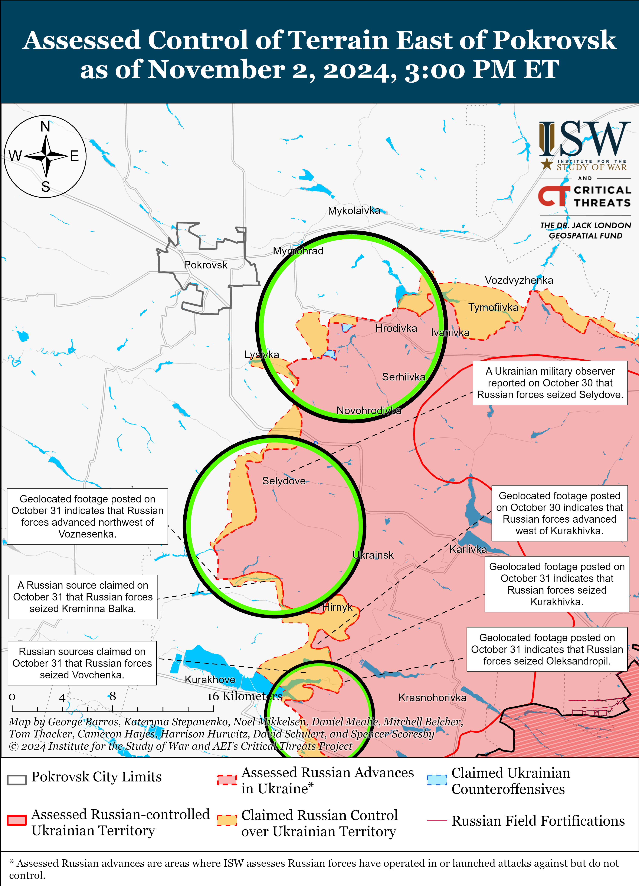
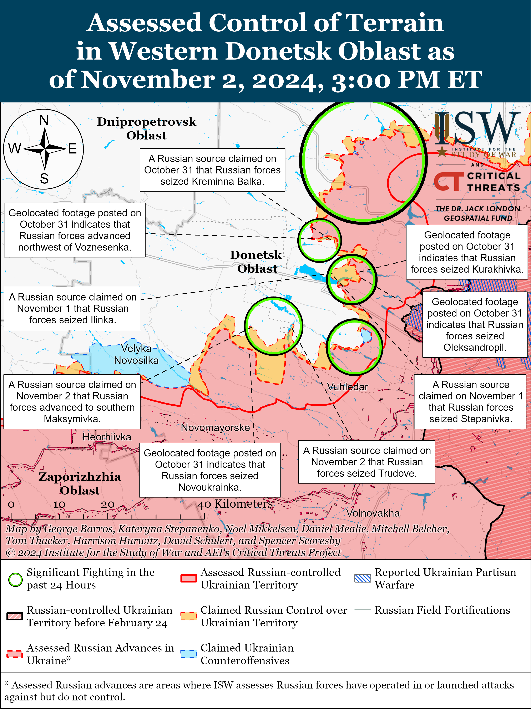
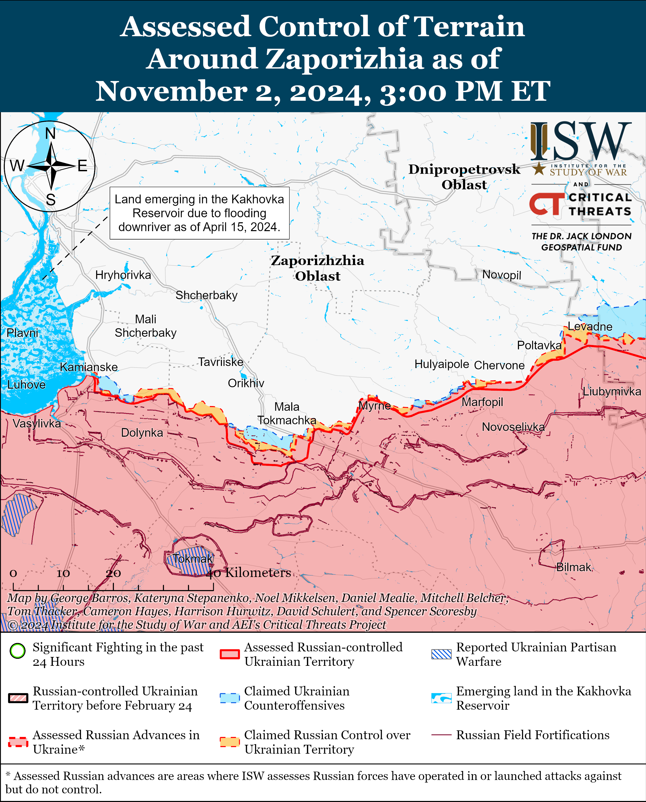
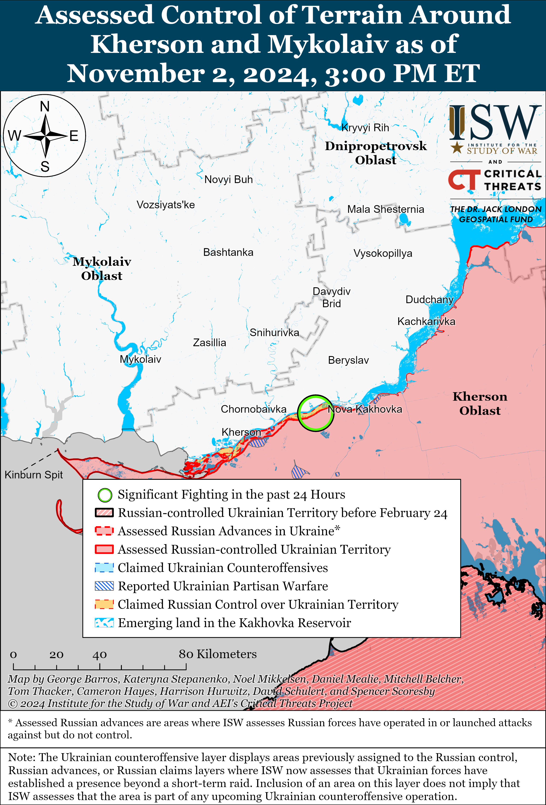

# Russian Offensive Campaign Assessment, November 2, 2024

**November 2, 2024, 4:45 pm ET**

**Click** [**here**](https://storymaps.arcgis.com/stories/36a7f6a6f5a9448496de641cf64bd375) **to see ISW’s interactive map of the Russian invasion of Ukraine. This map is updated daily alongside the static maps present in this report.**

**Click** [**here**](https://storymaps.arcgis.com/stories/83a2f24901c941d581c0c523ecd2619b) **to see ISW's interactive map of Ukraine's offensive in Kursk Oblast.**

**Click** [**here**](https://understandingwar.maps.arcgis.com/apps/instant/3dviewer/index.html?appid=1602762dbcde419bb957dea358449580) **to see ISW’s 3D control of terrain topographic map of Ukraine. Use of a computer (not a mobile device) is strongly recommended for using this data-heavy tool.**

**Click** [**here**](https://storymaps.arcgis.com/stories/733fe90805894bfc8562d90b106aa895) **to access ISW’s archive of interactive time-lapse maps of the Russian invasion of Ukraine. These maps complement the static control-of-terrain map that ISW produces daily by showing a dynamic frontline. ISW will update this time-lapse map archive monthly.**

**Note: The data cut-off for this product was 11:30am ET on November 2. ISW will cover subsequent reports in the November 3 Russian Offensive Campaign Assessment.**

**Ukrainian forces have reportedly struck seven Russian radars and air defense systems since the night of October 20 to 21.** A Russian Telegram user, who claims to be an employee of an unspecified branch of the Russian special services, claimed on November 2 that Ukrainian forces conducted an ATACMS strike against a Russian S-300/400 air defense system near occupied Mospyne (just southeast of Donetsk City) and that their sources are still clarifying the damage to the system.[[1]](#_edn2c7a8cb71d7ce8fa34e02165eefdb8391) The Telegram user claimed that Ukrainian forces targeted the air defense systems with six ATACMS missiles and that Russian forces downed three of the missiles. The Telegram user claimed on October 31 that Ukrainian forces struck a Russian "Podlet" radar station near occupied Cape Tarkhankut, Crimea with a drone on October 23 and that Russian forces have not evacuated the damaged station for repairs yet.[[2]](#_edn2c7a8cb71d7ce8fa34e02165eefdb8392) A Ukrainian division posted footage on October 31 purportedly showing a successful Ukrainian strike against a Russian Buk air defense system in an unspecified frontline area, and the footage showed secondary detonations consistent with a successful strike against such a system.[[3]](#_edn2c7a8cb71d7ce8fa34e02165eefdb8393) The Ukrainian General Staff reported on October 25 that Ukrainian forces struck a Russian Buk-M3 air defense system and destroyed the radar system of another Buk-M2 air defense system in occupied Luhansk Oblast on the night of October 24 to 25.[[4]](#_edn2c7a8cb71d7ce8fa34e02165eefdb8394) Official Ukrainian sources reported that Ukrainian forces also struck a Buk-M2 system in southern Ukraine on October 23 and a Buk-M3 air defense system on the night of October 20 to 21 in an unspecified frontline area.[[5]](#_edn2c7a8cb71d7ce8fa34e02165eefdb8395) ISW has previously observed indications that Russia has struggled to source the microelectronic components necessary to produce complex weapons and air defense systems due to Western sanctions, and Russia may not be able to produce or repair a sufficient number of air defense systems to maintain the current density of Russia's air defense coverage over occupied Ukraine if Ukraine destroys a significant number of Russian systems.[[6]](#_edn2c7a8cb71d7ce8fa34e02165eefdb8396) Further degradation of Russia's air defense umbrella, particularly over occupied Ukraine, may impact how close to the frontline Russian pilots are willing to operate and could limit Russia's ability to effectively use glide bombs against both frontline areas and rear Ukrainian cities.

**South Korea signaled possible readiness to increase support for Ukraine amid continued Ukrainian intelligence on the deployment of North Korean forces near the Russian border with Ukraine.** South Korean Foreign Minister Cho Tae-yul stated on November 1 that "all possible scenarios are under consideration" in response to a question about possibly sending weapons to Ukraine following the deployment of North Korean troops in Russia.[[7]](#_edn2c7a8cb71d7ce8fa34e02165eefdb8397) Cho emphasized that South Korea will monitor North Korean troop involvement in Russia and the "benefits" that North Korea receives from Russia to determine a course of action. Ukraine's Main Military Intelligence Directorate (GUR) reported on November 2 that Russian forces transferred 7,000 additional North Korean personnel to unspecified areas near the border with Ukraine in the last week (since about October 26).[[8]](#_edn2c7a8cb71d7ce8fa34e02165eefdb8398) The GUR reported that Russian forces have armed North Korean soldiers with 60mm mortars, AK-12 assault rifles, RPK/PKM machine guns, SVD/SVCh sniper rifles, Phoenix anti-tank guided missiles (ATGMs), and RPG-7 anti-tank rocket launchers and have equipped North Korean forces with some night vision devices, thermal imagers, and other optical equipment.

**Russian federal censor Roskomnadzor implemented its plan to deanonymize Russian social media accounts on November 2.** The Russian Ministry of Digital Development announced on November 2 a new registration mechanism for social media channels with over 10,000 subscribers on the state services portal.[[9]](#_edn2c7a8cb71d7ce8fa34e02165eefdb8399) Channels must register with the Russian government by January 1, 2025, and provide “minimal” personal information about the identity of their operators via a special platform or risk restrictions on advertising and their right to be reposted by other channels. Outcry about the deanonymization effort from Russian milbloggers previously prompted Roskomnadzor to slightly alter the program and may have caused a slight delay in its implementation, marking a significant example of how the Russian ultranationalist information space maintains some sway over Kremlin decision making.[[10]](#_edn2c7a8cb71d7ce8fa34e02165eefdb83910)

**Key Takeaways:**

- **Ukrainian forces have reportedly struck seven Russian radars and air defense systems since the night of October 20 to 21.**
- **South Korea signaled possible readiness to increase support for Ukraine amid continued Ukrainian intelligence on the deployment of North Korean forces near the Russian border with Ukraine.**
- **Russian federal censor Roskomnadzor implemented its plan to deanonymize Russian social media accounts on November 2.**
- **Ukrainian and Russian forces marginally advanced north of Sudzha, Kursk Oblast.**
- **Russian forces marginally advanced north of Kurakhove in Donetsk Oblast.**
- **Chechen Republic Head Ramzan Kadyrov claimed to have rescinded an order for his Akhmat Spetsnaz soldiers to not take Ukrainian servicemembers as prisoners in the war in Ukraine.**

***We do not report in detail on Russian war crimes because these activities are well-covered in Western media and do not directly affect the military operations we are assessing and forecasting. We will continue to evaluate and report on the effects of these criminal activities on the Ukrainian military and the Ukrainian population and specifically on combat in Ukrainian urban areas. We utterly condemn Russian violations of the laws of armed conflict and the Geneva Conventions and crimes against humanity even though we do not describe them in these reports.***

- Ukrainian Operations in the Russian Federation
- Russian Main Effort – Eastern Ukraine (comprised of three subordinate main efforts)
- Russian Subordinate Main Effort #1 – Push Ukrainian forces back from the international border with Belgorod Oblast and approach to within tube artillery range of Kharkiv City
- Russian Subordinate Main Effort #2 – Capture the remainder of Luhansk Oblast and push westward into eastern Kharkiv Oblast and encircle northern Donetsk Oblast
- Russian Subordinate Main Effort #3 – Capture the entirety of Donetsk Oblast
- Russian Supporting Effort – Southern Axis
- Russian Air, Missile, and Drone Campaign
- Russian Mobilization and Force Generation Efforts
- Russian Technological Adaptations
- Activities in Russian-occupied areas
- Significant Activity in Belarus

**Ukrainian Operations in the Russian Federation**

Ukrainian and Russian forces marginally advanced northwest of Sudzha amid continued fighting in the Ukrainian salient in Kursk Oblast on November 2. Geolocated footage published on November 2 indicates that Ukrainian forces marginally advanced in a forested area in northern Pogrebki (northwest of Sudzha) and that Russian forces marginally advanced southward along Novoselovka Street in another area of northern Pogrebki.[[11]](#_edn2c7a8cb71d7ce8fa34e02165eefdb83911) Russian sources, including the Russian Ministry of Defense (MoD), claimed that Russian forces attacked southeast of Korenevo near Darino, Leonidovo, Nikolayevo-Darino, and Novoivanovka and southeast of Sudzha near Plekhovo.[[12]](#_edn2c7a8cb71d7ce8fa34e02165eefdb83912) The Russian MoD claimed that Ukrainian forces counterattacked near Novoivanivka and north of Sudzha near Kamyshevka.[[13]](#_edn2c7a8cb71d7ce8fa34e02165eefdb83913) Elements of the Russian 137th Airborne (VDV) Regiment (106th VDV Division) are reportedly operating near Korenevo.[[14]](#_edn2c7a8cb71d7ce8fa34e02165eefdb83914)

Neither Ukrainian nor Russian sources reported ground attacks west of the main Kursk Oblast salient in Glushkovsky Raion on November 2. Elements of the Russian 106th VDV Division are reportedly operating near Glushkvosky Raion.[[15]](#_edn2c7a8cb71d7ce8fa34e02165eefdb83915)

Ukraine's Pivnich (Northern) Operational Command Spokesperson Vadym Mysnyk stated on November 2 that Russian forces have concentrated a significant amount of personnel and equipment in Kursk Oblast but noted that Russian forces are still relying on highly attritional infantry assaults to make advances in the area.[[16]](#_edn2c7a8cb71d7ce8fa34e02165eefdb83916) Mysnyk stated that fair weather conditions still allow Russian forces to use equipment in Kursk Oblast and that Russian forces conduct infantry attacks every 10 to 15 minutes in some areas of the main Ukrainian salient.

**Russian Main Effort – Eastern Ukraine**

**Russian Subordinate Main Effort #1 – Kharkiv Oblast** **(Russian objective: Push Ukrainian forces back from the international border with Belgorod Oblast and approach to within tube artillery range of Kharkiv City)**

Russian forces continued limited offensive operations northeast of Kharkiv City near Vovchansk and north of Kharkiv City near Hlyboke on November 1 and 2 but did not advance.[[17]](#_edn2c7a8cb71d7ce8fa34e02165eefdb83917) A Russian milblogger claimed on November 2 that Russian drone operators are striking Ukrainian firing positions and trenches to set conditions for Russian infantry assaults in the Kharkiv direction.[[18]](#_edn2c7a8cb71d7ce8fa34e02165eefdb83918)

**Russian Subordinate Main Effort #2 – Luhansk Oblast (Russian objective: Capture the remainder of Luhansk Oblast and push westward into eastern Kharkiv Oblast and northern Donetsk Oblast)**

Russian forces continued offensive operations along the Kupyansk-Svatove-Kreminna line on November 2 but did not make any confirmed advances. The Russian MoD claimed on November 2 that Russian forces captured Pershotravneve (west of Svatove).[[19]](#_edn2c7a8cb71d7ce8fa34e02165eefdb83919) Russian milbloggers claimed on November 2 that Russian forces operating southeast of Kupyansk advanced into northern Zahryzove and near Vyshneve and that Russian forces operating northwest of Kreminna advanced southwest of Nevske and northwest and east of Terny.[[20]](#_edn2c7a8cb71d7ce8fa34e02165eefdb83920) ISW has not observed visual confirmation of these claims, however. Russian forces continued ground attacks northeast of Kupyansk near Petropavlivka; east of Kupyansk near Pishchane; southeast of Kupyansk near Kruhlyakivka, Kolisnynivka, Zahryzove, and Lozova; northwest of Kreminna near Druzhelyubivka, Makiivka, Katerynivka, Hrekivka, Terny, and Yampolivka; west of Kreminna near Torske; and south of Kreminna near the Serebryanske forest area on November 1 and November 2.[[21]](#_edn2c7a8cb71d7ce8fa34e02165eefdb83921)

**Russian Subordinate Main Effort #3 – Donetsk Oblast (Russian objective: Capture the entirety of Donetsk Oblast, the claimed territory of Russia’s proxies in Donbas)**

Russian forces continued offensive operations in the Siversk direction, including northeast of Siversk near Bilohorivka and southeast of Siversk near Ivano-Darivka on November 2, but did not make confirmed advances in the area.[[22]](#_edn2c7a8cb71d7ce8fa34e02165eefdb83922) Russian milbloggers amplified footage claiming to show a Russian Kh-38 air-to-surface missile striking a bridge near Zakitne (west of Siversk).[[23]](#_edn2c7a8cb71d7ce8fa34e02165eefdb83923)

Russian forces continued offensive operations near Chasiv Yar, including south of Chasiv Yar in the direction of Predtechyne and Stupochky, on November 1 and 2, but there were no confirmed changes to the frontline in this area.[[24]](#_edn2c7a8cb71d7ce8fa34e02165eefdb83924) Elements of the Russian 98th Airborne (VDV) Division reportedly continue to operate near Chasiv Yar.[[25]](#_edn2c7a8cb71d7ce8fa34e02165eefdb83925)

Russian forces continued offensive operations near Toretsk and southwest of Toretsk in the direction of Shcherbynivka and Sukha Balka on November 1 and 2, but there were no confirmed changes to the frontline.[[26]](#_edn2c7a8cb71d7ce8fa34e02165eefdb83926) A Russian milblogger claimed that Russian forces advanced south of Toretsk near Nelipivka, but ISW has not observed visual confirmation of this claim.[[27]](#_edn2c7a8cb71d7ce8fa34e02165eefdb83927) Elements of the Russian 1st "Slavic" Motorized Rifle Brigade (51st Combined Arms Army [CAA]) reportedly continue to operate in Toretsk.[[28]](#_edn2c7a8cb71d7ce8fa34e02165eefdb83928)

Russian forces reportedly advanced southeast of Pokrovsk near Selydove amid continued offensive operations in the Pokrovsk direction on November 2. Russian milbloggers claimed that Russian forces advanced west of Selydove in the direction of Novooleksiivka and reached the outskirts of Hryhorivka, but ISW has not observed visual confirmation of these claims.[[29]](#_edn2c7a8cb71d7ce8fa34e02165eefdb83929) Russian forces continued assaults east of Pokrovsk near Myrolyubivka, Promin, Myrnohrad, and Mykolaivka and southeast of Pokrovsk near Sukhyi Yar, Krutyi Yar, Lysivka, Novohrodivka, Selydove, Vyshneve, Hryhorivka, and Petrivka on November 1 and 2.[[30]](#_edn2c7a8cb71d7ce8fa34e02165eefdb83930)

Russian forces recently marginally advanced north of Kurakhove amid continued offensive operations in the Kurakhove direction on November 2. Geolocated footage published on October 31 indicates that Russian forces recently advanced northwest of Voznesenka (north of Kurakhove).[[31]](#_edn2c7a8cb71d7ce8fa34e02165eefdb83931) Russian milbloggers claimed that Russian forces advanced north of Kurakhove near Novoselydivka and into Voznesenka; northeast of Kurakhove near Oleksandropil, Ostrivske, Illinka, and Stepanivka; east of Kurakhove near Maksymilyanivka; and southeast of Kurakhove near Pobieda.[[32]](#_edn2c7a8cb71d7ce8fa34e02165eefdb83932) ISW has not observed visual confirmation of these claims, however. The Russian MoD claimed that elements of the Russian Central Grouping of Forces seized Kurakhivka (northeast of Kurakhove), and ISW previously assessed that Russian forces seized the settlement as of October 31.[[33]](#_edn2c7a8cb71d7ce8fa34e02165eefdb83933) Russian forces continued assaults north of Kurakhove near Sontsivka, Novodmytrivka, Voznesenka, Kreminna Balka, and Novoselydivka; northeast of Kurakhove near Hostre, Kurakhivka, Vovchenka, Illinka, and Ostrivske; east of Kurakhove near Maksymilyanivka; and southeast of Kurakhove in the direction of Dalne on November 1 and 2.[[34]](#_edn2c7a8cb71d7ce8fa34e02165eefdb83934) Elements of the Russian 39th Motorized Rifle Brigade (68th Army Corps [AC], Eastern Military District [EMD]) reportedly continue to operate in the Kurakhove direction.[[35]](#_edn2c7a8cb71d7ce8fa34e02165eefdb83935)

Russian forces continued offensive operations in the Vuhledar direction on November 2, but there were no confirmed changes to the frontline. Russian milbloggers claimed that Russian forces operating north of Vuhledar seized Trudove and Yasna Polyana and that Russian forces operating northwest of Vuhledar advanced up to 1.8 kilometers in depth north and east of Novoukrainka, reached the outskirts of Maksymivka, and are approaching Rozlyv.[[36]](#_edn2c7a8cb71d7ce8fa34e02165eefdb83936) ISW has not observed visual confirmation of these claims, however. Russian forces continued assaults northwest of Vuhledar near Yasna Polyana, Shakhtarske, and Maksymivka; north of Vuhledar near Trudove and in the direction of Uspenivka; and northeast of Vuhledar near Kostyantynivka, Antonivka, and Katerynivka on November 1 and 2.[[37]](#_edn2c7a8cb71d7ce8fa34e02165eefdb83937) Drone operators of the Russian 242nd Motorized Rifle Regiment (20th Motorized Rifle Division, 8th CAA, Southern Military District [SMD]) reportedly continue to operate near Katerynivka.[[38]](#_edn2c7a8cb71d7ce8fa34e02165eefdb83938)

Neither Russian nor Ukrainian sources reported that there was ground activity in the Donetsk-Zaporizhia Oblast border area on November 2.

**Russian Supporting Effort – Southern Axis (Russian objective: Maintain frontline positions and secure rear areas against Ukrainian strikes)**

Limited fighting continued in western Zaporizhia Oblast including near Nesteryanka (northwest of Robotyne) on November 2.[[39]](#_edn2c7a8cb71d7ce8fa34e02165eefdb83939) Elements of the Russian 49th Separate Air Assault Brigade (reportedly subordinated to the 58th Combined Arms Army [CAA], Southern Military District [SMD]) are reportedly operating near Mala Tokmachka (northeast of Robotyne).[[40]](#_edn2c7a8cb71d7ce8fa34e02165eefdb83940)

The Ukrainian General Staff reported that Russian forces continued ground attacks in the Dnipro direction, likely referring to east (left) bank Kherson Oblast and the islands of the Dnipro River Delta, on November 1 and 2.[[41]](#_edn2c7a8cb71d7ce8fa34e02165eefdb83941) A Russian Telegram user, who claims to be an employee of an unspecified branch of Russian special services, claimed that Ukrainian forces wounded and killed service members of the Russian 104th Airborne (VDV) Regiment (76th VDV Division) during a successful HIMARS strike near occupied Skadovsk, Kherson Oblast.[[42]](#_edn2c7a8cb71d7ce8fa34e02165eefdb83942)

**Russian Air, Missile, and Drone Campaign (Russian Objective: Target Ukrainian military and civilian infrastructure in the rear and on the frontline)**

Russian forces conducted a series of drone and missile strikes against Ukraine on the night of November 1 to 2. The Ukrainian Air Force reported on November 2 that Russian forces launched one Kh-31P cruise missile from airspace over Belgorod Oblast and 71 Shahed-type and other unspecified strike drones from Oryol and Kursk oblasts.[[43]](#_edn2c7a8cb71d7ce8fa34e02165eefdb83943) The Ukrainian Air Force reported that Ukrainian forces shot down 39 drones over Kirovohrad, Kyiv, Sumy, and Poltava oblasts; that 21 drones were “lost,” likely due to Ukrainian electronic warfare (EW) interference; that five drones returned to Russian-controlled airspace; and that five drones remained in Ukrainian airspace as of 1100 local time. Ukrainian officials reported that Russian S-300/S-400 air defense missiles struck a Ukrainian police station on the evening of November 1, injuring 40 people including 30 police officers, and damaged other residential areas in Kharkiv City.[[44]](#_edn2c7a8cb71d7ce8fa34e02165eefdb83944) Local Ukrainian officials reported on November 2 that falling drone debris damaged residential areas in six raions of Kyiv City and that Russian Shahed drones hit a residential building in Sumy City.[[45]](#_edn2c7a8cb71d7ce8fa34e02165eefdb83945) A Russian milblogger claimed that Russian missiles struck a drone manufacturing building and military warehouses near the Port of Odesa.[[46]](#_edn2c7a8cb71d7ce8fa34e02165eefdb83946)

**Russian Mobilization and Force Generation Efforts (Russian objective: Expand combat power without conducting general mobilization)**

Chechen Republic Head Ramzan Kadyrov claimed to have rescinded an order for his Akhmat Spetsnaz soldiers to not take Ukrainian service members as prisoners in the war in Ukraine.[[47]](#_edn2c7a8cb71d7ce8fa34e02165eefdb83947) Kadyrov claimed on November 2 that he rescinded the order in response to requests from Ukrainian citizens and used his statements to advance Russian information operations undermining Ukrainian sovereignty.[[48]](#_edn2c7a8cb71d7ce8fa34e02165eefdb83948) Kadyrov stated on October 29 following a Ukrainian strike against the Russian Spetsnaz University in Gudermes that he ordered all frontline Chechen commanders "not to take prisoners [of war (POWs)]."[[49]](#_edn2c7a8cb71d7ce8fa34e02165eefdb83949) Kadyrov's October 29 order further exhibits the culture of brutality that the Russian military command has perpetuated among Russian forces as well as Kadyrov's own reputation for brutality. Kadyrov notably rescinded the order against taking POWs a day after Patriarch Kirill, head of the Kremlin-controlled Russian Orthodox Church Moscow Patriarchate (ROC MP), condemned the growing culture of brutality and cruelty in the Russian military on November 1.[[50]](#_edn2c7a8cb71d7ce8fa34e02165eefdb83950)

The Kremlin continues efforts to militarize various levels of the Russian government through the "Time of Heroes" veteran program.[[51]](#_edn2c7a8cb71d7ce8fa34e02165eefdb83951) Sakhalin Oblast Head Valery Limarenko appointed "Time of Heroes" participant Sergei Zhigalkin as the Sakhalin Oblast Deputy Digital and Technological Development Minister on November 1.[[52]](#_edn2c7a8cb71d7ce8fa34e02165eefdb83952)

**Russian Technological Adaptations** **(Russian objective: Introduce technological innovations to optimize systems for use in Ukraine)**

Nothing significant to report.  
   
 **Activities in Russian-occupied areas (Russian objective: Consolidate administrative control of annexed areas; forcibly integrate Ukrainian citizens into Russian sociocultural, economic, military, and governance systems)**

*ISW is not publishing reporting on activities in Russian-occupied areas today.*

**Significant activity in Belarus** **(Russian efforts to increase its military presence in Belarus and further integrate Belarus into Russian-favorable frameworks and Wagner Group activity in Belarus)**

Belarusian President Alexander Lukashenko reiterated on November 2 that Belarus has no interest in entering Russia's war in Ukraine.[[53]](#_edn2c7a8cb71d7ce8fa34e02165eefdb83953)

**Note: ISW does not receive any classified material from any source, uses only publicly available information, and draws extensively on Russian, Ukrainian, and Western reporting and social media as well as commercially available satellite imagery and other geospatial data as the basis for these reports. References to all sources used are provided in the endnotes of each update.**

---

[[1]](#_edn2c7a8cb71d7ce8fa34e02165eefdb839ref1) <https://t.me/dosye_shpiona/616>

[[2]](#_edn2c7a8cb71d7ce8fa34e02165eefdb839ref2) <https://t.me/dosye_shpiona/613?single> ; [https://mil.in](https://mil.in/) dot ua/uk/news/ukrayinskyj-dron-urazyv-antennyj-post-rosijskoyi-rls-48ya6-k1-podlet-u-krymu/

[[3]](#_edn2c7a8cb71d7ce8fa34e02165eefdb839ref3) <https://t.me/tivaz_artillery/4804> ; [https://mil.in](https://mil.in/) dot ua/uk/news/zsu-tochnymy-udaramy-urazyly-zrk-i-rls-okupantiv/

[[4]](#_edn2c7a8cb71d7ce8fa34e02165eefdb839ref4) <https://understandingwar.org/backgrounder/russian-offensive-campaign-assessment-october-25-2024>

[[5]](#_edn2c7a8cb71d7ce8fa34e02165eefdb839ref5) https://understandingwar.org/backgrounder/russian-offensive-campaign-assessment-october-24-2024 ; <https://www.understandingwar.org/backgrounder/russian-offensive-campaign-assessment-october-21-2024>

[[6]](#_edn2c7a8cb71d7ce8fa34e02165eefdb839ref6) <https://www.forbes.com/sites/davidaxe/2024/06/14/russia-has-one-s-500-air-defense-system-it-just-arrived-in-crimea-amid-a-storm-of-ukrainian-rockets/> ; <https://isw.pub/UkrWar032324> ; <https://www.understandingwar.org/backgrounder/russian-offensive-campaign-assessment-july-3-2024>

[[7]](#_edn2c7a8cb71d7ce8fa34e02165eefdb839ref7) <https://www.reuters.com/world/south-korea-minister-says-all-scenarios-under-consideration-aiding-ukraine-2024-11-01/>; https://t.me/tass\_agency/283105 ; [https://www.straitstimes](https://www.straitstimes/) dot com/asia/east-asia/south-korea-minister-says-all-scenarios-under-consideration-for-aiding-ukraine ; [https://www.mofa](https://www.mofa/) dot go.kr/www/brd/m\_4080/view.do?seq=375583

[[8]](#_edn2c7a8cb71d7ce8fa34e02165eefdb839ref8) <https://t.me/DIUkraine/4759>; [https://suspilne](https://suspilne/) dot media/871251-minometami-ta-avtomatami-u-gur-rozpovili-cim-rf-ozbroila-vijskovih-kndr/; [https://armyinform](https://armyinform/) dot com.ua/2024/11/02/osoblyvi-buryaty-na-kordoni-chym-rosiya-ozbroyila-pivnichnokorejskyh-soldativ/; [https://gur.gov](https://gur.gov/) dot ua/content/po-pikhotnomu-chym-moskva-ozbroila-perekynuti-do-kordoniv-z-ukrainoiu-viiska-kndr.html; https://t.me/DIUkraine/4759

[[9]](#_edn2c7a8cb71d7ce8fa34e02165eefdb839ref9) https://www.consultant dot ru/law/hotdocs/86866.html ; https://digital.gov dot ru/ru/events/53490/ ; https://xn--90aivcdt6dxbc dot xn--p1ai/articles/news/uproshchen-poryadok-registratsii-kanalov-i-blogov-s-mnozhestvom-podpischikov/ ; https://t.me/dva\_majors/56603

[[10]](#_edn2c7a8cb71d7ce8fa34e02165eefdb839ref10) <https://www.understandingwar.org/backgrounder/russian-offensive-campaign-assessment-september-15-2024> ; <https://www.understandingwar.org/backgrounder/russian-offensive-campaign-assessment-september-6-2024> ; <https://www.understandingwar.org/backgrounder/russian-offensive-campaign-assessment-october-5-2024> ; <https://understandingwar.org/backgrounder/russian-offensive-campaign-assessment-november-1-2024>

[[11]](#_edn2c7a8cb71d7ce8fa34e02165eefdb839ref11) https://x.com/SibirPrizrak/status/1852650889795780884; https://t.me/diomeddog/3648; <https://x.com/giK1893/status/1852657408822186297>; https://x.com/SibirPrizrak/status/1852650889795780884; https://t.me/diomeddog/3648; https://x.com/giK1893/status/1852657408822186297

[[12]](#_edn2c7a8cb71d7ce8fa34e02165eefdb839ref12) <https://t.me/mod_russia/45258> ; <https://t.me/dva_majors/56591>

[[13]](#_edn2c7a8cb71d7ce8fa34e02165eefdb839ref13) https://t.me/mod\_russia/45258

[[14]](#_edn2c7a8cb71d7ce8fa34e02165eefdb839ref14) https://t.me/RVvoenkor/79872

[[15]](#_edn2c7a8cb71d7ce8fa34e02165eefdb839ref15) https://t.me/DnevnikDesantnika/18414

[[16]](#_edn2c7a8cb71d7ce8fa34e02165eefdb839ref16) https://armyinform.com dot ua/2024/11/01/pryvyd-pivnichnokorejcziv-hto-gyne-na-kurshhyni-u-rosijskyh-myasnyh-shturmah/

[[17]](#_edn2c7a8cb71d7ce8fa34e02165eefdb839ref17) https://www.facebook.com/GeneralStaff.ua/posts/pfbid02PUYgvn6CdUD8PnJxHF24EwgK73v1mK6kFq6jyKSF6UvCxG76tc4yVtPPixQL9Qjol; https://www.facebook.com/GeneralStaff.ua/posts/pfbid033MJsUgDvdAQb5bn7xxmNmmAn6Gz5baECLCUaMPXiJC5WL2dKxYTCoGTYdnAKWWnPl; https://www.facebook.com/GeneralStaff.ua/posts/pfbid0TXExv1CEok9AD6CPDAuSf3SEzNiJ68PoxJhgz5Zqy9ZLEWvsFmoQspRS1CPfrfBPl; https://t.me/otukharkiv/2384; https://t.me/boris\_rozhin/142959

[[18]](#_edn2c7a8cb71d7ce8fa34e02165eefdb839ref18) <https://t.me/epoddubny/21505>

[[19]](#_edn2c7a8cb71d7ce8fa34e02165eefdb839ref19) <https://t.me/mod_russia/45253>; <https://t.me/z_arhiv/29088>; https://t.me/DnevnikDesantnika/18435

[[20]](#_edn2c7a8cb71d7ce8fa34e02165eefdb839ref20) https://t.me/RVvoenkor/79913; <https://t.me/z_arhiv/29094>; https://t.me/boris\_rozhin/143020

[[21]](#_edn2c7a8cb71d7ce8fa34e02165eefdb839ref21) https://www.facebook.com/GeneralStaff.ua/posts/pfbid02PUYgvn6CdUD8PnJxHF24EwgK73v1mK6kFq6jyKSF6UvCxG76tc4yVtPPixQL9Qjol ; https://www.facebook.com/GeneralStaff.ua/posts/pfbid033MJsUgDvdAQb5bn7xxmNmmAn6Gz5baECLCUaMPXiJC5WL2dKxYTCoGTYdnAKWWnPl ; https://www.facebook.com/GeneralStaff.ua/posts/pfbid0TXExv1CEok9AD6CPDAuSf3SEzNiJ68PoxJhgz5Zqy9ZLEWvsFmoQspRS1CPfrfBPl

[[22]](#_edn2c7a8cb71d7ce8fa34e02165eefdb839ref22) <https://www.facebook.com/GeneralStaff.ua/posts/pfbid02PUYgvn6CdUD8PnJxHF24EwgK73v1mK6kFq6jyKSF6UvCxG76tc4yVtPPixQL9Qjol> ; <https://t.me/boris_rozhin/142959>

[[23]](#_edn2c7a8cb71d7ce8fa34e02165eefdb839ref23) <https://t.me/voenkorKotenok/59911> ; <https://t.me/milinfolive/134111> ; <https://t.me/The_Wrong_Side/19350> ; <https://t.me/boris_rozhin/143013>

[[24]](#_edn2c7a8cb71d7ce8fa34e02165eefdb839ref24) <https://www.facebook.com/GeneralStaff.ua/posts/pfbid02PUYgvn6CdUD8PnJxHF24EwgK73v1mK6kFq6jyKSF6UvCxG76tc4yVtPPixQL9Qjol> ; <https://www.facebook.com/GeneralStaff.ua/posts/pfbid033MJsUgDvdAQb5bn7xxmNmmAn6Gz5baECLCUaMPXiJC5WL2dKxYTCoGTYdnAKWWnPl> ; https://www.facebook.com/GeneralStaff.ua/posts/pfbid0TXExv1CEok9AD6CPDAuSf3SEzNiJ68PoxJhgz5Zqy9ZLEWvsFmoQspRS1CPfrfBPl

[[25]](#_edn2c7a8cb71d7ce8fa34e02165eefdb839ref25) https://t.me/boris\_rozhin/142967

[[26]](#_edn2c7a8cb71d7ce8fa34e02165eefdb839ref26) <https://www.facebook.com/GeneralStaff.ua/posts/pfbid02PUYgvn6CdUD8PnJxHF24EwgK73v1mK6kFq6jyKSF6UvCxG76tc4yVtPPixQL9Qjol> ; <https://www.facebook.com/GeneralStaff.ua/posts/pfbid033MJsUgDvdAQb5bn7xxmNmmAn6Gz5baECLCUaMPXiJC5WL2dKxYTCoGTYdnAKWWnPl> ; <https://www.facebook.com/GeneralStaff.ua/posts/pfbid0TXExv1CEok9AD6CPDAuSf3SEzNiJ68PoxJhgz5Zqy9ZLEWvsFmoQspRS1CPfrfBPl> ; <https://t.me/wargonzo/22922> ; <https://t.me/dva_majors/56591>

[[27]](#_edn2c7a8cb71d7ce8fa34e02165eefdb839ref27) https://t.me/boris\_rozhin/142959

[[28]](#_edn2c7a8cb71d7ce8fa34e02165eefdb839ref28) <https://t.me/wargonzo/22929>

[[29]](#_edn2c7a8cb71d7ce8fa34e02165eefdb839ref29) <https://t.me/boris_rozhin/143020> ; <https://t.me/boris_rozhin/142959> ; <https://t.me/boris_rozhin/142972>

[[30]](#_edn2c7a8cb71d7ce8fa34e02165eefdb839ref30) <https://www.facebook.com/GeneralStaff.ua/posts/pfbid02PUYgvn6CdUD8PnJxHF24EwgK73v1mK6kFq6jyKSF6UvCxG76tc4yVtPPixQL9Qjol> ; <https://www.facebook.com/GeneralStaff.ua/posts/pfbid033MJsUgDvdAQb5bn7xxmNmmAn6Gz5baECLCUaMPXiJC5WL2dKxYTCoGTYdnAKWWnPl> ; <https://www.facebook.com/GeneralStaff.ua/posts/pfbid0TXExv1CEok9AD6CPDAuSf3SEzNiJ68PoxJhgz5Zqy9ZLEWvsFmoQspRS1CPfrfBPl> ; <https://t.me/DnevnikDesantnika/18408> ; <https://t.me/RVvoenkor/79882> ; <https://t.me/DnevnikDesantnika/18411>

[[31]](#_edn2c7a8cb71d7ce8fa34e02165eefdb839ref31) <https://t.me/creamy_caprice/7350>; <https://t.me/aeronavtyua/2934>

[[32]](#_edn2c7a8cb71d7ce8fa34e02165eefdb839ref32) <https://t.me/wargonzo/22922> ; <https://t.me/DnevnikDesantnika/18411> ; <https://t.me/DnevnikDesantnika/18417> ; <https://t.me/boris_rozhin/142959> ; [https://t.me/boris\_rozhin/143020](https://t.me/boris_rozhin/143020?single)

[[33]](#_edn2c7a8cb71d7ce8fa34e02165eefdb839ref33) <https://t.me/mod_russia/45253> ; <https://t.me/DnevnikDesantnika/18437> ; <https://www.understandingwar.org/backgrounder/russian-offensive-campaign-assessment-october-31-2024>

[[34]](#_edn2c7a8cb71d7ce8fa34e02165eefdb839ref34) <https://t.me/motopatriot/29211> ; <https://t.me/tass_agency/283188> ; <https://t.me/DnevnikDesantnika/18411> ; <https://t.me/RVvoenkor/79882> ; <https://t.me/dva_majors/56591> ; <https://www.facebook.com/GeneralStaff.ua/posts/pfbid02PUYgvn6CdUD8PnJxHF24EwgK73v1mK6kFq6jyKSF6UvCxG76tc4yVtPPixQL9Qjol> ; <https://www.facebook.com/GeneralStaff.ua/posts/pfbid033MJsUgDvdAQb5bn7xxmNmmAn6Gz5baECLCUaMPXiJC5WL2dKxYTCoGTYdnAKWWnPl> ; <https://www.facebook.com/GeneralStaff.ua/posts/pfbid0TXExv1CEok9AD6CPDAuSf3SEzNiJ68PoxJhgz5Zqy9ZLEWvsFmoQspRS1CPfrfBPl>

[[35]](#_edn2c7a8cb71d7ce8fa34e02165eefdb839ref35) https://t.me/voin\_dv/11604

[[36]](#_edn2c7a8cb71d7ce8fa34e02165eefdb839ref36) <https://t.me/RVvoenkor/79871> ; <https://t.me/DnevnikDesantnika/18411> ; <https://t.me/DnevnikDesantnika/18417> ; [https://t.me/boris\_rozhin/143020](https://t.me/boris_rozhin/143020?single) ; <https://t.me/rybar/64990> ; <https://t.me/RVvoenkor/79913> ; <https://t.me/dva_majors/56591> ; <https://t.me/dva_majors/56593> ; <https://t.me/z_arhiv/29085> ; <https://t.me/DnevnikDesantnika/18452>

[[37]](#_edn2c7a8cb71d7ce8fa34e02165eefdb839ref37) <https://t.me/DnevnikDesantnika/18411> ; <https://t.me/boris_rozhin/142959> ; <https://www.facebook.com/GeneralStaff.ua/posts/pfbid02PUYgvn6CdUD8PnJxHF24EwgK73v1mK6kFq6jyKSF6UvCxG76tc4yVtPPixQL9Qjol> ; <https://www.facebook.com/GeneralStaff.ua/posts/pfbid033MJsUgDvdAQb5bn7xxmNmmAn6Gz5baECLCUaMPXiJC5WL2dKxYTCoGTYdnAKWWnPl> ; <https://www.facebook.com/GeneralStaff.ua/posts/pfbid0TXExv1CEok9AD6CPDAuSf3SEzNiJ68PoxJhgz5Zqy9ZLEWvsFmoQspRS1CPfrfBPl> ; <https://t.me/wargonzo/22922> ; <https://t.me/myro_shnykov/6384>

[[38]](#_edn2c7a8cb71d7ce8fa34e02165eefdb839ref38) https://t.me/boris\_rozhin/143008

[[39]](#_edn2c7a8cb71d7ce8fa34e02165eefdb839ref39) https://www.facebook.com/GeneralStaff.ua/posts/pfbid02PUYgvn6CdUD8PnJxHF24EwgK73v1mK6kFq6jyKSF6UvCxG76tc4yVtPPixQL9Qjol

[[40]](#_edn2c7a8cb71d7ce8fa34e02165eefdb839ref40) https://t.me/boris\_rozhin/142986

[[41]](#_edn2c7a8cb71d7ce8fa34e02165eefdb839ref41) https://www.facebook.com/GeneralStaff.ua/posts/pfbid02PUYgvn6CdUD8PnJxHF24EwgK73v1mK6kFq6jyKSF6UvCxG76tc4yVtPPixQL9Qjol ; https://www.facebook.com/GeneralStaff.ua/posts/pfbid033MJsUgDvdAQb5bn7xxmNmmAn6Gz5baECLCUaMPXiJC5WL2dKxYTCoGTYdnAKWWnPl ; https://www.facebook.com/GeneralStaff.ua/posts/pfbid0TXExv1CEok9AD6CPDAuSf3SEzNiJ68PoxJhgz5Zqy9ZLEWvsFmoQspRS1CPfrfBPl

[[42]](#_edn2c7a8cb71d7ce8fa34e02165eefdb839ref42) https://t.me/dosye\_shpiona/616

[[43]](#_edn2c7a8cb71d7ce8fa34e02165eefdb839ref43) <https://t.me/kpszsu/22252>

[[44]](#_edn2c7a8cb71d7ce8fa34e02165eefdb839ref44) https://suspilne dot media/871161-armia-rf-pocilila-po-dislokacii-policejskih-u-harkovi-e-zagiblij-ta-desatki-travmovanih-suspilne-videonovini/; https://armyinform dot com.ua/2024/11/02/tragichnyj-den-dlya-harkova-okupanty-vdaryly-raketamy-v-policziyu-postrazhdaly-desyatky-lyudej/; https://t.me/prokuratura\_kharkiv/19948

[[45]](#_edn2c7a8cb71d7ce8fa34e02165eefdb839ref45) https://t.me/VA\_Kyiv/9063; https://t.me/VA\_Kyiv/9070; https://suspilne dot media/871185-rosijska-armia-atakuvala-kiiv-ulamki-droniv-viavili-u-dvoi-rajonah/; https://suspilne dot media/sumy/871111-udar-saheda-u-sumah-e-travmovani/; https://armyinform dot com.ua/2024/11/02/naslidky-ataky-na-kyyiv-u-odnomu-z-rajoniv-chastkovo-zrujnovana-bagatopoverhivka/; https://t.me/prokuraturasumy/3718

[[46]](#_edn2c7a8cb71d7ce8fa34e02165eefdb839ref46) <https://t.me/DnevnikDesantnika/18429>; https://t.me/DnevnikDesantnika/18451

[[47]](#_edn2c7a8cb71d7ce8fa34e02165eefdb839ref47) https://t.me/RKadyrov\_95/5212

[[48]](#_edn2c7a8cb71d7ce8fa34e02165eefdb839ref48) https://t.me/RKadyrov\_95/5212

[[49]](#_edn2c7a8cb71d7ce8fa34e02165eefdb839ref49) <https://www.kommersant> dot ru/doc/7266262

[[50]](#_edn2c7a8cb71d7ce8fa34e02165eefdb839ref50) <https://www.understandingwar.org/backgrounder/russian-offensive-campaign-assessment-november-1-2024>; http://www.patriarchia dot ru/db/text/6170962.html

[[51]](#_edn2c7a8cb71d7ce8fa34e02165eefdb839ref51) <https://understandingwar.org/backgrounder/russian-offensive-campaign-assessment-october-30-2024>; https://www.understandingwar.org/backgrounder/russian-offensive-campaign-assessment-october-3-2024

[[52]](#_edn2c7a8cb71d7ce8fa34e02165eefdb839ref52) <https://fedpress> dot ru/news/77/policy/3346260

[[53]](#_edn2c7a8cb71d7ce8fa34e02165eefdb839ref53) https://t.me/belta\_telegramm/276147

View Citations
