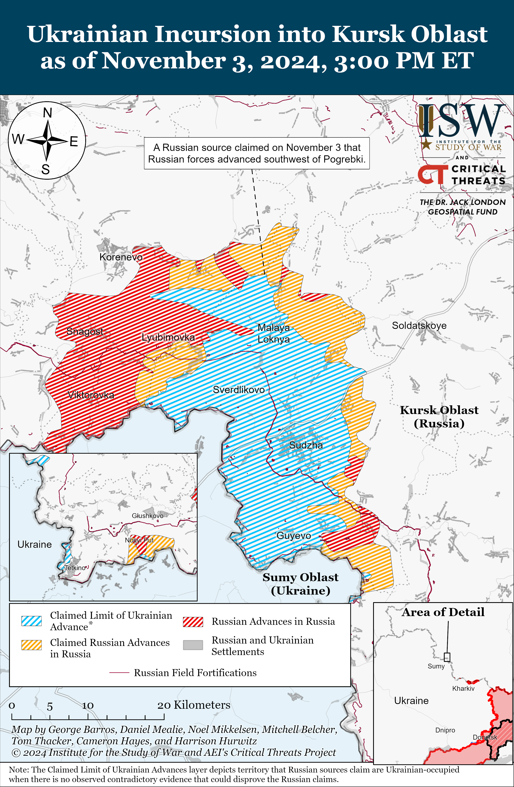
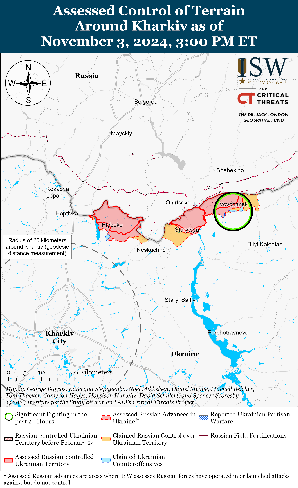
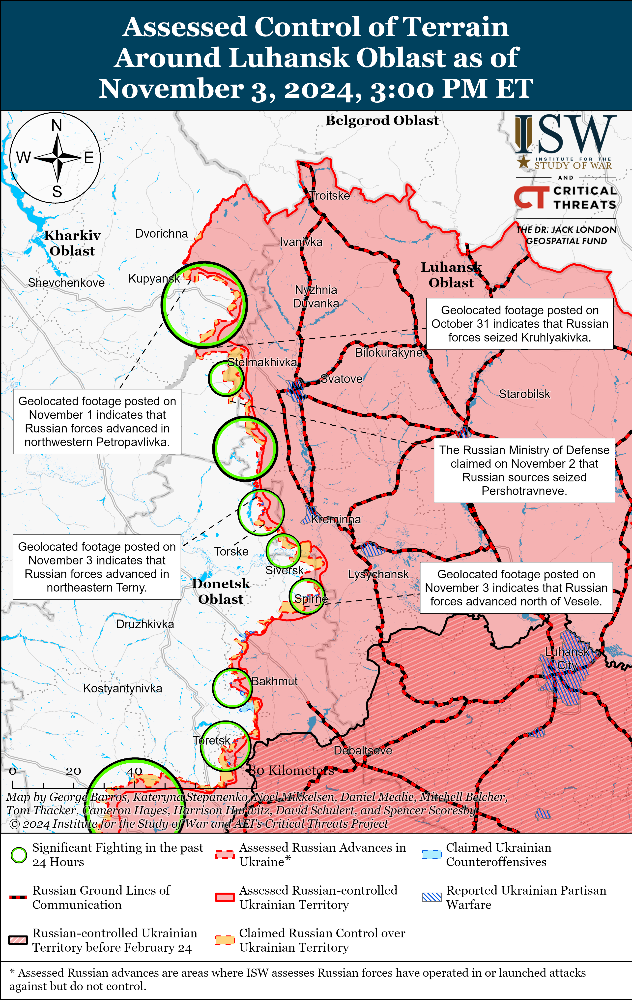
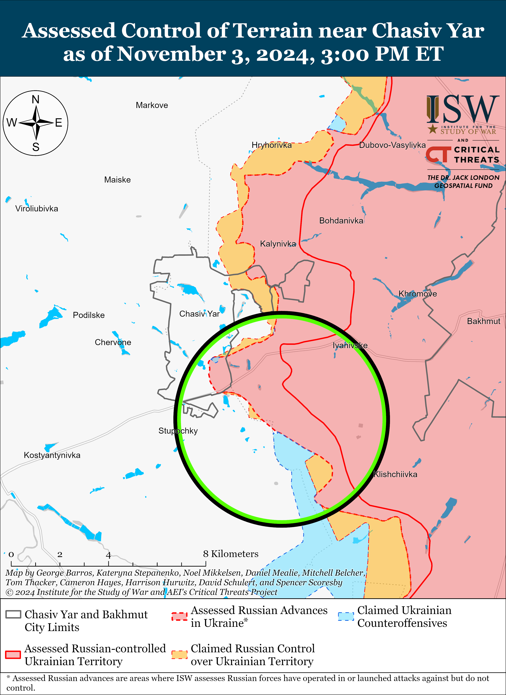
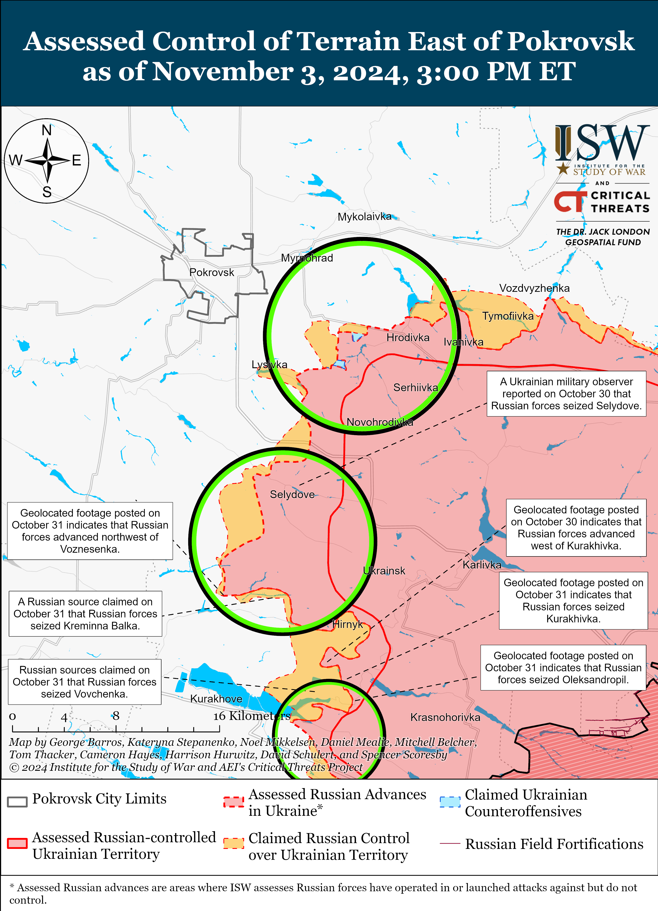
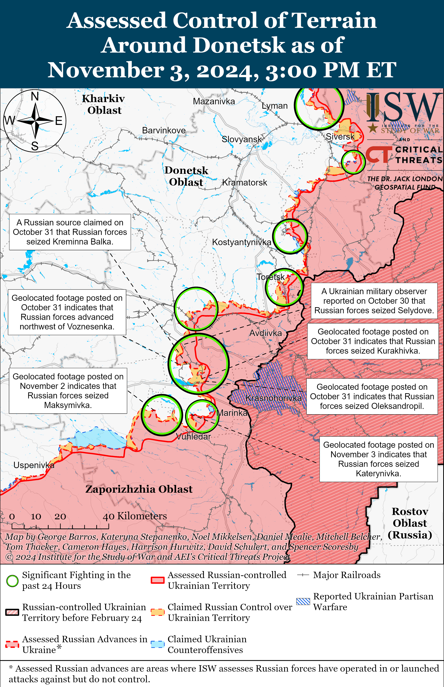
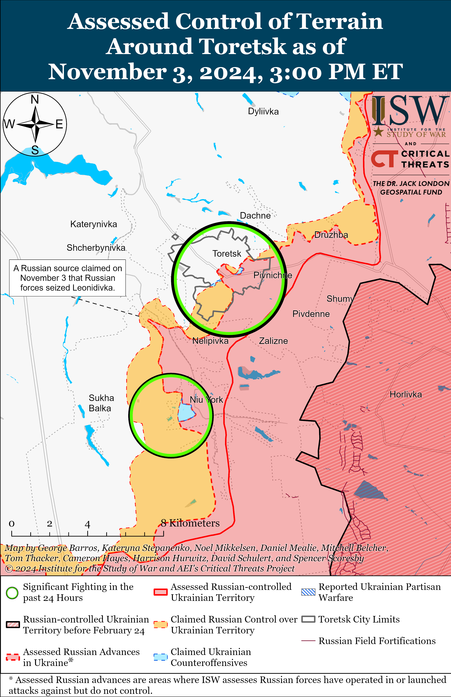
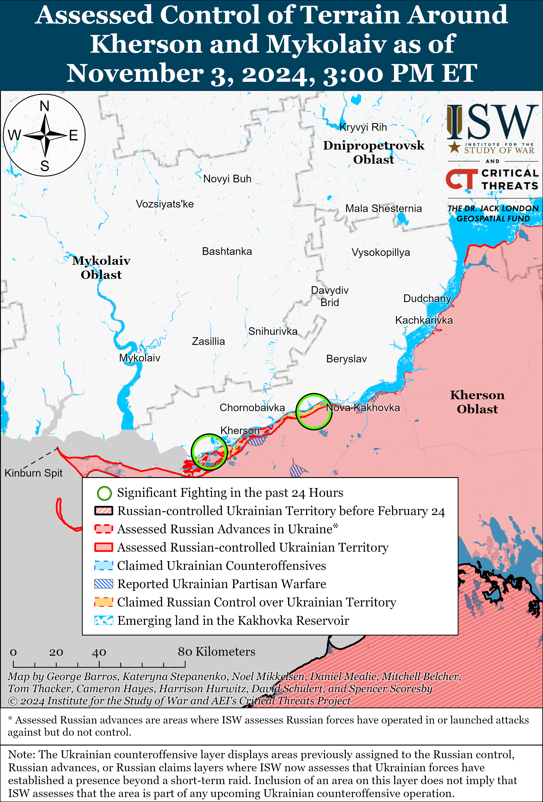
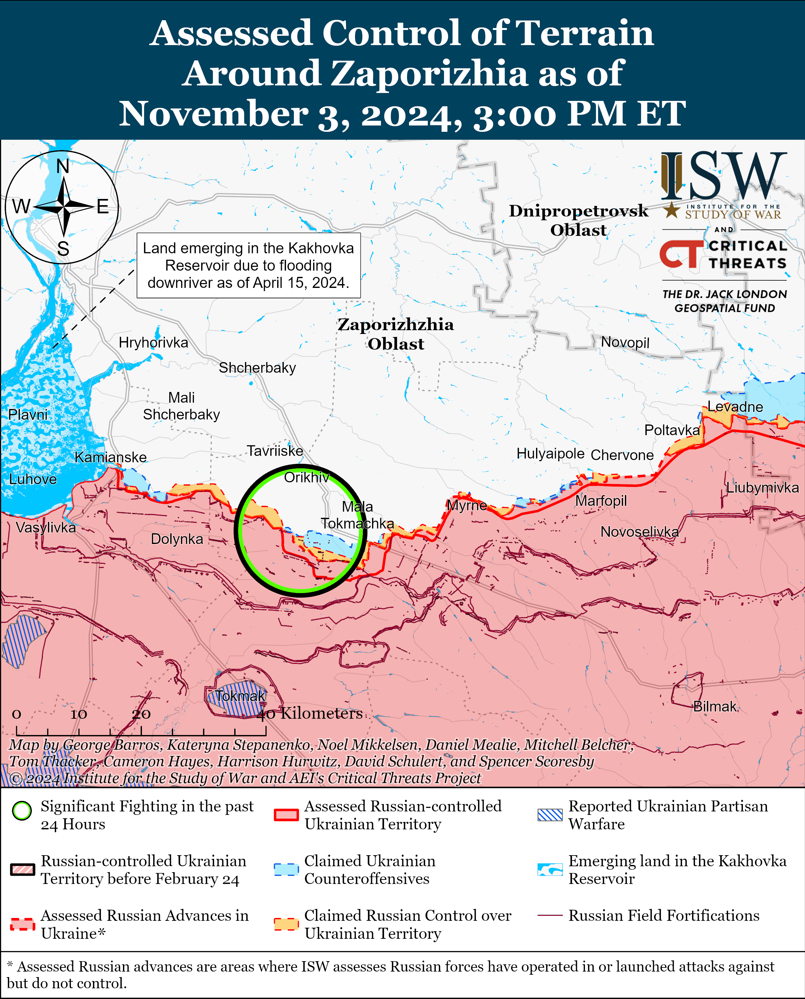

# Russian Offensive Campaign Assessment, November 3, 2024

**November 3, 2024, 8pm ET**

**Click** [**here**](https://storymaps.arcgis.com/stories/36a7f6a6f5a9448496de641cf64bd375) **to see ISW’s interactive map of the Russian invasion of Ukraine. This map is updated daily alongside the static maps present in this report.**

**Click** [**here**](https://storymaps.arcgis.com/stories/83a2f24901c941d581c0c523ecd2619b) **to see ISW's interactive map of Ukraine's offensive in Kursk Oblast.**

**Click** [**here**](https://understandingwar.maps.arcgis.com/apps/instant/3dviewer/index.html?appid=1602762dbcde419bb957dea358449580) **to see ISW’s 3D control of terrain topographic map of Ukraine. Use of a computer (not a mobile device) is strongly recommended for using this data-heavy tool.**

**Click** [**here**](https://storymaps.arcgis.com/stories/733fe90805894bfc8562d90b106aa895) **to access ISW’s archive of interactive time-lapse maps of the Russian invasion of Ukraine. These maps complement the static control-of-terrain map that ISW produces daily by showing a dynamic frontline. ISW will update this time-lapse map archive monthly.**

**Note: The data cut-off for this product was 1:30pm ET on November 3. ISW will cover subsequent reports in the November 4 Russian Offensive Campaign Assessment.**

**Incumbent Moldova President Maia Sandu has claimed victory in the Moldovan presidential runoff election held on November 3, 2024.[[1]](#_edn0951c9dcc02876b090baf7c10ece84311)** Preliminary results reported by the Moldovan Central Election Commission (CEC) show that Maia Sandu has won around 55 percent of the vote, defeating Kremlin-friendly presidential candidate Alexandr Stoianoglo.[[2]](#_edn0951c9dcc02876b090baf7c10ece84312) The Moldovan CEC reported on November 3 that over 54 percent of the Moldovan electorate voted in the presidential runoff elections compared to the approximately 51 percent voter turnout during the first election round held on October 20, 2024. The reported voter turnout for the runoff election is also over the minimum legal turnout requirement of 20 percent.[[3]](#_edn0951c9dcc02876b090baf7c10ece84313) ISW will cover the final result of the runoff Moldovan presidential elections on November 4 after the Moldovan CEC finishes counting all votes, including votes from the Moldovan diaspora voters whose votes take longer to count due to time zone differences.

**Moldovan authorities reported extensive Russian interference and sabotage efforts during the runoff presidential elections held on November 3, 2024, in a likely effort to favor pro-Kremlin Stoianoglo.** Sandu’s National Security Advisor Stanislav Secrieru warned on November 3 of significant Russian interference in the runoff election, noting the organization of voter transport in Transnistria (which is illegal under Moldovan law); the organization of buses and charter flights from Russia to polling stations in Azerbaijan, Turkey, and Belarus; the distribution of vouchers to Moldovan voters in Moscow; and cyberattacks against the Moldova CEC's voter education site.[[4]](#_edn0951c9dcc02876b090baf7c10ece84314) Moldovan Independent Press Agency *IPN* reported on November 2 that Russian authorities preemptively transported 150 Moldovan citizens from Russia to Moldova via Turkey for free in a concerted effort to maximize the voter base of Kremlin-friendly Stoianoglo.[[5]](#_edn0951c9dcc02876b090baf7c10ece84315) Moldovan authorities also notified numerous Western countries about Russian efforts to disrupt Moldovan diaspora voting abroad by creating false bomb threats at polling stations.[[6]](#_edn0951c9dcc02876b090baf7c10ece84316)  The Moldovan diaspora notably largely favored Sandu in the first round of the presidential elections. Moldovan Prime Minister Dorin Recean stated that Moldovans throughout the country had received anonymous “death threats” through phone calls, likely as part of a scare tactic to sway election results.[[7]](#_edn0951c9dcc02876b090baf7c10ece84317) ISW previously reported on large-scale Russian intervention efforts in the first round of the 2024 Moldovan presidential elections in order to enhance the outcome in favor of Stoianoglo and against Moldova’s European Union (EU) referendum vote, which ultimately passed by a small margin.[[8]](#_edn0951c9dcc02876b090baf7c10ece84318) Sandu stated on October 21 that "criminal groups" and "foreign forces" — likely referring to Russia and Kremlin-linked Moldovan opposition politician Ilan Shor — used tens of millions of euros to spread propaganda to destabilize Moldova.[[9]](#_edn0951c9dcc02876b090baf7c10ece84319) Sandu also stated that Moldovan authorities had evidence that the criminal groups wanted to buy 300,000 Moldovan votes during the first round of presidential elections and that the scale of fraud was "unprecedented.”[[10]](#_edn0951c9dcc02876b090baf7c10ece843110)

**The Russian Ministry of Defense's (MoD) efforts to centralize control over informal Russian drone operation units may degrade the effectiveness of Russian drone capabilities.** Russian opposition outlet *Vazhnye Istorii* (*iStories*) gathered several accounts from Russian milbloggers complaining that the Russian military command is systematically disbanding informal Russian drone operation units and committing experienced drone operators to infantry assaults, resulting in high casualties among drone operators.[[11]](#_edn0951c9dcc02876b090baf7c10ece843111) Some milbloggers explained that the Russian military command prioritizes attritional, infantry-led ”meat” assaults and lacks the manpower necessary to continue these assaults, and noted that some companies have 90 people of whom only 20 are regular assault personnel — with the rest being informal drone operators, communications specialists, and troops supporting evacuations of dead and wounded personnel. Some Russian milbloggers, however, connected the trend to the Russian MoD’s recent efforts to form “joint technical drone battalions” and the MoD’s “Rubikon” Center for Prospective Unmanned Technologies. A milblogger and advisor to the Kursk Oblast Governor claimed that the Russian military commanders seem to be afraid that the Russian MoD will deprive them of available manpower for assaults by reallocating drone operators from their current units to Russian MoD-operated “technical drone battalions,” and are instead committing these drone operators to assaults to sabotage this effort. Russian milbloggers also criticized the Russian MoD’s efforts to create separate, specialized “technical drone battalions,” citing the lack of a joint Russian communications system that would allow dedicated drone units to closely coordinate with assault units. Russian milbloggers also complained that it would take the Russian MoD a long time to establish communications between newly centralized drone units and assault units, which will result in Russian assault elements temporarily losing drone coverage. ISW recently reported on the milblogger backlash regarding the deaths of two Russian drone operators of the 87th Separate Rifle Regiment of the 1st "Slavic" Motorized Rifle Brigade (51st CAA), Dmitry Lysakovsky (alias Goodwin) and Lieutenant Colonel Sergey Gritsai (alias Ernest), after both were committed to infantry assaults in Donetsk Oblast.[[12]](#_edn0951c9dcc02876b090baf7c10ece843112) The reduction in Russian drone specialists may also at least temporarily inhibit Russian drone operations if the Russian MoD continues its centralization efforts.

**Ukrainian Human Rights Ombudsman Dmytro Lubinets refuted a Russian information operation about prisoner of war (POW) exchanges aimed at destabilizing Ukrainian society and undermining Ukrainians' trust in their government.[[13]](#_edn0951c9dcc02876b090baf7c10ece843113)** Lubinets responded on November 2 to claims from Russian Human Rights Ombudsman Tatyana Moskalkova and Russian Ministry of Foreign Affairs (MFA) Spokesperson Maria Zakharova falsely accusing Ukrainian authorities of attempting to sabotage the POW exchange processes and deliberately refusing to return all Ukrainian POWs from Russian captivity.[[14]](#_edn0951c9dcc02876b090baf7c10ece843114) Lubinets directly called on Moskalkova to provide Ukraine with a list of all Ukrainian POWs whom Russia is willing to return and reiterated that Ukraine is ready to accept all lists of POWs from Russian authorities, accusing the Russian government of holding up the POW exchange processes.[[15]](#_edn0951c9dcc02876b090baf7c10ece843115) Russia and Ukraine have engaged in more frequent POW exchanges since the start of Ukraine's incursion into Kursk Oblast in August 2024 following a months-long period of minimal POW exchanges, during which Ukraine had to reportedly construct a third POW camp for Russian POWs in Ukraine. Ukrainian officials also reported at the time that Russian authorities were the cause of the significant delays in POW exchanges.[[16]](#_edn0951c9dcc02876b090baf7c10ece843116) Kremlin information operations centered around POWs also likely intend to distract from the Kremlin's own efforts to disrupt the POW exchange process and from consistent reports of Russian human rights abuses, including executions, against Ukrainian POWs.[[17]](#_edn0951c9dcc02876b090baf7c10ece843117)

**Key Takeaways:**

- **Incumbent Moldova President Maia Sandu has claimed victory in the Moldovan presidential runoff election held on November 3, 2024.**
- **Moldovan authorities reported extensive Russian interference and sabotage efforts during the runoff presidential elections held on November 3, 2024, in a likely effort to favor pro-Kremlin Stoianoglo.**
- **The Russian Ministry of Defense's (MoD) efforts to centralize control over informal Russian drone operation units may degrade the effectiveness of Russian drone capabilities.**
- **Ukrainian Human Rights Ombudsman Dmytro Lubinets refuted a Russian information operation about prisoner of war (POW) exchanges aimed at destabilizing Ukrainian society and undermining Ukrainians' trust in their government.**
- **Ukrainian Human Rights Ombudsman Dmytro Lubinets refuted a Russian information operation about prisoner of war (POW) exchanges aimed at destabilizing Ukrainian society and undermining Ukrainians' trust in their government.**
- **Russian forces recently advanced near Siversk, Pokrovsk, Kurakhove, and Vuhledar in Donetsk Oblast.**
- **A Ukrainian official reported that Russian naval infantry units cannot be considered “elite” due to a lack of specialized training for new recruits and because Ukrainian forces have destroyed the main core of the Russian professional army since the start of the Russian full-scale invasion.**

***We do not report in detail on Russian war crimes because these activities are well-covered in Western media and do not directly affect the military operations we are assessing and forecasting. We will continue to evaluate and report on the effects of these criminal activities on the Ukrainian military and the Ukrainian population and specifically on combat in Ukrainian urban areas. We utterly condemn Russian violations of the laws of armed conflict and the Geneva Conventions and crimes against humanity even though we do not describe them in these reports.***

- Ukrainian Operations in the Russian Federation
- Russian Main Effort – Eastern Ukraine (comprised of three subordinate main efforts)
- Russian Subordinate Main Effort #1 – Push Ukrainian forces back from the international border with Belgorod Oblast and approach to within tube artillery range of Kharkiv City
- Russian Subordinate Main Effort #2 – Capture the remainder of Luhansk Oblast and push westward into eastern Kharkiv Oblast and encircle northern Donetsk Oblast
- Russian Subordinate Main Effort #3 – Capture the entirety of Donetsk Oblast
- Russian Supporting Effort – Southern Axis
- Russian Air, Missile, and Drone Campaign
- Russian Mobilization and Force Generation Efforts
- Russian Technological Adaptations
- Activities in Russian-occupied areas
- Significant Activity in Belarus

**Ukrainian Operations in the Russian Federation**

Russian forces reportedly recently advanced in the main Ukrainian salient in Kursk Oblast amid continued fighting on November 3. Russian milbloggers claimed that Russian forces advanced in fields north and northwest of Pogrebki (northwest of Sudzha) and near Novaya Sorochina (immediately south of Pogrebki), and captured a windbreak east of Malaya Loknya (immediately south of Novaya Sorochina), but ISW has not observed visual confirmation of these claims.[[18]](#_edn0951c9dcc02876b090baf7c10ece843118) A Russian milblogger claimed that Russian forces also attacked southeast of Korenevo near Lyubimovka and Tolsty Lug.[[19]](#_edn0951c9dcc02876b090baf7c10ece843119) The Russian Ministry of Defense (MoD) claimed that Russian forces repelled Ukrainian counterattacks near Malaya Loknya, Novoivanovka (southeast of Korenevo), and Plekhovo (south of Sudzha) on November 2 and 3.[[20]](#_edn0951c9dcc02876b090baf7c10ece843120)

Neither Russian nor Ukrainian sources reported ground fighting in Glushkovsky Raion (west of the main Ukrainian salient in Kursk Oblast) on November 3.

Russian officials claimed that Russian forces downed 16 drones near Novoshakhtinsk, Kamensk, and Ust-Donetsk, Rostov Oblast overnight on November 2 and 3.[[21]](#_edn0951c9dcc02876b090baf7c10ece843121) Russian opposition outlet *Astra* published footage of a large fire allegedly from a drone strike near Novocherkassk, Rostov Oblast.[[22]](#_edn0951c9dcc02876b090baf7c10ece843122)

**Russian Main Effort – Eastern Ukraine**

**Russian Subordinate Main Effort #1 – Kharkiv Oblast** **(Russian objective: Push Ukrainian forces back from the international border with Belgorod Oblast and approach to within tube artillery range of Kharkiv City)**

Russian forces continued limited offensive operations northeast of Kharkiv City near Vovchansk and Hatyshche (northwest of Vovchansk) on November 2 and 3 but did not advance.[[23]](#_edn0951c9dcc02876b090baf7c10ece843123) A spokesperson of a Ukrainian brigade operating in the Kharkiv direction stated that Russian forces are taking advantage of deteriorating weather to advance, conduct small infantry assaults, and fortify positions north of Kharkiv Oblast before the cold season begins, especially north of Kharkiv City near Lyptsi where the ground has begun to freeze.[[24]](#_edn0951c9dcc02876b090baf7c10ece843124) Dehtyarov reported that Russian forces have been using civilian vehicles instead of armored vehicles in recent assaults and that Ukrainian forces are preparing anti-tank fortifications in case Russia is accumulating forces and means for future offensive operations in northern Kharkiv Oblast.[[25]](#_edn0951c9dcc02876b090baf7c10ece843125)

**Russian Subordinate Main Effort #2 – Luhansk Oblast** **(Russian objective: Capture the remainder of Luhansk Oblast and push westward into eastern Kharkiv Oblast and northern Donetsk Oblast)**

Russian forces recently advanced west of Svatove and northwest of Kreminna amid continued offensive operations along the Kupyansk-Svatove-Kreminna line on November 3. Geolocated footage published on November 3 indicates that Russian forces recently advanced on the eastern outskirts of Andriivka (west of Svatove) and in northern Terny (northwest of Kreminna).[[26]](#_edn0951c9dcc02876b090baf7c10ece843126) A Russian milblogger claimed on November 2 and 3 that Russian forces advanced half a kilometer in depth within Petropavlivka (east of Kupyansk) and cleared a forest area near Stelmakhivka (west of Svatove), and another milblogger denied other claims that Russian forces entered Serebryanka (northwest of Kreminna).[[27]](#_edn0951c9dcc02876b090baf7c10ece843127) The Ukrainian General Staff reported that Russian forces continued offensive operations north of Kupyansk near Holubivka; northeast of Kupyansk near Synkivka; east of Kupyansk near Petropavlivka; southeast of Kupyansk near Kolisnykivka, Kruhlyakivka, Lozova, Stepova Novoselivka, Zahryzove, Berestove, and Pishchane;  west of Svatove near Vyshneve, Pershotravneve, and Zelenyi Hai; southwest of Svatove near Druzhelyubivka and Hrekivka; west of Kremmina near Yampolivka, Torske, and Terny; and southwest of Kremmina near Dibrova and in the Serebryanske forest area on November 2 and 3.[[28]](#_edn0951c9dcc02876b090baf7c10ece843128) A Russian milblogger claimed on November 3 that Ukrainian forces  counterattacked near Kolisynkivka and Kruhlyakivka.[[29]](#_edn0951c9dcc02876b090baf7c10ece843129) A spokesperson of a Ukrainian brigade operating in the Lyman direction reported that Russian forces are conducting assaults with wounded personnel to maintain the intensity of infantry assaults.[[30]](#_edn0951c9dcc02876b090baf7c10ece843130)

**Russian Subordinate Main Effort #3 – Donetsk Oblast** **(Russian objective: Capture the entirety of Donetsk Oblast, the claimed territory of Russia’s proxies in Donbas)**

Russian forces recently launched a battalion-sized mechanized assault southeast of Siversk and marginally advanced. Geolocated footage published on November 2 shows Ukrainian forces repelling a Russian battalion-sized mechanized assault involving around 120 Russian servicemen, seven tanks, 13 infantry fighting vehicles (BMPs), and two MT-LB amphibious armored personnel carriers northeast of Vesele and south of Ivano-Darivka (both southeast of Siversk).[[31]](#_edn0951c9dcc02876b090baf7c10ece843131) The geolocated footage indicates that Russian forces marginally advanced in the areas northeast of Vesele and south Ivano-Darivka. The Ukrainian brigade involved in repelling the assault reported that Ukrainian forces destroyed six Russian tanks and nine BMPs and killed 19 Russian personnel while wounding 23.[[32]](#_edn0951c9dcc02876b090baf7c10ece843132) Russian forces also continued offensive operations southeast of Siversk near Ivano-Darivka and Vyimka on November 2.[[33]](#_edn0951c9dcc02876b090baf7c10ece843133) Elements of the Russian 85th Motorized Rifle Brigade (3rd Combined Arms Army [CAA], formerly 2nd Luhansk People's Republic Army Corps [LNR AC]) and artillery elements of the 2nd Guards Artillery Brigade (3rd CAA) are reportedly operating in the Siversk direction.[[34]](#_edn0951c9dcc02876b090baf7c10ece843134)

Russian forces reportedly continued assaults in Chasiv Yar and south of Chasiv Yar near Predtechnyne  on November 2 and 3 but did not advance.[[35]](#_edn0951c9dcc02876b090baf7c10ece843135) Ukrainian military officials reported that Russian forces continue to cross the Siverskyi Donets-Donbas Canal in small assault groups and hide in Chasiv Yar’s urban area but have not secured enduring positions west of the canal.[[36]](#_edn0951c9dcc02876b090baf7c10ece843136) The head of a Ukrainian brigade’s electronic warfare (EW) service stated that Russian forces are using a large number of newly developed EW rifles that have not been effective against Ukrainian first-person view (FPV) drones.[[37]](#_edn0951c9dcc02876b090baf7c10ece843137) The EW service head added that Russian forces appear to be transferring experienced drone operators from different frontlines to reinforce prioritized operational directions, and that Russian drone capabilities in the Chasiv Yar direction had worsened given the low quality of Russian drone operators in the area.[[38]](#_edn0951c9dcc02876b090baf7c10ece843138) Elements of the Russian 98th Airborne Division are reportedly operating in the Chasiv Yar direction, and elements of the 6th Motorized Rifle Division (3rd AC) are operating near Klishchiivka (southeast of Chasiv Yar).[[39]](#_edn0951c9dcc02876b090baf7c10ece843139)

Russian sources, including the Russian Ministry of Defense (MoD), claimed that Russian forces seized Leonidivka (southwest of Toretsk) on November 1, but ISW cannot independently verify these claims.[[40]](#_edn0951c9dcc02876b090baf7c10ece843140) Russian forces continued to attack in eastern Toretsk and southwest of Toretsk near Shcherbynivka on November 2 and 3.[[41]](#_edn0951c9dcc02876b090baf7c10ece843141) Ukrainian Luhansk Group of Forces Spokesperson Major Anastasiya Bobovnikova reported that Ukrainian forces stabilized the frontline in eastern Toretsk but noted that Russian forces are bringing up reserves and equipment and are mounting EW systems on military equipment likely to intensify offensive operations in the area.[[42]](#_edn0951c9dcc02876b090baf7c10ece843142)

Russian sources claimed that Russian forces advanced south and southeast of Pokrovsk on November 2 and 3, but ISW has not observed visual confirmation of these claims. Russian milbloggers claimed that Russian forces advanced to the eastern part of Novooleksiivka (south of Pokrovsk and west of Selydove) and southeast of Lysivka (southeast of Pokrovsk).[[43]](#_edn0951c9dcc02876b090baf7c10ece843143) The Russian MoD claimed on November 3 that Russian forces seized Vyshneve (west of Selydove), although ISW has not observed Russian forces operating in the northwestern part of the settlement as of this publication.[[44]](#_edn0951c9dcc02876b090baf7c10ece843144) Russian forces continued assaults east of Pokrovsk near Mykolaivka, Promin, Sukha Balka, and Myrolyubivka; south of Pokrovsk near Vyshneve; and southeast of Pokrovsk near Krutyi Yar, Selydove, Sukhyi Yar, and Novohrodivka.[[45]](#_edn0951c9dcc02876b090baf7c10ece843145)

Russian sources claimed that Russian forces advanced north of Kurakhove on November 2 and 3. Russian milbloggers claimed that Russian forces advanced northeast and southeast of Novodmytrivka and southeast of Novoselydivka (both north of Kurakhove).[[46]](#_edn0951c9dcc02876b090baf7c10ece843146) Russian forces continued offensive operations north of Kurakhove near Novoselydivka, Novodmytrivka, and Kreminna Balka; northeast of Kurakhove near Hostre, Vovchanka, and Illinka; and east of Kurakhove near Maksymilyanivka.[[47]](#_edn0951c9dcc02876b090baf7c10ece843147) A spokesperson of a Ukrainian brigade reported that Russian forces continue to launch mechanized assaults in the Kurakhove direction and that Ukrainian defensive operations have become significantly harder since Summer 2024.[[48]](#_edn0951c9dcc02876b090baf7c10ece843148) A Russian milblogger claimed that Russian forces are reprioritizing offensive operations from the south in the Kurakhove direction after Russian forces seized Vuhledar.[[49]](#_edn0951c9dcc02876b090baf7c10ece843149) Elements of the Russian ”Bashkirskiye Volki” (Bashkir Wolves) detachment are reportedly operating in the Kurakhove direction.[[50]](#_edn0951c9dcc02876b090baf7c10ece843150)

Russian forces recently advanced northeast and northwest of Vuhledar amid continued offensive operations on November 2 and 3. Geolocated footage published on November 2 showed that elements of the Russian 33rd Motorized Rifle Regiment (20th Guards Motorized Rifle Division, 8th CAA, Southern Military District [SMD]) advanced in eastern Antonivka (northeast of Vuhledar), and that elements of the 36th Separate Motorized Rifle Brigade (29th CAA, Eastern Military District [EMD]) seized Maksymivka (northwest of Vuhledar).[[51]](#_edn0951c9dcc02876b090baf7c10ece843151) Geolocated footage published on November 3 also shows that Russian forces seized Katerynivka (northeast of Vuhledar) and advanced towards a bridge east of Yelyzavetivka (northwest of Katerynivka).[[52]](#_edn0951c9dcc02876b090baf7c10ece843152) Russian milbloggers also claimed that Russian forces advanced in the fields between Maksymivka and Yasna Polyana (southwest of Maksymivka), but ISW has not observed visual confirmation of these claims.[[53]](#_edn0951c9dcc02876b090baf7c10ece843153) Russian forces continued assaults north of Vuhledar near Trudove; northeast of Vuhledar near Antonivka, Katerynivka, and Kostyantynivka; and northwest of Vuhledar near Maksymivka on November 2 and 3.[[54]](#_edn0951c9dcc02876b090baf7c10ece843154)

Ukrainian and Russian sources did not report fighting in the Donetsk-Zaporizhia Oblast border area on November 3.

   

**Russian Supporting Effort – Southern Axis** **(Russian objective: Maintain frontline positions and secure rear areas against Ukrainian strikes)**

Russian forces reportedly marginally advanced during localized ground attacks in western Zaporizhia Oblast on November 3. Russian milbloggers claimed on November 3 that Russian forces advanced northeast and 1.5 kilometers in width northwest of Robotyne, northwest of Verbove (east of Robotyne), and 1.2 kilometers deep along a five-kilometer wide front southwest of Novopokrovka (northeast of Robotyne).[[55]](#_edn0951c9dcc02876b090baf7c10ece843155) ISW has not observed visual confirmation of these Russian claims, however. The Ukrainian General Staff reported that Russian forces conducted ground attacks near Robotyne, Yurkivka (northwest of Robotyne), Novodanylivka (north of Robotyne), and Mala Tokmachka (northeast of Robotyne) on November 2 and 3.[[56]](#_edn0951c9dcc02876b090baf7c10ece843156) Elements of the Russian 64th Motorized Rifle Brigade (35th Combined Arms Army [CAA], Eastern Military District [EMD]) and the 291st Motorized Rifle Regiment (42nd Motorized Rifle Division, 58th CAA, Southern Military District [SMD]) are reportedly operating in the Zaporizhia direction.[[57]](#_edn0951c9dcc02876b090baf7c10ece843157)

Russian forces conducted localized ground attacks in east (left) bank Kherson Oblast on November 3. The Ukrainian General Staff reported that Russian forces conducted offensive operations in east bank Kherson Oblast and in the Dnipro River delta near Kozachi Laheri, Dnipryany, and Kozatskyi Island on November 2 and 3.[[58]](#_edn0951c9dcc02876b090baf7c10ece843158) A Russian milblogger claimed on November 2 that Ukrainian forces conducted unsuccessful counterattacks on islands in the Dnipro River delta.[[59]](#_edn0951c9dcc02876b090baf7c10ece843159) Elements of the Russian 18th Combined Arms Army ([CAA], Southern Military District [SMD]) reportedly continue to operate in the Dnipro River delta area.[[60]](#_edn0951c9dcc02876b090baf7c10ece843160)

** **

**Russian Air, Missile, and Drone Campaign** **(Russian Objective: Target Ukrainian military and civilian infrastructure in the rear and on the frontline)**

Russian forces conducted a series of drone and missile strikes against Ukraine during the day on November 2 and on the night of November 2 to 3. The Ukrainian Air Force reported on November 3 that Russian forces launched one Kh-59/69 guided air missile from airspace over Kursk Oblast and 96 Shahed-type and other unspecified strike drones from Bryansk Oblast, Kursk Oblast, and Primorsko-Akhtarsk, Krasnodar Krai.[[61]](#_edn0951c9dcc02876b090baf7c10ece843161) The Ukrainian Air Force reported that Ukrainian forces downed 66 drones and one Kh-59/69 guided air missile over Kyiv, Sumy, Khmelnytskyi, Zhytomyr, Mykolaiv, Odesa, Cherkasy, Chernihiv, Kirovohrad, Poltava, Dnipropetrovsk, and Kharkiv oblasts; that 27 drones were “locally lost,” likely due to Ukrainian electronic warfare (EW) interference; that one drone crossed into Belarusian airspace; and that two drones remained in Ukrainian airspace 0900 local time.[[62]](#_edn0951c9dcc02876b090baf7c10ece843162)  Dnipropetrovsk Oblast Head Serhii Lysak reported that a Russian missile strike damaged railway infrastructure and injured eight civilians in Dniprovskyi Raion, Dnipropetrovsk Oblast during the day on November 2.[[63]](#_edn0951c9dcc02876b090baf7c10ece843163) A Russian milblogger claimed that Russian force used an Iskander ballistic missile to strike a train with Ukrainian military equipment in Dnipropetrovsk Oblast, but ISW cannot verify this claim.[[64]](#_edn0951c9dcc02876b090baf7c10ece843164) Kyiv City Military Administration reported on November 3 that Russian drone debris in Kyiv damaged a road in the Shevchenkivskyi Raion; fell on an open area in Holosiivskyi Raion and resulted in a fire; and fell on an open area in Desnyanskyi Raion.[[65]](#_edn0951c9dcc02876b090baf7c10ece843165) Sumy City Mayor Mykola Noha reported on November 3 that Russian forces struck Shostka, Sumy Oblast with eight drones targeting civilian infrastructure.[[66]](#_edn0951c9dcc02876b090baf7c10ece843166)

Ukrainian Air Force Spokesperson Colonel Yurii Ihnat explained on November 3 that the Ukraine shoot down rate of Shahed drones has not decreased and that over the past two months (September and October 2024) Russian forces have been using drones of “unidentified type.” Ihnat stated that these unidentified drones are inexpensive imitations of Shahed drones instead of real ones. Ihnat stated that half of these imitation drones become designated as locally “lost.”[[67]](#_edn0951c9dcc02876b090baf7c10ece843167)

Ukrainian President Volodymyr Zelensky stated on November 3 that Russia launched 900 bombs, 30 missiles, and nearly 500 Shaheds drones over the past week with most of these targeting Ukrainian civilian infrastructure.[[68]](#_edn0951c9dcc02876b090baf7c10ece843168) Zelensky noted on November 2 that Russian forces launched more than 2,000 Shahed drones in October and that these drones have more than 170,000 components from China, the US, and Europe and advocated for more stringent monitoring of sanctions compliance and Russian imports.[[69]](#_edn0951c9dcc02876b090baf7c10ece843169)

**Russian Mobilization and Force Generation Efforts** **(Russian objective: Expand combat power without conducting general mobilization)**

Ukrainian Navy Spokesperson Captain Third Rank Dmytro Pletenchuk  reported on November 2 that the Russian naval infantry units cannot be considered “elite” due to lack of specialized training for new recruits and because Ukrainian forces have destroyed the main core of the Russian professional army since the start of the Russian full-scale invasion.[[70]](#_edn0951c9dcc02876b090baf7c10ece843170) Pletenchuk highlighted that the composition of Russian naval infantry forces does not significantly differ from other units, implying that formerly elite naval infantry forces are now operating like other infantry or mechanized infantry units due to lack of specialized training, as ISW has long assessed.

Russian authorities incentivize foreign nationals to join the Russian war effort in Ukraine by offering Russian citizenship to foreign recruits. Russian Ministry of Internal Affairs (MVD) Spokesperson Iryna Volk claimed on November 3 that Russian President Vladimir Putin granted Russian citizenship to 3,344 foreign nationals who fought alongside Russian forces in Ukraine since the start of 2024.[[71]](#_edn0951c9dcc02876b090baf7c10ece843171)

The Russian Ministry of Defense (MoD) published announced on November 2 that 200 students of the St. Petersburg Nakhimov Naval School’s Mariupol branch took an oath of allegiance to Russia before starting their studies.[[72]](#_edn0951c9dcc02876b090baf7c10ece843172) The Russian MoD claimed that students of ”over 30 Russian regions” participated in the oath ceremony, likely including students from occupied Ukrainian territories.

**Russian Technological Adaptations** **(Russian objective: Introduce technological innovations to optimize systems for use in Ukraine)**

Kremlin newswire *TASS*, citing a source in the Russian defense industry, claimed on November 3 that Russian specialists are testing a technology that would allow Russian forces to use decommissioned NATO satellites still in orbit for voice communications when electronic warfare (EW) systems block ground-based communication capabilities.[[73]](#_edn0951c9dcc02876b090baf7c10ece843173)

A Ukrainian source posted footage on November 2 reportedly showing that Russian forces have started to use new reconnaissance drones equipped with a camera and artificial intelligence (AI) capabilities that detect approaching drones and make sharp maneuvers to avoid being struck.[[74]](#_edn0951c9dcc02876b090baf7c10ece843174)

**Activities in Russian-occupied areas (Russian objective: Consolidate administrative control of annexed areas; forcibly integrate Ukrainian citizens into Russian sociocultural, economic, military, and governance systems)**

*ISW is not publishing reporting on activities in Russian-occupied areas today.*

**Significant activity in Belarus** **(Russian efforts to increase its military presence in Belarus and further integrate Belarus into Russian-favorable frameworks and Wagner Group activity in Belarus)**

Nothing significant to report.

**Note: ISW does not receive any classified material from any source, uses only publicly available information, and draws extensively on Russian, Ukrainian, and Western reporting and social media as well as commercially available satellite imagery and other geospatial data as the basis for these reports. References to all sources used are provided in the endnotes of each update.**

[[1]](#_edn0951c9dcc02876b090baf7c10ece8431ref1) <https://www.reuters.com/world/europe/moldova-holds-presidential-runoff-election-amid-claims-russian-meddling-2024-11-03/>; https://x.com/sandumaiamd/status/1853209669390516499

[[2]](#_edn0951c9dcc02876b090baf7c10ece8431ref2) <https://pv.cec> dot md/cec-presidential-results-tour2.html

[[3]](#_edn0951c9dcc02876b090baf7c10ece8431ref3) <https://www.aa.com> dot tr/en/europe/voting-ends-in-moldovas-presidential-runoff-with-turnout-of-over-54-/3383180; <https://pv.cec.md/>; <https://t.me/tass_agency/283265>; <https://t.me/tass_agency/283274>; <https://www.pravda.com> dot ua/eng/news/2024/11/3/7482765/

[[4]](#_edn0951c9dcc02876b090baf7c10ece8431ref4) <https://x.com/StasSecrieru/status/1853040491224330412>; https://www.zdg dot md/stiri/video-randuri-la-sectiile-de-votare-din-minsk-si-istanbul-cu-drapele-ale-r-moldova-gagauziei-si-rusiei-exista-unele-indicii-de-turism-electoral/4; [https://tv8](https://tv8/) dot md/ru/2024/11/03/politsiya-fiksiruet-organizovannii-podvoz-izbiratelei-v-turtsii-azerbaidzhane-i-belarusi/268838; [https://point](https://point/) dot md/ru/novosti/obschestvo/nabliudateli-soobshchaiut-o-nezakonnykh-priamykh-transliatsiiakh-s-uchastkov-v-italii-i-estonii/; [https://newsmaker](https://newsmaker/) dot md/rus/novosti/eto-deja-vu-spiker-igor-grosu-obvinil-kriminalnye-gruppirovki-v-podvoze-izbirateley/; https://t.me/tass\_agency/283291; https://t.me/tass\_agency/283304

[[5]](#_edn0951c9dcc02876b090baf7c10ece8431ref5) https://suspilne dot media/871589-dzerela-ipn-150-gromadan-moldovi-bezplatno-povernulisa-z-rf-naperedodni-viboriv/; https://www.ipn dot md/ro/moldovenii-se-intorc-din-rusia-cu-transport-gratuit-pentru-a-participa-la-aleger-8013\_1108645.html

[[6]](#_edn0951c9dcc02876b090baf7c10ece8431ref6) https://www.reuters.com/world/europe/moldova-claims-russia-plans-disrupt-expatriate-voting-sundays-runoff-2024-11-02/  ; https://www.ipn dot md/ro/rusia-vrea-sa-intrerupa-votul-in-diaspora-prin-alerte-7978\_1108677.html

[[7]](#_edn0951c9dcc02876b090baf7c10ece8431ref7) https://apnews.com/article/moldova-presidential-election-russia-corruption-fraud-5886447779a4a818e9f30fdadcb8bbe5

[[8]](#_edn0951c9dcc02876b090baf7c10ece8431ref8) <https://understandingwar.org/backgrounder/russian-offensive-campaign-assessment-october-21-2024>; <https://www.understandingwar.org/backgrounder/possible-russian-gains-georgia-and-moldova>; https://www.reuters.com/world/europe/top-moldovan-court-recognises-eu-referendum-results-2024-10-31/

[[9]](#_edn0951c9dcc02876b090baf7c10ece8431ref9) https://newsmaker dot md/ro/dimensiunea-fraudei-este-fara-precedent-maia-sandu-dupa-afisarea-primelor-rezultatele/; https://x.com/sandumaiamd/status/1848130004028125266

[[10]](#_edn0951c9dcc02876b090baf7c10ece8431ref10) <https://www.reuters.com/world/europe/moldova-votes-election-eu-referendum-shadow-alleged-russian-meddling-2024-10-20/>; <https://www.rferl.org/a/moldova-police-accuse-shor-russia-oligarch-39m-vote-buying/33172951.html>;

[[11]](#_edn0951c9dcc02876b090baf7c10ece8431ref11) https://t.me/RSaponkov/9590 ; <https://t.me/ramzayiegokomanda/18657>; <https://t.me/istories_media/8014>; <https://t.me/mod_russia/44389>; <https://t.me/Alekhin_Telega/11968>; <https://t.me/ramzayiegokomanda/18657> ; <https://t.me/zhivoff/17745>

[[12]](#_edn0951c9dcc02876b090baf7c10ece8431ref12) <https://www.understandingwar.org/backgrounder/russian-offensive-campaign-assessment-september-21-2024>; https://www.understandingwar.org/backgrounder/russian-offensive-campaign-assessment-october-22-2024

[[13]](#_edn0951c9dcc02876b090baf7c10ece8431ref13) https://t.me/dmytro\_lubinetzs/7116; https://suspilne dot media/871615-ataka-na-kiiv-vijska-rf-obstrilali-zaliznicnu-stanciu-na-dnipropetrovsini-984-den-vijni-onlajn/?anchor=live\_1730620564&utm\_source=copylink&utm\_medium=ps ;

[[14]](#_edn0951c9dcc02876b090baf7c10ece8431ref14) https://www.interfax dot ru/russia/989965; <https://t.me/MID_Russia/47441>; <https://t.me/tass_agency/283214>; <https://t.me/tass_agency/283216>; <https://t.me/tass_agency/283226>; <https://t.me/bbcrussian/72323>; https://t.me/tass\_agency/283215

[[15]](#_edn0951c9dcc02876b090baf7c10ece8431ref15) https://t.me/dmytro\_lubinetzs/7116; https://suspilne dot media/871615-ataka-na-kiiv-vijska-rf-obstrilali-zaliznicnu-stanciu-na-dnipropetrovsini-984-den-vijni-onlajn/?anchor=live\_1730620564&utm\_source=copylink&utm\_medium=ps ;

[[16]](#_edn0951c9dcc02876b090baf7c10ece8431ref16) <https://www.understandingwar.org/backgrounder/russian-offensive-campaign-assessment-october-19-2024>; <https://www.understandingwar.org/backgrounder/russian-offensive-campaign-assessment-september-14-2024>; <https://www.understandingwar.org/backgrounder/russian-offensive-campaign-assessment-may-29-2024>; https://www.radiosvoboda dot org/a/news-tabir-dlia-viyskovopolonenykh/32971023.html; https://t.me/currenttime/35393

[[17]](#_edn0951c9dcc02876b090baf7c10ece8431ref17) https://www.understandingwar.org/backgrounder/russian-offensive-campaign-assessment-october-24-2024

[[18]](#_edn0951c9dcc02876b090baf7c10ece8431ref18) <https://t.me/rybar/65017>; <https://t.me/boris_rozhin/143145>; Malaya Loknya

[[19]](#_edn0951c9dcc02876b090baf7c10ece8431ref19) https://t.me/rybar/65017

[[20]](#_edn0951c9dcc02876b090baf7c10ece8431ref20) https://t.me/mod\_russia/45284

[[21]](#_edn0951c9dcc02876b090baf7c10ece8431ref21) https://t.me/golubev\_vu/1614

[[22]](#_edn0951c9dcc02876b090baf7c10ece8431ref22) https://t.me/astrapress/67657

[[23]](#_edn0951c9dcc02876b090baf7c10ece8431ref23) <https://www.facebook.com/GeneralStaff.ua/posts/pfbid02PGXygxMCC26Su5tvxX5ZHbCKwLihKBZM3mPgMQxQa7ghVtzP46fadgZV2cUxco1Kl> ; <https://www.facebook.com/GeneralStaff.ua/posts/pfbid02Qu13pGCFEKZ9K7qKMdTAFJGcpiBp5ZkPTYPBQN7LdDwe1XXHKpGwZg5jcNhKwePel> ; <https://www.facebook.com/GeneralStaff.ua/posts/pfbid0czZvRRWcWHZFAGC581Nm2MVeuhUeWYEkVdgmBojyxLr6VoUd8BpeXioXNtLMii1al>

[[24]](#_edn0951c9dcc02876b090baf7c10ece8431ref24) <https://armyinform> dot com.ua/2024/11/03/grunt-pidmerzaye-na-harkivshhyni-vorogu-dopomagayut-shvydshe-zakopatysya-na-toj-svit/; <https://youtu.be/aDXWlQ2K0dM>

[[25]](#_edn0951c9dcc02876b090baf7c10ece8431ref25) <https://armyinform> dot com.ua/2024/11/03/voseny-rosiyan-polichyly-ale-vzhe-ne-vylikuyut-zhovtnevi-vtraty-okupantiv-pidrahuvaly-v-hartiyi/; <https://youtu.be/aDXWlQ2K0dM>

[[26]](#_edn0951c9dcc02876b090baf7c10ece8431ref26) <https://t.me/creamy_caprice/7357>; <https://t.me/zsu44ombr/193> ; <https://t.me/creamy_caprice/7356>; <https://t.me/OMIBr_60/594> ; <https://t.me/creamy_caprice/7358> ; <https://t.me/OMBr67/1706>

[[27]](#_edn0951c9dcc02876b090baf7c10ece8431ref27) <https://t.me/DnevnikDesantnika/18503>  ; <https://t.me/boris_rozhin/143097>

[[28]](#_edn0951c9dcc02876b090baf7c10ece8431ref28)<https://www.facebook.com/GeneralStaff.ua/posts/pfbid02PGXygxMCC26Su5tvxX5ZHbCKwLihKBZM3mPgMQxQa7ghVtzP46fadgZV2cUxco1Kl> ; <https://www.facebook.com/GeneralStaff.ua/posts/pfbid02Qu13pGCFEKZ9K7qKMdTAFJGcpiBp5ZkPTYPBQN7LdDwe1XXHKpGwZg5jcNhKwePel> ; <https://www.facebook.com/GeneralStaff.ua/posts/pfbid0czZvRRWcWHZFAGC581Nm2MVeuhUeWYEkVdgmBojyxLr6VoUd8BpeXioXNtLMii1al> ; <https://www.facebook.com/GeneralStaff.ua/posts/pfbid02PGXygxMCC26Su5tvxX5ZHbCKwLihKBZM3mPgMQxQa7ghVtzP46fadgZV2cUxco1Kl> ; <https://www.facebook.com/GeneralStaff.ua/posts/pfbid02Qu13pGCFEKZ9K7qKMdTAFJGcpiBp5ZkPTYPBQN7LdDwe1XXHKpGwZg5jcNhKwePel>  ; <https://www.facebook.com/GeneralStaff.ua/posts/pfbid0czZvRRWcWHZFAGC581Nm2MVeuhUeWYEkVdgmBojyxLr6VoUd8BpeXioXNtLMii1al>

[[29]](#_edn0951c9dcc02876b090baf7c10ece8431ref29) https://t.me/DnevnikDesantnika/18503

[[30]](#_edn0951c9dcc02876b090baf7c10ece8431ref30) https://armyinform dot com.ua/2024/11/03/kalich-polky-rosiyany-prymushuyut-poranenyh-ity-v-bij/

[[31]](#_edn0951c9dcc02876b090baf7c10ece8431ref31) https://t.me/WarArchive\_ua/21937; <https://t.me/edelweiss10tg/1464>; <https://t.me/creamy_caprice/7351>; <https://x.com/klinger66/status/1852837870400086374>;  <https://x.com/moklasen/status/1852803407276564549>; <https://x.com/bayraktar_1love/status/1852845378338427151;> https://t.me/OGSHB\_109/796;  https://t.me/z\_arhiv/29120; https://armyinform dot com.ua/2024/11/03/zgority-pid-trykolorom-rosiyany-nachepyly-na-tehniku-svoyi-prapory-ale-navit-pidijty-do-nashyh-pozyczij-ne-zmogly/

[[32]](#_edn0951c9dcc02876b090baf7c10ece8431ref32) https://t.me/OGSHB\_109/796;  https://t.me/z\_arhiv/29120; https://armyinform dot com.ua/2024/11/03/zgority-pid-trykolorom-rosiyany-nachepyly-na-tehniku-svoyi-prapory-ale-navit-pidijty-do-nashyh-pozyczij-ne-zmogly/

[[33]](#_edn0951c9dcc02876b090baf7c10ece8431ref33) <https://www.facebook.com/GeneralStaff.ua/posts/pfbid0czZvRRWcWHZFAGC581Nm2MVeuhUeWYEkVdgmBojyxLr6VoUd8BpeXioXNtLMii1al> ; <https://t.me/boris_rozhin/143145>

[[34]](#_edn0951c9dcc02876b090baf7c10ece8431ref34) <https://t.me/boris_rozhin/143126>; https://t.me/sashakots/49935

[[35]](#_edn0951c9dcc02876b090baf7c10ece8431ref35) <https://www.facebook.com/GeneralStaff.ua/posts/pfbid0czZvRRWcWHZFAGC581Nm2MVeuhUeWYEkVdgmBojyxLr6VoUd8BpeXioXNtLMii1al;> <https://www.facebook.com/GeneralStaff.ua/posts/pfbid02Qu13pGCFEKZ9K7qKMdTAFJGcpiBp5ZkPTYPBQN7LdDwe1XXHKpGwZg5jcNhKwePel>; <https://t.me/wargonzo/22937>

[[36]](#_edn0951c9dcc02876b090baf7c10ece8431ref36) https://armyinform dot com.ua/2024/11/03/armiya-nor-ta-pidvaliv-rosiyany-shukayut-bud-yaki-pidzemni-ukryttya-shhob-hovatysya-vid-droniv/; https://armyinform dot com.ua/2024/11/02/vstygnuty-do-holodiv-okupanty-zoseredyly-zusyllya-na-zahoplenni-toreczka-ta-chasovogo-yaru/; <https://youtu.be/aDXWlQ2K0dM> https://armyinform.dot com.ua/2024/11/02/cze-nagaduye-zombi-rezhym-v-call-of-duty-koly-ty-vbyvayesh-a-vony-vse-lizut-naczgvardiyecz-pro-boyi-pid-chasovym-yarom/

[[37]](#_edn0951c9dcc02876b090baf7c10ece8431ref37) https://armyinform dot com.ua/2024/11/02/cze-nagaduye-zombi-rezhym-v-call-of-duty-koly-ty-vbyvayesh-a-vony-vse-lizut-naczgvardiyecz-pro-boyi-pid-chasovym-yarom/

[[38]](#_edn0951c9dcc02876b090baf7c10ece8431ref38) https://armyinform dot com.ua/2024/11/02/perekaty-drony-rosiyany-vykorystovuyut-dronshhykiv-gastroleriv-na-napryamku-golovnogo-udaru/

[[39]](#_edn0951c9dcc02876b090baf7c10ece8431ref39) <https://t.me/dva_majors/56707>; https://t.me/boris\_rozhin/143126

[[40]](#_edn0951c9dcc02876b090baf7c10ece8431ref40) <https://t.me/DnevnikDesantnika/18511>; <https://www.1tv> dot ru/news/2024-11-01/491221-rossiyskie\_voyska\_osvobodili\_ot\_vsu\_leonidovku\_v\_dnr

[[41]](#_edn0951c9dcc02876b090baf7c10ece8431ref41) <https://www.facebook.com/GeneralStaff.ua/posts/pfbid02PGXygxMCC26Su5tvxX5ZHbCKwLihKBZM3mPgMQxQa7ghVtzP46fadgZV2cUxco1Kl>; <https://www.facebook.com/GeneralStaff.ua/posts/pfbid02Qu13pGCFEKZ9K7qKMdTAFJGcpiBp5ZkPTYPBQN7LdDwe1XXHKpGwZg5jcNhKwePel;> <https://www.facebook.com/GeneralStaff.ua/posts/pfbid0czZvRRWcWHZFAGC581Nm2MVeuhUeWYEkVdgmBojyxLr6VoUd8BpeXioXNtLMii1al;> [https://armyinform dot com.ua/2024/11/02/sytuacziyu-v-toreczku-vdalosya-stabilizuvaty-de-zupynyly-voroga/](https://armyinform.com.ua/2024/11/02/sytuacziyu-v-toreczku-vdalosya-stabilizuvaty-de-zupynyly-voroga/); <https://youtu.be/aDXWlQ2K0dM;> <https://t.me/tass_agency/283316>

[[42]](#_edn0951c9dcc02876b090baf7c10ece8431ref42) [https://armyinform dot com.ua/2024/11/02/sytuacziyu-v-toreczku-vdalosya-stabilizuvaty-de-zupynyly-voroga/](https://armyinform.com.ua/2024/11/02/sytuacziyu-v-toreczku-vdalosya-stabilizuvaty-de-zupynyly-voroga/); <https://youtu.be/aDXWlQ2K0dM>

[[43]](#_edn0951c9dcc02876b090baf7c10ece8431ref43) <https://t.me/motopatriot/29235>; [https://t.](https://t/)me/DnevnikDesantnika/18520

[[44]](#_edn0951c9dcc02876b090baf7c10ece8431ref44) <https://t.me/mod_russia/45282;> <https://t.me/sashakots/49931>; <https://t.me/vrogov/17852>; <https://t.me/RVvoenkor/79971;> <https://t.me/voenkorKotenok/59929> ; <https://t.me/tass_agency/283285;> <https://t.me/boris_rozhin/143140;> https://t.me/notes\_veterans/20313

[[45]](#_edn0951c9dcc02876b090baf7c10ece8431ref45) <https://www.facebook.com/GeneralStaff.ua/posts/pfbid02PGXygxMCC26Su5tvxX5ZHbCKwLihKBZM3mPgMQxQa7ghVtzP46fadgZV2cUxco1Kl>; <https://www.facebook.com/GeneralStaff.ua/posts/pfbid02Qu13pGCFEKZ9K7qKMdTAFJGcpiBp5ZkPTYPBQN7LdDwe1XXHKpGwZg5jcNhKwePel;> <https://www.facebook.com/GeneralStaff.ua/posts/pfbid0czZvRRWcWHZFAGC581Nm2MVeuhUeWYEkVdgmBojyxLr6VoUd8BpeXioXNtLMii1al>

[[46]](#_edn0951c9dcc02876b090baf7c10ece8431ref46) [https://t.](https://t/)me/motopatriot/29226; [https://t.](https://t/)me/motopatriot/29235; [https://t.](https://t/)me/z\_arhiv/29130

[[47]](#_edn0951c9dcc02876b090baf7c10ece8431ref47) <https://www.facebook.com/GeneralStaff.ua/posts/pfbid02PGXygxMCC26Su5tvxX5ZHbCKwLihKBZM3mPgMQxQa7ghVtzP46fadgZV2cUxco1Kl>; <https://www.facebook.com/GeneralStaff.ua/posts/pfbid02Qu13pGCFEKZ9K7qKMdTAFJGcpiBp5ZkPTYPBQN7LdDwe1XXHKpGwZg5jcNhKwePel;> <https://www.facebook.com/GeneralStaff.ua/posts/pfbid0czZvRRWcWHZFAGC581Nm2MVeuhUeWYEkVdgmBojyxLr6VoUd8BpeXioXNtLMii1al;> https://t.me/DnevnikDesantnika/18466

[[48]](#_edn0951c9dcc02876b090baf7c10ece8431ref48) https://suspilne dot media/donbas/871585-oborona-nadvazka-recnik-33-brigadi-pro-situaciu-na-kurahivskomu-napramku-ta-poblizu-maksimilianivki/; <https://youtu.be/IosjO-EMqHM>

[[49]](#_edn0951c9dcc02876b090baf7c10ece8431ref49) <https://t.me/dva_majors/56692;> <https://t.me/dva_majors/56654>

[[50]](#_edn0951c9dcc02876b090baf7c10ece8431ref50) <https://t.me/RVvoenkor/79987>

[[51]](#_edn0951c9dcc02876b090baf7c10ece8431ref51) [https://t.](https://t/)me/creamy\_caprice/7354; <https://t.me/gimbatov34/3844>; <https://t.me/creamy_caprice/7352>; <https://t.me/boris_rozhin/143056>; <https://t.me/dva_majors/56638>; <https://t.me/z_arhiv/29101> ; <https://t.me/motopatriot/29233>  ; <https://t.me/dva_majors/56648>

[[52]](#_edn0951c9dcc02876b090baf7c10ece8431ref52) https://x.com/OSINTua/status/1853104188055760988; <https://x.com/klinger66/status/1853143052040257545;> https://x.com/OSINTua/status/1853104301490483232; https://x.com/OSINTua/status/1853104507493712318

[[53]](#_edn0951c9dcc02876b090baf7c10ece8431ref53) https://t.me/boris\_rozhin/143056; [https://t.](https://t/)me/motopatriot/29235

[[54]](#_edn0951c9dcc02876b090baf7c10ece8431ref54) <https://www.facebook.com/GeneralStaff.ua/posts/pfbid02PGXygxMCC26Su5tvxX5ZHbCKwLihKBZM3mPgMQxQa7ghVtzP46fadgZV2cUxco1Kl>; <https://www.facebook.com/GeneralStaff.ua/posts/pfbid02Qu13pGCFEKZ9K7qKMdTAFJGcpiBp5ZkPTYPBQN7LdDwe1XXHKpGwZg5jcNhKwePel;> <https://www.facebook.com/GeneralStaff.ua/posts/pfbid0czZvRRWcWHZFAGC581Nm2MVeuhUeWYEkVdgmBojyxLr6VoUd8BpeXioXNtLMii1al;> <https://t.me/RVvoenkor/79974>

[[55]](#_edn0951c9dcc02876b090baf7c10ece8431ref55) <https://t.me/RVvoenkor/79963> ; <https://t.me/z_arhiv/29123>

[[56]](#_edn0951c9dcc02876b090baf7c10ece8431ref56) <https://www.facebook.com/GeneralStaff.ua/posts/pfbid02PGXygxMCC26Su5tvxX5ZHbCKwLihKBZM3mPgMQxQa7ghVtzP46fadgZV2cUxco1Kl> ; <https://www.facebook.com/GeneralStaff.ua/posts/pfbid02Qu13pGCFEKZ9K7qKMdTAFJGcpiBp5ZkPTYPBQN7LdDwe1XXHKpGwZg5jcNhKwePel> ; <https://www.facebook.com/GeneralStaff.ua/posts/pfbid0czZvRRWcWHZFAGC581Nm2MVeuhUeWYEkVdgmBojyxLr6VoUd8BpeXioXNtLMii1al>

[[57]](#_edn0951c9dcc02876b090baf7c10ece8431ref57) <https://t.me/boris_rozhin/143100> ; <https://t.me/boris_rozhin/143132>

[[58]](#_edn0951c9dcc02876b090baf7c10ece8431ref58) <https://www.facebook.com/GeneralStaff.ua/posts/pfbid02Qu13pGCFEKZ9K7qKMdTAFJGcpiBp5ZkPTYPBQN7LdDwe1XXHKpGwZg5jcNhKwePel> ; <https://www.facebook.com/GeneralStaff.ua/posts/pfbid0czZvRRWcWHZFAGC581Nm2MVeuhUeWYEkVdgmBojyxLr6VoUd8BpeXioXNtLMii1al>

[[59]](#_edn0951c9dcc02876b090baf7c10ece8431ref59) <https://t.me/rusich_army/18163>

[[60]](#_edn0951c9dcc02876b090baf7c10ece8431ref60) https://t.me/dva\_majors/56696

[[61]](#_edn0951c9dcc02876b090baf7c10ece8431ref61) https://t.me/kpszsu/22298

[[62]](#_edn0951c9dcc02876b090baf7c10ece8431ref62) https://t.me/kpszsu/22298

[[63]](#_edn0951c9dcc02876b090baf7c10ece8431ref63) https://suspilne dot media/dnipro/871499-vijska-rf-atakuvali-dniprovskij-rajon-poraneno-patoh-ludej/; https://t.me/dnipropetrovskaODA/17162; https://t.me/UkrzalInfo/6216  ; https://t.me/dnipropetrovskaODA/17170

[[64]](#_edn0951c9dcc02876b090baf7c10ece8431ref64) https://t.me/boris\_rozhin/143135

[[65]](#_edn0951c9dcc02876b090baf7c10ece8431ref65) https://t.me/VA\_Kyiv/9128 ; https://suspilne dot media/871615-ataka-na-kiiv-vijska-rf-obstrilali-zaliznicnu-stanciu-na-dnipropetrovsini-984-den-vijni-onlajn/; <https://t.me/VA_Kyiv/9120> ; https://suspilne dot media/871615-ataka-na-kiiv-vijska-rf-obstrilali-zaliznicnu-stanciu-na-dnipropetrovsini-984-den-vijni-onlajn/?; <https://t.me/VA_Kyiv/9118>; https://suspilne dot media/871615-ataka-na-kiiv-vijska-rf-obstrilali-zaliznicnu-stanciu-na-dnipropetrovsini-984-den-vijni-onlajn/?;

[[66]](#_edn0951c9dcc02876b090baf7c10ece8431ref66) https://www.facebook.com/noha.mykola.petrovych/posts/pfbid0mVKmdrsjJy1dQfnskDSCjPJThtLiqdZCtuDJ2PhsjQQTqbRJNN23dKL2Zmy3ZYtpl ; https://suspilne dot media/871615-ataka-na-kiiv-vijska-rf-obstrilali-zaliznicnu-stanciu-na-dnipropetrovsini-984-den-vijni-onlajn/?anchor=live\_1730618435&utm\_source=copylink&utm\_medium=ps

[[67]](#_edn0951c9dcc02876b090baf7c10ece8431ref67) https://armyinform dot com.ua/2024/11/03/zlipleni-z-lajna-ta-palok-u-povitryanyh-sylah-poyasnyly-pro-lokaczijno-vtracheni-bpla-voroga/; https://www.facebook.com/yuriy.ignat/posts/pfbid02CMmhihR1DRFureY784ybA4ZArMk5qiTsgUbCJXF8DNYyG1R8VX5JCzMLvZaxHHezl?locale=ru\_RU

[[68]](#_edn0951c9dcc02876b090baf7c10ece8431ref68) <https://t.me/V_Zelenskiy_official/12313>; https://suspilne dot media/871581-zelenskij-za-zovten-z-sahedami-v-ukrainu-zaletili-ponad-170-000-komponentiv-so-mali-buti-zablokovani-dla-rf/

[[69]](#_edn0951c9dcc02876b090baf7c10ece8431ref69) https://t.me/V\_Zelenskiy\_official/12313; https://suspilne dot media/871581-zelenskij-za-zovten-z-sahedami-v-ukrainu-zaletili-ponad-170-000-komponentiv-so-mali-buti-zablokovani-dla-rf/; https://armyinform dot com.ua/2024/11/02/rosiya-vykorystovuye-zahidni-komponenty-dlya-udariv-po-ukrayini-prezydent/

[[70]](#_edn0951c9dcc02876b090baf7c10ece8431ref70) https://armyinformdot com.ua/2024/11/02/prosto-z-vulyczi-u-morpihy-na-shho-peretvorylas-rosijska-morska-pihota/; https://youtu.be/j5TqaWCCdUg

[[71]](#_edn0951c9dcc02876b090baf7c10ece8431ref71) [https://www.interfax](https://www.interfax/) dot ru/russia/990028; <https://t.me/DnevnikDesantnika/18514>; https://t.me/IrinaVolk\_MVD/2833

[[72]](#_edn0951c9dcc02876b090baf7c10ece8431ref72) https://t.me/mod\_russia/45256

[[73]](#_edn0951c9dcc02876b090baf7c10ece8431ref73) https://tass dot ru/armiya-i-opk/22302743; https://t.me/tass\_agency/283252

[[74]](#_edn0951c9dcc02876b090baf7c10ece8431ref74) https://armyinform.dot com.ua/2024/11/02/shtuchnyj-intelekt-proty-nebesnogo-rusorizu-rosiyany-namagayutsya-zberegty-svoyi-kryla/; https://t.me/oko\_gora/13498
