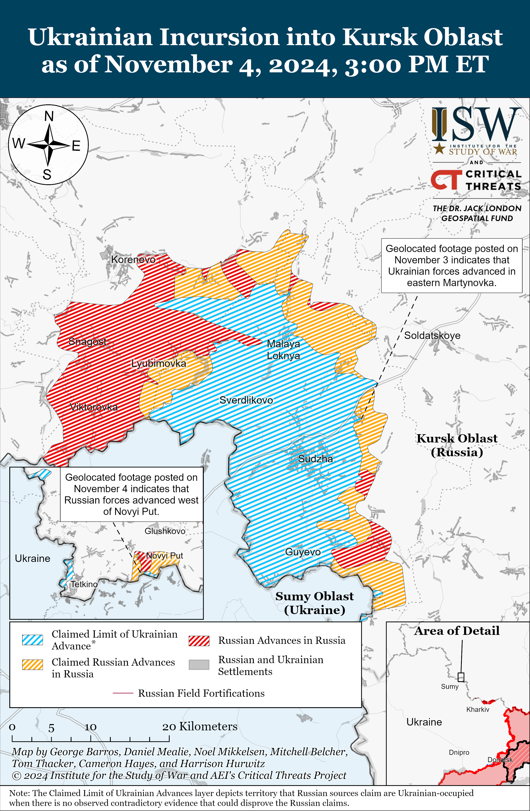
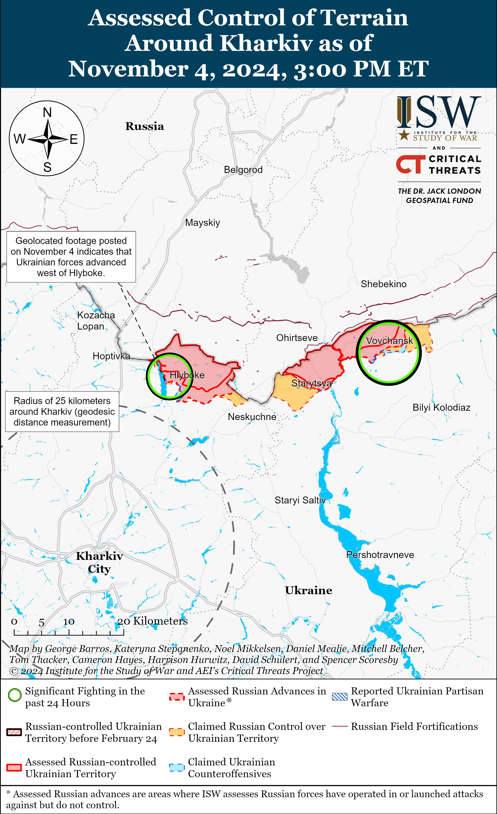
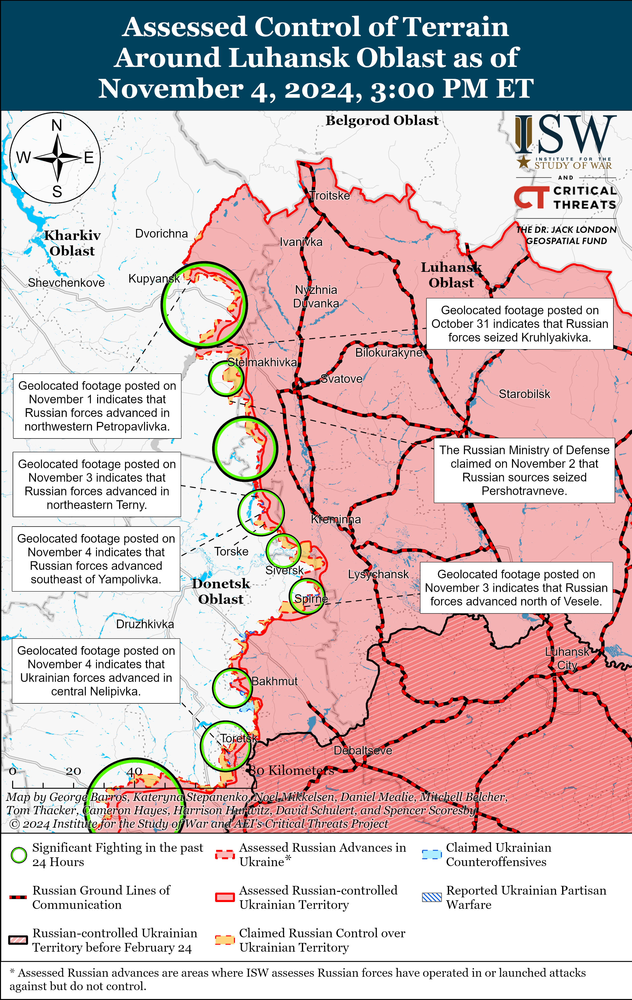
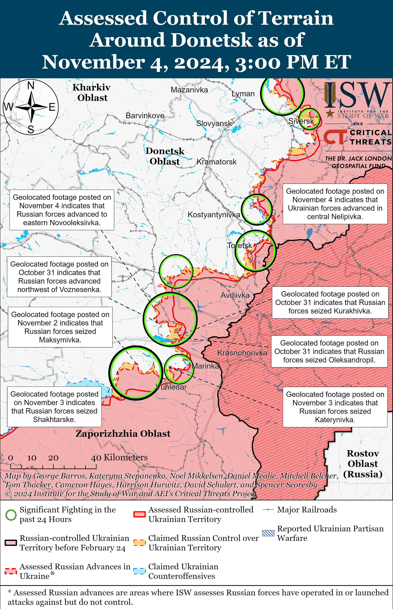
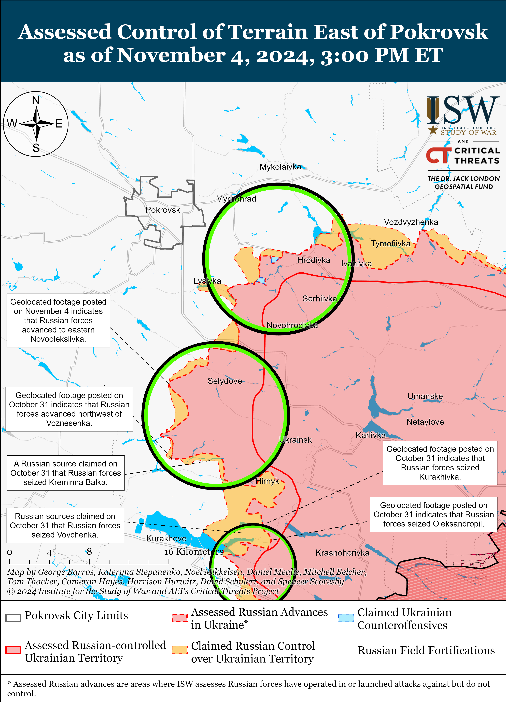
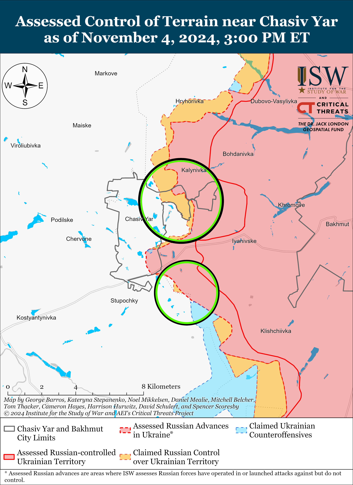
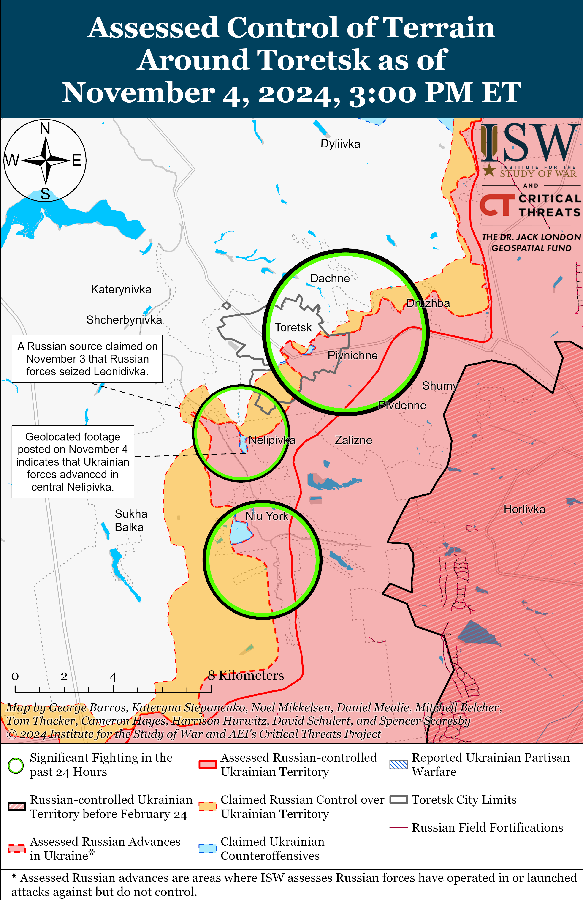
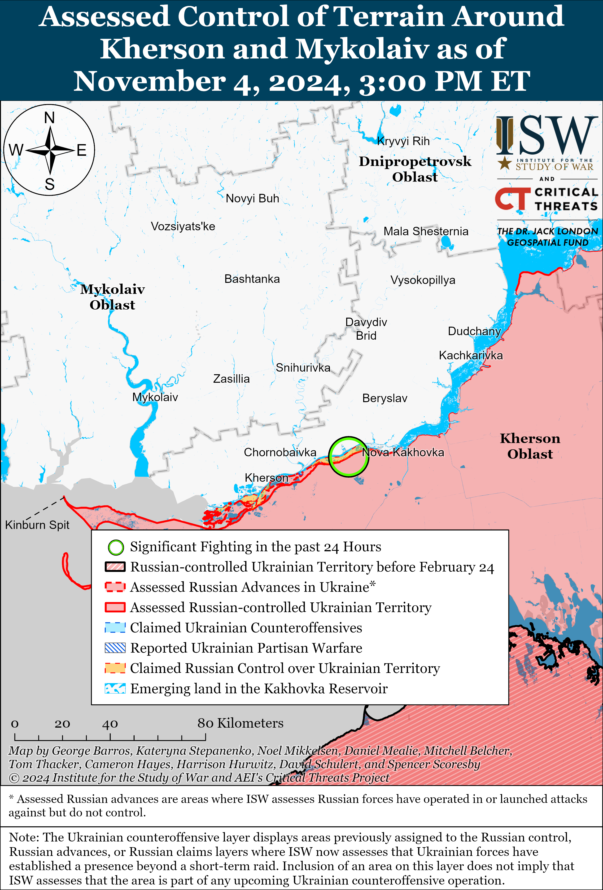
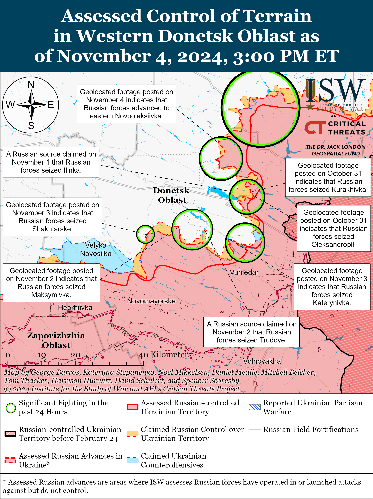
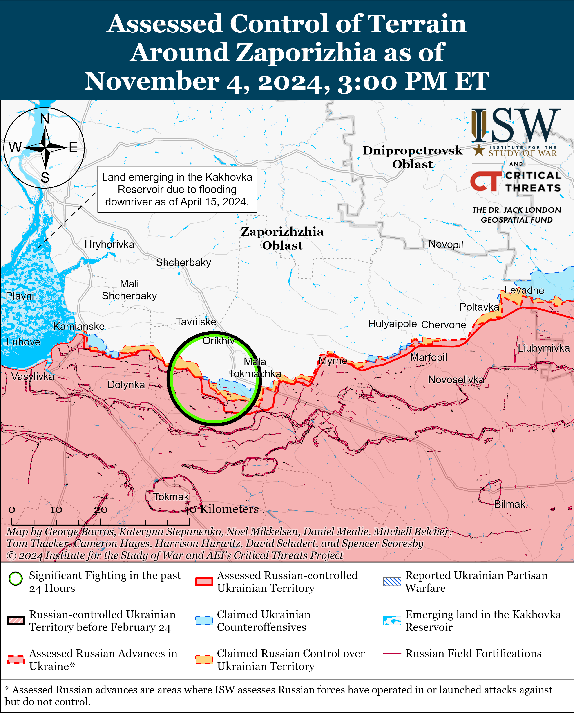

# Russian Offensive Campaign Assessment, November 4, 2024

**November 4, 2024, 6:50pm ET**

**Click** [**here**](https://storymaps.arcgis.com/stories/36a7f6a6f5a9448496de641cf64bd375) **to see ISW’s interactive map of the Russian invasion of Ukraine. This map is updated daily alongside the static maps present in this report.**

**Click** [**here**](https://storymaps.arcgis.com/stories/83a2f24901c941d581c0c523ecd2619b) **to see ISW's interactive map of Ukraine's offensive in Kursk Oblast.**

**Click** [**here**](https://understandingwar.maps.arcgis.com/apps/instant/3dviewer/index.html?appid=1602762dbcde419bb957dea358449580) **to see ISW’s 3D control of terrain topographic map of Ukraine. Use of a computer (not a mobile device) is strongly recommended for using this data-heavy tool.**

**Click** [**here**](https://storymaps.arcgis.com/stories/733fe90805894bfc8562d90b106aa895) **to access ISW’s archive of interactive time-lapse maps of the Russian invasion of Ukraine. These maps complement the static control-of-terrain map that ISW produces daily by showing a dynamic frontline. ISW will update this time-lapse map archive monthly.**

**Note: The data cut-off for this product was 11:30am ET on November 4. ISW will cover subsequent reports in the November 5 Russian Offensive Campaign Assessment.**

**Russian and pro-Kremlin actors launched an information operation on November 4 to discredit incumbent Moldovan President Maia Sandu’s victory in the Moldovan presidential elections.** The Moldovan Central Election Commission (CEC) confirmed on November 4 that Sandu won 55.35 percent of the vote, defeating Kremlin-friendly opponent Alexandr Stoianoglo.[[1]](#_edn6b35c67df5ea3af3628a82c52d9fe0471) Numerous world leaders congratulated Sandu on November 3 and 4, and international election observers largely commended the conduct of the elections in spite of Russian attempts to sway the outcomes against Sandu.[[2]](#_edn6b35c67df5ea3af3628a82c52d9fe0472) Pro-Russian opposition parties and officials attempted to discredit Sandu’s victory, with the Moldovan Socialist party calling her “an illegitimate president”; Kremlin-affiliated Moldovan oligarch Ilan Shor telling Russian state TV channel *Rossiya-24* that the Moldovan opposition has 'evidence' of mass falsifications in favor of Sandu; and pro-Kremlin former Moldovan president Igor Dodon telling Kremlin newswire *TASS* that Sandu only won because of the Moldovan diaspora vote.[[3]](#_edn6b35c67df5ea3af3628a82c52d9fe0473) The Russian information space, including Russian milbloggers, echoed the words of the pro-Russian Moldovan opposition claiming that Moldovan elections were controlled by 'European bureaucrats' and that Moldovans had no agency in determining the outcome of the elections.[[4]](#_edn6b35c67df5ea3af3628a82c52d9fe0474) ISW previously reported on Russia’s systematic efforts to interfere in the Moldovan election in order to derail the passage of Moldova’s European Union (EU) referendum and Sandu’s victory.[[5]](#_edn6b35c67df5ea3af3628a82c52d9fe0475)

**Georgian civil society and opposition resumed peaceful demonstrations on November 4 against the highly contested October 26 Georgian parliamentary elections, calling for continued resistance and further investigations into large-scale voting irregularities.** Thousands of Georgians gathered in the center of Tbilisi and reiterated their refusal to acknowledge the increasingly pro-Russian Georgian Dream party’s victory in an election marred by large-scale evidence of voting irregularities and Russian influence.[[6]](#_edn6b35c67df5ea3af3628a82c52d9fe0476) The opposition outlined three main goals for the protest movement: 1) continuing efforts to collect evidence demonstrating the elections were not free and fair; 2) urging the international community to refrain from acknowledging the election results; and 3) practicing their right to assemble and to resist the results.[[7]](#_edn6b35c67df5ea3af3628a82c52d9fe0477) Georgian legal entities ranging from the Tbilisi City Court to the Georgian Prosecutor's Office have dismissed some of the demands of the Georgian opposition and civil society and cast doubt on allegations of systematic voter fraud, while showing some willingness to conduct investigations into claims of irregularity.[[8]](#_edn6b35c67df5ea3af3628a82c52d9fe0478) The opposition announced its intention to conduct regular protests while calling for international investigations into election falsification and internationally administered snap elections.[[9]](#_edn6b35c67df5ea3af3628a82c52d9fe0479)

***Radio Free Europe/Radio Liberty*'s (*RFE/RL*) Sistema project released an investigation on November 4 detailing Russia's initial 2022 demands for Ukraine's total capitulation, further supporting ISW's long-standing assessment that Russia has never been willing to engage in good-faith negotiations with Ukraine on any terms but its own.[[10]](#_edn6b35c67df5ea3af3628a82c52d9fe04710)** *RFE/RL* reported on November 4 that it obtained a draft of the treaty that Russia offered to Ukraine on March 7, 2022, entitled "Treaty on the Settlement of the Situation in Ukraine and the Neutrality of Ukraine." The draft document includes seven provisions, all of which amount to Ukraine's complete surrender and disarmament and the abandonment of its sovereignty, lands, and people. The document calls for Ukraine to reduce its army from nearly 197,000 personnel to 50,000 personnel, which *RFE/RL* notes would have meant that the Ukrainian army would be smaller than the Belarusian army, despite the fact that the Belarusian population in 2022 was one-fifth of the Ukrainian population. The document also states that Ukraine would not be able to develop, produce, buy, or deploy missile systems with a range of more than 250 kilometers; that Ukraine would have to recognize occupied Donetsk and Luhansk oblasts as independent Donetsk and Luhansk People's Republics (DNR and LNR) and cede parts of Donetsk and Luhansk oblasts that Ukraine still controlled in March 2022; that Ukraine would have to commit to the financial costs of rebuilding parts of the Donbas that Russia had destroyed following its initial 2014 invasion; that Ukraine and the international community would lift all sanctions and cancel all lawsuits that had been levied against Russian since 2014; that Ukraine would grant the Russian language the status of a "state language" and restore all property rights of the Kremlin-controlled Ukrainian Orthodox Church Moscow Patriarchate; and that Ukraine would re-legalize Soviet and communist symbols.[[11]](#_edn6b35c67df5ea3af3628a82c52d9fe04711) In essence, Moscow was asking Ukraine to willingly give up its military, its offensive and defensive capabilities, its land, a significant portion of its population and economic capacity, and cease protecting its language, history, and culture.

The Kremlin has been incessant in its claims that it set out to negotiate in March 2022 (after illegally invading Ukraine) but that it was Ukraine and the collective West that destroyed the prospect of negotiations.[[12]](#_edn6b35c67df5ea3af3628a82c52d9fe04712) The *RFE/RL* investigation supports ISW's long-standing assessment that this was never the case, however, and that Russia never intended to negotiate in good faith with Ukraine.[[13]](#_edn6b35c67df5ea3af3628a82c52d9fe04713) Russia presented outrageous demands calling for Ukraine to surrender its security and sovereignty, knowing that Ukraine would (rightly) refuse to do so, and then blamed Ukraine for the supposed "failure" of negotiations. ISW continues to assess that Russia has constructed a narrative around the concept of negotiations that it is using in an effort to encourage the West to make concessions on Ukrainian sovereignty and territorial integrity, and the *RFE/RL* investigation emphasizes that Russia's "diplomatic" engagements with Ukraine and the West since the full-scale invasion have always been oriented around this destructive objective.[[14]](#_edn6b35c67df5ea3af3628a82c52d9fe04714)

**Russian drone and missile strikes against Ukrainian energy infrastructure in Summer 2024 reportedly significantly impacted Ukrainian electrical generation capacity compared to March 2024, though it is unclear whether Russia had been able to inflict significant further damage on the Ukrainian energy grid since.** Ukrainian energy experts told *Politico* in an article published on November 4 that Ukrainian power generation capacity decreased by over nine gigawatts between March 2024 and Summer 2024 after Russian forces launched more than 200 missiles and drones at Ukraine’s power production facilities in late August 2024.[[15]](#_edn6b35c67df5ea3af3628a82c52d9fe04715) Experts estimated that Ukrainian power production facilities generated 37.6 gigawatts of electricity in early 2022, likely referring to the period prior to the start of the Russian drone and missile campaign targeting Ukrainian energy infrastructure in October 2022; 18.3 gigawatts in April 2023; 21.4 gigawatts in March 2024; and 12.1 gigawatts in Summer 2024. *Politico* noted that the extent of the damage that Russian strikes inflicted on Ukrainian power production facilities in August 2024 is unknown, and the data does not represent Ukraine's most updated energy generation capacity as of November 2024. A Ukrainian energy expert told *Politico* that Ukraine needs additional air defense systems to protect its energy infrastructure. Artur Lorkowski, Director of The Energy Community (an international organization that manages Ukraine’s energy procurement), also stated that repairing damaged Ukrainian energy infrastructure may require a significant amount of time because it can take up to one year for Ukraine to find and reinstall specialized equipment like auto transformers.

**The Kremlin-awarded founder and director of the prominent *Rybar* Telegram channel and social media project attempted to falsely portray himself as a non-Kremlin actor in the Western media and confirmed the Kremlin’s efforts to establish “media schools” abroad.** In an interview with the *Washington Post* published on November 4, *Rybar* founder and director Mikhail Zvinchuk commented on the US Department of State (DoS) program Rewards for Justice’s reward offer for information about the whereabouts of nine *Rybar* employees reportedly involved in interfering with US elections.[[16]](#_edn6b35c67df5ea3af3628a82c52d9fe04716) Zvinchuk denied reports of his and *Rybar’s* election interference and used the opportunity to falsely portray *Rybar* as a "think tank" that is involved in "defending [Russia’s] informational borders." Zvinchuk also claimed that *Rybar* has an organized "worldwide" network consisting of over 250 channels in 28 languages and confirmed that *Rybar* is opening "media schools" in Serbia, Bosnia and Herzegovina (BiH), and Kyrgyzstan. *Rybar* reportedly has 60 employees and has taught a class at the Moscow State Institute of International Relations (MGIMO). Zvinchuk also seized on a question about *Rybar's* previous appearance on the investigation list for "discrediting" the Russian military in an attempt to portray *Rybar* employees as "patriots" who occasionally call out problems in Russia. Zvinchuk’s efforts to misrepresent *Rybar* as a Western-style think tank that is occasionally critical of Russia is likely part of the Kremlin’s wider effort to infiltrate Western and international media via new online-based sources such as *Rybar.* The Kremlin holds significant power over the Russian information space and civil society, and *Rybar’s* large-scale operations in Russia and abroad likely would not be possible without Kremlin’s direct funding. Russian President Vladimir Putin and the Russian Ministry of Defense (MoD) notably awarded *Rybar* with several state honors, and Rewards for Justice noted that Russian state defense conglomerate Rostec currently funds the channel.[[17]](#_edn6b35c67df5ea3af3628a82c52d9fe04717)

**Russian authorities arrested Rosgvardia's Deputy Head of Logistics Major General Mirza Mirzaev for bribery on November 3.[[18]](#_edn6b35c67df5ea3af3628a82c52d9fe04718)** Russian authorities have notably arrested several high-ranking Russian Ministry of Defense (MoD) officials on bribery charges after Russian President Vladimir Putin replaced then Russian Defense Minister Sergei Shoigu and moved him to the position of Security Council Secretary in May 2024.[[19]](#_edn6b35c67df5ea3af3628a82c52d9fe04719) A Russian insider source speculated that arrests of senior security officials may spread outside of the Russian MoD to Rosgvardia (which operates separately of the Russian MoD) following Mirzaev's arrest.[[20]](#_edn6b35c67df5ea3af3628a82c52d9fe04720) The source claimed that Rosgvardia Head Viktor Zolotov has maintained a "fairly good reputation and strong position" in Russia's security apparatus but noted that Mirzaev's arrest may lead to additional Rosgvardia arrests and reduce Zolotov's influence.

**Key Takeaways:**

- **Russian and pro-Kremlin actors launched an information operation on November 4 to discredit incumbent Moldovan President Maia Sandu’s victory in the Moldovan presidential elections.**
- **Georgian civil society and opposition resumed peaceful demonstrations on November 4 against the highly contested October 26 Georgian parliamentary elections, calling for continued resistance and further investigations into large-scale voting irregularities.**
- ***Radio Free Europe/ Radio Liberty*'s (*RFE/RL*) Sistema project released an investigation on November 4 detailing Russia's initial 2022 demands for Ukraine's total capitulation, further supporting ISW's long-standing assessment that Russia has never been willing to engage in good-faith negotiations with Ukraine on any terms but its own.**
- **Russian drone and missile strikes against Ukrainian energy infrastructure in Summer 2024 reportedly significantly impacted Ukrainian electrical generation capacity compared to March 2024, though it is unclear whether Russia had been able to inflict significant further damage on the Ukrainian energy grid since.**
- **The Kremlin-awarded founder and director of the prominent *Rybar* Telegram channel and social media project attempted to falsely portray himself as a non-Kremlin actor in the Western media and confirmed the Kremlin’s efforts to establish “media schools” abroad.**
- **Russian authorities arrested Rosgvardia's Deputy Head of Logistics Major General Mirza Mirzaev for bribery on November 3.**
- **Russian forces advanced near Novy Put, Kursk Oblast.**
- **Ukrainian forces advanced in Kharkiv Oblast and Russian forces advanced in the Kupyansk, Kreminna, Pokrovsk, Kurakhove, and Vuhledar directions.**
- **The Russian Ministry of Defense (MoD) continues attempts to form a cadre of loyal military journalists in an effort to control the pro-war Russian information space and centralize control over Russia’s war coverage.**

***We do not report in detail on Russian war crimes because these activities are well-covered in Western media and do not directly affect the military operations we are assessing and forecasting. We will continue to evaluate and report on the effects of these criminal activities on the Ukrainian military and the Ukrainian population and specifically on combat in Ukrainian urban areas. We utterly condemn Russian violations of the laws of armed conflict and the Geneva Conventions and crimes against humanity even though we do not describe them in these reports.***

- Ukrainian Operations in the Russian Federation
- Russian Main Effort — Eastern Ukraine (comprised of three subordinate main efforts)
- Russian Subordinate Main Effort #1 — Push Ukrainian forces back from the international border with Belgorod Oblast and approach to within tube artillery range of Kharkiv City
- Russian Subordinate Main Effort #2 — Capture the remainder of Luhansk Oblast and push westward into eastern Kharkiv Oblast and encircle northern Donetsk Oblast
- Russian Subordinate Main Effort #3 — Capture the entirety of Donetsk Oblast
- Russian Supporting Effort — Southern Axis
- Russian Air, Missile, and Drone Campaign
- Russian Mobilization and Force Generation Efforts
- Russian Technological Adaptations
- Activities in Russian-occupied areas
- Significant Activity in Belarus

**Ukrainian Operations in the Russian Federation**

Ukrainian and Russian forces continued fighting in the main Ukrainian salient in Kursk Oblast on November 3 and 4, but there were no recent changes to the frontline. Geolocated footage published on November 3 reportedly shows Russian forces striking a Ukrainian position in eastern Martynovka (northeast of Sudzha), indicating that Ukrainian forces continue to operate in the area.[[21]](#_edn6b35c67df5ea3af3628a82c52d9fe04721) Russian sources, including the Russian Ministry of Defense (MoD), claimed that Russian forces attacked southeast of Korenevo near Darino, Leonidovo, Nikolayevo-Darino, and Novoivanovka; and southeast of Sudzha near Plekhovo.[[22]](#_edn6b35c67df5ea3af3628a82c52d9fe04722) Russian sources claimed that Ukrainian forces attacked near Novoivanovka, Leonidovo, and Plekhovo, and northwest of Sudzha near Pogrebki.[[23]](#_edn6b35c67df5ea3af3628a82c52d9fe04723) A Russian milblogger attributed the lack of changes on the frontline to deteriorating weather conditions, likely with the onset of the Fall mud season.[[24]](#_edn6b35c67df5ea3af3628a82c52d9fe04724) Ukrainian Center for Countering Disinformation Head Lieutenant Andriy Kovalenko reported on November 4 that North Korean servicemen "came under fire" in Kursk Oblast but did not offer further specifics.[[25]](#_edn6b35c67df5ea3af3628a82c52d9fe04725)

Russian forces recently marginally advanced west of the main Ukrainian salient in Kursk Oblast, although Ukrainian and Russian sources did not report fighting in the Glushkovsky Raion on November 3 and 4. Geolocated footage published on November 4 shows Ukrainian forces striking Russian forces west of Novyi Put (southwest of Glushkovo), indicating that Russian forces advanced in the area.[[26]](#_edn6b35c67df5ea3af3628a82c52d9fe04726)

****

**Russian Main Effort — Eastern Ukraine**

**Russian Subordinate Main Effort #1 — Kharkiv Oblast** **(Russian objective: Push Ukrainian forces back from the international border with Belgorod Oblast and approach to within tube artillery range of Kharkiv City)**

Ukrainian forces recently advanced in northern Kharkiv Oblast amid continued Russian offensive operations in the area on November 4. Geolocated footage published on November 4 indicates that Ukrainian forces recently advanced west of Hlyboke (north of Kharkiv City) on the eastern bank of the Travyanske Reservoir.[[27]](#_edn6b35c67df5ea3af3628a82c52d9fe04727) Russian forces continued attacking north of Kharkiv City near Lyptsi and northeast of Kharkiv City near Vovchansk on November 3 and 4.[[28]](#_edn6b35c67df5ea3af3628a82c52d9fe04728) The spokesperson of a Ukrainian brigade operating in the Kharkiv direction stated that Russian forces did not conduct assaults using armored vehicles in recent weeks (likely implying throughout October 2024) and have instead relied on conducting assaults in small infantry groups.[[29]](#_edn6b35c67df5ea3af3628a82c52d9fe04729)

****

**Russian Subordinate Main Effort #2 — Luhansk Oblast (Russian objective: Capture the remainder of Luhansk Oblast and push westward into eastern Kharkiv Oblast and northern Donetsk Oblast)**

Russian forces advanced southeast of Kupyansk and northwest of Kreminna amid continued Russian offensive operations along the Kupyansk-Svatove-Kreminna line on November 4. Geolocated footage published on November 4 indicates that Russian forces advanced west of Novoselivske (southeast of Kupyansk) and southeast of Yampolivka (northwest of Kreminna).[[30]](#_edn6b35c67df5ea3af3628a82c52d9fe04730) Footage published by Ukrainian forces on November 4 shows Ukrainian forces recently repelling a platoon-sized Russian mechanized assault in the Lyman direction (west of Kreminna).[[31]](#_edn6b35c67df5ea3af3628a82c52d9fe04731) The Ukrainian General Staff reported that Russian forces continued offensive operations north of Kupyansk near Kindrashivka and Holubivka; east of Kupyansk near Petropavlivka; southeast of Kupyansk near Kolisnykivka, Kruhlyakivka, Lozova, Cherneshchyna, Stepova Novoselivka, Zahryzove, Kucherivka, and Berestove; west of Svatove near Vyshneve and Pershotravneve; southwest of Svatove near Druzhelyubivka, Makiivka, and Hrekivka; west of Kremmina near Torske, Zarichne, and Terny; and southwest of Kremmina near Dibrova on November 3 and 4.[[32]](#_edn6b35c67df5ea3af3628a82c52d9fe04732)

****

**Russian Subordinate Main Effort #3 — Donetsk Oblast (Russian objective: Capture the entirety of Donetsk Oblast, the claimed territory of Russia’s proxies in Donbas)**

The Ukrainian General Staff reported that Russian forces conducted unsuccessful ground attacks northeast of Siversk near Bilohorivka on November 4.[[33]](#_edn6b35c67df5ea3af3628a82c52d9fe04733)

Russian forces continued limited offensive operations near Chasiv Yar and south of Chasiv Yar near Stupochky on November 4 but did not make any confirmed advances.[[34]](#_edn6b35c67df5ea3af3628a82c52d9fe04734) Elements of the Russian 6th Motorized Rifle Division and 72nd Motorized Rifle Brigade (both of the 3rd Army Corps [AC]); 58th Spetsnaz Brigade (51st Combined Arms Army [CAA], formerly 1st Donetsk People's Republic [DNR] AC); and 98th VDV (Airborne) Division reportedly continue operating near Chasiv Yar.[[35]](#_edn6b35c67df5ea3af3628a82c52d9fe04735)

Russian and Ukrainian forces recently advanced near Toretsk. Geolocated footage published on November 3 indicates that Russian forces have advanced along Molodizhna Street in northwestern Pivnichne (east of Toretsk).[[36]](#_edn6b35c67df5ea3af3628a82c52d9fe04736) Additional geolocated footage published on November 4 indicates that Ukrainian forces have regained lost positions in central Nelipivka (southwest of Toretsk).[[37]](#_edn6b35c67df5ea3af3628a82c52d9fe04737) The Ukrainian General Staff reported that Russian forces conducted unsuccessful ground attacks near Toretsk itself; northeast of Toretsk near Dachne; and west of Toretsk near Shcherbynivka on November 3 and 4.[[38]](#_edn6b35c67df5ea3af3628a82c52d9fe04738)

Russian forces recently advanced south and southeast of Pokrovsk amid continue offensive operations in the area on November 4. Geolocated footage published on November 3 indicates that Russian forces advanced in fields northwest of Selydove (southeast of Pokrovsk).[[39]](#_edn6b35c67df5ea3af3628a82c52d9fe04739) Geolocated footage published on November 4 shows Russian forces conducting a roughly platoon-sized mechanized assault and advancing to the eastern outskirts of Novooleksiivka (southwest of Selydove and south of Pokrovsk).[[40]](#_edn6b35c67df5ea3af3628a82c52d9fe04740) Russian sources claimed that elements of the 80th Tank Regiment (90th Guards Tank Division, 41st CAA, Central Military District [CMD]) conducted the assault on Novooleksiivka.[[41]](#_edn6b35c67df5ea3af3628a82c52d9fe04741) A Russian milblogger claimed that Russian forces advanced in fields southwest of Vyshneve (directly west of Selydove), although ISW has not observed visual confirmation of this claim.[[42]](#_edn6b35c67df5ea3af3628a82c52d9fe04742) Russian and Ukrainian sources reported continued fighting east of Pokrovsk near Myrolyubivka and Promin; southeast of Pokrovsk near Sukhyi Yar, Lysivka, Novohrodivka, Hryhorivka, and Vyshneve; and south of Pokrovsk in the direction of Novooleksiivka and Yurivka on November 3 and 4.[[43]](#_edn6b35c67df5ea3af3628a82c52d9fe04743)

Russian forces recently advanced northwest of Kurakhove amid continued offensive operations in the Kurakhove direction on November 4. Geolocated footage published on November 4 indicates that Russian forces advanced to western Novodmytrivka (northwest of Kurakhove).[[44]](#_edn6b35c67df5ea3af3628a82c52d9fe04744) DNR Head Denis Pushilin posted footage on November 4 purportedly from within Hirnyk (northeast of Kurakhove), suggesting that Russian forces have likely recently seized the settlement.[[45]](#_edn6b35c67df5ea3af3628a82c52d9fe04745) Russian sources claimed that Russian forces also advanced in fields south of Kreminna Balka (southeast of Novodmytrivka and north of Kurakhove), near Illinka (northeast of Kurakhove), and near Novoselydivka and Voznesenka (both north of Kurakhove), although ISW has not yet observed confirmation of these claims.[[46]](#_edn6b35c67df5ea3af3628a82c52d9fe04746) The spokesperson for a Ukrainian brigade operating in the Kurakhove direction reported that Russian forces are trying to evacuate and repair mechanized equipment in order to prepare for further mechanized assaults in the Kurakhove direction but noted that Ukrainian forces destroyed nearly 100 pieces of armored equipment including tanks and other vehicles in this area in October 2024 alone.[[47]](#_edn6b35c67df5ea3af3628a82c52d9fe04747) The Ukrainian General Staff reported that Russian forces continued ground attacks northwest of Kurakhove near Novodmytrivka; north of Kurakhove near Kreminna Balka and Novoselydivka; and northeast of Kurakhove near Illinka, Vovchenka, and Ostrivske on November 3 and 4.[[48]](#_edn6b35c67df5ea3af3628a82c52d9fe04748)

Russian forces recently advanced in the Vuhledar direction amid continued offensive operations in the area on November 4. Geolocated footage published on November 3 shows Russian forces raising a Russian flag in western Shakhtarske (northwest of Vuhledar), indicating that Russian forces have seized the settlement.[[49]](#_edn6b35c67df5ea3af3628a82c52d9fe04749) Russian milbloggers claimed that Russian forces advanced northeast of Vuhledar near Katerynivka and northwest of Vuhledar near Yasna Polyana, although ISW has not observed confirmation of these claims.[[50]](#_edn6b35c67df5ea3af3628a82c52d9fe04750) Russian forces continued attacking northeast of Vuhledar near Katerynivka and Antonivka and northwest of Vuhledar near Trudove, Maksymivka, and Yasna Polyana on November 3 and 4.[[51]](#_edn6b35c67df5ea3af3628a82c52d9fe04751) Elements of the Russian “Bashkir Volki” detachment of the "Dostavalov" Volunteer Battalion (a volunteer battalion formed in Republic of Bashkortostan in 2022) are reportedly operating near Antonivka; elements of the 14th Spetsnaz Brigade (Russian General Staff's Main Intelligence Directorate [GRU]) are operating in the general Vuhledar area; elements of the 11th Air Force and Air Defense Army (Russian Aerospace Forces [VKS] and Eastern Military District [EMD]) are reportedly conducting airstrikes against Rozdolne (northwest of Vuhledar); and elements of the 238th Artillery Brigade (8th CAA, Southern Military District [SMD]) are reportedly operating near Dalne (north of Vuhledar).[[52]](#_edn6b35c67df5ea3af3628a82c52d9fe04752)

**

**

**Russian Supporting Effort — Southern Axis (Russian objective: Maintain frontline positions and secure rear areas against Ukrainian strikes)**

Russian forces continued offensive operations in western Zaporizhia Oblast on November 4 but did not advance. The Ukrainian General Staff reported that Russian forces continued attacking north of Robotyne near Novodanylivka and Orikhiv; and northwest of Robotyne near Novoandriivka and Stepove.[[53]](#_edn6b35c67df5ea3af3628a82c52d9fe04753)

Russian forces continued localized ground assaults in east (left) bank Kherson Oblast on November 3 and 4 but did not advance.[[54]](#_edn6b35c67df5ea3af3628a82c52d9fe04754)

Ukrainian Navy Spokesperson Captain Third Rank Dmytro Pletenchuk stated on November 4 that Ukrainian naval drones continue to prevent Russian Black Sea Fleet (BSF) vessels from freely operating in the Black Sea.[[55]](#_edn6b35c67df5ea3af3628a82c52d9fe04755) Pletenchuk also noted that worsening weather conditions are preventing Russian aviation — Russian forces’ primary form of aerial reconnaissance — from operating over the Black Sea. Pletenchuk previously noted that the Russian military is concerned about Ukrainian strikes on Russian BSF vessels in the port of Novorossiysk, Krasnodar Krai, and that Russian forces are sortieing BSF vessels to limit the risk of possible Ukrainian drone strikes and further destruction to BSF vessels.[[56]](#_edn6b35c67df5ea3af3628a82c52d9fe04756)

**Russian Air, Missile, and Drone Campaign (Russian Objective: Target Ukrainian military and civilian infrastructure in the rear and on the frontline)**

Russian forces conducted a series of drone and missile strikes against Ukraine on the night of November 3 to 4. The Ukrainian Air Force reported on November 4 that Russian forces launched one Iskander-M ballistic missile from Rostov Oblast against Dnipropetrovsk Oblast and 80 strike drones of Shahed and unidentified types from Bryansk Oblast, Kursk Oblast, and Primorsko-Akhtarsk, Krasnodar Krai Oblast.[[57]](#_edn6b35c67df5ea3af3628a82c52d9fe04757) The Ukrainian Air Force reported that Ukrainian forces downed 50 drones over Kyiv, Sumy, Odesa, Kherson, Mykolaiv, Zhytomyr, Cherkasy, Chernihiv, and Kirovohrad oblasts and that 27 drones were “locally lost,” likely due to Ukrainian electronic warfare (EW) interference. Ukrainian officials stated on November 4 that falling drone debris caused fires in Desnyanskyi and Obolonskyi raions, Kyiv City and that Shahed drone strikes damaged residential buildings in the Bolhradska Hromada and a recreation camp in Vasylivska Hromada, Odesa Oblast.[[58]](#_edn6b35c67df5ea3af3628a82c52d9fe04758) Ukrainian officials reported that Russian FAB-250 glide bomb with unified planning and correction module (UMPC) strikes on civilian infrastructure and a supermarket injured 11 civilians and four policemen in Shevchenkivskyi Raion, Kharkiv City on the night of November 3 to 4.[[59]](#_edn6b35c67df5ea3af3628a82c52d9fe04759)

Ukrainian President Volodymyr Zelensky stated on November 4 that Russian forces increased Shahed drone strikes on Ukrainian targets tenfold since Fall 2023.[[60]](#_edn6b35c67df5ea3af3628a82c52d9fe04760) Ukrainian Ground Forces Commander Lieutenant General Oleksandr Pavlyuk stated on November 4 that Ukrainian forces downed 464 Shahed-131/136 drones in all of October and downed 139 Shahed-131/136 drones in the week of October 28 to November 3 alone.[[61]](#_edn6b35c67df5ea3af3628a82c52d9fe04761)

**Russian Mobilization and Force Generation Efforts (Russian objective: Expand combat power without conducting general mobilization)**

The Russian Ministry of Defense (MoD) continues attempts to form a cadre of loyal military journalists in an effort to control the pro-war Russian information space and centralize control over Russia’s war coverage. The Russian MoD announced on November 4 that its Prince Alexander Nevsky Military University is offering a five-year military journalist specialty program that prepares participants to become either Russian military journalists or members of the Russian military press service, and offers courses on journalism, tactical military training, and information warfare.[[62]](#_edn6b35c67df5ea3af3628a82c52d9fe04762) The participants will also reportedly gain practical experience by working at Russian state-run media outlets and media agencies for Russian military districts and Russian naval fleets. The Russian MoD noted that graduates of the program receive the military rank of lieutenant.

The Kremlin is leveraging the Kremlin-controlled Russian Orthodox Church (ROC) to promote the "Time of Heroes" program, which prepares Russian veterans of the war in Ukraine for positions in Russian local and regional governments. ROC Head Patriarch Kirill met with Russian veterans at a “Time of Heroes” event on November 3 to discuss the importance of Russian veterans contributing to the Russian government and emphasized the importance of "spiritual unity" and "traditional values."[[63]](#_edn6b35c67df5ea3af3628a82c52d9fe04763) ISW continues to assess that the “Time of Heroes” program is part of Kremlin efforts to militarize Russian society and government and to fill government positions with pro-Kremlin and pro-war veterans.[[64]](#_edn6b35c67df5ea3af3628a82c52d9fe04764)

The Russian command continues to misuse specialized Russian units to reinforce depleted assault units. A soldier in the Russian 174th Reconnaissance Battalion (150th Motorized Rifle Division, 8th Combined Arms Army [CAA], Southern Military District [SMD]) claimed on November 3 that 150th Motorized Rifle Division Commander Major General Vitaly Terekhin disbanded the soldier’s reconnaissance unit and transferred the soldiers into severely depleted infantry assault units.[[65]](#_edn6b35c67df5ea3af3628a82c52d9fe04765) The soldier noted that the increased casualty rates of soldiers from specialized units could jeopardize the creation of Russian military-technical support units. A Russian milblogger claimed that the Russian 110th Motorized Rifle Brigade (51st CAA, SMD) disbanded its "Storm" drone unit and moved drone operators from the "Storm" unit into assault units.[[66]](#_edn6b35c67df5ea3af3628a82c52d9fe04766) ISW continues to assess that Russian MoD efforts to centralize control over Russian specialist units are likely to degrade the overall quality of the Russian force by flattening distinctions between different combat specialties and rendering everyone an infantry soldier.[[67]](#_edn6b35c67df5ea3af3628a82c52d9fe04767)

The Russian command continues to rely on attritional infantry-led “meat assaults” to degrade Ukrainian defenses and advance along the frontline. A Russian milblogger claimed on November 2 that a Russian commander called newly recruited contract soldiers “second-rate infantry” and threatened to use them in “meat assaults” to degrade Ukrainian forces on the frontline.[[68]](#_edn6b35c67df5ea3af3628a82c52d9fe04768) The milblogger claimed that using new recruits in these assault units is an unspoken Russian military tactic. ISW previously observed Russian milblogger complaints about how infantry-led assaults aggravate Russian forces’ personnel problems.[[69]](#_edn6b35c67df5ea3af3628a82c52d9fe04769)

**Russian Technological Adaptations** **(Russian objective: Introduce technological innovations to optimize systems for use in Ukraine)**

A prominent, Kremlin-affiliated Russian milblogger claimed on November 4 that Russian company Nova Labs developed a hand-launched drone interceptor gun that fires a drone equipped with an optical honing device capable of autonomously locking on to target drones.[[70]](#_edn6b35c67df5ea3af3628a82c52d9fe04770) The milblogger noted that civilians could use the launcher to protect Russian critical infrastructure, including oil depots.

**Activities in Russian-occupied areas (Russian objective: Consolidate administrative control of annexed areas; forcibly integrate Ukrainian citizens into Russian sociocultural, economic, military, and governance systems)**

*ISW is not publishing reporting on activities in Russian-occupied areas today.*

**Significant activity in Belarus** **(Russian efforts to increase its military presence in Belarus and further integrate Belarus into Russian-favorable frameworks and Wagner Group activity in Belarus)**

Nothing significant to report.

**Note: ISW does not receive any classified material from any source, uses only publicly available information, and draws extensively on Russian, Ukrainian, and Western reporting and social media as well as commercially available satellite imagery and other geospatial data as the basis for these reports. References to all sources used are provided in the endnotes of each update.**

---

[[1]](#_edn6b35c67df5ea3af3628a82c52d9fe047ref1) <https://pv.cec> dot md/cec-presidential-results-tour2.html; https://t.me/tass\_agency/283420; https://t.me/tass\_agency/283389; https://suspilne dot media/872499-cvk-moldovi-zaversila-pidrahunok-golosiv-sandu-nabrala-5533/; https://pv.cec dot md/cec-presidential-results-tour2.html

[[2]](#_edn6b35c67df5ea3af3628a82c52d9fe047ref2) <https://x.com/EmmanuelMacron/status/1853207542605750558>; <https://x.com/GiorgiaMeloni/status/1853373893894893573>; <https://x.com/vonderleyen/status/1853208136825331933>; <https://x.com/JosepBorrellF/status/1853329466811916668>; <https://x.com/CharlesMichel/status/1853338173822083564>; <https://x.com/ZelenskyyUa/status/1853412788158304505>; <https://x.com/NikolPashinyan/status/1853371745287143797>; <https://www.osce.org/odihr/elections/579805>; <https://ec.europa> dot eu/commission/presscorner/detail/en/statement\_24\_5624; https://www.iri.org/news/iri-observes-second-round-of-2024-moldovan-presidential-election/

[[3]](#_edn6b35c67df5ea3af3628a82c52d9fe047ref3) <https://t.me/tass_agency/283344>; <https://t.me/tass_agency/283337>; <https://t.me/tass_agency/283334>; https://t.me/tass\_agency/283423 ; https://t.me/tass\_agency/283418

[[4]](#_edn6b35c67df5ea3af3628a82c52d9fe047ref4) <https://t.me/notes_veterans/20321>; <https://t.me/notes_veterans/20337>; <https://t.me/kremlin_sekret/16433>; <https://t.me/Evnshatun/6161> ; <https://t.me/wargonzo/22960>; https://t.me/mikayelbad/37799 ; <https://t.me/rybar/65043>; https://t.me/dva\_majors/56742

[[5]](#_edn6b35c67df5ea3af3628a82c52d9fe047ref5) https://www.understandingwar.org/backgrounder/russian-offensive-campaign-assessment-november-3-2024

[[6]](#_edn6b35c67df5ea3af3628a82c52d9fe047ref6) <https://www.reuters.com/world/europe/georgian-opposition-stages-new-protest-over-election-result-2024-11-04/>; https://www.voanews.com/a/thousands-rally-again-in-georgia-to-protest-oct-26-parliamentary-election-they-say-was-rigged/7851020.html

[[7]](#_edn6b35c67df5ea3af3628a82c52d9fe047ref7) <https://oc-media> dot org/live-updates-georgian-opposition-gears-up-for-rally-against-election-results/

[[8]](#_edn6b35c67df5ea3af3628a82c52d9fe047ref8) <https://publika> dot ge/sasamartlom-ar-daakmayofila-dzlieri-saqartvelos-motkhovna-amomrchevelta-siis-gasajaroebaze/; <https://www.france24> dot com/en/europe/20241030-georgia-launches-probe-into-falsification-of-election-result; https://www.reuters.com/world/europe/georgian-prosecutors-investigate-election-fraud-summon-president-testify-2024-10-30/

[[9]](#_edn6b35c67df5ea3af3628a82c52d9fe047ref9) <https://www.barrons.com/news/thousands-protest-alleged-election-fraud-in-georgia-fb5ccc5c>; <https://www.voanews.com/a/thousands-rally-again-in-georgia-to-protest-oct-26-parliamentary-election-they-say-was-rigged/7851020.html>;

[[10]](#_edn6b35c67df5ea3af3628a82c52d9fe047ref10) <https://www.radiosvoboda> dot org/a/rfe-rl-rosija-ukrajina-dohovir-myr-kapitulyatsiya/33185063.html

[[11]](#_edn6b35c67df5ea3af3628a82c52d9fe047ref11) <https://www.radiosvoboda> dot org/a/rfe-rl-rosija-ukrajina-dohovir-myr-kapitulyatsiya/33185063.html; <https://meduza> dot io/en/feature/2024/11/04/journalists-obtain-russia-s-initial-proposals-from-march-2022-negotiations-revealing-putin-s-plans-for-post-war-ukraine; https://www.usmcu.edu/Outreach/Marine-Corps-University-Press/MCU-Journal/JAMS-vol-14-no-2/Russias-War-in-Ukraine/#:~:text=At%20the%20start%20of%202022,the%20combined%20Ukrainian%20armed%20forces.

[[12]](#_edn6b35c67df5ea3af3628a82c52d9fe047ref12) <https://www.understandingwar.org/backgrounder/ukraine-invasion-update-25>; https://isw.pub/RusCampaignSept4

[[13]](#_edn6b35c67df5ea3af3628a82c52d9fe047ref13) <https://www.understandingwar.org/backgrounder/russian-offensive-campaign-assessment-december-29>; <https://www.understandingwar.org/backgrounder/russian-offensive-campaign-assessment-december-28>; <https://isw.pub/UkrWar011824>; https://isw.pub/UkrWar012624

[[14]](#_edn6b35c67df5ea3af3628a82c52d9fe047ref14) https://isw.pub/UkrWar052624 ; <https://isw.pub/UkrWar052424>; https://www.understandingwar.org/backgrounder/russian-offensive-campaign-assessment-june-4-2024

[[15]](#_edn6b35c67df5ea3af3628a82c52d9fe047ref15) https://www.politico.eu/article/ukraine-shortage-energy-russia-missile-attack-nuclear-infrastructure-research/

[[16]](#_edn6b35c67df5ea3af3628a82c52d9fe047ref16) <https://understandingwar.org/backgrounder/russian-offensive-campaign-assessment-october-18-2024>; <https://www.washingtonpost.com/world/2024/11/04/russia-rybar-zvinchuk-election-interference/>

[[17]](#_edn6b35c67df5ea3af3628a82c52d9fe047ref17) https://understandingwar.org/backgrounder/russian-offensive-campaign-assessment-october-18-2024

[[18]](#_edn6b35c67df5ea3af3628a82c52d9fe047ref18) <https://t.me/tass_agency/283318> ; https://tass dot ru/proisshestviya/22305413

[[19]](#_edn6b35c67df5ea3af3628a82c52d9fe047ref19) <https://isw.pub/UkrWar042424> ; <https://www.understandingwar.org/backgrounder/russian-offensive-campaign-assessment-may-15-2024> ; <https://isw.pub/UkrWar052324>

[[20]](#_edn6b35c67df5ea3af3628a82c52d9fe047ref20) https://t.me/kremlin\_sekret/16431

[[21]](#_edn6b35c67df5ea3af3628a82c52d9fe047ref21) https://t.me/russian\_airborne/7876; <https://x.com/johnspectator/status/1853337517568733509>

[[22]](#_edn6b35c67df5ea3af3628a82c52d9fe047ref22) <https://t.me/mod_russia/45343>; <https://t.me/DnevnikDesantnika/18539>

[[23]](#_edn6b35c67df5ea3af3628a82c52d9fe047ref23) <https://t.me/mod_russia/45343>; <https://t.me/DnevnikDesantnika/18522;> https://t.me/rusich\_army/18193

[[24]](#_edn6b35c67df5ea3af3628a82c52d9fe047ref24) <https://t.me/dva_majors/56745>

[[25]](#_edn6b35c67df5ea3af3628a82c52d9fe047ref25) https://t.me/akovalenko1989/8222

[[26]](#_edn6b35c67df5ea3af3628a82c52d9fe047ref26) <https://t.me/khornegroup/2888>; <https://x.com/foosint/status/1853417092738929077>

[[27]](#_edn6b35c67df5ea3af3628a82c52d9fe047ref27) https://t.me/na\_svoei\_zemle/89; https://t.me/creamy\_caprice/7377

[[28]](#_edn6b35c67df5ea3af3628a82c52d9fe047ref28) <https://www.facebook.com/GeneralStaff.ua/posts/pfbid0325V1a9JUj2mzi8p2wpAabc5of8NzKUgDgiM3HkUMoALNceJ6D62BSZk99gB5ytShl;> https://www.facebook.com/GeneralStaff.ua/posts/pfbid0eGWDT6kEh32Crc7ozzks1GHLFJpWp7hf4L2e7ektYmCeq6HqveUB3fCA89UbnAHkl ; <https://www.facebook.com/GeneralStaff.ua/posts/pfbid02qKM8qtzV6KvJi6DGTgd3Vb9C3qPNafGn8TeHAudruEYFPoE7brgBMwSYxRtyMEyJl> ; https://armyinform dot com.ua/2024/11/04/u-sylah-oborony-poyasnyly-golovnu-metu-okupantiv-na-harkivshhyni/; <https://www.youtube.com/watch?v=aDXWlQ2K0dM> ; <https://t.me/DnevnikDesantnika/18521>

[[29]](#_edn6b35c67df5ea3af3628a82c52d9fe047ref29) <https://armyinform.com> dot ua/2024/11/04/u-sylah-oborony-poyasnyly-golovnu-metu-okupantiv-na-harkivshhyni/

[[30]](#_edn6b35c67df5ea3af3628a82c52d9fe047ref30) https://t.me/oaembr77/648; <https://t.me/creamy_caprice/7376>; https://t.me/ombr\_63/959; https://t.me/creamy\_caprice/7379

[[31]](#_edn6b35c67df5ea3af3628a82c52d9fe047ref31) https://t.me/OMIBr\_60/595 ; https://t.me/ButusovPlus/14786

[[32]](#_edn6b35c67df5ea3af3628a82c52d9fe047ref32) https://www.facebook.com/GeneralStaff.ua/posts/pfbid0325V1a9JUj2mzi8p2wpAabc5of8NzKUgDgiM3HkUMoALNceJ6D62BSZk99gB5ytShl ; <https://www.facebook.com/GeneralStaff.ua/posts/pfbid0eGWDT6kEh32Crc7ozzks1GHLFJpWp7hf4L2e7ektYmCeq6HqveUB3fCA89UbnAHkl>; https://www.facebook.com/GeneralStaff.ua/posts/pfbid02qKM8qtzV6KvJi6DGTgd3Vb9C3qPNafGn8TeHAudruEYFPoE7brgBMwSYxRtyMEyJl

[[33]](#_edn6b35c67df5ea3af3628a82c52d9fe047ref33) https://www.facebook.com/GeneralStaff.ua/posts/pfbid0325V1a9JUj2mzi8p2wpAabc5of8NzKUgDgiM3HkUMoALNceJ6D62BSZk99gB5ytShl

[[34]](#_edn6b35c67df5ea3af3628a82c52d9fe047ref34) <https://www.facebook.com/GeneralStaff.ua/posts/pfbid0325V1a9JUj2mzi8p2wpAabc5of8NzKUgDgiM3HkUMoALNceJ6D62BSZk99gB5ytShl>; [https://armyinform](https://armyinform/) dot com.ua/2024/11/04/vydayut-bazhane-za-dijsne-u-rosiyan-nemaye-prosuvannya-v-chasovomu-yaru-ta-v-toreczku/; <https://www.youtube.com/watch?v=aDXWlQ2K0dM;> https://t.me/wargonzo/22953

[[35]](#_edn6b35c67df5ea3af3628a82c52d9fe047ref35) <https://t.me/dva_majors/56745;> <https://t.me/boris_rozhin/143190>; <https://t.me/nm_dnr/12927;> <https://t.me/EnotHersonVDV/4633>; https://t.me/voin\_dv/11650

[[36]](#_edn6b35c67df5ea3af3628a82c52d9fe047ref36) <https://t.me/WarArchive_ua/21959;> <https://t.me/rubpak28/462>

[[37]](#_edn6b35c67df5ea3af3628a82c52d9fe047ref37) https://youtu.be/dXfM33rj1Uo?si=Atln1UZi7AusshIW; https://x.com/99Dominik\_/status/1853488485178499540; https://x.com/99Dominik\_/status/1853489845420622166

[[38]](#_edn6b35c67df5ea3af3628a82c52d9fe047ref38) <https://www.facebook.com/GeneralStaff.ua/posts/pfbid0325V1a9JUj2mzi8p2wpAabc5of8NzKUgDgiM3HkUMoALNceJ6D62BSZk99gB5ytShl>; <https://www.facebook.com/GeneralStaff.ua/posts/pfbid0eGWDT6kEh32Crc7ozzks1GHLFJpWp7hf4L2e7ektYmCeq6HqveUB3fCA89UbnAHkl;> <https://www.facebook.com/GeneralStaff.ua/posts/pfbid02qKM8qtzV6KvJi6DGTgd3Vb9C3qPNafGn8TeHAudruEYFPoE7brgBMwSYxRtyMEyJl>

[[39]](#_edn6b35c67df5ea3af3628a82c52d9fe047ref39) <https://t.me/WarArchive_ua/21958;> <https://t.me/groupPUMA/54;> <https://t.me/creamy_caprice/7372;>

[[40]](#_edn6b35c67df5ea3af3628a82c52d9fe047ref40) https://t.me/creamy\_caprice/7374?single; <https://t.me/z_arhiv/29141>

[[41]](#_edn6b35c67df5ea3af3628a82c52d9fe047ref41) <https://t.me/NgP_raZVedka/19315;> <https://t.me/boris_rozhin/143229>; https://t.me/RVvoenkor/80031

[[42]](#_edn6b35c67df5ea3af3628a82c52d9fe047ref42) https://t.me/RVvoenkor/80006

[[43]](#_edn6b35c67df5ea3af3628a82c52d9fe047ref43) <https://www.facebook.com/GeneralStaff.ua/posts/pfbid0325V1a9JUj2mzi8p2wpAabc5of8NzKUgDgiM3HkUMoALNceJ6D62BSZk99gB5ytShl>; <https://www.facebook.com/GeneralStaff.ua/posts/pfbid02qKM8qtzV6KvJi6DGTgd3Vb9C3qPNafGn8TeHAudruEYFPoE7brgBMwSYxRtyMEyJl;> <https://t.me/RVvoenkor/80006;> <https://t.me/voenkorKotenok/59931>

[[44]](#_edn6b35c67df5ea3af3628a82c52d9fe047ref44) <https://t.me/DeepStateUA/20636;> <https://t.me/creamy_caprice/7381>

[[45]](#_edn6b35c67df5ea3af3628a82c52d9fe047ref45) <https://t.me/tass_agency/283404>; <https://t.me/tass_agency/283398> ; <https://telesco.pe/wargonzo/22957>

[[46]](#_edn6b35c67df5ea3af3628a82c52d9fe047ref46) <https://t.me/dva_majors/56745;> <https://t.me/RVvoenkor/80024>; <https://t.me/voenkorKotenok/59938;> https://t.me/voenkorKotenok/59938

[[47]](#_edn6b35c67df5ea3af3628a82c52d9fe047ref47) [https://suspilne](https://suspilne/) dot media/donbas/872129-rosiani-pocali-evakuuvati-poskodzenu-tehniku-na-kurahivskomu-napramku-u-46-j-brigadi-poasnili-pricinu/; <https://www.youtube.com/watch?v=aDXWlQ2K0dM> ; [https://armyinform](https://armyinform/) dot com.ua/2024/11/04/ryzykuyut-usim-okupanty-vytyagayut-pidbytu-tehniku-z-polya-boyu-cherez-brak-broni/

[[48]](#_edn6b35c67df5ea3af3628a82c52d9fe047ref48) <https://www.facebook.com/GeneralStaff.ua/posts/pfbid0325V1a9JUj2mzi8p2wpAabc5of8NzKUgDgiM3HkUMoALNceJ6D62BSZk99gB5ytShl>; <https://www.facebook.com/GeneralStaff.ua/posts/pfbid0eGWDT6kEh32Crc7ozzks1GHLFJpWp7hf4L2e7ektYmCeq6HqveUB3fCA89UbnAHkl;> <https://www.facebook.com/GeneralStaff.ua/posts/pfbid02qKM8qtzV6KvJi6DGTgd3Vb9C3qPNafGn8TeHAudruEYFPoE7brgBMwSYxRtyMEyJl>

[[49]](#_edn6b35c67df5ea3af3628a82c52d9fe047ref49) https://t.me/morpex\_V/3388; https://t.me/creamy\_caprice/7370; https://t.me/RVvoenkor/80006

[[50]](#_edn6b35c67df5ea3af3628a82c52d9fe047ref50) <https://t.me/z_arhiv/29135> ; https://t.me/RVvoenkor/80024

[[51]](#_edn6b35c67df5ea3af3628a82c52d9fe047ref51) https://www.facebook.com/GeneralStaff.ua/posts/pfbid0325V1a9JUj2mzi8p2wpAabc5of8NzKUgDgiM3HkUMoALNceJ6D62BSZk99gB5ytShl ; https://www.facebook.com/GeneralStaff.ua/posts/pfbid0eGWDT6kEh32Crc7ozzks1GHLFJpWp7hf4L2e7ektYmCeq6HqveUB3fCA89UbnAHkl ; https://www.facebook.com/GeneralStaff.ua/posts/pfbid02qKM8qtzV6KvJi6DGTgd3Vb9C3qPNafGn8TeHAudruEYFPoE7brgBMwSYxRtyMEyJl ; <https://t.me/wargonzo/22953> ; <https://t.me/dva_majors/56745> ; <https://t.me/RVvoenkor/80033> ; <https://t.me/voenkorKotenok/59943>

[[52]](#_edn6b35c67df5ea3af3628a82c52d9fe047ref52) <https://t.me/voenkorKotenok/59930> ; <https://www.bashinform> dot ru/news/social/2022-10-12/glava-bashkirii-rasskazal-o-rabote-meditsinskogo-vzvoda-batalona-imeni-dostavalova-2986483; <https://t.me/voin_dv/11649;> <https://t.me/voin_dv/11646>; https://t.me/nm\_dnr/12926

[[53]](#_edn6b35c67df5ea3af3628a82c52d9fe047ref53) <https://www.facebook.com/GeneralStaff.ua/posts/pfbid0325V1a9JUj2mzi8p2wpAabc5of8NzKUgDgiM3HkUMoALNceJ6D62BSZk99gB5ytShl> ; <https://www.facebook.com/GeneralStaff.ua/posts/pfbid0eGWDT6kEh32Crc7ozzks1GHLFJpWp7hf4L2e7ektYmCeq6HqveUB3fCA89UbnAHkl>

[[54]](#_edn6b35c67df5ea3af3628a82c52d9fe047ref54)<https://www.facebook.com/GeneralStaff.ua/posts/pfbid0325V1a9JUj2mzi8p2wpAabc5of8NzKUgDgiM3HkUMoALNceJ6D62BSZk99gB5ytShl> ; <https://www.facebook.com/GeneralStaff.ua/posts/pfbid0eGWDT6kEh32Crc7ozzks1GHLFJpWp7hf4L2e7ektYmCeq6HqveUB3fCA89UbnAHkl> ; <https://www.facebook.com/GeneralStaff.ua/posts/pfbid02qKM8qtzV6KvJi6DGTgd3Vb9C3qPNafGn8TeHAudruEYFPoE7brgBMwSYxRtyMEyJl>

[[55]](#_edn6b35c67df5ea3af3628a82c52d9fe047ref55) [https://armyinform](https://armyinform/) dot com.ua/2024/11/04/vorog-pereviv-vsi-diyi-v-chornomu-mori-v-povitryanyj-format-vms-zsu/; <https://www.youtube.com/watch?v=aDXWlQ2K0dM>

[[56]](#_edn6b35c67df5ea3af3628a82c52d9fe047ref56) https://www.understandingwar.org/backgrounder/russian-offensive-campaign-assessment-october-24-2024

[[57]](#_edn6b35c67df5ea3af3628a82c52d9fe047ref57) <https://t.me/kpszsu/22329>

[[58]](#_edn6b35c67df5ea3af3628a82c52d9fe047ref58) <https://t.me/vitaliy_klitschko/3689> ; <https://t.me/KyivCityOfficial/11384> ; [https://suspilne](https://suspilne/) dot media/872003-udar-po-harkovu-google-pokazav-na-svoih-kartah-roztasuvanna-ukrainskogo-ozbroenna-985-den-vijni-onlajn/?anchor=live\_1730724679&utm\_source=copylink&utm\_medium=ps; <https://www.facebook.com/permalink.php?story_fbid=pfbid02MpzNiPFofUAAETBL8ww1cY9iM6chou57MQ7oxmvewWhLhMrNYwvSmUUnsNnKLcgJl&id=100069389161800&locale=uk_UA>

[[59]](#_edn6b35c67df5ea3af3628a82c52d9fe047ref59) <https://t.me/mvs_ukraine/43616> ; [https://suspilne](https://suspilne/) dot media/872019-aviaudar-rf-po-rostu-oleksiivskomu-u-harkovi-naslidki-vlucanna-video/; [https://suspilne](https://suspilne/) dot media/kharkiv/871993-rf-udarila-kabami-po-harkovu-j-peredmistu-vveceri-3-listopada-vlucanna-prijslisa-v; [https://suspilne](https://suspilne/) dot media/kharkiv/871993-rf-udarila-kabami-po-harkovu-j-peredmistu-vveceri-3-listopada-vlucanna-prijslisa-v-sevcenkivskomu-rajoni/ -sevcenkivskomu-rajoni/; <https://t.me/police_kh_region/33099> ; [https://armyinform](https://armyinform/) dot com.ua/2024/11/04/vorog-zavdav-aviaudariv-po-harkovu-13-postrazhdalyh/; <https://t.me/dsns_telegram/34528> ; [https://armyinform](https://armyinform/) dot com.ua/2024/11/04/obstrily-rf-u-harkovi-kilkist-postrazhdalyh-zrosla-do-15-v-kivsharivczi-ye-zagybli-pid-zavalamy/; <https://t.me/synegubov/11895>

[[60]](#_edn6b35c67df5ea3af3628a82c52d9fe047ref60) https://armyinform dot com.ua/2024/11/04/posylennya-ppo-v-regionah-i-rozrobka-rishen-proty-kabiv-prezydent-proviv-stavku/; https://t.me/V\_Zelenskiy\_official/12330

[[61]](#_edn6b35c67df5ea3af3628a82c52d9fe047ref61) <https://t.me/Pavliuk_KSV/5652>

[[62]](#_edn6b35c67df5ea3af3628a82c52d9fe047ref62) <https://t.me/mod_russia/45346>

[[63]](#_edn6b35c67df5ea3af3628a82c52d9fe047ref63) <https://t.me/vremyageroev2024/617>; [https://xn--b1aachba0csne6n](https://xn--b1aachba0csne6n/) dot xn--p1ai/news/tpost/d1rshab4j1-uchastniki-programmi-vremya-geroev-vstre

[[64]](#_edn6b35c67df5ea3af3628a82c52d9fe047ref64) https://www.understandingwar.org/backgrounder/russian-offensive-campaign-assessment-october-30-2024

[[65]](#_edn6b35c67df5ea3af3628a82c52d9fe047ref65) https://t.me/nwindpro/743 ; <https://t.me/philologist_zov/1679>; https://x.com/666\_mancer/status/1853176323986133461 ; https://t.me/nwindpro/743 ; https://t.me/KovaksClearSky/2512

[[66]](#_edn6b35c67df5ea3af3628a82c52d9fe047ref66) https://x.com/GirkinGirkin/status/1853124806054453464 ; https://t.me/filatovcorr/4220

[[67]](#_edn6b35c67df5ea3af3628a82c52d9fe047ref67) https://www.understandingwar.org/backgrounder/russian-offensive-campaign-assessment-november-3-2024

[[68]](#_edn6b35c67df5ea3af3628a82c52d9fe047ref68) <https://t.me/philologist_zov/1678> ; <https://t.me/BKPROGRESSor/777>

[[69]](#_edn6b35c67df5ea3af3628a82c52d9fe047ref69) https://www.understandingwar.org/backgrounder/russian-offensive-campaign-assessment-march-22-2024

[[70]](#_edn6b35c67df5ea3af3628a82c52d9fe047ref70) <https://t.me/rybar/65058>

View Citations
