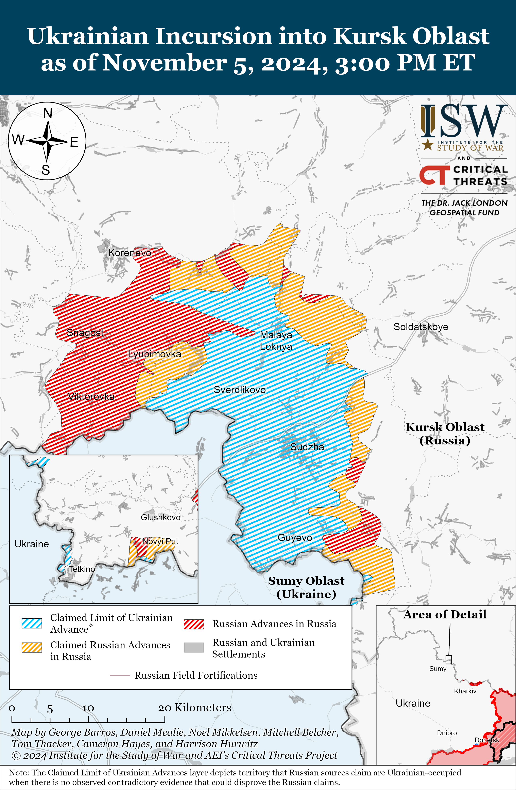
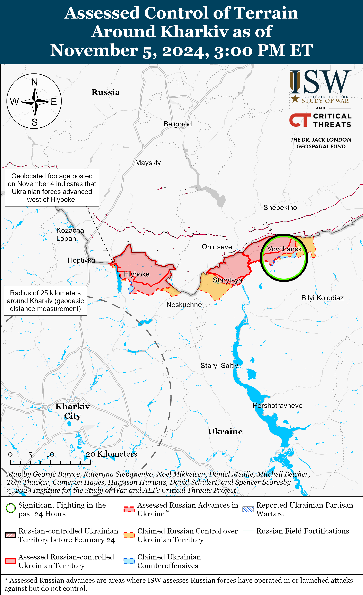
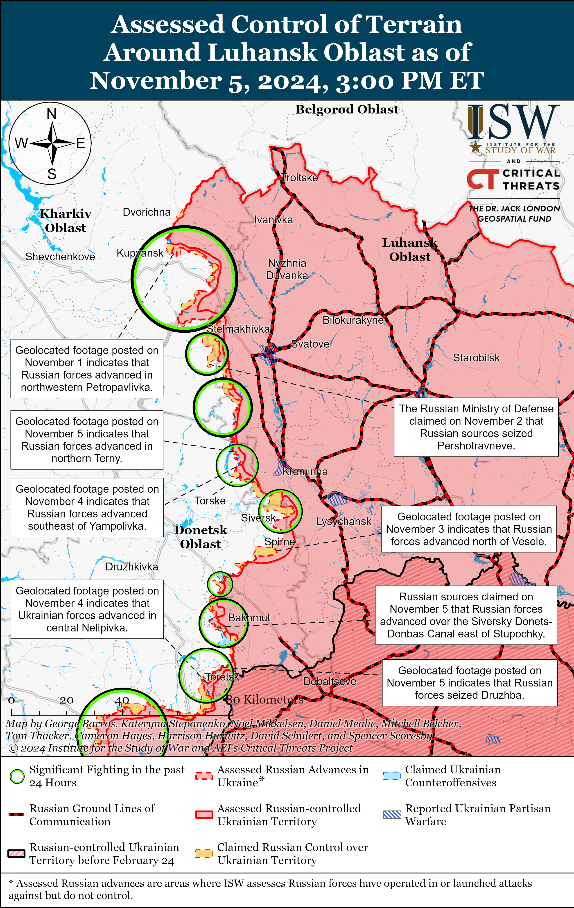
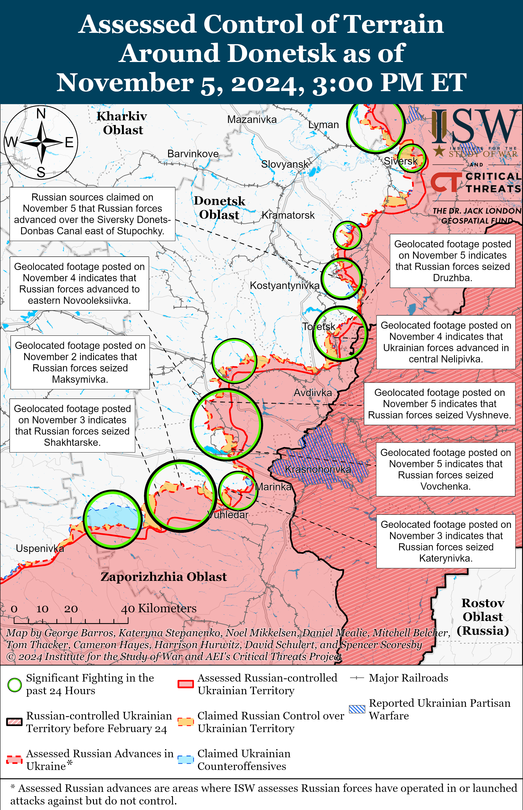
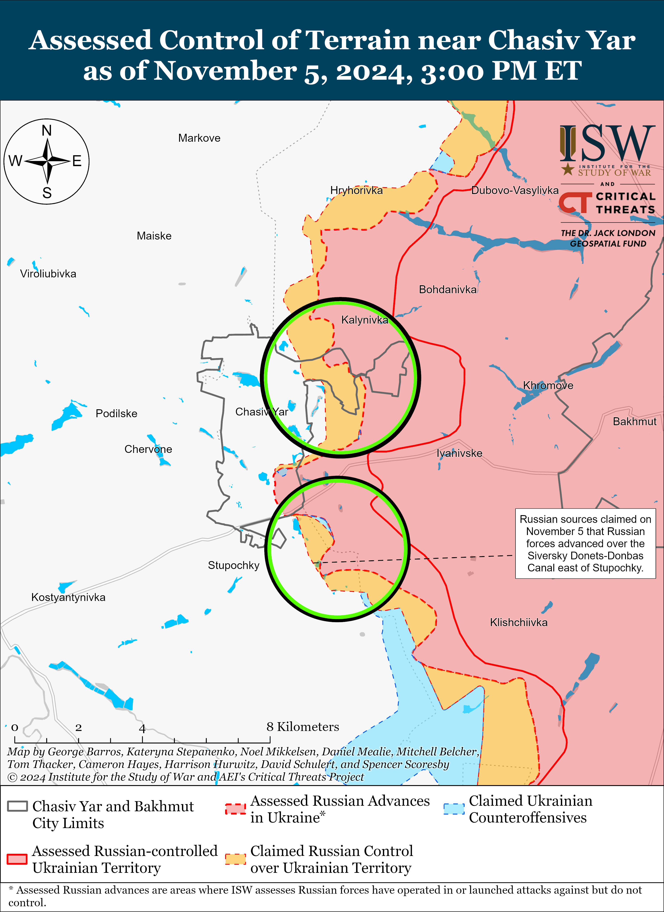
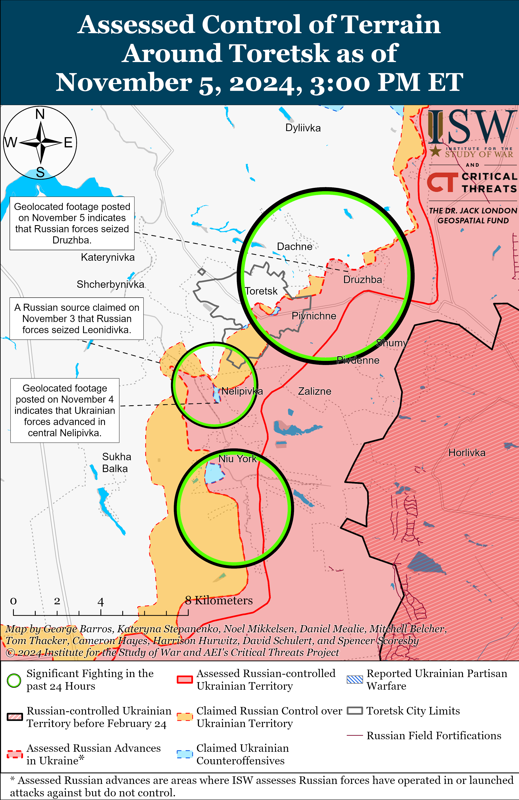
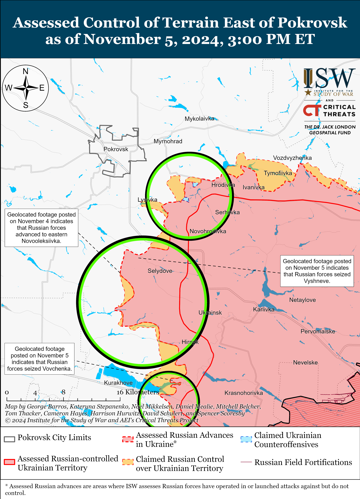
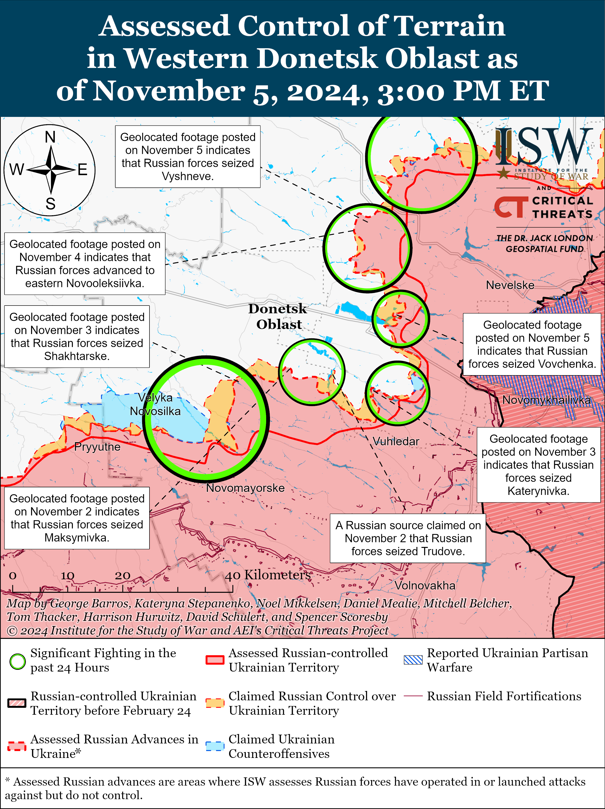
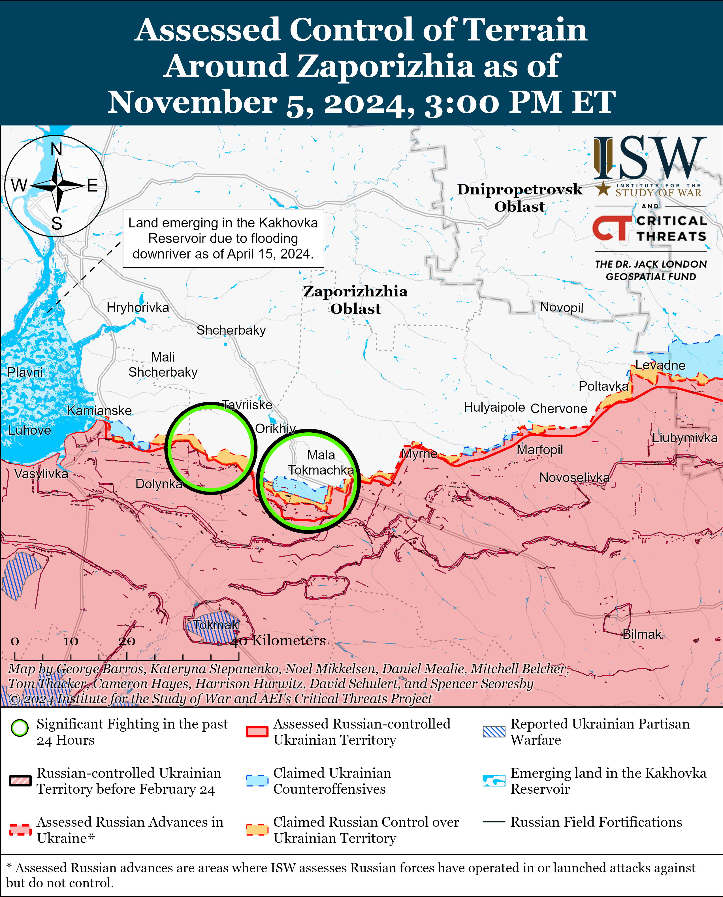
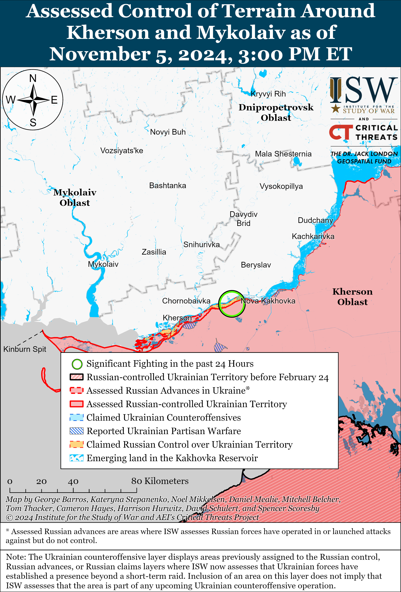

# Russian Offensive Campaign Assessment, November 5, 2024

**November 5, 2024, 5:45pm ET**

**Click** [**here**](https://storymaps.arcgis.com/stories/36a7f6a6f5a9448496de641cf64bd375) **to see ISW’s interactive map of the Russian invasion of Ukraine. This map is updated daily alongside the static maps present in this report.**

**Click** [**here**](https://storymaps.arcgis.com/stories/83a2f24901c941d581c0c523ecd2619b) **to see ISW's interactive map of Ukraine's offensive in Kursk Oblast.**

**Click** [**here**](https://understandingwar.maps.arcgis.com/apps/instant/3dviewer/index.html?appid=1602762dbcde419bb957dea358449580) **to see ISW’s 3D control of terrain topographic map of Ukraine. Use of a computer (not a mobile device) is strongly recommended for using this data-heavy tool.**

**Click** [**here**](https://storymaps.arcgis.com/stories/733fe90805894bfc8562d90b106aa895) **to access ISW’s archive of interactive time-lapse maps of the Russian invasion of Ukraine. These maps complement the static control-of-terrain map that ISW produces daily by showing a dynamic frontline. ISW will update this time-lapse map archive monthly.**

**Note: The data cut-off for this product was 12pm ET on November 5. ISW will cover subsequent reports in the November 6 Russian Offensive Campaign Assessment.**

**The first North Korean forces have likely officially engaged in combat against Ukrainian troops in Kursk Oblast.** Ukrainian Defense Minister Rustem Umerov stated in an interview with South Korean national broadcaster *KBS* on November 5 that Ukrainian forces engaged in "small-scale" clashes with North Korean troops in Kursk Oblast but emphasized that it will take more time for the entire contingent of North Korean forces to deploy to Kursk Oblast and enter combat.[[1]](#_edn85fe6543f08ccd23ab8f2d313a57f8cf1) A source in Ukraine's special services also told Ukrainian outlet *Suspilne* that the first combat clashes between Ukrainian and North Korean forces have occurred but stated that these are not "large connections" between Ukrainian and North Korean forces.[[2]](#_edn85fe6543f08ccd23ab8f2d313a57f8cf2) Umerov noted that it would be difficult for Ukrainian forces to quickly ascertain North Korean casualty counts from the initial fighting because North Korean soldiers have been "mixed in" with the Russian army and are "disguised" as soldiers from the Republic of Buryatia, which notably suggests that the Russian military is trying to integrate North Korean combat power into the Russian force structure, as opposed to maintaining separate North Korean units fighting under Russian command.[[3]](#_edn85fe6543f08ccd23ab8f2d313a57f8cf3) North Korean force structure under Russia’s command remains unclear, however. Umerov forecasted that more North Korean personnel will finish deploying within a few weeks once they complete training in the Russian Far East.[[4]](#_edn85fe6543f08ccd23ab8f2d313a57f8cf4) Ukrainian President Volodymyr Zelensky estimated on November 4 that there are already 11,000 North Korean personnel in Kursk Oblast, although the majority of this number is likely not yet on the frontline.[[5]](#_edn85fe6543f08ccd23ab8f2d313a57f8cf5) ISW continues to assess that Russia will likely leverage North Korean manpower to first and foremost repel the Ukrainian incursion into Kursk Oblast, and that in return North Korean troops hope to gain combat and military-technical experience in the conditions for a contemporary and technologically driven war.[[6]](#_edn85fe6543f08ccd23ab8f2d313a57f8cf6)

**The Kremlin appointed the first-ever "Time of Heroes" program participant to a federal-level position, furthering its ongoing effort to staff government positions with pro-war veterans and set long-term conditions for the militarization of Russian government bodies from local to federal levels.** Russian President Vladimir Putin signed a decree on November 4 appointing Yevgeny Pervyshov as Acting Head of Tambov Oblast.[[7]](#_edn85fe6543f08ccd23ab8f2d313a57f8cf7) Pervyshov is a veteran of the war in Ukraine and an alumnus of the Kremlin's "Time of Heroes" program and is the first veteran of the war in Ukraine to hold the position of head of a Russian federal subject.[[8]](#_edn85fe6543f08ccd23ab8f2d313a57f8cf8) ISW previously reported that Putin met with Pervyshov during a "Time of Heroes" meeting on June 14, during which Pervyshov told Putin that he believes that "Time of Heroes" participants and alumni like himself would make effective government officials and emphasized his personal political experience as a State Duma Deputy and former mayor of Krasnodar City.[[9]](#_edn85fe6543f08ccd23ab8f2d313a57f8cf9) Putin offered Pervyshov a job as a regional head in response.[[10]](#_edn85fe6543f08ccd23ab8f2d313a57f8cf10) Pervyshov previously fought in the "Grom-Kaskad" unmanned aerial vehicle (UAV) Brigade, formerly part of the (now-disbanded) BARS "Kaskad" Battalion that formed in 2017 as part of the Donetsk People's Republic Ministry of Internal Affairs (DNR MVD).[[11]](#_edn85fe6543f08ccd23ab8f2d313a57f8cf11) Putin also notably appointed Maria Kostyuk, the head of the "Time of Heroes" program whose son died fighting in Ukraine in August 2022, to the position of acting governor of the Jewish Autonomous Oblast.[[12]](#_edn85fe6543f08ccd23ab8f2d313a57f8cf12) Putin's appointments of Pervyshov and Kostyuk support ISW's assessment that the Kremlin is using the "Time of Heroes" program to cultivate a cadre of loyal pro-war veterans who will assume government roles to appease the Russian servicemembers who make up one of Putin's core constituencies, to boost domestic support for the war, and militarize Russian local and federal government in the medium to long-term.[[13]](#_edn85fe6543f08ccd23ab8f2d313a57f8cf13)

**Russia launched two Iranian-made satellites into orbit on November 5 via a Russian space-launch vehicle, furthering a trend of Russian-Iranian bilateral space cooperation.[[14]](#_edn85fe6543f08ccd23ab8f2d313a57f8cf14)** The Russian Soyuz 2.1b launch vehicle took off from the Vostochny Cosmodrome in Amur Oblast on the morning of November 5, launching 53 satellites into a 500-kilometer-heigh orbit. Iranian media reported that the launch included the Iranian "Kousar" and "Hodhod" satellites.[[15]](#_edn85fe6543f08ccd23ab8f2d313a57f8cf15) The "Kousar" satellite is reportedly a high-resolution sensing satellite that images the Earth's surface for agricultural, natural resource management, and environmental purposes, whereas the "Hodhod" satellite is designed to create satellite communications and Internet of Things (IoT) networks to enable communications with hard-to-reach areas.[[16]](#_edn85fe6543f08ccd23ab8f2d313a57f8cf16) A private Iranian company — Omid Faza — built and designed the satellites.[[17]](#_edn85fe6543f08ccd23ab8f2d313a57f8cf17) Russia previously launched the Iranian "Khayyam" (alternatively referred to as the Kanopus-V) remote-sensing satellite and the Pars-1 research satellite into orbit in August 2022 and February 2024, respectively.[[18]](#_edn85fe6543f08ccd23ab8f2d313a57f8cf18) ISW-CTP previously assessed that Iran may leverage these satellites to enable long-range targeting capabilities for attacks abroad.[[19]](#_edn85fe6543f08ccd23ab8f2d313a57f8cf19) A prominent Kremlin-affiliated milblogger hailed the "Kousar" and "Hodhod" launches as the latest example of "growing bilateral cooperation" between Russia and Iran in the space sector.[[20]](#_edn85fe6543f08ccd23ab8f2d313a57f8cf20)

**Key Takeaways:**

- **The first North Korean forces have likely officially engaged in combat against Ukrainian troops in Kursk Oblast.**
- **The Kremlin appointed the first-ever "Time of Heroes" program participant to a federal-level position, furthering its ongoing effort to staff government positions with pro-war veterans and set long-term conditions for the militarization of Russian government bodies from local to federal levels.**
- **Russia launched two Iranian-made satellites into orbit on November 5 via a Russian space-launch vehicle, furthering a trend of Russian-Iranian bilateral space cooperation.**
- **Russian forces recently advanced southeast of Kupyansk, northwest of Kreminna, in Chasiv Yar, near Toretsk, southeast of Pokrovsk, northeast of Kurakhove, near Vuhledar, and north of Robotyne.**
- **Ukrainian forces recently regained lost positions south of Chasiv Yar.**
- **The Russian military is struggling to maintain a sufficient number of quality personnel within traditionally elite forces.**

***We do not report in detail on Russian war crimes because these activities are well-covered in Western media and do not directly affect the military operations we are assessing and forecasting. We will continue to evaluate and report on the effects of these criminal activities on the Ukrainian military and the Ukrainian population and specifically on combat in Ukrainian urban areas. We utterly condemn Russian violations of the laws of armed conflict and the Geneva Conventions and crimes against humanity even though we do not describe them in these reports.***

- Ukrainian Operations in the Russian Federation
- Russian Main Effort – Eastern Ukraine (comprised of three subordinate main efforts)
- Russian Subordinate Main Effort #1 – Push Ukrainian forces back from the international border with Belgorod Oblast and approach to within tube artillery range of Kharkiv City
- Russian Subordinate Main Effort #2 – Capture the remainder of Luhansk Oblast and push westward into eastern Kharkiv Oblast and encircle northern Donetsk Oblast
- Russian Subordinate Main Effort #3 – Capture the entirety of Donetsk Oblast
- Russian Supporting Effort – Southern Axis
- Russian Air, Missile, and Drone Campaign
- Russian Mobilization and Force Generation Efforts
- Russian Technological Adaptations
- Activities in Russian-occupied areas
- Significant Activity in Belarus

**Ukrainian Operations in the Russian Federation**

Limited fighting continued in the Ukrainian Kursk Oblast salient on November 5, but neither Ukrainian nor Russian forces made claimed or confirmed advances. The Russian Ministry of Defense (MoD) claimed that Russian forces repelled Ukrainian counterattacks near Darino, Nizhny Klin, and Novoivanovka (all southeast of Korenevo) and in the directions of Leonidovo (southeast of Koreveno) and Plekhovo (southeast of Sudzha).[[21]](#_edn85fe6543f08ccd23ab8f2d313a57f8cf21) A Russian milblogger claimed that Ukrainian forces are holding onto positions near Novoivanovka and bringing fresh troops to counterattack in the area.[[22]](#_edn85fe6543f08ccd23ab8f2d313a57f8cf22) Elements of the Russian 51st Airborne (VDV) Regiment (106th VDV Division) reportedly continue operating near Darino.[[23]](#_edn85fe6543f08ccd23ab8f2d313a57f8cf23)

Neither Russian nor Ukrainian sources reported fighting in Glushkovsky Raion (west of the main Ukrainian Kursk Oblast salient) on November 5. Elements of the Russian 106th VDV Division are reportedly operating near Novy Put (southwest of Glushkovo).[[24]](#_edn85fe6543f08ccd23ab8f2d313a57f8cf24)

**Russian Main Effort – Eastern Ukraine**

**Russian Subordinate Main Effort #1 – Kharkiv Oblast** **(Russian objective: Push Ukrainian forces back from the international border with Belgorod Oblast and approach to within tube artillery range of Kharkiv City)**

Russian forces continued ground attacks northeast of Kharkiv City near Vovchansk on November 4 and 5.[[25]](#_edn85fe6543f08ccd23ab8f2d313a57f8cf25) A spokesperson for a Ukrainian brigade operating in the Kharkiv direction stated on November 5 that successful Ukrainian artillery and first-person view (FPV) drone strikes on Russian tanks and armored vehicles are causing Russian forces to use foot-mobile infantry and occasionally electric scooters for assaults in the Kharkiv direction.[[26]](#_edn85fe6543f08ccd23ab8f2d313a57f8cf26)

**Russian Subordinate Main Effort #2 – Luhansk Oblast (Russian objective: Capture the remainder of Luhansk Oblast and push westward into eastern Kharkiv Oblast and northern Donetsk Oblast)**

Russian forces recently advanced southeast of Kupyansk and northwest of Kreminna amid continued Russian offensive operations along the Kupyansk-Svatove-Kreminna line on November 4 and 5. Geolocated footage published on November 4 and 5 indicates that Russian forces advanced west of Novoselivske (southeast of Kupyansk) and to a windbreak in northern Terny (northwest of Kreminna).[[27]](#_edn85fe6543f08ccd23ab8f2d313a57f8cf27) Russian sources claimed that Russian forces continued to advance near Kolisnykivka (southeast of Kupyansk) and have captured most of the settlement, and that Russian forces advanced near Terny, although ISW has not yet observed confirmation of any of these claims.[[28]](#_edn85fe6543f08ccd23ab8f2d313a57f8cf28) The Ukrainian General Staff reported that Russian forces continued offensive operations north of Kupyansk near Kindrashivka; east of Kupyansk near Petropavlivka; southeast of Kupyansk near Kolisnykivka, Kruhlyakivka, Novoosynove, Lozova, Cherneshchyna, Zahryzove, and Kucherivka; northwest of Svatove near Pishchane; west of Svatove near Vyshneve; southwest of Svatove near Druzhelyubivka, Makiivka, Katerynivka, and Hrekivka; and west of Kremmina near Torske, Zarichne, and Terny.[[29]](#_edn85fe6543f08ccd23ab8f2d313a57f8cf29) A spokesperson for a Ukrainian brigade operating in the Kupyansk direction stated on November 5 that Russian forces have doubled the number of ground attacks and are using fireteam-sized assault units of three to five soldiers.[[30]](#_edn85fe6543f08ccd23ab8f2d313a57f8cf30)

**Russian Subordinate Main Effort #3 – Donetsk Oblast (Russian objective: Capture the entirety of Donetsk Oblast, the claimed territory of Russia’s proxies in Donbas)**

The Ukrainian General Staff reported that Russian forces conducted unsuccessful ground attacks northeast of Siversk near Bilohorivka on November 5.[[31]](#_edn85fe6543f08ccd23ab8f2d313a57f8cf31)

Ukrainian and Russian forces recently advanced in the Chasiv Yar direction amid continued Russian offensive operations in the area on November 5. Geolocated footage published on November 5 indicates that Ukrainian forces recently regained lost positions south of Chasiv Yar.[[32]](#_edn85fe6543f08ccd23ab8f2d313a57f8cf32) Additional geolocated footage published on November 5 indicates that Russian forces advanced east of Stupochky (south of Chasiv Yar).[[33]](#_edn85fe6543f08ccd23ab8f2d313a57f8cf33) Russian forces continued attacking near Chasiv Yar, Stupochky, and Orikhovo-Vasylivka (northeast of Chasiv Yar) on November 4 and 5.[[34]](#_edn85fe6543f08ccd23ab8f2d313a57f8cf34)

Russian forces recently advanced in the Toretsk direction amid continued offensive operations in the area on November 4. Geolocated footage published on November 5 indicates that Russian forces recently seized Druzhba (east of Toretsk).[[35]](#_edn85fe6543f08ccd23ab8f2d313a57f8cf35) Russian forces continued attacking near Toretsk itself; northwest of Toretsk in the direction of Kostyantynivka; northeast of Toretsk near Dachne; east of Toretsk near Druzhba; west of Toretsk near Shcherbynivka; and southwest of Toretsk near Sukha Balka on November 4 and 5.[[36]](#_edn85fe6543f08ccd23ab8f2d313a57f8cf36)

Russian forces recently advanced in the Pokrovsk direction amid continued offensive operations in the area on November 5. Geolocated footage published on November 5 indicates that Russian forces recently seized Vyshneve (southeast of Pokrovsk) and advanced south of Lysivka and south of Petrivka (both southeast of Pokrovsk).[[37]](#_edn85fe6543f08ccd23ab8f2d313a57f8cf37) Russian forces continued attacking east of Pokrovsk near Promin and Hrodivka and southeast of Pokrovsk near Krutyi Yar, Novohrodivka, Selydove, Novooleksiivka, Vyshneve, Yurivka, and Hryhorivka on November 4 and 5.[[38]](#_edn85fe6543f08ccd23ab8f2d313a57f8cf38)

Russian forces recently advanced in the Kurakhove direction amid continued offensive operations in the area on November 5. Geolocated footage published on November 5 indicates that elements of the Russian 114th Motorized Rifle Brigade (51st Combined Arms Army [CAA], formerly 1st Donetsk People's Republic Army Corps [DNR AC]) recently seized Vovchenka (northeast of Kurakhove).[[39]](#_edn85fe6543f08ccd23ab8f2d313a57f8cf39) Additional geolocated footage published on November 5 shows Ukrainian forces repelling a Russian reinforced company-sized mechanized assault southwest of Maksymilyanivka (east of Kurakhove) indicating that Russian forces advanced southwest of the settlement.[[40]](#_edn85fe6543f08ccd23ab8f2d313a57f8cf40) The UK Ministry of Defense (MoD) stated on November 6 that Russian forces seized Hirnyk (northeast of Kurakhove), and Ukrainian military observer Kostyantyn Mashovets stated that Ukrainian forces withdrew from the Izmailivka-Hirnyk-Kurakhivka-Ostrivske area (all northeast of Kurakhove).[[41]](#_edn85fe6543f08ccd23ab8f2d313a57f8cf41) Russian sources also claimed that Russian forces had seized Hirnyk as of November 4.[[42]](#_edn85fe6543f08ccd23ab8f2d313a57f8cf42) Russian forces continued attacking near Kurakhove itself; northwest of Kurakhove near Novodmytrivka; north of Kurakhove near Kreminna Balka, Novoselydivka, and Stepanivka; east of Kurakhove near Hostre and Maksymilyanivka; and northeast of Kurakhove near Illinka, Vovchenka, and Ostrivske on November 4 and 5.[[43]](#_edn85fe6543f08ccd23ab8f2d313a57f8cf43) Mashovets stated that elements of the Russian 90th Tank Division (41st CAA, Central Military District [CMD]), 27th Motorized Rifle Division (2nd CAA, CMD), and the 5th, 110th, and 114th motorized rifle brigades (all 51st CAA) are operating along the Ukrainsk-Novoselydivka-Novodmytrivka line (north of Kurakhove).[[44]](#_edn85fe6543f08ccd23ab8f2d313a57f8cf44) Mashovets stated that Russian forces have one motorized rifle regiment and three battalions of the 51st CAA and one tank battalion, likely of the 8th CAA (SMD), in reserve in the Kurakhove direction.[[45]](#_edn85fe6543f08ccd23ab8f2d313a57f8cf45)

Russian forces recently advanced near Vuhledar amid continued offensive operations in the area on November 5. Additional geolocated footage published on November 5 indicates that Russian forces recently advanced northwest of Bohoyavlenka and west of Shakhtarske (both northwest of Vuhledar).[[46]](#_edn85fe6543f08ccd23ab8f2d313a57f8cf46) Russian milbloggers claimed that Russian forces seized Trudove (northeast of Vuhledar) and advanced north of Kostyantynivka (northeast of Vuhledar) and west of Zolota Nyva (northwest of Vuhledar), although ISW has not observed visual confirmation of these claims.[[47]](#_edn85fe6543f08ccd23ab8f2d313a57f8cf47) Russian forces continued attacking northeast of Vuhledar near Antonivka, Yelyzavetivka, and Katerynivka; north of Vuhledar near Hannivka and Dalne; northwest of Vuhledar near Trudove, Bohoyavlenka, Maksymivka, Kostyantynopolske, Rozdolne, and Velyka Novosilka; and southwest of Vuhledar near Urozhaine on November 4 and 5.[[48]](#_edn85fe6543f08ccd23ab8f2d313a57f8cf48) Mashovets stated that elements of the Russian 255th Motorized Rifle Regiment and the 33rd Motorized Rifle Regiment (both of the 20th Motorized Rifle Division, 8th CAA, Southern Military District [SMD]), and the 10th Tank Regiment (3rd AC) are operating in the Kostyantynivka-Paraskoviivka direction (northeast of Vuhledar).[[49]](#_edn85fe6543f08ccd23ab8f2d313a57f8cf49) Mashovets stated that Russian forces have up to three motorized rifle regiments in reserve in the Vuhledar direction, but that only the 902nd Spetsnaz Regiment (116th Spetsnaz Brigade) is fully staffed.[[50]](#_edn85fe6543f08ccd23ab8f2d313a57f8cf50) Elements of the Russian 60th Motorized Rifle Brigade (5th CAA, Eastern Military District [EMD]) are reportedly operating in the Vremivka direction northwest of Vuhledar; the elements of the 40th Naval Infantry Brigade (Pacific Fleet, EMD) are reportedly operating near Shakhtarske; and elements of the 57th Motorized Rifle Brigade (5th CAA EMD) are reportedly operating near Bohoyavlenka.[[51]](#_edn85fe6543f08ccd23ab8f2d313a57f8cf51)

**Russian Supporting Effort – Southern Axis (Russian objective: Maintain frontline positions and secure rear areas against Ukrainian strikes)**

Russian forces recently marginally advanced during localized ground attacks in western Zaporizhia Oblast on November 5. Geolocated footage posted on November 4 indicates that Russian forces recently advanced to a windbreak southwest of Novodanylivka (north of Robotyne).[[52]](#_edn85fe6543f08ccd23ab8f2d313a57f8cf52) A Russian milblogger claimed on November 4 that Russian forces advanced 1.5 kilometers northward along windbreaks west of Nesteryanka (northwest of Robotyne), although ISW has not observed confirmation of this claim.[[53]](#_edn85fe6543f08ccd23ab8f2d313a57f8cf53) The Ukrainian General Staff reported that Russian forces continued attacking north of Robotyne near Novodanylivka and Orikhiv; and northwest of Robotyne near Novoandriivka and Mali Shcherbaky on November 4 and 5.

The Ukrainian General Staff reported that Russian forces continued unsuccessful ground attacks in the Dnipro direction, likely referring to east (left) bank Kherson Oblast and the islands of the Dnipro River Delta on November 4 and 5.[[54]](#_edn85fe6543f08ccd23ab8f2d313a57f8cf54)

**Russian Air, Missile, and Drone Campaign (Russian Objective: Target Ukrainian military and civilian infrastructure in the rear and on the frontline)**

Russian forces conducted a series of drone and missile strikes against Ukraine on the night of November 4 to 5. The Ukrainian Air Force reported that Russian forces launched two Kh-59/69 cruise missiles from airspace over the Black Sea towards Odesa Oblast and 79 Shahed and other unspecified types of drones from Bryansk, Kursk, and Oryol oblasts.[[55]](#_edn85fe6543f08ccd23ab8f2d313a57f8cf55) The Ukrainian Air Force reported that Ukrainian forces downed both Kh-59/69 cruise missiles and 48 drones over Odessa, Kyiv, Sumy, Poltava, Zhytomyr, Cherkasy, Chernihiv, and Khmelnytskyi oblasts; that 30 drones were "lost" likely due to Ukrainian electronic warfare (EW) interference; and that one drone returned to Russian airspace. Ukrainian officials reported on November 5 that Russian forces launched guided glide bombs at civilian infrastructure objects in Shevchenkivskyi Raion, Kharkiv City.[[56]](#_edn85fe6543f08ccd23ab8f2d313a57f8cf56) Ukrainian sources reported on November 5 that a Russian strike on an infrastructure facility in Zaporizhzhia City killed six and wounded 24.[[57]](#_edn85fe6543f08ccd23ab8f2d313a57f8cf57) A Russian source claimed that Russian forces conducted strikes on Ukrainian "missile production workshops" and military airfields throughout Ukraine, including in Kyiv, Zaporizhia, and Chernihiv oblasts on November 5.[[58]](#_edn85fe6543f08ccd23ab8f2d313a57f8cf58) ISW has not observed visual confirmation of these strikes, however.

The Ukrainian General Staff reported on November 5 that Russian forces launched 4,300 Shahed-type attack drones, and drones that imitate Shaheds, towards Ukraine between August and October 2024. [[59]](#_edn85fe6543f08ccd23ab8f2d313a57f8cf59) The Ukrainian General Staff added that Ukrainian forces have shot down 71 percent of these Russian drones and stated that Russian forces launched a record number of drone strikes in October. The Ukrainian General Staff stated on November 5 that Russian forces are using electronic warfare systems (EW) to spoof GPS signals and alter GPS satellite navigation coordinates in order to disrupt Ukrainian anti-air defenses.[[60]](#_edn85fe6543f08ccd23ab8f2d313a57f8cf60)

**Russian Mobilization and Force Generation Efforts (Russian objective: Expand combat power without conducting general mobilization)**

Ukraine's Center for Defense Strategies expert Viktor Kevlyuk stated on November 5 that the Russian military is struggling to maintain a sufficient number of quality personnel within traditionally elite forces.[[61]](#_edn85fe6543f08ccd23ab8f2d313a57f8cf61) Kevlyuk noted that the number of Russian special operation forces (SSO) personnel remains limited because Russian forces have committed many of these forces to the frontlines in Ukraine and because the Russian military maintains stringent selection requirements to join the SSO. Kevlyuk stated that the quality of Russian Spetsnaz forces (Special Forces of the Main Directorate of the General Staff of the Russian Armed Forces [GRU]) has deteriorated as only half of the personnel who were serving in these units at the beginning of the war are still fighting. Kevlyuk stated that the Russian military has replaced the remaining personnel in Spetsnaz units with older and physically unfit personnel. Kevlyuk stated that while Russian airborne troops remain well-equipped and maneuver along the entire frontline, many airborne units include personnel from motorized rifle regiments and reserves with little to no proper airborne training. Kevlyuk also noted that Russian naval infantry units are staffed with convict recruits, unlike Spetsnaz and airborne units, indicating that the Russian military likely uses naval infantry units as assault unis.

Kevlyuk also reported that the Russian military may be struggling to maintain a consistent personnel replacement rate.[[62]](#_edn85fe6543f08ccd23ab8f2d313a57f8cf62) Kevlyuk noted that Russian forces likely suffered some of the heaviest losses in October 2024 since the start of the war in Ukraine in 2022.[[63]](#_edn85fe6543f08ccd23ab8f2d313a57f8cf63) Kevlyuk predicted that the number of Russian forces in Ukraine, currently numbering around 470,000, are gradually dwindling. Kevlyuk stated that the Russian recruitment system is struggling to keep pace with losses, and that Russian forces suffered 57,500 casualties between September 29 and October 24, while monthly reinforcements-around 20,000 to 25,000 fall short of the replacement threshold. ISW cannot independently confirm Kevlyuk's report. ISW has assessed that Russian authorities will continue to maintain crypto-mobilization efforts until federal mobilization efforts are necessary to achieve operational requirements in Ukraine.[[64]](#_edn85fe6543f08ccd23ab8f2d313a57f8cf64)

Russian opposition outlet 7x7-*Horizontal Russia* reported on November 5 that military enlistment officers in Korkino, Chelyabinsk Oblast issued residents more than 70 military service summonses during police raids following the murder of a taxi driver and subsequent pogroms against the local Roma community in October 2024.[[65]](#_edn85fe6543f08ccd23ab8f2d313a57f8cf65) ISW previously noted that Russian authorities have consistently targeted Russia's migrants and non-ethnic Russian minority communities for force generation efforts.[[66]](#_edn85fe6543f08ccd23ab8f2d313a57f8cf66)

The Russian military continues to advertise Russian military service with promises of large payments. Independent Russian-language outlet *Idel Realii* stated on November 5 that Nizhny Novgorod Oblast authorities increased one-time payments for signing a contract with the Russian MoD to three million rubles (about $30,675).[[67]](#_edn85fe6543f08ccd23ab8f2d313a57f8cf67) Nizhny Novgorod authorities have promised up to 5.5 million rubles (about $56,000) in one-time payments — the highest of such offers in Russia when combined with the Russian MoD's one-time payment.[[68]](#_edn85fe6543f08ccd23ab8f2d313a57f8cf68) ISW has reported at length on recent Russian efforts to incentivize contract recruitment by increasing one-time signing bonuses and assessed that such efforts appear to be increasing strain on Russia's war time economy.[[69]](#_edn85fe6543f08ccd23ab8f2d313a57f8cf69)

**Russian Technological Adaptations** **(Russian objective: Introduce technological innovations to optimize systems for use in Ukraine)**

Nothing significant to report. **Activities in Russian-occupied areas (Russian objective: Consolidate administrative control of annexed areas; forcibly integrate Ukrainian citizens into Russian sociocultural, economic, military, and governance systems)**

*ISW is not publishing reporting on activities in Russian-occupied areas today.*

**Significant activity in Belarus** **(Russian efforts to increase its military presence in Belarus and further integrate Belarus into Russian-favorable frameworks and Wagner Group activity in Belarus)**

Nothing significant to report.

**Note: ISW does not receive any classified material from any source, uses only publicly available information, and draws extensively on Russian, Ukrainian, and Western reporting and social media as well as commercially available satellite imagery and other geospatial data as the basis for these reports. References to all sources used are provided in the endnotes of each update.\**

---

[[1]](#_edn85fe6543f08ccd23ab8f2d313a57f8cfref1) <https://news.kbs.co> dot kr/news/pc/view/view.do?ncd=8098257

[[2]](#_edn85fe6543f08ccd23ab8f2d313a57f8cfref2) <https://suspilne> dot media/873115-dzerelo-v-specsluzbah-u-kurskij-oblasti-vidbulisa-persi-bojovi-zitknenna-z-soldatami-kndr/

[[3]](#_edn85fe6543f08ccd23ab8f2d313a57f8cfref3) <https://news.kbs.co> dot kr/news/pc/view/view.do?ncd=8098257

[[4]](#_edn85fe6543f08ccd23ab8f2d313a57f8cfref4) <https://news.kbs.co> dot kr/news/pc/view/view.do?ncd=8098257

[[5]](#_edn85fe6543f08ccd23ab8f2d313a57f8cfref5) <https://armyinform.com> dot ua/2024/11/04/bachymo-zbilshennya-kilkosti-pivnichnokorejcziv-ne-bachymo-zbilshennya-reakcziyi-partneriv-prezydent/

[[6]](#_edn85fe6543f08ccd23ab8f2d313a57f8cfref6) https://www.understandingwar.org/backgrounder/north-korea-joins-russias-war-against-ukraine-operational-and-strategic-implications

[[7]](#_edn85fe6543f08ccd23ab8f2d313a57f8cfref7) <http://kremlin> dot ru/events/president/news/75492; <https://t.me/news_kremlin/4690>; <https://lenta> dot ru/news/2024/11/05/putin-naznachil-novyh-glav-v-dvuh-rossiyskih-regionah/

[[8]](#_edn85fe6543f08ccd23ab8f2d313a57f8cfref8) <https://t.me/wargonzo/22965>; <https://lenta> dot ru/news/2024/11/05/putin-naznachil-novyh-glav-v-dvuh-rossiyskih-regionah/; <https://www.rbc> dot ru/politics/04/11/2024/672907cc9a79475ff34c5e51

[[9]](#_edn85fe6543f08ccd23ab8f2d313a57f8cfref9) https://www.understandingwar.org/backgrounder/russian-offensive-campaign-assessment-june-15-2024

[[10]](#_edn85fe6543f08ccd23ab8f2d313a57f8cfref10) https://t.me/skabeevy/37631

[[11]](#_edn85fe6543f08ccd23ab8f2d313a57f8cfref11) <https://t.me/wargonzo/20520/>; <https://www.understandingwar.org/backgrounder/russian-offensive-campaign-assessment-june-15-2024>; <https://www.understandingwar.org/backgrounder/russian-offensive-campaign-assessment-december-28-2023> (Kaskad disbandment)

[[12]](#_edn85fe6543f08ccd23ab8f2d313a57f8cfref12) <https://t.me/tass_agency/283643>; <https://t.me/tass_agency/283645>; <https://t.me/tass_agency/283648>; <https://www.vedomosti> dot ru/spravka/mariya-kostyuk; <http://kremlin> dot ru/events/president/news/75500

[[13]](#_edn85fe6543f08ccd23ab8f2d313a57f8cfref13) <https://www.understandingwar.org/backgrounder/russian-offensive-campaign-assessment-june-15-2024>; <https://isw.pub/UkrWar100324>; https://isw.pub/UkrWar090924

[[14]](#_edn85fe6543f08ccd23ab8f2d313a57f8cfref14) <https://www.reuters.com/technology/space/russia-launches-soyuz-rocket-with-dozens-satellites-including-two-iran-2024-11-05/>; <https://www.isna> dot ir/news/1403081510797/%D8%AF%D9%88-%D9%85%D8%A7%D9%87%D9%88%D8%A7%D8%B1%D9%87-%D8%A7%DB%8C%D8%B1%D8%A7%D9%86%DB%8C-%D8%A8%D8%A7-%D9%85%D9%88%D9%81%D9%82%DB%8C%D8%AA-%D9%BE%D8%B1%D8%AA%D8%A7%D8%A8-%D8%B4%D8%AF%D9%86%D8%AF-%D9%81%DB%8C%D9%84%D9%85

[[15]](#_edn85fe6543f08ccd23ab8f2d313a57f8cfref15) <https://www.tasnimnews> dot com/fa/news/1403/08/15/3193818/%D9%85%D8%A7%D9%87%D9%88%D8%A7%D8%B1%D9%87-%D9%87%D8%A7%DB%8C-%D8%A7%DB%8C%D8%B1%D8%A7%D9%86%DB%8C-%DA%A9%D9%88%D8%AB%D8%B1-%D9%88-%D9%87%D8%AF%D9%87%D8%AF-%D8%A8%D9%87-%D9%81%D8%B6%D8%A7-%D9%BE%D8%B1%D8%AA%D8%A7%D8%A8-%D8%B4%D8%AF%D9%86%D8%AF; <https://www.isna> dot ir/news/1403081510797/%D8%AF%D9%88-%D9%85%D8%A7%D9%87%D9%88%D8%A7%D8%B1%D9%87-%D8%A7%DB%8C%D8%B1%D8%A7%D9%86%DB%8C-%D8%A8%D8%A7-%D9%85%D9%88%D9%81%D9%82%DB%8C%D8%AA-%D9%BE%D8%B1%D8%AA%D8%A7%D8%A8-%D8%B4%D8%AF%D9%86%D8%AF-%D9%81%DB%8C%D9%84%D9%85

[[16]](#_edn85fe6543f08ccd23ab8f2d313a57f8cfref16) <https://www.tasnimnews> dot com/ru/news/2024/11/05/3194366/%D0%B8%D1%80%D0%B0%D0%BD%D1%81%D0%BA%D0%B8%D0%B5-%D1%81%D0%BF%D1%83%D1%82%D0%BD%D0%B8%D0%BA%D0%B8-%D0%BA%D0%BE%D1%83%D1%81%D0%B0%D1%80-%D0%B8-%D1%85%D0%BE%D0%B4%D1%85%D0%BE%D0%B4-%D0%B1%D1%8B%D0%BB%D0%B8-%D0%B7%D0%B0%D0%BF%D1%83%D1%89%D0%B5%D0%BD%D1%8B-%D0%B2-%D0%BA%D0%BE%D1%81%D0%BC%D0%BE%D1%81; https://t.me/rybar/65095

[[17]](#_edn85fe6543f08ccd23ab8f2d313a57f8cfref17) [https://www.spaceomid](https://www.spaceomid/) dot com/fa; [https://www.iranhavafaza](https://www.iranhavafaza/) dot com/index/article/2801

[[18]](#_edn85fe6543f08ccd23ab8f2d313a57f8cfref18) <https://www.reuters.com/world/russia-launches-iranian-satellite-into-space-under-shadow-western-concerns-2022-08-09/>; <https://www.understandingwar.org/backgrounder/russian-offensive-campaign-assessment-august-9>; <https://www.aljazeera.com/news/2024/11/5/russian-rocket-takes-iranian-satellites-into-orbit-as-ties-grow-closer#:~:text=Russia%20put%20another%20Iranian%20satellite,media%20reported%20at%20the%20time>.; https://www.understandingwar.org/backgrounder/iran-update-february-28-2024

[[19]](#_edn85fe6543f08ccd23ab8f2d313a57f8cfref19) https://www.understandingwar.org/backgrounder/iran-update-february-28-2024

[[20]](#_edn85fe6543f08ccd23ab8f2d313a57f8cfref20) https://t.me/rybar/65095

[[21]](#_edn85fe6543f08ccd23ab8f2d313a57f8cfref21) <https://t.me/mod_russia/45383>

[[22]](#_edn85fe6543f08ccd23ab8f2d313a57f8cfref22) <https://t.me/DnevnikDesantnika/18603>

[[23]](#_edn85fe6543f08ccd23ab8f2d313a57f8cfref23) <https://t.me/voin_dv/11654>

[[24]](#_edn85fe6543f08ccd23ab8f2d313a57f8cfref24) <https://t.me/rusich_army/18221>

[[25]](#_edn85fe6543f08ccd23ab8f2d313a57f8cfref25)<https://www.facebook.com/GeneralStaff.ua/posts/pfbid025FBFDxasCHm2KT8KHY8FDJMPgSFt7PCai2an3HMDa58CcnWaxN2MKoUdXiTj7SCGl> ;<https://www.facebook.com/GeneralStaff.ua/posts/pfbid02J9hjXou4Q57T72dneCg3nmKRkQyyvybb8ZQw5snDFamUwoa3fjyKrsxL4ha99w8jl>

[[26]](#_edn85fe6543f08ccd23ab8f2d313a57f8cfref26) https://armyinform.com dot ua/2024/11/05/elektrosamokatni-shturmy-rosiyan-prymushuyut-jty-vpered-bud-yakoyu-czinoyu/

[[27]](#_edn85fe6543f08ccd23ab8f2d313a57f8cfref27) <https://t.me/creamy_caprice/7389> ; <https://t.me/operational_space/1516> ; <https://t.me/ssternenko/35733> ; https://t.me/WarArchive\_ua/21991

[[28]](#_edn85fe6543f08ccd23ab8f2d313a57f8cfref28) <https://t.me/voenkorKotenok/59950> ; <https://t.me/NeoficialniyBeZsonoV/41201> ; <https://t.me/smotri_z/36359>; <https://t.me/rybar/65072> ; <https://t.me/DnevnikDesantnika/18597>

[[29]](#_edn85fe6543f08ccd23ab8f2d313a57f8cfref29) https://www.facebook.com/GeneralStaff.ua/posts/pfbid0iNFmFYShbERhiARiwAcW8v5xdgkTt1H6RDEK2NbT3PzXQb7TFtWarD5cYfRhKpQel ; https://www.facebook.com/GeneralStaff.ua/posts/pfbid025FBFDxasCHm2KT8KHY8FDJMPgSFt7PCai2an3HMDa58CcnWaxN2MKoUdXiTj7SCGl ; <https://www.facebook.com/GeneralStaff.ua/posts/pfbid02J9hjXou4Q57T72dneCg3nmKRkQyyvybb8ZQw5snDFamUwoa3fjyKrsxL4ha99w8jl> ; https://www.facebook.com/GeneralStaff.ua/posts/pfbid0iNFmFYShbERhiARiwAcW8v5xdgkTt1H6RDEK2NbT3PzXQb7TFtWarD5cYfRhKpQel ; https://www.facebook.com/GeneralStaff.ua/posts/pfbid025FBFDxasCHm2KT8KHY8FDJMPgSFt7PCai2an3HMDa58CcnWaxN2MKoUdXiTj7SCGl ; https://www.facebook.com/GeneralStaff.ua/posts/pfbid02J9hjXou4Q57T72dneCg3nmKRkQyyvybb8ZQw5snDFamUwoa3fjyKrsxL4ha99w8jl

[[30]](#_edn85fe6543f08ccd23ab8f2d313a57f8cfref30) https://armyinform.com dot ua/2024/11/05/tvorchist-majsternist-vijskova-hytrist-na-harkivshhyni-protyvnyka-namagayutsya-nyshhyty-kreatyvno-i-z-dystancziyi/

[[31]](#_edn85fe6543f08ccd23ab8f2d313a57f8cfref31) https://www.facebook.com/GeneralStaff.ua/posts/pfbid025FBFDxasCHm2KT8KHY8FDJMPgSFt7PCai2an3HMDa58CcnWaxN2MKoUdXiTj7SCGl

[[32]](#_edn85fe6543f08ccd23ab8f2d313a57f8cfref32) https://t.me/creamy\_caprice/7401; https://t.me/shustryii\_i/1161; https://t.me/wargonzo/22968

[[33]](#_edn85fe6543f08ccd23ab8f2d313a57f8cfref33) https://t.me/creamy\_caprice/7392; https://t.me/c/1996164769/2473

[[34]](#_edn85fe6543f08ccd23ab8f2d313a57f8cfref34) <https://www.facebook.com/GeneralStaff.ua/posts/pfbid0iNFmFYShbERhiARiwAcW8v5xdgkTt1H6RDEK2NbT3PzXQb7TFtWarD5cYfRhKpQel> ; https://www.facebook.com/GeneralStaff.ua/posts/pfbid025FBFDxasCHm2KT8KHY8FDJMPgSFt7PCai2an3HMDa58CcnWaxN2MKoUdXiTj7SCGl ; https://www.facebook.com/GeneralStaff.ua/posts/pfbid02J9hjXou4Q57T72dneCg3nmKRkQyyvybb8ZQw5snDFamUwoa3fjyKrsxL4ha99w8jl

[[35]](#_edn85fe6543f08ccd23ab8f2d313a57f8cfref35) https://x.com/AudaxonX/status/1853854778474024973; https://t.me/rubpak28/466

[[36]](#_edn85fe6543f08ccd23ab8f2d313a57f8cfref36) https://www.facebook.com/GeneralStaff.ua/posts/pfbid0iNFmFYShbERhiARiwAcW8v5xdgkTt1H6RDEK2NbT3PzXQb7TFtWarD5cYfRhKpQel ; <https://www.facebook.com/GeneralStaff.ua/posts/pfbid025FBFDxasCHm2KT8KHY8FDJMPgSFt7PCai2an3HMDa58CcnWaxN2MKoUdXiTj7SCGl> ; https://www.facebook.com/GeneralStaff.ua/posts/pfbid02J9hjXou4Q57T72dneCg3nmKRkQyyvybb8ZQw5snDFamUwoa3fjyKrsxL4ha99w8jl ; <https://t.me/rybar/65070> ; https://t.me/rybar/65072; https://t.me/dva\_majors/56839

[[37]](#_edn85fe6543f08ccd23ab8f2d313a57f8cfref37) (Vyshneve) https://t.me/gostrikartuzy/669; <https://t.me/kiber_boroshno/10543>

(Lysivka) https://t.me/ggwpteam2504/318; https://t.me/creamy\_caprice/7384

(Petrivka) https://t.me/creamy\_caprice/7394; https://t.me/btr80/21931

[[38]](#_edn85fe6543f08ccd23ab8f2d313a57f8cfref38) <https://www.facebook.com/GeneralStaff.ua/posts/pfbid0iNFmFYShbERhiARiwAcW8v5xdgkTt1H6RDEK2NbT3PzXQb7TFtWarD5cYfRhKpQel> ; https://www.facebook.com/GeneralStaff.ua/posts/pfbid025FBFDxasCHm2KT8KHY8FDJMPgSFt7PCai2an3HMDa58CcnWaxN2MKoUdXiTj7SCGl ; https://www.facebook.com/GeneralStaff.ua/posts/pfbid02J9hjXou4Q57T72dneCg3nmKRkQyyvybb8ZQw5snDFamUwoa3fjyKrsxL4ha99w8jl ; <https://t.me/DnevnikDesantnika/18604> ; https://t.me/DnevnikDesantnika/18578

[[39]](#_edn85fe6543f08ccd23ab8f2d313a57f8cfref39) https://t.me/creamy\_caprice/7396; https://t.me/mo114rf/71

[[40]](#_edn85fe6543f08ccd23ab8f2d313a57f8cfref40) https://x.com/PuenteUribarri/status/1853762134657630244; https://t.me/oaembr46/1127; https://x.com/MikiValbuena/status/1853779008313233674; https://x.com/SibirPrizrak/status/1853790708034896084;

[[41]](#_edn85fe6543f08ccd23ab8f2d313a57f8cfref41) <https://x.com/DefenceHQ/status/1853736943214842003> ; https://t.me/zvizdecmanhustu/2321

[[42]](#_edn85fe6543f08ccd23ab8f2d313a57f8cfref42) https://t.me/tass\_agency/283404; https://t.me/tass\_agency/283398; https://t.me/mo114rf/62; <https://telesco> dot pe/wargonzo/22957

[[43]](#_edn85fe6543f08ccd23ab8f2d313a57f8cfref43) <https://www.facebook.com/GeneralStaff.ua/posts/pfbid0iNFmFYShbERhiARiwAcW8v5xdgkTt1H6RDEK2NbT3PzXQb7TFtWarD5cYfRhKpQel> ; <https://www.facebook.com/GeneralStaff.ua/posts/pfbid025FBFDxasCHm2KT8KHY8FDJMPgSFt7PCai2an3HMDa58CcnWaxN2MKoUdXiTj7SCGl> ; https://www.facebook.com/GeneralStaff.ua/posts/pfbid02J9hjXou4Q57T72dneCg3nmKRkQyyvybb8ZQw5snDFamUwoa3fjyKrsxL4ha99w8jl

[[44]](#_edn85fe6543f08ccd23ab8f2d313a57f8cfref44) https://t.me/zvizdecmanhustu/2321

[[45]](#_edn85fe6543f08ccd23ab8f2d313a57f8cfref45) https://t.me/zvizdecmanhustu/2319;

[[46]](#_edn85fe6543f08ccd23ab8f2d313a57f8cfref46) https://t.me/voin\_dv/11665; <https://t.me/creamy_caprice/7399> ; https://t.me/pidrozdilshadowoficial/621; https://t.me/creamy\_caprice/7403

[[47]](#_edn85fe6543f08ccd23ab8f2d313a57f8cfref47) https://t.me/z\_arhiv/29163 ; https://t.me/wargonzo/22968

[[48]](#_edn85fe6543f08ccd23ab8f2d313a57f8cfref48) https://www.facebook.com/GeneralStaff.ua/posts/pfbid0iNFmFYShbERhiARiwAcW8v5xdgkTt1H6RDEK2NbT3PzXQb7TFtWarD5cYfRhKpQel ; <https://www.facebook.com/GeneralStaff.ua/posts/pfbid0iNFmFYShbERhiARiwAcW8v5xdgkTt1H6RDEK2NbT3PzXQb7TFtWarD5cYfRhKpQel> ; <https://t.me/rybar/65070> ; [https://t.me/RVvoenkor/80081 ;](https://t.me/RVvoenkor/80081) [https://t.me/voin\_dv/11662 ; https://t.me/voin\_dv/11665](https://t.me/voin_dv/11662)

[[49]](#_edn85fe6543f08ccd23ab8f2d313a57f8cfref49) https://t.me/zvizdecmanhustu/2321

[[50]](#_edn85fe6543f08ccd23ab8f2d313a57f8cfref50) https://t.me/zvizdecmanhustu/2319

[[51]](#_edn85fe6543f08ccd23ab8f2d313a57f8cfref51) <https://t.me/voin_dv/11656>; <https://t.me/voin_dv/11663>; <https://t.me/voin_dv/11665>; https://t.me/NeoficialniyBeZsonoV/41193 ; https://t.me/belarusian\_silovik/43887

[[52]](#_edn85fe6543f08ccd23ab8f2d313a57f8cfref52) <https://t.me/RUBAK_65/267;> <https://t.me/creamy_caprice/7383> ; [https://t.me/z\_arhiv/29178](https://t.me/z_arhiv/29178?single)

[[53]](#_edn85fe6543f08ccd23ab8f2d313a57f8cfref53) <https://t.me/rybar/65072;> <https://t.me/dva_majors/56839>

[[54]](#_edn85fe6543f08ccd23ab8f2d313a57f8cfref54)<https://www.facebook.com/GeneralStaff.ua/posts/pfbid0iNFmFYShbERhiARiwAcW8v5xdgkTt1H6RDEK2NbT3PzXQb7TFtWarD5cYfRhKpQel> ; <https://www.facebook.com/GeneralStaff.ua/posts/pfbid025FBFDxasCHm2KT8KHY8FDJMPgSFt7PCai2an3HMDa58CcnWaxN2MKoUdXiTj7SCGl> ; <https://www.facebook.com/GeneralStaff.ua/posts/pfbid02J9hjXou4Q57T72dneCg3nmKRkQyyvybb8ZQw5snDFamUwoa3fjyKrsxL4ha99w8jl>

[[55]](#_edn85fe6543f08ccd23ab8f2d313a57f8cfref55) <https://t.me/kpszsu/22356>

[[56]](#_edn85fe6543f08ccd23ab8f2d313a57f8cfref56) <https://t.me/synegubov/11911> ; <https://t.me/ihor_terekhov/1899> ; <https://t.me/ihor_terekhov/1901>

[[57]](#_edn85fe6543f08ccd23ab8f2d313a57f8cfref57) <https://t.me/ivan_fedorov_zp/13054> ; [https://suspilne](https://suspilne/) dot media/872805-nicna-ataka-sahedami-kanada-vidpravila-ukraini-sistemu-ppo-986-den-vijni-onlajn/?anchor=live\_1730819045&utm\_source=copylink&utm\_medium=ps ; <https://t.me/astrapress/67788>

[[58]](#_edn85fe6543f08ccd23ab8f2d313a57f8cfref58) <https://t.me/basurin_e/15301>

[[59]](#_edn85fe6543f08ccd23ab8f2d313a57f8cfref59)<https://www.facebook.com/GeneralStaff.ua/posts/pfbid026Ex1HwCYTgcQHSiZvswoEX9XEFqVeXqiaHsqznDv5iz6r542FVzyvooBNpu9ws8hl>

[[60]](#_edn85fe6543f08ccd23ab8f2d313a57f8cfref60) <https://t.me/GeneralStaffZSU/18471>

[[61]](#_edn85fe6543f08ccd23ab8f2d313a57f8cfref61) https://armyinform.com dot ua/2024/11/05/chy-vystachyt-rezerviv-ekspert-pro-vtraty-armiyi-rf-ta-yiyi-podalshu-dolyu/

[[62]](#_edn85fe6543f08ccd23ab8f2d313a57f8cfref62) https://armyinform.com dot ua/2024/11/05/chy-vystachyt-rezerviv-ekspert-pro-vtraty-armiyi-rf-ta-yiyi-podalshu-dolyu/

[[63]](#_edn85fe6543f08ccd23ab8f2d313a57f8cfref63) <https://armyinform> dot com.ua/2024/11/05/chy-vystachyt-rezerviv-ekspert-pro-vtraty-armiyi-rf-ta-yiyi-podalshu-dolyu/

[[64]](#_edn85fe6543f08ccd23ab8f2d313a57f8cfref64) <https://www.understandingwar.org/backgrounder/russian-offensive-campaign-assessment-october-29-2024>; https://www.understandingwar.org/backgrounder/russian-offensive-campaign-assessment-september-15-2024

[[65]](#_edn85fe6543f08ccd23ab8f2d313a57f8cfref65) https://t.me/horizontal\_russia/41395

[[66]](#_edn85fe6543f08ccd23ab8f2d313a57f8cfref66) https://isw.pub/UkrWar071924 ; https://isw.pub/UkrWar071524 ; https://isw.pub/UkrWar062824 ; https://isw.pub/UkrWar06272024 ; <https://isw.pub/UkrWar041024>; https://www.understandingwar.org/backgrounder/russian-offensive-campaign-assessment-october-25-2024

[[67]](#_edn85fe6543f08ccd23ab8f2d313a57f8cfref67) https://t.me/idelrealii/38349

[[68]](#_edn85fe6543f08ccd23ab8f2d313a57f8cfref68) https://t.me/mobilizationnews/20837

[[69]](#_edn85fe6543f08ccd23ab8f2d313a57f8cfref69) <https://www.understandingwar.org/backgrounder/russian-offensive-campaign-assessment-october-30-2024>; <https://www.understandingwar.org/backgrounder/russian-offensive-campaign-assessment-june-25-2024>; https://www.understandingwar.org/backgrounder/russian-offensive-campaign-assessment-october-28-2024

View Citations
