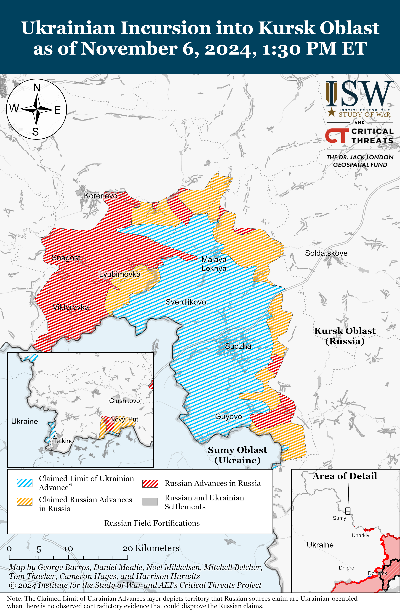
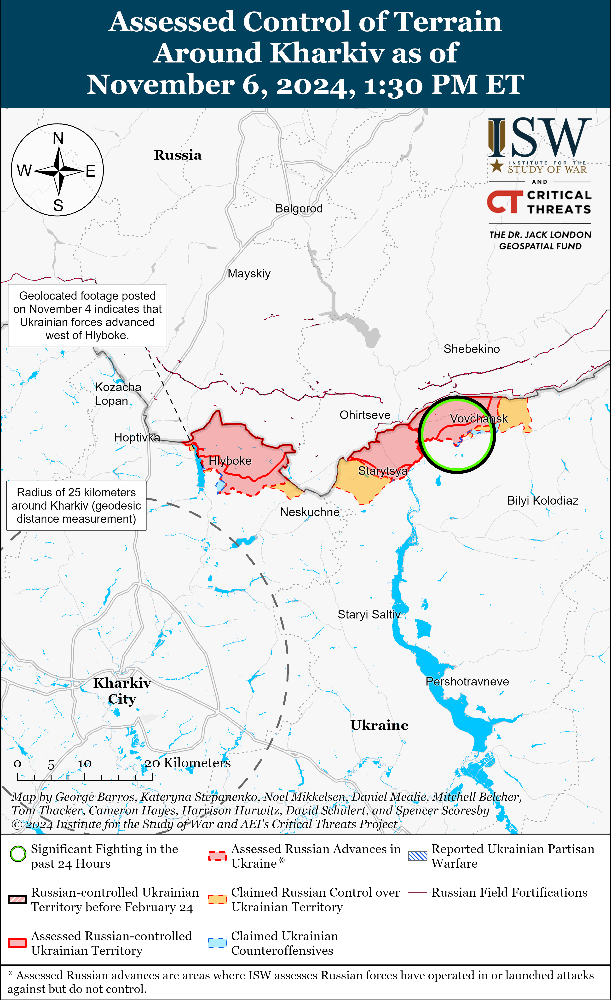
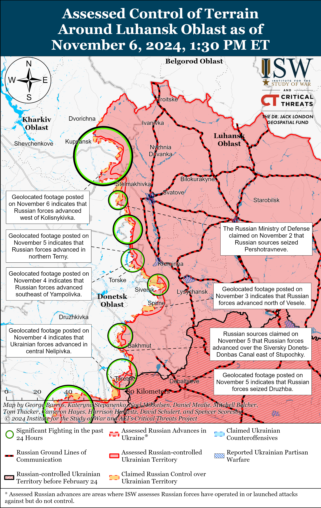
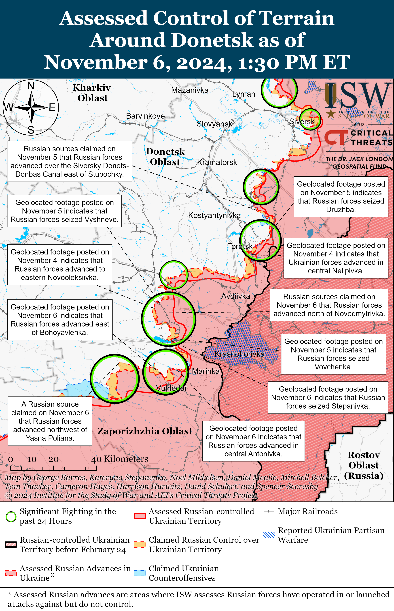
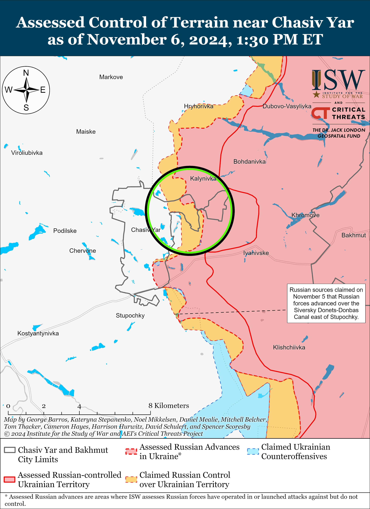
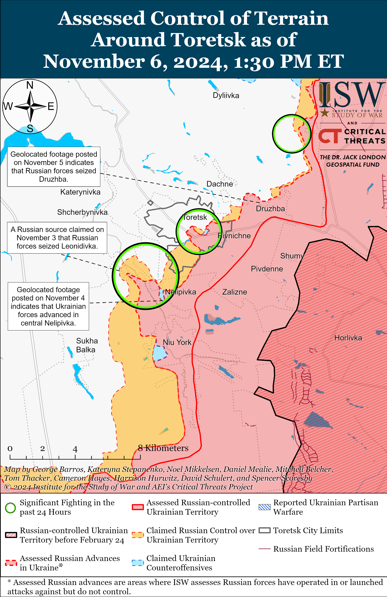
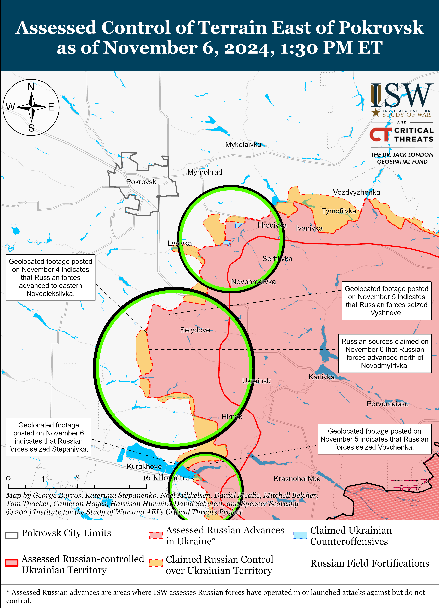
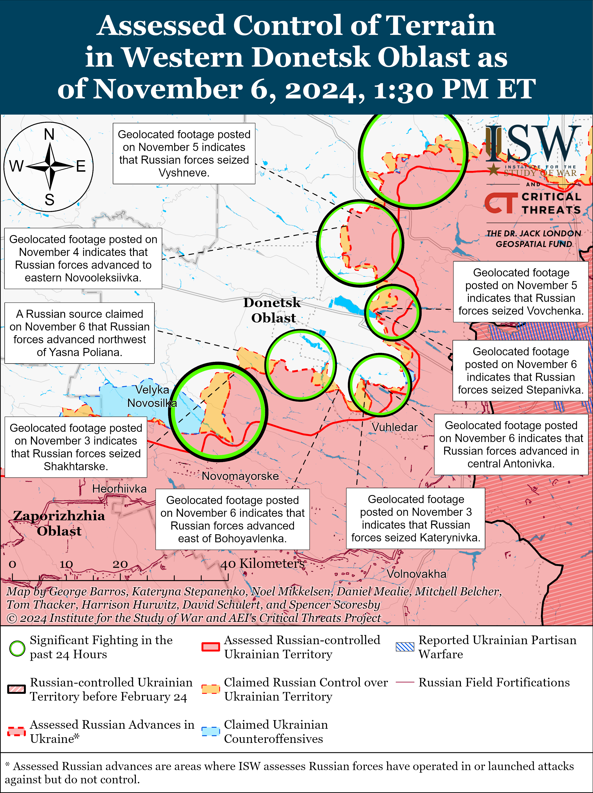
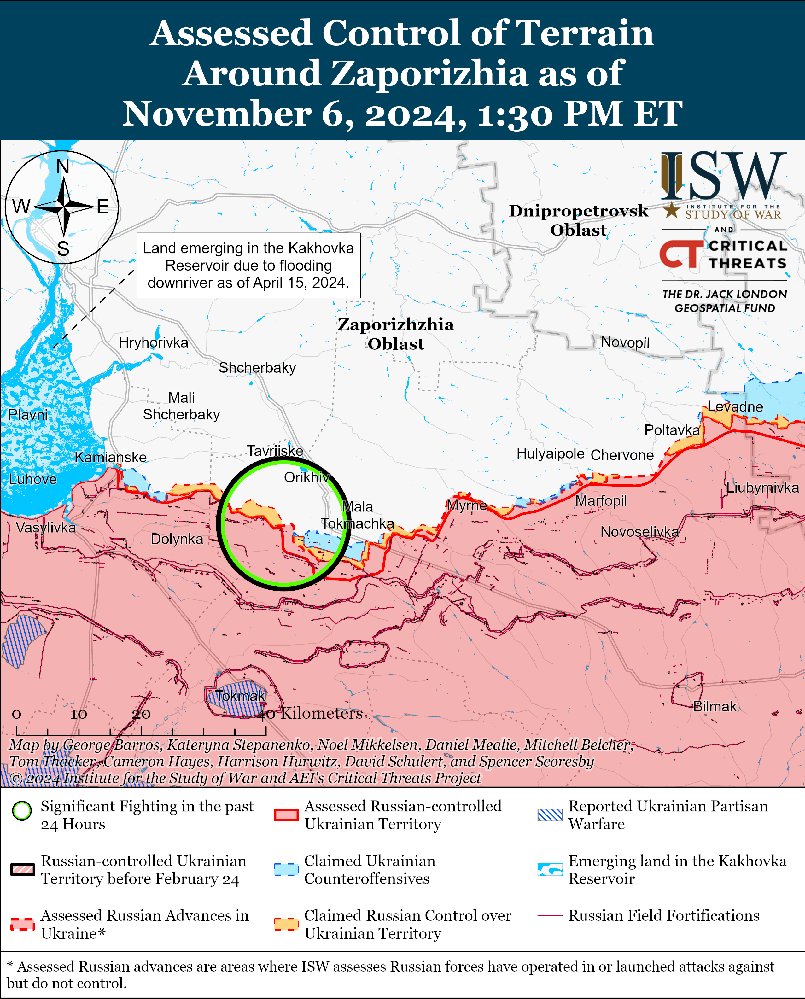
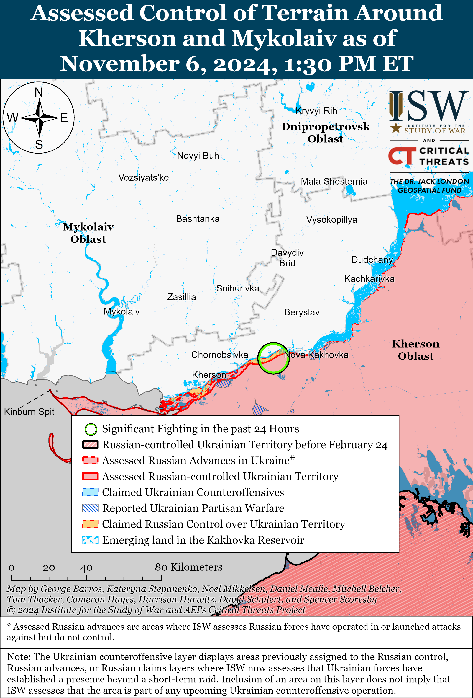

# Russian Offensive Campaign Assessment, November 6, 2024

**November 6, 2024, 4:45pm ET**

**Click** [**here**](https://storymaps.arcgis.com/stories/36a7f6a6f5a9448496de641cf64bd375) **to see ISW’s interactive map of the Russian invasion of Ukraine. This map is updated daily alongside the static maps present in this report.**

**Click** [**here**](https://storymaps.arcgis.com/stories/83a2f24901c941d581c0c523ecd2619b) **to see ISW's interactive map of Ukraine's offensive in Kursk Oblast.**

**Click** [**here**](https://understandingwar.maps.arcgis.com/apps/instant/3dviewer/index.html?appid=1602762dbcde419bb957dea358449580) **to see ISW’s 3D control of terrain topographic map of Ukraine. Use of a computer (not a mobile device) is strongly recommended for using this data-heavy tool.**

**Click** [**here**](https://storymaps.arcgis.com/stories/733fe90805894bfc8562d90b106aa895) **to access ISW’s archive of interactive time-lapse maps of the Russian invasion of Ukraine. These maps complement the static control-of-terrain map that ISW produces daily by showing a dynamic frontline. ISW will update this time-lapse map archive monthly.**

**Note: The data cut-off for this product was 12pm ET on November 6. ISW will cover subsequent reports in the November 7 Russian Offensive Campaign Assessment.**

**Ukrainian forces reportedly struck a Russian naval base in Kaspiysk, Republic of Dagestan for the first time on November 6 damaging several missile ships of the Russia Caspian Sea Flotilla.** Ukrainian media outlets, citing Ukraine’s military intelligence, reported that the Ukrainian drones struck a naval base in damaging the *Tatarstan* and *Dagestan* Gepard-class frigates (Project 11661) and possibly damaging several nearby Buyan-class corvettes (Project 21631).[[1]](#_edn8305a6e5ee59536e1fb31d6ac7b8a3211) Republic of Dagestan Head Sergei Melikov claimed on November 6 that Russian forces downed a Ukrainian drone over Kaspiysk without specifying the consequences.[[2]](#_edn8305a6e5ee59536e1fb31d6ac7b8a3212) Satellite imagery collected on November 6 indicates the presence of three likely Russian Buyan-class vessels, two likely Buyan-M-class vessels, one likely Tarantul-class vessel, one likely Gepard-class vessel, and one likely Karakurt-class vessel present on the day of the strike in the port of Kaspiysk, although the images are insufficient for identifying damage to ships or naval piers.[[3]](#_edn8305a6e5ee59536e1fb31d6ac7b8a3213) Geolocated footage published on November 6 shows drones striking near port infrastructure in Kaspiysk.[[4]](#_edn8305a6e5ee59536e1fb31d6ac7b8a3214)

**Ukrainian authorities reported that Russian forces executed at least 109 Ukrainian prisoners of war (POWs) since the start of the full-scale invasion amid new reports of Russian executions of Ukrainian POWs.** Ukrainian Prosecutor General's Head off the Department of Combating Crimes Committed in Conditions of Armed Conflict, Yuri Bilousov, reported on November 1 that Russian forces have executed at least 109 Ukrainian POWs since the beginning of the full-scale invasion in February 2022 and that Russian forces have intensified the number of POW executions they commit in 2024.[[5]](#_edn8305a6e5ee59536e1fb31d6ac7b8a3215) The Donetsk Oblast Prosecutor's Office reported on November 5 that it has launched an investigation into new reports of Russian forces executing six captured Ukrainian POWs: three near Selydove, Donetsk Oblast on October 23 and three others also in the Pokrovsk direction on November 1.[[6]](#_edn8305a6e5ee59536e1fb31d6ac7b8a3216) ISW has extensively reported on previous footage and reports of Russian servicemembers executing Ukrainian prisoners of war (POWs) and observed a wider trend of Russian abuses against Ukrainian POWs across various sectors of the front that appeared to be enabled, if not explicitly endorsed, by individual Russian commanders and unpunished by Russian field commanders.[[7]](#_edn8305a6e5ee59536e1fb31d6ac7b8a3217)

**Key Takeaways:**

- **Ukrainian forces reportedly struck a Russian naval base in Kaspiysk, Republic of Dagestan for the first time on November 6 damaging several missile ships of the Russia Caspian Sea Flotilla.**
- **Ukrainian authorities reported that Russian forces executed at least 109 Ukrainian prisoners of war (POWs) since the start of the full-scale invasion amid new reports of Russian executions of Ukrainian POWs.**
- **Russian forces recently advanced in the Kupyansk, Svatove, Pokrovsk, Kurakhove, and Vuhledar directions.**
- **A prominent Russian brigade commander and official indicated that Russian commanders and civilian leadership explicitly view Russian military volunteers as expendable resources, consistent with high casualty rates across the frontline.**

***We do not report in detail on Russian war crimes because these activities are well-covered in Western media and do not directly affect the military operations we are assessing and forecasting. We will continue to evaluate and report on the effects of these criminal activities on the Ukrainian military and the Ukrainian population and specifically on combat in Ukrainian urban areas. We utterly condemn Russian violations of the laws of armed conflict and the Geneva Conventions and crimes against humanity even though we do not describe them in these reports.***

- Ukrainian Operations in the Russian Federation
- Russian Main Effort – Eastern Ukraine (comprised of three subordinate main efforts)
- Russian Subordinate Main Effort #1 – Push Ukrainian forces back from the international border with Belgorod Oblast and approach to within tube artillery range of Kharkiv City
- Russian Subordinate Main Effort #2 – Capture the remainder of Luhansk Oblast and push westward into eastern Kharkiv Oblast and encircle northern Donetsk Oblast
- Russian Subordinate Main Effort #3 – Capture the entirety of Donetsk Oblast
- Russian Supporting Effort – Southern Axis
- Russian Air, Missile, and Drone Campaign
- Russian Mobilization and Force Generation Efforts
- Russian Technological Adaptations
- Activities in Russian-occupied areas
- Significant Activity in Belarus

**Ukrainian Operations in the Russian Federation**

Limited fighting continued in the Ukrainian Kursk Oblast salient on November 6, but neither Ukrainian nor Russian forces made confirmed advances. The Russian Ministry of Defense (MoD) claimed that Russian forces attacked near Darino, Nikolayevo-Daryino, and Novoivanovka (all southeast of Korenevo); in the directions of Leonidovo (southeast of Koreveno); and near Plekhovo (southeast of Sudzha).[[8]](#_edn8305a6e5ee59536e1fb31d6ac7b8a3218) Russian forces reportedly repelled Ukrainian counterattacks near Novoivanovka and Leonidovo.[[9]](#_edn8305a6e5ee59536e1fb31d6ac7b8a3219)

Neither Russian nor Ukrainian sources reported fighting in Glushkovsky Raion (west of the main Ukrainian Kursk Oblast salient) on November 6. A Russian milblogger claimed on November 5 that Russian forces regained control of the international border south of Novy Put (southwest of Glushkovo), but ISW has not observed confirmation of this claim.[[10]](#_edn8305a6e5ee59536e1fb31d6ac7b8a32110)

**Russian Main Effort – Eastern Ukraine**

**Russian Subordinate Main Effort #1 – Kharkiv Oblast** **(Russian objective: Push Ukrainian forces back from the international border with Belgorod Oblast and approach to within tube artillery range of Kharkiv City)**

Russian forces continued limited offensive operations northeast of Kharkiv City near Vovchansk and Starytsya (southwest of Vovchansk) on November 5 and 6 but did not advance.[[11]](#_edn8305a6e5ee59536e1fb31d6ac7b8a32111) Ukraine's Kharkiv Group of Forces Spokesperson Lieutenant Colonel Yevhenii Romanov stated that worsening weather conditions in northern Kharkiv Oblast on November 3 to 5 resulted in a decrease in daily combat engagements by one third, a notable decrease in Russian drone and equipment use, and spurred Russian forces to accumulate supplies in preparation for winter.[[12]](#_edn8305a6e5ee59536e1fb31d6ac7b8a32112)

**Russian Subordinate Main Effort #2 – Luhansk Oblast** **(Russian objective: Capture the remainder of Luhansk Oblast and push westward into eastern Kharkiv Oblast and northern Donetsk Oblast)**

Russian forces recently advanced southeast of Kupyansk and west of Svatove amid continued offensive operations along the Kupyansk-Svatove-Kreminna line on November 6. Geolocated footage published on November 6 indicates that Russian forces advanced west of Kolisnykivka (southeast of Kupyansk) and across fields and into northeastern Pershotravneve (west of Svatove).[[13]](#_edn8305a6e5ee59536e1fb31d6ac7b8a32113) Russian milbloggers claimed on November 6 that Russian forces advanced northeast of Kupyansk near Kruhlyakivka and Kolesnykivka, west of Novoselivske (northwest of Svatove), and north of Stelmakhivka (northwest of Svatove), although ISW has not observed visual confirmation of these claims.[[14]](#_edn8305a6e5ee59536e1fb31d6ac7b8a32114) Russian forces continued offensive operations northeast of Kupyansk near Synkivka; east of Kupyansk near Petropavlivka and Kucherivka; southeast of Kupyansk near Kruhlyakivka and Zahryzove; southwest of Svatove near Druzhelyubivka, Tverdokhlibove, and Hrekivka; northwest of Kremmina near Novomykhailivka, Makiivka, and Katerynivka; and west of Kremmina near Torske and Terny on November 5 and 6.[[15]](#_edn8305a6e5ee59536e1fb31d6ac7b8a32115)

**Russian Subordinate Main Effort #3 – Donetsk Oblast** **(Russian objective: Capture the entirety of Donetsk Oblast, the claimed territory of Russia’s proxies in Donbas)**

The Ukrainian General Staff reported that Russian forces conducted unsuccessful ground attacks northeast of Siversk near Bilohorivka on November 5 and 6.[[16]](#_edn8305a6e5ee59536e1fb31d6ac7b8a32116)

Russian forces continued offensive operation in the Chasiv Yar direction on November 6 but did not advance.[[17]](#_edn8305a6e5ee59536e1fb31d6ac7b8a32117) Russian forces attacked northeast of Chasiv Yar near Orikhovo-Vasylivka and southeast of Chasiv Yar near Klishchiivka on November 5 and 6.[[18]](#_edn8305a6e5ee59536e1fb31d6ac7b8a32118) Ukrainian Luhansk Group of Forces Spokesperson Major Anastasiya Bobovnikova stated on November 5 that Russian forces are conducting fewer assault operations in the Chasiv Yar direction than in other unspecified directions, likely referring to the Pokrovsk, Kurakhove, and Vuhledar directions.[[19]](#_edn8305a6e5ee59536e1fb31d6ac7b8a32119) Unspecified elements of the Chechen "Akhmat" Spetsnaz forces are reportedly operating in the Chasiv Yar direction; elements of the Russian 6th Motorized Rifle Brigade (3rd Combined Arms Army [CAA], formerly 2nd Luhansk People's Republic [LNR] Army Corps [AC]) are reportedly operating near Stupochky (south of Chasiv Yar); and elements of the 98th Airborne (VDV) Division are reportedly operating near Chasiv Yar itself.[[20]](#_edn8305a6e5ee59536e1fb31d6ac7b8a32120)

Russian forces continued offensive operations in the Toretsk direction on November 6, but there were no confirmed advances. Russian forces attacked near Toretsk ; north of Toretsk near Dylivka; and west of Toretsk near Shcherbynivka on November 5 and 6.[[21]](#_edn8305a6e5ee59536e1fb31d6ac7b8a32121) Bobovnikova reported that the intensity of Russian assaults in the Toretsk direction has increased and that Russian forces have accumulated materiel, unspecified motorized rifle brigades, and Spetsnaz units of the Central Military District (CMD) in this direction.[[22]](#_edn8305a6e5ee59536e1fb31d6ac7b8a32122) Elements of the Russian 9th Motorized Rifle Brigade (51st CAA, formerly 1st Donetsk People’s Republic’s [DNR] AC) are reportedly operating near Toretsk.[[23]](#_edn8305a6e5ee59536e1fb31d6ac7b8a32123)

Russian forces recently advanced in the Pokrovsk direction amid continued offensive operations area on November 6. Geolocated footage published on November 6 indicates that Russian forces recently advanced southeast of Novooleksiivka (southeast of Pokrovsk).[[24]](#_edn8305a6e5ee59536e1fb31d6ac7b8a32124) A Russian milblogger claimed that Russian forces advanced within Novooleksiivka (southeast of Pokrovsk), although ISW has not observed visual evidence of this claim.[[25]](#_edn8305a6e5ee59536e1fb31d6ac7b8a32125) Russian forces continued attacking east of Pokrovsk near Promin, Myrolyubivka, and Hryhorivka; and southeast of Pokrovsk near Krutyi Yar, Novohrodivka, Lysivka, Selydove, Vyshneve, and Novooleksiivka on November 5 and 6.[[26]](#_edn8305a6e5ee59536e1fb31d6ac7b8a32126)

Russian forces recently advanced in the Kurakhove direction amid continued offensive operations in the area on November 6. Geolocated footage published on November 6 shows personnel of the Russian 114th Motorized Rifle Brigade (51st CAA) raising a Russian flag over a building in northwestern Stepanivka (north of Kurakhove) indicating that Russian forces recently seized the settlement.[[27]](#_edn8305a6e5ee59536e1fb31d6ac7b8a32127) Russian milbloggers claimed that Russian forces advanced within Kurakhove and near Novodmytrivka (northwest of Kurakhove) and Berestky (north of Kurakhove), although ISW has not observed visual evidence of these claims.[[28]](#_edn8305a6e5ee59536e1fb31d6ac7b8a32128) Russian forces continued attacking northwest of Kurakhove near Novodmytrivka; north of Kurakhove near Kreminna Balka, Novoselydivka, and Stepanivka; east of Kurakhove near Hostre and Maksymilyanivka; and northeast of Kurakhove near Illinka, Vovchenka, and Ostrivske on November 5 and 6.[[29]](#_edn8305a6e5ee59536e1fb31d6ac7b8a32129) Elements of the Russian "Borz" and "Storm" battalions of the 110th Motorized Rifle Brigade (51st CAA) and 39th Motorized Rifle Brigade (68th AC, Eastern Military District [EMD]) are reportedly operating in the Kurakhove direction.[[30]](#_edn8305a6e5ee59536e1fb31d6ac7b8a32130)

Russian forces recently advanced in the Vuhledar area amid continued offensive operations in the area on November 6. Geolocated footage published on November 6 shows Russian forces conducting two distinct reinforced platoon-sized mechanized assaults, indicating that Russian forces recently advanced within Antonivka (northeast of Vuhledar) and east of Bohoyavlenka (northwest of Vuhledar).[[31]](#_edn8305a6e5ee59536e1fb31d6ac7b8a32131) Additional geolocated footage published on November 6 indicates that Russian forces advanced southwest of Trudove (both northeast of Vuhledar).[[32]](#_edn8305a6e5ee59536e1fb31d6ac7b8a32132) The Russian Ministry of Defense (MoD) and other Russian sources claimed that Russian forces seized Yasna Polyana (northwest of Vuhledar) and Antonivka (northeast of Vuhledar) as of November 6.[[33]](#_edn8305a6e5ee59536e1fb31d6ac7b8a32133) Russian milbloggers claimed that Russian forces advanced north of Bohoyavlenka, near Uspenivka, and within Yelyzavetivka (all northeast of Vuhledar).[[34]](#_edn8305a6e5ee59536e1fb31d6ac7b8a32134) ISW has not observed visual confirmation of these claims. Russian forces continued attacking northeast of Vuhledar near Antonivka, Yelyzavetivka, and Katerynivka; and northwest of Vuhledar near Trudove, Bohoyavlenka, Maksymivka, Kostyantynopolske, Rozdolne, and Velyka Novosilka on November 5 and 6.[[35]](#_edn8305a6e5ee59536e1fb31d6ac7b8a32135) Elements of the Russian 1472nd Motorized Rifle Regiment (68th AC, EMD) and 430th Motorized Rifle Regiment (likely a mobilized regiment) are reportedly operating south of Yelyzavetivka.[[36]](#_edn8305a6e5ee59536e1fb31d6ac7b8a32136)

**Russian Supporting Effort – Southern Axis** **(Russian objective: Maintain frontline positions and secure rear areas against Ukrainian strikes)**

Russian forces continued offensive operations in western Zaporizhia Oblast on November 6 but did not advance. Russian milbloggers continued to claim on November 6 that Russian forces recently advanced 1.5 kilometers along a windbreak west of Nesteryanka (northwest of Robotyne), and another milblogger claimed that Russian forces advanced roughly two kilometers in the Orikhiv direction, likely referring to the same area.[[37]](#_edn8305a6e5ee59536e1fb31d6ac7b8a32137) ISW has not observed confirmation of these claims, however. The Ukrainian General Staff reported that Russian forces continued attacking north of Robotyne near Orikhiv and northwest of Robotyne near Novoandriivka on November 5 and 6.[[38]](#_edn8305a6e5ee59536e1fb31d6ac7b8a32138) Drone operators of the Russian 70th Motorized Rifle Regiment (42nd Motorized Rifle Division, 58th Combined Arms Army [CAA], Southern Military District [SMD]) reportedly continue to operate in Zaporizhia Oblast.[[39]](#_edn8305a6e5ee59536e1fb31d6ac7b8a32139) Drone operators of the Russian 38th Motorized Rifle Brigade (35th CAA, Eastern Military District [EMD]) are reportedly operating in the Polohy direction.[[40]](#_edn8305a6e5ee59536e1fb31d6ac7b8a32140)

Russian forces continued ground attacks in the Dnipro direction, including near the islands of the Dnipro River Delta, on November 5 and 6 but did not advance.[[41]](#_edn8305a6e5ee59536e1fb31d6ac7b8a32141)

**Russian Air, Missile, and Drone Campaign** **(Russian Objective: Target Ukrainian military and civilian infrastructure in the rear and on the frontline)**

Russian forces conducted a series of drone and missile strikes against Ukraine on the night of November 5 to 6. The Ukrainian Air Force reported that Russian forces launched two Kh-59 cruise missiles and two Kh-31P anti-radiation missiles from airspace over the Black Sea towards Odesa Oblast and 63 Shahed and other unspecified strike drones from Bryansk and Oryol oblasts; Primorsko-Akhtarsk, Krasnodar Krai; and Cape Chauda, Crimea.[[42]](#_edn8305a6e5ee59536e1fb31d6ac7b8a32142) The Ukrainian Air Force reported that Ukrainian forces downed all four Kh-59 cruise and Kh-31P anti-radiation missiles and 38 drones over Odesa, Mykolaiv, Sumy, Kyiv, Kirovohrad, Zhytomyr, Cherkasy, Chernihiv, and Zaporizhia oblasts; that two drones remained in Ukrainian airspace; and that 20 drones were ”lost” likely due to Ukrainian electronic warfare (EW) interference. Ukrainian Mykolaiv Oblast Head Vitaly Kim reported that Russian Shahed drones damaged energy infrastructure in Mykolaiv Oblast on the night of November 5 to 6.[[43]](#_edn8305a6e5ee59536e1fb31d6ac7b8a32143)

**Russian Mobilization and Force Generation Efforts** **(Russian objective: Expand combat power without conducting general mobilization)**

A prominent Russian brigade commander and official indicated that Russian commanders and civilian leadership explicitly view Russian military volunteers as expendable resources, consistent with high casualty rates across the frontline. Russian outlet *RTVI* reported on November 5 that Russian "Union of Donbass Volunteers" (UDV) Board Chairperson and "7th Assault Brigade" (reportedly of the UDV) Commander, State Duma deputy, and Alexander Borodai stated in a recording of a telephone conversation that "superfluous people" of low socioeconomic prospects are volunteering to join the Russian military and are "paid off in a war in order to simply wear out the enemy" and that "civilian suits," likely referring to civilian leadership, view these Russians as "second-class infantry" who "do not have much value."[[44]](#_edn8305a6e5ee59536e1fb31d6ac7b8a32144) *RTVI* noted that Borodai confirmed that he was speaking in the recording, though he claimed that the recording took his statements out of context. Borodai's statements are emblematic of the Kremlin's viewpoint of volunteers given its continued reliance on volunteer recruitment to sustain high losses to maintain attritional, infantry-led assaults across the theater.[[45]](#_edn8305a6e5ee59536e1fb31d6ac7b8a32145)  
   
 **Russian Technological Adaptations** **(Russian objective: Introduce technological innovations to optimize systems for use in Ukraine)**   
   
 A Ukrainian Telegram source claimed that Russian forces are using fake ARGSN U559 active radar homing heads in Kh-59MK cruise missiles to maintain necessary weight distribution for the missile in a likely shortage of radar homing devices.[[46]](#_edn8305a6e5ee59536e1fb31d6ac7b8a32146) ISW cannot independently confirm this claim.  
   
 **Activities in Russian-occupied areas (Russian objective: Consolidate administrative control of annexed areas; forcibly integrate Ukrainian citizens into Russian sociocultural, economic, military, and governance systems)**

*ISW is not publishing reporting on activities in Russian-occupied areas today.*

**Significant activity in Belarus** **(Russian efforts to increase its military presence in Belarus and further integrate Belarus into Russian-favorable frameworks and Wagner Group activity in Belarus)**

Iranian media reported on November 6 that Belarussian Deputy Defense Minister and International Military Cooperation Head Major General Valery Revenko led a Belarusian Army delegation to the Iranian Artesh Command and General Staff University (DAFOOS) in Tehran, Iran.[[47]](#_edn8305a6e5ee59536e1fb31d6ac7b8a32147) ISW has not observed Belarusian or Russian media reports about this meeting. Iran and Belarus have held similar meetings in the past few months about military cooperation.[[48]](#_edn8305a6e5ee59536e1fb31d6ac7b8a32148) Russian state media previously announced in August 2024 that Iran and Belarus would hold a combined military exercise but did not specify when.[[49]](#_edn8305a6e5ee59536e1fb31d6ac7b8a32149) *NOTE: A version of this text appears in the ISW-CTP Iran Update.*

**Note: ISW does not receive any classified material from any source, uses only publicly available information, and draws extensively on Russian, Ukrainian, and Western reporting and social media as well as commercially available satellite imagery and other geospatial data as the basis for these reports. References to all sources used are provided in the endnotes of each update.**

---

[[1]](#_edn8305a6e5ee59536e1fb31d6ac7b8a321ref1) <https://kyivindependent> dot com/ukraine-targeted-russian-naval-base-in-dagestan-drone-strike-source-says/; <https://novayagazeta> dot eu/articles/2024/11/06/ukrainian-drones-attack-russian-naval-base-in-dagestan-for-the-first-time-en-news; https://mil.in dot ua/uk/news/u-kaspijsku-urazyly-raketnyj-kater-proyektu-12411/ ; <https://x.com/MT_Anderson/status/1854171625236689222>; https://x.com/99Dominik\_/status/1854075078255714532; https://x.com/99Dominik\_/status/1854075035201245577; https://x.com/JanR210/status/1854047317998899395; https://t.me/supernova\_plus/33073; https://t.me/exilenova\_plus/3182; https://x.com/JanR210/status/1854088784687562868; https://x.com/NOELreports/status/1854079888858169767; https://t.me/exilenova\_plus/3189; https://x.com/Grimm\_Intel/status/1854064840643362887; https://x.com/therawe2/status/1854063068562518069; https://t.me/exilenova\_plus/3187; https://x.com/Grimm\_Intel/status/1854064504956408002; https://x.com/99Dominik\_/status/1854132874384982298; https://t.me/supernova\_plus/33103; https://t.me/exilenova\_plus/3197; https://t.me/kaspiysk\_chat/1345339; <https://x.com/hochu_dodomu/status/1854054960268235112>; https://x.com/99Dominik\_/status/1854075078255714532; https://x.com/99Dominik\_/status/1854075035201245577; https://x.com/JanR210/status/1854047317998899395; https://t.me/supernova\_plus/33073; https://t.me/exilenova\_plus/3182; https://x.com/JanR210/status/1854088784687562868; https://x.com/NOELreports/status/1854079888858169767; https://t.me/exilenova\_plus/3189; https://x.com/Grimm\_Intel/status/1854064840643362887; https://x.com/therawe2/status/1854063068562518069; https://t.me/exilenova\_plus/3187; https://x.com/Grimm\_Intel/status/1854064504956408002; https://x.com/99Dominik\_/status/1854132874384982298; https://t.me/supernova\_plus/33103; https://t.me/exilenova\_plus/3197; https://t.me/kaspiysk\_chat/1345339; https://x.com/hochu\_dodomu/status/1854054960268235112

[[2]](#_edn8305a6e5ee59536e1fb31d6ac7b8a321ref2) https://t.me/melikov05/2944

[[3]](#_edn8305a6e5ee59536e1fb31d6ac7b8a321ref3) https://x.com/MT\_Anderson/status/1854171625236689222

[[4]](#_edn8305a6e5ee59536e1fb31d6ac7b8a321ref4) https://x.com/99Dominik\_/status/1854075078255714532; https://x.com/99Dominik\_/status/1854075035201245577; https://x.com/JanR210/status/1854047317998899395; https://t.me/supernova\_plus/33073; https://t.me/exilenova\_plus/3182; https://x.com/JanR210/status/1854088784687562868; https://x.com/NOELreports/status/1854079888858169767; https://t.me/exilenova\_plus/3189; https://x.com/Grimm\_Intel/status/1854064840643362887; https://x.com/therawe2/status/1854063068562518069; https://t.me/exilenova\_plus/3187; https://x.com/Grimm\_Intel/status/1854064504956408002; https://x.com/99Dominik\_/status/1854132874384982298; https://t.me/supernova\_plus/33103; https://t.me/exilenova\_plus/3197; https://t.me/kaspiysk\_chat/1345339; https://x.com/hochu\_dodomu/status/1854054960268235112

[[5]](#_edn8305a6e5ee59536e1fb31d6ac7b8a321ref5) <https://t.me/uncp_nib/491>; https://censor dot net/ua/resonance/3517769/chy\_vdastsya\_nam\_povernuty\_tsyvilnyh\_yakyh\_ne\_mojna\_vklyuchaty\_v\_obminy

[[6]](#_edn8305a6e5ee59536e1fb31d6ac7b8a321ref6) https://t.me/Donetsk\_obl\_prokuratura/3289; https://suspilne dot media/donbas/873527-na-pokrovskomu-napramku-okupanti-rozstrilali-sistoh-polonenih-ukrainskih-vijskovih/ ; https://mil.in dot ua/uk/news/rosiyany-rozstrilyaly-shistoh-vijskovopolonenyh-na-pokrovskomu-napryamku/; https://t.me/Donetsk\_obl\_prokuratura/3289; https://armyinform dot com.ua/2024/11/05/okupanty-rozstrilyaly-6-nashyh-polonenyh-na-pokrovskomu-napryamku/

[[7]](#_edn8305a6e5ee59536e1fb31d6ac7b8a321ref7) https://isw.pub/UkrWar100624 ; https://isw.pub/UkrWar100124 ; https://isw.pub/UkrWar090624 ; https://www.understandingwar.org/backgrounder/russian-offensive-campaign-assessment-june-19-2024 ; https://isw.pub/UkrWar122823 ; https://www.understandingwar.org/backgrounder/russian-offensive-campaign-assessment-june-3-2024 ; https://isw.pub/UkrWar032724 ; https://isw.pub/UkrWar052924 ; https://isw.pub/UkrWar090424 ; https://www.understandingwar.org/backgrounder/russian-offensive-campaign-assessment-july-10-2024 ; <https://isw.pub/UkrWar062324>; https://understandingwar.org/backgrounder/russian-offensive-campaign-assessment-october-7-2024

[[8]](#_edn8305a6e5ee59536e1fb31d6ac7b8a321ref8) https://t.me/mod\_russia/45424

[[9]](#_edn8305a6e5ee59536e1fb31d6ac7b8a321ref9) https://t.me/mod\_russia/45424

[[10]](#_edn8305a6e5ee59536e1fb31d6ac7b8a321ref10) <https://t.me/rybar/65116>

[[11]](#_edn8305a6e5ee59536e1fb31d6ac7b8a321ref11)<https://www.facebook.com/GeneralStaff.ua/posts/pfbid02osoZJZYCQfBzD5aJ16U9HteCwaKp9v16eptBPN22FaYTT838HKparpNLy6YDL1t6l> ; <https://www.facebook.com/GeneralStaff.ua/posts/pfbid02GuJDbungZyuf2jy9Fd11WYNCvuK1ayHhRcJqFHVRTsufqb65R7b5WT21k6hdFNFPl> ; <https://www.facebook.com/GeneralStaff.ua/posts/pfbid031Hj5vAdK6aVpCHmpj6SLPmXdT73FXKAiLQ9htLCCkovpJa2c5tWaCagHiUtDqxM2l>

[[12]](#_edn8305a6e5ee59536e1fb31d6ac7b8a321ref12) <https://youtu.be/j5TqaWCCdUg>; [https://armyinform](https://armyinform/) dot com.ua/2024/11/05/holod-i-viter-yak-vony-vzhe-vplynuly-na-pole-boyu-na-harkivshhyni/

[[13]](#_edn8305a6e5ee59536e1fb31d6ac7b8a321ref13) <https://t.me/krulaomegu/291;> <https://t.me/creamy_caprice/7424> ; <https://t.me/army_3otbr/1066;> <https://t.me/creamy_caprice/7421>

[[14]](#_edn8305a6e5ee59536e1fb31d6ac7b8a321ref14) <https://t.me/rybar/65123>; <https://t.me/dva_majors/56933> ; <https://t.me/DnevnikDesantnika/18668>

[[15]](#_edn8305a6e5ee59536e1fb31d6ac7b8a321ref15)<https://www.facebook.com/GeneralStaff.ua/posts/pfbid02osoZJZYCQfBzD5aJ16U9HteCwaKp9v16eptBPN22FaYTT838HKparpNLy6YDL1t6l> ; <https://www.facebook.com/GeneralStaff.ua/posts/pfbid02GuJDbungZyuf2jy9Fd11WYNCvuK1ayHhRcJqFHVRTsufqb65R7b5WT21k6hdFNFPl> ; <https://www.facebook.com/GeneralStaff.ua/posts/pfbid031Hj5vAdK6aVpCHmpj6SLPmXdT73FXKAiLQ9htLCCkovpJa2c5tWaCagHiUtDqxM2l> ;  <https://www.facebook.com/GeneralStaff.ua/posts/pfbid02osoZJZYCQfBzD5aJ16U9HteCwaKp9v16eptBPN22FaYTT838HKparpNLy6YDL1t6l> ; <https://www.facebook.com/GeneralStaff.ua/posts/pfbid02GuJDbungZyuf2jy9Fd11WYNCvuK1ayHhRcJqFHVRTsufqb65R7b5WT21k6hdFNFPl> ;<https://www.facebook.com/GeneralStaff.ua/posts/pfbid031Hj5vAdK6aVpCHmpj6SLPmXdT73FXKAiLQ9htLCCkovpJa2c5tWaCagHiUtDqxM2l> ; <https://t.me/dva_majors/56933> ; <https://t.me/DnevnikDesantnika/18668>

[[16]](#_edn8305a6e5ee59536e1fb31d6ac7b8a321ref16) https://www.facebook.com/GeneralStaff.ua/posts/pfbid02osoZJZYCQfBzD5aJ16U9HteCwaKp9v16eptBPN22FaYTT838HKparpNLy6YDL1t6l ; <https://www.facebook.com/GeneralStaff.ua/posts/pfbid02GuJDbungZyuf2jy9Fd11WYNCvuK1ayHhRcJqFHVRTsufqb65R7b5WT21k6hdFNFPl>; https://www.facebook.com/GeneralStaff.ua/posts/pfbid031Hj5vAdK6aVpCHmpj6SLPmXdT73FXKAiLQ9htLCCkovpJa2c5tWaCagHiUtDqxM2l

[[17]](#_edn8305a6e5ee59536e1fb31d6ac7b8a321ref17) https://www.facebook.com/GeneralStaff.ua/posts/pfbid02osoZJZYCQfBzD5aJ16U9HteCwaKp9v16eptBPN22FaYTT838HKparpNLy6YDL1t6l ; <https://www.facebook.com/GeneralStaff.ua/posts/pfbid02GuJDbungZyuf2jy9Fd11WYNCvuK1ayHhRcJqFHVRTsufqb65R7b5WT21k6hdFNFPl>; https://www.facebook.com/GeneralStaff.ua/posts/pfbid031Hj5vAdK6aVpCHmpj6SLPmXdT73FXKAiLQ9htLCCkovpJa2c5tWaCagHiUtDqxM2l

[[18]](#_edn8305a6e5ee59536e1fb31d6ac7b8a321ref18) https://www.facebook.com/GeneralStaff.ua/posts/pfbid02osoZJZYCQfBzD5aJ16U9HteCwaKp9v16eptBPN22FaYTT838HKparpNLy6YDL1t6l ; <https://www.facebook.com/GeneralStaff.ua/posts/pfbid02GuJDbungZyuf2jy9Fd11WYNCvuK1ayHhRcJqFHVRTsufqb65R7b5WT21k6hdFNFPl>; https://www.facebook.com/GeneralStaff.ua/posts/pfbid031Hj5vAdK6aVpCHmpj6SLPmXdT73FXKAiLQ9htLCCkovpJa2c5tWaCagHiUtDqxM2l

[[19]](#_edn8305a6e5ee59536e1fb31d6ac7b8a321ref19) <https://armyinform.com> dot ua/2024/11/05/pid-poncho-ta-rebamy-nakopychuyetsya-vorog-shho-vidbuvayetsya-v-rajoni-chasovogo-yaru-ta-toreczka/

[[20]](#_edn8305a6e5ee59536e1fb31d6ac7b8a321ref20) <https://t.me/DnevnikDesantnika/18631>; <https://t.me/nm_dnr/12934>; https://t.me/tass\_agency/283773

[[21]](#_edn8305a6e5ee59536e1fb31d6ac7b8a321ref21) https://www.facebook.com/GeneralStaff.ua/posts/pfbid02osoZJZYCQfBzD5aJ16U9HteCwaKp9v16eptBPN22FaYTT838HKparpNLy6YDL1t6l ; <https://www.facebook.com/GeneralStaff.ua/posts/pfbid02GuJDbungZyuf2jy9Fd11WYNCvuK1ayHhRcJqFHVRTsufqb65R7b5WT21k6hdFNFPl>; https://www.facebook.com/GeneralStaff.ua/posts/pfbid031Hj5vAdK6aVpCHmpj6SLPmXdT73FXKAiLQ9htLCCkovpJa2c5tWaCagHiUtDqxM2l

[[22]](#_edn8305a6e5ee59536e1fb31d6ac7b8a321ref22) https://armyinform dot com.ua/2024/11/05/pid-poncho-ta-rebamy-nakopychuyetsya-vorog-shho-vidbuvayetsya-v-rajoni-chasovogo-yaru-ta-toreczka/; https://youtu.be/j5TqaWCCdUg

[[23]](#_edn8305a6e5ee59536e1fb31d6ac7b8a321ref23) https://t.me/wargonzo/23003

[[24]](#_edn8305a6e5ee59536e1fb31d6ac7b8a321ref24) https://x.com/blinzka/status/1854104836574159246; https://t.me/gostrikartuzy/672

[[25]](#_edn8305a6e5ee59536e1fb31d6ac7b8a321ref25) https://t.me/motopatriot/29254

[[26]](#_edn8305a6e5ee59536e1fb31d6ac7b8a321ref26) <https://www.facebook.com/GeneralStaff.ua/posts/pfbid02osoZJZYCQfBzD5aJ16U9HteCwaKp9v16eptBPN22FaYTT838HKparpNLy6YDL1t6l> ; https://www.facebook.com/GeneralStaff.ua/posts/pfbid02GuJDbungZyuf2jy9Fd11WYNCvuK1ayHhRcJqFHVRTsufqb65R7b5WT21k6hdFNFPl ; https://www.facebook.com/GeneralStaff.ua/posts/pfbid031Hj5vAdK6aVpCHmpj6SLPmXdT73FXKAiLQ9htLCCkovpJa2c5tWaCagHiUtDqxM2l ; <https://t.me/DnevnikDesantnika/18665> ; <https://t.me/DnevnikDesantnika/18670>

[[27]](#_edn8305a6e5ee59536e1fb31d6ac7b8a321ref27) https://t.me/mo114rf/72; https://t.me/creamy\_caprice/7419; https://x.com/SibirPrizrak/status/1854119072826298435

[[28]](#_edn8305a6e5ee59536e1fb31d6ac7b8a321ref28) https://t.me/rybar/65133; <https://t.me/motopatriot/29254> ; https://t.me/voenkorKotenok/59967 ; <https://t.me/voenkorKotenok/59968> ; <https://t.me/boris_rozhin/143450> ; <https://t.me/wargonzo/22984>

[[29]](#_edn8305a6e5ee59536e1fb31d6ac7b8a321ref29) <https://www.facebook.com/GeneralStaff.ua/posts/pfbid02osoZJZYCQfBzD5aJ16U9HteCwaKp9v16eptBPN22FaYTT838HKparpNLy6YDL1t6l> ; https://www.facebook.com/GeneralStaff.ua/posts/pfbid02GuJDbungZyuf2jy9Fd11WYNCvuK1ayHhRcJqFHVRTsufqb65R7b5WT21k6hdFNFPl ; <https://www.facebook.com/GeneralStaff.ua/posts/pfbid031Hj5vAdK6aVpCHmpj6SLPmXdT73FXKAiLQ9htLCCkovpJa2c5tWaCagHiUtDqxM2l> ; <https://t.me/DnevnikDesantnika/18624> ; https://t.me/boris\_rozhin/143350

[[30]](#_edn8305a6e5ee59536e1fb31d6ac7b8a321ref30) <https://t.me/wargonzo/22991> ; <https://t.me/voin_dv/11682>

[[31]](#_edn8305a6e5ee59536e1fb31d6ac7b8a321ref31) (Antonivka) https://t.me/creamy\_caprice/7415; <https://t.me/dva_majors/56945>

(Bohoyavlenka) https://t.me/creamy\_caprice/7422; https://t.me/voin\_dv/11682

[[32]](#_edn8305a6e5ee59536e1fb31d6ac7b8a321ref32) https://t.me/creamy\_caprice/7417; https://t.me/voin\_dv/11678

[[33]](#_edn8305a6e5ee59536e1fb31d6ac7b8a321ref33) https://t.me/mod\_russia/45420 ; https://t.me/mod\_russia/45421 ; <https://t.me/boris_rozhin/143395> ; https://t.me/z\_arhiv/29198

[[34]](#_edn8305a6e5ee59536e1fb31d6ac7b8a321ref34) <https://t.me/DnevnikDesantnika/18662> ; https://t.me/rybar/65123; <https://t.me/dva_majors/56933> ; <https://t.me/motopatriot/29258> ; <https://t.me/wargonzo/22984> ; https://t.me/rybar/65112

[[35]](#_edn8305a6e5ee59536e1fb31d6ac7b8a321ref35) <https://www.facebook.com/GeneralStaff.ua/posts/pfbid02osoZJZYCQfBzD5aJ16U9HteCwaKp9v16eptBPN22FaYTT838HKparpNLy6YDL1t6l> ; https://www.facebook.com/GeneralStaff.ua/posts/pfbid02GuJDbungZyuf2jy9Fd11WYNCvuK1ayHhRcJqFHVRTsufqb65R7b5WT21k6hdFNFPl ; https://www.facebook.com/GeneralStaff.ua/posts/pfbid031Hj5vAdK6aVpCHmpj6SLPmXdT73FXKAiLQ9htLCCkovpJa2c5tWaCagHiUtDqxM2l ; <https://t.me/rybar/65112> ; <https://t.me/DnevnikDesantnika/18662> ; <https://t.me/boris_rozhin/143350>

[[36]](#_edn8305a6e5ee59536e1fb31d6ac7b8a321ref36) https://t.me/voin\_dv/11682

[[37]](#_edn8305a6e5ee59536e1fb31d6ac7b8a321ref37) https://t.me/rybar/65123 ; https://t.me/dva\_majors/56933 ; https://t.me/DnevnikDesantnika/18654 ; https://www.understandingwar.org/backgrounder/russian-offensive-campaign-assessment-november-5-2024

[[38]](#_edn8305a6e5ee59536e1fb31d6ac7b8a321ref38) <https://www.facebook.com/GeneralStaff.ua/posts/pfbid02osoZJZYCQfBzD5aJ16U9HteCwaKp9v16eptBPN22FaYTT838HKparpNLy6YDL1t6l> ; https://www.facebook.com/GeneralStaff.ua/posts/pfbid02GuJDbungZyuf2jy9Fd11WYNCvuK1ayHhRcJqFHVRTsufqb65R7b5WT21k6hdFNFPl ; https://www.facebook.com/GeneralStaff.ua/posts/pfbid031Hj5vAdK6aVpCHmpj6SLPmXdT73FXKAiLQ9htLCCkovpJa2c5tWaCagHiUtDqxM2l

[[39]](#_edn8305a6e5ee59536e1fb31d6ac7b8a321ref39) https://t.me/wargonzo/22999

[[40]](#_edn8305a6e5ee59536e1fb31d6ac7b8a321ref40) <https://t.me/voin_dv/11674>

[[41]](#_edn8305a6e5ee59536e1fb31d6ac7b8a321ref41) <https://www.facebook.com/GeneralStaff.ua/posts/pfbid02GuJDbungZyuf2jy9Fd11WYNCvuK1ayHhRcJqFHVRTsufqb65R7b5WT21k6hdFNFPl> ; <https://www.facebook.com/GeneralStaff.ua/posts/pfbid031Hj5vAdK6aVpCHmpj6SLPmXdT73FXKAiLQ9htLCCkovpJa2c5tWaCagHiUtDqxM2l> ; https://t.me/SJTF\_Odes/11740

[[42]](#_edn8305a6e5ee59536e1fb31d6ac7b8a321ref42) https://t.me/kpszsu/22417

[[43]](#_edn8305a6e5ee59536e1fb31d6ac7b8a321ref43) https://t.me/mykolaivskaODA/11988; https://armyinform dot com.ua/2024/11/06/udar-po-energetychnij-infrastrukturi-mykolayivshhyny-znestrumleno-abonentiv-postrazhdala-dytyna/

[[44]](#_edn8305a6e5ee59536e1fb31d6ac7b8a321ref44) <https://rtvi> dot com/news/zhestkaya-no-pravda-deputat-gosdumy-obyasnil-svoi-slova-o-lishnih-lyudyah-na-svo/; <https://dzen> dot ru/a/ZyimTtn6b2RPwhdP

[[45]](#_edn8305a6e5ee59536e1fb31d6ac7b8a321ref45) <https://understandingwar.org/backgrounder/russian-offensive-campaign-assessment-november-1-2024>; <https://www.understandingwar.org/backgrounder/russian-offensive-campaign-assessment-september-19-2024>; <https://www.understandingwar.org/backgrounder/russian-offensive-campaign-assessment-october-29-2024>; <https://www.understandingwar.org/backgrounder/russian-offensive-campaign-assessment-september-15-2024>; <https://understandingwar.org/backgrounder/russian-offensive-campaign-assessment-november-5-2024>

[[46]](#_edn8305a6e5ee59536e1fb31d6ac7b8a321ref46) <https://t.me/war_home/2984>; https://mil.in dot ua/uk/news/rosiyany-pochaly-vykorystovuvaty-makety-gsn-na-raketah-h-59/

[[47]](#_edn8305a6e5ee59536e1fb31d6ac7b8a321ref47) https://www.mehrnews dot com/news/6280330 ; https://www.understandingwar.org/backgrounder/russian-offensive-campaign-assessment-may-16-2024

[[48]](#_edn8305a6e5ee59536e1fb31d6ac7b8a321ref48) ttps://www.understandingwar.org/backgrounder/iran-update-august-9-2024 ; https://defapress dot ir/fa/news/683452 ; https://eng.belta dot by/partner\_news/view/belarus-air-force-chief-meets-iranian-commanders-to-discuss-defense-ties-160327-2024/

[[49]](#_edn8305a6e5ee59536e1fb31d6ac7b8a321ref49) https://www.understandingwar.org/backgrounder/iran-update-august-20-2024 ;

https://bel.sputnik dot by/20240820/belarus--ran-pravyaduts-sumesnyya-vuchenn-1088891672.html

View Citations
