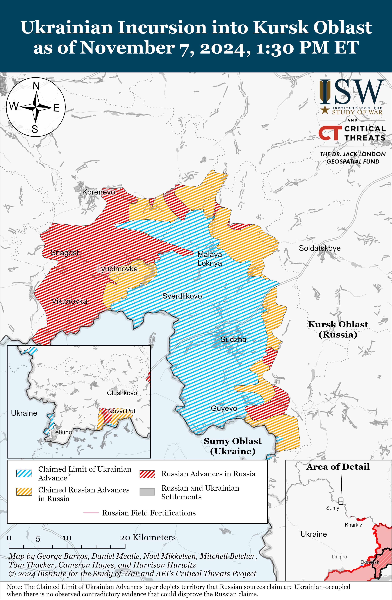
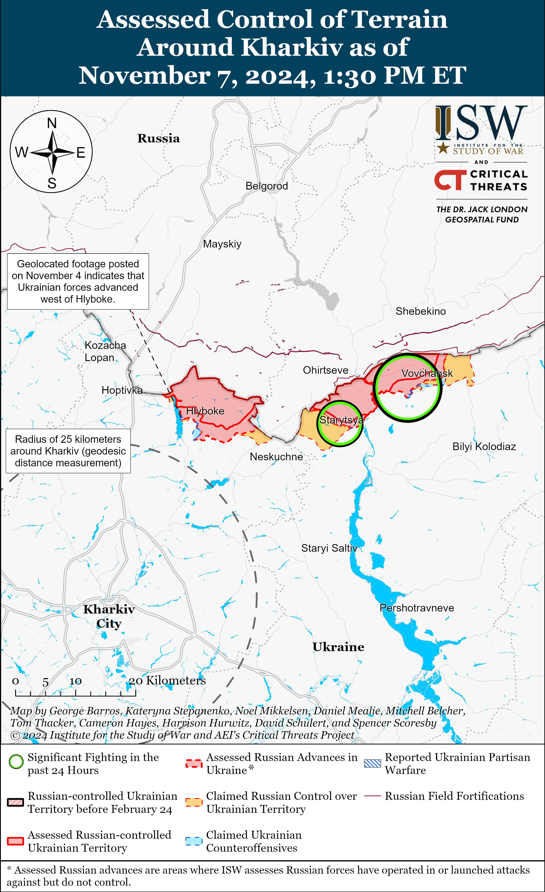
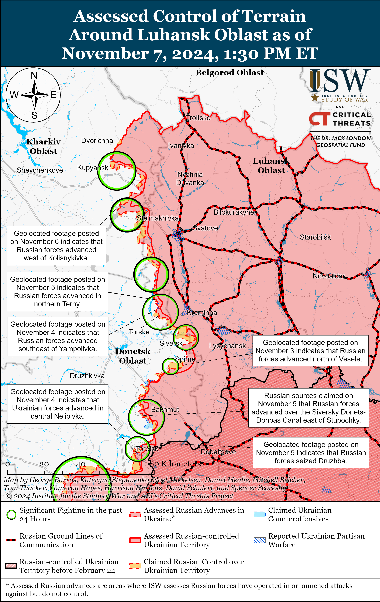
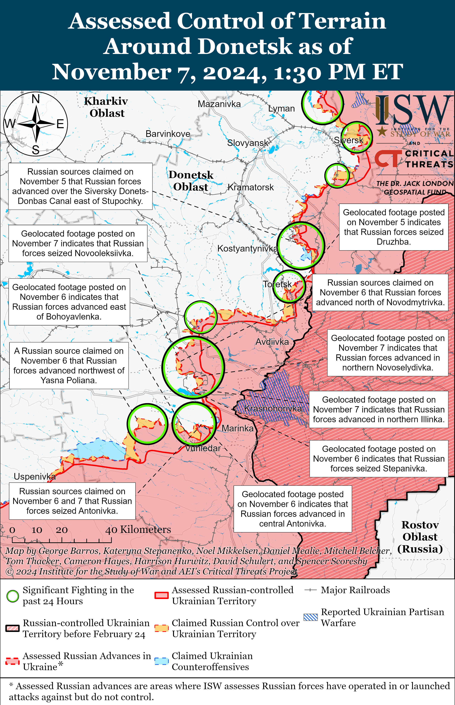
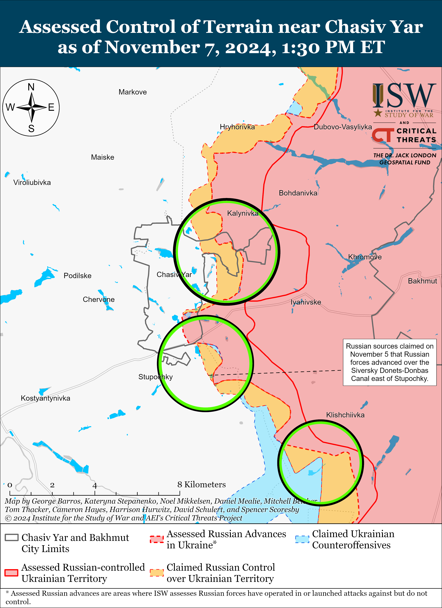
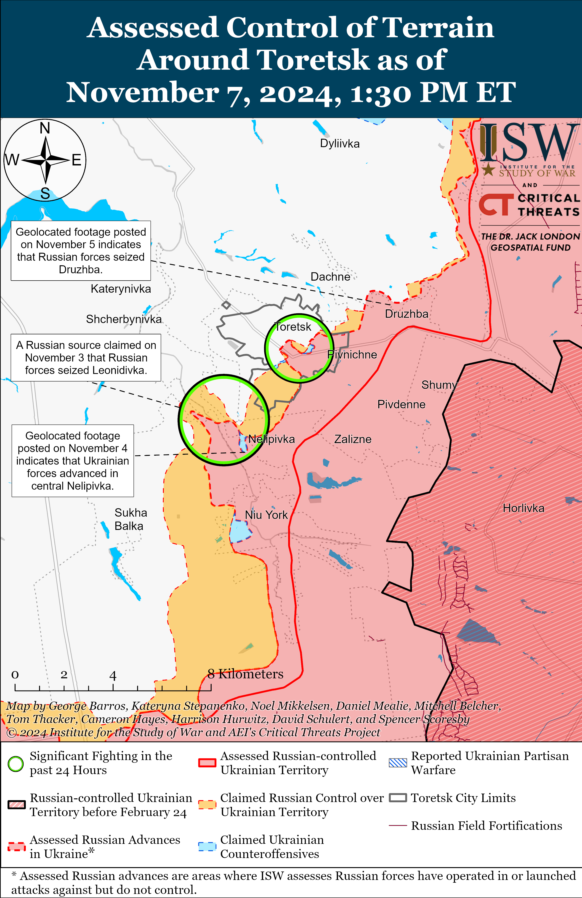
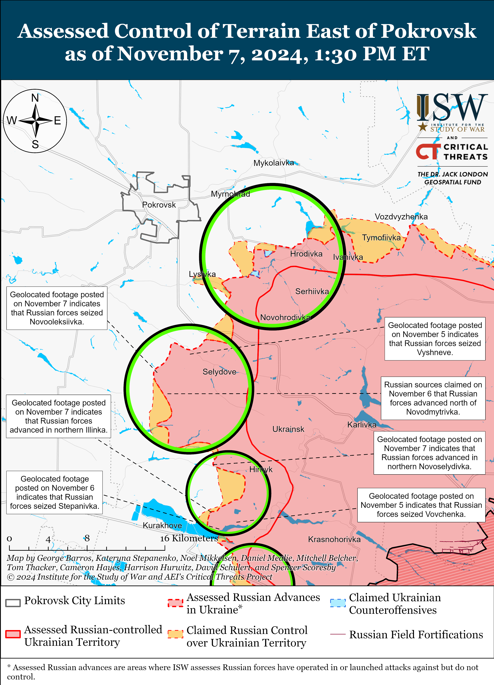
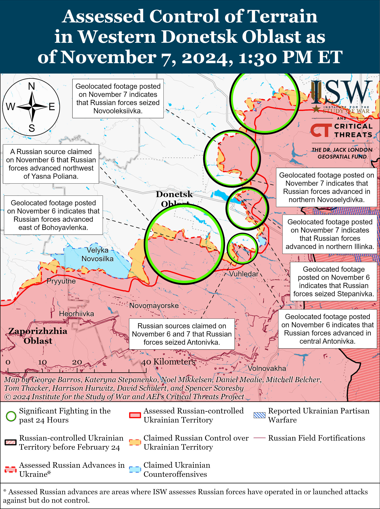
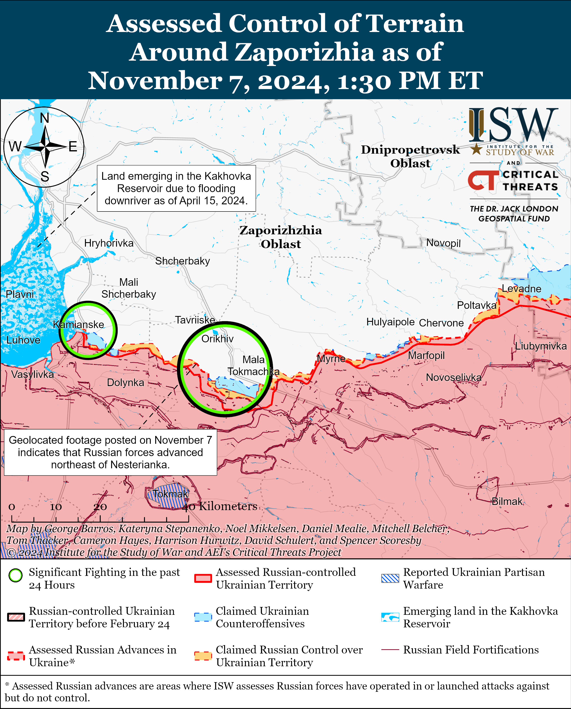
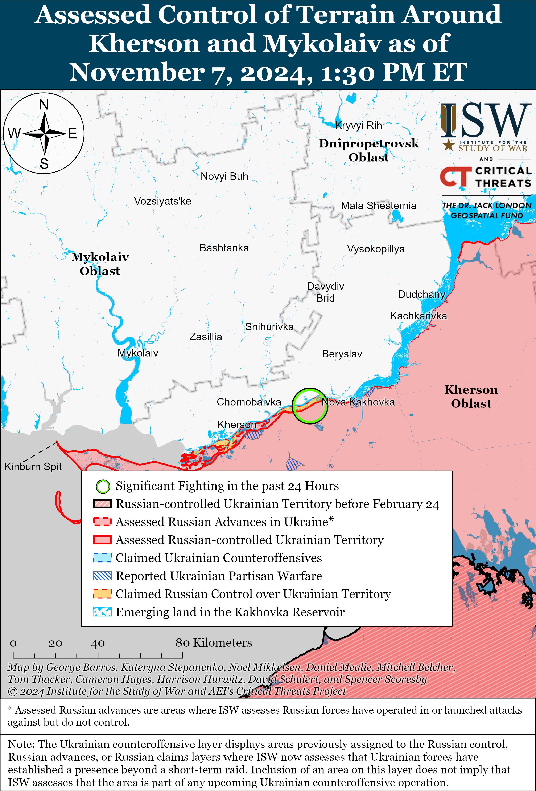

# Russian Offensive Campaign Assessment, November 7, 2024

**November 7, 2024, 7:45pm ET**

**Click** [**here**](https://storymaps.arcgis.com/stories/36a7f6a6f5a9448496de641cf64bd375) **to see ISW’s interactive map of the Russian invasion of Ukraine. This map is updated daily alongside the static maps present in this report.**

**Click** [**here**](https://storymaps.arcgis.com/stories/83a2f24901c941d581c0c523ecd2619b) **to see ISW's interactive map of Ukraine's offensive in Kursk Oblast.**

**Click** [**here**](https://understandingwar.maps.arcgis.com/apps/instant/3dviewer/index.html?appid=1602762dbcde419bb957dea358449580) **to see ISW’s 3D control of terrain topographic map of Ukraine. Use of a computer (not a mobile device) is strongly recommended for using this data-heavy tool.**

**Click** [**here**](https://storymaps.arcgis.com/stories/733fe90805894bfc8562d90b106aa895) **to access ISW’s archive of interactive time-lapse maps of the Russian invasion of Ukraine. These maps complement the static control-of-terrain map that ISW produces daily by showing a dynamic frontline. ISW will update this time-lapse map archive monthly.**

**Note: The data cut-off for this product was 1:30pm ET on November 7. ISW will cover subsequent reports in the November 8 Russian Offensive Campaign Assessment.**

**Russian President Vladimir Putin is attempting to shape US President-elect Donald Trump's foreign policy and achieve another Russia–US reset on Russia's terms.** Putin addressed the 21st annual meeting of the Valdai Discussion Club on November 7 and advocated for a reset of US–Russia relations. Putin implied that that Trump’s presidential campaign expressed a "desire to restore relations with Russia, to help end the Ukrainian crisis" and later noted that Russia is open to the "possibility of restoring relations with the United States."[[1]](#_edn31de9e967b97aa7b46f0db4ed98e63971) Putin attempted to blame the United States for undermining US–Russia relations, noting that the United States imposed sanctions and restrictions on Russia, and chose to support Kyiv - without mentioning that these measures were in response to Russia’s illegal and unprovoked full-scale invasion of Ukraine. Putin's statement implies that Russia would only accept any reset in US–Russia relations if the US dropped sanctions and restrictions against Russia and stopped supporting Ukraine — effectively entirely on terms that benefit Russia at the expense of US interests. Putin reiterated the boilerplate narrative that NATO is a "blatant anachronism," accused the West of maintaining a bloc-oriented mentality, and deliberately misrepresented his invasion of Ukraine as NATO's efforts to remain relevant. Putin attempted to frame BRICS as a non-bloc alternative to NATO and falsely implied that Russia is not interested in becoming a hegemon, despite the fact that the Kremlin has been forming a new anti-Western bloc composed of Iran, North Korea, and China.

**A recent failed Russian assault northeast of Siversk near Bilohorivka prompted outrage from some Russian ultranationalist milbloggers over Russian command failures and the pervasive Russian military culture of exaggerating battlefield successes.** Russian milbloggers claimed that the commander of the 123rd Motorized Rifle Brigade (3rd Combined Arms Army, formerly 2nd Luhansk People's Republic Army Corps) ordered the brigade's 1st, 2nd, and 3rd motorized rifle battalions and 4th Tank Battalion to conduct a simultaneous frontal assault against Ukrainian positions near Bilohorivka without adequate fire support on November 2.[[2]](#_edn31de9e967b97aa7b46f0db4ed98e63972) The milbloggers complained that the assault was unsuccessful and resulted in steep personnel, tank, and infantry fighting vehicle (IFV) losses. The milbloggers reiterated their long-standing critiques that Russian military field commanders produce "beautiful reports" and maps that deliberately inflate Russian frontline advances and send these false reports to senior Russian military leadership. Russian milbloggers claimed that field commanders send these false reports to secure promotions at the cost of Russian servicemen's lives and military equipment losses.[[3]](#_edn31de9e967b97aa7b46f0db4ed98e63973) The Russian Ministry of Defense (MoD) had claimed in late October 2024 that Russian forces had seized Serebryanka (just west of Bilohorivka), and Russian milbloggers may have been referring to this claim in their critiques.[[4]](#_edn31de9e967b97aa7b46f0db4ed98e63974) Bilohorivka is a particular sore spot for the Russian ultranationalist community because Russian forces have impaled themselves on assaults to take the settlement since at least May 2022. The Russian military command most notably launched a catastrophic river crossing to take Bilohorivka in May 2022 that failed, resulting in significant Russian armored vehicle losses.[[5]](#_edn31de9e967b97aa7b46f0db4ed98e63975)

**A Russian brigade commander and a sniper platoon commander were reported killed in combat recently in the Kurakhove and Chasiv Yar directions.** Russian opposition outlet *Mediazona* reported on November 7 that Major General Pavel Klimenko, commander of the Russian 5th Motorized Rifle Brigade (51st Combined Arms Army [CAA]), was killed in combat in Ukraine.[[6]](#_edn31de9e967b97aa7b46f0db4ed98e63976) Klimenko had reportedly served in occupied Crimea before Russia's full-scale invasion in 2022 and was promoted to Major General in May 2024. Russian opposition outlet *Astra* reported in August 2024 that soldiers under Klimenko's command had been involved in the torture of conscientious objectors and Russian personnel in an abandoned mine near Donetsk City.[[7]](#_edn31de9e967b97aa7b46f0db4ed98e63977) ISW recently observed elements of the 5th Motorized Rifle Brigade fighting in the Kurakhove direction.[[8]](#_edn31de9e967b97aa7b46f0db4ed98e63978) A Russian milblogger claimed on November 5 that Russian Deputy Commander of the Sniper Platoon of the 88th "Hispaniola" Volunteer Brigade (Russian Volunteer Corps) Pavel Alexandrovich Apalkov, nicknamed "Joker," was killed in combat in the Chasiv Yar direction.[[9]](#_edn31de9e967b97aa7b46f0db4ed98e63979)

**Ukrainian authorities continue to report systematic Russian executions of Ukrainian prisoners of war (POWs), noting a clear increase in such executions in 2024.** Head of the Department for Combating Crimes Committed in Armed Conflict of the Ukrainian Prosecutor General's Office Denys Lysenko stated on November 6 that Ukrainian authorities are investigating 49 criminal cases involving the Russian execution of 124 Ukrainian POWs.[[10]](#_edn31de9e967b97aa7b46f0db4ed98e639710) Lysenko stated that the number of Russian forces' executions of Ukrainian POWs increased sharply since the end of 2023 and reached "unprecedented levels" in 2024. The highest numbers of executions occurred in Donetsk Oblast, where Russian forces executed 62 Ukrainian POWs in 17 separate incidents, followed by Zaporizhia and Kharkiv oblasts. ISW has extensively reported on previous footage and reports of Russian servicemembers executing Ukrainian POWs in violation of the Geneva Convention on the treatment of POWs and has observed a wider trend of Russian abuses against Ukrainian POWs across various sectors of the front that appeared to be enabled, if not explicitly endorsed, by individual Russian commanders and unpunished by Russian field commanders.[[11]](#_edn31de9e967b97aa7b46f0db4ed98e639711)

**Ukrainian strikes on Russia and Western sanctions are reportedly disrupting Russia's energy industry.** The Ukrainian Foreign Intelligence Service reported on November 6 that Russian authorities partially halted operations of the Russia's Volgograd; Ilsky, Krasnodar Krai; and Yaisky, Kemerovo Oblast oil refineries in October 2024 due to failure to complete scheduled repairs of damage caused by Ukrainian strikes.[[12]](#_edn31de9e967b97aa7b46f0db4ed98e639712) The Ukrainian Foreign Intelligence Service stated that the shutdowns will reduce domestic Russian refining capacity, hinder exports, worsen fuel supply issues in Russia, and raise maintenance and modernization costs. The Ukrainian Foreign Intelligence Service noted that Russian authorities could not complete the repairs because they lacked the necessary Western equipment and components as a result of Western sanctions and failed import substitution efforts. The Ukrainian Foreign Intelligence Service reported that Russian manufacturers only supply 30 to 45 percent of the necessary components for Russian oil refineries and that the Russian reliance on Chinese equipment has proven problematic due to compatibility issues, which is increasing the repair costs. ISW previously reported on the effectiveness of Western sanctions and the need to strengthen them to prevent Russia form evading their impact via third parties, as well as the effectiveness of Ukrainian strikes on targets inside Russia.[[13]](#_edn31de9e967b97aa7b46f0db4ed98e639713)

**Key Takeaways:**

- **Russian President Vladimir Putin is attempting to shape US President-elect Donald Trump's foreign policy and achieve another Russia–US reset on Russia's terms.**
- **A recent failed Russian assault northeast of Siversk near Bilohorivka prompted outrage from some Russian ultranationalist milbloggers over Russian command failures and the pervasive Russian military culture of exaggerating battlefield successes.**
- **A Russian brigade commander and a sniper platoon commander were reported killed in combat recently in the Kurakhove and Chasiv Yar directions.**
- **Ukrainian authorities continue to report systematic Russian executions of Ukrainian prisoners of war (POWs), noting a clear increase in such executions in 2024.**
- **Ukrainian strikes on Russia and Western sanctions are reportedly disrupting Russia's energy industry.**
- **Russian forces recently advanced near Siversk, Pokrovsk, and Kurakhove.**
- **Russian authorities are reportedly creating "fake" non-combat volunteer battalions in occupied Ukraine and merging them with existing Cossack organizations led by occupation administrations.**

***We do not report in detail on Russian war crimes because these activities are well-covered in Western media and do not directly affect the military operations we are assessing and forecasting. We will continue to evaluate and report on the effects of these criminal activities on the Ukrainian military and the Ukrainian population and specifically on combat in Ukrainian urban areas. We utterly condemn Russian violations of the laws of armed conflict and the Geneva Conventions and crimes against humanity even though we do not describe them in these reports.***

- Ukrainian Operations in the Russian Federation
- Russian Main Effort — Eastern Ukraine (comprised of three subordinate main efforts)
- Russian Subordinate Main Effort #1 — Push Ukrainian forces back from the international border with Belgorod Oblast and approach to within tube artillery range of Kharkiv City
- Russian Subordinate Main Effort #2 — Capture the remainder of Luhansk Oblast and push westward into eastern Kharkiv Oblast and encircle northern Donetsk Oblast
- Russian Subordinate Main Effort #3 — Capture the entirety of Donetsk Oblast
- Russian Supporting Effort — Southern Axis
- Russian Air, Missile, and Drone Campaign
- Russian Mobilization and Force Generation Efforts
- Russian Technological Adaptations
- Activities in Russian-occupied areas
- Significant Activity in Belarus

**Ukrainian Operations in the Russian Federation**

Fighting continued in the main Ukrainian salient in Kursk Oblast southeast of Korenevo near Novoivanovka and Darino and south of Sudzha near Plekhovo on November 7, but there were no changes to the frontline.[[14]](#_edn31de9e967b97aa7b46f0db4ed98e639714) Russian milbloggers described the frontline in Kursk Oblast on November 7 as largely inactive.[[15]](#_edn31de9e967b97aa7b46f0db4ed98e639715) A Ukrainian brigade commander reportedly operating in the area stated that Russian forces field many fewer armored vehicles and have less artillery in Kursk Oblast than elsewhere on the frontline, especially in Donetsk Oblast.[[16]](#_edn31de9e967b97aa7b46f0db4ed98e639716) A milblogger posted footage of Russian forces striking a Ukrainian position near Cherkasskoye Porechnoye (north of Sudzha) with an alleged FAB-3000 glide bomb.[[17]](#_edn31de9e967b97aa7b46f0db4ed98e639717)

Neither Russian nor Ukrainian sources reported fighting in Glushkovsky Raion (west of the main Ukrainian salient) on November 7.

**Russian Main Effort — Eastern Ukraine**

**Russian Subordinate Main Effort #1 — Kharkiv Oblast** **(Russian objective: Push Ukrainian forces back from the international border with Belgorod Oblast and approach to within tube artillery range of Kharkiv City)**

Russian forces continued offensive operations northeast of Kharkiv City near Vovchansk and Starytsya (southwest of Vovchansk) on November 6 and 7 but did not advance.[[18]](#_edn31de9e967b97aa7b46f0db4ed98e639718) A spokesperson of a Ukrainian brigade operating in the Kharkiv direction stated on November 7 that Ukrainian forces managed to recapture nearly 400 hectares of Ukrainian land and several important forest strips in northern Kharkiv Oblast in October 2024.[[19]](#_edn31de9e967b97aa7b46f0db4ed98e639719)

**Russian Subordinate Main Effort #2 — Luhansk Oblast (Russian objective: Capture the remainder of Luhansk Oblast and push westward into eastern Kharkiv Oblast and northern Donetsk Oblast)**

Russian forces continued offensive operations along the Kupyansk-Svatove-Kreminna line on November 7, but did not advance. Russian forces continued offensive operations northeast of Kupyansk near Synkivka; east of Kupyansk near Petropavlivka and Kucherivka; southeast of Kupyansk near Kruhlyakivka, Kolisynkivka, and Lozova; southwest of Svatove near Druzhelyubivka and Hrekivka; northwest of Kremmina near Makiivka, and Katerynivka; and west of Kremmina near Torske and Terny; and southwest of Kreminna near Serebryanka and Dibrova on November 6 and 7.[[20]](#_edn31de9e967b97aa7b46f0db4ed98e639720) Elements of the Russian 144th Motorized Rifle Division (20th Combined Arms Army [CAA], Moscow Military District [MMD]) are reportedly operating near Terny.[[21]](#_edn31de9e967b97aa7b46f0db4ed98e639721)

**Russian Subordinate Main Effort #3 — Donetsk Oblast (Russian objective: Capture the entirety of Donetsk Oblast, the claimed territory of Russia’s proxies in Donbas)**

Russian forces recently advanced east of Siversk amid continued offensive operations on November 7. Geolocated footage published on November 7 shows that Russian forces advanced south of Verkhnokamyanske (east of Siversk), and a Russian milblogger claimed that Russian forces advanced further south of Verkhnokamyanske.[[22]](#_edn31de9e967b97aa7b46f0db4ed98e639722) Russian sources also claimed that Russian forces advanced northwest of Zolotarivka (east of Siversk) and advanced by 800 meters from the northern outskirts of Ivano-Darivka (southeast of Siversk).[[23]](#_edn31de9e967b97aa7b46f0db4ed98e639723) ISW has not observed visual evidence supporting this claim. Russian forces continued offensive operations northeast of Siversk near Bilohorivka and Hryhorivka, and south of Siversk near Pereizne on November 6 and 7.[[24]](#_edn31de9e967b97aa7b46f0db4ed98e639724) Reconnaissance elements of the 123rd Separate Motorized Rifle Brigade (3rd Combined Arms Army [CAA], formerly 2nd Luhansk People's Republic's Army Corps [LNR AC]) and artillery elements of the 2nd Guards Artillery Brigade (3rd CAA) are reportedly operating in the Siversk direction.[[25]](#_edn31de9e967b97aa7b46f0db4ed98e639725)

Russian forces continued offensive operations in and around Chasiv Yar on November 7 but did not advance. Russian forces reportedly attacked in Chasiv Yar, south of Chasiv Yar near Stupochky and Bila Hora, and southeast of Chasiv Yar near Klishchiivka on November 6 and 7.[[26]](#_edn31de9e967b97aa7b46f0db4ed98e639726) A Russian milblogger claimed that Russian forces advanced by 1.5 kilometers in a park area southeast of Chasiv Yar, but ISW has not observed visual evidence confirming this claim.[[27]](#_edn31de9e967b97aa7b46f0db4ed98e639727) Ukrainian military observer Kostyantyn Mashovets noted that one to two battalions of the 102nd Motorized Rifle Regiment (150th Motorized Rifle Division, 8th CAA, Southern Military District [SMD]) are operating in the Kramatorsk direction (likely referring to the Chasiv Yar direction).[[28]](#_edn31de9e967b97aa7b46f0db4ed98e639728) Mashovets stated that it is strange that elements of the 102nd Motorized Rifle Brigade are fighting in the Kramatorsk direction given that the regiment had been fighting in the Kurakhove direction, and ISW had recently observed elements of the brigade operate on the outskirts of Kurakhove.[[29]](#_edn31de9e967b97aa7b46f0db4ed98e639729) Mashovets added that Russian forces have deployed approximately 47,500 to 48,000 personnel, 210 to 212 tanks, and 832 to 834 armored vehicles to the Kramatorsk direction. Mashovets added that Russian operational reserves in this direction consist of one Airborne (VDV) regiment, which Mashovets assessed is likely the 217th VDV Regiment (98th VDV Division) minus one or 1.5 of its battalions; two unspecified motorized rifle regiments; up to three reserve battalions; 10 or fewer tanks; and 80 to 85 armored vehicles, of which half need to be repaired. Elements of the Russian 2nd assault company of the 331st VDV Regiment (98th VDV Division), drone operators of the "Okhotnik" Spetsnaz detachment (51st CAA, formerly 1st Donetsk People's Republic's [DNR] AC), and drone operators of the "Hispaniola" Volunteer Brigade (Russian Volunteer Corps) continue to operate in the Chasiv Yar direction.[[30]](#_edn31de9e967b97aa7b46f0db4ed98e639730)

Russian forces continued offensive operations in the Toretsk direction but did not advance on November 7. Russian forces reportedly attacked in Toretsk, north of Toretsk near Dylivka, and west of Toretsk near Shcherbynivka on November 6 and 7.[[31]](#_edn31de9e967b97aa7b46f0db4ed98e639731) A Kremlin-affiliated milblogger claimed that poor weather had slowed down Russian advances in Toretsk.[[32]](#_edn31de9e967b97aa7b46f0db4ed98e639732) Mashovets stated that Russian forces have up to 21,000 troops, up to 50 tanks, and about 235 to 240 armored vehicles in the Toretsk direction.[[33]](#_edn31de9e967b97aa7b46f0db4ed98e639733) Mashovets noted that Russian forces only have a battalion of the 132nd Separate Motorized Riffle Brigade (51st CAA) in reserve and dismissed unconfirmed reports that Russian forces transferred two battalions of the 1st and 114th separate motorized rifle brigades (both of 51st CAA) to the reserves in Toretsk direction from prioritized frontlines in the Pokrovsk and Kurakhove directions.[[34]](#_edn31de9e967b97aa7b46f0db4ed98e639734)

Russian forces recently advanced south of Pokrovsk amid continued Russian offensive operations on November 7. Geolocated footage published on November 7 indicates that Russian forces likely seized Novooleksiivka (south of Pokrovsk and west of Selydove), and Russian sources credited a Russian motorized battalion of the 80th Tank Regiment (90th Guards Tank Division, 41st CAA, Central Military District [CMD]) with seizing the settlement.[[35]](#_edn31de9e967b97aa7b46f0db4ed98e639735) Russian milbloggers claimed that Russian forces advanced southeast of Lysivka (southeast of Pokrovsk) and west of Hryhorivka (west of Selydove), but ISW has not observed visual evidence of these claims.[[36]](#_edn31de9e967b97aa7b46f0db4ed98e639736) Russian forces continued assaults east of Pokrovsk near Myrolyubivka and Promin; south of Pokrovsk near Novooleksiivka; and southeast of Pokrovsk near Selydove, Krutyi Yar, Novohrodivka, Sukhyi Yar, and Lysivka.[[37]](#_edn31de9e967b97aa7b46f0db4ed98e639737)

Russian forces recently advanced north and northeast of Kurakhove amid continued Russian offensive operations in the area on November 7. Geolocated footage published on November 7 shows that Russian forces advanced in northern Novoselydivka (north of Kurakhove) and in northern Illinka (northeast of Kurakhove).[[38]](#_edn31de9e967b97aa7b46f0db4ed98e639738) Russian milbloggers also claimed that Russian forces advanced in western Novodmytrivka (northwest of Kurakhove) and south of Kreminna Balka (north of Kurakhove), and the Russian Ministry of Defense (MoD) claimed on November 7 that Russian forces seized Kreminna Balka, but ISW has not observed confirmation of these claims.[[39]](#_edn31de9e967b97aa7b46f0db4ed98e639739) Russian forces continued to attack Kurakhove itself; northwest of Kurakhove near Novodmytrivka; north of Kurakhove near Kreminna Balka, Novoselydivka, and Sontsivka; northeast of Kurakhove near Illinka; and east of Kurakhove near Maksymilyanivka on November 6 and 7.[[40]](#_edn31de9e967b97aa7b46f0db4ed98e639740) Elements of the 238th Artillery Brigade (8th CAA) are reportedly operating near Maksymilyanivka.[[41]](#_edn31de9e967b97aa7b46f0db4ed98e639741)

Russian forces continued offensive operations in the Vuhledar direction but did not advance on November 7. Geolocated footage published on October 31 shows that Russian forces advanced northwest of Vodyane (northeast of Vuhledar), but this change to the frontline is not recent.[[42]](#_edn31de9e967b97aa7b46f0db4ed98e639742) Russian milbloggers claimed that elements of the Russian 33rd Motorized Rifle Regiment (20th Motorized Rifle Division, 8th CAA seized Antonivka (northeast of Vuhledar) and that Russian forces seized Maksymivka (northwest of Vuhledar) and advanced north of the settlement.[[43]](#_edn31de9e967b97aa7b46f0db4ed98e639743) Russian forces reportedly continued offensive operations northeast of Vuhledar near Antonivka, Katerynivka, and Dalne; and northwest of Vuhledar near Trudove and Maksymivka on November 6 and 7.[[44]](#_edn31de9e967b97aa7b46f0db4ed98e639744) Assault elements of the 2nd Battalion of the 39th Guards Motorized Rifle Brigade (68th AC, Eastern Military District [EMD]) are reportedly operating south of Yelyzavetivka (northeast of Vuhledar).[[45]](#_edn31de9e967b97aa7b46f0db4ed98e639745) Elements of the Russian 2nd Battalion of the 39th Motorized Rifle Brigade (68th Army Corps [AC], Eastern Military District [EMD]) are reportedly operating near Yelizavetivka (north of Vuhledar).[[46]](#_edn31de9e967b97aa7b46f0db4ed98e639746) Elements of the Russian 33rd Motorized Rifle Regiment (20th Guards Motorized Rifle Division, 8th CAA, Southern Military District [SMD]) reportedly continue to operate near Antonivka.[[47]](#_edn31de9e967b97aa7b46f0db4ed98e639747) Elements of the Russian 143rd Motorized Rifle Regiment (127th Motorized Rifle Division, 5th CAA, EMD) are reportedly operating in the Vremivka direction.[[48]](#_edn31de9e967b97aa7b46f0db4ed98e639748)

**Russian Supporting Effort — Southern Axis (Russian objective: Maintain frontline positions and secure rear areas against Ukrainian strikes)**

Russian forces marginally advanced during localized ground attacks in western Zaporizhia Oblast on November 7. Geolocated footage published on November 7 indicates that Russian forces advanced to a windbreak northeast of Nesteryanka (northwest of Robotyne) following Russian milblogger claims of Russian advances west of Nesteryanka on November 5 and 6.[[49]](#_edn31de9e967b97aa7b46f0db4ed98e639749) The Ukrainian General Staff reported that Russian forces continued attacking northwest of Robotyne near Novoandriivka on November 6 and 7.[[50]](#_edn31de9e967b97aa7b46f0db4ed98e639750)

The Ukrainian General Staff reported that Russian forces continued ground attacks in the Dnipro direction, likely referring to east (left) bank Kherson Oblast, on November 6 and 7 but did not advance.[[51]](#_edn31de9e967b97aa7b46f0db4ed98e639751)

**Russian Air, Missile, and Drone Campaign (Russian Objective: Target Ukrainian military and civilian infrastructure in the rear and on the frontline)**

Russian forces conducted a large drone strike against Ukraine on the night of November 6 to 7. The Ukrainian Air Force reported that Russian forces launched 106 Shahed and other unidentified strike drones from Primorsko-Akhtarsk, Krasnodar Krai; occupied Crimea; and Kursk and Oryol oblasts.[[52]](#_edn31de9e967b97aa7b46f0db4ed98e639752) The Ukrainian Air Force reported that Ukrainian forces downed 74 drones over Odesa, Mykolaiv, Kherson, Kyiv, Sumy, Poltava, Kharkiv, Kirovohrad, Zhytomyr, Cherkasy, and Chernihiv oblasts, and that 25 drones were ”locally lost,” likely due to Ukrainian electronic warfare (EW) interference. Ukrainian sources reported that Russian drones caused minor damage to civilian infrastructure in six raions of Kyiv City and damaged a gas pipeline and residential buildings in Odesa City on November 7.[[53]](#_edn31de9e967b97aa7b46f0db4ed98e639753) Russian milbloggers claimed on November 7 that Russian drones struck energy facilities in Rivne and Zhytomyr oblasts.[[54]](#_edn31de9e967b97aa7b46f0db4ed98e639754) Ukrainian Zaporizhia Oblast Military Administration Head Ivan Fedorov reported that Russian forces hit civilian infrastructure with five glide bombs during the day on November 7, injuring 33 civilians in Zaporizhzhia City on November 7.[[55]](#_edn31de9e967b97aa7b46f0db4ed98e639755)

Ukrainian Air Force Spokesperson Colonel Yuriy Ihnat told *CNN* that Russian forces are widely using decoy drones with 3D-printed balls wrapped in foil to imitate warheads and fool radar systems.[[56]](#_edn31de9e967b97aa7b46f0db4ed98e639756) Ihnat estimated that up to half of all Russian drones fired at Ukraine are decoys.

**Russian Mobilization and Force Generation Efforts (Russian objective: Expand combat power without conducting general mobilization)**

Russian media reported on November 7 that Russian President Vladimir Putin appointed former Republic of Komi Head Vladimir Uyba to be the Deputy Head of the Russian Ministry of Defense’s (MoD) Medical Directorate following Uyba's resignation as Republic of Komi head on November 5.[[57]](#_edn31de9e967b97aa7b46f0db4ed98e639757)

Russian authorities are reportedly creating "fake" non-combat volunteer battalions in occupied Ukraine and merging them with existing Cossack organizations led by occupation administrations.[[58]](#_edn31de9e967b97aa7b46f0db4ed98e639758) The Ukrainian Resistance Center stated on November 7 that Russian authorities fund these the volunteer battalions, which the center noted primarily only exist on paper so that Russian authorities can claim to have the support of locals in occupied Ukraine. Russian occupation authorities have been using Cossack organizations likely to create Russian military reserves and paramilitary policing services from residents of occupied Ukraine.[[59]](#_edn31de9e967b97aa7b46f0db4ed98e639759)

Russian federal subjects continue to increase one-time payments to Russians who assist in recruiting volunteers to support ongoing Russian crypto-mobilization efforts. Voronezh Oblast authorities increased one-time payments from 50,000 rubles to 75,000 rubles on November 6 for Voronezh Oblast residents who assist in recruiting other Voronezh Oblast residents into the Russian military.[[60]](#_edn31de9e967b97aa7b46f0db4ed98e639760)

The Russian Ministry of Defense (MoD) announced on November 7 that it has issued over 52,000 veterans status certificates to Russian military veterans of the war in Ukraine and received over 100,000 veterans status certificate requests since introducing a digital veterans-status verification system on November 1.[[61]](#_edn31de9e967b97aa7b46f0db4ed98e639761)   
   
 **Russian Technological Adaptations** **(Russian objective: Introduce technological innovations to optimize systems for use in Ukraine)**

The Russian Ministry of Defense (MoD) continues efforts to modernize Russian combat drones to counter Ukrainian electronic warfare (EW). Former Deputy Chief of the Ukrainian General Staff Lieutenant General Ihor Romanenko stated on November 7 that Russian forces began implementing both artificial intelligence (AI) and fiber optic cables into Russian drones in 2024 to allow Russian forces with alternate means of controlling the drones that Ukrainian EW does not affect.[[62]](#_edn31de9e967b97aa7b46f0db4ed98e639762) Romanenko stated that Russian forces are switching to the use of tactical-level strike-reconnaissance systems in response to recent Ukrainian destruction of the Russian A-50 long range radar detection aircraft. Romanenko stated that Russian forces now to use tactical-level drones with ranges of more than 100 kilometers to conduct reconnaissance.

The Russian defense industrial base (DIB) and frontline Russian forces continue to innovate Russian drones and anti-drone means. Russian sources claimed on November 1 that Russian forces are fielding the new “Molot” anti-drone gun, which can reportedly fire a heat-seeking munition at drones flying within 200 meters of the user.[[63]](#_edn31de9e967b97aa7b46f0db4ed98e639763) The Russian Unmanned Systems group announced on November 5 that it has developed a new aerial laser scanner for the Russian SuperCam reconnaissance drone with a range error of five millimeters and the ability to geolocate objects within a two-centimeter margin of error.[[64]](#_edn31de9e967b97aa7b46f0db4ed98e639764) A Ukrainian military expert stated on November 7 that the Russian DIB increased production of unspecified long-range drones from 17 to 50 per day, and that the Russian DIB may be able to produce up to 90 long-range drones per day in the near future.[[65]](#_edn31de9e967b97aa7b46f0db4ed98e639765) A Russian milblogger claimed on November 7 that Russian forces in field laboratories are creating homemade munitions for Russian first-person view (FPV) drones, likely due to a shortage of munitions for Russian forces on the frontline.[[66]](#_edn31de9e967b97aa7b46f0db4ed98e639766)

**Activities in Russian-occupied areas (Russian objective: Consolidate administrative control of annexed areas; forcibly integrate Ukrainian citizens into Russian sociocultural, economic, military, and governance systems)**

*ISW is not publishing reporting on activities in Russian-occupied areas today.*

**Significant activity in Belarus** **(Russian efforts to increase its military presence in Belarus and further integrate Belarus into Russian-favorable frameworks and Wagner Group activity in Belarus)**

Nothing significant to report.

**Note: ISW does not receive any classified material from any source, uses only publicly available information, and draws extensively on Russian, Ukrainian, and Western reporting and social media as well as commercially available satellite imagery and other geospatial data as the basis for these reports. References to all sources used are provided in the endnotes of each update.**

---

[[1]](#_edn31de9e967b97aa7b46f0db4ed98e6397ref1) <http://kremlin> dot ru/events/president/news/75521

[[2]](#_edn31de9e967b97aa7b46f0db4ed98e6397ref2) https://t.me/rybar/65163 ; <https://t.me/dva_majors/56995>; <https://t.me/dva_majors/56981>; <https://t.me/svarschiki/10824>; https://t.me/DnevnikDesantnika/18688

[[3]](#_edn31de9e967b97aa7b46f0db4ed98e6397ref3) https://t.me/rybar/65163 ; https://t.me/dva\_majors/56995; https://t.me/dva\_majors/56981; https://t.me/svarschiki/10824; https://t.me/DnevnikDesantnika/18688

[[4]](#_edn31de9e967b97aa7b46f0db4ed98e6397ref4) <https://t.me/dva_majors/55755>; https://t.me/rybar/64284; https://t.me/dva\_majors/56981

[[5]](#_edn31de9e967b97aa7b46f0db4ed98e6397ref5) <https://www.understandingwar.org/backgrounder/russian-offensive-campaign-assessment-may-14>; <https://www.understandingwar.org/backgrounder/russian-offensive-campaign-assessment-september-8>; https://www.understandingwar.org/backgrounder/russian-offensive-campaign-assessment-may-31

[[6]](#_edn31de9e967b97aa7b46f0db4ed98e6397ref6) https://zona dot media/news/2024/11/07/klimenko; https://vk dot com/donbass\_h\_russia?w=wall-191554677\_312942; https://t.me/astrapress/67991; https://zona.media/news/2024/08/17/bentley

[[7]](#_edn31de9e967b97aa7b46f0db4ed98e6397ref7) https://t.me/astrapress/62085

[[8]](#_edn31de9e967b97aa7b46f0db4ed98e6397ref8) https://www.understandingwar.org/backgrounder/russian-offensive-campaign-assessment-october-23-2024

;

https://understandingwar.org/backgrounder/russian-offensive-campaign-assessment-october-19-2024

;

https://www.understandingwar.org/backgrounder/russian-offensive-campaign-assessment-october-27-2024

;

https://www.understandingwar.org/backgrounder/russian-offensive-campaign-assessment-october-14-2024

[[9]](#_edn31de9e967b97aa7b46f0db4ed98e6397ref9) https://x.com/666\_mancer/status/1854173260365046014 ; https://t.co/JphKfnNW7S

[[10]](#_edn31de9e967b97aa7b46f0db4ed98e6397ref10) https://suspilne dot media/874335-ogpu-v-ukraini-rozsliduut-49-karnih-sprav-pro-vbivstva-124-vijskovopolonenih/

[[11]](#_edn31de9e967b97aa7b46f0db4ed98e6397ref11) <https://www.understandingwar.org/backgrounder/russian-offensive-campaign-assessment-november-6-2024>; https://isw.pub/UkrWar100624 ; https://isw.pub/UkrWar100124 ; https://isw.pub/UkrWar090624 ; https://www.understandingwar.org/backgrounder/russian-offensive-campaign-assessment-june-19-2024 ; https://isw.pub/UkrWar122823 ; https://www.understandingwar.org/backgrounder/russian-offensive-campaign-assessment-june-3-2024 ; https://isw.pub/UkrWar032724 ; https://isw.pub/UkrWar052924 ; https://isw.pub/UkrWar090424 ; https://www.understandingwar.org/backgrounder/russian-offensive-campaign-assessment-july-10-2024 ; https://isw.pub/UkrWar062324; https://understandingwar.org/backgrounder/russian-offensive-campaign-assessment-october-7-2024

[[12]](#_edn31de9e967b97aa7b46f0db4ed98e6397ref12) https://armyinform dot com.ua/2024/11/07/sankcziyi-praczyuyut-u-rf-zupynyayetsya-naftopererobka/; https://szru dot gov.ua/news-media/news/u-rf-zupynyaietsya-naftopererobka--sanktsii-pratsyuyut

[[13]](#_edn31de9e967b97aa7b46f0db4ed98e6397ref13) <https://understandingwar.org/backgrounder/putin-vulnerable-western-policy-masks-russian-weakness>; <https://www.understandingwar.org/backgrounder/russian-offensive-campaign-assessment-june-5-2024>; <https://www.understandingwar.org/backgrounder/russian-offensive-campaign-assessment-september-15-2024>; <https://understandingwar.org/backgrounder/russian-offensive-campaign-assessment-september-24-2024>;

[[14]](#_edn31de9e967b97aa7b46f0db4ed98e6397ref14) <https://t.me/rybar/65163>; <https://t.me/mod_russia/45457>; https://t.me/dva\_majors/56995

[[15]](#_edn31de9e967b97aa7b46f0db4ed98e6397ref15) https://t.me/rybar/65163 ; https://t.me/dva\_majors/56995

[[16]](#_edn31de9e967b97aa7b46f0db4ed98e6397ref16) https://armyinform dot com.ua/2024/11/06/zayizhdzhaly-tygry-ta-bmp-ale-vony-duzhe-shvydko-zgoraly-kombat-genij-pro-boyi-na-kurshhyni/; https://youtu.be/JXr3lK5wJro

[[17]](#_edn31de9e967b97aa7b46f0db4ed98e6397ref17) https://t.me/dva\_majors/57020

[[18]](#_edn31de9e967b97aa7b46f0db4ed98e6397ref18) <https://www.facebook.com/GeneralStaff.ua/posts/pfbid0wxkfQWYowQNZBXxgTXfeLin2hBm7ZFBM1D3i9C3odbyEGxyfRHNSdff5snxoKjzyl>; https://www.facebook.com/GeneralStaff.ua/posts/pfbid0hXmTbGG4uuVsZPRMe1KCUAtYZ1DEuUSiQ5DHGMVpGLMsRLw3imYV8oepe2p8y8cxl ; https://www.facebook.com/GeneralStaff.ua/posts/pfbid0Vgj4w3anhmR1geE4UYGiMhdd2cVEtnC6VLyY6gtwCDA6Ex79jC93sZ3kzS43fsupl

[[19]](#_edn31de9e967b97aa7b46f0db4ed98e6397ref19) https://armyinform dot com.ua/2024/11/07/400-gektariv-za-zhovten-rosiyan-povoli-vyshtovhuyut-z-harkivshhyny/

[[20]](#_edn31de9e967b97aa7b46f0db4ed98e6397ref20) <https://www.facebook.com/GeneralStaff.ua/posts/pfbid0wxkfQWYowQNZBXxgTXfeLin2hBm7ZFBM1D3i9C3odbyEGxyfRHNSdff5snxoKjzyl>; https://www.facebook.com/GeneralStaff.ua/posts/pfbid0hXmTbGG4uuVsZPRMe1KCUAtYZ1DEuUSiQ5DHGMVpGLMsRLw3imYV8oepe2p8y8cxl ; <https://www.facebook.com/GeneralStaff.ua/posts/pfbid0Vgj4w3anhmR1geE4UYGiMhdd2cVEtnC6VLyY6gtwCDA6Ex79jC93sZ3kzS43fsupl>; https://t.me/rybar/65163

[[21]](#_edn31de9e967b97aa7b46f0db4ed98e6397ref21) <https://t.me/s/vysokygovorit/17904>; <https://t.me/s/vysokygovorit/17910>; https://t.me/s/epoddubny/21547

[[22]](#_edn31de9e967b97aa7b46f0db4ed98e6397ref22) https://t.me/rubpak54/222; https://t.me/creamy\_caprice/7434; https://t.me/z\_arhiv/29256

[[23]](#_edn31de9e967b97aa7b46f0db4ed98e6397ref23) <https://t.me/tass_agency/283892;> <https://t.me/DnevnikDesantnika/18717>

[[24]](#_edn31de9e967b97aa7b46f0db4ed98e6397ref24) <https://www.facebook.com/GeneralStaff.ua/posts/pfbid0hXmTbGG4uuVsZPRMe1KCUAtYZ1DEuUSiQ5DHGMVpGLMsRLw3imYV8oepe2p8y8cxl;> <https://www.facebook.com/GeneralStaff.ua/posts/pfbid0Vgj4w3anhmR1geE4UYGiMhdd2cVEtnC6VLyY6gtwCDA6Ex79jC93sZ3kzS43fsupl;> <https://www.facebook.com/GeneralStaff.ua/posts/pfbid0wxkfQWYowQNZBXxgTXfeLin2hBm7ZFBM1D3i9C3odbyEGxyfRHNSdff5snxoKjzyl> ; l [https://armyinform](https://armyinform/) dot com.ua/2024/11/07/protyvnyk-namagavsya-shturmuvaty-bilogorivku-zsu-vidbyly-ataky/; <https://t.me/luhanskaVTSA/22478>

[[25]](#_edn31de9e967b97aa7b46f0db4ed98e6397ref25) <https://t.me/epoddubny/21546>; https://t.me/boris\_rozhin/143511

[[26]](#_edn31de9e967b97aa7b46f0db4ed98e6397ref26) <https://www.facebook.com/GeneralStaff.ua/posts/pfbid0wxkfQWYowQNZBXxgTXfeLin2hBm7ZFBM1D3i9C3odbyEGxyfRHNSdff5snxoKjzyl> ; <https://www.facebook.com/GeneralStaff.ua/posts/pfbid0hXmTbGG4uuVsZPRMe1KCUAtYZ1DEuUSiQ5DHGMVpGLMsRLw3imYV8oepe2p8y8cxl;> <https://www.facebook.com/GeneralStaff.ua/posts/pfbid0Vgj4w3anhmR1geE4UYGiMhdd2cVEtnC6VLyY6gtwCDA6Ex79jC93sZ3kzS43fsupl>

[[27]](#_edn31de9e967b97aa7b46f0db4ed98e6397ref27) https://t.me/DnevnikDesantnika/18724

[[28]](#_edn31de9e967b97aa7b46f0db4ed98e6397ref28) https://t.me/zvizdecmanhustu/2326

[[29]](#_edn31de9e967b97aa7b46f0db4ed98e6397ref29) https://understandingwar.org/backgrounder/russian-offensive-campaign-assessment-october-27-2024

[[30]](#_edn31de9e967b97aa7b46f0db4ed98e6397ref30) [https://t.me/dva\_majors/57009;](https://t.me/dva_majors/57009;%20) [https://t.me/nm\_dnr/12945;](https://t.me/nm_dnr/12945) <https://t.me/DnevnikDesantnika/18686>

[[31]](#_edn31de9e967b97aa7b46f0db4ed98e6397ref31) <https://www.facebook.com/GeneralStaff.ua/posts/pfbid0wxkfQWYowQNZBXxgTXfeLin2hBm7ZFBM1D3i9C3odbyEGxyfRHNSdff5snxoKjzyl>; <https://www.facebook.com/GeneralStaff.ua/posts/pfbid0hXmTbGG4uuVsZPRMe1KCUAtYZ1DEuUSiQ5DHGMVpGLMsRLw3imYV8oepe2p8y8cxl;> <https://www.facebook.com/GeneralStaff.ua/posts/pfbid0Vgj4w3anhmR1geE4UYGiMhdd2cVEtnC6VLyY6gtwCDA6Ex79jC93sZ3kzS43fsupl>

[[32]](#_edn31de9e967b97aa7b46f0db4ed98e6397ref32) https://t.me/wargonzo/23006

[[33]](#_edn31de9e967b97aa7b46f0db4ed98e6397ref33) [ttps://t.me/zvizdecmanhustu/2327](https://t.me/zvizdecmanhustu/2327) ; <https://t.me/zvizdecmanhustu/2328>

[[34]](#_edn31de9e967b97aa7b46f0db4ed98e6397ref34) <https://t.me/zvizdecmanhustu/2327> ; <https://t.me/zvizdecmanhustu/2328>

[[35]](#_edn31de9e967b97aa7b46f0db4ed98e6397ref35) <https://t.me/creamy_caprice/7432;> <https://t.me/gostrikartuzy/678;> <https://t.me/WarArchive_ua/22065> <https://t.me/creamy_caprice/7430;> [https://t.me/motopatriot/29261; https://t.me/motopatriot/29261](https://t.me/motopatriot/29261;) ; <https://x.com/strategicbakery/status/1854429427968381346>; <https://t.me/z_arhiv/29249>; <https://t.me/z_arhiv/29242;> <https://t.me/motopatriot/29277>

[[36]](#_edn31de9e967b97aa7b46f0db4ed98e6397ref36) https://t.me/DnevnikDesantnika/18677

[[37]](#_edn31de9e967b97aa7b46f0db4ed98e6397ref37) <https://www.facebook.com/GeneralStaff.ua/posts/pfbid0wxkfQWYowQNZBXxgTXfeLin2hBm7ZFBM1D3i9C3odbyEGxyfRHNSdff5snxoKjzyl;> <https://www.facebook.com/GeneralStaff.ua/posts/pfbid0hXmTbGG4uuVsZPRMe1KCUAtYZ1DEuUSiQ5DHGMVpGLMsRLw3imYV8oepe2p8y8cxl;> <https://www.facebook.com/GeneralStaff.ua/posts/pfbid0Vgj4w3anhmR1geE4UYGiMhdd2cVEtnC6VLyY6gtwCDA6Ex79jC93sZ3kzS43fsupl;> <https://x.com/GirkinGirkin/status/1854207677166944318> ; <https://x.com/strategicbakery/status/1854216446311555156;> [https://armyinform](https://armyinform/) dot com.ua/2024/11/06/snaryad-odyn-a-okupantiv-pyat-znyshhennya-shturmovoyi-grupy-rosiyan-na-pokrovskomu-napryamku/; <https://t.me/fifthbrUA/584>

[[38]](#_edn31de9e967b97aa7b46f0db4ed98e6397ref38) <https://t.>me/kozakgyluntv/19730; <https://t.me/creamy_caprice/7433>; https://t.me/aeronavtyua/2948; https://t.me/WarArchive\_ua/22062; https://t.me/creamy\_caprice/7429; https://x.com/markito0171/status/1854423793428525478; https://x.com/strategicbakery/status/1854432361506656535; https://x.com/geschlittert/status/1854481070395211899

[[39]](#_edn31de9e967b97aa7b46f0db4ed98e6397ref39) <https://t.me/motopatriot/29278>; <https://t.me/z_arhiv/29223;> <https://t.me/sashakots/50012> ; https://t.me/voenkorKotenok/59998; <https://t.me/motopatriot/29274;> <https://t.me/NgP_raZVedka/19353>

[[40]](#_edn31de9e967b97aa7b46f0db4ed98e6397ref40) <https://www.facebook.com/GeneralStaff.ua/posts/pfbid0wxkfQWYowQNZBXxgTXfeLin2hBm7ZFBM1D3i9C3odbyEGxyfRHNSdff5snxoKjzyl>; <https://www.facebook.com/GeneralStaff.ua/posts/pfbid0hXmTbGG4uuVsZPRMe1KCUAtYZ1DEuUSiQ5DHGMVpGLMsRLw3imYV8oepe2p8y8cxl;> <https://www.facebook.com/GeneralStaff.ua/posts/pfbid0Vgj4w3anhmR1geE4UYGiMhdd2cVEtnC6VLyY6gtwCDA6Ex79jC93sZ3kzS43fsupl>

[[41]](#_edn31de9e967b97aa7b46f0db4ed98e6397ref41) https://t.me/nm\_dnr/12944

[[42]](#_edn31de9e967b97aa7b46f0db4ed98e6397ref42) https://x.com/davincibat/status/1852030787656307109; https://t [dot] me/davincibat/388; https://t.me/z\_arhiv/29239

[[43]](#_edn31de9e967b97aa7b46f0db4ed98e6397ref43) <https://t.me/DnevnikDesantnika/18728;> <https://t.me/z_arhiv/29239>; https://t.me/dva\_majors/56995; https://t.me/rybar/65163; https://t.me/DnevnikDesantnika/18728

[[44]](#_edn31de9e967b97aa7b46f0db4ed98e6397ref44) <https://www.facebook.com/GeneralStaff.ua/posts/pfbid0wxkfQWYowQNZBXxgTXfeLin2hBm7ZFBM1D3i9C3odbyEGxyfRHNSdff5snxoKjzyl;> <https://www.facebook.com/GeneralStaff.ua/posts/pfbid0hXmTbGG4uuVsZPRMe1KCUAtYZ1DEuUSiQ5DHGMVpGLMsRLw3imYV8oepe2p8y8cxl;> <https://www.facebook.com/GeneralStaff.ua/posts/pfbid0Vgj4w3anhmR1geE4UYGiMhdd2cVEtnC6VLyY6gtwCDA6Ex79jC93sZ3kzS43fsupl>

[[45]](#_edn31de9e967b97aa7b46f0db4ed98e6397ref45) https://t.me/rybar/65163 ; https://t.me/dva\_majors/56987 ; https://t.me/motopatriot/29266

[[46]](#_edn31de9e967b97aa7b46f0db4ed98e6397ref46) https://t.me/voin\_dv/11686 ; <https://t.me/voin_dv/11717>; https://t.me/rybar/65163 ; https://t.me/dva\_majors/56987 ; https://t.me/motopatriot/29266

[[47]](#_edn31de9e967b97aa7b46f0db4ed98e6397ref47) https://t.me/dva\_majors/57021

[[48]](#_edn31de9e967b97aa7b46f0db4ed98e6397ref48) https://t.me/voin\_dv/11685

[[49]](#_edn31de9e967b97aa7b46f0db4ed98e6397ref49) <https://t.me/ngu_war_for_peace/21966%20> ; <https://t.me/creamy_caprice/7435> ; <https://www.understandingwar.org/backgrounder/russian-offensive-campaign-assessment-november-6-2024;> <https://understandingwar.org/backgrounder/russian-offensive-campaign-assessment-november-5-2024>

[[50]](#_edn31de9e967b97aa7b46f0db4ed98e6397ref50)<https://www.facebook.com/GeneralStaff.ua/posts/pfbid0hXmTbGG4uuVsZPRMe1KCUAtYZ1DEuUSiQ5DHGMVpGLMsRLw3imYV8oepe2p8y8cxl> ; <https://www.facebook.com/GeneralStaff.ua/posts/pfbid0Vgj4w3anhmR1geE4UYGiMhdd2cVEtnC6VLyY6gtwCDA6Ex79jC93sZ3kzS43fsupl>

[[51]](#_edn31de9e967b97aa7b46f0db4ed98e6397ref51) <https://www.facebook.com/GeneralStaff.ua/posts/pfbid0wxkfQWYowQNZBXxgTXfeLin2hBm7ZFBM1D3i9C3odbyEGxyfRHNSdff5snxoKjzyl> ; <https://www.facebook.com/GeneralStaff.ua/posts/pfbid0wxkfQWYowQNZBXxgTXfeLin2hBm7ZFBM1D3i9C3odbyEGxyfRHNSdff5snxoKjzyl> ; <https://www.facebook.com/GeneralStaff.ua/posts/pfbid0Vgj4w3anhmR1geE4UYGiMhdd2cVEtnC6VLyY6gtwCDA6Ex79jC93sZ3kzS43fsupl>

[[52]](#_edn31de9e967b97aa7b46f0db4ed98e6397ref52) <https://t.me/kpszsu/22478>

[[53]](#_edn31de9e967b97aa7b46f0db4ed98e6397ref53) [https://armyinform](https://armyinform/) dot com.ua/2024/11/07/u-kyyevi-dron-vluchyv-u-zhytlovyj-budynok/; <https://t.me/VA_Kyiv/9216> ; <https://t.me/VA_Kyiv/9227> ; [https://armyinform](https://armyinform/) dot com.ua/2024/11/07/naslidky-udariv-dronamy-po-kyyevu-v-misti-palayut-budynky-poshkodzheno-medzaklad-ta-biznes-czentr/; <https://t.me/VA_Kyiv/9224> ; <https://t.me/vitaliy_klitschko/3727> ; <https://armyinform> dot com.ua/2024/11/07/10-godyn-pid-atakoyu-ulamky-poshkodyly-pryvatnyj-sektor-na-kyyivshhyni/; <https://t.me/kyivoda/22195> ; [https://suspilne](https://suspilne/) dot media/odesa/874511-nicna-ataka-bpla-na-odesu-poskodzeni-bagatopoverhivki-travmovana-odna-ludina/; <https://t.me/odeskaODA/7417>; [https://armyinform](https://armyinform/) dot com.ua/2024/11/07/vorozhi-drony-v-odesi-poshkodzheno-budynky-ta-avtomobili-ye-poraneni/

[[54]](#_edn31de9e967b97aa7b46f0db4ed98e6397ref54) <https://t.me/boris_rozhin/143576> ; <https://t.me/boris_rozhin/143566>

[[55]](#_edn31de9e967b97aa7b46f0db4ed98e6397ref55) <https://t.me/ivan_fedorov_zp/13106>; [https://suspilne](https://suspilne/) dot media/zaporizhzhia/874873-armia-rf-zavdala-pat-udariv-po-zaporizzu-e-poraneni/; [https://armyinform](https://armyinform/) dpt com.ua/2024/11/07/vorog-zavdav-5-aviaudariv-po-zaporizhzhyu-ye-vluchannya-po-budynkah-i-likarni/; <https://t.me/ivan_fedorov_zp/13105> ; [https://meduza](https://meduza/) dot io/news/2024/11/07/voyska-rf-nanesli-massirovannyy-aviaudar-po-zaporozhyu-odin-chelovek-pogib-18-raneny-povrezhdeny-zhilye-doma-i-bolnitsa ; <https://t.me/ivan_fedorov_zp/13128>

[[56]](#_edn31de9e967b97aa7b46f0db4ed98e6397ref56) <https://www.cnn.com/2024/11/07/europe/russia-ukraine-kyiv-drone-record-intl/index.html> ; <https://t.me/RVvoenkor/80258>

[[57]](#_edn31de9e967b97aa7b46f0db4ed98e6397ref57) https://t.me/tass\_agency/283918 ; <https://t.me/vchkogpu/52320> ; https://meduza.io/news/2024/11/07/tass-byvshiy-glava-komi-vladimir-uyba-poluchil-dolzhnost-v-minoborony

[[58]](#_edn31de9e967b97aa7b46f0db4ed98e6397ref58) https://armyinform dot com.ua/2024/11/07/vorog-planuye-integruvaty-kozakiv-do-fejkovyh-dobrovolchyh-bataljoniv-na-tot/; https://sprotyv dot mod.gov.ua/vorog-planuye-integruvaty-kozakiv-do-fejkovyh-dobrovolchyh-bataljoniv-na-tot/

[[59]](#_edn31de9e967b97aa7b46f0db4ed98e6397ref59) https://www.understandingwar.org/backgrounder/russian-offensive-campaign-assessment-july-19-2024

[[60]](#_edn31de9e967b97aa7b46f0db4ed98e6397ref60) <https://t.me/sotaproject/89510> ; <https://t.me/govvrn36/18878>

[[61]](#_edn31de9e967b97aa7b46f0db4ed98e6397ref61) https://t.me/mod\_russia/45464

[[62]](#_edn31de9e967b97aa7b46f0db4ed98e6397ref62) https://armyinform dot com.ua/2024/11/07/vijna-v-nebi-ekspert-rozpoviv-pro-novi-rozrobky-voroga-u-galuzi-bpla/

[[63]](#_edn31de9e967b97aa7b46f0db4ed98e6397ref63) <https://t.me/DnevnikDesantnika/18673> ; https://topwar dot ru/253077-vystrelil-zabyl-v-rossii-sozdali-novyj-kompleks-molot-dlja-porazhenija-dronov-protivnika-kineticheskim-perehvatchikom.html

[[64]](#_edn31de9e967b97aa7b46f0db4ed98e6397ref64) <https://tass> dot ru/ekonomika/22312703 ; https://t.me/DnevnikDesantnika/18730

[[65]](#_edn31de9e967b97aa7b46f0db4ed98e6397ref65) https://t.me/RVvoenkor/80233 ; https://ctrana dot one/news/474799-v-rossii-uvelichili-proizvodstvo-dalnobojnykh-bespilotnikov.html

[[66]](#_edn31de9e967b97aa7b46f0db4ed98e6397ref66) https://t.me/dva\_majors/57029

View Citations
