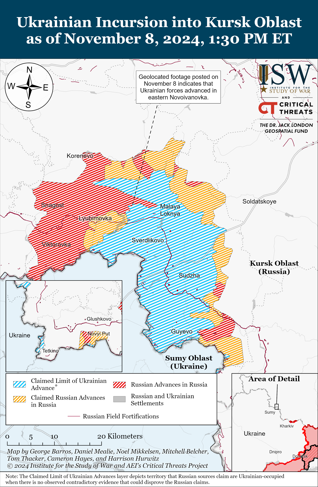
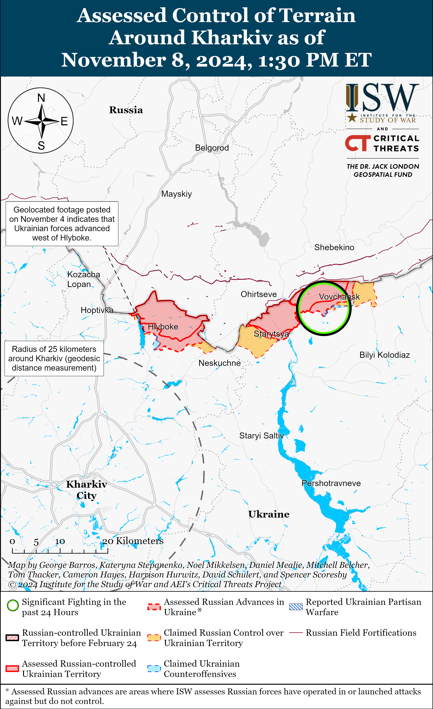
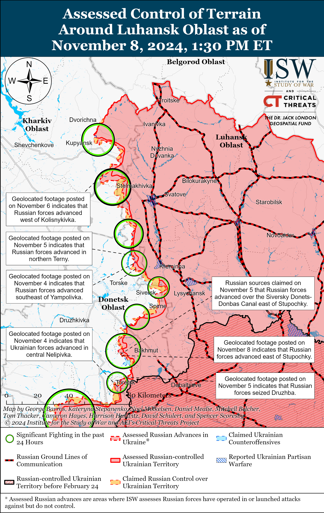
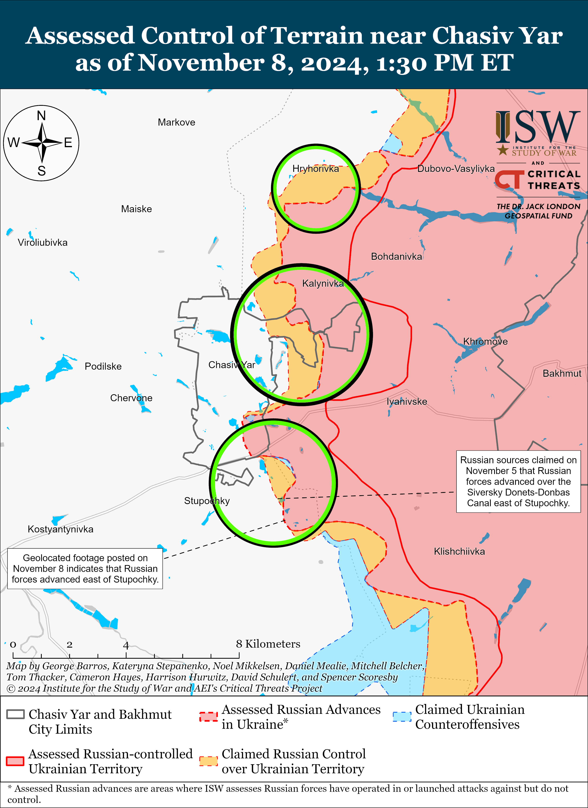
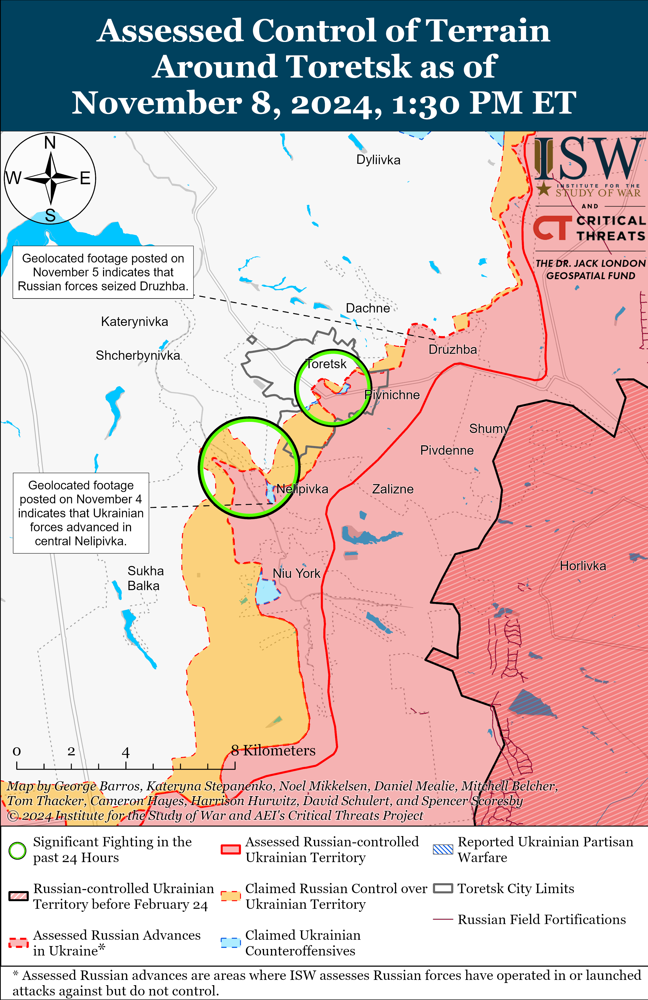
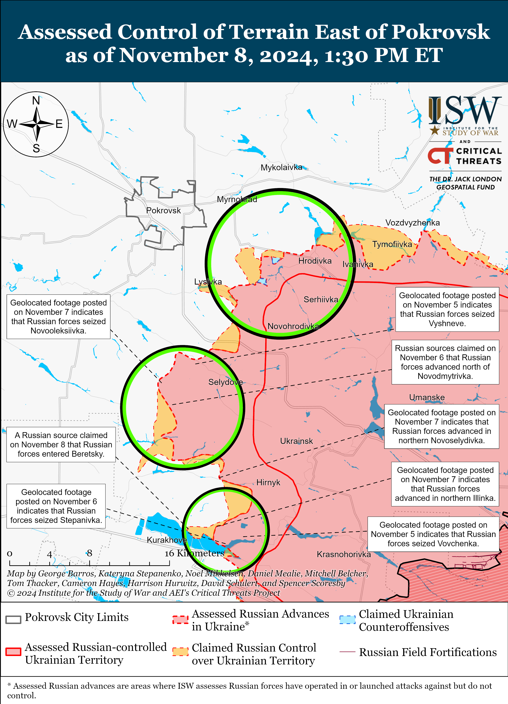
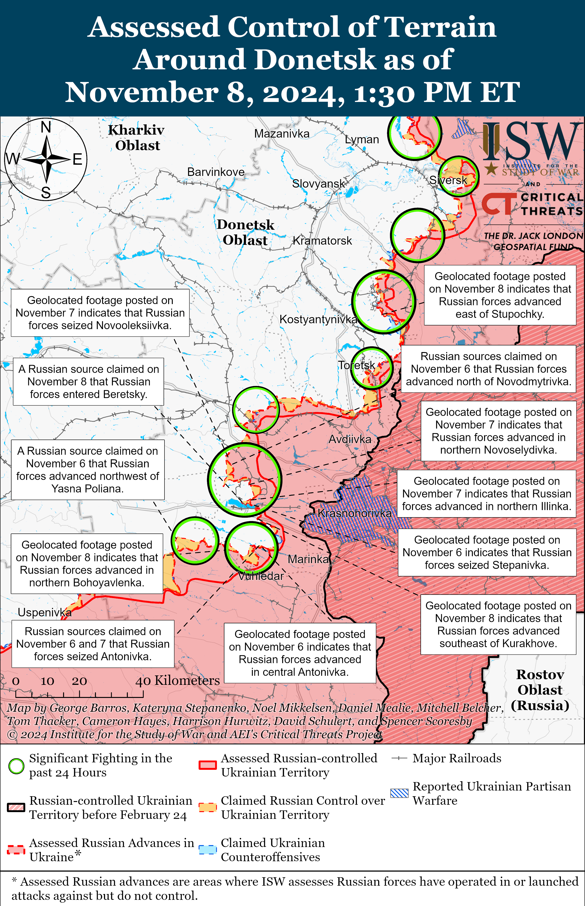
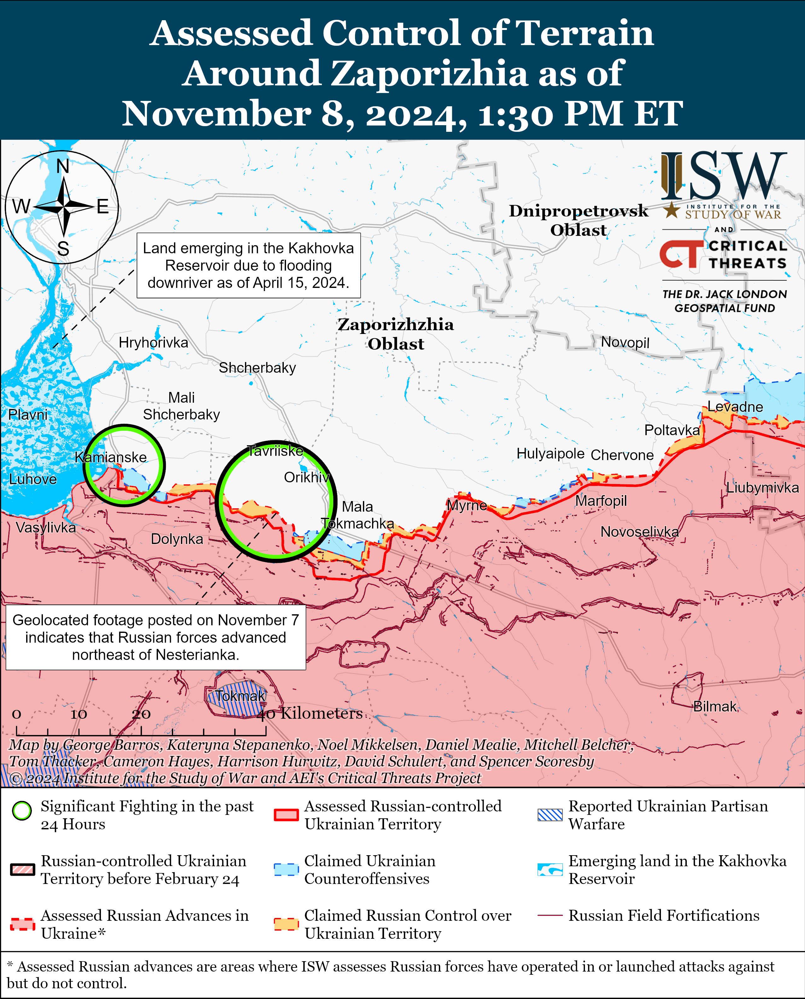
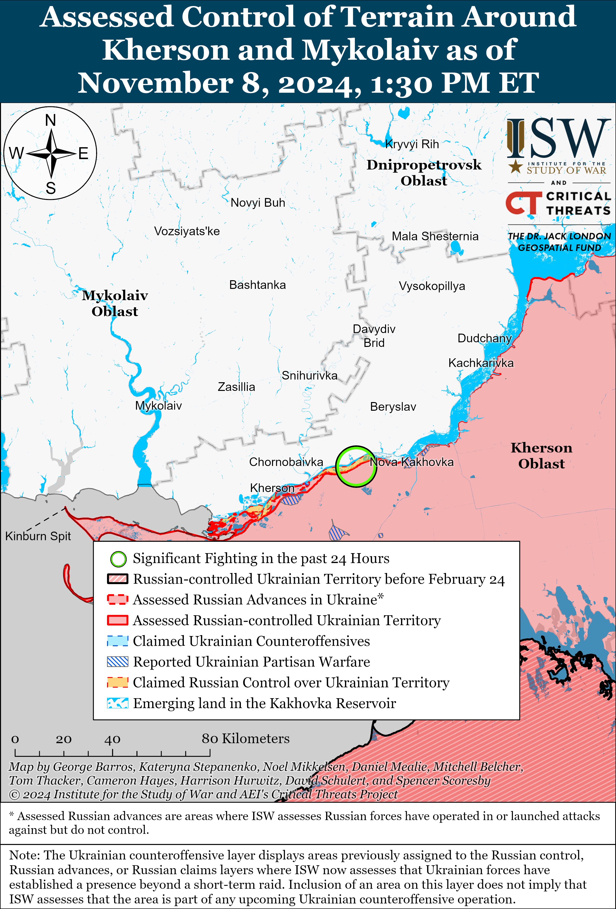

# Russian Offensive Campaign Assessment, November 8, 2024

**November 8, 2024, 7:15pm ET**

**Click** [**here**](https://storymaps.arcgis.com/stories/36a7f6a6f5a9448496de641cf64bd375) **to see ISW’s interactive map of the Russian invasion of Ukraine. This map is updated daily alongside the static maps present in this report.**

**Click** [**here**](https://storymaps.arcgis.com/stories/83a2f24901c941d581c0c523ecd2619b) **to see ISW's interactive map of Ukraine's offensive in Kursk Oblast.**

**Click** [**here**](https://understandingwar.maps.arcgis.com/apps/instant/3dviewer/index.html?appid=1602762dbcde419bb957dea358449580) **to see ISW’s 3D control of terrain topographic map of Ukraine. Use of a computer (not a mobile device) is strongly recommended for using this data-heavy tool.**

**Click** [**here**](https://storymaps.arcgis.com/stories/733fe90805894bfc8562d90b106aa895) **to access ISW’s archive of interactive time-lapse maps of the Russian invasion of Ukraine. These maps complement the static control-of-terrain map that ISW produces daily by showing a dynamic frontline. ISW will update this time-lapse map archive monthly.**

**Note: The data cut-off for this product was 12:30pm ET on November 8. ISW will cover subsequent reports in the November 9 Russian Offensive Campaign Assessment.**

**Russian President Vladimir Putin appears to be assuming that US President-elect Donald Trump will defer to the Kremlin's interests and preferences without the Kremlin offering any concessions or benefits in return.** Putin stated during his November 7 Valdai Club address that he is open to discussions meant to "restore" US-Russia relations but that the United States must initiate these negotiations, and implied that Russia will only consider a reset in US-Russia relations if the United States drops sanctions against Russia and ceases supporting Ukraine – terms that exclusively benefit Russia and offer no benefit to the United States.[[1]](#_ednb0730230515c1baf2427598a70ffeb7c1) Kremlin Spokesperson Dmitry Peskov noted on November 8 that Putin's statement about negotiating with the United States does not mean that Russia's military goals in Ukraine have changed and that instead, Russia's goals remain the same.[[2]](#_ednb0730230515c1baf2427598a70ffeb7c2) Putin may be attempting to posture himself as reaching out to Trump, but Putin is signaling to his domestic audiences that the Kremlin is unwilling to concede any aspect of its maximalist objectives in Ukraine or the wider global arena**.**

Russian opposition outlet *Meduza* reported that the Kremlin issued a manual to state and pro-Kremlin media with instructions to cover Putin's Valdai statements by highlighting the special role Russia plays in bringing about a proposed "new world order" and portraying Putin as the "world's greatest leader" whose deep thinking, "breadth of political thought," and role as the "voice of the global majority and new world order" distinguish him from Western political leaders, presumably including Trump.[[3]](#_ednb0730230515c1baf2427598a70ffeb7c3) *Meduza* noted that, by contrast, the manual does not mention reporting Putin's statements about Trump or possible future negotiations with the United States about the war in Ukraine, even though Putin largely aimed his Valdai statements at shaping Trump's foreign policy and achieving another reset in US-Russian relations on Russia's terms.[[4]](#_ednb0730230515c1baf2427598a70ffeb7c4)

**Putin's proposed "new world order" emphasizes an interconnected international system without great powers or security blocs, but the Kremlin's actions contradict and undermine his proposed ideals and principles.** Putin presented a six-point plan for his "new world order," which includes: an openness among states to interact with each other; the absence of universal dogmas; an accounting for all countries' perspectives when making global decisions; the rejection of security blocs that unite groups of states; "justice for all," including eradicating xenophobia and intolerance; and the "sovereign equality" of all states.[[5]](#_ednb0730230515c1baf2427598a70ffeb7c5) Putin's proposal ignores the Kremlin's ongoing efforts to increase its power and influence in neighboring countries, including destabilization efforts in Moldova and Georgia; courting a group of anti-Western states such as North Korea, the People's Republic of China (PRC), and Iran; and conducting its illegal and unprovoked war of aggression in Ukraine.[[6]](#_ednb0730230515c1baf2427598a70ffeb7c6) The Kremlin likely aims to use this rhetoric to distract from and provide plausible deniability against the very real Russian efforts to undermine pro-Western governments and exert its influence internationally, as well as promote the expansion of BRICS and the so-called "new Eurasian security architecture" that the Kremlin has created to oppose NATO.

**Putin also acknowledged that Russia is dealing with a serious labor shortage and is largely reliant on migrants to address it.** Putin stated during his speech at the Valdai Club that one of the main obstacles to Russia's economic growth is Russia's ongoing labor shortages.[[7]](#_ednb0730230515c1baf2427598a70ffeb7c7) Putin stated that Russia currently has half a million people employed in the construction industry and that the industry could accommodate another 600,000 workers without "even notic[ing]." Putin stated that the construction industry currently needs at least 250,000 additional workers but noted that Russia must first create the conditions for migrants to successfully assimilate into Russian society in order to avoid "irritation" in Russian society between migrants and ethnic Russians. Putin stated that Russia should ensure that migrants who move to Russia can speak Russian and are educated and "well-trained professionals" who are knowledgeable about and compliant with Russian laws and traditions.

Russian authorities and ultranationalist voices routinely vilify migrants, particularly Central Asian migrants, as "dangerous" and unwilling to assimilate into Russian society despite Russia's reliance on these migrants to address its labor and force generation needs.[[8]](#_ednb0730230515c1baf2427598a70ffeb7c8) Putin appears to be acknowledging domestic concern about migrant assimilation while justifying Russia's continued need to import labor from abroad, although Russian authorities have consistently struggled to balance placating xenophobia in Russian society with protecting and welcoming the migrant labor that Russia desperately needs.[[9]](#_ednb0730230515c1baf2427598a70ffeb7c9) Russia is unlikely to overcome its labor shortages in the near future unless the Kremlin approves significant changes to Russia's migration and labor laws and facilitates greater acceptance of migrants in Russian society or curtails its manpower requirements for and losses in its invasion of Ukraine.

**Putin doubled down on an existing information operation falsely claiming that Ukraine violated its neutral status in an attempt to justify Russia's illegal and unprovoked invasion of Ukraine.** Putin, answering a question about which borders of Ukraine Russia recognizes, claimed that Russia always recognized Ukraine's borders as defined in the 1991 Ukrainian Declaration of Independence as long as Ukraine agreed to remain neutral, but said that Russia did not agree when Ukraine announced its intent to join NATO.[[10]](#_ednb0730230515c1baf2427598a70ffeb7c10) Putin did not mention, however, that Ukraine's parliament did not vote to abandon Ukraine's neutral status until December 2014 – months after Russia's illegal invasion and annexation of Crimea in February and March 2014 respectively.[[11]](#_ednb0730230515c1baf2427598a70ffeb7c11) Russia also committed to respecting the independence, sovereignty, and existing borders of Ukraine, including Crimea and Donbas, in the 1994 Budapest Memorandum in exchange for the return and decommissioning of Soviet-era nuclear weapons in Ukraine.[[12]](#_ednb0730230515c1baf2427598a70ffeb7c12) Putin also attempted to use Article I of the UN Charter on the right to self-determination to justify Russia's invasions of Crimea in 2014 and broader invasion in 2022, claiming that these occupied areas voted to join Russia.[[13]](#_ednb0730230515c1baf2427598a70ffeb7c13) Russia notably conducted sham annexation referendums in Crimea in 2014 and Donetsk, Luhansk, Zaporizhia, and Kherson oblasts in 2022 under conditions of occupation and intense militarization, using the referendums to create a veneer of legality and local support for Russia's occupation.[[14]](#_ednb0730230515c1baf2427598a70ffeb7c14)

**Putin notably attempted to downplay Russia's burgeoning relationship with North Korea during his November 7 Valdai Club statements, likely in an effort to maintain some semblance of a relationship with South Korea and discourage South Korean support for Ukraine.** Putin responded to a question about the recently ratified Russia-North Korea strategic comprehensive partnership agreement and claimed that it is simply a "return" to a treaty that existed between the Soviet Union and North Korea and that the 2024 agreement represents "nothing new."[[15]](#_ednb0730230515c1baf2427598a70ffeb7c15) Putin also responded to a question about the possibility of joint Russia-North Korea military exercises, asking "Why not?" and noting that the current agreement contains a mutual defense clause that would enable such exercises. Putin then once again repeated that "there is practically nothing new" in the current agreement. Putin's constant characterization of Russia and North Korea's relations as "nothing new" contrasts sharply with the historically unprecedented deployment of up to 12,000 North Korean troops to fight in Russia and recent reports that North Korean troops have already engaged in combat against Ukrainian forces in Kursk Oblast.[[16]](#_ednb0730230515c1baf2427598a70ffeb7c16)

South Korea has recently signaled its possible willingness to increase support for Ukraine given North Korea's explicit alignment with Russia, and Putin likely assessed that it is undesirable for South Korea to militarily support Ukraine.[[17]](#_ednb0730230515c1baf2427598a70ffeb7c17) Putin likely hoped that using the Valdai Club as a platform to downplay Russia's relationship with, and reliance on, North Korea in front of an international audience, including representatives of the Asian-Pacific region, would somewhat assuage South Korea's concerns. While Putin is downplaying this relationship to an international audience, other Kremlin officials are more accurately characterizing the relationship as "unprecedented" and "historic" during engagements with North Korean officials--emphasizing the delicate rhetorical balance that Russia now must strike in order to retain North Korean support without drawing Seoul more directly into the fight.[[18]](#_ednb0730230515c1baf2427598a70ffeb7c18)

**The Kremlin continues to build its relationship with Venezuela as a means of consolidating and expanding its influence in the Western hemisphere.** Russian Deputy Prime Minister Dmitry Chernyshenko met with Venezuelan President Nicolas Maduro and Executive Vice President Delcy Rodriguez in Caracas on November 8 and participated in the 18th meeting of the High-Level Russia-Venezuela Intergovernmental Commission.[[19]](#_ednb0730230515c1baf2427598a70ffeb7c19) Chernyshenko and Maduro signed 17 total agreements, including eight strategic-level agreements that will be in force until 2030.[[20]](#_ednb0730230515c1baf2427598a70ffeb7c20) Several of the signed agreements pertain to shared intelligence-gathering and counter-espionage, as well as the joint development and use of drones and petroleum exploration technologies.[[21]](#_ednb0730230515c1baf2427598a70ffeb7c21) Venezuelan state media notably claimed that Chernyshenko emphasized Russia's willingness to support "the needs of the Venezuelan armed forces with more sophisticated weapons and military equipment," although Russia is very unlikely to be able to supply Venezuela (or any foreign partner) with advanced military technology in the immediate to medium term due to the constraints of Russia's ongoing war in Ukraine.[[22]](#_ednb0730230515c1baf2427598a70ffeb7c22) Chernyshenko also visited a Russian-language education center in Caracas, which a prominent Kremlin-affiliated milblogger claimed shows that Venezuela is eager to promote Russian language study in order to enable long-term Russo-Venezuelan cooperation.[[23]](#_ednb0730230515c1baf2427598a70ffeb7c23)

Russia has long supported Maduro's regime both economically and militarily, in large part to contest US influence in the Western hemisphere and to paint Russia as a competitive and capable global power.[[24]](#_ednb0730230515c1baf2427598a70ffeb7c24) Russia and Venezuela most recently signed a memorandum of understanding (MOU) against unspecified external "coercive measures" in June 2024, which ISW assessed at the time was intended to demonstrate to the United States that Russia holds power in South America.[[25]](#_ednb0730230515c1baf2427598a70ffeb7c25) Venezuela also extradited two Colombian citizens who fought with the Ukrainian Armed Forces in August 2024 on Russia's behalf, further demonstrating the alignment between the Maduro and Putin regimes.[[26]](#_ednb0730230515c1baf2427598a70ffeb7c26)

**The Ukrainian General Staff reported on November 8 that Ukrainian forces recorded 323 cases of Russian forces using ammunition equipped with chemical agents banned by the Chemical Weapons Convention (CWC) in October 2024 alone.[[27]](#_ednb0730230515c1baf2427598a70ffeb7c27)** The Ukrainian General Staff reported that Russian forces continue to use banned chemical agents, including grenades and other ammunition filled with harmful but not necessarily lethal riot control agents (RCAs), against Ukrainian forces, and that a significant portion of these weapons contain unidentified chemical compounds. The use of RCAs in combat is a violation of the CWC, to which Russia is a signatory.[[28]](#_ednb0730230515c1baf2427598a70ffeb7c28) ISW has consistently reported on Russian forces using chemical substances in combat that are banned by the CWC.[[29]](#_ednb0730230515c1baf2427598a70ffeb7c29)

**Key Takeaways:**

- **Russian President Vladimir Putin appears to be assuming that US President-elect Donald Trump will defer to the Kremlin's interests and preferences without the Kremlin offering any concessions or benefits in return.**
- **Putin's proposed "new world order" emphasizes an interconnected international system without great powers or security blocs, but the Kremlin's actions contradict and undermine his proposed ideals and principles.**
- **Putin also acknowledged that Russia is dealing with a serious labor shortage and is largely reliant on migrants to address it.**
- **Putin doubled down on an existing information operation falsely claiming that Ukraine violated its neutral status in an attempt to justify Russia's illegal and unprovoked invasion of Ukraine.**
- **Putin notably attempted to downplay Russia's burgeoning relationship with North Korea during his November 7 Valdai Club statements, likely in an effort to maintain some semblance of a relationship with South Korea and discourage South Korean support for Ukraine.**
- **The Kremlin continues to build its relationship with Venezuela as a means of consolidating and expanding its influence in the Western hemisphere.**
- **The Ukrainian General Staff reported on November 8 that Ukrainian forces recorded 323 cases of Russian forces using ammunition equipped with chemical agents banned by the Chemical Weapons Convention (CWC) in October 2024 alone.**
- **Ukrainian forces recently advanced in northern Novoivanovka, Kursk Oblast.**
- **Russian forces recently advanced south of Chasiv Yar, southeast of Kurakhove, and north of Vuhledar.**
- **Regional Russian authorities continued to promote the expansion of newly established regional territorial defense formations by highlighting efforts to recruit women.**

***We do not report in detail on Russian war crimes because these activities are well-covered in Western media and do not directly affect the military operations we are assessing and forecasting. We will continue to evaluate and report on the effects of these criminal activities on the Ukrainian military and the Ukrainian population and specifically on combat in Ukrainian urban areas. We utterly condemn Russian violations of the laws of armed conflict and the Geneva Conventions and crimes against humanity even though we do not describe them in these reports.***

- Ukrainian Operations in the Russian Federation
- Russian Main Effort – Eastern Ukraine (comprised of three subordinate main efforts)
- Russian Subordinate Main Effort #1 – Push Ukrainian forces back from the international border with Belgorod Oblast and approach to within tube artillery range of Kharkiv City
- Russian Subordinate Main Effort #2 – Capture the remainder of Luhansk Oblast and push westward into eastern Kharkiv Oblast and encircle northern Donetsk Oblast
- Russian Subordinate Main Effort #3 – Capture the entirety of Donetsk Oblast
- Russian Supporting Effort – Southern Axis
- Russian Air, Missile, and Drone Campaign
- Russian Mobilization and Force Generation Efforts
- Russian Technological Adaptations
- Activities in Russian-occupied areas
- Significant Activity in Belarus

**Ukrainian Operations in the Russian Federation**

Ukrainian forces recently advanced on the northwestern edge of the main Ukrainian salient in Kursk Oblast amid reports of intensified Russian offensive operations along the salient on November 8. Geolocated footage published on November 8 indicates that Ukrainian forces marginally advanced to a windbreak in northern Novoivanovka (southeast of Korenevo).[[30]](#_ednb0730230515c1baf2427598a70ffeb7c30) Several Russian milbloggers claimed that Russian forces have intensified their attacks in Korenevsky Raion (the northwestern part of the salient), although others claimed that the frontline has remained largely unchanged despite increased fighting.[[31]](#_ednb0730230515c1baf2427598a70ffeb7c31) Russian milbloggers claimed that the fighting is particularly heavy in and near Novoivanovka and near Darino (also southeast of Korenevo) and that Russian forces advanced on the southern outskirts of Plekhovo (southeast of Sudzha).[[32]](#_ednb0730230515c1baf2427598a70ffeb7c32) Russian sources, including the Russian Ministry of Defense (MoD), claimed that fighting continues southeast of Korenevo near Darino, Nikolaevo-Darino, Novoivanovka, and Zeleny Shlyakh and north of Sudzha near Pogrebki, Malaya Loknya, and Staraya Sorochina.[[33]](#_ednb0730230515c1baf2427598a70ffeb7c33) The Russian MoD also claimed that Russian forces repelled a Ukrainian attack in Glushkovsky Raion (west of the main salient in Kursk Oblast) near Novy Put (southwest of Glushkovo).[[34]](#_ednb0730230515c1baf2427598a70ffeb7c34) Elements of the 51st Airborne (VDV) Regiment (106th VDV Division) reportedly advanced into Darino and are fighting in and near the settlement.[[35]](#_ednb0730230515c1baf2427598a70ffeb7c35)

Units of Ukraine's Main Military Intelligence Directorate (GUR) conducted a drone strike against an oil refinery in Saratov Oblast on the night of November 7 to 8, reportedly damaging the refinery's infrastructure.[[36]](#_ednb0730230515c1baf2427598a70ffeb7c36) Social media footage from the night of November 7 to 8 shows a fire near the Saratov Oblast Oil Refinery in Saratov Oblast's Zavodsky Raion.[[37]](#_ednb0730230515c1baf2427598a70ffeb7c37) A local Saratov Oblast Telegram channel claimed that debris from a downed Ukrainian drone fell on a fuel oil tank and a special installation at the refinery.[[38]](#_ednb0730230515c1baf2427598a70ffeb7c38) The Saratov Oil Refinery is a subsidiary of Russian state oil company Rosneft and reportedly produces seven million tons of oil per year.[[39]](#_ednb0730230515c1baf2427598a70ffeb7c39)

**Russian Main Effort – Eastern Ukraine**

**Russian Subordinate Main Effort #1 – Kharkiv Oblast** **(Russian objective: Push Ukrainian forces back from the international border with Belgorod Oblast and approach to within tube artillery range of Kharkiv City)**

Russian forces continued offensive operations northeast of Kharkiv City near Vovchansk on November 7 and 8 but did not advance.[[40]](#_ednb0730230515c1baf2427598a70ffeb7c40) Elements of the Rosgvardia’s 116th Special Purpose Brigade are reportedly operating near Vovchansk.[[41]](#_ednb0730230515c1baf2427598a70ffeb7c41)

**Russian Subordinate Main Effort #2 – Luhansk Oblast (Russian objective: Capture the remainder of Luhansk Oblast and push westward into eastern Kharkiv Oblast and northern Donetsk Oblast)**

Russian forces continued offensive operations along the Kupyansk-Svatove-Kreminna line on November 7 and 8 but did not advance. Russian sources claimed that Russian forces captured a windbreak near Kucherivka and a railway station and a Ukrainian position near Petropavlivka (both east of Kupyansk), and advanced to a forested area near Kolisnykivka (southeast of Kupyansk), but ISW has not observed visual confirmation supporting these claims.[[42]](#_ednb0730230515c1baf2427598a70ffeb7c42) The spokesperson for a Ukrainian brigade operating in the Kupyansk area stated that Russian forces are limiting their use of armored vehicles and tanks in the Kupyansk direction but are frequently conducting infantry assaults and that worsening weather conditions are decreasing Russian aviation operations and the frequency of Russian guided glide bomb strikes in this direction.[[43]](#_ednb0730230515c1baf2427598a70ffeb7c43) Russian milbloggers also claimed that Russian forces advanced towards Zelenyi Hai and Kopanky (both west of Svatove) and further into Terny (west of Kreminna), but ISW has not observed visual confirmation of these claims.[[44]](#_ednb0730230515c1baf2427598a70ffeb7c44) Russian forces continued offensive operations northeast of Kupyansk near Kindrashivka; east of Kupyansk near Petropavlivka; southeast of Kupyansk near Kolisnykivka, Kruhlyakivka, Zahryzove, and Berestove; northwest of Svatove near Lozova; west of Svatove near Vyshneve and Pershotravneve; southwest of Svatove near Druzhelyubivka, Hrekivka, Makiivka, and Katerynivka; northwest of Kreminna near Terny; west of Kreminna near Zarichne and Torske; and south of Kreminna near Serebryanka and Hryhorivka on November 7 and 8.[[45]](#_ednb0730230515c1baf2427598a70ffeb7c45) Drone operators of the Russian 144th Motorized Rifle Division (20th Combined Arms Army [CAA], Moscow Military District [MMD]) are reportedly operating in the Lyman direction.[[46]](#_ednb0730230515c1baf2427598a70ffeb7c46)

**Russian Subordinate Main Effort #3 – Donetsk Oblast (Russian objective: Capture the entirety of Donetsk Oblast, the claimed territory of Russia’s proxies in Donbas)**

Russian forces continued assaults northeast of Siversk near Bilohorivka, southeast of Siversk near Vyimka, and south of Siversk near Pereizne on November 7 and 8, but there were no confirmed changes to the frontline.[[47]](#_ednb0730230515c1baf2427598a70ffeb7c47) A Russian milblogger claimed that Russian forces recently advanced north of Ivano-Darivka (southeast of Siversk), but ISW has not observed visual confirmation of this claim.[[48]](#_ednb0730230515c1baf2427598a70ffeb7c48) Elements of the Russian 123rd Motorized Rifle Brigade (3rd Combined Arms Army [CAA], formerly 2nd Luhansk People's Republic Army Corps [LNR AC]) are reportedly operating southeast of Siversk near Spirne and Vyimka, and elements of the 2nd Artillery Brigade (3rd CAA) and the "Sumrak" Battalion are reportedly operating in the Siversk direction.[[49]](#_ednb0730230515c1baf2427598a70ffeb7c49)

Russian forces recently advanced south of Chasiv Yar amid continued offensive operations near Chasiv Yar on November 8. Geolocated footage published on November 8 indicates that Russian forces recently advanced to the northern area of a mine east of Stupochky (south of Chasiv Yar).[[50]](#_ednb0730230515c1baf2427598a70ffeb7c50) Russian milbloggers claimed that elements of the Russian 6th Motorized Rifle Brigade (3rd CAA) seized the mine and crossed a section of the Siverskyi-Donets Donbas canal southwest of Klishchiivka (southeast of Chasiv Yar).[[51]](#_ednb0730230515c1baf2427598a70ffeb7c51) Russian milbloggers also claimed that small Russian infantry units advanced roughly three kilometers in total along Chasiv Yar's northern and southern flanks.[[52]](#_ednb0730230515c1baf2427598a70ffeb7c52) ISW has not observed visual confirmation of these claims, however. Russian forces continued offensive operations north of Chasiv Year near Bondarne, within Chasiv Yar itself, and south of Chasiv Year near Bila Hora and Stupochky on November 7 and 8.[[53]](#_ednb0730230515c1baf2427598a70ffeb7c53)

Russian forces continued offensive operations near Toretsk and southwest of Toretsk in the direction of Shcherbynivka on November 7 and 8, but there were no confirmed changes to the frontline.[[54]](#_ednb0730230515c1baf2427598a70ffeb7c54) Elements of the Russian 132nd Motorized Rifle Brigade (51st CAA, formerly 1st Donetsk People's Republic [DNR] AC) are reportedly operating in Toretsk.[[55]](#_ednb0730230515c1baf2427598a70ffeb7c55)

Russian forces continued offensive operations in the Pokrovsk direction on November 8, but there were no confirmed changes to the frontline. Russian milbloggers claimed that Russian forces advanced east of Pokrovsk near Novooleksandrivka, southeast of Pokrovsk near Selydove, and west of Selydove into Hryhorivka and towards Petrivka and Yurivka.[[56]](#_ednb0730230515c1baf2427598a70ffeb7c56) One Russian milblogger claimed that Russian forces advanced up to 400 meters in the direction of Yurivka.[[57]](#_ednb0730230515c1baf2427598a70ffeb7c57) ISW has not observed visual confirmation of these claims. Russian forces continued assaults east of Pokrovsk near Myrolyubivka, Novotoretske, Promin, and Krutyi Yar and southeast of Pokrovsk near Sukyi Yar, Lysivka, Selydove, Hyrhorivka, and Vyshneve on November 7 and 8.[[58]](#_ednb0730230515c1baf2427598a70ffeb7c58)

Russian forces recently marginally advanced southeast of Kurakhove amid continued offensive operations in the Kurakhove direction on November 8. Geolocated footage published on November 8 indicates that Russian forces recently marginally advanced along the H-15 Kurakhove-Zaporizhzhia City highway during a platoon-sized mechanized assault southeast of Kurakhove.[[59]](#_ednb0730230515c1baf2427598a70ffeb7c59) The spokesperson of a Ukrainian brigade operating in the Kurakhove direction stated that Russian forces are attacking Kurakhove from the north and south and that Russian forces are intensifying their rate of attacks despite the onset of poor weather conditions.[[60]](#_ednb0730230515c1baf2427598a70ffeb7c60) Russian milbloggers claimed that Russian forces advanced northwest of Kurakhove towards Zorya and into central Sontsivka, north of Kurakhove near Novoselydivka and Voznesenka, and along the northern bank of the Kurakhivske Reservoir near Illinka and into Berestky.[[61]](#_ednb0730230515c1baf2427598a70ffeb7c61) Russian sources also reiterated claims that Russian forces seized Kreminna Balka (north of Kurakhove).[[62]](#_ednb0730230515c1baf2427598a70ffeb7c62) ISW has not observed visual confirmation of these claims, however. Russian forces continued offensive operations northwest of Kurakhove near Sonstivka and north of Kurakhove near Novodmytrivka, Novoselydivka, Voznesenka, Kreminna Balka, Illinka, and Berestky and in the direction of Stari Terny on November 7 and 8.[[63]](#_ednb0730230515c1baf2427598a70ffeb7c63) An assault company of the Russian "Borz" Battalion (Redut private military company [PMC]) is reportedly operating near Zoryane (northeast of Kurakhove).[[64]](#_ednb0730230515c1baf2427598a70ffeb7c64)

Russian forces recently advanced north of Vuhledar amid continued offensive operations in the area on November 8. Geolocated footage published on November 8 indicates that elements of the Russian 57th Motorized Rifle Brigade (5th CAA, Eastern Military District [EMD]) recently marginally advanced north of Bohoyavlenka (north of Vuheldar).[[65]](#_ednb0730230515c1baf2427598a70ffeb7c65) A Russian milblogger claimed that two Russian armored vehicles advanced roughly 1.6 kilometers north of Bohoyavlenka and that elements of the Russian 39th Motorized Rifle Brigade (68th AC, EMD) also advanced in a nearby forested area northeast of Bohoyavlenka.[[66]](#_ednb0730230515c1baf2427598a70ffeb7c66) Several Russian milbloggers claimed that Russian forces advanced 600 meters northeast of Vuhledar and in an area up to 6.3 kilometers wide and two kilometers in depth north of Yasna Polyana and east of Maksymivka (both northwest of Vuhledar).[[67]](#_ednb0730230515c1baf2427598a70ffeb7c67) Russian forces continued assaults northeast of Vuhledar near Antonivka, Katerynivka, and Yelizavetivka; north of Vuhledar near Bohoyavlenka and Trudove; and northwest of Vuhledar near Maksymivka, Sukhyi Yaly, and Rozlyv on November 7 and 8.[[68]](#_ednb0730230515c1baf2427598a70ffeb7c68)

Elements of the Russian 60th Motorized Rifle Brigade (5th CAA, EMD) are reportedly operating near Pryyutne (southwest of Velyka Novosilka) in the Donetsk-Zaporizhia Oblast border area.[[69]](#_ednb0730230515c1baf2427598a70ffeb7c69)

   

**Russian Supporting Effort – Southern Axis (Russian objective: Maintain frontline positions and secure rear areas against Ukrainian strikes)**

Positional fighting continued in western Zaporizhia Oblast near Novoandriivka (northwest of Robotyne) on November 8, but there were no confirmed changes to the frontline.[[70]](#_ednb0730230515c1baf2427598a70ffeb7c70) Drone operators of the Russian 38th Motorized Rifle Brigade (35th Combined Arms Army [CAA], Eastern Military District [EMD]) reportedly continue to operate in the Polohy (eastern Zaporizhia Oblast) direction.[[71]](#_ednb0730230515c1baf2427598a70ffeb7c71)

Positional fighting continued in the Dnipro direction in east (left) bank Kherson Oblast on November 8, but there were no confirmed changes to the frontline.[[72]](#_ednb0730230515c1baf2427598a70ffeb7c72) Some Russian milbloggers claimed that five unspecified Russian units have requested funds to purchase boats for continued operations in the Dnipro River area and that Russian forces continue to struggle with boat shortages.[[73]](#_ednb0730230515c1baf2427598a70ffeb7c73)

 

**Russian Air, Missile, and Drone Campaign (Russian Objective: Target Ukrainian military and civilian infrastructure in the rear and on the frontline)**

Russian forces conducted missile and drone strikes against Ukraine overnight on November 7 to 8. The Ukrainian Air Force reported that Russian forces launched one Iskander-M ballistic missile from Rostov Oblast; four Kh-59/69 cruise missiles from the airspace over Belgorod Oblast; and 92 Shaheds and other unspecified strike drones from Primorsko-Akhtarsk, Krasnodar Krai, occupied Crimea, and Kursk and Oryol oblasts overnight.[[74]](#_ednb0730230515c1baf2427598a70ffeb7c74) The Air Force reported that Ukrainian forces shot down all four Kh-59/69s and 62 strike drones over Odesa, Mykolaiv, Kyiv, Sumy, Kharkiv, Poltava, Kirovohrad, Zhytomyr, Chernihiv, Dnipropetrovsk, Khmelnytskyi, and Ivano-Frankivsk oblasts; that 26 drones became "lost," likely due to Ukrainian electronic warfare (EW) interference; and that one drone remained in Ukrainian airspace as of 0900 local time. Ukrainian officials reported that a Russian ballistic missile struck civilian infrastructure in Sumy Oblast, falling debris from another missile damaged residential areas in Kyiv City, and other drones and missiles damaged infrastructure in Kharkiv, Odesa, and Khmelnytskyi oblasts.[[75]](#_ednb0730230515c1baf2427598a70ffeb7c75) Kharkiv City and Oblast authorities reported that Russian forces conducted a glide bomb strike on residential areas of Kharkiv City on the morning of November 8, injuring at least 25 people.[[76]](#_ednb0730230515c1baf2427598a70ffeb7c76)

**Russian Mobilization and Force Generation Efforts (Russian objective: Expand combat power without conducting general mobilization)**

Regional Russian authorities continued to promote the expansion of newly established regional territorial defense formations by highlighting efforts to recruit women. Belgorod Oblast Governor Vyacheslav Gladkov claimed on November 8 that three women recently enlisted with the newly formed BARS-Belgorod volunteer detachment.[[77]](#_ednb0730230515c1baf2427598a70ffeb7c77) Russian authorities formally announced the creation of BARS-Belgorod on September 5 and have since tried to highlight the formation to boost recruitment.[[78]](#_ednb0730230515c1baf2427598a70ffeb7c78) The promotion of female recruitment into Russian volunteer units follows a recent trend whereby Russian forces have recruited women from Russian prisons and areas of occupied Ukraine to fight in the Russian military.[[79]](#_ednb0730230515c1baf2427598a70ffeb7c79) ISW previously assessed that Russia's commitment to enforcing traditional gender roles was limiting Russia's ability to mobilize portions of Russian society, and increased efforts to recruit women to fill military roles may be an indicator of widening Russian personnel shortages.[[80]](#_ednb0730230515c1baf2427598a70ffeb7c80)

Russian authorities continue efforts to highlight specialist training facilities and integrate technologies into the Russian fighting force. A Russian milblogger posted footage on November 8 purporting to show a Serbian volunteer who is part of the Russian Armed Forces receiving specialized drone pilot training at the "Republican Center of Unmanned Systems" training center in occupied Donetsk Oblast.[[81]](#_ednb0730230515c1baf2427598a70ffeb7c81) The drone center opened in early 2022 and aims to train Russian military personnel in the operation of drones and drone technologies.[[82]](#_ednb0730230515c1baf2427598a70ffeb7c82) Russian military authorities may be leveraging such training centers to build out Russian forces' technological capabilities following recent reports of Russian drone pilots being needlessly punished and assigned to Russian infantry assault units.[[83]](#_ednb0730230515c1baf2427598a70ffeb7c83)

Independent Russian language media reported that the increasing economic constraints caused by Russia's war effort are distorting the Russian domestic economy, creating a new middle class of Russian war industry workers. *Idel Realii* reported on November 8 that Russian military employees, factory workers, information technology (IT) workers, and warehouse employees are earning more than double the national average monthly salary (roughly 100,000 rubles [$1,025] by *Idel Realii*'*s* estimates) and that this dynamic is particularly prevalent in industrial hubs such as the Republics of Tatarstan and Bashkortostan.[[84]](#_ednb0730230515c1baf2427598a70ffeb7c84) *Idel Realii* noted, for example, that the average salary for the manufacturing sector in Tatarstan rose 66 percent compared to 2021, likely due to increased salaries for military and dual-use manufacturing personnel.[[85]](#_ednb0730230515c1baf2427598a70ffeb7c85) ISW recently reported that Russia's excessive military spending has driven wages in various industry sectors to unprecedented levels and assessed that Russia cannot sustain this period of economic over-drive indefinitely.[[86]](#_ednb0730230515c1baf2427598a70ffeb7c86)

**Russian Technological Adaptations** **(Russian objective: Introduce technological innovations to optimize systems for use in Ukraine)**

A Russian milblogger claimed on November 8 that newly modernized versions of the Russian TOS-1A “Solntsepok" and TOS-2 "Tosochka" thermobaric artillery systems have improved firepower, range, armor, and process automation features.[[87]](#_ednb0730230515c1baf2427598a70ffeb7c87) The upgraded systems reportedly have fire capabilities comparable to Iskander ballistic missile systems.

**Activities in Russian-occupied areas (Russian objective: Consolidate administrative control of annexed areas; forcibly integrate Ukrainian citizens into Russian sociocultural, economic, military, and governance systems)**

*ISW is not reporting on activities in Russian-occupied areas today.*

**Significant activity in Belarus** **(Russian efforts to increase its military presence in Belarus and further integrate Belarus into Russian-favorable frameworks and Wagner Group activity in Belarus)**

Nothing significant to report.

**Note: ISW does not receive any classified material from any source, uses only publicly available information, and draws extensively on Russian, Ukrainian, and Western reporting and social media as well as commercially available satellite imagery and other geospatial data as the basis for these reports. References to all sources used are provided in the endnotes of each update.**

[[1]](#_ednb0730230515c1baf2427598a70ffeb7cref1) http://kremlin dot ru/events/president/news/75521

[[2]](#_ednb0730230515c1baf2427598a70ffeb7cref2) <https://www.interfax> dot ru/russia/990786; <https://tass> dot ru/politika/22352497

[[3]](#_ednb0730230515c1baf2427598a70ffeb7cref3) <https://meduza> dot io/feature/2024/11/08/sobytie-goda-v-sfere-idey-i-smyslov

[[4]](#_ednb0730230515c1baf2427598a70ffeb7cref4) https://www.understandingwar.org/backgrounder/russian-offensive-campaign-assessment-november-7-2024

[[5]](#_ednb0730230515c1baf2427598a70ffeb7cref5) http://kremlin dot ru/events/president/news/75521

[[6]](#_ednb0730230515c1baf2427598a70ffeb7cref6) <https://www.understandingwar.org/backgrounder/north-korea-joins-russias-war-against-ukraine-operational-and-strategic-implications>; <https://www.understandingwar.org/backgrounder/pro-russia-georgian-dream-party-likely-wins-parliamentary-elections>; <https://www.understandingwar.org/backgrounder/russia-or-west-stakes-georgia%E2%80%99s-election>; <https://www.understandingwar.org/backgrounder/russia-poses-long-term-threats-moldova%E2%80%99s-european-integration-beyond-october-elections>; https://www.understandingwar.org/backgrounder/kremlins-occupation-playbook-coerced-russification-and-ethnic-cleansing-occupied

[[7]](#_ednb0730230515c1baf2427598a70ffeb7cref7) <http://kremlin> dot ru/events/president/news/75521

[[8]](#_ednb0730230515c1baf2427598a70ffeb7cref8) <https://understandingwar.org/backgrounder/russian-offensive-campaign-assessment-november-1-2024> ; https://isw.pub/UkrWar071924 ; https://isw.pub/UkrWar071524 ; https://isw.pub/UkrWar062824 ; https://isw.pub/UkrWar06272024 ; https://isw.pub/UkrWar041024; https://understandingwar.org/backgrounder/russian-offensive-campaign-assessment-october-25-2024 ; <https://www.understandingwar.org/backgrounder/russian-offensive-campaign-assessment-october-27-2024>

[[9]](#_ednb0730230515c1baf2427598a70ffeb7cref9) https://isw.pub/UkrWar071924 ; https://isw.pub/UkrWar071524 ; https://isw.pub/UkrWar062824 ; https://isw.pub/UkrWar06272024 ; https://isw.pub/UkrWar041024

[[10]](#_ednb0730230515c1baf2427598a70ffeb7cref10) <http://kremlin> dot ru/events/president/news/75521

[[11]](#_ednb0730230515c1baf2427598a70ffeb7cref11) https://www.rferl.org/a/ukraine-parliament-abandons-neutrality/26758725.html

[[12]](#_ednb0730230515c1baf2427598a70ffeb7cref12) https://treaties.un.org/doc/Publication/UNTS/Volume%203007/Part/volume-3007-I-52241.pdf

[[13]](#_ednb0730230515c1baf2427598a70ffeb7cref13) <http://kremlin> dot ru/events/president/news/75521

[[14]](#_ednb0730230515c1baf2427598a70ffeb7cref14) <https://www.understandingwar.org/sites/default/files/24-210-01%20ISW%20Occupation%20playbook.pdf>; <https://www.understandingwar.org/backgrounder/russian-offensive-campaign-assessment-september-20>; <https://understandingwar.org/backgrounder/russian-offensive-campaign-assessment-august-7>; <https://www.understandingwar.org/backgrounder/russian-offensive-campaign-assessment-september-26>; https://www.understandingwar.org/backgrounder/russian-offensive-campaign-assessment-september-23

[[15]](#_ednb0730230515c1baf2427598a70ffeb7cref15) <http://kremlin> dot ru/events/president/news/75521

[[16]](#_ednb0730230515c1baf2427598a70ffeb7cref16) <https://www.understandingwar.org/backgrounder/north-korea-joins-russias-war-against-ukraine-operational-and-strategic-implications>; https://www.defense.gov/News/News-Stories/Article/Article/3955757/pentagon-says-10k-north-korean-troops-in-kursk-oblast/#:~:text=Air%20Force%20Maj.%20Gen.%20Pat%20Ryder%20also%20said%20officials%20estimate,reporters%20during%20a%20news%20conference.

[[17]](#_ednb0730230515c1baf2427598a70ffeb7cref17) https://t.me/DIUkraine/4723; https://news.kbs.co dot kr/news/pc/view/view.do?ncd=8098257

[[18]](#_ednb0730230515c1baf2427598a70ffeb7cref18) https://www.reuters.com/world/north-korean-foreign-minister-arrives-moscow-talks-2024-11-01/; https://t.me/tass\_agency/282969; https://t.me/MID\_Russia/47363; https://t.me/MID\_Russia/47362; <https://t.me/MID_Russia/47354>; https://t.me/MID\_Russia/47363

[[19]](#_ednb0730230515c1baf2427598a70ffeb7cref19) <https://t.me/government_rus/16626>; https://t.me/tass\_agency/283995

[[20]](#_ednb0730230515c1baf2427598a70ffeb7cref20) <https://www.telesurtv> dot net/rusia-sella-alianza-estrategica-con-venezuela-y-firma-acuerdos-hasta-2030/; <https://www.themoscowtimes> dot com/2024/11/08/russia-signs-security-energy-deals-with-venezuela-a86944; <https://www.dw> dot com/es/venezuela-y-rusia-firman-acuerdos-contra-el-espionaje/a-70731042

[[21]](#_ednb0730230515c1baf2427598a70ffeb7cref21) <https://www.themoscowtimes> dot com/2024/11/08/russia-signs-security-energy-deals-with-venezuela-a86944

[[22]](#_ednb0730230515c1baf2427598a70ffeb7cref22) <https://www.dw> dot com/es/venezuela-y-rusia-firman-acuerdos-contra-el-espionaje/a-70731042

[[23]](#_ednb0730230515c1baf2427598a70ffeb7cref23) <https://t.me/rybar/65202>; https://t.me/tass\_agency/284135

[[24]](#_ednb0730230515c1baf2427598a70ffeb7cref24) https://www.iswresearch.org/2019/04/russia-in-review-march-26-april-4-2019.html

[[25]](#_ednb0730230515c1baf2427598a70ffeb7cref25) https://www.understandingwar.org/backgrounder/russian-offensive-campaign-assessment-june-25-2024

[[26]](#_ednb0730230515c1baf2427598a70ffeb7cref26) https://www.politico.eu/article/maduro-putin-russia-arrest-two-colombians-fighting-ukraine-venezuela/; https://www.rbc dot ru/politics/30/08/2024/66d1798e9a7947814c97b3ac; http://www.fsb dot ru/fsb/press/message/single.htm%21id%3D10440067%40fsbMessage.html

[[27]](#_ednb0730230515c1baf2427598a70ffeb7cref27) <https://www.facebook.com/KSP.ZSU/posts/pfbid02pU6YNfodbeJrgyibVuVz3Msi6hsRBkorUtCKy6MVTBgREFXvWu7KzgGZRQ5rM6Yel> ; <https://www.facebook.com/GeneralStaff.ua/posts/pfbid037FpAttfJnE5tJFU4qwt5PbAgtphZVFV4ahKWoi4NMbAdxRg27LH7yzMpSc9DM4ctl> ; <https://t.me/GeneralStaffZSU/18520>

[[28]](#_ednb0730230515c1baf2427598a70ffeb7cref28) https://www.state.gov/imposing-new-measures-on-russia-for-its-full-scale-war-and-use-of-chemical-weapons-against-ukraine-2/; <https://www.understandingwar.org/backgrounder/russian-offensive-campaign-assessment-may-2-2024>

[[29]](#_ednb0730230515c1baf2427598a70ffeb7cref29) <https://isw.pub/UkrWar100924> ; <https://isw.pub/UkrWar100924> ; https://isw.pub/UkrWar122323 ; https://www.understandingwar.org/backgrounder/russian-offensive-campaign-assessment-december-24-2023 ; ; https://isw.pub/UkrWar031124 ; https://isw.pub/UkrWar020924 ; https://isw.pub/UkrWar013024 ; https://isw.pub/UkrWar012524 ; https://isw.pub/UkrWar011324; <https://www.understandingwar.org/backgrounder/russian-offensive-campaign-assessment-april-5-2024>

[[30]](#_ednb0730230515c1baf2427598a70ffeb7cref30) <https://t.me/kryvyirih17otbr/3875;> [https://t.me/creamy\_caprice/74](https://t.me/creamy_caprice/7444)

[[31]](#_ednb0730230515c1baf2427598a70ffeb7cref31) <https://t.me/dva_majors/57099> ; <https://t.me/rybar/65196;> <https://t.me/RVvoenkor/80288> ; <https://t.me/DnevnikDesantnika/18811;> <https://t.me/wargonzo/23019>; <https://t.me/rusich_army/18290;> <https://t.me/rusich_army/18296>

[[32]](#_ednb0730230515c1baf2427598a70ffeb7cref32) <https://t.me/DnevnikDesantnika/18804;> <https://t.me/motopatriot/29291;> <https://t.me/motopatriot/29314;> <https://t.me/motopatriot/29323;> <https://t.me/motopatriot/29295;> <https://t.me/DnevnikDesantnika/18815>

[[33]](#_ednb0730230515c1baf2427598a70ffeb7cref33) <https://t.me/DnevnikDesantnika/18804;> https://t.me/mod\_russia/45485

[[34]](#_ednb0730230515c1baf2427598a70ffeb7cref34) https://t.me/mod\_russia/45485

[[35]](#_ednb0730230515c1baf2427598a70ffeb7cref35) https://t.me/motopatriot/29314

[[36]](#_ednb0730230515c1baf2427598a70ffeb7cref36) [https://suspilne](https://suspilne/) dot media/875255-zelenskij-vidpoviv-na-mirni-idei-trampa-u-zaporizzi-40-ludej-poraneni-vid-udaru-rf-989-den-vijni-onlajn/?anchor=live\_1731061415&utm\_source=copylink&utm\_medium=ps; [https://suspilne](https://suspilne/) dot media/875537-u-rosijskomu-saratovi-vnoci-stalasa-pozeza-ce-robota-gur/

[[37]](#_ednb0730230515c1baf2427598a70ffeb7cref37) <https://t.me/ssternenko/35862;> <https://t.me/astrapress/68017> ; <https://t.me/busargin_r/7467>

[[38]](#_ednb0730230515c1baf2427598a70ffeb7cref38) https://t.me/saratov24ru/32508

[[39]](#_ednb0730230515c1baf2427598a70ffeb7cref39) <https://mil.in> dot ua/uk/news/drony-atakuvaly-rosijskyj-npz-u-saratovi/

[[40]](#_ednb0730230515c1baf2427598a70ffeb7cref40) <https://www.facebook.com/GeneralStaff.ua/posts/pfbid02SurptzsuJSLZvQQKKbGaZpix8mK9FpGHQChY9GiuYQ5h9AWBVVpBSPiUoqa3PYkYl> ; <https://www.facebook.com/GeneralStaff.ua/posts/pfbid02iA2NeZaBYMr2i21fGaofr9mwDsW7nZ6zx7p5ThpnjkUabNS7cpVDzvEyR6HNAeTal> ; <https://www.facebook.com/GeneralStaff.ua/posts/pfbid0YkrBA4qQYuR1qCAXUmxnSVzPrMYCNXA5ZwgzG3K4byweLxJmDepsMNUPuHCz2i7pl> ; https://t.me/otukharkiv/2511

[[41]](#_ednb0730230515c1baf2427598a70ffeb7cref41) https://t.me/motopatriot/29300

[[42]](#_ednb0730230515c1baf2427598a70ffeb7cref42) https://t.me/tass\_agency/284174 ; <https://t.me/tass_agency/284155> ; <https://t.me/rusich_army/18290> ; https://t.me/rusich\_army/18290

[[43]](#_ednb0730230515c1baf2427598a70ffeb7cref43) https://www.youtube.com/watch?v=j5TqaWCCdUg ; https://armyinform.com dot ua/2024/11/08/staye-prostishe-zastosuvannya-aviacziyi-zmenshuyetsya-z-pogirshennyam-pogody-odnak-pihotni-shturmy-rf-tryvayut-non-stop/

[[44]](#_ednb0730230515c1baf2427598a70ffeb7cref44) https://t.me/motopatriot/29305 ; https://t.me/dva\_majors/57099 ; https://t.me/rybar/65196

[[45]](#_ednb0730230515c1baf2427598a70ffeb7cref45) <https://www.facebook.com/GeneralStaff.ua/posts/pfbid0YkrBA4qQYuR1qCAXUmxnSVzPrMYCNXA5ZwgzG3K4byweLxJmDepsMNUPuHCz2i7pl> ; <https://www.facebook.com/GeneralStaff.ua/posts/pfbid02iA2NeZaBYMr2i21fGaofr9mwDsW7nZ6zx7p5ThpnjkUabNS7cpVDzvEyR6HNAeTal> ; <https://www.facebook.com/GeneralStaff.ua/posts/pfbid02SurptzsuJSLZvQQKKbGaZpix8mK9FpGHQChY9GiuYQ5h9AWBVVpBSPiUoqa3PYkYl> ; <https://www.facebook.com/GeneralStaff.ua/posts/pfbid0YkrBA4qQYuR1qCAXUmxnSVzPrMYCNXA5ZwgzG3K4byweLxJmDepsMNUPuHCz2i7pl> ; https://www.facebook.com/GeneralStaff.ua/posts/pfbid02iA2NeZaBYMr2i21fGaofr9mwDsW7nZ6zx7p5ThpnjkUabNS7cpVDzvEyR6HNAeTal ; <https://www.facebook.com/GeneralStaff.ua/posts/pfbid02SurptzsuJSLZvQQKKbGaZpix8mK9FpGHQChY9GiuYQ5h9AWBVVpBSPiUoqa3PYkYl> ; https://t.me/motopatriot/29305

[[46]](#_ednb0730230515c1baf2427598a70ffeb7cref46) https://t.me/vysokygovorit/17914; https://t.me/sashakots/50025

[[47]](#_ednb0730230515c1baf2427598a70ffeb7cref47) <https://www.facebook.com/GeneralStaff.ua/posts/pfbid0YkrBA4qQYuR1qCAXUmxnSVzPrMYCNXA5ZwgzG3K4byweLxJmDepsMNUPuHCz2i7pl> ; <https://www.facebook.com/GeneralStaff.ua/posts/pfbid02iA2NeZaBYMr2i21fGaofr9mwDsW7nZ6zx7p5ThpnjkUabNS7cpVDzvEyR6HNAeTal> ; <https://www.facebook.com/GeneralStaff.ua/posts/pfbid02SurptzsuJSLZvQQKKbGaZpix8mK9FpGHQChY9GiuYQ5h9AWBVVpBSPiUoqa3PYkYl> ; <https://t.me/dva_majors/57094> ; <https://t.me/ne_rybar/2745>

[[48]](#_ednb0730230515c1baf2427598a70ffeb7cref48) <https://t.me/voenkorKotenok/60021>

[[49]](#_ednb0730230515c1baf2427598a70ffeb7cref49) <https://t.me/VestovoyDP/2093> ; <https://t.me/epoddubny/21556> (Spirne and Vyimka) ; <https://t.me/sashakots/50036> ; <https://t.me/wargonzo/23038> (Siversk direction)

[[50]](#_ednb0730230515c1baf2427598a70ffeb7cref50) <https://t.me/creamy_caprice/7437;> <https://t.me/c/1996164769/2536>

[[51]](#_ednb0730230515c1baf2427598a70ffeb7cref51) <https://t.me/dva_majors/57123> ; <https://t.me/dva_majors/57118> ; <https://t.me/z_arhiv/29278> ; <https://t.me/tass_agency/284225>

[[52]](#_ednb0730230515c1baf2427598a70ffeb7cref52) <https://t.me/wargonzo/23029>

[[53]](#_ednb0730230515c1baf2427598a70ffeb7cref53) <https://www.facebook.com/GeneralStaff.ua/posts/pfbid0YkrBA4qQYuR1qCAXUmxnSVzPrMYCNXA5ZwgzG3K4byweLxJmDepsMNUPuHCz2i7pl> ; <https://www.facebook.com/GeneralStaff.ua/posts/pfbid02iA2NeZaBYMr2i21fGaofr9mwDsW7nZ6zx7p5ThpnjkUabNS7cpVDzvEyR6HNAeTal> ; <https://www.facebook.com/GeneralStaff.ua/posts/pfbid02SurptzsuJSLZvQQKKbGaZpix8mK9FpGHQChY9GiuYQ5h9AWBVVpBSPiUoqa3PYkYl> ; <https://t.me/wargonzo/23019> ; <https://t.me/rusich_army/18290>

[[54]](#_ednb0730230515c1baf2427598a70ffeb7cref54) <https://www.facebook.com/GeneralStaff.ua/posts/pfbid0YkrBA4qQYuR1qCAXUmxnSVzPrMYCNXA5ZwgzG3K4byweLxJmDepsMNUPuHCz2i7pl> ; <https://www.facebook.com/GeneralStaff.ua/posts/pfbid02iA2NeZaBYMr2i21fGaofr9mwDsW7nZ6zx7p5ThpnjkUabNS7cpVDzvEyR6HNAeTal> ; https://www.facebook.com/GeneralStaff.ua/posts/pfbid02SurptzsuJSLZvQQKKbGaZpix8mK9FpGHQChY9GiuYQ5h9AWBVVpBSPiUoqa3PYkYl

[[55]](#_ednb0730230515c1baf2427598a70ffeb7cref55) <https://t.me/nm_dnr/12949> ; <https://t.me/boris_rozhin/143652>

[[56]](#_ednb0730230515c1baf2427598a70ffeb7cref56) <https://t.me/dva_majors/57099> ; <https://t.me/rybar/65196> ; <https://t.me/z_arhiv/29269>

[[57]](#_ednb0730230515c1baf2427598a70ffeb7cref57) https://t.me/boris\_rozhin/143669

[[58]](#_ednb0730230515c1baf2427598a70ffeb7cref58) <https://www.facebook.com/GeneralStaff.ua/posts/pfbid0YkrBA4qQYuR1qCAXUmxnSVzPrMYCNXA5ZwgzG3K4byweLxJmDepsMNUPuHCz2i7pl> ; <https://www.facebook.com/GeneralStaff.ua/posts/pfbid02iA2NeZaBYMr2i21fGaofr9mwDsW7nZ6zx7p5ThpnjkUabNS7cpVDzvEyR6HNAeTal> ; <https://www.facebook.com/GeneralStaff.ua/posts/pfbid02SurptzsuJSLZvQQKKbGaZpix8mK9FpGHQChY9GiuYQ5h9AWBVVpBSPiUoqa3PYkYl>

[[59]](#_ednb0730230515c1baf2427598a70ffeb7cref59) <https://t.me/osirskiy/920;> <https://t.me/creamy_caprice/7439>

[[60]](#_ednb0730230515c1baf2427598a70ffeb7cref60) [https://armyinform.com](https://armyinform.com/) dot ua/2024/11/08/yih-prosto-bagato-vorog-vykorystovuyuchy-murashynu-taktyku-povoli-lize-na-kurahove/

[[61]](#_ednb0730230515c1baf2427598a70ffeb7cref61) <https://t.me/boris_rozhin/143656> ; <https://t.me/voenkorKotenok/60011> ; <https://t.me/milinfolive/134608> ; <https://t.me/rybar/65216> ; <https://t.me/DnevnikDesantnika/18800> ; <https://t.me/DnevnikDesantnika/18775>

[[62]](#_ednb0730230515c1baf2427598a70ffeb7cref62) <https://t.me/rybar/65216> ; <https://t.me/vrogov/17915> ; <https://t.me/DnevnikDesantnika/18775>

[[63]](#_ednb0730230515c1baf2427598a70ffeb7cref63) <https://t.me/boris_rozhin/143656> ; <https://t.me/boris_rozhin/143661> ; <https://www.facebook.com/GeneralStaff.ua/posts/pfbid0YkrBA4qQYuR1qCAXUmxnSVzPrMYCNXA5ZwgzG3K4byweLxJmDepsMNUPuHCz2i7pl> ; <https://www.facebook.com/GeneralStaff.ua/posts/pfbid02iA2NeZaBYMr2i21fGaofr9mwDsW7nZ6zx7p5ThpnjkUabNS7cpVDzvEyR6HNAeTal> ; <https://www.facebook.com/GeneralStaff.ua/posts/pfbid02SurptzsuJSLZvQQKKbGaZpix8mK9FpGHQChY9GiuYQ5h9AWBVVpBSPiUoqa3PYkYl>

[[64]](#_ednb0730230515c1baf2427598a70ffeb7cref64) <https://t.me/wargonzo/23035>

[[65]](#_ednb0730230515c1baf2427598a70ffeb7cref65) <https://t.me/voin_dv/11735> ; <https://x.com/voin_dv/status/1854881272000069706;> <https://t.me/creamy_caprice/7442?comment=67959>

[[66]](#_ednb0730230515c1baf2427598a70ffeb7cref66) <https://t.me/voin_dv/11737> ; <https://t.me/Fab_1500> ; <https://t.me/voin_dv/11735>

[[67]](#_ednb0730230515c1baf2427598a70ffeb7cref67) <https://t.me/dva_majors/57107> ; <https://t.me/z_arhiv/29266> ; <https://t.me/boris_rozhin/143656>

[[68]](#_ednb0730230515c1baf2427598a70ffeb7cref68) <https://www.facebook.com/GeneralStaff.ua/posts/pfbid0YkrBA4qQYuR1qCAXUmxnSVzPrMYCNXA5ZwgzG3K4byweLxJmDepsMNUPuHCz2i7pl> ; <https://www.facebook.com/GeneralStaff.ua/posts/pfbid02iA2NeZaBYMr2i21fGaofr9mwDsW7nZ6zx7p5ThpnjkUabNS7cpVDzvEyR6HNAeTal> ; <https://www.facebook.com/GeneralStaff.ua/posts/pfbid02SurptzsuJSLZvQQKKbGaZpix8mK9FpGHQChY9GiuYQ5h9AWBVVpBSPiUoqa3PYkYl> ; <https://t.me/boris_rozhin/143656>

[[69]](#_ednb0730230515c1baf2427598a70ffeb7cref69) <https://t.me/voin_dv/11725>

[[70]](#_ednb0730230515c1baf2427598a70ffeb7cref70) https://www.facebook.com/GeneralStaff.ua/posts/pfbid0YkrBA4qQYuR1qCAXUmxnSVzPrMYCNXA5ZwgzG3K4byweLxJmDepsMNUPuHCz2i7pl

[[71]](#_ednb0730230515c1baf2427598a70ffeb7cref71) https://t.me/voin\_dv/11724 ; https://t.me/voin\_dv/11733

[[72]](#_ednb0730230515c1baf2427598a70ffeb7cref72) <https://www.facebook.com/GeneralStaff.ua/posts/pfbid02iA2NeZaBYMr2i21fGaofr9mwDsW7nZ6zx7p5ThpnjkUabNS7cpVDzvEyR6HNAeTal>; https://www.facebook.com/GeneralStaff.ua/posts/pfbid02iA2NeZaBYMr2i21fGaofr9mwDsW7nZ6zx7p5ThpnjkUabNS7cpVDzvEyR6HNAeTal

[[73]](#_ednb0730230515c1baf2427598a70ffeb7cref73) https://t.me/osetin20/9565 ; https://t.me/dva\_majors/57156

[[74]](#_ednb0730230515c1baf2427598a70ffeb7cref74) https://t.me/kpszsu/22518

[[75]](#_ednb0730230515c1baf2427598a70ffeb7cref75) <https://t.me/kpszsu/22518>; https://www.facebook.com/sergii.tiurin.public/posts/950641390421071?ref=embed\_post; <https://t.me/dsns_telegram/34729>; https://www.facebook.com/RuslanKravchenkoKyiv/posts/pfbid0D6NGXc8yb4f5VP9M4Y16wtPNznp1tiSgRbstSt1syjebBf5AsqvLwTJsteTNjw69l?locale=uk\_UA; <https://t.me/kyivoda/22246>; https://t.me/odeskaODA/7448; https://www.facebook.com/story.php?story\_fbid=981039267396222&id=100064704725226&mibextid=WC7FNe&rdid=eYDlAKrKgzcZ2RXI ; https://t.me/astrapress/68006 ; <https://t.me/astrapress/68034>; https://t.me/Sumy\_news\_ODA/31228; https://suspilne dot media/875255-zelenskij-vidpoviv-na-mirni-idei-trampa-u-zaporizzi-40-ludej-poraneni-vid-udaru-rf-989-den-vijni-onlajn/?anchor=live\_1731081134&utm\_source=copylink&utm\_medium=ps

[[76]](#_ednb0730230515c1baf2427598a70ffeb7cref76) https://t.me/synegubov/11959; https://t.me/ihor\_terekhov/1906; https://t.me/synegubov/11970 ; <https://t.me/istories_media/8074>; https://suspilne dot media/875255-zelenskij-vidpoviv-na-mirni-idei-trampa-u-zaporizzi-40-ludej-poraneni-vid-udaru-rf-989-den-vijni-onlajn/?anchor=live\_1731042560&utm\_source=copylink&utm\_medium=ps;  https://t.me/synegubov/11960; https://t.me/synegubov/11966; https://t.me/synegubov/11971; <https://t.me/severrealii/28198>; <https://t.me/ihor_terekhov/1912>;

[[77]](#_ednb0730230515c1baf2427598a70ffeb7cref77) <https://t.me/tass_agency/284176>

[[78]](#_ednb0730230515c1baf2427598a70ffeb7cref78) <https://www.understandingwar.org/backgrounder/russian-offensive-campaign-assessment-september-5-2024>

[[79]](#_ednb0730230515c1baf2427598a70ffeb7cref79) <https://www.understandingwar.org/backgrounder/russian-offensive-campaign-assessment-july-2-2024> ; <https://www.understandingwar.org/backgrounder/russian-offensive-campaign-assessment-august-31-2024>

[[80]](#_ednb0730230515c1baf2427598a70ffeb7cref80) <https://isw.pub/UkrWar010924>

[[81]](#_ednb0730230515c1baf2427598a70ffeb7cref81) <https://t.me/DroneCenterDNR/2419> ; <https://t.me/wargonzo/23030>

[[82]](#_ednb0730230515c1baf2427598a70ffeb7cref82) <https://tass> dot ru/armiya-i-opk/21195735

[[83]](#_ednb0730230515c1baf2427598a70ffeb7cref83)<https://www.understandingwar.org/sites/default/files/Russian%20Offensive%20Campaign%20Assessment%20November%203%2C%202024%20%28PDF%29.pdf>

[[84]](#_ednb0730230515c1baf2427598a70ffeb7cref84) <https://t.me/idelrealii/38395>

[[85]](#_ednb0730230515c1baf2427598a70ffeb7cref85) <https://t.me/idelrealii/38395>

[[86]](#_ednb0730230515c1baf2427598a70ffeb7cref86) https://www.understandingwar.org/backgrounder/russian-offensive-campaign-assessment-october-27-2024

[[87]](#_ednb0730230515c1baf2427598a70ffeb7cref87) <https://t.me/wargonzo/23031>
