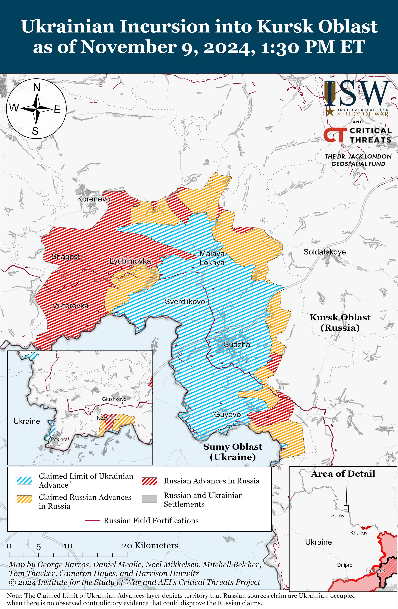
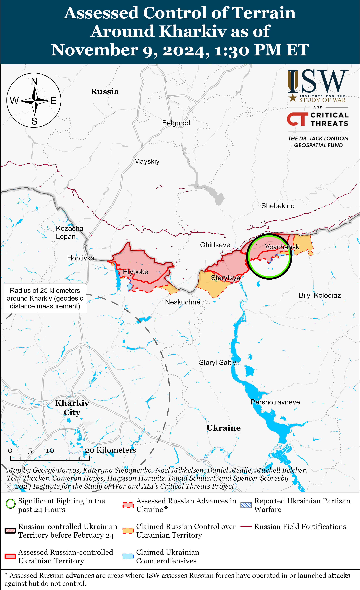
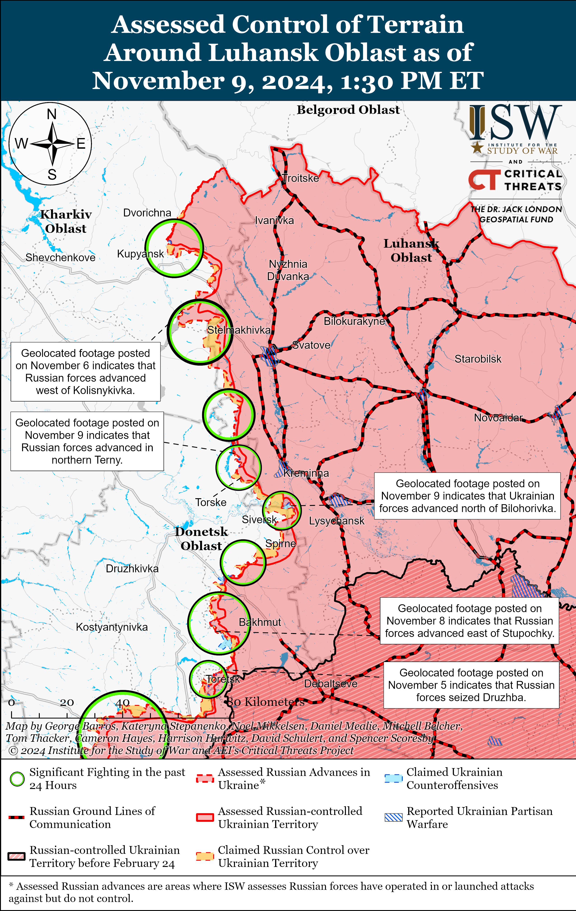
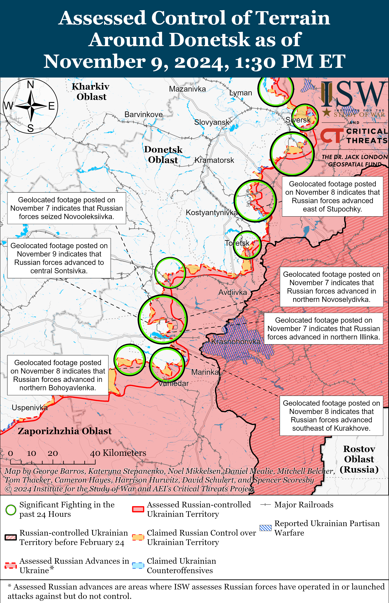
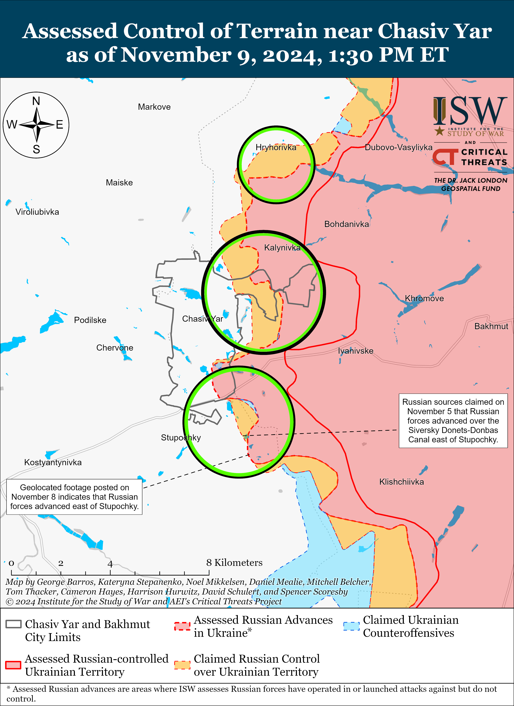
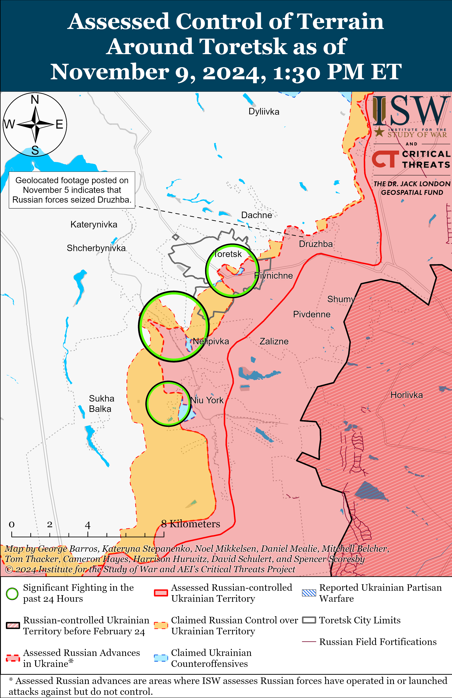
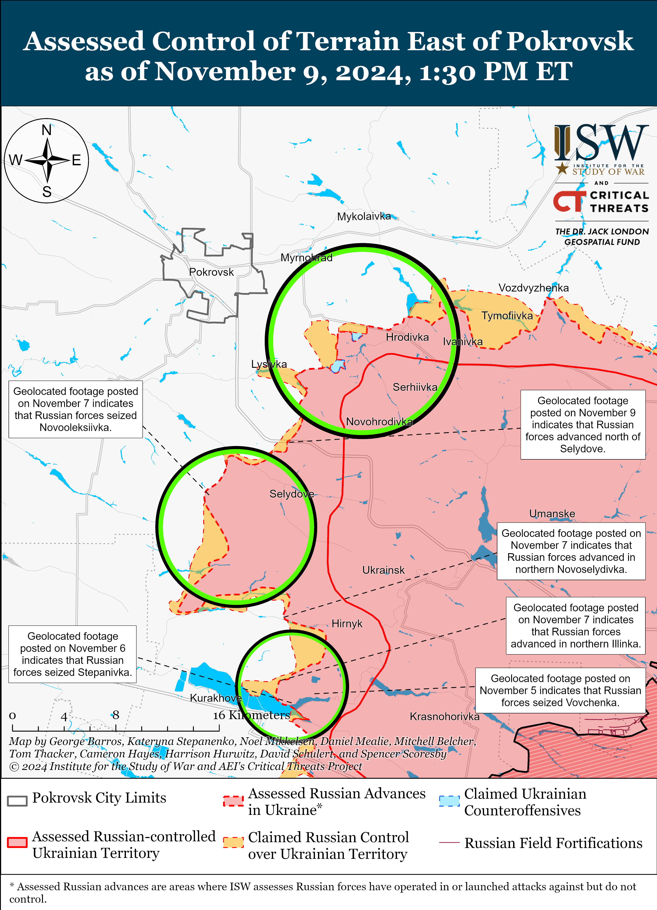
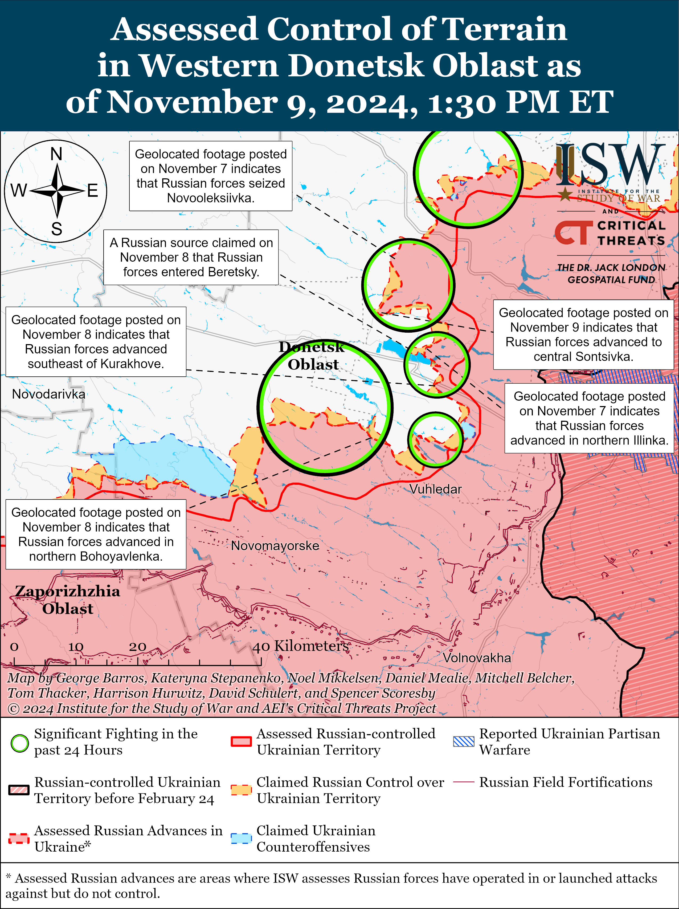
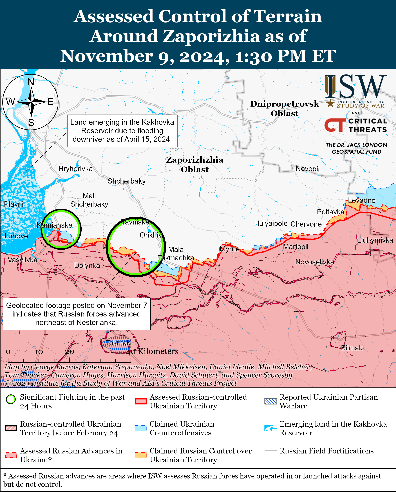
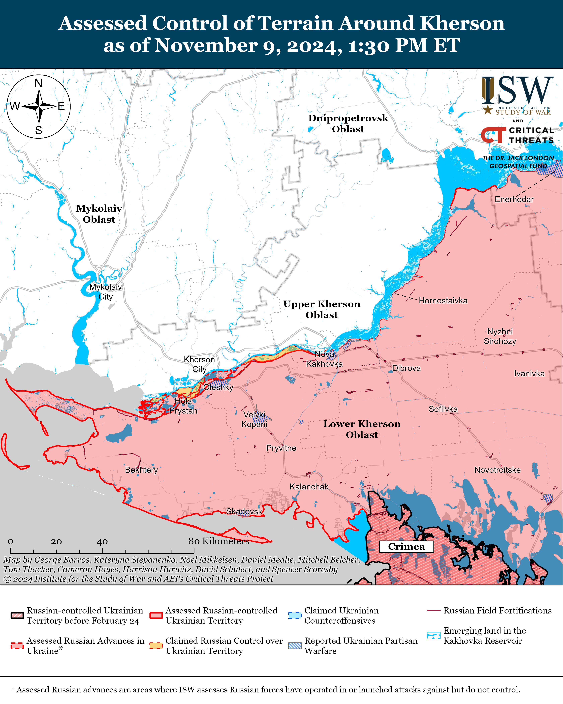

# Russian Offensive Campaign Assessment, November 9, 2024

**November 9, 2024, 6:30pm ET**

**Click** [**here**](https://storymaps.arcgis.com/stories/36a7f6a6f5a9448496de641cf64bd375) **to see ISW’s interactive map of the Russian invasion of Ukraine. This map is updated daily alongside the static maps present in this report.**

**Click** [**here**](https://understandingwar.maps.arcgis.com/apps/instant/3dviewer/index.html?appid=1602762dbcde419bb957dea358449580) **to see ISW’s 3D control of terrain topographic map of Ukraine. Use of a computer (not a mobile device) is strongly recommended for using this data-heavy tool.**

**Click** [**here**](https://storymaps.arcgis.com/stories/733fe90805894bfc8562d90b106aa895) **to access ISW’s archive of interactive time-lapse maps of the Russian invasion of Ukraine. These maps complement the static control-of-terrain map that ISW produces daily by showing a dynamic frontline. ISW will update this time-lapse map archive monthly.**

**Note: The data cut-off for this product was 12:30pm ET on November 9. ISW will cover subsequent reports in the November 10 Russian Offensive Campaign Assessment.**

**Russian forces reportedly lost almost 200 tanks, over 650 armored vehicles, and suffered an estimated 80,000 casualties in taking roughly 1,500 square kilometers during a period of intensified Russian offensive operations in September and October 2024.** United Kingdom (UK) Defense Secretary John Healey told UK outlet *The Telegraph* on November 9 that UK defense intelligence estimates that Russian casualties "reached a new high" in October 2024 and that Russian forces suffered an average daily casualty rate of 1,345 troops per day or about 41,980 casualties in October 2024.[[1]](#_edn74029f2d55fd5ab748d90ced94d1cdb31) The UK Ministry of Defense (MoD), citing data from the Ukrainian General Staff, previously reported that Russian forces suffered a record high average daily casualty rate of 1,271 troops per day or about 38,130 casualties in September 2024.[[2]](#_edn74029f2d55fd5ab748d90ced94d1cdb32) Russian forces have thus suffered an estimated 80,110 casualties over the last two months – roughly 20,000 more casualties than US forces suffered during almost 20 years of operations in Iraq and Afghanistan.[[3]](#_edn74029f2d55fd5ab748d90ced94d1cdb33) Data compiled by Oryx founder Jakub Janovsky indicates that Russian forces also lost 197 tanks, 661 armored personnel carriers (APCs), and 65 artillery systems larger than 100mm throughout the frontline in September and October 2024.[[4]](#_edn74029f2d55fd5ab748d90ced94d1cdb34) Russian forces seized and recaptured a total of 1,517 square kilometers--an area less than a third the size of Delaware--throughout Ukraine and Kursk Oblast over the last two months in exchange for these losses. Russian forces have intensified offensive operations near Kupyansk in Kharkiv Oblast and Selydove, Kurakhove, and Vuhledar in Donetsk Oblast over the last two months and have managed to advance at a marginally faster rate than Russian forces have advanced over the last two years.[[5]](#_edn74029f2d55fd5ab748d90ced94d1cdb35) Russian forces recently seized Vuhledar and Selydove but have yet to make operationally significant advances, and Russian forces have made most of their advances during this time through open fields and small settlements.

**Russian forces will eventually make operationally significant gains if Ukrainian forces do not stop ongoing Russian offensive operations, but the Russian military cannot sustain such loss rates indefinitely, especially not for such limited gains.** ISW previously observed data indicating that Russian forces have lost at least five divisions' worth of armored vehicles and tanks in Pokrovsk Raion alone since October 2023.[[6]](#_edn74029f2d55fd5ab748d90ced94d1cdb36) Russian forces have likely accumulated a large amount of equipment in priority frontline areas, but dwindling Soviet-era tank and armored vehicle stockpiles and current armored vehicle production rates will likely make such losses prohibitive over the longer term.[[7]](#_edn74029f2d55fd5ab748d90ced94d1cdb37) US Defense Secretary Lloyd Austin stated on October 31 that Russian forces are suffering roughly 1,200 casualties per day, or about 36,000 casualties per month, and ISW has recently observed indications that the Russian military has been struggling to recruit enough soldiers to replace its frontline losses.[[8]](#_edn74029f2d55fd5ab748d90ced94d1cdb38) Russian President Vladimir Putin notably acknowledged Russia's ongoing labor shortages and dependence on migrants to meet these labor shortages during his September 7 Valdai Club address, and ISW noted that Russia also depends on coercing migrants to join the Russian military to meet its manpower requirements.[[9]](#_edn74029f2d55fd5ab748d90ced94d1cdb39) The Russian military almost certainly cannot indefinitely sustain a daily casualty rate of over 1,200 people so long as Putin remains committed to avoiding another involuntary call-up of reservists.[[10]](#_edn74029f2d55fd5ab748d90ced94d1cdb310) Even an involuntary reserve mobilization will not resolve the larger problem Putin apparently faces in finding enough people to work in Russia's industries while also feeding the front.

Select Russian milbloggers continue to complain about disproportionately high personnel losses, and wider discontent about losses within the Russian ultranationalist milblogger community may also influence Putin's calculus in the future. A former Russian Storm-Z instructor and milblogger complained on November 8 that it takes at least six months to train assault personnel but that the Russian military command is treating assault personnel as "meat" who do not require a high level of training and whose primary task is to "catch drones [and] shrapnel."[[11]](#_edn74029f2d55fd5ab748d90ced94d1cdb311) The milblogger claimed that Russian infantry losses are high due to the ongoing Russian tactic of sending small assault groups in multiple, successive waves in an attempt to overwhelm Ukrainian forces, which the milblogger labeled as "stupid" and "improperly organized." The milblogger concluded that Russian advances "do not seem proportionate to the irretrievably spent resources – human and material." The Russian milblogger community recently criticized the deaths of specialized drone operators whom their commanders sent on assaults as punishment, and the continued use of Russian servicemembers, particularly specialized troops, in unorganized, highly attritional, infantry-led "meat" assaults that result in disproportionately small gains may continue to anger the milblogger community – a group towards which the Kremlin has shown itself to be especially sensitive.[[12]](#_edn74029f2d55fd5ab748d90ced94d1cdb312)

**Ukrainian forces conducted drone strikes on the Aleksin Chemical Plant in Tula Oblast on the night of November 8 to 9.** Ukrainian outlet *Suspilne* reported on November 9 that its sources in Ukraine's Security Service (SBU) stated that the SBU and Ukraine's Special Operations Forces (SSO) launched at least 13 drones at the Aleksin Chemical Plant and that a successful strike caused a fire, halting the plant's operations and eventually causing a chemical explosion on the afternoon of November 9.[[13]](#_edn74029f2d55fd5ab748d90ced94d1cdb313) The SBU sources stated that the Aleksin Chemical Plant is a subsidiary of the Russian state defense conglomerate Rostec and that the plant produces ammunition, gunpowder and other products for the Russian defense industrial base.[[14]](#_edn74029f2d55fd5ab748d90ced94d1cdb314) Footage published on November 9 purportedly shows a strike on the Aleksin Chemical Plant and the subsequent fire.[[15]](#_edn74029f2d55fd5ab748d90ced94d1cdb315) *Suspilne's* sources stated that Ukrainian drone strikes also damaged a power transmission line at the nearby Aleksinskaya Thermal Power Plant.[[16]](#_edn74029f2d55fd5ab748d90ced94d1cdb316) Tula Oblast Governor Dmitry Milyaev claimed that Russian forces repelled a Ukrainian drone strike near Aleksin but that falling drone debris damaged several houses.[[17]](#_edn74029f2d55fd5ab748d90ced94d1cdb317)

**Russian authorities are reportedly considering merging Russia's three largest oil companies -- Rosneft, Gazprom Neft, and Lukoil, likely to help Russia reach more advantageous energy deals with non-Western states.** The *Wall Street Journa*l (WSJ) reported on November 9, citing sources familiar with the matter, that Russian officials and executives are negotiating a possible merger between state-affiliated Rosneft, state-owned Gazprom Neft, and independently-owned Lukoil that would create the second-largest crude oil production company in the world.[[18]](#_edn74029f2d55fd5ab748d90ced94d1cdb318) The WSJ reported that Rosneft Head and close associate of Russian President Vladimir Putin Igor Sechin is a "main player" in the ongoing talks and that the merger may be aimed at extracting higher prices for Russian oil from India or the People's Republic of China (PRC). The WSJ's sources stated that the deal is still subject to change and that it is unclear whether Sechin would head the merged company, and representatives of the Kremlin, Gazprom Neft, Lukoil, and Rosneft all denied the talks. Gazprom Neft's parent company, Gazprom, has lost significant revenues from a drop in energy sales since the start of Russia's full-scale invasion in 2022.[[19]](#_edn74029f2d55fd5ab748d90ced94d1cdb319) Longtime Gazprom Head Alexey Miller reportedly failed to reach a deal with the PRC in early 2024 due to disagreements over the proposed Power of Siberia-2 (PS-2) gas pipeline, and Putin emphasized in his November 7 Valdai Club address that Russia is willing to sell oil, gas, and nuclear energy to the PRC to compensate for the PRC's energy supplies lost due to Western sanctions.[[20]](#_edn74029f2d55fd5ab748d90ced94d1cdb320) The Kremlin may be trying to consolidate its influence in the global energy market to reach more advantageous energy deals, particularly with the PRC, amid falling revenues from international energy exports and increased federal spending on national security and defense.

**Russian authorities arrested a former Russian Ministry of Defense (MoD) construction official for fraud on November 9.** Russian authorities arrested former Russian MoD Special Construction Directorate Head Alexander Molodchenko and two other unspecified defendants on suspicion of fraud after reportedly "misleading" Russian MoD officials about the fulfillment of state construction contracts.[[21]](#_edn74029f2d55fd5ab748d90ced94d1cdb321) Molodchenko was reportedly dismissed from his post as MoD Special Construction Directorate head in September 2024.

**The US Department of Defense (DOD) reportedly stated on November 8 that it will send a "small number" of US defense contractors to rear areas of Ukraine to repair US-provided weapons and equipment.** The *Washington Post* reported that the US defense contractors will repair F-16 fighter jets, Bradley infantry fighting vehicles, and unspecified air defense systems.[[22]](#_edn74029f2d55fd5ab748d90ced94d1cdb322) An unspecified US defense official told *CNN* that the contractors will be located "far from" the frontline and noted that F-16s and Patriot air defense systems "require specific technical expertise to maintain."[[23]](#_edn74029f2d55fd5ab748d90ced94d1cdb323) The DoD told the *Wall Street Journal* (WSJ) in a November 9 article that keeping these weapons systems mission capable is "critical" for Ukraine's defense.[[24]](#_edn74029f2d55fd5ab748d90ced94d1cdb324) A senior Biden administration official told the WSJ that the US is also providing over 500 interceptors for Patriot missile systems and NASAMS to Ukraine, which will likely arrive in the coming weeks.[[25]](#_edn74029f2d55fd5ab748d90ced94d1cdb325)

**Key Takeaways:**

- **Russian forces reportedly lost almost 200 tanks, over 650 armored vehicles, and suffered an estimated 80,000 casualties in taking roughly 1,500 square kilometers during a period of intensified Russian offensive operations in September and October 2024.**
- **Russian forces will eventually make operationally significant gains if Ukrainian forces do not stop ongoing Russian offensive operations, but the Russian military cannot sustain such loss rates indefinitely, especially not for such limited gains.**
- **Ukrainian forces conducted drone strikes on the Aleksin Chemical Plant in Tula Oblast on the night of November 8 to 9.**
- **Russian authorities are reportedly considering merging Russia's three largest oil companies -- Rosneft, Gazprom Neft, and Lukoil, likely to help Russia reach more advantageous energy deals with non-Western states.**
- **Russian authorities arrested a former Russian Ministry of Defense (MoD) construction official for fraud on November 9.**
- **The US Department of Defense (DOD) reportedly stated on November 8 that it will send a "small number" of US defense contractors to rear areas of Ukraine to repair US-provided weapons and equipment.**
- **Ukrainian forces recently regained positions near Siversk and Pokrovsk, and Russian forces recently advanced near Kreminna, Pokrovsk, and Kurakhove.**
- **Ukraine's Foreign Minister Andrii Sybiha stated on November 9 that Ukrainian intelligence assesses that Russia will be able to produce 30 percent more artillery shells than all European Union (EU) countries combined in 2025 should the EU fail to implement additional measures, such as sanctions, against Russia's defense industrial base (DIB).**

***We do not report in detail on Russian war crimes because these activities are well-covered in Western media and do not directly affect the military operations we are assessing and forecasting. We will continue to evaluate and report on the effects of these criminal activities on the Ukrainian military and the Ukrainian population and specifically on combat in Ukrainian urban areas. We utterly condemn Russian violations of the laws of armed conflict and the Geneva Conventions and crimes against humanity even though we do not describe them in these reports.***

- Ukrainian Operations in the Russian Federation
- Russian Main Effort – Eastern Ukraine (comprised of three subordinate main efforts)
- Russian Subordinate Main Effort #1 – Push Ukrainian forces back from the international border with Belgorod Oblast and approach to within tube artillery range of Kharkiv City
- Russian Subordinate Main Effort #2 – Capture the remainder of Luhansk Oblast and push westward into eastern Kharkiv Oblast and encircle northern Donetsk Oblast
- Russian Subordinate Main Effort #3 – Capture the entirety of Donetsk Oblast
- Russian Supporting Effort – Southern Axis
- Russian Air, Missile, and Drone Campaign
- Russian Mobilization and Force Generation Efforts
- Russian Technological Adaptations
- Activities in Russian-occupied areas
- Significant Activity in Belarus

**Ukrainian Operations in the Russian Federation**

Fighting continued in the main Ukrainian salient in Kursk Oblast on November 9, but neither Russian nor Ukrainian forces made confirmed advances in the area. Russian milbloggers claimed that Russian forces operating east of Korenevo along the northern edge of the salient advanced near Staraya Sorochina and recaptured Pogrebki and Orlovka during a reinforced platoon-sized mechanized assault, but ISW has not observed visual confirmation of these claims.[[26]](#_edn74029f2d55fd5ab748d90ced94d1cdb326) A Kremlin-affiliated Russian milblogger claimed that Ukrainian forces are using unspecified tanks during assaults on Russian positions in Kursk Oblast.[[27]](#_edn74029f2d55fd5ab748d90ced94d1cdb327) Fighting continued southeast of Korenevo near Darino, Nikolayevo-Darino, Leonidovo, Novoivanovka, and Zeleny Shlyakh; east of Korenevo near Novaya Sorochina and Staraya Sorochina; northeast of Sudzha near Martynovka; and southeast of Sudzha near Plekhovo.[[28]](#_edn74029f2d55fd5ab748d90ced94d1cdb328) Elements of the Russian 106th Airborne (VDV) Division, including its 51st VDV Regiment, and the 83rd VDV Brigade are reportedly operating in Korenevsky and Sudzhansky raions.[[29]](#_edn74029f2d55fd5ab748d90ced94d1cdb329) Elements of the Russian "Arbat" Spetsnaz Battalion (Russian Volunteer Corps) reportedly continue to operate in Kursk Oblast.[[30]](#_edn74029f2d55fd5ab748d90ced94d1cdb330)

Russian sources claimed that Russian forces repelled a Ukrainian cross border attack near Novy Put (south of Glushkovo) in Glushkovsky Raion (west of the main Ukrainian salient in Kursk Oblast) on November 9.[[31]](#_edn74029f2d55fd5ab748d90ced94d1cdb331)

*See topline text for reporting on Ukrainian drone strikes into Russia*.

**Russian Main Effort – Eastern Ukraine**

**Russian Subordinate Main Effort #1 – Kharkiv Oblast** **(Russian objective: Push Ukrainian forces back from the international border with Belgorod Oblast and approach to within tube artillery range of Kharkiv City)**

Russian forces continued offensive operations north of Kharkiv City near Lyptsi and northeast of Kharkiv City near Vovchansk on November 8 and 9, but there were no confirmed changes to the frontline.[[32]](#_edn74029f2d55fd5ab748d90ced94d1cdb332) Ukraine's Kharkiv Group of Forces Spokesperson Lieutenant Colonel Yevhenii Romanov stated that small Russian infantry groups with air and artillery support are attacking in Vovchansk, and both Romanov and the spokesperson for a Ukrainian brigade operating in the Kharkiv direction noted that Russian forces are not using armored vehicles during assaults in this direction.[[33]](#_edn74029f2d55fd5ab748d90ced94d1cdb333) Romanov noted that the recent onset of poor weather conditions in this direction has significantly impacted Russian and Ukrainian drone and artillery operations.[[34]](#_edn74029f2d55fd5ab748d90ced94d1cdb334)

**Russian Subordinate Main Effort #2 – Luhansk Oblast (Russian objective: Capture the remainder of Luhansk Oblast and push westward into eastern Kharkiv Oblast and northern Donetsk Oblast)**

Russian forces recently marginally advanced northwest of Kreminna amid continued offensive operations along the Kupyansk-Svatove-Kreminna line on November 9. Geolocated footage published on November 9 shows that Russian forces recently marginally advanced within northeastern Terny (northwest of Kreminna).[[35]](#_edn74029f2d55fd5ab748d90ced94d1cdb335) Russian milbloggers claimed that Russian forces also advanced southwest of Stelmakhivka (northwest of Svatove) and further within northern Terny, but ISW has not observed visual confirmation of these claims.[[36]](#_edn74029f2d55fd5ab748d90ced94d1cdb336) A Kremlin-awarded milblogger rejected claims, including from the Russian Ministry of Defense (MoD), that Russian forces have seized Terny, and noted that footage showing a Russian flag within Terny was planted by a drone and that there is no evidence to confirm that Russian forces have seized the entire settlement.[[37]](#_edn74029f2d55fd5ab748d90ced94d1cdb337) The milblogger also claimed that Ukrainian forces hold positions further east in the Serebryanske forest area (southwest of Kreminna) than Russian sources had previously assessed.[[38]](#_edn74029f2d55fd5ab748d90ced94d1cdb338) Russian forces continued ground attacks east of Kupyansk near Kucherivka; southeast of Kupyansk near Kruhlyakivka, Kindrashivka, Kolisnykivka, Zahryzove, Lozove, and Berestove; northwest of Kreminna near Hrekivka, Nevske, and Terny; west of Kreminna near Torske; and south of Kreminna near Hryhorivka on November 8 and 9.[[39]](#_edn74029f2d55fd5ab748d90ced94d1cdb339) The commander of a Ukrainian brigade operating in the Kupyansk direction stated that Russian forces are conducting offensive operations with "disproportionate forces and means" and taking high personnel and equipment losses as part of efforts to push Ukrainian forces from the east (Ieft) bank of the Oskil River.[[40]](#_edn74029f2d55fd5ab748d90ced94d1cdb340) Elements of the Russian 164th Motorized Rifle Brigade (67th Motorized Rifle Division, 25th Combined Arms Army [CAA], Central Military District [CMD]) reportedly continue to operate in the Lyman direction.[[41]](#_edn74029f2d55fd5ab748d90ced94d1cdb341)

**Russian Subordinate Main Effort #3 – Donetsk Oblast (Russian objective: Capture the entirety of Donetsk Oblast, the claimed territory of Russia’s proxies in Donbas)**

Ukrainian forces recently regained lost positions in the Siversk direction amid continued Russian offensive operations in the area on November 9. Geolocated footage published on November 8 indicates that Ukrainian forces recently regained lost positions in northern Bilohorivka (northeast of Siversk).[[42]](#_edn74029f2d55fd5ab748d90ced94d1cdb342) A Russian milblogger claimed that Russian forces advanced 1.5 kilometers from Ivano-Darivka (southeast of Siversk), but ISW has not observed visual confirmation of this claim.[[43]](#_edn74029f2d55fd5ab748d90ced94d1cdb343) Russian forces conducted offensive operations near Verkhnokamyanske (east of Siversk) and Bilohorivka on November 8 and 9.[[44]](#_edn74029f2d55fd5ab748d90ced94d1cdb344) Elements of the Russian 39th Radiation, Chemical, and Biological Defense Regiment (3rd Combined Arms Army [CAA], formerly 2nd Luhansk People's Republic Army Corps [LNR AC]) are reportedly operating in the Siversk direction.[[45]](#_edn74029f2d55fd5ab748d90ced94d1cdb345)

Russian forces continued offensive operations near Chasiv Yar on November 9, but there were no confirmed changes to the frontline. Russian forces conducted offensive operations northeast of Chasiv Yar near Bondarne and south of Chasiv Yar near Bila Hora on November 8 and 9.[[46]](#_edn74029f2d55fd5ab748d90ced94d1cdb346) A Russian milblogger claimed that Russian forces marginally advanced near Hryhorivka (north of Chasiv Yar), but ISW has not observed visual confirmation of this claim.[[47]](#_edn74029f2d55fd5ab748d90ced94d1cdb347) Elements of the Russian 6th Motorized Rifle Division (3rd AC) are reportedly operating southeast of Chasiv Yar, and elements of the "Okhotnik" ("Hunter") Spetsnaz Detachment (51st CAA, formerly 1st Donetsk People's Republic [DNR] AC) and the 98th Airborne (VDV) Division are reportedly operating near Chasiv Yar.[[48]](#_edn74029f2d55fd5ab748d90ced94d1cdb348)

Russian forces continued offensive operations near Toretsk on November 9, but there were no confirmed changes to the frontline. Russian forces conducted offensive operations near Toretsk itself, north of Toretsk near Dyliivka, northeast of Toretsk near Druzhba, west of Toretsk near Shcherbynivka and Petrivka, and southwest of Toretsk near Nelipivka on November 8 and 9.[[49]](#_edn74029f2d55fd5ab748d90ced94d1cdb349) Elements of the Russian 132nd Motorized Rifle Brigade (51st CAA) are reportedly operating in the Toretsk direction.[[50]](#_edn74029f2d55fd5ab748d90ced94d1cdb350)

Ukrainian and Russian forces recently advanced in the Pokrovsk direction amid continued fighting in the area on November 9. Geolocated footage published on October 31 and November 9 indicates that Ukrainian forces regained lost positions north of Novohrodivka (southeast of Pokrovsk).[[51]](#_edn74029f2d55fd5ab748d90ced94d1cdb351) A Russian milblogger claimed on November 8 that Ukrainian forces are regularly counterattacking near Novohrodivka and recently recaptured a stronghold north of the settlement.[[52]](#_edn74029f2d55fd5ab748d90ced94d1cdb352) Additional geolocated footage published on November 9 indicates that Russian forces recently advanced along the E-50 (Donetsk City-Pokrovsk) highway north of Selydove (southeast of Pokrovsk).[[53]](#_edn74029f2d55fd5ab748d90ced94d1cdb353) Russian milbloggers claimed that Russian forces also advanced up to 1.28 kilometers in depth along the railway south of Hyrhorivka (southeast of Pokrovsk and west of Selydove) and up to eastern Petrivka (northwest of Hryhorivka), but ISW has not observed confirmation of these claims.[[54]](#_edn74029f2d55fd5ab748d90ced94d1cdb354) Russian forces conducted offensive operations east of Pokrovsk near Promin, Myrolyubivka, and Novotoretske and southeast of Pokrovsk near Lysivka, Krutyi Yar, Selydove, Vyshneve, Petrivka, and Chumatske on November 8 and 9.[[55]](#_edn74029f2d55fd5ab748d90ced94d1cdb355) Elements of the Russian 80th Tank Regiment (90th Tank Division, 41st CAA, Central Military District [CMD]) are reportedly operating near Novooleksiivka (south of Pokrovsk and west of Selydove).[[56]](#_edn74029f2d55fd5ab748d90ced94d1cdb356)

Russian forces recently advanced in the Kurakhove direction amid continued offensive operations on November 9. Geolocated footage published on November 9 indicates that Russian forces recently advanced to central Sontsivka (northeast of Kurakhove).[[57]](#_edn74029f2d55fd5ab748d90ced94d1cdb357) Russian milbloggers claimed that Russian forces also advanced up to 1.3 kilometers south of Novodmytrivka (northwest of Kurakhove and northeast of Sontsivka), in northwestern Sontsivka, up to the eastern outskirts of Zorya (northeast of Kurakhove and north of Sontsivka), near Voznesenka (north of Kurakhove), southwest of Maksymilyanivka (east of Kurakhove), and northwest of Kostyantynivka (southeast of Kurakhove).[[58]](#_edn74029f2d55fd5ab748d90ced94d1cdb358) One milblogger claimed that Russian forces seized Voznesenka.[[59]](#_edn74029f2d55fd5ab748d90ced94d1cdb359) ISW has not observed confirmation of these claims, however. A Russian milblogger claimed on November 9 that Russian forces initially advanced to the Solona River in Sontsivka on November 7 but that Ukrainian forces later pushed Russian forces back to the settlement's outskirts and have since been using a tank to prevent further Russian advances into the settlement.[[60]](#_edn74029f2d55fd5ab748d90ced94d1cdb360) Russian forces conducted offensive operations north of Kurakhove near Illinka, Novoselydivka, Novodmytrivka, Berestky, and Voznesenka; east of Kurakhove near Maksymilyanivka; and south of Kurakhove near Dalne on November 8 and 9.[[61]](#_edn74029f2d55fd5ab748d90ced94d1cdb361) A Russian milblogger claimed that the Russian rate of advance towards Kurakhove is slow because Russian forces can only safely attack Ukrainian fortifications in the area following Russian glide bomb or artillery strikes.[[62]](#_edn74029f2d55fd5ab748d90ced94d1cdb362)

Russian forces reportedly advanced in the Vuhledar direction on November 9, but there were no confirmed changes to the frontline. Russian milbloggers claimed that Russian forces advanced in an area up to 4.3 kilometers wide and 1.8 kilometers in depth east of Maksymivka (northwest of Vuhledar) and up to 3.6 kilometers wide and 1.6 kilometers deep east of Bohoyavlenka (northwest of Vuhledar).[[63]](#_edn74029f2d55fd5ab748d90ced94d1cdb363) ISW has not observed confirmation of these claims, however. Russian forces conducted offensive operations northeast of Vuhledar near Yelizavetivka, Katerynivka, and Antonivka and northwest of Vuhledar near Maksymivka, Bohoyavlenka, Shakhtarske, Yasna Polyana, and Trudove and towards Kostyantynopilske and Sukhy Yaly on November 8 and 9.[[64]](#_edn74029f2d55fd5ab748d90ced94d1cdb364) Elements of the Russian "Dostavalov" Volunteer Battalion (a volunteer battalion formed in Republic of Bashkortostan in 2022) are reportedly operating near Katerynivka; elements of the 57th Motorized Rifle Brigade (5th CAA, Eastern Military District [EMD]) are reportedly operating near Trudove; elements of the 11th Air Force and Air Defense Army (Russian Aerospace Forces [VKS] and EMD) are reportedly operating near Uspenivka (northwest of Vuhledar); elements of the 40th Naval Infantry Brigade (Pacific Fleet, EMD) are reportedly operating near Shakhtarske; and elements of the 39th Motorized Rifle Brigade (68th AC, EMD) are reportedly operating near Yelizavetivka.[[65]](#_edn74029f2d55fd5ab748d90ced94d1cdb365)

Neither Russian nor Ukrainian sources reported offensive operations in the Donetsk-Zaporizhia Oblast border area on November 9. Elements of the Russian 14th Spetsnaz Brigade (Russian General Staff's Main Intelligence Directorate [GRU]) are reportedly operating in the Vremivka direction.[[66]](#_edn74029f2d55fd5ab748d90ced94d1cdb366)

****

**Russian Supporting Effort – Southern Axis (Russian objective: Maintain frontline positions and secure rear areas against Ukrainian strikes)**

Positional fighting continued in western Zaporizhia Oblast near Novoandriivka (northwest of Robotyne) on November 8 and 9, but there were no confirmed changes to the frontline.[[67]](#_edn74029f2d55fd5ab748d90ced94d1cdb367) Russian milbloggers continued to claim on November 9 that Russian forces advanced northwest of Robotyne, including near Nesteryanka.[[68]](#_edn74029f2d55fd5ab748d90ced94d1cdb368) Ukrainian Southern Group of Forces Spokesperson Vladyslav Volodin stated that Russian forces increased the number of glide bomb and unguided rocket strikes in the Orikhiv (western Zaporizhia Oblast) direction and have struck Mala Tokmachka (northeast of Robotyne) with over 100 munitions since about November 1.[[69]](#_edn74029f2d55fd5ab748d90ced94d1cdb369) Reconnaissance and drone elements of the Russian 291st Motorized Rifle Regiment (42nd Motorized Rifle Division, 58th Combined Arms Army [CAA], Southern Military District [SMD]) reportedly continue operating in the Zaporizhia direction.[[70]](#_edn74029f2d55fd5ab748d90ced94d1cdb370)

Positional fighting continued in east (left) bank Kherson Oblast on November 8 and 9, but there were no changes to the frontline.[[71]](#_edn74029f2d55fd5ab748d90ced94d1cdb371) Kherson Oblast occupation head Vladimir Saldo claimed that Ukrainian forces fired 20 rockets at occupied Radensk on November 8.[[72]](#_edn74029f2d55fd5ab748d90ced94d1cdb372)

**Russian Air, Missile, and Drone Campaign (Russian Objective: Target Ukrainian military and civilian infrastructure in the rear and on the frontline)**

Russian forces conducted a series of drone strikes against Ukraine on the night of November 8 to 9. The Ukrainian Air Force reported that Russian forces launched 51 Shaheds and other unspecified strike drones from Primorsko-Akhtarsk, Krasnodar Krai and Oryol Oblast.[[73]](#_edn74029f2d55fd5ab748d90ced94d1cdb373) The Ukrainian Air Force reported that Ukrainian forces downed 32 drones over Odesa, Mykolaiv, Dnipropetrovsk, Zaporizhia, Donetsk, Sumy, Kharkiv, Poltava, Vinnytsia, Cherkasy, and Ternopil oblasts and that 18 drones were "lost," likely due to Ukrainian electronic warfare (EW) interference. Ukrainian officials reported that Shahed drone strikes on Odesa City caused a fire at a warehouse and damaged civilian infrastructure and the Odesa City Council building.[[74]](#_edn74029f2d55fd5ab748d90ced94d1cdb374)

Ukraine's Southern Operational Command reported that Russian forces launched a likely Iskander-M ballistic missile from occupied Crimea at Mykolaiv Oblast on the evening of November 8, but that the strike did not cause damage or casualties.[[75]](#_edn74029f2d55fd5ab748d90ced94d1cdb375)

Ukrainian Kharkiv Oblast Head Oleh Synehubov reported that Russian forces struck Kharkiv City with a Grom-E1 hybrid air-launched guided missile on the night of November 8 to 9, damaging civilian infrastructure.[[76]](#_edn74029f2d55fd5ab748d90ced94d1cdb376)

**Russian Mobilization and Force Generation Efforts (Russian objective: Expand combat power without conducting general mobilization)**

Ukraine's Foreign Minister Andrii Sybiha stated on November 9 that Ukrainian intelligence assesses that Russia will be able to produce 30 percent more artillery shells than all European Union (EU) countries combined in 2025 should the EU fail to implement additional measures, such as sanctions, against Russia's defense industrial base (DIB).[[77]](#_edn74029f2d55fd5ab748d90ced94d1cdb377) Sybiha stated that Russia intends to use revenues from its "shadow fleet," which sells Russian petroleum in violation of price caps and international sanctions, to fund shell production.[[78]](#_edn74029f2d55fd5ab748d90ced94d1cdb378) Sybiha called on the EU to strengthen sanctions in order to combat this revenue flow to Russia.

**Russian Technological Adaptations** **(Russian objective: Introduce technological innovations to optimize systems for use in Ukraine)**

UK Defense Secretary John Healey stated on November 8 that Russian forces developed unspecified methods to counter new Ukrainian drone technology within roughly two months of Ukrainian forces introducing such technology to the battlefield.[[79]](#_edn74029f2d55fd5ab748d90ced94d1cdb379) Healey noted that the tempo of innovation and production is "essential" to Ukrainian forces countering Russian battlefield adaptions.

**Activities in Russian-occupied areas (Russian objective: Consolidate administrative control of annexed areas; forcibly integrate Ukrainian citizens into Russian sociocultural, economic, military, and governance systems)**

*ISW is not publishing coverage of activities in Russian-occupied areas today.*

**Significant activity in Belarus (Russian efforts to increase its military presence in Belarus and further integrate Belarus into Russian-favorable frameworks and Wagner Group activity in Belarus)**

Nothing significant to report.

**Note: ISW does not receive any classified material from any source, uses only publicly available information, and draws extensively on Russian, Ukrainian, and Western reporting and social media as well as commercially available satellite imagery and other geospatial data as the basis for these reports. References to all sources used are provided in the endnotes of each update.**

---

[[1]](#_edn74029f2d55fd5ab748d90ced94d1cdb3ref1) <https://www.telegraph.co.uk/news/2024/11/08/defence-secretary-john-healey-russia-army/>

[[2]](#_edn74029f2d55fd5ab748d90ced94d1cdb3ref2) <https://x.com/DefenceHQ/status/1843198787097124968/photo/1> ; <https://lordslibrary.parliament> dot uk/war-in-ukraine-update-october-2024/

[[3]](#_edn74029f2d55fd5ab748d90ced94d1cdb3ref3) <https://www.defense.gov/casualty.pdf>

[[4]](#_edn74029f2d55fd5ab748d90ced94d1cdb3ref4) <https://x.com/Rebel44CZ/status/1834344317491548649> ; https://www.oryxspioenkop.com/2022/02/attack-on-europe-documenting-equipment.html

[[5]](#_edn74029f2d55fd5ab748d90ced94d1cdb3ref5) <https://isw.pub/UkrWar102924> ; <https://isw.pub/UkrWar101824> ; <https://isw.pub/UkrWar092724> ; <https://isw.pub/UkrWar090524> ; <https://isw.pub/UkrWar100124>

[[6]](#_edn74029f2d55fd5ab748d90ced94d1cdb3ref6) <https://isw.pub/UkrWar100624>

[[7]](#_edn74029f2d55fd5ab748d90ced94d1cdb3ref7) https://isw.pub/UkrWar100324 ; https://isw.pub/UkrWar092724 ; https://isw.pub/UkrWar091324 ; https://isw.pub/UkrWar090524 ; <https://isw.pub/UkrWar091524> ; <https://www.understandingwar.org/backgrounder/russian-offensive-campaign-assessment-october-6-2024>

[[8]](#_edn74029f2d55fd5ab748d90ced94d1cdb3ref8) <https://isw.pub/UkrWar101624> ; <https://understandingwar.org/backgrounder/russian-offensive-campaign-assessment-november-1-2024> ; <https://www.understandingwar.org/backgrounder/russian-offensive-campaign-assessment-september-21-2024> ; <https://www.defense.gov/News/News-Stories/Article/article/3953130/north-korean-soldiers-likely-to-enter-russian-war-on-ukraine/>

[[9]](#_edn74029f2d55fd5ab748d90ced94d1cdb3ref9) <https://isw.pub/UkrWar110824>

[[10]](#_edn74029f2d55fd5ab748d90ced94d1cdb3ref10) <https://isw.pub/UkrWar101624> ; <https://isw.pub/UkrWar110124>

[[11]](#_edn74029f2d55fd5ab748d90ced94d1cdb3ref11) <https://t.me/philologist_zov/1691>; <https://t.me/philologist_zov/1692> ; <https://t.me/philologist_zov/1693>

[[12]](#_edn74029f2d55fd5ab748d90ced94d1cdb3ref12) <https://isw.pub/UkrWar092724>; <https://www.understandingwar.org/backgrounder/russian-offensive-campaign-assessment-september-21-2024> ; <https://isw.pub/UkrWar100524>

[[13]](#_edn74029f2d55fd5ab748d90ced94d1cdb3ref13) <https://suspilne> dot media/876305-ukrainski-droni-v-rf-atakuvali-aleksinskij-himkombinat-so-viroblae-poroh-ta-boepripasi-dzerela/

[[14]](#_edn74029f2d55fd5ab748d90ced94d1cdb3ref14) https://suspilne dot media/876127-ssa-dozvolili-robotu-vijskovih-pidradnikiv-v-ukraini-svitovij-bank-nadast-137-mlrd-grantu-990-den-vijni-onlajn/?anchor=live\_1731160455&utm\_source=copylink&utm\_medium=ps

[[15]](#_edn74029f2d55fd5ab748d90ced94d1cdb3ref15) <https://t.me/vchkogpu/52377> ; <https://t.me/vchkogpu/52389> ; <https://t.me/DniproOfficial/5165>

[[16]](#_edn74029f2d55fd5ab748d90ced94d1cdb3ref16) https://suspilne dot media/876127-ssa-dozvolili-robotu-vijskovih-pidradnikiv-v-ukraini-svitovij-bank-nadast-137-mlrd-grantu-990-den-vijni-onlajn/?anchor=live\_1731160455&utm\_source=copylink&utm\_medium=ps

[[17]](#_edn74029f2d55fd5ab748d90ced94d1cdb3ref17) <https://t.me/dmilyaev/1631> ; <https://t.me/dmilyaev/1632>

[[18]](#_edn74029f2d55fd5ab748d90ced94d1cdb3ref18) https://www.wsj.com/business/energy-oil/russia-explores-plan-to-merge-oil-giants-into-mega-producer-80a6aa6b

[[19]](#_edn74029f2d55fd5ab748d90ced94d1cdb3ref19) https://www.understandingwar.org/backgrounder/russian-offensive-campaign-assessment-june-16-2024; https://www.understandingwar.org/backgrounder/russian-offensive-campaign-assessment-june-5-2024

[[20]](#_edn74029f2d55fd5ab748d90ced94d1cdb3ref20) <https://www.understandingwar.org/backgrounder/russian-offensive-campaign-assessment-june-3-2024>; http://kremlin dot ru/events/president/news/75521

[[21]](#_edn74029f2d55fd5ab748d90ced94d1cdb3ref21) https://t.me/tass\_agency/284272 ; https://tass dot ru/proisshestviya/22356159 ; https://rg dot ru/2024/11/08/v-moskve-arestovan-gendirektor-upravleniia-specstroitelstva-minoborony.html ; https://www.interfax dot ru/russia/990883

[[22]](#_edn74029f2d55fd5ab748d90ced94d1cdb3ref22) https://www.washingtonpost.com/national-security/2024/11/08/us-contractors-ukraine/

[[23]](#_edn74029f2d55fd5ab748d90ced94d1cdb3ref23) https://edition.cnn.com/2024/11/08/politics/biden-administration-american-military-contractors-deploy-ukraine/index.html

[[24]](#_edn74029f2d55fd5ab748d90ced94d1cdb3ref24) https://www.wsj.com/politics/national-security/u-s-struggles-to-rush-weapons-to-ukraine-before-trump-takes-office-dfabb1fd

[[25]](#_edn74029f2d55fd5ab748d90ced94d1cdb3ref25) https://www.wsj.com/politics/national-security/u-s-struggles-to-rush-weapons-to-ukraine-before-trump-takes-office-dfabb1fd

[[26]](#_edn74029f2d55fd5ab748d90ced94d1cdb3ref26) <https://t.me/RVvoenkor/80340> ; <https://t.me/dva_majors/57208>  <https://t.me/motopatriot/29356> ; <https://t.me/rusich_army/18328> ; <https://t.me/RVvoenkor/80372> ; <https://t.me/z_arhiv/29307> ; <https://t.me/motopatriot/29339> ; <https://t.me/boris_rozhin/143703>

[[27]](#_edn74029f2d55fd5ab748d90ced94d1cdb3ref27) <https://t.me/rybar/65224>

[[28]](#_edn74029f2d55fd5ab748d90ced94d1cdb3ref28) <https://t.me/RVvoenkor/80332> ; <https://t.me/mod_russia/45515> ; <https://t.me/rybar/65224> ; <https://t.me/dva_majors/57208> ; <https://t.me/sashakots/50055>

[[29]](#_edn74029f2d55fd5ab748d90ced94d1cdb3ref29) <https://t.me/mod_russia/45519> ; <https://t.me/motopatriot/29332>

 ; <https://t.me/DnevnikDesantnika/18851> ; <https://t.me/rusich_army/18312>

[[30]](#_edn74029f2d55fd5ab748d90ced94d1cdb3ref30) <https://t.me/milinfolive/134662>

[[31]](#_edn74029f2d55fd5ab748d90ced94d1cdb3ref31) <https://t.me/vysokygovorit/17922>; <https://t.me/epoddubny/21568> ; <https://t.me/msimonyan/2691> ; <https://t.me/sashakots/50055>

[[32]](#_edn74029f2d55fd5ab748d90ced94d1cdb3ref32) <https://www.facebook.com/GeneralStaff.ua/posts/pfbid02pcHgPaL2jz1axFLqihj7J1iKTMjFqDyBhCCWTdMpVB916QBVwdMhQT7gmZSyhdapl> ; <https://www.facebook.com/GeneralStaff.ua/posts/pfbid0sFBaMJDa3zuzp47X8mZYKaNsNjGG87tB9Th2tX4JzJUphy2nwbeXLN46wjSQgTDpl> ; <https://t.me/otukharkiv/2531> ; <https://t.me/motopatriot/29340>

[[33]](#_edn74029f2d55fd5ab748d90ced94d1cdb3ref33) <https://youtu.be/j5TqaWCCdUg>; [https://armyinform](https://armyinform/) dot com.ua/2024/11/09/kaby-solnczepok-fpv-drony-na-harkivshhyni-vorog-shturmuye-za-aktyvnoyi-vognevoyi-pidtrymky/ ; [https://armyinform.com](https://armyinform.com/) dot ua/2024/11/09/soldaty-zamist-broni-chomu-okupanty-ekonomlyat-tehniku-na-harkivshhyni/; <https://youtu.be/j5TqaWCCdUg> ; <https://youtu.be/aDXWlQ2K0dM>; [https://armyinform.com](https://armyinform.com/) dot ua/2024/11/09/vytratnyj-material-jde-pishky-ta-nese-vse-na-sobi-kym-i-yak-voyuye-rosiya-na-harkivshhyni/

[[34]](#_edn74029f2d55fd5ab748d90ced94d1cdb3ref34) <https://youtu.be/j5TqaWCCdUg>; [https://armyinform.com](https://armyinform.com/) dot ua/2024/11/09/imla-doshh-viter-sutinky-bezpilotnykam-na-harkivshhyni-staye-dedali-vazhche/

[[35]](#_edn74029f2d55fd5ab748d90ced94d1cdb3ref35) https://x.com/GirkinGirkin/status/1855148928372441323; https://t.me/WarArchive\_ua/22106; https://t.me/OMIBr\_60/603; https://x.com/99Dominik\_/status/1855156112053416392

[[36]](#_edn74029f2d55fd5ab748d90ced94d1cdb3ref36) <https://t.me/rybar/65249>; https://t.me/z\_arhiv/29301

[[37]](#_edn74029f2d55fd5ab748d90ced94d1cdb3ref37) https://t.me/rybar/65249

[[38]](#_edn74029f2d55fd5ab748d90ced94d1cdb3ref38) https://t.me/rybar/65249

[[39]](#_edn74029f2d55fd5ab748d90ced94d1cdb3ref39) <https://www.facebook.com/GeneralStaff.ua/posts/pfbid02PtuTeKnx474twajR3u191PPPvyQfsFQAaLghy4r67rpZQqoHEx1yZPSou2ebRqNcl>; <https://www.facebook.com/GeneralStaff.ua/posts/pfbid02pcHgPaL2jz1axFLqihj7J1iKTMjFqDyBhCCWTdMpVB916QBVwdMhQT7gmZSyhdapl>; https://www.facebook.com/GeneralStaff.ua/posts/pfbid0sFBaMJDa3zuzp47X8mZYKaNsNjGG87tB9Th2tX4JzJUphy2nwbeXLN46wjSQgTDpl

[[40]](#_edn74029f2d55fd5ab748d90ced94d1cdb3ref40) <https://armyinform> dot com.ua/2024/11/09/nespivmirni-syly-zasoby-ta-riven-vtrat-na-kupyanshhyni-vorog-pre-vsim-chym-mozhe/

[[41]](#_edn74029f2d55fd5ab748d90ced94d1cdb3ref41) https://t.me/sashakots/50053

[[42]](#_edn74029f2d55fd5ab748d90ced94d1cdb3ref42) [https://t.](https://t/)me/creamy\_caprice/7447; [https://t.](https://t/)me/wargonzo/23038

[[43]](#_edn74029f2d55fd5ab748d90ced94d1cdb3ref43) https://t.me/DnevnikDesantnika/18858

[[44]](#_edn74029f2d55fd5ab748d90ced94d1cdb3ref44) <https://www.facebook.com/GeneralStaff.ua/posts/pfbid02PtuTeKnx474twajR3u191PPPvyQfsFQAaLghy4r67rpZQqoHEx1yZPSou2ebRqNcl>; <https://www.facebook.com/GeneralStaff.ua/posts/pfbid02pcHgPaL2jz1axFLqihj7J1iKTMjFqDyBhCCWTdMpVB916QBVwdMhQT7gmZSyhdapl> ; https://www.facebook.com/GeneralStaff.ua/posts/pfbid0sFBaMJDa3zuzp47X8mZYKaNsNjGG87tB9Th2tX4JzJUphy2nwbeXLN46wjSQgTDpl

[[45]](#_edn74029f2d55fd5ab748d90ced94d1cdb3ref45) https://t.me/boris\_rozhin/143767

[[46]](#_edn74029f2d55fd5ab748d90ced94d1cdb3ref46) <https://www.facebook.com/GeneralStaff.ua/posts/pfbid02PtuTeKnx474twajR3u191PPPvyQfsFQAaLghy4r67rpZQqoHEx1yZPSou2ebRqNcl>  ; <https://www.facebook.com/GeneralStaff.ua/posts/pfbid02pcHgPaL2jz1axFLqihj7J1iKTMjFqDyBhCCWTdMpVB916QBVwdMhQT7gmZSyhdapl> ; https://www.facebook.com/GeneralStaff.ua/posts/pfbid0sFBaMJDa3zuzp47X8mZYKaNsNjGG87tB9Th2tX4JzJUphy2nwbeXLN46wjSQgTDpl

[[47]](#_edn74029f2d55fd5ab748d90ced94d1cdb3ref47) https://t.me/boris\_rozhin/143715

[[48]](#_edn74029f2d55fd5ab748d90ced94d1cdb3ref48) <https://t.me/dva_majors/57197>; <https://t.me/RVvoenkor/80355>; https://t.me/DnevnikDesantnika/18844

[[49]](#_edn74029f2d55fd5ab748d90ced94d1cdb3ref49) <https://www.facebook.com/GeneralStaff.ua/posts/pfbid02PtuTeKnx474twajR3u191PPPvyQfsFQAaLghy4r67rpZQqoHEx1yZPSou2ebRqNcl>; <https://www.facebook.com/GeneralStaff.ua/posts/pfbid02pcHgPaL2jz1axFLqihj7J1iKTMjFqDyBhCCWTdMpVB916QBVwdMhQT7gmZSyhdapl>; <https://www.facebook.com/GeneralStaff.ua/posts/pfbid0sFBaMJDa3zuzp47X8mZYKaNsNjGG87tB9Th2tX4JzJUphy2nwbeXLN46wjSQgTDpl>; https://t.me/wargonzo/23040

[[50]](#_edn74029f2d55fd5ab748d90ced94d1cdb3ref50) https://t.me/boris\_rozhin/143692

[[51]](#_edn74029f2d55fd5ab748d90ced94d1cdb3ref51) [https://t.](https://t/)me/WarArchive\_ua/22097?single; [https://t.](https://t/)me/skalabatalion/433; [https://t.](https://t/)me/WarArchive\_ua/21822

[[52]](#_edn74029f2d55fd5ab748d90ced94d1cdb3ref52) https://t.me/motopatriot/29337

[[53]](#_edn74029f2d55fd5ab748d90ced94d1cdb3ref53) <https://x.com/PuenteUribarri/status/1855159852781158538>; <https://x.com/99Dominik_/status/1855167681449648297;> [https://t.](https://t/)me/WarArchive\_ua/22108; [https://t.](https://t/)me/jagers68/396; https://t.me/creamy\_caprice/7446; <https://x.com/klinger66/status/1855172100949950810>

[[54]](#_edn74029f2d55fd5ab748d90ced94d1cdb3ref54) <https://t.me/RVvoenkor/80347>; https://t.me/z\_arhiv/29295

[[55]](#_edn74029f2d55fd5ab748d90ced94d1cdb3ref55) <https://www.facebook.com/GeneralStaff.ua/posts/pfbid02PtuTeKnx474twajR3u191PPPvyQfsFQAaLghy4r67rpZQqoHEx1yZPSou2ebRqNcl>; <https://www.facebook.com/GeneralStaff.ua/posts/pfbid02pcHgPaL2jz1axFLqihj7J1iKTMjFqDyBhCCWTdMpVB916QBVwdMhQT7gmZSyhdapl>; <https://www.facebook.com/GeneralStaff.ua/posts/pfbid0sFBaMJDa3zuzp47X8mZYKaNsNjGG87tB9Th2tX4JzJUphy2nwbeXLN46wjSQgTDpl>; <https://t.me/dva_majors/57208> ; https://t.me/RVvoenkor/80347

[[56]](#_edn74029f2d55fd5ab748d90ced94d1cdb3ref56) https://t.me/boris\_rozhin/143750

[[57]](#_edn74029f2d55fd5ab748d90ced94d1cdb3ref57) https://x.com/small10space/status/1855298178687312023; https://x.com/Bielitzling/status/1855301279297536373; https://t.me/z\_arhiv/29282;

[[58]](#_edn74029f2d55fd5ab748d90ced94d1cdb3ref58) [https://t](https://t/).me/boris\_rozhin/143701; [https://t](https://t/).me/z\_arhiv/29282; <https://t.me/motopatriot/29349>; <https://t.me/RVvoenkor/80347>

[[59]](#_edn74029f2d55fd5ab748d90ced94d1cdb3ref59) <https://t.me/boris_rozhin/143701>; https://t.me/z\_arhiv/29282; [https://t.](https://t/)me/z\_arhiv/29289

[[60]](#_edn74029f2d55fd5ab748d90ced94d1cdb3ref60) https://t.me/motopatriot/29347

[[61]](#_edn74029f2d55fd5ab748d90ced94d1cdb3ref61) <https://www.facebook.com/GeneralStaff.ua/posts/pfbid02PtuTeKnx474twajR3u191PPPvyQfsFQAaLghy4r67rpZQqoHEx1yZPSou2ebRqNcl>; https://www.facebook.com/GeneralStaff.ua/posts/pfbid02pcHgPaL2jz1axFLqihj7J1iKTMjFqDyBhCCWTdMpVB916QBVwdMhQT7gmZSyhdapl; <https://www.facebook.com/GeneralStaff.ua/posts/pfbid0sFBaMJDa3zuzp47X8mZYKaNsNjGG87tB9Th2tX4JzJUphy2nwbeXLN46wjSQgTDpl> ; <https://t.me/RVvoenkor/80347>; https://t.me/boris\_rozhin/143701

[[62]](#_edn74029f2d55fd5ab748d90ced94d1cdb3ref62) https://t.me/boris\_rozhin/143710

[[63]](#_edn74029f2d55fd5ab748d90ced94d1cdb3ref63) <https://t.me/dva_majors/57208>; <https://t.me/RVvoenkor/80361>; <https://t.me/z_arhiv/29292>; <https://t.me/z_arhiv/29289>; https://t.me/boris\_rozhin/143701

[[64]](#_edn74029f2d55fd5ab748d90ced94d1cdb3ref64) <https://www.facebook.com/GeneralStaff.ua/posts/pfbid02PtuTeKnx474twajR3u191PPPvyQfsFQAaLghy4r67rpZQqoHEx1yZPSou2ebRqNcl>; <https://www.facebook.com/GeneralStaff.ua/posts/pfbid02pcHgPaL2jz1axFLqihj7J1iKTMjFqDyBhCCWTdMpVB916QBVwdMhQT7gmZSyhdapl> ; <https://www.facebook.com/GeneralStaff.ua/posts/pfbid0sFBaMJDa3zuzp47X8mZYKaNsNjGG87tB9Th2tX4JzJUphy2nwbeXLN46wjSQgTDpl>; <https://t.me/dva_majors/57208>; <https://t.me/RVvoenkor/80361>; https://t.me/boris\_rozhin/143701

[[65]](#_edn74029f2d55fd5ab748d90ced94d1cdb3ref65) <https://t.me/RVvoenkor/80330> ; <https://t.me/RVvoenkor/80356> ; <https://t.me/boris_rozhin/143740> ; <https://t.me/voin_dv/11741> ;

[[66]](#_edn74029f2d55fd5ab748d90ced94d1cdb3ref66) https://t.me/voin\_dv/11743

[[67]](#_edn74029f2d55fd5ab748d90ced94d1cdb3ref67) <https://www.facebook.com/GeneralStaff.ua/posts/pfbid02pcHgPaL2jz1axFLqihj7J1iKTMjFqDyBhCCWTdMpVB916QBVwdMhQT7gmZSyhdapl>; https://www.facebook.com/GeneralStaff.ua/posts/pfbid0sFBaMJDa3zuzp47X8mZYKaNsNjGG87tB9Th2tX4JzJUphy2nwbeXLN46wjSQgTDpl

[[68]](#_edn74029f2d55fd5ab748d90ced94d1cdb3ref68) https://t.me/DnevnikDesantnika/18857 ; <https://t.me/dva_majors/57248>; https://t.me/dva\_majors/57208

[[69]](#_edn74029f2d55fd5ab748d90ced94d1cdb3ref69) https://suspilne dot media/zaporizhzhia/875841-na-orihivskomu-napramku-zbilsilas-kilkist-aviaudariv-armii-rf-volosin/

[[70]](#_edn74029f2d55fd5ab748d90ced94d1cdb3ref70) <https://t.me/DnevnikDesantnika/18884>; https://t.me/voin\_dv/11756

[[71]](#_edn74029f2d55fd5ab748d90ced94d1cdb3ref71) <https://www.facebook.com/GeneralStaff.ua/posts/pfbid02PtuTeKnx474twajR3u191PPPvyQfsFQAaLghy4r67rpZQqoHEx1yZPSou2ebRqNcl>; <https://www.facebook.com/GeneralStaff.ua/posts/pfbid02pcHgPaL2jz1axFLqihj7J1iKTMjFqDyBhCCWTdMpVB916QBVwdMhQT7gmZSyhdapl>; https://www.facebook.com/GeneralStaff.ua/posts/pfbid0sFBaMJDa3zuzp47X8mZYKaNsNjGG87tB9Th2tX4JzJUphy2nwbeXLN46wjSQgTDpl

[[72]](#_edn74029f2d55fd5ab748d90ced94d1cdb3ref72) https://t.me/SALDO\_VGA/4865

[[73]](#_edn74029f2d55fd5ab748d90ced94d1cdb3ref73) https://t.me/kpszsu/22561

[[74]](#_edn74029f2d55fd5ab748d90ced94d1cdb3ref74) <https://t.me/SJTF_Odes/11751> ; <https://t.me/dsns_telegram/34763> ; <https://t.me/suspilneodesa/41456> ; <https://t.me/odesa_prokuratura/706>

[[75]](#_edn74029f2d55fd5ab748d90ced94d1cdb3ref75) <https://t.me/SJTF_Odes/11753> ; <https://t.me/mykolaivskaODA/12017>

[[76]](#_edn74029f2d55fd5ab748d90ced94d1cdb3ref76) https://t.me/synegubov/11991

[[77]](#_edn74029f2d55fd5ab748d90ced94d1cdb3ref77) <https://www.rbc> dot ua/rus/news/2025-rotsi-rf-zmozhe-viroblyati-30-bilshe-1731161036.html ; <https://suspilne> dot media/876431-sibiga-zasterig-so-rf-u-2025-roci-zmoze-viroblati-na-30-bilse-artsnaradiv-niz-razom-usi-kraini-es/

[[78]](#_edn74029f2d55fd5ab748d90ced94d1cdb3ref78) https://understandingwar.org/backgrounder/russian-offensive-campaign-assessment-june-28-2024 ; https://www.understandingwar.org/backgrounder/russian-offensive-campaign-assessment-june-13-2024 ; <https://www.understandingwar.org/backgrounder/russian-offensive-campaign-assessment-november-18-2023> ;

[[79]](#_edn74029f2d55fd5ab748d90ced94d1cdb3ref79) https://www.telegraph.co.uk/news/2024/11/08/defence-secretary-john-healey-russia-army/

View Citations
