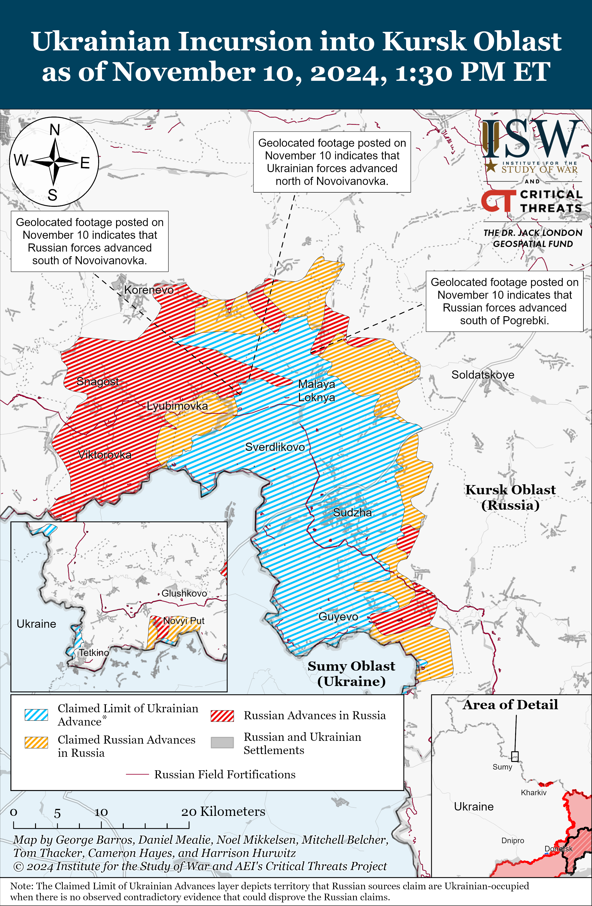
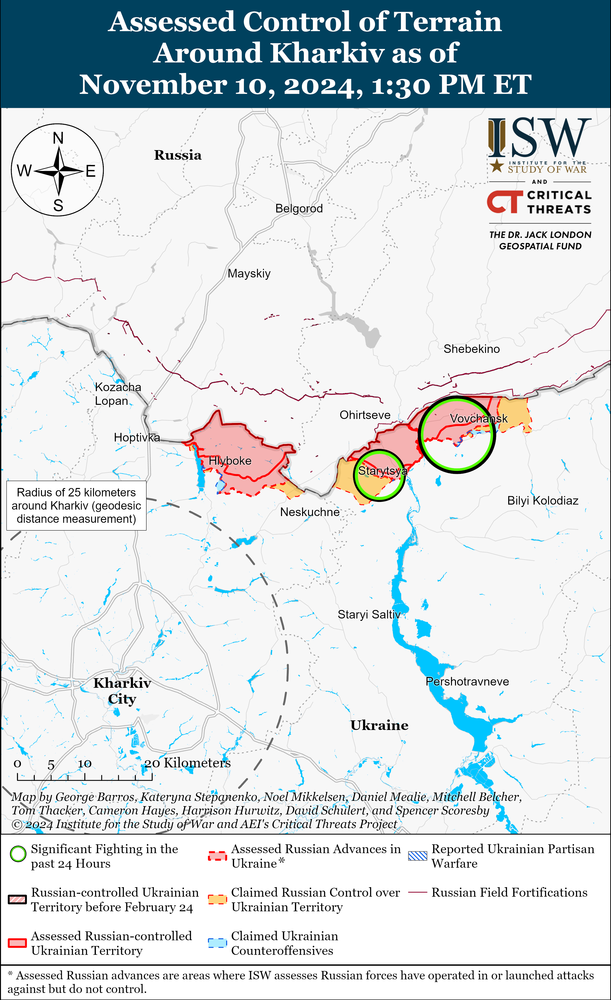
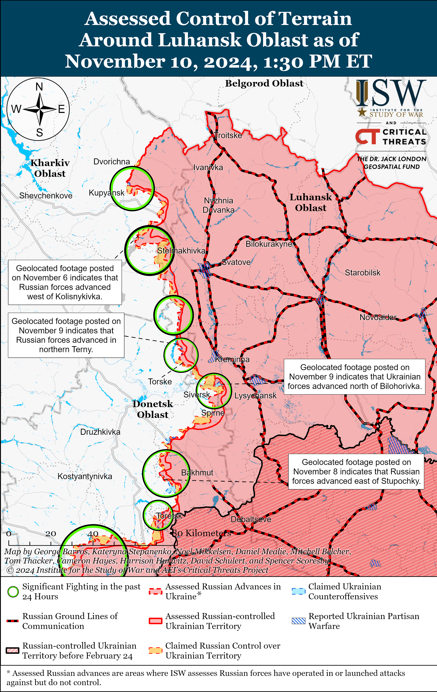
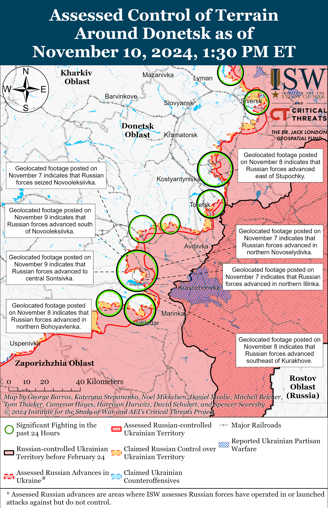
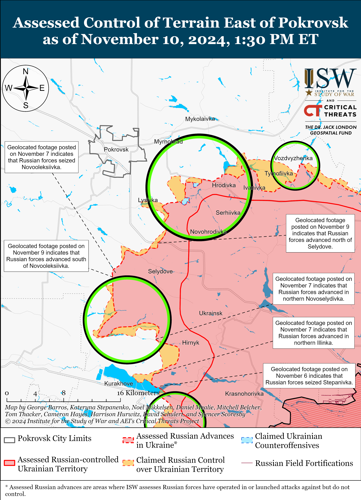
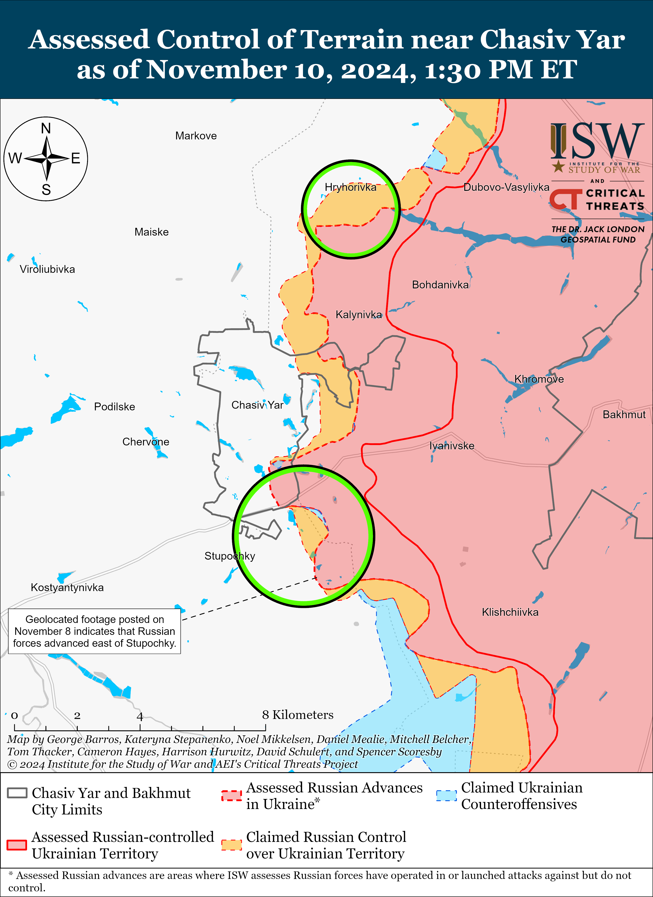
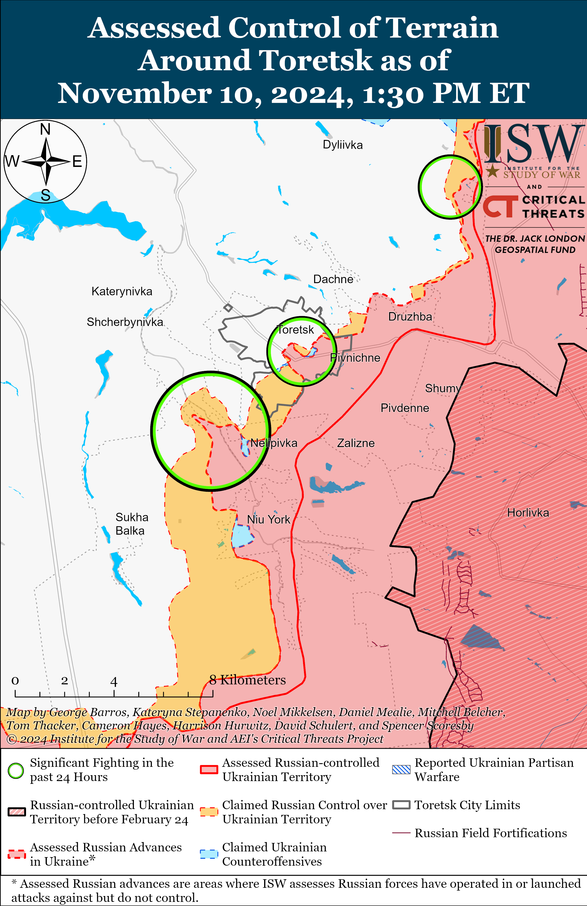
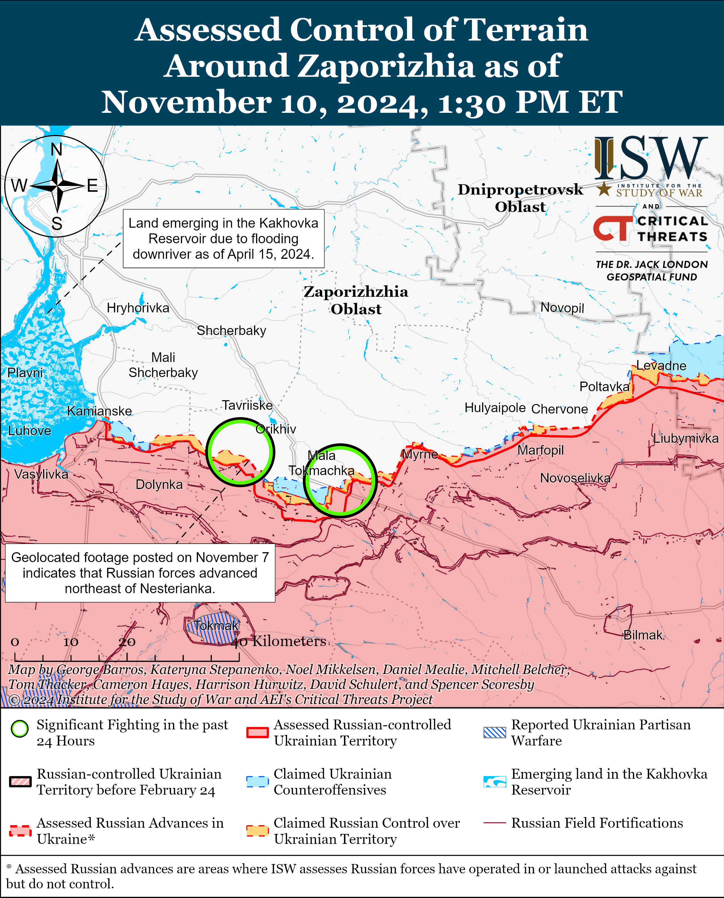
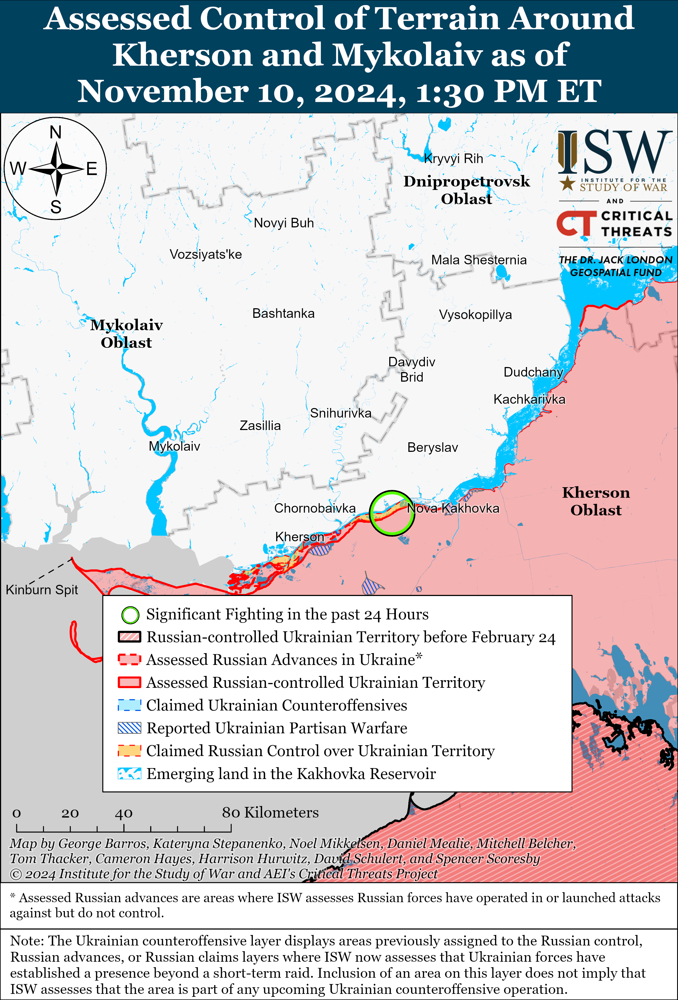

# Russian Offensive Campaign Assessment, November 10, 2024

**November 10, 2024, 3pm ET**

**Click** [**here**](https://storymaps.arcgis.com/stories/36a7f6a6f5a9448496de641cf64bd375) **to see ISW’s interactive map of the Russian invasion of Ukraine. This map is updated daily alongside the static maps present in this report.**

**Click** [**here**](https://understandingwar.maps.arcgis.com/apps/instant/3dviewer/index.html?appid=1602762dbcde419bb957dea358449580) **to see ISW’s 3D control of terrain topographic map of Ukraine. Use of a computer (not a mobile device) is strongly recommended for using this data-heavy tool.**

**Click** [**here**](https://storymaps.arcgis.com/stories/733fe90805894bfc8562d90b106aa895) **to access ISW’s archive of interactive time-lapse maps of the Russian invasion of Ukraine. These maps complement the static control-of-terrain map that ISW produces daily by showing a dynamic frontline. ISW will update this time-lapse map archive monthly.**

**Note: The data cut-off for this product was 12pm ET on November 10. ISW will cover subsequent reports in the November 11 Russian Offensive Campaign Assessment.**

**Ukrainian forces struck Russian ammunition warehouses in Bryansk Oblast during a large-scale Ukrainian drone strike against Russia on the night of November 9 and 10.** The Ukrainian General Staff reported that drone operators of the Ukrainian Unmanned Systems Forces and Ukrainian Armed Forces struck Russian ammunition warehouses at the Russian military's 1060th Logistics Center (formerly Russia's 120th Main Missile and Artillery Management Arsenal) in Bryansk Oblast, causing initial explosions and secondary detonations at the facility.[[1]](#_edncae8d8738d942fcb11986866dd0fe0bd1) Geolocated imagery published on November 9 and 10 shows two large fires burning near the facility.[[2]](#_edncae8d8738d942fcb11986866dd0fe0bd2) Russian authorities claimed that Russian forces downed 32 to 34 Ukrainian drones over Moscow Oblast and that debris from downed Ukrainian drones damaged civilian infrastructure in Ramenskoye Raion.[[3]](#_edncae8d8738d942fcb11986866dd0fe0bd3) The Russian Ministry of Defense (MoD) claimed that Russian forces downed 84 Ukrainian drones over Russia in total, and Russian milbloggers noted that this was one of the largest strikes against Moscow Oblast since February 2022.[[4]](#_edncae8d8738d942fcb11986866dd0fe0bd4)

**Ukrainian officials continue to report Russian executions of Ukrainian prisoners of war (POWs).** The Ukrainian Prosecutor General's Office reported on November 9 that it was investigating a video showing Russian forces executing a captured and unarmed Ukrainian servicemember in violation of the Geneva Convention on POWs.[[5]](#_edncae8d8738d942fcb11986866dd0fe0bd5) Ukrainian Ombudsman Dmytro Lubinets stated that he sent a letter to the United Nations (UN) and the International Committee of the Red Cross (ICRC) concerning the reported war crime.[[6]](#_edncae8d8738d942fcb11986866dd0fe0bd6) ISW has extensively reported on previous footage and reports of Russian servicemembers executing Ukrainian POWs and observed a wider trend of Russian abuses against Ukrainian POWs across various sectors of the front that appeared to be enabled, if not explicitly endorsed, by individual Russian commanders and unpunished by Russian field commanders.[[7]](#_edncae8d8738d942fcb11986866dd0fe0bd7)

**Key Takeaways:**

- **Ukrainian forces struck Russian ammunition warehouses in Bryansk Oblast during a large-scale Ukrainian drone strike against Russia on the night of November 9 and 10.**
- **Ukrainian officials continue to report Russian executions of Ukrainian prisoners of war (POWs).**
- **Russian forces recently advanced in the Pokrovsk direction.**

****

***We do not report in detail on Russian war crimes because these activities are well-covered in Western media and do not directly affect the military operations we are assessing and forecasting. We will continue to evaluate and report on the effects of these criminal activities on the Ukrainian military and the Ukrainian population and specifically on combat in Ukrainian urban areas. We utterly condemn Russian violations of the laws of armed conflict and the Geneva Conventions and crimes against humanity even though we do not describe them in these reports.***

- Ukrainian Operations in the Russian Federation
- Russian Main Effort – Eastern Ukraine (comprised of three subordinate main efforts)
- Russian Subordinate Main Effort #1 – Push Ukrainian forces back from the international border with Belgorod Oblast and approach to within tube artillery range of Kharkiv City
- Russian Subordinate Main Effort #2 – Capture the remainder of Luhansk Oblast and push westward into eastern Kharkiv Oblast and encircle northern Donetsk Oblast
- Russian Subordinate Main Effort #3 – Capture the entirety of Donetsk Oblast
- Russian Supporting Effort – Southern Axis
- Russian Air, Missile, and Drone Campaign
- Russian Mobilization and Force Generation Efforts
- Russian Technological Adaptations
- Activities in Russian-occupied areas
- Significant Activity in Belarus

**Ukrainian Operations in the Russian Federation**

Russian and Ukrainian forces recently advanced in the main Ukrainian salient in Kursk Oblast amid continued fighting on November 10. Geolocated footage published on November 10 indicates that Ukrainian forces recently advanced north of Novoivanovka (southeast of Korenevo) and that Russian forces recently advanced south of the settlement.[[8]](#_edncae8d8738d942fcb11986866dd0fe0bd8) Additional geolocated footage published on November 10 indicates that Russian forces recently advanced south and east of Pogrebki (north of Sudzha).[[9]](#_edncae8d8738d942fcb11986866dd0fe0bd9) The Russian Ministry of Defense (MoD) claimed on November 10 that Ukrainian forces counterattacked southeast of Korenevo near Novoivanovka, Darino, and Zeleny Shlyakh and east of Korenevo near Novaya Sorochina.[[10]](#_edncae8d8738d942fcb11986866dd0fe0bd10) The spokesperson of a Ukrainian brigade operating in Kursk Oblast stated on November 10 that Russian forces have increased offensive operations with armored personnel carriers, infantry fighting vehicles, and tanks in Kursk Oblast.[[11]](#_edncae8d8738d942fcb11986866dd0fe0bd11) Elements of the Russian 810th Naval Infantry Brigade (Black Sea Fleet [BSF], Southern Military District [SMD]) are reportedly operating near Pogrebki.[[12]](#_edncae8d8738d942fcb11986866dd0fe0bd12)

Neither Russian nor Ukrainian sources reported fighting in Glushkovsky Raion (west of the main Ukrainian salient) on November 10.

Unspecified US and Ukrainian officials told the *New York Times* (NYT) in a November 10 article that Russia has concentrated roughly 50,000 personnel, including North Korean forces, for the effort to recapture territory in Kursk Oblast.[[13]](#_edncae8d8738d942fcb11986866dd0fe0bd13) The NYT further noted that a new US assessment found that Russia concentrated these forces without redeploying forces from eastern Ukraine.

**Russian Main Effort – Eastern Ukraine**

**Russian Subordinate Main Effort #1 – Kharkiv Oblast** **(Russian objective: Push Ukrainian forces back from the international border with Belgorod Oblast and approach to within tube artillery range of Kharkiv City)**

Russian forces continued offensive operations northeast of Kharkiv City near Vovchansk and Starytsya on November 9 and 10 but did not advance.[[14]](#_edncae8d8738d942fcb11986866dd0fe0bd14) A Ukrainian brigade spokesperson stated on November 9 that Russian forces have intensified glide bomb strikes on Kharkiv Oblast, particularly targeting civilian infrastructure in Kharkiv City.[[15]](#_edncae8d8738d942fcb11986866dd0fe0bd15) A Ukrainian servicemember stated on November 10 that Russian forces aim to reach the Vovcha River and are committing untrained personnel to assaults.[[16]](#_edncae8d8738d942fcb11986866dd0fe0bd16) The Ukrainian servicemember also stated that Russian forces have almost stopped using multiple launch rocket systems (MLRS) in the Kharkiv direction due to problems with logistics and ammunition deliveries in worsening weather conditions. Elements of the Rosgvardia's 116th Spetsnaz Brigade reportedly continue to operate near Vovchansk.[[17]](#_edncae8d8738d942fcb11986866dd0fe0bd17)

**Russian Subordinate Main Effort #2 – Luhansk Oblast** **(Russian objective: Capture the remainder of Luhansk Oblast and push westward into eastern Kharkiv Oblast and northern Donetsk Oblast)**

Russian forces continued offensive operations along the Kupyansk-Svatove-Kreminna line on November 10, but there were no confirmed changes to the frontline. Russian milbloggers claimed that Russian forces operating north of Kupyansk advanced in an area 200 meters wide and 400 meters in depth in the direction of Kalynove and Holubivka and that Russian forces operating west of Svatove advanced in an area 200 meters wide and 600 meters in depth near Vyshneve and up to 200 meters towards Kopanky from Pershotravneve.[[18]](#_edncae8d8738d942fcb11986866dd0fe0bd18) ISW has not observed visual confirmation of these claims, however. Russian forces continued offensive operations north of Kupyansk near Kindrashivka; east of Kupyansk near Kucherivka; southeast of Kupyansk near Kruhlyakivka and Lozova; west of Svatove near Zeleny Hai; northwest of Kreminna near Hrekivka and Nevske; west of Kreminna near Terny and Torske; and southwest of Kreminna near Serebryanka on November 9 and 10.[[19]](#_edncae8d8738d942fcb11986866dd0fe0bd19) Elements of the Russian 1st Tank Regiment (2nd Motorized Rifle Division, 1st Guards Tank Army [GTA], Moscow Military District [MMD]) are reportedly operating near Kruhlyakivka, and elements of the 144th Motorized Rifle Division (20th Combined Arms Army [CAA], MMD) are reportedly operating near Terny.[[20]](#_edncae8d8738d942fcb11986866dd0fe0bd20)

**Russian Subordinate Main Effort #3 – Donetsk Oblast** **(Russian objective: Capture the entirety of Donetsk Oblast, the claimed territory of Russia’s proxies in Donbas)**

Russian forces continued offensive operations in the Siversk direction, including near Bilohorivka (northeast of Siversk) and Verkhnokamyanske (east of Siversk), on November 9 and 10, but did not make any confirmed advances.[[21]](#_edncae8d8738d942fcb11986866dd0fe0bd21)

Russian forces continued offensive operations in the Chasiv Yar direction on November 10 but did not make any confirmed advances. Russian forces continued attacking near Chasiv Yar itself; southeast of Chasiv Yar near Klishchiivka; and south of Chasiv Yar near Stupochky and Bila Hora.[[22]](#_edncae8d8738d942fcb11986866dd0fe0bd22) Ukrainian Luhansk Group of Forces Spokesperson Major Anastasiya Bobovnikova stated on November 9 that the Russian military is accumulating forces in the Chasiv Yar and Toretsk directions and has a sufficient number of reserves and equipment in these areas.[[23]](#_edncae8d8738d942fcb11986866dd0fe0bd23) Bobovnikova stated that the forces operating in the Chasiv Yar and Toretsk directions are staffed with contract personnel *(kontrakniki*)*.*[[24]](#_edncae8d8738d942fcb11986866dd0fe0bd24) Bobovnikova noted that Ukrainian artillery and drone strikes are preventing Russian forces from crossing the Siverskyi Donets-Donbas Canal near Chasiv Yar and from moving equipment to attack Chasiv Yar.[[25]](#_edncae8d8738d942fcb11986866dd0fe0bd25) Kremlin newswire *TASS* claimed that elements of the Russian 6th Motorized Rifle Division (3rd Army Corps [AC]) are reportedly using drones with fiber optic cables in the Kostyantynivka-Kramatorsk (Chasiv Yar) direction.[[26]](#_edncae8d8738d942fcb11986866dd0fe0bd26)

Russian forces continued offensive operations in the Toretsk direction on November 10 but did not make any confirmed advances. Russian forces attacked near Toretsk itself; north of Toretsk near Dyliivka; west of Toretsk near Shcherbynivka; and southwest of Toretsk near Nelipivka on November 9 and 10.[[27]](#_edncae8d8738d942fcb11986866dd0fe0bd27) Bobovnikova stated on November 9 that Russian forces are conducting fewer assaults but using more personnel in each assault in the Toretsk direction, causing greater personnel casualties.[[28]](#_edncae8d8738d942fcb11986866dd0fe0bd28) Bobovnikova stated that Russian forces suffer an average daily casualty rate of 50 to 70 personnel in the Toretsk direction, which is five percent of the total daily Russian casualty rate.[[29]](#_edncae8d8738d942fcb11986866dd0fe0bd29) Elements of the Russian "Sparta" Separate Reconnaissance Battalion (51st Combined Arms Army [CAA], formerly 1st Donetsk People's Republic [DNR] AC) are reportedly operating in the Toretsk direction.[[30]](#_edncae8d8738d942fcb11986866dd0fe0bd30)

Russian forces recently advanced amid continued offensive operations in the Pokrovsk direction on November 10. Geolocated footage published on November 9 indicates that Russian forces recently advanced south of Novooleksiivka (south of Pokrovsk).[[31]](#_edncae8d8738d942fcb11986866dd0fe0bd31) Russian milbloggers claimed that Russian forces also advanced southwest of Novooleksiivka; southeast of Pokrovsk near Lysivka, Petrivka, and Hryhorivka; and south of Pokrovsk near Dachenske, Yurivka and Pustynka, although ISW has not observed visual confirmation of these claims.[[32]](#_edncae8d8738d942fcb11986866dd0fe0bd32) Russian forces continued attacking east of Pokrovsk near Promin and Myrolyubivka and southeast of Pokrovsk near Lysivka, Selydove, Hryhorivka and Petrivka on November 9 and 10.[[33]](#_edncae8d8738d942fcb11986866dd0fe0bd33) Drone operators of the "Veles" Battalion of the Russian 35th Motorized Rifle Brigade (41st CAA, Central Military District [CMD]) are reportedly operating in the Pokrovsk direction.[[34]](#_edncae8d8738d942fcb11986866dd0fe0bd34)

Russian forces continued offensive operations in the Kurakhove direction on November 10, but there were no confirmed changes to the frontline. Russian milbloggers claimed that Russian forces advanced west of Pobieda (southeast of Kurakhove) and in northern Illinka (north of Kurakhove), but ISW has not observed confirmation of these claims.[[35]](#_edncae8d8738d942fcb11986866dd0fe0bd35) A Russian source claimed that Russian forces have seized half of Sontsivka (northwest of Kurakhove), but ISW has only observed confirmation that Russian forces have advanced within roughly 29 percent of the settlement.[[36]](#_edncae8d8738d942fcb11986866dd0fe0bd36) The Russian Ministry of Defense (MoD) claimed that Russian forces seized Vovchenka (northeast of Kurakhove), and ISW assessed that Russian forces seized the settlement as of November 5.[[37]](#_edncae8d8738d942fcb11986866dd0fe0bd37) Russian forces conducted offensive operations northeast of Kurakhove near Zorya, Novodmytrivka, and Sontsivka; north of Kurakhove near Illinka, Berestky, and Novoselydivka; and south of Kurakhove near Dalne on November 9 and 10.[[38]](#_edncae8d8738d942fcb11986866dd0fe0bd38) Russian sources claimed that Russian forces are conducting reconnaissance-in-force operations in eastern Kurakhove and that urban fighting has started in the settlement.[[39]](#_edncae8d8738d942fcb11986866dd0fe0bd39) The spokesperson for a Ukrainian brigade operating in the Kurakhove direction reported that Russian forces continue mechanized assaults almost every day and are increasing their use of first-person view (FPV) and strike drones against Kurakhove and on the approaches to the settlement.[[40]](#_edncae8d8738d942fcb11986866dd0fe0bd40) The spokesperson also reported that Russian forces are conducting massive airstrikes against Kurakhove and are maintaining an extremely high intensity of artillery strikes.[[41]](#_edncae8d8738d942fcb11986866dd0fe0bd41) Elements of the Russian 57th Motorized Rifle Brigade (5th CAA, Eastern Military District [EMD]) are reportedly operating in the Kurakhove and Vuhledar directions.[[42]](#_edncae8d8738d942fcb11986866dd0fe0bd42)

Russian forces continued offensive operations in the Vuhledar direction on November 10, but there were no confirmed changes to the frontline. Russian milbloggers claimed that Russian forces advanced south of Maksymilyanivka (northeast of Vuhledar), towards Trudove (northwest of Vuhledar), and up to 2.4 kilometers wide and to a depth of 1.05 kilometers east of Bohoyavlenka (northwest of Vuhledar), but ISW has not observed confirmation of these claims.[[43]](#_edncae8d8738d942fcb11986866dd0fe0bd43) Russian forces conducted offensive operations northeast of Vuhledar near Maksymilyanivka, Antonivka, and Katerynivka and northwest of Vuhledar near Trudove, Kostyantynopolske, Uspenivka, Bohoyavlenka, and Maksymivka on November 9 and 10.[[44]](#_edncae8d8738d942fcb11986866dd0fe0bd44) Elements of the Russian 5th Tank Brigade (36th CAA, EMD) are reportedly operating near Shakhtarske (northwest of Vuhledar).[[45]](#_edncae8d8738d942fcb11986866dd0fe0bd45)

Russian forces conducted limited ground attacks in the Donetsk-Zaporizhia Oblast border area south of Velyka Novosilka near Makarivka on November 10, but there were no confirmed changes to the frontline. Elements of the Russian 60th Motorized Rifle Brigade (5th CAA, EMD) are reportedly operating in the Vremivka direction.[[46]](#_edncae8d8738d942fcb11986866dd0fe0bd46) Ukrainian Tavriisk Group of Forces Spokesperson Colonel Vladyslav Voloshyn stated on November 9 that Russian forces are preparing to conduct assaults in the Vremivka direction.[[47]](#_edncae8d8738d942fcb11986866dd0fe0bd47)

   

**Russian Supporting Effort – Southern Axis** **(Russian objective: Maintain frontline positions and secure rear areas against Ukrainian strikes)**

Russian forces continued assaults in western Zaporizhia Oblast near Mala Tokmachka (northeast of Robotyne) and in the direction of Novoandriivka (northwest of Robotyne) on November 9 and 10, but there were no confirmed changes to the frontline.[[48]](#_edncae8d8738d942fcb11986866dd0fe0bd48) Ukrainian Tavriisk Group of Forces Spokesperson Colonel Vladyslav Voloshyn reported that Russian forces are concentrating near Kamyanske (northwest of Robotyne), Hulyaipole (northeast of Robotyne), and near Robotyne and are preparing to conduct intensified assaults in these areas.[[49]](#_edncae8d8738d942fcb11986866dd0fe0bd49) Voloshyn stated that Russian forces dropped roughly 500 guided glide bombs in southern Ukraine in October 2024 and dropped roughly one third of these bombs in the last week of October (likely referring to the week of October 27 to November 2).[[50]](#_edncae8d8738d942fcb11986866dd0fe0bd50) Elements of the Russian 38th Motorized Rifle Brigade (35th Combined Arms Army [CAA], Eastern Military District [EMD]) are reportedly operating in the Polohy direction (northeast of Robotyne), and elements of the 7th Airborne (VDV) Division are reportedly operating in western Zaporizhia Oblast.[[51]](#_edncae8d8738d942fcb11986866dd0fe0bd51)

Russian forces continued assaults in the Dnipro direction, including in east (left) bank Kherson Oblast, on November 9 and 10, but there were no confirmed changes to the frontline.[[52]](#_edncae8d8738d942fcb11986866dd0fe0bd52) Elements of the Russian 205th Motorized Rifle Brigade (49th CAA, Southern Military District [SMD]) are reportedly operating on the islands in the Dnipro River Delta.[[53]](#_edncae8d8738d942fcb11986866dd0fe0bd53)

Ukrainian Navy Spokesperson Captain Third Rank Dmytro Pletenchuk reported on November 9 that Russian forces are trying to strengthen Russia's air defense umbrella around the Kerch Strait Bridge and are placing additional air defense systems and protective structures near the bridge.[[54]](#_edncae8d8738d942fcb11986866dd0fe0bd54)

** **

**Russian Air, Missile, and Drone Campaign** **(Russian Objective: Target Ukrainian military and civilian infrastructure in the rear and on the frontline)**

Russian forces conducted a series of drone strikes against Ukraine with a record number of drones on the night of November 9 to 10.[[55]](#_edncae8d8738d942fcb11986866dd0fe0bd55) The Ukrainian Air Force reported that Russian forces launched 145 Shahed drones and strike drones of an unknown type from Primorsko-Akhtarsk, Krasnodar Krai; Oryol and Bryansk oblasts; and occupied Cape Chauda, Crimea.[[56]](#_edncae8d8738d942fcb11986866dd0fe0bd56) The Ukrainian Air Force reported that Ukrainian forces destroyed 62 drones over Odesa, Kyiv, Zhytomyr, Kharkiv, Poltava, Sumy, Vinnytsia, Khmelnytskyi, Chernihiv, Dnipropetrovsk, Mykolaiv, Zaporizhia and Donetsk oblasts as of 0930 local time; that 67 drones were "lost," likely due to Ukrainian electronic warfare (EW) interference; and that 10 drones left Ukrainian airspace and flew towards Moldova, Belarus, and Russia. Ukrainian official sources reported that Russian drones struck Odesa City and Oblast, damaging civilian infrastructure.[[57]](#_edncae8d8738d942fcb11986866dd0fe0bd57) Moldova Police reported that two Russian Shaheds crashed near Borosenii Noi and Firladeni, Moldova but did not contain explosives.[[58]](#_edncae8d8738d942fcb11986866dd0fe0bd58)

Ukrainian President Volodymyr Zelensky stated that Russian forces launched over 800 glide bombs, 600 strike drones, and 20 missiles of various types in the past week (November 3-9).[[59]](#_edncae8d8738d942fcb11986866dd0fe0bd59)

**Russian Mobilization and Force Generation Efforts** **(Russian objective: Expand combat power without conducting general mobilization)**

Nothing significant to report.

**Russian Technological Adaptations** **(Russian objective: Introduce technological innovations to optimize systems for use in Ukraine)**

Nothing significant to report.

**Activities in Russian-occupied areas** **(Russian objective: Consolidate administrative control of annexed areas; forcibly integrate Ukrainian citizens into Russian sociocultural, economic, military, and governance systems)**

*ISW is not publishing coverage of activities in Russian-occupied areas today.*

**Significant activity in Belarus** **(Russian efforts to increase its military presence in Belarus and further integrate Belarus into Russian-favorable frameworks and Wagner Group activity in Belarus)**

Nothing significant to report.

**Note: ISW does not receive any classified material from any source, uses only publicly available information, and draws extensively on Russian, Ukrainian, and Western reporting and social media as well as commercially available satellite imagery and other geospatial data as the basis for these reports. References to all sources used are provided in the endnotes of each update.**

---

[[1]](#_edncae8d8738d942fcb11986866dd0fe0bdref1) <https://www.facebook.com/GeneralStaff.ua/posts/pfbid0aUn2jDLVXhVCwNTCJ3hx48ahCQFEgs2HZnmREQmJB2ovvDsw5NNH42JYXrLzjFvGl> ; [https://armyinform.com](https://armyinform.com/) dot ua/2024/11/10/zelene-svitlo-peretynu-chervonyh-linij-u-bryansku-bpla-atakuvaly-artylerijskyj-arsenal/

[[2]](#_edncae8d8738d942fcb11986866dd0fe0bdref2) <https://x.com/Grimm_Intel/status/1855460527318683679>; <https://t.me/exilenova_plus/3283?single;> <https://t.me/exilenova_plus/3281>

[[3]](#_edncae8d8738d942fcb11986866dd0fe0bdref3) <https://t.me/tass_agency/284480> ; <https://t.me/mod_russia/45539> ; <https://t.me/tass_agency/284481> ; <https://t.me/tass_agency/284482>

[[4]](#_edncae8d8738d942fcb11986866dd0fe0bdref4) <https://t.me/mod_russia/45539> ; <https://t.me/treugolniklpr/69259> ; <https://t.me/dva_majors/57290> ; <https://t.me/dva_majors/57299>

[[5]](#_edncae8d8738d942fcb11986866dd0fe0bdref5) https://t.me/pgo\_gov\_ua/27269

[[6]](#_edncae8d8738d942fcb11986866dd0fe0bdref6) https://t.me/dmytro\_lubinetzs/7180

[[7]](#_edncae8d8738d942fcb11986866dd0fe0bdref7) https://isw.pub/UkrWar100624 ; https://isw.pub/UkrWar100124 ; https://isw.pub/UkrWar090624 ; https://www.understandingwar.org/backgrounder/russian-offensive-campaign-assessment-june-19-2024 ; https://isw.pub/UkrWar122823 ; https://www.understandingwar.org/backgrounder/russian-offensive-campaign-assessment-june-3-2024 ; https://isw.pub/UkrWar032724 ; https://isw.pub/UkrWar052924 ; https://isw.pub/UkrWar090424 ; https://www.understandingwar.org/backgrounder/russian-offensive-campaign-assessment-july-10-2024 ; https://isw.pub/UkrWar062324; <https://understandingwar.org/backgrounder/russian-offensive-campaign-assessment-october-7-2024>; https://understandingwar.org/backgrounder/russian-offensive-campaign-assessment-november-6-2024

[[8]](#_edncae8d8738d942fcb11986866dd0fe0bdref8) <https://x.com/moklasen/status/1855647680468254780>; <https://x.com/GirkinGirkin/status/1855645452030394413>; <https://t.me/brygada47/1050;> <https://x.com/moklasen/status/1855661577212436849>; <https://x.com/moklasen/status/1855661573198766371;> https://t.me/black\_swan\_ukraine/210

[[9]](#_edncae8d8738d942fcb11986866dd0fe0bdref9) https://x.com/giK1893/status/1855610872854630819; https://x.com/TonyaLevchuk/status/1855604732838261124; <https://x.com/moklasen/status/1855609267052507519>; <https://x.com/moklasen/status/1855627357681283128>; <https://x.com/moklasen/status/1855627362655736093>; <https://x.com/moklasen/status/1855629192110481874;> https://t.me/rybar/65252

[[10]](#_edncae8d8738d942fcb11986866dd0fe0bdref10) https://t.me/mod\_russia/45535

[[11]](#_edncae8d8738d942fcb11986866dd0fe0bdref11) [https://armyinform.com](https://armyinform.com/) dot ua/2024/11/10/prosochuyutsya-u-styky-rosiyany-namagayutsya-vklynyuvatysya-mizh-brygadamy/

[[12]](#_edncae8d8738d942fcb11986866dd0fe0bdref12) https://x.com/moklasen/status/1855627357681283128; https://x.com/moklasen/status/1855627362655736093; https://x.com/moklasen/status/1855629192110481874

[[13]](#_edncae8d8738d942fcb11986866dd0fe0bdref13) <https://www.nytimes.com/2024/11/10/us/politics/russia-north-korea-troops-ukraine.html>

[[14]](#_edncae8d8738d942fcb11986866dd0fe0bdref14) https://www.facebook.com/GeneralStaff.ua/posts/pfbid02nwXcfFGp3hczxZWSrSArmMfM2Uq94kUV1KT6zhAqBXz1qDP4h6T5nKAEnm1xMLxjl ; https://www.facebook.com/GeneralStaff.ua/posts/pfbid0vyG8fMBtj1vuLhgiBStRs71kTAJugeQDHiuxC35YofiRharzdqQ6PmB467xhvXXl ; https://www.facebook.com/GeneralStaff.ua/posts/pfbid0jaUpSWDVQr4RjvarqpEVgzQwpdBeYoG1eCEVf4vAHBwnd8TNFXCa8GnFHxG5ZwnSl

[[15]](#_edncae8d8738d942fcb11986866dd0fe0bdref15) https://armyinform.com dot ua/2024/11/09/chyselnist-skydiv-kabiv-po-harkivshhyni-zrosla-metu-voroga-poyasnyly-v-sylah-oborony/

[[16]](#_edncae8d8738d942fcb11986866dd0fe0bdref16) [https://armyinform.com](https://armyinform.com/) dot ua/2024/11/10/osin-nastala-logistyka-stala-u-voroga-problemy-z-pidvozom-boyeprypasiv/

[[17]](#_edncae8d8738d942fcb11986866dd0fe0bdref17) https://t.me/DnevnikDesantnika/18928

[[18]](#_edncae8d8738d942fcb11986866dd0fe0bdref18) <https://t.me/NgP_raZVedka/19397> ; <https://t.me/NgP_raZVedka/19399>

[[19]](#_edncae8d8738d942fcb11986866dd0fe0bdref19) <https://www.facebook.com/GeneralStaff.ua/posts/pfbid02nwXcfFGp3hczxZWSrSArmMfM2Uq94kUV1KT6zhAqBXz1qDP4h6T5nKAEnm1xMLxjl> ; <https://www.facebook.com/GeneralStaff.ua/posts/pfbid0vyG8fMBtj1vuLhgiBStRs71kTAJugeQDHiuxC35YofiRharzdqQ6PmB467xhvXXl> ; <https://www.facebook.com/GeneralStaff.ua/posts/pfbid0jaUpSWDVQr4RjvarqpEVgzQwpdBeYoG1eCEVf4vAHBwnd8TNFXCa8GnFHxG5ZwnSl>

[[20]](#_edncae8d8738d942fcb11986866dd0fe0bdref20) <https://t.me/oaembr77/649> ; <https://x.com/666_mancer/status/1855551324604993847> (Kruhlyakivka) ; <https://t.me/vysokygovorit/17934> (Terny)

[[21]](#_edncae8d8738d942fcb11986866dd0fe0bdref21) <https://www.facebook.com/GeneralStaff.ua/posts/pfbid0vyG8fMBtj1vuLhgiBStRs71kTAJugeQDHiuxC35YofiRharzdqQ6PmB467xhvXXl> ; https://www.facebook.com/GeneralStaff.ua/posts/pfbid02nwXcfFGp3hczxZWSrSArmMfM2Uq94kUV1KT6zhAqBXz1qDP4h6T5nKAEnm1xMLxjl ; <https://www.facebook.com/GeneralStaff.ua/posts/pfbid0jaUpSWDVQr4RjvarqpEVgzQwpdBeYoG1eCEVf4vAHBwnd8TNFXCa8GnFHxG5ZwnSl>

[[22]](#_edncae8d8738d942fcb11986866dd0fe0bdref22) <https://www.facebook.com/GeneralStaff.ua/posts/pfbid02nwXcfFGp3hczxZWSrSArmMfM2Uq94kUV1KT6zhAqBXz1qDP4h6T5nKAEnm1xMLxjl> ; <https://www.facebook.com/GeneralStaff.ua/posts/pfbid0vyG8fMBtj1vuLhgiBStRs71kTAJugeQDHiuxC35YofiRharzdqQ6PmB467xhvXXl> ; <https://www.facebook.com/GeneralStaff.ua/posts/pfbid0jaUpSWDVQr4RjvarqpEVgzQwpdBeYoG1eCEVf4vAHBwnd8TNFXCa8GnFHxG5ZwnSl> ; <https://t.me/RVvoenkor/80404> ; <https://t.me/DnevnikDesantnika/18925> ; https://t.me/wargonzo/23062

[[23]](#_edncae8d8738d942fcb11986866dd0fe0bdref23) https://suspilne dot media/donbas/876519-maut-visokij-riven-komplektuvanna-okupanti-na-doneccini-prodovzuut-nakopicuvati-sili/ ; https://armyinform.com dot ua/2024/11/09/v-rajoni-chasovogo-yaru-ta-toreczka-vorog-gotuyetsya-posylyty-shturmy-chastyny-dobre-ukomplektovani-kontraktnykamy/

[[24]](#_edncae8d8738d942fcb11986866dd0fe0bdref24) https://suspilne dot media/donbas/876519-maut-visokij-riven-komplektuvanna-okupanti-na-doneccini-prodovzuut-nakopicuvati-sili/

[[25]](#_edncae8d8738d942fcb11986866dd0fe0bdref25) https://armyinform.com dot ua/2024/11/09/v-rajoni-chasovogo-yaru-ta-toreczka-vorog-gotuyetsya-posylyty-shturmy-chastyny-dobre-ukomplektovani-kontraktnykamy/ ; https://armyinform.com dot ua/2024/11/09/yak-kanal-dopomagaye-zahyshhaty-chasiv-yar-poyasnyly-v-otu-lugansk/

[[26]](#_edncae8d8738d942fcb11986866dd0fe0bdref26) https://t.me/tass\_agency/284471

[[27]](#_edncae8d8738d942fcb11986866dd0fe0bdref27) <https://www.facebook.com/GeneralStaff.ua/posts/pfbid02nwXcfFGp3hczxZWSrSArmMfM2Uq94kUV1KT6zhAqBXz1qDP4h6T5nKAEnm1xMLxjl> ; <https://www.facebook.com/GeneralStaff.ua/posts/pfbid0vyG8fMBtj1vuLhgiBStRs71kTAJugeQDHiuxC35YofiRharzdqQ6PmB467xhvXXl> ; <https://www.facebook.com/GeneralStaff.ua/posts/pfbid0jaUpSWDVQr4RjvarqpEVgzQwpdBeYoG1eCEVf4vAHBwnd8TNFXCa8GnFHxG5ZwnSl> ; <https://t.me/DnevnikDesantnika/18926>

[[28]](#_edncae8d8738d942fcb11986866dd0fe0bdref28) https://suspilne dot media/donbas/876519-maut-visokij-riven-komplektuvanna-okupanti-na-doneccini-prodovzuut-nakopicuvati-sili/

[[29]](#_edncae8d8738d942fcb11986866dd0fe0bdref29) https://armyinform.com dot ua/2024/11/09/kilkist-vorozhyh-shturmiv-u-toreczku-zmenshylas-odnak-vtraty-rosiyan-zrosly/

[[30]](#_edncae8d8738d942fcb11986866dd0fe0bdref30) https://t.me/boris\_rozhin/143844

[[31]](#_edncae8d8738d942fcb11986866dd0fe0bdref31) https://t.me/creamy\_caprice/7455; https://t.me/hydra\_subdivision137/50; https://x.com/moklasen/status/1855380367030591571

[[32]](#_edncae8d8738d942fcb11986866dd0fe0bdref32) https://t.me/RVvoenkor/80404; <https://t.me/z_arhiv/29318> ; <https://t.me/dva_majors/57275> ; <https://t.me/DnevnikDesantnika/18940>

[[33]](#_edncae8d8738d942fcb11986866dd0fe0bdref33) <https://www.facebook.com/GeneralStaff.ua/posts/pfbid02nwXcfFGp3hczxZWSrSArmMfM2Uq94kUV1KT6zhAqBXz1qDP4h6T5nKAEnm1xMLxjl> ; <https://www.facebook.com/GeneralStaff.ua/posts/pfbid0vyG8fMBtj1vuLhgiBStRs71kTAJugeQDHiuxC35YofiRharzdqQ6PmB467xhvXXl> ; <https://www.facebook.com/GeneralStaff.ua/posts/pfbid0jaUpSWDVQr4RjvarqpEVgzQwpdBeYoG1eCEVf4vAHBwnd8TNFXCa8GnFHxG5ZwnSl> ; <https://t.me/DnevnikDesantnika/18927> ; <https://t.me/DnevnikDesantnika/18933>

[[34]](#_edncae8d8738d942fcb11986866dd0fe0bdref34) https://t.me/boris\_rozhin/143799

[[35]](#_edncae8d8738d942fcb11986866dd0fe0bdref35) <https://t.me/dva_majors/57275>; https://t.me/RVvoenkor/80404

[[36]](#_edncae8d8738d942fcb11986866dd0fe0bdref36) https://t.me/RVvoenkor/80379

[[37]](#_edncae8d8738d942fcb11986866dd0fe0bdref37) <https://www.understandingwar.org/backgrounder/russian-offensive-campaign-assessment-november-5-2024>; https://t.me/mod\_russia/45533

[[38]](#_edncae8d8738d942fcb11986866dd0fe0bdref38) <https://www.facebook.com/GeneralStaff.ua/posts/pfbid02nwXcfFGp3hczxZWSrSArmMfM2Uq94kUV1KT6zhAqBXz1qDP4h6T5nKAEnm1xMLxjl>; <https://www.facebook.com/GeneralStaff.ua/posts/pfbid0vyG8fMBtj1vuLhgiBStRs71kTAJugeQDHiuxC35YofiRharzdqQ6PmB467xhvXXl> ; <https://www.facebook.com/GeneralStaff.ua/posts/pfbid0jaUpSWDVQr4RjvarqpEVgzQwpdBeYoG1eCEVf4vAHBwnd8TNFXCa8GnFHxG5ZwnSl>; <https://t.me/wargonzo/23062>; https://t.me/boris\_rozhin/143839

[[39]](#_edncae8d8738d942fcb11986866dd0fe0bdref39) <https://t.me/dva_majors/57274>; <https://t.me/tass_agency/284502> ; <https://t.me/RVvoenkor/80404> ; <https://t.me/dva_majors/57275>; https://t.me/wargonzo/23062

[[40]](#_edncae8d8738d942fcb11986866dd0fe0bdref40) <https://armyinform> dot com.ua/2024/11/10/okupanty-formuyut-klishhi-navkolo-kurahovogo-bezperestanni-shturmy/; https://www.youtube.com/live/j5TqaWCCdUg?si=Y1TqoRP7w1EUGRcJ

[[41]](#_edncae8d8738d942fcb11986866dd0fe0bdref41) <https://www.youtube.com/watch?v=WY8sDvZdWEA>; [https://armyinform.com](https://armyinform.com/) dot ua/2024/11/10/vorog-ide-va-bank-stavyt-use-na-czyu-bytvu-okupanty-shhodnya-shturmuyut-ta-bombarduyut-kurahove/

[[42]](#_edncae8d8738d942fcb11986866dd0fe0bdref42) https://t.me/RVvoenkor/80415

[[43]](#_edncae8d8738d942fcb11986866dd0fe0bdref43) <https://t.me/dva_majors/57275>; <https://t.me/DnevnikDesantnika/18940>; https://t.me/z\_arhiv/29315; https://t.me/RVvoenkor/80404

[[44]](#_edncae8d8738d942fcb11986866dd0fe0bdref44) <https://www.facebook.com/GeneralStaff.ua/posts/pfbid02nwXcfFGp3hczxZWSrSArmMfM2Uq94kUV1KT6zhAqBXz1qDP4h6T5nKAEnm1xMLxjl>; <https://www.facebook.com/GeneralStaff.ua/posts/pfbid0vyG8fMBtj1vuLhgiBStRs71kTAJugeQDHiuxC35YofiRharzdqQ6PmB467xhvXXl> ; https://www.facebook.com/GeneralStaff.ua/posts/pfbid0jaUpSWDVQr4RjvarqpEVgzQwpdBeYoG1eCEVf4vAHBwnd8TNFXCa8GnFHxG5ZwnSl

[[45]](#_edncae8d8738d942fcb11986866dd0fe0bdref45) https://t.me/boris\_rozhin/143784

[[46]](#_edncae8d8738d942fcb11986866dd0fe0bdref46) https://t.me/voin\_dv/11767

[[47]](#_edncae8d8738d942fcb11986866dd0fe0bdref47) <https://armyinform> dot com.ua/2024/11/09/na-pivdni-okupanty-gotuyutsya-do-shturmiv-yaki-dilyanky-najbilsh-zagrozheni/

[[48]](#_edncae8d8738d942fcb11986866dd0fe0bdref48) <https://www.facebook.com/GeneralStaff.ua/posts/pfbid02nwXcfFGp3hczxZWSrSArmMfM2Uq94kUV1KT6zhAqBXz1qDP4h6T5nKAEnm1xMLxjl> ; <https://www.facebook.com/GeneralStaff.ua/posts/pfbid0vyG8fMBtj1vuLhgiBStRs71kTAJugeQDHiuxC35YofiRharzdqQ6PmB467xhvXXl> ; <https://www.facebook.com/GeneralStaff.ua/posts/pfbid0jaUpSWDVQr4RjvarqpEVgzQwpdBeYoG1eCEVf4vAHBwnd8TNFXCa8GnFHxG5ZwnSl> ; <https://t.me/wargonzo/23062>

[[49]](#_edncae8d8738d942fcb11986866dd0fe0bdref49) [https://armyinform.com](https://armyinform.com/) dot ua/2024/11/09/na-pivdni-okupanty-gotuyutsya-do-shturmiv-yaki-dilyanky-najbilsh-zagrozheni/

[[50]](#_edncae8d8738d942fcb11986866dd0fe0bdref50) [https://armyinform.com](https://armyinform.com/) dot ua/2024/11/09/vorozhyh-kabiv-na-pivdni-suttyevo-pobilshalo-pidsumky-nevtishnoyi-statystyky/

[[51]](#_edncae8d8738d942fcb11986866dd0fe0bdref51) <https://t.me/voin_dv/11772> ; <https://t.me/DnevnikDesantnika/18907>

[[52]](#_edncae8d8738d942fcb11986866dd0fe0bdref52) <https://www.facebook.com/GeneralStaff.ua/posts/pfbid0vyG8fMBtj1vuLhgiBStRs71kTAJugeQDHiuxC35YofiRharzdqQ6PmB467xhvXXl> ; https://www.facebook.com/GeneralStaff.ua/posts/pfbid0jaUpSWDVQr4RjvarqpEVgzQwpdBeYoG1eCEVf4vAHBwnd8TNFXCa8GnFHxG5ZwnSl

[[53]](#_edncae8d8738d942fcb11986866dd0fe0bdref53) <https://t.me/dva_majors/57343>

[[54]](#_edncae8d8738d942fcb11986866dd0fe0bdref54) [https://armyinform.com](https://armyinform.com/) dot ua/2024/11/09/navit-mist-do-krymu-rosiyany-zahyshhayut-ne-yakistyu-a-kilkistyu/

[[55]](#_edncae8d8738d942fcb11986866dd0fe0bdref55) <https://t.me/V_Zelenskiy_official/12384>; https://t.me/kpszsu/22640

[[56]](#_edncae8d8738d942fcb11986866dd0fe0bdref56) https://t.me/kpszsu/22640

[[57]](#_edncae8d8738d942fcb11986866dd0fe0bdref57) <https://t.me/kpszsu/22640>; <https://t.me/odeskaODA/7497>; https://suspilne dot media/odesa/876573-poskodzeni-budinki-magazini-avtivki-e-poranenij-armia-rf-vcetverte-za-tizden-atakuvala-odesu-sahedami/ ; <https://t.me/dsns_telegram/34793;> https://www.facebook.com/OperationalCommandSouth/posts/pfbid0wBKju98y6SvwuY8xfUHWyD2ojb5i5WAzSDM17aC8xKyqD54ue9AQ1Co2UwiAvnbdl?\_\_cft\_\_[0]=AZUkclrW3kyLdflmYhdkFZxvzoHnVlqupCqMxqyqM6W\_3\_ALn-eVxzxcVOXNhExJ1L05mU\_OJo76glTFQ-7kLrD9ShgdAChhY-HcbDLjd-2bR7V1maa3HVFJ4pPRj9dDGz-GwRWWHy0VZOV070b0nl5tCGCkpHUSAHLb8DXBsSm4K6HTYzzCUWLV7rfuDWyOkpE&\_\_tn\_\_=%2CO%2CP-R

[[58]](#_edncae8d8738d942fcb11986866dd0fe0bdref58) https://www.facebook.com/politiarepubliciimoldova/posts/pfbid02AaMUZ85SSqgzfZNPnhJip9XrsXzVp7W1KfVwxUXdpZqKXth8jxAWWCMqBZfwABppl ; [https://meduza](https://meduza/) dot io/news/2024/11/10/v-moldove-posle-rossiyskoy-ataki-po-ukraine-nashli-dva-upavshih-bespilotnika

[[59]](#_edncae8d8738d942fcb11986866dd0fe0bdref59) https://t.me/V\_Zelenskiy\_official/12384

View Citations
