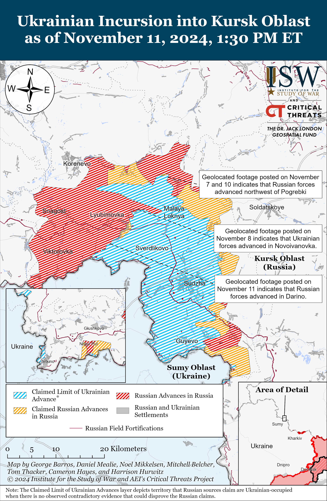
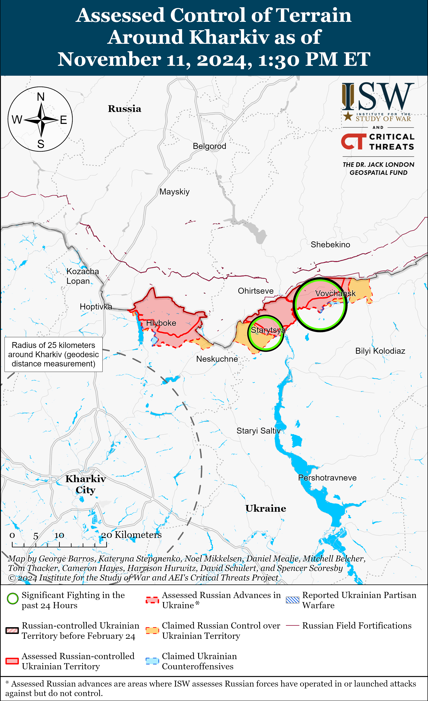
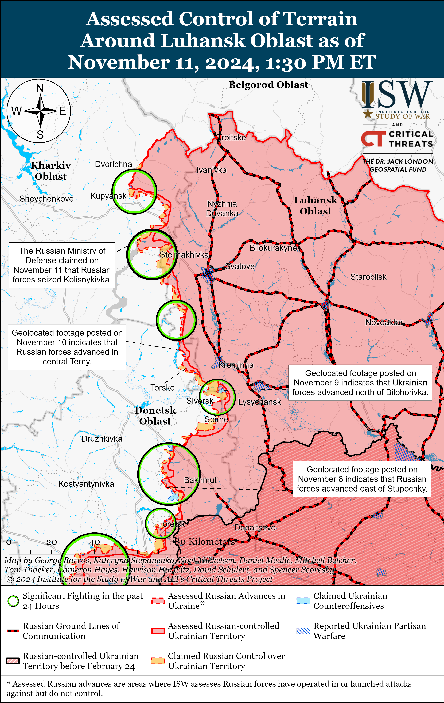
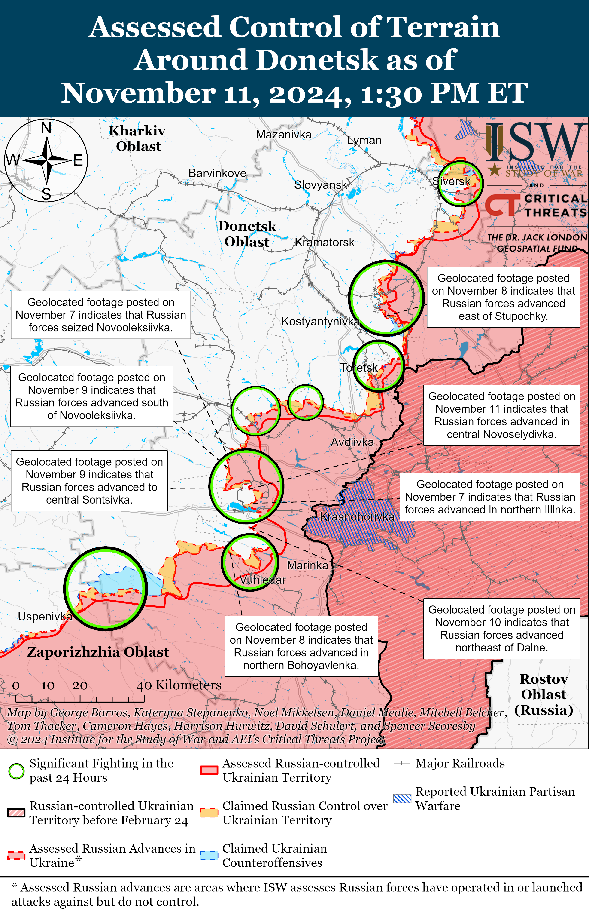
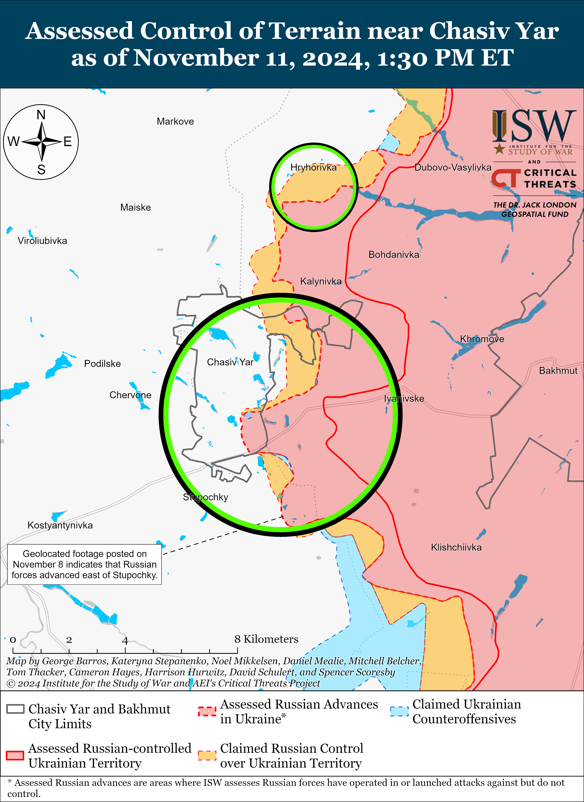
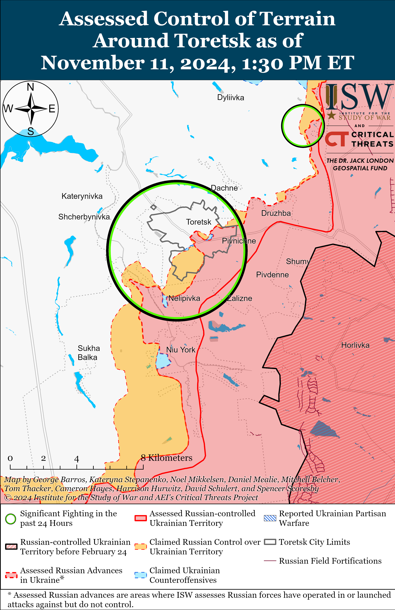
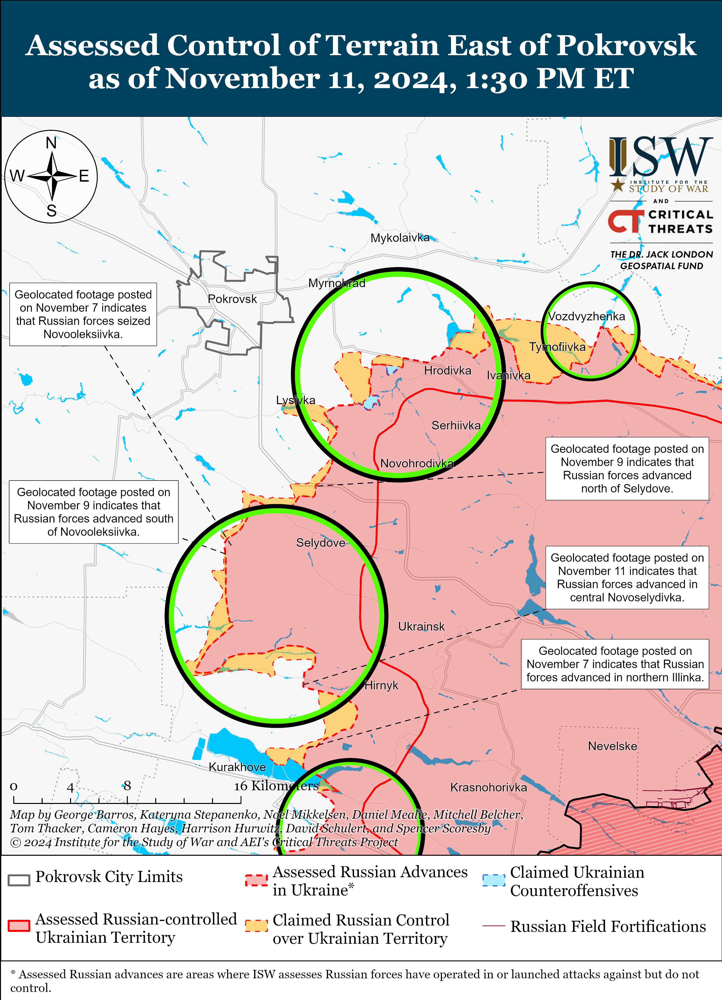
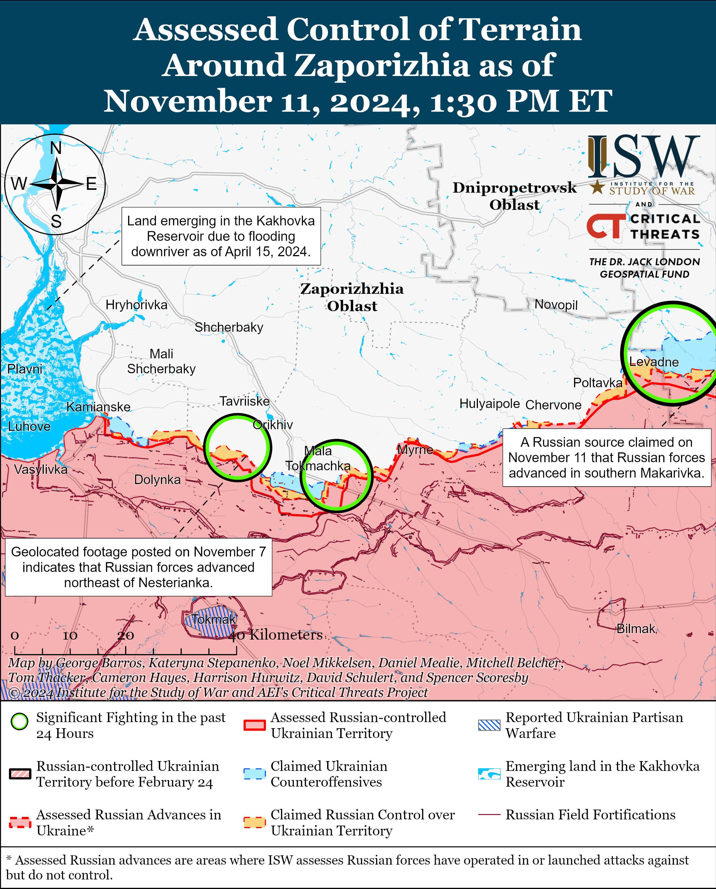
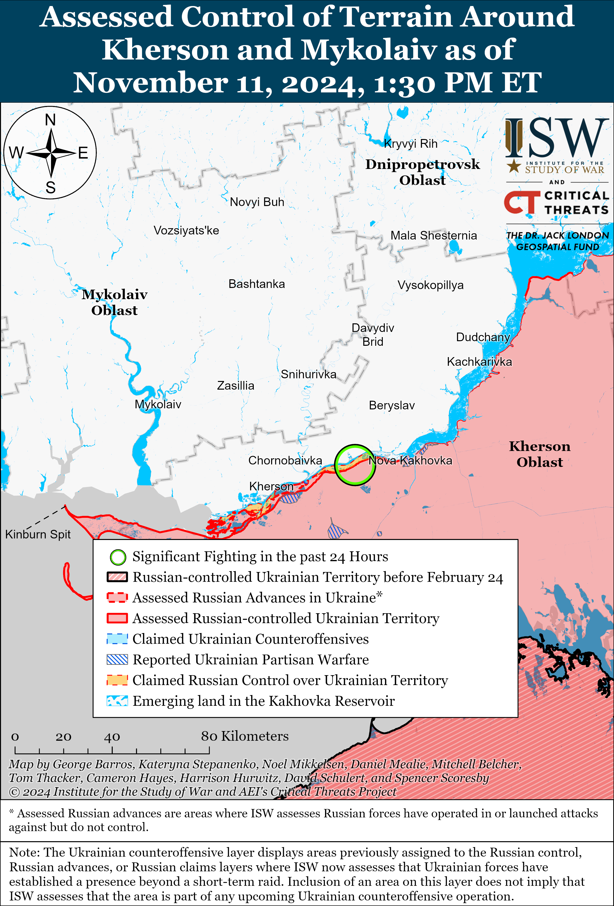

# Russian Offensive Campaign Assessment, November 11, 2024

**November 11, 2024, 6:40pm ET**

**Click** [**here**](https://storymaps.arcgis.com/stories/36a7f6a6f5a9448496de641cf64bd375) **to see ISW’s interactive map of the Russian invasion of Ukraine. This map is updated daily alongside the static maps present in this report.**

**Click** [**here**](https://understandingwar.maps.arcgis.com/apps/instant/3dviewer/index.html?appid=1602762dbcde419bb957dea358449580) **to see ISW’s 3D control of terrain topographic map of Ukraine. Use of a computer (not a mobile device) is strongly recommended for using this data-heavy tool.**

**Click** [**here**](https://storymaps.arcgis.com/stories/733fe90805894bfc8562d90b106aa895) **to access ISW’s archive of interactive time-lapse maps of the Russian invasion of Ukraine. These maps complement the static control-of-terrain map that ISW produces daily by showing a dynamic frontline. ISW will update this time-lapse map archive monthly.**

**Note: The data cut-off for this product was 12:15pm ET on November 11. ISW will cover subsequent reports in the November 12 Russian Offensive Campaign Assessment.**

**Russian forces are successfully leveraging their recent seizure of Vuhledar to make tactically significant gains south of Kurakhove in support of ongoing Russian offensive operations that aim to level the frontline and eliminate the Ukrainian salient in western Donetsk Oblast.** Russian forces intensified offensive operations in western Donetsk Oblast in early September 2024 and are currently attempting to envelop Kurakhove from the north and south and to level the frontline between Sontsivka (northwest of Kurakhove) and Shakhtarske (northwest of Vuhledar).[[1]](#_ednd88745dfacae2e5424b9cad570c8181d1) Russian forces seized Vuhledar as of October 1 and have advanced north and northwest of Vuhledar in a series of successful mechanized and infantry assaults over the last month.[[2]](#_ednd88745dfacae2e5424b9cad570c8181d2) Russian forces have also marginally advanced northeast of Vuhledar near Antonivka and Katerynivka, but ISW is yet to observe confirmation of Russian advances into Yelizavetivka and further west along the C051104 highway.[[3]](#_ednd88745dfacae2e5424b9cad570c8181d3) Russian forces are currently several kilometers south of the Romanivka-Uspenivka-Sukhyi Yar line — a string to settlements north of Vuhledar that could pose a notable challenge to Russian forces should Ukrainian forces be able to establish defenses in these settlements. Russian forces appear to be attempting to bypass this line of settlements, however, as geolocated footage published on November 10 indicates that Russian forces recently advanced northeast of Dalne (south of Kurakhove and northwest of Yelizavetivka) and likely hold positions in the fields east and southeast of Dalne.[[4]](#_ednd88745dfacae2e5424b9cad570c8181d4) Russian milbloggers claimed that Russian forces advanced into Dalne itself, but ISW has not observed visual confirmation of these maximalist claims.[[5]](#_ednd88745dfacae2e5424b9cad570c8181d5) Further Russian advances into Dalne and west of Dalne could force Ukrainian forces to withdraw from positions in the pocket north and northeast of Vuhledar and allow Russian forces to advance along the C051104 highway relatively uncontested. Such advances would allow Russian forces to further pressure Ukrainian positions in Kurakhove from the south. **ISW is revising its previous assessment that Russian forces would not likely be able to take advantage of the seizure of Vuhledar for further offensive operations in western Donetsk Oblast. That assessment was incorrect.**

Russian forces also continued to advance in other areas of the Kurakhove and Vuhledar directions on November 10 and 11. Additional geolocated footage published on November 11 indicates that elements of the Russian 114th Motorized Rifle Brigade (51st Combined Arms Army [CAA], formerly 1st Donetsk People's Republic Army Corps [DNR AC]) recently advanced into central Novoselydivka (north of Kurakhove).[[6]](#_ednd88745dfacae2e5424b9cad570c8181d6) Russian milbloggers claimed that Russian forces seized Novoselydivka and advanced near Novooleksiivka and into Sontsivka (both northwest of Kurakhove).[[7]](#_ednd88745dfacae2e5424b9cad570c8181d7) Russian milbloggers claimed that Russian forces have advanced into the eastern outskirts of Kurakhove and that there is fighting along Stantsiyna and Kozatska streets.[[8]](#_ednd88745dfacae2e5424b9cad570c8181d8) Russian milbloggers also claimed that Russian forces advanced into the outskirts of Maksymivka (northwest of Vuhledar) and further north and east of Bohoyavlenka (north of Vuhledar).[[9]](#_ednd88745dfacae2e5424b9cad570c8181d9) A Kremlin-affiliated Russian milblogger claimed that there are unconfirmed reports of Russian forces entering Yelizavetivka.[[10]](#_ednd88745dfacae2e5424b9cad570c8181d10) ISW has not observed confirmation of these claims, however. Russian forces continued assaults northeast of Kurakhove near Novodmytrivka, and Sontsivka; north of Kurakhove near Voznesenka, Illinka, Berestky, and Novoselydivka; south of Kurakhove near Dalne; northeast of Vuhledar near Maksymilyanivka, Antonivka, and Katerynivka; and northwest of Vuhledar near Trudove, Kostyantynopolske, Uspenivka, Bohoyavlenka, and Maksymivka on November 10 and 11.[[11]](#_ednd88745dfacae2e5424b9cad570c8181d11)

**Russian forces reportedly continue to advance in the Donetsk-Zaporizhia Oblast border area, and Russian advances northwest of Vuhledar and south of Velyka Novosilka may begin to pressure Ukrainian positions in Velyka Novosilka.** ISW assessed on November 4 that Russian forces seized Shakhtarske (northeast of Velyka Novosilka and northwest of Vuhledar), and Russian sources have claimed further Russian advances north and west of Shakhtarske since.[[12]](#_ednd88745dfacae2e5424b9cad570c8181d12) Russian forces notably resumed tactical ground attacks in the Donetsk-Zaporizhia Oblast border area in mid-October 2024.[[13]](#_ednd88745dfacae2e5424b9cad570c8181d13) Russian milbloggers claimed on November 11 that Russian forces advanced in southern Makarivka (south of Velyka Novosilka and west of Vuhledar), with some milbloggers claiming that elements of the Russian 60th Motorized Rifle Brigade (5th CAA, Eastern Military District [EMD]) raised a flag over an unspecified area of the settlement.[[14]](#_ednd88745dfacae2e5424b9cad570c8181d14) The Ukrainian General Staff reported on November 11 that Russian forces attacked south of Velyka Novosilka near Makarivka; southwest of Velyka Novosilka near Novodarivka and Rivnopil; and west of Velyka Novosilka near Zeleny Pol.[[15]](#_ednd88745dfacae2e5424b9cad570c8181d15) This November 11 report and previous Russian milblogger claims suggest that Russian forces are likely engaged in a concerted offensive effort to advance towards Velyka Novosilka from the south and southwest.[[16]](#_ednd88745dfacae2e5424b9cad570c8181d16) Russian forces would have to first advance through settlements south of Velyka Novosilka, including Blahodatne, Neskuchne, and Vremivka, in order to reach the southern and southwestern outskirts of Velyka Novosilka, and advances through these settlements could prove costly and time-consuming should Ukrainian forces choose to defend here. Russian forces will likely also leverage positions within Shakhtarske and in the fields south of the settlement to pressure Ukrainian positions in the area and attempt to force Ukrainian forces to withdraw from defensive positions south of Velyka Novosilka.

**Russian forces have advanced in western Donetsk Oblast at a moderate tempo, but Russian forces remain highly unlikely to be able to conduct rapid mechanized maneuver that could successfully encircle Ukrainian forces.** Russian forces have advanced just over 10 kilometers from the Vuhledar-Prechystivka line over the past five weeks, and the current rate of Russian advance in western Donetsk Oblast — should it continue - would allow Ukrainian units ample time to withdraw from frontline positions without risk of encirclement. The possible future elimination of the Ukrainian salient around Kurakhove does not portend the collapse of the frontline in Donetsk Oblast, moreover, as settlements further west could provide suitably defensible positions for Ukrainian forces in the future. Grinding Russian assaults in western Donetsk Oblast and throughout the frontline will likely continue in the coming weeks and months as the Russian military continues efforts to retain the theater-wide initiative that are degrading Russian manpower and materiel. It remains unclear if Russian forces will be able to exploit further advances in western Donetsk Oblast should Russian forces successfully close this pocket, and the future culmination of Russian offensive operations in western Donetsk Oblast will provide Ukrainian forces with an opportunity to contest and possibly seize the battlefield initiative.

**Ukrainian and Russian sources stated on November 11 that damage to a dam of the Kurakhivske Reservoir is causing limited flooding in nearby settlements.** Ukrainian Kurakhove City Military Administration Head Roman Padun reported on the morning of November 11 that water is flowing near the Ternivska Dam but that Ukrainian authorities cannot inspect the dam to confirm the damage due to constant Russian shelling.[[17]](#_ednd88745dfacae2e5424b9cad570c8181d17) Padun stated that there was flooding in Velykonovosilkivska Hromada (west and southwest of the dam). Ukrainian Donetsk Oblast Military Administration Head Vadym Filashkin reported on the evening of November 11 that the water level in Velykonovosilkivska Hromada had risen by 1.2 meters, but no houses had flooded as of 1600 local time.[[18]](#_ednd88745dfacae2e5424b9cad570c8181d18) Filashkin stated that flooding may affect settlements along the Vovcha River in Donetsk and Dnipropetrovsk oblasts. A Ukrainian Telegram channel reported that sources in Ukrainian emergency services stated that unspecified actors shelled Kurakhove in the morning of November 11, destroying the Ternivska Dam.[[19]](#_ednd88745dfacae2e5424b9cad570c8181d19) The channel reported that there was no flooding in Bahatyr, Oleksiivka, Andriivka, and Kostyantynopil (all west of the dam along the Vovcha River). Another Ukrainian Telegram channel stated that roads near the dam are usable but that the movement of armored vehicles on dirt roads is limited.[[20]](#_ednd88745dfacae2e5424b9cad570c8181d20) Russian milbloggers and opposition outlets noted that photos circulating on the internet purporting to show damage to the Ternivska Dam actually show the Kozarovytska Dam, which Ukrainian forces destroyed in February 2022 to prevent Russian advances near Kyiv at the start of the full-scale invasion.[[21]](#_ednd88745dfacae2e5424b9cad570c8181d21)

**Ukrainian and Russian sources disagreed about who was responsible for damaging the dam, but Russian forces reportedly struck the dam in September 2024.** Ukrainian Donetsk Oblast Military Administration Head Vadym Filashkin reported on the evening of November 11 that Russian forces struck the dam.[[22]](#_ednd88745dfacae2e5424b9cad570c8181d22) Russian milbloggers claimed Ukrainian forces struck the dam to prevent further Russian advances, but some milbloggers noted that these claims are unconfirmed.[[23]](#_ednd88745dfacae2e5424b9cad570c8181d23) A Russian milblogger claimed in September 2024 that Russian forces increased their air and ballistic missile strikes targeting dams of the Kurakhove Reservoir in order to disrupt Ukrainian ground lines of communication (GLOCs) and force Ukrainian forces to use dirt roads near Bahatyr.[[24]](#_ednd88745dfacae2e5424b9cad570c8181d24) The milblogger claimed that Russian forces conducted several strikes against the Ternivska Dam on September 18 that disabled the lock control system but did not result in flooding in nearby settlements.[[25]](#_ednd88745dfacae2e5424b9cad570c8181d25)

**Russian forces may have struck the dam in order to cause significant, long-lasting flooding west of Kurakhivske Reservoir that could facilitate Russian efforts to envelop Ukrainian forces north and south of Kurakhove.** Russian forces are currently conducting offensive operations north, southeast, south, and southwest of Kurakhove as part of wider efforts to eliminate the Ukrainian salient in the Kurakhove direction. Russian offensive operations northwest and north of Kurakhove along the Sontsivka-Voznesenka-Novoselydivka line aim to advance southwestward and southward to envelop the Ukrainian pocket north of the Kurakhivske Reservoir. Russian forces are also attacking along a wide front along the Shakhtarske-Trudove-Antonivka line in order to envelop the Ukrainian salient south of Kurakhove. The Kurakhivske Reservoir is a significant water barrier separating the Ukrainian force groupings north and south of Kurakhove, and Russian forces may have struck the Ternivska Dam in order to flood settlements along the Vovcha River west of the reservoir, extending the water barrier separating these Ukrainian groupings. Russian forces may have also intended for flooding along the river to prevent Ukrainian forces from using the H-15 (Donetsk City-Zaporizhzhia City) highway, a significant Ukrainian GLOC that runs through Kurakhove and just south of the Vovcha River. The potential advantages that Russian forces could gain from the damage to the dam are currently unclear, however, as the extent and duration of the flooding remain unknown at this time.

**Kremlin Spokesperson Dmitry Peskov denied on November 11 reports of a recent phone conversation between Russian President Vladimir Putin and US President-elect Donald Trump.[[26]](#_ednd88745dfacae2e5424b9cad570c8181d26)** Peskov dismissed reports of Putin and Trump's phone call, claiming that Russian officials have no plans to organize a call between Putin and Trump. The *Washington Post* reported on November 10 that Trump spoke with Putin on November 7 and advised Putin to refrain from further escalation in Ukraine.[[27]](#_ednd88745dfacae2e5424b9cad570c8181d27)

**Key Takeaways:**

- **Russian forces are successfully leveraging their recent seizure of Vuhledar to make tactically significant gains south of Kurakhove in support of ongoing Russian offensive operations that aim to level the frontline and eliminate the Ukrainian salient in western Donetsk Oblast.**
- **ISW is revising its previous assessment that Russian forces would not likely be able to take advantage of the seizure of Vuhledar for further offensive operations in western Donetsk Oblast. That assessment was incorrect.**
- **Russian forces reportedly continue to advance in the Donetsk-Zaporizhia Oblast border area, and Russian advances northwest of Vuhledar and south of Velyka Novosilka may begin to pressure Ukrainian positions in Velyka Novosilka.**
- **Russian forces have advanced in western Donetsk Oblast at a moderate tempo, but Russian forces remain highly unlikely to be able to conduct rapid mechanized maneuver that could successfully encircle Ukrainian forces.**
- **Ukrainian and Russian sources stated on November 11 that damage to a dam of the Kurakhivske Reservoir is causing limited flooding in nearby settlements.**
- **Ukrainian and Russian sources disagreed about who was responsible for damaging the dam, but Russian forces reportedly struck the dam in September 2024.**
- **Russian forces may have struck the dam in order to cause significant, long-lasting flooding west of Kurakhivske Reservoir that could facilitate Russian efforts to envelop Ukrainian forces north and south of Kurakhove.**
- **Kremlin Spokesperson Dmitry Peskov denied on November 11 reports of a recent phone conversation between Russian President Vladimir Putin and U.S. President-elect Donald Trump.**
- **Ukrainian forces recently advanced in Kursk Oblast. Russian forces recently advanced in Kursk Oblast and near Kreminna and Kurakhove.**
- **Russian regional governments continue to commit large portions of their social budgets towards payments to Russian veterans, likely as part of ongoing efforts to incentivize Russian military service.**

****

***We do not report in detail on Russian war crimes because these activities are well-covered in Western media and do not directly affect the military operations we are assessing and forecasting. We will continue to evaluate and report on the effects of these criminal activities on the Ukrainian military and the Ukrainian population and specifically on combat in Ukrainian urban areas. We utterly condemn Russian violations of the laws of armed conflict and the Geneva Conventions and crimes against humanity even though we do not describe them in these reports.***

- Ukrainian Operations in the Russian Federation
- Russian Main Effort — Eastern Ukraine (comprised of three subordinate main efforts)
- Russian Subordinate Main Effort #1 — Push Ukrainian forces back from the international border with Belgorod Oblast and approach to within tube artillery range of Kharkiv City
- Russian Subordinate Main Effort #2 — Capture the remainder of Luhansk Oblast and push westward into eastern Kharkiv Oblast and encircle northern Donetsk Oblast
- Russian Subordinate Main Effort #3 — Capture the entirety of Donetsk Oblast
- Russian Supporting Effort — Southern Axis
- Russian Air, Missile, and Drone Campaign
- Russian Mobilization and Force Generation Efforts
- Russian Technological Adaptations
- Activities in Russian-occupied areas
- Significant Activity in Belarus

**Ukrainian Operations in the Russian Federation**

Ukrainian forces recently marginally advanced within the main Ukrainian salient in Kursk Oblast amid continued Ukrainian offensive operations in the area on November 11. Geolocated footage published on November 8 indicates that Ukrainian forces recently marginally advanced in eastern Novoivanovka (southeast of Korenevo).[[28]](#_ednd88745dfacae2e5424b9cad570c8181d28) Russian sources, including the Russian Ministry of Defense (MoD), claimed on November 11 that Ukrainian forces attacked east of Korenevo near Olgovka and southeast of Korenevo near Novoivanovka, Nikolayevo-Darino, and Darino.[[29]](#_ednd88745dfacae2e5424b9cad570c8181d29)

Russian forces recently advanced within the main Ukrainian salient in Kursk Oblast amid continued Russian offensive operations in the area on November 11. Geolocated footage published on November 7 and 10 indicates that elements of the Russian 810th Naval Infantry Brigade (Black Sea Fleet [BSF], Southern Military District [SMD]) recently recaptured positions during a roughly reduced company-sized mechanized assault northwest of Pogrebki (north of Sudzha).[[30]](#_ednd88745dfacae2e5424b9cad570c8181d30) Additional geolocated footage published on November 11 indicates that Russian forces recently advanced in eastern Darino.[[31]](#_ednd88745dfacae2e5424b9cad570c8181d31) Russian milbloggers claimed that Russian forces seized Darino, although ISW has not observed visual evidence of this claim.[[32]](#_ednd88745dfacae2e5424b9cad570c8181d32) Russian forces continued attacking southeast of Korenevo near Leonidove, Nikolayevo-Darino, Darino, Kruglenkoye and Novoivanovka; and north of Sudzha near Malaya Loknya.[[33]](#_ednd88745dfacae2e5424b9cad570c8181d33) Ukraine's Pivnich (Northern) Operational Command Spokesperson Colonel Vadym Mysnyk reported on November 11 that Russian forces are conducting a high tempo of ground attacks in Kursk Oblast and that Russian forces conduct assaults in intervals of 10 to 15 minutes.[[34]](#_ednd88745dfacae2e5424b9cad570c8181d34) Mysnyk stated that Russian forces are conducting air, drone, and multiple launch rocket systems (MLRS) strikes against Sumy, Chernihiv, and Kharkiv oblasts.[[35]](#_ednd88745dfacae2e5424b9cad570c8181d35) Mysnyk noted that many Russian munitions fall onto Kursk Oblast, however, and that the intensity of Russian strikes in Kursk Oblast is two to three times higher than in Ukraine. Mysnyk stated that elements of the Russian 810th Naval Infantry Brigade and 155th Naval Infantry Brigade (Pacific Fleet, Eastern Military District [EMD]) are operating in Kursk Oblast.[[36]](#_ednd88745dfacae2e5424b9cad570c8181d36) Elements of the Russian 51st Airborne (VDV) Regiment (106th VDV Division) are reportedly operating near Darino.[[37]](#_ednd88745dfacae2e5424b9cad570c8181d37)

Ukrainian President Volodymyr Zelensky stated on November 11 that Russian forces have concentrated almost 50,000 personnel in Kursk Oblast.[[38]](#_ednd88745dfacae2e5424b9cad570c8181d38) Mysnyk also noted that the Russian military is frequently transferring new reserves to Kursk Oblast due to high personnel and equipment losses.[[39]](#_ednd88745dfacae2e5424b9cad570c8181d39)

**Russian Main Effort — Eastern Ukraine**

**Russian Subordinate Main Effort #1 — Kharkiv Oblast** **(Russian objective: Push Ukrainian forces back from the international border with Belgorod Oblast and approach to within tube artillery range of Kharkiv City)**

Russian forces continued offensive operations northeast of Kharkiv City near Vovchansk and Starytsya on November 10 and 11 but did not advance.[[40]](#_ednd88745dfacae2e5424b9cad570c8181d40) an milbloggers claimed that Russian forces made tactical gains and improved their positions in central Vovchansk, but ISW has not observed confirmation of these claims.[[41]](#_ednd88745dfacae2e5424b9cad570c8181d41) Elements of Rosgvardia's 116th Spetsnaz Brigade reportedly continue to operate near Vovchansk.[[42]](#_ednd88745dfacae2e5424b9cad570c8181d42)

**Russian Subordinate Main Effort #2 — Luhansk Oblast (Russian objective: Capture the remainder of Luhansk Oblast and push westward into eastern Kharkiv Oblast and northern Donetsk Oblast)**

Russian forces reportedly advanced near Kupyansk amid continued offensive operations along the Kupyansk-Svatove line on November 10. The Russian Ministry of Defense (MoD) claimed that elements of the Russian 153rd Tank Regiment and 347th Motorized Rifle Regiment (both of the 47th Tank Division, 1st Guards Tank Army [GTA], Moscow Military District [MMD]) seized Kolisnykivka (southeast of Kupyansk).[[43]](#_ednd88745dfacae2e5424b9cad570c8181d43) Russian milbloggers claimed that Russian forces advanced near Petropavlivka (east of Kupyansk) and near Berestove (southeast of Kupyansk) towards Lozova (southeast of Berestove).[[44]](#_ednd88745dfacae2e5424b9cad570c8181d44) ISW has not observed confirmation of these claims, however. Russian forces conducted offensive operations north of Kupyansk near Kindrashivka; southeast of Kupyansk near Zahryzove; west of Svatove near Zeleny Hai; and southwest of Svatove near Hrekivka on November 10 and 11.[[45]](#_ednd88745dfacae2e5424b9cad570c8181d45) A Russian source claimed that Ukrainian forces unsuccessfully counterattacked near Vyshneve (west of Svatove).[[46]](#_ednd88745dfacae2e5424b9cad570c8181d46) The spokesperson of a Ukrainian brigade operating in the Kupyansk direction reported on November 11 that Russian forces have not used armored vehicles and heavy equipment during assaults and in near rear areas for about a month and are only conducting assaults with small infantry groups.[[47]](#_ednd88745dfacae2e5424b9cad570c8181d47) The spokesperson also reported that Russian forces in the Kupyansk direction consist of mobilized personnel, contract personnel (*kontraktniki*), and personnel from unspecified private military companies (PMCs) with varying levels of combat experience and training.[[48]](#_ednd88745dfacae2e5424b9cad570c8181d48) Ukrainian Kharkiv Oblast Head Oleh Synehubov announced mandatory evacuations on November 11 for 10 settlements in Borivska Hromada, including Borova (west of Svatove).[[49]](#_ednd88745dfacae2e5424b9cad570c8181d49)

Russian forces recently advanced near Kreminna amid continued offensive operations in the area on November 10. Geolocated footage published on November 10 indicates that Russian forces recently advanced in central Terny (west of Kreminna).[[50]](#_ednd88745dfacae2e5424b9cad570c8181d50) Russian forces conducted offensive operations west of Kreminna near Terny and Torske and south of Kreminna near Serebryanka on November 10 and 11.[[51]](#_ednd88745dfacae2e5424b9cad570c8181d51) A Russian milblogger claimed that Ukrainian drone and artillery strikes are slowing Russian advances near Terny.[[52]](#_ednd88745dfacae2e5424b9cad570c8181d52) Ukrainian military observer Kostyantyn Mashovets stated that elements of the Russian 31st, 36th, and 37th motorized rifle regiments; 19th Tank Regiment; 164th Motorized Rifle Brigade (all of the 67th Motorized Rifle Division, 25th Combined Arms Army [CAA], Central Military District [CMD]); 169th Motorized Rifle Brigade; and 11th Tank Brigade (both of the 25th CAA) are operating in the Lyman direction.[[53]](#_ednd88745dfacae2e5424b9cad570c8181d53) Mashovets stated that the Russian force grouping in the Lyman direction consists of 34,000-35,000 personnel, up to 540 tanks, 980-985 armored fighting vehicles, 325-330 artillery systems, and 112-114 multiple launch rocket systems (MLRS).[[54]](#_ednd88745dfacae2e5424b9cad570c8181d54) Elements of the Russian 144th Motorized Rifle Brigade (20th CAA, MMD) are reportedly operating near Terny.[[55]](#_ednd88745dfacae2e5424b9cad570c8181d55)

**Russian Subordinate Main Effort #3 — Donetsk Oblast (Russian objective: Capture the entirety of Donetsk Oblast, the claimed territory of Russia’s proxies in Donbas)**

Russian forces continued assaults east of Siversk near Verkhnokamyanske and southeast of Siversk near Vyimka on November 10 and 11, but there were no confirmed changes to the frontline.[[56]](#_ednd88745dfacae2e5424b9cad570c8181d56) Ukrainian military observer Kostyantyn Mashovets stated that elements of the Russian 106th Airborne (VDV) Division and the 3rd Combined Arms Army (CAA) (formerly the 2nd Luhansk People's Republic Army Corps [LNR AC]), including its 6th, 127th, and 123rd motorized rifle brigades and most of the 85th and 88th motorized rifle brigades, are operating between Spirne (southeast of Siversk) and Orikhovo-Vasylivka (southwest of Siversk and north of Chasiv Yar).[[57]](#_ednd88745dfacae2e5424b9cad570c8181d57) Mashovets stated that elements of the 6th Motorized Rifle Brigade advanced a total of three to 3.2 kilometers in the direction of Zolotarivka-Verkhnokamyanske and Verkhnokamyanka-Verkhnokamyanske (all east of Siversk) during Summer-Autumn 2024.[[58]](#_ednd88745dfacae2e5424b9cad570c8181d58) Mashovets stated that elements of the Russian 123rd Motorized Rifle Brigade and 106th VDV Division are unsuccessfully attacking along the railway line from Rozdolivka in the direction of Pereizne (both south of Siversk).[[59]](#_ednd88745dfacae2e5424b9cad570c8181d59) Mashovets noted that Russian forces operating southwest of Siversk also unsuccessfully attacked from Zaliznyanske towards Privillya in September 2024 and later withdrew from forward positions in the area.[[60]](#_ednd88745dfacae2e5424b9cad570c8181d60) Mashovets stated that elements of the 127th Motorized Rifle Brigade, reinforced by a tank battalion of the 123rd Motorized Rifle Brigade, are operating near Bilohorivka (northeast of Siversk).[[61]](#_ednd88745dfacae2e5424b9cad570c8181d61)

Russian forces continued offensive operations in the Chasiv Yar direction on November 11 but did not make any confirmed advances. Russian forces attacked near Chasiv Yar itself and south of Chasiv yar near Stupochky on November 10 and 11.[[62]](#_ednd88745dfacae2e5424b9cad570c8181d62) A Russian milblogger claimed that Russian forces entered Stupochky, but ISW assesses that Russian forces are still roughly 2.5 kilometers from of the settlement.[[63]](#_ednd88745dfacae2e5424b9cad570c8181d63) Elements of the Russian 98th VDV Division and the "Okhotnik" ("Hunter") Spetsnaz Detachment (51st CAA, formerly the 1st Donetsk People’s Republic [DNR] AC) are reportedly operating near Chasiv Yar, and elements of the 6th Motorized Rifle Division (3rd Army Corps [AC) are reportedly operating south of Chasiv Yar.[[64]](#_ednd88745dfacae2e5424b9cad570c8181d64)

Russian forces continued offensive operations in the Toretsk direction on November 11 but did not make any confirmed advances. Russian forces attacked near Toretsk itself; west of Toretsk near Shcherbynivka; and southwest of Toretsk near Nelipivka on November 10 and 11.[[65]](#_ednd88745dfacae2e5424b9cad570c8181d65) Elements of the Russian 56th Spetsnaz Battalion (51st CAA) and the ”Rodnya” Battalion are reportedly operating near Niu York (south of Toretsk), and elements of the "Sparta" Separate Reconnaissance Battalion (51st CAA) are reportedly operating in Toretsk.[[66]](#_ednd88745dfacae2e5424b9cad570c8181d66)

Russian forces continued offensive operations in the Pokrovsk direction on November 11 but did not make any confirmed advances. A Russian milblogger claimed that Russian forces advanced southeast of Pokrovsk near Selydove and Hryhorivka and south of Pokrovsk near Novooleksiivka, although ISW has not observed visual confirmation of these claims.[[67]](#_ednd88745dfacae2e5424b9cad570c8181d67) Russian forces continued attacking east of Pokrovsk near Promin and Myrolyubivka and southeast of Pokrovsk near Lysivka, Sukhyi Yar, Selydove, Hryhorivka and Petrivka on November 10 and 11.[[68]](#_ednd88745dfacae2e5424b9cad570c8181d68)

*See topline text for updates on the Kurakhove, Vuhledar, and Donetsk-Zaporizhia Oblast border areas.*

**Russian Supporting Effort — Southern Axis (Russian objective: Maintain frontline positions and secure rear areas against Ukrainian strikes)**

Russian forces continued assaults in western Zaporizhia Oblast near Mala Tokmachka (northeast of Robotyne) and near Novoandriivka (northwest of Robotyne) on November 10 and 11, but there were no confirmed changes to the frontline.[[69]](#_ednd88745dfacae2e5424b9cad570c8181d69) Ukrainian Tavriisk Group of Forces Spokesperson Colonel Vladyslav Voloshyn reported that Russian forces may intensify assaults with armored vehicles, buggies, and motorcycles in Zaporizhia Oblast in the near future after increasing reconnaissance operations and the number of air strikes in the area by 30 to 40 percent in the past several weeks.[[70]](#_ednd88745dfacae2e5424b9cad570c8181d70) Drone operators of the Russian ”Nemtsa” Group of the 291st Motorized Rifle Regiment (42nd Motorized Rifle Division, 58th Combined Arms Army [CAA], Southern Military District [SMD]) are reportedly operating near Robotyne, and elements of the Russian 76th Airborne (VDV) Division are reportedly operating near Novooleksandriivka (southwest of Robotyne in the Russian rear).[[71]](#_ednd88745dfacae2e5424b9cad570c8181d71)

Positional fighting continued in the Dnipro direction in east (left) bank Kherson Oblast on November 10 and 11, but there were no confirmed changes to the frontline.[[72]](#_ednd88745dfacae2e5424b9cad570c8181d72)

****

Russian Defense Minister Andrei Belousov visited a Russian "Dnepr" Grouping of Forces command post on November 11 and met with Russian "Dnepr" Grouping of Forces and VDV Commander Colonel General Mikhail Teplinsky to discuss the situation in the Kherson and Zaporizhia directions.[[73]](#_ednd88745dfacae2e5424b9cad570c8181d73) Teplinsky also claimed that Russian forces are effectively implementing Russian-made drones in their reconnaissance-strike complex (RSC) and reconnaissance-fire complex (RFC) in the area.[[74]](#_ednd88745dfacae2e5424b9cad570c8181d74)

**Russian Air, Missile, and Drone Campaign (Russian Objective: Target Ukrainian military and civilian infrastructure in the rear and on the frontline)**

Russian forces conducted a series of drone and missile strikes against Ukraine on the night of November 10 to 11. The Ukrainian Air Force reported on November 11 that Russian forces launched two Kh-59/69 cruise missiles from airspace over occupied Zaporizhia Oblast and 74 Shahed drones and strike drones of an unknown type from Kursk, Oryol, and Bryansk oblasts and Primorsko-Akhtarsk, Krasnodar Krai. The Ukrainian Air Force reported that Ukrainian forces downed two Kh-59/69 cruise missiles and 39 drones over Kyiv, Zhytomyr, Poltava, Sumy, Cherkasy, Zaporizhia, Chernihiv, Dnipropetrovsk, and Mykolaiv oblasts; that 30 drones were ”locally lost,” likely due to Ukrainian electronic warfare (EW) interference; and that three drones flew towards Belarusian airspace and occupied Ukrainian territories. Ukrainian officials reported on November 11 that Russian forces struck an apartment building in Kryvyi Rih, Dnipropetrovsk Oblast with an unspecified ballistic missile, injuring civilians.[[75]](#_ednd88745dfacae2e5424b9cad570c8181d75) Ukrainian Donetsk Oblast police reported on November 11 that Russian forces struck a residential complex in Kramatorsk, Donetsk Oblast with three UMPB D-30SN guided glide bombs.[[76]](#_ednd88745dfacae2e5424b9cad570c8181d76) Ukrainian officials reported on November 11 that Russian drone strikes killed civilians and damaged residential areas in Mykolaiv City.[[77]](#_ednd88745dfacae2e5424b9cad570c8181d77) Ukrainian officials also reported that Russian forces conducted airstrikes on Zaporizhzhia City and Prymorsk City, Zaporizhia Oblast, damaging civilian infrastructure and injuring civilians.[[78]](#_ednd88745dfacae2e5424b9cad570c8181d78)

Ukraine’s Main Military Intelligence Directorate (GUR) reported on November 11 that Russian forces used over 2,000 drones against Ukraine in October 2024 - roughly half of which were decoys or false targets that aim to overwhelm Ukrainian air defenses.[[79]](#_ednd88745dfacae2e5424b9cad570c8181d79) The GUR stated that these decoy drones do not contain explosives, are much smaller and cheaper to produce than Shahed drones, and mimic Shaheds on radar. The GUR noted that two such decoy drones fell in Moldova on November 10.

**Russian Mobilization and Force Generation Efforts (Russian objective: Expand combat power without conducting general mobilization)**

Russian regional governments continue to commit large portions of their social budgets towards payments to Russian veterans, likely as part of ongoing efforts to incentivize Russian military service. Russian opposition outlet *Vazhnye Istorii* (*iStories*) reported on November 11 that Stavropol Krai is spending 83 percent of its social budgets on payments to Russian veterans and that Russian regions are spending on average 13 percent of their budgets on one-time payments to contract servicemembers (*kontraktniki*).[[80]](#_ednd88745dfacae2e5424b9cad570c8181d80) *iStories* reported that one-time payments to veterans and the families of deceased servicemembers have reached or exceeded a quarter of the entire budget for 35 percent of all Russian regions.

**Russian Technological Adaptations** **(Russian objective: Introduce technological innovations to optimize systems for use in Ukraine)**

Nothing significant to report.

**Activities in Russian-occupied areas (Russian objective: Consolidate administrative control of annexed areas; forcibly integrate Ukrainian citizens into Russian sociocultural, economic, military, and governance systems)**

*ISW is not publishing coverage of activities in Russian-occupied areas today.*

**Significant activity in Belarus (Russian efforts to increase its military presence in Belarus and further integrate Belarus into Russian-favorable frameworks and Wagner Group activity in Belarus)**

The Belarusian Ministry of Foreign Affairs (MFA) announced on November 11 that Belarus officially obtained BRICS partner country status, enabling it to permanently participate in special sessions of the bloc's summits and foreign ministers' meeting.[[81]](#_ednd88745dfacae2e5424b9cad570c8181d81)

**Note: ISW does not receive any classified material from any source, uses only publicly available information, and draws extensively on Russian, Ukrainian, and Western reporting and social media as well as commercially available satellite imagery and other geospatial data as the basis for these reports. References to all sources used are provided in the endnotes of each update.**

---

[[1]](#_ednd88745dfacae2e5424b9cad570c8181dref1) https://isw.pub/UkrWar090524

[[2]](#_ednd88745dfacae2e5424b9cad570c8181dref2) <https://www.understandingwar.org/backgrounder/russian-offensive-campaign-assessment-october-1-2024> ; <https://www.understandingwar.org/backgrounder/russian-offensive-campaign-assessment-october-21-2024> ; <https://www.understandingwar.org/backgrounder/russian-offensive-campaign-assessment-october-14-2024>

[[3]](#_ednd88745dfacae2e5424b9cad570c8181dref3) <https://www.understandingwar.org/backgrounder/russian-offensive-campaign-assessment-november-3-2024> ; <https://www.understandingwar.org/backgrounder/russian-offensive-campaign-assessment-november-6-2024>

[[4]](#_ednd88745dfacae2e5424b9cad570c8181dref4) https://x.com/SibirPrizrak/status/1855723386133217420; https://t [dot] me/mechanized33/527; https://t [dot] me/creamy\_caprice/7458; <https://x.com/klinger66/status/1855712532784460030>

[[5]](#_ednd88745dfacae2e5424b9cad570c8181dref5) https://t.me/NgP\_raZVedka/19407

[[6]](#_ednd88745dfacae2e5424b9cad570c8181dref6) <https://t.me/creamy_caprice/7469>; <https://t.me/mo114rf/73> ; <https://x.com/GirkinGirkin/status/1855976507073495162>

[[7]](#_ednd88745dfacae2e5424b9cad570c8181dref7) <https://t.me/z_arhiv/29363> ; <https://t.me/rybar/65288> ; <https://t.me/DnevnikDesantnika/18979> ; <https://t.me/RVvoenkor/80480>

[[8]](#_ednd88745dfacae2e5424b9cad570c8181dref8) <https://t.me/dva_majors/57373> ; <https://t.me/DnevnikDesantnika/19001> ; <https://t.me/wargonzo/23099> ; <https://t.me/RVvoenkor/80480>

[[9]](#_ednd88745dfacae2e5424b9cad570c8181dref9) <https://t.me/rybar/65288>

[[10]](#_ednd88745dfacae2e5424b9cad570c8181dref10) <https://t.me/rybar/65288>

[[11]](#_ednd88745dfacae2e5424b9cad570c8181dref11) <https://www.facebook.com/GeneralStaff.ua/posts/pfbid0eK8TZ5cjXatEHb2Lc8RvqHRJFeiau1gbX9JFPPZNxyrk1JY1hqgFbeMwVaCPxbTHl> ; https://www.facebook.com/GeneralStaff.ua/posts/pfbid029YHit8FbXFk4g9dRfWdtcFfheF2wYT4yaicVZfNTaqKvP9nhHNhaxByBjrD3Ptgml ; <https://www.facebook.com/GeneralStaff.ua/posts/pfbid0YDqNBT3pFZEUKWTpm3FaBAdJrDsZ8Ahk6xYuKaDKyEHKd33iaa4BrdcQyeGHaPeyl>

[[12]](#_ednd88745dfacae2e5424b9cad570c8181dref12) https://www.understandingwar.org/backgrounder/russian-offensive-campaign-assessment-november-4-2024

[[13]](#_ednd88745dfacae2e5424b9cad570c8181dref13) https://isw.pub/UkrWar101324

[[14]](#_ednd88745dfacae2e5424b9cad570c8181dref14) <https://t.me/z_arhiv/29337> ; https://t.me/vrogov/17961 ; <https://t.me/tass_agency/284552> ; <https://t.me/DnevnikDesantnika/18958> ; <https://t.me/RVvoenkor/80433> ; <https://t.me/motopatriot/29470>

[[15]](#_ednd88745dfacae2e5424b9cad570c8181dref15) https://www.facebook.com/GeneralStaff.ua/posts/pfbid0eK8TZ5cjXatEHb2Lc8RvqHRJFeiau1gbX9JFPPZNxyrk1JY1hqgFbeMwVaCPxbTHl

[[16]](#_ednd88745dfacae2e5424b9cad570c8181dref16) https://isw.pub/UkrWar101324

[[17]](#_ednd88745dfacae2e5424b9cad570c8181dref17) <https://suspilne> dot media/donbas/877339-jde-voda-po-selah-so-vidomo-pro-poskodzenna-ternivskoi-dambi-kurahivskogo-vodoshovisa/

[[18]](#_ednd88745dfacae2e5424b9cad570c8181dref18) https://www.facebook.com/vadym.filashkin/posts/pfbid0S6uHW1oNtiKawgvyjEiVnaPFWzFwxzHA3ZHr6XJVA2DxzyUvS6XbZGKcHf1CeQ1Wl

[[19]](#_ednd88745dfacae2e5424b9cad570c8181dref19) https://t.me/novostidnua/52438

[[20]](#_ednd88745dfacae2e5424b9cad570c8181dref20) https://t.me/kupaxowo/644

[[21]](#_ednd88745dfacae2e5424b9cad570c8181dref21) <https://t.me/milinfolive/134841>; <https://meduza> dot io/news/2024/11/11/ukrainskie-i-rossiyskie-pabliki-soobschili-chto-vzorvana-damba-kurahovskogo-vodohranilischa-po-dannym-vlastey-idet-voda-po-selam; https://www.nytimes.com/2022/04/27/world/europe/ukraine-russia-war-flood-infrastructure.html

[[22]](#_ednd88745dfacae2e5424b9cad570c8181dref22) https://www.facebook.com/vadym.filashkin/posts/pfbid0S6uHW1oNtiKawgvyjEiVnaPFWzFwxzHA3ZHr6XJVA2DxzyUvS6XbZGKcHf1CeQ1Wl

[[23]](#_ednd88745dfacae2e5424b9cad570c8181dref23) <https://t.me/DnevnikDesantnika/18980>; <https://t.me/DnevnikDesantnika/18981> ; <https://t.me/RVvoenkor/80450> ; <https://t.me/voenkorKotenok/60050> ; <https://t.me/basurin_e/15439>; <https://t.me/wargonzo/23105>; <https://t.me/boris_rozhin/143932> ; <https://t.me/milinfolive/134820;> https://t.me/RVvoenkor/80469

[[24]](#_ednd88745dfacae2e5424b9cad570c8181dref24) https://t.me/don\_partizan/5319

[[25]](#_ednd88745dfacae2e5424b9cad570c8181dref25) <https://t.me/don_partizan/5297>; <https://t.me/don_partizan/5302> ; https://t.me/don\_partizan/5319

[[26]](#_ednd88745dfacae2e5424b9cad570c8181dref26) <https://t.me/tass_agency/284603> ; https://t.me/tass\_agency/284604 ; <https://t.me/interfaxonline/50397>; [https://meduza](https://meduza/) dot io/news/2024/11/11/ne-bylo-razgovora-peskov-otritsaet-chto-tramp-i-putin-sozvanivalis-i-obsuzhdali-voynu-v-ukraine ; https://t.me/bbcrussian/72775

[[27]](#_ednd88745dfacae2e5424b9cad570c8181dref27) <https://www.washingtonpost.com/national-security/2024/11/10/trump-putin-phone-call-ukraine/>

[[28]](#_ednd88745dfacae2e5424b9cad570c8181dref28) https://t.me/WarArchive\_ua/22150; https://t.me/brygada47/1050

[[29]](#_ednd88745dfacae2e5424b9cad570c8181dref29) <https://t.me/mod_russia/45566> ; <https://t.me/DnevnikDesantnika/18985>

[[30]](#_ednd88745dfacae2e5424b9cad570c8181dref30) https://x.com/moklasen/status/1855627357681283128; https://x.com/giK1893/status/1855009682462851574; https://t.me/BaluHub777/15559

[[31]](#_ednd88745dfacae2e5424b9cad570c8181dref31) https://t.me/creamy\_caprice/7463; https://t.me/warriorofnorth/4049

[[32]](#_ednd88745dfacae2e5424b9cad570c8181dref32) <https://t.me/boris_rozhin/143930> ; <https://t.me/voenkorKotenok/60051>

[[33]](#_ednd88745dfacae2e5424b9cad570c8181dref33) <https://t.me/mod_russia/45566> ; <https://t.me/DnevnikDesantnika/18949>

[[34]](#_ednd88745dfacae2e5424b9cad570c8181dref34) <https://armyinform.com> dot ua/2024/11/11/u-konveyernyj-sposib-na-kurshhyni-intervaly-mizh-vorozhymy-shturmamy-stanovlyat-10-15-hvylyn/

[[35]](#_ednd88745dfacae2e5424b9cad570c8181dref35) https://armyinform.com dot ua/2024/11/11/z-glybyny-vorozhoyi-terytoriyi-po-pivnochi-ukrayiny-okupanty-byut-dalekobijnoyu-zbroyeyu/

[[36]](#_ednd88745dfacae2e5424b9cad570c8181dref36) https://armyinform.com dot ua/2024/11/11/riznogo-gatunku-ta-komplektacziyi-yaka-chyselnist-sklad-ta-yakist-rosijskogo-ugrupova

[[37]](#_ednd88745dfacae2e5424b9cad570c8181dref37) https://t.me/DnevnikDesantnika/18949

[[38]](#_ednd88745dfacae2e5424b9cad570c8181dref38) <https://t.me/V_Zelenskiy_official/12389>

[[39]](#_ednd88745dfacae2e5424b9cad570c8181dref39) https://armyinform.com dot ua/2024/11/11/riznogo-gatunku-ta-komplektacziyi-yaka-chyselnist-sklad-ta-yakist-rosijskogo-ugrupova

[[40]](#_ednd88745dfacae2e5424b9cad570c8181dref40) https://t.me/otukharkiv/2573; <https://www.facebook.com/GeneralStaff.ua/posts/pfbid029YHit8FbXFk4g9dRfWdtcFfheF2wYT4yaicVZfNTaqKvP9nhHNhaxByBjrD3Ptgml>; [https://armyinform.com](https://armyinform.com/) dot ua/2024/11/10/gynut-sered-ruyin-u-vovchansku-okupanty-vtrachayut-zhyvu-sylu-bez-zhodnogo-prosuvannya/

[[41]](#_ednd88745dfacae2e5424b9cad570c8181dref41) <https://t.me/boris_rozhin/143867;> <https://t.me/DnevnikDesantnika/18949>

[[42]](#_ednd88745dfacae2e5424b9cad570c8181dref42) <https://t.me/DnevnikDesantnika/18949>

[[43]](#_ednd88745dfacae2e5424b9cad570c8181dref43) <https://t.me/mod_russia/45559>; <https://t.me/mod_russia/45561>; <https://t.me/tass_agency/284691> ; https://t.me/mod\_russia/45577

[[44]](#_ednd88745dfacae2e5424b9cad570c8181dref44) <https://t.me/z_arhiv/29356>; https://t.me/boris\_rozhin/143931

[[45]](#_ednd88745dfacae2e5424b9cad570c8181dref45) <https://www.facebook.com/GeneralStaff.ua/posts/pfbid0YDqNBT3pFZEUKWTpm3FaBAdJrDsZ8Ahk6xYuKaDKyEHKd33iaa4BrdcQyeGHaPeyl>; <https://www.facebook.com/GeneralStaff.ua/posts/pfbid0eK8TZ5cjXatEHb2Lc8RvqHRJFeiau1gbX9JFPPZNxyrk1JY1hqgFbeMwVaCPxbTHl>; https://www.facebook.com/GeneralStaff.ua/posts/pfbid029YHit8FbXFk4g9dRfWdtcFfheF2wYT4yaicVZfNTaqKvP9nhHNhaxByBjrD3Ptgml

[[46]](#_ednd88745dfacae2e5424b9cad570c8181dref46) https://t.me/DnevnikDesantnika/18947

[[47]](#_ednd88745dfacae2e5424b9cad570c8181dref47) <https://armyinform> dot com.ua/2024/11/11/na-tylovyh-pidstupah-na-kupyanshhyni-vorogu-ne-dozvolyayut-spokijno-dijty-do-peredovoyi-navit-vnochi/; https://www.youtube.com/watch?v=aDXWlQ2K0dM

[[48]](#_ednd88745dfacae2e5424b9cad570c8181dref48) <https://armyinform> dot com.ua/2024/11/11/mobiky-kontrachi-sapogi-kym-voyuyut-okupanty-na-kupyanshhyni/; https://www.youtube.com/watch?v=aDXWlQ2K0dM

[[49]](#_ednd88745dfacae2e5424b9cad570c8181dref49) https://t.me/synegubov/12006

[[50]](#_ednd88745dfacae2e5424b9cad570c8181dref50) https://t.me/creamy\_caprice/7459; <https://t.me/OMIBr_60/606>

[[51]](#_ednd88745dfacae2e5424b9cad570c8181dref51) <https://www.facebook.com/GeneralStaff.ua/posts/pfbid0YDqNBT3pFZEUKWTpm3FaBAdJrDsZ8Ahk6xYuKaDKyEHKd33iaa4BrdcQyeGHaPeyl>; <https://www.facebook.com/GeneralStaff.ua/posts/pfbid0eK8TZ5cjXatEHb2Lc8RvqHRJFeiau1gbX9JFPPZNxyrk1JY1hqgFbeMwVaCPxbTHl>; https://www.facebook.com/GeneralStaff.ua/posts/pfbid029YHit8FbXFk4g9dRfWdtcFfheF2wYT4yaicVZfNTaqKvP9nhHNhaxByBjrD3Ptgml

[[52]](#_ednd88745dfacae2e5424b9cad570c8181dref52) https://t.me/vysokygovorit/17945

[[53]](#_ednd88745dfacae2e5424b9cad570c8181dref53) https://t.me/zvizdecmanhustu/2338

[[54]](#_ednd88745dfacae2e5424b9cad570c8181dref54) https://t.me/zvizdecmanhustu/2339

[[55]](#_ednd88745dfacae2e5424b9cad570c8181dref55) https://t.me/vysokygovorit/17945

[[56]](#_ednd88745dfacae2e5424b9cad570c8181dref56) <https://www.facebook.com/GeneralStaff.ua/posts/pfbid0YDqNBT3pFZEUKWTpm3FaBAdJrDsZ8Ahk6xYuKaDKyEHKd33iaa4BrdcQyeGHaPeyl> ; <https://www.facebook.com/GeneralStaff.ua/posts/pfbid0eK8TZ5cjXatEHb2Lc8RvqHRJFeiau1gbX9JFPPZNxyrk1JY1hqgFbeMwVaCPxbTHl>

[[57]](#_ednd88745dfacae2e5424b9cad570c8181dref57) https://t.me/zvizdecmanhustu/2338

[[58]](#_ednd88745dfacae2e5424b9cad570c8181dref58) <https://t.me/zvizdecmanhustu/2340>

[[59]](#_ednd88745dfacae2e5424b9cad570c8181dref59) <https://t.me/zvizdecmanhustu/2340>

[[60]](#_ednd88745dfacae2e5424b9cad570c8181dref60) <https://t.me/zvizdecmanhustu/2341>

[[61]](#_ednd88745dfacae2e5424b9cad570c8181dref61) https://t.me/zvizdecmanhustu/2340

[[62]](#_ednd88745dfacae2e5424b9cad570c8181dref62) <https://www.facebook.com/GeneralStaff.ua/posts/pfbid0eK8TZ5cjXatEHb2Lc8RvqHRJFeiau1gbX9JFPPZNxyrk1JY1hqgFbeMwVaCPxbTHl> ; <https://www.facebook.com/GeneralStaff.ua/posts/pfbid029YHit8FbXFk4g9dRfWdtcFfheF2wYT4yaicVZfNTaqKvP9nhHNhaxByBjrD3Ptgml> ; https://www.facebook.com/GeneralStaff.ua/posts/pfbid0YDqNBT3pFZEUKWTpm3FaBAdJrDsZ8Ahk6xYuKaDKyEHKd33iaa4BrdcQyeGHaPeyl ; <https://t.me/wargonzo/23099> ; <https://t.me/voenkorKotenok/60053> ; <https://t.me/dva_majors/57373>

[[63]](#_ednd88745dfacae2e5424b9cad570c8181dref63) https://t.me/voenkorKotenok/60053

[[64]](#_ednd88745dfacae2e5424b9cad570c8181dref64) <https://t.me/DnevnikDesantnika/18956>; <https://t.me/dva_majors/57431>; <https://t.me/boris_rozhin/143915> ; <https://t.me/nm_dnr/12955>

[[65]](#_ednd88745dfacae2e5424b9cad570c8181dref65) <https://www.facebook.com/GeneralStaff.ua/posts/pfbid0YDqNBT3pFZEUKWTpm3FaBAdJrDsZ8Ahk6xYuKaDKyEHKd33iaa4BrdcQyeGHaPeyl> ; <https://www.facebook.com/GeneralStaff.ua/posts/pfbid029YHit8FbXFk4g9dRfWdtcFfheF2wYT4yaicVZfNTaqKvP9nhHNhaxByBjrD3Ptgml> ; <https://www.facebook.com/GeneralStaff.ua/posts/pfbid0eK8TZ5cjXatEHb2Lc8RvqHRJFeiau1gbX9JFPPZNxyrk1JY1hqgFbeMwVaCPxbTHl> ; <https://t.me/DnevnikDesantnika/18949>; https://t.me/wargonzo/23099

[[66]](#_ednd88745dfacae2e5424b9cad570c8181dref66) <https://t.me/wargonzo/23097> ; <https://t.me/wargonzo/23096> ; https://t.me/nm\_dnr/12956

[[67]](#_ednd88745dfacae2e5424b9cad570c8181dref67) https://t.me/z\_arhiv/29340

[[68]](#_ednd88745dfacae2e5424b9cad570c8181dref68) <https://www.facebook.com/GeneralStaff.ua/posts/pfbid0eK8TZ5cjXatEHb2Lc8RvqHRJFeiau1gbX9JFPPZNxyrk1JY1hqgFbeMwVaCPxbTHl> ; https://www.facebook.com/GeneralStaff.ua/posts/pfbid029YHit8FbXFk4g9dRfWdtcFfheF2wYT4yaicVZfNTaqKvP9nhHNhaxByBjrD3Ptgml ; https://www.facebook.com/GeneralStaff.ua/posts/pfbid0YDqNBT3pFZEUKWTpm3FaBAdJrDsZ8Ahk6xYuKaDKyEHKd33iaa4BrdcQyeGHaPeyl ; <https://t.me/dva_majors/57373> ; <https://t.me/DnevnikDesantnika/18949>

[[69]](#_ednd88745dfacae2e5424b9cad570c8181dref69) https://www.facebook.com/GeneralStaff.ua/posts/pfbid0eK8TZ5cjXatEHb2Lc8RvqHRJFeiau1gbX9JFPPZNxyrk1JY1hqgFbeMwVaCPxbTHl ; https://www.facebook.com/GeneralStaff.ua/posts/pfbid029YHit8FbXFk4g9dRfWdtcFfheF2wYT4yaicVZfNTaqKvP9nhHNhaxByBjrD3Ptgml ; https://www.facebook.com/GeneralStaff.ua/posts/pfbid0YDqNBT3pFZEUKWTpm3FaBAdJrDsZ8Ahk6xYuKaDKyEHKd33iaa4BrdcQyeGHaPeyl

[[70]](#_ednd88745dfacae2e5424b9cad570c8181dref70) <https://t.me/bbcrussian/72788> ; https://www.reuters.com/world/europe/russian-troops-trying-advance-kursk-region-ukraine-says-2024-11-11/

[[71]](#_ednd88745dfacae2e5424b9cad570c8181dref71) https://x.com/666\_mancer/status/1855697748038934588 ; <https://t.me/ua_42nd_ombr/672> ; https://t.me/wargonzo/23100

[[72]](#_ednd88745dfacae2e5424b9cad570c8181dref72) <https://www.facebook.com/GeneralStaff.ua/posts/pfbid029YHit8FbXFk4g9dRfWdtcFfheF2wYT4yaicVZfNTaqKvP9nhHNhaxByBjrD3Ptgml> ; <https://www.facebook.com/GeneralStaff.ua/posts/pfbid0YDqNBT3pFZEUKWTpm3FaBAdJrDsZ8Ahk6xYuKaDKyEHKd33iaa4BrdcQyeGHaPeyl>

[[73]](#_ednd88745dfacae2e5424b9cad570c8181dref73) https://t.me/tass\_agency/284625 ; https://t.me/tass\_agency/284626 ; https://t.me/DnevnikDesantnika/18991 ; https://t.me/mod\_russia/45563 ; https://t.me/rusich\_army/18380

[[74]](#_ednd88745dfacae2e5424b9cad570c8181dref74) https://t.me/tass\_agency/284625 ; https://t.me/tass\_agency/284626 ; https://t.me/DnevnikDesantnika/18991 ; https://t.me/mod\_russia/45563 ; https://t.me/rusich\_army/18380

[[75]](#_ednd88745dfacae2e5424b9cad570c8181dref75) https://t.me/V\_Zelenskiy\_official/12387 ; https://t.me/dnipropetrovskaODA/17286; <https://t.me/dnipropetrovskaODA/17287>; <https://t.me/dnipropetrovskaODA/17289>; <https://t.me/dsns_telegram/34855>; <https://t.me/mykola_lukashuk/15245>; https://suspilne dot media/876991-tramp-pogovoriv-z-putinim-rosia-gotuetsa-do-kontrnastupu-v-kurskij-oblasti-992-den-vijni-onlajn/?; <https://t.me/dnipropetrovskaODA/17319>

[[76]](#_ednd88745dfacae2e5424b9cad570c8181dref76) <https://armyinform.com> dot ua/2024/11/11/vorog-vdaryv-po-kramatorsku-bombamy-umpb-d-30sn-poshkodzheno-desyatky-budynkiv/

[[77]](#_ednd88745dfacae2e5424b9cad570c8181dref77) <https://t.me/dsns_telegram/34831> ; <https://t.me/mykolaivskaODA/12042;> [https://suspilne](https://suspilne/) dot media/876991-tramp-pogovoriv-z-putinim-rosia-gotuetsa-do-kontrnastupu-v-kurskij-oblasti-992-den-vijni-onlajn/; <https://t.me/mykolaivskaODA/12038>; https://t.me/senkevichonline/10447

[[78]](#_ednd88745dfacae2e5424b9cad570c8181dref78) <https://t.me/dsns_telegram/34827>; https://t.me/ivan\_fedorov\_zp/13229 ; https://t.me/ivan\_fedorov\_zp/13259l

[[79]](#_ednd88745dfacae2e5424b9cad570c8181dref79) https://t.me/DIUkraine/4817

[[80]](#_ednd88745dfacae2e5424b9cad570c8181dref80) https://t.me/severrealii/28248 ; <https://t.me/istories_media/8100> ; <https://storage.googleapis> dot com/istories/stories/2024/11/11/sotszashchita-voennogo-vremeni/index.html

[[81]](#_ednd88745dfacae2e5424b9cad570c8181dref81) <https://t.me/tass_agency/284614>; [https://www.mfa](https://www.mfa/) dot gov.by/press/news\_mfa/e76e1922bbd6ca01.html

View Citations
