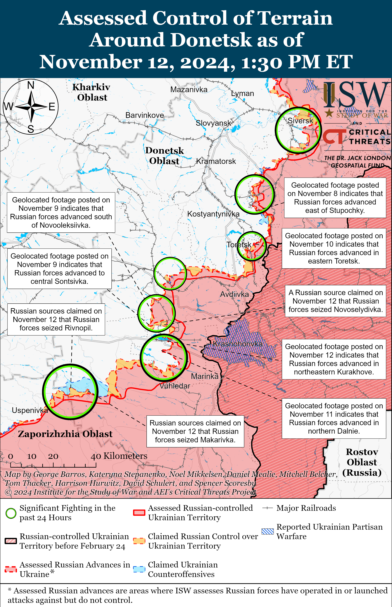
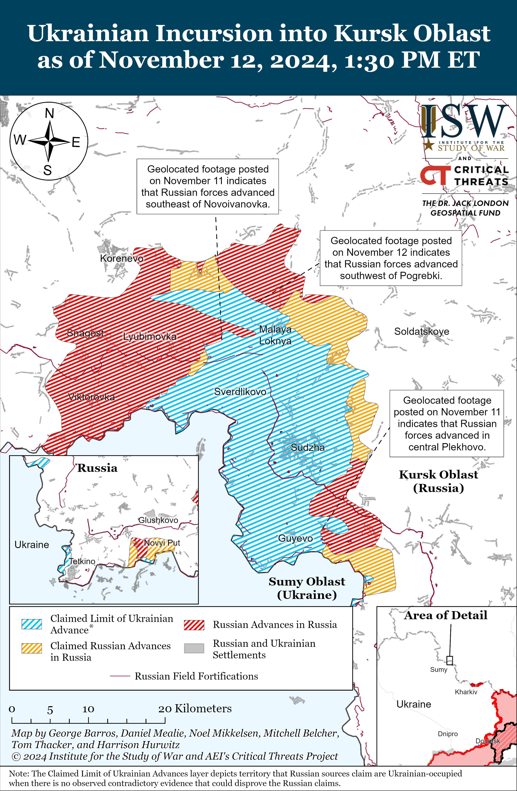
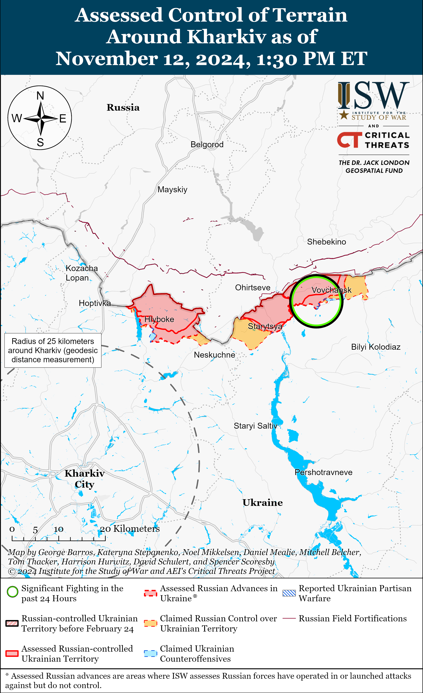
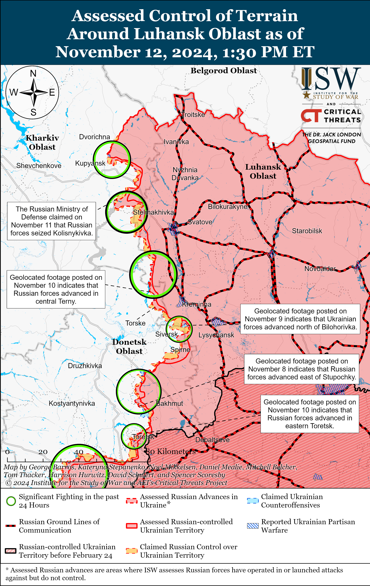
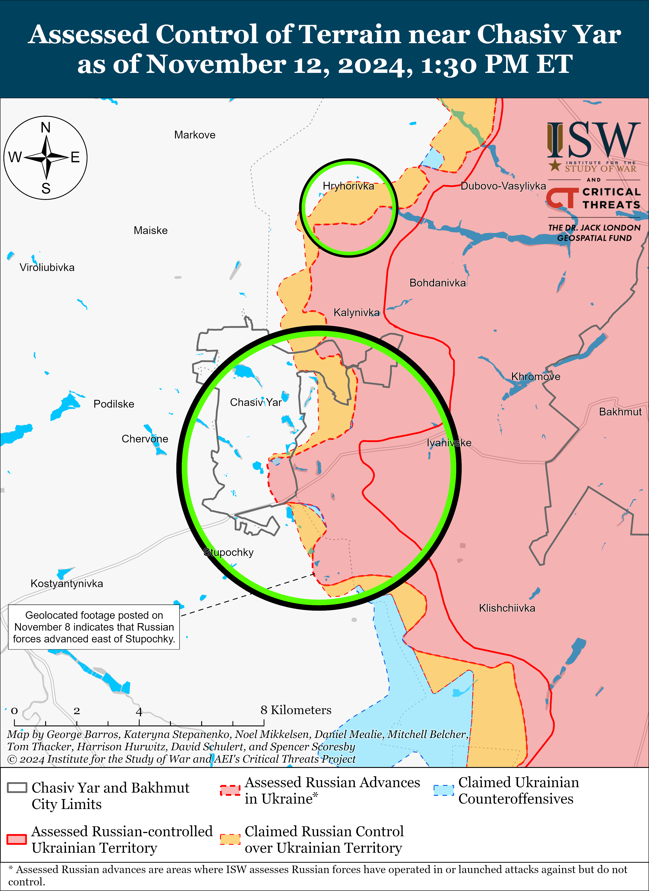
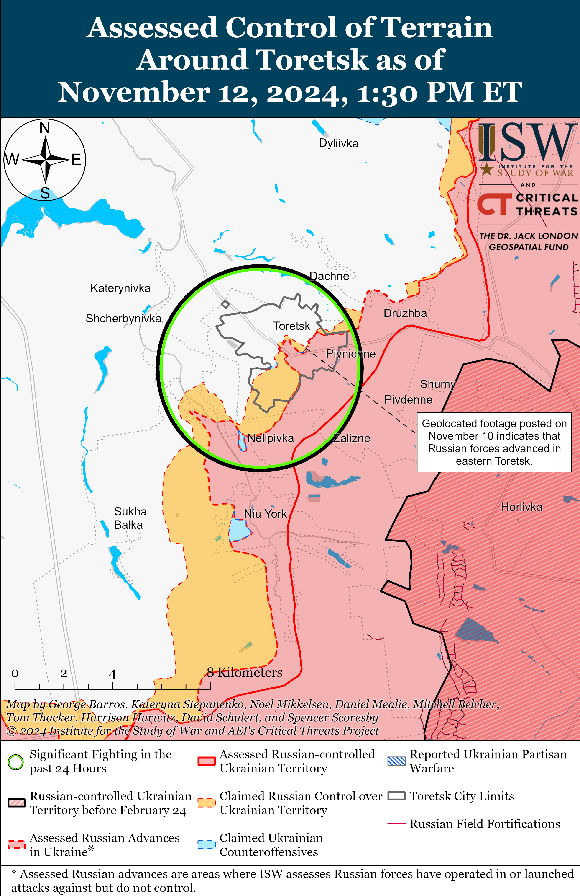
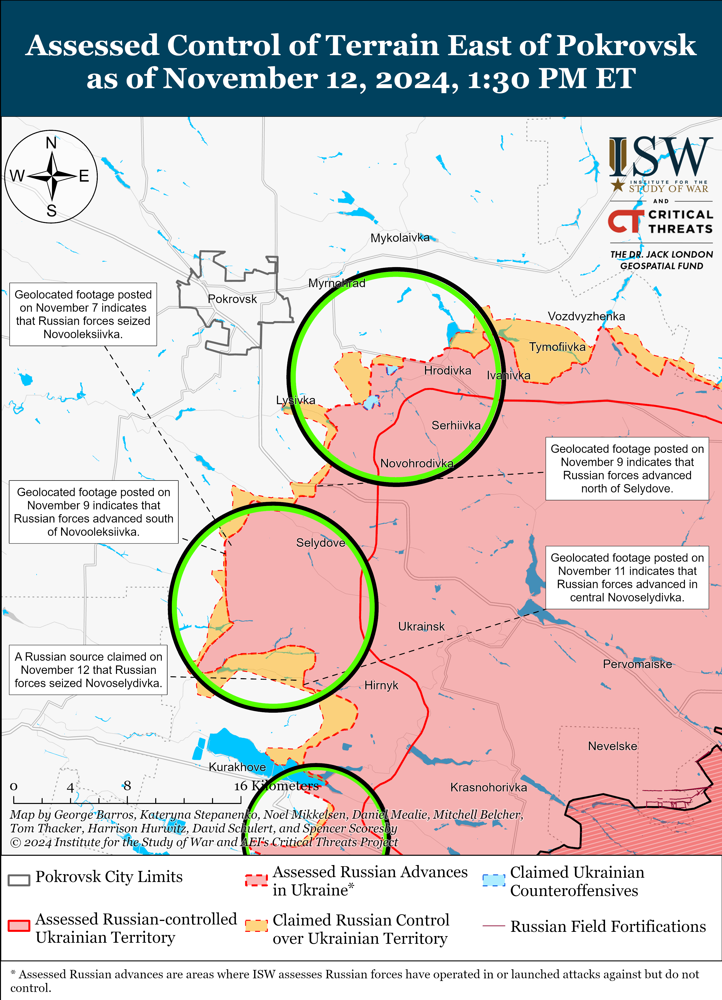
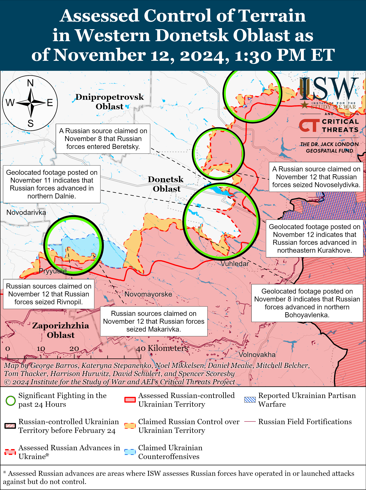
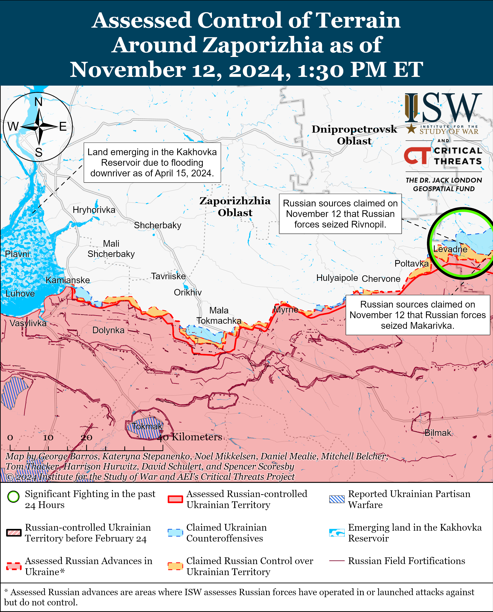
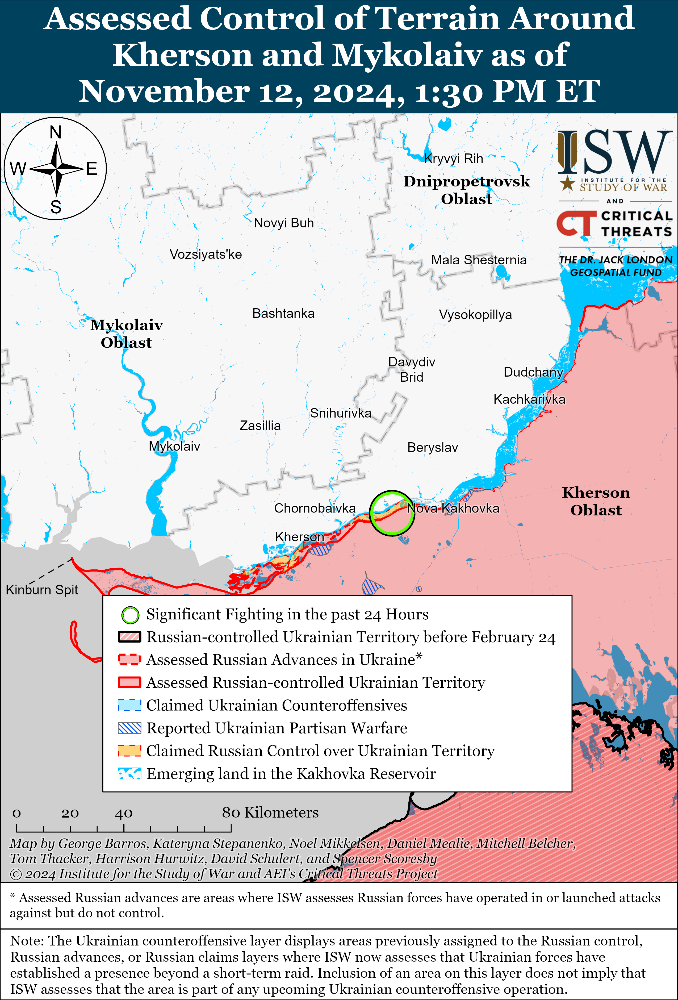

# Russian Offensive Campaign Assessment, November 12, 2024

**Christina Harward, Angelica Evans, Nicole Wolkov, Grace Mappes, Nate Trotter, William Runkel, Olivia Gibson, and George Barros**

**November 12, 2024, 6:15 pm ET**

**Click** [**here**](https://storymaps.arcgis.com/stories/36a7f6a6f5a9448496de641cf64bd375) **to see ISW’s interactive map of the Russian invasion of Ukraine. This map is updated daily alongside the static maps present in this report.**

**Click** [**here**](https://understandingwar.maps.arcgis.com/apps/instant/3dviewer/index.html?appid=1602762dbcde419bb957dea358449580) **to see ISW’s 3D control of terrain topographic map of Ukraine. Use of a computer (not a mobile device) is strongly recommended for using this data-heavy tool.**

**Click** [**here**](https://storymaps.arcgis.com/stories/733fe90805894bfc8562d90b106aa895) **to access ISW’s archive of interactive time-lapse maps of the Russian invasion of Ukraine. These maps complement the static control-of-terrain map that ISW produces daily by showing a dynamic frontline. ISW will update this time-lapse map archive monthly.**

**Note: The data cut-off for this product was 11:30am ET on November 12. ISW will cover subsequent reports in the November 13 Russian Offensive Campaign Assessment.**

**Russian forces recently advanced during two company-sized mechanized assaults within and south of Kurakhove in western Donetsk Oblast.** Geolocated footage published on November 12 indicates that Russian forces recently advanced along Zaporizkyi Street in northeastern Kurakhove during a company-sized mechanized assault.[1] The Ukrainian brigade that defended against the mechanized assault reported that Russian forces attacked with 12 armored vehicles and that Ukrainian artillery and drones destroyed three tanks and six infantry fighting vehicles.[2] The Ukrainian brigade reported that three groups of Russian infantry also unsuccessfully attempted to cross the Vovcha River north of Kurakhove at the same time as the mechanized assault. Additional geolocated footage published on November 11 indicates that Russian forces recently advanced in northern Dalne (south of Kurakhove) during a reduced company-sized mechanized assault consisting of at least nine armored vehicles, and Russian forces’ recent advances northeast of Dalne and in the fields east and southeast of the settlement are likely a result of the same reduced company-sized mechanized assault.[3] The Ukrainian brigade that repelled the Dalne mechanized assault reported that Ukrainian artillery and tanks destroyed two Russian tanks and six armored vehicles.[4] Ukrainian military observer Kostyantyn Mashovets stated on November 12 that forward units of the Russian 20th Motorized Rifle Division (8th Combined Arms Army [CAA], Southern Military District [SMD]) participated in the Russian advance into Dalne.[5] The spokesperson of another Ukrainian brigade operating in the Kurakhove direction reported on November 12 that Russian forces are conducting mechanized assaults of an unspecified echelon near Katerynivka and Antonivka (both northeast of Vuhledar and south of Kurakhove along the C051104 highway) in order to level the frontline in western Donetsk Oblast.[6] Russian advances near Dalne are likely aimed at bypassing the string of settlements north of Vuhledar along the C05114 highway that could have posed a notable challenge to advancing Russian forces.[7] ISW continues to assess that further Russian advances into Dalne and west of the settlement could force Ukrainian forces to withdraw from positions in the pocket north and northeast of Vuhledar, allowing Russian forces to advance along the C051104 highway relatively uncontested and further pressure Ukrainian positions in Kurakhove from the south.[8]

Russian forces continued assaults in other areas of the Kurakhove and Vuhledar directions on November 12. Russian milbloggers claimed that Russian forces also advanced north of Kurakhove near Voznesenka, but ISW has not observed confirmation of this claim.[9] Russian forces conducted offensive operations near Kurakhove itself; northwest of Kurakhove near Novodmytrivka, Sontsivka, and Zorya; north of Kurakhove near Novoselydivka, Voznesenka, and Kreminna Balka; east of Kurakhove near Maksymilyanivka; south of Kurakhove near Dalne; northeast of Vuhledar near Illinka, Antonivka, and Katernyivka; and northwest of Vuhledar near Trudove on November 11 and 12.[10] A Russian source claimed that worsening weather conditions in the Kurakhove direction are not significantly impacting the tempo of Russian advances.[11] Elements of the Russian 238th Artillery Brigade (8th CAA) and drone operators of the “Aleppo” detachment of the 1472nd Motorized Rifle Regiment (68th Army Corps [AC], Eastern Military District [EMD]) are reportedly operating in the Kurakhove direction.[12] Mashovets stated that elements of the Russian Eastern Grouping of Forces are attacking towards Rozlyv (northwest of Vuhledar and north of Shakhtarske) and that elements of the Russian Central Grouping of Forces and the 8th CAA (Southern Military District [SMD]) are attacking towards Andriivka (west of Kurakhove).[13]

**Geolocated footage confirms reports that an explosion damaged the Ternivska Dam at the Kurakhivske Reservoir on November 11.** Geolocated footage published on November 12 shows an explosion at the Ternivska Dam south of Stary Terny (northwest of Kurakhove).[14] Ukrainian Kurakhove City Military Administration Head Roman Padun and Ukrainian Donetsk Oblast Military Administration Head Vadym Filashkin reported on November 11 and 12, respectively, that the explosion and subsequent flooding did not impact any nearby homes, with Filashkin further noting that settlements along the Vovcha River west of the reservoir have not flooded.[15] Padun stated that water continues to flow from the dam but that the entire reservoir will not empty, and Filashkin reported that 15 million cubic meters of water had spilled from the reservoir. Padun reported that Russian forces have been targeting the dam with guided glide bombs for three months (since about August 2024), and ISW observed claims in September 2024 from Russian sources that Russian forces had struck the dam.[16] Ukrainian and Russian sources reported the damage to the dam on November 11 but disagreed about who was responsible for the strike.[17] ISW continues to assess that Russian forces could have struck the dam on November 11 in order to cause significant, long-lasting flooding west of the Kurakhivske Reservoir that could facilitate Russian efforts to envelop Ukrainian forces north and south of Kurakhove.[18] The potential advantages that Russian forces could gain by damaging the dam are currently unclear, however, as the extent and duration of the resulting flooding is reportedly minimal. ISW is unable to attribute who or what damaged the dam.

**Recent Western and Ukrainian estimates about the size of the Russian force grouping in Kursk Oblast do not represent a significant inflection, as Russian forces have spent several months gathering forces for a future counteroffensive effort to expel Ukrainian forces from Russian territory.** Ukrainian officials and Western media recently reported that Russia has concentrated a rough total of 50,000 personnel, including about 8,000 – 10,000 North Korean forces, in Kursk Oblast in preparation for an operation to push Ukrainian forces from Russian territory before late January 2025 and suggested that Russia has not redeployed any of these forces from eastern Ukraine.[19] Ukrainian sources estimated in September and October 2024 that Russian forces had already concentrated between 30,000 and 50,000 personnel in Kursk Oblast, including an estimated 35,000 personnel from Russia’s Northern Grouping of Forces who were operating in Kursk, Bryansk, and Belgorod oblasts and northern Kharkiv Oblast prior to the Ukrainian incursion in Kursk Oblast in August 2024.[20] US Secretary of Defense Lloyd Austin stated on October 31 that 8,000 North Korean soldiers are also currently operating as part of the larger Russian force grouping in Kursk Oblast.[21] A Ukrainian service member stated on November 11 that Russian forces are also redeploying additional elements of the 104th Airborne (VDV) Regiment (76th VDV Division) and several battalions of the 177th Naval Infantry Regiment (Caspian Flotilla) from western Zaporizhia Oblast to Kursk Oblast, but ISW has not observed independent indications of these redeployments as of this report.[22] ISW observed reports in mid-October 2024 that elements of the 177th Naval Infantry Regiment were operating near Chasiv Yar.[23] Ukraine’s Pivnich (Northern) Operational Command Spokesperson Colonel Vadym Mysnyk reported on November 11 that the Russian military is frequently transferring new reserves to Kursk Oblast due to high personnel and equipment losses.[24] These reserves are likely intended to replace personnel losses and not significantly bolster the existing Russian force grouping in the area.

**Ukrainian military officials warned that Russian forces may intensify assaults in Zaporizhia Oblast in the near future.** Ukrainian Tavriisk Group of Forces Spokesperson Colonel Vladyslav Voloshyn told *Reuters* in a November 11 article that Russian forces are moving trained assault groups to forward positions in occupied Zaporizhia Oblast but that it is unclear if the Russian military intends to conduct a unified offensive operation or separate assaults.[25] Voloshyn stated that Russian forces may intensify assaults with armored vehicles, buggies, and motorcycles in the near future since Russian forces have conducted preliminary reconnaissance operations in the area and have increased the number of air strikes in southern Ukraine by 30 to 40 percent in the past two to three weeks.[26] Voloshyn stated on November 9 that Russian forces are concentrating near Kamyanske (northwest of Robotyne and south of Zaporizhzhia City), Hulyaipole (northeast of Robotyne), and Robotyne and are preparing to conduct intensified assaults in these areas.[27] The spokesperson of a Ukrainian brigade operating in the Zaporizhia direction also reported on November 12 that the Russian military is concentrating forces to conduct assaults in the area.[28] The spokesperson also noted that Russian forces are conducting daily infantry assaults in groups of 10 to 20 personnel. ISW has not observed reports that Russian forces have redeployed forces to the Zaporizhia direction from other areas of the frontline, however. Russian forces resumed conducting small-scale attacks on the Zaporizhia frontline near Kamyanske and the Velyka Novosilka salient after a nearly year-long hiatus in early October 2024.[29]

**Select Russian defense officials appear to be contradicting Russian President Vladimir Putin’s recent assertion that Russia is not interested in forming a unified security bloc against the West.** Russian Security Council Secretary Sergei Shoigu met with People’s Republic of China (PRC) Foreign Minister Wang Yi on November 12 and emphasized that both Russia and the PRC “act from a united position” within international organizations, including the United Nations (UN), UN Security Council, G20, and Asia-Pacific Economic Cooperation (APEC).[30] Shoigu claimed that the Russia-PRC strategic partnership is not a “military-political alliance similar to those developed during the Cold War” but “surpasses” these relationships. Russian Military-Technical Cooperation Deputy Director Mikhail Babish also stated on November 12 that Russia is ready to discuss the joint development and production of weapons with the PRC — demonstrating growing military support within the Russia-PRC relationship.[31] Russian Defense Minister Andrei Belousov claimed during a Commonwealth of Independent States (CIS) defense ministerial meeting on November 12 that BRICS member states recently supported the Kremlin’s initiative to establish a “multipolar world” and claimed that the CIS must cooperate to build “indivisible Eurasian security.”[32] Belousov claimed that BRICS is focused on finding peaceful settlements in conflicts in the world and forming a multipolar order in order to oppose the “collective West,” which Belousov claimed is “trying to undermine regional stability.” Putin notably criticized political blocs on November 7, calling for a new world order without blocs, and Shoigu’s emphasis on the unity of the Russian-PRC relationship and Belousov’s statements seemingly posturing BRICS as in opposition to the “collective West” appear to contradict Putin’s statement.[33] BRICS member states also notably adopted the Kazan Declaration during the BRICS summit on October 23, which demonstrated that the Kremlin had not secured the support for or created this alternative security structure, as ISW previously assessed.[34]

**Key Takeaways:**

- **Russian forces recently advanced during two company-sized mechanized assaults within and south of Kurakhove in western Donetsk Oblast.**
- **Geolocated footage confirms reports that an explosion damaged the Ternivska Dam at the Kurakhivske Reservoir on November 11.**
- **Recent Western and Ukrainian estimates about the size of the Russian force grouping in Kursk Oblast do not represent a significant inflection, as Russian forces have spent several months gathering forces for a future counteroffensive effort to expel Ukrainian forces from Russian territory.**
- **Ukrainian military officials warned that Russian forces may intensify assaults in Zaporizhia Oblast in the near future.**
- **Select Russian defense officials appear to be contradicting Russian President Vladimir Putin’s recent assertion that Russia is not interested in forming a unified security bloc against the West.**
- **Russian forces recently advanced near Toretsk and Kurakhove and in Kursk Oblast.**
- **The Russian military reportedly continues to coerce conscripts into signing Russian military service contracts, likely as part of ongoing crypto-mobilization efforts.**

***We do not report in detail on Russian war crimes because these activities are well-covered in Western media and do not directly affect the military operations we are assessing and forecasting. We will continue to evaluate and report on the effects of these criminal activities on the Ukrainian military and the Ukrainian population and specifically on combat in Ukrainian urban areas. We utterly condemn Russian violations of the laws of armed conflict and the Geneva Conventions and crimes against humanity even though we do not describe them in these reports.***

- Ukrainian Operations in the Russian Federation
- Russian Main Effort – Eastern Ukraine (comprised of three subordinate main efforts)
- Russian Subordinate Main Effort #1 – Push Ukrainian forces back from the international border with Belgorod Oblast and approach to within tube artillery range of Kharkiv City
- Russian Subordinate Main Effort #2 – Capture the remainder of Luhansk Oblast and push westward into eastern Kharkiv Oblast and encircle northern Donetsk Oblast
- Russian Subordinate Main Effort #3 – Capture the entirety of Donetsk Oblast
- Russian Supporting Effort – Southern Axis
- Russian Air, Missile, and Drone Campaign
- Russian Mobilization and Force Generation Efforts
- Russian Technological Adaptations
- Activities in Russian-occupied areas
- Significant Activity in Belarus

**Ukrainian Operations in the Russian Federation**

Russian forces recently advanced southeast of Korenevo during a multi-wave battalion-sized mechanized assault amid continued attacks within the main Ukrainian salient in Kursk Oblast on November 12. Geolocated footage published on November 11 indicates that Russian forces recently advanced during a battalion-sized mechanized assault southeast of Novoivanovka (southeast of Korenevo).[35] One of the Ukrainian brigades that repelled the Russian mechanized assault reported that Russian forces attacked with 29 armored vehicles in five waves, and that Ukrainian forces reportedly destroyed 18 of the 29 vehicles.[36] Additional geolocated footage published on November 11 and 12 indicates that Russian forces recently advanced within and northwest of Plekhovo (south of Sudzha) and southwest of Pogrebki (east of Korenevo), respectively.[37] Russian milbloggers claimed that Russian forces also recently advanced near Darino (southeast of Korenevo) and pushed Ukrainian forces from positions near Maryevka (north of Sudzha), but ISW has not observed confirmation of these claims.[38] Russian milbloggers claimed that Ukrainian forces conducted an unsuccessful armored assault near Kremyanoye.[39] Fighting is ongoing southeast of Korenevo near Darino, Nikolaevo-Darino, Novoivanovka, and Leonidovo and north of Sudzha near Orlovka and Malaya Loknya.[40] Elements of the Russian 56th Airborne (VDV) Regiment (7th VDV Division) reportedly continue to operate in Kursk Oblast.[41]

Belgorod Oblast Governor Vyacheslav Gladkov claimed on November 12 that a Ukrainian drone struck an oil depot near Stary Oskol and caused a fire at an oil tank.[42] Gladkov claimed that Russian authorities quickly put out the fire.

Ukrainian and Russian intelligence stated on November 11 and 12 that unspecified actors recently destroyed a Russian helicopter equipped with electronic warfare (EW) equipment in Moscow Oblast. The GUR reported on November 11 that unspecified actors set fire to a Russian Mi-24 helicopter at Russia’s “Klin 5” Airfield in Moscow Oblast on the night of November 9 to 10.[43] The GUR reported that the helicopter belonged to the Russian 92nd squadron of the 344th Combat Application and Retraining Center (Russian Air Force, Russian Aerospace Forces [VKS]). Russia’s Federal Security Service (FSB) claimed on November 11 that the FSB disrupted a GUR plot to hijack the helicopter, although GUR Spokesperson Andriy Yusov denied these claims on November 12 and called the Russian claims an “information operation.”[44]

**Russian Main Effort – Eastern Ukraine**

**Russian Subordinate Main Effort #1 – Kharkiv Oblast (Russian objective: Push Ukrainian forces back from the international border with Belgorod Oblast and approach to within tube artillery range of Kharkiv City)**

Russian forces continued offensive operations northeast of Kharkiv City near Vovchansk on November 11 and 12 but did not advance.[45] A Russian milblogger claimed on November 12 that fighting is ongoing near the dacha area of Lyptsi (north of Kharkiv City).[46] The deputy commander of a Ukrainian battalion operating in the Kharkiv direction stated on November 11 that the situation north of Kharkiv City near Lyptsi and Hlyboke remains stable.[47]

**Russian Subordinate Main Effort #2 – Luhansk Oblast (Russian objective: Capture the remainder of Luhansk Oblast and push westward into eastern Kharkiv Oblast and northern Donetsk Oblast)**

Russian forces continued offensive operations on the Kupyansk-Svatove-Kreminna line on November 12 but did not make confirmed advances. Russian sources claimed on November 12 that Russian forces established positions on the outskirts of Terny (northwest of Kreminna) and advanced into central Terny, but ISW has not observed visual confirmation of these claims.[48] The spokesperson of a Ukrainian brigade operating in the Lyman direction stated that Russian forces are using military equipment sparingly, typically once every two weeks, and mostly conduct infantry assaults in this direction.[49] Russian forces reportedly continued assaults northwest of Kupyansk near Kindrashivka; southeast of Kupyansk near Kolisnykivka, Kruhlyakivka, Zahryzove, and in the direction of Lozova; southwest of Svatove near Hrekivka and Novomykhailivka; west of Svatove in the direction of Novoplatonivka; northwest of Kreminna near Nevske and Terny; west of Kreminna near Torske; and southwest of Kreminna near Serebryanka on November 11 and 12.[50] Elements of the Russian 144th Motorized Rifle Division (20th Combined Arms Army [CAA], Moscow Military District [MMD]) are reportedly operating in Terny.[51]

**Russian Subordinate Main Effort #3 – Donetsk Oblast (Russian objective: Capture the entirety of Donetsk Oblast, the claimed territory of Russia’s proxies in Donbas)**

Russian forces continued assaults southeast of Siversk near Vyimka on November 11 and 12 but did not advance.[52] A Russian milblogger claimed that Russian forces repelled several Ukrainian counterattacks in eastern Bilohorivka (northeast of Siversk).[53]

Russian forces continued offensive operations in the Chasiv Yar direction on November 12 but did not make any confirmed advances. A Russian milblogger reiterated claims that Russian forces are advancing in Stupochky (south of Chasiv Yar), but ISW still has only observed geolocated evidence permitting ISW to assess that Russian forces are roughly 2.5 kilometers from the settlement.[54] Russian forces attacked near Chasiv Yar on November 11 and 12.[55] Drone operators of the Russian ”Burevestnik” Detachment (Russian Volunteer Corps) and ”Okhotnik” (Hunter) Spetsnaz Detachment (51st Combined Arms Army [CAA], formerly the 1st Donetsk People’s Republic [DNR] Army Corps [AC]) reportedly continue to operate near Chasiv Yar.[56]

Russian forces recently advanced within Toretsk amid continued offensive operations in the area on November 12. Geolocated footage published on November 10 and 11 indicates that Russian forces recently advanced along Dzerzhynskoho Street in eastern Toretsk and Druzhby Street in central Toretsk.[57] A Russian milblogger claimed that Russian forces advanced further within central Toretsk than the geolocated footage indicates.[58] Russian forces conducted offensive operations near Toretsk itself and west of Toretsk near Shcherbynivka on November 11 and 12.[59] Drone operators of the Russian 132nd Motorized Rifle Brigade (51st CAA) reportedly continue operating in the Toretsk direction.[60]

Russian forces reportedly advanced in the Pokrovsk direction on November 12, but there were no confirmed changes to the frontline. Russian milbloggers claimed that Russian forces advanced in southern Petrivka (southeast of Pokrovsk and northwest of Selydove), northeast of Yurivka (west of Selydove), and three kilometers south of Novooleksiivka (southwest of Selydove).[61] ISW has not observed confirmation of these claims, however. Russian forces conducted offensive operations east of Pokrovsk near Promin and Myrolyubivka; southeast of Pokrovsk near Lysivka, Selydove, Hryhorivka, Krutyi Yar, and Pustynka; and south of Pokrovsk near Petrivka and Novooleksiivka and towards Ukrainka on November 11 and 12.[62] A Russian source claimed that Ukrainian forces unsuccessfully counterattacked between Sukhyi Yar and Krutyi Yar (both southeast of Pokrovsk).[63] The spokesperson for a Ukrainian brigade operating in the Pokrovsk direction reported on November 11 that Ukrainian artillery and drone strikes are causing Russian forces to use less equipment during assaults and that Russian infantry are mostly moving on foot in small groups.[64]

*See topline text for updates on the Kurakhove and Vuhledar directions.*

Russian forces reportedly advanced in the Donetsk-Zaporizhia Oblast border area on November 12, but there were no confirmed changes to the frontline. Russian milbloggers claimed that Russian forces seized Rivnopil (southwest of Velyka Novosilka) and Makarivka (south of Velyka Novosilka) and advanced southwest of Novodarivka (southwest of Velyka Novosilka).[65] Select milbloggers claimed, however, that reports that Russian forces had seized Rivnopil and Novodarivka are premature.[66] Russian forces conducted offensive operations near Makarivka, Novodarivka, and Rivnopil on November 11 and 12.[67] A Russian milblogger claimed that Russian forces are attacking near Rivnopil, Novodarivka, and Hulyaipole (southwest of Velyka Novosilka) in order to prevent Ukrainian forces from redeploying to the Kurakhove direction.[68] Ukrainian Tavriisk Group of Forces Spokesperson Colonel Vladyslav Voloshyn stated on November 12 that Russian forces are actively assaulting in the Vremivka direction with infantry with fire and armored vehicle support.[69] Elements of the Russian 60th Motorized Rifle Brigade (5th CAA, Eastern Military District [EMD]) are reportedly operating in Makarivka, and drone operators of the “Storm” detachment of the 143rd Motorized Rifle Regiment (127th Motorized Rifle Division, 5th CAA) are reportedly operating in the Vremivka direction.[70]

**Russian Supporting Effort – Southern Axis (Russian objective: Maintain frontline positions and secure rear areas against Ukrainian strikes)**

Russian sources claimed on November 11 and 12 that Russian forces advanced southeast of Hulyaipole near Marfopil, although ISW has not observed visual confirmation of this claim.[71] Elements of the Russian 38th Motorized Rifle Brigade (35th Combined Arms Army [CAA], Eastern Military District [EMD]) reportedly continue operating in the Polohy direction (southwest of Hulyaipole).[72]

Russian forces continued assaults in western Zaporizhia Oblast north of Robotyne near Novoandriivka on November 11 and 12.[73] Zaporizhia Oblast occupation official Vladimir Rogov claimed on November 11 and 12 that Ukrainian forces are preparing to strike the dam in Vasylivka (west of Robotyne and south of Zaporizhzhia City) in order to slow potential Russian advances toward Zaporizhzhia City.[74] ISW has notably not observed other sources making similar claims.

Positional fighting continued in the Dnipro direction in east (left) bank Kherson Oblast on November 11 and 12, but there were no confirmed changes to the frontline.[75] Elements of the Russian BARS-33 Detachment (Russian Army Combat Reserve) reportedly continue operating in the Kherson direction.[76]

**Russian Air, Missile, and Drone Campaign (Russian Objective: Target Ukrainian military and civilian infrastructure in the rear and on the frontline)**

Russian forces conducted a large series of drone and missile strikes against Ukraine on the night of November 11 to 12. The Ukrainian Air Force reported on November 12 that Russian forces launched one S-300 missile targeting Kharkiv City from Belgorod Oblast, two Kh-59/69 cruise air missiles targeting Chernihiv Oblast from Kursk Oblast, guided glide bombs targeting Sumy and Kharkiv oblasts, and 110 Shahed drones and unspecified strike drones from Kursk and Bryansk oblasts and Primorsko-Akhtarsk, Krasnodar Krai.[77] The Ukrainian Air Force reported that Ukrainian forces downed 46 drones over Kyiv, Zhytomyr, Poltava, Sumy, Kharkiv, Cherkasy, Zaporizhia, Chernihiv, Dnipropetrovsk, and Mykolaiv oblasts; that 60 drones were “lost,” likely due to Ukrainian electronic warfare (EW) interference; and that two drones flew towards Belarusian airspace. Ukrainian officials reported on November 12 that Russian forces hit residential areas in Kharkiv City with an S-300/400 missile, a Grom-E1 hybrid air-launched guided missile, and drones and struck residential areas of Zaporizhzhia City with unspecified weapons.[78]

**Russian Mobilization and Force Generation Efforts (Russian objective: Expand combat power without conducting general mobilization)**

The Russian military reportedly continues to coerce conscripts into signing Russian military service contracts, likely as part of ongoing crypto-mobilization efforts. Russian opposition outlet *Mobilization News* reported on November 12 that Russian commanders coerced conscripts subordinated to the Russian 80th Tank Regiment (90th Tank Division, Central Military District [CMD]) into signing volunteer service contracts with the Russian Ministry of Defense (MoD).[79]

Russian state defense conglomerate Rostec reported on November 11 that its subsidiary United Aircraft Corporation (UAC) delivered an unspecified number of Russian Su-35S and Su-57 fighter jets to the Russian military.[80]

**Russian Technological Adaptations (Russian objective: Introduce technological innovations to optimize systems for use in Ukraine)**  
 Nothing significant to report.

**Activities in Russian-occupied areas (Russian objective: Consolidate administrative control of annexed areas; forcibly integrate Ukrainian citizens into Russian sociocultural, economic, military, and governance systems)**

*ISW is not publishing coverage of activities in Russian-occupied areas today.*

**Significant activity in Belarus (Russian efforts to increase its military presence in Belarus and further integrate Belarus into Russian-favorable frameworks and Wagner Group activity in Belarus)**

Nothing significant to report.

**Note: ISW does not receive any classified material from any source, uses only publicly available information, and draws extensively on Russian, Ukrainian, and Western reporting and social media as well as commercially available satellite imagery and other geospatial data as the basis for these reports. References to all sources used are provided in the endnotes of each update.**

[1] https://t.me/oaembr46/1135; https://t.me/creamy\_caprice/7486 ; https://x.com/GirkinGirkin/status/1856262719361413228

[2] https://t.me/oaembr46/1135

[3] https://t.me/WarArchive\_ua/22179; https://t.me/mechanized33/528;https://t.me/creamy\_caprice/7473; https://t.me/mechanized33/528; https://understandingwar.org/backgrounder/russian-offensive-campaign-assessment-november-11-2024

[4] https://www.facebook.com/watch/?v=427525263545054; https://t.me/mechanized33/528

[5] https://www.facebook.com/pashtetof/posts/pfbid0ySvWV4WhJPc69qLGJz8VChdV1dHgPwzTDGDF39JPxxih6WVApE3rapawrDnuhMy7l?\_\_cft\_\_[0]=AZUC5L883HafG8n67E9YHeEeCL3yRuIjdEofQ4k4EpIQCxpLnuionJc6jHmVyI0J2ODl-2tqAfHgfHN7GYv6JkMO492mCLicGpA5LdH0E1Mym-IOvULXUhtFpyb5p\_XSQoKkqFUXyhKprDxXKGzeuYPvUsRX6Ddzbh3OITEpdQYTtUOxzPiZi-H77LeBBZ5E0Sk&\_\_tn\_\_=%2CO%2CP-R

[6] https://www.youtube.com/watch?v=aDXWlQ2K0dM; https://armyinform dot com.ua/2024/11/12/vorog-faktychno-stesuye-svoyi-boyezdatni-pidrozdily-chymalo-shturmovykiv-voroga-vzhe-ne-zdatni-voyuvaty/

[7] https://isw.pub/UkrWar111124

[8] https://isw.pub/UkrWar111124

[9] https://t.me/voenkorKotenok/60062; https://t.me/DnevnikDesantnika/19060

[10] https://www.facebook.com/GeneralStaff.ua/posts/pfbid02GJu84iXP1Y7B4bz4rdLteUTmVshaNumUEHNWLKXkHGF8qipmXh3uQbWVvZ1kuzm4l; https://www.facebook.com/GeneralStaff.ua/posts/pfbid02ZG1VWNHg2kit5rD1q9cm5bQoBgE6yheUFJSV7TKX9xFwbbZ2f5y3yXuP2w8HMtxYl ; https://www.facebook.com/GeneralStaff.ua/posts/pfbid0rE6uRq7114z8SNfCUxjBF43cLA6x3A834CFeDVqgW7xCtF5eL5bM7ndz1Ubh7cHDl; https://t.me/DnevnikDesantnika/19006

[11] https://t.me/voenkorKotenok/60057

[12] https://t.me/nm\_dnr/12961 ; https://t.me/boris\_rozhin/144048 ; https://t.me/voin\_dv/11786; https://t.me/voin\_dv/11797

[13] https://www.facebook.com/pashtetof/posts/pfbid0ySvWV4WhJPc69qLGJz8VChdV1dHgPwzTDGDF39JPxxih6WVApE3rapawrDnuhMy7l?\_\_cft\_\_[0]=AZUC5L883HafG8n67E9YHeEeCL3yRuIjdEofQ4k4EpIQCxpLnuionJc6jHmVyI0J2ODl-2tqAfHgfHN7GYv6JkMO492mCLicGpA5LdH0E1Mym-IOvULXUhtFpyb5p\_XSQoKkqFUXyhKprDxXKGzeuYPvUsRX6Ddzbh3OITEpdQYTtUOxzPiZi-H77LeBBZ5E0Sk&\_\_tn\_\_=%2CO%2CP-R

[14] https://t.me/operativnoZSU/162917; https://x.com/SibirPrizrak/status/1856278817435988434; https://x.com/strategicbakery/status/1856278437385666688; https://x.com/Map\_Hargoo/status/1856287517533769856 ;

[15] https://t.me/VadymFilashkin/5092; https://suspilne dot media/877813-na-kurskomu-napramku-zsu-strimuut-50-tisac-soldativ-rf-estonia-vidilit-novij-paket-dopomogi-993-den-vijni-onlajn/?anchor=live\_1731410063&utm\_source=copylink&utm\_medium=ps; https://suspilne dot media/donbas/878039-voda-prodovzue-pribuvati-ci-vdalosa-ociniti-rujnuvanna-grebli-na-vodoshovisi-bila-kurahovogo-dani-vid-mva/

[16] https://suspilne dot media/877813-na-kurskomu-napramku-zsu-strimuut-50-tisac-soldativ-rf-estonia-vidilit-novij-paket-dopomogi-993-den-vijni-onlajn/?anchor=live\_1731410063&utm\_source=copylink&utm\_medium=ps; https://understandingwar.org/backgrounder/russian-offensive-campaign-assessment-november-11-2024

[17] https://isw.pub/UkrWar111124

[18] https://isw.pub/UkrWar111124

[19] https://understandingwar.org/backgrounder/russian-offensive-campaign-assessment-november-10-2024 ; https://understandingwar.org/backgrounder/russian-offensive-campaign-assessment-november-11-2024 ; https://www.telegraph.co.uk/world-news/2024/11/11/putin-kursk-assault-ukraine-trump-north-korea/

[20] https://understandingwar.org/backgrounder/russian-offensive-campaign-assessment-september-14-2024 ; https://understandingwar.org/backgrounder/russian-offensive-campaign-assessment-september-13-2024 ; https://isw.pub/UkrWar101124

[21] https://isw.pub/UkrWar110124

[22] https://x.com/OSINTua/status/1856033997811507480

[23] https://understandingwar.org/backgrounder/russian-offensive-campaign-assessment-october-14-2024

[24] https://understandingwar.org/backgrounder/russian-offensive-campaign-assessment-november-11-2024 ; https://armyinform.com dot ua/2024/11/11/riznogo-gatunku-ta-komplektacziyi-yaka-chyselnist-sklad-ta-yakist-rosijskogo-ugrupova

[25] https://www.reuters.com/world/europe/russian-troops-trying-advance-kursk-region-ukraine-says-2024-11-11/

[26] https://www.reuters.com/world/europe/russian-troops-trying-advance-kursk-region-ukraine-says-2024-11-11/

[27] https://armyinform.com dot ua/2024/11/09/na-pivdni-okupanty-gotuyutsya-do-shturmiv-yaki-dilyanky-najbilsh-zagrozheni/

[28] https://www.youtube.com/watch?v=j5TqaWCCdUg; https://armyinform dot com.ua/2024/11/12/blukayut-zaminovanymy-polyamy-abo-zh-hovayutsya-v-nory-okupanty-prodovzhuyut-bezgluzdo-znyshhuvaty-svoyu-pihotu/

[29] https://isw.pub/UkrWar101324; https://understandingwar.org/backgrounder/russian-offensive-campaign-assessment-october-9-2024

[30] https://t.me/MID\_Russia/48057 ; https://t.me/rusembchina/4614

[31] https://t.me/tass\_agency/284746

[32] https://t.me/mod\_russia/45602; https://t.me/mod\_russia/45607; https://t.me/tass\_agency/284792 ; https://t.me/tass\_agency/284792 ; https://t.me/tass\_agency/284801 ; https://t.me/tass\_agency/284804

[33] https://understandingwar.org/backgrounder/russian-offensive-campaign-assessment-november-8-2024; http://kremlin dot ru/events/president/news/75521

[34] https://understandingwar.org/backgrounder/russian-offensive-campaign-assessment-october-23-2024; http://static dot kremlin.ru/media/events/files/ru/MUCfWDg0QRs3xfMUiCAmF3LEh02OL3Hk.pdf

[35] https://x.com/moklasen/status/1856044596708684152; https://t.me/black\_swan\_ukraine/219 ; https://t.me/WarArchive\_ua/22188; https://t.me/OSHB\_225/4759; https://t.me/WarArchive\_ua/22181; https://t.me/OSHB\_225/4758; https://t.me/creamy\_caprice/7472; https://t.me/DeepStateUA/20701; https://t.me/brygada47/1051

[36]  https://t.me/DeepStateUA/20701; https://t.me/brygada47/1051

[37] https://x.com/99Dominik\_/status/1856345486644384013 ; https://t.me/ob\_army\_ua/452;https://x.com/moklasen/status/1856038119746961799; https://t.me/rugbygroup/73; https://t.me/rugbygroup/73; https://t.me/creamy\_caprice/7471; https://t.me/creamy\_caprice/7489; https://t.me/ssternenko/36042

[38] https://t.me/dva\_majors/57473; https://t.me/rybar/65302 ; https://t.me/z\_arhiv/29391?single

[39] https://t.me/rusich\_army/18400 ; https://t.me/rybar/65298

[40] https://www.facebook.com/GeneralStaff.ua/posts/pfbid0rE6uRq7114z8SNfCUxjBF43cLA6x3A834CFeDVqgW7xCtF5eL5bM7ndz1Ubh7cHDl ; https://t.me/DnevnikDesantnika/19006 ; https://t.me/wargonzo/23111  ; https://t.me/voenkorKotenok/60064

[41] https://t.me/rusich\_army/18411 ; https://t.me/NeoficialniyBeZsonoV/41401

[42] https://t.me/vvgladkov/10691

[43] https://t.me/DIUkraine/4816 ; https://x.com/666\_mancer/status/1855876375665680695

[44] https://t.me/tass\_agency/284572 ; https://t.me/tass\_agency/284586; https://t.me/epoddubny/21575; https://meduza dot io/news/2024/11/11/fsb-zayavila-chto-ukrainskaya-razvedka-pytalas-zaverbovat-rossiyskogo-letchika-dlya-ugona-vertoleta ; https://suspilne dot media/878363-u-fsb-rf-zaavili-pro-zriv-operacii-gur-mo-sodo-vikradenna-gelikoptera-mi-8-v-ukrainskij-rozvidci-vidreaguvali/

[45]https://www.facebook.com/GeneralStaff.ua/posts/pfbid02GJu84iXP1Y7B4bz4rdLteUTmVshaNumUEHNWLKXkHGF8qipmXh3uQbWVvZ1kuzm4l ; https://www.facebook.com/GeneralStaff.ua/posts/pfbid02ZG1VWNHg2kit5rD1q9cm5bQoBgE6yheUFJSV7TKX9xFwbbZ2f5y3yXuP2w8HMtxYl ; https://www.facebook.com/GeneralStaff.ua/posts/pfbid0rE6uRq7114z8SNfCUxjBF43cLA6x3A834CFeDVqgW7xCtF5eL5bM7ndz1Ubh7cHDl ; https://t.me/otukharkiv/2582

[46] https://t.me/Sladkov\_plus/11786

[47] https://armyinform dot com.ua/2024/11/11/chym-vazhlyvi-lypczi-dlya-harkova-v-zsu-rozpovily-pro-znachennya-kontrolyu-nad-selom/; https://youtu.be/aDXWlQ2K0dM

[48] https://t.me/tass\_agency/284752; https://t.me/DnevnikDesantnika/19047

[49] https://www.youtube.com/watch?v=avBlYpjVdrA; https://armyinform dot com.ua/2024/11/11/vorog-sune-z-usih-shhilyn-rosiyany-aktyvizuvalysya-na-lymanskomu-napryamku/

[50] https://www.facebook.com/GeneralStaff.ua/posts/pfbid02GJu84iXP1Y7B4bz4rdLteUTmVshaNumUEHNWLKXkHGF8qipmXh3uQbWVvZ1kuzm4l; https://www.facebook.com/GeneralStaff.ua/posts/pfbid02ZG1VWNHg2kit5rD1q9cm5bQoBgE6yheUFJSV7TKX9xFwbbZ2f5y3yXuP2w8HMtxYl; https://t.me/DnevnikDesantnika/19006; https://www.facebook.com/GeneralStaff.ua/posts/pfbid02GJu84iXP1Y7B4bz4rdLteUTmVshaNumUEHNWLKXkHGF8qipmXh3uQbWVvZ1kuzm4l; https://www.facebook.com/GeneralStaff.ua/posts/pfbid02ZG1VWNHg2kit5rD1q9cm5bQoBgE6yheUFJSV7TKX9xFwbbZ2f5y3yXuP2w8HMtxYl; https://www.facebook.com/GeneralStaff.ua/posts/pfbid0rE6uRq7114z8SNfCUxjBF43cLA6x3A834CFeDVqgW7xCtF5eL5bM7ndz1Ubh7cHDl; https://www.facebook.com/GeneralStaff.ua/posts/pfbid0rE6uRq7114z8SNfCUxjBF43cLA6x3A834CFeDVqgW7xCtF5eL5bM7ndz1Ubh7cHDl

[51] https://t.me/vysokygovorit/17953; https://t.me/vysokygovorit/17950

[52] https://www.facebook.com/GeneralStaff.ua/posts/pfbid02GJu84iXP1Y7B4bz4rdLteUTmVshaNumUEHNWLKXkHGF8qipmXh3uQbWVvZ1kuzm4l; https://www.facebook.com/GeneralStaff.ua/posts/pfbid02ZG1VWNHg2kit5rD1q9cm5bQoBgE6yheUFJSV7TKX9xFwbbZ2f5y3yXuP2w8HMtxYl

[53] https://t.me/DnevnikDesantnika/19049

[54] https://t.me/wargonzo/23111; https://understandingwar.org/backgrounder/russian-offensive-campaign-assessment-november-11-2024

[55] https://www.facebook.com/GeneralStaff.ua/posts/pfbid02GJu84iXP1Y7B4bz4rdLteUTmVshaNumUEHNWLKXkHGF8qipmXh3uQbWVvZ1kuzm4l; https://www.facebook.com/GeneralStaff.ua/posts/pfbid02ZG1VWNHg2kit5rD1q9cm5bQoBgE6yheUFJSV7TKX9xFwbbZ2f5y3yXuP2w8HMtxYl; https://t.me/rusich\_army/18400

[56] https://t.me/wargonzo/23110; https://t.me/nm\_dnr/12962

[57] https://t.me/Khyzhak\_brigade/40; https://t.me/WarArchive\_ua/22168; https://t.me/OSHB\_225/4759; https://t.me/WarArchive\_ua/22189

[58] https://t.me/z\_arhiv/29388

[59] https://www.facebook.com/GeneralStaff.ua/posts/pfbid02GJu84iXP1Y7B4bz4rdLteUTmVshaNumUEHNWLKXkHGF8qipmXh3uQbWVvZ1kuzm4l; https://www.facebook.com/GeneralStaff.ua/posts/pfbid02ZG1VWNHg2kit5rD1q9cm5bQoBgE6yheUFJSV7TKX9xFwbbZ2f5y3yXuP2w8HMtxYl; https://www.facebook.com/GeneralStaff.ua/posts/pfbid0rE6uRq7114z8SNfCUxjBF43cLA6x3A834CFeDVqgW7xCtF5eL5bM7ndz1Ubh7cHDl; https://t.me/wargonzo/23111;

[60] https://t.me/boris\_rozhin/144027

[61] https://t.me/z\_arhiv/29382; https://t.me/DnevnikDesantnika/19053

[62] https://www.facebook.com/GeneralStaff.ua/posts/pfbid02ZG1VWNHg2kit5rD1q9cm5bQoBgE6yheUFJSV7TKX9xFwbbZ2f5y3yXuP2w8HMtxYl; https://www.facebook.com/GeneralStaff.ua/posts/pfbid02GJu84iXP1Y7B4bz4rdLteUTmVshaNumUEHNWLKXkHGF8qipmXh3uQbWVvZ1kuzm4l; https://www.facebook.com/GeneralStaff.ua/posts/pfbid0rE6uRq7114z8SNfCUxjBF43cLA6x3A834CFeDVqgW7xCtF5eL5bM7ndz1Ubh7cHDl

[63] https://t.me/motopatriot/29493

[64] https://www.youtube.com/watch?v=avBlYpjVdrA; https://armyinform.com dot ua/2024/11/11/u-sylah-oborony-poyasnyly-chomu-vorog-vykorystovuye-minimum-tehniky-na-pokrovskomu-napryamku/

[65] https://t.me/z\_arhiv/29379; https://t.me/DnevnikDesantnika/19031 ; https://t.me/DnevnikDesantnika/19024; https://t.me/wargonzo/23111; https://t.me/RVvoenkor/80489; https://t.me/rusich\_army/18404; https://t.me/RVvoenkor/80520; https://t.me/tass\_agency/284761

[66] https://t.me/voin\_dv/11795; https://t.me/RVvoenkor/80489

[67] https://www.facebook.com/GeneralStaff.ua/posts/pfbid02ZG1VWNHg2kit5rD1q9cm5bQoBgE6yheUFJSV7TKX9xFwbbZ2f5y3yXuP2w8HMtxYl; https://t.me/DnevnikDesantnika/19031 ; https://t.me/DnevnikDesantnika/19024; https://t.me/voin\_dv/11795; https://www.facebook.com/GeneralStaff.ua/posts/pfbid02GJu84iXP1Y7B4bz4rdLteUTmVshaNumUEHNWLKXkHGF8qipmXh3uQbWVvZ1kuzm4l; https://www.facebook.com/GeneralStaff.ua/posts/pfbid0rE6uRq7114z8SNfCUxjBF43cLA6x3A834CFeDVqgW7xCtF5eL5bM7ndz1Ubh7cHDl

[68] https://t.me/politadequate/9247

[69] https://www.youtube.com/watch?v=aDXWlQ2K0dM; https://armyinform dot com.ua/2024/11/12/broneataky-mali-grupy-vysadka-na-placzdarm-na-pivdni-okupanty-vykorystovuyut-rizni-taktyky/

[70] https://t.me/motopatriot/29470; https://t.me/RVvoenkor/80489; https://t.me/voin\_dv/11785

[71] https://t.me/wargonzo/23111 ; https://t.me/RVvoenkor/80484

[72] https://t.me/voin\_dv/11796

[73] https://www.facebook.com/GeneralStaff.ua/posts/pfbid02ZG1VWNHg2kit5rD1q9cm5bQoBgE6yheUFJSV7TKX9xFwbbZ2f5y3yXuP2w8HMtxYl

[74] https://t.me/tass\_agency/284689 ; https://t.me/tass\_agency/284776

[75] https://www.facebook.com/GeneralStaff.ua/posts/pfbid02ZG1VWNHg2kit5rD1q9cm5bQoBgE6yheUFJSV7TKX9xFwbbZ2f5y3yXuP2w8HMtxYl ; https://www.facebook.com/GeneralStaff.ua/posts/pfbid0rE6uRq7114z8SNfCUxjBF43cLA6x3A834CFeDVqgW7xCtF5eL5bM7ndz1Ubh7cHDl

[76] https://t.me/dva\_majors/57484

[77] https://t.me/kpszsu/22794

[78] https://t.me/prokuratura\_kharkiv/20130 ; https://t.me/synegubov/12011 ; https://t.me/synegubov/12017 ; https://t.me/synegubov/12018 ; https://t.me/ivan\_fedorov\_zp/13270

[79] https://t.me/mobilizationnews/20923

[80] https://rostec dot ru/media/news/oak-peredala-minoborony-rossii-partiyu-su-57-i-su-35s/
