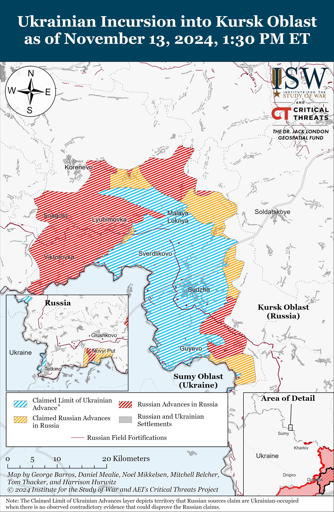
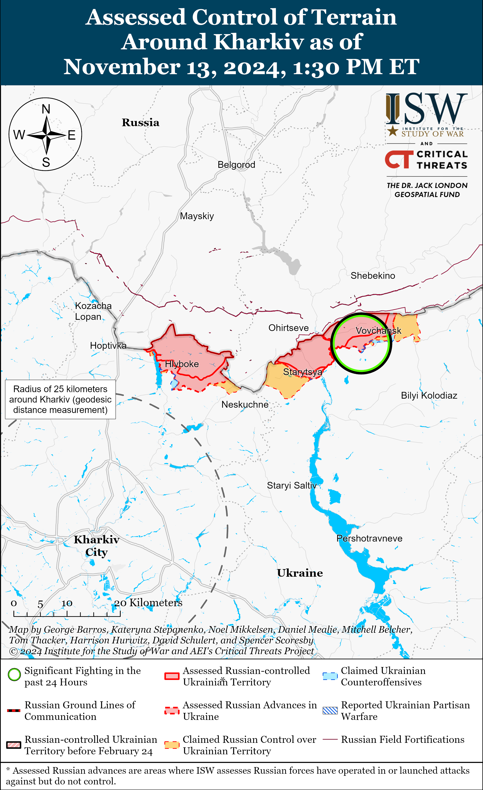
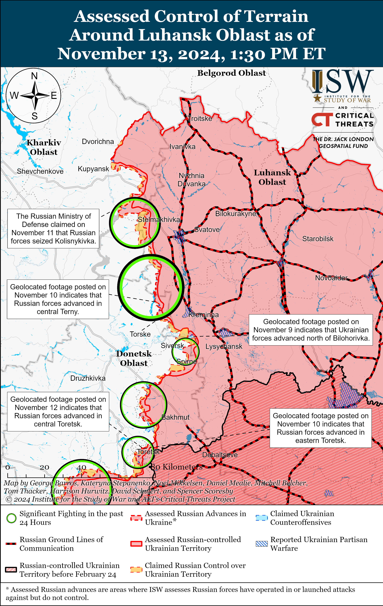
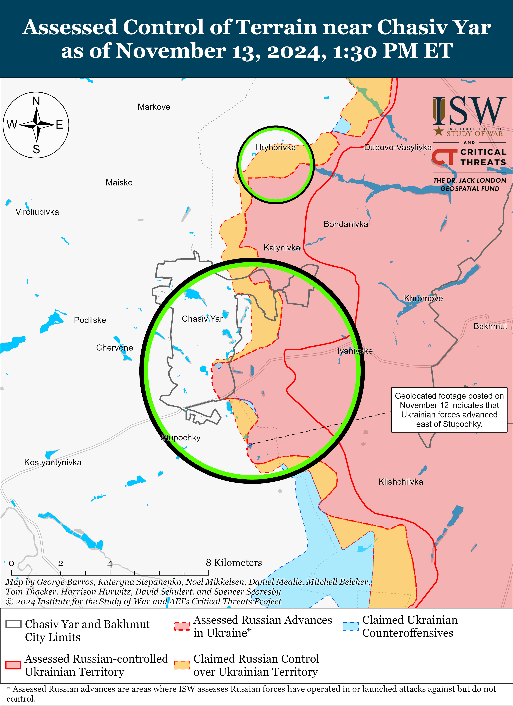
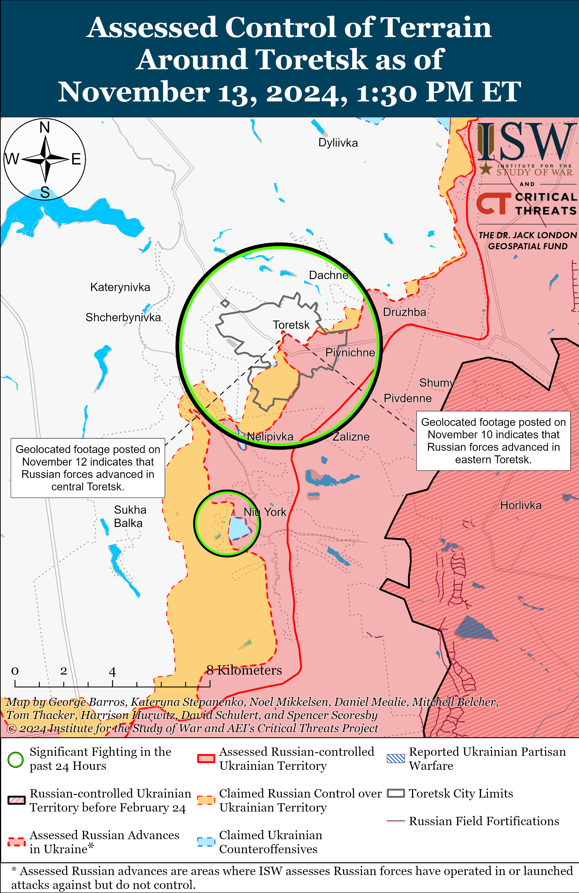
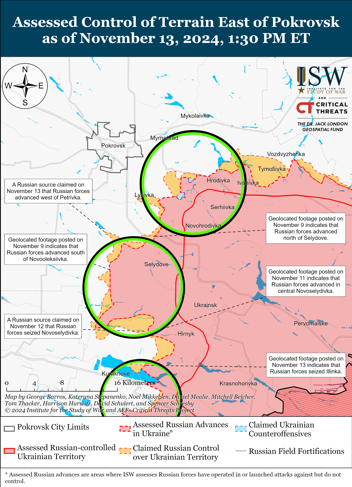
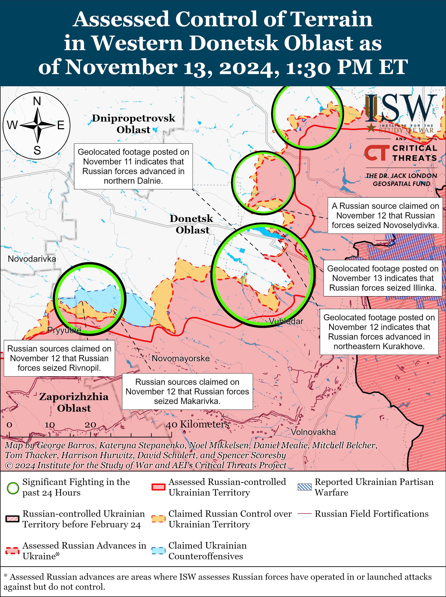
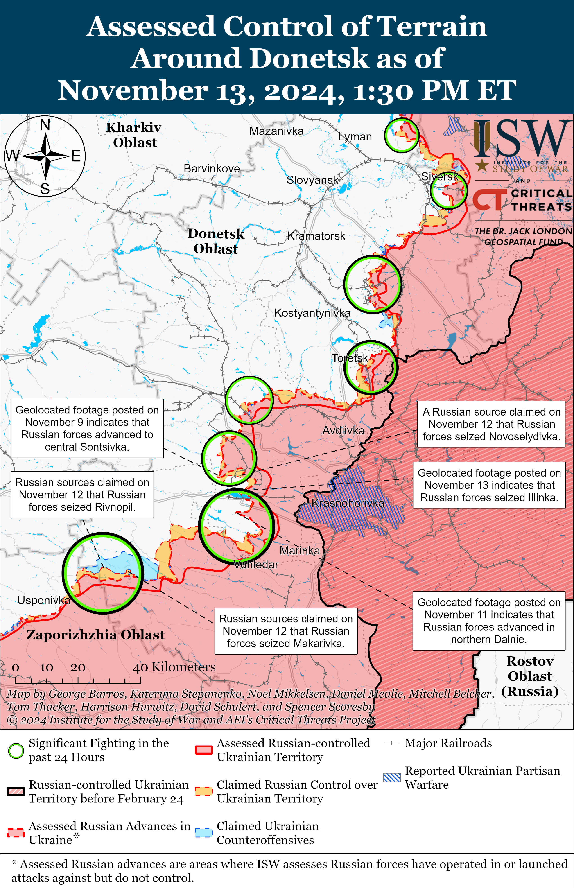
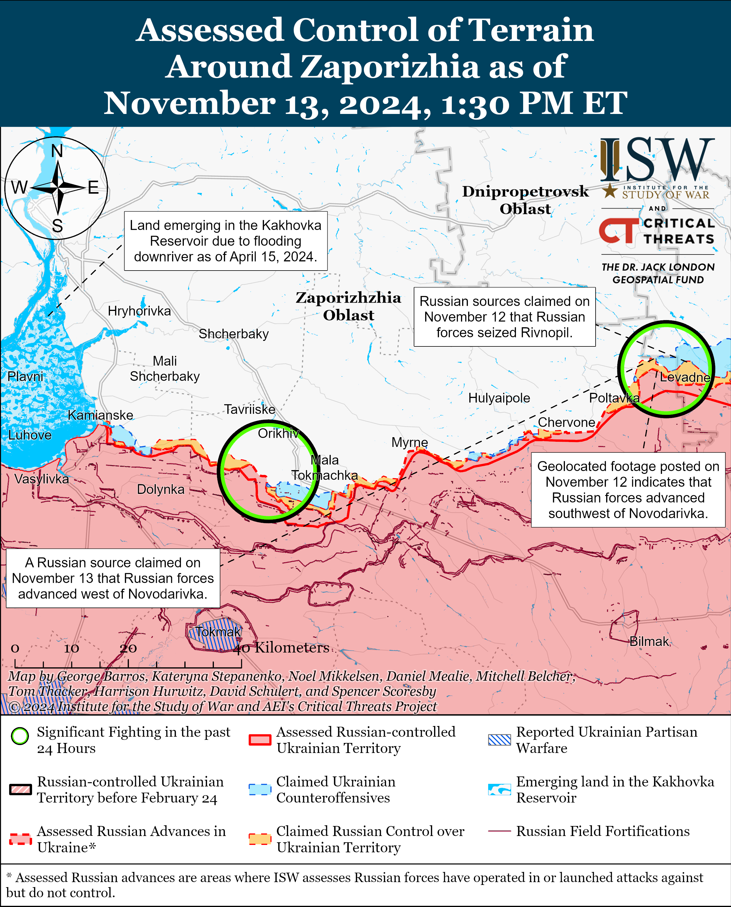
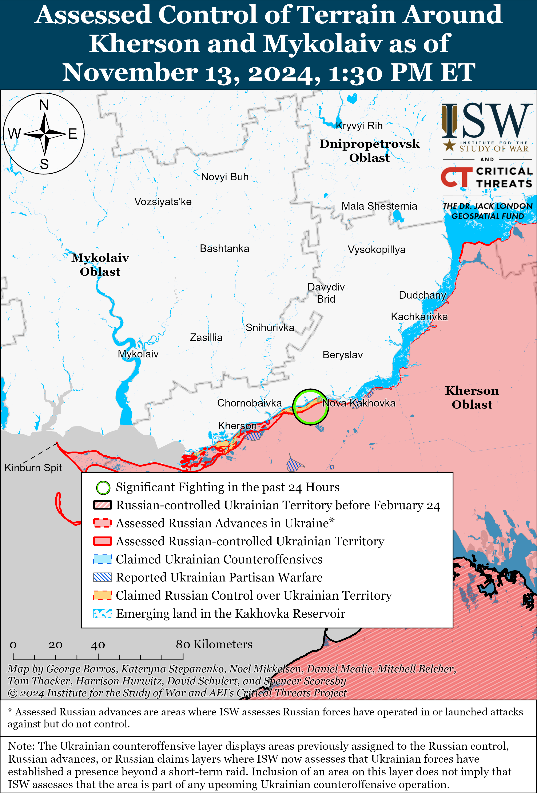

# Russian Offensive Campaign Assessment, November 13, 2024

**Nicole Wolkov, Grace Mappes, Christina Harward, Nate Trotter, William Runkel, Olivia Gibson, and Frederick W. Kagan**

**November 13, 2024, 6:30pm ET**

**Click** [**here**](https://storymaps.arcgis.com/stories/36a7f6a6f5a9448496de641cf64bd375) **to see ISW’s interactive map of the Russian invasion of Ukraine. This map is updated daily alongside the static maps present in this report.**

**Click** [**here**](https://understandingwar.maps.arcgis.com/apps/instant/3dviewer/index.html?appid=1602762dbcde419bb957dea358449580) **to see ISW’s 3D control of terrain topographic map of Ukraine. Use of a computer (not a mobile device) is strongly recommended for using this data-heavy tool.**

**Click** [**here**](https://storymaps.arcgis.com/stories/733fe90805894bfc8562d90b106aa895) **to access ISW’s archive of interactive time-lapse maps of the Russian invasion of Ukraine. These maps complement the static control-of-terrain map that ISW produces daily by showing a dynamic frontline. ISW will update this time-lapse map archive monthly.**

**Note: The data cut-off for this product was 12:30pm ET on November 13. ISW will cover subsequent reports in the November 14 Russian Offensive Campaign Assessment.**

**The Kremlin is attempting to dictate the terms of any potential “peace” negotiations with Ukraine in advance of US President-elect Donald Trump’s inauguration. The manner in which the Kremlin is trying to set its terms for negotiations strongly signals that Russia’s objectives remain unchanged and still amount to full Ukrainian capitulation. The Kremlin does not appear any more willing to make concessions to the incoming Trump administration than it was to the current administration.** Russian Ministry of Foreign Affairs (MFA) Spokesperson Maria Zakharova claimed on November 13 that Western officials are lying about their interest in peace in Ukraine and that “peace” can only be achieved when the West stops providing military assistance to Ukraine.[1] Zakharova’s statement indicates that Russia continues to assert that the West must end all provisions of military assistance to Ukraine as a prerequisite for peace negotiations.[2] Russian Foreign Minister Sergei Lavrov also claimed on November 13 that the start of Trump’s presidency would not fundamentally change the US position on Ukraine and that any proposals to freeze the frontline are “even worse” than the Russia-favorable Minsk Agreements that followed Russia’s first invasion of Ukraine in 2014.[3]

**Lavrov’s pre-emptive rejection of the potential suggestion to freeze the current frontline further indicates that Russia is not interested in softening its approach or demands in negotiations and maintains its objective of total Ukrainian capitulation, which Russian President Vladimir Putin explicitly outlined in June 2024.[4]** Zakharova’s and Lavrov’s statements also undermine Putin’s recent efforts to feign interest in a willingness to “restore” US–Russian relations with the new US presidential administration and instead indicate that Putin likely is taking for granted that the Trump administration will defer to the Kremlin’s interests and preferences without the Kremlin offering any concessions or benefits in return.[5] Russian officials notably made these statements against the backdrop of reports that the Trump administration intends to appoint a “Ukrainian peace envoy to lead negotiations on ending the war” and announcements of multiple Trump national security cabinet picks, suggesting that Russia will maintain its goals in Ukraine regardless of the make-up of the incoming Trump administration.[6]

**Ukrainian security services reportedly assassinated a Russian Black Sea Fleet (BSF) official in occupied Crimea on November 13.** Ukrainian outlet *Suspilne* reported on November 13 that sources in Ukraine’s Security Service (SBU) stated that the SBU conducted a successful special operation in occupied Sevastopol, Crimea and planted an explosive on the car of the BSF’s 41st Missile Boat Brigade Chief of Staff Captain First Rank Valery Trankovsky.[7] Trankovsky died from his injuries after the explosion.[8]  SBU sources noted that Trankovsky ordered Russian cruise missile strikes from the Black Sea at civilian objects in Ukraine in 2022.[9] Sevastopol occupation governor Mikhail Razvozhaev reported that a car exploded in Sevastopol on the morning of November 13, killing a Russian servicemember, but did not identify the deceased.[10] Razvozhaev claimed that Russian authorities did not rule out sabotage — suggesting that the Russian occupation administration will likely further crackdown against those it deems to be pro-Ukrainian in retaliation for the attack. Geolocated footage shows the aftermath of the car explosion in occupied Sevastopol.[11] Likely Ukrainian partisans have conducted three assassinations of Russian occupation and military officials since late September 2024.[12]

**Russian President Vladimir Putin and Russian oil executives reportedly rejected a proposal to merge Russia’s three largest oil companies.** The *Financial Times* (FT) reported on November 13, citing unspecified “people,” that Russian President Vladimir Putin shot down the proposal to merge Russian state-owned Gazprom Neft, state-affiliated Rosneft, and independently owned Rosneft.[13] FT’s sources attributed the proposed merger to Russian Energy Minister Sergei Tsivilev, the husband of Putin’s cousin and Russian State Secretary — Deputy Defense Minister Anna Tsivileva. Former Russian oil executives told FT that, while the merger would have given Gazprom Neft and Rosneft access to Lukoil’s UAE-based trading arm, concerns over the ability to circumvent Western sanctions and temporarily reduced oil production also contributed to Putin’s rejection of the proposed merger. The *Wall Street Journal* (WSJ) first reported on the proposed merger on November 9 but noted that the Kremlin and Rosneft denied the talks while Gazprom Neft and Lukoil did not comment.[14]

**Contradictory reporting on the proposed Russian oil merger highlights a possible factional struggle between close affiliates of Putin and Russian energy executives**. FT reported that Tsivilev attempted to utilize his family connection to Putin to promote the deal but that Russian energy executives also had the political leverage to oppose the proposed merger.[15] Rosneft Head Igor Sechin and Gazprom Head Alexey Miller are both longtime friends and supporters of Putin, and Putin reportedly rejected Tsivilev’s proposal on their behalf despite reportedly desiring more direct Kremlin control over Russian oil production and his family connection to Tsivilev.[16] The initial reports of a merger may have been intended to weaken Sechin in particular. The WSJ reported that Sechin was a “main player” in the merger talks and was a possible, but not definite, candidate to lead the resulting company, though Rosneft rejected notions that “Evil Sechin” had “insidious intentions to take over the assets” of other oil companies.”[17]

**South Korean and US intelligence separately confirmed that North Korean troops have deployed into combat alongside Russian forces in Kursk Oblast.** South Korea’s National Intelligence Service (NIS) confirmed on November 13 that it “assesses that the North Korean troops deployed to Russia” are already participating in combat after having completed their training and gradual battlefield deployment over the past two weeks.[18] US State Department Spokesperson Vedant Patel stated during a briefing on November 12 that over 10,000 North Korean troops deployed to eastern Russia, most of whom have now moved to western Kursk Oblast “where they have begun engaging in combat operations with Russian forces.”[19] ISW assessed on November 5 that North Korean troops had entered combat in Kursk Oblast, citing reports by Ukrainian intelligence and Ukrainian Defense Minister Rustem Umerov.[20]

**Key Takeaways:**

- **The Kremlin is attempting to dictate the terms of any potential “peace” negotiations with Ukraine in advance of US President-elect Donald Trump’s inauguration. The manner in which the Kremlin is trying to set its terms for negotiations strongly signals that Russia’s objectives remain unchanged and still amount to full Ukrainian capitulation. The Kremlin does not appear any more willing to make concessions to the incoming Trump administration than it was to the current administration.**
- **Lavrov’s pre-emptive rejection of the potential suggestion to freeze the current frontline further indicates that Russia is not interested in softening its approach or demands in negotiations and maintains its objective of total Ukrainian capitulation, which Russian President Vladimir Putin explicitly outlined in June 2024.**
- **Ukrainian security services reportedly assassinated a Russian Black Sea Fleet (BSF) official in occupied Crimea on November 13.**
- **Russian President Vladimir Putin and Russian oil executives reportedly rejected a proposal to merge Russia’s three largest oil companies. Contradictory reporting on the proposed Russian oil merger highlights a possible factional struggle between close affiliates of Putin and Russian energy executives**.
- **South Korean and US intelligence separately confirmed that North Korean troops have deployed into combat alongside Russian forces in Kursk Oblast.**
- **Russian forces recently advanced near Toretsk, Kurakhove, and Vuhledar and in the Donetsk-Zaporizhia Oblast border area, and Ukrainian forces recently regained positions near Chasiv Yar.**
- **Russian forces continue to heavily rely on refurbished tanks and armored vehicles pulled from storage to replace vehicle losses during ongoing combat operations, but likely will not be able to sustain these losses in the long term.**

***We do not report in detail on Russian war crimes because these activities are well-covered in Western media and do not directly affect the military operations we are assessing and forecasting. We will continue to evaluate and report on the effects of these criminal activities on the Ukrainian military and the Ukrainian population and specifically on combat in Ukrainian urban areas. We utterly condemn Russian violations of the laws of armed conflict and the Geneva Conventions and crimes against humanity even though we do not describe them in these reports.***

- Ukrainian Operations in the Russian Federation
- Russian Main Effort – Eastern Ukraine (comprised of three subordinate main efforts)
- Russian Subordinate Main Effort #1 – Push Ukrainian forces back from the international border with Belgorod Oblast and approach to within tube artillery range of Kharkiv City
- Russian Subordinate Main Effort #2 – Capture the remainder of Luhansk Oblast and push westward into eastern Kharkiv Oblast and encircle northern Donetsk Oblast
- Russian Subordinate Main Effort #3 – Capture the entirety of Donetsk Oblast
- Russian Supporting Effort – Southern Axis
- Russian Air, Missile, and Drone Campaign
- Russian Mobilization and Force Generation Efforts
- Russian Technological Adaptations
- Activities in Russian-occupied areas
- Significant Activity in Belarus

**Ukrainian Operations in the Russian Federation**

Russian continued ground attacks within the main Ukrainian salient in Kursk Oblast on November 13 but did not make any confirmed advances. Russian sources claimed on November 12 and 13 that Russian forces advanced southeast of Korenevo near Novoivanovka, Zeleny Shlyakh, and Darino; south of Sudzha near Kurilovka; and southeast of Sudzha near Plekhovo, although ISW has not observed visual confirmation of these claims.[21] Russian forces continued attacking southeast of Korenevo near Novoivanovka, Leonidovo, Darino, Nikolayevo-Darino, and Malaya Loknya.[22] A Ukrainian soldier operating in Kursk Oblast stated on November 13 that elements of the Russian 83rd Airborne (VDV) Brigade, 155th Naval Infantry Brigade (Pacific Fleet, Eastern Military District [EMD]) and 51st VDV Regiment (106th VDV Division) attacked his brigade’s positions in an unspecified area in Kursk Oblast.[23] The Ukrainian soldier stated that Russian forces are conducting daily roughly reinforced platoon-sized mechanized assaults using four to six armored fighting vehicles.

Russian sources claimed that Ukrainian forces conducted attacks within the main Ukrainian salient in Kursk Oblast on November 13. Russian sources, including the Russian Ministry of Defense (MoD), claimed that Russian forces repelled Ukrainian attacks southeast of Korenevo near Alexandriya, Nizhniy Klin, Novaya Sorochina and Novoivanovka.[24]

The Ukrainian General Staff reported on November 12 that Ukrainian Unmanned Systems Forces and Special Operations Forces struck the Oskolneftesnab fuel depot near Stary Oskol, Belgorod Oblast, causing a fire.[25] The Ukrainian General Staff noted that destruction of such facilities creates logistical problems for Russian forces. Belgorod Oblast Governor Vyacheslav Gladkov claimed on November 12 that a Ukrainian drone struck an oil depot near Stary Oskol and caused a fire at an oil tank.[26]

**Russian Main Effort – Eastern Ukraine**

**Russian Subordinate Main Effort #1 – Kharkiv Oblast** **(Russian objective: Push Ukrainian forces back from the international border with Belgorod Oblast and approach to within tube artillery range of Kharkiv City)**

Russian forces continued offensive operations northeast of Kharkiv City near Vovchansk on November 12 and 13 but did not advance.[27]

**Russian Subordinate Main Effort #2 – Luhansk Oblast** **(Russian objective: Capture the remainder of Luhansk Oblast and push westward into eastern Kharkiv Oblast and northern Donetsk Oblast)**

Russian forces continued offensive operations along the Kupyansk-Svatove-Kreminna line on November 12 and 13, but there were no confirmed changes to the frontline. Russian milbloggers claimed that Russian forces advanced 200 meters wide to a depth of 200 meters towards Moskovka (just northwest of Kupyansk); 600 meters wide to a depth of 200 meters towards Borova (south of Kupyansk);   north, west and east of Kruhlyakivka (southeast of Kupyansk); north of Vyshneve (southeast of Kupyansk); near Pershotravneve (west of Svatove); and 400 meters wide to a depth of 400 meters towards Torske (west of Kreminna).[28] ISW has not observed confirmation of these claims, however. The Ukrainian General Staff reported on November 13 that Ukrainian forces repelled a Russian mechanized assault in the Kupyansk direction consisting of four waves and a total of 15 armored vehicles, including tanks, armored fighting vehicles, and an UR-77 demining vehicle.[29] The Ukrainian General Staff reported that Ukrainian forces destroyed all of the Russian vehicles and that Russian infantry resorted to perfidy by dressing in Ukrainian uniforms, a war crime under international law.[30] Russian milbloggers claimed that parts of Kolisnykivka (southeast of Kupyansk) are contested “gray zones” because Russian forces cannot gain a foothold in the ruins of the settlement and because Ukrainian forces maintain positions in forested areas to the north.[31] Russian forces continued offensive operations southeast of Kupyansk near Lozova, Kolisnykivka, Kruhlyakivka, and Zahryzove; west of Svatove near Pershotravneve; southwest of Svatove near Cherneshchyna; northwest of Kreminna near Hrekivka and Novomykhailivka; and west of Kreminna near Terny, Zarichne, and Torske.[32] Russian sources claimed that Ukrainian forces are increasingly counterattacking near Torske and are occasionally conducting mechanized assaults of an unspecified echelon with tanks and infantry fighting vehicles near Hlushkivka (southeast of Kupyansk)[33] Russian milbloggers claimed on November 13 that Russian forces are using TOS-2 thermobaric artillery systems to strike Ukrainian defenses in order to create “corridors” for Russian assault groups operating in the Kupyansk direction.[34] A Ukrainian officer operating in the Kupyansk direction reported on November 13 that Russian forces are increasingly conducting mechanized assaults, especially near Borova, instead of pure infantry assaults.[35] The officer stated that seasonal weather is preventing Russian forces from using buggies and other civilian vehicles. A Russian milblogger, however, claimed on November 12 that there has been dry weather for a few days, facilitating vehicle movement across partially dry roads.[36]

**Russian Subordinate Main Effort #3 – Donetsk Oblast** **(Russian objective: Capture the entirety of Donetsk Oblast, the claimed territory of Russia’s proxies in Donbas)**

Russian forces continued assaults east of Siversk near Verkhnokamyanske on November 12 and 13 but did not advance.[37] Ukrainian sources reported that Ukrainian forces repelled a large Russian mechanized assault in an unspecified area in the Siversk direction, but ISW has not seen additional reporting to confirm the echelon, location, or date of the reported Russian mechanized assault.[38] Drone operators of the Russian “Nevsky” Volunteer Reconnaissance-Assault Brigade (Russian Volunteer Corps) are reportedly operating near Soledar (south of Siversk).[39]

Ukrainian forces regained lost positions in the Chasiv Yar direction amid continued Russian offensive operations in the area on November 13. Geolocated footage published on November 12 indicates that Ukrainian forces recently regained lost positions northeast of Orikhovo-Vasylivka (northeast of Chasiv Yar) and in a mine east of Stupochky (south of Chasiv Yar).[40] Russian sources claimed that Russian forces advanced north of Chasiv Yar and that elements of the Russian 6th Motorized Rifle Division (3rd Army Corps [AC]) advanced southeast of Chasiv Yar.[41] ISW has not observed confirmation of these claims, however. Russian forces conducted offensive operations south of Chasiv Yar near Stupochky on November 13.[42] Drone operators of the Russian ”Okhotnik” (Hunter) Spetsnaz Detachment (51st Combined Arms Army [CAA], formerly the 1st Donetsk People’s Republic [DNR] AC) and elements of the Russian 98th Airborne (VDV) Division reportedly continue to operate near Chasiv Yar.[43] Elements of the Russian “Irbis” detachment (“Redut” private military company [PMC], reportedly subordinate to the Russian Volunteer Corps) are reportedly operating near Orikhovo-Vasylivka.[44]

Russian forces recently advanced within central Toretsk amid continued offensive operations in the area on November 13. Geolocated footage published on November 12 shows that Russian forces advanced up to Enhelsa Street within central Toretsk.[45] A Russian milblogger claimed that Russian forces occupy about 70 percent of Toretsk, but ISW has not observed confirmation of this claim and currently assesses that Russian forces occupy about 23.1 percent of Toretsk.[46] Russian forces continued ground attacks near Toretsk itself, Shcherbynivka (immediately west of Toretsk), and Nelipivka and Sukha Balka (both southwest of Toretsk) on November 12 and 13.[47]

Russian forces continued offensive operations in the Pokrovsk direction on November 13, but there were no confirmed changes to the frontline. A Russian milblogger claimed that Russian forces advanced south of Pokrovsk along a railway line between Petrivka and Pustynka and southwest of Novooleksiivka, but ISW has not observed visual confirmation of this claim.[48] Russian forces continued offensive operations east of Pokrovsk near Promin and Myrolyubivka; southeast of Pokrovsk near Lysivka and Krutyi Yar; and south of Pokrovsk near Hyrhorivka, Pustynka, Petrivka, Novooleksiivka, and Yurivka on November 12 and 13.[49]

Russian forces made additional advances northeast of Kurakhove amid continued offensive operations in this direction on November 13. Geolocated footage published on November 13 showing elements of the Russian 114th Motorized Rifle Brigade (51st Combined Arms Army [CAA], formerly 1st Donetsk People’s Republic Army Corps [DNR AC]) raising a flag over central Illinka (northeast of Kurakhove) indicates that Russian forces have likely seized the entire settlement.[50] Russian sources claimed that Russian forces conducted a strike against a bridge on Zaporizkyi Prospekt in Kurakhove (likely referring to the bridge over the Dovha Gully in northern Kurakhove) in order to complicate Ukrainian logistics in and around the settlement.[51] Russian milbloggers claimed that Russian forces are fighting and advancing within eastern Kurakhove itself, and a German reporter claimed that Russian forces occupy 15 percent of Kurakhove.[52] ISW currently assesses that Russian forces currently occupy just over 14 percent of Kurakhove. Russian milbloggers also claimed that Russian forces have seized all of Novoselydivka (north of Kurakhove), although ISW has not yet observed visual evidence of Russian forces in the western part of the settlement.[53] The Ukrainian General Staff reported that Russian forces continued ground attacks northeast of Kurakhove near Illinka; north of Kurakhove near Berestky, Novoselydivka, and Voznesenka and northwest of Kurakhove near Novodmytrivka on November 12 and 13.[54] Elements of the 238th Artillery Brigade (8th CAA, Southern Military District [SMD]) are reportedly supporting ground operations of the 150th Motorized Rifle Division (8th CAA, SMD) and 5th Motorized Rifle Brigade (51st CAA) in the Kurakhove area.[55] Elements of the 33rd Motorized Rifle Regiment (20th Motorized Rifle Division, 8th CAA, SMD) are also operating in the Kurakhove direction.[56]

Russian forces recently advanced northwest of Vuhledar amid continued offensive operations in the Vuhledar direction on November 13. Geolocated footage published on November 12 shows that Russian forces advanced to a windbreak northeast of Bohoyavlenka (northwest of Vuhledar).[57] A Russian milblogger claimed that Russian forces also advanced in fields east of Bohoyavlenka, southwest of Shakhtarske, northwest of Yasna Polyana, and northwest of Maksymivka (all northwest of Vuhledar) although ISW has not yet observed confirmation of these claims.[58] Russian milbloggers claimed that Russian forces control most of Dalne (northeast of Vuhledar), which is consistent with ISW’s control of terrain assessment in the area.[59] Russian and Ukrainian sources reported continued heavy fighting northeast of Vuhledar near Dalne, Antonivka, Katerynivka, Maksymilyanivka, and Yelyzavetivka, and northwest of Vuhledar near Kostyantynopolske and Trudove on November 12 and 13.[60] Elements of the Russian 29th CAA (Eastern Military District [EMD]) are operating near Maksymivka; elements of the “Moly” group of the 57th Motorized Rifle Brigade (5th CAA, EMD) are operating north of Bohoyavlenka; and elements of the 11th Air Force and Air Defense Army (EMD and Russian Aerospace Forces [VKS]) are conducting strikes against Ukrainian positions near Sukhy Yaly (northwest of Vuhledar).[61]

Russian forces recently advanced in the Donetsk-Zaporizhia Oblast border area amid continued offensive operations in the area on November 13. Geolocated footage published on November 12 shows that Russian forces advanced southwest of Novodarivka (in far eastern Zaporizhia Oblast and southwest of Velyka Novosilka).[62] The Russian Ministry of Defense (MoD) claimed on November 13 that Russian forces seized Rivnopil (southwest of Velyka Novosilka), although a milblogger stated that this claim is likely premature.[63] ISW has not yet observed confirmation of Russian forces operating in Rivnopil. Ukrainian Tavriisk Group of Forces Spokesperson Colonel Vladyslav Voloshyn reported on November 13 that Russian forces are attacking south of Velyka Novosilka in order to “wedge” themselves into Ukrainian defenses.[64] The Ukrainian General Staff reported continued fighting southwest of Velyka Novosilka near Rivnopil and Novopil and south of Velyka Novosilka near Makarivka on November 12 and 13.[65] Tank elements of the Russian “Altai” battalion of the 60th Motorized Rifle Brigade (5th CAA, EMD) are reportedly operating near Pryyutne (southwest of Velyka Novosilka), and drone operators of the Russian “Storm” detachment of the 143rd Motorized Rifle Regiment (127th Motorized Rifle Division, 5th CAA, EMD) are reportedly operating in the general Vremivka direction (Donetsk-Zaporizhia Oblast border area).[66]

**Russian Supporting Effort – Southern Axis** **(Russian objective: Maintain frontline positions and secure rear areas against Ukrainian strikes)**

Russian forces recently unsuccessfully launched a mechanized assault northeast of Hulyaipole and continued assaults north of Robotyne on November 13. Geolocated footage published on November 12 shows Ukrainian forces repelling a Russian platoon-sized mechanized assault north of Stepove (northeast of Hulyaipole).[67] Russian forces reportedly continued assaults near Novodanylivka (north of Robotyne) and Novoandriivka (northwest of Robotyne).[68] Ukrainian Center for Combating Disinformation Head Andriy Kovalenko stated on November 12 that Russian forces are preparing to launch tactical assaults near several unspecified settlements in Zaporizhia Oblast but do not have enough strength to directly attack Zaporizhzhia City with ground forces.[69] Kovalenko added that Russian officials are leveraging milbloggers to amplify rumors about potential Russian ground assaults on Zaporizhzhia City in an effort to generate panic in the Ukrainian information space.[70]

Positional fighting continued in the Dnipro direction in east (left) bank Kherson Oblast on November 13, but there were no confirmed changes to the frontline.[71]

**Russian Air, Missile, and Drone Campaign** **(Russian Objective: Target Ukrainian military and civilian infrastructure in the rear and on the frontline)**

Russian forces conducted a large series of drone and missile strikes against Ukraine on the night of November 12 to 13. The Ukrainian Air Force reported that Russian forces launched two S-300 missiles from Kursk Oblast at Sumy Oblast; two Kh-101 cruise missiles from the airspace over the Caspian Sea; two Iskander-M/KN-23 ballistic missiles from Voronezh Oblast; and 90 Shahed drones and unspecified strike drones from Primorsko-Akhtarsk, Krasnodar Krai and Oryol and Kursk oblasts.[72] The Ukrainian Air Force stated that Ukrainian forces downed two Kh-101 cruise missiles, two Iskander-M/KN-23 ballistic missiles and 37 drones over Kyiv, Poltava, Zhytomyr, Sumy, Cherkasy, Zaporizhia, Chernihiv and Kirovohrad oblasts. The Ukrainian Air Force reported that 47 drones were “lost” in Ukrainian air space, likely due to Ukrainian electronic warfare (EW) interference, and that two drones flew into Russian and Belarusian airspace. Independent Belarusian monitoring group Hajun Project stated on November 13 that the night of November 12 to 13 was the fourth consecutive night that Russian drones flew into Belarusian airspace.[73] Kyiv City Head Serhii Popko stated that the November 12-13 strikes were the first combined missile and drone strikes against Kyiv City since September 1 [74] Ukrainian officials stated that a missile strike and debris from downed targets damaged a building and started a fire at a warehouse in Brovarskyi Raion, Kyiv Oblast.[75] Kharkiv City Emergency Services Head Bohdan Hladikh stated that Russian forces struck Saltivskyi Raion, Kharkiv City, with Molniya-1 drones, which have quiet electric motors and are hard to detect using conventional anti-drone means[76] The Sumy Oblast Administration stated Russian forces struck critical infrastructure facilities in Shostka Hromada with Shahed drones, causing heating outages in Shostka City[77] Private Ukrainian energy enterprise DTEK stated on November 13 that Russian strikes and cold weather have forced Ukraine to limit business’ electricity consumption in Kyiv City[78]

**Russian Mobilization and Force Generation Efforts** **(Russian objective: Expand combat power without conducting general mobilization)**

Russian forces continue to heavily rely on refurbished tanks and armored vehicles pulled from storage to replace vehicle losses during ongoing combat operations, but likely will not be able to sustain these losses in the long term. Ukrainian Center for Defense Strategies expert Viktor Kevlyuk stated on November 13 that Russian forces continue to manufacture and refurbish about 150 to 160 new tanks per month — roughly 1,920 tanks per year — about equal to the current replacement rate of Russian vehicle losses.[79] Dutch open-source project Oryx reported that Russian forces have lost about 3,558 tanks since the start of the full-scale invasion in 2022.[80] Kevlyuk stated that about 30 percent of all Russian tanks produced per year (or about 567 of a total 1,344 tanks produced per year) are newly-manufactured tanks, and that Russian forces pull the remaining 70 percent from storage, noting that recent estimates from UK intelligence suggest that Russia will deplete its stores of tanks and armored fighting vehicles by Fall 2025 if Russia continues to pull these vehicles from storage at this rate.[81] The British International Institute for Stategic Studies (IISS) assessed in February 2024 that Russian forces will likely be able to sustain about 3,000 annual vehicle losses for at least the next two or three years by reactivating vehicles from storage.[82] Ukrainian military observer Kostyantyn Mashovets previously assessed that the Russian defense industrial base (DIB) can produce about 250–300 new tanks and repair an additional 250–300 tanks per year.[83]

The Russian Ministry of Defense (MoD) continues claim that it is providing effective medical care and compensation to Russian soldiers injured in combat, but some milbloggers noted that these measures remain insufficient. Russian President Vladimir Putin signed a decree on November 13 establishing one-time payments to Russian soldiers injured in Ukraine: three million rubles (about $30,456) for serious injuries, one million rubles (about $10,152) for minor injuries, and 100,000 rubles (about $1,015) for all other injuries.[84] The decree also determined the criteria for each category of injury. Russian milbloggers complained about this compensation system, blaming Russian State Secretary and Deputy Defense Minister Anna Tsivileva for proposing an “unfair” system that does not account for discrepancies in injuries from the same source, such as shrapnel embedding in different parts of the body, and complained that the decree does not provide enough compensation to pay for medical treatments in the case of serious injuries.[85]

**Russian Technological Adaptations** **(Russian objective: Introduce technological innovations to optimize systems for use in Ukraine**  
 A Russian milblogger claimed on November 13 that Russian forces are operating first person view (FPV) strike drones with fiber optic wires in Kursk Oblast.[86] Russian forces recently began integrating fiber optic wires into Russian drones to mitigate Ukrainian electronic warfare (EW) jamming and have also reportedly fielded these drones in Donetsk and Zaporizhia oblasts.[87]

**Activities in Russian-occupied areas** **(Russian objective: Consolidate administrative control of annexed areas; forcibly integrate Ukrainian citizens into Russian sociocultural, economic, military, and governance systems)**

*ISW is not publishing coverage of activities in Russian-occupied areas today.*

**Significant activity in Belarus** **(Russian efforts to increase its military presence in Belarus and further integrate Belarus into Russian-favorable frameworks and Wagner Group activity in Belarus)**

Nothing significant to report.

**Note: ISW does not receive any classified material from any source, uses only publicly available information, and draws extensively on Russian, Ukrainian, and Western reporting and social media as well as commercially available satellite imagery and other geospatial data as the basis for these reports. References to all sources used are provided in the endnotes of each update.**

[1] https://mid dot ru/ru/foreign\_policy/news/1981488/; https://x.com/Gerashchenko\_en/status/1856739733914669352

[2] https://isw.pub/UkrWar061424

[3] https://t.me/tass\_agency/285099

[4] https://isw.pub/UkrWar061424

[5] https://understandingwar.org/backgrounder/russian-offensive-campaign-assessment-november-8-2024 ; https://understandingwar.org/backgrounder/russian-offensive-campaign-assessment-november-7-2024

[6] https://www.foxnews.com/politics/trump-appoint-ukrainian-peace-envoy promises-negotiating-end-war-russia

[7] https://suspilne dot media/878637-u-ssa-zalisilosa-ponad-7-mlrd-na-dopomogu-ukraini-urad-dozvoliv-perevedenna-vijskovih-onlajn-994-den-vijni-onlajn/?anchor=live\_1731492850&utm\_source=copylink&utm\_medium=ps; https://suspilne dot media/crimea/878955-v-sevastopoli-likviduvali-kerivnika-stabu-raketnih-korabliv-cf-rf-trankovskogo-dzerela/; https://suspilne dot media/crimea/878805-u-sevastopoli-vibuhnulo-avto-z-rosijskim-vijskovim-vin-zaginuv/;

[8] https://suspilne dot media/878637-u-ssa-zalisilosa-ponad-7-mlrd-na-dopomogu-ukraini-urad-dozvoliv-perevedenna-vijskovih-onlajn-994-den-vijni-onlajn/?anchor=live\_1731492850&utm\_source=copylink&utm\_medium=ps; https://suspilne dot media/crimea/878955-v-sevastopoli-likviduvali-kerivnika-stabu-raketnih-korabliv-cf-rf-trankovskogo-dzerela/; https://suspilne dot media/crimea/878805-u-sevastopoli-vibuhnulo-avto-z-rosijskim-vijskovim-vin-zaginuv/;

[9] https://suspilne dot media/878637-u-ssa-zalisilosa-ponad-7-mlrd-na-dopomogu-ukraini-urad-dozvoliv-perevedenna-vijskovih-onlajn-994-den-vijni-onlajn/?anchor=live\_1731492850&utm\_source=copylink&utm\_medium=ps; https://suspilne dot media/crimea/878955-v-sevastopoli-likviduvali-kerivnika-stabu-raketnih-korabliv-cf-rf-trankovskogo-dzerela/; https://suspilne dot media/crimea/878805-u-sevastopoli-vibuhnulo-avto-z-rosijskim-vijskovim-vin-zaginuv/;

[10] https://t.me/razvozhaev/8757

[11] https://x.com/Osinttechnical/status/1856633930968924461; https://x.com/Osinttechnical/status/1856633932810240296

[12] https://understandingwar.org/backgrounder/russian-offensive-campaign-assessment-september-28-2024; https://understandingwar.org/backgrounder/russian-offensive-campaign-assessment-october-4-2024 ; https://understandingwar.org/backgrounder/russian-offensive-campaign-assessment-october-18-2024

[13] https://www.ft.com/content/eb0b86c6-f60e-4519-ad1c-3dacbc869204

[14] https://www.ft.com/content/eb0b86c6-f60e-4519-ad1c-3dacbc869204

[15] https://www.ft.com/content/eb0b86c6-f60e-4519-ad1c-3dacbc869204

[16] https://carnegieendowment.org/russia-eurasia/politika/2023/11/putins-favorite-project-managers-could-become-a-risk-to-the-regime?lang=en; https://www.proekt dot media/en/investigation-en/gazprom-aleksey-miller-en/; https://theins dot ru/en/society/274188; https://www.vox.com/world/2017/2/8/14539800/igor-sechin-putin-trump-sanctions-oil-rosneft-tillerson-secretary-of-state-kremlin; https://www.forbes.com/sites/giacomotognini/2022/05/02/how-rich-is-putins-right-hand-man-inside-the-murky-fortune-of-igor-sechin-the-darth-vader-of-the-kremlin/

[17] https://www.wsj.com/business/energy-oil/russia-explores-plan-to-merge-oil-giants-into-mega-producer-80a6aa6b; https://meduza dot io/news/2024/11/12/kovarnye-namereniya-sechina-po-pogloscheniyu-nenuzhnyh-aktivov-sorvany-rosneft-prokommentirovala-sluhi-o-sliyanii-s-lukoylom-i-gazprom-neftyu; https://rosneft dot ru/press/releases/item/221093/

[18] https://news.kbs.co dot kr/news/pc/view/view.do?ncd=8105225

[19] s://www.newsweek.com/us-update-north-korea-troops-10000-russia-ukraine-war-combat-kursk-1985001

[20] https://understandingwar.org/backgrounder/russian-offensive-campaign-assessment-november-5-2024; https://news.kbs.co dot kr/news/pc/view/view.do?ncd=8098257; https://suspilne dot media/873115-dzerelo-v-specsluzbah-u-kurskij-oblasti-vidbulisa-persi-bojovi-zitknenna-z-soldatami-kndr/

[21] https://t.me/z\_arhiv/29434 ; https://t.me/z\_arhiv/29437 ; https://t.me/z\_arhiv/29411 ; https://t.me/dva\_majors/57566 ; https://t.me/dva\_majors/57616 ; https://t.me/rusich\_army/18441 ; https://t.me/DnevnikDesantnika/19078 ; https://t.me/rybar/65321

[22] https://t.me/mod\_russia/45647 ; https://t.me/dva\_majors/57616 ; https://t.me/rusich\_army/18441 ; https://t.me/wargonzo/23122

[23] https://x.com/OSINTua/status/1856722697738178662

[24] https://t.me/mod\_russia/45647 ; https://t.me/dva\_majors/57566

[25] https://www.facebook.com/GeneralStaff.ua/posts/pfbid02eLmThNKPhc2opRmpCG64pc5JxAqeNh677XJ51xAfkbwMD99Gd3yUFGFWvJXfkYi4l ; https://t.me/GeneralStaffZSU/18611

[26] https://t.me/vvgladkov/10691

[27] https://www.facebook.com/GeneralStaff.ua/posts/pfbid02muFDf5aX6zhn5FQyskHqerDny1KfyCSF12Gau5ed4LdPbQQE3ZRESWFgffzs9TVgl; https://www.facebook.com/GeneralStaff.ua/posts/pfbid02j4ZGPTSP8899RmfVYqXU4VqEKJrA9Jpv49fEXfnrYwbEofvov6NkQwHdqWHiRkJKl; https://www.facebook.com/GeneralStaff.ua/posts/pfbid034q3Z54eR9bRMQyhi3v5ZM1SJmwNRgo4PbfQiaFpRP5rY69DMDW2fMNop7uuvmMdRl; https://t.me/otukharkiv/2608

[28]https://t.me/NgP\_raZVedka/19431; https://t.me/NgP\_raZVedka/19433 ; https://t.me/z\_arhiv/29424 ; https://t.me/z\_arhiv/29424

[29]https://www.facebook.com/GeneralStaff.ua/posts/pfbid02w1PNLR7iYJPKN77ZSAN83j3F5ZC2C3HZyug9AaYDFY79iz7eS1SVd6gGA4BJrSgGl

[30] https://legal.un.org/icc/statute/99\_corr/cstatute.htm

[31] https://t.me/boris\_rozhin/144089; https://t.me/RVvoenkor/80553

[32]https://www.facebook.com/GeneralStaff.ua/posts/pfbid034q3Z54eR9bRMQyhi3v5ZM1SJmwNRgo4PbfQiaFpRP5rY69DMDW2fMNop7uuvmMdRl ; https://www.facebook.com/GeneralStaff.ua/posts/pfbid02j4ZGPTSP8899RmfVYqXU4VqEKJrA9Jpv49fEXfnrYwbEofvov6NkQwHdqWHiRkJKl ; https://www.facebook.com/GeneralStaff.ua/posts/pfbid02muFDf5aX6zhn5FQyskHqerDny1KfyCSF12Gau5ed4LdPbQQE3ZRESWFgffzs9TVgl ; https://www.facebook.com/GeneralStaff.ua/posts/pfbid034q3Z54eR9bRMQyhi3v5ZM1SJmwNRgo4PbfQiaFpRP5rY69DMDW2fMNop7uuvmMdRl ; https://www.facebook.com/GeneralStaff.ua/posts/pfbid02j4ZGPTSP8899RmfVYqXU4VqEKJrA9Jpv49fEXfnrYwbEofvov6NkQwHdqWHiRkJKl ; https://www.facebook.com/GeneralStaff.ua/posts/pfbid02muFDf5aX6zhn5FQyskHqerDny1KfyCSF12Gau5ed4LdPbQQE3ZRESWFgffzs9TVgl

[33] https://t.me/NgP\_raZVedka/19433; https://t.me/boris\_rozhin/144089

[34] https://t.me/DnevnikDesantnika/19102 ; https://t.me/NgP\_raZVedka/19433

[35] https://armyinform dot com.ua/2024/11/13/u-sylah-oborony-rozpovily-pro-aktyvni-vorozhi-ataky-na-kupyanshhyni/ ; https://www.youtube.com/watch?v=j5TqaWCCdUg

[36] https://t.me/boris\_rozhin/144089

[37] https://www.facebook.com/GeneralStaff.ua/posts/pfbid02muFDf5aX6zhn5FQyskHqerDny1KfyCSF12Gau5ed4LdPbQQE3ZRESWFgffzs9TVgl; https://www.facebook.com/GeneralStaff.ua/posts/pfbid02j4ZGPTSP8899RmfVYqXU4VqEKJrA9Jpv49fEXfnrYwbEofvov6NkQwHdqWHiRkJKl

[38] https://t.me/svoboda\_army/2449; https://armyinform dot com.ua/2024/11/13/ponad-50-odynycz-tehniky-na-siverskomu-napryamku-vidbyly-odyn-z-najbilshyh-rosijskyh-shturmiv/

[39] https://t.me/tass\_agency/284956

[40] https://t.me/dro\_irbis/3244; https://x.com/ZoamSc2/status/1856527249190859254; https://t.me/mobilizirovan2022/5364; https://x.com/ZoamSc2/status/1856542562263445736

[41] https://t.me/tass\_agency/285016; https://t.me/wargonzo/23122; https://t.me/sashakots/50132 ; https://t.me/sashakots/50126;

[42] https://www.facebook.com/GeneralStaff.ua/posts/pfbid034q3Z54eR9bRMQyhi3v5ZM1SJmwNRgo4PbfQiaFpRP5rY69DMDW2fMNop7uuvmMdRl

[43] https://t.me/dva\_majors/57631; https://t.me/nm\_dnr/12967

[44] https://x.com/ZoamSc2/status/1856527249190859254; https://t.me/dro\_irbis/3244

[45] https://t.me/WarArchive\_ua/22213; https://t.me/Khyzhak\_brigade/55; https://t.me/creamy\_caprice/7494

[46] https://t.me/RVvoenkor/80559

[47] https://www.facebook.com/GeneralStaff.ua/posts/pfbid02muFDf5aX6zhn5FQyskHqerDny1KfyCSF12Gau5ed4LdPbQQE3ZRESWFgffzs9TVglb; https://www.facebook.com/GeneralStaff.ua/posts/pfbid02j4ZGPTSP8899RmfVYqXU4VqEKJrA9Jpv49fEXfnrYwbEofvov6NkQwHdqWHiRkJKl; https://www.facebook.com/GeneralStaff.ua/posts/pfbid034q3Z54eR9bRMQyhi3v5ZM1SJmwNRgo4PbfQiaFpRP5rY69DMDW2fMNop7uuvmMdRl; https://armyinform dot com.ua/2024/11/13/kydayut-velycheznu-masu-myasa-shhob-vysnazhyty-nas-vorog-naroshhuye-kilkist-atak-na-toreczkomu-napryamku/

[48] https://t.me/z\_arhiv/29420

[49] https://www.facebook.com/GeneralStaff.ua/posts/pfbid034q3Z54eR9bRMQyhi3v5ZM1SJmwNRgo4PbfQiaFpRP5rY69DMDW2fMNop7uuvmMdRl; https://www.facebook.com/GeneralStaff.ua/posts/pfbid02j4ZGPTSP8899RmfVYqXU4VqEKJrA9Jpv49fEXfnrYwbEofvov6NkQwHdqWHiRkJKl; https://www.facebook.com/GeneralStaff.ua/posts/pfbid02muFDf5aX6zhn5FQyskHqerDny1KfyCSF12Gau5ed4LdPbQQE3ZRESWFgffzs9TVgl; https://t.me/rybar/65322

[50] https://t.me/creamy\_caprice/7495; https://t.me/mo114rf/75; https://t.me/z\_arhiv/29427

[51] https://t.me/rybar/65325; https://t.me/nm\_dnr/12966 ; https://t.me/boris\_rozhin/144147

[52] https://t.me/RVvoenkor/80532 ; https://x.com/JulianRoepcke/status/1856367829043347533; https://t.me/dva\_majors/57566; https://t.me/rybar/65325; https://t.me/voenkorKotenok/60084; https://t.me/rybar/65322

[53] https://t.me/dva\_majors/57566; https://t.me/tass\_agency/284957

[54] https://www.facebook.com/GeneralStaff.ua/posts/pfbid034q3Z54eR9bRMQyhi3v5ZM1SJmwNRgo4PbfQiaFpRP5rY69DMDW2fMNop7uuvmMdRl; https://www.facebook.com/GeneralStaff.ua/posts/pfbid02muFDf5aX6zhn5FQyskHqerDny1KfyCSF12Gau5ed4LdPbQQE3ZRESWFgffzs9TVgl; https://www.facebook.com/GeneralStaff.ua/posts/pfbid02muFDf5aX6zhn5FQyskHqerDny1KfyCSF12Gau5ed4LdPbQQE3ZRESWFgffzs9TVgl

[55] https://t.me/nm\_dnr/12966 ; https://t.me/boris\_rozhin/144147

[56] https://t.me/dva\_majors/57599 ; https://t.me/dva\_majors/57663

[57] https://t.me/creamy\_caprice/7490;  https://t.me/ukrainian\_navy/9753; https://x.com/moklasen/status/1856433818602783021, https://t.me/ukrainian\_navy/9753; https://x.com/small10space/status/1856648358028308907

[58] https://t.me/z\_arhiv/29408; https://t.me/z\_arhiv/29439; https://t.me/z\_arhiv/29439; https://t.me/z\_arhiv/29439

[59] https://t.me/rybar/65325; https://t.me/tass\_agency/284957; https://t.me/DnevnikDesantnika/19139

[60] https://t.me/rybar/65325; https://t.me/dva\_majors/57566;l https://www.facebook.com/GeneralStaff.ua/posts/pfbid034q3Z54eR9bRMQyhi3v5ZM1SJmwNRgo4PbfQiaFpRP5rY69DMDW2fMNop7uuvmMdRl; https://www.facebook.com/GeneralStaff.ua/posts/pfbid02muFDf5aX6zhn5FQyskHqerDny1KfyCSF12Gau5ed4LdPbQQE3ZRESWFgffzs9TVgl; https://www.facebook.com/GeneralStaff.ua/posts/pfbid02muFDf5aX6zhn5FQyskHqerDny1KfyCSF12Gau5ed4LdPbQQE3ZRESWFgffzs9TVgl

[61] https://t.me/voin\_dv/11813 (Maksymivka); https://t.me/voin\_dv/11811 (Bohoyavlenka); https://t.me/boris\_rozhin/144083 ; https://t.me/voin\_dv/11800 (Sukhy Yaly)

[62] https://t.me/creamy\_caprice/7498;  https://t.me/skarlatop/4061

[63] https://t.me/voin\_dv/11809

[64] https://armyinform.com dot ua/2024/11/13/hochut-vbyty-klyn-u-zaporizkij-oblasti-vidbyvayut-ataky-voroga/; https://www.youtube.com/watch?v=j5TqaWCCdUg

[65] https://www.facebook.com/GeneralStaff.ua/posts/pfbid034q3Z54eR9bRMQyhi3v5ZM1SJmwNRgo4PbfQiaFpRP5rY69DMDW2fMNop7uuvmMdRl; https://www.facebook.com/GeneralStaff.ua/posts/pfbid02muFDf5aX6zhn5FQyskHqerDny1KfyCSF12Gau5ed4LdPbQQE3ZRESWFgffzs9TVgl; https://www.facebook.com/GeneralStaff.ua/posts/pfbid02muFDf5aX6zhn5FQyskHqerDny1KfyCSF12Gau5ed4LdPbQQE3ZRESWFgffzs9TVgl

[66] https://t.me/voin\_dv/11816; https://t.me/voin\_dv/11785; https://t.me/voin\_dv/11818

[67] https://t.me/creamy\_caprice/7491 ; https://t.me/romedronen/212; https://x.com/giK1893/status/1856493955128430628

[68] https://www.facebook.com/GeneralStaff.ua/posts/pfbid034q3Z54eR9bRMQyhi3v5ZM1SJmwNRgo4PbfQiaFpRP5rY69DMDW2fMNop7uuvmMdRl

[69] https://t.me/akovalenko1989/8271

[70] https://t.me/akovalenko1989/8271

[71] https://www.facebook.com/GeneralStaff.ua/posts/pfbid034q3Z54eR9bRMQyhi3v5ZM1SJmwNRgo4PbfQiaFpRP5rY69DMDW2fMNop7uuvmMdRl; https://www.facebook.com/GeneralStaff.ua/posts/pfbid02j4ZGPTSP8899RmfVYqXU4VqEKJrA9Jpv49fEXfnrYwbEofvov6NkQwHdqWHiRkJKl

[72] https://t.me/kpszsu/22844

[73] https://t.me/Hajun\_BY/8214

[74] https://armyinform dot com.ua/2024/11/13/vpershe-za-73-dni-rosiya-zavdala-raketno-dronovogo-udaru-po-kyyevu/; https://t.me/VA\_Kyiv/9403

[75] https://t.me/dsns\_telegram/34919 ; https://www.facebook.com/RuslanKravchenkoKyiv/posts/pfbid0GRLvZ8bM46s8b54z2bAjtfvaQoyeEH3eLDC66f6rVWUC9GKjC4vgmEvQ1vugs8X9l; https://t.me/kyivoda/22365; https://armyinform dot com.ua/2024/11/13/naslidky-raketnogo-udaru-na-kyyivshhyni-ulamky-raket-poshkodyly-budivli-ye-postrazhdali/

[76] https://suspilne dot media/kharkiv/879055-rf-vdarila-po-harkovu-bezpilotnikami-molnia-1-13-listopada-miskrada/;

[77] https://t.me/Sumy\_news\_ODA/31303

[78] https://t.me/dtek\_ua/1924

[79] https://armyinform dot com.ua/2024/11/13/dali-mabut-kavaleriya-velosypedy-ekspert-pro-zapasy-vijskovoyi-tehniky-v-rf/

[80] https://www.oryxspioenkop.com/2022/02/attack-on-europe-documenting-equipment.html

[81] https://armyinform dot com.ua/2024/11/13/dali-mabut-kavaleriya-velosypedy-ekspert-pro-zapasy-vijskovoyi-tehniky-v-rf/; https://kyivindependent dot com/as-russian-tank-losses-in-ukraine-continue-to-mount-heres-what-you-need-to-know/

[82] https://www.iiss.org/online-analysis/military-balance/2024/02/equipment-losses-in-russias-war-on-ukraine-mount/

[83] https://t.me/zvizdecmanhustu/1607

[84] https://www.kommersant dot ru/doc/7298470; https://t.me/mod\_russia/45646 ; https://t.me/mod\_russia/45650 ; https://t.me/government\_rus/16747 ; https://t.me/tass\_agency/285071; https://t.me/tass\_agency/285024;

[85] https://t.me/philologist\_zov/1704; https://t.me/tretyakov\_n/1397; https://t.me/philologist\_zov/1706

[86] https://t.me/boris\_rozhin/144150

[87] https://understandingwar.org/backgrounder/russian-offensive-campaign-assessment-october-30-2024l https://understandingwar.org/backgrounder/russian-offensive-campaign-assessment-november-7-2024; https://understandingwar.org/backgrounder/russian-offensive-campaign-assessment-november-10-2024
