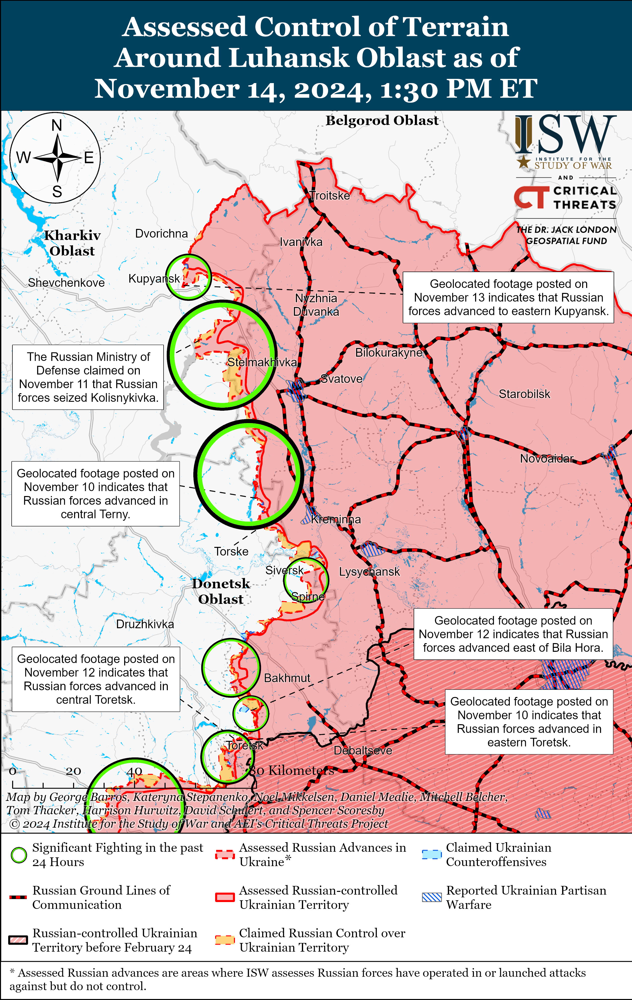
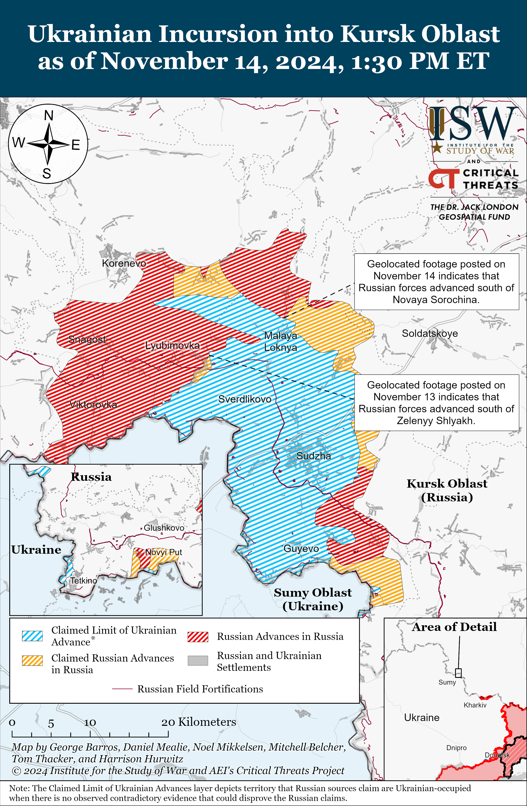
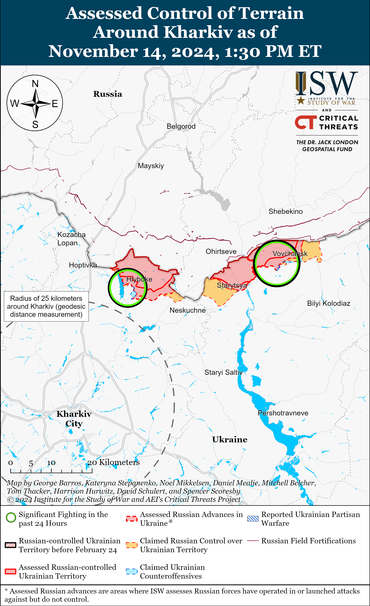
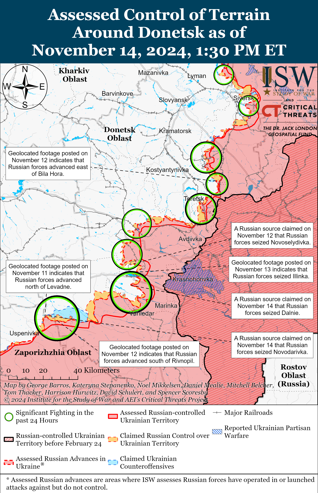
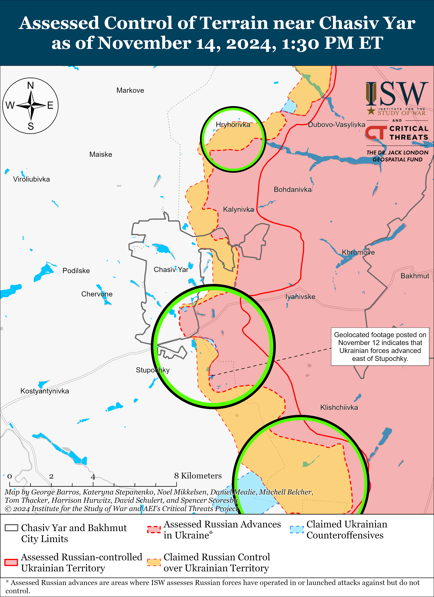
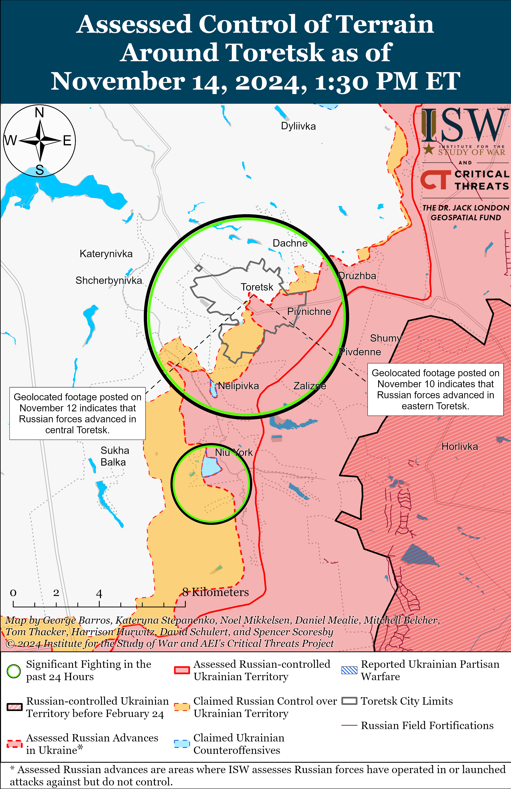
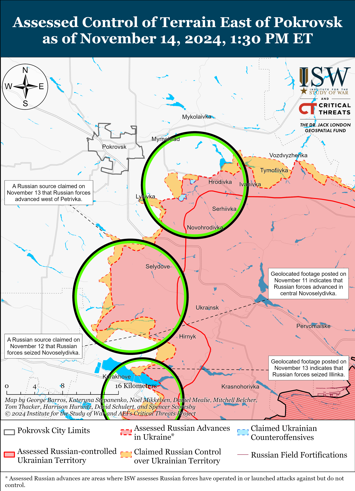
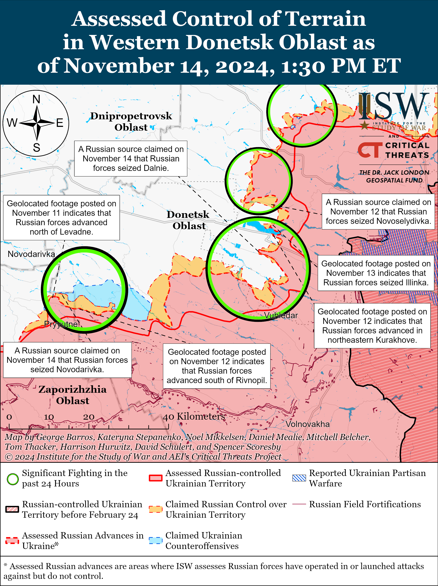
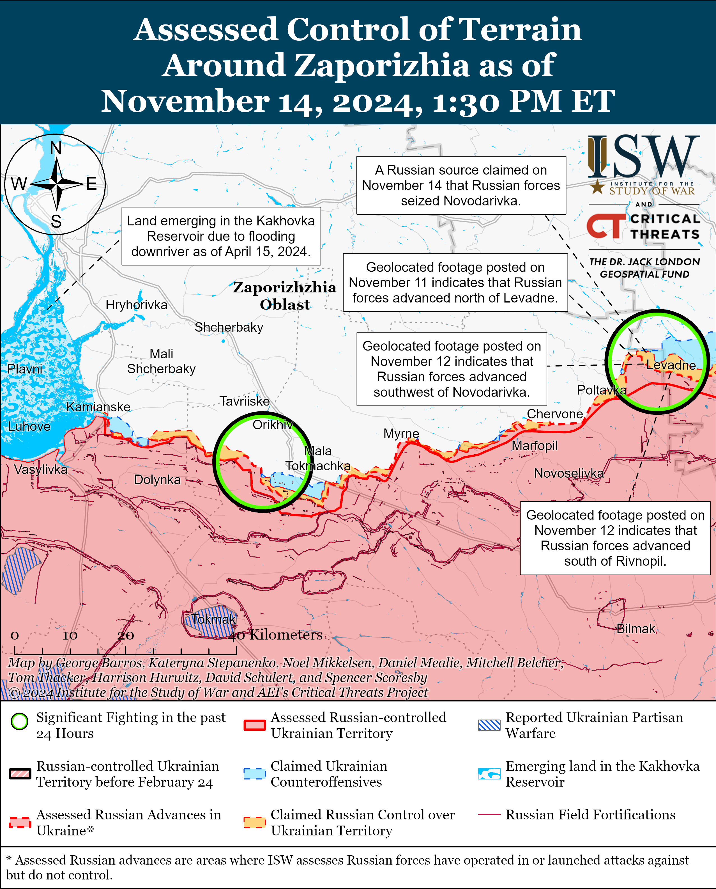
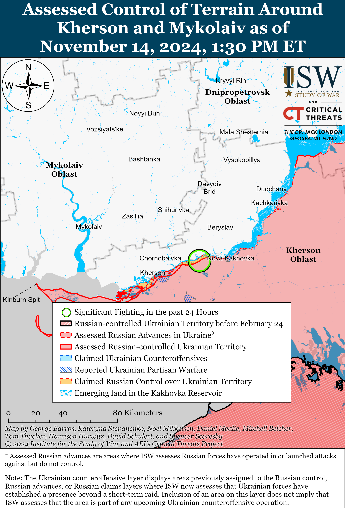

# Russian Offensive Campaign Assessment, November 14, 2024

**Kateryna Stepanenko, Davit Gasparyan, Nicole Wolkov, Nate Trotter, William Runkel, Olivia Gibson, Grace Mappes, and Frederick W. Kagan**

**November 14, 2024, 8:15pm ET**

**Click** [**here**](https://storymaps.arcgis.com/stories/36a7f6a6f5a9448496de641cf64bd375) **to see ISW’s interactive map of the Russian invasion of Ukraine. This map is updated daily alongside the static maps present in this report.**

**Click** [**here**](https://understandingwar.maps.arcgis.com/apps/instant/3dviewer/index.html?appid=1602762dbcde419bb957dea358449580) **to see ISW’s 3D control of terrain topographic map of Ukraine. Use of a computer (not a mobile device) is strongly recommended for using this data-heavy tool.**

**Click** [**here**](https://storymaps.arcgis.com/stories/733fe90805894bfc8562d90b106aa895) **to access ISW’s archive of interactive time-lapse maps of the Russian invasion of Ukraine. These maps complement the static control-of-terrain map that ISW produces daily by showing a dynamic frontline. ISW will update this time-lapse map archive monthly.**

**Note: The data cut-off for this product was 12:30pm ET on November 14. ISW will cover subsequent reports in the November 15 Russian Offensive Campaign Assessment.**

**The Kremlin’s recent economic policies indicate that the Russian economy will likely face significant challenges in 2025 and that Russian President Vladimir Putin is worried about Russia’s economic stability in the long term.** The Kremlin recently adopted several policies that aim to cut Russian government spending on wounded Russian servicemen, combat inflation, and address long-term demographic problems such as low birth rates and labor shortages. These policies demonstrate that the Russian economy is not as resilient to Western sanctions, monetary constraints, and the cost of the war effort as the Russian government postures. These policies also demonstrate that the Kremlin will not be able to sustain the protracted war effort for years and decades to come while shielding Russian society from economic challenges. Consistent Western and international support for Ukraine’s resistance on the battlefield will further exacerbate Russia’s economic problems.

**Putin modified compensation promised for Russian servicemen wounded while fighting in Ukraine — a clear indicator that the Kremlin is trying to cut the mounting short- and long-term costs of the war and restore balance to the Russian economy.** Putin controversially changed Russian policy guaranteeing a one-time payment of three million rubles ($30,124) to all Russian servicemen who have been wounded in combat in Ukraine since March 2022.[1] Putin signed a decree on November 13 that restricted the one-time payments of three million rubles only to servicemen who sustained serious injuries in combat, only offering one million rubles ($10,152) to lightly wounded servicemen, and 100,000 rubles ($1,015) to servicemen who sustained minor injuries on the battlefield.[2] Putin’s decree generated significant backlash from the Russian ultranationalist milblogger community, and Putin attempted to placate this community on November 14 by increasing the one-time payments to four million rubles ($40,136), but still only for Russian servicemen who sustain severe battlefield injuries that result in a disability.[3] A Russian milblogger noted that Putin’s authorization to increase compensation for disabled servicemen does not alter the fact that the Kremlin is reneging on promises to thousands of Russian servicemen who joined the Russian military solely due to large financial incentives.[4] The milblogger added that Russian military medical commissions are also becoming increasingly — and often deliberately unfairly — selective in diagnosing Russian servicemen with severe injuries.

Putin originally introduced the policy offering all wounded Russian servicemen three million rubles to incentivize military recruitment after he had decided against declaring general mobilization in Spring 2022.[5] Financial incentives became the key pillar of the Russian military’s recruitment campaign and personnel retention efforts over the past nearly three years, and the reversal of such incentives indicates that the system is becoming economically unsustainable for the Kremlin. ISW notably assessed in Summer 2022 that the Kremlin’s reliance on high financial incentives for force generation was committing Russia to short- and long-term financial responsibilities to thousands of Russians, such as paying veterans pensions, compensations to families of deceased servicemen, and other state benefits.[6]

**The Kremlin’s efforts to combat inflation and high interest rates are also reportedly impacting the expansion of the Russian defense industrial base (DIB) and prospects for mobilizing the economy.** The Russian Central Bank recently raised the key interest rate to 21 percent on October 25, which reportedly prompted discontent among Russian politicians, DIB CEOs, and elites. Kremlin-affiliated Center for Macroeconomic Analysis and Short-Term Forecasting (TsMAKP) reported that the Russian economy is “effectively facing the threat of stagflation – simultaneous stagnation or even recession and high inflation” because of the Central Bank’s tight monetary policy.[7] TsMAKP assessed that if the Russian Central Bank maintains the key interest rate at around 20 percent until mid-2025 then the composite leading indicator (CLI) for recession will exceed its critical threshold. The Ukrainian Foreign Intelligence Service similarly reported that the number of loans with a dynamic rate — which depends on a discount from the Central Bank — increased from 44 percent in late 2023 to 53 percent in late 2024.[8] The Ukrainian Foreign Intelligence Service added that high interest rates may create a shock and a decline in production, which can result in bankruptcies and corporate defaults. A Kremlin insider source claimed that the Central Bank’s tight monetary policy is restraining the Russian DIB’s pace of development in the long term and has already complicated several Russian export projects, despite the fact that it had not yet directly impacted Russian military-technological support for the Russian war effort.[9]

**The Russian DIB is unlikely to match the production rate necessary to replace Russian weapons losses under these monetary policies.** *Foreign Policy* (FP)*,* citing OSINT analysts, reported that Russia has been losing around 320 tank and artillery cannon barrels per month but can only produce 20 per month.[10] FP reported that Russia will likely run out of cannon barrels in 2025 due to battlefield losses, dwindling Soviet stocks, and sanctions impacts. FP also cited OSINT estimates that Russian forces have lost at least 4,955 infantry fighting vehicles (IFVs) since February 2022 — about 155 IFVs per month. FP reported that Russia can only produce about 17 IFVs monthly or 200 annually. FP assessed that the Central Bank’s policy of raising interest rates has made it difficult for nondefense companies to raise capital through loans, which is shrinking the civilian economy and may lead to significant post-war recession as returning Russian veterans will have a harder time finding employment.

**The Kremlin is also adopting policies aimed at bolstering the domestic population in the long term, signaling mounting concerns over declining demographics and labor shortages that could threaten the sustainable operations of the Russian DIB.** Russian state outlet *RBK* claimed on November 14 that the Russian government has developed a draft Strategy of Action through 2036 to address Russia’s increasingly dire demographic issues.[11] The Strategy of Action aims to increase birthrates and promote the family lifestyle by improving support system for families with children and providing birth incentives; solving housing problems to increase the availability of rental, social, and new housing; creating conditions for a more successful work-family balance; improving reproductive health of the population, in particular women’s prenatal and infertility care; and enhancing family-positive propaganda in media and the Russian information space. The Strategy of Action is a part of broader efforts by Russian authorities to advance policies aimed at increasing the Russian population both through concrete legislation but also through rhetoric centered on “familial and traditional” values.[12]

ISW previously assessed that Russia’s demographic challenges have been worsened by the war with an estimated 800,000 to 900,000 Russians — including many highly qualified workers- fleeing the country since February 2022 likely causing Russian authorities to rely more on migrant populations.[13] Russian Federal State Statistics Service (Rosstat) data shows that Russia’s labor shortage amounted to 4.8 million people in 2023, a problem that has reduced Russia’s economic output.[14] Rosstat also estimated in 2023 that Russia’s population will decline naturally at a rate of more than 600,000 people per year until 2032. Russian President Vladimir Putin acknowledged Russia’s ongoing labor shortage on November 7 and admitted to Russia’s heavy reliance on migrants in order to mitigate the impacts of its waning population on the broader Russian workforce.[15] Putin warned, however, that reliance on migrant populations requires systematic assimilation efforts, likely in response to continued tensions between Russian ultranationalist rhetoric and the need to keep the Russian labor force capacity afloat through migration. Migrant populations are also not likely to yield the desired outcome in Russia given continued racist rhetoric and legislation and lack of skillsets among economic migrants needed to comprise a professional working class. FP reported that the Russian “civilian economy” has experienced personnel shortages and lack of qualified workers due to concerted Russian government efforts to attract Russian laborers to its DIB leading to possible future economic turmoil resulting from labor shortages and declining population. ISW has recently observed Russian authorities revoking migrants’ Russian citizenship for refusing to register for military service, an increase in migrant deportations in 2024, protests, and violence against minority communities, among other rhetorical and legal realities that have created obstacles for migrants both to enter and to advance in the Russian workforce.[16] A combination of naturally declining population and aversion to creating conditions conducive to migration and enhancement of the skilled labor workforce will possibly impair the Russian economy and consequently Russian DIB in the mid- to long-term.

**Russian forces recently advanced into Kupyansk during a likely roughly company-sized mechanized assault, although ISW does not assess that Russian forces control the area.** Geolocated footage published on November 13 shows at least four Russian vehicles conducting an assault, indicating that Russian forces recently advanced southward along a railway line.[17] Russian and Ukrainian sources stated that Russian forces attacked in two armored vehicle columns and that one column consisted of one tank and three armored vehicles and the other column consisted of an unspecified composition and number of vehicles.[18] Ukrainian Center for Countering Disinformation Head Lieutenant Andriy Kovalenko reported on November 14 that Ukrainian forces repelled Russian attacks in Kupyansk and prevented Russian forces from establishing positions in Kupyansk.[19] The Ukrainian Armed Forces Center for Strategic Communications (StratCom) reported that Kupyansk is fully under Ukrainian control and reiterated a Ukrainian General Staff report from November 13 stating that Ukrainian forces repelled a Russian assault on the settlement.[20] ISW assessed that Russian forces likely advanced in northeastern Kupyansk but very likely do not control the area, and ISW maps currently show areas in northeastern Kupyansk where ISW assesses Russian forces have operated in or launched attacks against but do not control. Russian forces have intensified offensive operations near Kupyansk within the last two months and ISW continues to assess that the Russian seizure of Kupyansk would generate operationally significant effects.[21] ISW is not prepared to assess whether Russian forces will be able to leverage recent tactical advances to make operationally significant gains, however. Russian forces also continued offensive operations north of Kupyansk near Holubivka; east of Kupyansk near Petropavlivka; southeast of Kupyansk near Kolisnykivka, Hlushkivka, Kruhlyakivka, Lozova, Zahryzove, Kucherivka on November 13 and 14.[22]

**A recent Russian state-affiliated poll suggests that most Russian residents feel largely unaffected by the war in Ukraine, supporting reports of growing concerns among Russian officials and elites that many citizens remain indifferent towards the war.** Kremlin newswire *TASS* amplified a poll conducted by the Russian state-affiliated Institute of Sociology of the Federal Research Center of the Russian Academy of Sciences on November 14 revealing that 83 percent of respondents claimed that the “Special Military Operation” did not affect their daily life or affected it only to a slight extent.[23] Patriarch Kirill, head of the Kremlin-controlled Russian Orthodox Church Moscow Patriarchate (ROC MP), claimed on October 31 that  some segments of Russian society choose to “turn a blind eye” to the realities of the frontline and the hardships faced by those living in border areas near the conflict, although the war in Ukraine represents the “most urgent threat” to Russia.[24] Kirill condemned Russians who are unwilling to sacrifice their personal comforts, instead relying on “superficial distractions” to avoid confronting the hard realities of the war. ISW assessed that Kirill’s remarks likely reflect underlying concerns among Russian authorities, as they suggest possible waning public support for the war effort, potential difficulties in future recruitment efforts, and a growing societal divide between portions of the Russian population most directly affected by the war and those largely insulated from its impacts.[25]

**Kremlin Spokesperson Dmitry Peskov claimed on November 14 that Russian President Vladimir Putin is personally dealing with issues concerning Ukraine and that he requires no special envoys, likely in response to reports that US President-elect Donald Trump will “soon” appoint a “Ukrainian peace envoy to lead negotiations on ending the war.”[26]**

**Key Takeaways:**

- **The Kremlin’s recent economic policies indicate that the Russian economy will likely face significant challenges in 2025 and that Russian President Vladimir Putin is worried about Russia’s economic stability in the long term.**
- **Putin modified compensation promised for Russian servicemen wounded while fighting in Ukraine — a clear indicator that the Kremlin is trying to cut the mounting short- and long-term costs of the war and restore balance to the Russian economy.**
- **The Kremlin’s efforts to combat inflation and high interest rates are also reportedly impacting the expansion of the Russian defense industrial base (DIB) and prospects for mobilizing the economy.**
- **The Russian DIB is unlikely to match the production rate necessary to replace Russian weapons losses under these monetary policies.**
- **The Kremlin is also adopting policies aimed at bolstering the domestic population in the long term, signaling mounting concerns over declining demographics and labor shortages that could threaten the sustainable operations of the Russian DIB.**
- **Russian forces recently advanced into Kupyansk during a likely roughly company-sized mechanized assault, although ISW does not assess that Russian forces control the area.**
- **A recent Russian state-affiliated poll suggests that most Russian residents feel largely unaffected by the war in Ukraine, supporting reports of growing concerns among Russian officials and elites that many citizens remain indifferent towards the war.**
- **Kremlin Spokesperson Dmitry Peskov claimed on November 14 that Russian President Vladimir Putin is personally dealing with issues concerning Ukraine and that he requires no special envoys, likely in response to reports that US President-elect Donald Trump will “soon” appoint a “Ukrainian peace envoy to lead negotiations on ending the war.”**
- **Russian forces advanced in the Ukrainian main salient in Kursk Oblast, west of Ukraine’s main salient in Kursk Oblast in Glushkovsky Raion, in the Chasiv Yar direction, and in the Donetsk-Zaporizhia Oblast border area.**
- **Russian sources are speculating that North Korea may have provided North Korean-produced 170mm M1989 “Koksan” self-propelled artillery systems to Russia. Russian milbloggers published images showing a train transporting alleged North Korean 170mm M1989 “Koksan” self-propelled artillery systems in Krasnoyarsk, Krasnoyarsk Krai.**

***We do not report in detail on Russian war crimes because these activities are well-covered in Western media and do not directly affect the military operations we are assessing and forecasting. We will continue to evaluate and report on the effects of these criminal activities on the Ukrainian military and the Ukrainian population and specifically on combat in Ukrainian urban areas. We utterly condemn Russian violations of the laws of armed conflict and the Geneva Conventions and crimes against humanity even though we do not describe them in these reports.***

- Ukrainian Operations in the Russian Federation
- Russian Main Effort — Eastern Ukraine (comprised of three subordinate main efforts)
- Russian Subordinate Main Effort #1 — Push Ukrainian forces back from the international border with Belgorod Oblast and approach to within tube artillery range of Kharkiv City
- Russian Subordinate Main Effort #2 — Capture the remainder of Luhansk Oblast and push westward into eastern Kharkiv Oblast and encircle northern Donetsk Oblast
- Russian Subordinate Main Effort #3 — Capture the entirety of Donetsk Oblast
- Russian Supporting Effort — Southern Axis
- Russian Air, Missile, and Drone Campaign
- Russian Mobilization and Force Generation Efforts
- Russian Technological Adaptations
- Activities in Russian-occupied areas
- Significant Activity in Belarus

**Ukrainian Operations in the Russian Federation**

Russian forces recently advanced within the Ukrainian main salient in Kursk Oblast. Geolocated footage published on November 13 shows Ukrainian forces repelling a Russian platoon-sized mechanized assault south of Zelenyi Shlyakh (southeast of Korenevo) and indicates that Russian forces advanced in the area.[27] Geolocated footage published on November 14 shows that elements of the Russian 810th Naval Infantry Brigade (Black Sea Fleet, Southern Military District [SMD]) launched mechanized attacks near Maryevka, Pogrebki, Orlovka, and Novaya Sorochina (all northwest of Sudzha), and advanced to the southern part of Novaya Sorochina.[28] Russian milbloggers claimed that the Russian rate of advance had slowed down; that Russian forces seized some positions between Pogrebki and Kremyanoye (east of Korenevo); and there are no confirmations that Russian forces entered Kurilovka (south of Sudzha).[29] Russian sources, including the Russian Ministry of Defense (MoD), claimed that fighting continued east of Korenevo near Kremyanoye; south of Korenevo near Nikolayevo-Darino; southeast of Korenevo near Novoivanovka, Leonidovo, and Darino; northwest of Sudzha near Novaya Sorochina and Malaya Loknya; and south of Sudzha near Plekhovo.[30] Elements of the Russian 155th Naval Infantry Brigade (Pacific Fleet, Eastern Military District [EMD]), 56th Airborne (VDV) Regiment (7th VDV Division), and 106th VDV Division reportedly continued to operate in the Kursk direction.[31] Assault elements of the Russian “Arbat” Separate Spetsnaz Battalion (Russian Volunteer Corps) are reportedly operating near Plekhovo.[32]

A Russian milblogger claimed that Russian field commanders are deliberately producing false reports, which exaggerate Russian advances within the Ukrainian main salient in Kursk Oblast and contribute to Russian losses on the battlefield.[33] The milblogger stated that Russian military command is committing elements of the 810th Naval Infantry Brigade to daily unprepared assaults and that Ukrainian defenses are further destroying the brigade. The milblogger added that elements of the 810th Naval Infantry Brigade are still fighting for Orlovka, Pogrebki, Novaya Sorochina, and Staraya Sorochina (immediately southwest of Novaya Sorochina), and that Ukrainian forces encircled and eliminated one of the brigade’s two groups. The Kremlin is beginning to face some limited protests from Russians residents in Kursk Oblast’s border area, and the problem of Russian field commanders misreporting the extent of the Russian advances in Kursk Oblast is likely a symptom of the Kremlin’s demands to decisively repel the Ukrainian incursion.[34]

Russian forces recently marginally advanced west of Ukraine’s main salient in Kursk Oblast in Glushkovsky Raion. Geolocated footage published on November 14 indicates that Russian forces recently advanced east of Novy Put (southwest of Glushkovo).[35]

Belgorod Oblast-based outlet *Pepel* reported that Ukrainian forces struck a Russian military equipment storage area in Belgorod City on November 14.[36] *Pepel* reported that an unspecified Ukrainian missile struck the roof of a building where Russian forces store several “Ural” trucks and other military equipment, and that the strike injured several conscripts.

**Russian Main Effort — Eastern Ukraine**

**Russian Subordinate Main Effort #1 — Kharkiv Oblast (Russian objective: Push Ukrainian forces back from the international border with Belgorod Oblast and approach to within tube artillery range of Kharkiv City)**

Russian forces continued offensive operations in northern Kharkiv Oblast on November 13 and 14 but did not make any confirmed advances. Official Ukrainian sources reported that fighting continued north of Kharkiv City near Hlyboke and northeast of Kharkiv City near Vovchansk.[37] Ukrainian sources also reported that Russian forces conducted likely cross-border raids near Vysoka Yaruha (directly south of the international border and about 20km north of Kharkiv City).[38] The spokesperson of a Ukrainian brigade operating in northern Kharkiv Oblast stated on November 14 that the worsening weather conditions are complicating Russian forces’ movement and both Russian and Ukrainian troops’ ability to use drones.[39] The Ukrainian official further reported that Russian forces are taking advantage of the lack of Ukrainian drones in the area to replenish their reserves in the area.

**Russian Subordinate Main Effort #2 — Luhansk Oblast (Russian objective: Capture the remainder of Luhansk Oblast and push westward into eastern Kharkiv Oblast and northern Donetsk Oblast)**

*See topline text for updates on the Kupyansk direction.*

Russian forces continued offensive operations along the Svatove-Kreminna line on November 14, but did not make confirmed advances. A Russian milblogger claimed on November 14 that Russian forces advanced west, south, and east of Pershotravneve (west of Svatove), but ISW has not observed confirmation of this claim.[40] Russian forces conducted offensive operations west of Svatove near Zelenyi Hai and Pershotravneve;  and northwest of Svatove near Pishchane; southwest of Svatove near Cherneshchyna, Novoyehorivka and Druzhelyubivka; northwest of Kremmina near Novomykhailivka, Makiivka, and Katerynivka; and west of Kremmina near Zarichne, Nevske, Torske, and Terny on November 13 and 14.[41]

**Russian Subordinate Main Effort #3 — Donetsk Oblast (Russian objective: Capture the entirety of Donetsk Oblast, the claimed territory of Russia’s proxies in Donbas)**

Russian forces continued assaults east of Siversk near Verkhnokamyanske on November 14, but did not advance.[42] A Russian milblogger claimed on November 14 that Russian forces advanced south of Siversk near Rozdolivka, but ISW has not confirmed confirmation of this claim.[43] A Ukrainian brigade reported on November 13 that Russian forces recently conducted an unsuccessful platoon-sized mechanized assault near Spirne (southeast of Siversk).[44] Elements of the Russian 2nd Artillery Brigade (3rd Combined Arms Army [CAA], formerly the 2nd Luhansk People’s Republic (LNR] Army Corps [AC]) are reportedly operating near Zvanivka (south of Siversk).[45] Elements of the Russian 39th Radiation, Chemical, and Biological Protection Regiment (3rd CAA) are reportedly operating in the Siversk direction.[46]

Russian forces recently advanced south of Chasiv Yar amid continued offensive operations in this direction on November 14. Geolocated footage posted on November 14 indicates that Russian forces recently advanced east of Bila Hora (south of Chasiv Yar).[47] A Russian milblogger claimed on November 14 that Russian forces advanced southeast of Stupochky (south of Chasiv Yar), but ISW has not observed visual confirmation of this claim.[48]  Russian forces conducted offensive operations near Stupochky on November 13.[49] Elements of the Russian Ivanovo Airborne (VDV) Formation (98th VDV Division) and the Russian 6th Motorized Rifle Division (3rd AC) are reportedly operating in the Chasiv Yar direction.[50]

Russian forces continued offensive operations in the Toretsk direction on November 14, but did not make confirmed advances. A Russian milblogger claimed on November 13 that Russian forces advanced in southern Krymske (northeast of Toretsk), but ISW has not observed visual confirmation of this claim.[51] Russian forces continued offensive operations near Toretsk itself; north of Toretsk near Dyliivka; immediately west of Toretsk near Shcherbynivka; and southwest of Toretsk near Nelipivka on November 13 and 14.[52]

Russian forces continued offensive operations in the Pokrovsk direction on November 14 but did not make any confirmed advances. Russian forces continued attacking east of Pokrovsk near Promin and Myrolyubivka; southeast of Pokrovsk near Lysivka, Krutyi Yar, Sukhyi Yar; and south of Pokrovsk near Hyrhorivka, Pustynka, Petrivka, Novooleksiivka, Yurivka, Dachenske, Pushkine, and Zhovte on November 13 and 14.[53]

Russian forces continued offensive operations in the Kurakhove direction on November 14 but did not make any confirmed advances. The Ukrainian Center for Strategic Communications (Stratcom) stated on November 14 that Ukrainian forces control Illinka and that fighting is ongoing on the outskirts of the settlement.[54] ISW assessed that Russian forces likely seized Illinka as of November 13 due to geolocated footage published on November 13 showing elements of the Russian 114th Motorized Rifle Brigade (51st CAA, formerly 1st Donetsk People’s Republic [DNR] AC) raising a flag over central Illinka (northeast of Kurakhove).[55] ISW does not assess that Russian forces control the settlement, although Russian forces likely occupy it. The Russian Ministry of Defense (MoD) claimed that Russian forces seized Voznesenka (north of Kurakhove).[56] Russian milbloggers claimed that Russian forces advanced within eastern Kurakhove and north of Illinka (north of Kurakhove).[57] ISW has not observed visual evidence of these claims. A Ukrainian brigade operating in the Kurakhove direction published footage on November 13 showing Russian forces conducting a roughly reduced company-sized mechanized assault in an unspecified area in the Kurakhove direction.[58] Russian forces continued attacking within Kurakhove; northeast of Kurakhove near Zorya and Sontsivka; north of Kurakhove near Novoselydivka, Berestky, Illinka, and Kreminna Balka, Voznesenka; and west of Kurakhove near Maksymilyanivka on November 13 and 14.[59] The spokesperson of Ukrainian brigade operating in the Kurakhove direction stated that Russian forces are conducting assaults using tanks, armored personnel carriers, infantry fighting vehicles, motorcycles, and buggies and are attempting to reach Uspenivka (southwest of Kurakhove and northeast of Vuhledar).[60] Ukrainian military observer Kostyantyn Mashovets stated on November 14 that the Russian military has concentrated roughly 70,000 personnel from its Central, Southern and Eastern groupings of forces in the Kurakhove direction.[61] Mashovets stated that elements of the Russian 90th Tank Division (41st CAA, Central Military District [CMD]) and 1st, 5th, 110th, 114th motorized rifle brigades (51st CAA) are operating north and northeast of the Kurakhove near Novooleksiivka, Ukrainka, Novodmytrivka, and Solntsivka.[62]

Russian forces continued offensive operations in the Vuhledar direction on November 14 but did not make any confirmed advances. A Russian milblogger claimed that Russian forces seized Dalne (north of Vuhledar) and advanced northeast of Vuhledar near Antonivka and Maksymivka.[63] Russian forces continued attacking north of Vuhledar near Dalne; northeast of Vuhledar near Katerynivka and Antonivka; northwest of Vuhledar near Yantarne, Kosyantynopolske, and Trudove on November 13 and 14.[64] Elements of the Russian “Astra” artillery unit of the 36th Motorized Rifle Brigade (29th CAA, EMD) are reportedly operating near Maksymivka.[65] Mashovets stated that elements of the Russian 20th and 150th motorized rifle divisions (8th CAA, Southern Military District [SMD]) are operating near Dalne; elements of the 39th Motorized Rifle Brigade (68th AC, Eastern Military District [EMD]) are operating near Antonivka, Katerynivka, and Yelyzavetivka (all northeast of Vuhledar); elements of the 36th Motorized Rifle Brigade (29th CAA, EMD) and 37th Motorized Rifle Brigade (36th CAA, EMD) are operating west of Trudove; elements of the 40th Naval Infantry Brigade (Pacific Fleet, EMD) and 37th Motorized Rifle Brigade are operating in the direction of Rozlyv (northwest of Vuhledar).[66]

Russian forces recently advanced in the Donetsk-Zaporizhia Oblast border area amid continued offensive operations in the area on November 14. Geolocated footage published on November 11 and 12 indicates that Russian forces recently advanced south of Rivnopil and north of Levadne (both southwest of Velyka Novosilka). [67] A Russian milblogger claimed that Russian forces seized Novodarivka, although ISW has not observed visual evidence of this claim.[68] Russian forces continued attacking south of Velyka Novosilka near Makarivka and southwest of Velyka Novosilka near Novodarivka, Rivnopil, and Novopil on November 13 and 14.[69]

**Russian Supporting Effort — Southern Axis (Russian objective: Maintain frontline positions and secure rear areas against Ukrainian strikes)**

Russian forces reportedly recently advanced in the Hulyaipole (far eastern Zaporizhia Oblast) direction. Russian sources claimed on November 14 that Russian forces advanced southeast of Hulyaipole near Marfopil and south of Hulyaipole near Dorozhnyanka, although ISW has not observed visual confirmation of these claims.[70] The Ukrainian General Staff reported that Russian forces did not conduct any offensive operations in the Hulyaipole direction on November 14.[71] Sniper elements of the Russian 38th Motorized Rifle Brigade (35th Combined Arms Army [CAA], Eastern Military District [EMD]) are reportedly operating in the Polohy direction.[72]

Russian forces reportedly recently advanced in western Zaporizhia Oblast amid continued fighting on November 14, but there were no confirmed changes to the frontline. A Russian milblogger claimed that Russian forces advanced further north of Robotyne, although ISW has not observed visual confirmation of this claim.[73] Russian forces conducted ground attacks north of Robotyne near Novodanylivka and northwest of Robotyne near Novoandriivka on November 13 and 14.[74] A Russian milblogger downplayed recent speculations that Russian forces may intensify assaults in Zaporizhia Oblast in the near future.[75] ISW has still not observed any reports confirming that Russian forces have redeployed forces to the Zaporizhia direction from other areas of the frontline. Artillery elements of the Russian ”Viking” Detachment (22nd Spetsnaz Brigade, Russian General Staff Main Directorate [GRU]) are reportedly operating in Zaporizhia Oblast.[76]

Positional fighting continued in the Dnipro direction in east (left) bank Kherson Oblast on November 13 and 14, but there were no confirmed changes to the frontline.[77] Elements of the Russian BARS-33 Detachment (Russian Army Combat Reserves) reportedly continue operating in the Kherson direction.[78]

A road bridge on the Dzhankoy-Maslove (both northeast of Simferopol) highway in occupied Crimea collapsed overnight on November 13 to 14, prompting some Russian information space concerns about Russian military logistics from occupied Crimea to elsewhere in occupied southern Ukraine. Russian occupation officials reported that the bridge collapsed due to an oversized truck driving across the bridge and that the bridge collapsed onto railway tracks, temporarily stopping civilian and freight railway traffic between occupied Crimea and Zaporizhia Oblast.[79] Russian occupation officials claimed that the railway tracks remain operational and resumed railway traffic during the day on November 14.[80] Russian occupation authorities reported that restoring the roadway bridge will take three to four months. Russian milbloggers expressed concern about Russian railway logistics, claiming that the affected railway is the only railway connecting occupied Crimea to occupied Kherson Oblast and that the collapse temporarily cut off Russian logistics to Russian forces in occupied Kherson Oblast.[81]

Ukrainian Navy Spokesperson Captain Third Rank Dmytro Pletenchuk reported on November 14 that Russian Black Sea Fleet (BSF) vessels are no longer operating in the Black Sea due to poor weather conditions and are instead increasing aviation operations over the Black Sea.[82]

**Russian Air, Missile, and Drone Campaign (Russian Objective: Target Ukrainian military and civilian infrastructure in the rear and on the frontline)**

Russian forces conducted a series of drone strikes against Ukraine on the night of November 13 to 14. The Ukrainian Air Force reported on November 14 that Russian forces launched 59 Shahed drones and unspecified strike drones from Kursk Oblast.[83] The Ukrainian Air Force reported that Ukrainian forces downed 21 drones over Sumy, Kharkiv, Poltava, and Kyiv oblasts and that 38 drones were ”locally lost,” likely due to Ukrainian electronic warfare (EW) interference. The Sumy Oblast Military Administration reported on November 14 that Ukrainian forces downed 11 Shahed drones over Sumy Oblast.[84]

**Russian Mobilization and Force Generation Efforts (Russian objective: Expand combat power without conducting general mobilization)**

Russian sources are speculating that North Korea may have provided North Korean-produced 170mm M1989 “Koksan” self-propelled artillery systems to Russia. Russian milbloggers published images showing a train transporting alleged North Korean 170mm M1989 “Koksan” self-propelled artillery systems in Krasnoyarsk, Krasnoyarsk Krai.[85] Russian milbloggers claimed that the North Korean “Koksan” self-propelled artillery systems are mounted on Russian T-54 or T-62 tank chassis, have a fire rate of one to two shots per five minutes, and have a range of 40 to 60 kilometers.[86] A prominent, Kremlin-affiliated Russian milblogger celebrated the alleged weapons transfer and speculated that North Korea could provide Russian forces with higher-caliber weapons and allow Russia to significantly expand its military capabilities.[87] Russian opposition outlet *Vazhnye Istorii* (iStories) reported that Russian forces may use the “Koksan” self-propelled artillery system to replace recent losses of Russian 2S7 Pion 203mm self-propelled artillery systems in challenging operational areas.[88] ISW is unable to independently confirm reports of North Korea providing Russian forces with artillery systems.

Russian milbloggers expressed continued concern over poor Russian medical care to Russian soldiers who fought in Ukraine amid recent Ministry of Defense (MoD) efforts to posture as providing effective care.[89] Russian milbloggers complained on November 14 that the Russian MoD failed to properly develop distribution and logistics networks to supply the Russian military with medical supplies at the army, divisional, and regimental levels after nearly three years of war despite having sufficient supplies in storage.[90] The Russian milbloggers claimed that the shortfalls in the MoD’s medical supplies have forced volunteer organizations and other medical units not tasked with obtaining supplies to fill the gaps in medical stores but that these efforts are insufficient for Russian needs. Russian opposition outlet *Astra* published footage on November 14 showing Russian soldiers of the 35th Management Brigade (41st Combined Arms Army [CAA], Central Military District [CMD] rioting following a confrontation with Russian military police officers over being denied medical care and being misled by commanding officers in Novosibirsk City.[91]

**Russian Technological Adaptations (Russian objective: Introduce technological innovations to optimize systems for use in Ukraine)**

Nothing significant to report.

**Activities in Russian-occupied areas (Russian objective: Consolidate administrative control of annexed areas; forcibly integrate Ukrainian citizens into Russian sociocultural, economic, military, and governance systems)**

Russia may be struggling to create a coherent and unified federal-level occupation strategy for Ukraine and is instead relying on loyal Kremlin insiders to adjudicate control over occupied areas. A Russian insider source claimed on November 14 that the Kremlin has reportedly abandoned its previous plan to create the “Novorossiya” Federal Okrug (federal district) in occupied Kherson, Zaporizhia, Donetsk, and Luhansk oblasts until at least the end of the active phase of military operations in Ukraine, suggesting that the Kremlin’s administrative control of occupied Ukraine remains fairly *ad hoc* and de-centralized.[92] Zaporizhia Oblast occupation governor Yevgeny Balitsky first publicly announced the plan to create the Novorossiya Federal Okrug in June 2024.[93]  A Russian insider source previously claimed that the okrug project, if Russian authorities had proceeded with it, would have showcased the Kremlin’s pivot toward developing the economic prospects of occupied Ukraine and streamlining its integration with Russia.[94] The Kremlin’s apparent abandonment of the project may then be an indicator of increasing constraints on Russia’s ability to administer the occupation of Ukraine due to ongoing domestic economic struggles. The Russian insider source further claimed that Presidential Administration First Deputy Head Sergei Kiriyenko’s recent visit to Ukraine is a strong indicator that the Kremlin will likely continue to rely on Kiriyenko to lead federal-level initiatives in occupied Ukraine following the de-prioritization of the Novorossiya Federal Okrug project.[95]  ISW has previously assessed that Kiriyenko is one of the main Kremlin officials directly involved in administering the occupation of Ukraine.[96] Kiriyenko will likely continue to personally oversee occupation efforts in the absence of a larger okrug-level administrative body to oversee the occupation. Kiriyenko’s personal bandwidth to do so is likely limited, however, as he also oversees many of the Kremlin’s internal machinations, including the veteran-focused “Time of Heroes” program.[97]

**Significant activity in Belarus (Russian efforts to increase its military presence in Belarus and further integrate Belarus into Russian-favorable frameworks and Wagner Group activity in Belarus)**

Russian and Belarusian authorities continue to increase legal cooperation through unified border control standards. The Belarusian Ministry of Industry statedon November 14 that Russian and Belarusian authorities signed a temporary agreement to streamline border controls and the exchange of electronic passports for exports between Russia and Belarus, as well as establish a groundwork for a permanent electronic passport system by the end of 2024.[98]

**Note: ISW does not receive any classified material from any source, uses only publicly available information, and draws extensively on Russian, Ukrainian, and Western reporting and social media as well as commercially available satellite imagery and other geospatial data as the basis for these reports. References to all sources used are provided in the endnotes of each update.**

[1] https://understandingwar.org/backgrounder/russian-offensive-campaign-assessment-november-13-2024; https://meduza dot io/news/2024/11/14/putin-podnyal-vyplatu-za-ranenie-povlekshee-invalidnost-do-chetyreh-millionov-rubley-posle-togo-kak-nakanune-poruchil-sokratit-vyplaty; https://t.me/rybar/65367

[2] https://understandingwar.org/backgrounder/russian-offensive-campaign-assessment-november-13-2024

[3] https://t.me/mod\_russia/45691; https://t.me/milinfolive/134998 ; https://t.me/rybar/65367; https://understandingwar.org/backgrounder/russian-offensive-campaign-assessment-november-13-2024

[4] https://t.me/tretyakov\_n/1406

[5] https://understandingwar.org/backgrounder/russian-volunteer-units-and-battalions

[6] https://understandingwar.org/backgrounder/russian-volunteer-units-and-battalions

[7] http://www.forecast dot ru/\_ARCHIVE/Mon\_MK/2024/macro53.pdf; https://www.businessinsider.com/russia-economy-outlook-stagflation-recession-inflation-gdp-growth-ukraine-war-2024-11

[8] https://szru dot gov.ua/news-media/news/rosiyu-ochikuyut-masovi-bankrutstva-ta-korporatyvni-defolty

[9] https://t.me/kremlin\_sekret/16469

[10] https://foreignpolicy.com/2024/11/14/russia-war-putin-economy-weapons-production-labor-shortage-demographics/

[11] https://meduza dot io/news/2024/11/14/rbk-v-pravitelstve-razrabotali-demograficheskuyu-strategiyu-vlasti-predlagayut-povysit-effektivnost-vyplaty-alimentov-i-nagrazhdat-mnogovnukovyh-babushek; https://www.rbc dot ru/economics/14/11/2024/673477059a79475403f0341e

[12] https://understandingwar.org/backgrounder/russian-offensive-campaign-assessment-march-29-2024;

[13] https://understandingwar.org/backgrounder/fact-sheet-kremlins-occupation-playbook-coerced-russification-and-ethnic-cleansing

[14] https://understandingwar.org/backgrounder/fact-sheet-kremlins-occupation-playbook-coerced-russification-and-ethnic-cleansing

[15] http://kremlin dot ru/events/president/news/75521

[16]https://rus.azattyk.org/a/33194051.html; https://www.interfax dot ru/russia/979681; https://understandingwar.org/backgrounder/russian-offensive-campaign-assessment-march-28-2024

[17] https://t.me/creamy\_caprice/7502; https://t.me/DeepStateUA/20712; https://x.com/front\_ukrainian/status/1857055007427764550; https://x.com/99Dominik\_/status/1857058508467814786; https://x.com/99Dominik\_/status/1857058664147718361; https://t.co/IaZpE6Kx1d

[18] https://t.me/bbcrussian/72889 ; https://t.me/DeepStateUA/20712 ; https://t.me/DnevnikDesantnika/19173 ; https://t.me/RVvoenkor/80619 ; https://t.me/dva\_majors/57682

[19] https://t.me/CenterCounteringDisinformation/12265 ; https://armyinform dot com.ua/2024/11/14/syly-oborony-znyshhyly-okupantiv-yaki-namagalysya-zakripytysya-v-kupyansku/

[20] https://t.me/AFUStratCom/26876

[21] https://isw.pub/UkrWar110924 ; https://understandingwar.org/backgrounder/russian-winter-spring-2024-offensive-operation-kharkiv-luhansk-axis

[22] https://www.facebook.com/GeneralStaff.ua/posts/pfbid0hrfUJCwtEqd81u3DgqqP9Gy3G3LAeLiNequfeypKZir8BoDCEp4mcbaD6qxdviMQl; https://www.facebook.com/GeneralStaff.ua/posts/pfbid02aEoKSE2gTmbyokFYEr232Z9L1sLjeo9dimagLghcHDarTwUSK3AP5GG3WLLUPpEcl; https://www.facebook.com/GeneralStaff.ua/posts/pfbid02zu1peN3CPjrEt1PK526hNmdXFegsjTGm4fxdrxpVbXig1zj7mk7pjd5oxoxroS79l;

[23] https://t.me/tass\_agency/285250

[24] https://understandingwar.org/backgrounder/russian-offensive-campaign-assessment-november-1-2024; http://www.patriarchia dot ru/db/text/6170962.html

[25] https://understandingwar.org/backgrounder/russian-offensive-campaign-assessment-november-1-2024

[26] https://www.foxnews.com/politics/trump-appoint-ukrainian-peace-envoypromises-negotiating-end-war-russia; https://t.me/tass\_agency/285240

[27] https://t.me/WarArchive\_ua/22249;  https://t.me/ua\_marines\_36brigade/2439

[28] https://t.me/WarArchive\_ua/22238;  https://t.me/brigade95/1528; https://x.com/GirkinGirkin/status/1856960458390999245 ; https://t.me/brigade95/1528

[29] https://t.me/rybar/65362; https://t.me/dva\_majors/57728

[30] https://t.me/rybar/65362; https://t.me/mod\_russia/45690; https://t.me/dva\_majors/57682; https://t.me/dva\_majors/57728

[31] https://t.me/rusich\_army/18462; https://t.me/dva\_majors/57682; https://t.me/Sladkov\_plus/11798

[32] https://t.me/tass\_agency/285222

[33] https://t.me/dva\_majors/57728; https://t.me/yurasumy/19150

[34] https://meduza dot io/news/2024/11/14/prosim-vas-zakonchit-etu-proklyatuyu-voynu-bezhentsy-iz-kurskogo-sela-olgovka-ostavshiesya-bez-zhilya-obratilis-k-putinu; https://meduza dot io/news/2024/11/14/vlasti-kurskoy-oblasti-otchitalis-o-vydache-dvuh-sertifikatov-na-zhilie-posle-protestov-zhiteley-prigranichnyh-sel-poteryavshih-svoi-doma; https://meduza dot io/news/2024/11/14/rt-i-mash-glavu-esche-odnogo-prigranichnogo-rayona-kurskoy-oblasti-otpravili-v-otstavku; https://t.me/mash/59191; https://t.me/shot\_shot/74129; https://t.me/vchkogpu/52506; https://t.me/tass\_agency/285229

[35] https://t.me/exilenova\_plus/3398; https://x.com/TuiteroMartin/status/1857061406564057203; https://x.com/TuiteroMartin/status/1857071977908818086; https://x.com/budeshta/status/1857070131886559642

[36] https://t.me/belpepel/8399; https://t.me/astrapress/68456

[37] https://www.facebook.com/GeneralStaff.ua/posts/pfbid0hrfUJCwtEqd81u3DgqqP9Gy3G3LAeLiNequfeypKZir8BoDCEp4mcbaD6qxdviMQl; https://www.facebook.com/GeneralStaff.ua/posts/pfbid02aEoKSE2gTmbyokFYEr232Z9L1sLjeo9dimagLghcHDarTwUSK3AP5GG3WLLUPpEcl; https://www.facebook.com/GeneralStaff.ua/posts/pfbid02zu1peN3CPjrEt1PK526hNmdXFegsjTGm4fxdrxpVbXig1zj7mk7pjd5oxoxroS79l;  https://t.me/otukharkiv/2611

[38] https://www.facebook.com/GeneralStaff.ua/posts/pfbid02zu1peN3CPjrEt1PK526hNmdXFegsjTGm4fxdrxpVbXig1zj7mk7pjd5oxoxroS79l; https://t.me/otukharkiv/2611; https://www.facebook.com/GeneralStaff.ua/posts/pfbid02aEoKSE2gTmbyokFYEr232Z9L1sLjeo9dimagLghcHDarTwUSK3AP5GG3WLLUPpEcl

[39] https://armyinform dot com.ua/2024/11/14/u-sylah-oborony-nazvaly-prychynu-yaka-uskladnyuye-vorogu-peresuvannya-na-harkivshhyni/

[40] https://t.me/z\_arhiv/29486

[41] https://www.facebook.com/GeneralStaff.ua/posts/pfbid0hrfUJCwtEqd81u3DgqqP9Gy3G3LAeLiNequfeypKZir8BoDCEp4mcbaD6qxdviMQl; https://www.facebook.com/GeneralStaff.ua/posts/pfbid02aEoKSE2gTmbyokFYEr232Z9L1sLjeo9dimagLghcHDarTwUSK3AP5GG3WLLUPpEcl; https://www.facebook.com/GeneralStaff.ua/posts/pfbid02zu1peN3CPjrEt1PK526hNmdXFegsjTGm4fxdrxpVbXig1zj7mk7pjd5oxoxroS79l

[42] https://www.facebook.com/GeneralStaff.ua/posts/pfbid0hrfUJCwtEqd81u3DgqqP9Gy3G3LAeLiNequfeypKZir8BoDCEp4mcbaD6qxdviMQl

[43] https://t.me/z\_arhiv/29477

[44] https://t.me/WarArchive\_ua/22250;  https://t.me/rubizh3018/807

[45] https://t.me/epoddubny/21613

[46] https://t.me/epoddubny/21608

[47] https://t.me/creamy\_caprice/7509; https://t.me/luhanskdpsu/400

[48] https://t.me/sashakots/50132

[49] https://www.facebook.com/GeneralStaff.ua/posts/pfbid02zu1peN3CPjrEt1PK526hNmdXFegsjTGm4fxdrxpVbXig1zj7mk7pjd5oxoxroS79l

[50] https://t.me/DnevnikDesantnika/19155; https://t.me/dva\_majors/57723; https://t.me/sashakots/50147

[51] https://t.me/z\_arhiv/29447

[52] https://www.facebook.com/GeneralStaff.ua/posts/pfbid0hrfUJCwtEqd81u3DgqqP9Gy3G3LAeLiNequfeypKZir8BoDCEp4mcbaD6qxdviMQl; https://www.facebook.com/GeneralStaff.ua/posts/pfbid02aEoKSE2gTmbyokFYEr232Z9L1sLjeo9dimagLghcHDarTwUSK3AP5GG3WLLUPpEcl; https://www.facebook.com/GeneralStaff.ua/posts/pfbid02zu1peN3CPjrEt1PK526hNmdXFegsjTGm4fxdrxpVbXig1zj7mk7pjd5oxoxroS79l

[53] https://www.facebook.com/GeneralStaff.ua/posts/pfbid0hrfUJCwtEqd81u3DgqqP9Gy3G3LAeLiNequfeypKZir8BoDCEp4mcbaD6qxdviMQl ; https://www.facebook.com/GeneralStaff.ua/posts/pfbid02aEoKSE2gTmbyokFYEr232Z9L1sLjeo9dimagLghcHDarTwUSK3AP5GG3WLLUPpEcl ; https://www.facebook.com/GeneralStaff.ua/posts/pfbid02zu1peN3CPjrEt1PK526hNmdXFegsjTGm4fxdrxpVbXig1zj7mk7pjd5oxoxroS79l ; https://t.me/rusich\_army/18458 ; https://t.me/dva\_majors/57682

[54] https://t.me/AFUStratCom/26876

[55] https://understandingwar.org/backgrounder/russian-offensive-campaign-assessment-november-13-2024

[56] https://t.me/mod\_russia/45689

[57] https://t.me/z\_arhiv/29467; https://t.me/RVvoenkor/80628

[58] https://t.me/mechanized33/539 ; https://t.me/ButusovPlus/14974

[59] https://www.facebook.com/GeneralStaff.ua/posts/pfbid0hrfUJCwtEqd81u3DgqqP9Gy3G3LAeLiNequfeypKZir8BoDCEp4mcbaD6qxdviMQl ; https://www.facebook.com/GeneralStaff.ua/posts/pfbid02aEoKSE2gTmbyokFYEr232Z9L1sLjeo9dimagLghcHDarTwUSK3AP5GG3WLLUPpEcl ; https://www.facebook.com/GeneralStaff.ua/posts/pfbid02zu1peN3CPjrEt1PK526hNmdXFegsjTGm4fxdrxpVbXig1zj7mk7pjd5oxoxroS79l ; https://t.me/wargonzo/23143 ; https://t.me/boris\_rozhin/144303

[60] https://armyinform dot com.ua/2024/11/14/vid-tankiv-do-motoczykliv-na-kurahivskomu-napryamku-vorog-kydaye-v-bij-vsyu-nayavnu-tehniku/

[61] https://t.me/zvizdecmanhustu/2348

[62] https://t.me/zvizdecmanhustu/2345

[63] https://t.me/z\_arhiv/29473

[64] https://www.facebook.com/GeneralStaff.ua/posts/pfbid0hrfUJCwtEqd81u3DgqqP9Gy3G3LAeLiNequfeypKZir8BoDCEp4mcbaD6qxdviMQl ; https://www.facebook.com/GeneralStaff.ua/posts/pfbid02aEoKSE2gTmbyokFYEr232Z9L1sLjeo9dimagLghcHDarTwUSK3AP5GG3WLLUPpEcl ; https://www.facebook.com/GeneralStaff.ua/posts/pfbid02zu1peN3CPjrEt1PK526hNmdXFegsjTGm4fxdrxpVbXig1zj7mk7pjd5oxoxroS79l

[65] https://t.me/voin\_dv/11830

[66] https://t.me/zvizdecmanhustu/2345 ; https://t.me/zvizdecmanhustu/2346

[67] https://x.com/ZoamSc2/status/1856818677976633794; https://x.com/ZoamSc2/status/1856818681202024863; https://t.me/orb131/1297 ; https://t.me/creamy\_caprice/7501; https://t.me/skarlatop/4050

[68] https://t.me/DnevnikDesantnika/19184

[69] https://www.facebook.com/GeneralStaff.ua/posts/pfbid0hrfUJCwtEqd81u3DgqqP9Gy3G3LAeLiNequfeypKZir8BoDCEp4mcbaD6qxdviMQl ; https://www.facebook.com/GeneralStaff.ua/posts/pfbid02aEoKSE2gTmbyokFYEr232Z9L1sLjeo9dimagLghcHDarTwUSK3AP5GG3WLLUPpEcl ; https://www.facebook.com/GeneralStaff.ua/posts/pfbid02zu1peN3CPjrEt1PK526hNmdXFegsjTGm4fxdrxpVbXig1zj7mk7pjd5oxoxroS79l

[70] https://t.me/z\_arhiv/29483; https://t.me/boris\_rozhin/144331

[71] https://www.facebook.com/GeneralStaff.ua/posts/pfbid0hrfUJCwtEqd81u3DgqqP9Gy3G3LAeLiNequfeypKZir8BoDCEp4mcbaD6qxdviMQl

[72] https://t.me/voin\_dv/11829

[73] https://t.me/z\_arhiv/29492

[74] https://www.facebook.com/GeneralStaff.ua/posts/pfbid0hrfUJCwtEqd81u3DgqqP9Gy3G3LAeLiNequfeypKZir8BoDCEp4mcbaD6qxdviMQl; https://www.facebook.com/GeneralStaff.ua/posts/pfbid02aEoKSE2gTmbyokFYEr232Z9L1sLjeo9dimagLghcHDarTwUSK3AP5GG3WLLUPpEcl; https://www.facebook.com/GeneralStaff.ua/posts/pfbid02zu1peN3CPjrEt1PK526hNmdXFegsjTGm4fxdrxpVbXig1zj7mk7pjd5oxoxroS79l

[75] https://t.me/wargonzo/23143; https://understandingwar.org/backgrounder/russian-offensive-campaign-assessment-november-12-2024

[76] https://t.me/voin\_dv/11836; https://t.me/ZA\_FROHT/35041

[77] https://www.facebook.com/GeneralStaff.ua/posts/pfbid02zu1peN3CPjrEt1PK526hNmdXFegsjTGm4fxdrxpVbXig1zj7mk7pjd5oxoxroS79l; https://www.facebook.com/GeneralStaff.ua/posts/pfbid02aEoKSE2gTmbyokFYEr232Z9L1sLjeo9dimagLghcHDarTwUSK3AP5GG3WLLUPpEcl; https://www.facebook.com/GeneralStaff.ua/posts/pfbid0hrfUJCwtEqd81u3DgqqP9Gy3G3LAeLiNequfeypKZir8BoDCEp4mcbaD6qxdviMQl

[78] https://t.me/dva\_majors/57713

[79] https://meduza dot io/news/2024/11/14/v-krymu-obrushilsya-most-vlasti-anneksirovannogo-poluostrova-zayavili-chto-on-ne-vyderzhal-vesa-bolshegruznogo-avtomobilya

[80] https://tass dot ru/obschestvo/22405967; https://www.rbc dot ru/rbcfreenews/6735208a9a79478497dfda89; https://www.kommersant dot ru/doc/7298779

[81] https://t.me/rybar/65355 ; https://t.me/dva\_majors/57675

[82] https://armyinform dot com.ua/2024/11/14/vms-zsu-vorozha-aviacziya-peretvoryla-chorne-more-na-siru-zonu/

[83] https://t.me/kpszsu/22872

[84] https://t.me/Sumy\_news\_ODA/31351 ; https://t.me/Sumy\_news\_ODA/31350

[85] https://x.com/archer83able/status/1857075934274171021; https://x.com/bayraktar\_1love/status/1857026675428479481; https://x.com/bayraktar\_1love/status/1857064906861789265; https://t.me/milinfolive/135026; https://t.me/war\_home/3052; https://mil.in dot ua/uk/news/v-rosiyi-pomityly-korejski-dalekobijni-sau-m1989-koksan/ ; https://t.me/notes\_veterans/20470;

[86] https://t.me/RVvoenkor/80638; https://t.me/rybar/65382; https://t.me/sashakots/50149

[87] https://t.me/rybar/65382

[88] https://t.me/istories\_media/8160

[89]https://understandingwar.org/wp-content/uploads/2024/11/Russian20Offensive20Campaign20Assessment20November20132C2020242028PDF29\_0.pdf ; https://understandingwar.org/backgrounder/russian-offensive-campaign-assessment-september-12-2024 ; https://understandingwar.org/backgrounder/russian-offensive-campaign-assessment-september-4-2024 ; https://understandingwar.org/backgrounder/russian-offensive-campaign-assessment-october-9-2024

[90] https://t.me/dva\_majors/57687 ; https://t.me/vrachivyneodni\_channel/7208 ; https://t.me/dva\_majors/57715

[91] https://t.me/astrapress/68440

[92] https://t.me/kremlin\_sekret/16468

[93] https://understandingwar.org/backgrounder/russian-offensive-campaign-assessment-june-7-2024

[94] https://understandingwar.org/backgrounder/russian-offensive-campaign-assessment-june-7-2024

[95] https://t.me/kremlin\_sekret/16468

[96] https://understandingwar.org/backgrounder/russian-offensive-campaign-assessment-december-31-2023 ; https://understandingwar.org/backgrounder/russian-offensive-campaign-assessment-may-4 ; https://understandingwar.org/backgrounder/russian-offensive-campaign-assessment-march-12-2024 ; https://meduza dot io/en/feature/2022/06/10/the-viceroy

[97] https://understandingwar.org/backgrounder/russian-offensive-campaign-assessment-october-25-2024; https://understandingwar.org/backgrounder/russian-offensive-campaign-assessment-october-30-2024

[98] https://t.me/belta\_telegramm/278211 ; https://belta dot by/society/view/belarus-i-rossija-budut-vremenno-obmenivatsja-svedenijami-iz-sistem-elektronnyh-pasportov-tehniki-675454-2024/
