# Russian Offensive Campaign Assessment, November 15, 2024

**Grace Mappes, Davit Gasparyan, Karolina Hird, Angelica Evans, Olivia Gibson, Nate Trotter, William Runkel, and George Barros**

**November 15, 2024, 7:00pm ET**

**Click** [**here**](https://storymaps.arcgis.com/stories/36a7f6a6f5a9448496de641cf64bd375) **to see ISW’s interactive map of the Russian invasion of Ukraine. This map is updated daily alongside the static maps present in this report.**

**Click** [**here**](https://understandingwar.maps.arcgis.com/apps/instant/3dviewer/index.html?appid=1602762dbcde419bb957dea358449580) **to see ISW’s 3D control of terrain topographic map of Ukraine. Use of a computer (not a mobile device) is strongly recommended for using this data-heavy tool.**

**Click** [**here**](https://storymaps.arcgis.com/stories/733fe90805894bfc8562d90b106aa895) **to access ISW’s archive of interactive time-lapse maps of the Russian invasion of Ukraine. These maps complement the static control-of-terrain map that ISW produces daily by showing a dynamic frontline. ISW will update this time-lapse map archive monthly.**

**Note: The data cut-off for this product was 12:30pm ET on November 15. ISW will cover subsequent reports in the November 16 Russian Offensive Campaign Assessment.**

**The Kremlin is intensifying its reflexive control campaign aimed at influencing Western decision-making in Russia’s favor ahead of or in lieu of possible future negotiations about the resolution of the war in Ukraine.** Russian President Vladimir Putin had a phone call with German Chancellor Olaf Scholz on November 15 and reiterated several Kremlin information operations aimed at influencing the German government and other Western states to pressure Ukraine into premature peace negotiations instead of providing Ukraine with further military support.[1] Ukrainian President Volodymyr Zelensky called the Scholz-Putin call “Pandora’s box” and warned that the call helps Putin achieve his key goals: reducing his isolation in the international community and bringing about negotiations on Russia’s preferred terms “that will lead to nothing.”[2]

Putin and other senior Russian officials have recently intensified rhetoric aimed at influencing the foreign policy of the incoming US government under President-elect Donald Trump.[3] The Kremlin has also recently reiterated its unwillingness to compromise on the terms of any possible future negotiations while strongly indicating that the Kremlin’s longstanding goal of complete Ukrainian capitulation remains unchanged.[4] The Kremlin likely aims to take advantage of uncertainty about the future US policy regarding Ukraine by intensifying its reflexive control campaign against Ukraine’s European allies.[5] Senior Russian officials, including Security Council Secretary Sergei Shoigu and Defense Minister Andrei Belousov, have notably used phone calls with Western political and defense officials to spread Kremlin information operations and attempt to threaten the West into making premature concessions on Ukraine’s sovereignty and territorial integrity since 2022.[6]

**Abkhazian oppositionists protested an agreement between the de facto government of Georgia’s Abkhazia region with Russia aimed at enhancing Russian investors’ rights in Abkhazia on November 15.** Protesters in Abkhazia stormed the de facto parliament of the Russian-occupied and Kremlin-backed separatist region of Georgia, demanding the dismissal of a proposed investment agreement with Russia that would grant Russian legal entities property ownership rights in Abkhazia and Russian developers preferential tax exemptions.[7] Critics of the proposed legislation argued that the deal would inflate property prices, empower oligarchs, and undermine Abkhazia’s desired autonomy.[8] The protesters, waving Russian flags, clarified their discontent was not directed at “fraternal” Russia but at the current Abkhaz government, citing the need to protect Abkhazia’s “national interests.”[9] The protesters also called for the resignation of the current de facto Abkhazian President Aslan Bzhania.[10] The protests forced the Abkhaz parliament to postpone the vote on the agreement, with opposition leaders later announcing plans to present their demands to the current de facto Abkhaz leadership.[11]

Russian Ministry of Foreign Affairs (MFA) Spokesperson Maria Zakharova urged Russians to avoid travel to Abkhazia, citing safety concerns, and warned that the crisis could deter future economic investments in Abkhazia.[12] The Russian information space reacted by calling the protesters ungrateful, and some milbloggers attributed the protests to external actors including Turkey, while others warned that the Abkhaz economy largely relies on Russia.[13]

**Ukraine’s Western partners continue to provide Ukraine with military support via various means and platforms.** French Armed Forces Minister Sébastien Lecornu reported on November 14 that the Ukrainian “Anna Kyivska” Brigade has completed its training in France.[14] The Anna Kyivska Brigade is notably the first Ukrainian brigade that completed training in France and which France equipped as part of the European Union Military Assistance Mission (EUMAM) in support of Ukraine.[15] Ukrainian Defense Minister Rustem Umerov noted that France has provided Ukraine with general and specialized military training and “state-of-the-art” equipment and weapons, including armored personnel carriers (APCs), self-propelled artillery systems, and situational awareness systems.[16]

Umerov also met with Norwegian Prime Minister Jonas Ghar Støre and Norwegian Defense Minister Björn Arild Gram in Oslo on November 15, during which Norway announced it would join the “Danish format” of providing support for Ukraine via financing the domestic production of Ukrainian weapons and equipment.[17] Umerov, Gram, and Støre also discussed the creation of a “Norwegian format” that would provide external investment in Ukrainian defense technology companies.[18]

US Deputy Pentagon Press Secretary Sabrina Singh stated during a press briefing on November 15 that the US remains committed to disbursing around $7.1 billion in Presidential Drawdown Authority (PDA) assistance to Ukraine before President-elect Donald Trump’s inauguration in January 2025.[19] Singh noted that the Pentagon plans to send military assistance packages to Ukraine on an “almost weekly” basis until the inauguration.

**Key Takeaways:**

- **The Kremlin is intensifying its reflexive control campaign aimed at influencing Western decision-making in Russia’s favor ahead of or in lieu of possible future negotiations about the resolution of the war in Ukraine.**
- **Abkhazian oppositionists protested an agreement between the de facto government of Georgia’s Abkhazia region with Russia aimed at enhancing Russian investors’ rights in Abkhazia on November 15.**
- **Ukraine’s Western partners continue to provide Ukraine with military support via various means and platforms.**
- **Ukrainian forces recently advanced in Kursk Oblast and near Kurakhove, and Russian forces recently advanced near Kupyansk, Toretsk, Pokrovsk, Kurakhove, and Vuhledar.**
- **The Kremlin continues efforts to expand its “Time of Heroes” program to create a new social class comprised of veterans loyal to Russian President Vladimir Putin’s regime and ideology.**

***We do not report in detail on Russian war crimes because these activities are well-covered in Western media and do not directly affect the military operations we are assessing and forecasting. We will continue to evaluate and report on the effects of these criminal activities on the Ukrainian military and the Ukrainian population and specifically on combat in Ukrainian urban areas. We utterly condemn Russian violations of the laws of armed conflict and the Geneva Conventions and crimes against humanity even though we do not describe them in these reports.***

- Ukrainian Operations in the Russian Federation
- Russian Main Effort – Eastern Ukraine (comprised of three subordinate main efforts)
- Russian Subordinate Main Effort #1 – Push Ukrainian forces back from the international border with Belgorod Oblast and approach to within tube artillery range of Kharkiv City
- Russian Subordinate Main Effort #2 – Capture the remainder of Luhansk Oblast and push westward into eastern Kharkiv Oblast and encircle northern Donetsk Oblast
- Russian Subordinate Main Effort #3 – Capture the entirety of Donetsk Oblast
- Russian Supporting Effort – Southern Axis
- Russian Air, Missile, and Drone Campaign
- Russian Mobilization and Force Generation Efforts
- Russian Technological Adaptations
- Activities in Russian-occupied areas
- Significant Activity in Belarus

**Ukrainian Operations in the Russian Federation**

Ukrainian forces recently advanced southeast of Korenevo amid continued fighting along the main Ukrainian salient in Kursk Oblast on November 15. Geolocated footage published on November 15 shows that Ukrainian forces recently marginally advanced within eastern Novoivanovka (southeast of Korenevo).[20] A Russian milblogger claimed that Russian forces advanced in forests near Malaya Loknya (north of Sudzha), Martynovka (northeast of Sudzha), and Olgovka (east of Korenevo), and another milblogger claimed that inclement weather is slowing both Ukrainian and Russian operations in the area.[21] Russian forces continued attacks along the main Ukrainian salient in Kursk Oblast, including near Darino (southeast of Korenevo), on November 14 and 15.[22] Elements of the Russian 51st Airborne (VDV) Regiment (106th VDV Division) are reportedly operating near Darino, drone operators of the Russian “Alabiya” Group are reportedly operating in Sudzhansky Raion, and elements of the Russian 56th VDV Regiment (7th VDV Division) are reportedly operating in Kursk Oblast.[23]

[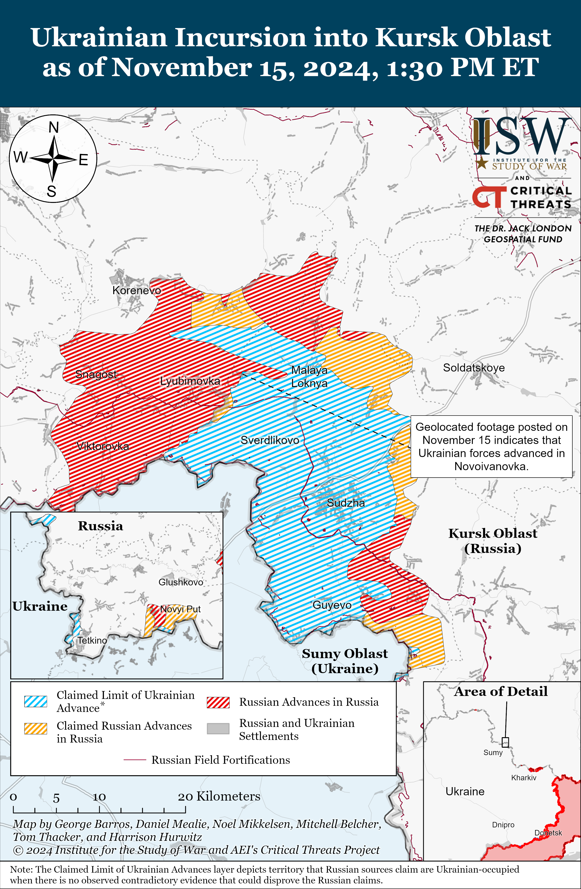](https://understandingwar.org/map/ukrainian-incursion-into-kursk-oblast-as-of-november-15-2024-130-pm-et/)

Ukrainian forces conducted a strike reportedly targeting the Krymsky Airfield in Krasnodar Krai overnight on November 14 to 15, though the damage from the strike is unclear.[24] Geolocated footage published on the evening of November 14 shows an explosion in the direction of Krymsk Airbase, which is reportedly the base of the Russian 3rd Combined Aviation Regiment (4th Air Force and Air Defense Army).[25] Krasnodar Krai authorities claimed that Russian forces intercepted 46 Ukrainian drones over Krasnodar Krai and that Ukrainian drones damaged residential areas in Krymsk and Krasnoarmeysk raions, and a Russian milblogger charactered the strike as the largest Ukrainian strike against Krasnodar Krai since the start of the full-scale invasion.[26]

**Russian Main Effort – Eastern Ukraine**

**Russian Subordinate Main Effort #1 – Kharkiv Oblast (Russian objective: Push Ukrainian forces back from the international border with Belgorod Oblast and approach to within tube artillery range of Kharkiv City)**

A likely Russian sabotage and reconnaissance group conducted a limited incursion across the international border into Chernihiv Oblast on November 15, but there are currently no indications that Russian forces have established an enduring presence in the area. Geolocated footage published on November 15 shows two Russian soldiers walking along the eastern side of a damaged bridge across the Sudost River connecting Hremyach and Kolos (both about 1.5 kilometers south of the international border), planting a Russian flag on the bridge, and returning to the eastern side of the bridge.[27] A Russian milblogger published footage of an additional Russian flag flying on an abandoned building allegedly in Muravi (east of Hremyach and Kolos), but the footage does not show Russian infantry in the area.[28] Russian milbloggers broadly claimed that Russian sabotage and reconnaissance groups crossed the border and entered or seized Hremyach, Kolos, Novoselydivka (immediately east of Kolos and west of Muravi), and Muravi.[29] ISW is unable to confirm these claims and has not observed evidence indicating that Russian soldiers maintain positions in the border area. Ukrainian State Border Service Spokesperson Andriy Demchenko and Ukrainian Center for Countering Disinformation Spokesperson Andriy Kovalenko stated that Russian forces only briefly crossed into Chernihiv Oblast to plant the Russian flags and then withdrew and that the Russian claims of advance and seizing settlements are false and are part of an information operation.[30] Demchenko stated that the border area where Russian forces planted the flag is cut off from the rest of Chernihiv Oblast by the river and that the settlements that Russian forces supposedly seized are abandoned.[31]

[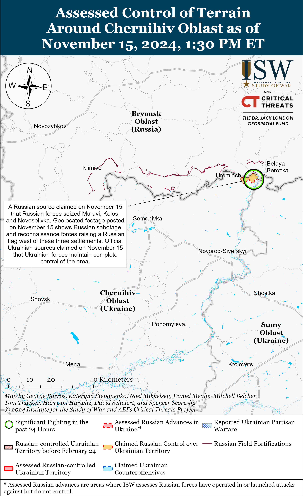](https://understandingwar.org/map/assessed-control-of-terrain-around-chernihiv-oblast-as-of-november-15-2024-130-pm-et/)

Russian forces continued limited offensive operations in northern Kharkiv Oblast on November 14 and 15 but did not advance. Russian forces continued offensive operations north of Kharkiv City within and near Vysoka Yaruha, Lyptsi, and Hlyboke and northeast of Kharkiv City near Tykhe, Starytsya, and Vovchansk.[32] A representative of a Ukrainian brigade operating in the Kharkiv direction reported on November 14 and 15 that Russian forces north of Kharkiv City are not concentrating significant forces or mechanized equipment at scale in frontline areas due to snow and poor weather conditions.[33] The representative further noted that Russian forces’ tactics in the northern Kharkiv area of operations have not changed and that Russian forces continue to conduct assaults in small infantry groups without vehicle support. Ukrainian “Kharkiv” Group of Forces Spokesperson Lieutenant Colonel Yevheniy Romanov stated that small Russian infantry groups in the Kharkiv area of operations resumed conducting attacks with tank and armored vehicle support around November 13, however.[34] Romanov stated on November 14 that Russian forces continue attacking near Vovchansk, Starytsya, and Lyptsi likely in an effort to reestablish tube artillery firing positions capable of shelling Kharkiv City and reopening access to roads that could facilitate future Russian advances toward Kharkiv City.[35]

[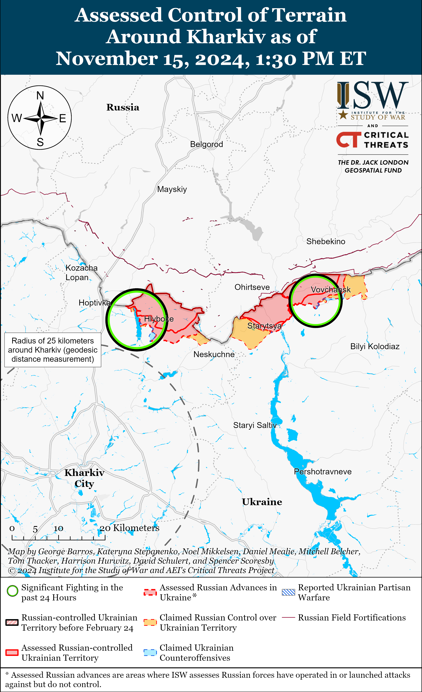](https://understandingwar.org/map/assessed-control-of-terrain-around-kharkiv-as-of-november-15-2024-130-pm-et/)

**Russian Subordinate Main Effort #2 – Luhansk Oblast (Russian objective: Capture the remainder of Luhansk Oblast and push westward into eastern Kharkiv Oblast and northern Donetsk Oblast)**

Russian forces made further advances into Kupyansk amid continued offensive operations along the Kupyansk-Svatove-Kreminna line on November 14 and 15. Geolocated footage published on November 15 indicates that Russian forces recently advanced southward to Dzerzhynskoho Street in eastern Kupyansk.[36] Russian sources claimed on November 14 and 15 that Russian forces gained a foothold on the outskirts of Kupyansk and are establishing logistics networks in the area to enable future offensive operations in the city, which is consistent with available geolocated footage.[37] Russian milbloggers claimed on November 14 and 15 that Russian forces are engaged in active combat with Ukrainian forces near the sugar factory and industrial zone in eastern Kupyansk.[38] A Ukrainian soldier operating in the Kupyansk direction stated on November 14 that Ukrainian forces were able to hold the defense of Kupyansk throughout June and July 2024 but that the situation became more challenging in the fall as small groups of one to two Russian soldiers pierced deep behind Ukrainian defensive lines.[39] Russian milbloggers claimed on November 14 that Russian forces recently utilized “new” tactics in their attack on Kupyansk and assaulted Ukrainian forces in small armored groups with five to ten accompanying infantry.[40] One milblogger added that Russian forces advanced into Kupyansk along a railroad line and are continuing attempts to advance in the area. Further Russian advances into central and western Kupyansk coupled with recent Russian advances southwest of Kupyansk near Kolisnykivka and Kruhlyakivka could force Ukrainian forces to withdraw from positions within Kupyansk and from the current Ukrainian salient east and southeast of the town.

Russian forces continued offensive operations elsewhere along the Kupyansk-Svatove-Kreminna line on November 14 and 15. Russian sources claimed on November 15 that Russian forces advanced west of Karmazynivka (southwest of Svatove) and are exerting fire control over nearly 10 kilometers of territory west of Stelmakhivka (northwest of Svatove), although ISW has not yet observed confirmation of these claims.[41] The Ukrainian General Staff reported on November 14 and 15 that Russian forces continued offensive operations north of Kupyansk near Holubivka; east of Kupyansk near Petropavlivka; southeast of Kupyansk near Hlushkivka, Pishchane Kolisnykivka, Zahryzove, Kruhlyakivka, and Lozova; and west of Svatove near Zeleny Hai, Kopanky, Pershotravneve, and Nadiya; southwest of Svatove near Novoyehorivka, Druzhelyubivka, and Katerynivka; and northwest of Kreminna near Nevske and Terny; and west of Kreminna near Torske.[42]

[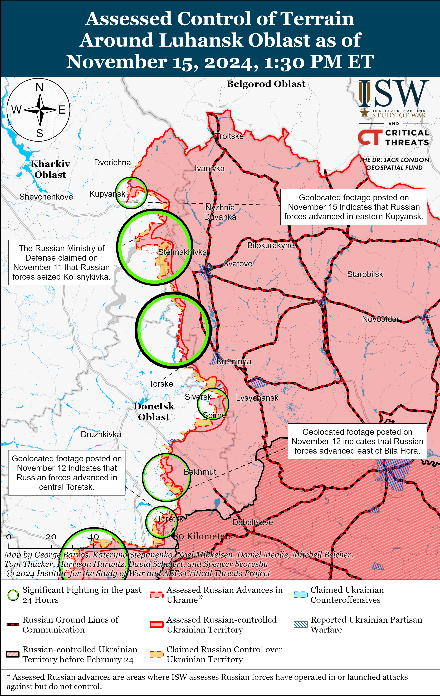](https://understandingwar.org/map/assessed-control-of-terrain-around-luhansk-oblast-as-of-november-15-2024-130-pm-et/)

**Russian Subordinate Main Effort #3 – Donetsk Oblast (Russian objective: Capture the entirety of Donetsk Oblast, the claimed territory of Russia’s proxies in Donbas)**

Russian forces continued offensive operations east of Siversk near Verkhnokamyanske on November 14 and 15 but did not advance.[43] Elements of the Russian 2nd Artillery Brigade (3rd Combined Arms Army [CAA], formerly the 2nd Luhansk People’s Republic (LNR] Army Corps [AC]) reportedly continue to operate in the Siversk direction.[44]

Russian forces continued offensive operations south of Chasiv Yar near Predtechyne on November 14 and 15 but did not advance.[45] The spokesperson of a Ukrainian brigade operating in the Chasiv Yar direction stated on November 15 that Russian infantry conducting assaults in the Chasiv Yar direction are attempting to use special raincoats and blankets to hide their thermal signatures from Ukrainian drones and thermal imagers.[46] The spokesperson stated that Russian forces are struggling to advance further west after capturing footholds of the west bank of the Siverskyi Donets Donbas Canal near Chasiv Yar. Drone operators of the Russian “Okhotnik” (Hunter) Spetsnaz Detachment (51st Combined Arms Army [CAA], formerly the 1st Donetsk People’s Republic [DNR] AC) reportedly continue to operate near Chasiv Yar.[47]

[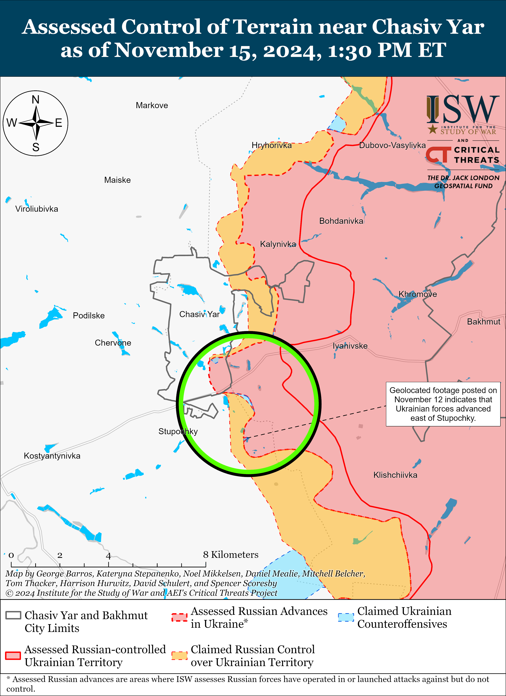](https://understandingwar.org/map/assessed-control-of-terrain-near-chasiv-yar-as-of-november-15-2024-130-pm-et/)

Russian forces recently advanced in Toretsk amid continued fighting in the direction on November 15. Geolocated footage published on November 11 and 15 indicates that Russian forces recently advanced in northeastern and southern Toretsk.[48] Russian forces conducted offensive operations in Toretsk; north of Toretsk near Dyliivka; and west of Toretsk near Shcherbynivka on November 14 and 15.[49] Ukrainian Luhansk Group of Forces Spokesperson Major Anastasiya Bobovnikova stated on November 14 that Russian forces recently conducted a mechanized assault near Nelipivka (southwest of Toretsk) and that Ukrainian forces inflicted 12 Russian personnel casualties and destroyed seven unspecified light vehicles.[50] Elements of the Russian 9th Motorized Rifle Brigade (51st CAA,) reportedly continue operating in Toretsk.[51]

[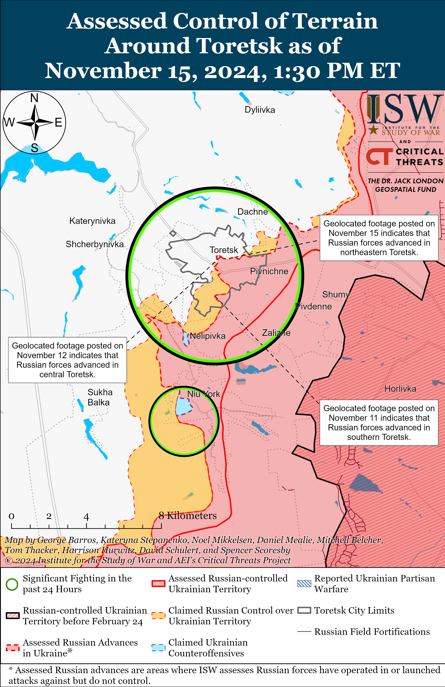](https://understandingwar.org/map/assessed-control-of-terrain-around-toretsk-as-of-november-15-2024-130-pm-et/)

Russian forces recently advanced south of Pokrovsk amid continued offensive operations in the Pokrovsk direction on November 15. Geolocated footage published on November 13 indicates that Russian forces recently marginally advanced in northern Yurivka (south of Pokrovsk and west of Selydove) and west of Novooleksiivka (southwest of Selydove).[52] A Ukrainian military observer stated that Russian forces recently seized positions in northern Petrivka and Hryhorivka (both west of Selydove).[53] Russian milbloggers claimed that Russian forces advanced up to 1.3 kilometers in depth west of Novooleksiivka and advanced along Zheleznodorozhna Street and near the railway line in Petrivka, but ISW has not observed confirmation of this claim.[54] Russian forces continued assaults east of Pokrovsk near Myrolyubivka and Promin; southeast of Pokrovsk near Lysivka and Sukhyi Yar; and south of Pokrovsk near Petrivka, Pushkine, Pustynka, and Zhovte on November 14 and 15.[55]

[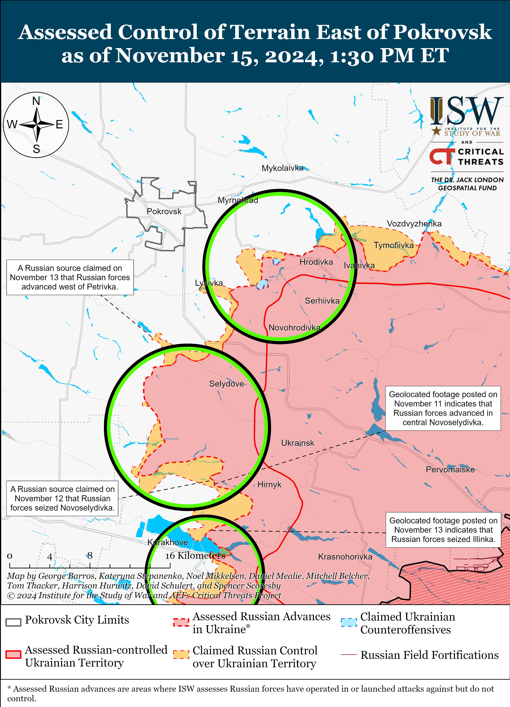](https://understandingwar.org/map/assessed-control-of-terrain-east-of-pokrovsk-as-of-november-15-2024-130-pm-et/)

Ukrainian forces recently advanced southeast of Kurakhove, and Russian forces recently marginally advanced northeast of Kurakhove. Geolocated footage published on November 14 indicates that Ukrainian forces recently advanced west of Pobieda (southwest of Kurakhove) into the rear of Russian forces currently attempting to advance near Dalne (south of Kurakhove).[56] Additional geolocated footage published on November 15 indicates that Russian forces recently marginally advanced in northern Novoselydivka (north of Kurakhove).[57] Russian milbloggers claimed that Russian forces cleared an area two kilometers wide and up to 1.5 kilometers in depth between Sontsivka and Novoselydivka (both northeast to north of Kurakhove and the Kurakhivske Reservoir) and that Russian forces advanced 350 meters in depth east of Berestky and 600 meters in depth north of Illinka (both north of Kurakhove and along the northern bank of the Kurakhivske Reservoir) and in Kurakhove itself.[58] Russian milbloggers also claimed that Russian forces seized Dalne (south of Kurakhove) and advanced southwest of the settlement.[59] ISW has not observed confirmation of these claims, however. The Russian Ministry of Defense (MoD) claimed that Russian forces seized Stepanivka (north of Kurakhove) as of November 15, although ISW assessed that Russian forces seized the settlement as of November 6.[60] Russian forces continued assaults northeast of Kurakhove near Novodmytrivka, Zorya, Voznesenka, and Sontsivka; north of Kurakhove near Novoselydivka, Novo Illinka, and Berestky; east of Kurakhove near Maksymilyanivka; and south of Kurakhove near Dalne on November 14 and 15.[61] Elements of the Russian 33rd Motorized Rifle Regiment (20th Motorized Rifle Division, 8th CAA, Southern Military District [SMD]) are reportedly operating in the Kurakhove direction.[62]

Russian forces recently advanced in the Vuhledar direction amid continued fighting on November 15. Geolocated footage published on November 14 indicates that Russian forces recently advanced in northwestern Antonivka (northeast of Vuhledar) and likely seized the entire settlement.[63] A Russian milblogger claimed that elements of the Russian 20th Motorized Rifle Division (8th CAA, SMD) participated in the seizure of Antonivka.[64] A Russian milblogger claimed on November 14 that Russian forces advanced north of Maksymivka (northeast of Vuhledar), but ISW has not observed visual confirmation of this claim.[65] Russian forces continued attacking northeast of Vuheldar near Antonivka and Kostyantynivka and northwest of Vuhledar near Yantarne, Kostyantynopolske, and Trudove on November 14 and 15.[66] Elements of the Russian “Aleppo” drone detachment of the 1472nd Motorized Rifle Regiment (68th Army Corps [AC], Eastern Military District [EMD]) are reportedly operating in the Vuhledar direction; the Russian 5th Tank Brigade (36th Combined Arms Army [CAA], EMD) near Prechystivka (west of Vuhledar); and the Russian 2nd Motorized Rifle Battalion of the 39th Motorized Rifle Brigade (68th AC, EMD) near Yelizavetivka (northeast of Vuhledar).[67]

[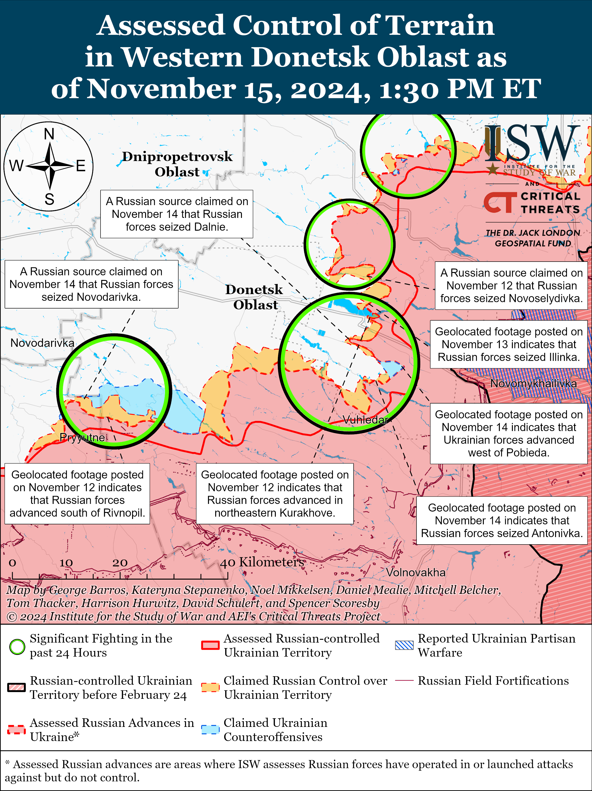](https://understandingwar.org/map/assessed-control-of-terrain-in-western-donetsk-oblast-as-of-november-15-2024-130-pm-et/)

Russian forces continued offensive operations in the Donetsk-Zaporizhia Oblast border area on November 15 but did not advance. Russian milbloggers claimed on November 14 that Russian forces advanced three kilometers in the direction of Novodarivka and advanced north of Rivnopil (both southwest of Velyka Novosilka), but ISW has not observed confirmation of these claims.[68] A Kremlin-affiliated Russian milblogger claimed that Russian forces are attempting to advance on Velyka Novosilka from the east, south, and southwest in order to eliminate the Ukrainian salient in this area, which is consistent with ISW’s recent assessment that Russian forces may attempt to leverage advances northwest of Vuhledar to pressure Ukrainian positions in Velyka Novosilka.[69] Russian forces attacked south of Velyka Novosilka near Makarivka and southwest of Velyka Novosilka near Novodarivka and Rivnopil on November 14 and 15.[70]

[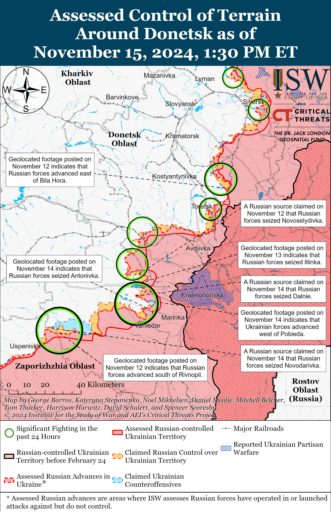](https://understandingwar.org/map/assessed-control-of-terrain-around-donetsk-as-of-november-15-2024-130-pm-et/)

**Russian Supporting Effort – Southern Axis (Russian objective: Maintain frontline positions and secure rear areas against Ukrainian strikes)**

Russian forces continued assaults in western Zaporizhia Oblast north of Robotyne near Novodanylivka on November 14 and 15.[71] A Russian milblogger claimed that Russian forces increased the tempo of strikes against Ukrainian force concentrations and defensive positions in western Zaporizhia Oblast in preparation for a possible Russian offensive operation in the near future.[72] ISW has still not independently observed confirmation that Russian forces have redeployed forces to the Zaporizhia direction from other areas of the frontline, nor other indicators suggesting an imminent Russian offensive in Zaporizhia Oblast.[73] Elements of the Russian 429th Motorized Rifle Regiment (19th Motorized Rifle Division, 58th Combined Arms Army [CAA], Southern Military District [SMD]) reportedly continue to operate in Zaporizhia Oblast.[74]

The Russian Ministry of Foreign Affairs (MFA) expressed outrage in response to a November 13 interview between the International Atomic Energy Agency (IAEA) Director General Rafael Mariano Grossi and German news agency Deutsche Presse-Agentur discussing the placement of IAEA representatives at the Zaporizhzhia Nuclear Power Plant (ZNPP). The Russian MFA claimed on November 14 that IAEA Director General Rafael Mariano Grossi made “unacceptable statements” about IAEA representatives remaining at the ZNPP until a possible freeze of the war in Ukraine and stressed that only the Russian government can authorize IAEA representatives to visit the ZNPP.[75] Russia has illegally occupied the ZNPP since March 2022.

[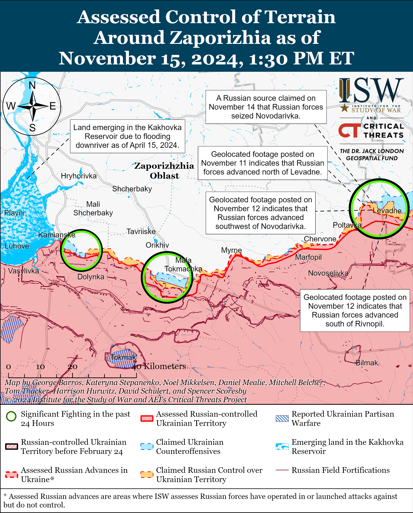](https://understandingwar.org/map/assessed-control-of-terrain-around-zaporizhia-as-of-november-15-2024-130-pm-et/)

Positional fighting continued in the Dnipro direction in east (left) bank Kherson Oblast on November 14 and 15, but there were no confirmed changes to the frontline.[76] Drone operators of the Russian 205th Motorized Rifle Brigade (49th CAA, SMD) are reportedly operating in the Kherson direction.[77] Elements of the Russian 61st Naval Infantry Brigade (Leningrad Military District [LMD], formerly Northern Fleet) are reportedly operating on the islands of the Dnipro River Delta.[78] Ukrainian military observer Kostyantyn Mashovets noted on October 30 that Russia transferred unspecified elements of the 61st Naval Infantry Brigade to the Pokrovsk direction, suggesting that elements of the brigade are now split between at least two sectors of the front.[79]

[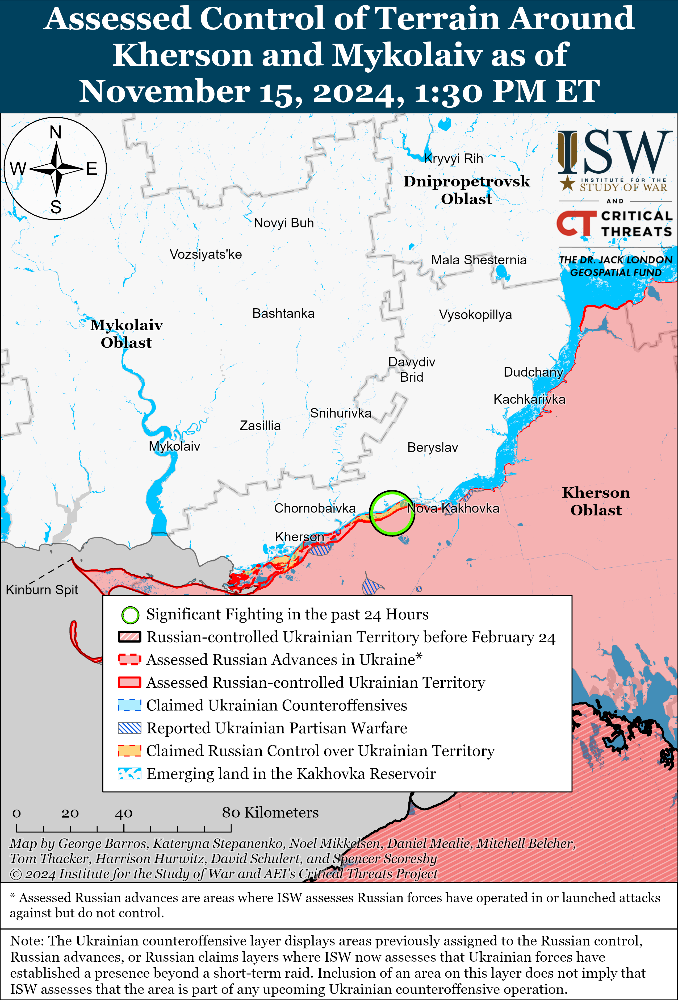](https://understandingwar.org/map/assessed-control-of-terrain-around-kherson-and-mykolaiv-as-of-november-15-2024-130-pm-et/)

Ukrainian naval drone strikes and poor weather conditions are forcing the Russian military to allocate a significant number of Russian air defenses from other frontline directions to occupied Crimea in order to defend critical infrastructure. Ukrainian Navy Spokesperson Captain Third Rank Dmytro Pletenchuk reported on November 15 that Ukrainian naval drone strikes on Russian Black Sea Fleet (BSF) vessels decreased the number of Russian BSF vessels guarding the Kerch Strait Bridge from between 10 to 14 in 2023 to zero in November 2024.[80] Pletenchuk noted that Russian forces are utilizing rotary-wing aircraft instead of Russian fixed-wing aviation to defend the Kerch Strait Bridge as Russian helicopters can maintain the same speed as Ukrainian drones and more easily patrol the area. Pletenchuk reported on November 14 that poor weather conditions are causing Russian forces to rely on aviation instead of Russian BSF vessels to patrol the Black Sea.[81] ISW previously assessed in June 2024 that sustained Ukrainian strikes against Russian military targets in occupied Crimea were forcing Russia to commit additional air defense assets to the area, and it appears that this pattern has continued due to the pressure of Ukrainian naval drone strikes and deteriorating weather conditions.[82**]**

**Russian Air, Missile, and Drone Campaign (Russian Objective: Target Ukrainian military and civilian infrastructure in the rear and on the frontline)**

Russian forces conducted another series of missile and drone strikes against Ukraine overnight on November 14 to 15. The Ukrainian Air Force reported that Russian forces launched two Kh-59/69 cruise missiles at Odesa Oblast from airspace over the Black Sea and 29 Shahed drones from Primorsko-Akhtarsk, Krasnodar Krai and occupied Crimea overnight.[83] The Ukrainian Air Force reported that Ukrainian forces shot down one of the Kh-59/69 missiles and 25 drones primarily over Odesa Oblast. Ukrainian officials reported that Ukrainian forces also downed Shahed drones in Mykolaiv, Kirovohrad, and Ternopil oblasts.[84] Acting Head of the Ukrainian Air Force Press Office Colonel Yuriy Ihnat stated that Russian forces only used Shahed drones for the November 14-15 strike and did not use any mock drones like in other recent strikes likely to complicate Ukrainian air defenses.[85] Odesa Oblast officials reported that the Russian strikes damaged port infrastructure, civilian infrastructure, residential buildings, heating systems, and religious and educational institutions in Odesa City.[86]

**Russian Mobilization and Force Generation Efforts (Russian objective: Expand combat power without conducting general mobilization)**

The Kremlin continues efforts to expand its “Time of Heroes” program to create a new social class comprised of veterans loyal to Russian President Vladimir Putin’s regime and ideology. The Time of Heroes Public Council held a meeting on November 14 to discuss expanding educational programming for select war veterans, including establishing a second cohort of graduate school master students to study public administration.[87] A Russian source asserted on November 15 that over 1,000 Russian veterans signed up within the first few hours of the enrolment period.[88] A Russian insider source claimed on November 15 that the initiative has left a positive impression on Russian authorities, who are now aiming to scale up and amplify the program at the federal level and among veterans in good standing with the Kremlin.[89] The source noted that Russian authorities’ apparent satisfaction with the Time of Heroes program suggests that the influence of Kremlin elites who lead the program – specifically First Deputy Head of the Presidential Administration Sergei Kiriyenko and Rector of the Russian Presidential Academy of National Economy and Public Administration Alexei Komissarov – will likely increase. ISW has previously assessed that the Kremlin is attempting to militarize Russian society and government and to fill government positions with pro-Kremlin and pro-war veterans through the Time of Heroes program.[90]

Russian forces continue to commit newly recruited servicemembers with little to no combat training to frontline combat. A Russian milblogger amplified a claim on November 15 that an inexperienced contract servicemember signed a contract on October 14 only to die in combat twelve days later on October 26.[91] The milblogger claimed that deaths resulting from expedited training are now a common occurrence. Russian forces’ reduced and expedited training has contributed to higher attrition rates and cohesion problems within the Russian military.[92]

**Russian Technological Adaptations (Russian objective: Introduce technological innovations to optimize systems for use in Ukraine)**

Nothing significant to report.

**Activities in Russian-occupied areas (Russian objective: Consolidate administrative control of annexed areas; forcibly integrate Ukrainian citizens into Russian sociocultural, economic, military, and governance systems)**

*ISW is not publishing coverage of activities in Russian-occupied areas today.*

**Significant activity in Belarus (Russian efforts to increase its military presence in Belarus and further integrate Belarus into Russian-favorable frameworks and Wagner Group activity in Belarus)**

Nothing significant to report.

**Note: ISW does not receive any classified material from any source, uses only publicly available information, and draws extensively on Russian, Ukrainian, and Western reporting and social media as well as commercially available satellite imagery and other geospatial data as the basis for these reports. References to all sources used are provided in the endnotes of each update.**

[1] https://www.bundesregierung dot de/breg-de/aktuelles/pressemitteilungen/bundeskanzler-scholz-telefoniert-mit-dem-russischen-praesidenten-putin-2320942; http://www.kremlin dot ru/events/president/news/75588; https://t.me/tass\_agency/285459; https://t.me/tass\_agency/285458; https://t.me/MID\_Russia/48253

[2] https://t.me/V\_Zelenskiy\_official/12424

[3] https://isw.pub/UkrWar111324; https://isw.pub/UkrWar110824; https://isw.pub/UkrWar110724; https://isw.pub/UkrWar111324

[4] https://isw.pub/UkrWar111324; https://isw.pub/UkrWar110824; https://isw.pub/UkrWar110724; https://isw.pub/UkrWar111324

[5] https://isw.pub/UkrWar110224; https://isw.pub/UkrWar110824

[6] https://understandingwar.org/backgrounder/russian-offensive-campaign-assessment-october-23; https://understandingwar.org/backgrounder/russian-offensive-campaign-assessment-june-26-2024; https://understandingwar.org/backgrounder/russian-offensive-campaign-assessment-july-12-2024

[7] https://civil dot ge/archives/635655; https://oc-media dot org/protesters-storm-abkhazias-parliament-as-anger-over-controversial-investment-law-boils-over/; https://www.rferl.org/a/abkhazia-protesters-storm-parliament-russia-deal/33203385.html; https://apnews.com/article/georgia-russia-abkhazia-protest-parliament-ae03ce7d8335e6a20316a95d0f7acc84; https://www.reuters.com/world/europe/protests-erupt-outside-parliament-breakaway-georgian-region-tass-says-2024-11-15/; https://t.me/tass\_agency/285383; https://t.me/tass\_agency/285411 ; https://t.me/istories\_media/8177

[8] https://www.cnn.com/2024/11/15/europe/protesters-abkhazia-georgia-russia-parliament-intl/index.html

[9] https://t.me/DNAbkhazia/8667?fbclid=IwY2xjawGkE4pleHRuA2FlbQIxMAABHa60RTm\_6LFeWvx68VDXTBcmAfUrPMdodYpfUM3oxCJu3NsiHi4qogx9Vw\_aem\_GNxLOYGhaH3HmyqC9QRx3Q

[10] https://www.reuters.com/world/europe/protests-erupt-outside-parliament-breakaway-georgian-region-tass-says-2024-11-15/

[11] https://www.rferl.org/a/abkhazia-protesters-storm-parliament-russia-deal/33203385.html

[12] https://t.me/MID\_Russia/48249

[13] https://t.me/sashakots/50171; https://t.me/voenkorKotenok/60146; https://t.me/voenkorKotenok/60155; https://t.me/boris\_rozhin/144439

[14] https://x.com/seblecornu/status/1857116815509311826?s=46&t=rHp0vit1u-EWlXgd79y2KA;

[15] https://www.facebook.com/watch/?v=1799621107238825; https://www.facebook.com/watch/?v=575184268395664

[16] https://www.facebook.com/watch/?v=1799621107238825

[17] https://t.me/ministry\_of\_defense\_ua/10981; https://suspilne dot media/880735-norvegia-profinansue-virobnictvo-ukrainskogo-ozbroenna-ta-tehniki-umerov/; https://armyinform dot com.ua/2024/11/15/norvegiya-profinansuye-vyrobnycztvo-ukrayinskogo-ozbroyennya-ta-tehniky/; https://mil dot in.ua/uk/news/norvegiya-profinansuye-vyrobnytstvo-ukrayinskoyi-zbroyi-dlya-zsu/; https://armyinform dot com.ua/2024/11/15/norvegiya-pryyednuyetsya-do-posylenoyi-pidtrymky-oboronnoyi-galuzi-ukrayiny/; https://armyinform dot com.ua/2024/11/15/rustem-umyerov-zustrivsya-z-premyerom-norvegiyi-obgovoryly-potreby-zsu-ta-zmicznennya-ppo-ukrayiny/; https://armyinform dot com.ua/2024/11/14/rustem-umyerov-obgovoryv-posylennya-ukrayinskoyi-ppo-z-ministrom-oborony-norvegiyi/

[18] https://t.me/ministry\_of\_defense\_ua/10981

[19] https://www.defense.gov/News/Transcripts/Transcript/Article/3965597/deputy-pentagon-press-secretary-sabrina-singh-holds-a-press-briefing/

[20] https://x.com/MikiValbuena/status/1857396884270108775; https://x.com/MikiValbuena/status/1857397107440906728; https://t.me/kryvyirih17otbr/3896; https://t.me/WarArchive\_ua/22274; https://x.com/blinzka/status/1857115530429436362 ; https://x.com/GirkinGirkin/status/1857101319611248956

[21] https://t.me/rusich\_army/18486; https://t.me/dva\_majors/57761

[22] https://t.me/dva\_majors/57761; https://t.me/rybar/65395; https://t.me/wargonzo/23165; https://www.facebook.com/GeneralStaff.ua/posts/pfbid03dbCrKMP65XWGxtHimNQmZfpuh6kGccy5Sq9YvUW2m7hxgPu6ajsVY1a5uGFYPuRl

[23] https://t.me/voin\_dv/11837 ; https://t.me/frontline\_pvt/4181; https://t.me/Sladkov\_plus/11798; https://t.me/boris\_rozhin/144395 ; https://t.me/DnevnikDesantnika/19247

[24] https://t.me/astrapress/68501

[25] https://t.me/astrapress/68501; https://x.com/Archer83Able/status/1857247710006718467; https://t.me/exilenova\_plus/3411; https://x.com/Dmojavensis/status/1857307657956172266

[26] https://crimea.ria dot ru/20241115/46-dronov-podavleny-nad-krymskim-rayonom-za-noch-1141872218.html; https://www.rferl dot org/a/kupyansk-attack-odesa-kiper-strike-trukhanov/33202942.html; https://www.radiosvoboda.org/a/news-ataka-droniv-rf-aerodrom-krymsk/33202996.html; https://t.me/exilenova\_plus/3411; https://x.com/Dmojavensis/status/1857307657956172266; https://t.me/wargonzo/23170

[27] https://x.com/kromark/status/1857316698900041812; https://x.com/kromark/status/1857337763860713602; https://t.me/boris\_rozhin/144393; https://x.com/giK1893/status/1857348087032754545

[28] https://t.me/RVvoenkor/80700

[29] https://t.me/NgP\_raZVedka/19468; https://t.me/DnevnikDesantnika/19223; https://t.me/z\_arhiv/29517; https://t.me/z\_arhiv/29517; https://t.me/RVvoenkor/80700; https://t.me/RVvoenkor/80698; https://t.me/RVvoenkor/80687; https://t.me/RVvoenkor/80704; https://t.me/milinfolive/135096

[30] https://www.pravda.com dot ua/news/2024/11/15/7484636/ ; https://t.me/akovalenko1989/8287; https://armyinform dot com.ua/2024/11/15/zagrozy-vtorgnennya-na-chernigivshhynu-nemaye-proryvu-kordonu-ne-bulo-czpd/;

[31] https://www.pravda.com dot ua/news/2024/11/15/7484636/

[32] https://www.facebook.com/GeneralStaff.ua/posts/pfbid03dbCrKMP65XWGxtHimNQmZfpuh6kGccy5Sq9YvUW2m7hxgPu6ajsVY1a5uGFYPuRl; https://www.facebook.com/GeneralStaff.ua/posts/pfbid0CGD7dM4GjassrzpuBJGr1JWHsVWbMyzFCavXsJhmd6BG3hueuR3JPjZQyWJHbxtcll; https://www.facebook.com/GeneralStaff.ua/posts/pfbid02aj5vTBnWbBMzKgbJB5Y6bA45QG4Wa9AiLNufb2EHyajNsJDHpitG7iDHvsv8WSETl; https://armyinform dot com.ua/2024/11/14/vovchansk-staryczya-ta-lypczi-pid-udarom-voroga-na-pivnochi-harkivshhyny-okupanty-vkotre-zaznaly-vtrat/

[33] https://armyinform dot com.ua/2024/11/14/duzhe-shhilno-staly-syly-oborony-nadijno-kontrolyuyut-tankonebezpechni-napryamky-na-pivnochi-harkivshhyny/

[34] https://armyinform.com dot ua/2024/11/14/vovchansk-staryczya-ta-lypczi-pid-udarom-voroga-na-pivnochi-harkivshhyny-okupanty-vkotre-zaznaly-vtrat/

[35] https://armyinform dot com.ua/2024/11/14/vovchansk-staryczya-ta-lypczi-pid-udarom-voroga-na-pivnochi-harkivshhyny-okupanty-vkotre-zaznaly-vtrat/

[36] https://t.me/khornegroup/2919 ; https://t.me/khornegroup/2919 ; https://t.me/creamy\_caprice/7516

[37] https://t.me/rybar/65395 ; https://t.me/tass\_agency/285350

[38] https://t.me/dva\_majors/57761 ; https://t.me/rybar/65395

[39] https://x.com/YuriiHorskyi/status/1857077180418707940

[40] https://t.me/DmitriySteshin/12099 ; https://t.me/philologist\_zov/1720

[41] https://t.me/z\_arhiv/29521 ; https://t.me/tass\_agency/285323

[42]https://www.facebook.com/GeneralStaff.ua/posts/pfbid03dbCrKMP65XWGxtHimNQmZfpuh6kGccy5Sq9YvUW2m7hxgPu6ajsVY1a5uGFYPuRl ; https://www.facebook.com/GeneralStaff.ua/posts/pfbid0CGD7dM4GjassrzpuBJGr1JWHsVWbMyzFCavXsJhmd6BG3hueuR3JPjZQyWJHbxtcl ; https://www.facebook.com/GeneralStaff.ua/posts/pfbid02aj5vTBnWbBMzKgbJB5Y6bA45QG4Wa9AiLNufb2EHyajNsJDHpitG7iDHvsv8WSETl ; https://www.facebook.com/GeneralStaff.ua/posts/pfbid03dbCrKMP65XWGxtHimNQmZfpuh6kGccy5Sq9YvUW2m7hxgPu6ajsVY1a5uGFYPuRl ; https://www.facebook.com/GeneralStaff.ua/posts/pfbid0CGD7dM4GjassrzpuBJGr1JWHsVWbMyzFCavXsJhmd6BG3hueuR3JPjZQyWJHbxtcl ; https://www.facebook.com/GeneralStaff.ua/posts/pfbid02aj5vTBnWbBMzKgbJB5Y6bA45QG4Wa9AiLNufb2EHyajNsJDHpitG7iDHvsv8WSETl

[43] https://www.facebook.com/GeneralStaff.ua/posts/pfbid03dbCrKMP65XWGxtHimNQmZfpuh6kGccy5Sq9YvUW2m7hxgPu6ajsVY1a5uGFYPuRl; https://www.facebook.com/GeneralStaff.ua/posts/pfbid0CGD7dM4GjassrzpuBJGr1JWHsVWbMyzFCavXsJhmd6BG3hueuR3JPjZQyWJHbxtcl; https://www.facebook.com/GeneralStaff.ua/posts/pfbid02aj5vTBnWbBMzKgbJB5Y6bA45QG4Wa9AiLNufb2EHyajNsJDHpitG7iDHvsv8WSETl

[44] https://t.me/epoddubny/21638

[45] https://www.facebook.com/GeneralStaff.ua/posts/pfbid0CGD7dM4GjassrzpuBJGr1JWHsVWbMyzFCavXsJhmd6BG3hueuR3JPjZQyWJHbxtcl; https://www.facebook.com/GeneralStaff.ua/posts/pfbid02aj5vTBnWbBMzKgbJB5Y6bA45QG4Wa9AiLNufb2EHyajNsJDHpitG7iDHvsv8WSETl

[46] https://armyinform dot com.ua/2024/11/15/ataky-pid-kovdramy-zamist-zombi-shturmiv-vorog-zminyuye-taktyku-u-chasovomu-yaru/

[47] https://t.me/nm\_dnr/12980

[48] https://x.com/AudaxonX/status/1857212549835407644; https://x.com/AudaxonX/status/1857212934394699988; https://www.tiktok.com/@oleksander1313/video/7435737147560283424 ; https://x.com/AudaxonX/status/1857446158957756618; https://t.me/Khyzhak\_brigade/77

[49] https://www.facebook.com/GeneralStaff.ua/posts/pfbid03dbCrKMP65XWGxtHimNQmZfpuh6kGccy5Sq9YvUW2m7hxgPu6ajsVY1a5uGFYPuRl; https://www.facebook.com/GeneralStaff.ua/posts/pfbid0CGD7dM4GjassrzpuBJGr1JWHsVWbMyzFCavXsJhmd6BG3hueuR3JPjZQyWJHbxtcl; https://www.facebook.com/GeneralStaff.ua/posts/pfbid02aj5vTBnWbBMzKgbJB5Y6bA45QG4Wa9AiLNufb2EHyajNsJDHpitG7iDHvsv8WSETl

[50] https://armyinform dot com.ua/2024/11/15/miski-boyi-vazhka-i-brudna-robota-shhodnya-v-toreczku-minusuyut-do-sotni-okupantiv/

[51] https://t.me/wargonzo/23179

[52] https://t.me/creamy\_caprice/7513; https://www.facebook.com/3012NGU/videos/1655561468645990/ ; https://t.me/creamy\_caprice/7514; https://www.facebook.com/3012NGU/videos/1655561468645990/

[53] https://t.me/muchnoyairborne/10893

[54] https://t.me/RVvoenkor/80676 ; https://t.me/don\_partizan/6566 ; https://t.me/boris\_rozhin/144445

[55] https://t.me/RVvoenkor/80676 ; https://www.facebook.com/GeneralStaff.ua/posts/pfbid03dbCrKMP65XWGxtHimNQmZfpuh6kGccy5Sq9YvUW2m7hxgPu6ajsVY1a5uGFYPuRl ; https://www.facebook.com/GeneralStaff.ua/posts/pfbid0CGD7dM4GjassrzpuBJGr1JWHsVWbMyzFCavXsJhmd6BG3hueuR3JPjZQyWJHbxtcl ; https://www.facebook.com/GeneralStaff.ua/posts/pfbid02aj5vTBnWbBMzKgbJB5Y6bA45QG4Wa9AiLNufb2EHyajNsJDHpitG7iDHvsv8WSETl

[56] https://t.me/WarArchive\_ua/22299; https://t.me/mechanized33/540

[57] https://t.me/creamy\_caprice/7517; https://t.me/osirskiy/930

[58] https://t.me/DnevnikDesantnika/19242 ; https://t.me/boris\_rozhin/144420 ; https://t.me/boris\_rozhin/144370 ; https://t.me/motopatriot/29513 ; https://t.me/tass\_agency/285379 ; https://t.me/RVvoenkor/80676

[59] https://t.me/z\_arhiv/29511 ; https://t.me/voenkorKotenok/60145 ; https://t.me/NgP\_raZVedka/19464

[60] https://t.me/tass\_agency/285374 ; https://understandingwar.org/backgrounder/russian-offensive-campaign-assessment-november-6-2024

[61] https://www.facebook.com/GeneralStaff.ua/posts/pfbid03dbCrKMP65XWGxtHimNQmZfpuh6kGccy5Sq9YvUW2m7hxgPu6ajsVY1a5uGFYPuRl ; https://www.facebook.com/GeneralStaff.ua/posts/pfbid0CGD7dM4GjassrzpuBJGr1JWHsVWbMyzFCavXsJhmd6BG3hueuR3JPjZQyWJHbxtcl ; https://www.facebook.com/GeneralStaff.ua/posts/pfbid02aj5vTBnWbBMzKgbJB5Y6bA45QG4Wa9AiLNufb2EHyajNsJDHpitG7iDHvsv8WSETl ; https://t.me/voenkorKotenok/60134

[62] https://t.me/dva\_majors/57761

[63] https://t.me/dva\_majors/57750; https://t.me/creamy\_caprice/7510

[64] https://t.me/NgP\_raZVedka/19472

[65] https://t.me/boris\_rozhin/144370

[66] https://www.facebook.com/GeneralStaff.ua/posts/pfbid03dbCrKMP65XWGxtHimNQmZfpuh6kGccy5Sq9YvUW2m7hxgPu6ajsVY1a5uGFYPuRl; https://www.facebook.com/GeneralStaff.ua/posts/pfbid0CGD7dM4GjassrzpuBJGr1JWHsVWbMyzFCavXsJhmd6BG3hueuR3JPjZQyWJHbxtcl; https://www.facebook.com/GeneralStaff.ua/posts/pfbid02aj5vTBnWbBMzKgbJB5Y6bA45QG4Wa9AiLNufb2EHyajNsJDHpitG7iDHvsv8WSETl

[67] https://t.me/voin\_dv/11842; https://t.me/voin\_dv/11846; https://t.me/boris\_rozhin/144334

[68] https://t.me/boris\_rozhin/144370; https://t.me/dva\_majors/57761 ; https://t.me/rybar/65395 ; https://t.me/DnevnikDesantnika/19245

[69] https://t.me/rybar/65392

[70] https://www.facebook.com/GeneralStaff.ua/posts/pfbid03dbCrKMP65XWGxtHimNQmZfpuh6kGccy5Sq9YvUW2m7hxgPu6ajsVY1a5uGFYPuRl; https://www.facebook.com/GeneralStaff.ua/posts/pfbid0CGD7dM4GjassrzpuBJGr1JWHsVWbMyzFCavXsJhmd6BG3hueuR3JPjZQyWJHbxtcl; https://www.facebook.com/GeneralStaff.ua/posts/pfbid02aj5vTBnWbBMzKgbJB5Y6bA45QG4Wa9AiLNufb2EHyajNsJDHpitG7iDHvsv8WSETl

[71] https://www.facebook.com/GeneralStaff.ua/posts/pfbid02aj5vTBnWbBMzKgbJB5Y6bA45QG4Wa9AiLNufb2EHyajNsJDHpitG7iDHvsv8WSETl; https://www.facebook.com/GeneralStaff.ua/posts/pfbid0CGD7dM4GjassrzpuBJGr1JWHsVWbMyzFCavXsJhmd6BG3hueuR3JPjZQyWJHbxtcl

[72] https://t.me/RVvoenkor/80670

[73] https://isw.pub/UkrWar111224

[74] https://t.me/ButusovPlus/15018

[75] https://mid dot ru/ru/foreign\_policy/news/1981661/

[76] https://www.facebook.com/GeneralStaff.ua/posts/pfbid02aj5vTBnWbBMzKgbJB5Y6bA45QG4Wa9AiLNufb2EHyajNsJDHpitG7iDHvsv8WSETl; https://www.facebook.com/GeneralStaff.ua/posts/pfbid0CGD7dM4GjassrzpuBJGr1JWHsVWbMyzFCavXsJhmd6BG3hueuR3JPjZQyWJHbxtcl; https://www.facebook.com/GeneralStaff.ua/posts/pfbid03dbCrKMP65XWGxtHimNQmZfpuh6kGccy5Sq9YvUW2m7hxgPu6ajsVY1a5uGFYPuRl

[77] https://t.me/dva\_majors/57837

[78] https://t.me/voenkorKotenok/60124

[79] https://t.me/zvizdecmanhustu/2310

[80] https://armyinform dot com.ua/2024/11/15/u-vms-zsu-rozpovily-yak-rosiyany-styaguyut-resursy-dlya-svogo-zahystu-v-okupovanomu-krymu/

[81] https://understandingwar.org/backgrounder/russian-offensive-campaign-assessment-november-14-2024

[82] https://understandingwar.org/backgrounder/russian-offensive-campaign-assessment-june-12-2024; https://understandingwar.org/backgrounder/russian-offensive-campaign-assessment-june-13-2024

[83] https://t.me/kpszsu/22916

[84] https://suspilne dot media/880307-obstril-odesi-nastupnogo-tizna-ukraincam-predstavlat-vnutrisnij-plan-stijkosti-996-den-vijni-onlajn/?anchor=live\_1731650648&utm\_source=copylink&utm\_medium=ps; https://t.me/kpszsu/22916

[85] https://armyinform dot com.ua/2024/11/15/vnochi-rf-atakuvala-odesu-same-udarnymy-dronamy-a-ne-imitaczijnymy-bpla-yurij-ignat/

[86] https://t.me/truonline/3487; https://t.me/odeskaODA/7556; https://t.me/odeskaODA/7557; https://t.me/odesa\_prokuratura/737 ; https://suspilne dot media/880307-obstril-odesi-nastupnogo-tizna-ukraincam-predstavlat-vnutrisnij-plan-stijkosti-996-den-vijni-onlajn/

[87] http://en dot kremlin.ru/events/administration/75579; https://t.me/mod\_russia/45722; https://t.me/news\_kremlin/4746

[88] https://t.me/RVvoenkor/80691

[89] https://t.me/kremlin\_sekret/16473

[90] https://understandingwar.org/backgrounder/russian-offensive-campaign-assessment-october-30-2024; https://understandingwar.org/backgrounder/russian-offensive-campaign-assessment-november-4-2024

[91] https://t.me/philologist\_zov/1720

[92] https://x.com/DefenceHQ/status/1704730679748006156; https://crsreports.congress.gov/product/pdf/IF/IF12606
