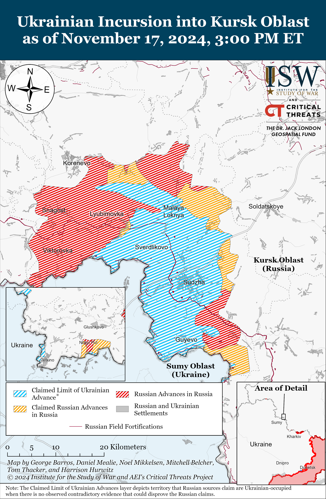
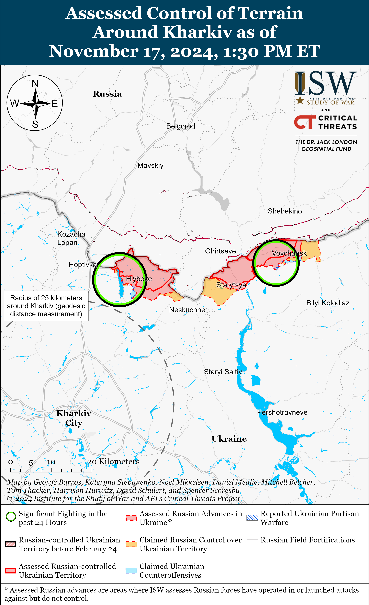
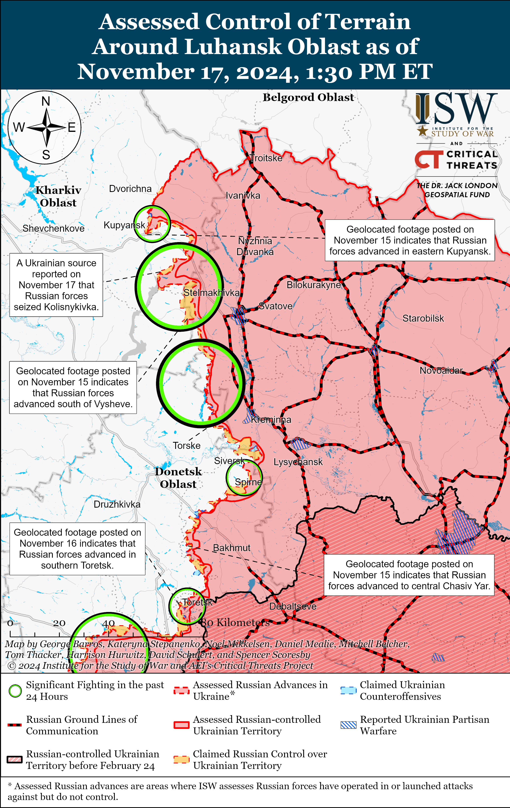
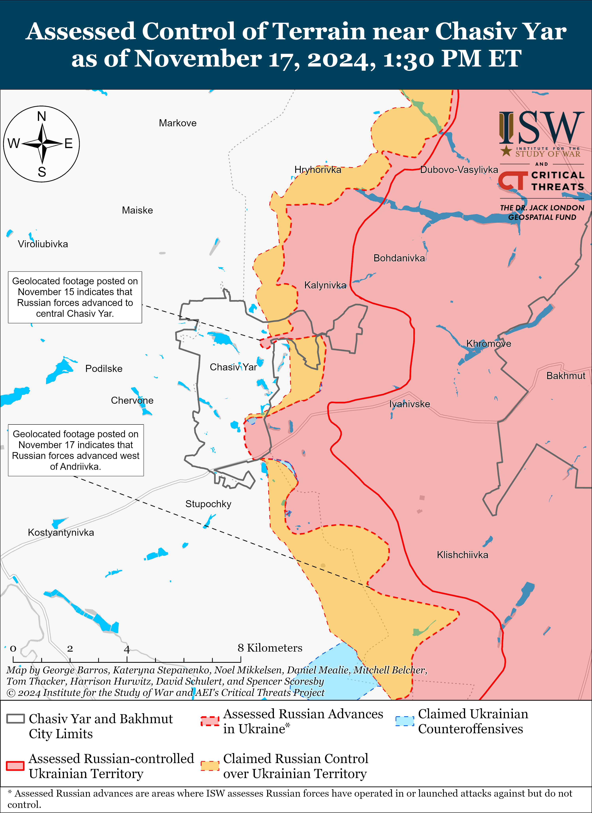
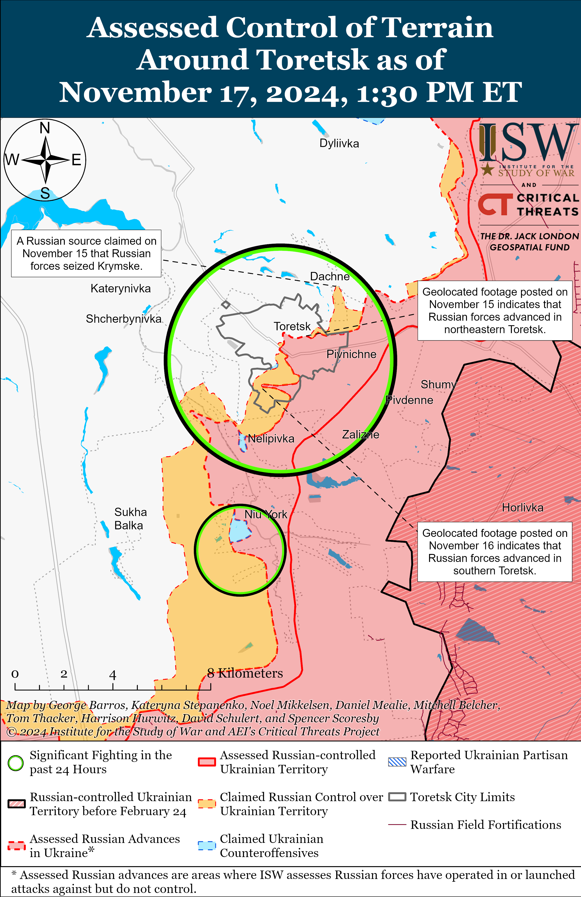
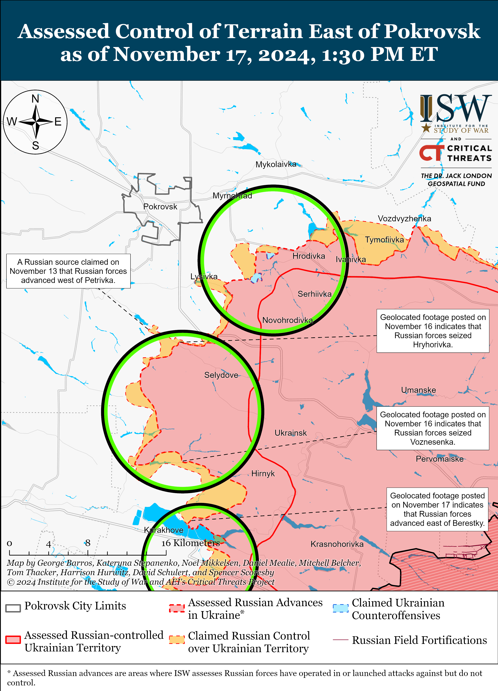
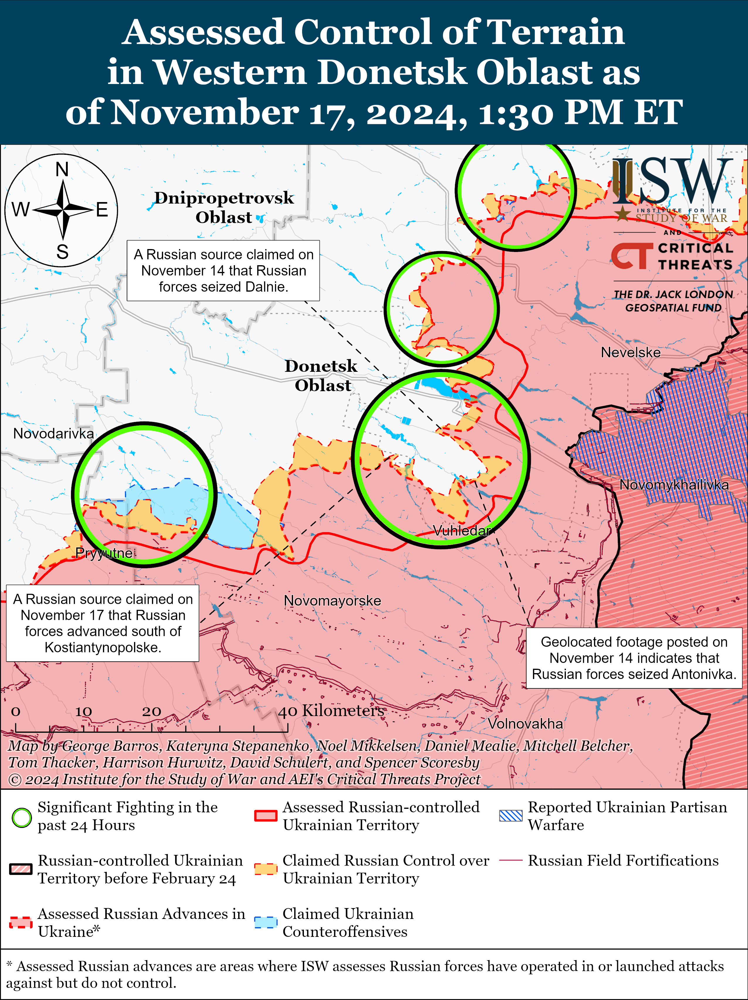
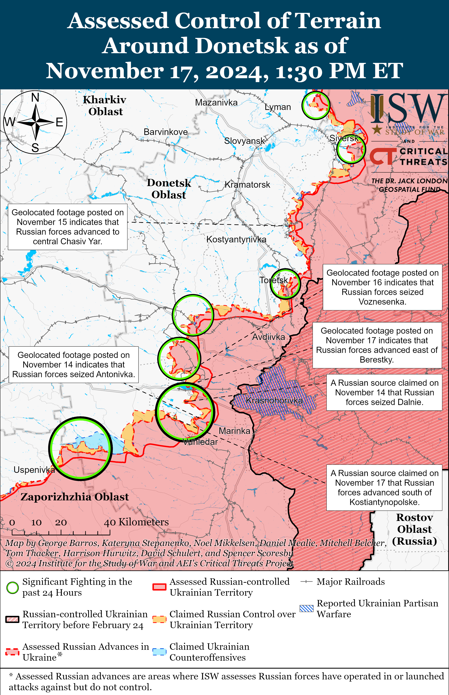
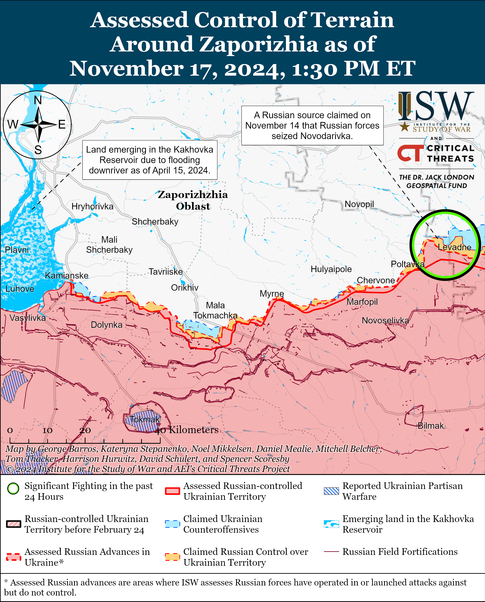
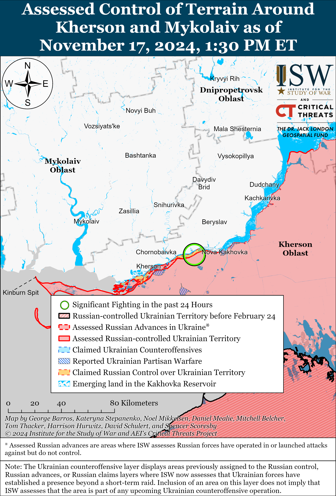

# Russian Offensive Campaign Assessment, November 17, 2024

**Nicole Wolkov, Christina Harward, Angelica Evans, Davit Gasparyan, Grace Mappes, and Frederick W. Kagan**

**November 17, 2024, 4:30pm ET**

**Click** [**here**](https://storymaps.arcgis.com/stories/36a7f6a6f5a9448496de641cf64bd375) **to see ISW’s interactive map of the Russian invasion of Ukraine. This map is updated daily alongside the static maps present in this report.**

**Click** [**here**](https://understandingwar.maps.arcgis.com/apps/instant/3dviewer/index.html?appid=1602762dbcde419bb957dea358449580) **to see ISW’s 3D control of terrain topographic map of Ukraine. Use of a computer (not a mobile device) is strongly recommended for using this data-heavy tool.**

**Click** [**here**](https://storymaps.arcgis.com/stories/733fe90805894bfc8562d90b106aa895) **to access ISW’s archive of interactive time-lapse maps of the Russian invasion of Ukraine. These maps complement the static control-of-terrain map that ISW produces daily by showing a dynamic frontline. ISW will update this time-lapse map archive monthly.**

**Note: The data cut-off for this product was 11:00 am ET on November 17. ISW will cover subsequent reports in the November 18 Russian Offensive Campaign Assessment.**

**The *New York Times* (NYT) and *Washington Post* reported that US President Joe Biden has authorized Ukrainian forces to use US-provided ATACMS in limited strikes against Russian and North Korean military targets within Kursk Oblast.** The NYT and *Washington Post* reported on November 17 that unspecified US officials expect Ukrainian forces to initially conduct strikes against Russian and North Korean forces within Kursk Oblast and that the Biden Administration could expand this authorization to use ATACMS against targets elsewhere in Russia in the future.[1] The US officials stated that the US authorized these limited Ukrainian strikes in response to the deployment of North Korean forces to the battlefield in Kursk Oblast to deter North Korea from deploying more forces to Russia. The US officials stated that the partial lifting of restrictions aims to generate a “specific and limited” battlefield effect and will not change the course of the war. French outlet *Le Figaro* reported on November 17 that France and the United Kingdom (UK) have authorized Ukrainian forces to use French and UK-provided SCALP/Storm Shadow missiles to strike within Russia.[2] *Le Figaro* did not state if France and the UK had authorized Ukraine’s SCALP/Storm Shadow usage only within Kursk Oblast. The partial lifting of restrictions on Ukraine’s use of Western-provided long-range weapons against military objects within Kursk Oblast will not completely deprive Russian forces of their sanctuary in Russian territory, as hundreds of military objects remain within ATACMS range in other Russian border regions.[3] ISW continues to assess that Russian forces will benefit from any partial sanctuary if Western states continue to impose restrictions on Ukraine’s ability to defend itself and that the US should allow Ukraine to strike all legitimate military targets within Russia’s operational and deep-rear within range of US-provided weapons – not just those in Kursk Oblast.[4]

**Russian forces damaged Ukrainian energy infrastructure during the largest missile and drone strike since August 2024 on the night of November 16 to 17.** The Ukrainian Air Force reported that Russian forces launched 90 Shahed and strike drones of an unspecified type (possibly referring to decoy drones) from Primorsko-Akhtarsk, Krasnodar Krai and Kursk and Oryol oblasts.[5] The Ukrainian Air Force reported that Russian forces launched 120 missiles, including one Zirkon 3M22 hypersonic cruise missile, eight Kh-47M2 Kinzhal aeroballistic missiles, 101 Kh-101 and Kalibr cruise missiles, one Iskander-M ballistic missile, four Kh-22/Kh-31P cruise/anti-radiation missiles, and five Kh-59/69 cruise missiles. The Ukrainian Air Force reported that Ukrainian forces shot down 42 drones and one Zirkon, seven Kinzhal, 85 Kalibr and Kh-101, two Kh-22/31P, and five Kh-59/69 missiles. Ukrainian President Volodymyr Zelensky stated that Ukrainian F-16 pilots shot down roughly 10 aerial targets during the strike.[6] The Ukrainian Air Force reported that 41 drones were “lost” in Ukrainian airspace, likely due to Ukrainian electronic warfare (EW) interference, and that two drones flew into Russian and Russian-occupied Ukrainian airspace. The Ukrainian Air Force noted that air defense was active in almost all Ukrainian oblasts. Ukrainian state electricity transmission operator Ukrenergo stated that Russian strikes damaged energy facilities in several oblasts and noted that energy recovery work is ongoing in Odesa, Volyn, and Rivne oblasts.[7] Ukrainian officials reported that a Russian missile strike caused a fire at an infrastructure facility in Ivano-Frankivsk Oblast, damaged critical infrastructure in Rivne Oblast, and targeted energy infrastructure in Odesa Oblast.[8] Private Ukrainian energy enterprise DTEK stated that Russian strikes seriously damaged an unspecified DTEK thermal power plant (TPP) and noted that this was the eighth mass strike on a DTEK energy facility in 2024.[9] Ukrainian Energy Minister Herman Halushchenko stated that the strikes caused power outages in many areas of Ukraine.[10]  International Atomic Energy Agency (IAEA) Director General Rafael Mariano Grossi stated that Russian strikes on Ukrainian energy facilities forced Ukrainian authorities to reduce the energy production levels of several nuclear power plants (NPPs).[11] Grossi reported that Russian strikes damaged several electrical substations that are connected to the Khmelnytskyi, Rivne, and Pivdennoukrainsk NPPs, although the strikes did not damage the NPPs themselves. Grossi stated that six out of the nine reactors at the Khmelnytskyi, Rivne, and Pivdennoukrainsk NPPs are currently operating at reduced capacity. Ukrainian state railway company Ukrzaliznytsia reported that Russian forces struck a railway depot in Dnipropetrovsk Oblast and that Russian strikes de-energized sections of several railway lines in southern, western, and northeastern Ukraine.[12] Ukrainian officials reported that Russian strikes also damaged civilian infrastructure in Kyiv, Mykolaiv, Rivne, and Odesa oblasts.[13]

**Russian forces continue to innovate their long-range strike packages and likely included relatively ineffective sea-launched Kalibr cruise missiles in the November 16 to 17 strike package as decoys to distract and exhaust Ukrainian air defenses.** Russian forces notably included Kalibr cruise missiles in the strike package against Ukraine on the night of November 16 to 17.[14] Ukrainian military officials have repeatedly noted that Ukrainian forces are able to down Kalibr cruise missiles, and Russian forces have rarely included Kalibr missiles in strike packages in recent months.[15] Ukrainian Navy Spokesperson Captain Third Rank Dmytro Pletenchuk stated in August 2024 that Russian forces only launch sea-based Kalibr missiles during combined strikes in order to overwhelm the Ukrainian air defense umbrella.[16] ISW recently observed reports that Russia is increasing its use of decoy drones that resemble Iranian-provided Shahed drones during combined long-range strikes and assesses that Russia will likely continue to use decoy drones and experiment with varying strike packages to increase the effectiveness of long-range strikes against Ukraine ahead of and during the winter.[17] Russian forces likely used decoy drones to additionally overload Ukrainian air defenses in the November 16-17 strike series, which contributed to Ukrainian forces’ below average drone shoot down rate.

**Ukrainian forces struck a defense industrial factory in the Udmurt Republic for the first time on the morning of November 17.** Udmurt Republic Head Alexander Brechalov claimed that a drone crashed on the morning of November 17, causing an explosion at a factory workshop in Izhevsk at the address Lenin 101.[18] Russian opposition outletsnoted that the Kupol Electromechanical Plant is at this address.[19] Ukrainian Center for Countering Disinformation Head Lieutenant Andriy Kovalenko reported that “unknown” drones struck the Kupol Electromechanical Plant that produces Tor air defense systems, radars, and components.[20] Local residents reportedly stated to Russian opposition outlet *Astra* that the Kupol factory also produces drones.[21] The Russian Ministry of Defense (MoD) did not claim that Russian forces shot down any drones in the Udmurt Republic on November 17, and Russian state media noted that this is the first time Russian authorities have reported drone “crashes” in the republic.[22]

**North Korea reportedly continues to provide military support to Russia, including the provision of rocket and artillery systems and potential additional troop deployments, which is likely to impact Russia’s military operations in the short term, but its long-term benefits likely remain limited.** *Financial Times* (FT), citing Ukrainian intelligence sources, reported on November 17 that North Korea has supplied Russia with weapons, including 50 170mm “Koksan” self-propelled howitzers and 20 240mm multiple launch rocket systems (MLRS).[23] FT’s source observed that these systems, which Russian forces reportedly deployed to Kursk Oblast, will offer North Korean forces an opportunity to test their capabilities and weapons systems in real combat scenarios. *Bloomberg* reported on November 17 that North Korea may deploy up to 100,000 North Korean troops to Russia in future waves if bilateral relations between the two countries continue to deepen.[24] Kremlin-awarded founder and director of the prominent *Rybar* Telegram channel and social media project Mikhail Zvinchuk claimed that North Korean forces are less combat experienced than Russian forces but that a North Korean deployment to fighting alongside Russian forces would alleviate pressure on Russian forces and Russian recruitment efforts and delay a potential decision for another partial involuntary reserve callup.[25] Zvinchuk also observed that North Korean forces deployed to fight alongside Russian forces will likely learn to conduct drone warfare, which North Korean forces would use in future operations elsewhere. **The development of North Korea’s ability to use drones, in addition to the already-announced decision to start serial drone production in North Korea, could pose a significant challenge to South Korea and Japan.**[26]

ISW has repeatedly observed efforts by Russian authorities to delay highly unpopular involuntary reserve callups, and the gradual deployment of 100,000 North Korean personnel could help alleviate some of these concerns in the short term while increasing pressure on Ukrainian forces.[27] A gradual deployment of 100,000 North Korean troops, however, will likely not address the eventual need for another Russian involuntary reserve callup as the reported number of North Korean personnel will not be sufficient to offset the current high Russiancasualty rates. The UK Ministry of Defense (MoD) previously reported that Russian forces suffered a record high average daily casualty rate of 1,271 troops per day or about 38,130 casualties total in September 2024, and the US Department of Defense (DoD) assessed that Russian forces have suffered an estimated 80,110 casualties inSeptember and October 2024.[28]  The deployment of roughly 100,000 North Korean personnel would only replace Russian losses for less than three months. Such a limited deployment would also fail to address Russia’s broader shortages ofmillions of workers due to demographic crisesand the war and the resulting mid- to long term shortcomings in Russian defense industrial base (DIB) operations.[29]

**Russian forces will likely focus on seizing frontline Ukrainian towns and cities during Winter 2024-2025 through urban combat amid efforts to offset Ukrainian drone advantages and possible Russian armored vehicle constraints.** Kremlin-awarded founder and director of the prominent *Rybar* Telegram channel and social media project Mikhail Zvinchuk stated during an interview with  Russian-language diaspora-focused channel *RTVI* on November 16 that Russian forces will seek to concentrate fighting in “populated areas and not in open fields” during Winter 2024-25 and offered Toretsk, Pokrovsk, and Kurakhove as examples of towns and cities where Russia will prioritize advances this winter.[30] Zvinchuk claimed that Russian forces are preparing to begin the fight for Pokrovsk and will approach Pokrovsk from the south and southeast now that Russian forces have seized Selydove (southeast of Pokrovsk). Zvinchuk is a prominent voice within the Russian information space with ties to the Kremlin and may be privy to insider information about Russia’s frontline objectives and campaign design. Russian forces have recently made advances into eastern Kupyansk and central Chasiv Yar, and such advances may be part of a concerted effort to advance into frontline cities in preparation for offensive operations in Winter 2024-2025.[31] ISW has previously assessed that the seizure of Kupyansk or Chasiv Yar would have operationally significant impacts on the geometry of the frontline and threaten major Ukrainian defensive positions in their respective directions, and recent Russian advances into the cities would put Ukrainian defenses in both directions at higher but not immediate risk.[32]

Zvinchuk claimed that Russian forces will also look to increase their combat capabilities during Winter 2024-2025, particularly Russian drone capabilities because of the importance of the “drone war” in winter.[33] Zvinchuk noted that Russian forces have an artillery advantage over Ukrainian forces, but that Russian forces currently cannot advance due to Ukrainian drone operations. Zvinchuk suggested that better trained and equipped forces may be able to advance more effectively against Ukrainian drone operators. ISW has previously noted that the Russian Ministry of Defense (MoD) appears to be trying to centralize control over informal Russian drone units, and Zvinchuk’s comments likely refer to this ongoing effort and indicate that the MoD may intend to intensify this effort during Winter 2024-2025.[34] ISW recently assessed that Ukrainian drone operations continue to play a critical role in constraining Russian mechanized maneuver and preventing Russian forces from fully exploiting Ukraine’s ongoing manpower and materiel constraints.[35] The Russian military command may assess that urban combat is preferrable for Russia’s current infantry-led style of fighting as multi-story buildings could provide Russian infantry with better cover from Ukrainian drone operators than trees in open areas. The Russian military command may also prefer to engage in urban combat to avoid prolonging the cost that advancing in rural fields and settlements imposes on Russian armored vehicle usage and reserves.[36] The Russian military command has likely assessed that offsetting Ukraine’s drone advantages and reducing Russian armored vehicle losses through urban combat is worth the large numbers of Russian casualties that will come from grinding, attritional advances in frontline towns and cities.

**Russian President Vladimir Putin’s maximalist objectives demanding full Ukrainian capitulation remain unchanged, but a prominent Kremlin-affiliated milblogger appears to be trying to repackage longstanding Kremlin territorial claims to southern Ukraine as less severe “peace proposals” that would actually militarily threaten Ukraine, Moldova, and NATO.** German Chancellor Olaf Scholz stated on November 17 that his recent phone conversation with Putin showed that “little has changed” in Putin’s views on the war in Ukraine and that this is “not good news.”[37] Mikhail Zvinchuk in his November 16 interview with Russian-language diaspora-focused channel *RTVI* responded to a question about the conditions under which Russia could agree to peace negotiations to end the war in Ukraine.[38] Zvinchuk claimed that first Russia must gain full control of Luhansk, Donetsk, Zaporizhia, and Kherson oblasts that Russia has illegally annexed, including the areas that Russian forces currently do not occupy – a demand that Putin first made explicitly in June 2024.[39] Zvinchuk added that Ukraine must unblock the road through Odesa Oblast to Transnistria, the pro-Russian breakaway republic in eastern Moldova, so that Russia can have “communication with Transnistria and the Russian people there.” Zvinchuk also called for Russia to gain access to the Danube River, the mouth of which lies on the Ukrainian-Romanian border, and for the creation of a “buffer zone” in border areas in which weapons will be prohibited. Zvinchuk notably did not mention what Russia would compromise on during potential peace talks in order to achieve these proposals, but claimed later in the interview that Russia laying claim to only the four illegally annexed oblasts is in and of itself a compromise – further demonstrating how the Russian ultranationalist community, one of Putin’s key constituencies, is not supportive of good faith negotiations with Ukraine. Russian access to Transnistria and the Danube River would essentially allow Russia to operate in and off the coasts of Mykolaiv and Odesa oblasts even if Russian forces did not occupy these territories.[40] Kremlin officials have long called for Russia’s occupation of all of southern Ukraine, including Odesa City, and Zvinchuk appears to be proposing a new framing of this same demand.[41] Russian access to Transnistria, areas near Odesa City, and the northwestern Black Sea would allow Russian forces to conduct a future attack on southern Ukraine and Odesa City after resting and reconstituting during a potential ceasefire.

Russian access to Transnistria and the Danube River would pose military threats to Ukraine and NATO as well. Ukrainian strikes have pushed Russia’s Black Sea Fleet (BSF) out of the northwestern Black Sea, but Russian access to the Danube would allow Russia to again operate in the area.[42] Russian control of Donetsk, Zaporizhia, and Kherson oblasts would deny Ukraine access to the Sea of Azov, and Russian access and possible control of the northwestern Black Sea would essentially landlock Ukraine. Russian access to the Danube River and to the road to Transnistria may also enable Russia to establish lines of communication to Transnistria – and possibly even Gagauzia in southern Moldova as Moldova has a port along the Danube River at its southernmost point at Giurgiulesti – to build up forces and means in Moldova for future military operations against Moldova, southeastern Ukraine, or Romania.[43] NATO is also currently constructing what will be its largest base near Constanta in southeastern Romania less than 100 kilometers from the mouth of the Danube River.[44]

**Abkhazian oppositionists continued protests on November 17 calling for the resignation of the de facto Abkhazian President Aslan Bzhania.** The opposition initially stormed the de facto Abkhazian parliament building on November 15 demanding the dismissal of a proposed investment agreement with Russia that would grant Russian legal entities property ownership rights and privileges in Abkhazia but has ultimately expanded the scope of its demands to call for the resignation of Bzhania.[45] Bzhania stated on November 16 that he would resign and appoint a vice president as interim head of state before snap elections if the opposition left the premises of the parliament, but the protesters refused his demands and called for his unconditional resignation.[46] Bzahnia called the protest an attempted coup, claimed that it is impossible to find compromise with the opposition, and refused to step down, prompting the opposition to continue the protests and propose the formation of an interim government.[47]

**Key Takeaways:**

- **The *New York Times* (NYT) and *Washington Post* reported that US President Joe Biden has authorized Ukrainian forces to use US-provided ATACMS in limited strikes against Russian and North Korean military targets within Kursk Oblast.**
- **Russian forces damaged Ukrainian energy infrastructure during the largest missile and drone strike since August 2024 on the night of November 16 to 17.**
- **Russian forces continue to innovate their long-range strike packages and likely included relatively ineffective sea-launched Kalibr cruise missiles in the November 16 to 17 strike package as decoys to distract and exhaust Ukrainian air defenses.**
- **Ukrainian forces struck a defense industrial factory in the Udmurt Republic for the first time on the morning of November 17.**
- **North Korea reportedly continues to provide military support to Russia, including the provision of rocket and artillery systems and potential additional troop deployments, which is likely to impact Russia’s military operations in the short term, but its long-term benefits likely remain limited.**
- **Russian forces will likely focus on seizing frontline Ukrainian towns and cities during Winter 2024-2025 through urban combat amid efforts to offset Ukrainian drone advantages and possible Russian armored vehicle constraints.**
- **Russian President Vladimir Putin’s maximalist objectives demanding full Ukrainian capitulation remain unchanged, but a prominent Kremlin-affiliated milblogger appears to be trying to repackage longstanding Kremlin territorial claims to southern Ukraine as less severe “peace proposals” that would actually militarily threaten Ukraine, Moldova, and NATO.**
- **Abkhazian oppositionists continued protests on November 17 calling for the resignation of the de facto Abkhazian President Aslan Bzhania.**
- **Russian forces recently advanced near Kupyansk, Chasiv Yar, Kurakhove, and Vuhledar.**
- **Russian milbloggers continued to applaud their reported role in removing frontline 3rd Combined Arms Army (CAA, formerly 2nd Luhansk People’s Republic Army Corps [LNR AC]) commanders after the commanders submitted false reports about Russian advances in the Siversk direction.**

***We do not report in detail on Russian war crimes because these activities are well-covered in Western media and do not directly affect the military operations we are assessing and forecasting. We will continue to evaluate and report on the effects of these criminal activities on the Ukrainian military and the Ukrainian population and specifically on combat in Ukrainian urban areas. We utterly condemn Russian violations of the laws of armed conflict and the Geneva Conventions and crimes against humanity even though we do not describe them in these reports.***

- Ukrainian Operations in the Russian Federation
- Russian Main Effort – Eastern Ukraine (comprised of three subordinate main efforts)
- Russian Subordinate Main Effort #1 – Push Ukrainian forces back from the international border with Belgorod Oblast and approach to within tube artillery range of Kharkiv City
- Russian Subordinate Main Effort #2 – Capture the remainder of Luhansk Oblast and push westward into eastern Kharkiv Oblast and encircle northern Donetsk Oblast
- Russian Subordinate Main Effort #3 – Capture the entirety of Donetsk Oblast
- Russian Supporting Effort – Southern Axis
- Russian Air, Missile, and Drone Campaign
- Russian Mobilization and Force Generation Efforts
- Russian Technological Adaptations
- Activities in Russian-occupied areas
- Significant Activity in Belarus|

**Ukrainian Operations in the Russian Federation**

Russian forces continued offensive operations in the main Ukrainian salient in Kursk Oblast on November 16 and 17 but did not advance.[48] The Russian Ministry of Defense (MoD) claimed on November 17 that Russian forces successfully encircled Ukrainian forces near the Olgovka forest (east of Korenevo) and struck Ukrainian forces attempting to break out of the encirclement.[49] A Russian milblogger claimed on November 16 that Russian forces recently advanced east of Korenevo near Kremyanoye; southeast of Korenevo near Darino and Novoivanovka; and south of Sudzha near Kurilovka and Plekhovo.[50] ISW has not observed confirmation of these claims. Elements of the Russian 1434th “Akhmat-Chechnya” Regiment (likely a mobilized regiment) are reportedly operating in the Kursk direction; elements of the Russian 83rd Airborne (VDV) Brigade are reportedly operating near the Snagost river dam (south of Korenevo); and elements of the Russian 106th VDV Division are reportedly operating near Darino (southeast of Korenevo).[51] Ukrainian military observer Kostyantyn Mashovets stated on November 17 that the Russian military redeployed elements of the 69th Separate Covering Brigade (35th Combined Arms Army [CAA], Eastern Military District [EMD]) from the Hulyaipole direction to Kursk Oblast at the end of September to beginning of October.[52] ISW observed reports on November 16 that elements of the 69th Covering Brigade were operating in the south Donetsk (Kurakhove-Vuhledar) direction, and the brigade may be split between various sectors of the front.[53]

**Russian Main Effort – Eastern Ukraine**

**Russian Subordinate Main Effort #1 – Kharkiv Oblast** **(Russian objective: Push Ukrainian forces back from the international border with Belgorod Oblast and approach to within tube artillery range of Kharkiv City)**

Russian forces continued ground attacks north of Kharkiv City near Strilecha and northeast of Kharkiv City near Vovchansk and Starytsya on November 16 and 17 but did not make any confirmed advances.[54] Elements of Rosgvardia’s 116th Spetsnaz Brigade reportedly continue to operate near Vovchansk.[55]

**Russian Subordinate Main Effort #2 – Luhansk Oblast** **(Russian objective: Capture the remainder of Luhansk Oblast and push westward into eastern Kharkiv Oblast and northern Donetsk Oblast)**

Russian forces recently advanced south of Kupyansk amid continued offensive operations along the Kupyansk-Svatove-Kreminna line on November 17. Ukrainian military observer Kostyantyn Mashovets stated that elements of the Russian 2nd Motorized Rifle Division (1st Guards Tank Army, Moscow Military District [MMD]) seized Kolisnykivka (south of Kupyansk) and occupy a roughly 3-3.5 kilometer area along the east bank of the Oskil River.[56] Russian forces continued assaults east of Kupyansk near Pishchane; southeast of Kupyansk near Kolisnykivka, Kruhlyakivka, and Zahryzove; west of Svatove near Kopanky and Nadiya; southwest of Svatove near Tverdokhlibove, Hrekivka, Cherneshchyna, and Makiivka; and west of Kreminna near Terny on November 16 and 17.[57] Mashovets stated that elements of the Russian 3rd Motorized Rifle Division (20th CAA, MMD) are operating in the Kopanky (west of Svatove) area and that elements of the 254th and 283rd motorized rifle regiments (both 144th Motorized Rifle Division, 20th Combined Arms Army [CAA], MMD) are operating near Nevske (northwest of Kreminna) and Terny (west of Kreminna).[58]

**Russian Subordinate Main Effort #3 – Donetsk Oblast** **(Russian objective: Capture the entirety of Donetsk Oblast, the claimed territory of Russia’s proxies in Donbas)**

Russian forces continued limited ground attacks in the Siversk direction near Verkhnokamyanske (east of Siversk) and Ivano-Darivka (southeast of Siversk) on November 16 and 17 but did not advance.[59] Ukrainian military observer Kostyantyn Mashovets reported that elements of the Russian 3rd Combined Arms Army (CAA) (formerly 2nd Luhansk People’s Republic Army Corps [LNR AC]) operating in the Siversk direction have roughly 110-112 combat-ready tanks and 315-318 serviceable armored fighting vehicles for combat operations.[60]

Russian forces recently partially closed a pocket southeast of Chasiv Yar amid continued offensive operations in the area on November 17. Geolocated footage published on November 17 shows that Russian forces recently advanced into the pocket and levelled part of the frontline southwest of Andriivka (southeast of Chasiv Yar).[61] A Russian milblogger claimed that Russian forces in the pocket also advanced 2.5 kilometers along the railway between Andriivka and Zelenopillya (south of Andriivka) and 1.5 kilometers in depth near Klishchiivka (southeast of Chasiv Yar and north of Andriivka).[62] Russian milbloggers claimed that Russian forces also advanced south of Orikhovo-Vasylivka (northeast of Chasiv Yar), cleared an area south of the refractory plant within central Chasiv Yar, seized part of the Stupky-Holubivske 2 nature reserve (southeast of Chasiv Yar), reached the Druzbha forest south of Kalynivka (north of Chasiv Yar), and advanced in forests south of Chasiv Yar, but ISW has not observed visual confirmation of these claims.[63] Elements of the Russian “Sever-V” Brigade (Russian Volunteer Corps), 78th “Sever-Akhmat” Motorized Rifle Regiment (42nd Motorized Rifle Division, 58th CAA, Southern Military District [SMD]), and the “Okhotnik” (Hunter) Spetsnaz Detachment (51st CAA, formerly 1st Donetsk People’s Republic [DNR] AC) reportedly continue to operate in the Chasiv Yar direction.[64]

Russian forces continued ground attacks near Toretsk and west of Toretsk near Shcherbynivka on November 16 and 17 but did not make confirmed advances.[65] A Russian milblogger claimed that Russian forces marginally advanced within central and southern Toretsk.[66]

Russian forces reportedly advanced south of Pokrovsk amid continued offensive operations in the Pokrovsk direction on November 17. Russian milbloggers claimed on November 17 that Russian forces advanced within and later seized Yurivka (south of Pokrovsk), advanced towards Zorya (south of Yurivka), and advanced in a forested area two kilometers wide and one kilometer in depth west and south of Novooleksiivka (southeast of Yurivka), but ISW has not observed visual confirmation of these claims.[67] Russian forces also continued ground attacks east of Pokrovsk near Myrolyubivka and Promin; southeast of Pokrovsk near Lysivka and Krutyi Yar; and south of Pokrovsk near Yurivka, Petrivka, Pustynka, and Novooleksiivka on November 16 and 17.[68] Russian milbloggers claimed that Russian forces repelled a Ukrainian counterattack near Hrodivka (east of Pokrovsk).[69] Elements of the Russian 30th Motorized Rifle Brigade (2nd CAA, Central Military District [CMD]) and 35th Motorized Rifle Brigade 41st (CAA, CMD) are reportedly operating near Novohrodivka.[70]

Geolocated footage published on November 16 shows Ukrainian drone strikes destroying a Russian Borisoglebsk-2 electronic warfare (EW) station in Serhiivka (southeast of Pokrovsk) on November 15 or 16.[71]

Russian forces recently advanced on the northern bank of the Kurakhivske Reservoir (north of Kurakhove) amid continued offensive operations in the Kurakhove direction on November 17. Geolocated footage published on November 15 and 17 indicates that Russian forces recently advanced into the northern outskirts of Kurakhove on the northern bank of the Kurakhivske Reservoir and likely seized Nova Illinka (north of Kurakhove).[72] Russian milbloggers claimed that Russian forces seized Nova Illinka and advanced in northern Berestky (north of Kurakhove, on the northern bank of the Kurakhivske Reservoir) and eastern Kurakhove.[73] A Russian milblogger claimed that Russian forces also advanced in an area up to 3.3 kilometers wide and 1.5 kilometers in depth south of Novoselydivka (north of Kurakhove).[74] Mashovets stated that Ukrainian forces are gradually withdrawing from the northern bank of the Kurakhivske Reservoir and noted that Russian forces’ pace of advance appears to have slowed south of Kurakhove.[75] Mashovets stated that elements of the 90th Tank Division (41st CAA, CMD) are attacking the Ukrainian pocket north of the reservoir from the north and that elements of the 51st CAA are attacking the Ukrainian pocket from the east. Russian forces continued assaults northeast of Kurakhove near Novodmytrivka, Voznesenka, Sontsivka, and Zorya; north of Kurakhove near Novoselydivka, Nova Illinka, Illinka, and Berestky; near Kurakhove itself; east of Kurakhove near Maksymilyanivka; and south of Kurakhove near Dalne on November 16 and 17.[76] Elements of the Russian 33rd Motorized Rifle Regiment (20th Motorized Rifle Division, 8th CAA, SMD) are reportedly operating in the Kurakhove direction.[77]

Russian forces recently advanced northwest of Vuhledar amid continued offensive operations in the Vuhledar direction on November 17. Geolocated footage published on November 17 indicates that Russian forces recently advanced south of Kostyantynopolske (northwest of Vuhledar) along the O-0510 highway.[78] Russian milbloggers claimed that Russian forces advanced west of Antonivka (northeast of Vuhledar), one kilometer in a forest area east of Bohoyavlenka (north of Vuhledar), and 2.7 kilometers west of Maksymivka (northwest of Vuhledar).[79] ISW has not observed confirmation of these claims, however. A Russian milblogger claimed that Russian forces are attacking Uspenivka (north of Vuhledar) from the north near Dalne and the south near Bohoyavlenka.[80] Mashovets stated that elements of the Russian 37th Motorized Rifle Brigade (36th CAA, Eastern Military District [EMD]) are unsuccessfully attacking near Sukhyi Yaly and that elements of the Russian 39th Motorized Rifle Brigade (68th AC, EMD) are reportedly attacking near Yelizavetivka (northeast of Vuhledar).[81] Russian forces continued offensive operations northeast of Vuhledar near Katerynivka, Antonivka, and in the direction of Romanivka; north of Vuhledar near Trudove and in the direction of Yantarne; and northwest of Vuhledar near Sukhyi Yar on November 16 and 17.[82] Elements of the Russian 14th Spetsnaz Brigade (Russian General Staff’s Main Military Intelligence Directorate [GRU]) are reportedly operating near Trudove, and elements of the 40th Naval Infantry Brigade (Pacific Fleet, EMD) are reportedly operating near Shakhtarske (northwest of Vuhledar).[83]

Russian forces continued assaults in the Donetsk-Zaporizhia Oblast border area near Novodarivka and Rivnopil (both southwest of Velyka Novosilka) on November 16 and 17 but did not make confirmed advances.[84] A Russian milblogger claimed that Russian forces advanced one kilometer in depth north of Rivnopil and continue to advance in the direction of Novodarivka, but ISW has not observed confirmation of these claims.[85]

**Russian Supporting Effort – Southern Axis** **(Russian objective: Maintain frontline positions and secure rear areas against Ukrainian strikes)**

Neither Russian nor Ukrainian sources reported fighting in eastern Zaporizhia Oblast on November 17. Elements of the Russian 35th Combined Arms Army (CAA) (Eastern Military District [EMD]) reportedly continue operating in the Polohy (south of Hulyaipole) direction.[86]

Limited fighting continued in western Zaporizhia Oblast on November 17, but there were no confirmed changes to the frontline. A Russian milblogger claimed that Russian forces marginally advanced in the fields north and west of Novopokrovka (northeast of Robotyne), but ISW has not observed confirmation of this claim.[87] Ukrainian sources posted footage of a Ukrainian HIMARS strike against a Russian personnel and equipment concentration near occupied Tavria, Zaporizhia Oblast (southwest of Robotyne).[88]

Russian forces continued limited attacks in the Dnipro direction in east (left) bank Kherson Oblast on November 17 but did not advance.[89] Elements of the Russian “Khabr” Group (18th CAA, Southern Military District [SMD]) reportedly operate in the Kherson direction.[90]

A Russian milblogger claimed that Ukrainian forces conducted a naval drone raid near gas fields in the Black Sea west of occupied Crimea on the morning of November 17.[91] The milblogger claimed that this is the first such Ukrainian naval drone raid against these fields since September 2024. The Russian Ministry of Defense (MoD) claimed that Russian forces destroyed four Ukrainian naval drones in the Black Sea, and the milblogger claimed that a fifth drone withdrew from the gas fields.[92]

**Russian Air, Missile, and Drone Campaign** **(Russian Objective: Target Ukrainian military and civilian infrastructure in the rear and on the frontline)**

*See topline text for Russian air, missile, and drone strikes against Ukraine.*

**Russian Mobilization and Force Generation Efforts** **(Russian objective: Expand combat power without conducting general mobilization)**

Russian milbloggers continued to applaud their reported role in removing frontline 3rd Combined Arms Army (CAA, formerly 2nd Luhansk People’s Republic Army Corps [LNR AC]) commanders after the commanders submitted false reports about Russian advances in the Siversk direction.[93] One milblogger praised Russian Defense Minister Andrei Belousov’s team for “repeatedly demonstrating its readiness for feedback” and claimed that former Russian Defense Minister and current Security Council Secretary Sergei Shoigu would have “hushed up” the situation despite public outcries on the internet.[94] Another milblogger highlighted the milblogger community’s alleged role in resolving the situation in the Siversk direction and claimed that milbloggers have brought other problems in the Russian military to light in the past.[95]

**Russian Technological Adaptations** **(Russian objective: Introduce technological innovations to optimize systems for use in Ukraine)**

Nothing significant to report.

**Activities in Russian-occupied areas** **(Russian objective: Consolidate administrative control of annexed areas; forcibly integrate Ukrainian citizens into Russian sociocultural, economic, military, and governance systems)**

*ISW is not publishing coverage of activities in Russian-occupied areas today.*

**Significant activity in Belarus** **(Russian efforts to increase its military presence in Belarus and further integrate Belarus into Russian-favorable frameworks and Wagner Group activity in Belarus)**

Nothing significant to report.

[1] https://www.nytimes.com/2024/11/17/us/politics/biden-ukraine-russia-atacms-missiles.html; https://www.washingtonpost.com/national-security/2024/11/17/ukraine-russia-north-korea-atacms/

[2] https://www.lefigaro dot fr/international/joe-biden-aurait-donne-son-accord-a-l-ukraine-pour-frapper-la-russie-en-profondeur-avec-des-armes-americaines-20241117 ; https://www.pravda.com dot ua/eng/news/2024/11/17/7484978/

[3] https://storymaps.arcgis.com/stories/8b060c46ee6f49908f9fb415ad23051c; https://x.com/TheStudyofWar/status/1828580873375023299: https://understandingwar.org/backgrounder/putins-safe-space-defeating-russias-kharkiv-operation-requires-eliminating-russias

[4] https://storymaps.arcgis.com/stories/8b060c46ee6f49908f9fb415ad23051c; https://x.com/TheStudyofWar/status/1828580873375023299: https://understandingwar.org/backgrounder/putins-safe-space-defeating-russias-kharkiv-operation-requires-eliminating-russias

[5] https://t.me/kpszsu/23111

[6] https://t.me/V\_Zelenskiy\_official/12432

[7] https://t.me/Ukrenergo/3449

[8] https://suspilne dot media/881667-kndr-peredala-rosii-artileriu-ilon-mask-vismiav-slova-zelenskogo-pro-nezaleznist-ukraini-998-den-vijni-onlajn/?anchor=live\_1731840344&utm\_source=copylink&utm\_medium=ps ; https://t.me/oleksandrkoval\_rv/3731; https://suspilne dot media/rivne/881969-uskodzeno-ponad-147-kvartir-so-vidomo-pro-raketnij-udar-po-rivnensini/ ; https://t.me/odesa\_prokuratura/746

[9] https://t.me/dtek\_ua/1934

[10] https://t.me/severrealii/28348

[11] https://www.iaea.org/newscenter/pressreleases/update-260-iaea-director-general-statement-on-situation-in-ukraine

[12] https://t.me/UkrzalInfo/6256 ; https://t.me/UkrzalInfo/6255

[13] https://t.me/VA\_Kyiv/9458; https://armyinform dot com.ua/2024/11/17/raketnyj-udar-po-kyyevu-v-pecherskomu-rajoni-goryt-pyatypoverhivka/ ; https://suspilne dot media/881695-masovanij-obstril-ukraini-vlucanna-po-zitlovomu-sektoru-u-mikolaevi-golovni-novini-ranku-17-listopada/ ; https://t.me/oleksandrkoval\_rv/3731; https://suspilne dot media/rivne/881969-uskodzeno-ponad-147-kvartir-so-vidomo-pro-raketnij-udar-po-rivnensini/ ; https://t.me/odesa\_prokuratura/746

[14] https://t.me/kpszsu/23111

[15] https://understandingwar.org/backgrounder/russian-offensive-campaign-assessment-august-27-2024  ; https://isw.pub/UkrWar042724

[16] https://understandingwar.org/backgrounder/russian-offensive-campaign-assessment-august-27-2024

[17] https://understandingwar.org/backgrounder/russian-offensive-campaign-assessment-november-16-2024

[18] https://t.me/brechalov/5609; https://t.me/brechalov/5611

[19] https://meduza dot io/news/2024/11/17/dron-atakoval-oboronnoe-predpriyatie-v-izhevske-eto-pervaya-ofitsialno-podtverzhdennaya-ataka-bespilotnikov-na-udmurtiyu; https://t.me/idelrealii/38534

[20] https://t.me/akovalenko1989/8295;

[21] https://t.me/astrapress/68629

[22] https://www.rbc dot ru/politics/17/11/2024/67396f7c9a79477cc189baca

[23] https://archive.is/dwTkc; https://www.ft.com/content/83ad844b-8ebd-45a9-9c12-9c4c8506e25b; https://www.ukrinform dot ua/rubric-world/3927948-pivnicna-korea-peredala-rosii-blizko-50-samohidnih-artsistem-i-20-rszv-ft.html

[24] https://archive.ph/jlAmK ; https://www.bloomberg.com/news/articles/2024-11-17/north-korea-may-end-up-sending-putin-100-000-troops-for-his-war

[25] https://www.youtube.com/watch?v=uN99eOO1074

[26] https://isw.pub/UkrWar111624

[27] https://understandingwar.org/backgrounder/russian-offensive-campaign-assessment-november-14-2024; https://understandingwar.org/backgrounder/russian-offensive-campaign-assessment-november-1-2024; https://understandingwar.org/backgrounder/russian-offensive-campaign-assessment-october-5-2024

[28] https://x.com/DefenceHQ/status/1843198787097124968/photo/1 ; https://lordslibrary.parliament dot uk/war-in-ukraine-update-october-2024/; https://www.defense.gov/casualty.pdf

[29] https://understandingwar.org/backgrounder/russian-offensive-campaign-assessment-november-14-2024

[30] https://t.me/rybar/65439 ; https://t.me/rtvimain/104838 ; https://www.youtube.com/watch?v=uN99eOO1074

[31] https://isw.pub/UkrWar111624 ; https://isw.pub/UkrWar111524 ; https://isw.pub/UkrWar111424

[32] https://understandingwar.org/backgrounder/russian-winter-spring-2024-offensive-operation-kharkiv-luhansk-axis ; https://understandingwar.org/backgrounder/russian-offensive-campaign-assessment-april-13-2024 ; https://understandingwar.org/backgrounder/russian-offensive-campaign-assessment-april-25-2024

[33] https://t.me/rybar/65439 ; https://t.me/rtvimain/104838 ; https://www.youtube.com/watch?v=uN99eOO1074

[34] https://isw.pub/UkrWar110324

[35] https://understandingwar.org/backgrounder/russian-offensive-campaign-assessment-november-16-2024

[36] https://isw.pub/UkrWar100624 ; https://isw.pub/UkrWar110924

[37] https://suspilne dot media/881965-vin-ne-zminiv-svoei-dumki-pro-vijnu-v-ukraini-i-ce-pogana-novina-solc-pro-dzvinok-putinu/; https://news.sky.com/story/ukraine-war-latest-putin-trump-moscow-zelenskyy-kyiv-live-sky-news-12541713

[38] https://www.youtube.com/watch?v=uN99eOO1074

[39] https://understandingwar.org/backgrounder/russian-offensive-campaign-assessment-june-14-2024

[40] https://understandingwar.org/backgrounder/russia-poses-long-term-threats-moldova%E2%80%99s-european-integration-beyond-october-elections

[41] https://isw.pub/UkrWar121423; https://isw.pub/UkrWar121323; https://isw.pub/UkrWar030424

[42] https://understandingwar.org/backgrounder/russia-poses-long-term-threats-moldova%E2%80%99s-european-integration-beyond-october-elections; https://understandingwar.org/backgrounder/ukrainian-strikes-have-changed-russian-naval-operations-black-sea

[43] https://understandingwar.org/backgrounder/russia-poses-long-term-threats-moldova%E2%80%99s-european-integration-beyond-october-elections

[44] https://understandingwar.org/backgrounder/russia-poses-long-term-threats-moldova%E2%80%99s-european-integration-beyond-october-elections

[45] https://civil dot ge/archives/635655; https://oc-media dot org/protesters-storm-abkhazias-parliament-as-anger-over-controversial-investment-law-boils-over/; https://www.rferl.org/a/abkhazia-protesters-storm-parliament-russia-deal/33203385.html; https://apnews.com/article/georgia-russia-abkhazia-protest-parliament-ae03ce7d8335e6a20316a95d0f7acc84; https://www.reuters.com/world/europe/protests-erupt-outside-parliament-breakaway-georgian-region-tass-says-2024-11-15/; https://t.me/tass\_agency/285383; https://t.me/tass\_agency/285411 ; https://t.me/istories\_media/8177; https://thehill.com/homenews/ap/ap-international/ap-protesters-in-separatist-georgian-region-occupy-government-buildings-calling-for-leaders-ouster/

[46] https://www.dw.com/en/abkhazia-leader-ready-to-quit-if-protesters-exit-parliament/a-70802086

[47] https://t.me/tass\_agency/285767  ; https://t.me/tass\_agency/285760 ; https://meduza dot io/news/2024/11/17/prezident-abhazii-zayavil-chto-ostaetsya-na-svoem-postu-ranee-aslan-bzhaniya-govoril-chto-gotov-uyti-v-otstavku-na-fone-protestov; https://t.me/tass\_agency/285759; https://t.me/tass\_agency/285747; https://t.me/tass\_agency/285748; https://t.me/tass\_agency/285745; https://t.me/tass\_agency/285739

[48] https://www.facebook.com/GeneralStaff.ua/posts/pfbid0EvR4TDfM7G3ABHsiyK1Qx9QG2m25YfGkJrxW2rFBmq5txarY79BkpNWCAnp4J1zql

[49] https://t.me/mod\_russia/45817; https://t.me/tass\_agency/285768 ; https://t.me/tass\_agency/285769

[50] https://t.me/z\_arhiv/29575; https://t.me/z\_arhiv/29578

[51] https://t.me/boris\_rozhin/144574; https://t.me/RKadyrov\_95/5233

[52]

[53] https://understandingwar.org/backgrounder/russian-offensive-campaign-assessment-november-16-2024

[54] https://www.facebook.com/GeneralStaff.ua/posts/pfbid0kPzQsnHMoqUmEufA6BAeuhSdUxrBqPtLyUY9uMCAeMnh3RyYS1vrjnyVPHp4E8THl; https://www.facebook.com/GeneralStaff.ua/posts/pfbid02wB7EadVAN4htr5KmQtrdBzfBrXP6Z98oPYkGEuAQcaEndSQSukAsnnj74sf4n7SBl; https://www.facebook.com/GeneralStaff.ua/posts/pfbid0EvR4TDfM7G3ABHsiyK1Qx9QG2m25YfGkJrxW2rFBmq5txarY79BkpNWCAnp4J1zql

[55] https://t.me/motopatriot/29520

[56] https://t.me/zvizdecmanhustu/2350

[57] https://www.facebook.com/GeneralStaff.ua/posts/pfbid0kPzQsnHMoqUmEufA6BAeuhSdUxrBqPtLyUY9uMCAeMnh3RyYS1vrjnyVPHp4E8THl ; https://www.facebook.com/GeneralStaff.ua/posts/pfbid02wB7EadVAN4htr5KmQtrdBzfBrXP6Z98oPYkGEuAQcaEndSQSukAsnnj74sf4n7SBl ; https://www.facebook.com/GeneralStaff.ua/posts/pfbid0EvR4TDfM7G3ABHsiyK1Qx9QG2m25YfGkJrxW2rFBmq5txarY79BkpNWCAnp4J1zql ; https://t.me/dva\_majors/57904 ; https://t.me/NgP\_raZVedka/19503 ; https://t.me/boris\_rozhin/144596

[58] https://t.me/zvizdecmanhustu/2350

[59] https://www.facebook.com/GeneralStaff.ua/posts/pfbid0kPzQsnHMoqUmEufA6BAeuhSdUxrBqPtLyUY9uMCAeMnh3RyYS1vrjnyVPHp4E8THl; https://t.me/z\_arhiv/29585

[60] https://t.me/zvizdecmanhustu/2352

[61] https://t.me/WarArchive\_ua/22359; https://t.me/WarArchive\_ua/22360

[62] https://t.me/RVvoenkor/80769

[63] https://t.me/boris\_rozhin/144633; https://t.me/z\_arhiv/29588; https://t.me/DnevnikDesantnika/19344

[64] https://t.me/RKadyrov\_95/5235; https://t.me/boris\_rozhin/144606 ; https://t.me/boris\_rozhin/144607;

[65] https://www.facebook.com/GeneralStaff.ua/posts/pfbid02wB7EadVAN4htr5KmQtrdBzfBrXP6Z98oPYkGEuAQcaEndSQSukAsnnj74sf4n7SBl; https://www.facebook.com/GeneralStaff.ua/posts/pfbid0kPzQsnHMoqUmEufA6BAeuhSdUxrBqPtLyUY9uMCAeMnh3RyYS1vrjnyVPHp4E8THl; https://www.facebook.com/GeneralStaff.ua/posts/pfbid0EvR4TDfM7G3ABHsiyK1Qx9QG2m25YfGkJrxW2rFBmq5txarY79BkpNWCAnp4J1zql

[66] https://t.me/z\_arhiv/29572

[67] https://t.me/RVvoenkor/80773; https://t.me/boris\_rozhin/144554; https://t.me/boris\_rozhin/144626; https://t.me/boris\_rozhin/144657

[68] https://www.facebook.com/GeneralStaff.ua/posts/pfbid0kPzQsnHMoqUmEufA6BAeuhSdUxrBqPtLyUY9uMCAeMnh3RyYS1vrjnyVPHp4E8THl; https://www.facebook.com/GeneralStaff.ua/posts/pfbid02wB7EadVAN4htr5KmQtrdBzfBrXP6Z98oPYkGEuAQcaEndSQSukAsnnj74sf4n7SBl; https://www.facebook.com/GeneralStaff.ua/posts/pfbid0EvR4TDfM7G3ABHsiyK1Qx9QG2m25YfGkJrxW2rFBmq5txarY79BkpNWCAnp4J1zql; https://t.me/RVvoenkor/80773; https://t.me/RVvoenkor/80801

[69] https://t.me/btr80/22268 ; https://t.me/RVvoenkor/80804

[70] https://t.me/skalabatalion/440; https://armyinform dot com.ua/2024/11/17/novogrobivka-dlya-ro; https://t.me/ButusovPlus/15088

[71] https://x.com/GirkinGirkin/status/1857818090853249045; https://x.com/666\_mancer/status/1857894070582128687; https://x.com/99Dominik\_/status/1857832394734162160; https://x.com/99Dominik\_/status/1857832394734162160

[72] https://t.me/creamy\_caprice/7538; https://t.me/DeepStateUA/20728 ; https://x.com/strategicbakery/status/1858120060558057645; https://t.co/LdT3AjCeaK

[73] https://t.me/boris\_rozhin/144626 ; https://t.me/boris\_rozhin/144554 ; https://t.me/DnevnikDesantnika/19333 ; https://t.me/NgP\_raZVedka/19505

[74] https://t.me/RVvoenkor/80773

[75] https://t.me/zvizdecmanhustu/2351

[76] https://www.facebook.com/GeneralStaff.ua/posts/pfbid0kPzQsnHMoqUmEufA6BAeuhSdUxrBqPtLyUY9uMCAeMnh3RyYS1vrjnyVPHp4E8THl ; https://www.facebook.com/GeneralStaff.ua/posts/pfbid02wB7EadVAN4htr5KmQtrdBzfBrXP6Z98oPYkGEuAQcaEndSQSukAsnnj74sf4n7SBl ; https://www.facebook.com/GeneralStaff.ua/posts/pfbid0EvR4TDfM7G3ABHsiyK1Qx9QG2m25YfGkJrxW2rFBmq5txarY79BkpNWCAnp4J1zql

[77] https://t.me/dva\_majors/57964

[78] https://t.me/creamy\_caprice/7537; https://www.facebook.com/watch/?v=540527615523311

[79] https://t.me/RVvoenkor/80807 ; https://t.me/boris\_rozhin/144626

[80] https://t.me/DnevnikDesantnika/19346

[81] https://t.me/zvizdecmanhustu/2351

[82] https://www.facebook.com/GeneralStaff.ua/posts/pfbid0kPzQsnHMoqUmEufA6BAeuhSdUxrBqPtLyUY9uMCAeMnh3RyYS1vrjnyVPHp4E8THl ; https://www.facebook.com/GeneralStaff.ua/posts/pfbid02wB7EadVAN4htr5KmQtrdBzfBrXP6Z98oPYkGEuAQcaEndSQSukAsnnj74sf4n7SBl ; https://www.facebook.com/GeneralStaff.ua/posts/pfbid0EvR4TDfM7G3ABHsiyK1Qx9QG2m25YfGkJrxW2rFBmq5txarY79BkpNWCAnp4J1zql

[83] https://t.me/voin\_dv/11868 (Trudove) ; https://t.me/boris\_rozhin/144593 (Shakhtarske)

[84] https://www.facebook.com/GeneralStaff.ua/posts/pfbid02wB7EadVAN4htr5KmQtrdBzfBrXP6Z98oPYkGEuAQcaEndSQSukAsnnj74sf4n7SBl ; https://www.facebook.com/GeneralStaff.ua/posts/pfbid0EvR4TDfM7G3ABHsiyK1Qx9QG2m25YfGkJrxW2rFBmq5txarY79BkpNWCAnp4J1zql

[85] https://t.me/RVvoenkor/80807

[86] https://t.me/voin\_dv/11864

[87] https://t.me/z\_arhiv/29597

[88] https://t.me/gnilayachereha/20702 ; https://x.com/666\_mancer/status/1858037648901759200; https://t.me/gnilayachereha/20702 ; https://x.com/666\_mancer/status/1858037648901759200

[89] https://www.facebook.com/GeneralStaff.ua/posts/pfbid0kPzQsnHMoqUmEufA6BAeuhSdUxrBqPtLyUY9uMCAeMnh3RyYS1vrjnyVPHp4E8THl; https://www.facebook.com/GeneralStaff.ua/posts/pfbid0kPzQsnHMoqUmEufA6BAeuhSdUxrBqPtLyUY9uMCAeMnh3RyYS1vrjnyVPHp4E8THl; https://www.facebook.com/GeneralStaff.ua/posts/pfbid0EvR4TDfM7G3ABHsiyK1Qx9QG2m25YfGkJrxW2rFBmq5txarY79BkpNWCAnp4J1zql

[90] https://t.me/Sladkov\_plus/11816

[91] https://t.me/rybar/65453

[92] https://t.me/rybar/65453; https://t.me/mod\_russia/45807; https://t.me/mod\_russia/45803

[93] https://t.me/boris\_rozhin/144573 ; https://t.me/rybar/65435; https://t.me/belarusian\_silovik/44562 ; https://t.me/rybar/65436 ; https://t.me/dva\_majors/57905 ; https://t.me/belarusian\_silovik/44563; https://t.me/dva\_majors/57908 ;https://t.me/Pragmatic\_Sol/3345 ; https://t.me/rybar/65437; https://t.me/Pragmatic\_Sol/3345; https://t.me/dva\_majors/57907; https://t.me/dva\_majors/57906 ; https://t.me/rybar/65440

[94] https://t.me/belarusian\_silovik/44563

[95] https://t.me/dva\_majors/57906
