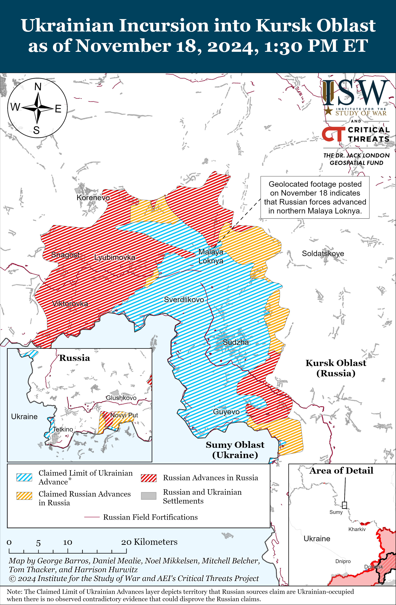
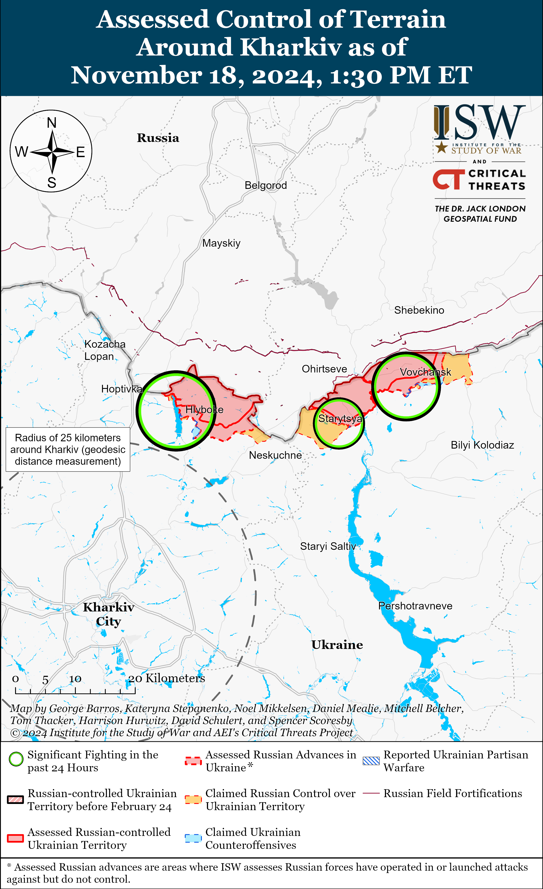
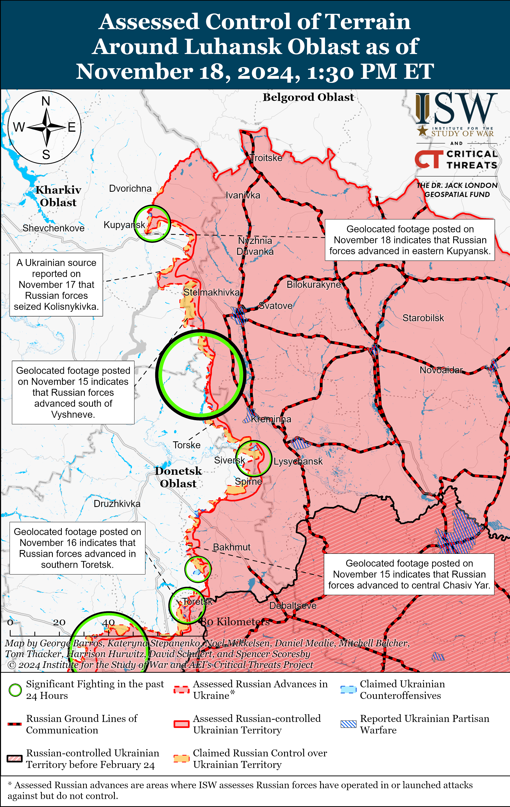
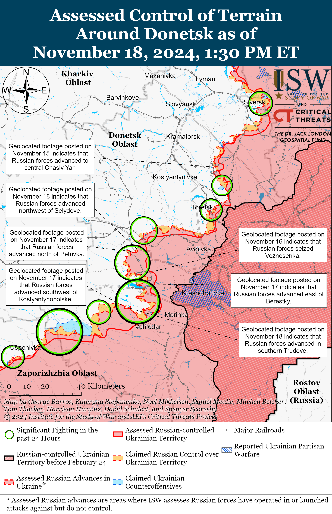
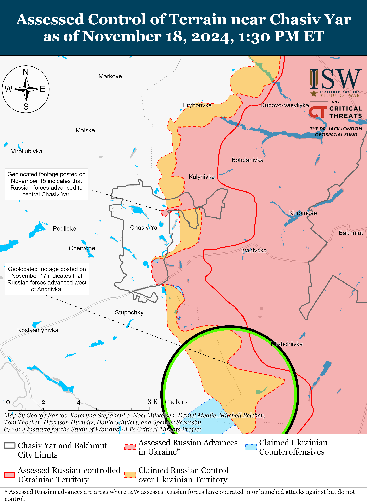
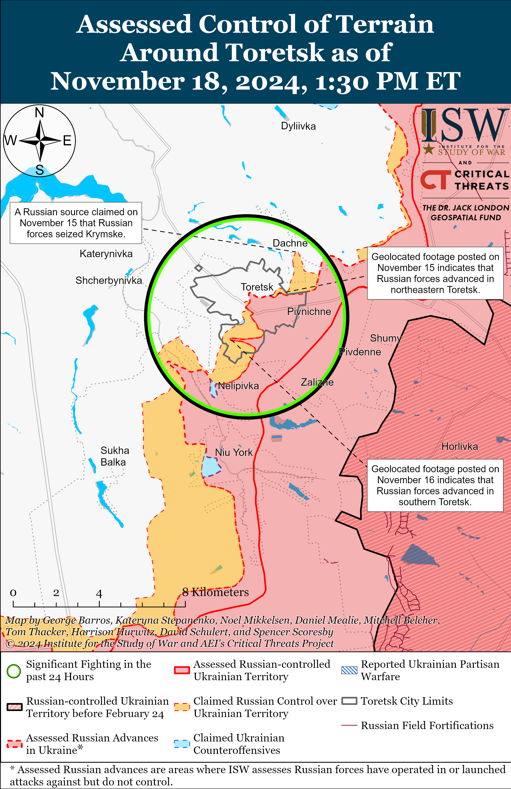
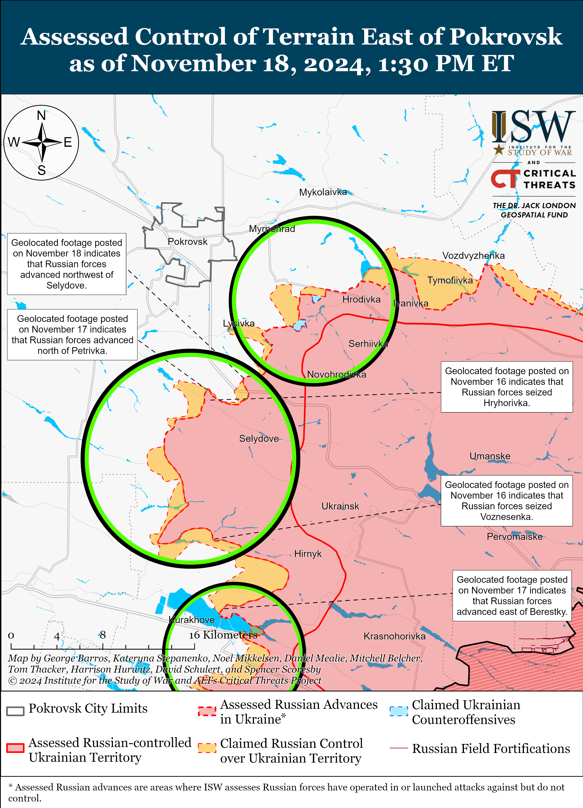
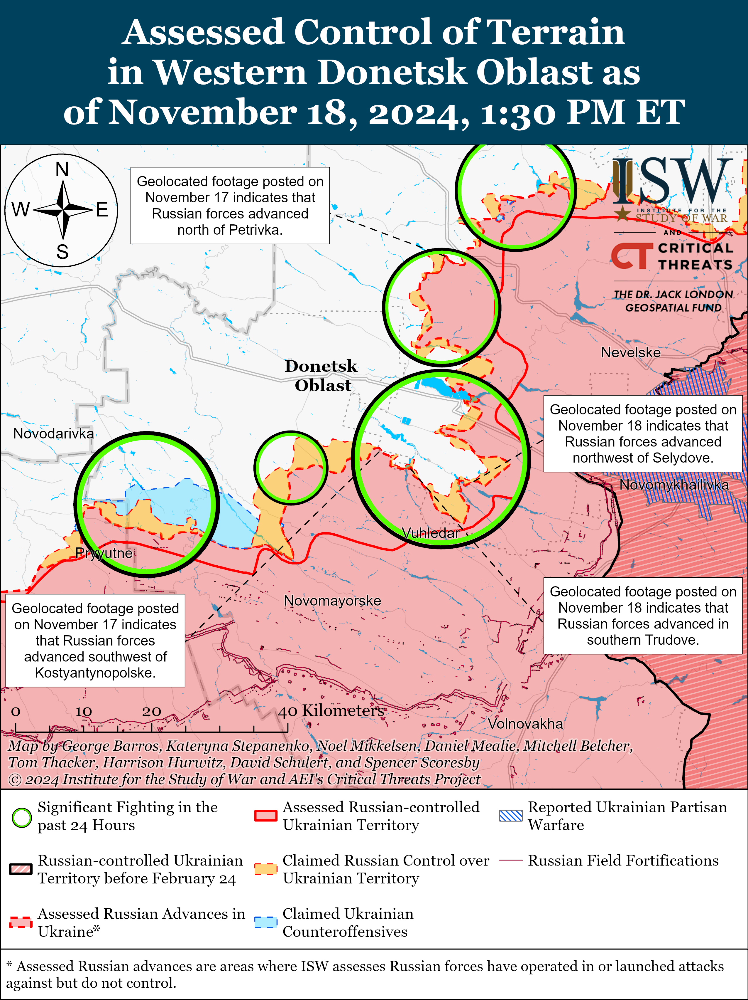
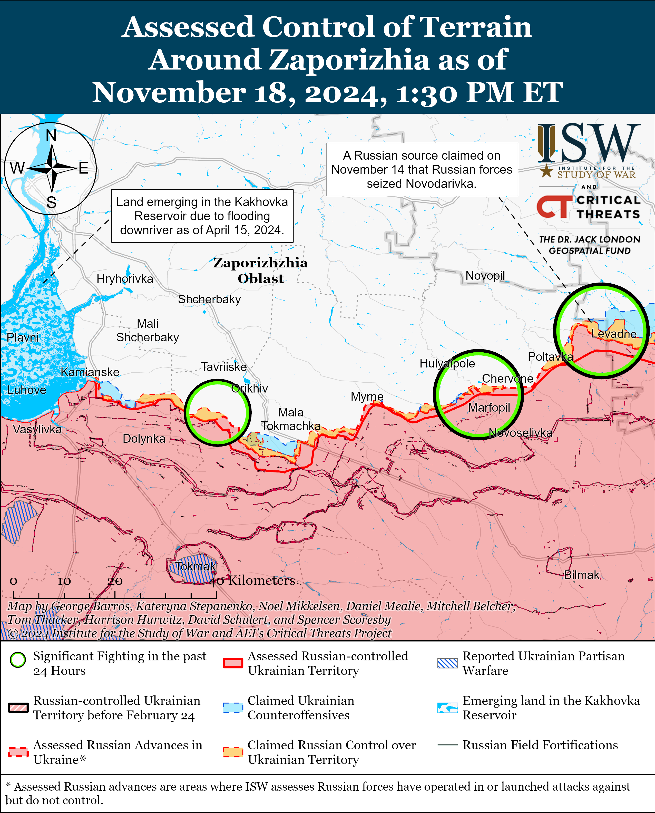
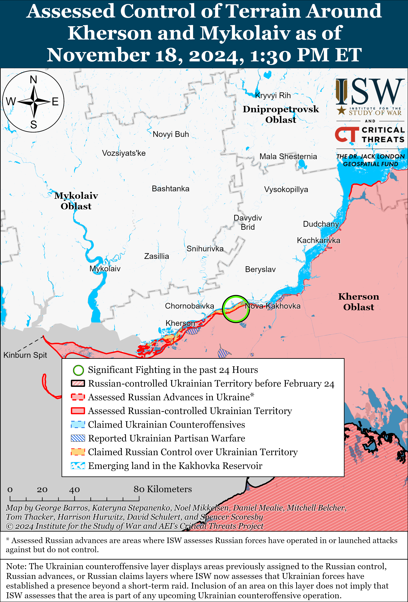

# Russian Offensive Campaign Assessment, November 18, 2024

**Christina Harward, Karolina Hird, Davit Gasparyan, Kateryna Stepanenko, Nicole Wolkov, Nate Trotter, William Runkel, Olivia Gibson, and Frederick W. Kagan**

**November 18, 2024, 5:30pm ET**

**Click** [**here**](https://storymaps.arcgis.com/stories/36a7f6a6f5a9448496de641cf64bd375) **to see ISW’s interactive map of the Russian invasion of Ukraine. This map is updated daily alongside the static maps present in this report.**

**Click** [**here**](https://understandingwar.maps.arcgis.com/apps/instant/3dviewer/index.html?appid=1602762dbcde419bb957dea358449580) **to see ISW’s 3D control of terrain topographic map of Ukraine. Use of a computer (not a mobile device) is strongly recommended for using this data-heavy tool.**

**Click** [**here**](https://storymaps.arcgis.com/stories/733fe90805894bfc8562d90b106aa895) **to access ISW’s archive of interactive time-lapse maps of the Russian invasion of Ukraine. These maps complement the static control-of-terrain map that ISW produces daily by showing a dynamic frontline. ISW will update this time-lapse map archive monthly.**

**Note: The data cut-off for this product was 12:30 pm ET on November 18. ISW will cover subsequent reports in the November 19 Russian Offensive Campaign Assessment.**

**Russian officials continued to use threatening rhetoric as part of efforts to deter the United States from publicly authorizing Ukraine’s use of US-provided ATACMS in limited strikes against Russian and North Korean military targets in Kursk Oblast. This US authorization, if officially confirmed, would notably be a mild response to Russia’s escalatory introduction of North Korean troops as active combatants in Russia’s invasion of Ukraine.** Kremlin Spokesperson Dmitry Peskov claimed on November 18 that the United States is “adding fuel to the fire” and that the US authorization of Ukrainian ATACMS strikes against Russian military targets would be a “qualitatively new round of tension” and a “qualitative” change in US participation in the war.[1] Peskov reiterated Russian President Vladimir Putin’s September 12 claims that Ukrainian strikes against Russia using Western-provided weapons would represent an escalation and directly involve Western countries in the war.[2] Russian Ministry of Foreign Affairs (MFA) Spokesperson Maria Zakharova also reiterated Putin’s September statements and further claimed that Ukrainian long-range missile strikes on Russia would be a “radical change in the essence and nature” of the war and that the Russian response would be “adequate and tangible.”[3] Russian State Duma and Federation Council deputies made similar threats, claiming that Russia would be “forced” to respond to this “escalation,” including with strikes against Ukraine using unspecified “new” weapons systems, and that Russia’s new nuclear doctrine will outline the consequences of this US decision.[4] Russia has not previously escalated militarily against any perceived Western violations of Russia’s “red lines” — as ISW has repeatedly observed.[5]

Select Russian officials and propagandists heavily emphasized that US officials have not yet formally confirmed the ATACMS strike authorization, likely in an attempt to convince the United States to back out of the decision and deny the media reports of the authorization. Zakharova stated that it is unclear if Western media outlets reporting on the US authorization are citing official sources, and Russian propagandist Vladimir Solovyov similarly questioned the credibility of the US media reports.[6]

Neither Ukrainian nor US officials have confirmed reports of the US authorization of Ukrainian ATACMS strikes, but US officials noted that Russia escalated the war with the deployment of North Korean forces alongside Russian forces on the battlefield. Ukrainian President Volodymyr Zelensky did not directly confirm media reports of the US authorization of limited ATACMS strikes, but stated on November 17 that “strikes are not carried out with words” and “such things are not announced,” but that “the missiles will speak for themselves.”[7] US Deputy National Security Advisor Jonathan Finer also did not confirm the US strike authorization but noted that Russia escalated the war with the deployment of North Korean forces to the battlefield and the massive drone and missile strike series against Ukrainian energy infrastructure on the night of November 16 to 17.[8] Finer directly responded to Peskov, stating that Russia’s full-scale invasion of Ukraine “lit the fire.”[9] US outlet *Axios* reported on November 17 that a source with knowledge of the matter stated that the Biden administration granted Ukraine permission to use ATACMS in order to deter North Korea from sending more troops to Russia for the war.[10] *Axios* reported that US officials hope that North Korea might reconsider its decision to deploy military personnel to Russia if Ukrainian forces strike North Korean forces in Kursk Oblast.

**Putin’s introduction of North Korea as a new belligerent in his invasion of Ukraine was a major escalation. Allowing Ukraine to use US missiles against legitimate military targets in Russian territory in accord with all international laws and laws of armed conflict is a very limited response and cannot reasonably be characterized as an escalation in itself.**

**French and British sources clarified on November 18 that the reported US permissions regarding Ukraine’s ability to use ATACMS for limited strikes within Russia do not inherently extend to Ukraine’s ability to use French and UK-provided SCALP and Storm Shadow missiles for long-range strikes in Russia.** French outlet *Le Figaro*, which ISW cited on November 17, removed phrasing from its November 17 article reporting that the ATACMS permission would extend to SCALP and Storm Shadow missiles.[11] French Foreign Minister Jean-Noël Barrot noted on November 18 that France remains open to the option of allowing Ukraine to use French-provided long-range missiles to strike within Russia but confirmed that France has not yet granted these permissions to Ukraine despite initial and erroneous reporting on November 17.[12] UK outlet *The Times* reported on November 18 that Downing Street sources stated that ATACMS have “different military specifications” from UK-provided Storm Shadows, and other UK outlets, including *The Sun* and *The Guardian,* noted on November 18 that the United States is “still blocking” Ukraine from using SCALP and Storm Shadow missiles against legitimate targets on Russian territory.[13] The UK and France jointly produce SCALP and Storm Shadow missiles, both of which utilize American-provided technologies and targeting intelligence, so all three parties would need to agree to lift restrictions on Ukraine’s ability to use either SCALP or Storm Shadow missiles in long-range strikes against targets on Russian territory.[14] Persistent restrictions on Ukraine’s ability to use SCALP and Storm Shadow missiles will continue to limit Ukraine’s ability to fully target the Russian rear with a broad arsenal of suitable systems, thus allowing Russia to maintain sanctuary space within its near and far-rear to which it is not entitled by any principle of international law or norms.[15]

**The Kremlin continues to state its unwillingness to accept any compromises, including those that would “freeze” the conflict along the current frontline – further demonstrating the Kremlin’s insistence on complete Ukraine capitulation.** *Bloomberg* reported on November 18 that Turkish President Recep Tayyip Erdogan plans to submit a peace plan for Russia’s war in Ukraine at the G20 summit held in Rio de Janeiro, Brazil from November 18 to 19 that would include the freezing of the conflict along the current frontlines, a 10-year postponement of Ukraine’s NATO membership alongside assurances of Western provisions of military supplies to Ukraine, the establishment of a demilitarized zone in eastern Ukraine, and the stationing of foreign troops in Ukraine.[16] Pro-Turkish government outlet *Daily Sabah* reported that sources in the Turkish Ministry of Foreign Affairs (MFA) denied reportsthat Erdogan would propose postponing Ukraine’s NATO membership, however, butstated that the Turkish government supports diplomatic initiatives aimed at ending the war.[17] Kremlin Spokesperson Dmitry Peskov responded to the initial reports of the Turkish peace proposal, stating that “freezing” the frontlineis “a priori unacceptable” for the Kremlin and that Russian President Vladimir Putin’s previously stated conditions for ending the war — which amounted to full Ukrainian capitulation — remain “fully relevant.”[18] ISW has routinely assessed that the Kremlin’s objective of total Ukrainian capitulation remains unchanged, and Peskov’s comment further demonstrates that Russian authorities are unwilling to engage in good-faith negotiations that result in compromises, even those on terms unfavorable to Ukraine, such as a freezing of the conflict. ISW continues to assess that a negotiated ceasefire on the current lines will only benefit Russia and will afford the Kremlin time to further radicalize and militarize Russian society against Ukraine and the Russian military time to rest and reconstitute, likely before conducting a future attack on Ukraine.[19]

**Key Takeaways:**

- **Russian officials continued to use threatening rhetoric as part of efforts to deter the United States from publicly authorizing Ukraine’s use of US-provided ATACMS in limited strikes against Russian and North Korean military targets in Kursk Oblast. This US authorization, if officially confirmed, would notably be a mild response to Russia’s escalatory introduction of North Korean troops as active combatants in Russia’s invasion of Ukraine.**
- **Putin’s introduction of North Korea as a new belligerent in his invasion of Ukraine was a major escalation. Allowing Ukraine to use US missiles against legitimate military targets in Russian territory in accord with all international laws and laws of armed conflict is a very limited response and cannot reasonably be characterized as an escalation in itself.**
- **French and British sources clarified on November 18 that the reported US permissions regarding Ukraine’s ability to use ATACMS for limited strikes within Russia do not inherently extend to Ukraine’s ability to use French and UK-provided SCALP and Storm Shadow missiles for long-range strikes in Russia.**
- **The Kremlin continues to state its unwillingness to accept any compromises, including those that would “freeze” the conflict along the current frontline – further demonstrating the Kremlin’s insistence on complete Ukraine capitulation.**
- **Russian forces recently advanced in the main Ukrainian salient in Kursk Oblast, in Kupyansk, west of Kreminna, and in the Siversk, Pokrovsk, and Vuhledar directions.**
- **The Kremlin is continuing to militarize different levels of the Russian government by expanding the “Time of Heroes” program that aims to place veterans of the Russian full-scale invasion of Ukraine in positions in local, regional, and federal governments.**
- **The Russian Ministry of Defense (MoD) illegally conscripted Ukrainian youth in occupied Donetsk, Luhansk, Kherson, and Zaporizhia oblasts as part of Russia’s Fall 2024 conscription cycle.**

***We do not report in detail on Russian war crimes because these activities are well-covered in Western media and do not directly affect the military operations we are assessing and forecasting. We will continue to evaluate and report on the effects of these criminal activities on the Ukrainian military and the Ukrainian population and specifically on combat in Ukrainian urban areas. We utterly condemn Russian violations of the laws of armed conflict and the Geneva Conventions and crimes against humanity even though we do not describe them in these reports.***

- Ukrainian Operations in the Russian Federation
- Russian Main Effort – Eastern Ukraine (comprised of three subordinate main efforts)
- Russian Subordinate Main Effort #1 – Push Ukrainian forces back from the international border with Belgorod Oblast and approach to within tube artillery range of Kharkiv City
- Russian Subordinate Main Effort #2 – Capture the remainder of Luhansk Oblast and push westward into eastern Kharkiv Oblast and encircle northern Donetsk Oblast
- Russian Subordinate Main Effort #3 – Capture the entirety of Donetsk Oblast
- Russian Supporting Effort – Southern Axis
- Russian Air, Missile, and Drone Campaign
- Russian Mobilization and Force Generation Efforts
- Russian Technological Adaptations
- Activities in Russian-occupied areas
- Significant Activity in Belarus

**Ukrainian Operations in the Russian Federation**

Russian forces recently advanced in the main Ukrainian salient in Kursk Oblast amid continued fighting in the area on November 18. Geolocated footage published on November 18 indicates that Russian forces recently advanced in northern Malaya Loknya (north of Sudzha).[20] Russian milbloggers claimed that Russian forces advanced near Nizhny Klin (southeast of Korenevo), the Olgovka forest (east of Korenevo), and Martynovka (northwest of Sudzha),.[21] ISW has not observed confirmation of these claims, however. A Russian milblogger claimed that Ukrainian forces unsuccessfully counterattacked near Darino (southeast of Korenevo) and Nizhny Klin.[22] Russian sources continued to claim that Ukrainian forces unsuccessfully attempted to break out of a Russian encirclement near the Olgovka forest.[23] Ukraine’s Pivnich (Northern) Operational Command Spokesperson Colonel Vadym Mysnyk reported on November 18 that Russian forces are using equipment for assaults when it is available but are otherwise conducting assaults with small infantry groups.[24] Mysnyk noted that weather conditions in Kursk Oblast are limiting Russian forces’ use of first-person view (FPV) and reconnaissance drones, and a Russian milblogger commented that roads in Kursk Oblast are muddy.[25] Elements of the Russian 155th Naval Infantry Brigade (Pacific Fleet, Eastern Military District [EMD]), the 106th Airborne (VDV) Division, and the 22nd Motorized Rifle Regiment (72nd Motorized Rifle Division, 44th Army Corps, Leningrad Military District [LMD]) are reportedly operating in Kursk Oblast.[26]

Neither Ukrainian nor Russian sources reported on fighting in Glushkovsky Raion west of the main Ukrainian salient in Kursk Oblast on November 18.

A Ukrainian servicemember operating in Kursk Oblast stated on November 17 that unspecified elements of the Russian 76th VDV Division arrived in Kursk Oblast and that Russian forces have roughly 4,000 personnel and 100 armored fighting vehicles ready to attack in unspecified areas of Kursk Oblast.[27] It is unclear if the Russian military command newly redeployed 4,000 personnel from other sectors of the front or if these reported combat-ready 4,000 personnel are part of the already existing Russian force concentration in Kursk Oblast.[28] The Ukrainian servicemember had stated on November 11 that Russian forces were deploying additional elements of the 76th VDV Division’s 104th VDV Regiment from western Zaporizhia Oblast to Kursk Oblast.[29] ISW observed claims as of November 11 that elements of the 76th VDV Division were operating in the Russian rear in the Zaporizhia direction, and the Russian military command may have withdrawn elements of the 76th VDV Division to the rear for redeployment to Kursk Oblast.[30]

**Russian Main Effort – Eastern Ukraine**

**Russian Subordinate Main Effort #1 – Kharkiv Oblast (Russian objective: Push Ukrainian forces back from the international border with Belgorod Oblast and approach to within tube artillery range of Kharkiv City)**

Russian forces continued ground attacks north of Kharkiv City near Vysoka Yaruha and northeast of Kharkiv City near Vovchansk and Starytsya on November 17 and 18 but did not make any confirmed advances.[31] A Russian milblogger claimed that Russian drone strikes repelled two small Ukrainian sabotage and reconnaissance groups with one armored personnel carrier attempting to cross the international border near Zhuravlevka Belgorod Oblast (just across the border from Vysoka Yaruha) on November 17.[32] Ukrainian Kharkiv Group of Forces Spokesperson Lieutenant Colonel Yevheniy Romanov reported on November 18 that Russian forces continue to assault Ukrainian positions in small groups and added that Russian forces recently increased the number of airstrikes against Ukrainian positions in Kharkiv Oblast.[33] A Ukrainian drone platoon commander operating in the Kharkiv direction stated on November 18 that Russian forces near Lyptsi are assaulting Ukrainian positions under the cover of fog while employing technologically advanced camouflage systems.[34] The platoon commander noted that Ukrainian drones are struggling to identify camouflaged Russian forces but added that Ukrainian forces are employing artificial intelligence (AI) and other unspecified technologies to identify hidden targets in Kharkiv Oblast.

**Russian Subordinate Main Effort #2 – Luhansk Oblast (Russian objective: Capture the remainder of Luhansk Oblast and push westward into eastern Kharkiv Oblast and northern Donetsk Oblast)**

Russian forces recently advanced in Kupyansk and west of Kreminna amid continued offensive operations along the Kupyansk-Svatove-Kreminna line on November 18. Geolocated footage published on November 18 but purportedly recorded on November 13 showing Ukrainian forces taking Russian prisoners along Dzerzhynskoho Street in eastern Kupyansk indicates that Russian forces advanced in the area, likely around November 13.[35] Additional geolocated footage published on November 17 shows that Russian forces also recently advanced westward in fields southeast of Yampolivka (west of Kreminna).[36] Russian milbloggers claimed that heavy fighting is ongoing in urban areas in the Zaoskillya Microraion of eastern Kupyansk, although one milblogger remarked that Russian forces have not yet secured positions in the area.[37] A Russian source claimed that Russian forces continue to strike Ukrainian pontoon crossings across the Oskil River.[38] The Ukrainian General Staff reported that Russian forces unsuccessfully attacked east of Kupyansk near Kucherivka; southeast of Kupyansk near Kruhlyakivka, Lozova, Zahryzove, and Kolisnykivka; southwest of Svatove near Novoyehorivka, Tverdokhlibove, and Cherneshchyna; and northwest of Kreminna near Novolyubivka, Hrekivka, and Terny on November 17 and 18.[39]

**Russian Subordinate Main Effort #3 – Donetsk Oblast (Russian objective: Capture the entirety of Donetsk Oblast, the claimed territory of Russia’s proxies in Donbas)**

Russin forces recently advanced in the Siversk direction amid continued offensive operations on November 18. Geolocated footage published on November 17 indicates that Russian forces recently advanced south of Bilohorivka (northeast of Siversk).[40] Russian forces continued offensive operations northeast of Siversk near Bilohorivka and east of Siversk near Verkhnokamyanske on November 17 and 18.[41] A Ukrainian brigade posted footage on November 17 of Ukrainian forces repelling two Russian armed vehicles in the Siversk direction on an unspecified date.[42]

Russian forces continued offensive operations in the Chasiv Yar direction on November 18 but did not advance. Russian forces conducted offensive operations near Chasiv Yar and south of Chasiv Yar near Bila Hora on November 17 and 18.[43] Elements of the Russian 98th Airborne (VDV) Division are reportedly operating near Chasiv Yar.[44] Elements of the Russian 6th Motorized Rifle Division (3rd Army Corps [AC]) reportedly repelled a Ukrainian counterattack near the Siverskyi Donets-Donbas Canal southeast of Chasiv Yar.[45]

Russian forces continued offensive operations near Toretsk and west of Toretsk near Shcherbynivka on November 17 and 18 but did not make confirmed advances.[46] 1st “Slavic” Motorized Rifle Brigade (51st Combined Arms Army [CAA], formerly the 1st Donetsk People’s Republic [DNR] AC) are reportedly operating in the Toretsk direction.[47]

Russian forces recently advanced in the Pokrovsk direction amid continued offensive operations in this direction on November 18. Geolocated footage published on November 17 and 18 indicates that Russian forces recently advanced northwest of Selydove (southeast of Pokrovsk) and north of Petrivka (south of Pokrovsk and west of Selydove).[48] The Russian Ministry of Defense (MoD) claimed on November 18 that Russian forces seized Novooleksiivka (southeast of Pokrovsk), which ISW assessed Russian forces had seized as of November 7.[49] Russian milbloggers claimed that Russian forces advanced further north of Petrivka, north of Hryhorivka, and south of Lysivka (both southeast of Pokrovsk).[50] ISW has not observed confirmation of these claims, however. Russian forces continued offensive operations east of Pokrovsk near Promin, Krutyi Yar, and Myrolyubivka; south of Pokrovsk near Petrivka; and southeast of Pokrovsk near Lysivka,, Novooleksiivka, Hryhorivka, and Pustynka on November 17 and 18.[51] A Russian milblogger claimed on November 18 that Ukrainian forces recently unsuccessfully counterattacked near Novohrodivka (southeast of Pokrovsk).[52] Elements of the Russian 1437th Motorized Rifle Regiment (15th Motorized Rifle Brigade, 2nd CAA, Central Military District [CMD]) are reportedly operating near Hryhorivka.[53] Elements of the Russian 30th Motorized Rifle Brigade (2nd CAA, CMD) and the 35th Motorized Rifle Brigade (41st CAA, CMD) are reportedly operating near Novohrodivka.[54]

Russian forces continued offensive operations in the Kurakhove direction on November 18 but did not make any confirmed advances. A Russian milblogger claimed that Russian forces advanced near Zorya (northeast of Kurakhove), although ISW has not observed visual evidence of this claim.[55] Russian milbloggers claimed that Russian forces are attempting to envelop Ukrainian forces operating north of Kurakhove and close the pocket in this area.[56] Russian forces continued attacking near Kurakhove itself; north of Kurakhove near Nova Illinka and Berestky; northwest of Kurakhove near Sontsivka and Voznesenka; and east of Kurakhove near Maksymilyanivka on November 17 and 18.[57] A Ukrainian drone platoon commander operating in the Kurakhove direction stated that Russian forces conduct four to five assaults per day, including mechanized and infantry-led assaults, and that Russian forces are able to replace casualties with new forces.[58] The deputy commander of a Ukrainian brigade operating in the Kurakhove direction stated that Russian forces are suffering high casualties and are not evacuating dead personnel from the battlefield.[59] Elements of the Russian 5th Motorized Rifle Brigade (51st CAA) are reportedly operating in the Kurakhove direction.[60]

Russian forces recently advanced in the Vuhledar direction amid continued offensive operations in the area on November 18. Geolocated footage of a Russian platoon-sized mechanized assault published on November 17 indicates that Russian forces recently advanced just west of Dalne (north of Vuhledar).[61] Additional geolocated footage published on November 17 indicates that Russian forces advanced within southern Trudove (northeast of Vuhledar) and southwest of Kostyantynopolske (northwest of Vuhledar).[62] Russian forces continued attacking north of Vuhledar near Uspenivka and Dalne; northwest of Vuhledar near Kostyantynopolske, Trudove, and Rozdolne; and northeast of Vuhledar near Yelyzavetivka, Antonivka, and Katerynivka on November 17 and 18.[63] Elements of the Russian 57th Motorized Rifle Regiment (20th Motorized Rifle Division, 8th CAA, Southern Military District [SMD]) are reportedly operating near Yelyzavetivka.[64]

Russian forces continued assaults in the Donetsk-Zaporizhia Oblast border area south of Velyka Novosilka near Makarivka and southwest of Velyka Novosilka near Novodarivka and Rivnopil on November 17 and 18 but did not make any confirmed advances.[65]

**Russian Supporting Effort – Southern Axis (Russian objective: Maintain frontline positions and secure rear areas against Ukrainian strikes)**

Russian forces continued ground assaults in western Zaporizhia Oblast on November 18, but there were no confirmed changes to the frontline. The Ukrainian General Staff reported that Russian forces continued ground attacks toward Novoandriivka (northwest of Robotyne) on November 17 and 18.[66] Russian sources claimed that Russian forces advanced toward Novoandriivka from Nesteryanka (northwest of Robotyne and south of Novoandriivka), to the southern outskirts of Bilohirya (northeast of Robotyne), and from Novopokrovka toward Mala Tokmachka (both northeast of Robotyne) on November 17 and 18.[67] ISW has not observed confirmation of these Russian claims, however. Russian source claimed that fighting in the Zaporizhia direction is mostly positional but that Russian forces have increased their activity in several unspecified areas.[68] Drone operators of the Russian 1429th Motorized Rifle Regiment (58th Combined Arms Army, Southern Military District [SMD]) are reportedly operating in the Zaporizhia direction.[69]

Positional fighting continued in the Dnipro direction in east (left) bank Kherson Oblast on November 17 and 18, but there were no confirmed changes to the frontline.[70]

**Russian Air, Missile, and Drone Campaign (Russian Objective: Target Ukrainian military and civilian infrastructure in the rear and on the frontline)**

Russian forces conducted a series of drone and missile strikes against Ukraine overnight on November 17 to 18 and during the day on November 18. The Ukrainian Air Force reported that Russian forces struck Sumy Oblast with two Iskander-M ballistic missiles launched from Voronezh Oblast and a Kh-59 cruise missile launched from airspace over Kursk Oblast.[71] The Ukrainian Air Force reported that Russian forces launched 11 Shahed drones and strike drones of an unknown type (possibly referring to decoy drones) from Kursk Oblast and that Ukrainian forces downed eight drones over Poltava, Kharkiv, Cherkasy, Chernihiv, and Kyiv oblasts. The Ukrainian Air Force reported that unspecified Ukrainian countermeasures, likely Ukrainian electronic warfare (EW) interference, caused three Russian drones to become “lost.” Ukrainian officials stated that a Russian Iskander-M ballistic missile struck a multi-story residential building in Sumy City and killed 10 civilians and injured 51 on the night of November 17 to 18.[72] Ukrainian officials stated that debris from a downed Russian Iskander-M ballistic missile damaged a multi-story residential building, a university, and an administrative building in Odesa City, killed 10 civilians, and injured 47 on the afternoon of November 18.[73]

**Russian Mobilization and Force Generation Efforts (Russian objective: Expand combat power without conducting general mobilization)**

The Kremlin is continuing to militarize different levels of the Russian government by expanding the “Time of Heroes” program that aims to place veterans of the Russian full-scale invasion of Ukraine in positions in local, regional, and federal governments. The Time of Heroes program announced on November 18 that it had received 6,640 applications from veterans interested in joining the program in the first three days of the application cycle, which began on November 15 and will run until January 15, 2025.[74] The Time of Heroes program observed that 12 graduates of the program have already received government appointments, including Donetsk People’s Republic (DNR) “Sparta” Battalion Commander and Speaker of the DNR Parliament Artem Zhoga, who became the Presidential Representative to the Ural Federal Okrug on October 2.[75] The Time of Heroes program added that the program’s other alumni include former Russian State Duma Deputy and servicemember Yevgeny Pervyshov, who recently became the Tambov Oblast governor on November 4; tank commander Artur Orlov; who became the Chairperson of the Russian youth movement “Movement of the First” on September 14; and veteran Alexey Kondratyev, who became a Russian Senator.[76]

**Russian Technological Adaptations (Russian objective: Introduce technological innovations to optimize systems for use in Ukraine)**

Russia continues to produce cheaply made long-range strike drones to overwhelm and distract Ukrainian air defense systems. Ukraine’s Main Military Intelligence Directorate (GUR) reported on November 18 that Russian forces are attempting to overwhelm Ukrainian air defenses by deploying Gerbera drones, which are made of plywood and polystyrene and contain Western and Chinese electronic components.[77] The GUR reported that the Gerbera drones perform similar functions to the Shahed-136 drone for 10 percent.[78] The GUR reported that the Russian Gerbera drone can carry a warhead and conduct reconnaissance to detect Ukrainian air defense systems. ISW has previously reported on the Russian usage of Gerbera drones.[79] ISW assessed that Russian forces likely used unspecified decoy drones to overload Ukrainian air defenses in the November 16–17 strike series, which contributed to Ukrainian forces’ below-average drone-shoot-down rate.[80]

A Ukrainian source published images reportedly showing out of production Soviet P-95-300 engines on Russian Kh-101 cruise missiles, suggesting that Russian forces are not able maintain the necessary production volumes of the Kh-101’s usual TRDD-50A engines and are instead utilizing missile engines from old Soviet stockpiles.[81] ISW cannot independently verify this report.

**Activities in Russian-occupied areas (Russian objective: Consolidate administrative control of annexed areas; forcibly integrate Ukrainian citizens into Russian sociocultural, economic, military, and governance systems)**

The Russian Ministry of Defense (MoD) illegally conscripted Ukrainian youth in occupied Donetsk, Luhansk, Kherson, and Zaporizhia oblasts as part of Russia’s Fall 2024 conscription cycle.[82] Russian state media outlet *Ria Novosti Krym* published footage on November 16 reportedly showing illegally conscripted Ukrainians taking a pledge of loyalty to Russia at a military base in occupied Simferopol, Crimea.[83] The Ukrainian Resistance Center reported that the Russian military command coerced Ukrainian youth to take the oath and is currently holding illegally conscripted Ukrainians at training grounds in occupied Crimea alongside Russian contract servicemembers.[84] Ukrainian Mariupol Mayoral Advisor Petro Andryushchenko also reported that the Russian MoD illegally conscripted Ukrainians from occupied Mariupol and Volnovakha, Donetsk Oblast and occupied Zaporizhia Oblast.[85] Andryushchenko stated that illegally conscripted Ukrainians from occupied Luhansk and Donetsk oblasts deployed to Bataysk, Rostov Oblast and will undergo military service as part of the Russian Southern Military District (SMD) in occupied Crimea, Rostov Oblast, and Krasnodar Krai.[86] The Geneva Convention forbids any occupying power from forcing civilians in occupied territories to serve in the occupying power’s military or auxiliary services.[87] The Russian MoD will continue to expand its mobilization reserve and coerce more Ukrainians for the Russian military if Russia retains long-term control over Ukrainian territories.

**Significant activity in Belarus (Russian efforts to increase its military presence in Belarus and further integrate Belarus into Russian-favorable frameworks and Wagner Group activity in Belarus)**

Belarusian Minister of Defense Lieutenant General Viktor Khrenin and People’s Republic of China (PRC) Ambassador to Belarus Zhang Wenchuan met on November 18 to discuss increasing bilateral and multilateral military cooperation.[88]

Belarusian President Alexander Lukashenko met with Smolensk Oblast Governor Vasily Anokhin on November 18 to discuss areas of bilateral cooperation and advocate for increased freedom of movement between Russia and Belarus.[89] Lukashenko highlighted Belarus’ machine tool manufacturing and microelectronics industries during the meeting.[90]

**Note: ISW does not receive any classified material from any source, uses only publicly available information, and draws extensively on Russian, Ukrainian, and Western reporting and social media as well as commercially available satellite imagery and other geospatial data as the basis for these reports. References to all sources used are provided in the endnotes of each update.**

[1] https://tass dot ru/politika/22429825; https://ria dot ru/20241118/ssha-1984365977.html

[2] https://isw.pub/UkrWar091224; https://tass dot ru/politika/22429825

[3]https://www.rbc dot ru/politics/17/11/2024/673a4a8d9a79475c7f19c4a3; https://tass dot ru/politika/22434963

[4] https://t.me/vv\_volodin/942; https://t.me/tass\_agency/285852; https://t.me/tass\_agency/285792; https://t.me/tass\_agency/285789

[5] https://isw.pub/UkrWar091224; https://understandingwar.org/backgrounder/russian-offensive-campaign-assessment-september-27-2024 ; https://understandingwar.org/backgrounder/how-delays-western-aid-gave-russia-initiative-ukrainian-counteroffensive-kharkiv ; https://understandingwar.org/backgrounder/putin-vulnerable-western-policy-masks-russian-weakness

[6] https://t.me/tass\_agency/285969; https://t.me/tass\_agency/285969; https://t.me/SolovievLive/295797

[7] https://www.youtube.com/watch?v=yms1awdevlM; https://meduza dot io/feature/2024/11/18/ssha-razreshili-ukraine-bit-po-territorii-rossii-dalnoboynymi-raketami-atacms-poka-tolko-po-kurskoy-oblasti

[8] https://www.whitehouse.gov/briefing-room/press-briefings/2024/11/18/on-the-record-press-gaggle-by-deputy-national-security-advisor-jon-finer-on-the-presidents-engagements-at-the-g20-summit/

[9] https://www.whitehouse.gov/briefing-room/press-briefings/2024/11/18/on-the-record-press-gaggle-by-deputy-national-security-advisor-jon-finer-on-the-presidents-engagements-at-the-g20-summit/

[10] https://www.axios.com/2024/11/17/biden-ukraine-russia-missiles-north-korea-response

[11] https://www.lefigaro dot fr/international/joe-biden-aurait-donne-son-accord-a-l-ukraine-pour-frapper-la-russie-en-profondeur-avec-des-armes-americaines-20241117; https://archive dot is/wlg9k; dot io/feature/2024/11/18/ssha-razreshili-ukraine-bit-po-territorii-rossii-dalnoboynymi-raketami-atacms-poka-tolko-po-kurskoy-oblasti; https://understandingwar.org/backgrounder/russian-offensive-campaign-assessment-november-17-2024https://meduza dot io/feature/2024/11/18/ssha-razreshili-ukraine-bit-po-territorii-rossii-dalnoboynymi-raketami-atacms-poka-tolko-po-kurskoy-oblasti; https://understandingwar.org/backgrounder/russian-offensive-campaign-assessment-november-17-2024

[12] https://www.lemonde dot fr/en/france/article/2024/11/18/france-says-ukraine-using-its-long-range-missiles-in-russia-still-an-option\_6733189\_7.html

[13] https://www.thetimes.com/world/russia-ukraine-war/article/biden-authorises-ukraine-to-use-long-range-missiles-against-russia-vxts72v0x; https://www.thesun.co.uk/news/31786770/ukraine-still-banned-from-firing-british-storm-shadows/; https://www.theguardian.com/world/2024/nov/17/biden-has-lifted-ban-on-ukraine-using-us-weapons-to-strike-deeper-into-russia-reports

[14] https://www.thetimes.com/world/russia-ukraine-war/article/biden-authorises-ukraine-to-use-long-range-missiles-against-russia-vxts72v0x; https://newsukraine.rbc dot ua/news/success-story-will-kursk-breakthrough-accelerate-1723574020.html; https://www.telegraph.co.uk/news/2024/08/27/uk-backs-ukraine-use-storm-shadow-missiles-russia/; https://understandingwar.org/backgrounder/russian-offensive-campaign-assessment-august-28-2024

[15] https://storymaps.arcgis.com/stories/8b060c46ee6f49908f9fb415ad23051c; https://x.com/TheStudyofWar/status/1828580873375023299: https://understandingwar.org/backgrounder/putins-safe-space-defeating-russias-kharkiv-operation-requires-eliminating-russias

[16] https://www.bloomberg.com/news/articles/2024-11-17/ukraine-war-latest-allies-are-leaning-on-zelenskiy-for-a-way-to-end-the-war?embedded-checkout=true ; https://www.msn.com/en-us/news/world/erdogan-to-propose-freezing-war-in-ukraine-and-postponing-nato-membership-at-g20-summit-bloomberg/ar-AA1uhuek ; https://meduza dot io/news/2024/11/18/bloomberg-erdogan-podgotovil-plan-zamorozki-rossiysko-ukrainskoy-voyny ; https://tass.ru/politika/22429841 ; https://ria.ru/20241118/kreml-1984364482.html

[17] https://www.dailysabah dot com/politics/diplomacy/turkish-sources-deny-opposition-to-ukraines-nato-bid

[18] https://meduza dot io/news/2024/11/18/peskov-predlozhenie-erdogana-o-zamorozke-voyny-apriori-nepriemlemo-dlya-kremlya; https://www.rbc dot ru/rbcfreenews/673b06f09a7947e148eed8be; https://www.interfax dot ru/russia/993199

[19] https://understandingwar.org/backgrounder/russian-offensive-campaign-assessment-october-31-2024

[20] https://x.com/giK1893/status/1858562637099135006 ; https://x.com/giK1893/status/1858562639904805238 ; https://t.me/ua\_regteam/213

[21] https://t.me/dva\_majors/57983; https://t.me/DnevnikDesantnika/19380

[22] https://t.me/dva\_majors/57983

[23] https://t.me/dva\_majors/57983; https://understandingwar.org/backgrounder/russian-offensive-campaign-assessment-november-17-2024; https://t.me/sashakots/50210

[24] https://armyinform dot com.ua/2024/11/18/vorog-otrymuye-po-zubah-syly-oborony-strymuyut-nastup-rosiyan-v-kurskij-oblasti/; https://www.youtube.com/watch?v=aDXWlQ2K0dM

[25] https://t.me/dva\_majors/57990; https://armyinform dot com.ua/2024/11/18/vorog-otrymuye-po-zubah-syly-oborony-strymuyut-nastup-rosiyan-v-kurskij-oblasti/; https://www.youtube.com/watch?v=aDXWlQ2K0dM

[26] https://x.com/OSINTua/status/1858156160215298169; https://t.me/dva\_majors/58026; https://t.me/ButusovPlus/15114

[27] https://x.com/OSINTua/status/1858156160215298169

[28] https://isw.pub/UkrWar111224

[29] https://understandingwar.org/backgrounder/russian-offensive-campaign-assessment-november-12-2024

[30] https://understandingwar.org/backgrounder/russian-offensive-campaign-assessment-november-11-2024

[31]https://www.facebook.com/GeneralStaff.ua/posts/pfbid037GoVzmmb3k71698p1P7mk6s4AH7D7gxrLmD75CGZZsiTb7fFLY8PiqWnJVYZFiKgl ; https://www.facebook.com/GeneralStaff.ua/posts/pfbid0nBCF4Y9UxWJgWcwpFWKyyaUj8Yidzu8hcCrCKoBjmNysfZwiKeyPpUuksM65KU8Nl ; https://www.facebook.com/GeneralStaff.ua/posts/pfbid032GQu7svrWkZXS5gan5SUjp7gL2sMB4nxd6FTHDVmMqadBqyqSLSYcvqtuThacjTHl ; https://t.me/otukharkiv/2658 ; https://t.me/otukharkiv/2658

[32] https://t.me/dva\_majors/58035

[33]https://www.youtube.com/watch?v=aDXWlQ2K0dM; https://armyinform dot com.ua/2024/11/18/mozhlyva-aktyvizacziya-voroga-na-harkivshhyni-pobilshalo-rosijskyh-aviaudariv/

[34] https://www.youtube.com/watch?v=j5TqaWCCdUg; https://armyinform dot com.ua/2024/11/18/na-harkivshhyni-vorog-prykryvayetsya-tumanom-vyyavyty-jogo-dopomagaye-shtuchnyj-intelekt/

[35] https://t.me/WarArchive\_ua/22413

[36] https://t.me/WarArchive\_ua/22382; https://t.me/OMIBr\_60/618

[37] https://t.me/motopatriot/29532; https://t.me/Sladkov\_plus/11829

[38] https://t.me/Sladkov\_plus/11829

[39] https://www.facebook.com/GeneralStaff.ua/posts/pfbid037GoVzmmb3k71698p1P7mk6s4AH7D7gxrLmD75CGZZsiTb7fFLY8PiqWnJVYZFiKgl; https://www.facebook.com/GeneralStaff.ua/posts/pfbid0nBCF4Y9UxWJgWcwpFWKyyaUj8Yidzu8hcCrCKoBjmNysfZwiKeyPpUuksM65KU8Nl; https://www.facebook.com/GeneralStaff.ua/posts/pfbid032GQu7svrWkZXS5gan5SUjp7gL2sMB4nxd6FTHDVmMqadBqyqSLSYcvqtuThacjTHl

[40] https://x.com/blinzka/status/1858280659397300644; https://x.com/markito0171/status/1858269641849569589

[41] https://www.facebook.com/GeneralStaff.ua/posts/pfbid0nBCF4Y9UxWJgWcwpFWKyyaUj8Yidzu8hcCrCKoBjmNysfZwiKeyPpUuksM65KU8Nl; https://www.facebook.com/GeneralStaff.ua/posts/pfbid032GQu7svrWkZXS5gan5SUjp7gL2sMB4nxd6FTHDVmMqadBqyqSLSYcvqtuThacjTHl

[42] https://mil dot in.ua/uk/news/54-ta-brygada-vidbyla-shturm-rosiyan-na-siverskomu-napryamku/; https://t.me/OTU\_Luhansk/154

[43] https://www.facebook.com/GeneralStaff.ua/posts/pfbid0nBCF4Y9UxWJgWcwpFWKyyaUj8Yidzu8hcCrCKoBjmNysfZwiKeyPpUuksM65KU8Nl; https://www.facebook.com/GeneralStaff.ua/posts/pfbid032GQu7svrWkZXS5gan5SUjp7gL2sMB4nxd6FTHDVmMqadBqyqSLSYcvqtuThacjTHl; https://t.me/wargonzo/23214

[44] https://t.me/motopatriot/29542; https://t.me/DnevnikDesantnika/19368;

[45] https://t.me/sashakots/50227; https://t.me/epoddubny/21651

[46]https://www.facebook.com/GeneralStaff.ua/posts/pfbid037GoVzmmb3k71698p1P7mk6s4AH7D7gxrLmD75CGZZsiTb7fFLY8PiqWnJVYZFiKgl ; https://www.facebook.com/GeneralStaff.ua/posts/pfbid0nBCF4Y9UxWJgWcwpFWKyyaUj8Yidzu8hcCrCKoBjmNysfZwiKeyPpUuksM65KU8Nl ; https://www.facebook.com/GeneralStaff.ua/posts/pfbid032GQu7svrWkZXS5gan5SUjp7gL2sMB4nxd6FTHDVmMqadBqyqSLSYcvqtuThacjTHl

[47] https://t.me/wargonzo/23227

[48] https://t.me/creamy\_caprice/7543; https://t.me/egeriaznauri/26; https://t.me/creamy\_caprice/7544; https://t.me/groupPUMA/57

[49] https://understandingwar.org/backgrounder/russian-offensive-campaign-assessment-november-7-2024; https://t.me/mod\_russia/45840

[50] https://t.me/RVvoenkor/80903; https://t.me/vrogov/18035; https://t.me/z\_arhiv/29617; https://t.me/motopatriot/29538 ; https://t.me/motopatriot/29533

[51] https://www.facebook.com/GeneralStaff.ua/posts/pfbid037GoVzmmb3k71698p1P7mk6s4AH7D7gxrLmD75CGZZsiTb7fFLY8PiqWnJVYZFiKgl; https://www.facebook.com/GeneralStaff.ua/posts/pfbid0nBCF4Y9UxWJgWcwpFWKyyaUj8Yidzu8hcCrCKoBjmNysfZwiKeyPpUuksM65KU8Nl; https://www.facebook.com/GeneralStaff.ua/posts/pfbid032GQu7svrWkZXS5gan5SUjp7gL2sMB4nxd6FTHDVmMqadBqyqSLSYcvqtuThacjTHl

[52] https://t.me/motopatriot/29539

[53] https://t.me/rybar/65492

[54] https://t.me/skalabatalion/440 ; https://x.com/666\_mancer/status/1858260019663524016

[55] https://t.me/z\_arhiv/29617

[56] https://t.me/NgP\_raZVedka/19527 ; https://t.me/wargonzo/23214

[57] https://www.facebook.com/GeneralStaff.ua/posts/pfbid037GoVzmmb3k71698p1P7mk6s4AH7D7gxrLmD75CGZZsiTb7fFLY8PiqWnJVYZFiKgl ; https://www.facebook.com/GeneralStaff.ua/posts/pfbid0nBCF4Y9UxWJgWcwpFWKyyaUj8Yidzu8hcCrCKoBjmNysfZwiKeyPpUuksM65KU8Nl ; https://www.facebook.com/GeneralStaff.ua/posts/pfbid032GQu7svrWkZXS5gan5SUjp7gL2sMB4nxd6FTHDVmMqadBqyqSLSYcvqtuThacjTHl ; https://t.me/voenkorKotenok/60193 ; https://t.me/RVvoenkor/80874 ; https://t.me/dva\_majors/57983 ; https://t.me/rybar/65465

[58] https://armyinform.com dot ua/2024/11/18/gotuyemo-syurpryzy-yak-morski-pihotynczi-zupynyayut-nakaty-rosiyan-na-kurahivskomu-napryamku/

[59] https://armyinform dot com.ua/2024/11/18/zalyshayutsya-spaleni-groby-tehniky-na-kurahivskomu-napryamku-zhorstki-oboronni-boyi/

[60] https://t.me/boris\_rozhin/144765; https://t.me/boris\_rozhin/144756

[61] https://t.me/WarArchive\_ua/22404; https://t.me/mechanized33/543; https://t.me/creamy\_caprice/7542; https://x.com/klinger66/status/1858265483666968979; https://x.com/GirkinGirkin/status/1858256097938931791

[62] (Trudove) https://x.com/creamy\_caprice/status/1858231236508127537; https://t.me/creamy\_caprice/7539; https://t.me/Fab\_1500/183

(Kostyantynopolske) https://x.com/giK1893/status/1858228260305273266; https://t.me/Khortytsky\_wind/2321; https://t.me/WarArchive\_ua/22397; https://t.me/creamy\_caprice/7541

[63] https://www.facebook.com/GeneralStaff.ua/posts/pfbid037GoVzmmb3k71698p1P7mk6s4AH7D7gxrLmD75CGZZsiTb7fFLY8PiqWnJVYZFiKgl ; https://www.facebook.com/GeneralStaff.ua/posts/pfbid0nBCF4Y9UxWJgWcwpFWKyyaUj8Yidzu8hcCrCKoBjmNysfZwiKeyPpUuksM65KU8Nl ; https://www.facebook.com/GeneralStaff.ua/posts/pfbid032GQu7svrWkZXS5gan5SUjp7gL2sMB4nxd6FTHDVmMqadBqyqSLSYcvqtuThacjTHl ; https://t.me/NgP\_raZVedka/19534 ; https://t.me/NgP\_raZVedka/19527 ; https://t.me/RVvoenkor/80874 ; https://t.me/dva\_majors/57983 ; https://t.me/NgP\_raZVedka/19533

[64] https://t.me/NgP\_raZVedka/19534

[65] https://www.facebook.com/GeneralStaff.ua/posts/pfbid037GoVzmmb3k71698p1P7mk6s4AH7D7gxrLmD75CGZZsiTb7fFLY8PiqWnJVYZFiKgl; https://www.facebook.com/GeneralStaff.ua/posts/pfbid0nBCF4Y9UxWJgWcwpFWKyyaUj8Yidzu8hcCrCKoBjmNysfZwiKeyPpUuksM65KU8Nl; https://www.facebook.com/GeneralStaff.ua/posts/pfbid032GQu7svrWkZXS5gan5SUjp7gL2sMB4nxd6FTHDVmMqadBqyqSLSYcvqtuThacjTHl; https://t.me/voenkorKotenok/60193; https://t.me/rybar/65465

[66] https://www.facebook.com/GeneralStaff.ua/posts/pfbid0nBCF4Y9UxWJgWcwpFWKyyaUj8Yidzu8hcCrCKoBjmNysfZwiKeyPpUuksM65KU8Nl; https://www.facebook.com/GeneralStaff.ua/posts/pfbid032GQu7svrWkZXS5gan5SUjp7gL2sMB4nxd6FTHDVmMqadBqyqSLSYcvqtuThacjTHl;

[67] https://t.me/NgP\_raZVedka/19510; https://t.me/tass\_agency/285812; https://t.me/dva\_majors/57983; https://t.me/voenkorKotenok/60193; https://t.me/DnevnikDesantnika/19383; https://t.me/dva\_majors/57983

[68] https://t.me/wargonzo/23214

[69] https://t.me/sashakots/50238

[70] https://www.facebook.com/GeneralStaff.ua/posts/pfbid037GoVzmmb3k71698p1P7mk6s4AH7D7gxrLmD75CGZZsiTb7fFLY8PiqWnJVYZFiKgl; https://www.facebook.com/GeneralStaff.ua/posts/pfbid0nBCF4Y9UxWJgWcwpFWKyyaUj8Yidzu8hcCrCKoBjmNysfZwiKeyPpUuksM65KU8Nl; https://www.facebook.com/GeneralStaff.ua/posts/pfbid032GQu7svrWkZXS5gan5SUjp7gL2sMB4nxd6FTHDVmMqadBqyqSLSYcvqtuThacjTHl

[71] https://t.me/kpszsu/23153

[72] https://t.me/dsns\_sumy/18994; https://t.me/mvs\_ukraine/44162; https://t.me/Sumy\_news\_ODA/31457; https://t.me/Sumy\_news\_ODA/31455; https://suspilne dot media/sumy/882111-vijskovi-rf-vdarili-po-kriticnij-infrastrukturi-sum/; https://t.me/kpszsu/23153; https://t.me/Sumy\_news\_ODA/31449; https://t.me/UA\_National\_Police/31289; https://t.me/sumskamiskarada/31813; https://t.me/V\_Zelenskiy\_official/12434

[73] https://t.me/UA\_National\_Police/31317 ; https://t.me/kpszsu/23171; https://t.me/kpszsu/23171 ; https://t.me/odeskaODA/7613 ; https://t.me/odeskaODA/7618 ; https://t.me/SJTF\_Odes/11786 ; https://t.me/odeskaODA/7617 ; https://t.me/V\_Zelenskiy\_official/12438

[74] https://xn--b1aachba0csne6n dot xn--p1ai/news/tpost/298ex77p61-bolee-6500-chelovek-zaregistrirovalis-na; https://t.me/RVvoenkor/80898

[75] https://understandingwar.org/backgrounder/russian-offensive-campaign-assessment-october-3-2024

[76] https://understandingwar.org/backgrounder/russian-offensive-campaign-assessment-october-3-2024; https://www.facebook.com/photo.php?fbid=953417193467638&set=a.623290673146960&type=3; https://understandingwar.org/backgrounder/russian-offensive-campaign-assessment-september-15-2024; https://www.themoscowtimes dot com/2024/11/05/governors-of-russias-rostov-tambov-regions-resign-kicking-off-regional-shake-up-a86903

[77] https://t.me/DIUkraine/4846; https://gur.gov dot ua/content/herbery-z-fanery-ta-inozemnoi-elektroniky-detali-budovy-cherhovoho-rosiiskoho-drona.html; https://war-sanctions dot gur.gov.ua/components?f%5Bcountry\_id%5D=&f%5Bmanufacturer\_id%5D=&f%5Btitle\_uk%5D=wgroup-329&i%5Bmarking%5D=&f%5Bsearch%5D= ; https://mil.in dot ua/uk/news/u-rosijskomu-bpla-gerbera-vyyavyly-zahidni-komplektuyuchi/

[78] https://t.me/DIUkraine/4846; https://gur.gov dot ua/content/herbery-z-fanery-ta-inozemnoi-elektroniky-detali-budovy-cherhovoho-rosiiskoho-drona.html; https://war-sanctions dot gur.gov.ua/components?f%5Bcountry\_id%5D=&f%5Bmanufacturer\_id%5D=&f%5Btitle\_uk%5D=wgroup-329&i%5Bmarking%5D=&f%5Bsearch%5D= ; https://mil.in dot ua/uk/news/u-rosijskomu-bpla-gerbera-vyyavyly-zahidni-komplektuyuchi/ ; https://t.me/rybar/65486

[79] https://understandingwar.org/backgrounder/russian-offensive-campaign-assessment-october-23-2024

[80] https://understandingwar.org/backgrounder/russian-offensive-campaign-assessment-november-17-2024

[81] https://mil.in dot ua/uk/news/rosiyany-pochaly-stavyty-zastarili-dvyguny-na-rakety-h-101/ ; https://t.me/war\_home/3100

[82] https://t.me/sprotyv\_official/5624; https://t.me/andriyshTime/29560 ; https://mil.in dot ua/uk/news/rosiyany-provely-nezakonnyj-pryzov-na-tymchasovo-okupovanyh-terytoriyah-ukrayiny/ ; https://t.me/rian\_crimea/56762

[83] https://t.me/rian\_crimea/56762

[84] https://t.me/sprotyv\_official/5624

[85] https://t.me/andriyshTime/29560

[86] https://t.me/andriyshTime/29560

[87] https://ihl-databases.icrc.org/en/ihl-treaties/gciv-1949/article-51

[88] https://t.me/modmilby/43276

[89] https://t.me/pul\_1/14418 ; https://t.me/belta\_telegramm/278883 ; https://belta dot by/president/view/chto-my-proverjaem-drug-druga-lukashenko-vyskazalsja-za-svobodu-peredvizhenija-cherez-granitsu-s-676293-2024/

[90] https://president.gov dot by/ru/events/vstreca-s-gubernatorom-smolenskoj-oblasti-rossii-vasiliem-anohinym
