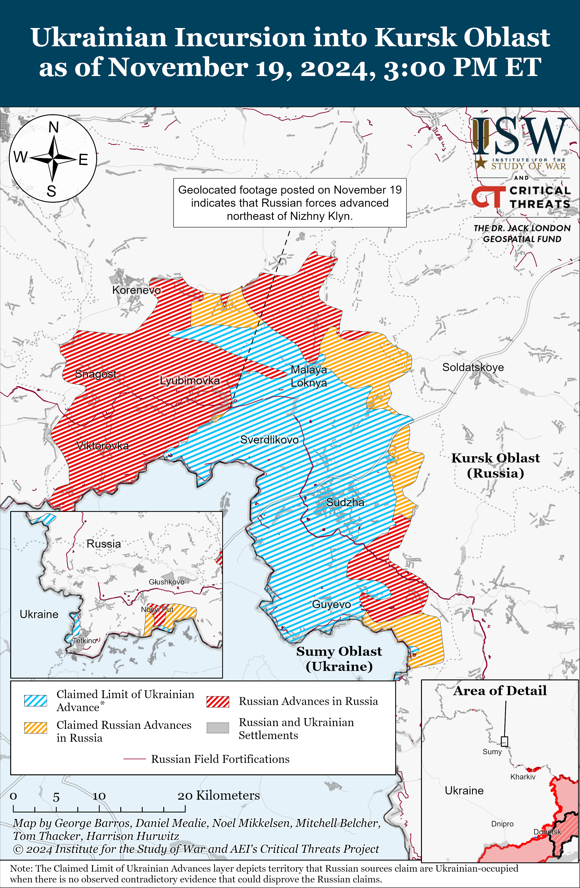
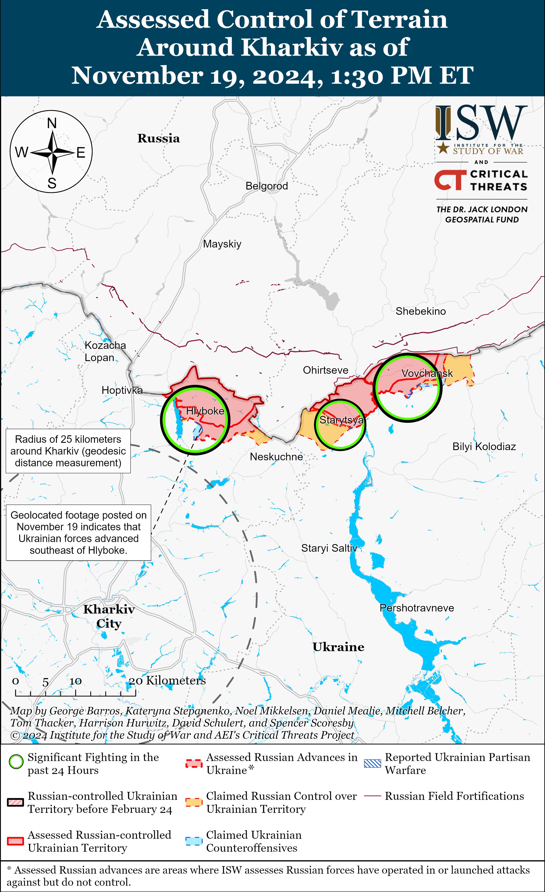
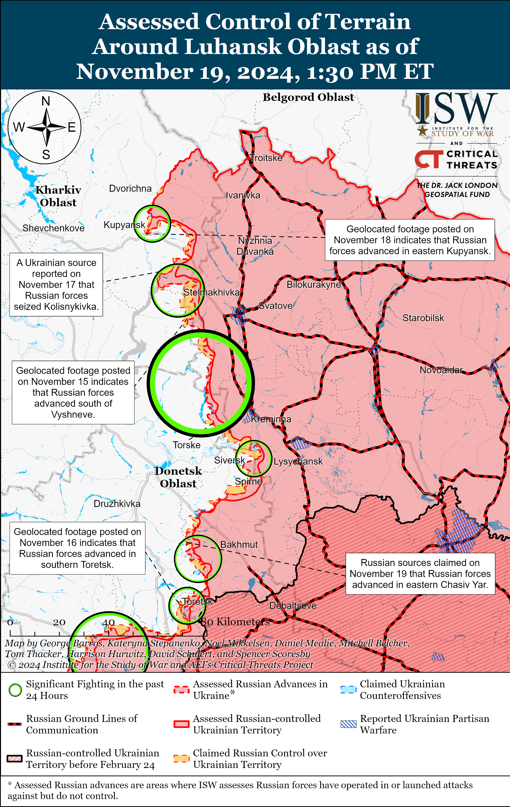
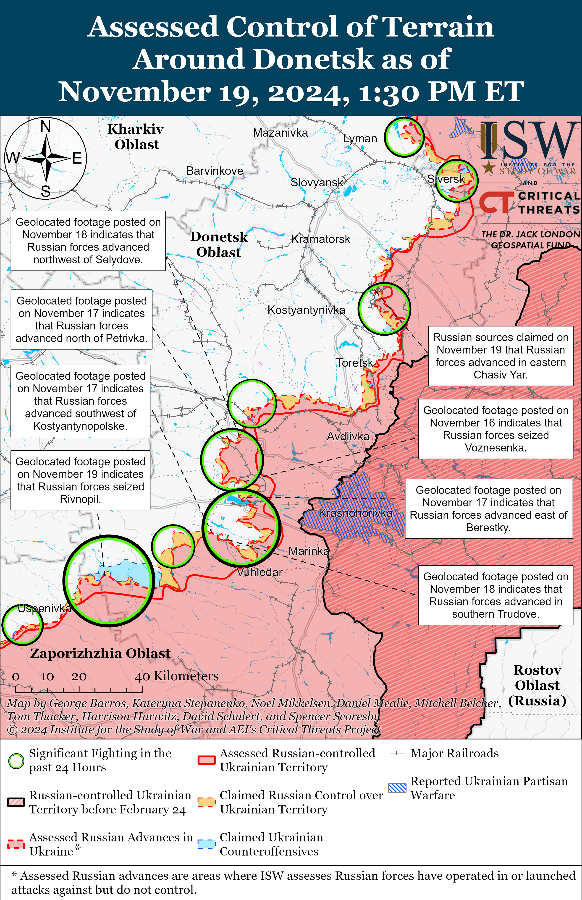
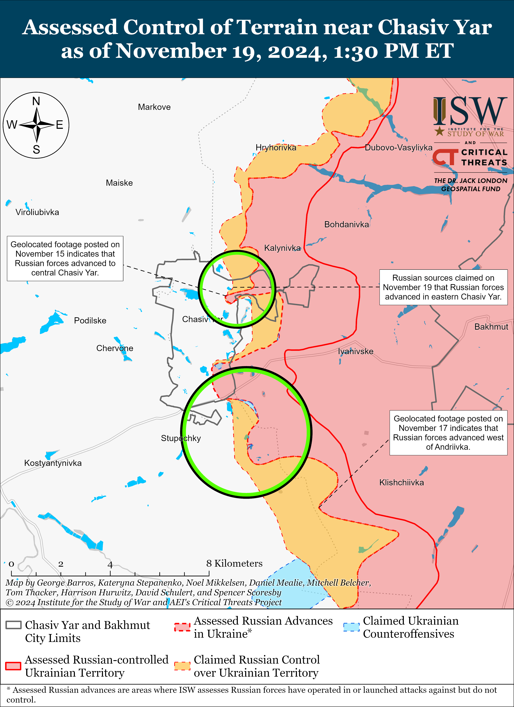
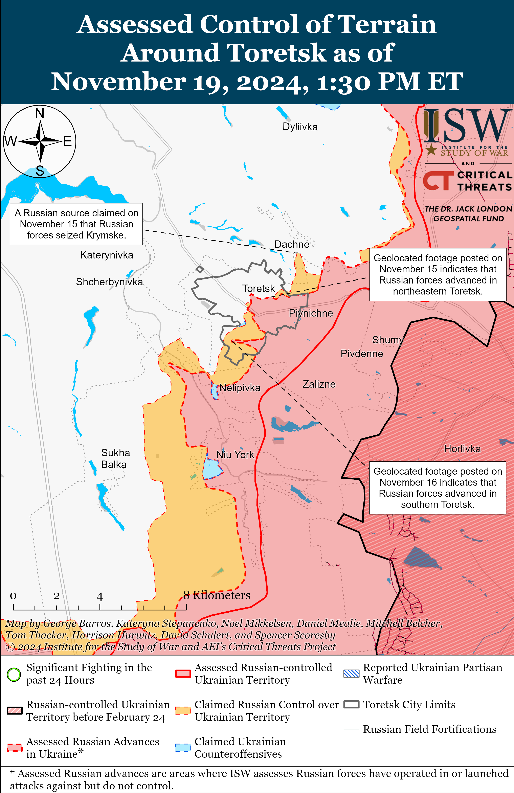
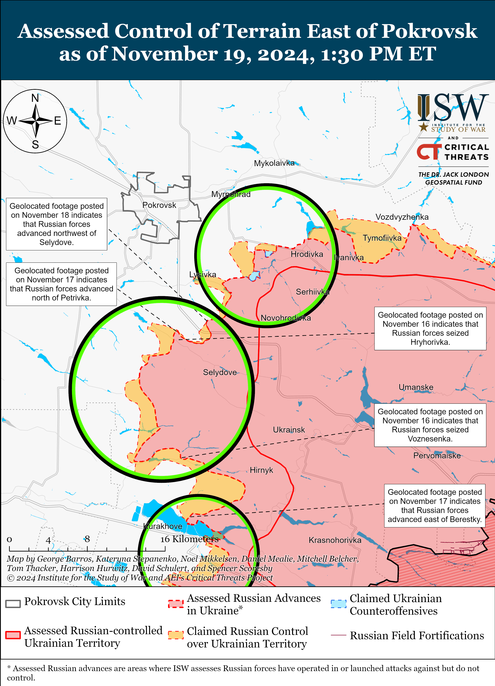
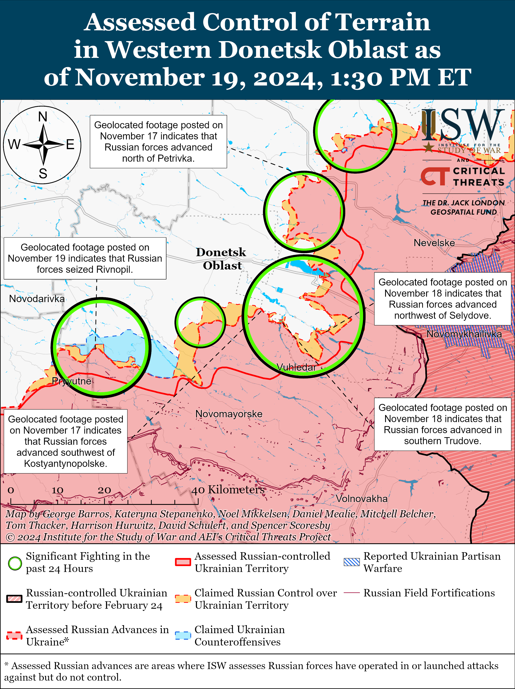
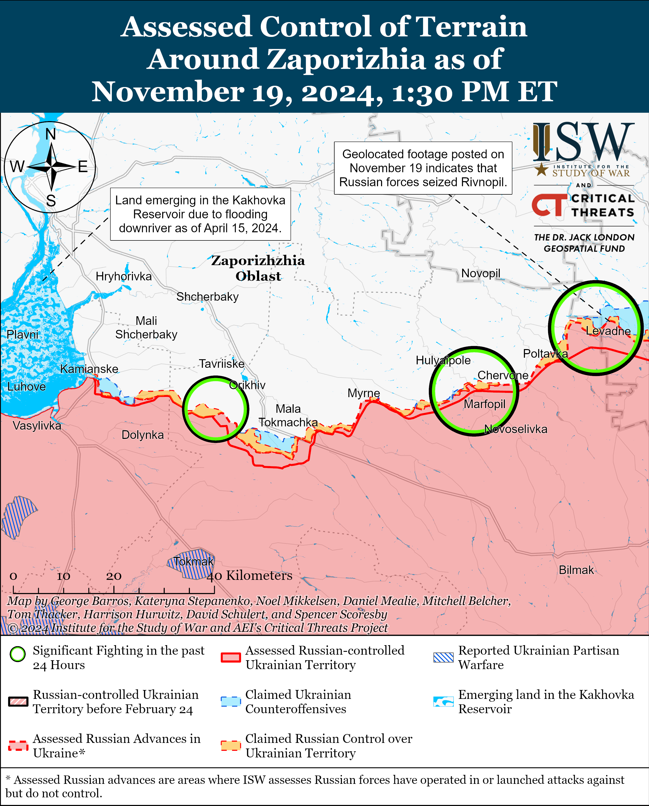
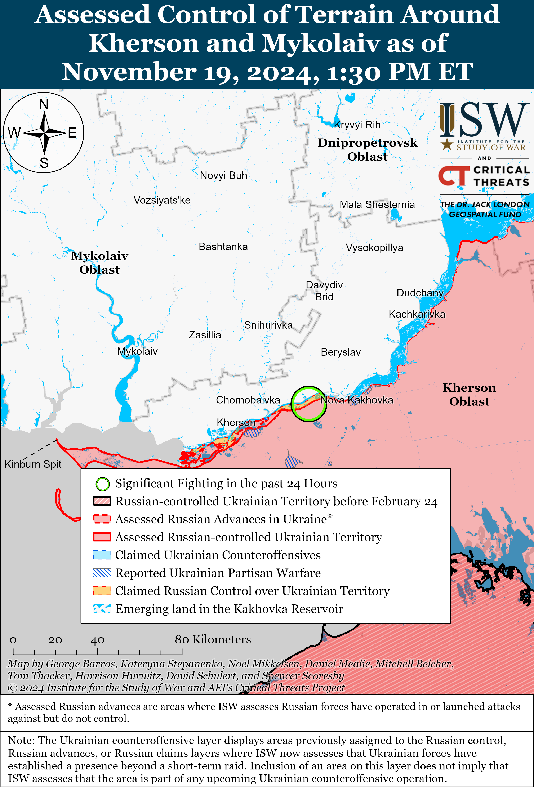

# Russian Offensive Campaign Assessment, November 19, 2024

**Christina Harward, Angelica Evans, Grace Mappes, Davit Gasparyan, Kateryna Stepanenko, Nicole Wolkov, Olivia Gibson, Karolina Hird, Nate Trotter, William Runkle, and George Barros**

**November 19, 2024, 2:45pm ET**

**Click** [**here**](https://storymaps.arcgis.com/stories/36a7f6a6f5a9448496de641cf64bd375) **to see ISW’s interactive map of the Russian invasion of Ukraine. This map is updated daily alongside the static maps present in this report.**

**Click** [**here**](https://understandingwar.maps.arcgis.com/apps/instant/3dviewer/index.html?appid=1602762dbcde419bb957dea358449580) **to see ISW’s 3D control of terrain topographic map of Ukraine. Use of a computer (not a mobile device) is strongly recommended for using this data-heavy tool.**

**Click** [**here**](https://storymaps.arcgis.com/stories/733fe90805894bfc8562d90b106aa895) **to access ISW’s archive of interactive time-lapse maps of the Russian invasion of Ukraine. These maps complement the static control-of-terrain map that ISW produces daily by showing a dynamic frontline. ISW will update this time-lapse map archive monthly.**

**Note: The data cut-off for this product was 9:45am ET on November 19. ISW will cover subsequent reports in the November 20 Russian Offensive Campaign Assessment.**

**Ukrainian forces have defended against Russia’s full-scale invasion for 1,000 days and continue to demonstrate incredible resilience against Russian aggression.** Russia invaded Ukraine on February 24, 2022 under the incorrect assumption that Ukraine would fail to defend itself and that Russian forces would be able to seize Kyiv City and install a pro-Russian proxy government in three days.[1] One thousand days later, Ukrainian forces have successfully pushed Russian forces from their most forward points of advance in Zhytomyr, Kyiv, Chernihiv, Sumy, Kharkiv, Kherson, Poltava, and Mykolaiv oblasts and continue their daily fight to liberate occupied territory in Kharkiv, Luhansk, Donetsk, Zaporizhia, Mykolaiv, and Kherson oblasts and Crimea.[2] Russian forces are currently advancing throughout eastern Ukraine, and Ukrainian officials have recently warned about the possibility of an imminent Russian offensive operation in Zaporizhia Oblast.[3] Russian President Vladimir Putin is simultaneously waging an informational war against the West, Ukraine, and the Russian population aimed at convincing the world that Russian victory is inevitable, and that Ukraine stands no chance.[4] This informational effort is born out of Putin’s fear and understanding that sustained Western military, economic, and diplomatic support for Ukraine will turn the tide of the war against Russia.

Russia has accumulated a significant amount of risk and a number of ever-increasing constraints on its warfighting capabilities over the last 1,000 days. Russia began the war with a poorly organized and understaffed military comprised of contract military personnel and limited number of conscripts due to his incorrect assumption that Ukraine would fold and fear that general mobilization could threaten the stability of his regime.[5] Russia largely relied on a combination of volunteer contract servicemembers, mobilized personnel, and irregular formations (such as the Donetsk and Luhansk People’s Republic Army Corps [DNR/LNR AC], the Wagner Group, and Russian Volunteer Corps) to wage Putin’s war without general mobilization.[6] This system has provided the Kremlin the manpower necessary to support operations so far, but there are mounting indicators that this system is beginning to teeter. Recent Western estimates of Russian manpower losses suggest that Russian forces are currently losing more troops per month than Russia’s ongoing crypto-mobilization efforts can sustain, and open-source evidence indicates that Russia may not be able to sustain its current rate of armored vehicle and tank losses in the medium term as Russia burns through its stockpiles of Soviet-era equipment.[7] The upcoming 2025 year will only increase the manpower and materiel constraints on the Russian military if Russia attempts to sustain its current offensive tempo, and Putin continues to appear averse to such measures given Russian society’s growing disinterest in fighting in Russia’s war, the Russian economy’s limitations including a significant labor deficit and high inflation, and continual aversion to bearing the burden of additional wartime costs.[8] Russia cannot maintain its current tempo indefinitely. Putin will likely need to take disruptive and drastic measures – including another involuntary call up of the mobilization reserve – to overcome these growing limitations as the war protracts.

**Ukraine, meanwhile, continues to improve its warfighting capabilities and prepare itself to be self-sustainable in the long term.** Ukrainian President Volodymyr Zelensky presented Ukraine’s “Internal Resilience Plan” to the Verkhovna Rada (parliament) on November 19.[9] The plan is comprised of 10 points that establish Ukraine’s strategic objectives during and after the end of Russia’s full-scale invasion.[10] The core points of the plan outline Ukraine’s focus on maintaining unity and cooperation with its partners; specific measures to stabilize the frontline and increase Ukrainian military’s technological efficiency; the expansion of Ukraine’s domestic industrial base (DIB) production capabilities and joint DIB partnerships; the establishment of an economic policy to support Ukrainian industries and businesses; the protection of Ukraine’s energy infrastructure; and the establishment of a new internal and border security system. The plan also outlines a vision to create effective local administrations, improve social and veteran policies, and strengthen Ukraine’s cultural sovereignty both domestically and abroad. Zelensky emphasized in his speech to the Verkhovna Rada that Ukraine has taken many steps to improve its DIB and has already produced over 2.5 million mortar and artillery rounds in 2024.[11] Zelensky added that Ukraine plans to produce at least 3,000 cruise missiles and 30,000 long-range drones in 2025 and that Ukrainian brigades should raise their own funding to appropriately supply themselves with drones without bureaucratic limitations. Ukrainian Prime Minister Denys Shmyhal announced on November 19 that the Verkhovna Rada approved the 2025 defense and security budget of 2.23 trillion hryvnias (around $54 billion) and allocated a record-breaking 739 billion hryvnias (around $17.9 billion) for the Ukrainian DIB and weapon procurement.[12] ISW continues to assess that Ukraine has a chance to dramatically expand its DIB and stand on its own two feet in the future if its partners empower Ukraine now.[13]

**Ukrainian forces conducted the first ATAMCS strike on Russian territory overnight on November 18 to 19, hitting a Russian ammunition depot in Karachev, Bryansk Oblast – days after obtaining permission to conduct such strikes.** Ukrainian military officials, including the Ukrainian General Staff, reported on November 19 that Ukrainian forces struck the Russian military’s 67th Main Military and Artillery Directorate (GRAU) arsenal of the 1046th Logistics Support Center near Karachev on the night of November 18 to 19 and that the strike caused an initial detonation and 12 secondary explosions.[14] A Ukrainian military source told Ukrainian outlet *RBK-Ukraine* on November 19 that Ukrainian forces used US-provided ATACMS missiles to conduct the strike.[15] Head of Ukraine’s Center for Combatting Disinformation Lieutenant Andriy Kovalenko stated that the 67th GRAU arsenal contained artillery ammunition, including North Korean-provided shells, as well as guided glide bombs, air defense missiles, and rockets for multiple launch rocket launchers (MLRS).[16] The Russian Ministry of Defense (MoD) claimed that Ukrainian forces launched six ballistic missiles, including ATACMS, at a military facility in Bryansk Oblast and that Russian S-400 and Pantsir air defense systems shot down five missiles and damaged one.[17] The Russian MoD claimed that missile fragments fell onto a military facility in Bryansk Oblast, causing a fire, but that the strike did not cause any damages or casualties. Russian opposition outlet *Astra* stated that Ukrainian forces also struck the “Veza” ventilation plant and buildings in Karachev, Podsosonki, and Baykova.[18] Russian sources posted footage purportedly showing the ATACMS strike and its aftermath.[19]

Western officials also provided additional clarity on Ukraine’s ability to use Western-provided long-range weapons systems to strike military objects in Russia. EU High Commissioner Josep Borrell stated on November 18 that the US authorized Ukraine’s use of US-provided weapons up to 300 kilometers inside Russia.[20] US Assistant Secretary of State Brian Nichols told Brazilian outlet *O Globo* on November 19 that US President Biden issued the authorization for Ukraine to use US-provided weapons to strike into Russia, stating that the authorization will give Ukraine a greater ability to defend itself.[21] ISW previously assessed that restrictions on Ukraine’s ability to conduct long-range strikes into Russian territory enabled Russia to maintain sanctuary space within its near and far-rear and leverage that sanctuary space for its military operations against Ukraine.[22] Ukrainian long-range strikes against military objects within Russia’s rear are crucial for degrading Russian military capabilities throughout the theater.[23] These permissions, if as extensive as reported, are a new capability for Ukraine that may significantly degrade Russia’s war effort.

**Russian President Vladimir Putin signed Russia’s updated nuclear doctrine on November 19 in a clear response to the Biden Administration’s decision to greenlight long-range strikes into Russia and as part of Putin’s ongoing efforts to influence Western decision-makers into shying away from providing additional support to Ukraine.** Putin signed the decree “On approval of the fundamentals of the state policy of the Russian Federation in the field of nuclear deterrence” after stating in September 2024 that Russia was adjusting its nuclear doctrine to introduce “clarifications” on the necessary preconditions for Russian nuclear use.[24] Russia last updated its nuclear doctrine in June 2020.[25] The 2024 doctrine states that Russia will exercise nuclear deterrence against states that provide “territory, air, and/or sea space and resources under their control” for the preparation and implementation of aggression against Russia; will consider aggression against Russia by any state that is part of a military coalition, bloc, or alliance as aggression by the entire coalition; and will consider aggression against Russia and/or its allies by a non-nuclear state with the participation or support of a nuclear state as a joint attack on Russia.[26] The new doctrine added additional considerations to list of the “main military dangers that may develop into military threats” to Russia and against which Russia will carry out nuclear deterrence to include: the creation of new or expansion of existing military coalitions, blocs, or alliances that results in the coalition’s military infrastructure “approaching” Russia’s border; actions aimed at isolating part of Russia’s territory, including the blocking of access to vital transport communications; actions aimed at the destruction of ecological hazardous objects in Russia; and the planning and conducting large-scale military exercises near Russia’s border. The new doctrine states that Russia maintains the “possibility” of using nuclear weapons in the event of aggression against Belarus or Russia’s receipt of reliable information about a “massive” launch or take-off of air and space attack weapons, including strategic and tactical aircraft, cruise missiles, unmanned aircraft, and hypersonic aircraft, and their crossing of the Russian state border. The new doctrine retains the same language as the 2020 doctrine describing Russia’s receipt of information about the launch of ballistic missiles attacking Russian territory or the territory or Russian allies as a condition “determining the possibility of Russia’s use of nuclear weapons,” and this language regarding ballistic missiles thus does not represent an inflection in Russia’s nuclear doctrine despite some reporting suggesting otherwise. The updated doctrine no longer states that Russia regards nuclear weapons “solely” as a means of deterrence and adds that Russia will exercise nuclear deterrence against “potential” enemies.

**Russia’s adoption of an amended nuclear doctrine is the latest iteration of now-frequent Russian nuclear saber-rattling and does not represent a substantial change in Russia’s nuclear posture, doctrine, or the threat of the employment of nuclear weapons.** US Central Intelligence Agency (CIA) Director William Burns cautioned Western policymakers on September 7 against fearing boilerplate Russian nuclear saber-rattling.[27] *Bloomberg* reported on November 19 that an unspecified US National Security Council spokesperson stated that the US sees no reason to adjust its nuclear posture and that the Russian decision to adjust its doctrine was not a surprise and is a continuation of the same “irresponsible rhetoric” that Russia has used since invading Ukraine in 2022.[28] Deputy Pentagon Press Secretary Sabrina Singh stated on November 18 that any Russian saber-rattling is “incredibly dangerous” and “reckless.”[29] Singh stated that the US will continue to monitor Russian saber-rattling but has not seen any changes in Russia’s nuclear posture. ISW continues to assess that Russia is very unlikely to use nuclear weapons in Ukraine or elsewhere.[30]

**The Kremlin has continuously attempted to use nuclear saber-rattling to deter Western military support for Ukraine, and the Kremlin’s ongoing efforts to inject nuclear threats into the information space indicates that the Kremlin is concerned about the battlefield impacts of Ukrainian strikes into Russia with Western-provided weapons.** The *Washington Post* reported in September 2024 that the Kremlin may be reconsidering the effectiveness of its nuclear saber-rattling in influencing Western decision-making against supporting Ukraine.[31] The Kremlin, however, has continued to use its same boilerplate nuclear threats in an attempt to dissuade Western decisionmakers from lifting restrictions on Ukraine’s use of Western-provided weapons to strike legitimate military objects in Russia, indicating that the Kremlin fears the prospect of long-range Ukrainian strikes into Russia. The Kremlin has routinely intensified its nuclear saber-rattling during key Western discussions about military assistance to Ukraine but has never previously escalated against any perceived Western violations of Russia’s “red lines.”[32] A prominent Kremlin-affiliated Russian milblogger responded to the updated Russian nuclear doctrine on November 19, complaining that Western countries no longer fear the Kremlin’s nuclear threats and that the West’s lack of fear is “narrowing Russia’s room for maneuver.”[33] The milblogger attributed this Western lack of fear to the Kremlin’s unresponsiveness to prior Ukrainian strikes against military objects within Russia – one of the Kremlin’s prior so-called red lines.[34] Other Russian milbloggers stated that they are waiting for the Russian government to react to the Ukrainian ATACMS strike in Bryansk Oblast on November 19.[35] The Kremlin has not clearly responded to the ATACMS strike as of this writing.

**The contours of the Kremlin’s nuclear blackmail remain unchanged despite the updates to Russia’s nuclear doctrine, and factions within the Kremlin are reportedly arguing over a lack of clarity about Russia’s own nuclear “red lines.”** A Russian insider source claimed on November 19 that Kremlin factions disagreed on the changes to the nuclear doctrine, with one faction arguing for the new nuclear doctrine to define clear “red lines” to deter the West from taking specific actions unfavorable to the Kremlin and another faction calling for the creation of a strategically ambiguous nuclear doctrine “in the fog of war” to prevent the West from being able to predict the Kremlin’s response to specifications.[36] These reports, taken in the context of the Kremlin’s continued reliance on vague threats of nuclear escalation without following through, suggests that Russian officials lack a clear understanding of where the Kremlin’s actual “red lines” lie. **The updated Russian nuclear doctrine remains vague, and actions by Russia’s “potential enemies” as defined in the new doctrine will almost certainly not immediately trigger Russian nuclear weapons use. The decision to use Russian nuclear weapons lies with Putin, who has and will personally decide where Russia’s “red lines” truly lie and how to respond – or not respond – to Western support of Ukraine.**

**Ukraine only recently has started receiving the weapons systems and military capabilities necessary to wage modern large-scale combat operations, and Ukraine may be able to conduct operationally significant counteroffensives in the future, provided the West reinforces building Ukrainian capabilities at scale.** US officials are only now seriously evaluating depriving Russia of a sanctuary from which Russia wages war against Ukraine. Ukrainian forces only received F-16s and pilot training to operate F-16s in small quantities in 2024.[37] Ukrainian forces only received ATACMS for the first time in fall 2023 after Ukraine’s 2023 counteroffensive effectively culminated.[38] Ukrainian forces only received Western main battle tanks in small quantities for the first time in early 2023.[39] The systems and capabilities that Ukraine has been receiving are all necessary to wage successful multi-domain large-scale-combat operations, and Ukraine has not yet been provided an opportunity to demonstrate what Ukrainian forces can achieve when properly resourced. Ukraine’s systems integration, capabilities, and battlefield performance likely can improve, provided Ukraine and its partners continue undertaking the difficult work necessary to build Ukrainian momentum.

Continued and enhanced Western military assistance remains necessary for Ukrainian forces to liberate occupied territory and inflict losses on the Russian military necessary to force Putin to rethink his calculus for this war. Ukraine must enter any future negotiations with Russia from a position of strength given the Kremlin’s persistent refusal to engage in good-faith negotiations and its repeated calls for complete Ukrainian capitulation.[40] Ukrainian determination and innovation alone likely cannot bring about these conditions, and it remains in the West’s interests to strengthen Ukraine’s position at any potential future negotiating table.

**Key Takeaways:**

- **Ukrainian forces have defended against Russia’s full-scale invasion for 1,000 days and continue to demonstrate incredible resilience against Russian aggression.**
- **Ukraine continues to improve its warfighting capabilities and prepare itself to be self-sustainable in the long term.**
- **Ukrainian forces conducted the first ATAMCS strike on Russian territory overnight on November 18 to 19, hitting a Russian ammunition depot in Karachev, Bryansk Oblast — days after obtaining permission to conduct such strikes.**
- **Russian President Vladimir Putin signed Russia’s updated nuclear doctrine on November 19 in a clear response to the Biden Administration’s decision to greenlight long-range strikes into Russia and as part of Putin’s ongoing efforts to influence Western decision-makers into shying away from providing additional support to Ukraine.**
- **Russia’s adoption of an amended nuclear doctrine is the latest iteration of now-frequent Russian nuclear saber-rattling and does not represent a substantial change in Russia’s nuclear posture, doctrine, or the threat of the employment of nuclear weapons.**
- **The Kremlin has continuously attempted to use nuclear saber-rattling to deter Western military support for Ukraine, and the Kremlin’s ongoing efforts to inject nuclear threats into the information space indicates that the Kremlin is concerned about the battlefield impacts of Ukrainian strikes into Russia with Western-provided weapons.**
- **Ukraine only recently has started receiving the weapons systems and military capabilities necessary to wage modern large-scale combat operations, and Ukraine may be able to conduct operationally significant counteroffensives in the future, provided the West reinforces building Ukrainian capabilities at scale.**
- **Russian forces recently advanced in the main Ukrainian salient in Kursk Oblast and in the Donetsk-Zaporizhia Oblast border area, and Ukrainian forces recently advanced north of Kharkiv City.**

***We do not report in detail on Russian war crimes because these activities are well-covered in Western media and do not directly affect the military operations we are assessing and forecasting. We will continue to evaluate and report on the effects of these criminal activities on the Ukrainian military and the Ukrainian population and specifically on combat in Ukrainian urban areas. We utterly condemn Russian violations of the laws of armed conflict and the Geneva Conventions and crimes against humanity even though we do not describe them in these reports.***

- Ukrainian Operations in the Russian Federation
- Russian Main Effort – Eastern Ukraine (comprised of three subordinate main efforts)
- Russian Subordinate Main Effort #1 – Push Ukrainian forces back from the international border with Belgorod Oblast and approach to within tube artillery range of Kharkiv City
- Russian Subordinate Main Effort #2 – Capture the remainder of Luhansk Oblast and push westward into eastern Kharkiv Oblast and encircle northern Donetsk Oblast
- Russian Subordinate Main Effort #3 – Capture the entirety of Donetsk Oblast
- Russian Supporting Effort – Southern Axis
- Russian Air, Missile, and Drone Campaign
- Russian Mobilization and Force Generation Efforts
- Russian Technological Adaptations
- Activities in Russian-occupied areas
- Significant Activity in Belarus

**Ukrainian Operations in the Russian Federation**

Russian forces recently advanced in the main Ukrainian salient in Kursk Oblast amid continued fighting in the area on November 19. Geolocated footage published on November 19 indicates that Russian forces recently advanced northeast of Nizhny Klin (southeast of Korenevo).[41] Russian milbloggers claimed that Russian forces advanced near the Olgovka forest (southeast of Korenevo); near Olgovka and Kremyanoye (both east of Korenevo); and on the eastern outskirts of Plekhovo (south of Sudzha).[42] ISW has not observed confirmation of these claims, however. Russian forces conducted offensive operations near Novoivanovka (southeast of Korenevo) and Sverdlikovo (northwest of Sudzha).[43] Russian sources claimed that Ukrainian forces counterattacked near Novoivanovka, Darino (southeast of Korenevo), and Plekhovo.[44] Russian milbloggers continued to claim that Ukrainian forces are unsuccessfully trying to break out of a Russian encirclement near the Olgovka forest.[45] The spokesperson for the Ukrainian commandant’s office in Sudzha reported on November 19 that Russian tactics have somewhat changed in Kursk Oblast and that Russian forces are starting to attack at nighttime as opposed to early in the morning.[46]

Neither Russian nor Ukrainian sources reported fighting in Glushkovsky Raion west of the main Ukrainian salient in Kursk Oblast on November 19. Elements of the Russian 106th Airborne (VDV) Division are reportedly operating near Novy Put (southwest of Glushkovo).[47]

US Deputy Pentagon Press Secretary Sabrina Singh stated on November 18 that the US assesses that there are over 11,000 North Korean troops are “moving into” Kursk Oblast.[48] Singh stated that US officials stated last week that there were between 10,000 and 11,000 North Korean troops in Kursk Oblast but that the Pentagon is “a little bit more confident” that the number is on the higher end of that range. Singh stated that more North Korean forces could be on the way to Kursk Oblast but noted that the US has not observed indications of additional deployments of North Korean troops to Russia.

**Russian Main Effort – Eastern Ukraine**

**Russian Subordinate Main Effort #1 – Kharkiv Oblast** **(Russian objective: Push Ukrainian forces back from the international border with Belgorod Oblast and approach to within tube artillery range of Kharkiv City)**

Ukrainian forces recently advanced north of Kharkiv City on November 19. Geolocated footage published on November 19 indicates that Ukrainian forces advanced into a forested area southeast of Hlyboke (north Kharkiv City).[49] Russian forces continued offensive operations north of Kharkiv City near Lyptsi and Hlyboke and northeast of Kharkiv City near Vovchansk on November 18 to 19.[50] A Ukrainian battalion commander operating in the Kharkiv direction reported that Russian forces are suffering disproportionate losses to make tactical gains and stated that in one attack Russian forces suffered 139 casualties while trying to seize 200 meters of terrain.[51] The Ukrainian battalion commander reported that Russian forces’ abilities to maintain a high tempo of assaults while sustaining significant manpower losses will depend on the effectiveness of Ukrainian countermeasures. Elements of the Chechen ”Zapad-Akhmat” Battalion (Southern Military District [SMD]), units of the Chechen Kurchaloevsky Raion’s Ministry of Internal Affairs (MVD), the Russian 128th BARS Brigade (Russian Army Combat Reserve) Brigade, and the Russian 6th Combined Arms Army (CAA) (Leningrad Military District [LMD]) are reportedly operating in the Kharkiv direction.[52]

**Russian Subordinate Main Effort #2 – Luhansk Oblast** **(Russian objective: Capture the remainder of Luhansk Oblast and push westward into eastern Kharkiv Oblast and northern Donetsk Oblast)**

Russian forces continued ground assaults along the Kupyansk-Svatove-Kreminna line on November 19 but did not make confirmed advances. Russian sources claimed that Russian forces continued fighting in the industrial zone in eastern Kupyansk and that Russian forces also advanced north of Kupyansk.[53] The commander of a Ukrainian brigade operating near Kupyansk stated that the Russian military command originally ordered Russian forces to enter Kupyansk-Vuzlovyi (south of Kupyansk) and advance to the east (left) bank of the Oskil River by November 1 and have since extended that deadline to January 1, 2025.[54] The brigade commander noted that Russian forces have a limited presence in Kruhlyakivka (southeast of Kupyansk and on the east bank of the Oskil River) and are trying to advance towards Kolesnykivka (north of Kruhlyakivka), but have not established enduring positions in the area. Russian sources also claimed that heavy Russian indirect fire has cut off Ukrainian logistics lines supporting a Ukrainian grouping near Yampolivka (northwest of Kremmina).[55] Russian forces continued offensive operations north of Kupyansk near Kindrashivka; southeast of Kupyansk near Lozova and Kruhlyakivka; northwest of Kreminna near Hrekivka, Novoyehorivka, Terny, and Novolyubivka; and west of Kreminna near Torske on November 18 and 19.[56] Russian sources claimed on November 19 that Russian forces struck Kupyansk with a new “OFZAB-500” fragmentation incendiary guided glide bomb for the first time.[57]

**Russian Subordinate Main Effort #3 – Donetsk Oblast** **(Russian objective: Capture the entirety of Donetsk Oblast, the claimed territory of Russia’s proxies in Donbas)**

Russian forces continued assaults northeast of Siversk near Bilohorivka on November 18 and 19 but did not advance.[58]

Russian forces continued offensive operations south of Chasiv Yar near Stupochky on November 19 but did not make any confirmed advances.[59] Russian milbloggers claimed on November 19 that Russian forces advanced along Dmytra Skrypnychenka and Parkova streets in eastern Chasiv Yar, but ISW has not observed confirmation of these claims.[60] Elements of the Russian 98th Airborne (VDV) Division, 200th Motorized Rifle Brigade (14th Army Corps [AC], Leningrad Military District [LMD]), the 88th “Hispaniola” Volunteer Brigade (Russian Volunteer Corps), and other unspecified elements of the Russian Volunteer Corps are reportedly operating in Chasiv Yar.[61]

Russian forces continued limited offensive operation near Toretsk itself, northeast of Toretsk near Druzhba, and west of Toretsk near Shcherbynivka on November 18 and 19 but did not advance.[62] A Ukrainian brigade operating in the Toretsk direction reported that they seized positions in an unspecified part of Toretsk during a surprise attack and took Russian prisoners of war (POWs).[63] A Russian milblogger claimed that Russian forces consolidated their positions in the eastern part of the Zabalka Microraion of southeastern Toretsk and are advancing westward, although ISW has not observed confirmation of recent Russian advances in this area.[64]

Russian forces continued offensive operations in the Pokrovsk direction on November 19 but did not advance. Russian milbloggers claimed that Russian forces are advancing west and northwest of Selydove (southeast of Pokrovsk) and in northern Petrivka (west of Selydove and south of Pokrovsk).[65] One milblogger also claimed that Russian forces repelled a Ukrainian counterattack west of Krasnyi Yar (southeast of Pokrovsk).[66] A Ukrainian battalion posted footage on November 18 of Ukrainian forces capturing and clearing a Russian dugout near Novohrodivka (southeast of Pokrovsk) on an unspecified date.[67] The Ukrainian General Staff reported that Russian forces conducted ground attacks east of Pokrovsk near Promin and Myrolyubivka; south of Pokrovsk near Petrivka, Dachenske, and Pustynka; and southeast of Pokrovsk near Lysivka and Novooleksiivka.[68]

Russian sources claimed on November 19 that Russian forces advanced north of Kurakhove, but ISW has not yet observed confirmation of these claims. The Russian Ministry of Defense (MoD) claimed that Russian forces seized Novoselydivka (north of Kurakhove), and a Russian milblogger claimed that Russian forces advanced to central Berestky (north of Kurakhove and on the northern bank of the Kurakhivske Reservoir).[69] Russian forces reportedly continued to attack near Kurakhove itself; northwest of Kurakhove near Sontsivka and Voznesenka; north of Kurakhove near Novoselydivka and Berestky; and south of Kurakhove near Dalne on November 18 and 19.[70] Ukrainian Mariupol Mayoral Advisor Petro Andryushchenko reported that the Russian military command additionally transferred “Storm V” penal assault detachments from Russian training grounds along the occupied Mariupol-Berdyansk line towards occupied Volnovakha (north of Mariupol), likely for future redeployment to the Kurakhove direction.[71] Andryushchenko stated on November 16 that Russian forces are increasingly transporting equipment, including tanks, infantry fighting vehicles, armored personnel carriers, and trucks carrying ammunition, from the Berdyansk or Polohy directions through occupied Mariupol towards Volnovakha for offensive operations in the Kurakhove direction.[72]

Russian forces continued offensive operations in the Vuhledar direction on November 19 but did not make any confirmed advances. Russian sources claimed that Russian forces advanced near Dalne (north of Vuhledar), Yasna Polyana, and east of Rozdolne (both northwest of Vuhledar), although ISW has not observed confirmation of these claims.[73] Russian forces continued ground attacks northwest of Vuhledar near Kostyantynopolske, Trudove, and Rozdolne; and northeast of Vuhledar near Yelyzavetivka, Antonivka, and Katerynivka on November 18 and 19.[74] Elements of the Russian 57th Motorized Rifle Brigade (5th Combined Arms Army [CAA], Eastern Military District [EMD]) are operating near Trudove and elements of the 14th Spetsnaz Brigade (Russian General Staff’s Main Military Intelligence Directorate [GRU]) are reportedly operating in the Vuhledar area.[75]

Russian forces recently advanced in the Donetsk-Zaporizhia Oblast border area amid continued offensive operations in the area on November 19. Geolocated footage published on November 19 indicates that Russian forces recently seized Rivnopil (southwest of Velyka Novosilka), which the Russian Ministry of Defense (MoD) claimed that Russian forces seized around November 13.[76] Russian forces continued attacking near Velyka Novosilka itself; south of Velyka Novosilka near Makarivka; and southwest of Velyka Novosilka near Novodarivka and Rivnopil on November 18 and 19.[77] Russian forces continue to pressure Ukrainian positions in the Donetsk-Zaporizhia Oblast border area from the south and east to support Russian efforts in the Vuhledar and Kurakhove direction and advance to the southwestern most sector of Donetsk Oblast.[78]

**Russian Supporting Effort – Southern Axis** **(Russian objective: Maintain frontline positions and secure rear areas against Ukrainian strikes)**

Russian forces continued assaults in western Zaporizhia Oblast northwest of Robotyne near Novoandriivka and Nesteryanka and northeast of Robotyne near Novopokrovka and Bilohirya on November 19, but there were no confirmed changes to the frontline.[79] A Russian milblogger claimed on November 19 that Russian forces advanced northeast of Robotyne towards Mala Tokmachka, but ISW has not observed confirmation of this claim.[80]

Positional fighting continued in the Dnipro direction in east (left) bank Kherson Oblast and on the islands of the Dnipro River Delta on November 18 and 19, but there were no changes to the frontline.[81] Elements of the Russian 45th Spetsnaz Brigade (Russian General Staff’s Main Directorate [GRU]) and the BARS-33 Detachment (Russian Combat Army Reserve) are reportedly operating in the Kherson direction.[82]

Ukrainian Crimean-based partisan group “Atesh” reported on November 18 that Russian forces recently deployed a Pantsir-S1 air defense system near Komyshova and Kozacha bays near occupied Sevastopol, Crimea.[83] The “Atesh” group stated that Russian forces installed the air defense system near a Russian Black Sea Fleet (BSF) diving school, an oil depot, a Russian Ministry of Defense (MoD) restricted facility for the training of combat dolphins, logistics warehouses of the 810th Naval Infantry Brigade (BSF, Southern Military District [SMD]), a training base for Russian tank operators, and a military airfield.

**Russian Air, Missile, and Drone Campaign** **(Russian Objective: Target Ukrainian military and civilian infrastructure in the rear and on the frontline)**

Russian forces conducted a series of drone and missile strikes against Ukraine overnight on November 18 to 19. The Ukrainian Air Force reported that Russian forces launched 87 Shahed and unspecified strike drones from Kursk and Oryol oblasts and occupied Crimea.[84] The Ukrainian Air Force reported that Ukrainian forces downed 51 drones over Chernihiv, Kyiv, Poltava, Zhytomyr, Sumy, Mykolaiv, Zaporizhia, and Kharkiv oblasts. The Ukrainian Air Force reported that 30 Russian drones were lost in Ukrainian airspace, likely due to Ukrainian electronic warfare (EW) interference, and that one drone remained in Ukrainian airspace as of 900 local time. Ukrainian officials reported that two Russian Shahed drones struck a residential building in Hlukhiv, killing 12 people and injuring 11.[85] Russian sources claimed that Russian forces struck energy infrastructure in Zaporizhzhia City.[86] Zaporizhia Oblast Military Administration Head Ivan Fedorov stated on November 19 that Russian strikes caused heating and electricity outages in Zaporizhzhia City.[87]

**Russian Mobilization and Force Generation Efforts** **(Russian objective: Expand combat power without conducting general mobilization)**

*ISW is not publishing coverage of Russian mobilization and force generation efforts today.*

**Russian Technological Adaptations** **(Russian objective: Introduce technological innovations to optimize systems for use in Ukraine)**

*ISW is not publishing coverage of Russian technological adaptations today.*

**Activities in Russian-occupied areas** **(Russian objective: Consolidate administrative control of annexed areas; forcibly integrate Ukrainian citizens into Russian sociocultural, economic, military, and governance systems)**

*ISW is not publishing coverage of activities in Russian-occupied areas today.*

**Significant activity in Belarus** **(Russian efforts to increase its military presence in Belarus and further integrate Belarus into Russian-favorable frameworks and Wagner Group activity in Belarus)**

*ISW is not publishing coverage of significant activity in Belarus today.*

**Note: ISW does not receive any classified material from any source, uses only publicly available information, and draws extensively on Russian, Ukrainian, and Western reporting and social media as well as commercially available satellite imagery and other geospatial data as the basis for these reports. References to all sources used are provided in the endnotes of each update.**

[1] https://understandingwar.org/backgrounder/weakness-lethal-why-putin-invaded-ukraine-and-how-war-must-end; https://www.nytimes.com/interactive/2022/12/16/world/europe/russia-putin-war-failures-ukraine.html; https://understandingwar.org/backgrounder/russia-ukraine-warning-update-russian-offensive-campaign-assessment-february-26; https://understandingwar.org/backgrounder/russian-offensive-campaign-assessment-april-1;

[2] https://understandingwar.org/backgrounder/ukraine%E2%80%99s-sustained-counteroffensive-denying-russia%E2%80%99s-prolongation-war ; https://understandingwar.org/backgrounder/how-delays-western-aid-gave-russia-initiative-ukrainian-counteroffensive-kharkiv; https://understandingwar.org/backgrounder/russian-offensive-campaign-assessment-august-29 ;https://understandingwar.org/backgrounder/russian-offensive-campaign-assessment-september-10 ; https://understandingwar.org/backgrounder/russian-offensive-campaign-assessment-june-5; https://understandingwar.org/backgrounder/russian-offensive-campaign-assessment-march-18

; https://understandingwar.org/backgrounder/russian-offensive-campaign-assessment-september-18-2023

[3] https://isw.pub/UkrWar111224

[4] https://understandingwar.org/backgrounder/russian-offensive-campaign-assessment-august-21-2024-0 ; https://understandingwar.org/backgrounder/denying-russia%E2%80%99s-only-strategy-success

[5] https://understandingwar.org/backgrounder/explainer-russian-conscription-reserve-and-mobilization

[6] https://understandingwar.org/backgrounder/russian-offensive-campaign-assessment-september-21 ; https://understandingwar.org/backgrounder/russian-offensive-campaign-assessment-december-14-2023; https://understandingwar.org/wp-content/uploads/2024/11/Russian20Operations20Assessments20October2027.pdf ; https://understandingwar.org/backgrounder/kremlin%E2%80%99s-pyrrhic-victory-bakhmut-retrospective-battle-bakhmut; https://understandingwar.org/backgrounder/russian-offensive-campaign-assessment-august-29-2024; https://understandingwar.org/backgrounder/russian-offensive-campaign-assessment-september-21-2024; https://understandingwar.org/backgrounder/russian-offensive-campaign-assessment-september-19-2024

[7] https://understandingwar.org/backgrounder/russian-offensive-campaign-assessment-november-9-2024 ; https://isw.pub/UkrWar100624

[8] https://isw.pub/UkrWar082924; https://understandingwar.org/backgrounder/russian-offensive-campaign-assessment-august-21-2024-0; https://understandingwar.org/backgrounder/russian-offensive-campaign-assessment-february-26-2023; https://understandingwar.org/backgrounder/russian-offensive-campaign-assessment-march-12-2023; https://understandingwar.org/backgrounder/russian-offensive-campaign-assessment-august-10-2024; https://understandingwar.org/backgrounder/russian-offensive-campaign-assessment-october-29-2024; https://understandingwar.org/backgrounder/russian-offensive-campaign-assessment-october-15-2024

[9] https://suspilne dot media/883125-zelenskij-u-radi-predstavlae-vnutrisnij-plan-stijkosti-ukraini/; https://suspilne dot media/883359-zelenskij-doruciv-priznaciti-vijskovogo-ombudsmana-najblizcim-casom/; https://suspilne dot media/883301-u-2025-roci-ukraina-vigotovit-sonajmense-30-tisac-dalekobijnih-droniv-zelenskij/ ; https://meduza dot io/news/2024/11/19/zelenskiy-v-1000-y-den-voyny-predstavil-plan-stoykosti-10-punktov-kotorye-pomogut-ukraine-vystoyat-v-voyne ; https://www.president dot gov.ua/news/mi-mayemo-ne-dopustiti-shob-htos-u-sviti-zasumnivavsya-u-sti-94497; https://www.pravda dot com.ua/rus/news/2024/11/19/7485253/; https://t.me/NgP\_raZVedka/19562

[10] https://www.president dot gov.ua/news/volodimir-zelenskij-predstaviv-plan-vnutrishnoyi-stijkosti-u-94505

[11] https://www.president.gov dot ua/news/mi-mayemo-ne-dopustiti-shob-htos-u-sviti-zasumnivavsya-u-sti-94497

[12] https://t.me/Denys\_Smyhal/8908

[13] https://understandingwar.org/backgrounder/ukraine%E2%80%99s-long-term-path-success-jumpstarting-self-sufficient-defense-industrial-base

[14] https://t.me/GeneralStaffZSU/18769 ; https://www.facebook.com/GeneralStaff.ua/posts/pfbid06LXaYxk8CBzTtgKTLtBAD5HfSNNCKfV2wEpwuN4YLr32q8mztKd4p3S9Cjb1tWLcl ; https://ua.krymr.com/a/news-minoborony-rf-brianska-oblast-zsu-udar-raketamy-atacms/33208282.html; https://t.me/akovalenko1989/8308

[15] https://www.rbc dot ua/ukr/news/ukrayina-vpershe-vdarila-atacms-teritoriyi-1732007549.html

[16] https://www.rbc dot ua/ukr/news/ukrayina-vpershe-vdarila-atacms-teritoriyi-1732007549.html ; https://t.me/akovalenko1989/8308

[17] https://t.me/mod\_russia/45908

[18] https://t.me/astrapress/68814

[19] https://t.me/milinfolive/135316; https://t.me/motopatriot/29560 ; https://t.me/milinfolive/135329

[20] https://kyivindependent dot com/borrell-confirms-us-authorization-for-ukraine-to-strike-deep-into-russia-with-missiles-up-to-300-km-in-range/; https://newsroom.consilium.europa.eu/events/20241118-foreign-affairs-council-november-2024/146578-6-press-conference-part-6-q-a-20241118; https://meduza dot io/en/news/2024/11/19/e-u-foreign-policy-chief-confirms-u-s-authorized-kyiv-to-use-american-weapons-for-strikes-up-to-300-km-inside-russian-territory ; https://t.me/tass\_agency/285986 ; https://t.me/tass\_agency/285987; https://www.ukrinform dot ua/rubric-polytics/3928725-kraini-es-mozut-dozvoliti-ukraini-vikoristovuvati-zbrou-proti-cilej-v-rosii-borrel.html; https://meduza dot io/news/2024/11/18/borrel-podtverdil-chto-ssha-razreshili-kievu-nanosit-udary-po-tselyam-v-rossii-raketami-dalnostyu-do-300-kilometrov

[21] https://www.themoscowtimes dot com/2024/11/19/us-confirms-authorization-for-ukraine-to-use-long-range-missiles-against-russia-a87062; https://oglobo/ dot globo.com/mundo/g20-no-brasil/noticia/2024/11/19/uso-de-misseis-de-longo-alcance-pela-ucrania-pode-forcar-russia-a-negociar-paz-defende-lider-diplomatico-dos-eua-para-o-ocidente.ghtml; https://t.me/tass\_agency/286104 ; https://meduza dot io/news/2024/11/19/v-gosdepe-ssha-ne-stali-otritsat-chto-bayden-razreshil-ukraine-ispolzovat-dalnoboynye-rakety-dlya-udarov-po-rossii

[22] https://understandingwar.org/backgrounder/russian-offensive-campaign-assessment-november-18-2024; https://understandingwar.org/backgrounder/russian-offensive-campaign-assessment-november-17-2024;

[23] https://understandingwar.org/backgrounder/russian-offensive-campaign-assessment-august-24-2024; https://understandingwar.org/wp-content/uploads/2024/11/Hundreds20of20Russian20Military20Objects20in20Range20of20ATACMS20PDF.pdf

[24] http://publication.pravo dot gov.ru/document/0001202411190001 ; http://www.kremlin dot ru/events/president/news/75598; https://isw.pub/UkrWar092524

[25] http://www.kremlin dot ru/acts/bank/45562; https://meduza dot io/feature/2024/11/19/chto-konkretno-putin-izmenil-v-politike-rf-v-oblasti-yadernogo-sderzhivaniya

[26] https://meduza dot io/feature/2024/11/19/chto-konkretno-putin-izmenil-v-politike-rf-v-oblasti-yadernogo-sderzhivaniya; http://publication.pravo dot gov.ru/document/0001202411190001

[27] https://isw.pub/UkrWar092524

[28] https://www.bloomberg.com/news/articles/2024-11-19/us-won-t-adjust-posture-after-russia-lowers-nuclear-threshold?embedded-checkout=true

[29] https://www.defense.gov/News/Transcripts/Transcript/Article/3968387/deputy-pentagon-press-secretary-sabrina-singh-holds-an-off-camera-on-the-record/

[30] https://isw.pub/UkrWar092524; https://understandingwar.org/backgrounder/russian-offensive-campaign-assessment-september-22-2024 ; https://understandingwar.org/backgrounder/special-report-assessing-putin%E2%80%99s-implicit-nuclear-threats-after-annexation ; https://understandingwar.org/backgrounder/russian-offensive-campaign-assessment-september-8-2024

[31] https://www.washingtonpost.com/world/2024/09/22/putin-russia-red-lines-nuclear-threat-retaliation/; https://understandingwar.org/backgrounder/russian-offensive-campaign-assessment-september-22-2024; https://isw.pub/UkrWar101824; https://isw.pub/UkrWar111824; https://isw.pub/UkrWar102924;

[32] https://isw.pub/UkrWar111824; https://isw.pub/UkrWar091224; https://understandingwar.org/backgrounder/russian-offensive-campaign-assessment-september-27-2024 ; https://understandingwar.org/backgrounder/how-delays-western-aid-gave-russia-initiative-ukrainian-counteroffensive-kharkiv ; https://understandingwar.org/backgrounder/putin-vulnerable-western-policy-masks-russian-weakness

[33] https://t.me/rybar/65513

[34] https://t.me/rybar/65513;

[35] https://t.me/vysokygovorit/18043; https://t.me/notes\_veterans/20569

[36] https://t.me/kremlin\_sekret/16482

[37] https://understandingwar.org/backgrounder/russian-offensive-campaign-assessment-august-1-2024

[38] https://isw.pub/UkrWar101723 ; https://isw.pub/UkrWar092223

[39] https://news.usni.org/2023/01/17/u-k-sending-14-challenger-2-tanks-ammo-to-ukraine-foreign-minister-says ; https://www.the-independent.com/news/world/europe/british-challenger-tanks-ukraine-russia-b2309338.html

[40] https://understandingwar.org/backgrounder/russian-offensive-campaign-assessment-july-15-2024; https://understandingwar.org/backgrounder/russian-offensive-campaign-assessment-november-18-2024

[41] https://t.me/WarArchive\_ua/22443; https://t.me/pentagonkh/94

[42] https://t.me/z\_arhiv/29626; https://t.me/dva\_majors/58076; https://t.me/motopatriot/29551

[43] https://t.me/rusich\_army/18583

[44] https://t.me/dva\_majors/58076; https://t.me/motopatriot/29551

[45] https://t.me/DnevnikDesantnika/19428; https://t.me/dva\_majors/58076 ; https://understandingwar.org/backgrounder/russian-offensive-campaign-assessment-november-18-2024; https://understandingwar.org/backgrounder/russian-offensive-campaign-assessment-november-17-2024

[46] https://armyinform.com dot ua/2024/11/19/u-zsu-rozpovily-yak-rosijski-vijska-zminyly-taktyku-na-kurshhyni/ ; https://www.youtube.com/watch?v=j5TqaWCCdUg

[47] https://t.me/sashakots/50270

[48] https://www.defense.gov/News/Transcripts/Transcript/Article/3968387/deputy-pentagon-press-secretary-sabrina-singh-holds-an-off-camera-on-the-record/

[49] https://t.me/creamy\_caprice/7548; https://t.me/warriorofnorth/4249

[50] https://t.me/boris\_rozhin/144880; https://t.me/rusich\_army/18584; https://t.me/dva\_majors/58121 ; https://t.me/RVvoenkor/80958; https://t.me/dva\_majors/58076; https://t.me/otukharkiv/2670; https://www.facebook.com/GeneralStaff.ua/posts/pfbid02Fc4Mp31aMa9NUDn1h7RutFYrTHCMU9sniVD6vy8thVF4YFoiEzYAe9xpSpWRJ41vl; https://www.facebook.com/GeneralStaff.ua/posts/pfbid0hx8MUzAKXtkjfZprMnZHQqGmu3w4C4zZUDkHFYFvdbpohge5Mw2cNzkhiJH8MpDvl; https://www.facebook.com/GeneralStaff.ua/posts/pfbid038BmdXY6UzH1jug8koSf8Rk4o6yiuXzqM9HmkxfGQLAmgXhfAqPc93EmPyytwMMaBl

[51] https://www.youtube.com/watch?v=aDXWlQ2K0dM ; https://armyinform.com dot ua/2024/11/19/139-vbytyh-okupantiv-u-posadczi-v-sylah-oborony-rozpovily-pro-vtraty-rosiyan-na-harkivshhyni/

[52] https://t.me/RKadyrov\_95/5238

[53] https://t.me/tass\_agency/286053; https://t.me/tass\_agency/286133; https://t.me/Sladkov\_plus/11837

[54] https://armyinform.com dot ua/2024/11/19/vorog-ne-vykonav-postavlenyh-zavdan-na-kupyanshhyni-zablokovanyj-sylamy-oborony/; https://www.youtube.com/watch?v=aDXWlQ2K0dM

[55] https://t.me/DnevnikDesantnika/19430; https://t.me/tass\_agency/286068

[56] https://www.facebook.com/GeneralStaff.ua/posts/pfbid038BmdXY6UzH1jug8koSf8Rk4o6yiuXzqM9HmkxfGQLAmgXhfAqPc93EmPyytwMMaBl; https://www.facebook.com/GeneralStaff.ua/posts/pfbid0hx8MUzAKXtkjfZprMnZHQqGmu3w4C4zZUDkHFYFvdbpohge5Mw2cNzkhiJH8MpDvl; https://www.facebook.com/GeneralStaff.ua/posts/pfbid02Fc4Mp31aMa9NUDn1h7RutFYrTHCMU9sniVD6vy8thVF4YFoiEzYAe9xpSpWRJ41vl

[57] https://rg dot ru/2024/11/19/rv-vks-rossii-nachali-primeniat-novye-aviabomby-ofzab-500.html; https://t.me/RVvoenkor/80932

[58] https://www.facebook.com/GeneralStaff.ua/posts/pfbid038BmdXY6UzH1jug8koSf8Rk4o6yiuXzqM9HmkxfGQLAmgXhfAqPc93EmPyytwMMaBl; https://www.facebook.com/GeneralStaff.ua/posts/pfbid0hx8MUzAKXtkjfZprMnZHQqGmu3w4C4zZUDkHFYFvdbpohge5Mw2cNzkhiJH8MpDvl; https://www.facebook.com/GeneralStaff.ua/posts/pfbid02Fc4Mp31aMa9NUDn1h7RutFYrTHCMU9sniVD6vy8thVF4YFoiEzYAe9xpSpWRJ41vl

[59] https://www.facebook.com/GeneralStaff.ua/posts/pfbid038BmdXY6UzH1jug8koSf8Rk4o6yiuXzqM9HmkxfGQLAmgXhfAqPc93EmPyytwMMaBl

[60] https://t.me/RVvoenkor/80948; https://t.me/motopatriot/29553;

[61] https://t.me/motopatriot/29553; https://t.me/NeoficialniyBeZsonoV/41570

[62] https://www.facebook.com/GeneralStaff.ua/posts/pfbid038BmdXY6UzH1jug8koSf8Rk4o6yiuXzqM9HmkxfGQLAmgXhfAqPc93EmPyytwMMaBl; https://www.facebook.com/GeneralStaff.ua/posts/pfbid02Fc4Mp31aMa9NUDn1h7RutFYrTHCMU9sniVD6vy8thVF4YFoiEzYAe9xpSpWRJ41vl; https://www.facebook.com/GeneralStaff.ua/posts/pfbid0hx8MUzAKXtkjfZprMnZHQqGmu3w4C4zZUDkHFYFvdbpohge5Mw2cNzkhiJH8MpDvl

[63] https://armyinform dot com.ua/2024/11/18/zdalysya-v-polon-i-tomu-zhytymut-na-donechchyni-vyyavyly-rosijskyh-peremozhcziv-pryrodnogo-doboru/; https://t.me/ukrbavovna/18035

[64] https://t.me/RVvoenkor/80935

[65] https://t.me/RVvoenkor/80915; https://t.me/dva\_majors/58076

[66] https://t.me/DnevnikDesantnika/19446

[67] https://t.me/skalabatalion/442; https://armyinform.com dot ua/2024/11/18/vystavyly-na-dvi-pozycziyi-nashi-shturmovyky-vlashtuvaly-czilu-vystavu-zarady-uspishnogo-shturmu/

[68] https://www.facebook.com/GeneralStaff.ua/posts/pfbid038BmdXY6UzH1jug8koSf8Rk4o6yiuXzqM9HmkxfGQLAmgXhfAqPc93EmPyytwMMaBl; https://www.facebook.com/GeneralStaff.ua/posts/pfbid02Fc4Mp31aMa9NUDn1h7RutFYrTHCMU9sniVD6vy8thVF4YFoiEzYAe9xpSpWRJ41vl; https://www.facebook.com/GeneralStaff.ua/posts/pfbid0hx8MUzAKXtkjfZprMnZHQqGmu3w4C4zZUDkHFYFvdbpohge5Mw2cNzkhiJH8MpDvl

[69] https://t.me/mod\_russia/45898; https://t.me/sashakots/50263

[70] https://www.facebook.com/GeneralStaff.ua/posts/pfbid038BmdXY6UzH1jug8koSf8Rk4o6yiuXzqM9HmkxfGQLAmgXhfAqPc93EmPyytwMMaBl;https://www.facebook.com/GeneralStaff.ua/posts/pfbid02Fc4Mp31aMa9NUDn1h7RutFYrTHCMU9sniVD6vy8thVF4YFoiEzYAe9xpSpWRJ41vl; https://www.facebook.com/GeneralStaff.ua/posts/pfbid0hx8MUzAKXtkjfZprMnZHQqGmu3w4C4zZUDkHFYFvdbpohge5Mw2cNzkhiJH8MpDvl; https://t.me/wargonzo/23232; https://t.me/RVvoenkor/80953

[71] https://t.me/andriyshTime/29609

[72] https://understandingwar.org/backgrounder/russian-offensive-campaign-assessment-november-16-2024

[73] https://t.me/dva\_majors/58076 ; https://t.me/wargonzo/23232 ; https://t.me/z\_arhiv/29633 ; https://t.me/tass\_agency/286122 ; https://t.me/RVvoenkor/80953

[74] https://www.facebook.com/GeneralStaff.ua/posts/pfbid038BmdXY6UzH1jug8koSf8Rk4o6yiuXzqM9HmkxfGQLAmgXhfAqPc93EmPyytwMMaBl ; https://www.facebook.com/GeneralStaff.ua/posts/pfbid0hx8MUzAKXtkjfZprMnZHQqGmu3w4C4zZUDkHFYFvdbpohge5Mw2cNzkhiJH8MpDvl ; https://www.facebook.com/GeneralStaff.ua/posts/pfbid02Fc4Mp31aMa9NUDn1h7RutFYrTHCMU9sniVD6vy8thVF4YFoiEzYAe9xpSpWRJ41vl

[75] https://t.me/voin\_dv/11898 ; https://t.me/voin\_dv/11900

[76] https://t.me/creamy\_caprice/7550; https://t.me/voin\_dv/11908; https://understandingwar.org/backgrounder/russian-offensive-campaign-assessment-november-13-2024

[77] https://www.facebook.com/GeneralStaff.ua/posts/pfbid038BmdXY6UzH1jug8koSf8Rk4o6yiuXzqM9HmkxfGQLAmgXhfAqPc93EmPyytwMMaBl ; https://www.facebook.com/GeneralStaff.ua/posts/pfbid0hx8MUzAKXtkjfZprMnZHQqGmu3w4C4zZUDkHFYFvdbpohge5Mw2cNzkhiJH8MpDvl ; https://www.facebook.com/GeneralStaff.ua/posts/pfbid02Fc4Mp31aMa9NUDn1h7RutFYrTHCMU9sniVD6vy8thVF4YFoiEzYAe9xpSpWRJ41vl ; https://t.me/voin\_dv/11904 ; https://t.me/wargonzo/23232

[78] https://understandingwar.org/backgrounder/ukrainian-defense-pokrovsk-has-compelled-russia-change-its-approach-eastern-ukraine ; https://understandingwar.org/backgrounder/russian-offensive-campaign-assessment-november-12-2024

[79]https://www.facebook.com/GeneralStaff.ua/posts/pfbid038BmdXY6UzH1jug8koSf8Rk4o6yiuXzqM9HmkxfGQLAmgXhfAqPc93EmPyytwMMaBl ; https://t.me/wargonzo/23232 ; https://t.me/dva\_majors/58076

[80] https://t.me/dva\_majors/58076

[81]https://www.facebook.com/GeneralStaff.ua/posts/pfbid038BmdXY6UzH1jug8koSf8Rk4o6yiuXzqM9HmkxfGQLAmgXhfAqPc93EmPyytwMMaBl ; https://www.facebook.com/GeneralStaff.ua/posts/pfbid02Fc4Mp31aMa9NUDn1h7RutFYrTHCMU9sniVD6vy8thVF4YFoiEzYAe9xpSpWRJ41vl ; https://www.facebook.com/GeneralStaff.ua/posts/pfbid0hx8MUzAKXtkjfZprMnZHQqGmu3w4C4zZUDkHFYFvdbpohge5Mw2cNzkhiJH8MpDvl

[82] https://t.me/NgP\_raZVedka/19558 ; https://t.me/dva\_majors/58055

[83] https://suspilne dot media/crimea/883117-u-sevastopoli-okupanti-vstanovili-pancir-s-1-so-zakrivae-golovni-vijskovi-obekti-ates/ ; https://t.me/atesh\_ua/5783

[84] https://t.me/kpszsu/23230

[85] https://t.me/Sumy\_news\_ODA/31470; https://t.me/Sumy\_news\_ODA/31508 ; https://armyinform.com dot ua/2024/11/19/sumshhyna-pid-udarom-shahedy-zrujnuvaly-gurtozhytok-ye-zhertvy-sered-ditej/; https://t.me/dsns\_telegram/35239 ; https://t.me/V\_Zelenskiy\_official/12444

[86] https://t.me/RVvoenkor/80923; https://t.me/dva\_majors/58073; https://t.me/dva\_majors/58076; https://t.me/boris\_rozhin/144854

[87] https://t.me/ivan\_fedorov\_zp/13537 ; https://t.me/ivan\_fedorov\_zp/13540
