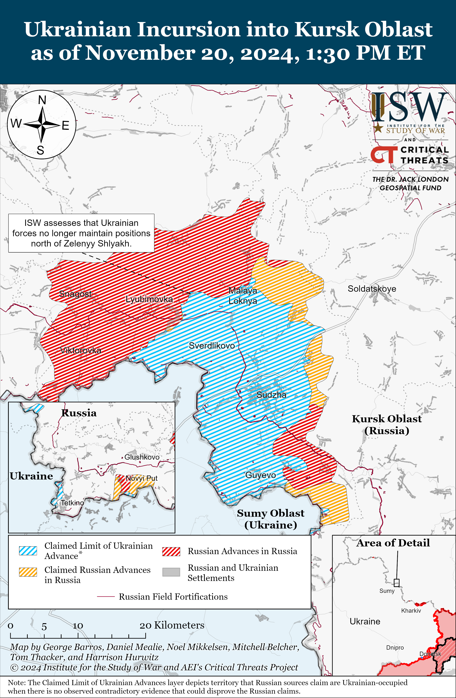
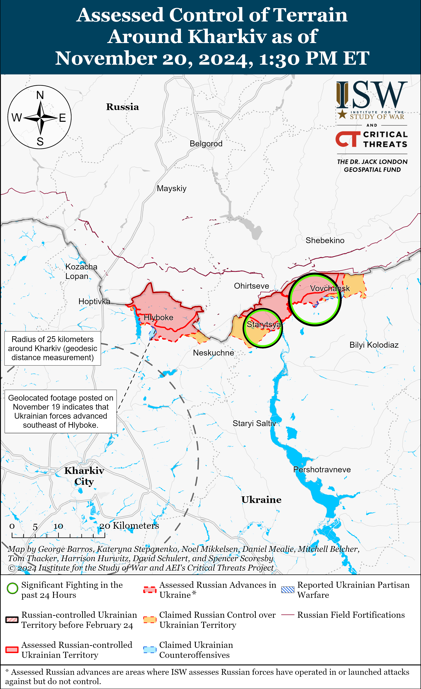
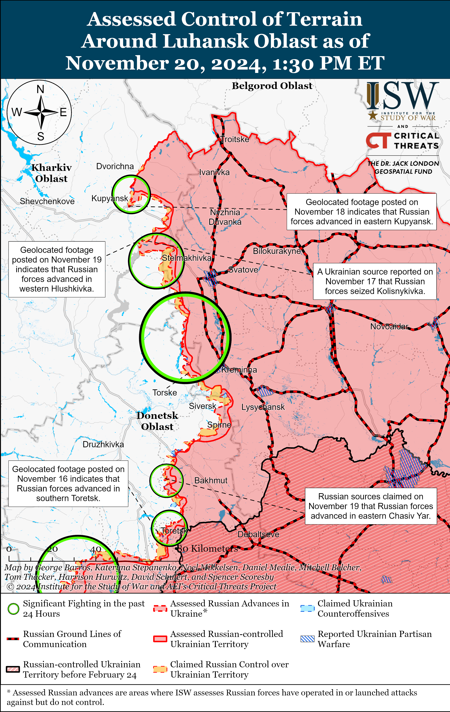
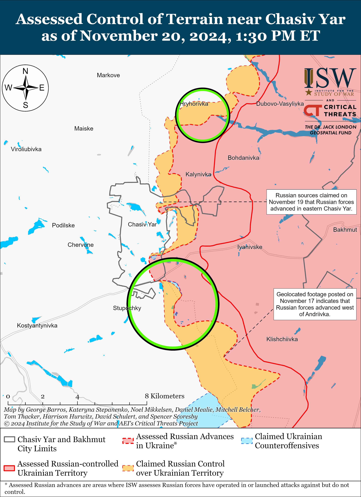
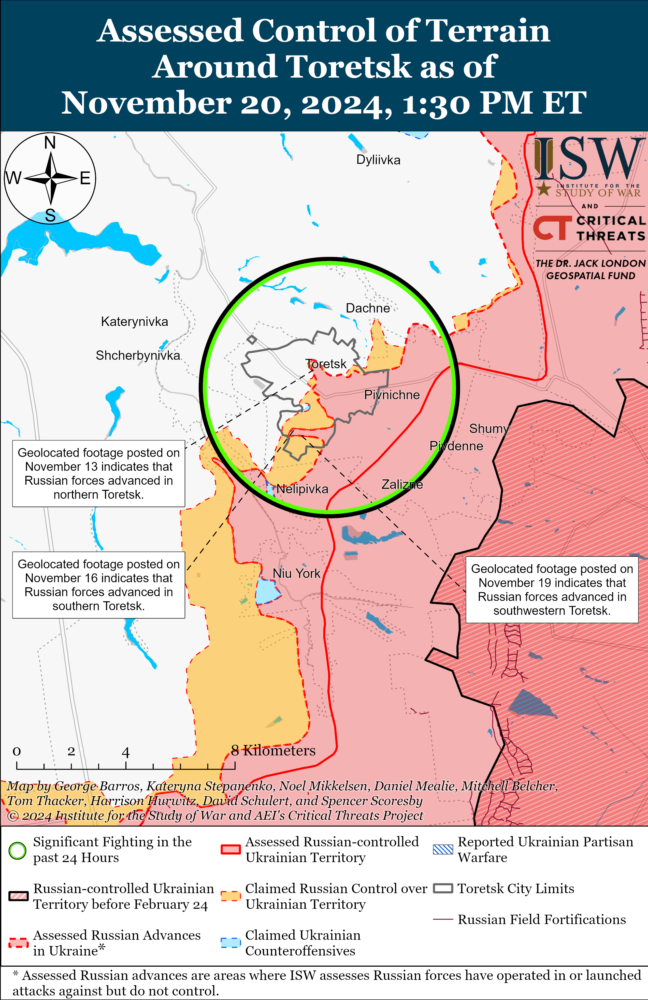
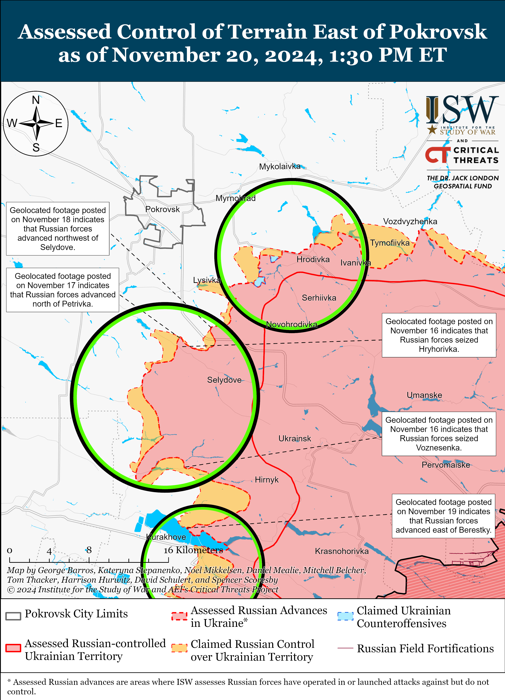
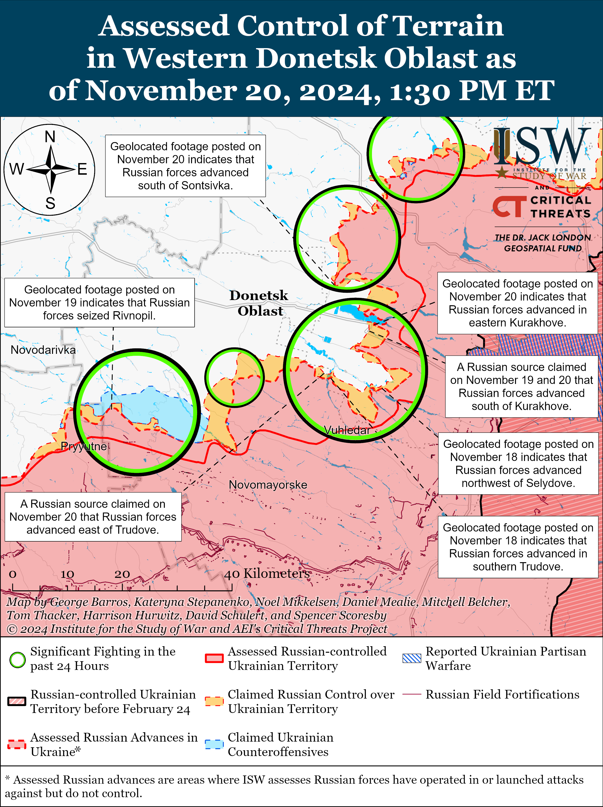
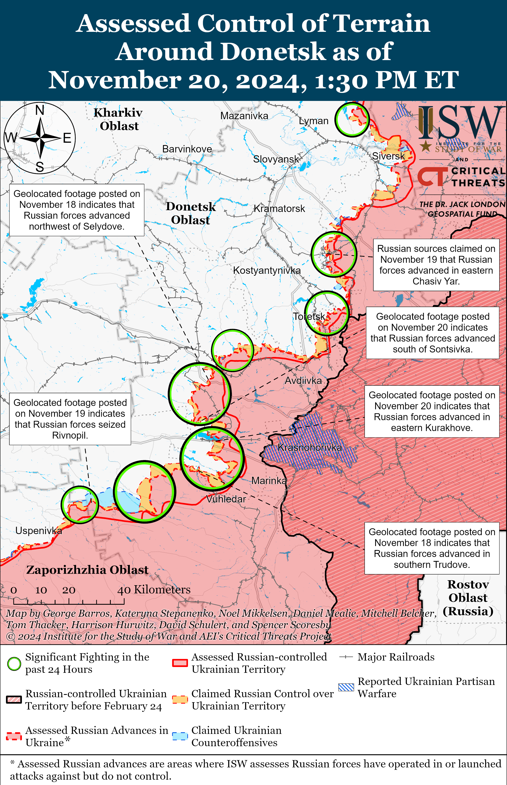
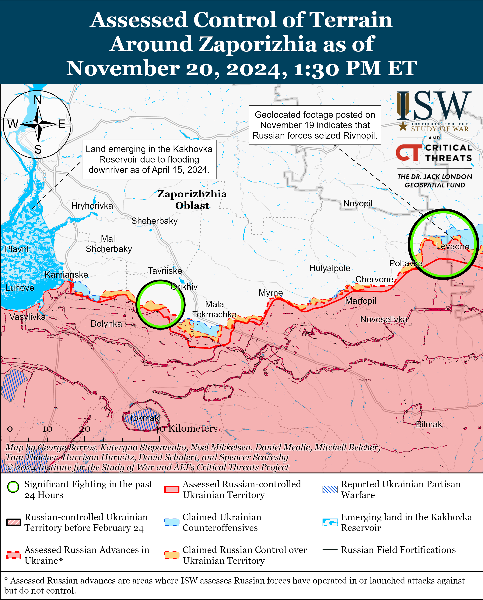
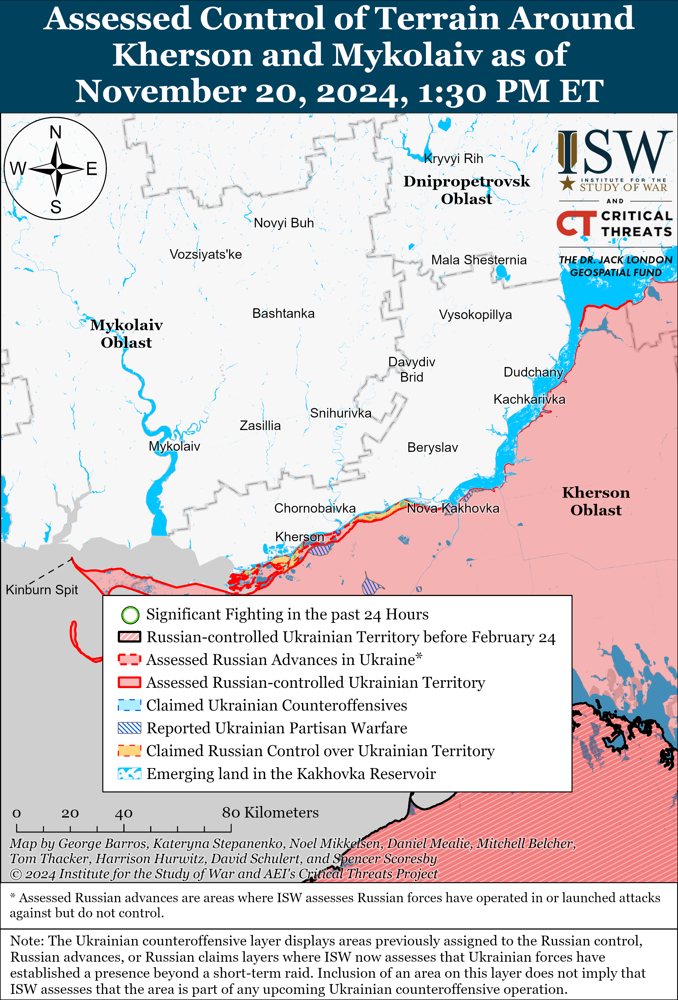

# Russian Offensive Campaign Assessment, November 20, 2024

**Karolina Hird, Christina Harward, Angelica Evans, Davit Gasparyan, Grace Mappes, Olivia Gibson, William Runkel, Nate Trotter, Kateryna Stepanenko, and George Barros**

**November 20, 2024, 6:30pm ET**

**Click** [**here**](https://storymaps.arcgis.com/stories/36a7f6a6f5a9448496de641cf64bd375) **to see ISW’s interactive map of the Russian invasion of Ukraine. This map is updated daily alongside the static maps present in this report.**

**Click** [**here**](https://understandingwar.maps.arcgis.com/apps/instant/3dviewer/index.html?appid=1602762dbcde419bb957dea358449580) **to see ISW’s 3D control of terrain topographic map of Ukraine. Use of a computer (not a mobile device) is strongly recommended for using this data-heavy tool.**

**Click** [**here**](https://storymaps.arcgis.com/stories/733fe90805894bfc8562d90b106aa895) **to access ISW’s archive of interactive time-lapse maps of the Russian invasion of Ukraine. These maps complement the static control-of-terrain map that ISW produces daily by showing a dynamic frontline. ISW will update this time-lapse map archive monthly.**

**Note: The data cut-off for this product was 12:30pm ET on November 20. ISW will cover subsequent reports in the November 21 Russian Offensive Campaign Assessment.**

**Ukraine conducted a successful combined strike against military assets in the Russian rear on the night of November 19 to 20 using drones and Western-provided long-range weapons.** *The Guardian* and *Bloomberg* both reported on November 20, citing anonymous sources, that Ukrainian forces have conducted the first strikes against military targets within Russia using UK-provided Storm Shadow missiles.[1] Geolocated footage published on November 20 shows the aftermath of a likely Storm Shadow strike near Marino, Kursk Oblast.[2] Several Russian milbloggers claimed that Ukrainian forces launched up to 12 Storm Shadow missiles at Kursk Oblast, fragments of which struck Marino.[3] The geolocated footage of the strike suggests that the Ukrainian target may have been the Baryatinsky Estate in Marino, which the Ukrainian defense-focused outlet *Defense Express* suggested was housing a command post for Russian and North Korean troops operating in Kursk Oblast.[4] ISW cannot confirm this claim at this time, but Marino is about 30km from the current Kursk Oblast salient, which would be an appropriate distance for an operational headquarters for troops conducting offensives along the salient.

Ukrainian forces also conducted a large-scale drone strike against the Russian rear on the night of November 19 to 20, particularly targeting military and defense industrial assets in Voronezh, Belgorod, and Novgorod oblasts. The Russian Ministry of Defense (MoD) claimed that Russian air defense systems destroyed or intercepted a total of 44 Ukrainian drones as of the morning of November 20, including 20 over Novgorod Oblast; five over Kursk Oblast; four over Oryol Oblast; three each over Belgorod, Tula, and Tver oblasts; and two each over Bryansk, Moscow, and Smolensk oblasts.[5] Head of Ukraine’s Center for Combatting Disinformation Lieutenant Andriy Kovalenko stated on November 20 that Ukrainian drones struck the 13th Main Missile and Artillery Directorate (GRAU) arsenal near Kotovo, Novgorod Oblast, at which Russian forces were reportedly storing ammunition for tube artillery; mortar mines; “Grad,” “Smerch,” and “Uragan” multi-launch rocket systems (MLRS) missiles; Iskander ballistic missiles; S-300 and S-400 surface-to-air missiles; North Korean provided KN-23 ballistic missiles; and Tor surface-to-air system missiles.[6] Ukraine’s Main Military Intelligence Directorate (GUR) reported that Ukrainian forces also struck a command post of the Russian “Sever” (Nothern) Grouping of Forces in Gubkin, Belgorod Oblast.[7] Ukrainian and Russian sources additionally posted footage of the aftermath of a reported Ukrainian drone strike against the EFKO Factory in Alekseyevka, Belgorod Oblast, which Kovalenko stated produces cargo drones for the Russian military.[8] Russian sources reported that Ukrainian drones also hit an unspecified industrial enterprise in Voronezh Oblast and targeted an oil depot in Sosnovka, Samara Oblast.[9]

**The November 19 to 20 strike series indicates that Ukraine has already begun leveraging Western-provided long-range weapons systems to assemble more complex and effective strike packages.** Ukrainian forces notably utilized both long-range strike drones and Storm Shadow missiles in the November 19-20 strike and struck a diverse range of military targets across the Russian rear.

ISW has long assessed that the systems and capabilities that Western partners are providing Ukraine, alongside Ukraine’s indigenous defense industrial production and innovation efforts, are all constituent components of wider capabilities that Ukraine requires to successfully wage a multi-domain large-scale modern war.[10] Ukraine has already proven itself effective in using often domestically-produced drones to strike a variety of military targets in the Russian rear, including air bases, command headquarters, and artillery depots.[11] Ukraine’s arsenal already includes aerial and naval drones and Western-provided systems such as F-16s, HIMARS, and ATACMS, although the conditions of use on the latter systems have been restricted enough to limit the benefit Ukraine can accrue by using them.[12] The addition of more powerful and precise Western-provided systems, such as JASSMs and additional ATACMS, Storm Shadows, and SCALP systems, is crucial in enabling Ukraine to scale up the effects it can generate through long-range strikes against the Russian rear.

Russian forces, in contrast, have been experimenting and diversifying their strike packages to inflict maximum damage on Ukrainian critical infrastructure, conducting frequent strikes with a combination of Iranian-provided or Russian-produced Shahed drones and drone variants, North Korean-provided and domestically produced ballistic and cruise missiles, hypersonic missiles, and aerial bombs.[13]

Western restrictions on Ukraine’s ability to use Western-provided weapons to strike within Russian territory have limited Ukrainian capabilities in developing commensurate strike packages. Ukraine requires continued Western military assistance, as well as domestic innovation and production, in order to continue building and utilizing strike packages to target the Russian rear and generate tactical to operational-level impacts on the battlefield.

**Neither Russian nor Ukrainian forces have been able to conduct optimized operational maneuver since Winter 2022-2023 due to legacy doctrinal and resource limitations, but both are learning, innovating, and adapting their respective tactics on the battlefield, emphasizing the dynamic nature of the current war.** Ukrainian Missile and Artillery Forces Deputy Commander Colonel Serhiy Musienko reported in a November 18 article by Ukrainian outlet *RBK-Ukraine* that Russian forces are facing ammunition shortages on select sectors of the frontline and are increasingly committing Soviet-era 122mm and 130mm howitzers to the battlefield.[14] Musienko stated that Russian forces began dispersing their artillery and command systems along the frontline to avoid grouping equipment in one area and increasing vulnerability to Ukrainian strikes. Musienko also stated that Russian forces are changing their assault tactics, using small teams of one-to-two Russian personnel running to cover, after which small groups accumulate and coordinate before launching a subsequent assault. Musienko stated that Russian forces are also using armored vehicles, motorcycles, all-terrain vehicles (ATVs), and buggies to quickly approach Ukrainian positions and engage in small-arms battles. Musienko commented on Russia’s strike adaptations, stating that Russian forces have created a reconnaissance-strike complex consisting of reconnaissance drones and an Iskander launch battery located in occupied Crimea that can identify and strike targets in the Zaporizhia direction within 20-to-30 minutes.

The *New York Times* (NYT) reported on November 20 that Ukrainian commanders stated that Ukrainian forces, in contrast to the situation faced by Russian forces as outlined by Musienko, continue to experience artillery shortages and are consequently relying more heavily on drone operations to constrain Russian advances along the frontline, with drone strikes resulting in upwards of 80 percent of Russian losses along the front.[15] The NYT stated that a Ukrainian drone pilot and platoon leader noted that Russian forces are targeting small drone teams with glide bombs. Musienko also noted that Ukrainian artillery and strike drones are critical for preventing Russian forces from approaching Ukrainian positions and engaging in small-arms firefights.[16]

ISW recently assessed that Ukrainian drone operations are playing a critical role in constraining Russian mechanized maneuver, slowing Russian advances to a foot pace, and preventing Russian forces from fully exploiting Ukraine’s ongoing manpower constraints.[17] While neither Russian nor Ukrainian forces have discovered how to restore operational-level mechanized maneuver to the modern battlefield, the tempo of frontline fighting remains high, and the frontline remains dynamic. Frontline innovation and adaptation on both sides will continue to evolve modern warfare.

**The US and Germany announced additional military assistance for Ukraine on November 20.** The US Department of Defense (DoD) announced its 70th tranche of military assistance under the Presidential Drawdown Authority (PDA) valued at $275 million, which includes HIMARS ammunition; 155mm and 105mm artillery ammunition; 60mm and 81mm mortar rounds; drones; Tube-launched, Optically tracked, Wire-guided (TOW) missiles; Javelin and AT-4 anti-armor systems; small arms and ammunition; demolitions equipment; and Chemical, Biological, Radiological, Nuclear protective equipment.[18] US Secretary of Defense Lloyd Austin confirmed that the United States is providing Ukraine with antipersonnel landmines with controlled detonations to help defend against Russian offensive operations in eastern Ukraine.[19] The German government announced on November 20 that Germany has delivered additional weapons and equipment to Ukraine, including ammunition for Mardar infantry fighting vehicles (IFV), 47 mine-resistant ambush-protected vehicles (MRAPs), one TRML-4D aerial radar system, four Panzerhaubitze 2000 self-propelled howitzers, 40,000 155mm artillery rounds, seven M109 155mm howitzer barrels, over 200 various reconnaissance drones, mine-clearing and logistics vehicles, and small arms ammunition.[20]

**Ukrainian officials continue to launch investigations into Russian executions of Ukrainian prisoners of war (POWs) and provide statistics on Ukrainians living in Russian captivity.** TheDonetsk Oblast Prosecutor’s Office reported on November 20 that it launched an investigation into a case involving Russian forces executing two Ukrainian POWs near Novodmytrivka, Donetsk Oblast on November 10, in clear violation of the Geneva Convention on POWs.[21] Ukrainian Ombudsman Dmytro Lubinets stated on November 20 that Ukraine has returned a total of 3,767 Ukrainians–mostly soldiers and 168 civilians– from Russian captivity since the start of the Russian full-scale invasion in February 2022, and that “tens of thousands” of Ukrainian military and civilian prisoners remain in Russian captivity.[22] ISW has previously documented systematic Russian mistreatment and executions of Ukrainian POWs, alongside a clear reluctance of Russian authorities to engage in good-faith POW exchanges with Ukraine.[23] ISW also assesses that the Ukrainian incursion into Kursk Oblast has likely incentivized Russian authorities to engage in more regular POW exchanges, likely driven by a rise in the capture of Russian POWs by Ukrainian forces.[24]

**Key Takeaways:**

- **Ukraine conducted a successful combined strike against military assets in the Russian rear on the night of November 19 to 20 using drones and Western-provided long-range weapons. The November 19 to 20 strike series indicates that Ukraine has already begun leveraging Western-provided long-range weapons systems to assemble more complex and effective strike packages.**
- **Neither Russian nor Ukrainian forces have been able to conduct optimized operational maneuver since Winter 2022-2023 due to legacy doctrinal and resource limitations, but both are learning, innovating, and adapting their respective tactics on the battlefield, emphasizing the dynamic nature of the current war.**
- **The US and Germany announced additional military assistance for Ukraine on November 20.**
- **Ukrainian officials continue to launch investigations into Russian executions of Ukrainian prisoners of war (POWs) and provide statistics on Ukrainians living under Russian captivity.**
- **Ukrainian forces recently regained lost positions near Pokrovsk, and Russian forces recently advanced near Kupyansk Chasiv Yar, Toretsk, Kurakhove, and Vuhledar and in Kursk Oblast.**
- **The Russian military command’s lack of proper treatment of Russian soldiers and continued reliance on “meat assaults” is likely contributing to mass desertions.**

***We do not report in detail on Russian war crimes because these activities are well-covered in Western media and do not directly affect the military operations we are assessing and forecasting. We will continue to evaluate and report on the effects of these criminal activities on the Ukrainian military and the Ukrainian population and specifically on combat in Ukrainian urban areas. We utterly condemn Russian violations of the laws of armed conflict and the Geneva Conventions and crimes against humanity even though we do not describe them in these reports.***

- Ukrainian Operations in the Russian Federation
- Russian Main Effort – Eastern Ukraine (comprised of three subordinate main efforts)
- Russian Subordinate Main Effort #1 – Push Ukrainian forces back from the international border with Belgorod Oblast and approach to within tube artillery range of Kharkiv City
- Russian Subordinate Main Effort #2 – Capture the remainder of Luhansk Oblast and push westward into eastern Kharkiv Oblast and encircle northern Donetsk Oblast
- Russian Subordinate Main Effort #3 – Capture the entirety of Donetsk Oblast
- Russian Supporting Effort – Southern Axis
- Russian Air, Missile, and Drone Campaign
- Russian Mobilization and Force Generation Efforts
- Russian Technological Adaptations
- Activities in Russian-occupied areas
- Significant Activity in Belarus

**Ukrainian Operations in the Russian Federation**

Russian forces recently advanced in the Ukrainian main salient in Kursk Oblast amid continued fighting on November 20. Geolocated footage published on November 14 and 18 indicates that Russian forces recently advanced north of Zeleny Shlyakh (southeast of Korenevo) and northwest of Malaya Loknya (north of Sudzha), and ISW has not observed recent evidence of a Ukrainian presence in those areas.[25] The Russian Ministry of Defense (MoD) and several other Russian sources claimed on November 20 that Russian forces “routed” Ukrainian forces near the Olgovka forest (southeast of Korenevo) and cut off Ukrainian supply routes to their positions in this area, but ISW does not have confirmation of this claim.[26] Elements of the Russian 155th Naval Infantry Brigade (Pacific Fleet, Eastern Military District [EMD]), 810th Naval Infantry Brigade (Black Sea Fleet [BSF], Southern Military District [SMD]), and 106th Airborne (VDV) Division continue to operate in Kursk Oblast.[27] Elements of the Chechen “Akhmat” Spetsnaz forces are reportedly operating in Sudzha Raion.[28]

Neither Russian nor Ukrainian sources reported fighting in Glushkovsky Raion west of the main Ukrainian salient in Kursk Oblast on November 20.

**Russian Main Effort – Eastern Ukraine**

**Russian Subordinate Main Effort #1 – Kharkiv Oblast (Russian objective: Push Ukrainian forces back from the international border with Belgorod Oblast and approach to within tube artillery range of Kharkiv City)**

Russian forces continued offensive operations northeast of Kharkiv City near Vovchansk and Starytsya on November 19 and 20 but did not make any confirmed advances.[29] Russian milbloggers claimed on November 19 that Russian forces repelled a Ukrainian mechanized counterattack north of Kharkiv City near Hlyboke and Lyptsi on November 18, and one milblogger added on November 20 that Ukrainian forces recently launched a company-sized mechanized assault near Hlyboke.[30] A Russian source noted that the lack of foliage in the Kharkiv direction is affecting the operational environment for both Ukrainian and Russian forces as it reduces cover and concealment from drones and artillery fire.[31]

**Russian Subordinate Main Effort #2 – Luhansk Oblast (Russian objective: Capture the remainder of Luhansk Oblast and push westward into eastern Kharkiv Oblast and northern Donetsk Oblast)**

Russian forces recently advanced near Kupyansk amid continued offensive operations along the Kupyansk-Svatove-Kreminna line on November 20. Geolocated footage published on November 19 indicates that Russian forces recently advanced in western Hlushkivka (southeast of Kupyansk).[32] A Russian milblogger claimed that Russian forces advanced northwest and southwest of Kruhlyakivka (southeast of Kupyansk), but ISW has not observed confirmation of these claims.[33] A Russian milblogger noted that Russian forces have not advanced beyond the Oskil River in the Kupyansk direction, consistent with ISW’s control of terrain assessment of the area.[34] A Russian source claimed that Ukrainian forces counterattacked in northeastern Kupyansk.[35] Russian forces conducted offensive operations north of Kupyansk near Kindrashivka; east of Kupyansk near Kucherivka, Petropavlivka, and Pershotravneve; southeast of Kupyansk near Zahryzove and Kruhlyakivka; northwest of Svatove near Lozova; west of Svatove near Zeleny Hai and Kopanky; southwest of Svatove near Cherneshchyna and Novoyehorivka; northwest of Kreminna near Hrekivka; west of Kreminna near Zarichne, Terny, and Torske; and southwest of Kreminna near Hryhorivka on November 19 and 20.[36] Russian milbloggers claimed that Russian forces struck a pontoon crossing over the Siverskyi Donets River near Raihorodok (southwest of Kreminna) with a Kh-38 air-to-surface missile.[37]

**Russian Subordinate Main Effort #3 – Donetsk Oblast (Russian objective: Capture the entirety of Donetsk Oblast, the claimed territory of Russia’s proxies in Donbas)**

Neither Russian nor Ukrainian reported fighting in the Siversk direction on November 20. A Russian milblogger claimed on November 20 that Russian forces are operating under constant pressure from Ukrainian drone operations south of Siversk.[38] Elements of the Russian 2nd Guards Artillery Brigade (3rd Combined Arms Army [CAA], formerly 2nd Luhansk People’s Republic Army Corps [LNR AC]) are reportedly operating near Fedorivka (south of Siversk).[39]

Russian forces recently advanced north and south of Chasiv Yar amid continued offensive operations in the area on November 20. Geolocated footage published on November 8 and 19 indicates that Russian forces recently advanced east of Orikhovo-Vasylivka (north of Chasiv Yar) and to the west (right) bank of the Siverskyi-Donets Donbas Canal west of Ozaryanivka (southeast of Chasiv Yar).[40] A Russian milblogger claimed that elements of the Russian 6th Motorized Rifle Division (3rd AC) broke through Ukraine’s defensive lines between Chasiv Yar and Klishchiivka (southeast of Chasiv Yar) and consolidated positions near the canal.[41] Ukrainian Luhansk Group of Forces Spokesperson Major Anastasiya Bobovnikova stated that Russian forces are unsuccessfully attacking in central Chasiv Yar using fireteams of two to three personnel, but that Russian forces are not able to exploit these attacks to facilitate wider and more meaningful penetrations.[42] A Russian source claimed that Russian forces have consolidated positions in central Chasiv Yar, and Russian milbloggers claimed that Russian forces are attacking the brick factory in the settlement.[43] A Russian milblogger claimed that Russian forces recently advanced two kilometers in Zhvotnevyi Microraion in eastern Chasiv Yar.[44] Russian forces continued assaults near Chasiv Yar itself and south of Chasiv Yar near Stupochky on November 20.[45] Elements of the Russian 299th Airborne (VDV) Regiment (98th VDV Division) are reportedly operating in Chasiv Yar.[46]

Russian forces recently advanced in Toretsk amid continued offensive operations in the area on November 20. Geolocated footage published on November 13 and 19 indicates that Russian forces recently advanced in northern and southwestern Toretsk.[47] Russian milbloggers claimed that Russian forces are advancing near high-rise buildings in central Toretsk and consolidated positions along Hrushevskoho Street and near the Avanhard Stadium.[48] Russian forces continued assaults in Toretsk itself; north of Toretsk near Druzhba; and west of Toretsk near Shcherbynivka on November 19 and 20.[49]

Ukrainian forces recently advanced east of Pokrovsk amid continued Russian assaults in the Pokrovsk direction on November 20. Geolocated footage published on November 20 indicates that Ukrainian forces recently regained lost positions south of Mykolaivka (east of Pokrovsk).[50] Russian milbloggers claimed that Russian forces operating south of Pokrovsk advanced into Yurivka, in the direction of Pustynka, and 1.5 kilometers in depth west of Novooleksiivka.[51] ISW has not observed confirmation of these claims, however. Russian forces continued assaults east of Pokrovsk near Myrolyubivka, and Promin; southeast of Pokrovsk near Krutyi Yar, Krasnyi Yar, Lysivka, and Dachenske; and south of Pokrovsk near Petrivka, Hryhorivka, Pushkine, Zhovte, and Yurivka on November 19 and 20.[52]

Russian forces recently advanced north of Kurakhove and in eastern Kurakhove amid continued offensive operations on November 20. Geolocated footage published on November 19 and 20 indicates that Russian forces recently advanced south of Sontsivka (north of Kurakhove), east of Berestky (north of Kurakhove and on the northern shore of the Kurakhivske Reservoir), along Franka Street in eastern Kurakhove, and along the railway bridge over the reservoir.[53] Russian milbloggers claimed that elements of the Russian 114th Motorized Rifle Brigade (51st CAA, formerly 1st Donetsk People’s Republic Army Corps [DNR] AC) seized Nova Illinka (on the northern shore of the reservoir) and that elements of the Russian 5th Motorized Rifle Brigade (51st CAA) advanced in eastern Kurakhove.[54] The Russian Ministry of Defense (MoD) claimed that Russian forces seized Illinka (north of Kurakhove), although ISW assessed that Russian forces seized the settlement as of November 13.[55] Russian milbloggers claimed that Russian forces recently advanced in Berestky and into Kurakhove from the north and are conducting reconnaissance-in-force operations near the multi-story buildings in Kurakhove.[56] One milblogger claimed that Russian forces occupy over 90 percent of Berestky and that Ukrainian forces are counterattacking in Kurakhove itself. The Russian MoD claimed that elements of the Russian Southern Grouping of Forces are conducting attacks in small groups and attempting to encircle Ukrainian forces in the Kurakhove direction.[57] Russian forces continued assaults near Kurakhove itself; northwest of Kurakhove near Zorya and Sontsivka; north of Kurakhove near Novoselydivka and Berestky; east of Kurakhove near Maksymilyanivka; and south of Kurakhove near Dalne on November 19 and 20.[58] Elements of the Russian 20th Motorized Rifle Division (8th CAA, Southern Military District [SMD]) and 150th Motorized Rifle Division (8th CAA, SMD) are reportedly operating in the Kurakhove direction.[59]

Russian forces recently advanced north of Vuhledar amid continued offensive operations in the area on November 20. Geolocated footage published on November 20 indicates that the 2nd Battalion of the Russian 39th Motorized Rifle Brigade (68th AC, Eastern Military District [EMD]) recently advanced during a platoon-sized mechanized assault northeast of Bohoyavlenka (northwest of Vuhledar).[60] Russian milbloggers claimed that Russian forces advanced near Trudove (north of Vuhledar), along the Kostyantynopolske-Sukhy Yaly line (northwest of Vuhledar), and in the direction of Veselyi Hai (also north of Vuhledar) and that Russian forces also advanced in an area 4.7 kilometers north of Antonivka and Yelizavetivka (both northeast of Vuhledar).[61] ISW has not observed confirmation of these claims, however. Russian forces continued assaults northeast of Vuhledar near Katerynivka, Yelizavetivka, and Antonivka; north of Vuhledar near Trudove and Kostyantynopolske; and northwest of Vuhledar near Suki Yaly on November 19 and 20.[62] Artillery elements of the Russian 1472nd Motorized Rifle Regiment (68th AC, EMD) are reportedly operating near Trudove.[63]

Russian forces continued assaults in the Donetsk-Zaporizhia Oblast border area on November 20, but there were no confirmed changes to the frontline. A Russian milblogger claimed that Russian forces are advancing north of Makarivka (south of Velyka Novosilka), Rivnopil, and Novodarivka (both southwest of Velyka Novosilka).[64] ISW has not observed confirmation of these claims. Ukrainian Tavriisk Group of Forces Spokesperson Colonel Vyacheslav Voloshyn stated that Russian forces are conducting a significant number of assaults in the Vremivka (Donetsk-Zaporizhia Oblast border area) direction in an attempt to cut Ukraine’s ground lines of communication (GLOCs) between Velyka Novosilka and Kurakhove.[65] Voloshyn stated that Russian forces are attacking in small squad-sized groups of 5 to 10 infantry troops and are using armored vehicles to transport the infantry to frontline positions. Russian forces attacked northeast of Velyka Novosilka near Rozdolne; near Velyka Novosilka itself; and southwest of Velyka Novosilka near Novodarivka on November 19 and 20.[66] A Russian milblogger claimed that Ukrainian forces are also counterattacking near Rivnopil (southwest of Velyka Novosilka).[67] Drone operators of the Russian 40th Naval Infantry Brigade (Pacific Fleet, EMD) are reportedly operating near Velyka Novosilka.[68]

**Russian Supporting Effort – Southern Axis (Russian objective: Maintain frontline positions and secure rear areas against Ukrainian strikes)**

Russian forces continued assaults in western Zaporizhia Oblast northwest of Robotyne near Novoandriivka and Nesteryanka and northeast of Robotyne near Mala Tokmachka on November 19 and 20, but there were no confirmed changes to the frontline.[69] Ukrainian Tavriisk Group of Forces Spokesperson Colonel Vladyslav Voloshyn reported on November 19 that Russian forces are not using equipment during assaults due to Ukrainian strikes and are instead conducting small infantry assaults and using equipment only to transport infantry to frontline positions.[70] Voloshyn added that Russian forces are conducting multi-wave assaults in groups of one to two soldiers to push Ukrainian forces out of their positions, after which Russian “entrenchment groups” of an unspecified size try to gain a foothold at these positions. A Russian milblogger noted on November 20 that the weather is growing increasingly cold in the Zaporizhia direction and will likely reach freezing temperatures next week (around November 24-30).[71] The milblogger claimed that Ukrainian electronic warfare (EW) and an insufficient number of radios are affecting Russian forces’ ability to call for casualty evacuations or adjust artillery fire. The Russian military command has largely failed to provide Russian forces with communication devices, resulting in poor communications on the frontline and forcing many Russian servicemembers to rely on their personal devices to organize command and control (C2), logistics, and combat operations.[72]

Positional fighting continued in the Dnipro direction in east (left) bank Kherson Oblast on November 19 and 20, but there were no changes to the frontline.[73] Elements of the Russian 80th Arctic Motorized Rifle Brigade (14th Army Corps [AC], Leningrad Military District [LMD]) are reportedly operating in the Kherson direction.[74]

**Russian Air, Missile, and Drone Campaign (Russian Objective: Target Ukrainian military and civilian infrastructure in the rear and on the frontline)**

Russian forces conducted a large series of missile and drone strikes against Ukraine overnight on November 19 to 20. The Ukrainian Air Force reported that Russian forces launched an S-300 air defense missile at Kharkiv Oblast from Belgorod Oblast; five Kh-59/69 cruise missiles against Dnipropetrovsk, Chernihiv, and Sumy oblasts; and 122 Shahed and other unspecified strike drones (likely referring to decoy drones) from Primorsko-Akhtarsk, Krasnodar Krai and Kursk and Oryol oblasts overnight.[75] The Ukrainian Air Force reported that Ukrainian air defenses downed two Kh-59/69 cruise missiles and 56 Russian drones over Kyiv, Cherkasy, Chernihiv, Poltava, Kirovohrad, Zhytomyr, Khmelnytskyi, Sumy, Mykolaiv, Kherson, Zaporizhia, Dnipropetrovsk, Donetsk, and Kharkiv oblasts. The Ukrainian Air Force reported that Ukrainian countermeasures, likely referring to electronic warfare (EW) interference, caused another 58 Russian drones to become “lost” in Ukraine, that five drones left Ukrainian airspace towards Russia, and that one drone left Ukrainian airspace into Belarus. Ukrainian officials reported that a Russian missile struck an administrative building in Pryluky, Chernihiv Oblast, and that falling debris damaged residential and commercial areas in Kyiv Oblast.[76] Russian sources claimed that Russian forces hit Starokostyantyniv Airfield in Khmelnytskyi Oblast and other Ukrainian military and defense industrial targets in Sumy Oblast.[77]

**Russian Mobilization and Force Generation Efforts (Russian objective: Expand combat power without conducting general mobilization)**

The Russian military command’s poor treatment of and failure to support Russian soldiers is likely contributing to mass desertions. Russian opposition outlet *Vazhnye Istorii* (iStories) reported that an internal Russian Ministry of Defense (MoD) document detailed how over 1,000 Russian servicemembers, including officers, deserted the Russian 20th Motorized Rifle Division (MRD) (8th Combined Arms Army [CAA], Southern Military District [SMD]) as of April 20, 2024 – well over a battalion’s worth of personnel.[78] *iStories* reported that the command of the Russian 20th MRD appealed to the Russian MoD for assistance in returning deserters and interviewed personnel of the 20th MRD’s 33rd and 255th motorized rifle regiments, who attributed the desertion rates to high casualties, lack of promised payments to soldiers, and the practice of sending injured and sick soldiers on assaults. These complaints mirror frequent Russian ultranationalist milblogger complaints about the Russian MoD’s poor treatment of Russian military personnel, and the alleged internal document indicates that the MoD is likely aware of the scale of Russian morale problems.[79] Russian opposition outlet *Mobilization News* amplified footage on November 19 showing soldiers from the Russian 36th Motorized Rifle Brigade (29th CAA, Eastern Military District [EMD]) appealing directly to Russian Defense Minister Andrei Belousov complaining about how their commanders sent them on assaults without reconnaissance or artillery support.[80] The Russian soldiers claimed that they have to use their salaries to purchase their own equipment and fortification materials because the military command does not provide them.

High Russian casualties are reportedly prompting the Russian government to increase spending to identify dead personnel amid broader Kremlin concerns about Russia’s long-term economic stability.[81] Russian opposition outlet *Verstka* reported on November 19 that the Russian federal government has allocated over 180 million rubles (about $1.7 million) to Russian federal subjects for DNA tests to identify Russian soldiers’ bodies so far in 2024, the highest annual amount dedicated to such a type of spending since the start of the war.[82]

The Russian MoD seems to be struggling to completely incorporate former private military companies (PMCs) into the Russian military. Russian State Secretary – Deputy Defense Minister Anna Tsivileva announced on November 19 that the Russian MoD will issue veteran certificates to former PMC fighters based on notarized “eyewitness accounts” from several witnesses confirming that the fighter fought in the war in Ukraine and that the MoD should cover notarization expenses.[83] Tsivileva did not specify who the MoD considers a valid eyewitness. The increased burden on former PMC fighters, particularly former Wagner personnel who did not sign contracts with the Russian military, to prove that they are eligible for veteran status compared to regular Russian personnel will likely contribute to tensions between Wagner personnel, regular Russian personnel, and the MoD.

**Russian Technological Adaptations (Russian objective: Introduce technological innovations to optimize systems for use in Ukraine)**

A Russian source complained that bureaucracy in the Russian Ministry of Defense (MoD) and high barriers to entry are preventing Russian private initiatives from developing tactical air defense systems to defend against Ukrainian tactical drones.[84] The Russian source claimed that the Russian defense industrial base (DIB) is unwilling to transfer components to projects with the “People’s DIB” and that “People’s DIB” initiative groups must obtain licenses from the Federal Security Service (FSB) to operate.

**Activities in Russian-occupied areas (Russian objective: Consolidate administrative control of annexed areas; forcibly integrate Ukrainian citizens into Russian sociocultural, economic, military, and governance systems)**

*ISW is not publishing coverage of activities in Russian-occupied areas today.*

**Significant activity in Belarus (Russian efforts to increase its military presence in Belarus and further integrate Belarus into Russian-favorable frameworks and Wagner Group activity in Belarus)**

The Belarusian Ministry of Defense (MoD) hosted an International Military Scientific Conference on November 20, which focused on issues related to ensuring the security of Russian-led Collective Security Treaty Organization (CSTO) member states, the development of combat support systems for CSTO troops, and the procurement of technical and logistical equipment for the CSTO Collective Rapid Reaction Forces.[85]

**Note: ISW does not receive any classified material from any source, uses only publicly available information, and draws extensively on Russian, Ukrainian, and Western reporting and social media as well as commercially available satellite imagery and other geospatial data as the basis for these reports. References to all sources used are provided in the endnotes of each update.**

[1] https://www.theguardian.com/world/live/2024/nov/20/russia-ukraine-war-live-biden-us-weapons-missiles-putin-nuclear?filterKeyEvents=false&page=with%3Ablock-673dfb778f08b8d1c90a6954#block-673dfb778f08b8d1c90a6954; https://www.bloomberg.com/news/articles/2024-11-20/ukraine-fires-uk-storm-shadow-missiles-at-russia-for-first-time

[2] https://x.com/Maks\_NAFO\_FELLA/status/1859232906041819324; https://x.com/Mortenthebjorn/status/1859238011386433821; https://x.com/Mortenthebjorn/status/1859239065989550503; https://x.com/Mortenthebjorn/status/1859239668853682263; https://x.com/RedRabbit182/status/1859236111555395997; https://x.com/blinzka/status/1859236368582377670; https://x.com/99Dominik\_/status/1859292031555608952

[3] https://t.me/DnevnikDesantnika/19538; https://t.me/dva\_majors/58191; https://t.me/RVvoenkor/81035; https://t.me/milinfolive/135437

[4] https://defence-ua dot com/news/shozhe\_scho\_povitrjani\_sili\_ukrajini\_vdarili\_storm\_shadow\_po\_objektu\_prezidenta\_rf\_z\_pidzemnim\_kp\_na\_kurschini-17240.html

[5] https://t.me/mod\_russia/45929

[6] https://t.me/akovalenko1989/8318

[7] https://t.me/DIUkraine/4865

[8] https://t.me/akovalenko1989/8317; https://t.me/dva\_majors/58159; https://t.me/RVvoenkor/80977; https://t.me/censor\_net/60570; https://t.me/vchkogpu/52619 ; https://t.me/vchkogpu/52622

[9] https://t.me/dva\_majors/58158; https://t.me/RVvoenkor/80977; https://t.me/vchkogpu/52617; https://t.me/DnevnikDesantnika/19493; https://t.me/vchkogpu/52629

[10] https://understandingwar.org/backgrounder/russian-offensive-campaign-assessment-november-19-2024

[11] https://understandingwar.org/backgrounder/russian-offensive-campaign-assessment-august-22-2024; https://understandingwar.org/backgrounder/russian-offensive-campaign-assessment-september-21-2024

[12] https://understandingwar.org/backgrounder/russian-offensive-campaign-assessment-november-19-2024

[13] https://understandingwar.org/backgrounder/russian-offensive-campaign-assessment-january-2-2024; https://understandingwar.org/backgrounder/russian-offensive-campaign-assessment-january-13-2024; https://understandingwar.org/backgrounder/russian-offensive-campaign-assessment-january-15-2024; https://understandingwar.org/backgrounder/russian-offensive-campaign-assessment-november-17-2024; https://understandingwar.org/backgrounder/special-report-russian-strikes-more-effective-ukraine-exhausts-defenses

[14] https://www.rbc dot ua/rus/news/polkovnik-sergiy-musienko-mi-otrimuemo-vdvichi-1731872952.html

[15] https://www.nytimes.com/2024/11/20/world/europe/russia-ukraine-war-attacks-trump.html

[16] https://www.rbc dot ua/rus/news/polkovnik-sergiy-musienko-mi-otrimuemo-vdvichi-1731872952.html

[17] https://isw.pub/UkrWar111624

[18] https://www.defense.gov/News/Releases/Release/Article/3972421/biden-administration-announces-additional-security-assistance-for-ukraine/

[19] https://www.defense.gov/News/Transcripts/Transcript/Article/3972916/secretary-of-defense-lloyd-j-austin-iii-holds-an-on-camera-on-the-record-press/; https://www.cnn.com/2024/11/19/politics/biden-administration-anti-personnel-mines-ukraine/index.html; https://apnews.com/article/russia-ukraine-war-us-embassy-warning-37982f529a53f8da6e551b4116879549

[20] https://www.bundesregierung dot de/breg-en/news/military-support-ukraine-2054992; https://www.ukrinform dot ua/rubric-ato/3929250-nimeccina-peredala-cergovij-paket-vijskovoi-dopomogi-ukraini.html

[21] https://t.me/Donetsk\_obl\_prokuratura/3327; https://suspilne dot media/donbas/884501-na-pokrovskomu-napramku-okupanti-rozstrilali-dvoh-polonenih-ukrainskih-vijskovih/

[22] https://suspilne dot media/884537-z-rosijskogo-polonu-ukraina-povernula-ponad-35-tisaci-ukrainciv-lubinec/; https://www.youtube.com/live/9MhdRaHSaJM?feature=share

[23] https://understandingwar.org/backgrounder/russian-offensive-campaign-assessment-november-3-2024

[24] https://understandingwar.org/backgrounder/russian-offensive-campaign-assessment-october-19-2024

[25] https://x.com/giK1893/status/1858562637099135006; https://x.com/giK1893/status/1858562639904805238; https://t.me/ua\_regteam/213; https://t.me/WarArchive\_ua/22249; https://t.me/ua\_marines\_36brigade/2439

[26] https://t.me/mod\_russia/45940; https://t.me/motopatriot/29607 ; https://t.me/epoddubny/21686; https://t.me/sashakots/50296 ; https://t.me/notes\_veterans/20576

[27] https://t.me/voenacher/74647; https://t.me/vysokygovorit/18046; https://t.me/ButusovPlus/15178; https://t.me/NgP\_raZVedka/19565

[28] https://t.me/wargonzo/23252 ; https://t.me/wargonzo/23250

[29] https://www.facebook.com/GeneralStaff.ua/posts/pfbid02miSP7NFqbQXSk3PQNNKZtp3JYfzZfEoKRc42DZqEvoSYQV7EijGC7Ee764RSgWPyl; https://www.facebook.com/GeneralStaff.ua/posts/pfbid0NSAZaocWfX88DR8Uf3rG9amXLg4JwE1HH9FFKLQLmwKauqzbdasyMBefeK6K4gpUl; https://t.me/otukharkiv/2677; https://www.facebook.com/GeneralStaff.ua/posts/pfbid0NSAZaocWfX88DR8Uf3rG9amXLg4JwE1HH9FFKLQLmwKauqzbdasyMBefeK6K4gpUl;

[30] https://t.me/DnevnikDesantnika/19468; https://t.me/milinfolive/135343; https://t.me/notes\_veterans/20575; https://t.me/Sladkov\_plus/11842

[31] https://t.me/epoddubny/21679

[32] https://t.me/WarArchive\_ua/22461; https://t.me/tro\_205/41

[33] https://t.me/z\_arhiv/29640

[34] https://t.me/DnevnikDesantnika/19523

[35] https://t.me/DnevnikDesantnika/19547

[36] https://www.facebook.com/GeneralStaff.ua/posts/pfbid02agMiVXkkRLgMRNHNRMohcBfbCv161gkqDwb6KC15HceUxMbUDRSNsAzwPh7CqTKRl; https://www.facebook.com/GeneralStaff.ua/posts/pfbid02miSP7NFqbQXSk3PQNNKZtp3JYfzZfEoKRc42DZqEvoSYQV7EijGC7Ee764RSgWPyl; https://www.facebook.com/GeneralStaff.ua/posts/pfbid0NSAZaocWfX88DR8Uf3rG9amXLg4JwE1HH9FFKLQLmwKauqzbdasyMBefeK6K4gpUl; https://t.me/tass\_agency/286293

[37] https://t.me/RVvoenkor/80982; https://t.me/milinfolive/135380; https://t.me/notes\_veterans/20580

[38] https://t.me/epoddubny/21688

[39] https://t.me/epoddubny/21688 ; https://t.me/epoddubny/21687

[40] https://t.me/WarArchive\_ua/22463; https://t.me/kurt\_compani\_group/519; https://x.com/AudaxonX/status/1858836191505764543  ; https://t.me/creamy\_caprice/7556; https://t.me/ARTILLERIUM/255

[41] https://t.me/RVvoenkor/80989

[42] https://suspilne dot media/donbas/883599-ce-bula-grupa-voni-zabigli-u-misto-recnica-otuv-lugansk-pro-rosijskih-vijskovih-u-centri-mista-casiv-ar/

[43] https://t.me/tass\_agency/286297 ; https://t.me/motopatriot/29591 ; https://t.me/DnevnikDesantnika/19503  ; https://t.me/DnevnikDesantnika/19496

[44] https://t.me/dva\_majors/58166

[45] https://www.facebook.com/GeneralStaff.ua/posts/pfbid0NSAZaocWfX88DR8Uf3rG9amXLg4JwE1HH9FFKLQLmwKauqzbdasyMBefeK6K4gpUl ; https://t.me/rusich\_army/18612

[46] https://t.me/DnevnikDesantnika/19490

[47] https://t.me/creamy\_caprice/7555; https://t.me/Khyzhak\_brigade/61  ; https://t.me/creamy\_caprice/7569; https://www.tiktok.com/@oleksander1313/video/7439058279294176545 ; https://x.com/AudaxonX/status/1859181806404198900

[48] https://t.me/z\_arhiv/29659 ; https://t.me/RVvoenkor/81004 ; https://t.me/dva\_majors/58166 ; https://t.me/DnevnikDesantnika/19507 ; https://t.me/motopatriot/29584

[49] https://www.facebook.com/GeneralStaff.ua/posts/pfbid02miSP7NFqbQXSk3PQNNKZtp3JYfzZfEoKRc42DZqEvoSYQV7EijGC7Ee764RSgWPyl ; https://www.facebook.com/GeneralStaff.ua/posts/pfbid0NSAZaocWfX88DR8Uf3rG9amXLg4JwE1HH9FFKLQLmwKauqzbdasyMBefeK6K4gpUln  ; https://www.facebook.com/GeneralStaff.ua/posts/pfbid02agMiVXkkRLgMRNHNRMohcBfbCv161gkqDwb6KC15HceUxMbUDRSNsAzwPh7CqTKRl

[50] https://x.com/SibirPrizrak/status/1859281497741533581; https://t.me/YourVaccineZ/12745

[51] https://t.me/DnevnikDesantnika/19470 ; https://t.me/rybar/65528  ; https://t.me/dva\_majors/58166 ; https://t.me/DnevnikDesantnika/19550

[52] https://www.facebook.com/GeneralStaff.ua/posts/pfbid02miSP7NFqbQXSk3PQNNKZtp3JYfzZfEoKRc42DZqEvoSYQV7EijGC7Ee764RSgWPyl ; https://www.facebook.com/GeneralStaff.ua/posts/pfbid0NSAZaocWfX88DR8Uf3rG9amXLg4JwE1HH9FFKLQLmwKauqzbdasyMBefeK6K4gpUln  ; https://www.facebook.com/GeneralStaff.ua/posts/pfbid02agMiVXkkRLgMRNHNRMohcBfbCv161gkqDwb6KC15HceUxMbUDRSNsAzwPh7CqTKRl

[53] https://t.me/creamy\_caprice/7552; https://t.me/mo114rf/76 l https://x.com/SibirPrizrak/status/1859229736423071754; https://t.me/Sladkov\_plus/11846; https://t.me/creamy\_caprice/7570 ; https://t.me/creamy\_caprice/7560; https://www.facebook.com/watch/?v=440846355469685

[54] https://t.me/motopatriot/29579 ; https://t.me/RVvoenkor/80974 ; https://t.me/boris\_rozhin/144897 ; https://t.me/RVvoenkor/81040 ; https://t.me/z\_arhiv/29655

[55] https://t.me/mod\_russia/45937 ; https://understandingwar.org/backgrounder/russian-offensive-campaign-assessment-november-13-2024

[56] https://t.me/NgP\_raZVedka/19577 ; https://t.me/NgP\_raZVedka/19575 ; https://t.me/DnevnikDesantnika/19555

[57] https://t.me/mod\_russia/45928

[58] https://www.facebook.com/GeneralStaff.ua/posts/pfbid02miSP7NFqbQXSk3PQNNKZtp3JYfzZfEoKRc42DZqEvoSYQV7EijGC7Ee764RSgWPyl ; https://www.facebook.com/GeneralStaff.ua/posts/pfbid0NSAZaocWfX88DR8Uf3rG9amXLg4JwE1HH9FFKLQLmwKauqzbdasyMBefeK6K4gpUln  ; https://www.facebook.com/GeneralStaff.ua/posts/pfbid02agMiVXkkRLgMRNHNRMohcBfbCv161gkqDwb6KC15HceUxMbUDRSNsAzwPh7CqTKRl

[59] https://t.me/nm\_dnr/13007

[60] https://t.me/creamy\_caprice/7558; https://t.me/voin\_dv/11916

[61] https://t.me/voenkorKotenok/60226 ; https://t.me/DnevnikDesantnika/19554 ; https://t.me/RVvoenkor/81013 ; https://t.me/voin\_dv/11921

[62] https://www.facebook.com/GeneralStaff.ua/posts/pfbid02miSP7NFqbQXSk3PQNNKZtp3JYfzZfEoKRc42DZqEvoSYQV7EijGC7Ee764RSgWPyl ; https://www.facebook.com/GeneralStaff.ua/posts/pfbid0NSAZaocWfX88DR8Uf3rG9amXLg4JwE1HH9FFKLQLmwKauqzbdasyMBefeK6K4gpUln  ; https://www.facebook.com/GeneralStaff.ua/posts/pfbid02agMiVXkkRLgMRNHNRMohcBfbCv161gkqDwb6KC15HceUxMbUDRSNsAzwPh7CqTKRl

[63] https://t.me/voin\_dv/11920

[64] https://t.me/voin\_dv/11921

[65] https://armyinform dot com.ua/2024/11/19/na-vremivskomu-napryamku-po-pivtora-desyatky-shturmiv-na-dobu-u-zsu-poyasnyly-metu-okupantiv/

[66] https://www.facebook.com/GeneralStaff.ua/posts/pfbid02miSP7NFqbQXSk3PQNNKZtp3JYfzZfEoKRc42DZqEvoSYQV7EijGC7Ee764RSgWPyl ; https://www.facebook.com/GeneralStaff.ua/posts/pfbid0NSAZaocWfX88DR8Uf3rG9amXLg4JwE1HH9FFKLQLmwKauqzbdasyMBefeK6K4gpUln  ; https://www.facebook.com/GeneralStaff.ua/posts/pfbid02agMiVXkkRLgMRNHNRMohcBfbCv161gkqDwb6KC15HceUxMbUDRSNsAzwPh7CqTKRl

[67] https://t.me/voin\_dv/11908

[68] https://t.me/voin\_dv/11921

[69] https://www.facebook.com/GeneralStaff.ua/posts/pfbid02agMiVXkkRLgMRNHNRMohcBfbCv161gkqDwb6KC15HceUxMbUDRSNsAzwPh7CqTKRl ; https://t.me/dva\_majors/58166

[70] https://armyinform dot com.ua/2024/11/19/krovyu-bez-zaliza-na-pivdni-rosiyany-zastosovuyut-taktyku-prosochuvannya/

[71] https://t.me/dva\_majors/58189

[72] https://understandingwar.org/backgrounder/russian-offensive-campaign-assessment-august-25-2024

[73] https://www.facebook.com/GeneralStaff.ua/posts/pfbid02miSP7NFqbQXSk3PQNNKZtp3JYfzZfEoKRc42DZqEvoSYQV7EijGC7Ee764RSgWPyl ; https://www.facebook.com/GeneralStaff.ua/posts/pfbid0NSAZaocWfX88DR8Uf3rG9amXLg4JwE1HH9FFKLQLmwKauqzbdasyMBefeK6K4gpUl ; https://www.facebook.com/GeneralStaff.ua/posts/pfbid02agMiVXkkRLgMRNHNRMohcBfbCv161gkqDwb6KC15HceUxMbUDRSNsAzwPh7CqTKRl

[74] https://t.me/NeoficialniyBeZsonoV/41601

[75] https://t.me/kpszsu/23330

[76] https://t.me/kyivoda/22735; https://armyinform dot com.ua/2024/11/20/tryvoga-tryvala-ponad-11-godyn-naslidky-nichnoyi-ataky-droniv-na-kyyivshhynu/; https://t.me/kyivoda/22735; https://armyinform dot com.ua/2024/11/20/tryvoga-tryvala-ponad-11-godyn-naslidky-nichnoyi-ataky-droniv-na-kyyivshhynu/

[77] https://t.me/DnevnikDesantnika/19525; https://t.me/tass\_agency/286307 ; https://t.me/vrogov/18046 ; https://t.me/RVvoenkor/80994 ; https://t.me/RVvoenkor/80996 ; https://t.me/boris\_rozhin/144929 ; https://t.me/milinfolive/135382

[78] https://meduza dot io/feature/2024/11/19/vazhnye-istorii-iz-20-y-divizii-vs-rf-za-vremya-voyny-sbezhal-tselyy-polk-bolee-tysyachi-chelovek-sredi-nih-mayor-i-dva-podpolkovnika; https://istories dot media/stories/2024/11/19/sbezhavshii-polk/ ; https://www.severreal dot org/a/vazhnye-istorii-s-fronta-sbezhalo-ne-menee-1000-chelovek-iz-odnoy-divizii/33207609.html ; https://t.me/istories\_media/8207 ; https://storage.googleapis dot com/istories/stories/2024/11/19/sbezhavshii-polk/index.html; https://t.me/mobilizationnews/21019

[79] https://understandingwar.org/backgrounder/russian-offensive-campaign-assessment-september-15-2024; https://understandingwar.org/backgrounder/russian-offensive-campaign-assessment-october-31-2024; https://understandingwar.org/backgrounder/russian-offensive-campaign-assessment-november-4-2024; https://understandingwar.org/backgrounder/russian-offensive-campaign-assessment-july-1-2024

[80] https://t.me/mobilizationnews/21016

[81] https://understandingwar.org/backgrounder/russian-offensive-campaign-assessment-november-14-2024

[82] https://verstka dot media/180-mln-rub-na-opoznanie-pogibshyh-news; https://t.me/svobodnieslova/5918

[83] https://tass dot ru/obschestvo/22441039; https://t.me/boris\_rozhin/144870

[84] https://t.me/Vladimir\_Orlov1977/15945

[85] https://t.me/modmilby/43296
