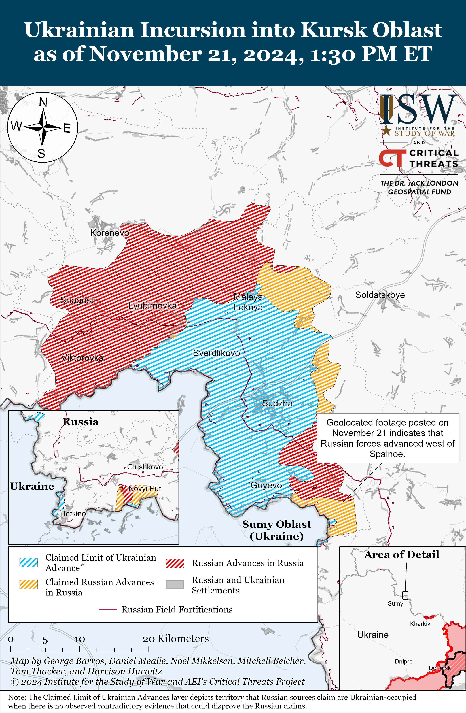
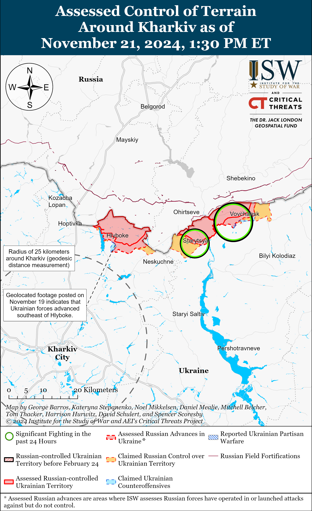
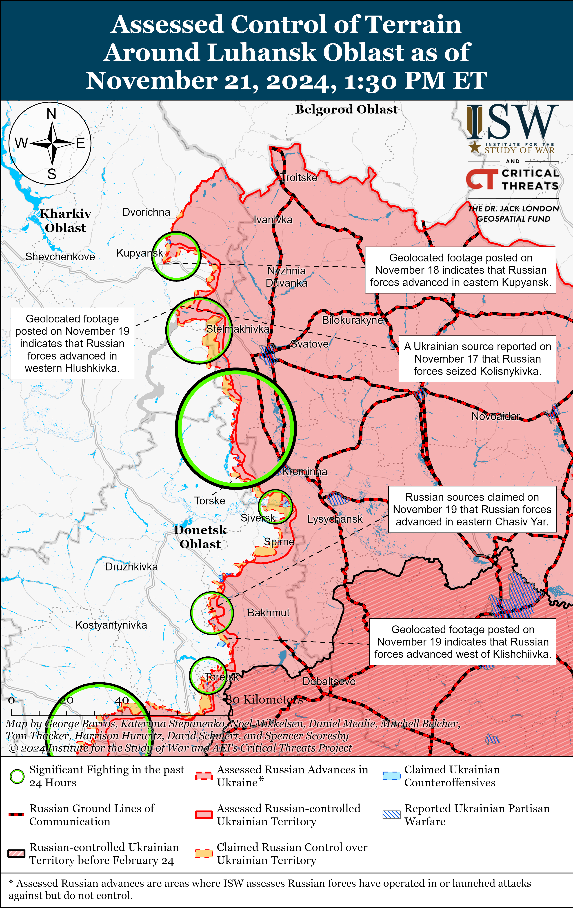
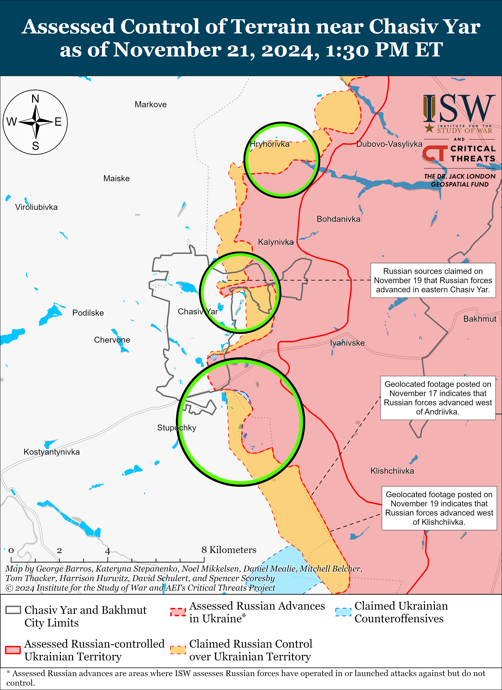
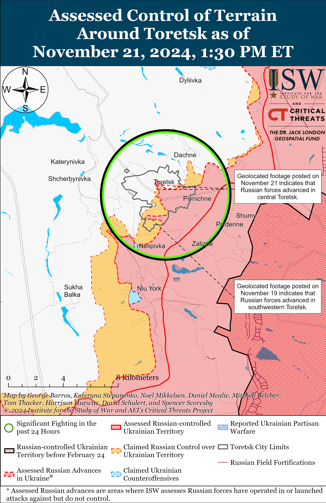
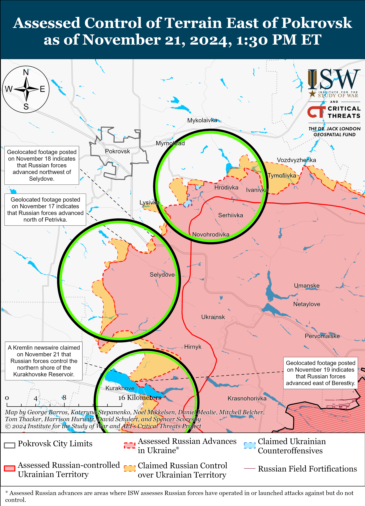
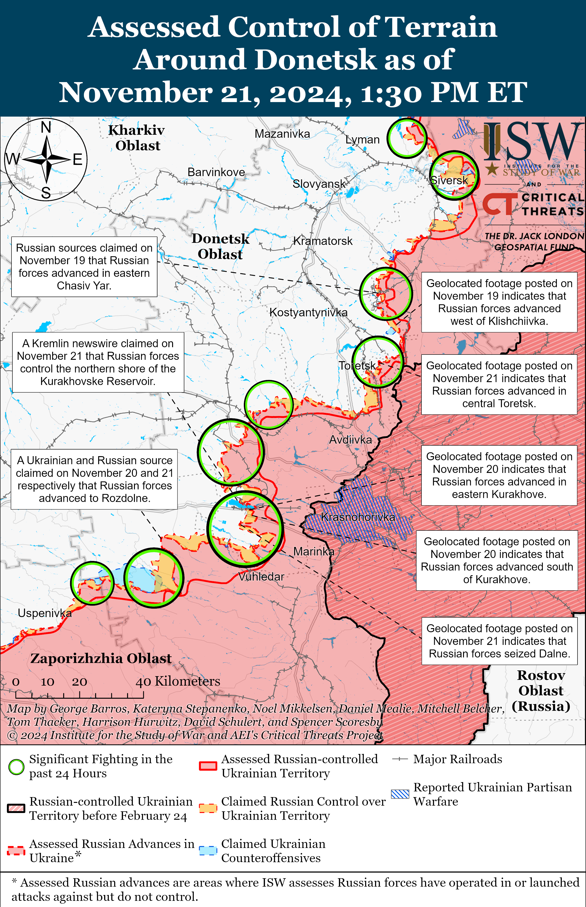
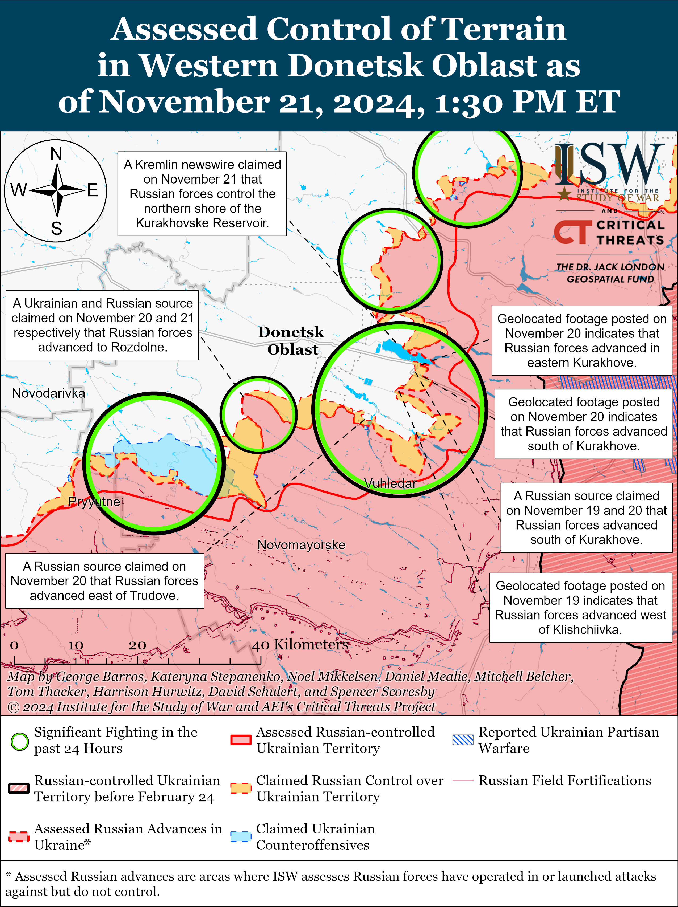
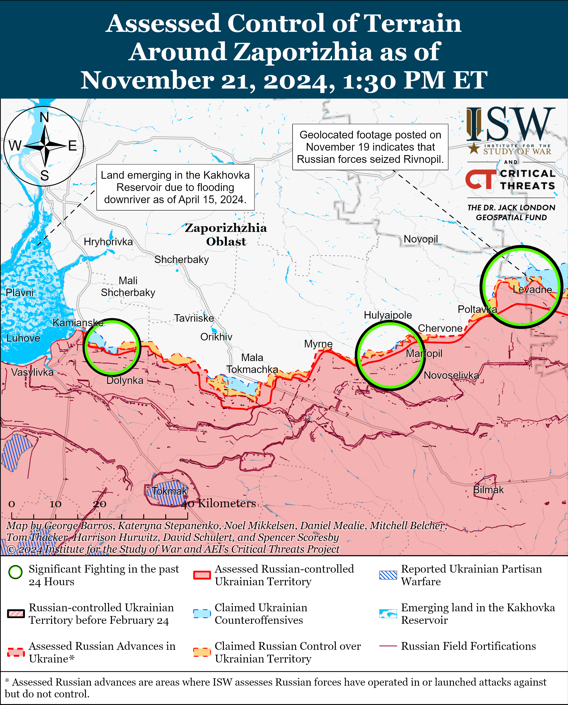
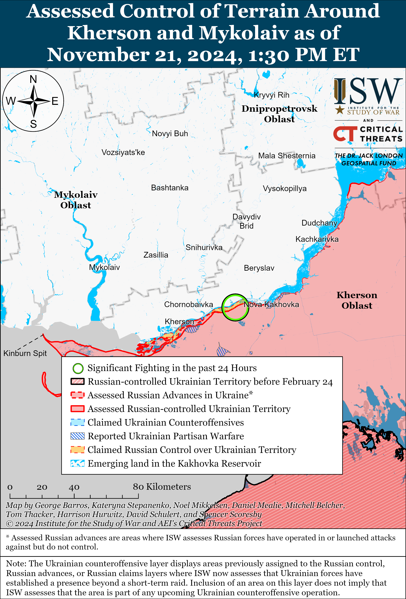

# Russian Offensive Campaign Assessment, November 21, 2024

**Grace Mappes, Karolina Hird, Davit Gasparyan, Angelica Evans, Olivia Gibson, Nate Trotter, William Runkel, and George Barros**

**November 21, 2024, 8:00pm ET**

**Click** [**here**](https://storymaps.arcgis.com/stories/36a7f6a6f5a9448496de641cf64bd375) **to see ISW’s interactive map of the Russian invasion of Ukraine. This map is updated daily alongside the static maps present in this report.**

**Click** [**here**](https://understandingwar.maps.arcgis.com/apps/instant/3dviewer/index.html?appid=1602762dbcde419bb957dea358449580) **to see ISW’s 3D control of terrain topographic map of Ukraine. Use of a computer (not a mobile device) is strongly recommended for using this data-heavy tool.**

**Click** [**here**](https://storymaps.arcgis.com/stories/733fe90805894bfc8562d90b106aa895) **to access ISW’s archive of interactive time-lapse maps of the Russian invasion of Ukraine. These maps complement the static control-of-terrain map that ISW produces daily by showing a dynamic frontline. ISW will update this time-lapse map archive monthly.**

**Note: The data cut-off for this product was 12:00pm ET on November 21. ISW will cover subsequent reports in the November 22 Russian Offensive Campaign Assessment.**

**Russian President Vladimir Putin intensified his reflexive control campaign aimed at Ukraine and its Western partners by conducting an ostentatious ballistic missile strike against Ukraine that used multiple reentry vehicles on November 21.** Russian forces conducted a complex strike against critical infrastructure and industrial enterprises in Dnipro City, Dnipropetrovsk Oblast, on the morning of November 21, that reportedly included a Kh-47M2 Kinzhal ballistic missile fired from Tambov Oblast, seven Kh-101 cruise missiles fired from Volgograd Oblast, and an experimental medium-range ballistic missile with reentry vehicles – likely a modified RS-26 “Rubezh” intermediate-range ballistic missile (IRBM) – fired from Astrakhan Oblast.[1] The Ukrainian Air Force reported that Ukrainian forces downed six Kh-101 cruise missiles and that the remaining missiles did not cause significant damage.[2] Ukrainian officials reported that the strike damaged an unspecified industrial enterprise (likely Ukraine’s Pivdenmash factory that manufactures missiles and space rockets), a medical facility, and residential areas in Dnipro City, and reported that a Russian missile also damaged residential areas in Kryvyi Rih, Dnipropetrovsk Oblast.[3] Western officials told Western media that the ballistic missile that targeted Dnipro City was not an intercontinental ballistic missile (ICBM) and was more likely a ballistic missile with a shorter range.[4]

**Putin explicitly threatened that Russia may attack Western countries that support Ukrainian deep strikes in Russia and rhetorically connected the November 21 ballistic missile strike to Russian nuclear capabilities — a marked intensification of an existing Russian information operation that aims to use explicit threats and nuclear saber-rattling to discourage continued Western military support for Ukraine**. Putin gave an address on the evening of November 21 claiming that Russian forces conducted a combined missile strike against Dnipro City, including with a new “Oreshnik” non-nuclear ballistic missile (which is reportedly an experimental variant of the RS-26 missile), framing the strike as a direct response to recent Ukrainian ATACMS and Storm Shadow strikes against military objects in Russiaand alleged “aggressive actions” of NATO states against Russia.[5] Putin threatened to strike the military facilities of Western countries that allow Ukraine to conduct strikes into Russia. Putin’s November 21 rhetoric is consistent with prior official Kremlin statements defining “red lines” that the Kremlin has attempted to use to deter Western states from supporting Ukraine. [6]

**Putin’s November 21 statement demonstrates that Moscow’s constant saber-rattling largely remains rhetorical.** Putin’s recent threats against the West have centered on Western states allowing Ukraine to conduct long-range strikes into “Russian territory,” but Ukrainian forces have been striking what the Kremlin illegally defines as “Russian territory” for a long time. The Kremlin has illegally defined occupied Crimea as part of Russia since Russia’s illegal annexation of Crimea in 2014, and Ukrainian forces have routinely struck Crimea with US-provided ATACMS and UK-provided Storm Shadow missiles since April 2023.[7] The Kremlin’s application of its “red lines” rhetoric has been wildly inconsistent, undermining the overall Russian escalation narrative.[8]Putin consistently escalates the war on his own without regard to Western decisions and has consistently declined to retaliate every time Western states have deepened their support of Ukraine. Putin previously threatened severe retaliation if Western states provided Ukraine with rocket artillery, tanks, warplanes, and the ability to strike into Russia, and Putin has constantly shifted the goalposts every time the West has called Putin’s bluff.

**Neither the Oreshnik ballistic missile strike nor Putin’s November 21 statement represent a significant inflection in Russian strike capabilities or likeliness to use a nuclear weapon**. Russian forces fire nuclear-capable Iskander ballistic missiles, Kinzhal hypersonic ballistic missiles, and nuclear-capable Kh-101 cruise missiles against Ukraine on a regular basis. Previous Russian missile strikes have targeted industrial and critical infrastructure including within Dnipro City that caused greater damage.[9] The only fundamentally new characteristic of the Russian strikes against Dnipro City on November 21 was the Oreshnik missile itself, which ostentatiously showcased reentry vehicles to amplify the spectacle of the strike and further imply a nuclear threat.[10][11] The West maintains credible deterrence options and Putin’s nuclear saber-rattling should not constrain Western officials from choosing to further aid Ukraine. US Central Intelligence Agency (CIA) Director Bill Burns cautioned Western policymakers against fearing Putin’s nuclear rhetoric in September 2024, describing Putin as a “bully” who will “continue to saber rattle from time to time.”[12]

**The Kremlin continues to demonstrate its full commitment to using the prospect of “negotiations” with Ukraine and the West to pursue nothing short of the total destruction of the Ukrainian state despite Russian President Vladimir Putin’s efforts to posture himself as amenable to peace negotiations.** Ukrainian outlet *Interfax Ukraine*, citing Ukrainian intelligence sources, reported on November 20 that the Russian Ministry of Defense (MoD) drafted a document forecasting global military-political developments until 2045 and proposing Russia’s vision of the future of Ukraine — which completely erases any semblance of a free and independent Ukrainian state or Ukrainian territorial sovereignty.[13] The Russian MoD document advocates partitioning Ukraine into three different parts: one acknowledging the full Russian annexation of occupied Luhansk, Donetsk, Zaporizhia, and Kherson oblasts and occupied Crimea; another establishing a pro-Russian puppet state centered in Kyiv under Russian military occupation; and a third part designating Ukraine’s western regions as “disputed territories” to be divided among Ukraine’s westernmost neighboring countries. The document also outlines future global scenarios, prioritizing those where Russia defeats Ukraine and secures a Russian-led multipolar international order. ISW cannot confirm the existence of such a document and has not observed the content of the reported document itself, but the *Interfax Ukraine* report is consistent with ISW’s ongoing assessments of the Kremlin’s intent to impose full Ukrainian capitulation and disinterest in good-faith negotiations.[14] The content also reveals that the Kremlin, regardless of the US administration or Western actors, maintains the same uncompromising strategic objectives in its war of dismantling Ukrainian sovereignty and bringing about the waning of Western influence globally.

**North Korean troops are reportedly training alongside Russian naval infantry and airborne (VDV) units.** South Korea’s National Intelligence Service (NIS) stated on November 20 that the North Korean troops who have already deployed to Russia are training with Russian naval infantry and VDV formations and noted that some North Korean troops have already participated in combat.[15] Ukrainian intelligence sources previously reported on October 15 that Russia’s 11th VDV Brigade was forming the dedicated “Special Buryat Battalion” staffed mainly by North Korean soldiers for combat operations in Kursk Oblast.[16] Russia’s Eastern Military District (EMD) may have the mandate for training, integrating, and deploying North Korean troops—ISW previously noted that North Korean soldiers were training alongside various Russian motorized rifle formations that belong to the EMD.[17] The EMD’s chain of command includes Russia’s Pacific Fleet, which is comprised of two naval infantry brigades — the 155th and the 40th — and Russia’s 11th and 83rd VDV brigades are located inside the EMD (though they are not part of the EMD’s chain of command), so the NIS’ assessment suggests that North Korean troops are likely training with elements that are based physically close to North Korea.[18] ISW has observed reports that elements of the 155th Naval Infantry Brigade and 11th and 83rd VDV brigades are actively deployed to combat in Kursk Oblast, which is where Ukrainian and South Korean intelligence confirmed North Korean troops have initially deployed.[19] It is therefore likely that North Korean troops are currently training with elements of the 155th, 11th, and 83rd brigades in preparation for combat in Kursk Oblast. Russian VDV forces often act as partner units during multilateral military training exercises with partner states such as Belarus and Serbia, suggesting that the aforementioned VDV brigades could be training North Korean troops, as VDV forces have trained with other foreign troops.[20]

**North Korea’s ability to learn and integrate lessons from fighting alongside Russia is likely to be significantly degraded if the Russian military command uses North Korean troops in the same highly attritional infantry-led assaults that it uses most Russian personnel.** ISW has assessed at length that the distinctions in quality between various Russian formations that existed prior to Russia’s full-scale invasion of Ukraine have become increasingly obsolete because of the way Russia is prosecuting its war.[21] Russian formations that were once considered “elite” or more specialized in terms of the tactical tasks they were associated with, such as VDV or naval infantry units, are now essentially functioning as understrength motorized rifle units, relying on infantry-led frontal assaults to make tactical gains as opposed to employing any sort of doctrinally-unique tactics.[22] Russian casualty rates on the frontline have forced the Russian military command to prioritize rushing new recruits to backfill vacancies in new units over providing them with sufficient basic, much less specialist, training.[23] These practices will likely extend to, and greatly impact, the experiences of North Korean troops fighting alongside Russian forces. North Korean troops training with VDV or naval infantry formations are likely to deploy to combat in the same way in which VDV and naval infantry soldiers deploy to combat—essentially as regular infantry forces. If the Russian command uses North Korean troops the same way that it uses Russian troops, North Korean troops are likely to face comparable rates of attrition to the rates that Russia is currently facing.[24] The losses that North Korean forces accrue in combat on behalf of Russia will dilute whatever institutional lessons the North Korean military was hoping to learn by joining Russia as a co-belligerent against Ukraine, as ISW recently assessed.[25]

**Key Takeaways:**

- **Russian President Vladimir Putin intensified his reflexive control campaign aimed at Ukraine and its Western partners by conducting an ostentatious ballistic missile strike against Ukraine that used multiple reentry vehicles on November 21.**
- **Putin explicitly threatened that Russia may attack Western countries that support Ukrainian deep strikes in Russia and rhetorically connected the November 21 ballistic missile strike to Russian nuclear capabilities – a marked intensification of an existing Russian information operation that aims to use explicit threats and nuclear saber-rattling to discourage continued Western military support for Ukraine**.
- **Putin’s November 21 statement demonstrates that Moscow’s constant saber-rattling largely remains rhetorical.**
- **Neither the Oreshnik ballistic missile strike nor Putin’s November 21 statement represent a significant inflection in Russian strike capabilities or likeliness to use a nuclear weapon**.
- **The Kremlin continues to demonstrate its full commitment to use the prospect of “negotiations” with Ukraine and the West to pursue nothing short of the total destruction of the Ukrainian state despite Russian President Vladimir Putin’s efforts to posture himself as amenable to peace negotiations.**
- **North Korean troops are reportedly training alongside Russian naval infantry and airborne (VDV) units.**
- **North Korea’s ability to learn and integrate lessons from fighting alongside Russia is likely to be significantly degraded if the Russian military command uses North Korean troops in the same highly attritional infantry-led assaults that it uses most Russian personnel.**
- **Russian forces recently marginally advanced in the main Ukrainian salient in Kursk Oblast southeast of Sudzha.**
- **Ukrainian forces recently advanced north of Vuhledar. Russian forces recently advanced northwest of Kreminna, southeast of Chasiv Yar, in Toretsk, southeast of Kurakhove, northeast of Vuhledar, and likely advanced northeast of Velyka Novosilka.**
- **The Russian State Duma adopted a three-year federal budget with record defense expenditures from 2025-2027.**

***We do not report in detail on Russian war crimes because these activities are well-covered in Western media and do not directly affect the military operations we are assessing and forecasting. We will continue to evaluate and report on the effects of these criminal activities on the Ukrainian military and the Ukrainian population and specifically on combat in Ukrainian urban areas. We utterly condemn Russian violations of the laws of armed conflict and the Geneva Conventions and crimes against humanity even though we do not describe them in these reports.***

- Ukrainian Operations in the Russian Federation
- Russian Main Effort – Eastern Ukraine (comprised of three subordinate main efforts)
- Russian Subordinate Main Effort #1 – Push Ukrainian forces back from the international border with Belgorod Oblast and approach to within tube artillery range of Kharkiv City
- Russian Subordinate Main Effort #2 – Capture the remainder of Luhansk Oblast and push westward into eastern Kharkiv Oblast and encircle northern Donetsk Oblast
- Russian Subordinate Main Effort #3 – Capture the entirety of Donetsk Oblast
- Russian Supporting Effort – Southern Axis
- Russian Air, Missile, and Drone Campaign
- Russian Mobilization and Force Generation Efforts
- Russian Technological Adaptations
- Activities in Russian-occupied areas
- Significant Activity in Belarus

**Ukrainian Operations in the Russian Federation**

Russian forces recently marginally advanced southeast of Sudzha amid continued offensive operations in the main Ukrainian salient in Kursk Oblast. Geolocated footage published on November 21 shows that Russian forces recently marginally advanced west of Spalnoye (southeast of Sudzha).[26] Russian milbloggers continued to claim that Russian forces cleared Ukrainian positions in the forests near Olgovka (east of Korenevo), entered Darino (southeast of Korenevo), are repelling Ukrainian counterattacks near the settlements.[27] Elements of the Russian 26th Tank Regiment (47th Tank Division, 1st Guards Tank Army [GTA], Moscow Military District [MMD]) and 11th Airborne (VDV) Brigade are reportedly operating near Martynovka (northeast of Sudzha); elements of the “Aida” group of Chechen “Akhmat” Spetsnaz are reportedly operating in the Sudzha direction; and elements of the Russian 106th VDV Division, 44th Army Corps (AC) (Leningrad Military District [LMD]), and “Phoenix” Battalion are reportedly operating in Kursk Oblast.[28]  
  
 Russian officials claimed that Russian forces repelled Ukrainian drone strikes near Akhtubinsk, Astrakhan Oblast, and a Russian insider source claimed that the drones may have targeted the Kasputin Yar missile launch site.[29]

The recent Ukrainian strike against a Russian command post in Maino, Kursk Oblast reportedly injured a senior North Korean general. The *Wall Street Journal* (WSJ) cited a Western official that a recent Ukrainian strike against Kursk Oblast wounded a senior North Korean general, but the official did not provide details on the general’s condition.[30] Russian President Vladimir Putin confirmed on November 21 that Ukrainian forces struck a Russian “Northern” Group of Forces command post in Kursk Oblast and killed and wounded security personnel but claimed that the strike did not injure commanders.[31] A Russian insider source claimed on November 21 that the Ukrainian strike killed 18 Russian soldiers and wounded 33 personnel, including three North Korean personnel.[32] The insider source claimed that LMD First Deputy Commander Lieutenant General Valery Solodchuk was at the headquarters at the time of the strike and that his status is unknown. ISW cannot confirm these claims.

**Russian Main Effort – Eastern Ukraine**

**Russian Subordinate Main Effort #1 – Kharkiv Oblast (Russian objective: Push Ukrainian forces back from the international border with Belgorod Oblast and approach to within tube artillery range of Kharkiv City)**

Russian forces continued offensive operations northeast of Kharkiv City near Vovchansk and Starytsya on November 20 and 21 but did not make any confirmed advances.[33] A Russian milblogger claimed on November 20 that Russian forces repelled a Ukrainian counterattack in the Lyptsi direction near Hlyboke (north of Kharkiv City).[34] A Russian milblogger claimed on November 21 that Russian forces advanced near high-rise buildings in Vovchansk, but ISW has not observed confirmation of this claim.[35] Ukrainian “Kharkiv” Group of Forces Spokesperson Lieutenant Colonel Yevheniy Romanov stated that worsening weather conditions are preventing Russian forces from concealing mechanized infantry movements in fields due to the loss of foliage and that anticipated snowy weather conditions will allow Ukrainian forces to monitor the tracks of Russian mechanized infantry in the snow.[36] Drone operators of the Russian 16th Spetsnaz Brigade (Russian General Staff’s Main Directorate [GRU]) are reportedly operating in an unspecified area of Kharkiv Oblast.[37] Drone operators of the Russian 1009th Motorized Rifle Regiment (a mobilized unit reportedly subordinated to the 6th Combined Arms Army [CAA], Leningrad Military District [LMD]) are reportedly operating in the Vovchansk direction.[38]

**Russian Subordinate Main Effort #2 – Luhansk Oblast (Russian objective: Capture the remainder of Luhansk Oblast and push westward into eastern Kharkiv Oblast and northern Donetsk Oblast)**

Russian forces recently advanced northwest of Kreminna amid continued offensive operations along the Kupyansk-Svatove-Kreminna line on November 21. Geolocated footage posted on November 21 shows that Russian forces recently advanced in central Terny (northwest of Kreminna).[39] Russian milbloggers claimed on November 21 that Russian forces advanced in eastern Kupyansk in an area northeast of the Zaoskillya railway station; southeast of Kupyansk on the outskirts of Hlushkivka; and in forest areas west of Stelmakhivka (northwest of Svatove).[40] The Ukrainian General Staff reported that Russian forces conducted offensive operations east of Kupyansk near Kucherivka and Petropavlivka; southeast of Kupyansk near Zahryzove, Kolisnykivka, Kruhlyakivka; northwest of Svatove near Lozova; west of Svatove near Zeleny Hai; southwest of Svatove near Cherneshchyna, Novoyehorivka, and Tverdokhlibove; northwest of Kreminna near Hrekivka and Terny; west of Kreminna near Zarichne and Torske; and southwest of Kreminna near Hryhorivka, Serebryanka, and the Serebryanske forest area on November 20 and 21.[41] Russian milbloggers claimed on November 21 that Russian forces struck a Ukrainian pontoon bridge spanning the Siverskyi Donets River in the Lyman (west of Kreminna) direction.[42] Another Russian milblogger claimed that the Russian Aerospace Forces [VKS] are conducting airstrikes against Ukrainian positions in Terny, potentially to aid Russian ground assaults in the area.[43]

**Russian Subordinate Main Effort #3 – Donetsk Oblast (Russian objective: Capture the entirety of Donetsk Oblast, the claimed territory of Russia’s proxies in Donbas)**

Neither Russian nor Ukrainian sources reported fighting in the Siversk direction. A Ukrainian drone unit commander operating in the Siversk direction reported that weather conditions are complicating Russian infantry foot-mobile assaults, as muddy conditions are hindering soldiers’ movement and making Russian infantry easy targets for Ukrainian drone operators.[44] Footage posted on November 21 purportedly shows elements of the Russian 2nd Artillery Brigade (3rd Combined Arms Army [CAA], formerly the 2nd Luhansk People’s Republic [LNR] Army Corps [AC]) striking Ukrainian forces east of Pereizne (south of Siversk) with drone reconnaissance support from elements of the Russian 88th Motorized Rifle Brigade (3rd CAA).[45]

Russian forces recently advanced southeast of Chasiv Yar and continued offensive operations on November 21. Geolocated footage published on November 19 indicates that elements of the Russian 6th Motorized Rifle Division (3rd AC) recently advanced across a section of the Siverskyi-Donets Donbas Canal west of Klishchiivka (southeast of Chasiv Yar).[46] The Ukrainian General Staff reported that Russian forces attacked near Chasiv Yar and Stupochky (south of Chasiv Yar) on November 21.[47] Russian sources reported on November 20 and 21 that intense fighting continues in Chasiv Yar and on its flanks.[48] A Russian milblogger claimed on November 21 that Russian forces operating near Orikhovo-Vasylivka tactically advanced in the direction of Slovyansk and that Russian forces are fewer than 24 kilometers from Slovyansk.[49] Russian drone operators from the “Okhotnik” (Hunter) Spetsnaz Detachment (51st CAA, formerly 1st Donetsk People’s Republic [DNR] AC) allegedly continue to target Ukrainian forces near Chasiv Yar.[50] Elements of the Russian 98th Airborne (VDV) Division reportedly continue to operate near Chasiv Yar.[51]

Russian forces continued offensive operations and made confirmed gains within Toretsk. Geolocated footage posted on November 14 and 21 indicates that Russian forces advanced in central Toretsk.[52] The Ukrainian General Staff reported that Russian forces continue to conduct ground attacks with air support near Toretsk and Shcherbynivka (west of Toretsk).[53] A Russian source claimed that Russian forces allegedly occupied over 50 percent of Toretsk as of November 21.[54] A Russian milblogger claimed that Russian forces advanced in the high part of the city near Hrushevskoho Street and reached the Avanhard Stadium.[55] The milblogger also claimed that fierce battles continue near Nelipivka (southwest of Toretsk) and Shcherbynivka.

Russian forces continued assaults in the Pokrovsk direction on November 21 but did not advance. Russian milbloggers claimed that Russian forces operating south of Pokrovsk advanced along the railway line on the eastern outskirts of Petrivka (west of Selydove), up to 800 meters near Pustynka (just southwest of Petrivka), and 1.5 kilometers west of Novoleksiivka (south of Petrivka).[56] The milbloggers claimed that Russian forces operating south of Pokrovsk are also trying to advance northwest of Yurivka and from Novooleksiivka towards Pushkine (northwest of Novooleksiivka) and Ukrainka (west of Novooleksiivka).[57] The Ukrainian General Staff reported that Russian forces are intensifying assaults in the Pokrovsk direction.[58] Russian forces continued assaults east of Pokrovsk near Myrolyubivka and Promin; southeast of Pokrovsk near Lysivka, Krutyi Yar, Krasnyi Yar, and Dachenske and south of Pokrovsk near Petrivka, Yurivka, Hryhorivka, Pushkine, Zhovte, Chumatske, Pustynka, and Novooleksiivka on November 20 and 21.[59]

Russian forces recently advanced southeast of Kurakhove amid continued offensive operations in the area on November 21. Geolocated footage published on November 20 and 21 indicates that Russian forces recently advanced in the fields south of Kurakhove and in a building in western Dalne (south of Kurakhove), indicating that Russian forces have likely seized Dalne.[60] Russian sources, including the Russian Ministry of Defense (MoD), claimed that elements of the Russian 102nd Motorized Rifle Regiment (150th Motorized Rifle Division, 8th Combined Arms Army [CAA], Southern Military District [SMD]) seized Dalne and that Russian forces are advancing southwest of the settlement.[61] Russian milbloggers claimed that Russian forces advanced into central Sontsivka (northeast of Kurakhove), cleared Ukrainian forces from the northern shore of the Kurakhivske Reservoir, advanced near the grain elevator in central Kurakhove, and advanced 1.5 kilometers south of Maksymilyanivka (east of Kurakhove).[62] One Russian milblogger claimed that Russian forces are successfully advancing in the Kurakhove direction because Russian forces are successfully integrating ground activity with air and artillery support, although another Russian milblogger claimed that poor weather conditions are slowing the pace of Russian advances in this direction.[63] Russian forces continued assaults northeast of Kurakhove near Sontsivka and Zorya; north of Kurakhove near Berestky; near Kurakhove itself; east of Kurakhove near Maksymilyanivka; and south of Kurakhove near Dalne on November 20 and 21.[64] Elements of the Russian 238th Artillery Brigade (8th CAA, SMD) reportedly continue to operate in Kurakhove, and elements of the Russian 1461st “Amur” Motorized Rifle Regiment’s (reportedly assigned to the 35th CAA, Eastern Military District [EMD]) 2nd Battalion are operating in the Kurakhove direction.[65] Elements of the Russian 150th Motorized Rifle Brigade and 5th Motorized Rifle Brigade (51st CAA) also reportedly continue to operate in this direction.[66]

Ukrainian forces recently advanced north of Vuhledar amid recent Russian advances northeast of Vuhledar. Geolocated footage published on November 20 indicates that Ukrainian forces recently advanced in the fields north of Bohoyavlenka (north of Vuhledar), and geolocated footage published on November 13 indicates that Russian forces advanced north of Antonivka (northeast of Vuhledar).[67] Additional geolocated footage published on November 20 indicates that Russian forces recently conducted a platoon-sized mechanized assault east of Bohoyavlenka, but did not advance during the mechanized assault.[68] Russian milbloggers claimed that Russian forces are advancing north of Vuhledar near Trudove and advanced from Maksymivka towards Kostyantynopolske and Sukhi Yaly.[69] The Ukrainian General Staff noted that Russian forces are focusing their assaults near Antonivka (northeast of Vuhledar), indicating that the Russian military command is prioritizing efforts to breakthrough and advanced along the C051104 highway.[70] Russian forces continued assaults northeast of Vuhledar near Katerynivka, Yelizavetivka, and Antonivka; north of Vuhledar near Trudove and Sukhi Yaly; and northwest of Vuhledar near Kostyantynopolske and in the direction of Rozlyv on November 20 and 21.[71] Elements of the Russian 33rd Motorized Rifle Regiment (20th Motorized Rifle Division, 8th Combined Arms Army [CAA], Southern Military District [SMD]) are reportedly operating near Antonivka.[72] Drone operators of the Russian 14th Spetsnaz Brigade (Russian General Staff‘s Main Military Intelligence Directorate [GRU]) and elements of the Russian 200th Motorized Rifle Brigade (14th Army Corps [AC], Leningrad Military District [LMD]) are reportedly operating near Sukhi Yaly.[73]

Russian forces likely advanced northeast of Velyka Novosilka amid continued assaults near the settlement on November 21. A Ukrainian military observer and Kremlin-affiliated Russian milblogger stated on November 20 that elements of the Russian 5th Tank Brigade (36th Combined Arms Army [CAA], Eastern Military District [EMD]) and 40th Naval Infantry Brigade (Pacific Fleet, EMD) recently entered the outskirts of Rozdolne (northeast of Velyka Novosilka).[74] The milblogger claimed that Russian forces also advanced to the eastern outskirts of Velyka Novosilka along the O-0510 Kurakhove-Velyka Novosilka highway and that elements of the Russian 37th Motorized Rifle Brigade (36th CAA, EMD) recently advanced in the direction of Blahodatne (south of Velyka Novosilka).[75] Other Russian milbloggers claimed that Russian forces advanced in the fields east of Velyka Novosilka, near Rozdolne, three kilometers near Novodonetske (southwest of Velyka Novosilka), and from Rivnopil (southwest of Velka Novosilka) in the direction of Velyka Novosilka.[76] Russian milbloggers claimed that Russian forces are conducting mechanized assaults of an unspecified echelon and ground attacks from Shakhtarske (east of Velyka Novosilka and northwest of Vuhledar) in the direction of Rozdolne and Velyka Novosilka and are attempting to make significant advances in the fields east of Velyka Novosilka and bypass the settlement to the north.[77] Russian forces continued assault northeast of Velyka Novosilka near Rozdolne, near Velyka Novosilka itself, and northwest of Velyka Novosilka near Novodarivka on November 20 and 21.[78] ISW recently assess that Russian forces may attempt to flank Ukrainian positions in Velyka Novosilka from the east and intensify pressure on Velyka Novosilka from the south in order to force Ukraine to withdraw from the settlement and enable further Russian advances towards the southwestern most edge of the Donetsk Oblast administrative boundary.[79]

**Russian Supporting Effort – Southern Axis (Russian objective: Maintain frontline positions and secure rear areas against Ukrainian strikes)**

A Russian milblogger claimed on November 21 that Russian forces cleared Ukrainian positions on the northern outskirts of Dorozhnyanka (south of Hulyaipole), but ISW has not observed confirmation of this claim.[80]

Russian forces continued assaults in western Zaporizhia Oblast north of Robotyne near Orikhiv, Mala Tokmachka, and Novodanylivka and northwest of Robotyne near Pyatykhatky on November 21 but did not advance.[81]

Russian forces targeted the occupied Zaporizhzhia Nuclear Power Plant (ZNPP) as part of an enduring effort to throttle the Ukrainian power grid.[82] Ukraine’s Ministry of Energy reported on November 21 that Russian artillery shelling damaged one of the ZNPP’s two external power lines connected to the Ukrainian power grid.[83] Kremlin newswire *TASS* claimed that “automatic control” caused the ZNPP’s high voltage “Dneprovska” line to become disconnected from the Ukrainian power grid.[84]

Positional fighting continued in the Dnipro direction in east (left) bank Kherson Oblast on November 20 and 21, but there were no changes to the frontline.[85]

Kremlin newswire *TASS* reported on November 21 that Russian forces shot down a Ukrainian Neptune anti-ship missile over the Black Sea near occupied Sevastopol, Crimea.[86]

**Russian Air, Missile, and Drone Campaign (Russian Objective: Target Ukrainian military and civilian infrastructure in the rear and on the frontline)**

*See topline text.*

**Russian Mobilization and Force Generation Efforts (Russian objective: Expand combat power without conducting general mobilization)**

The Russian State Duma adopted a three-year federal budget with record defense expenditures from 2025-2027. The Duma adopted the “On the Federal Budget for 2025 and for the Planning Period of 2026-2027” bill on November 21, which allocates 13.5 trillion rubles (6.31 percent of Russia’s GDP and about $133 billion) to “national defense” expenditures in 2025, 12.8 trillion rubles (about $126 billion) in 2026, and 13.1 trillion rubles (about $129 billion) in 2027.[87] The Duma has designated 3.5 trillion rubles (about $34 billion) for “National Security and Law Enforcement” in 2025 which, combined with the allocated spending on defense, will account for 41 percent of the total Russian federal budget expenditures. ISW previously noted that increases in defense spending do not necessarily equate to increased military capabilities, however, especially when a significant portion of this funding is going towards social benefits for Russian soldiers, veterans, and their families.[88]

Russian authorities continue efforts to coerce people into signing military service contracts with the Ministry of Defense (MoD) in Russia and occupied Ukraine in order to avoid conducting another involuntary call-up of Russian reservists. Ukrainian Mariupol Mayoral Advisor Petro Andryushchenko stated on November 21 that Russian military recruiters are forcibly taking young men from settlements in occupied Mariupol Raion to regional recruitment and enlistment offices and coercing them into signing service contracts with the Russian MoD.[89] Independent Russian-language outlet *Idel Realii* stated on November 21 that the Bashkortostan branch of the Russian Volunteer Society for Assistance to the Army, Aviation, and Navy of Russia (DOSAAF) paid third-party individuals 50,000 rubles (about $494) for bringing prospective recruits to sign a military service contract and that 2,300 applicants from the Republic of Bashkortostan are awaiting their contracts.[90] A Ukrainian brigade operating in the Kurakhove direction reported that it captured Russian prisoners of war (POWs) who claimed that the Russian MoD forced them to sign service contracts in prison and sent them into frontline assaults without weapons.[91]

**Russian Technological Adaptations (Russian objective: Introduce technological innovations to optimize systems for use in Ukraine)**

Nothing significant to report.

**Activities in Russian-occupied areas (Russian objective: Consolidate administrative control of annexed areas; forcibly integrate Ukrainian citizens into Russian sociocultural, economic, military, and governance systems)**

*ISW is not publishing coverage of activities in Russian-occupied areas today.*

**Significant activity in Belarus (Russian efforts to increase its military presence in Belarus and further integrate Belarus into Russian-favorable frameworks and Wagner Group activity in Belarus)**

Russia continues to transfer military assets to Belarus while accelerating efforts to implement key aspects of the Union State Treaty. Russian and Belarusian state media reported that Russia transferred another Tor-M2 air defense battery to Belarus on November 21 to improve air defense capabilities near Minsk.[92] The Russian military will very likely integrate these new systems into the existing Russian-Belarusian regional joint air defense system, granting Moscow control over their employment. The air defense system arrived amid comments made by Russian State Duma Defense Committee Andrei Kartapolov on November 21, who stated that Russia’s updated nuclear doctrine specifically states that Russia will provide Belarus with the necessary support to defend against an attack from unspecified Western countries.[93] Belarusian state media reported on November 21 that Belarusian Prime Minister Roman Golovchenko met Russian Kirov mechanical engineering plant CEO Sergei Serebryakov to discuss the development of joint machine-building enterprises in connection with the implementation of the Union State Treaty.[94]

**Note: ISW does not receive any classified material from any source, uses only publicly available information, and draws extensively on Russian, Ukrainian, and Western reporting and social media as well as commercially available satellite imagery and other geospatial data as the basis for these reports. References to all sources used are provided in the endnotes of each update.**

[1] https://t.me/kpszsu/23380; https://x.com/99Dominik\_/status/1859582525208690895; https://x.com/99Dominik\_/status/1859582705567981958; https://t.me/ukrpravda\_news/53520; https://x.com/ArmsControlWonk/status/1859647866534539285; https://x.com/shashj/status/1859572972513567224; https://www.pravda.com dot ua/news/2024/11/21/7485582/; https://t.me/V\_Zelenskiy\_official/12544 ; https://suspilne dot media/885087-putin-vikoristovue-ukrainu-ak-poligon-zelenskij-pro-udar-mbr-po-dnipru/; https://armyinform dot com.ua/2024/11/21/povitryani-syly-rosiyany-zapustyly-po-ukrayini-mizhkontytentalnu-balistychnu-raketu/

[2] https://t.me/kpszsu/23380;

[3] https://suspilne dot media/dnipro/884705-u-dnipri-prolunali-vibuhi-so-vidomo-7/; https://suspilne dot media/884665-paket-dopomogi-vid-ssa-rozstril-ukrainskih-polonenih-v-kurskij-oblasti-1002-den-vijni-onlajn/?anchor=live\_1732167000&utm\_source=copylink&utm\_medium=ps ; https://suspilne dot media/884665-paket-dopomogi-vid-ssa-rozstril-ukrainskih-polonenih-v-kurskij-oblasti-1002-den-vijni-onlajn/?anchor=live\_1732183949&utm\_source=copylink&utm\_medium=ps

[4] ICBMs have ranges of over 5,500 kilometers, and Dnipro City is roughly 780 kilometers from Kapustin Yar, a known Russian missile launch site in Astrakhan Oblast from which Russian sources speculated Russian forces launched the missile.  
 https://www.nbcnews.com/news/world/russia-launched-icbm-ukraine-war-putin-rcna181131; https://www.reuters.com/world/europe/russia-launches-intercontinental-ballistic-missile-attack-ukraine-kyiv-says-2024-11-21/; https://www.cnn.com/2024/11/21/europe/ukraine-russia-missile-wwk-intl/index.html#:~:text=ICBMs%20are%20considered%20to%20have,Arms%20Control%20and%20Non%2DProliferation; https://t.me/bbcrussian/73223; https://t.me/vchkogpu/52654; https://t.me/vchkogpu/52653; https://t.me/bbcrussian/73225;

[5] http://kremlin dot ru/events/president/news/75614

[6] https://www.washingtonpost.com/world/2024/09/22/putin-russia-red-lines-nuclear-threat-retaliation/; https://understandingwar.org/backgrounder/russian-offensive-campaign-assessment-september-22-2024; https://isw.pub/UkrWar101824; https://isw.pub/UkrWar111824; https://isw.pub/UkrWar102924; https://understandingwar.org/backgrounder/russian-offensive-campaign-assessment-november-19-2024

[7] https://understandingwar.org/backgrounder/special-edition-campaign-assessment-ukraine%E2%80%99s-strike-campaign-against-crimea; https://understandingwar.org/backgrounder/ukrainian-strikes-have-changed-russian-naval-operations-black-sea; https://www.reuters.com/world/europe/russia-shoots-down-six-us-made-atacms-missiles-2024-04-30/; https://www.rferl.org/a/ukraine-russia-crimea-atacms/32925212.html

[8] https://understandingwar.org/backgrounder/russian-offensive-campaign-assessment-november-19-2024

[9] https://www.kyivpost dot com/post/40122; https://tsn dot ua/en/ato/attack-by-shaheds-and-kinzhal-missiles-on-ukraine-how-many-targets-were-shot-down-by-the-air-defense-2674989.html; https://t.me/ComAFUA/343; https://www.osw.waw dot pl/en/publikacje/analyses/2024-03-26/russian-forces-destroy-dnipro-hydroelectric-power-station-day-761; https://kyivindependent dot com/kinzhal-missile-downed-kyiv-patriot-may-2023/; https://x.com/EuromaidanPR/status/1773295125969473779; https://understandingwar.org/backgrounder/russian-offensive-campaign-assessment-november-17-2024; https://understandingwar.org/backgrounder/russian-offensive-campaign-assessment-july-8-2024; https://understandingwar.org/backgrounder/russian-offensive-campaign-assessment-october-7-2024; https://understandingwar.org/backgrounder/russian-offensive-campaign-assessment-may-29-2024; https://understandingwar.org/backgrounder/russian-offensive-campaign-assessment-october-7-2024

[10] http://kremlin dot ru/events/president/news/75614; https://missilethreat.csis.org/missile/kinzhal/

[11] https://isw.pub/UkrWar111924

[12] https://www.theguardian.com/world/article/2024/sep/07/cia-west-russia-nuclear-threats-putin; https://understandingwar.org/backgrounder/russian-offensive-campaign-assessment-september-8-2024

[13] https://interfax.com dot ua/news/general/1028868.html

[14] https://understandingwar.org/backgrounder/russian-offensive-campaign-assessment-november-19-2024

[15] https://www.donga dot com/news/Politics/article/all/20241121/130471039/2

[16] https://news.liga.net/ua/politics/news/rosiia-formuie-batalion-z-pivnichnokoreiskykh-hromadian-na-bazi-buriatskoi-bryhady-dzherelo; https://suspilne dot media/858415-rf-formue-osoblivij-buratskij-bataljon-ukomplektovanij-gromadanami-kndr-dzerela-v-rozvidci/

[17] https://understandingwar.org/backgrounder/north-korea-joins-russias-war-against-ukraine-operational-and-strategic-implications

[18] https://understandingwar.org/wp-content/uploads/2024/11/October20122C20202320Russian20Orbat\_Final.pdf

[19] https://understandingwar.org/backgrounder/russian-offensive-campaign-assessment-november-20-2024; https://understandingwar.org/backgrounder/russian-offensive-campaign-assessment-november-18-2024; https://understandingwar.org/backgrounder/russian-offensive-campaign-assessment-october-27-2024; https://understandingwar.org/backgrounder/russian-offensive-campaign-assessment-november-9-2024; https://news.kbs.co dot kr/news/pc/view/view.do?ncd=8105225; https://www.newsweek.com/us-update-north-korea-troops-10000-russia-ukraine-war-combat-kursk-1985001; https://news.kbs.co dot kr/news/pc/view/view.do?ncd=8098257; https://suspilne dot media/873115-dzerelo-v-specsluzbah-u-kurskij-oblasti-vidbulisa-persi-bojovi-zitknenna-z-soldatami-kndr/

[20] https://sputnikglobe dot com/20240413/vdv-for-export-what-russia-has-to-gain-by-helping-other-countries-build-powerful-airborne-forces-1117915257.html; https://understandingwar.org/backgrounder/belarus-warning-update-russia-expands-unit-integration-belarusian-and-serbian

[21] https://understandingwar.org/backgrounder/russian-offensive-campaign-assessment-june-20-2024; https://understandingwar.org/backgrounder/russia%E2%80%99s-military-restructuring-and-expansion-hindered-ukraine-war

[22] https://understandingwar.org/backgrounder/russian-offensive-campaign-assessment-september-28; https://understandingwar.org/backgrounder/russian-offensive-campaign-assessment-june-20-2024; https://understandingwar.org/backgrounder/russia%E2%80%99s-military-restructuring-and-expansion-hindered-ukraine-war; https://www.businessinsider.com/russians-debate-role-of-elite-vdv-paratroopers-after-ukraine-losses-2023-2

[23] https://understandingwar.org/backgrounder/russian-offensive-campaign-assessment-october-10-2024;

[24] https://armyinform dot com.ua/2024/11/20/takyj-sobi-pryvit-vid-kima-v-dshv-rozpovily-pro-sumnivnu-boyezdatnist-pivnichnokorejskyh-najmancziv/; https://understandingwar.org/backgrounder/russian-offensive-campaign-assessment-november-17-2024

[25] https://understandingwar.org/backgrounder/north-korea-joins-russias-war-against-ukraine-operational-and-strategic-implications

[26] https://x.com/GermanObserver1/status/1859662057127412060; https://t.me/wttheravens/44

[27] https://t.me/wargonzo/23267; https://t.me/dva\_majors/58243;

[28] https://t.me/severnnyi/2674; https://t.me/RKadyrov\_95/5245; https://t.me/boris\_rozhin/145138; https://t.me/boris\_rozhin/145060; https://t.me/tass\_agency/286552

[29] https://t.me/tass\_agency/286549; https://t.me/vchkogpu/52654; https://t.me/vchkogpu/52653 ; https://t.me/vchkogpu/52654; https://t.me/vchkogpu/52653 ;

[30] https://www.wsj.com/world/senior-north-korean-general-wounded-in-recent-ukrainian-strike-western-official-says-c138121b?st=eBUFs8

[31] http://kremlin dot ru/events/president/news/75614

[32] https://t.me/vchkogpu/52644

[33] https://www.facebook.com/GeneralStaff.ua/posts/pfbid0ZK5BUrMdhB9FpLohYpaQExzmD8sKH5iVAF3boPWyuZKdf19CtMP4bn22aF42jbmjl; https://www.facebook.com/GeneralStaff.ua/posts/pfbid02okiL86GrrfZwH4X7rcC57qaNkAfhZNwuFmqAV1c15SYDR7CGLcFh2Hvop8kyNnyrl; https://www.facebook.com/GeneralStaff.ua/posts/pfbid022kvHEwNbcEXqFvSbYbfGKifP3bEy8ZS7HY8QSSx6n1M3ZSGoZSweCmptxBAnqdPSl; https://t.me/otukharkiv/2684

[34] https://t.me/vysokygovorit/18055

[35] https://t.me/DnevnikDesantnika/19632

[36] https://www.youtube.com/watch?v=j5TqaWCCdUg; https://armyinform dot com.ua/2024/11/21/snizhok-padaye-stezhky-vidstezhuyutsya-zmina-pogody-bolyache-bye-po-okupantam-na-harkivshhyni/

[37] https://t.me/boris\_rozhin/145071

[38] https://t.me/boris\_rozhin/145087

[39] https://t.me/creamy\_caprice/7580 ;  https://t.me/ssternenko/36483

[40] https://t.me/tass\_agency/286488 ; https://t.me/DnevnikDesantnika/19596 ; https://t.me/rybar/65575

[41] https://www.facebook.com/GeneralStaff.ua/posts/pfbid0ZK5BUrMdhB9FpLohYpaQExzmD8sKH5iVAF3boPWyuZKdf19CtMP4bn22aF42jbmjl ; https://www.facebook.com/GeneralStaff.ua/posts/pfbid02okiL86GrrfZwH4X7rcC57qaNkAfhZNwuFmqAV1c15SYDR7CGLcFh2Hvop8kyNnyrl ; https://www.facebook.com/GeneralStaff.ua/posts/pfbid022kvHEwNbcEXqFvSbYbfGKifP3bEy8ZS7HY8QSSx6n1M3ZSGoZSweCmptxBAnqdPSl ; https://www.facebook.com/GeneralStaff.ua/posts/pfbid0ZK5BUrMdhB9FpLohYpaQExzmD8sKH5iVAF3boPWyuZKdf19CtMP4bn22aF42jbmjl ; https://www.facebook.com/GeneralStaff.ua/posts/pfbid02okiL86GrrfZwH4X7rcC57qaNkAfhZNwuFmqAV1c15SYDR7CGLcFh2Hvop8kyNnyrl ; https://www.facebook.com/GeneralStaff.ua/posts/pfbid022kvHEwNbcEXqFvSbYbfGKifP3bEy8ZS7HY8QSSx6n1M3ZSGoZSweCmptxBAnqdPSl

[42] https://t.me/voenkorKotenok/60237

[43] https://t.me/DnevnikDesantnika/19627

[44] https://www.youtube.com/watch?v=aDXWlQ2K0dM; https://armyinform dot com.ua/2024/11/21/robysh-try-kroky-na-nozi-vidro-na-siverskomu-napryamku-rosijski-ataky-tonut-v-bagni/

[45] https://t.me/epoddubny/21693; https://t.me/sashakots/50320

[46] https://x.com/GPaflagonya/status/1859325977978880503; https://t.me/RVvoenkor/80990

[47] https://www.facebook.com/GeneralStaff.ua/posts/pfbid0ZK5BUrMdhB9FpLohYpaQExzmD8sKH5iVAF3boPWyuZKdf19CtMP4bn22aF42jbmjl

[48] https://t.me/wargonzo/2326; https://t.me/DnevnikDesantnika/19564

[49] https://t.me/DnevnikDesantnika/19599

[50] https://t.me/nm\_dnr/13011

[51] https://t.me/DnevnikDesantnika/19575

[52] https://x.com/AudaxonX/status/1859565575749443688; https://x.com/AudaxonX/status/1859566281608822980; https://t.me/Khyzhak\_brigade/116 ; https://x.com/AudaxonX/status/1859557441295286509; https://x.com/AudaxonX/status/1859557951825969464; https://www.instagram.com/stories/asp.kr/3501105253703970901/#;

[53] https://www.facebook.com/GeneralStaff.ua/posts/pfbid0ZK5BUrMdhB9FpLohYpaQExzmD8sKH5iVAF3boPWyuZKdf19CtMP4bn22aF42jbmjl ; https://www.facebook.com/GeneralStaff.ua/posts/pfbid0ZK5BUrMdhB9FpLohYpaQExzmD8sKH5iVAF3boPWyuZKdf19CtMP4bn22aF42jbmjl; https://www.facebook.com/GeneralStaff.ua/posts/pfbid02okiL86GrrfZwH4X7rcC57qaNkAfhZNwuFmqAV1c15SYDR7CGLcFh2Hvop8kyNnyrl; https://www.facebook.com/GeneralStaff.ua/posts/pfbid022kvHEwNbcEXqFvSbYbfGKifP3bEy8ZS7HY8QSSx6n1M3ZSGoZSweCmptxBAnqdPSl;

[54] https://t.me/tass\_agency/286567

[55] https://t.me/DnevnikDesantnika/19564

[56] https://t.me/rybar/65555 ; https://t.me/DnevnikDesantnika/19564 ; https://t.me/dva\_majors/58243 ; https://t.me/boris\_rozhin/145109 ;

[57] https://t.me/boris\_rozhin/145109

[58] https://www.facebook.com/GeneralStaff.ua/posts/pfbid022kvHEwNbcEXqFvSbYbfGKifP3bEy8ZS7HY8QSSx6n1M3ZSGoZSweCmptxBAnqdPSl

[59] https://www.facebook.com/GeneralStaff.ua/posts/pfbid0ZK5BUrMdhB9FpLohYpaQExzmD8sKH5iVAF3boPWyuZKdf19CtMP4bn22aF42jbmjl  ; https://www.facebook.com/GeneralStaff.ua/posts/pfbid02okiL86GrrfZwH4X7rcC57qaNkAfhZNwuFmqAV1c15SYDR7CGLcFh2Hvop8kyNnyrl ; https://www.facebook.com/GeneralStaff.ua/posts/pfbid022kvHEwNbcEXqFvSbYbfGKifP3bEy8ZS7HY8QSSx6n1M3ZSGoZSweCmptxBAnqdPSl

[60] https://x.com/SibirPrizrak/status/1859618510558683324; https://t.me/Sladkov\_plus/11844 ; https://t.me/creamy\_caprice/7578; https://t.me/nm\_dnr/13010

[61] https://t.me/RVvoenkor/81095 ; https://t.me/boris\_rozhin/145107 ; https://t.me/mod\_russia/45972  ; https://t.me/dva\_majors/58257  ; https://t.me/motopatriot/29640 ; https://t.me/NgP\_raZVedka/19604  ; https://t.me/z\_arhiv/29669

[62] https://t.me/tass\_agency/286528 ; https://t.me/tass\_agency/286579 ; https://t.me/NgP\_raZVedka/19590 ; https://t.me/dva\_majors/58243 ; https://t.me/voenkorKotenok/60230 ; https://t.me/DnevnikDesantnika/19564  ; https://t.me/beard\_tim/21292; https://t.me/motopatriot/29659 ; https://t.me/epoddubny/21690 ; https://t.me/z\_arhiv/29678

[63] https://t.me/NgP\_raZVedka/19590 ; https://t.me/voenkorKotenok/60240

[64] https://www.facebook.com/GeneralStaff.ua/posts/pfbid0ZK5BUrMdhB9FpLohYpaQExzmD8sKH5iVAF3boPWyuZKdf19CtMP4bn22aF42jbmjl  ; https://www.facebook.com/GeneralStaff.ua/posts/pfbid02okiL86GrrfZwH4X7rcC57qaNkAfhZNwuFmqAV1c15SYDR7CGLcFh2Hvop8kyNnyrl ; https://www.facebook.com/GeneralStaff.ua/posts/pfbid022kvHEwNbcEXqFvSbYbfGKifP3bEy8ZS7HY8QSSx6n1M3ZSGoZSweCmptxBAnqdPSl ; https://t.me/myro\_shnykov/6523 ; https://t.me/RVvoenkor/81075 ; https://t.me/rybar/65555

[65] https://t.me/DnevnikDesantnika/19594 ; https://t.me/boris\_rozhin/145102

[66] https://t.me/nm\_dnr/13009

[67] https://t.me/creamy\_caprice/7574; https://t.me/plechomkplechy/2084 ; https://geoconfirmed.org/ukraine/fc2b6f16-69d8-45a0-0c88-08dd0945b046; https://x.com/TuiteroMartin/status/1859254050417410385; https://t.me/voin\_dv/11920; https://t.me/DnevnikDesantnika/19549

[68] https://geoconfirmed.org/ukraine/fc2b6f16-69d8-45a0-0c88-08dd0945b046; https://x.com/ug\_chelsea/status/1859172030605656531; https://x.com/creamy\_caprice/status/1859149857820197013; https://t.me/voin\_dv/11916

[69] https://t.me/z\_arhiv/29678 ; https://t.me/voenkorKotenok/60230

[70] https://www.facebook.com/GeneralStaff.ua/posts/pfbid02okiL86GrrfZwH4X7rcC57qaNkAfhZNwuFmqAV1c15SYDR7CGLcFh2Hvop8kyNnyrl

[71] https://www.facebook.com/GeneralStaff.ua/posts/pfbid0ZK5BUrMdhB9FpLohYpaQExzmD8sKH5iVAF3boPWyuZKdf19CtMP4bn22aF42jbmjl  ; https://www.facebook.com/GeneralStaff.ua/posts/pfbid02okiL86GrrfZwH4X7rcC57qaNkAfhZNwuFmqAV1c15SYDR7CGLcFh2Hvop8kyNnyrl ; https://www.facebook.com/GeneralStaff.ua/posts/pfbid022kvHEwNbcEXqFvSbYbfGKifP3bEy8ZS7HY8QSSx6n1M3ZSGoZSweCmptxBAnqdPSl

[72] https://t.me/dva\_majors/58279

[73] https://t.me/voin\_dv/11923 ; https://t.me/motopatriot/29650; https://t.me/voin\_dv/11929

[74] https://t.me/myro\_shnykov/6523 ; https://t.me/rybar/65577

[75] https://t.me/rybar/65577

[76] https://t.me/NgP\_raZVedka/19592; https://t.me/z\_arhiv/29663 ; https://t.me/DnevnikDesantnika/19629 ; https://t.me/voenkorKotenok/60230 ; https://t.me/NgP\_raZVedka/19592  ; https://t.me/z\_arhiv/29675 ; https://t.me/z\_arhiv/29666 ; https://t.me/dva\_majors/58243 ; https://t.me/motopatriot/29633 ; https://t.me/rybar/65577 ; https://t.me/voenkorKotenok/60231

[77] https://t.me/rybar/65565 ; https://t.me/voenkorKotenok/60230 ; https://t.me/RVvoenkor/81057 ; https://t.me/z\_arhiv/29681

[78] https://www.facebook.com/GeneralStaff.ua/posts/pfbid0ZK5BUrMdhB9FpLohYpaQExzmD8sKH5iVAF3boPWyuZKdf19CtMP4bn22aF42jbmjl ; https://www.facebook.com/GeneralStaff.ua/posts/pfbid02okiL86GrrfZwH4X7rcC57qaNkAfhZNwuFmqAV1c15SYDR7CGLcFh2Hvop8kyNnyrl ; https://www.facebook.com/GeneralStaff.ua/posts/pfbid022kvHEwNbcEXqFvSbYbfGKifP3bEy8ZS7HY8QSSx6n1M3ZSGoZSweCmptxBAnqdPSl

[79] https://understandingwar.org/backgrounder/ukrainian-defense-pokrovsk-has-compelled-russia-change-its-approach-eastern-ukraine ; https://understandingwar.org/backgrounder/russian-offensive-campaign-assessment-november-11-2024

[80] https://t.me/dva\_majors/58243

[81] https://www.facebook.com/GeneralStaff.ua/posts/pfbid0ZK5BUrMdhB9FpLohYpaQExzmD8sKH5iVAF3boPWyuZKdf19CtMP4bn22aF42jbmjl; https://t.me/wargonzo/23267; https://t.me/dva\_majors/58243; https://t.me/dva\_majors/58243

[82] https://understandingwar.org/backgrounder/russian-offensive-campaign-assessment-october-1-2024

[83] https://t.me/orlovdmytroEn/5039 ; https://t.me/energyofukraine/3235

[84] https://t.me/tass\_agency/286503

[85] https://www.facebook.com/GeneralStaff.ua/posts/pfbid0ZK5BUrMdhB9FpLohYpaQExzmD8sKH5iVAF3boPWyuZKdf19CtMP4bn22aF42jbmjl; https://www.facebook.com/GeneralStaff.ua/posts/pfbid02okiL86GrrfZwH4X7rcC57qaNkAfhZNwuFmqAV1c15SYDR7CGLcFh2Hvop8kyNnyrl; https://www.facebook.com/GeneralStaff.ua/posts/pfbid022kvHEwNbcEXqFvSbYbfGKifP3bEy8ZS7HY8QSSx6n1M3ZSGoZSweCmptxBAnqdPSl

[86] https://t.me/tass\_agency/286602 ; https://t.me/DnevnikDesantnika/19625 ; https://t.me/boris\_rozhin/145128 ; https://t.me/boris\_rozhin/145129

[87] https://sozd.duma.gov dot ru/bill/727320-8 ; https://meduza dot io/news/2024/11/21/gosduma-prinyala-trehletniy-federalnyy-byudzhet-s-rekordnymi-rashodami-na-voynu-v-2025-godu ; https://t.me/svobodnieslova/5929; https://t.me/bbcrussian/73217

[88] https://understandingwar.org/backgrounder/russian-offensive-campaign-assessment-september-30-2024

[89] https://t.me/andriyshTime/29701

[90] https://t.me/idelrealii/38649

[91] https://www.facebook.com/79AMBUA/videos/1080904340019678

[92] https://belta dot by/society/view/lukjjanovich-pribyvshaja-v-belarus-batareja-zrk-tor-m2-budet-zaschischat-nebo-nad-minskom-677221-2024/ ; https://t.me/tass\_agency/286609

[93] https://t.me/rian\_ru/269883 ; https://t.me/belta\_telegramm/279443

[94] https://t.me/belta\_telegramm/279457 ; https://t.me/government\_by/2279
