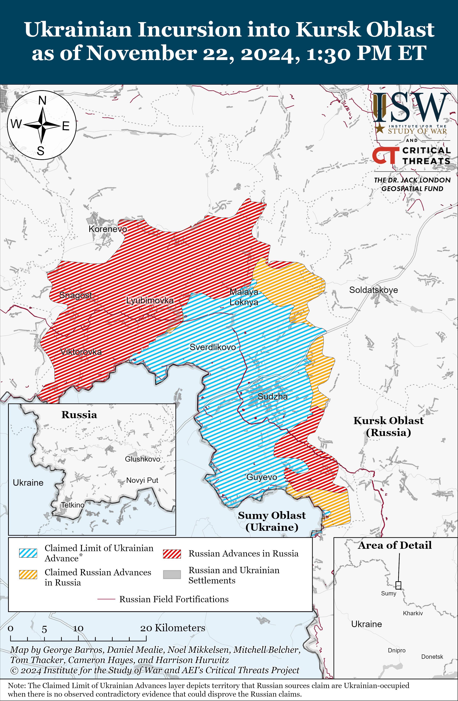
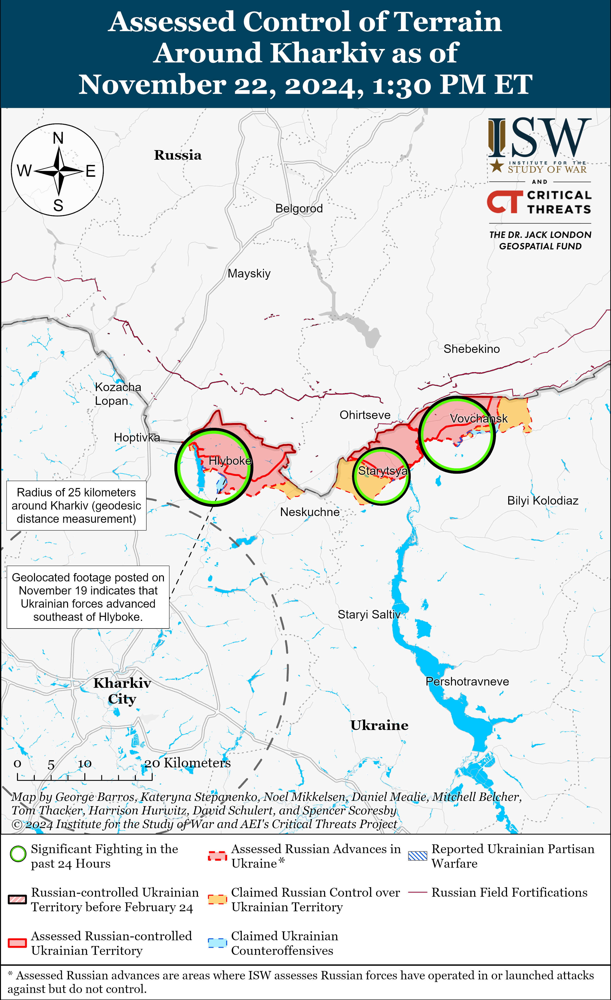
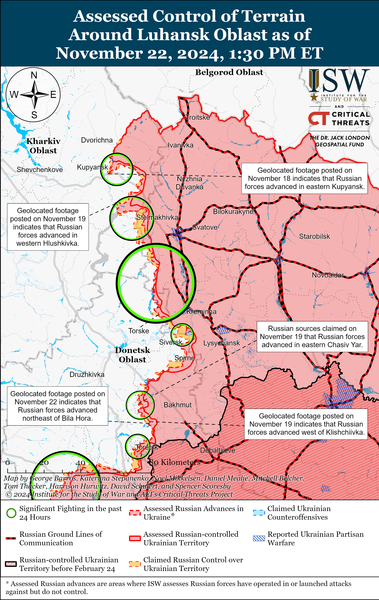
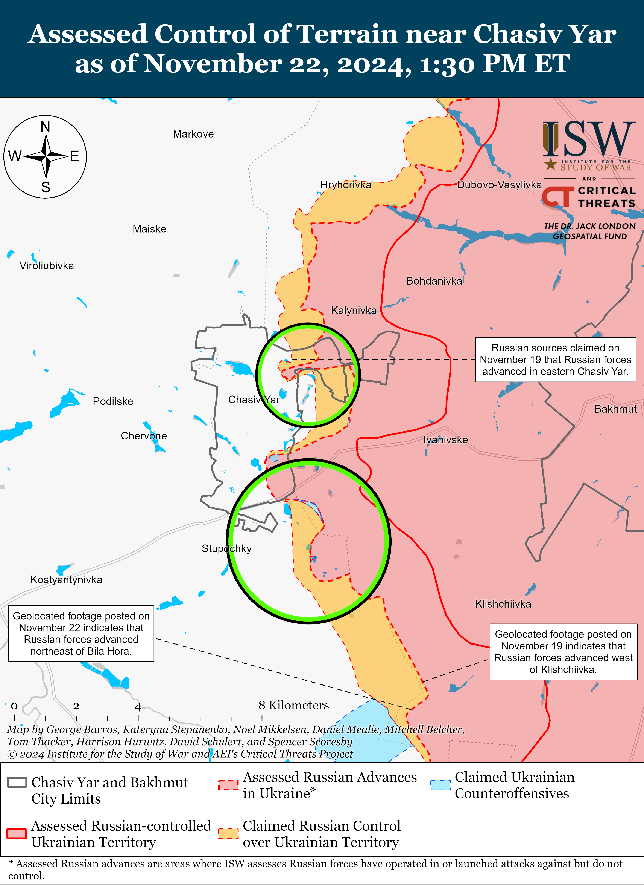
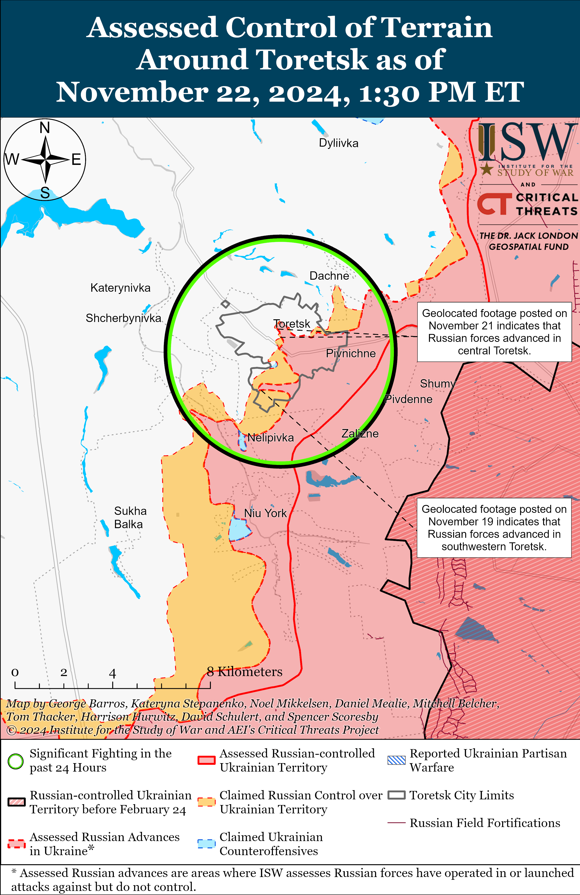
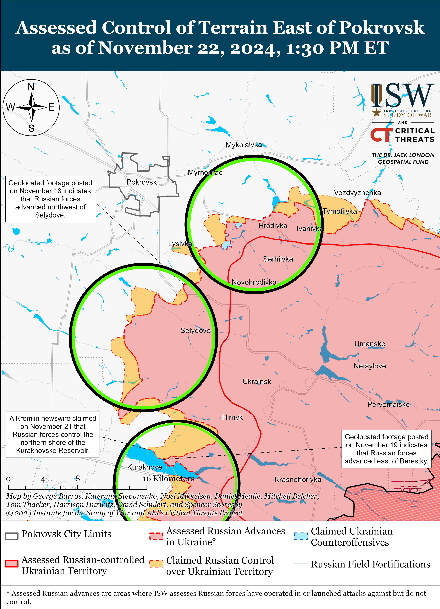
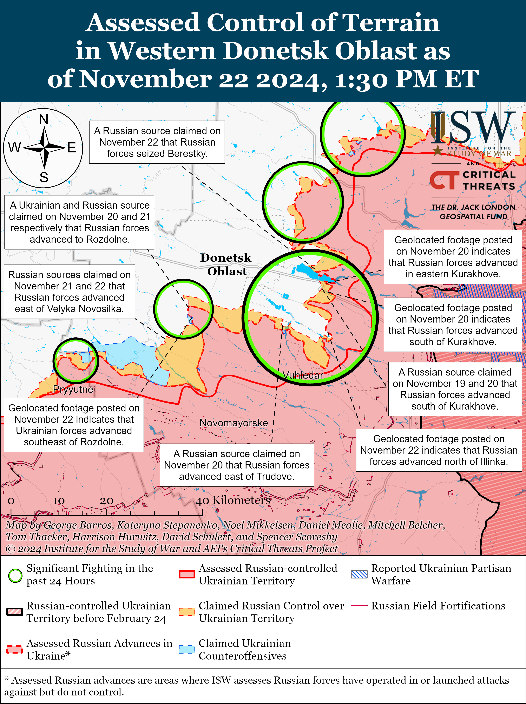
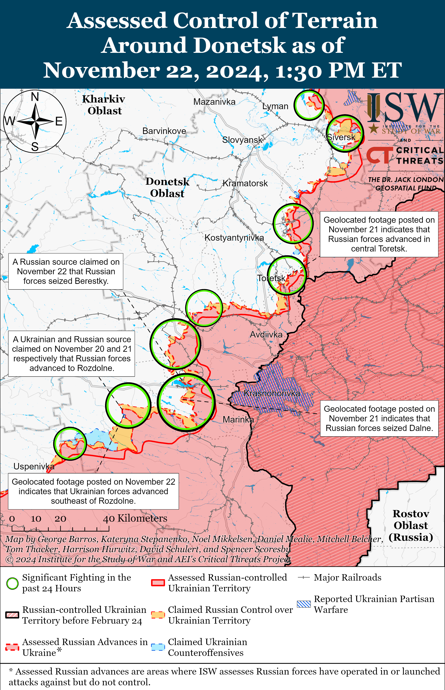
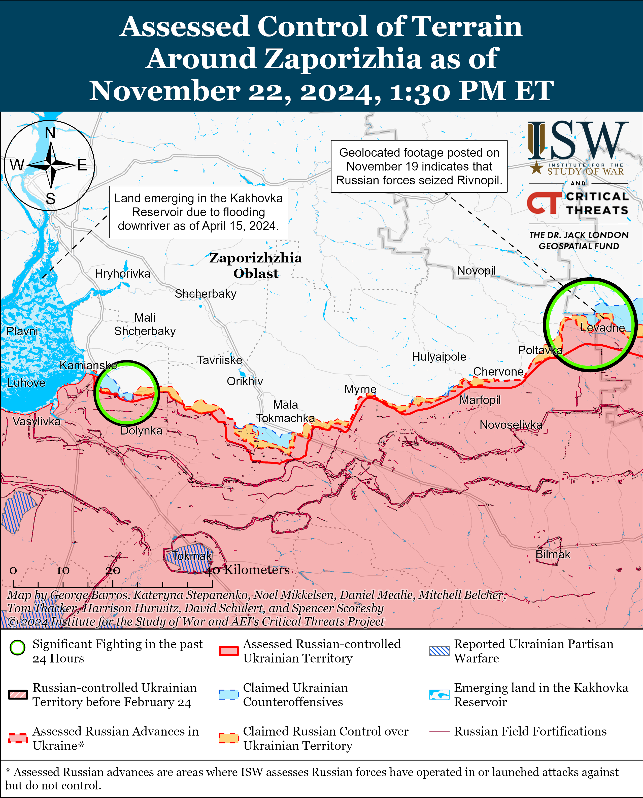
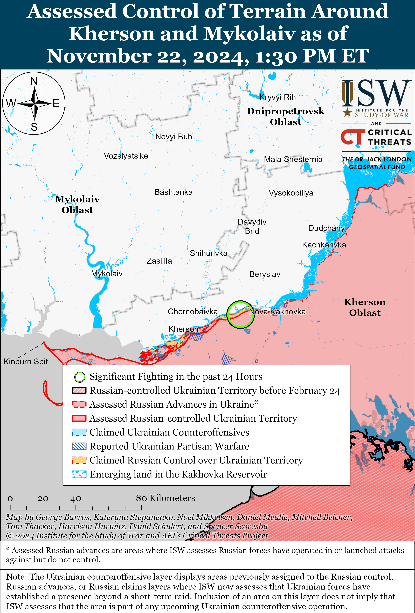

# Russian Offensive Campaign Assessment, November 22, 2024

**Karolina Hird, Angelica Evans, Nate Trotter, William Runkel, Olivia Gibson, and George Barros**

**November 22, 2024, 6:50pm ET**

**Click** [**here**](https://storymaps.arcgis.com/stories/36a7f6a6f5a9448496de641cf64bd375) **to see ISW’s interactive map of the Russian invasion of Ukraine. This map is updated daily alongside the static maps present in this report.**

**Click** [**here**](https://understandingwar.maps.arcgis.com/apps/instant/3dviewer/index.html?appid=1602762dbcde419bb957dea358449580) **to see ISW’s 3D control of terrain topographic map of Ukraine. Use of a computer (not a mobile device) is strongly recommended for using this data-heavy tool.**

**Click** [**here**](https://storymaps.arcgis.com/stories/733fe90805894bfc8562d90b106aa895) **to access ISW’s archive of interactive time-lapse maps of the Russian invasion of Ukraine. These maps complement the static control-of-terrain map that ISW produces daily by showing a dynamic frontline. ISW will update this time-lapse map archive monthly.**

**Note: The data cut-off for this product was 1:30pm ET on November 22. ISW will cover subsequent reports in the November 23 Russian Offensive Campaign Assessment.**

**Russian President Vladimir Putin and Russian military leadership continue to extol the ballistic missile that Russian forces launched at Ukraine on November 21, likely in an effort to artificially inflate expectations of Russian capabilities and encourage Western and Ukrainian self-deterrence.** Putin held a meeting on November 22 with Russian Ministry of Defense (MoD) leadership, Russian defense industrial base representatives, and Russian missile developers, congratulating the Russian military for conducting a “successful” test of the Oreshnik ballistic missile in response to “those who are trying to blackmail” Russia.[1] Putin emphasized that the Oreshnik missile is not a modernization of an old Soviet missile and claimed that Russian designers created it “on the basis of modern, cutting-edge developments.” Putin reiterated claims that no system exists to defend against the Oreshnik and reported that Russia is already planning to serialize its production. Commander of the Russian Strategic Missile Forces Colonel General Sergei Karakayev told Putin that the Oreshnik can strike targets across Europe and stressed that there are no analogues to the Oreshnik anywhere in the world.[2]

US and Ukrainian reporting on the November 21 ballistic missile strike, however, emphasized that the Oreshnik missile is not inherently a novel Russian capability.[3] White House and Pentagon officials confirmed that Russia launched an intermediate-range ballistic missile (IRBM) at Ukraine, and Pentagon Spokesperson Sabrina Singh stated that Russia based the IRBM on the existing Russian RS-26 Rubezh intercontinental ballistic missile (ICBM) model.[4] Singh also reiterated that Ukraine has already faced Russian attacks with missiles that have “significantly larger” warheads than the Oreshnik. Ukraine’s Main Military Intelligence Directorate (GUR) stated on November 22 that Ukraine assesses that the IRBM that Russia launched on November 21 is actually a “Kedr” missile, which Russia has been developing since 2018-2019 in an effort to update the Yars ICBM model for shorter distances.[5] GUR Head Lieutenant General Kyrylo Budanov clarified that Ukraine believes that “Oreshnik” is the codename of the missile research and development project for the Kedr missile.[6] ISW cannot independently confirm these GUR statements, but it is noteworthy and consistent with ISW’s assessment that the November 21 Russian ballistic missile strike does not represent a fundamentally novel Russian capability.[7] Russia benefits from the rhetorical fanfare surrounding the November 21 strike and likely hopes that stoking concerns over the Oreshnik missile launch will prompt the West to dial back its support for Ukraine.

**Russia may additionally conduct test launches of the same or similar ballistic missiles in the coming days to accomplish the same rhetorical effect.** Russian sources claimed that Russia will close part of its airspace on November 23 to 24 for a missile test, but did not specify what type of missile Russian forces are testing.[8] GUR Deputy Chief Major General Vadym Skibitskyi warned on November 22 that Russia likely possesses up to 10 Oreshnik missiles and that Russia will likely conduct test launches for all these missiles in the future.[9]

**Russia has reportedly provided North Korea with over one million barrels of oil and an unspecified number and type of air defense systems and missiles in return for North Korea’s provision of manpower for Russia’s war effort in Ukraine.** The Open-Source Centre, a research group based in the United Kingdom (UK), citing satellite imagery, told the *BBC* on November 22 that Russia has supplied over one million barrels (56,000 tons) of oil to North Korea since March 2024.[10] The *BBC* noted that the satellite imagery shows over a dozen different North Korean oil tankers arriving empty at an oil terminal in Russia’s Far East and departing with nearly full tanks 43 times over the last eight months. UK Foreign Secretary David Lammy told the *BBC* that the oil is payment for the weapons and troops that North Korea has provided Russia for its war in Ukraine. The *BBC* noted that Russia’s provision of oil to North Korea is a clear violation of United Nations (UN) sanctions against North Korea. South Korean National Security Advisor Shin Won-sik stated on November 22 that South Korea believes that Russia has provided unspecified “[air defense] equipment and anti-air missiles” to strengthen North Korea’s air defense umbrella.[11] Shin noted that Russia has already declared its intention to support North Korea’s satellite-related technology and supplied North Korea with various military technologies and forms of economic aid. Russia’s provision of military equipment to North Korea also represents a clear violation of UN sanctions.

The quality and type of air defense system that Russia has provided to North Korea remains unclear, however. South Korean experts theorized that Russia may have provided S-400 air defense systems to North Korea, as North Korea is capable of building shorter-range systems domestically.[12] Any Russian S-400 delivery to North Korea would be a significant inflection, however, as Russia reportedly decided earlier this year to delay the delivery of two promised S-400 air defense systems to India until August 2026 and continues to delay providing Iran with S-400 systems.[13] The decision to provide North Korea with an S-400 air defense system ahead of Iran or India would suggest a major reprioritization of Russia’s alliances, and ISW has not yet observed indicators that this reprioritization is underway. Furthermore, ISW has observed indications that Russia is struggling to produce advanced air defense systems and radars at a rate rapid enough to replace the losses Russia continues to sustain as a result of Ukraine’s long-range drone and missile strikes.[14] Russia has more likely provided North Korea with shorter-range missiles and systems, or possibly cannon-based air defense systems.

**The Ukrainian Prosecutor General’s Office opened an investigation against another instance of Russian forces executing Ukrainian prisoners of war (POWs) in Donetsk Oblast.** The Ukrainian Prosecutor General’s Office reported on November 22 that it was investigating a report that Russian forces executed five Ukrainian servicemembers near Vuhledar on October 2, in violation of the Geneva Convention on POWs.[15] The Ukrainian Prosecutor General’s Office also reported that in total it has opened 53 criminal cases investigating Russian executions of Ukrainian POWs – 37 of which occurred during 2024.[16] The Ukrainian Prosecutor General’s Office reported that Ukrainian officials are investigating 13 cases of Russian forces executing Ukrainian POWs between October and November 2024 alone. ISW has extensively reported on previous footage and reports of Russian servicemembers executing Ukrainian POWs and observed a wider trend of Russian abuses against Ukrainian POWs across various sectors of the front that appear to be enabled, if not explicitly endorsed, by individual Russian commanders and unpunished by Russian field commanders.[17]

**Key Takeaways:**

- **Russian President Vladimir Putin and Russian military leadership continue to extol the ballistic missile that Russian forces launched at Ukraine on November 21, likely in an effort to artificially inflate expectations of Russian capabilities and encourage Western and Ukrainian self-deterrence.**
- **Russia may additionally conduct test launches of the same or similar ballistic missiles in the coming days to accomplish the same rhetorical effect.**
- **Russia has reportedly provided North Korea with over one million barrels of oil and an unspecified number and type of air defense systems and missiles in return for North Korea’s provision of manpower for Russia’s war effort in Ukraine.**
- **The Ukrainian Prosecutor General’s Office opened an investigation against another instance of Russian forces executing Ukrainian prisoners of war (POWs) in Donetsk Oblast.**
- **Russian forces recently advanced west of Svatove, south of Chasiv Yar, south of Toretsk, northeast of Vuhledar, and northeast of Velyka Novosilka.**
- **Russia continues to build its training capacity by establishing new service academies in occupied Ukraine.**

***We do not report in detail on Russian war crimes because these activities are well-covered in Western media and do not directly affect the military operations we are assessing and forecasting. We will continue to evaluate and report on the effects of these criminal activities on the Ukrainian military and the Ukrainian population and specifically on combat in Ukrainian urban areas. We utterly condemn Russian violations of the laws of armed conflict and the Geneva Conventions and crimes against humanity even though we do not describe them in these reports.***

- Ukrainian Operations in the Russian Federation
- Russian Main Effort – Eastern Ukraine (comprised of three subordinate main efforts)
- Russian Subordinate Main Effort #1 – Push Ukrainian forces back from the international border with Belgorod Oblast and approach to within tube artillery range of Kharkiv City
- Russian Subordinate Main Effort #2 – Capture the remainder of Luhansk Oblast and push westward into eastern Kharkiv Oblast and encircle northern Donetsk Oblast
- Russian Subordinate Main Effort #3 – Capture the entirety of Donetsk Oblast
- Russian Supporting Effort – Southern Axis
- Russian Air, Missile, and Drone Campaign
- Russian Mobilization and Force Generation Efforts
- Russian Technological Adaptations
- Activities in Russian-occupied areas
- Significant Activity in Belarus

**Ukrainian Operations in the Russian Federation**

Russian forces continued assaults in the main Ukrainian salient in Kursk Oblast on November 21 and 22 but did not make confirmed advances.[18] Russian milbloggers claimed that Russian forces advanced near Darino (southeast of Korenevo) and in forested areas near Olgovka (east of Korenevo) and Malaya Loknya (north of Sudzha), although ISW has not observed confirmation of these claims.[19] The commander of a Ukrainian platoon operating in Kursk Oblast reported that Russian forces are sending wounded personnel on infantry assaults in Kursk Oblast, and a Russian milblogger noted on November 21 that poor weather conditions have set in in Kursk Oblast.[20] A Russian milblogger claimed that elements of the Russian 83rd Airborne (VDV) Brigade and 51st VDV Regiment (106th VDV Division) are attacking near Darino and Nikolayevo-Darino (just south of Darino).[21] Russian forces also continued assaults north of Sudzha near Pogrebki and Orlovka and southeast of Sudzha near Plekhovo.[22] A Russian milblogger claimed that Russian forces repelled Ukrainian mechanized assaults southeast of Korenevo near Novoivanovka and Darino.[23] Elements of the Russian BARS-Kursk volunteer detachment are reportedly operating in Kursk Oblast.[24]

Ukrainian outlet *Suspilne* reported on November 22, citing sources within the Ukrainian General Staff, that Russia has accumulated almost 60,000 troops in Kursk Oblast and that the Ukrainian General Staff currently assesses that Russian forces intend to push Ukrainian forces back across the international border into Sumy Oblast and conduct further offensive operations into Ukraine in order to create a “buffer zone” in Sumy Oblast.[25] The sources stated that the Ukrainian military command assesses that the Ukrainian incursion into Kursk Oblast prevented Russian forces from launching a major offensive operation in Zaporizhia Oblast in recent months.

**Russian Main Effort – Eastern Ukraine**

**Russian Subordinate Main Effort #1 – Kharkiv Oblast (Russian objective: Push Ukrainian forces back from the international border with Belgorod Oblast and approach to within tube artillery range of Kharkiv City)**

Russian forces continued assaults north of Kharkiv City near Hlyboke and northeast of Kharkiv City near Vovchansk and Starytsya on November 21 and 22 but did not make confirmed advances.[26] A Ukrainian brigade operating in the Kharkiv direction posted footage on November 21 showing Ukrainian forces repelling a platoon-sized Russian mechanized assault in an unspecified area of Kharkiv Oblast on an unspecified date.[27] A Russian milblogger claimed that Russian forces are advancing northeast of Kharkiv City near Vovchansk, Tykhe, Prylipka, and Vovchanski Khutory.[28] Russian milbloggers claimed that Russian forces repelled a Ukrainian counterattack near Hlyboke.[29]

**Russian Subordinate Main Effort #2 – Luhansk Oblast (Russian objective: Capture the remainder of Luhansk Oblast and push westward into eastern Kharkiv Oblast and northern Donetsk Oblast)**

Russian forces recently advanced west of Svatove amid continued offensive operations along the Kupyansk-Svatove-Kreminna line on November 22. Geolocated footage published on November 22 shows that Russian forces recently marginally advanced into eastern Kopanky (west of Svatove).[30] Russian milbloggers claimed that elements of the Russian 1st Guards Tank Army (Moscow Military District [MMD]) raised a flag in eastern Kopanky.[31] Another Russian milblogger claimed that Russian forces advanced to the southwestern part of Hlushkivka (southeast of Kupyansk) and reached the Zaoskillya railway station in eastern Kupyansk.[32] The Russian milblogger also claimed that Russian forces advanced two kilometers along the Oskil River from Kolisnykivka (southeast of Kupyansk) towards the southern flank of Kupyansk.[33] A Russian source claimed that Russian forces maintain positions on tactically significant heights near Makiivka (northwest of Kreminna), which has allowed Russian forces to advance near the settlement.[34] ISW has not observed confirmation of these claims, however. The Ukrainian General Staff reported that Russian forces conducted offensive operations east of Kupyansk near Petropavlivka; southeast of Kupyansk near Zahryzove and Kolisnykivka; northwest of Svatove near Lozova; west of Svatove near Zeleny Hai; southwest of Svatove near Novoyehorivka and Tverdokhlibove; northwest of Kreminna near Hrekivka, Makiivka, and Terny; west of Kreminna near Torske; and southwest of Kreminna near the Serebryanske forest area.[35] A Ukrainian battalion commander operating in the Kupyansk direction reported that Russian forces are using tube artillery, MLRS, and glide bombs to force Ukrainian civilians to evacuate from settlements on the east (left) bank of the Oskil River in Kupyansk Raion and then destroy those settlements.[36] The Ukrainian battalion commander also reported that Russian forces have intensified infantry assaults in the Kupyansk direction because the Russian command is threatening to kill Russian soldiers who refuse to attack.[37] A Russian milblogger claimed that Russian aviation destroyed a pontoon bridge serving as a Ukrainian ground line of communication (GLOC) over the Siverskyi-Donets River in the Lyman (west of Kreminna) direction.[38] Drone operators of the Russian 1st Guards Tank Army (MMD) are reportedly operating north of Kolisnykivka and elements of the Russian 144th Motorized Rifle Division (20th Combined Arms Army [CAA], MMD) reportedly continue to operate near Terny.[39]

**Russian Subordinate Main Effort #3 – Donetsk Oblast (Russian objective: Capture the entirety of Donetsk Oblast, the claimed territory of Russia’s proxies in Donbas)**

Neither Russian nor Ukrainian sources reported on fighting in the Siversk direction on November 22. The Ukrainian State Border Guard Service reported on November 22 that Ukrainian forces recently repelled a large Russian assault, consisting of 20 pieces of equipment and 100 infantrymen, in the Siversk direction, but did not specify the date of the Russian assault.[40]

Russian forces recently advanced south of Chasiv Yar amid continued offensive operations in the area on November 22. Geolocated footage published on November 22 indicates that Russian forces recently advanced on the east bank of the Siverskyi-Donets Donbas Canal northeast of Bila Hora (south of Chasiv Yar).[41] Russian milbloggers claimed on November 21 and 22 that Russian forces advanced along Parkova Street in eastern Chasiv Yar and are clearing Ukrainian forces from positions west of Klishchiivka (southeast of Chasiv Yar).[42] ISW has not observed visual confirmation of these claims, however. The Ukrainian General Staff reported on November 21 and 22 that Russian forces continued offensive operations near Chasiv Yar itself and near Stupochky (south of Chasiv Yar).[43] Elements of the Russian 98th Airborne (VDV) Division, including its 331st VDV Regiment, are reportedly operating in Chasiv Yar.[44] Elements of the Russian 6th Motorized Rifle Division (3rd Army Corps [AC]) are reportedly operating near Dyliivka (south of Chasiv Yar and northeast of Toretsk).[45]

Russian forces recently marginally advanced south of Toretsk amid continued offensive operations in the area on November 22. Geolocated footage published on November 21 indicates that Russian forces recently marginally advanced and captured windbreaks south of Yurivka (south of Toretsk).[46] Russian milbloggers claimed on November 21 and 22 that Russian forces advanced one kilometer in central Toretsk and advanced in the fields north of Druzhba (northeast of Toretsk).[47] ISW has not observed visual confirmation of these claims, however. The Ukrainian General Staff reported on November 21 and 22 that Russian forces continued offensive operations near Toretsk and Shcherbynivka (west of Toretsk).[48]

Russian forces reportedly continued to advance south and southeast of Pokrovsk, but ISW has not yet observed confirmation of claimed Russian advances. A Russian milblogger claimed that Russian forces made marginal gains south of Pokrovsk near Hryhorivka and Pustynka and southeast of Pokrovsk in fields south of Lysivka.[49] Another Russian milblogger claimed that Russian forces advanced to the outskirts of Zhovte (northwest of Pustynka and south of Pokrovsk).[50] ISW has not yet observed confirmation of any of these claims, however, and has only collected evidence to currently assess that Russian forces are still over seven kilometers from the outskirts of Zhovte. The Ukrainian General Staff reported that Russian forces conducted ground attacks east of Pokrovsk near Myrolyubivka and Promin; southeast of Pokrovsk near Sukhyi Yar and Lysivka; and south of Pokrovsk near Dachenske, Pushkine, Pustynka, Petrivka, and Hryhorivka on November 21 and 22.[51] Elements of the Russian “Vega” Spetsnaz Detachment (24th Guards Spetsnaz Brigade, Main Intelligence Directorate of the Russian General Staff [GRU]) reportedly continue operating in the Pokrovsk direction.[52]

Russian forces reportedly continued to advance in and near Kurakhove, although ISW has not yet observed confirmation of these claimed Russian gains. Russian milbloggers claimed that Russian forces seized all of Berestky (north of Kurakhove on the northern bank of the Kurakhivske Reservoir) and are advancing westward towards Stari Terny (on the northwestern bank of the Kurakhivske Reservoir directly west of Berestky), and Ukrainian military observer Bohdan Myroshnykov reported that Russian forces are pressuring Stari Terny from positions north of Berestky.[53] Russian and Ukrainian sources additionally reported that there is heavy fighting in eastern and central Kurakhove, especially near the Kurakhove grain elevator, and a Russian milblogger claimed that Russian forces advanced southwestward within central Kurakhove.[54] Russian forces notably conducted an aerial bomb strike against the Kurakhove Thermal Power Plant in western Kurakhove, collapsing one of the plant’s smokestacks.[55] The Ukrainian General Staff reported that Russian forces conducted ground attacks near Kurakhove itself; north of Kurakhove near Berestky; and northwest of Kurakhove near Sontsivka, Zorya, and Novodmytrivka on November 21 and 22.[56] Elements of the Russian 5th Motorized Rifle Brigade (51st Combined Arms Army [CAA], formerly 1st Donetsk People’s Republic Army Corps [DNR AC]) are reportedly operating near Berestky, while elements of the 238th Artillery Brigade (8th CAA, Southern Military District, [SMD]), 103rd Motorized Rifle Regiment (150th Motorized Rifle Division, 8th CAA, SMD), and 242nd Motorized Rifle Regiment (20th Motorized Rifle Division, 8th CAA, SMD) are operating in the general Kurakhove direction.[57]

Russian forces recently advanced northeast of Vuhledar amid continued offensive operations in the Vuhledar direction on November 22. Geolocated footage published on November 22 indicates that elements of the Russian 10th Tank Regiment (3rd AC) advanced northeast of Illinka (northeast of Vuhledar) during a platoon-sized mechanized assault.[58] Russian milbloggers claimed that Russian forces advanced northwest of Vuhledar near Kostyantynopolske and Trudove; north of Vuhledar in fields north and west of Dalne; and northeast of Vuhledar near Antonivka, although ISW has not yet observed confirmation of these claims.[59] The Ukrainian General Staff reported that Russian forces continued ground attacks northwest of Vuhledar near Trudove, Kostyantynopolske, and Rozlyv and northeast of Vuhledar near Katerynivka, Romanivka, and Antonivka on November 21 and 22.[60] Elements of the Russian 102nd Motorized Rifle Regiment (150th Motorized Rifle Division, 8th CAA, SMD) are reportedly operating near Dalne; elements of the 2nd Battalion of the 39th Motorized Rifle Brigade (68th AC, Eastern Military District [EMD]) are reportedly operating north of Bohoyavlenka (northwest of Vuhledar); and other unspecified elements of the 68th AC are reportedly operating near Uspenivka (northwest of Vuhledar).[61]

Russian forces recently advanced northeast of Velyka Novosilka amid continued intensive offensive operations in the Donetsk-Zaporizhia Oblast border area on November 22. Geolocated footage published on November 22 indicates that Russian forces advanced to a windbreak southeast of Rozdolne (northeast of Velyka Novosilka), confirming ISW’s November 21 assessment that Russian forces likely advanced to the eastern outskirts of Rozdolne.[62] Several Russian milbloggers claimed that Russian forces are currently fighting on the outskirts of Rozdolne and advancing in fields north of the settlement.[63] Russian sources claimed that Russian forces are successfully advancing towards the outskirts of Velyka Novosilka and interdicting Ukrainian supply routes into the settlement.[64] The commander of a prominent Ukrainian brigade reported on November 22 that Russian forces are focused on efforts to capture Velyka Novosilka as part of the Russian campaign to seize Kurakhove. [65]The Ukrainian General Staff reported that Russian forces conducted ground attacks northeast of Velyka Novosilka near Rozdolne and southwest of Velyka Novosilka near Novodarivka on November 21 and 22.[66] Elements of the Russian 40th Naval Infantry Brigade (Pacific Fleet, EMD) are reportedly operating near Rozdolne, elements of the 394th Motorized Rifle Regiment (127th Motorized Rifle Division, 5th CAA, EMD) are operating near Rivnopil (southwest of Velyka Novosilka), and elements of the 5th Tank Brigade (36th CAA, EMD) are operating near Velyka Novosilka itself.[67] Elements of the Russian 60th Motorized Rifle Brigade (5th CAA, EMD) and 14th Spetsnaz Brigade (GRU) are operating in the general southern Donetsk (Velyka Novosilka) direction.[68]

**Russian Supporting Effort – Southern Axis (Russian objective: Maintain frontline positions and secure rear areas against Ukrainian strikes)**

Russian forces continued ground assaults in western Zaporizhia Oblast, including northwest of Robotyne near Pyatykhatky, on November 21 and 22 but did not advance.[69] The commander of a prominent Ukrainian brigade reported on November 22 that Russian forces will likely begin conducting assaults in western Zaporizhia Oblast in the near future and stated the Ukrainian forces are building defenses in preparation for renewed Russian assaults.[70] The spokesperson for a Ukrainian brigade operating in the Orikhiv direction reported on November 22 that Russian forces continue to conduct disorganized and highly attritional infantry assaults in which one to two soldiers assault a well-fortified Ukrainian position in this direction.[71] An anti-tank guided missile (ATGM) crew of the Russian 503rd Motorized Rifle Regiment (19th Motorized Rifle Division, 58th Combined Arms Army [CAA], Southern Military District [SMD]) are reportedly operating near Shcherbaky (northwest of Robotyne).[72]

International Atomic Energy Agency (IAEA) Director General Rafael Mariano Grossi reported on November 21 that the Russian-occupied Zaporizhzhia Nuclear Power Plant’s (ZNPP) safety and security remain tenuous as the facility lost connectivity to its only remaining 750 kilovolt (kV) external power line twice within the last week.[73] Grossi noted that the ZNPP also lost connectivity to the facility’s only 330 kV external power line twice in October 2024.

Positional fighting continued in the Dnipro direction in east (left) bank Kherson Oblast on November 21 and 22, but there were no changes to the frontline.[74] A Russian milblogger claimed on November 21 that Ukrainian forces are intensifying their use of drone strikes against Russian forces in the Kherson direction.[75] Ukrainian Tavriisk Group of Forces Spokesperson Colonel Vladyslav Voloshyn reported on November 22 that Russian forces are using rubber boats to transport small teams of well-trained infantry to storm Ukrainian positions on the islands in the Dnipro River delta.[76] Elements of the Russian 205th Motorized Rifle Brigade (49th CAA, Southern Military District [SMD]) are reportedly operating on the islands in the Dnipro River Delta.[77]

**Russian Air, Missile, and Drone Campaign (Russian Objective: Target Ukrainian military and civilian infrastructure in the rear and on the frontline)**

Russian forces conducted a large series of drone strikes against Ukraine on November 22. The Ukrainian Air Force reported that Russian forces launched 114 Shahed drones and other unspecified strike drones (likely referring to decoy drones) from Oryol Oblast after 1330 local time on November 22.[78] The Ukrainian Air Force reported that Ukrainian air defenses downed 64 Russian drones over central and northeastern Ukraine as of 1730 local time. The Ukrainian Air Force reported that Ukrainian countermeasures, likely referring to electronic warfare (EW) interference, caused another 41 Russian drones to become “lost” in Ukraine, that two drones left Ukrainian airspace into Russia and Belarus, and that four Russian drones were still in Ukrainian airspace. Ukrainian officials reported that a Russian Shahed drone struck a residential area in Sumy Oblast, killing two residents and injuring 13.[79] Ukrainian officials also reported that Russian forces conducted two airstrikes using eight KAB-guided glide bombs in the Zaporizhia direction.[80]

**Russian Mobilization and Force Generation Efforts (Russian objective: Expand combat power without conducting general mobilization)**

Russia continues to build its training capacity by establishing new service academies in occupied Ukraine. Crimea occupation head Sergey Aksyonov appeared on live television to publicly appeal to Russian President Vladimir Putin and Director of the Russian Federal Security Service (FSB) Alexander Bortnikov to establish a border guard training academy in occupied Crimea.[81] Several Russian milbloggers welcomed Aksyonov’s initiative and applauded his statements, acknowledging the importance of incorporating experience from Russia’s war in Ukraine into border guard cadet training.[82] It remains unclear whether the Kremlin will approve Aksyonov’s proposal as Ukrainian forces can strike much of Crimea with drones and missiles, placing Russian cadets at increased risk.[83] Aksyonov noted that Russian authorities will decide on this issue by the end of 2024.[84] Aksyonov’s proposal is consistent with ISW’s previous assessments that Russian forces will likely expand training infrastructure – including in occupied Ukraine – to support the Russian military’s reconstitution and expansion efforts.[85]

Russian authorities continue efforts to increase Russian irregular forces’ benefits. Russia’s Ministry of Labor reportedly prepared an unpublished draft law that would raise the pension entitlements for disabled servicemen of the Donetsk and Luhansk People’s Republics (DNR and LNR).[86] The draft law would provide wounded DNR and LNR servicemen benefits and compensation comparable to wounded and medically discharged regular Russian servicemen and would entitle DNR and LNR servicemen who fought in occupied Ukraine starting in 2014 access to two disability-centered pensions: one for old age and the other for length of service. ISW has previously assessed that the Kremlin’s pivot to developing greater veteran support infrastructure is likely an effort to incentivize military service and proactively combat the risks associated with aggrieved veterans returning to civilian life.[87] The Ministry of Labor’s proposed bill is a further indication of Russian authorities’ efforts to allocate more resources to Russia’s growing veteran population and prevent disabled veterans from forming a disenfranchised cleavage with political power within Russian society. This bill also supports the Kremlin’s efforts to formalize the DNR and LNR irregular forces and veterans and integrate them under the Russian Ministry of Defense (MoD).

**Russian Technological Adaptations (Russian objective: Introduce technological innovations to optimize systems for use in Ukraine)**

Nothing significant to report.

**Activities in Russian-occupied areas (Russian objective: Consolidate administrative control of annexed areas; forcibly integrate Ukrainian citizens into Russian sociocultural, economic, military, and governance systems)**

*ISW is not publishing coverage of activities in Russian-occupied areas today.*

**Significant activity in Belarus (Russian efforts to increase its military presence in Belarus and further integrate Belarus into Russian-favorable frameworks and Wagner Group activity in Belarus)**

Russian Foreign Minister Sergei Lavrov met with Belarusian Foreign Minister Maxim Ryzhenkov in Brest, Belarus from November 21 to 22 to discuss Union State developments. Lavrov and Ryzhenkov announced a “unified Eurasian charter for a multi-polar world in the 21st century” and signed a declaration criticizing Western sanctions against Russia and Belarus and a plan for the Belarusian and Russian Ministries of Foreign Affairs (MFAs) to cooperate in BRICS and the Shanghai Cooperation Organization (SCO) and to counter western sanctions in 2025.[88] Lavrov also announced that the Union State’s Supreme State Council would convene in December 2024 to sign several joint-security agreements, including the “Security Concepts of the Union State” and a “Russian-Belarus agreement on guarantees for security” projects, both of which will include updating and synchronizing the two states’ nuclear doctrines.[89]

**Note: ISW does not receive any classified material from any source, uses only publicly available information, and draws extensively on Russian, Ukrainian, and Western reporting and social media as well as commercially available satellite imagery and other geospatial data as the basis for these reports. References to all sources used are provided in the endnotes of each update.**

[1] http://kremlin dot ru/events/president/news/75623

[2] https://ria dot ru/20241122/karakaev-1985273877.html; http://kremlin dot ru/events/president/news/75623

[3] https://understandingwar.org/backgrounder/russian-offensive-campaign-assessment-november-21-2024

[4] https://www.defense.gov/News/Transcripts/Transcript/Article/3975265/deputy-pentagon-press-secretary-sabrina-singh-holds-a-press-briefing/; https://www.whitehouse.gov/briefing-room/press-  
 briefings/2024/11/21/press-briefing-by-press-secretary-karine-jean-pierre-  
 74/

[5] https://interfax.com dot ua/news/general/1029388.html; https://www.ukrinform dot ua/rubric-ato/3930065-rosia-moze-mati-do-10-odinic-novoi-balisticnoi-raketi-akou-vdarila-po-dnipru-gur.html

[6] https://interfax.com dot ua/news/general/1029388.html

[7] https://understandingwar.org/backgrounder/russian-offensive-campaign-assessment-november-21-2024

[8] https://www.mk dot ru/politics/2024/11/22/general-popov-nazval-strany-nato-po-kotorym-mozhet-priletet-oreshnik.html; https://t.me/DnevnikDesantnika/19682 ; https://t.me/NgP\_raZVedka/19633; https://t.me/notes\_veterans/20618

[9] https://www.ukrinform dot ua/rubric-ato/3930065-rosia-moze-mati-do-10-odinic-novoi-balisticnoi-raketi-akou-vdarila-po-dnipru-gur.html

[10] https://t.me/bbcrussian/73246 ; https://www.bbc.com/news/articles/cjr4pr0gyyzo

[11] https://en.yna.co dot kr/view/AEN20241122006900315

[12] https://apnews.com/article/north-korea-troops-ukraine-russia-missile-1efc0e29d5d6225fb85891ef6c822e4c?taid=674031336cc75d0001601e7c

[13] https://www.iranintl dot com/en/202411171565#:~:text=Despite%20Sheikhian’s%20assertion%20that%20Tehran,Moscow%20has%20yet%20to%20deliver. ; https://understandingwar.org/backgrounder/russian-offensive-campaign-assessment-march-23-2024 ; https://isw.pub/UkrWar101024

[14] https://isw.pub/UkrWar110224 ; https://www.forbes.com/sites/davidaxe/2024/06/14/russia-has-one-s-500-air-defense-system-it-just-arrived-in-crimea-amid-a-storm-of-ukrainian-rockets/ ; https://isw.pub/UkrWar032324 ; https://understandingwar.org/backgrounder/russian-offensive-campaign-assessment-july-3-2024

[15] https://t.me/pgo\_gov\_ua/27560 ; https://meduza dot io/news/2024/11/22/prokuratura-ukrainy-vozle-ugledara-rossiyskie-voennye-vzyali-v-plen-i-ubili-pyateryh-bezoruzhnyh-soldat-vsu

[16] https://armyinform.com dot ua/2024/11/22/zviryacha-zhorstokist-zbilshylas-kilkist-rozstriliv-ukrayinskyh-vijskovopolonenyh/

[17] https://isw.pub/UkrWar100624 ; https://isw.pub/UkrWar100124 ; https://isw.pub/UkrWar090624 ; https://understandingwar.org/backgrounder/russian-offensive-campaign-assessment-june-19-2024 ; https://isw.pub/UkrWar122823 ; https://understandingwar.org/backgrounder/russian-offensive-campaign-assessment-june-3-2024 ; https://isw.pub/UkrWar032724 ; https://isw.pub/UkrWar052924 ; https://isw.pub/UkrWar090424 ; https://understandingwar.org/backgrounder/russian-offensive-campaign-assessment-july-10-2024 ; https://isw.pub/UkrWar062324; https://understandingwar.org/backgrounder/russian-offensive-campaign-assessment-october-7-2024; https://understandingwar.org/backgrounder/russian-offensive-campaign-assessment-november-6-2024; https://understandingwar.org/backgrounder/russian-offensive-campaign-assessment-november-10-2024

[18] https://www.facebook.com/GeneralStaff.ua/posts/pfbid0p2fCv91DfnhusMgTeEfQ3Xydkrf3qA4fjUmcVWAKmbVNMNxrDwAymGBme8h15TVSl ; https://www.facebook.com/GeneralStaff.ua/posts/pfbid0X4MD8jDc7WjXH5aU1h82z8uJVc3oXHVr3cYtKUu4FxjCT98uGWASvopiZvFyzWVQl ; https://www.facebook.com/GeneralStaff.ua/posts/pfbid042RJD2VHWkj38NEqqr2RqDSgkQMh7keVGAGRWqut8nKbCv4FBT63FTDPBCx7riXjl ; https://t.me/wargonzo/23281

[19] https://t.me/dva\_majors/58347 ; https://t.me/RVvoenkor/81182

[20] https://armyinform.com dot ua/2024/11/22/poraneni-kuhariCha-j-takelazhnyky-na-kurshhyni-v-shturmy-vidpravlyayut-usih-hto-ne-vtik/ ; https://t.me/rusich\_army/18673

[21] https://t.me/motopatriot/29692

[22] https://t.me/motopatriot/29692

[23] https://t.me/dva\_majors/58347

[24] https://t.me/mod\_russia/45997

[25] https://suspilne dot media/885507-zelenskij-zaklikav-svit-reaguvati-na-eskalaciu-z-boku-rf-putin-rozpoviv-pro-ataku-oresnikom-1003-den-vijni-onlajn/?anchor=live\_1732287038&utm\_source=copylink&utm\_medium=ps

[26] https://www.facebook.com/GeneralStaff.ua/posts/pfbid0p2fCv91DfnhusMgTeEfQ3Xydkrf3qA4fjUmcVWAKmbVNMNxrDwAymGBme8h15TVSl ; https://www.facebook.com/GeneralStaff.ua/posts/pfbid0X4MD8jDc7WjXH5aU1h82z8uJVc3oXHVr3cYtKUu4FxjCT98uGWASvopiZvFyzWVQl ; https://www.facebook.com/GeneralStaff.ua/posts/pfbid042RJD2VHWkj38NEqqr2RqDSgkQMh7keVGAGRWqut8nKbCv4FBT63FTDPBCx7riXjl ; https://t.me/dva\_majors/58347

[27] https://t.me/ab3army/4902 ; https://t.me/ButusovPlus/15231

[28] https://t.me/Sladkov\_plus/11864

[29] https://t.me/dva\_majors/58347 ; https://t.me/DnevnikDesantnika/19693 ; https://t.me/notes\_veterans/20617

[30] https://t.me/creamy\_caprice/7590; https://t.me/anna\_news/73296

[31] https://t.me/z\_arhiv/29708 ; https://t.me/anna\_news/73296 ; https://t.me/creamy\_caprice/7590 ; https://t.me/motopatriot/29706 ; https://t.me/boris\_rozhin/145238 ; https://t.me/brussinf/8725 ; https://t.me/vysokygovorit/18076 ; https://t.me/sashakots/50347 ; https://t.me/RVvoenkor/81183

[32] https://t.me/DnevnikDesantnika/19644

[33] https://t.me/DnevnikDesantnika/19688

[34] https://t.me/tass\_agency/286712

[35] https://www.facebook.com/GeneralStaff.ua/posts/pfbid042RJD2VHWkj38NEqqr2RqDSgkQMh7keVGAGRWqut8nKbCv4FBT63FTDPBCx7riXjl; https://www.facebook.com/GeneralStaff.ua/posts/pfbid0X4MD8jDc7WjXH5aU1h82z8uJVc3oXHVr3cYtKUu4FxjCT98uGWASvopiZvFyzWVQl; https://www.facebook.com/GeneralStaff.ua/posts/pfbid0p2fCv91DfnhusMgTeEfQ3Xydkrf3qA4fjUmcVWAKmbVNMNxrDwAymGBme8h15TVSl; https://www.facebook.com/GeneralStaff.ua/posts/pfbid042RJD2VHWkj38NEqqr2RqDSgkQMh7keVGAGRWqut8nKbCv4FBT63FTDPBCx7riXjl; https://www.facebook.com/GeneralStaff.ua/posts/pfbid0X4MD8jDc7WjXH5aU1h82z8uJVc3oXHVr3cYtKUu4FxjCT98uGWASvopiZvFyzWVQl; https://www.facebook.com/GeneralStaff.ua/posts/pfbid0p2fCv91DfnhusMgTeEfQ3Xydkrf3qA4fjUmcVWAKmbVNMNxrDwAymGBme8h15TVSl

[36] https://suspilne dot media/kharkiv/885499-rf-namagaetsa-sterti-livoberezza-kupansini-za-principom-vovcanska-urij-fedorenko-2/

[37] https://armyinform.com dot ua/2024/11/22/vony-yih-vbyvayut-v-tylah-rosijskyh-shturmovykiv-zhenut-vpered-yak-hudobu/

[38] https://t.me/DnevnikDesantnika/19644

[39] https://t.me/motopatriot/29698; https://t.me/vysokygovorit/18065;  https://understandingwar.org/backgrounder/russian-offensive-campaign-assessment-november-7-2024

[40] https://www.facebook.com/watch/?v=1766544267513207

[41] https://t.me/creamy\_caprice/7592; https://t.me/blak93/5581

[42] https://t.me/motopatriot/29702 ; https://t.me/DnevnikDesantnika/19643

[43]https://www.facebook.com/GeneralStaff.ua/posts/pfbid0p2fCv91DfnhusMgTeEfQ3Xydkrf3qA4fjUmcVWAKmbVNMNxrDwAymGBme8h15TVSl ; https://www.facebook.com/GeneralStaff.ua/posts/pfbid0X4MD8jDc7WjXH5aU1h82z8uJVc3oXHVr3cYtKUu4FxjCT98uGWASvopiZvFyzWVQl ; https://www.facebook.com/GeneralStaff.ua/posts/pfbid042RJD2VHWkj38NEqqr2RqDSgkQMh7keVGAGRWqut8nKbCv4FBT63FTDPBCx7riXjl

[44] https://t.me/mod\_russia/46003 ; https://t.me/DnevnikDesantnika/19651

[45] https://t.me/boris\_rozhin/145206

[46] https://t.me/creamy\_caprice/7588; https://t.me/BabaYaga\_152orr/233 ;

[47] https://t.me/DnevnikDesantnika/19636 ; https://t.me/voenkorKotenok/60258 ; https://t.me/z\_arhiv/29694

[48] https://www.facebook.com/GeneralStaff.ua/posts/pfbid0p2fCv91DfnhusMgTeEfQ3Xydkrf3qA4fjUmcVWAKmbVNMNxrDwAymGBme8h15TVSl ; https://www.facebook.com/GeneralStaff.ua/posts/pfbid0X4MD8jDc7WjXH5aU1h82z8uJVc3oXHVr3cYtKUu4FxjCT98uGWASvopiZvFyzWVQl ; https://www.facebook.com/GeneralStaff.ua/posts/pfbid042RJD2VHWkj38NEqqr2RqDSgkQMh7keVGAGRWqut8nKbCv4FBT63FTDPBCx7riXjl

[49] https://t.me/z\_arhiv/29701; https://t.me/z\_arhiv/29684

[50] https://t.me/DnevnikDesantnika/19676

[51] https://www.facebook.com/GeneralStaff.ua/posts/pfbid0p2fCv91DfnhusMgTeEfQ3Xydkrf3qA4fjUmcVWAKmbVNMNxrDwAymGBme8h15TVSl; https://www.facebook.com/GeneralStaff.ua/posts/pfbid0X4MD8jDc7WjXH5aU1h82z8uJVc3oXHVr3cYtKUu4FxjCT98uGWASvopiZvFyzWVQl; https://www.facebook.com/GeneralStaff.ua/posts/pfbid042RJD2VHWkj38NEqqr2RqDSgkQMh7keVGAGRWqut8nKbCv4FBT63FTDPBCx7riXjl

[52] https://t.me/RVvoenkor/81161

[53] https://t.me/myro\_shnykov/6528; https://t.me/motopatriot/29696; https://t.me/boris\_rozhin/145212; https://t.me/rybar/65589; https://t.me/dva\_majors/58347

[54] https://t.me/motopatriot/29696; https://t.me/rybar/65589; https://t.me/myro\_shnykov/6528; https://t.me/RVvoenkor/81146

[55] https://t.me/motopatriot/29708 ; https://t.me/milinfolive/117325; https://t.me/RVvoenkor/81179;https://t.me/voenkorKotenok/60264

[56] https://www.facebook.com/GeneralStaff.ua/posts/pfbid0p2fCv91DfnhusMgTeEfQ3Xydkrf3qA4fjUmcVWAKmbVNMNxrDwAymGBme8h15TVSl; https://www.facebook.com/GeneralStaff.ua/posts/pfbid0X4MD8jDc7WjXH5aU1h82z8uJVc3oXHVr3cYtKUu4FxjCT98uGWASvopiZvFyzWVQl; https://www.facebook.com/GeneralStaff.ua/posts/pfbid042RJD2VHWkj38NEqqr2RqDSgkQMh7keVGAGRWqut8nKbCv4FBT63FTDPBCx7riXjl

[57] https://armyinform.com dot ua/2024/11/22/dyakuyut-za-poryatunok-tavrijski-desantnyky-vzyaly-v-polon-dvoh-rosiyan/; https://www.facebook.com/watch/?ref=embed\_video&v=1834274114044184; https://t.me/rybar/65589; https://t.me/nm\_dnr/13012

[58] https://x.com/TuiteroMartin/status/1859870599243497798; https://x.com/TuiteroMartin/status/1859861451915366733; https://t.me/ttambyl/7232

[59] https://t.me/rybar/65589; https://t.me/motopatriot/29691; https://t.me/motopatriot/29691; https://t.me/RVvoenkor/81146;

[60] https://www.facebook.com/GeneralStaff.ua/posts/pfbid0p2fCv91DfnhusMgTeEfQ3Xydkrf3qA4fjUmcVWAKmbVNMNxrDwAymGBme8h15TVSl; https://www.facebook.com/GeneralStaff.ua/posts/pfbid0X4MD8jDc7WjXH5aU1h82z8uJVc3oXHVr3cYtKUu4FxjCT98uGWASvopiZvFyzWVQl;

https://www.facebook.com/GeneralStaff.ua/posts/pfbid042RJD2VHWkj38NEqqr2RqDSgkQMh7keVGAGRWqut8nKbCv4FBT63FTDPBCx7riXjl

[61] https://t.me/voin\_dv/11939; https://t.me/rybar/65589

[62] https://x.com/giK1893/status/1859754182741545382; https://t.me/Baikal40ob/44; https://t.me/creamy\_caprice/7585; https://understandingwar.org/backgrounder/russian-offensive-campaign-assessment-november-21-2024

[63] https://t.me/boris\_rozhin/145212; https://t.me/rybar/65591; https://t.me/RVvoenkor/81132; https://t.me/voenkorKotenok/60260

[64] https://t.me/RVvoenkor/81170; https://t.me/RVvoenkor/81132; https://t.me/tass\_agency/286758; https://t.me/voenkorKotenok/60263

[65] https://www.youtube.com/watch?v=kecOf5D6z1w ; https://t.me/RVvoenkor/81171

[66] https://www.facebook.com/GeneralStaff.ua/posts/pfbid042RJD2VHWkj38NEqqr2RqDSgkQMh7keVGAGRWqut8nKbCv4FBT63FTDPBCx7riXjl; https://www.facebook.com/GeneralStaff.ua/posts/pfbid0X4MD8jDc7WjXH5aU1h82z8uJVc3oXHVr3cYtKUu4FxjCT98uGWASvopiZvFyzWVQl; https://www.facebook.com/GeneralStaff.ua/posts/pfbid0p2fCv91DfnhusMgTeEfQ3Xydkrf3qA4fjUmcVWAKmbVNMNxrDwAymGBme8h15TVSl

[67] https://x.com/giK1893/status/1859754182741545382; https://t.me/Baikal40ob/44; https://t.me/creamy\_caprice/7585; https://t.me/voin\_dv/11942; https://t.me/voin\_dv/11936

[68] https://t.me/voin\_dv/11938; https://t.me/voin\_dv/11935

[69]https://www.facebook.com/GeneralStaff.ua/posts/pfbid0X4MD8jDc7WjXH5aU1h82z8uJVc3oXHVr3cYtKUu4FxjCT98uGWASvopiZvFyzWVQl ; https://www.facebook.com/GeneralStaff.ua/posts/pfbid042RJD2VHWkj38NEqqr2RqDSgkQMh7keVGAGRWqut8nKbCv4FBT63FTDPBCx7riXjl

[70] https://www.youtube.com/watch?v=kecOf5D6z1w ; https://t.me/RVvoenkor/81171

[71] https://armyinform.com dot ua/2024/11/22/psyhodelichni-odynochni-shturmy-na-orihivskomu-napryamku-v-ataku-vidpravlyayut-samitnykiv/

[72] https://t.me/wargonzo/23293

[73] https://www.iaea.org/newscenter/pressreleases/update-261-iaea-director-general-statement-on-situation-in-ukraine

[74]https://www.facebook.com/GeneralStaff.ua/posts/pfbid0p2fCv91DfnhusMgTeEfQ3Xydkrf3qA4fjUmcVWAKmbVNMNxrDwAymGBme8h15TVSl ; https://www.facebook.com/GeneralStaff.ua/posts/pfbid0X4MD8jDc7WjXH5aU1h82z8uJVc3oXHVr3cYtKUu4FxjCT98uGWASvopiZvFyzWVQl ; https://www.facebook.com/GeneralStaff.ua/posts/pfbid042RJD2VHWkj38NEqqr2RqDSgkQMh7keVGAGRWqut8nKbCv4FBT63FTDPBCx7riXjl

[75] https://t.me/dva\_majors/58316

[76] https://armyinform.com dot ua/2024/11/22/shturmy-na-naduvnyh-matraczah-bilya-hersonu-rosiyany-atakuyut-dniprovski-ostrovy/

[77] https://t.me/ButusovPlus/15233

[78] https://t.me/kpszsu/23463

[79] https://suspilne dot media/sumy/885529-sahedi-atakuvali-sumi-e-zagibli/; https://t.me/Sumy\_news\_ODA/31596

[80] https://t.me/SJTF\_Odes/11795

[81] https://www.kommersant dot ru/doc/7313435; https://tass dot ru/obschestvo/22461701

[82] https://t.me/inners\_of\_the\_politics/140; https://t.me/dva\_majors/58348; https://t.me/Alekhin\_Telega/12280

[83] https://www.vedomosti dot ru/politics/news/2024/11/21/1076466-aksenov-obratilsya-putinu

[84] https://www.vedomosti dot ru/politics/news/2024/11/21/1076466-aksenov-obratilsya-putinu

[85] https://understandingwar.org/backgrounder/russian-offensive-campaign-assessment-april-2-2024; https://understandingwar.org/backgrounder/russian-offensive-campaign-assessment-december-1-2023

[86] https://t.me/sotaproject/90253; https://www.vedomosti dot ru/economics/articles/2024/11/22/1076621-opolchentsi-iz-dnr-i-lnr-s-invalidnostyu-poluchat-pravo-na-dve-pensii?utm\_campaign=vedomosti\_public&utm\_content=1076621-opolchentsi-iz-dnr-i-lnr-s-invalidnostyu-poluchat-pravo-na-dve-pensii&utm\_medium=social&utm\_source=telegram\_ved

[87] https://understandingwar.org/backgrounder/previous-isw-coverage-2023; https://understandingwar.org/backgrounder/russian-offensive-campaign-assessment-may-30-2023

[88] https://mid dot ru/ru/foreign\_policy/news/1983349/; https://ria dot ru/20241122/lavrov-1985205407.html

[89] https://t.me/belta\_telegramm/279705; https://t.me/MID\_Russia/48599; https://t.me/MID\_Russia/48615; https://t.me/MID\_Russia/48619;
