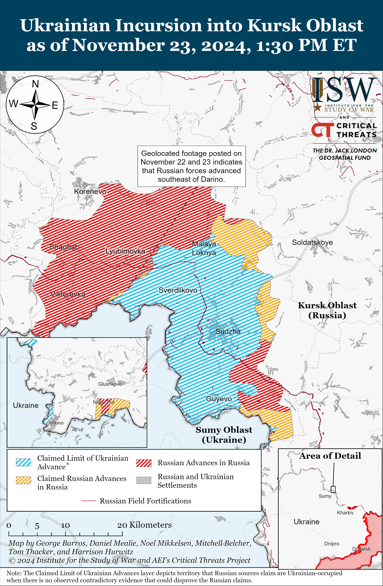
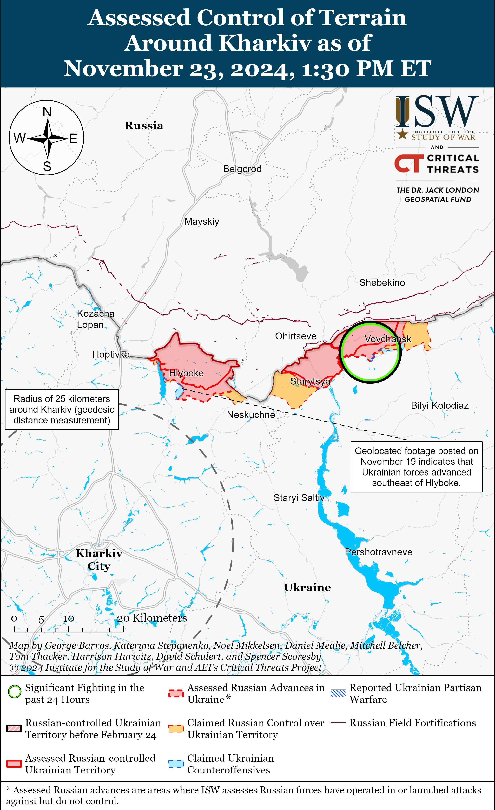
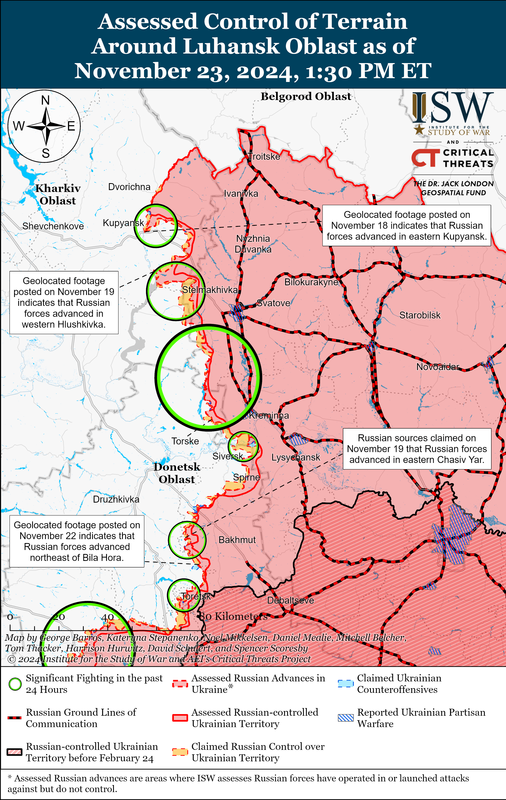
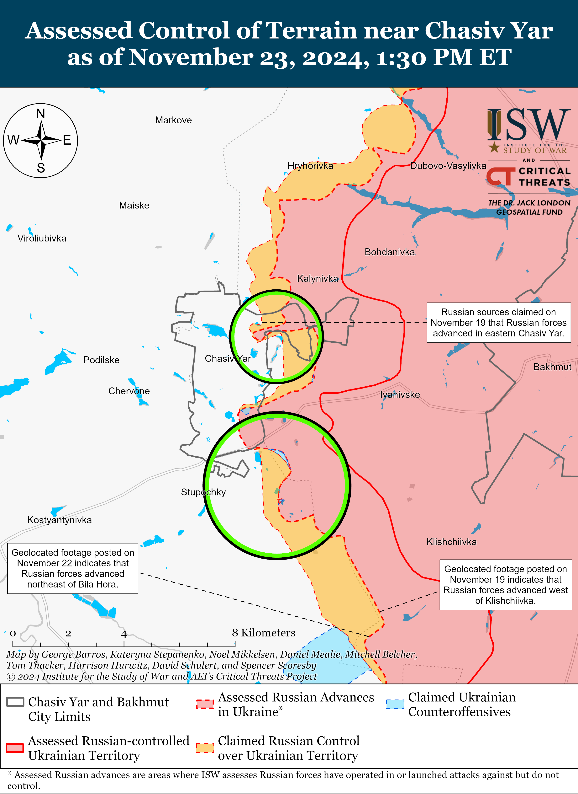
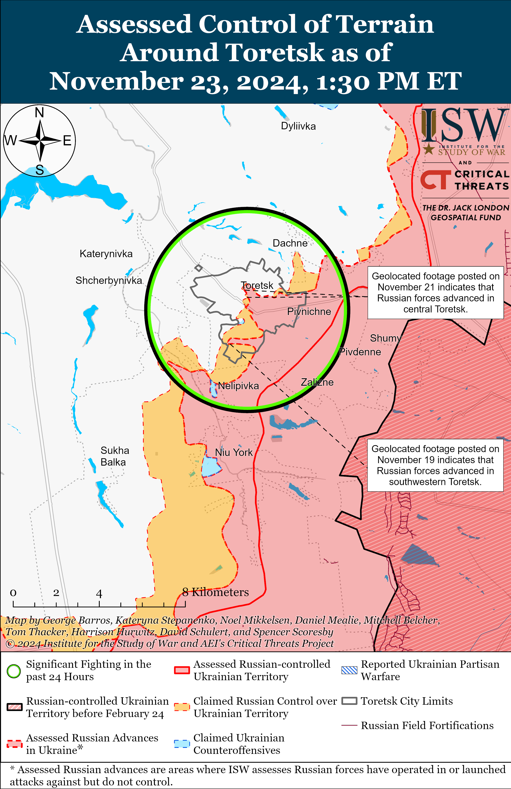
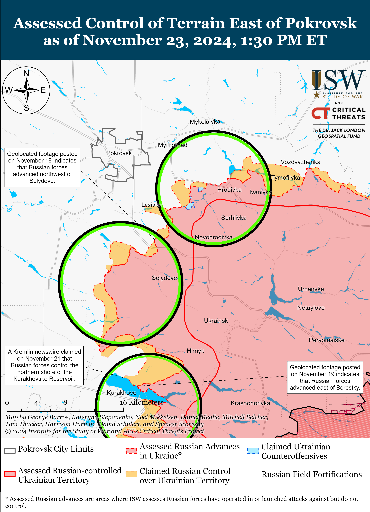
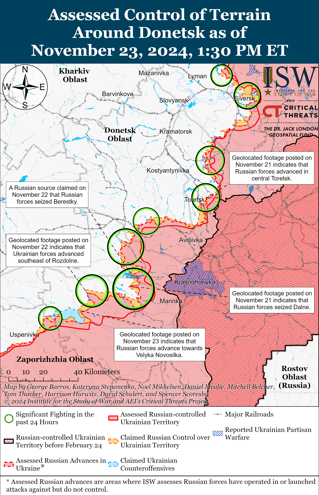
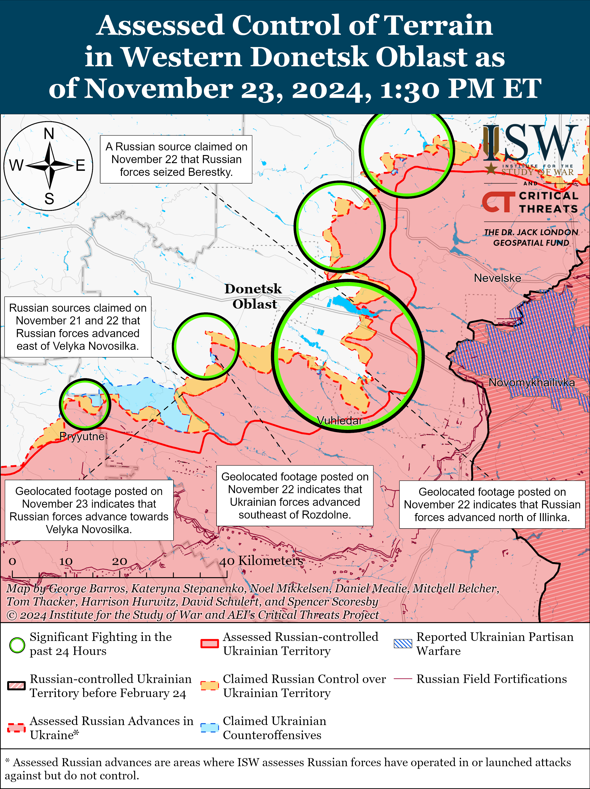
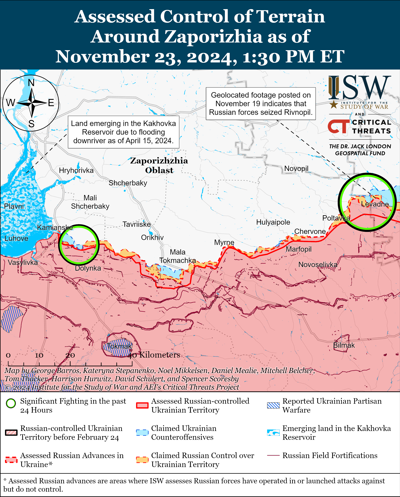
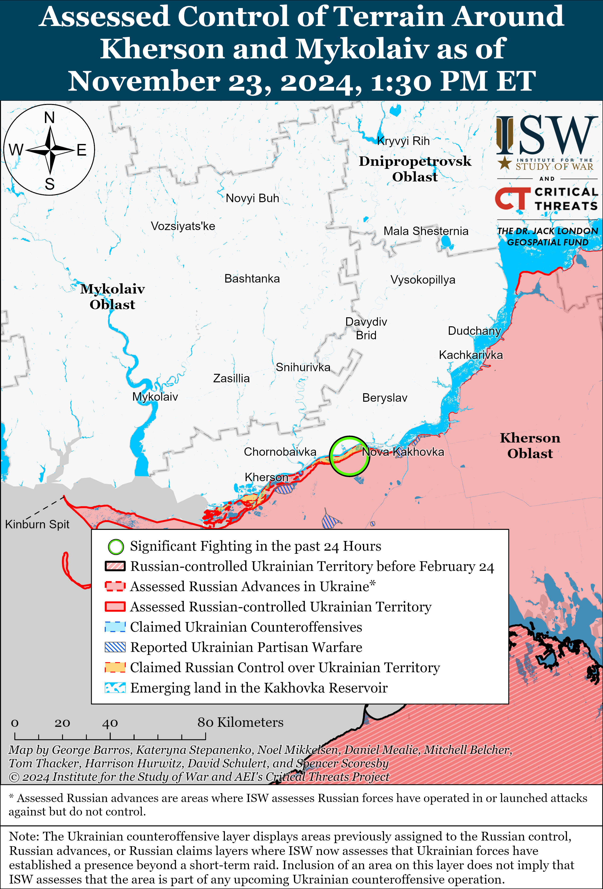

# Russian Offensive Campaign Assessment, November 23, 2024

**Christina Harward, Davit Gasparyan, Grace Mappes, Kateryna Stepanenko, William Runkel, and George Barros**

**November 23, 2024, 5:35pm ET**

**Click** [**here**](https://storymaps.arcgis.com/stories/36a7f6a6f5a9448496de641cf64bd375) **to see ISW’s interactive map of the Russian invasion of Ukraine. This map is updated daily alongside the static maps present in this report.**

**Click** [**here**](https://understandingwar.maps.arcgis.com/apps/instant/3dviewer/index.html?appid=1602762dbcde419bb957dea358449580) **to see ISW’s 3D control of terrain topographic map of Ukraine. Use of a computer (not a mobile device) is strongly recommended for using this data-heavy tool.**

**Click** [**here**](https://storymaps.arcgis.com/stories/733fe90805894bfc8562d90b106aa895) **to access ISW’s archive of interactive time-lapse maps of the Russian invasion of Ukraine. These maps complement the static control-of-terrain map that ISW produces daily by showing a dynamic frontline. ISW will update this time-lapse map archive monthly.**

**Note: The data cut-off for this product was 12:30pm ET on November 23. ISW will cover subsequent reports in the November 24 Russian Offensive Campaign Assessment.**

**The Russian Ministry of Defense (MoD) likely attempted to cover up the recent removal of the acting commander of the Southern Military District (SMD) Colonel General Gennady Anashkin following widespread accusations within the Russian information space that Anashkin’s subordinates submitted false frontline progress reports to superiors.** Russian milbloggers widely claimed on November 23 that the Russian military command removed Anashkin, the acting commander of the SMD and commander of the Russian Southern Grouping of Forces, after Russian commanders in the Siversk direction in his area of responsibility submitted incorrect reports about Russian battlefield advances to their superiors.[1] Russian state outlet *RBK* reported that a source in the Russian MoD acknowledged Anashkin’s dismissal but claimed that it was due to a “planned rotation” and praised Anashkin’s military achievements.[2] Russian milbloggers widely applauded Anashkin’s removal, claiming that this may lead to improvements in how Russian forces plan and conduct operations and may increase the value Russian commanders place on Russian soldiers’ lives at the front.[3] One milblogger claimed that Anashkin’s removal shows that Russian Defense Minister Andrei Belousov is starting to get involved in “military management” and not just administrative and economic reforms within the MoD.[4] Russian milbloggers recently claimed that Russian authorities arrested the commander of the 3rd Combined Arms Army (CAA), the 3rd CAA’s chief of staff, and the commander of the 3rd CAA’s 7th Motorized Rifle Brigade for submitting incorrect reports about Russian advances in the Siversk direction, and Russian milbloggers have widely complained in recent weeks about the pervasive Russian military culture of exaggerating battlefield successes near Siversk.[5] The Russian MoD falsely claimed that Russian forces in the Siversk direction seized Bilhorivka on May 20 and Serebryanka in late October 2024, for example, despite Russian milblogger criticisms of these claims since.[6]

**Ukrainian military officials denied claims of North Korean personnel’s presence in Kharkiv Oblast amid new unconfirmed reports that North Korean “technical advisers” are operating in occupied Mariupol.***CNN*, citing an anonymous Ukrainian security source reported on November 22 that North Korean technical advisers have arrived in Russian-occupied Mariupol, are performing support operations, and are detached from the Russian military units despite wearing Russian military uniforms. Ukrainian military officials also reportedly told *CNN* that radio intercepts suggest that North Korean troops are operating in Kharkiv Oblast and that North Korean troops are waiting for worsening weather conditions to conduct assault operations.[7] The Ukrainian Kharkiv Group of Forces denied reports of the presence of North Korean personnel in Kharkiv Oblast and stated that the spokesperson cited in the *CNN* report is not an official Kharkiv Group of Forces spokesperson and commented on the situation outside of their responsibilities.[8] *Reuters* reported on November 23 that a large number of the 11,000 North Korean troops in Kursk Oblast are still finishing military training.[9]

**Key Takeaways:**

- **The Russian Ministry of Defense (MoD) likely attempted to cover up the recent removal of the acting commander of the Southern Military District (SMD) Colonel General Gennady Anashkin following widespread accusations within the Russian information space that Anashkin’s subordinates submitted false frontline progress reports to superiors.**
- **Ukrainian military officials denied claims of North Korean personnel’s presence in Kharkiv Oblast amid new unconfirmed reports that North Korean “technical advisers” are operating in occupied Mariupol.**
- **Russian forces recently advanced in Kursk Oblast and near Velyka Novosilka.**
- **Kremlin Spokesperson Dmitry Peskov stated that Russia does not currently need to conduct another partial involuntary reserve callup as Russian authorities continue leaning into crypto-mobilization efforts.**

***We do not report in detail on Russian war crimes because these activities are well-covered in Western media and do not directly affect the military operations we are assessing and forecasting. We will continue to evaluate and report on the effects of these criminal activities on the Ukrainian military and the Ukrainian population and specifically on combat in Ukrainian urban areas. We utterly condemn Russian violations of the laws of armed conflict and the Geneva Conventions and crimes against humanity even though we do not describe them in these reports.***

- Ukrainian Operations in the Russian Federation
- Russian Main Effort – Eastern Ukraine (comprised of three subordinate main efforts)
- Russian Subordinate Main Effort #1 – Push Ukrainian forces back from the international border with Belgorod Oblast and approach to within tube artillery range of Kharkiv City
- Russian Subordinate Main Effort #2 – Capture the remainder of Luhansk Oblast and push westward into eastern Kharkiv Oblast and encircle northern Donetsk Oblast
- Russian Subordinate Main Effort #3 – Capture the entirety of Donetsk Oblast
- Russian Supporting Effort – Southern Axis
- Russian Air, Missile, and Drone Campaign
- Russian Mobilization and Force Generation Efforts
- Russian Technological Adaptations
- Activities in Russian-occupied areas
- Significant Activity in Belarus

**Ukrainian Operations in the Russian Federation**

Russian forces recently advanced in the main Ukrainian salient in Kursk Oblast amid continued fighting in the area on November 23. Geolocated footage published on November 22 and 23 indicates that Russian forces recently marginally advanced southeast of Darino (southeast of Korenevo) and in eastern Darino.[10] Russian milbloggers claimed that Russian forces seized Darino and Nikolayevo-Darino (just south of Darino) and advanced near Nizhny Klin (southeast of Korenevo) and Malaya Loknya (north of Sudzha).[11] ISW has not observed confirmation of these claims, however. Russian forces conducted offensive operations near Nizhny Klin, Nikolayevo-Darino, and Martynovka (northeast of Sudzha).[12] A Russian source claimed that Ukrainian forces are unsuccessfully counterattacking near Novoivanovka (southeast of Korenevo).[13] A Russian milblogger claimed that Russian equipment is sinking in the mud during ongoing rainy weather in Kursk Oblast.[14] Elements of the Russian 56th Airborne (VDV) Regiment (7th VDV Division) are reportedly operating in Kursk Oblast; elements of the 83rd VDV Brigade are reportedly operating in Nikolayevo-Darino; and elements of the 51st VDV Regiment (106th VDV Division) are reportedly operating in Darino.[15]

Neither Russian nor Ukrainian sources reported fighting in Glushkovsky Raion west of the main Ukrainian salient in Kursk Oblast on November 23. Geolocated footage published on November 22 shows Ukrainian forces striking a Russian crossing over the Seym River near Karyzh (northwest of Glushkovo).[16]

Ukrainian President Volodmyr Zelensky stated on November 23 that Russian President Vladimir Putin has tasked the Russian military command with pushing Ukrainian forces from Kursk Oblast by late January 2025.[17] Ukrainian officials and Western media have recently reported that Russia has concentrated a rough total of 50,000 personnel, including about 11,000 North Korean forces, in Kursk Oblast in preparation for an operation to push Ukrainian forces from Russian territory before late January 2025.[18]

**Russian Main Effort – Eastern Ukraine**

**Russian Subordinate Main Effort #1 – Kharkiv Oblast** **(Russian objective: Push Ukrainian forces back from the international border with Belgorod Oblast and approach to within tube artillery range of Kharkiv City)**

Russian forces continued ground assaults northeast of Kharkiv City near Vovchansk and Tykhe on November 22 and 23 but did not make confirmed advances.[19]

**Russian Subordinate Main Effort #2 – Luhansk Oblast** **(Russian objective: Capture the remainder of Luhansk Oblast and push westward into eastern Kharkiv Oblast and northern Donetsk Oblast)**

Russian forces continued offensive operations along the Kupyansk-Svatove-Kreminna line on November 23 but did not advance. Russian forces conducted offensive operations northeast of Kupyansk near Synkivka; southeast of Kupyansk near Zahryzove and Hlushkivka; southwest of Svatove near Makiivka, Druzhelyubivka, Tvedokhlibove, Novoyehorivka, and Hrekivka; west of Svatove near Zeleny Hai and in the direction of Novoplatonivka; and west of Kreminna near Terny and Torske on November 22 and 23.[20] Geolocated footage published on November 23 shows Ukrainian forces repelling a platoon-sized Russian mechanized assault east of Terny.[21] A Ukrainian battalion commander stated on November 23 that Russian forces are using armored vehicles to transport infantry during assaults under the cover of fog in the Kupyansk direction to avoid Ukrainian strikes and achieve tactical surprise.[22] The commander stated that Ukrainian forces destroy and damage 90 to 95 percent of lightly armored and armored Russian military equipment fielded on the frontline and in the near rear, forcing Russian forces to walk up to 12 kilometers to reach frontline positions in the Kupyansk direction.[23] The commander also noted that high Russian personnel casualties have prompted Russian forces to resort to disguising themselves as Ukrainian personnel in order to infiltrate into Ukrainian near-rear areas – a war crime.[24] Elements of the Russian 144th Motorized Rifle Division (20th Combined Arms Army [CAA], Moscow Military District [MMD]) reportedly continue to operate near Terny.[25]

**Russian Subordinate Main Effort #3 – Donetsk Oblast** **(Russian objective: Capture the entirety of Donetsk Oblast, the claimed territory of Russia’s proxies in Donbas)**

Russian forces reportedly attacked northeast of Siversk near Bilohorivka on November 23 but did not advance.[26] A Russian milblogger indicated that Russian forces committed some unspecified reserves in the Siversk direction.[27] Russian milbloggers published footage claiming to show Russian forces striking a Ukrainian pontoon bridge over the Siverskyi Donets River west of Siversk with a Kh-38 air-to-surface missile.[28]

Russian forces reportedly continued offensive operations near Chasiv Yar and Stupochky (south of Chasiv Yar) on November 22 and 23 but did not advance.[29] Russian sources also claimed that Ukrainian forces unsuccessfully counterattacked near Predtechyne (south of Chasiv Yar).[30] A Kremlin-affiliated Russian military expert claimed that Russian forces gained a foothold in Chasiv Yar’s industrial zone and that Russian forces control 30 percent of the city.[31] ISW has observed Russian forces operating in approximately 21 percent of Chasiv Yar. Elements of the Russian 98th Airborne (VDV) Division; drone operators of the “Okhotnik” Separate Special Purpose Detachment (51st Combined Arms Army [CAA]; formerly 1st Donetsk People’s Republic’s 1st Army Corps [AC], Southern Military District [SMD]); elements of the Chechen “Akhmat” Spetsnaz; and elements of the 4th Motorized Rifle Brigade (3rd CAA, formerly 2nd Luhansk People’s Republic’s [LNR] AC, SMD) are operating in the Chasiv Yar direction.[32]

Russian forces continued ground attacks near Toretsk and west of Toretsk near Leonidivka on November 22 and 23 but did not make any confirmed advances.[33] Russian milbloggers claimed on November 23 that Russian forces advanced in northern Toretsk and up to 650 meters deep in the Zabalka Microraion (southern Toretsk).[34] ISW has not observed visual confirmation of these claims, however. A Russian milblogger claimed that Russian forces have consolidated positions in a sector up to one kilometer wide on Heroiv Pratsi and Myrna streets in central Toretsk.[35] A Kremlin-affiliated Russian milblogger claimed that Ukrainian forces are counterattacking in southern Toretsk and that Russian sources on the ground did not confirm Russian forces’ presence north of Hrushevskoho Street in northern Toretsk.[36] The milblogger noted that it is difficult to determine the exact contours of the frontline in Toretsk due to the nature of urban combat in which Russian and Ukrainian forces are often holding positions within the same buildings. Drone operators of the Russian 132nd Motorized Rifle Brigade (51st CAA) are reportedly operating in Toretsk.[37]

Russian sources made unconfirmed claims that Russian forces recently advanced south of Pokrovsk amid continued offensive operations on November 22 and 23. A Russian milblogger claimed that Russian forces marginally advanced to central Pustynka (west of Selydove and south of Pokrovsk), but ISW has not observed visual confirmation of this claim.[38] Russian forces attacked east of Pokrovsk near Promin, Myrnohrad, and Myrolyubivka; southeast of Pokrovsk near Lysivka, Krutyi Yar, Sukhyi Yar; south of Pokrovsk near Hyrhorivka, Pustynka, Petrivka, Dachenske, Pushkyne, and Zhovte on November 22 and 23.[39] The spokesperson of a Ukrainian brigade operating in the Pokrovsk direction reported that Russian forces conduct up to 10 assaults per day within the brigade’s area of responsibility and that the Ukrainian brigade is currently defending against elements of four Russian motorized rifle brigades, including elements of the Russian 74th Motorized Rifle Brigade (41st CAA, Central Military District [CMD]).[40]

Russian sources claimed that Russian forces made several advances in the Kurakhove direction, but ISW cannot independently verify these claims. The Russian Ministry of Defense (MoD) claimed that Russian forces seized Novodmytrivka (northwest of Kurakhove), and Russian milbloggers continued to claim that Russian forces are consolidating positions in Berestky (north of Kurakhove on the northern bank of the Kurakhivske Reservoir).[41] ISW has not observed visual evidence to confirm these claims. A source in the Ukrainian General Staff told *Reuters* that the Kurakhove direction is the most threatening direction for Ukrainian forces as Russian forces advance at the rate of 200 to 300 meters per day in this direction and have already broken through in some unspecified areas.[42] Russian forces reportedly continued offensive operations near Kurakhove; northeast of Kurakhove near Sontsivka and Zorya; north of Kurakhove near Berestky; northwest of Kurakhove near Novodmytrivka; and south of Kurakhove near Dalne.[43] Elements of the Russian 5th Separate Motorized Rifle Brigade (51st CAA) are reportedly operating near Kurakhove.[44]

Russian forces reportedly advanced northeast of Vuhledar but there were no confirmed advances. A Russian milblogger claimed that Russian forces advanced north of Illinka (northeast of Vuhledar), but ISW has not observed visual evidence of this claim.[45] Russian forces reportedly continued assaults northeast of Vuhledar near Romanivka, Katerynivka, and Antonivka; and northwest of Vuhledar near Sukhi Yaly, Trudove, Rozlyv, and Kostyantynopolske.[46] The Russian 1st Company of the Kuzma Minin Battalion within the 10th Tank Regiment (51st CAA) is reportedly operating near Antonivka and Illinka, and assault elements of the Russian 33rd Motorized Riffle Regiment (20th Motorized Rifle Division, 8th CAA) are reportedly operating near Antonvika.[47]

Russian forces recently conducted a company-sized mechanized assault in the Donetsk-Zaporizhia Oblast border area and advanced. Geolocated footage published on November 22 shows Ukrainian forces repelling waves of a Russian mechanized assault in the fields southeast of Velyka Novosilka, indicating that Russian forces advanced in the area.[48] Russian sources claimed that Russian forces broke through by almost five kilometers towards Rozdolne (northeast of Velyka Novosilka), are consolidating positions in eastern Rozdone, and advanced 2.2 kilometers deep on a front about 8.4 kilometers wide towards Velyka Novosilka.[49] A Russian milblogger claimed on November 23 that Ukrainian mine barriers are hindering Russian advances towards Velyka Novosilka and that heavy rain is affecting the ability to maneuver and use drones.[50] Russian forces reportedly conducted assaults near Velyka Novosilka; northeast of Velyka Novosilka near Rozdolne; and southwest of Velyka Novosilka near Novodarivka and Rivnopil.[51] Elements of the Russian 40th Naval Infantry Brigade (Pacific Fleet, Eastern Military District [EMD]) are reportedly operating near Rozdolne; elements of the 60th Motorized Rifle Brigade (5th CAA, EMD), including Spetsnaz elements, are operating in the Vremivka direction; and drone operators of the 5th Guards Tank Brigade (36th CAA, EMD) are operating near Velyka Novosilka.[52]

**Russian Supporting Effort – Southern Axis** **(Russian objective: Maintain frontline positions and secure rear areas against Ukrainian strikes)**

Russian forces continued ground assaults in western Zaporizhia Oblast, including northwest of Robotyne near Kamyanske, on November 22 and 23 but did not advance.[53]

Positional fighting continued in the Dnipro direction in east (left) bank Kherson Oblast on November 22 and 23, but there were no changes to the frontline.[54] Elements of the Russian 80th Arctic Motorized Rifle Brigade (14th Army Corps [AC], Leningrad Military District [LMD]) reportedly continue to operate in the Kherson direction.[55]

**Russian Air, Missile, and Drone Campaign** **(Russian Objective: Target Ukrainian military and civilian infrastructure in the rear and on the frontline)**

The Russian Ministry of Defense (MoD) claimed on November 23 that Russian forces destroyed a Ukrainian MiG-29 fighter aircraft in an Iskander ballistic missile strike against a Ukrainian airfield near Dnipro City, Dnipropetrovsk Oblast.[56] A Russian milblogger claimed on November 22 that a Russian Iskander-M missile may have struck a high-quality mockup aircraft instead of a real MiG-29 at the Aviatorske airfield in Dnipropetrovsk Oblast.[57]

**Russian Mobilization and Force Generation Efforts** **(Russian objective: Expand combat power without conducting general mobilization)**

Kremlin Spokesperson Dmitry Peskov stated that Russia does not currently need to conduct another partial involuntary reserve callup as Russian authorities continue leaning into crypto-mobilization efforts. Peskov stated on November 23 that Kremlin officials are not currently discussing a second round of mobilization and that Russia is currently recruiting sufficient numbers of contract volunteer personnel.[58] Other Russian authorities continue efforts to incentivize further contract volunteer recruitment. Russian President Vladimir Putin signed a law on November 23 allowing Russian soldiers who fought in Ukraine to write off loans up to 10 million rubles (about $95,869) if Russian courts initiate debt collection proceedings before December 1, 2024, likely to incentivize Russians with existing debt to sign contracts with the Russian Ministry of Defense (MoD).[59] A Russian milblogger amplified a recruitment advertisement for military service within Russian Airborne (VDV) units in multiple Russian federal subjects, promising to cover recruits’ travel expenses to sign contracts.[60] The advertisement also offered one-time payments of 2.5 million rubles (about $23,967) for contracts signed in Tula Oblast, 3 million rubles (about $28,760) for contracts signed in Belgorod and Nizhny Novgorod oblasts, and 2.1 million rubles (about 20,132) for contracts signed in Leningrad Oblast.  
   
 The Russian government remains concerned about the economic cost of continuing to wage war in Ukraine, particularly in compensating Russian soldiers. The Russian MoD submitted a draft law on November 22 that would oblige Russian soldiers to return their one-time payments from signing Russian military contracts if the soldiers commit a “gross disciplinary offense” or evade military duties.[61] Putin has recently indicated that he is concerned about Russia’s long term economic stability, including by decreasing payments due to Russian soldiers injured on the battlefield.[62] The Russian MoD likely intends for this draft law to incentivize better discipline among Russian military personnel, particularly as Russian military personnel continue to publicly complain about the Russian military command’s poor treatment of Russian soldiers.

Former commanders of the Wagner Group private military company (PMC) have reportedly formed a new PMC unit called “Wagner Legion.” Russian milbloggers amplified an image of former Wagner Group commanders, callsigns “Rusich,” “Cap,” “Ratibor,” “Marx,” and “Radimir,” standing in front of a banner bearing the insignia of the Wagner Legion and claimed that “Cap” is leading the new unit.[63] The milbloggers claimed that Wagner Legion is already recruiting and training new fighters. The Russian MoD has notably attempted to subsume the Wagner Group following the death of its former financier Yevgeny Prigozhin by piecemealing remaining Wagner personnel to various Russian military formations, and the extent of Wagner Legion’s subordination to the Russian MoD or other security structures is unclear. Chechen Republic Head Ramzan Kadyrov claimed in April 2024 that Wagner commander Alexander Kuznetsov (callsign “Ratibor”) would join the Chechen Akhmat Spetsnaz with 3,000 Wagner personnel and indicated that the Wagner personnel would be subordinated under the Russian MoD.[64]

**Russian Technological Adaptations** **(Russian objective: Introduce technological innovations to optimize systems for use in Ukraine)**

Nothing significant to report.

**Activities in Russian-occupied areas** **(Russian objective: Consolidate administrative control of annexed areas; forcibly integrate Ukrainian citizens into Russian sociocultural, economic, military, and governance systems)**

*ISW is not publishing coverage of activities in Russian-occupied areas today.*

**Significant activity in Belarus** **(Russian efforts to increase its military presence in Belarus and further integrate Belarus into Russian-favorable frameworks and Wagner Group activity in Belarus)**

Belarusian President Alexander Lukashenko claimed on November 22 that he will disconnect the internet in Belarus if there are protests following the Belarusian presidential elections to be held on January 26, 2025, likely in an attempt to prevent protests similar to those held in the aftermath of the 2020 presidential elections.[65]

**Note: ISW does not receive any classified material from any source, uses only publicly available information, and draws extensively on Russian, Ukrainian, and Western reporting and social media as well as commercially available satellite imagery and other geospatial data as the basis for these reports. References to all sources used are provided in the endnotes of each update.**

[1] https://t.me/rybar/65638 ; https://t.me/RVvoenkor/81215; https://t.me/dva\_majors/58442 ; https://t.me/osetin20/9632; https://t.me/voenkorKotenok/60270; https://t.me/milinfolive/135639 ; https://t.me/Sladkov\_plus/11873; https://t.me/boris\_rozhin/145349; https://t.me/DnevnikDesantnika/19738

[2] https://www.rbc dot ru/politics/23/11/2024/6741d9e09a794771ae3f0282?from=story\_61ee7c0f9a7947051824f535

[3] https://t.me/rybar/65638; https://t.me/RVvoenkor/81215; https://t.me/Sladkov\_plus/11873

[4] https://t.me/dva\_majors/58442

[5] https://isw.pub/UkrWar111624; https://isw.pub/UkrWar110724

[6] https://understandingwar.org/backgrounder/russian-offensive-campaign-assessment-may-20-2024

[7] https://www.cnn.com/world/live-news/ukraine-russia-war-11-22-24-intl-hnk#cm3sotvmj000k3b6nd1qoynqs ; https://t.me/NgP\_raZVedka/19661

[8] https://t.me/otukharkiv/2715

[9] https://www.reuters.com/world/europe/ukraine-has-lost-over-40-russias-kursk-region-counter-attacks-senior-kyiv-2024-11-23/

[10] https://x.com/franfran2424/status/1860292948488856054; https://t.me/pride\_group\_2\_80/35; https://x.com/SibirPrizrak/status/1860255168958267814; https://x.com/franfran2424/status/1860301940703281627; https://t.me/UkropHunter/232; https://x.com/creamy\_caprice/status/1860104567884775742; https://t.me/creamy\_caprice/7595 ; https://t.me/creamy\_caprice/7606; https://t.me/UkropHunter/233

[11] https://t.me/dva\_majors/58421; https://t.me/DnevnikDesantnika/19719; https://t.me/motopatriot/29714

[12] https://t.me/DnevnikDesantnika/19718; https://t.me/rusich\_army/18714

[13] https://t.me/DnevnikDesantnika/19718

[14] https://t.me/rusich\_army/18714

[15] https://t.me/DnevnikDesantnika/19711 ; https://t.me/basurin\_e/15659; https://t.me/motopatriot/29714 ; https://t.me/RVvoenkor/81217; https://t.me/DnevnikDesantnika/19719; https://t.me/RVvoenkor/81226

[16] https://x.com/666\_mancer/status/1860292833636212929 ; https://t.me/soniah\_hub/7718

[17] https://suspilne dot media/886713-putin-postaviv-zavdanna-svoim-vijskam-vitisniti-zsu-iz-kurskoi-oblasti-do-inavguracii-trampa-zelenskij/

[18] https://isw.pub/UkrWar111224; https://www.reuters.com/world/europe/ukraine-has-lost-over-40-russias-kursk-region-counter-attacks-senior-kyiv-2024-11-23/

[19]https://www.facebook.com/GeneralStaff.ua/posts/pfbid0rL1JC4pEtUsxj2ACbYNSgxGHgHuKuhLPzu8dgoo3ud4Mk7KvEMcJgG3eV1mzfdrZl ; https://www.facebook.com/GeneralStaff.ua/posts/pfbid023icmLmZrksGNDWW93hnjAnLR2pcjtw1YxHV24yDmgMnK3yfPEzJLXRw7gKfTz7kcl ; https://www.facebook.com/GeneralStaff.ua/posts/pfbid0rMryhWeQfpWEfKvt33vyjs2V1zjvTMxHgwQc9HVXEoucv9EUFgsNoBpT8AqkWYb9l ; https://t.me/otukharkiv/2735

[20] https://www.facebook.com/GeneralStaff.ua/posts/pfbid0rMryhWeQfpWEfKvt33vyjs2V1zjvTMxHgwQc9HVXEoucv9EUFgsNoBpT8AqkWYb9l ; https://www.facebook.com/GeneralStaff.ua/posts/pfbid023icmLmZrksGNDWW93hnjAnLR2pcjtw1YxHV24yDmgMnK3yfPEzJLXRw7gKfTz7kcl ; https://www.facebook.com/GeneralStaff.ua/posts/pfbid0rL1JC4pEtUsxj2ACbYNSgxGHgHuKuhLPzu8dgoo3ud4Mk7KvEMcJgG3eV1mzfdrZl

[21] https://x.com/moklasen/status/1860291805146701876; https://x.com/moklasen/status/1860292931468271974; https://t.me/OMIBr\_60/637

[22] https://armyinform dot com.ua/2024/11/23/kupyanska-avantyura-v-rezhymi-kamikadze-v-zsu-poyasnyly-yak-rosiyanam-vdalosya-zaskochyly-v-misto/

[23] https://armyinform dot com.ua/2024/11/23/pered-shturmom-12-km-pishky-chomu-na-harkivshhyni-v-okupantiv-nemaye-inshogo-vyboru/ ; https://youtu.be/aDXWlQ2K0dM

[24] https://armyinform dot com.ua/2024/11/23/aktyvizuyutsya-shhob-destabilizuvaty-sytuacziyu-yak-diyut-perevdyagnuti-u-piksel-okupanty/; https://youtu.be/TRU7BZjzevY

[25] https://t.me/epoddubny/21716

[26] https://www.facebook.com/GeneralStaff.ua/posts/pfbid0rL1JC4pEtUsxj2ACbYNSgxGHgHuKuhLPzu8dgoo3ud4Mk7KvEMcJgG3eV1mzfdrZl

[27] https://t.me/DnevnikDesantnika/19738

[28] https://t.me/boris\_rozhin/145296; https://t.me/DnevnikDesantnika/19729

[29]https://www.facebook.com/GeneralStaff.ua/posts/pfbid0rMryhWeQfpWEfKvt33vyjs2V1zjvTMxHgwQc9HVXEoucv9EUFgsNoBpT8AqkWYb9l; https://www.facebook.com/GeneralStaff.ua/posts/pfbid023icmLmZrksGNDWW93hnjAnLR2pcjtw1YxHV24yDmgMnK3yfPEzJLXRw7gKfTz7kcl; https://www.facebook.com/GeneralStaff.ua/posts/pfbid0rL1JC4pEtUsxj2ACbYNSgxGHgHuKuhLPzu8dgoo3ud4Mk7KvEMcJgG3eV1mzfdrZl; https://armyinform dot com.ua/2024/11/22/u-sylah-oborony-rozpovily-yak-okupanty-sami-sebe-blokuyut-poblyzu-chasovogo-yaru/; https://armyinform dot com.ua/2024/11/23/u-sylah-oborony-rozpovily-shho-chasiv-yar-okupanty-obstrilyuyut-z-usih-vydiv-ozbroyen/

[30] https://t.me/tass\_agency/286886

[31] https://t.me/tass\_agency/286871 ; https://t.me/tass\_agency/286872 ; https://t.me/tass\_agency/286878

[32] https://t.me/DnevnikDesantnika/19711 ; https://t.me/dva\_majors/58446; https://t.me/RKadyrov\_95/5249; https://t.me/nm\_dnr/13016

[33]https://www.facebook.com/GeneralStaff.ua/posts/pfbid0rL1JC4pEtUsxj2ACbYNSgxGHgHuKuhLPzu8dgoo3ud4Mk7KvEMcJgG3eV1mzfdrZl ; https://www.facebook.com/GeneralStaff.ua/posts/pfbid0rMryhWeQfpWEfKvt33vyjs2V1zjvTMxHgwQc9HVXEoucv9EUFgsNoBpT8AqkWYb9l; https://www.facebook.com/GeneralStaff.ua/posts/pfbid023icmLmZrksGNDWW93hnjAnLR2pcjtw1YxHV24yDmgMnK3yfPEzJLXRw7gKfTz7kcl ; https://t.me/rybar/65624

[34] https://t.me/rybar/65624 ; https://t.me/RVvoenkor/81238

[35] https://t.me/dva\_majors/58421

[36] https://t.me/rybar/65624

[37] https://t.me/nm\_dnr/13015

[38] https://t.me/z\_arhiv/29731?single

[39] https://www.facebook.com/GeneralStaff.ua/posts/pfbid0rL1JC4pEtUsxj2ACbYNSgxGHgHuKuhLPzu8dgoo3ud4Mk7KvEMcJgG3eV1mzfdrZl; https://www.facebook.com/GeneralStaff.ua/posts/pfbid0rMryhWeQfpWEfKvt33vyjs2V1zjvTMxHgwQc9HVXEoucv9EUFgsNoBpT8AqkWYb9l; https://www.facebook.com/GeneralStaff.ua/posts/pfbid023icmLmZrksGNDWW93hnjAnLR2pcjtw1YxHV24yDmgMnK3yfPEzJLXRw7gKfTz7kcl; https://t.me/boris\_rozhin/145308

[40] https://armyinform dot com.ua/2024/11/22/na-pokrovskomu-napryamku-vorog-prodovzhuye-taktyku-myasnyh-shturmiv/

[41] https://t.me/NgP\_raZVedka/19656; https://t.me/DnevnikDesantnika/19712; https://t.me/DnevnikDesantnika/19736; https://t.me/mod\_russia/46056; https://t.me/RVvoenkor/81223 ; https://t.me/motopatriot/29738; https://t.me/boris\_rozhin/145308;

[42] https://www.reuters.com/world/europe/ukraine-has-lost-over-40-russias-kursk-region-counter-attacks-senior-kyiv-2024-11-23/

[43] https://www.facebook.com/GeneralStaff.ua/posts/pfbid0rMryhWeQfpWEfKvt33vyjs2V1zjvTMxHgwQc9HVXEoucv9EUFgsNoBpT8AqkWYb9l; https://www.facebook.com/GeneralStaff.ua/posts/pfbid023icmLmZrksGNDWW93hnjAnLR2pcjtw1YxHV24yDmgMnK3yfPEzJLXRw7gKfTz7kcl; https://www.facebook.com/GeneralStaff.ua/posts/pfbid0rL1JC4pEtUsxj2ACbYNSgxGHgHuKuhLPzu8dgoo3ud4Mk7KvEMcJgG3eV1mzfdrZl; https://t.me/DnevnikDesantnika/19736

[44] https://t.me/Sladkov\_plus/11869

[45] https://t.me/z\_arhiv/29728?single; https://t.me/DnevnikDesantnika/19701

[46] https://www.facebook.com/GeneralStaff.ua/posts/pfbid0rMryhWeQfpWEfKvt33vyjs2V1zjvTMxHgwQc9HVXEoucv9EUFgsNoBpT8AqkWYb9l; https://www.facebook.com/GeneralStaff.ua/posts/pfbid023icmLmZrksGNDWW93hnjAnLR2pcjtw1YxHV24yDmgMnK3yfPEzJLXRw7gKfTz7kcl; https://www.facebook.com/GeneralStaff.ua/posts/pfbid0rL1JC4pEtUsxj2ACbYNSgxGHgHuKuhLPzu8dgoo3ud4Mk7KvEMcJgG3eV1mzfdrZl; https://t.me/voenkorKotenok/60271; https://t.me/voenkorKotenok/60273; https://t.me/milinfolive/135638

[47] https://t.me/RVvoenkor/81194; https://t.me/dva\_majors/58441

[48] https://t.me/opbr\_zsu/409; https://t.me/creamy\_caprice/7597; https://x.com/moklasen/status/1860261896936362317; https://x.com/moklasen/status/1860261894516285932; https://armyinform dot com.ua/2024/11/23/avtomat-na-droni-zsu-pokazaly-innovaczijnyj-pidhid-do-znyshhennya-okupantiv/; https://www.facebook.com/Prezydentska.Bryhada/videos/889412563404443

[49] https://t.me/voin\_dv/11956; https://t.me/RVvoenkor/81192; https://t.me/RVvoenkor/81207; https://t.me/DnevnikDesantnika/19728

[50] https://t.me/voenkorKotenok/60269

[51] https://www.facebook.com/GeneralStaff.ua/posts/pfbid0rL1JC4pEtUsxj2ACbYNSgxGHgHuKuhLPzu8dgoo3ud4Mk7KvEMcJgG3eV1mzfdrZl; https://www.facebook.com/GeneralStaff.ua/posts/pfbid0rMryhWeQfpWEfKvt33vyjs2V1zjvTMxHgwQc9HVXEoucv9EUFgsNoBpT8AqkWYb9l; https://www.facebook.com/GeneralStaff.ua/posts/pfbid023icmLmZrksGNDWW93hnjAnLR2pcjtw1YxHV24yDmgMnK3yfPEzJLXRw7gKfTz7kcl

[52] https://t.me/voin\_dv/11958 ; https://t.me/voin\_dv/11953; https://t.me/voin\_dv/11955; https://t.me/boris\_rozhin/145289

[53] https://www.facebook.com/GeneralStaff.ua/posts/pfbid0rMryhWeQfpWEfKvt33vyjs2V1zjvTMxHgwQc9HVXEoucv9EUFgsNoBpT8AqkWYb9l; https://www.facebook.com/GeneralStaff.ua/posts/pfbid023icmLmZrksGNDWW93hnjAnLR2pcjtw1YxHV24yDmgMnK3yfPEzJLXRw7gKfTz7kcl

[54] https://www.facebook.com/GeneralStaff.ua/posts/pfbid0rL1JC4pEtUsxj2ACbYNSgxGHgHuKuhLPzu8dgoo3ud4Mk7KvEMcJgG3eV1mzfdrZl; https://www.facebook.com/GeneralStaff.ua/posts/pfbid0rMryhWeQfpWEfKvt33vyjs2V1zjvTMxHgwQc9HVXEoucv9EUFgsNoBpT8AqkWYb9l; https://www.facebook.com/GeneralStaff.ua/posts/pfbid023icmLmZrksGNDWW93hnjAnLR2pcjtw1YxHV24yDmgMnK3yfPEzJLXRw7gKfTz7kcl

[55] https://t.me/NeoficialniyBeZsonoV/41667

[56] https://t.me/mod\_russia/46057

[57] https://t.me/milinfolive/135600

[58] https://www.rbc dot ru/politics/23/11/2024/6741569d9a79479d47e44568

[59] http://publication.pravo dot gov.ru/document/0001202411230004?index=1; https://meduza dot io/news/2024/11/23/putin-podpisal-zakon-o-spisanii-prosrochennyh-kreditov-do-10-millionov-rubley-uchastnikam-voyny-v-ukraine; https://t.me/astrapress/69083; https://t.me/tass\_agency/286942

[60] https://isw.pub/UkrWar111424

[61] https://www.vedomosti dot ru/politics/articles/2024/11/22/1076778-utochnili-pravila-vozvrata-viplat; https://t.me/vedomosti/54282

[62] https://isw.pub/UkrWar111424

[63] https://t.me/DnevnikDesantnika/19737; https://t.me/boris\_rozhin/145288; https://t.me/slavrus126/10118

[64] https://understandingwar.org/backgrounder/russian-offensive-campaign-assessment-april-6-2024

[65] https://t.me/astrapress/69054
