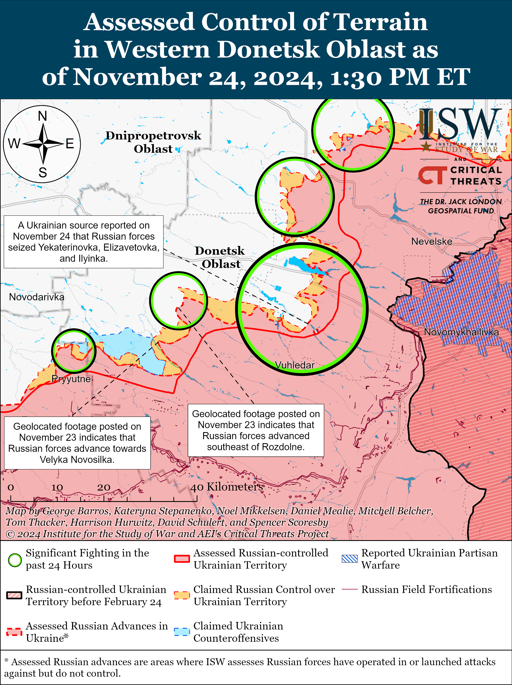
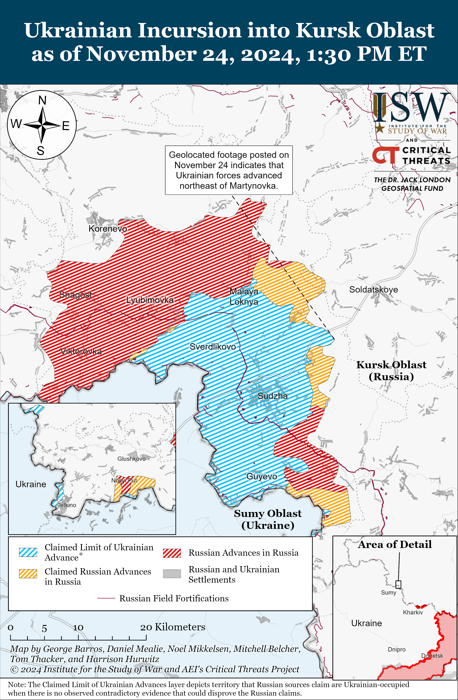
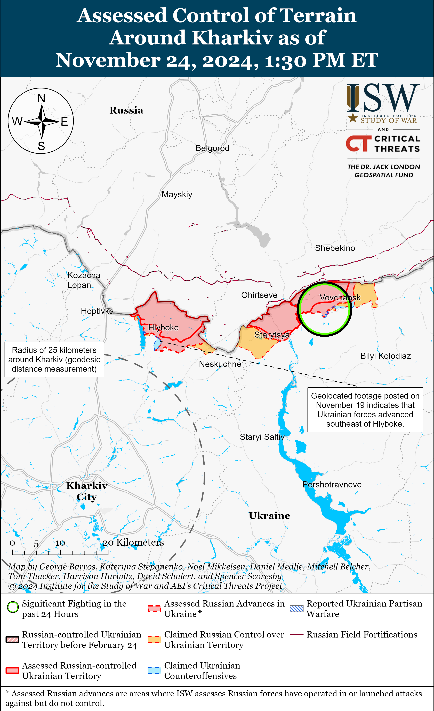
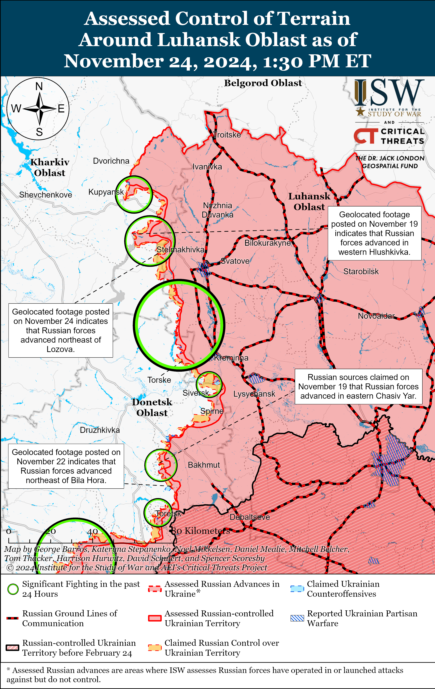
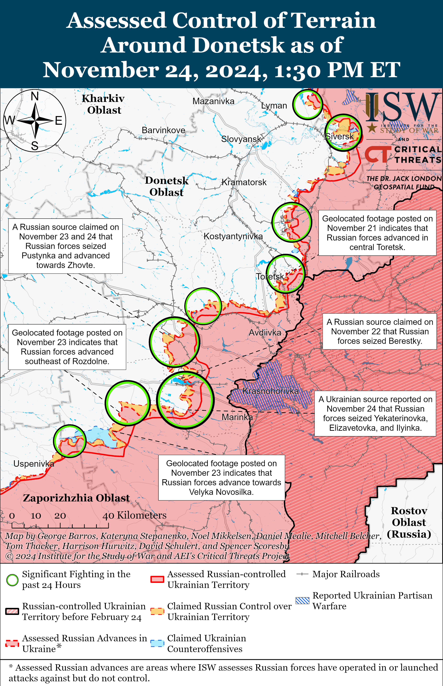
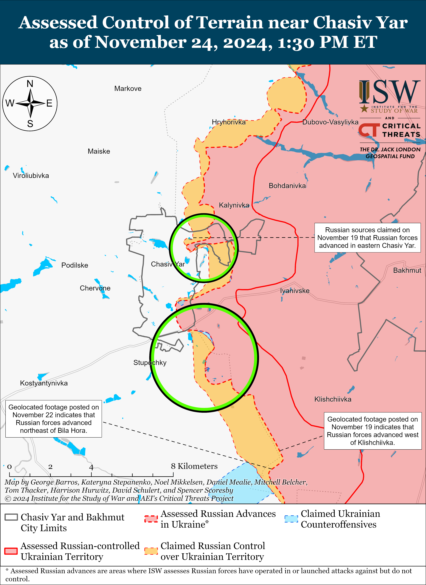
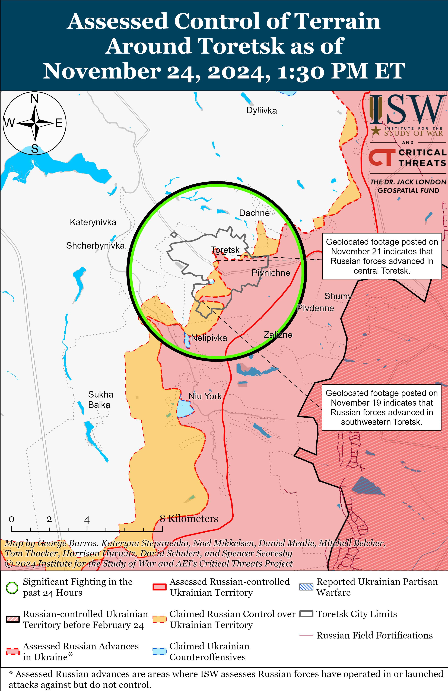
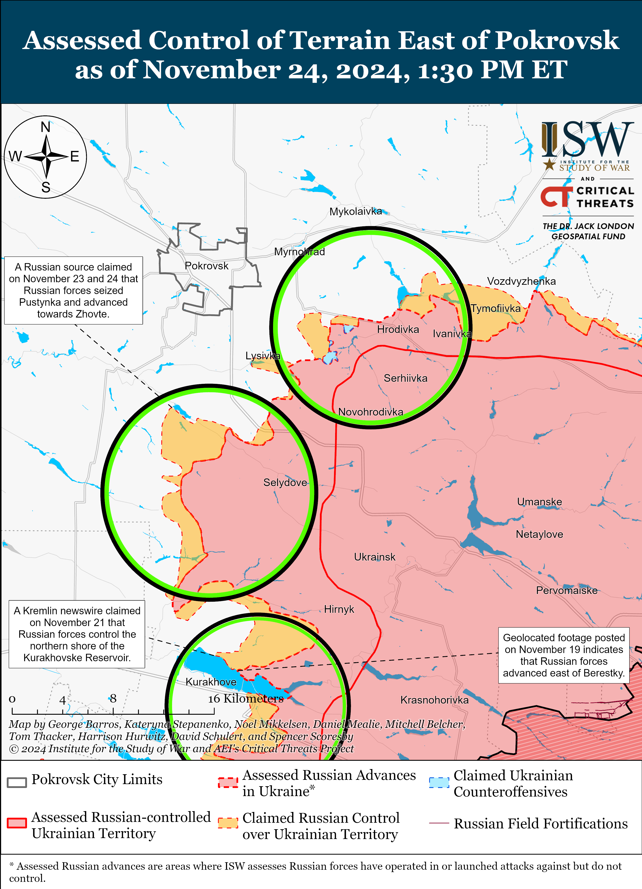
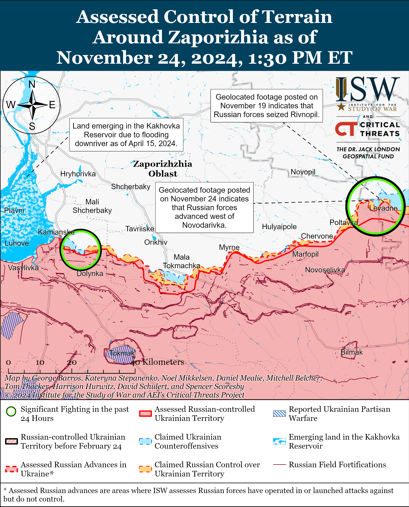
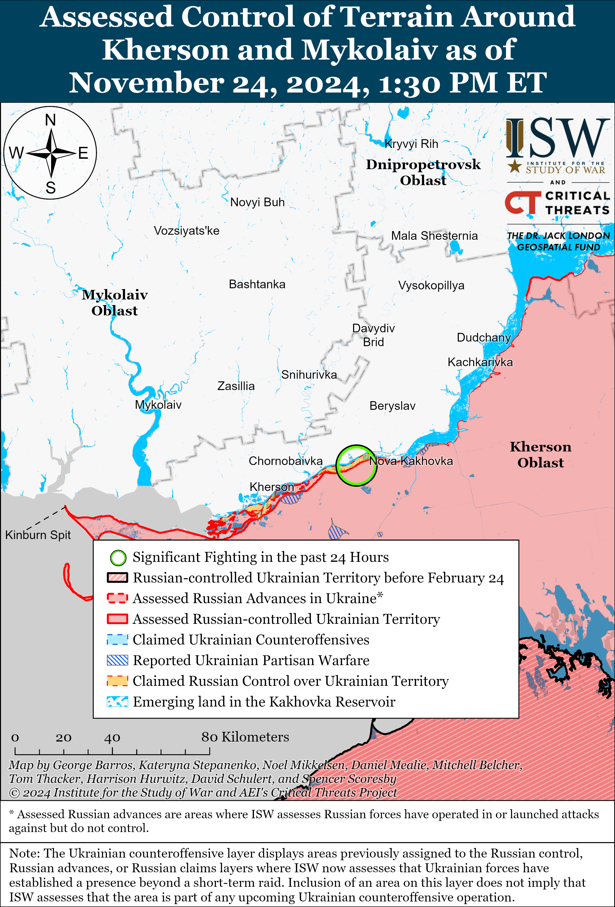

# Russian Offensive Campaign Assessment, November 24, 2024

**Russian Offensive Campaign Assessment, November 24, 2024**

**Christina Harward, Nicole Wolkov, Grace Mappes, Davit Gasparyan, and George Barros**

**November 24, 2024, 8:45 pm ET**

**Click**[**here**](https://storymaps.arcgis.com/stories/36a7f6a6f5a9448496de641cf64bd375)**to see ISW’s interactive map of the Russian invasion of Ukraine. This map is updated daily alongside the static maps present in this report.**

**Click**[**here**](https://understandingwar.maps.arcgis.com/apps/instant/3dviewer/index.html?appid=1602762dbcde419bb957dea358449580)**to see ISW’s 3D control of terrain topographic map of Ukraine. Use of a computer (not a mobile device) is strongly recommended for using this data-heavy tool.**

**Click**[**here**](https://storymaps.arcgis.com/stories/733fe90805894bfc8562d90b106aa895)**to access ISW’s archive of interactive time-lapse maps of the Russian invasion of Ukraine. These maps complement the static control-of-terrain map that ISW produces daily by showing a dynamic frontline. ISW will update this time-lapse map archive monthly.**

**Note: The data cut-off for this product was 11:30am ET on November 24. ISW will cover subsequent reports in the November 25 Russian Offensive Campaign Assessment.**

**Russian forces’ recent confirmed battlefield gains near Vuhledar and Velyka Novosilka demonstrate that the war in Ukraine is not stalemated. The frontline in Donetsk Oblast is becoming increasingly fluid as Russian forces recently have been advancing at a significantly quicker rate than they did in the entirety of 2023.**Ukrainian military observer Kostyantyn Mashovets stated on November 24 that Russian forces have seized Katerynivka, Yelizavetivka, Illinka, and likely Romanivka (all northeast of Vuhledar along the C051104 highway), and geolocated footage published on November 24 indicates that Russian forces recently advanced to the eastern outskirts of Yelizavetivka.[1] Additional geolocated footage published on November 24 indicates that Russian forces recently advanced to central Trudove (north of Vuhledar).[2] Russian forces also made recent confirmed advances in the Velyka Novosilka area, as geolocated footage published on November 23 and 24 indicates that Russian forces recently advanced south of Rozdolne (northeast of Velyka Novosilka) and to western Novodarivka (southwest of Velyka Novosilka).[3] Russian forces have significantly increased the tempo of their advances in the Pokrovsk, Kurakhove, Vuhledar, and Velyka Novosilka directions since September 1, 2024, having gained at least 1,103 square kilometers in these areas since September 1, 2024. Russian forces, in contrast, only gained 387 square kilometers in all of 2023 due to Ukraine’s 2023 counteroffensive.

Russian forces’ advances in southeastern Ukraine are largely the result of the discovery and tactical exploitation of vulnerabilities in Ukraine’s lines. Russian forces have been making gradual, tactical advances in southeastern Ukraine since Fall 2024. Russian forces notably have not been able to restore operational maneuver seen during the initial months of Russia’s full-scale invasion, and the current Russian tactical advances, although quicker now than in the months of positional warfare that characterized most of 2023 and early 2024, are still far below the Russian rate of advance in March 2022.[4] Russian forces have succeeded in taking advantage of the seizure of Vuhledar for further offensive operations in western Donetsk Oblast, contrary to an incorrect previous ISW assessment that forecasted otherwise.[5] ISW presents the following courses of action (COAs) that the Russian command may be considering given Russian forces’ recent advances.

[](https://understandingwar.org/map/assessed-control-of-terrain-in-western-donetsk-oblast-as-of-november-24-2024-130-pm-et/)

**Russian advances in the Pokrovsk, Kurakhove, Vuhledar, and Velyka Novosilka directions present the Russian military command with several courses of action (COAs) that the Russian command may attempt in the coming weeks and months.**The Russian military command appears to be simultaneously attempting to encircle Velyka Novosilka while closing pockets with Ukrainian forces north and south of Kurakhove. Russian forces are also pursuing supporting COAs to improve Russia’s battlefield geometry in southern Donetsk Oblast and reduce threats to Russian flanks. ISW presents the following COAs in no particular order, as each can be mutually beneficial, and none of these COAs are mutually exclusive.

- **COA 1: Russian forces advance southwest, east, and northeast of Velyka Novosilka to envelop the settlement from its flanks, bypassing the area immediately south of Velyka Novosilka.** ISW assessed on November 4 that Russian forces seized Shakhtarske (northeast of Velyka Novosilka), and ISW has observed confirmation that Russian forces have advanced west and northwest of the settlementsince.[6] ISW also recently observed confirmation that Russian forces advanced to the eastern outskirts of Rozdolne (northeast of Velyka Novosilka and northwest of Shakhtarske).[7] Russian forces have also increasingly advanced southwest of Velyka Novosilka, having recently seized Rivnopil and advanced near Novodarivka.[8] Russian forces are confirmed to be within five kilometers northeast and 2.5 kilometers southeast of Velyka Novosilka. Russian forces appear to be trying to bypass Velyka Novosilka and the string of settlements south of the settlement as Ukrainian forces likely have better-prepared defenses in these areas. The potential future Russian seizure of Rozdolne and further advances north and northeast from the Novodarivka-Rivnopil line would continue tothreaten Ukrainian defenses within Velyka Novosilka. The Russian military command likely intends for continued pressure on Velyka Novosilka’s southwestern and eastern flanks to force Ukrainian forces to withdraw from the area without having to conduct frontal assaults on the settlement itself – demonstrating how Russian forces are attempting to identify and exploit vulnerabilities in Ukrainian defensive lines in order to make gradual, increasingly threatening advances. Russian forces are also currently threatening Ukrainian ground lines of communication (GLOCs) supplying the Ukrainian defense in Velyka Novosilka. ISW assesses that Russian forces are less than three kilometers from the T0518 highway that runs north from Velyka Novosilka to the H15 highway, which itself serves as a major GLOC for Ukrainian forces in and near Kurakhove. ISW also assesses that Russian forces are less than four kilometers from the O0510 highway that runs west from Velyka Novosilka to Hulyaipole. Continued Russian pressure on these Ukrainian GLOCs will likely threaten the sustainability of the Ukrainian defense in Velyka Novosilka.

- **COA 2: Russian forces advance to Andriivka (along the H15 highway and west of Kurakhove) from the south in support of Russian efforts to close the Ukrainian pockets near Kurakhove and level the frontline.**Ukrainian military observer Kostyantyn Mashovets and Russian milbloggers recently identified that the Russian military command is likely trying to advance towards Andriivka from the Rozdolne-Maksymivka line.[9] Russian forces are currently attempting to envelop Ukrainian forces in the pockets north of the Kurakhivske Reservoir andnear the string of settlements northeast of Vuhledar along the C051104 highway. A potential Russian seizure of Andriivka would set preferable conditions for Russian forces to envelop both of these Ukrainian pockets at once. Further Russian advances southward and southwestward from Sontsivka (northeast of Andriivka) would also support this Russian effort to envelop a larger pocket of Ukrainian forces from Andriivka. The seizure of Andriivka would also allow Russian forces to increasingly level the flank from Rozdolne to the H15 highway – benefiting ongoing Russian efforts to level the frontline between Selydove and Rozdolne so as to enable renewed Russian offensive operations to seize Pokrovsk in 2025.[10]

- **COA 3: Russian forces advance west and southwest from Selydove along the Pustynka-Sontsivka line in the direction of Andriivka to collapse the Ukrainian pocket north of Kurakhove and threaten Ukrainian egress routes.**Russian forces have continued to push west and southwest since seizing Selydove as of October 30.[11] Russian advances southwest of Selydove towards Novodmytrivka, Zorya, and Sontsivka aim to envelop Ukrainian forces defending in the area north of the Kurakhivske Reservoir (north of Kurakhove). Possible Russian advances to Andriivka from the south, as described in COA 2, would greatly limit Ukrainian egress routes out of the pockets north of the reservoir and northeast of Vuhledar along the C05114 highway. Russian advances to Andriivka could force Ukrainian forces in these pockets to withdraw along a narrow egress route northwestward towards the Bohdanivka area. Russian advances west and northwest of Selydove towards Zhovte, Pushkine, and Zorya could threaten this potential Ukrainian withdrawal towards Bohdanivka. Should Ukrainian forces be able to withdraw from the pockets near Kurkhove and Vuhledar before Russian forces are able to advance to Andriivka, Russian advances southwest and west of Selydove would still help to level the flank along the Shakhtarske-Zhovte line to enable the renewal of Russian offensive operations to seize Pokrovsk.[12]

**It remains unclear which of the COAs the Russian command will pursue, if any.**None of the COAs in this analysis were part of the Russian command’s initial objectives for its Fall 2024/Winter 2024-2025 campaign in Donetsk Oblast. The COAs have only emerged as possibilities following the Russian seizure of Vuhledar in October 2024 and tactical advances south of Pokrovsk and near Velyka Novosilka. The Russian command’s self-identified priority in Donetsk Oblast in late 2024 was the seizure of Pokrovsk – an objective the Russian command temporarily abandoned following stiff Ukrainian resistance on Pokrovsk’s outskirts.[13] It is unclear how much advance preparation the Russian command has undertaken to exploit opportunities in this area of operations or what kind of resistance Ukrainian forces will provide as Russian forces advance. Ukraine notably blunted Russian offensive operations near Chasiv Yar and Pokrovsk in 2024.

**The Russian military command is likely planning on how to advance into the southeasternmost part of Dnipropetrovsk Oblast in support of Russia’s longstanding objective to seize all of Donetsk Oblast.**The Kremlin’s stated objective of seizing all of Donetsk Oblast very likely presupposes ground operations in southern and eastern Dnipropetrovsk Oblast to interdict Ukrainian ground lines of communication that support Ukrainian positions in Donetsk Oblast and envelop these Ukrainian positions. Russian forces are geographically close to Dnipropetrovsk Oblast and may advance north into Dnipropetrovsk Oblast to envelop Ukrainian forces in southwestern Donetsk Oblast. (The Russian Forward Line of Own Troops near Novodarivka is eight kilometers from the Dnipropetrovsk Oblast administrative boundary as of November 24, for example.) Such a Russian advance, if successful, could eventually force Ukrainian forces from the areas southwest of Pokrovsk, west of Kurakhove, and west and northeast of Velyka Novosilka. The Russian military would likely first have to successfully envelop or bypass Velyka Novosilka in order to interdict the T0518 Bahatyr-Velyka Novosilka highway – a significant undertaking that Russian forces may not be able to achieve. Russian forces may attempt to leverage water features as natural barriers to advance north along the Vorona River (just west of Velyka Novosilka) toward Velykomykhailivka, Dnipropetrovsk Oblast (just east of the Donetsk-Dnipropetrovsk Oblast border) from the Rivnopil area (just east of the Vorona River). Russian forces may also try to advance along the Mokri Yaly River, which runs through and north of Velyka Novosilka, toward Novopavlivka, Dnipropetrovsk Oblast following a potential future Russian envelopment of Velyka Novosilka. Russian forces could leverage these advances into the southeasternmost parts of Dnipropetrovsk Oblast to support operations to seize territory in southwestern Donetsk Oblast. Such a development would likely not be part of a direct drive against the interior of Dnipropetrovsk Oblast in the short-to-medium term, though the Kremlin likely seeks to eventually seize significant territory in Dnipropetrovsk Oblast as well. Russian milbloggers have recently reignited calls for Russian forces to advance toward southeastern Dnipropetrovsk Oblast from the Velyka Novosilka area in order to pressure the Pokrovsk-Kurakhove area from the west.[14]

Potential Russian efforts to secure the Kremlin’s objective of seizing the entirety of Donetsk Oblast by occupying at least part of Dnipropetrovsk Oblast are consistent with Russia’s commitment to pursuing Ukraine’s total capitulation and destroying Ukraine’s independence and territorial sovereignty. Ukrainian outlet *Interfax Ukraine*, citing Ukrainian intelligence sources, reported on November 20 that *Interfax Ukraine* viewed a Russian Ministry of Defense (MoD) document outlining Russia’s objectives of partitioning Ukraine into three different parts: one acknowledging the full Russian annexation of occupied Luhansk, Donetsk, Zaporizhia, and Kherson oblasts and occupied Crimea; another establishing a pro-Russian puppet state centered in Kyiv under Russian military occupation; and a third part designating Ukraine’s western regions as “disputed territories” to be divided among Ukraine’s westernmost neighboring countries.[15] Dnipropetrovsk Oblast is notably not one of the four Ukrainian oblasts that the Kremlin has illegally annexed – for now. The Russian military may leverage limited advances into Dnipropetrovsk Oblast to set conditions for future operations to militarily occupy Dnipropetrovsk Oblast and other regions of eastern and central Ukraine in the long-term.

**Elements of the Russian Central, Eastern, and Southern military districts (CMD, EMD, and SMD) are conducting simultaneous, mutually supportive offensive operations in Donetsk Oblast and have recently made relatively rapid tactical advances. The Russian military command may be learning from some battlefield mistakes after three years of war, but the extent of this learning is currently unclear.**The Russian military command has dedicated significant units and formations of the CMD and 51st Combined Arms Army (CAA) (formerly 1st Donetsk People’s Republic Army Corps [DNR AC]) to offensive operations in the Pokrovsk direction and the area north of the Kurakhivske Reservoir; elements of the 8th CAA (SMD) to offensive operations east of Kurakhove and to the south of Kurakhove near Dalne; elements of the 68th AC (EMD) and 8th CAA (SMD) to offensive operations northeast of Vuhledar in the belt of settlements on the C051104 road; elements of the 36th CAA (EMD) north of Vuhledar; and elements of the 5th, 29th, and 36th CAAs (all EMD) south, east, and northeast of Velyka Novosilka.[16] This array of Russian forces to mutually supportive offensive operations represents an inflection in how Russian forces have conducted offensive efforts so far in this war, as Russian military districts have previously conducted successive and usually mutually exclusive efforts intheir respectiveareas of responsibility in the theater.[17] More recent Russian offensive operations with operational-level objectives along mutually supportive axes have not resulted in the same relatively higher tempo of gains as those currently ongoing in southern Donetsk Oblast.[18] Russian forces have also largely struggled with interoperability and command and control (C2) when using disparate elements of multiple formations and force groupings in a single operational axis, often hindering advances during dedicated offensive efforts.[19]

**The Russian military command appears to be planning more complex operations, but Russian forces have yet to be able to restore operational maneuver to the battlefield and are instead still relying on their ability to identify and exploit vulnerabilities in the Ukrainian defensive lines to make gradual, tactical advances.** Russian advances in the Kurakhove, Vuhledar, and Velyka Novosilka directions in recent weeks have prioritized efforts to exploit Ukrainian vulnerabilities to envelop or encircle Ukrainian forces from the flanks over direct frontal assaults against Ukrainian positions. Russian forces along the Pokrovsk-Kurakhove-Velyka Novosilka line have not restored operational maneuver to the battlefield, however, and are making these relatively rapid gains in highly attritional offensive operations– resulting in personnel and equipment casualties that Russian forces cannot sustain in the medium- or long-term.[20] United Kingdom (UK) Defense Secretary John Healey stated on November 9 that Russian casualty rates in October 2024 reached about 1,345 personnel per day, and Russian forces may have suffered roughly 80,110 casualties alone in September and October 2024.[21] Data compiled by Oryx founder Jakub Janovsky indicates that Russian forces also lost 197 tanks, 661 armored personnel carriers (APCs), and 65 artillery systems larger than 100mm throughout the frontline in September and October 2024, and Russian forces are likely to run out of armored vehicles from Soviet-era stockpiles in mid-2025 or 2026.[22]

**Ukrainian forces struck a Russian S-400 air defense system radar in an unspecified area in Kursk Oblast on the night of November 23 to 24.**The Ukrainian General Staff reported that Ukrainian forces struck positions of the Russian 1490th Anti-Aircraft Missile Regiment (6th Combined Arms Army [CAA], Leningrad Military District [LMD]) and a S-400 radar in Kursk Oblast.[23] The Ukrainian General Staff reported that elements of the 1490th Anti-Aircraft Missile Regiment conduct ground-to-ground strikes against stationary Ukrainian targets, including civilian objects. Kursk Oblast Governor Alexei Smirnov claimed that Russian forces downed 24 Ukrainian drones and two missiles over Kursk Oblast on the night of November 23 to 24.[24] Russian milbloggers claimed that Ukrainian forces used US-provided ATACMS missiles in the strike, but ISW cannot independently confirm these claims and has not observed official confirmation of these Russian claims.[25] Russia’s S-400 air defense systems comprise part of Russia’s air defense umbrella, which facilitates Russian long-range air- and ground-based strikes against Ukraine. Weakening Russia’s air defense umbrella is key to Ukraine’s defense and efforts to eliminate Russia’s ability to use sanctuary space within Russia to launch strikes. Further degradation of Russia’s air defense umbrella will enable more effective combined Ukrainian strike packages against Russian military objects and enable Ukrainian fixed-wing aircraft to more freely operate. Russian opposition outlet *Astra*reported on November 24 that Ukrainian drones crashed near Belorechensk, Krasnodar Krai, roughly 13 kilometers from the Russian military’s Khanskaya Air Base in Adygea Republic.[26]*Astra*also reported on November 24 that sources in Kaluga Oblast’s emergency services stated that a Ukrainian drone struck a Rosneft oil depot in Kaluga Oblast on November 22 and damaged several empty oil tanks.[27]

**Russia reportedly recruited hundreds of Yemeni nationals to fight in the Russian military amid growing cooperation between Russia, Iran, and Iran-backed Houthi movement. *NOTE: A version of this text appears in the September 24 ISW-CTP Iran Update.****Financial Times*(FT) reported on November 24 that Houthi-affiliated intermediaries recruited “hundreds” of Yemeni men beginning as early as July 2024 to travel to Russia after promising them lucrative jobs in the “security” and “engineering” fields and eventual Russian citizenship.[28] Russian authorities reportedly instead forcibly conscripted the largely inexperienced recruits into the Russian army and sent them to fight in the warupon their arrival in Russia. FT also highlighted growing ties between the Kremlin and the Houthis, citing US Special Envoy for Yemen Tim Lenderking, who confirmed that Russia is actively engaging with the Houthis and discussing weapons transfers. ISW has assessed that the Kremlin has in part sought to offset heavy battlefield losses and personnel shortages by enlisting migrants and foreign nationals while avoiding another partial involuntary reserve callup in Russia.[29] ISW also observed growing engagement between Kremlin officials and Houthis amid enhanced Russia-Iran cooperation and Iranian support for the Russian war effort in Ukraine.[30]

**Key Takeaways:**

- **Russian forces’ recent confirmed battlefield gains near Vuhledar and Velyka Novosilka demonstrate that the war in Ukraine is not stalemated. The frontline in Donetsk Oblast is becoming increasingly fluid as Russian forces recently have been advancing at a significantly quicker rate than they did in the entirety of 2023.**
- **Russian advances in the Pokrovsk, Kurakhove, Vuhledar, and Velyka Novosilka directions present the Russian military command with several courses of action (COAs) that the Russian command may attempt in the coming weeks and months.**
- **COA 1: Russian forces advance southwest, east, and northeast of Velyka Novosilka to envelop the settlement from its flanks, bypassing the area immediately south of Velyka Novosilka.**
- **COA 2: Russian forces advance to Andriivka (along the H15 highway and west of Kurakhove) from the south in support of Russian efforts to close the Ukrainian pockets near Kurakhove and level the frontline.**
- **COA 3: Russian forces advance west and southwest from Selydove along the Pustynka-Sontsivka line in the direction of Andriivka to collapse the Ukrainian pocket north of Kurakhove and threaten Ukrainian egress routes.**
- **The Russian military command is likely planning on how to advance into the southeasternmost part of Dnipropetrovsk Oblast in support of Russia’s longstanding objective to seize all of Donetsk Oblast.**
- **Elements of the Russian Central, Eastern, and Southern military districts (CMD, EMD, and SMD) are conducting simultaneous, mutually supportive offensive operations in Donetsk Oblast and have recently made relatively rapid tactical advances. The Russian military command may be learning from some battlefield mistakes after three years of war, but the extent of this learning is currently unclear.**
- **The Russian military command appears to be planning more complex operations, but Russian forces have yet to be able to restore operational maneuver to the battlefield and are instead still relying on their ability to identify and exploit vulnerabilities in the Ukrainian defensive lines to make gradual, tactical advances.**
- **Ukrainian forces struck a Russian S-400 air defense system radar in an unspecified area in Kursk Oblast on the night of November 23 to 24.**
- **Russia reportedly recruited hundreds of Yemeni nationals to fight in the Russian military amid growing cooperation between Russia, Iran, and Iran-backed Houthi movement.**
- **Ukrainian and Russian forces recently advanced in the main Ukrainian salient in Kursk Oblast.**
- **Russian forces recently advanced near Kupyansk, Pokrovsk, Vuhledar, and Velyka Novosilka.**

***We do not report in detail on Russian war crimes because these activities are well-covered in Western media and do not directly affect the military operations we are assessing and forecasting. We will continue to evaluate and report on the effects of these criminal activities on the Ukrainian military and the Ukrainian population and specifically on combat in Ukrainian urban areas. We utterly condemn Russian violations of the laws of armed conflict and the Geneva Conventions and crimes against humanity even though we do not describe them in these reports.***

- Ukrainian Operations in the Russian Federation
- Russian Main Effort – Eastern Ukraine (comprised of three subordinate main efforts)
- Russian Subordinate Main Effort #1 – Push Ukrainian forces back from the international border with Belgorod Oblast and approach to within tube artillery range of Kharkiv City
- Russian Subordinate Main Effort #2 – Capture the remainder of Luhansk Oblast and push westward into eastern Kharkiv Oblast and encircle northern Donetsk Oblast
- Russian Subordinate Main Effort #3 – Capture the entirety of Donetsk Oblast
- Russian Supporting Effort – Southern Axis
- Russian Air, Missile, and Drone Campaign
- Russian Mobilization and Force Generation Efforts
- Russian Technological Adaptations
- Activities in Russian-occupied areas
- Significant Activity in Belarus

**Ukrainian Operations in the Russian Federation**

Ukrainian and Russian forces recently advanced in the main Ukrainian salient in Kursk Oblast amid continued fighting in the area on November 24. Geolocated footage published on November 20 indicates that Ukrainian forces recently advanced northeast of Martynovka (northeast of Sudzha).[31] Additional geolocated footage published on November 24 indicates that Russian forces recently advanced south of Zeleny Shlyakh (southeast of Korenevo).[32] Russian sources continued to claim that elements of the Russian 51st Airborne (VDV) Regiment (106th VDV Division) seized Darino (southeast of Korenevo), although one Russian milblogger claimed that Russian forces have not completely cleared the settlement and that Ukrainian forces are still operating in the area.[33] Russian milbloggers claimed that fighting continued southeast of Korenevo near Nikolayevo-Darino; north of Sudzha near Plekhovo; near Sudzha itself; and southeast of Sudzha near Plekhovo and Pogrebki.[34] Elements of the Russian 810th Naval Infantry Brigade (Black Sea Fleet, Southern Military District [SMD]) reportedly continue to operate in Kursk Oblast.[35]

[](https://understandingwar.org/map/ukrainian-incursion-into-kursk-oblast-as-of-november-24-2024-130-pm-et/)

**Russian Main Effort – Eastern Ukraine**

**Russian Subordinate Main Effort #1 – Kharkiv Oblast (Russian objective: Push Ukrainian forces back from the international border with Belgorod Oblast and approach to within tube artillery range of Kharkiv City)**

Russian forces continued offensive operations northeast of Kharkiv City on November 23 and 24 near Vovchansk and Tykhe (east of Vovchansk) but did not make any confirmed advances.[36] A Russian milblogger claimed that Ukrainian forces unsuccessfully counterattacked with armored vehicles toward Zhuravlevka, Belgorod Oblast (just across the border from Vysoka Yaruha), but ISW has not observed any other sources making this claim.[37]

[](https://understandingwar.org/map/assessed-control-of-terrain-around-kharkiv-as-of-november-24-2024-130-pm-et/)

**Russian Subordinate Main Effort #2 – Luhansk Oblast (Russian objective: Capture the remainder of Luhansk Oblast and push westward into eastern Kharkiv Oblast and northern Donetsk Oblast)**

Russian forces recently advanced southeast of Kupyansk amid continued offensive operations on the Kupyansk-Svatove-Kreminna line on November 24. Geolocated footage published on November 24 indicates that Russian forces recently advanced in fields south of Lozova (southeast of Kupyansk).[38] Russian milbloggers claimed that Russian forces occupy half of Kopanky and Pershotravneve (both southeast of Kupyansk) and advanced within eastern Kupyansk, 2.5 kilometers towards Borova (south of Kupyansk), and one kilometer towards central Terny (northwest of Kreminna).[39] ISW has not observed confirmation of these claims, however. Russian forces continued ground attacks north of Kupyansk near Kindrashivka; northeast of Kupyansk near Synkivka and Novomlynsk; south of Kupyansk near Novoplatonivka and towards Senkove; southeast of Kupyansk near Lozova, Hlushkivka, Zahryzove, Kolisnykivka, Pishchane, Kruhlyakivka; west of Svatove near Kopanky and Zeleny Hai; northwest of Kreminna near Druzhelyubivka, Hrekivka, Novoyehorivka, Terny, Yampolivka, Novomykhailivka, Cherneshchyna, and Tverdokhlibove; west of Kreminna near Torske; and southwest of Kreminna near Serebryanka on November 23 and 24.[40]

[](https://understandingwar.org/map/assessed-control-of-terrain-around-luhansk-oblast-as-of-november-24-2024-130-pm-et/)

**Russian Subordinate Main Effort #3 – Donetsk Oblast (Russian objective: Capture the entirety of Donetsk Oblast, the claimed territory of Russia’s proxies in Donbas)**

[](https://understandingwar.org/map/assessed-control-of-terrain-around-donetsk-as-of-november-24-2024-130-pm-et/)

Russian forces conducted offensive operations near Bilohorivka (northeast of Siversk) on November 23 and 24 but did not make any confirmed advances.[41]

Russian forces continued offensive operations in the Chasiv Yar direction on November 24 but did not advance. Russian forces conducted offensive operations near Chasiv Yar and south of Chasiv Yar near Stupochky on November 23 and 24.[42] A Russian milblogger claimed that Russian forces are trying to bypass the refractory plant in central Chasiv Yar from the south.[43] Elements of the Russian 98th Airborne (VDV) Division, including of its 215th Reconnaissance Battalion; the 78th “Sever-Akhmat” Motorized Rifle Regiment (42nd Motorized Rifle Division, 58th Combined Arms Army [CAA], Southern Military District [SMD]); and the 4th Motorized Rifle Regiment (3rd CAA, formerly 2nd Luhansk People’s Republic Army Corps [LNR AC]) are reportedly operating near Chasiv Yar.[44]

[](https://understandingwar.org/map/assessed-control-of-terrain-near-chasiv-yar-as-of-november-24-2024-130-pm-et/)

Russian forces conducted offensive operations near Toretsk on November 24, but there were no confirmed changes to the frontline. Russian forces conducted offensive operations near Toretsk, northeast of Toretsk near Dyliivka, and west of Toretsk near Shcherbynivka on November 23 and 24.[45] Russian milbloggers claimed that Russian forces occupy the eastern one-third of the Zabalka Microraion (southern Toretsk) but that the rest remains a contested “semi-gray zone.”[46] Elements of the Russian 132nd Motorized Rifle Brigade (51st CAA, formerly 1st Donetsk People’s Republic [DNR] AC) are reportedly operating in Toretsk.[47]

[](https://understandingwar.org/map/assessed-control-of-terrain-around-toretsk-as-of-november-24-2024-130-pm-et/)

Russian forces recently advanced in the Pokrovsk direction amid continued offensive operations in the area on November 24. Geolocated footage published on November 22 indicates that Russian forces recently advanced south of Lysivka (southeast of Pokrovsk).[48] Russian milbloggers claimed that Russian forces advanced to Zhovte and west of Yurivka (both south of Pokrovsk), but ISW has not observed confirmation of these claims.[49] Russian forces conducted offensive operations east of Pokrovsk near Myrolyubivka, Promin, Krutyi Yar, and Myrnohrad and southeast of Pokrovsk near Lysivka, Hryhorivka, Dachenske, Pustynka, Zhovte, and Petrivka on November 23 and 24.[50]

Russian forces continued offensive operations in the Kurakhove direction on November 24, but there were no confirmed advances. Russian forces conducted offensive operations northwest of Kurakhove near Novodmytrivka, Sontsivka, and Zorya; near Kurakhove; north of Kurakhove near Beretsky; and south of Kuarkhove near Dalne on November 23 and 24.[51] A Russian milblogger claimed that Russian forces almost completely occupy Zorya, Sontsivka, and Berestky but that Ukrainian forces maintain positions to the north and south of Zorya, on the outskirts of Sontsivka, and in the dachas near Beretsky.[52] Another Russian milblogger claimed that Ukrainian forces are still in northern Berestky.[53] Elements of the Russian 238th Artillery Brigade (8th CAA, Southern Military District [SMD]) are reportedly operating near Kurakhove.[54]

[](https://understandingwar.org/map/assessed-control-of-terrain-east-of-pokrovsk-as-of-november-24-2024-130-pm-et/)

*See topline text for analysis of recent confirmed Russian advances near Vuhledar and Velyka Novosilka.*

Russian forces conducted offensive operations northeast of Vuhledar near Romanivka, Yelizavetivka, Hannivka, Katerynivka, and Antonivka; north of Vuhledar near Trudove and Kostyantynopolske; and northwest of Vuhledar near Sukhi Yaly on November 23 and 24.[55] Elements of the Russian 20th Motorized Rifle Division (8th CAA, SMD) are reportedly operating near Illinka (northwest of Vuhledar), and elements of the 14th Spetsnaz Brigade (Russian General Staff’s Main Military Intelligence Directorate [GRU]) and 200th Artillery Brigade (29th CAA, Eastern Military District [EMD]) are reportedly operating near Sukhi Yaly.[56]

Russian forces conducted offensive operations northeast of Velyka Novosilka near Rozdolne; near Velyka Novosilka itself; south of Velyka Novosilka near Makarivka; and southwest of Velyka Novosilka near Novodarivka and Rivnopil on November 23 and 24.[57] A Kremlin-affiliated Russian milblogger claimed that reports that battles have started for Velyka Novosilka are unconfirmed.[58] Elements of the Russian 40th Naval Infantry Brigade (Pacific Fleet, EMD) are reportedly operating near Rozdolne; elements of the 60th Motorized Rifle Brigade (5th CAA, EMD) are reportedly operating in Makarivka (south of Velyka Novosilka); and elements of the 5th Tank Brigade (36th CAA, EMD) are reportedly operating near Velyka Novosilka.[59]

[](https://understandingwar.org/map/assessed-control-of-terrain-in-western-donetsk-oblast-as-of-november-24-2024-130-pm-et/)

**Russian Supporting Effort – Southern Axis (Russian objective: Maintain frontline positions and secure rear areas against Ukrainian strikes)**

Russian and Ukrainian sources did not report any ground activity in the Hulyaipole direction in eastern Zaporizhia Oblast on November 24. Drone operators of the Russian 38th Motorized Rifle Brigade (35th Combined Arms Army [CAA], Eastern Military District [EMD]) are reportedly operating in the Polohy (Hulyaipole) direction, and drone operators of the Russian 63rd Separate Spetsnaz Company (35th CAA) are reportedly striking Ukrainian targets near Ternuvate (northwest of Hulyaipole).[60]

Russian sources claimed that Russian forces advanced northeast of Robotyne in western Zaporizhia Oblast. Russian sources claimed that Russian forces advanced roughly two kilometers near Mala Tokmachka and are advancing within Bilohirya (both northeast of Robotyne), but ISW has not observed visual confirmation of these claims.[61] Ukrainian Southern Group of Forces Spokesperson Colonel Vladyslav Voloshyn reiterated recent warnings that Russian forces are preparing assault groups for intensified localized operations in the Orikhiv and Hulyaipole directions.[62]

[](https://understandingwar.org/map/assessed-control-of-terrain-around-zaporizhia-as-of-november-24-2024-130-pm-et/)

Russian forces continued limited ground attacks in east (left) bank Kherson Oblast on November 23 and 24.[63]

The Ukrainian Crimea-based “Atesh” partisan group reported on November 24 that Russian forces deployed an unspecified number of S-300 air defense batteries near the military base in occupied Fiolent (south of Sevastopol), where the Russian 25th Coastal Missile Battalion (11th Separate Coastal Missile Brigade, 22nd Army Corps [AC], Black Sea Fleet [BSF]) and 26th Naval Radiotechnical Battalion are located.[64]

[](https://understandingwar.org/map/assessed-control-of-terrain-around-kherson-and-mykolaiv-as-of-november-24-2024-130-pm-et/)

**Russian Air, Missile, and Drone Campaign (Russian Objective: Target Ukrainian military and civilian infrastructure in the rear and on the frontline)**

Russian forces conducted a series of drone strikes against Ukraine overnight on November 23 to 24. The Ukrainian Air Force reported that Russian forces launched 73 Shahed drones and other unspecified strike drones (likely referring to decoy drones) from Oryol and Bryansk oblasts on the night of November 23 to 24.[65] The Ukrainian Air Force reported that Ukrainian air defense downed 50 drones over Kyiv, Cherkasy, Kirovohrad, Chernihiv, Sumy, Poltava, and Zhytomyr oblasts; that 19 drones were “lost,” likely due to Ukrainian electronic warfare (EW) interference; and that four drones remained in Ukrainian airspace as of 0900 local time.[66] The Ukrainian Chernihiv Oblast Military Administration stated on November 24 that preliminary data suggested that Russian missile strikes damaged farms in Koryukivskyi Raion and houses in Chernihivskyi Raion.[67] The Ukrainian Kyiv City Military Administration stated on November 24 that Ukrainian forces downed more than 10 Russian drones over Kyiv City, and Kyiv Oblast Administration Head Ruslan Kravchenko stated that drone debris damaged an unspecified industrial enterprise in Kyiv Oblast.[68]

*CNN*reported on November 23 that about 60 of the total 194 ballistic missiles that Russia launched against Ukraine so far in 2024 were North Korean KN-23 ballistic missiles.[69]

Ukrainian President Volodymyr Zelensky stated on November 24 that Russian forces used more than 800 glided guide bombs, about 460 strike drones, and more than 20 missiles of various types to strike Ukraine in the past week (November 18 to 24).[70]

**Russian Mobilization and Force Generation Efforts (Russian objective: Expand combat power without conducting general mobilization)**

*See topline text for updates on Russian mobilization and force generation efforts.*

**Russian Technological Adaptations (Russian objective: Introduce technological innovations to optimize systems for use in Ukraine)**

Nothing significant to report.

**Activities in Russian-occupied areas (Russian objective: Consolidate administrative control of annexed areas; forcibly integrate Ukrainian citizens into Russian sociocultural, economic, military, and governance systems)**

*ISW is not publishing coverage of activities in Russian-occupied areas today.*

**Significant activity in Belarus (Russian efforts to increase its military presence in Belarus and further integrate Belarus into Russian-favorable frameworks and Wagner Group activity in Belarus)**

Nothing significant to report.

**Note: ISW does not receive any classified material from any source, uses only publicly available information, and draws extensively on Russian, Ukrainian, and Western reporting and social media as well as commercially available satellite imagery and other geospatial data as the basis for these reports. References to all sources used are provided in the endnotes of each update.**

[1] https://t.me/creamy\_caprice/7615; https://t.me/opforukraine/60; https://t.me/zvizdecmanhustu/2368

[2] https://t.me/immitis71/735; https://t.me/creamy\_caprice/7611

[3] https://t.me/creamy\_caprice/7617; https://t.me/SJTF\_Odes/11798; https://x.com/giK1893/status/1860712512208977936 ; https://t.me/morpex\_V/3565; https://t.me/creamy\_caprice/7608

[4] https://understandingwar.org/backgrounder/russian-offensive-campaign-assessment-october-29-2024

[5] https://understandingwar.org/backgrounder/russian-offensive-campaign-assessment-november-11-2024

[6] https://understandingwar.org/backgrounder/russian-offensive-campaign-assessment-november-11-2024; https://t.me/morpex\_V/3565; https://t.me/creamy\_caprice/7608

[7] https://understandingwar.org/backgrounder/russian-offensive-campaign-assessment-november-23-2024; https://understandingwar.org/backgrounder/russian-offensive-campaign-assessment-november-22-2024

[8] https://t.me/creamy\_caprice/7550; https://t.me/voin\_dv/11908; https://understandingwar.org/backgrounder/russian-offensive-campaign-assessment-november-13-2024; https://understandingwar.org/backgrounder/russian-offensive-campaign-assessment-november-19-2024; https://understandingwar.org/backgrounder/russian-offensive-campaign-assessment-november-21-2024; https://t.me/creamy\_caprice/7617; https://t.me/SJTF\_Odes/11798; https://x.com/giK1893/status/1860712512208977936

[9] https://t.me/zvizdecmanhustu/2369; https://understandingwar.org/backgrounder/russian-offensive-campaign-assessment-october-29-2024

[10] https://understandingwar.org/backgrounder/ukrainian-defense-pokrovsk-has-compelled-russia-change-its-approach-eastern-ukraine

[11] https://understandingwar.org/backgrounder/russian-offensive-campaign-assessment-october-30-2024

[12] https://understandingwar.org/backgrounder/ukrainian-defense-pokrovsk-has-compelled-russia-change-its-approach-eastern-ukraine

[13] https://understandingwar.org/backgrounder/ukrainian-defense-pokrovsk-has-compelled-russia-change-its-approach-eastern-ukraine

[14] https://t.me/epoddubny/21502 ; https://t.me/RVvoenkor/80484 ; https://t.me/RVvoenkor/80670 ; https://t.me/voenkorKotenok/60231

[15] https://interfax.com dot ua/news/general/1028868.html ; https://understandingwar.org/backgrounder/russian-offensive-campaign-assessment-november-21-2024

[16] https://understandingwar.org/backgrounder/ukrainian-defense-pokrovsk-has-compelled-russia-change-its-approach-eastern-ukraine; https://t.me/zvizdecmanhustu/2368; https://t.me/zvizdecmanhustu/2369

[17] https://understandingwar.org/backgrounder/russian-offensive-campaign-assessment-january-13-2023; https://understandingwar.org/backgrounder/russian-offensive-campaign-assessment-march-7-2023; https://understandingwar.org/backgrounder/russian-offensive-campaign-assessment-may-31-2023

[18] https://understandingwar.org/backgrounder/russian-winter-spring-2024-offensive-operation-kharkiv-luhansk-axis

[19] https://understandingwar.org/backgrounder/russian-offensive-campaign-assessment-august-15-2024; https://understandingwar.org/backgrounder/russian-offensive-campaign-assessment-august-20-2024; https://understandingwar.org/backgrounder/russian-offensive-campaign-assessment-july-23-2024; https://understandingwar.org/backgrounder/russian-winter-spring-2024-offensive-operation-kharkiv-luhansk-axis

[20] https://understandingwar.org/backgrounder/russian-offensive-campaign-assessment-november-9-2024; https://understandingwar.org/backgrounder/russian-offensive-campaign-assessment-november-16-2024;

[21] https://www.telegraph.co.uk/news/2024/11/08/defence-secretary-john-healey-russia-army/; https://x.com/DefenceHQ/status/1843198787097124968/photo/1 ; https://lordslibrary.parliament dot uk/war-in-ukraine-update-october-2024/

[22] https://x.com/Rebel44CZ/status/1834344317491548649 ; https://www.oryxspioenkop.com/2022/02/attack-on-europe-documenting-equipment.html; https://tech.wp dot pl/rosyjskie-czolgi-na-jezykach-wtedy-ma-ich-zabraknac-w-magazynach,7073008681839520; https://www.economist.com/europe/2024/07/16/russias-vast-stocks-of-soviet-era-weaponry-are-running-out; https://nationalinterest.org/blog/buzz/2025-year-russia-runs-out-tanks-fight-ukraine-211947; https://euromaidanpress dot com/2024/10/22/does-russia-face-military-collapse-by-2026-inside-ukraines-strategic-assessment/

[23] https://www.facebook.com/GeneralStaff.ua/posts/pfbid0rRU2mSC59Mjcg6jwTKeUagsCR7CUYQRa3k1craMem57hXzoPAmmHqFYYBhKg1Xeml

[24] https://t.me/tass\_agency/286973

[25] https://t.me/dva\_majors/58465 ; https://t.me/DnevnikDesantnika/19755 ; https://t.me/boris\_rozhin/145379 ; https://t.me/vchkogpu/52696

[26] https://t.me/astrapress/69133

[27] https://t.me/astrapress/69118

[28] https://www.ft.com/content/da966006-88e5-4c25-9075-7c07c4702e06; https://meduza dot io/news/2024/11/24/financial-times-rossiya-zaverbovala-sotni-yementsev-dlya-voyny-v-ukraine-ih-zastavlyayut-podpisyvat-kontrakty

[29] https://understandingwar.org/backgrounder/russian-offensive-campaign-assessment-may-22-2024; https://understandingwar.org/backgrounder/russian-offensive-campaign-assessment-november-14-2024

[30] https://understandingwar.org/backgrounder/why-you-cant-be-iran-hawk-and-russia-dove; https://understandingwar.org/backgrounder/iran-update-september-10-2024; https://understandingwar.org/backgrounder/iran-update-november-12-2024

[31] https://t.me/HAN\_AKHMAT/104; https://t.me/creamy\_caprice/7612

[32] https://x.com/small10space/status/1860595030290829796; https://x.com/strategicbakery/status/1860610172013482096

[33] https://t.me/z\_arhiv/29756; https://t.me/SolovievLive/297673 ; https://t.me/RVvoenkor/81276 ; https://t.me/rusich\_army/18735 ; https://t.me/boris\_rozhin/145424

[34] https://t.me/DnevnikDesantnika/19788 ; https://t.me/dva\_majors/58487

[35] https://t.me/dva\_majors/58468

[36] https://www.facebook.com/GeneralStaff.ua/posts/pfbid02FokKFbtGQiBJdXEtFtwsMzfKQifWsqFnpJxJTURmKY68EfVZj4ZFPBZwqJZwiXtsl ; https://www.facebook.com/GeneralStaff.ua/posts/pfbid07h41Q6Egj334z2WKxxM3L7hUNUo8mdFfi8ncwC6ANL5b4EbM7hYefytWn3RVQrKnl ; https://www.facebook.com/GeneralStaff.ua/posts/pfbid0EwQHpADE2GkbGNdiPSSora22mSqorNaxp7pH3ePwGUCmexU44j4DFYDvXoMXUFTZl ; https://t.me/otukharkiv/2748

[37] https://t.me/notes\_veterans/20655

[38] https://t.me/creamy\_caprice/7616; https://t.me/ngu\_war\_for\_peace/22373

[39] https://t.me/Sladkov\_plus/11878; https://t.me/DnevnikDesantnika/19780; https://t.me/DnevnikDesantnika/19772; https://t.me/DnevnikDesantnika/19775

[40] https://www.facebook.com/GeneralStaff.ua/posts/pfbid02FokKFbtGQiBJdXEtFtwsMzfKQifWsqFnpJxJTURmKY68EfVZj4ZFPBZwqJZwiXtsl; https://www.facebook.com/GeneralStaff.ua/posts/pfbid07h41Q6Egj334z2WKxxM3L7hUNUo8mdFfi8ncwC6ANL5b4EbM7hYefytWn3RVQrKnl; https://www.facebook.com/GeneralStaff.ua/posts/pfbid07h41Q6Egj334z2WKxxM3L7hUNUo8mdFfi8ncwC6ANL5b4EbM7hYefytWn3RVQrKnl

[41] https://www.facebook.com/GeneralStaff.ua/posts/pfbid07h41Q6Egj334z2WKxxM3L7hUNUo8mdFfi8ncwC6ANL5b4EbM7hYefytWn3RVQrKnl; https://www.facebook.com/GeneralStaff.ua/posts/pfbid0EwQHpADE2GkbGNdiPSSora22mSqorNaxp7pH3ePwGUCmexU44j4DFYDvXoMXUFTZl

[42] https://www.facebook.com/GeneralStaff.ua/posts/pfbid02FokKFbtGQiBJdXEtFtwsMzfKQifWsqFnpJxJTURmKY68EfVZj4ZFPBZwqJZwiXtsl; https://www.facebook.com/GeneralStaff.ua/posts/pfbid07h41Q6Egj334z2WKxxM3L7hUNUo8mdFfi8ncwC6ANL5b4EbM7hYefytWn3RVQrKnl; https://www.facebook.com/GeneralStaff.ua/posts/pfbid0EwQHpADE2GkbGNdiPSSora22mSqorNaxp7pH3ePwGUCmexU44j4DFYDvXoMXUFTZl  ; https://t.me/RVvoenkor/81290

[43] https://t.me/RVvoenkor/81290

[44] https://t.me/DnevnikDesantnika/19771; https://t.me/motopatriot/29792; https://t.me/RKadyrov\_95/5251

[45] https://www.facebook.com/GeneralStaff.ua/posts/pfbid02FokKFbtGQiBJdXEtFtwsMzfKQifWsqFnpJxJTURmKY68EfVZj4ZFPBZwqJZwiXtsl; https://www.facebook.com/GeneralStaff.ua/posts/pfbid07h41Q6Egj334z2WKxxM3L7hUNUo8mdFfi8ncwC6ANL5b4EbM7hYefytWn3RVQrKnl; https://www.facebook.com/GeneralStaff.ua/posts/pfbid0EwQHpADE2GkbGNdiPSSora22mSqorNaxp7pH3ePwGUCmexU44j4DFYDvXoMXUFTZl

[46] https://t.me/DnevnikDesantnika/19786; https://t.me/motopatriot/29778

[47] https://t.me/RVvoenkor/81251

[48] https://t.me/moment\_war/142; https://t.me/creamy\_caprice/7610

[49] https://t,.me/motopatriot/29789; https://t.me/motopatriot/29775; https://t.me/z\_arhiv/29747

[50] https://www.facebook.com/GeneralStaff.ua/posts/pfbid02FokKFbtGQiBJdXEtFtwsMzfKQifWsqFnpJxJTURmKY68EfVZj4ZFPBZwqJZwiXtsl ; https://www.facebook.com/GeneralStaff.ua/posts/pfbid07h41Q6Egj334z2WKxxM3L7hUNUo8mdFfi8ncwC6ANL5b4EbM7hYefytWn3RVQrKnl; https://www.facebook.com/GeneralStaff.ua/posts/pfbid0EwQHpADE2GkbGNdiPSSora22mSqorNaxp7pH3ePwGUCmexU44j4DFYDvXoMXUFTZl

[51] https://www.facebook.com/GeneralStaff.ua/posts/pfbid02FokKFbtGQiBJdXEtFtwsMzfKQifWsqFnpJxJTURmKY68EfVZj4ZFPBZwqJZwiXtsl; https://www.facebook.com/GeneralStaff.ua/posts/pfbid07h41Q6Egj334z2WKxxM3L7hUNUo8mdFfi8ncwC6ANL5b4EbM7hYefytWn3RVQrKnl ; https://www.facebook.com/GeneralStaff.ua/posts/pfbid0EwQHpADE2GkbGNdiPSSora22mSqorNaxp7pH3ePwGUCmexU44j4DFYDvXoMXUFTZl ; https://t.me/rybar/65651

[52] https://t.me/rybar/65651

[53] https://t.me/RVvoenkor/81242

[54] https://t.me/nm\_dnr/13018

[55] https://www.facebook.com/GeneralStaff.ua/posts/pfbid02FokKFbtGQiBJdXEtFtwsMzfKQifWsqFnpJxJTURmKY68EfVZj4ZFPBZwqJZwiXtsl; https://www.facebook.com/GeneralStaff.ua/posts/pfbid07h41Q6Egj334z2WKxxM3L7hUNUo8mdFfi8ncwC6ANL5b4EbM7hYefytWn3RVQrKnl ; https://www.facebook.com/GeneralStaff.ua/posts/pfbid0EwQHpADE2GkbGNdiPSSora22mSqorNaxp7pH3ePwGUCmexU44j4DFYDvXoMXUFTZl

[56] https://t.me/dva\_majors/58468

[57] https://www.facebook.com/GeneralStaff.ua/posts/pfbid02FokKFbtGQiBJdXEtFtwsMzfKQifWsqFnpJxJTURmKY68EfVZj4ZFPBZwqJZwiXtsl;

https://www.facebook.com/GeneralStaff.ua/posts/pfbid07h41Q6Egj334z2WKxxM3L7hUNUo8mdFfi8ncwC6ANL5b4EbM7hYefytWn3RVQrKnl ; https://www.facebook.com/GeneralStaff.ua/posts/pfbid0EwQHpADE2GkbGNdiPSSora22mSqorNaxp7pH3ePwGUCmexU44j4DFYDvXoMXUFTZl

[58] https://t.me/rybar/65648

[59] https://t.me/rybar/65648; https://t.me/boris\_rozhin/145391

[60] https://t.me/voin\_dv/11971; https://t.me/boris\_rozhin/145416 ; https://t.me/voin\_dv/11967

[61] https://t.me/tass\_agency/287032; https://t.me/dva\_majors/58489; https://t.me/vrogov/18084

[62] https://armyinform dot com.ua/2024/11/24/rosiyany-gotuyutsya-proryvatysya-na-pivden-donechchyny/

[63] https://www.facebook.com/GeneralStaff.ua/posts/pfbid07h41Q6Egj334z2WKxxM3L7hUNUo8mdFfi8ncwC6ANL5b4EbM7hYefytWn3RVQrKnl; https://www.facebook.com/GeneralStaff.ua/posts/pfbid02FokKFbtGQiBJdXEtFtwsMzfKQifWsqFnpJxJTURmKY68EfVZj4ZFPBZwqJZwiXtsl; https://www.facebook.com/GeneralStaff.ua/posts/pfbid0EwQHpADE2GkbGNdiPSSora22mSqorNaxp7pH3ePwGUCmexU44j4DFYDvXoMXUFTZl

[64] https://suspilne dot media/886867-strilanina-u-kiivskomu-goteli-povernenna-dvoh-ditej-z-mariupola-1005-den-vijni-onlajn/?anchor=live\_1732445824&utm\_source=copylink&utm\_medium=ps; https://t.me/atesh\_ua/5821

[65] https://t.me/kpszsu/23514

[66] https://t.me/kpszsu/23514

[67] https://t.me/chernigivskaODA/16502

[68] https://suspilne dot media/886867-strilanina-u-kiivskomu-goteli-povernenna-dvoh-ditej-z-mariupola-1005-den-vijni-onlajn/?anchor=live\_1732437393&utm\_source=copylink&utm\_medium=ps; https://interfax dot com.ua/news/general/1029739.html; https://www.facebook.com/RuslanKravchenkoKyiv/posts/pfbid02jSWorijbKWq9EE4fUr6Se9eVwz9E69T3mr8cNE1s7DHyD2oV37FJsEMzfCQ9Fp5Hl

[69] https://edition.cnn.com/2024/11/23/europe/ukraine-north-korean-missile-attacks-western-components-intl?cid=ios\_app&fbclid=IwY2xjawGvMf9leHRuA2FlbQIxMAABHZQpwdt\_ivFbBjztICLOurGoyfHy8RcDGKuMqlfjYw9-oo8opuTJSEWhuA\_aem\_yOzQjlpO3q\_gbNoL\_BYQ1w

[70] https://t.me/V\_Zelenskiy\_official/12579; https://suspilne dot media/886911-rf-za-tizden-vipustila-po-ukraini-ponad-800-kabiv-i-blizko-460-droniv-kamikadze-zelenskij/
