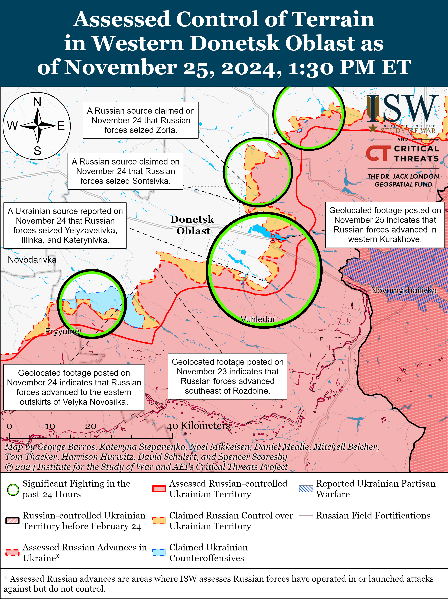
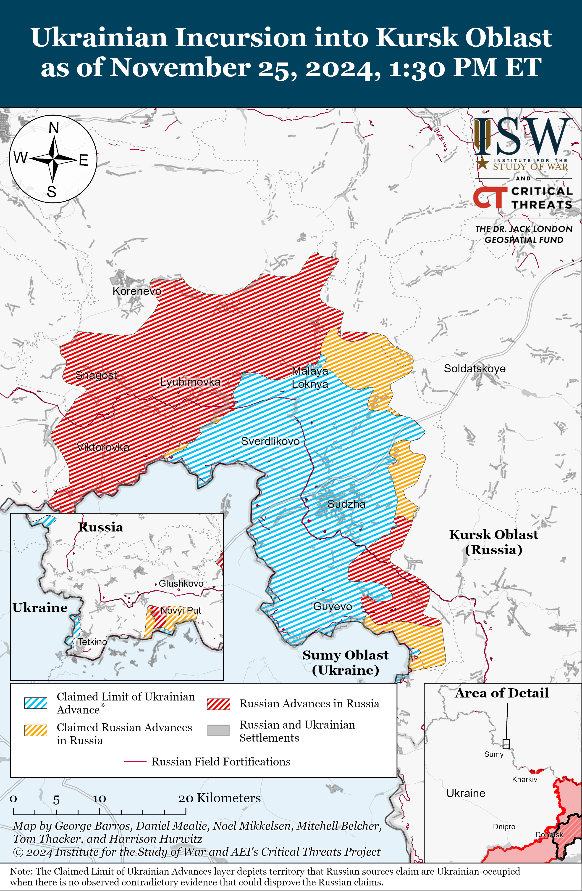
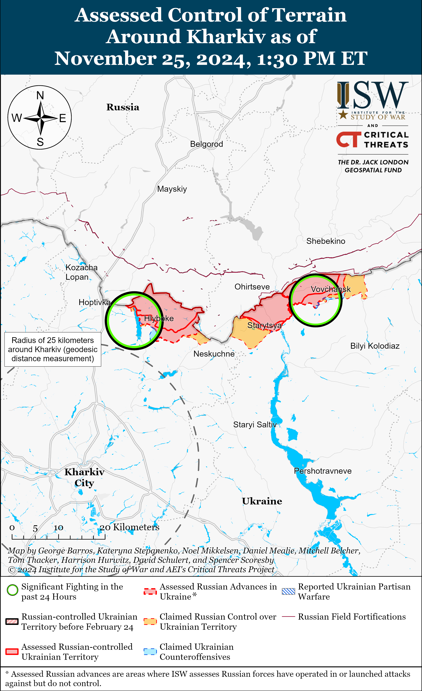
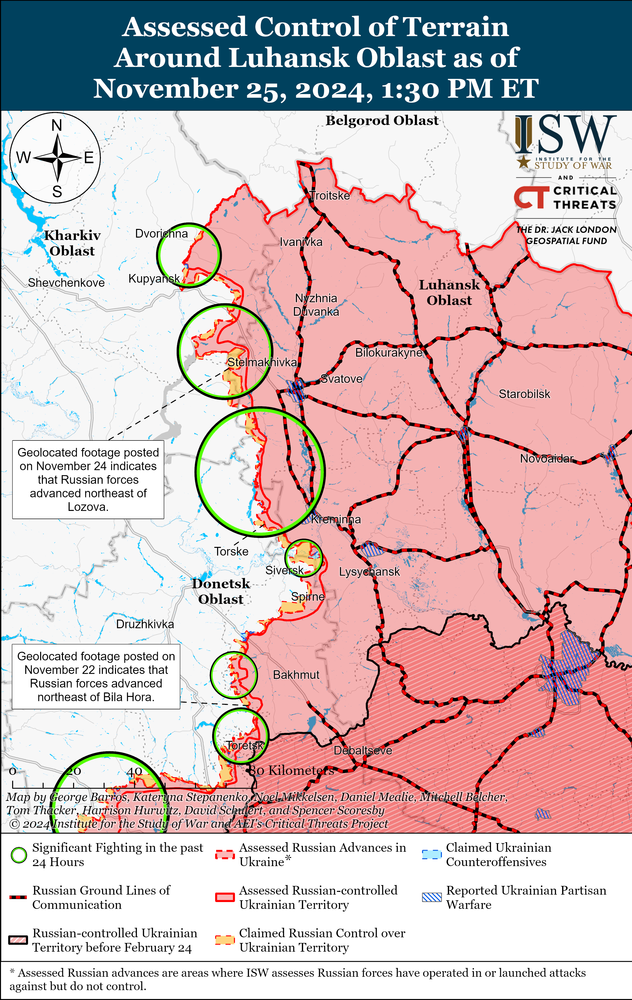
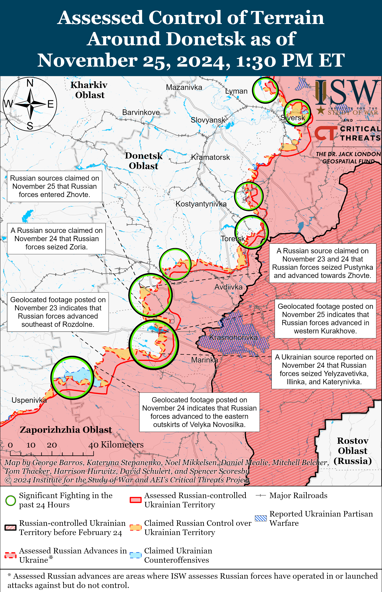
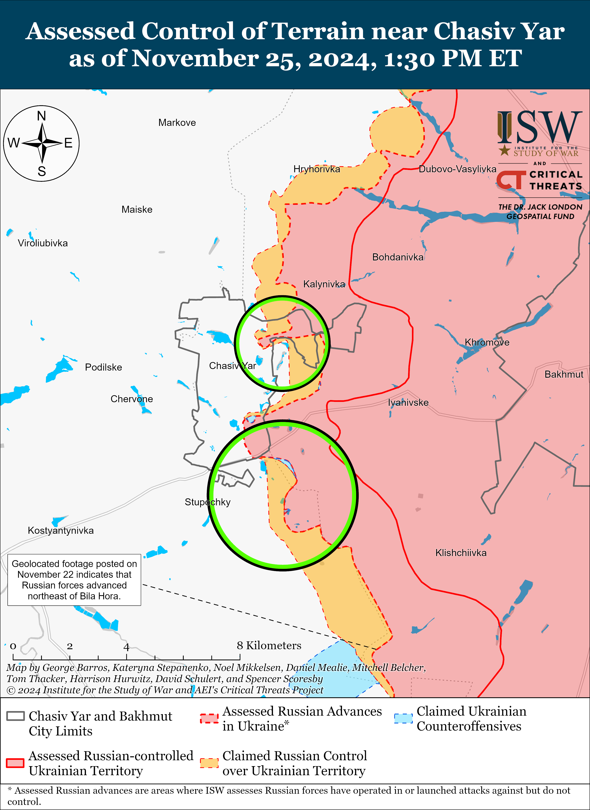
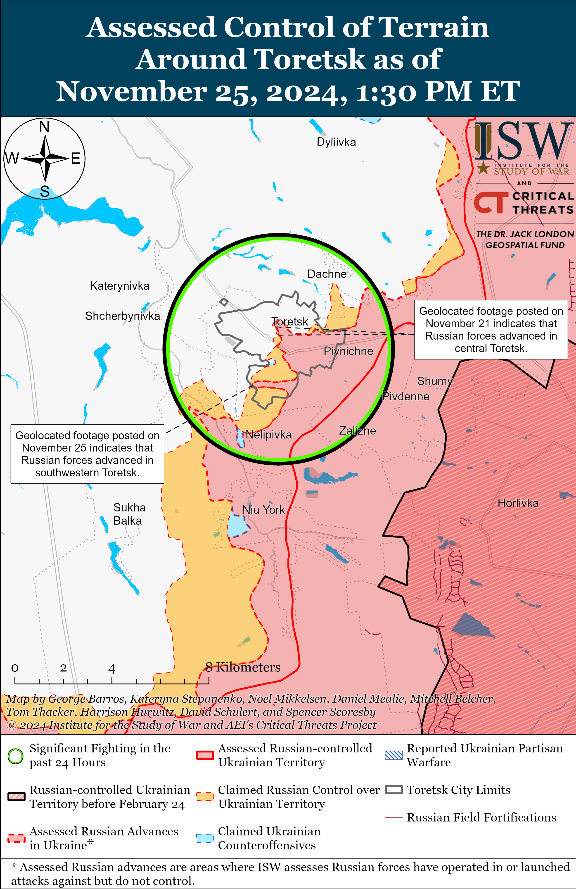
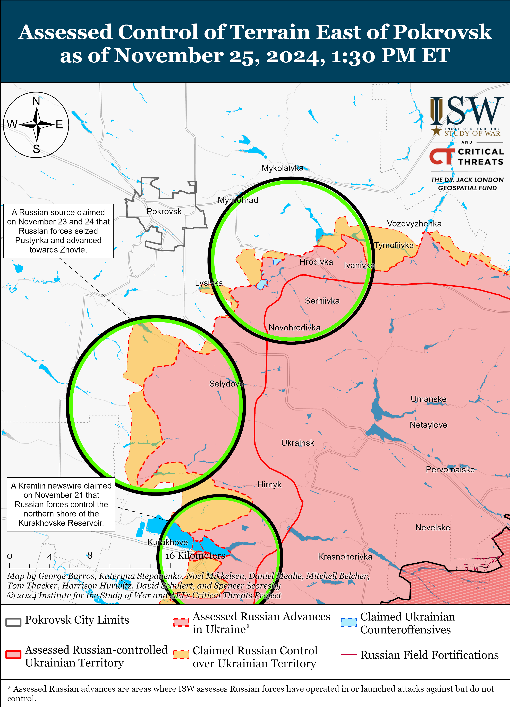
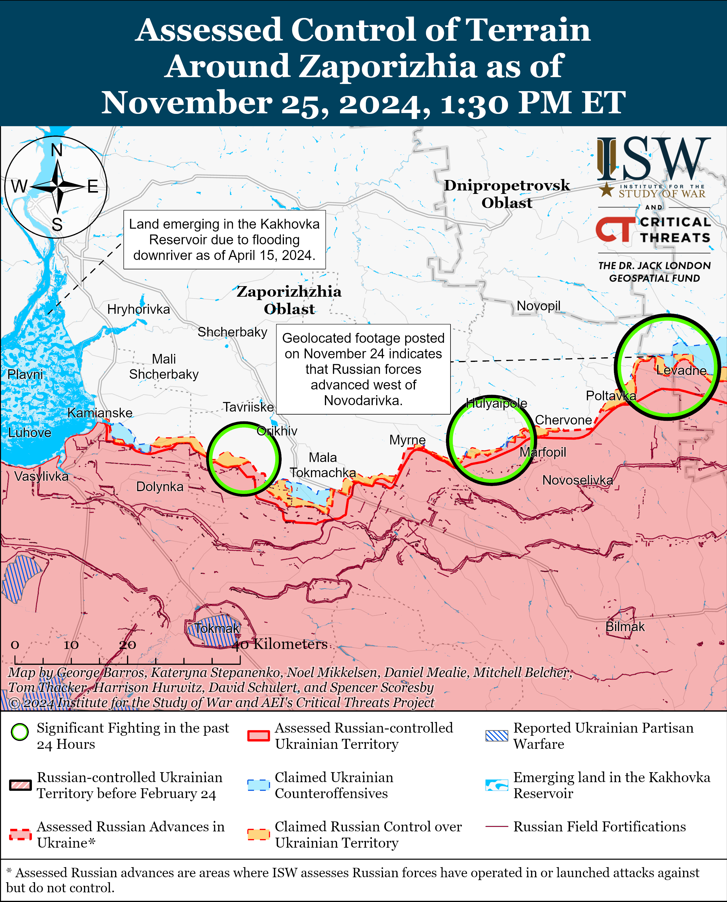
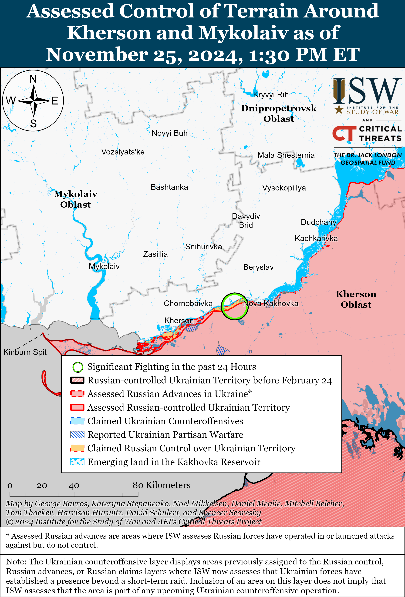

# Russian Offensive Campaign Assessment, November 25, 2024

**Karolina Hird, Davit Gasparyan, Angelica Evans, Olivia Gibson, Nate Trotter, and George Barros**

**November 25, 2024, 6:45pm ET**

**Click** [**here**](https://storymaps.arcgis.com/stories/36a7f6a6f5a9448496de641cf64bd375) **to see ISW’s interactive map of the Russian invasion of Ukraine. This map is updated daily alongside the static maps present in this report.**

**Click** [**here**](https://understandingwar.maps.arcgis.com/apps/instant/3dviewer/index.html?appid=1602762dbcde419bb957dea358449580) **to see ISW’s 3D control of terrain topographic map of Ukraine. Use of a computer (not a mobile device) is strongly recommended for using this data-heavy tool.**

**Click** [**here**](https://storymaps.arcgis.com/stories/733fe90805894bfc8562d90b106aa895) **to access ISW’s archive of interactive time-lapse maps of the Russian invasion of Ukraine. These maps complement the static control-of-terrain map that ISW produces daily by showing a dynamic frontline. ISW will update this time-lapse map archive monthly.**

**Note: The data cut-off for this product was 12:00pm ET on November 25. ISW will cover subsequent reports in the November 26 Russian Offensive Campaign Assessment.**

**Russian forces continue to make significant tactical advances in western Donetsk Oblast and are coming closer to enveloping Velyka Novosilka and advancing towards important Ukrainian ground lines of communication (GLOCs) supplying the rest of western Donetsk Oblast and running into eastern Dnipropetrovsk and Zaporizhia oblasts.** Geolocated footage published on November 24 shows elements of the Russian 5th Tank Brigade (36th CAA, Eastern Military District [EMD]) advancing to the eastern outskirts of Velyka Novosilka (just east of the Donetsk-Zaporizhia Oblast border area).[1] Several Russian milbloggers claimed that Russian forces also made additional advances northeast and southeast of Velyka Novosilka.[2] Russian EMD elements, including of the 2nd Battalion of the 37th Motorized Rifle Brigade (36th CAA, EMD) are reportedly advancing on the outskirts of Velyka Novosilka.[3]   
   
 Russian forces are also continuing efforts to eliminate the small pocket east of the O0510 Kurakhove-Velyka Novosilka road (southeast of Kurakhove and northeast of Vuhledar). Geolocated footage published on November 25 indicates that elements of the Russian 5th Motorized Rifle Brigade (51st Combined Arms Army [CAA], formerly 1st Donetsk People’s Republic Army Corps [DNR AC]) have advanced up to Pobiedy Street in central Kurakhove.[4] Several Russian milbloggers claimed on November 25 that Russian forces seized Romanivka (northeast of Vuhledar) and made additional gains in fields surrounding the settlement.[5] While ISW has not yet observed confirmation of Russian forces operating within Romanivka, geolocated footage published on November 24 shows two separate Russian platoon-sized mechanized assaults just east of Romanivka near Illinka and Antonivka, indicating that Russian forces advanced towards Romanivka during these assaults.[6] Elements of the 33rd Motorized Rifle Regiment (20th Motorized Rifle Division (8th CAA, Southern Military District [SMD]) reportedly conducted the mechanized assault near Antonivka.[7] Russian milbloggers noted that Russian forces in this area are focusing on forcing Ukrainian troops to withdraw westward towards Kostyantynopolske (northwest of Vuhledar).[8]

ISW previously assessed on November 24 that the Russian military command has several potential courses of action (COAs) in this sector of the front, and Russian gains on November 24 and 25 lend themselves to two of the outlined COAs — the Russian effort to push west along the H15 to the Andriivka-Kostyantynopil line from Kurakhove, and the Russian effort to bypass Velyka Novosilka and threaten Ukrainian GLOCs into eastern Zaporizhia Oblast.[9] Russian forces have already seized positions along the H15 road in eastern Kurakhove, and will likely use new positions along Pobiedy Street (which runs southward perpendicular to the H15 road) to further interdict and advance westward through Kurakhove and along the H15, towards Dachne and Andriivka (both west of Kurakhove). Recent Russian advances to Pobiedy Street in central Kurakhove place Russian forces about 15km east of Andriivka. Both Russian milbloggers and Ukrainian military observer Kostyantyn Mashovets identified Andriivka as the Russian operational-level objective west of Kurakhove because the seizure of Andriivka would afford Russian forces a stronger position from which to envelop a chain of settlements along the O0510 highway northwest and northeast of Vuhledar.[10] Russian forces may continue advancing west along the H15 towards Andriivka while attacking into the pocket northeast of Vuhledar along the Uspenivka-Hannivka-Romanivka line with the intent to compel Ukrainian forces to withdraw westward to avoid encirclement. Such a maneuver could enable Russian forces to seize tactical positions in the area and level the frontline from Sontsivka (northwest of Kurakhove) to Kostyantynopolske, placing Russian forces about 23km east of the Donetsk-Dnipropetrovsk Oblast border at its closest point.

**Recent Russian advances near Velyka Novosilka are consistent with ISW’s November 24 forecast that Russian forces could attempt to envelop Velyka Novosilka via its eastern and northeastern flanks**.[11] ISW has not yet observed confirmation that Russian forces have crossed the Kashlahach River directly east of Velyka Novosilka, which they would have to do in order to begin fighting within the urban areas of the settlement. Russian forces are more likely to advance north of Velyka Novosilka by pushing southwest from Rozdolne towards Novyi Komar and supplement these attacks with advances northward to the west of Velyka Novosilka via Rivnopil. Ukraine’s loss of Velyka Novosilka would be significant and potentially detrimental to Ukraine’s ability to sustain the defense of the nexus between Zaporizhia, Donetsk, and Dnipropetrovsk oblasts — Ukrainian Volunteer Army Spokesperson Serhiy Bratchuk noted on November 24 that Velyka Novosilka is an important logistics point for Ukrainian troops, the seizure of which would allow Russian forces to more actively threaten Hulyaipole and Orikhiv (both in Zaporizhia Oblast southwest of Velyka Novosilka).[12] The seizure of Velyka Novosilka would also afford Russian forces a stronger position from which to attack into southeasternmost Dnipropetrovsk Oblast.[13]

**Russian advances in western Donetsk Oblast may become operationally significant if the Russian command properly exploits these recent tactical successes, which is not a given. Russian advances in western Donetsk Oblast do not automatically portend the collapse of the Ukrainian frontline.** Recent Russian mechanized assaults with elements of the SMD northeast of Vuhledar appear to cohere with EMD mechanized assaults near Velyka Novosilka, further supporting ISW’s assessment that elements of the EMD and SMD are currently conducting mutually supportive offensive operations in this sector of western Donetsk Oblast.[14] Russian forces’ ability to further advance towards the Zaporizhia and Dnipropetrovsk oblast borders will in large part be contingent on whether Russian EMD and SMD command elements continue to successfully coordinate combat operations on their respective sectors of the front. Furthermore, even if Russian forces are able to achieve all the operational COAs outlined above, Russian forces would need to seize over 8,000 square kilometers of territory to achieve Moscow’s self-defined objective of seizing the entirety of Donetsk Oblast.[15] Potential Russian advances into southeastern Dnipropetrovsk Oblast, given historical data about Russian offensive performance, are unlikely to be immediately rapid or threaten major Ukrainian military objects or large cities in the winter 2024-2025 campaign season. The Ukrainian theater is large and Russian tactical gains in western Donetsk Oblast should not cause undue panic in the short-term. Russian gains remain tactical and Russian forces have not restored operational maneuver to the battlefield yet. The current Russian advances may fall short of their operational objectives, as did initial Russian frontal assaults against Chasiv Yar and Pokrovsk earlier in 2024**.**

**Ukrainian forces struck a Russian oil depot in Kaluga Oblast and an airbase in Kursk Oblast on the night of November 24 to 25.** The Ukrainian General Staff reported on November 25 that units of Ukraine’s Main Military Intelligence Directorate (GUR) and the Ukrainian Armed Forces struck several important Russian assets in Bryansk, Kursk, and Kaluga oblasts on the night of November 24 to 25, including an oil depot in Kaluga Oblast.[16] Geolocated footage published on November 24 and 25 shows an explosion at the oil depot near Kaluga City and a subsequent fire in the area.[17] Kaluga Oblast officials reported that Russian forces downed several drones in the area and that debris from a drone caused a fire near an unspecified industrial enterprise near Kaluga City.[18] Geolocated footage and imagery published on November 25 indicate that Ukrainian forces also struck the Khalino Airfield and fields near Kursk City with several ATACMS missiles and drones.[19] Russian opposition outlet *Astra* reported that Ukrainian forces launched at least seven ATACMS missiles and 12 drones at the airfield, and Russian milbloggers acknowledged the strike but claimed that Ukrainian forces did not significantly damage the airfield.[20] A Russian insider source posted a photo claiming to show that a Ukrainian ATACMS strike recently destroyed the radar system of a Russian S-400 air defense system near Bolshoe Zhirovo (northwest of Kursk City), Kursk Oblast following Ukrainian reporting about the S-400 strike on November 24.[21]

**Ukrainian military officials continue to warn of potential Russian ground operations against Zaporizhzhia City, though the timeline and scale of this offensive operation remain unclear due to the operational constraints imposed by ongoing Russian operations in Kursk and Donetsk oblasts.** *The Economist*, citing Ukrainian intelligence sources, reported on November 24 that Russian forces are preparing for a future offensive operation with up to 130,000 personnel on Zaporizhzhia City, which is 30 kilometers from the current frontline, although the date of this forecasted operation is unknown.[22] A Ukrainian brigade commander stated that the Ukrainian incursion into Kursk Oblast halted initial Russian plans for an assault on Zaporizhzhia City and that the Russian military command redeployed nearly half of the 20,000-30,000 Russian troops initially slated for the offensive in Zaporizhia Oblast to Kursk Oblast. The battalion commander noted that continued Russian effort in Kursk may delay an offensive on Zaporizhzhia City, but that Russian forces may also conduct the attack with a smaller force grouping than originally intended.

Sources within Ukraine’s military command previously stated that the Ukrainian incursion into Kursk Oblast prevented Russian forces from launching a major offensive operation in Zaporizhia Oblast in recent months- consistent with the Ukrainian battalion commander’s statements.[23] ISW previously observed reports that the Russian military command redeployed forces from western Zaporizhia Oblast to respond to the Kursk incursion in August 2024.[24]Ukrainian Tavriisk Group of Forces Spokesperson Colonel Vladyslav Voloshyn warned on November 11 that Russian forces are moving trained assault groups to forward positions in occupied Zaporizhia Oblast but that it is unclear if the Russian military intends to conduct a unified offensive operation or separate localized assaults.[25] Voloshyn later noted on November 24 that Russian forces have not transferred large groups of forces to the Zaporizhzhia direction but rather are moving small units of assault personnel or drone operators from Donetsk Oblast in order to intensify Russian assaults in the south.[26] Voloshyn previously stated that Russian forces are concentrating near Kamyanske (northwest of Robotyne and south of Zaporizhzhia City), Hulyaipole (northeast of Robotyne), and Robotyne itself, and are preparing to conduct intensified assaults in these areas.[27] ISW also observed intensifications of Russian activity near Kamyanske in early October 2024.[28]

Ukrainian Volunteer Army Spokesperson Serhiy Bratchuk downplayed reports on November 24 of a possible Russian ground offensive on Zaporizhzhia City, however, noting instead the persistent threat of Russian airstrikes along the southern frontline is aimed at spreading fear among Ukrainian civilians.[29] Bratchuk addressed concerns of Russian preparations in this area by disclosing that Ukrainian forces have observed Russian units being transferred away from the Zaporizhzhia direction to the Kurakhove-Pokrovsk line in Donetsk Oblast for ongoing offensive operations. ISW is unable to independently confirm the large-scale redeployment of Russian troops at this time.

**North Korea is reportedly expanding a key weapons facility likely used to supply Russia with ballistic missiles.** *Reuters*, citing satellite imagery findings from a US-based think tank, reported on November 25 that North Korea is expanding its only weapons facility that assembles KN-23 short-range ballistic missiles, which Russia uses in Ukraine.[30] *CNN* reported on November 23 that about 60 of the total 194 ballistic missiles that Russia launched against Ukraine so far in 2024 were North Korean-supplied KN-23s.[31] ISW continues to observe increased North Korean support for Russia’s war effort through the deployment of North Korean troops to the theater of war and the provision of ammunition and weapons.[32]

**The Kremlin signaled that it would remove the Taliban from its list of prohibited organizations amid intensified Russia-Taliban rapprochement.** Afghan and Russian news outlets reported on November 25 that Russian Security Council Secretary General Sergei Shoigu stated that the Kremlin will soon remove the Taliban from its list of “terrorist organizations” during a meeting with the Deputy Prime Minister of the Islamic Emirate of Afghanistan and a Taliban delegation.[33] ISW previously observed that the Kremlin has maintained direct contact with the Taliban since the Taliban took power in Afghanistan in 2021, although more explicit Russian recognition of the Taliban as the legitimate Afghan government will likely enhance Russia-Taliban cooperation.[34] Russia has recently intensified outreach to the Taliban, in large part to leverage the Taliban’s control of the Afghan government to degrade the Taliban’s regional adversary, the Afghanistan-based Islamic State-Khorasan Province (ISKP).[35]

**Key Takeaways:**

- **Russian forces continue to make significant tactical advances in western Donetsk Oblast and are coming closer to enveloping Velyka Novosilka and advancing towards important Ukrainian ground lines of communication (GLOCs) supplying the rest of western Donetsk Oblast and running into eastern Dnipropetrovsk and Zaporizhia oblasts.**
- **Russian advances in western Donetsk Oblast may become operationally significant if the Russian command properly exploits these recent tactical successes, which is not a given. Russian advances in western Donetsk Oblast do not automatically portend the collapse of the Ukrainian frontline.**
- **Ukrainian forces struck a Russian oil depot in Kaluga Oblast and an airbase in Kursk Oblast on the night of November 24 to 25.**
- **Ukrainian military officials continue to warn of potential Russian ground operations against Zaporizhzhia City, though the timeline and scale of this offensive operation remain unclear due to the operational constraints imposed by ongoing Russian operations in Kursk and Donetsk oblasts.**
- **North Korea is reportedly expanding a key weapons facility likely used to supply Russia with ballistic missiles.**
- **The Kremlin signaled that it would remove the Taliban from its list of prohibited organizations amid intensified Russia-Taliban rapprochement.**
- **Russian forces recently advanced in southwestern Toretsk and south and southeast of Pokrovsk.**
- **Russian command posts are reportedly relying on Chinese-made radios for internal communications because Russia cannot domestically produce enough quality radios for the Russian military.**

***We do not report in detail on Russian war crimes because these activities are well-covered in Western media and do not directly affect the military operations we are assessing and forecasting. We will continue to evaluate and report on the effects of these criminal activities on the Ukrainian military and the Ukrainian population and specifically on combat in Ukrainian urban areas. We utterly condemn Russian violations of the laws of armed conflict and the Geneva Conventions and crimes against humanity even though we do not describe them in these reports.***

- Ukrainian Operations in the Russian Federation
- Russian Main Effort – Eastern Ukraine (comprised of three subordinate main efforts)
- Russian Subordinate Main Effort #1 – Push Ukrainian forces back from the international border with Belgorod Oblast and approach to within tube artillery range of Kharkiv City
- Russian Subordinate Main Effort #2 – Capture the remainder of Luhansk Oblast and push westward into eastern Kharkiv Oblast and encircle northern Donetsk Oblast
- Russian Subordinate Main Effort #3 – Capture the entirety of Donetsk Oblast
- Russian Supporting Effort – Southern Axis
- Russian Air, Missile, and Drone Campaign
- Russian Mobilization and Force Generation Efforts
- Russian Technological Adaptations
- Activities in Russian-occupied areas
- Significant Activity in Belarus

**Ukrainian Operations in the Russian Federation**

**Russian Main Effort – Eastern Ukraine**

Russian sources claimed that Russian forces advanced within the Kursk Oblast salient on November 25, but ISW has not observed confirmation of any claimed Russian advances in the area. Russian milbloggers claimed that Russian forces operating southeast of Korenevo are continuing to clear Ukrainian forces from Darino and are advancing near Tolsty Lug, in Novoivanovka, south of Zeleny Shlyakh, and in the direction of Nizhny Klin.[36] A Russian milblogger claimed that Russian forces also advanced near Cherkasskoye Porechnoye (northeast of Sudzha) and Plekhovo (southeast of Sudzha).[37] ISW has not yet observed concrete evidence of Russian advances in any of these areas, however. Russian milbloggers claimed that Ukrainian forces unsuccessfully counterattacked from Leonidovo towards Novoivanovka (both southeast of Korenevo) and near Novaya Sorochina and west of Pogrebki (both northwest of Sudzha).[38] Elements of the 2nd Battalion of the 51st Airborne (VDV) Regiment (106th VDV Division) are reportedly advancing near Darino, while elements of the 155th and 810th naval infantry brigades (Pacific Fleet and Black Sea Fleet, respectively) are operating throughout Kursk Oblast.[39]

Ukrainian military sources posted footage on November 22 of a Ukrainian strike on a temporarily repaired Russian crossing over the Seym River near Karizh (in Glushkovsky Raion, west of the main Kursk Oblast salient).[40] Ukrainian sources reported that Ukrainian forces used an American-provided GDU-39 Small Diameter Bomb to conduct the strike, which also hit a Russian military vehicle as it was crossing the bridge.

**Russian Subordinate Main Effort #1 – Kharkiv Oblast (Russian objective: Push Ukrainian forces back from the international border with Belgorod Oblast and approach to within tube artillery range of Kharkiv City)**

Russian forces slightly intensified cross-border assaults northwest of Kharkiv City amid continued offensive operations northeast of Kharkiv City on November 24 and 25 but did not make any confirmed advances. The Ukrainian General Staff reported that Russian forces conducted offensive operations near the international border northwest of Kharkiv City near Kozacha Lopan and Kudiivka and northeast of Kharkiv City near Vovchansk and Tykhe on November 24 and 25.[41] Russian cross-border raids likely aim to fix Ukrainian forces along the international border in northern Kharkiv Oblast and force Ukraine to redeploy forces from Kursk Oblast, where Russian forces are currently conducting intensified offensive operations to regain lost positions.

**Russian Subordinate Main Effort #2 – Luhansk Oblast (Russian objective: Capture the remainder of Luhansk Oblast and push westward into eastern Kharkiv Oblast and northern Donetsk Oblast)**

Russian forces reportedly crossed the Oskil River north of Kupyansk amid continued offensive operations in the Kupyansk direction on November 24 and 25, but ISW has not yet observed confirmation of these claimed Russian advances. Russian milbloggers claimed that Russian forces crossed to the west (right) bank of the Oskil River in boats and captured a foothold on the right bank south of Novomlynsk (north of Kupyansk).[42] The Ukrainian General Staff reported that Russian forces conducted offensive operations near Senkove (south of Kupyansk on the west bank of the Oskil River), suggesting that Russian forces may have intensified efforts to cross the Oskil River south of Kupyansk near the Kruhlyakivka-Kolisnykivka salient.[43] ISW has not observed any confirmed Russian advances across the Oksil River either south of Novomlynsk or near Senkove, however. A Russian milblogger claimed that Russian forces are attacking near the feed mill, sugar factory, and milk canning factory in eastern Kupyansk.[44] A Ukrainian battalion commander operating in the Kupyansk direction reported that Ukrainian forces are inflicting a casualty rate of 1-to-5 on Russian forces in this direction and that Russian forces are trying to capture a foothold on the right bank of the Oskil River in this direction.[45] The Ukrainian battalion commander stated that Ukrainian drone operations are preventing Russian forces from conducting mechanized assaults within 12 kilometers of the frontline and that Russian infantry are mainly advancing on foot in the Kupyansk direction. Russian forces continued ground attacks north of Kupyansk near Novomlynsk and Holubivka; southeast of Kupyansk near Pishchane, Lozova, Zahryzove, Novoosynove, Kolisnykivka, and Kruhlyakivka; and south of Kupyansk near Senkove.[46]

Russian forces continued offensive operations along the Svatove-Kreminna line on November 24 and 25 but did not make any confirmed advances. A prominent Kremlin-affiliated milblogger claimed that Russian forces advanced into the fields east of Terny and Yampolivka (both west of Kreminna).[47] ISW has not observed confirmation of this claim, however. The milblogger also claimed that Ukrainian artillery and drones are preventing Russian mechanized assaults in the Lyman (west of Kreminna) direction and inhibiting Russian forces from advancing further towards Yampolivka. Russian forces continued ground attacks west of Svatove near Pershotravneve, Vyshneve and Zelenyi Hai; southwest of Svatove near Novoyehorivka, Druzhelyubivka, and Hrekivka; west of Kreminna near Yampolivka, Terny, Ivanivka, and Torske; and south of Kreminna near Serebryanka.[48] Elements of the Russian 1st Guards Tank Army (GTA) (Moscow Military District [MMD]) continue to operate near Kopanky (west of Svatove).[49] Elements of the Russian 144th Motorized Rifle Division (20th Combined Arms Army [CAA], MMD) are reportedly operating near the southeastern outskirts of Terny.[50] Drone operators of the Russian “Okhotnik” (Hunter) drone detachment (164th Motorized Rifle Brigade, 25th CAA, Central Military District [CMD]) are reportedly operating in the Kreminna forest area.[51]

**Russian Subordinate Main Effort #3 – Donetsk Oblast (Russian objective: Capture the entirety of Donetsk Oblast, the claimed territory of Russia’s proxies in Donbas)**

Neither Russian nor Ukrainian sources reported fighting in the Siversk direction on November 24 and 25.

Russian forces continued offensive operations in the Chasiv Yar direction on November 24 and 25 but did not make confirmed advances. Russian sources claimed that elements of the 98th Airborne (VDV) Brigade are fighting in Chasiv Yar’s industrial area but that it is unclear if they secured some unspecified positions at the factory.[52] A Russian milblogger claimed that Russian forces advanced near a stadium in Chasiv Yar, are occasionally entering the industrial area, and seized a quarry near Stupochky (south of Chasiv Yar).[53] ISW has not observed visual evidence confirming these maximalist claims. The Ukrainian General Staff reported that Russian forces conducted offensive operations both in and on the flanks of Chasiv Yar and near Stupochky on November 24 and 25.[54] Ukrainian Luhansk Group of Forces Spokesperson Major Anastasiya Bobovnikova described the situation in Chasiv Yar as particularly “dangerous” because a significant number of Russian troops have begun amassing in the Kramatorsk (Chasiv Yar) and Siversk directions and are employing a variety of new tactics in an effort to break through Ukrainian defenses in the area.[55] A Ukrainian brigade operating in the Chasiv Yar direction assessed that Russian forces in the Chasiv Yar direction may be facing weapon shortages as they recently began using naval systems in combat, such as the RBU-6000 Smerch anti-submarine rocket launcher.[56] Drone operators of the “Okhotnik” (Hunter) Spetsnaz Detachment (51st Combined Arms Army [CAA], formerly 1st Donetsk People’s Republic’s [DNR] 1st Army Corps [AC]) are reportedly operating near Chasiv Yar.[57]

Russian forces recently advanced in southwestern Toretsk amid ongoing Russian offensive operations on November 24 and 25. Geolocated footage posted on November 25 indicates that Russian forces recently marginally advanced westward along Ryzkyi Street and Sormovska Street in southwestern Toretsk.[58] The Ukrainian General Staff reported on November 24 and 25 that Russian forces conducted offensive operations near Toretsk; northeast of Toretsk near Dachne and Dyliivka; and west of Toretsk near Shchernynivka.[59] Bobovnikova reported that Russian forces are actively launching assaults and are “attacking with incredible speed” in the Toretsk direction.[60] Elements of the Russian 132nd Motorized Rifle Brigade (51st CAA) are reportedly operating in Toretsk.[61]

Russian sources claimed that Russian forces marginally advanced south and southeast of Pokrovsk amid continued Russian offensive operations in this area on November 25. Russian sources claimed that Russian forces advanced east and northeast of Pushkine (south of Pokrovsk), east of and in central Zhovte (northeast of Pushkine), southwest of Yurivka (east of Pushkine), and west of Pustynka (northeast of Pushkine).[62] ISW cannot independently verify these claims, however. A Ukrainian battalion reported on November 24 that it launched a successful mechanized counterattack near Mykolaivka (east of Pokrovsk).[63] A Ukrainian servicemember stated on November 24 that Russian forces are redeploying a significant number of troops from Novooleksiivka (south of Pokrovsk and southwest of Selydove) to break through towards the T0515 Shevchenko-Novotroitske-Yasenove highway (southwest of Pokrovsk) with tank support.[64] The Ukrainian servicemember added that Russian forces recently reached the outskirts of Pushkine. Ukrainian Khortytsia Group of Forces Spokesperson Lieutenant Colonel Nazar Voloshyn reported that Ukrainian minefields have destroyed 30 percent of Russian military equipment during recent assaults in the Pokrovsk direction.[65] Russian forces reportedly conducted offensive operations east of Pokrovsk near Myrolyubivka, Mykolaivka, and Promin; southeast of Pokrovsk near Lysivka; and south of Pokrovsk near Hryhorivka**,** Petrivka, Dachenske, Pustynka, Pushkyne, Zhovte, and Chumatske.[66]

*See topline text for reporting on Russian activity in the Kurakhove and Vuhledar directions and the Donetsk-Zaporizhia Oblast border area.*

**Russian Supporting Effort – Southern Axis (Russian objective: Maintain frontline positions and secure rear areas against Ukrainian strikes)**

Russian forces continued assaults in western Zaporizhia Oblast near Novoandriivka (northwest of Robotyne) on November 25 but did not make confirmed advances.[67] Russian milbloggers reiterated claims that Russian forces advanced towards Orikhiv (north of Robotyne) and into Bilohirya (northeast of Robotyne), but ISW has still not observed confirmation of these claims.[68] Elements of the Russian 503rd Motorized Rifle Regiment (19th Motorized Rifle Division, 58th Combined Arms Army [CAA], Southern Military District [SMD]) are reportedly operating in the Zaporizhia direction.[69]

Russian forces continued assaults in the Dnipro direction in east (left) bank Kherson Oblast on November 24 and 25, but there were no confirmed changes to the frontline.[70] Ukrainian Volunteer Army Spokesperson Serhiy Bratchuk reported that Russian forces’ main task in the Kherson direction is to seize the islands in the Dnipro River Delta and that Russian forces recently conducted a large attack on Kozatskyi Island (northeast of Kherson City near Nova Kakhovka).[71] Bratchuk noted that Ukrainian forces have “fire control” over the delta islands from positions on the west (right) bank of the Dnipro River and forecasted that Russian forces will try to establish a limited position on the right bank in the future. Bratchuk noted that Russian forces are struggling to advance across the Dnipro River in part because the Russian military command has redeployed units and reserves from the Kherson direction to the Kurakhove and Pokrovsk directions in Donetsk Oblast. Ukraine’s Tavriisk Group of Forces Spokesperson Colonel Vladyslav Voloshyn stated that the Russian military command is concentrating elements of Russia’s Northern Fleet near the Tendrivska Spit in Kherson Oblast and the Kinburn Spits in Mykolaiv Oblast to defend against Ukrainian raids and attacks in the area.[72] Both spits jut into the northwestern corner of the Black Sea.

**Russian Air, Missile, and Drone Campaign (Russian Objective: Target Ukrainian military and civilian infrastructure in the rear and on the frontline)**

Russian forces conducted a large series of drone strikes against Ukraine on the night of November 24 to 25. The Ukrainian Air Force reported that Russian forces launched 145 Shahed drones and other unspecified drones, possibly referring to decoy drones, from Oryol, Kursk, and Rostov oblasts and Primorsko-Akhtarsk, Krasnodar Krai after 1830 local time on the night of November 24, and that Ukrainian forces downed 71 drones over Kyiv, Cherkasy, Kirovohrad, Chernihiv, Sumy, Kharkiv, Poltava, Zhytomyr, Zaporizhia, Donetsk, Dnipropetrovsk, Odesa, Mykolaiv, and Kherson oblasts as of 1100 local time on November 25.[73] The Ukrainian General Staff reported that 71 Russian drones became “lost,” likely due to Ukrainian electronic warfare (EW) interference, and that another drone flew into Belarusian air space. Ukrainian officials reported that Russian missiles and drones struck Kharkiv, Kyiv, and Odesa cities, damaging residential areas and injuring civilians.[74] The Ukrainian Air Force warned on November 25 that Russian forces increasingly using Shahed drones during the day, after previously mainly relying on these drones at night.[75] Russian milbloggers claimed that a Russian Iskander-M ballistic missile destroyed an F-16 fighter jet at an airfield in Dnipropetrovsk Oblast, but ISW has not observed independent confirmation of this claim.[76]

Independent Belarusian monitoring group Hajun Project reported on November 25 that 38 Russian Shahed drones entered Belarusian airspace on November 24 and 25 – a record number of Russian drones violating Belarusian airspace.[77] The Hajun Project reported that at least one Russian drone flew to Mozyr, several briefly crossed into Belarusian airspace on their way to Ukraine, and at least three drones flew into Gomel Oblast. The Hajun Project reported that Belarusian forces downed at least one drone and sortied aircraft four times in response to the airspace violation.

Russian milbloggers, citing satellite imagery, acknowledged on November 24 and 25 that Russia’s November 21 Oreshnik ballistic missile strike did not significantly damage the Pivdenmash factory in Dnipro City, Dnipropetrovsk Oblast.[78] The Kremlin has attempted to oversell the impact of the Oreshnik missile on Russia’s strike capabilities in recent days.[79]

**Russian Mobilization and Force Generation Efforts (Russian objective: Expand combat power without conducting general mobilization)**

Russian authorities continue to incentivize service in Ukraine through one-time payment offers in a likely effort to avoid conducting another partial involuntary reserve callup in Russia. Russian President Vladimir Putin signed a decree extending one-time payments amounting to 400,00 rubles (about $3,846) to Rosgvardia personnel if they sign service contracts with the Russian Ministry of Defense (MoD) to serve in Ukraine.[80]

A Russian milblogger claimed on November 25 that Russian command posts are relying on Chinese-made radios for internal communications, as Russia cannot domestically produce enough quality radios for the Russian military.[81] The milblogger claimed that Russian forces heavily relied on cellular and internet communications at the onset of the war in Ukraine and failed to develop a unified and secure communication system. The milblogger highlighted that many Russian personnel either lacked domestically produced “Azart” radios or did not know how to use them. The milblogger claimed that frontline communications have relied almost entirely on Chinese radios for an unspecified time and their Russian analogs, although Ukrainian forces frequently intercept and monitor these devices. The milblogger noted that Russian domestic radios are less common and underproduced, partly due to sanctions and quality control issues.

**Russian Technological Adaptations (Russian objective: Introduce technological innovations to optimize systems for use in Ukraine)**

*Nothing significant to report.*

**Activities in Russian-occupied areas (Russian objective: Consolidate administrative control of annexed areas; forcibly integrate Ukrainian citizens into Russian sociocultural, economic, military, and governance systems)**

*ISW is not publishing coverage of activities in Russian-occupied areas today.*

**Significant activity in Belarus (Russian efforts to increase its military presence in Belarus and further integrate Belarus into Russian-favorable frameworks and Wagner Group activity in Belarus)**

Belarusian military sources emphasized Belarus’ modernization efforts. Belarusian Defense Minister Lieutenant General Viktor Khrenin stated on November 25 that the Belarusian military accepted over 60 new models of weapons and equipment into service so far in 2024.[82] Khrenin also reported that the Belarusian military is focusing on developing tactical techniques based on modern wars, including Russia’s war in Ukraine. The Belarusian Ministry of Defense (MoD) stated that the Belarusian Armed Forces are currently developing updated command and control (C2) systems, intelligence procedures, electronic warfare (EW), air defense, and anti-drone technologies.[83]

**Note: ISW does not receive any classified material from any source, uses only publicly available information, and draws extensively on Russian, Ukrainian, and Western reporting and social media as well as commercially available satellite imagery and other geospatial data as the basis for these reports. References to all sources used are provided in the endnotes of each update.**

[1] https://x.com/vosintt/status/1861053758857208132; https://x.com/vosintt/status/1861053762338513242; https://x.com/vosintt/status/1861053765677203840; https://x.com/vosintt/status/1861053768827064786; https://x.com/vosintt/status/1861053772371312685

[2] https://t.me/boris\_rozhin/145456; https://t.me/RVvoenkor/81319; https://t.me/z\_arhiv/29769

[3] https://t.me/voin\_dv/11981; https://t.me/voin\_dv/11982

[4] https://x.com/SibirPrizrak/status/1860991522864271872; https://t.me/Sladkov\_plus/11887; https://t.me/creamy\_caprice/7625; https://t.me/voenkorKotenok/60295

[5] https://t.me/z\_arhiv/29772; https://t.me/boris\_rozhin/145569; https://t.me/voenkorKotenok/60283

[6] https://t.me/creamy\_caprice/7620; https://t.me/dva\_majors/58513; https://t.me/creamy\_caprice/7622; https://t.me/osirskiy/943

[7] https://t.me/creamy\_caprice/7620; https://t.me/dva\_majors/58513

[8] https://t.me/motopatriot/29808; https://t.me/voenkorKotenok/60283

[9] https://understandingwar.org/backgrounder/russian-offensive-campaign-assessment-november-24-2024

[10] https://t.me/zvizdecmanhustu/2369; https://understandingwar.org/backgrounder/russian-offensive-campaign-assessment-october-29-2024; https://understandingwar.org/backgrounder/russian-offensive-campaign-assessment-november-24-2024

[11] https://understandingwar.org/backgrounder/russian-offensive-campaign-assessment-november-24-2024

[12] https://armyinform.com dot ua/2024/11/24/okupanty-pogrozhuyut-nastupom-na-pivdni-a-sami-perekydayut-vijska-na-inshi-napryamky/

[13] https://understandingwar.org/backgrounder/russian-offensive-campaign-assessment-november-24-2024

[14] https://understandingwar.org/backgrounder/russian-offensive-campaign-assessment-november-24-2024

[15] https://understandingwar.org/backgrounder/ukrainian-defense-pokrovsk-has-compelled-russia-change-its-approach-eastern-ukraine

[16] https://www.facebook.com/GeneralStaff.ua/posts/pfbid02Q5j67ZarS1SGvH1CBKdQnfVAGvDu6GbaBXVpGNQszCuiRiUWen9o9skWnneQZoqrl

[17] https://x.com/Grimm\_Intel/status/1860826213184401920; https://x.com/Grimm\_Intel/status/1860829494140895725; https://t.me/exilenova\_plus/3632 ; https://x.com/jurgen\_nauditt/status/1860919316171956648; https://x.com/99Dominik\_/status/1860956458478641535

[18] https://t.me/tass\_agency/287101 ; https://t.me/tass\_agency/287124 ; https://t.me/tass\_agency/287125 ; https://t.me/tass\_agency/287126

[19] https://x.com/cyber\_boroshno/status/1860988345913848168 ; https://x.com/cyber\_boroshno/status/1861042224860889488; https://x.com/99Dominik\_/status/1861050184165163107

[20] https://t.me/astrapress/69181 ; https://t.me/warhistoryalconafter/195942 ; https://t.me/dva\_majors/58575 ; https://t.me/dva\_majors/58581 ; https://t.me/boris\_rozhin/145576 ; https://t.me/Aviahub34/4536 ; https://t.me/dva\_majors/58582 ; https://t.me/fighter\_bomber/18903

[21] https://t.me/vchkogpu/52761 ; https://understandingwar.org/backgrounder/russian-offensive-campaign-assessment-november-24-2024

[22] https://www.economist.com/europe/2024/11/24/ukraines-warriors-brace-for-a-kremlin-surge-in-the-south

[23] https://understandingwar.org/backgrounder/russian-offensive-campaign-assessment-november-22-2024

[24] https://understandingwar.org/backgrounder/russian-offensive-campaign-assessment-august-22-2024

[25] https://www.reuters.com/world/europe/russian-troops-trying-advance-kursk-region-ukraine-says-2024-11-11/

[26] https://armyinform dot com.ua/2024/11/24/rosiyany-boyatsya-shho-zsu-forsuvatymut-dnipro-vystavyly-svij-syevyernyj-flot/

[27] https://isw.pub/UkrWar111224

[28] https://isw.pub/UkrWar100624 ; https://isw.pub/UkrWar100724 ; https://isw.pub/UkrWar100924

[29] https://armyinform.com dot ua/2024/11/24/okupanty-pogrozhuyut-nastupom-na-pivdni-a-sami-perekydayut-vijska-na-inshi-napryamky/

[30] https://www.reuters.com/world/asia-pacific/satellite-images-suggest-north-korea-expanding-missile-plant-researchers-say-2024-11-25/

[31] https://edition.cnn.com/2024/11/23/europe/ukraine-north-korean-missile-attacks-western-components-intl?cid=ios\_app&fbclid=IwY2xjawGvMf9leHRuA2FlbQIxMAABHZQpwdt\_ivFbBjztICLOurGoyfHy8RcDGKuMqlfjYw9-oo8opuTJSEWhuA\_aem\_yOzQjlpO3q\_gbNoL\_BYQ1w

[32] https://understandingwar.org/backgrounder/north-korea-joins-russias-war-against-ukraine-operational-and-strategic-implications

[33] https://t.me/boris\_rozhin/145582; https://ria dot ru/20241125/taliban-1985630592.html

[34] https://understandingwar.org/backgrounder/russian-offensive-campaign-assessment-may-27-2024

[35] https://understandingwar.org/backgrounder/russian-offensive-campaign-assessment-may-28-2024

[36] https://t.me/rybar/65667; https://t.me/dva\_majors/58532; https://t.me/DnevnikDesantnika/19839; https://t.me/rusich\_army/18756

[37] https://t.me/voenkorKotenok/60279

[38] https://t.me/dva\_majors/58532; https://t.me/DnevnikDesantnika/19839

[39] https://t.me/rybar/65667 (Darino); https://t.me/boris\_rozhin/145516; https://t.me/sashakots/504

[40] https://armyinform.com dot ua/2024/11/24/sezon-vertykalnoyi-navigacziyi-na-kurshhyni-rozbombyly-chergovu-rosijsku-perepravu/; https://t.me/soniah\_hub/7718

[41] https://t.me/DnevnikDesantnika/19854; https://t.me/otukharkiv/2767; https://www.facebook.com/GeneralStaff.ua/posts/pfbid02TC2ogw1fL8SAZBZ4mtf5VQqtz9oW5F9J4fhuq2xi6EPVcs3KDWD9fzf24prBc3HUl; https://www.facebook.com/GeneralStaff.ua/posts/pfbid02khFQEw2bTBUtaKdTG5bnL1fd91kptkXiY1MwBWxPnhRshAiCGMmxp5ivaNW6LgJPl; https://www.facebook.com/GeneralStaff.ua/posts/pfbid029edXUsuEe3L1ZD2FAQ9VBh2HYpFB8a4ehnQDXAiKETrM9n2spaiTk7tXwkuZpgefl

[42] https://x.com/GirkinGirkin/status/1860793914489262589 ; https://t.me/RVvoenkor/81314; https://t.me/dva\_majors/58532; https://t.me/NgP\_raZVedka/19700; https://t.me/dva\_majors/58535; https://t.me/motopatriot/29818; https://t.me/voenkorKotenok/60284

[43] https://www.facebook.com/GeneralStaff.ua/posts/pfbid02TC2ogw1fL8SAZBZ4mtf5VQqtz9oW5F9J4fhuq2xi6EPVcs3KDWD9fzf24prBc3HUl

[44] https://t.me/DnevnikDesantnika/19807

[45] https://t.me/DnevnikDesantnika/19807

[46] https://www.facebook.com/GeneralStaff.ua/posts/pfbid029edXUsuEe3L1ZD2FAQ9VBh2HYpFB8a4ehnQDXAiKETrM9n2spaiTk7tXwkuZpgefl; https://www.facebook.com/GeneralStaff.ua/posts/pfbid02khFQEw2bTBUtaKdTG5bnL1fd91kptkXiY1MwBWxPnhRshAiCGMmxp5ivaNW6LgJPl; https://www.facebook.com/GeneralStaff.ua/posts/pfbid02TC2ogw1fL8SAZBZ4mtf5VQqtz9oW5F9J4fhuq2xi6EPVcs3KDWD9fzf24prBc3HUl

[47] https://t.me/rybar/65672

[48] https://www.facebook.com/GeneralStaff.ua/posts/pfbid029edXUsuEe3L1ZD2FAQ9VBh2HYpFB8a4ehnQDXAiKETrM9n2spaiTk7tXwkuZpgefl; https://www.facebook.com/GeneralStaff.ua/posts/pfbid02TC2ogw1fL8SAZBZ4mtf5VQqtz9oW5F9J4fhuq2xi6EPVcs3KDWD9fzf24prBc3HUl; https://t.me/dva\_majors/58532; https://t.me/rybar/65672; https://www.facebook.com/GeneralStaff.ua/posts/pfbid02khFQEw2bTBUtaKdTG5bnL1fd91kptkXiY1MwBWxPnhRshAiCGMmxp5ivaNW6LgJPl

[49] https://t.me/ab3army/4919 ; https://t.me/ButusovPlus/15296; https://t.me/ab3army/4919 ; https://x.com/666\_mancer/status/1861001168140337619; https://understandingwar.org/backgrounder/russian-offensive-campaign-assessment-november-22-2024

[50] https://t.me/vysokygovorit/18102

[51] https://t.me/dva\_majors/58521

[52] https://t.me/motopatriot/29810; https://t.me/motopatriot/29819; https://t.me/tass\_agency/287158; https://t.me/DnevnikDesantnika/19874; https://t.me/wargonzo/23331

[53] https://t.me/DnevnikDesantnika/19874

[54] https://www.facebook.com/GeneralStaff.ua/posts/pfbid029edXUsuEe3L1ZD2FAQ9VBh2HYpFB8a4ehnQDXAiKETrM9n2spaiTk7tXwkuZpgefl; https://www.facebook.com/GeneralStaff.ua/posts/pfbid02TC2ogw1fL8SAZBZ4mtf5VQqtz9oW5F9J4fhuq2xi6EPVcs3KDWD9fzf24prBc3HUl;

[55] https://www.youtube.com/watch?v=aDXWlQ2K0dM; https://suspilne dot media/donbas/887643-situacia-v-casovomu-aru-zagrozliva-recnica-otu-lugansk/;

[56] https://t.me/fifthbrUA/612; https://armyinform.com dot ua/2024/11/25/morskyj-bombomet-u-stepah-ukrayiny-na-donechchyni-znyshhyly-ridkisnu-vorozhu-ustanovku-zalpovogo-vognyu/

[57] https://t.me/nm\_dnr/13022

[58] https://x.com/AudaxonX/status/1861005597623165390; https://www.tiktok.com/@oleksander1313/video/7441108217674911008

[59] https://www.facebook.com/GeneralStaff.ua/posts/pfbid02TC2ogw1fL8SAZBZ4mtf5VQqtz9oW5F9J4fhuq2xi6EPVcs3KDWD9fzf24prBc3HUl; https://www.facebook.com/GeneralStaff.ua/posts/pfbid02khFQEw2bTBUtaKdTG5bnL1fd91kptkXiY1MwBWxPnhRshAiCGMmxp5ivaNW6LgJPl; https://www.facebook.com/GeneralStaff.ua/posts/pfbid029edXUsuEe3L1ZD2FAQ9VBh2HYpFB8a4ehnQDXAiKETrM9n2spaiTk7tXwkuZpgefl

[60] https://suspilne dot media/donbas/887643-situacia-v-casovomu-aru-zagrozliva-recnica-otu-lugansk/

[61] https://t.me/RVvoenkor/81307

[62] https://t.me/z\_arhiv/29781; https://t.me/z\_arhiv/29781; https://t.me/RVvoenkor/81302; https://t.me/z\_arhiv/29781; https://t.me/z\_arhiv/29781; https://t.me/RVvoenkor/81302; https://t.me/RVvoenkor/81319; https://t.me/RVvoenkor/81319

[63] https://armyinform dot com.ua/2024/11/24/try-termobary-na-blindazh-mercziv-nashi-shturmovyky-pokazala-staru-shkolu/ ; https://t.me/skalabatalion/449

[64] https://t.me/officer\_alex33/4275

[65] https://www.youtube.com/watch?v=j5TqaWCCdUg ; https://armyinform.com dot ua/2024/11/25/30-vorozhoyi-tehniky-znyshhuyetsya-pid-chas-shturmiv-minamy-tehnoczyd-vorozhyh-koles-na-donbasi-prodovzhuyetsya/

[66] https://www.facebook.com/GeneralStaff.ua/posts/pfbid029edXUsuEe3L1ZD2FAQ9VBh2HYpFB8a4ehnQDXAiKETrM9n2spaiTk7tXwkuZpgefl; https://www.facebook.com/GeneralStaff.ua/posts/pfbid02khFQEw2bTBUtaKdTG5bnL1fd91kptkXiY1MwBWxPnhRshAiCGMmxp5ivaNW6LgJPl; https://www.facebook.com/GeneralStaff.ua/posts/pfbid02TC2ogw1fL8SAZBZ4mtf5VQqtz9oW5F9J4fhuq2xi6EPVcs3KDWD9fzf24prBc3HUl; https://t.me/rybar/65674; https://t.me/RVvoenkor/81302

[67] https://www.facebook.com/GeneralStaff.ua/posts/pfbid029edXUsuEe3L1ZD2FAQ9VBh2HYpFB8a4ehnQDXAiKETrM9n2spaiTk7tXwkuZpgefl

[68] https://t.me/dva\_majors/58532 ; https://t.me/wargonzo/23331 ; https://understandingwar.org/backgrounder/russian-offensive-campaign-assessment-november-24-2024

[69] https://t.me/wargonzo/23338

[70] https://www.facebook.com/GeneralStaff.ua/posts/pfbid029edXUsuEe3L1ZD2FAQ9VBh2HYpFB8a4ehnQDXAiKETrM9n2spaiTk7tXwkuZpgefl ; https://www.facebook.com/GeneralStaff.ua/posts/pfbid02TC2ogw1fL8SAZBZ4mtf5VQqtz9oW5F9J4fhuq2xi6EPVcs3KDWD9fzf24prBc3HUl; https://www.facebook.com/GeneralStaff.ua/posts/pfbid02khFQEw2bTBUtaKdTG5bnL1fd91kptkXiY1MwBWxPnhRshAiCGMmxp5ivaNW6LgJPl

[71] https://armyinform.com dot ua/2024/11/24/u-sylah-oborony-ukrayiny-rozpovily-pro-blakytni-mriyi-rosiyan-na-prydniprovskomu-napryamku/ ; https://www.youtube.com/watch?v=1SQtlWVy2AM

[72] https://armyinform.com dot ua/2024/11/24/rosiyany-boyatsya-shho-zsu-forsuvatymut-dnipro-vystavyly-svij-syevyernyj-flot/ ; https://www.youtube.com/watch?v=JYRsTCB1Pq4

[73] https://www.facebook.com/GeneralStaff.ua/posts/pfbid02e9k6zfKmNHHcWnSnq3ti9xu6r2kPv7DfwAcnoPriKNQHpo2gaNduoKykm6C7mjcDl

[74] https://t.me/synegubov/12218 ; https://t.me/synegubov/12233 ; https://meduza dot io/news/2024/11/25/rossiyskie-voyska-nanesli-udar-po-harkovu-postradali-10-chelovek ; https://t.me/VA\_Kyiv/9659 ; https://t.me/odesacityofficial/35720; https://t.me/odeskaODA/7682 ; https://t.me/odesacityofficial/35726

[75] https://www.facebook.com/GeneralStaff.ua/posts/pfbid02e9k6zfKmNHHcWnSnq3ti9xu6r2kPv7DfwAcnoPriKNQHpo2gaNduoKykm6C7mjcDl

[76] https://t.me/DnevnikDesantnika/19847 ; https://podolyaka dot ru/udar-po-dnepropetrovskomu-aeroportu-pervyy-zadokumentirovannyy-sluchay-unichtozheniya-f-16/

[77] https://mil.in dot ua/uk/news/38-rosijskyh-droniv-shahed-zajshly-do-bilorusi-v-period-z-24-do-25-lystopada/; https://t.me/Hajun\_BY/8239

[78] https://t.me/warhistoryalconafter/195830 ; https://t.me/dva\_majors/58514 ; https://t.me/boris\_rozhin/145447 ; https://t.me/notes\_veterans/20670

[79] https://isw.pub/UkrWar112124 ; https://isw.pub/UkrWar112224

[80] https://t.me/tass\_agency/287255 https://t.me/sotaproject/90364 ; https://t.me/RVvoenkor/81340

[81] https://t.me/zhivoff/18139; https://t.me/voenkorKotenok/60297

[82] https://t.me/modmilby/43193

[83] https://t.me/modmilby/43521
