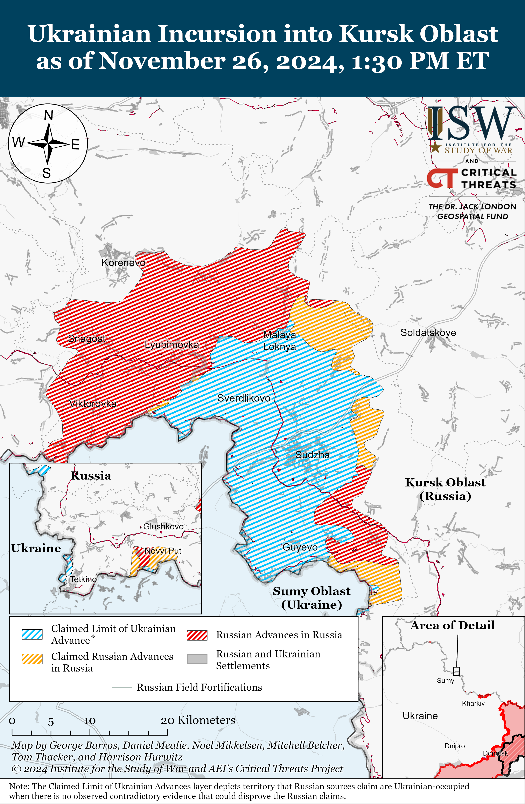
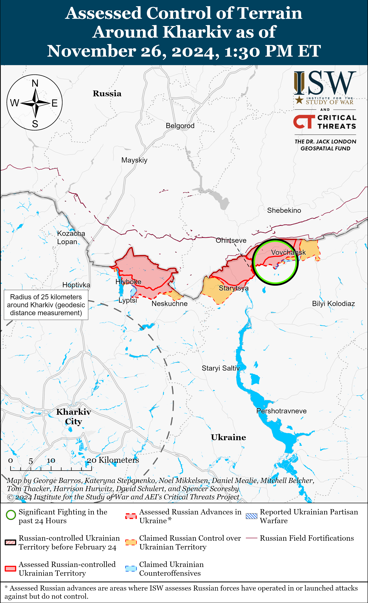
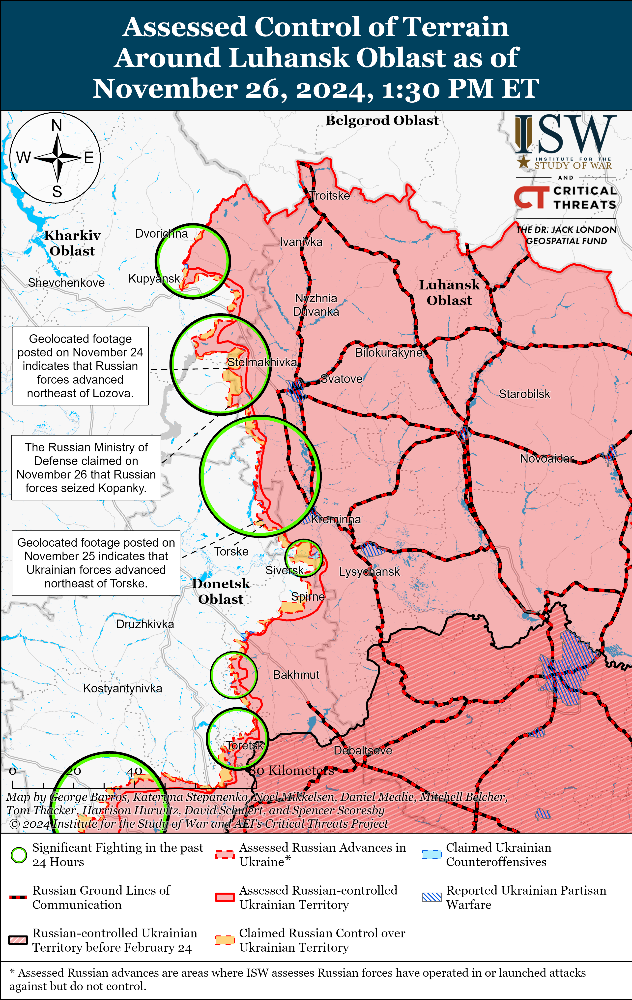
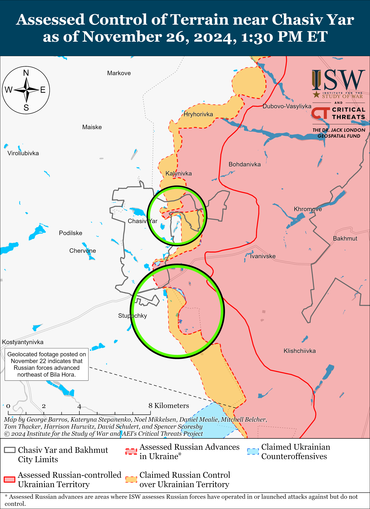
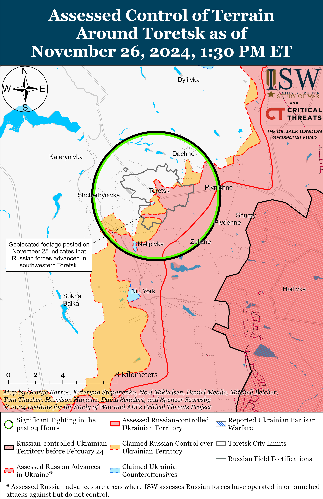
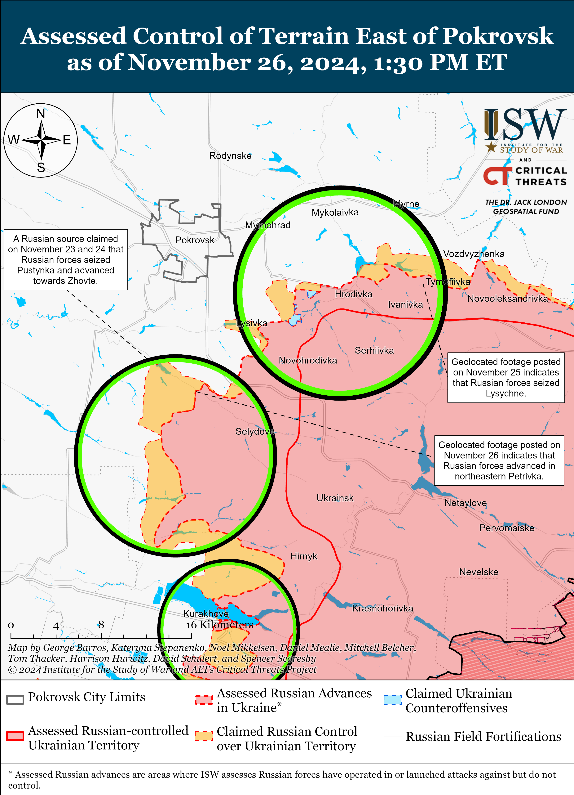
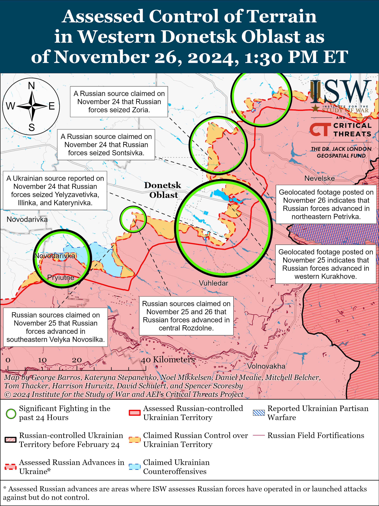
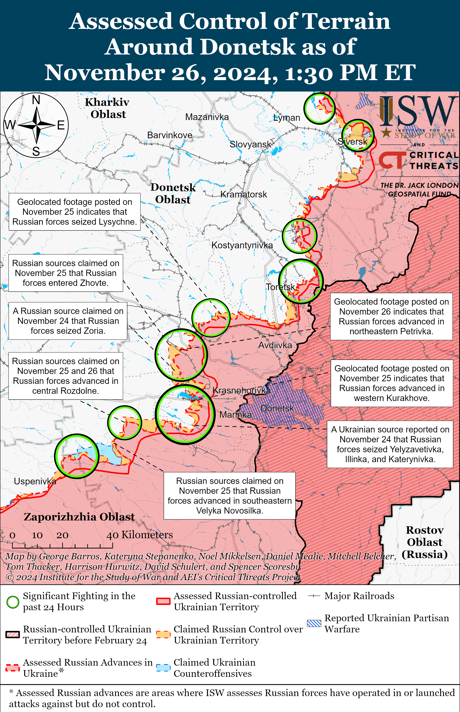
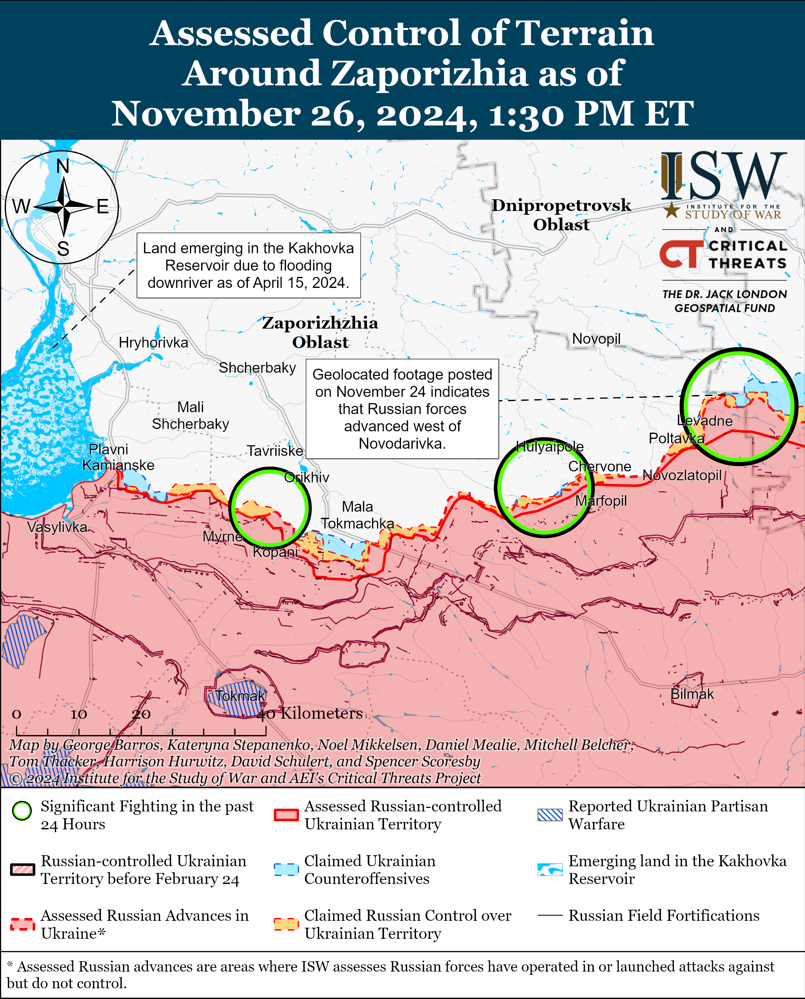
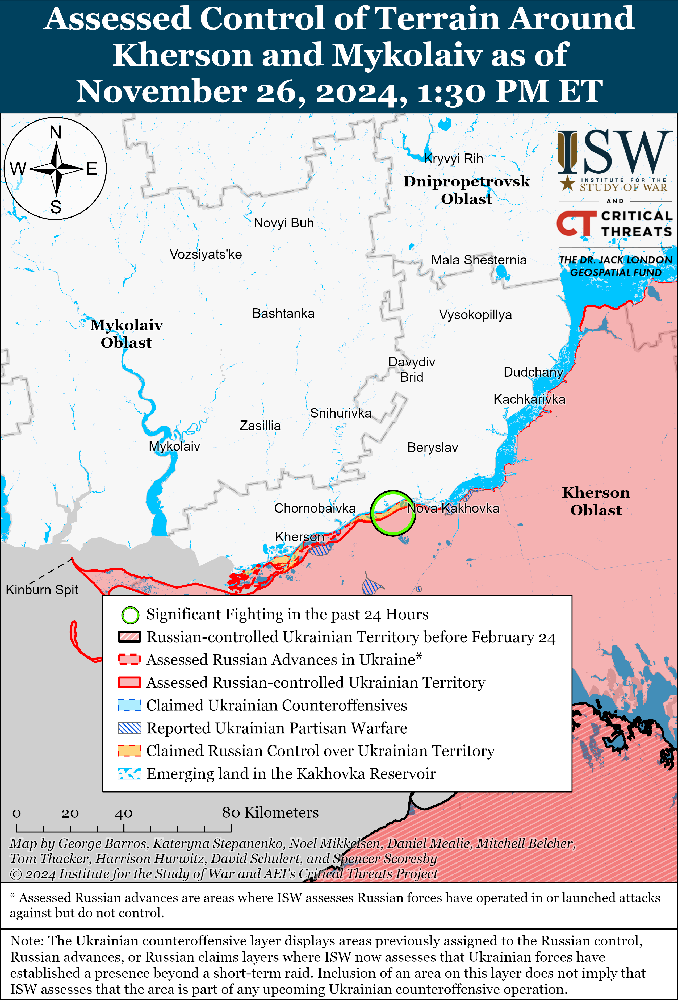

# Russian Offensive Campaign Assessment, November 26, 2024

**Christina Harward, Davit Gasparyan, Nicole Wolkov, Nate Trotter, Olivia Gibson, William Runkel, and George Barros**

**November 26, 2024, 7:55 pm ET**

**Click** [**here**](https://storymaps.arcgis.com/stories/36a7f6a6f5a9448496de641cf64bd375) **to see ISW’s interactive map of the Russian invasion of Ukraine. This map is updated daily alongside the static maps present in this report.**

**Click** [**here**](https://understandingwar.maps.arcgis.com/apps/instant/3dviewer/index.html?appid=1602762dbcde419bb957dea358449580) **to see ISW’s 3D control of terrain topographic map of Ukraine. Use of a computer (not a mobile device) is strongly recommended for using this data-heavy tool.**

**Click** [**here**](https://storymaps.arcgis.com/stories/733fe90805894bfc8562d90b106aa895) **to access ISW’s archive of interactive time-lapse maps of the Russian invasion of Ukraine. These maps complement the static control-of-terrain map that ISW produces daily by showing a dynamic frontline. ISW will update this time-lapse map archive monthly.**

**Note: The data cut-off for this product was 12:45pm ET on November 26. ISW will cover subsequent reports in the November 27 Russian Offensive Campaign Assessment.**

**Russian officials continue to demonstrate that the Kremlin aims to seize more territory in Ukraine than it currently occupies and is unwilling to accept compromises or engage in good faith negotiations, no matter who mediates such talks.** Russian Foreign Intelligence Service (SVR) Director Sergei Naryshkin claimed on November 26 that Russia is open to negotiations but stated that Russia “categorically rejects” any “freezing” of the current frontline or the creation of a demilitarized zone.[1] Naryshkin alleged that the “elimination” of the reasons that “caused” Russia to launch its full-scale invasion of Ukraine is the only way to ensure peace — demonstrating that Russia continues to uncompromisingly demand Ukraine’s full capitulation. The Kremlin has repeatedly demanded that Ukraine relinquish areas of the four Ukrainian oblasts that the Kremlin has illegally annexed and that Russian forces do not currently occupy.[2] ISW also recently forecasted that the Russian military command is likely planning how to advance into the southeasternmost part of Dnipropetrovsk Oblast — notably not one of the four illegally annexed oblasts — in support of Russia’s longstanding objective to seize all of Donetsk Oblast.[3]

**The Russian military’s rate of advance since Fall 2024 has notably increased recently compared to its rate of advance in 2023 and the rest of 2024, but recent Western media reports comparing recent Russian gains to those at the start of Russia’s full-scale invasion continue to mischaracterize the gradual and tactical nature of Russia’s recent advances.**[4] ISW assesses that Russian forces have gained 574 square kilometers since November 1, 2024 — an average rate of 22 square kilometers per day. This is remarkably less than the 1,265 square kilometers per day that ISW assesses Russian forces were gaining in March 2022. *Reuters’*November 26 report that Russian forces “control” over 80 percent of Donetsk and Luhansk oblasts is also misleading.[5] ISW assesses that while Russian forces occupy roughly 99 percent of Luhansk Oblast, Russian forces only occupy about 66 percent of Donetsk Oblast. Russian forces have occupied almost the entirety of Luhansk Oblast since Fall 2022 but have occupied significantly less territory in Donetsk Oblast throughout the war. ISW recently assessed that Russian forces still need to seize over 8,000 square kilometers of territory to achieve the Kremlin’s self-defined objective of seizing the territory of Donetsk Oblast.[6] Russian forces would seize the remainder of Donetsk Oblast in roughly one year should Russian forces continue their recent relatively quicker rate of advance — which is not a given. Russian forces notably have been bypassing Ukrainian strongpoints, and Ukraine still has several well-defended cities in Donetsk Oblast, such as Slovyansk and Kramatorsk, that Russian forces likely cannot seize as rapidly as they have with the rural fields near Pokrovsk. ISW continues to assess that Russian forces have not been able to restore operational maneuver to the battlefield to make deep penetrations into Ukrainian positions, as seen in the initial months of the full-scale invasion.[7] Russian forces have instead been exploiting identified vulnerabilities in Ukrainian defenses to make gradual advances.[8]

**US National Security Council Spokesperson John Kirby confirmed Ukraine’s usage of US-provided ATACMS against Russia amid official Russian confirmation of recent Ukrainian ATACMS strikes.** Kirby stated on November 25 that the Ukrainian forces are “able to use” ATACMS to “defend themselves” and that Ukrainian forces are already using them in and around Kursk Oblast.[9] Kirby’s statement is the first official confirmation that the US authorized Ukrainian forces to use ATACMS to strike military objects in Russia.[10] The Russian Ministry of Defense (MoD) acknowledgedon November 26 that Ukrainian forces recently struck military objects in Kursk Oblast.[11] The MoD stated that Ukrainian forces launched five ATACMS on November 23, damaging an S-400 air defense radar system in Lotarevka (northwest of Kursk City), and eight ATACMS on November 25, damaging infrastructure facilities and injuring military personnel in the Khalino Airfield. The Russian MoD published photos purportedly showing parts of the ATACMS from both strikes.[12] Geolocated footage published on November 25 shows the moment of the ATACMS strike that damaged the Khalino Airfield.[13] A former Ukrainian officer stated on November 25 that while Russian air activity from the Khalino Airfield has decreased in recent days — likely due to recent Ukrainian strikes, Ukraine’s ability to inflict damage during long-range missile strikes is limited by the number of such missiles available to Ukrainian forces.[14] ISW assesses that Ukrainian long-range strikes against military objects within Russia’s rear are crucial for Ukraine’s ability to degrade Russian military capabilities throughout the theater.[15]

**Russian forces launched a record number of drones against Ukraine on the night of November 25 to 26 as Russia continued to increase their use of decoy drones in long-range strike packages targeting Ukrainian energy infrastructure in order to overwhelm Ukrainian air defense systems.[16]** The Ukrainian Air Force reported that Russian forces launched four Iskander-M ballistic missiles and 188 Shahed and other unspecified drones — likely referring to decoy drones — from Voronezh, Kursk, Oryol, Bryansk oblasts and Primorsko-Akhtarsk, Krasnodar Krai on the night of November 25 to 26.[17] The Ukrainian Air Force reported that Ukrainian forces downed all four Iskander-M missiles and 76 drones over Kyiv, Cherkasy, Kirovohrad, Chernihiv, Sumy, Kharkiv, Poltava, Zhytomyr, Khmelnytskyi, Vinnytsia, Chernivtsi, Ternopil, Rivne, Zaporizhia, Dnipropetrovsk, Odesa, and Mykolaiv oblasts as of 0900 local time on November 26. The Ukrainian Air Forcereported that 95 Russian drones were “lost,” likely due to Ukrainian electronic warfare (EW) interference, and that five drones flew into Belarusian air space. Kyiv Oblast officials stated that Russian forces launched more than 10 drones at Kyiv City from different directions in several waves and that Ukrainian forces shot down all of thedrones.[18] Ternopil Oblast officials stated that Russian strike drones destroyed energy infrastructure in Ternopil Oblast, causing power outages.[19] Ukrainian officials stated that Russian forces launched two Iskander-M missiles at civilian and energy infrastructure in Odesa Oblast during the day on November 25 and that Ukrainian forces intercepted one of the Iskander-M missiles.[20] Sumy Oblast officials stated that a Russian missile of an unspecified type struck civilian infrastructure in Sumy City during the day on November 26.[21] Ukrainian reports that roughly half of the Russian drones became “lost” suggest that Russian forces likely used a large number of decoy drones to overwhelm Ukrainian air defenses. ISW recently observed reports that Russia is increasing its use of decoy drones that resemble Shahed drones during combined long-range strikes and assesses that Russia will likely continue to use decoy drones and experiment with varying strike packages to increase the effectiveness of long-range strikes against Ukraine ahead of and during the winter.[22]

**Russian state media reported that the Russian MoD replaced former Russian Southern Military District (SMD) and Southern Grouping of Forces commander Colonel General Gennady Anashkin with Eastern Military District (EMD) acting commander Lieutenant General Alexander Sanchik.** Russian state outlet *RBK* reported in an article published on November 26 that a source in the Russian MoD stated that Sanchik replaced Anashkin as part of a “planned rotation” and that Anashkin will now head the Frunze Military Academy in Moscow.[23] A source close to the Russian MoD also told *RBK* that the Russian military appointed EMD First Deputy Commander Lieutenant General Andrei Ivanayev as EMD commander and that Leningrad Military District (LMD) Commander Colonel General Alexander Lapin is also serving as Northern Grouping of Forces Commander.[24] Russian milbloggers widely claimed on November 23 that the Russian military command removed Anashkin after Russian commanders in the Siversk direction in his area of responsibility submitted incorrect reports about Russian battlefield advances to their superiors, and the Russian MoD appears to be continuing its efforts to cover up these information space claims.[25]

**Russian forces continue to execute Ukrainian prisoners of war (POWs) amid a surge of recent Russian war crimes.** The Ukrainian Prosecutor General’s office reported on November 26 that Ukrainian law enforcement officials opened a pre-trial investigation into the execution of five Ukrainian POWs by Russian forces in Petrivka (south of Pokrovsk) on November 13 in violation of the Geneva Convention on the treatment of POWs.[26] ISW has extensively reported on previous footage and reports of Russian servicemembers executing Ukrainian POWs and observed an increasing trend of Russian abuses against Ukrainian POWs across various sectors of the front that appear to be enabled, if not explicitly endorsed, by individual Russian commanders and unpunished by Russian field commanders and the larger Russian military justice system.[27]

**The Russian State Duma is preparing the legal mechanisms to remove the Taliban from the Russian government’s official list of banned terrorist organizations.** Russian State Duma deputies submitted a bill to the Duma on November 26 proposing to amend the law “On countering terrorism” to allow the Russian government to remove banned terrorist organizations after the organization “ceases its activities aimed at promoting, justifying, and supporting terrorism or committing” terrorist acts. Russian law does not currently provide such a removal mechanism, and the amendments would allow Russia to remove the Taliban from the list — as Kremlin officials have repeatedly stated they intend to do.[28] A Russian insider source claimed that the Kremlin is unlikely to reach an official decision to remove the Taliban from Russia’s list of terrorist organizations by the end of 2024.[29]

**Key Takeaways:**

- **Russian officials continue to demonstrate that the Kremlin aims to seize more territory in Ukraine than it currently occupies and is unwilling to accept compromises or engage in good faith negotiations, no matter who mediates such talks.**
- **The Russian military’s rate of advance since Fall 2024 has notably increased recently compared to its rate of advance in 2023 and the rest of 2024, but recent Western media reports comparing recent Russian gains to those at the start of Russia’s full-scale invasion continue to mischaracterize the gradual and tactical nature of Russia’s recent advances.**
- **US National Security Council Spokesperson John Kirby confirmed Ukraine’s usage of US-provided ATACMS against Russia amid official Russian confirmation of recent Ukrainian ATACMS strikes.**
- **Russian forces launched a record number of drones against Ukraine on the night of November 25 to 26 as Russia continue to increase their use of decoy drones in long-range strike packages targeting Ukrainian energy infrastructure in order to overwhelm Ukrainian air defense systems.**
- **Russian state media reported that the Russian Ministry of Defense (MoD) replaced former Russian Southern Military District (SMD) and Southern Grouping of Forces commander Colonel General Gennady Anashkin with Eastern Military District (EMD) acting commander Lieutenant General Alexander Sanchik.**
- **Russian forces continue to execute Ukrainian prisoners of war (POWs) amid a surge of recent Russian war crimes.**
- **The Russian State Duma is preparing the legal mechanisms to remove the Taliban from the Russian government’s official list of banned terrorist organizations.**
- **Ukrainian forces recently regained lost positions near Kreminna, and Russian forces recently advanced near Pokrovsk, Kurakhove, and Velyka Novosilka.**
- **A Russian milblogger complained on November 25 that Russian forces often operate artillery without coordinating between different Russian elements, highlighting significant communications issues between armored vehicle and infantry units.**
- **Russian authorities continue to incentivize service in Ukraine through one-time payment offers, likely in order to avoid conducting another partial involuntary reserve callup.**

***We do not report in detail on Russian war crimes because these activities are well-covered in Western media and do not directly affect the military operations we are assessing and forecasting. We will continue to evaluate and report on the effects of these criminal activities on the Ukrainian military and the Ukrainian population and specifically on combat in Ukrainian urban areas. We utterly condemn Russian violations of the laws of armed conflict and the Geneva Conventions and crimes against humanity even though we do not describe them in these reports.***

- Ukrainian Operations in the Russian Federation
- Russian Main Effort – Eastern Ukraine (comprised of three subordinate main efforts)
- Russian Subordinate Main Effort #1 – Push Ukrainian forces back from the international border with Belgorod Oblast and approach to within tube artillery range of Kharkiv City
- Russian Subordinate Main Effort #2 – Capture the remainder of Luhansk Oblast and push westward into eastern Kharkiv Oblast and encircle northern Donetsk Oblast
- Russian Subordinate Main Effort #3 – Capture the entirety of Donetsk Oblast
- Russian Supporting Effort – Southern Axis
- Russian Air, Missile, and Drone Campaign
- Russian Mobilization and Force Generation Efforts
- Russian Technological Adaptations
- Activities in Russian-occupied areas
- Significant Activity in Belarus

**Ukrainian Operations in the Russian Federation**

Russian forces continued offensive operations in the main Ukrainian salient in Kursk Oblast on November 26 but did not make any confirmed advances. Geolocated footage published on November 26 shows a Ukrainian brigade repelling a recent Russian reduced platoon-sized mechanized assault consisting of at least two vehicles south of Zeleny Shlyakh (southeast of Korenevo).[30] Russian milbloggers claimed that Russian forces advanced near Novoivanovka (southeast of Korenevo), Kamyshevka (north of Sudzha), Darino (southeast of Korenevo), and Kremyanoye (east of Korenevo) and that Ukrainian forces are counterattacking in the area.[31] ISW has not observed confirmation of these claimed Russian advances. Elements of the Russian 810th Naval Infantry Brigade (Black Sea Fleet, Southern Military District [SMD]) are reportedly operating near Pogrebki (northwest of Sudzha).[32]

Neither Russian nor Ukrainian sources reported fighting in Glushkovsky Raion west of the main Ukrainian salient in Kursk Oblast on November 26.

**Russian Main Effort – Eastern Ukraine**

**Russian Subordinate Main Effort #1 – Kharkiv Oblast (Russian objective: Push Ukrainian forces back from the international border with Belgorod Oblast and approach to within tube artillery range of Kharkiv City)**

Ukrainian forces repelled Russian cross-border assaults northwest of Kharkiv City amid continued offensive operations northeast of Kharkiv City on November 25 and 26 but did not make any confirmed advances. Russian forces conducted offensive operations near the international border northwest of Kharkiv City near Kozacha Lopan and Kudiivka and northeast of Kharkiv City near Vovchansk on November 25 and 26.[33] A Russian milblogger claimed that a Russian sabotage and reconnaissance group entered Hoptivka (northwest of Kharkiv City near the Ukrainian-Russian international border) on November 25.[34] Ukrainian ”Kharkiv” Group of Forces Spokesperson Lieutenant Colonel Yevheniy Romanov stated on November 26, however, that Ukrainian forces repelled a Russian sabotage and reconnaissance group attempting to enter Ukrainian territory near the Hoptivka-Nekhoteyevka checkpoint northwest of Kharkiv City and that such Russian probes are common.[35] Romanov also stated that Ukrainian defenses and the lack of traversable roads are preventing Russian mechanized advances in the Kharkiv direction.[36] Derhachi City Military Administration Head Vyacheslav Zadorenko stated on November 26 that Ukrainian forces are repelling constant small Russian sabotage and reconnaissance group assaults in forested areas in the Kharkiv Oblast-Russian border area.[37] An officer of a Ukrainian brigade operating in the Kharkiv direction stated on November 26 that Russian forces are deploying reserves to recapture lost positions in the Hlyboke and Lukyantsi (north of Kharkiv City) directions.[38] Drone operators of the Chechen ”Canada” group of the ”Okhotnik” (Hunter) Detachment (204th ”Akhmat” Spetsnaz Regiment, 3rd Combined Arms Army [CAA], formerly 2nd Luhansk People’s Republic Army Corps [LNR AC]) are reportedly operating near Strilecha (north of Kharkiv City).[39]

Ukrainian Kharkiv Oblast Head Oleh Synehubov stated that Russian forces launched 19 guided glide bombs against Kharkiv Oblast on November 25 in one of the largest strikes against Kharkiv Oblast in over a month.[40]

**Russian Subordinate Main Effort #2 – Luhansk Oblast (Russian objective: Capture the remainder of Luhansk Oblast and push westward into eastern Kharkiv Oblast and northern Donetsk Oblast)**

Ukrainian forces recently regained previously lost positions west of Kreminna amid continued Russian offensive operations along the Kupyansk-Svatove-Kreminna line on November 26. Geolocated footage published on November 25 indicates that Ukrainian forces recently regained lost positions northeast of Torske (west of Kreminna).[41] The Russian MoD claimed on November 26 that Russian forces seized Kopanky (southeast of Kupyansk).[42] Russian milbloggers claimed that Russian forces advanced near Petropavlivka (northeast of Kupyansk), within Zelenyi Hai (west of Svatove) and Torske (west of Kreminna), towards Lozova (southeast of Kupyansk), and west of Myasozharivka and Andriivka (both west of Svatove) along the west bank of the Zherebets River.[43] Russian milbloggers also claimed that Russian forces used boats to cross the Oskil River and enter Dvorichna (northeast of Kupyansk).[44] ISW has not observed confirmation of these claims, however. Russian forces conducted offensive operations northeast of Kupyansk near Novomlynsk and Synkivka; southeast of Kupyansk near Novoosynove, Lozova, Zahryzove, Kolisnykivka, and Kruhlyakivka; west of Svatove near Zelenyi Hai, Pershotravneve, and Kopanky; southwest of Svatove near Novoyehorivka, Cherneshchyna, Andriivka, Druzhelyubivka, Makiivka, and Hrekivka; west of Kreminna near Terny, Yampolivka, and Torske; and south of Kreminna near Hryhorivka.[45] A Russian source claimed that Ukrainian forces are counterattacking near Kolisnykivka and Zahyrzove (south of Kupyansk).[46] Artillery and drone operators of the Russian 16th Spetsnaz Brigade (Russian General Staff’s Main Intelligence Directorate [GRU]) are reportedly operating near Petropavlivka and in the Lyman direction respectively.[47]

**Russian Subordinate Main Effort #3 – Donetsk Oblast (Russian objective: Capture the entirety of Donetsk Oblast, the claimed territory of Russia’s proxies in Donbas)**

Russian forces continued offensive operations northeast of Siversk near Hryhorivka on November 25 and 26 but did not make confirmed advances.[48] A Ukrainian brigade commander operating in the Siversk direction reported on November 26 that Russian forces continue to conduct assaults in small groups with air and artillery support.[49] Ukrainian Luhansk Group of Forces Spokesperson Major Anastasiya Bobovnikova stated on November 25 that high Russian attrition rates and limited tactical gains are causing low levels of discipline among Russian soldiers as a significant number of Russian troops refuse to carry out orders.[50] Bobovnikova stated that Russian forces have suffered roughly 15,000 losses — roughly one and a half divisions’ worth of infantry — in the Siversk direction during an unspecified time frame.[51] Bobovnikova reported that Russian forces in the area have been resorting to using broken and destroyed military equipment for about a month — possibly contributing to low Russian morale. ISW is unable to confirm Bobovnikova’s reports, however. Russian forces continued offensive operations in the Chasiv Yar direction on November 26 but did not make any confirmed advances.

The Ukrainian General Staff reported on November 25 and 26 that Russian forces continued offensive operations near Chasiv Yar and Stupochky (south of Chasiv Yar).[52] A Russian milblogger claimed that Russian forces are attacking to enter the refractory plant in central Chasiv Yar but are struggling to secure a foothold in the plant’s southern outskirts.[53] A spokesperson of a Ukrainian brigade operating in the Chasiv Yar area stated on November 26 that Russian forces prefer to deploy small infantry fireteams consisting of two to five soldiers in response to Ukrainian forces’ use of drones near the Siverskyi-Donets Donbas Canal to infiltrate to engage Ukrainian forces’ rear.[54] A Ukrainian company commander reported on November 26 that Russian forces are attempting to cross the Siverskyi-Donets Donbas Canal multiple times per day despite high losses.[55] The company commander further noted that Russian forces are not attempting to cross the canal at night due to cold temperatures that benefit Ukrainian thermal imaging drones but instead prefer to attempt crossings at dawn or during the day. Elements of the Russian 98th Airborne (VDV) Division reportedly continue to operate near Chasiv Yar.[56]

Russian forces continued intense offensive operations in the Toretsk direction on November 25 and 26 but did not make confirmed advances. The Ukrainian General Staff reported that Russian forces conducted offensive operations near Toretsk; northeast of Toretsk near Dachne and Dyliivka; and west of Toretsk near Shcherbynivka on November 25 and 26.[57] Elements of the Russian 9th Motorized Rifle Brigade (51st Combined Arms Army [CAA], formerly 1st Donetsk People’s Republic [DNR] Army Corps [AC]) are reportedly operating in Niu York.[58]

Russian forces recently advanced in the Pokrovsk direction amid continued offensive operations in the area on November 26. Geolocated footage published on November 25 and 26 indicates that Russian forces recently advanced southwest of Yurivka and in northeastern Petrivka (both south of Pokrovsk).[59] Additional geolocated footage published on November 25 shows Russian forces operating north of Lysychne (east of Pokrovsk), indicating that Russian forces likely seized the settlement.[60] A Russian milblogger claimed that Russian forces advanced to the outskirts of Zhovte and near Dachenske (both south of Pokrovsk), but ISW has not observed confirmation of these claims.[61] Russian forces conducted offensive operations east of Pokrovsk near Myrolyubivka, Promin, and Krasnyi Yar; southeast of Pokrovsk near Lysivka; and south of Pokrovsk near Pushkine, Pustynka, Novyi Trud, Hryhorivka, Petrivka, and Dachenske on November 25 and 26.[62] A Russian milblogger claimed that Russian forces are about two kilometers from Myrnohrad (just east of Pokrovsk).[63] The spokesperson of a Ukrainian brigade operating in the Pokrovsk direction reported on November 26 that Russian forces are conducting first-person view (FPV) drone strikes followed by assaults consisting of 10 to 20 people five to six times each day.[64] The spokesperson stated that Russian forces are occasionally using armored vehicles, especially tanks, in assaults. A Ukrainian officer operating in the Pokrovsk direction reported on November 26 that Russian forces are using equipment to transport personnel or strike Ukrainian positions.[65]

Russian forces recently advanced in the Kurakhove direction amid continued offensive operations in the area on November 26. Geolocated footage published on November 25 indicates that Russian forces recently advanced northwest of Dalne (south of Kurakhove).[66] Russian milbloggers claimed that Russian forces advanced near Berestky (north of the Kurakhivske Reservoir), 1.5 kilometers deep along a front three kilometers wide near Zorya (northwest of Kurakhove), and 750 meters deep on the southeastern outskirts of Kurakhove.[67] ISW has not observed confirmation of these claims, however. Russian forces conducted offensive operations northwest of Kurakhove near Sontsivka, Novodmytrivka, and Zorya; north of Kurakhove near Berestky; near Kurakhove itself; and south of Kurakhove near Dalne on November 25 and 26.[68] Ukrainian Khortytsia Group of Forces Spokesperson Lieutenant Colonel Nazar Voloshyn stated on November 26 that Russian forces are trying to take Kurakhove and nearby Ukrainian ground lines of communication (GLOCs) under fire control and that Ukrainian forces maintain control over Kurakhove.[69] Elements of the Russian 5th Motorized Rifle Brigade (51st CAA) are reportedly operating in Kurakhove.[70]

Russian forces recently conducted a roughly platoon-sized mechanized assault in the Vuhledar direction but did not make any confirmed advances on November 26. Geolocated footage published on November 26 indicates that elements of the Russian 57th Motorized Rifle Regiment (20th Motorized Rifle Division, 8th CAA, Southern Military District [SMD]) recently unsuccessfully conducted a roughly platoon-sized mechanized assault south of Yelyzavetivka (northeast of Vuhledar).[71] A Russian milblogger claimed that elements of the Russian 57th Motorized Rifle Regiment seized Yelyzavetivka and that elements of the 33rd Motorized Rifle Regiment (20th Motorized Rifle Division, 8th CAA, SMD) advanced to the outskirts of Romanivka (northeast of Vuhledar).[72] Russian forces continued attacking northeast of Vuhledar near Romanivka, Yelyzavetivka, Katerynivka, and Antonivka; north of Vuhledar near Hannivka; and northwest of Vuhledar near Sukhi Yaly, Trudove, Uspenivka, and Kostyantynopolske on November 25 and 26.[73]

Russian forces recently advanced in the Donetsk-Zaporizhia Oblast border area amid continued offensive operations in the area on November 26. Geolocated footage published on November 26 indicates that Russian forces recently advanced southeast of Novodarivka (southwest of Velyka Novosilka).[74] Russian milbloggers claimed that Russian forces advanced within central Rozdolne (northeast of Velyka Novosilka) and within eastern Velyka Novosilka, but ISW has not observed confirmation of these claims.[75] Russian forces continued attacking near Velyka Novosilka itself; southwest of Velyka Novosilka near Rivnopil and Novodarivka; and northeast of Velyka Novosilka near Rozdolne on November 25 and 26.[76]

**Russian Supporting Effort – Southern Axis (Russian objective: Maintain frontline positions and secure rear areas against Ukrainian strikes)**

Russian forces continued assaults in western Zaporizhia Oblast near Novoandriivka (northwest of Robotyne) and Bilohirya (northeast of Robotyne) on November 25 and 26 but did not make any confirmed advances.[77] Russian milbloggers claimed on November 25 and 26 that Russian forces advanced up 600 to 1,500 meters towards the southern outskirts of Mala Tokmachka (northeast of Robotyne).[78] ISW has not observed visual confirmation of this claim, however. Snipers of the Russian 7th Airborne (VDV) Division are reportedly operating near Orikhiv (north of Robotyne).[79]

Russian forces continued assaults in the Dnipro direction in east (left) bank Kherson Oblast on November 25 and 26, but there were no confirmed changes to the frontline.[80] Elements of the Russian BARS-33 Detachment (Russian Army Combat Reserve) reportedly continue operating in the Kherson direction.[81]

**Russian Air, Missile, and Drone Campaign (Russian Objective: Target Ukrainian military and civilian infrastructure in the rear and on the frontline)**

*See topline text.*

**Russian Mobilization and Force Generation Efforts (Russian objective: Expand combat power without conducting general mobilization)**

A Russian milblogger complained on November 25 that Russian forces often operate artillery without coordinating between different Russian elements, highlighting significant communications issues between armored vehicle and infantry units.[82] The milblogger noted that Russian artillery units often operate independently and fail to reliably destroy Ukrainian defenses, particularly due to the insufficient number of small reconnaissance drones needed to create an effective reconnaissance-strike complex. The milblogger claimed that Russian technology is qualitatively lagging behind Ukrainian technology, giving Ukrainian forces tactical advantages including the freedom to maneuver.

Russian authorities continue to incentivize service in Ukraine through one-time payment offers, likely in order to avoid conducting another partial involuntary reserve call-up. Independent Russian-language outlet *Idel Realii* stated on November 25 that Russian authorities have sharply increased payments for volunteers signing contracts with the Russian MoD in Berezniki, Perm Krai from 150,00 to 400,000 rubles (about $1,421 to $3,971).[83]

**Russian Technological Adaptations (Russian objective: Introduce technological innovations to optimize systems for use in Ukraine)**

*Nothing significant to report.*

**Activities in Russian-occupied areas (Russian objective: Consolidate administrative control of annexed areas; forcibly integrate Ukrainian citizens into Russian sociocultural, economic, military, and governance systems)**

*ISW is not publishing coverage of activities in Russian-occupied areas today.*

**Significant activity in Belarus (Russian efforts to increase its military presence in Belarus and further integrate Belarus into Russian-favorable frameworks and Wagner Group activity in Belarus)**

Belarus continues to engage in sanctions evasion measures to supply Russia with critical components for Russian weapons systems. The Belarusian Investigative Center, a member of the Organized Crime and Corruption Reporting Project (OCCRP), reported on November 26 that Belarus exported more than $125 million worth of microchips to Russian defense industrial companies between September 2022 to June 2024, including almost 10,000 Western-made microchips worth almost $400,000.[84]

Russia and Belarus continue efforts to accelerate the implementation of key aspects of the Union State Treaty. Belarusian state outlet *BELTA* reported on November 26 that Belarusian Prime Minister Roman Golovchenko and head of the Russian state nuclear energy operator Rosatom Alexei Likhachev signed an agreement expanding the scope of Russian-Belarussian bilateral cooperation in the field of “nuclear non-energy and non-nuclear projects.”[85] Russian state outlet RIA *Novosti* reported on November 26 that Russian President Vladimir Putin will travel to Minsk on December 6 for a meeting with the Supreme State Council of the Union State.[86]

**Note: ISW does not receive any classified material from any source, uses only publicly available information, and draws extensively on Russian, Ukrainian, and Western reporting and social media as well as commercially available satellite imagery and other geospatial data as the basis for these reports. References to all sources used are provided in the endnotes of each update.**

[1] https://www.interfax dot ru/russia/994494

[2] https://isw.pub/UkrWar061424; https://understandingwar.org/backgrounder/russian-offensive-campaign-assessment-october-18-2024; https://isw.pub/UkrWar101824; https://understandingwar.org/backgrounder/why-putin-remains-uninterested-meaningful-negotiations-ukraine

[3] https://understandingwar.org/backgrounder/russian-offensive-campaign-assessment-november-24-2024

[4] https://www.reuters.com/world/europe/russia-advances-ukraine-fast-pace-moving-into-kurakhove-analysts-say-2024-11-26/ ; https://understandingwar.org/backgrounder/russian-offensive-campaign-assessment-november-24-2024; https://understandingwar.org/backgrounder/russian-offensive-campaign-assessment-october-29-2024

[5] https://www.reuters.com/world/europe/russia-advances-ukraine-fast-pace-moving-into-kurakhove-analysts-say-2024-11-26/

[6] https://isw.pub/UkrWar112524

[7] https://understandingwar.org/backgrounder/russian-offensive-campaign-assessment-october-29-2024; https://understandingwar.org/backgrounder/russian-offensive-campaign-assessment-october-29-2024

[8] https://understandingwar.org/backgrounder/russian-offensive-campaign-assessment-november-24-2024

[9] https://www.whitehouse.gov/briefing-room/press-briefings/2024/11/25/on-the-record-press-gaggle-by-white-house-national-security-communications-advisor-john-kirby-35/

[10] https://suspilne dot media/888073-u-bilomu-domi-pidtverdili-zastosuvanna-ukrainou-raket-atacms-po-kurskij-oblasti-rf/; https://meduza dot io/news/2024/11/25/belyy-dom-podtverdil-chto-dal-ukraine-razreshenie-ispolzovat-rakety-atacms-na-territorii-rossii

[11] https://t.me/mod\_russia/46206; https://t.me/mod\_russia/46212 ; https://t.me/mod\_russia/46207

[12] https://t.me/mod\_russia/46212 ; https://t.me/mod\_russia/46207

[13] https://t.me/kiber\_boroshno/10695; https://x.com/Dmojavensis/status/1861117141568594016; https://x.com/bayraktar\_1love/status/1861041074522693807 ; https://x.com/Dmojavensis/status/1861117361362768206 ; https://t.me/kiber\_boroshno/10689 ; https://x.com/MilAviaUA/status/1860992487029907901

[14] https://x.com/Tatarigami\_UA/status/1861099084146164165

[15] https://understandingwar.org/backgrounder/russian-offensive-campaign-assessment-november-19-2024

[16] https://t.me/V\_Zelenskiy\_official/12593

[17] https://t.me/kpszsu/23621

[18] https://suspilne dot media/kyiv/888173-ppo-znisila-ponad-desat-rosijskih-bpla-aki-zagrozuvali-kievu-kmva/ ; https://t.me/VA\_Kyiv/9684; https://suspilne dot media/kyiv/888221-nicna-ataka-rf-na-kiivsinu-poskodzeni-budinki-ta-linia-elektromerezi/ ; https://t.me/policekyivregion/9784

[19] https://t.me/V\_Negoda\_TODA/1273 ; https://t.me/ternopilskaODA/10601 ; https://suspilne dot media/ternopil/888245-pid-cas-nicnoi-ataki-na-ternopilsini-droni-znisili-obekt-energeticnoi-infrastrukuri-sergij-nadal/

[20] https://t.me/kpszsu/23575 ; https://t.me/odeskaODA/7698; https://www.facebook.com/share/p/bFdk51ni138EYSHL/; https://t.me/SJTF\_Odes/11809;

[21] https://suspilne dot media/sumy/888755-sarahnulo-tak-so-j-nogi-dogori-ocevidci-rozkazali-pro-rosijsku-ataku-sum-ta-pokazali-poskodzenna/; https://t.me/sumskamiskarada/32116

[22] https://understandingwar.org/backgrounder/russian-offensive-campaign-assessment-november-17-2024 ; https://understandingwar.org/backgrounder/russian-offensive-campaign-assessment-november-16-2024

[23] https://www.rbc dot ru/politics/26/11/2024/674594cc9a7947ef959dd7ae

[24] https://www.rbc dot ru/politics/26/11/2024/6745dfbc9a79473f4f0eecd3?

[25] https://understandingwar.org/backgrounder/russian-offensive-campaign-assessment-november-23-2024

[26] https://t.me/pgo\_gov\_ua/27613 ; https://gp.gov dot ua/ua/posts/rozpocato-rozsliduvannya-za-faktom-rozstrilu-okupantami-5-polonenix-viiskovosluzbovciv-zsu-na-pokrovskomu-napryamku ; https://suspilne dot media/donbas/888437-rozpocali-rozsliduvanna-za-faktom-rozstrilu-vijskovimi-rf-patoh-vijskovopolonenih-zsu-na-pokrovskomu-napramku/?utm\_source=telegram&utm\_medium=ps ; https://mil.in dot ua/uk/news/rosiyany-rozstrilyaly-p-yatoh-vijskovopolonenyh-na-donechchyni/

[27] https://isw.pub/UkrWar100624 ; https://isw.pub/UkrWar100124 ; https://isw.pub/UkrWar090624 ; https://understandingwar.org/backgrounder/russian-offensive-campaign-assessment-june-19-2024 ; https://isw.pub/UkrWar122823 ; https://understandingwar.org/backgrounder/russian-offensive-campaign-assessment-june-3-2024 ; https://isw.pub/UkrWar032724 ; https://isw.pub/UkrWar052924 ; https://isw.pub/UkrWar090424 ; https://understandingwar.org/backgrounder/russian-offensive-campaign-assessment-july-10-2024 ; https://isw.pub/UkrWar062324 ; https://understandingwar.org/backgrounder/russian-offensive-campaign-assessment-october-7-2024; https://understandingwar.org/backgrounder/russian-offensive-campaign-assessment-november-6-2024 ; https://understandingwar.org/backgrounder/russian-offensive-campaign-assessment-november-10-2024 ; https://understandingwar.org/backgrounder/russian-offensive-campaign-assessment-november-22-2024

[28] https://t.me/bbcrussian/73369; https://t.me/sotaproject/90382; https://t.me/tass\_agency/287361 ; https://t.me/tass\_agency/287387; https://meduza dot io/news/2024/11/26/v-gosdumu-vnesli-zakonoproekt-pozvolyayuschiy-priostanavlivat-zapret-na-deyatelnost-terroristicheskih-organizatsiy-eto-pozvolit-isklyuchit-taliban-iz-spiska-terroristov; https://sozd.duma dot gov.ru/bill/778284-8#bh\_note

[29] https://t.me/kremlin\_sekret/16508

[30] https://t.me/WarArchive\_ua/22678; https://t.me/ua\_marines\_36brigade/2491

[31] https://t.me/dva\_majors/58607; https://t.me/rusich\_army/18775

[32] https://t.me/ButusovPlus/15346

[33] https://www.facebook.com/GeneralStaff.ua/posts/pfbid02g34g416NM5i6FQGTuYsLanUGM6yXN7n4NDyu6vETdCXyA37eLCB4FFtwTewgeSX1l; https://www.facebook.com/GeneralStaff.ua/posts/pfbid0Ao99wziM8SG6RHVgHJFxNiDRbasB26CMftuXmsfB48WyNPRzn15r6GEPGc1ukZMXl; https://www.facebook.com/GeneralStaff.ua/posts/pfbid0naTfx4JV6MQdTycAK6ZfLV35TBWBESg1ReuaKTLutWYkmCjiud5PRedHASX6Vjagl; https://t.me/otukharkiv/2776; https://t.me/DnevnikDesantnika/19888

[34] https://t.me/RVvoenkor/81350

[35] https://www.youtube.com/watch?v=aDXWlQ2K0dM; https://armyinform dot com.ua/2024/11/25/vorozhu-drg-zupynyly-na-pivnochi-harkivshhyny-chastynu-rosijskyh-dyversantiv-likvidovano/;

[36] https://armyinform dot com.ua/2024/11/26/vitayemo-v-pekli-46-rosiyan-dostrokovo-zavershyly-svij-kontrakt-z-ordoyu/; https://www.youtube dot com/watch?v=j5TqaWCCdUg

[37] https://suspilne dot media/kharkiv/888351-vipadkiv-zahodu-drg-u-sela-dergacivskoi-gromadi-de-zivut-ludi-nemae-zadorenko/

[38] https://armyinform dot com.ua/2024/11/26/syly-oborony-nastupayut-na-pivnochi-harkivshhyni-rosiyany-styaguyut-rezervy/; https://www.youtube dot com/watch?v=aDXWlQ2K0dM

[39] https://t.me/RKadyrov\_95/5255; https://t.me/tass\_agency/287416

[40] https://suspilne dot media/kharkiv/888703-minuloi-dobi-mi-mali-odnu-z-najbilsih-za-misac-atak-kerovanimi-aviabombami-po-harkivskij-oblasti-sinegubov/; https://suspilne dot media/888111-es-moze-vidpraviti-vijskovih-instruktoriv-v-ukrainu-zasidanna-ramstajn-planuetsa-do-rizdva-1007-den-vijni-onlajn/?anchor=live\_1732632548&utm\_source=copylink&utm\_medium=ps ; https://suspilne dot media/kharkiv/888703-minuloi-dobi-mi-mali-odnu-z-najbilsih-za-misac-atak-kerovanimi-aviabombami-po-harkivskij-oblasti-sinegubov/

[41] https://t.me/creamy\_caprice/7638; https://t.me/The\_Wrong\_Side/19933; https://t.me/OZK\_37/98

[42] https://t.me/mod\_russia/46194

[43] https://t.me/rybar/65700; https://t.me/RVvoenkor/81350; https://t.me/motopatriot/29834; https://t.me/rusich\_army/18775

[44] https://t.me/motopatriot/29836 ; https://t.me/rybar/65700; https://t.me/notes\_veterans/20691; https://t.me/Sladkov\_plus/11911

[45] https://www.facebook.com/GeneralStaff.ua/posts/pfbid02g34g416NM5i6FQGTuYsLanUGM6yXN7n4NDyu6vETdCXyA37eLCB4FFtwTewgeSX1l; https://www.facebook.com/GeneralStaff.ua/posts/pfbid0Ao99wziM8SG6RHVgHJFxNiDRbasB26CMftuXmsfB48WyNPRzn15r6GEPGc1ukZMXl; https://www.facebook.com/GeneralStaff.ua/posts/pfbid0naTfx4JV6MQdTycAK6ZfLV35TBWBESg1ReuaKTLutWYkmCjiud5PRedHASX6Vjagl; https://t.me/rusich\_army/18775; https://www.facebook.com/GeneralStaff.ua/posts/pfbid02g34g416NM5i6FQGTuYsLanUGM6yXN7n4NDyu6vETdCXyA37eLCB4FFtwTewgeSX1l; https://www.facebook.com/GeneralStaff.ua/posts/pfbid0Ao99wziM8SG6RHVgHJFxNiDRbasB26CMftuXmsfB48WyNPRzn15r6GEPGc1ukZMXl; https://www.facebook.com/GeneralStaff.ua/posts/pfbid0naTfx4JV6MQdTycAK6ZfLV35TBWBESg1ReuaKTLutWYkmCjiud5PRedHASX6Vjagl; https://t.me/rybar/65700; https://t.me/RVvoenkor/81350; https://t.me/rusich\_army/18775; https://t.me/motopatriot/29834; https://t.me/Sladkov\_plus/11911

[46] https://t.me/rybar/65700

[47] https://t.me/motopatriot/29828; https://t.me/RVvoenkor/81364

[48] https://www.facebook.com/GeneralStaff.ua/posts/pfbid02g34g416NM5i6FQGTuYsLanUGM6yXN7n4NDyu6vETdCXyA37eLCB4FFtwTewgeSX1l

[49] https://www.youtube dot com/watch?v=aDXWlQ2K0dM; https://armyinform dot com.ua/2024/11/26/koly-strashni-kazky-ozhyvayut-na-rosiyan-odnochasno-polyuyut-baby-yagy-i-vampiry/

[50] https://www.youtube dot com/watch?v=j5TqaWCCdUg; https://armyinform dot com.ua/2024/11/25/u-bij-na-zabij-chy-pid-trybunal-na-siverskomu-napryamku-rosiyan-motyvuye-vijskova-policziya/

[51] https://armyinform dot com.ua/2024/11/26/koly-strashni-kazky-ozhyvayut-na-rosiyan-odnochasno-polyuyut-baby-yagy-i-vampiry/

[52] https://www.facebook.com/GeneralStaff.ua/posts/pfbid0naTfx4JV6MQdTycAK6ZfLV35TBWBESg1ReuaKTLutWYkmCjiud5PRedHASX6Vjagl; https://www.facebook.com/GeneralStaff.ua/posts/pfbid0Ao99wziM8SG6RHVgHJFxNiDRbasB26CMftuXmsfB48WyNPRzn15r6GEPGc1ukZMXl

[53] https://t.me/motopatriot/29855

[54] https://www.youtube.com/watch?v=aDXWlQ2K0dM; https://armyinform dot com.ua/2024/11/26/forsuvaty-kanal-i-pomerty-v-chasovomu-yari-desyatky-okupantiv-realizuyut-svoyu-mriyu/

[55] https://armyinform dot com.ua/2024/11/26/tam-yih-vbyvayut-a-vony-po-dekilka-raziv-na-den-lizut-taktyka-voroga-pid-chasovym-yarom/; https://www.youtube dot com/watch?v=JLbSTc7xY6g

[56] https://t.me/DnevnikDesantnika/19892; https://t.me/motopatriot/29855; https://t.me/ButusovPlus/15322

[57] https://www.facebook.com/GeneralStaff.ua/posts/pfbid0naTfx4JV6MQdTycAK6ZfLV35TBWBESg1ReuaKTLutWYkmCjiud5PRedHASX6Vjagl; https://www.facebook.com/GeneralStaff.ua/posts/pfbid0Ao99wziM8SG6RHVgHJFxNiDRbasB26CMftuXmsfB48WyNPRzn15r6GEPGc1ukZMXl; https://www.facebook.com/GeneralStaff.ua/posts/pfbid02g34g416NM5i6FQGTuYsLanUGM6yXN7n4NDyu6vETdCXyA37eLCB4FFtwTewgeSX1l

[58] https://t.me/boris\_rozhin/145648

[59] https://t.me/WarArchive\_ua/22705; https://t.me/spartan\_ngu/2007; https://t.me/creamy\_caprice/7634; https://t.me/ombrstarichi65/98

[60] https://t.me/creamy\_caprice/7631; https://t.me/ghost\_of\_khortytsia/189

[61] https://t.me/DnevnikDesantnika/19908

[62] https://www.facebook.com/GeneralStaff.ua/posts/pfbid0naTfx4JV6MQdTycAK6ZfLV35TBWBESg1ReuaKTLutWYkmCjiud5PRedHASX6Vjagl; https://www.facebook.com/GeneralStaff.ua/posts/pfbid0Ao99wziM8SG6RHVgHJFxNiDRbasB26CMftuXmsfB48WyNPRzn15r6GEPGc1ukZMXl ; https://www.facebook.com/GeneralStaff.ua/posts/pfbid02g34g416NM5i6FQGTuYsLanUGM6yXN7n4NDyu6vETdCXyA37eLCB4FFtwTewgeSX1l

[63] https://t.me/boris\_rozhin/145588

[64] https://armyinform.com dot ua/2024/11/26/pyat-shist-shturmiv-za-dobu-rosiyany-prodovzhuyut-tysnuty-na-pokrovskomu-napryamku/ ; https://youtu.be/JLbSTc7xY6g

[65] https://armyinform dot com.ua/2024/11/26/pekelni-sotni-jdut-u-zemlyu-na-pokrovskomu-napryamku-rosijskyh-zagarbnykiv-utylizuyut-masovo/; https://www.youtube.com/watch?v=aDXWlQ2K0dM

[66] https://t.me/creamy\_caprice/7630; https://t.me/mechanized33

[67] https://t.me/DnevnikDesantnika/19905; https://t.me/dva\_majors/58607; https://t.me/RVvoenkor/81362

[68] https://www.facebook.com/GeneralStaff.ua/posts/pfbid02g34g416NM5i6FQGTuYsLanUGM6yXN7n4NDyu6vETdCXyA37eLCB4FFtwTewgeSX1l ; https://www.facebook.com/GeneralStaff.ua/posts/pfbid0Ao99wziM8SG6RHVgHJFxNiDRbasB26CMftuXmsfB48WyNPRzn15r6GEPGc1ukZMXl ; https://www.facebook.com/GeneralStaff.ua/posts/pfbid0naTfx4JV6MQdTycAK6ZfLV35TBWBESg1ReuaKTLutWYkmCjiud5PRedHASX6Vjagl ; https://t.me/dva\_majors/58607; https://t.me/rybar/65721; https://t.me/wargonzo/23353; https://t.me/boris\_rozhin/145605; https://t.me/voenkorKotenok/60315; https://t.me/voenkorKotenok/60305

[69] https://suspilne dot media/donbas/888359-rosijske-vijsko-namagaetsa-vzati-misto-kurahove-ta-logisticni-slahi-pid-vognevij-kontrol-recnik-osuv-hortica/; https://www.youtube.com/watch?v=JFvyCBahZ\_k

[70] https://t.me/RVvoenkor/81355

[71] https://t.me/creamy\_caprice/7632; https://t.me/nm\_dnr/13030

[72] https://t.me/rybar/65721

[73] https://www.facebook.com/GeneralStaff.ua/posts/pfbid02g34g416NM5i6FQGTuYsLanUGM6yXN7n4NDyu6vETdCXyA37eLCB4FFtwTewgeSX1l ; https://www.facebook.com/GeneralStaff.ua/posts/pfbid0Ao99wziM8SG6RHVgHJFxNiDRbasB26CMftuXmsfB48WyNPRzn15r6GEPGc1ukZMXl ; https://www.facebook.com/GeneralStaff.ua/posts/pfbid0naTfx4JV6MQdTycAK6ZfLV35TBWBESg1ReuaKTLutWYkmCjiud5PRedHASX6Vjagl ; https://t.me/DnevnikDesantnika/19881 ; https://t.me/DnevnikDesantnika/19888 ; https://t.me/RVvoenkor/81362

[74] https://t.me/creamy\_caprice/7641; https://www.facebook.com/3012NGU/videos/940660634596326/

[75] https://t.me/RVvoenkor/81362; https://t.me/NgP\_raZVedka/19703; https://t.me/z\_arhiv/29795 ; https://t.me/motopatriot/29838; https://t.me/z\_arhiv/29795; https://t.me/voenkorKotenok/60315 ; https://t.me/boris\_rozhin/145705 ; https://t.me/DnevnikDesantnika/19896

[76] https://www.facebook.com/GeneralStaff.ua/posts/pfbid02g34g416NM5i6FQGTuYsLanUGM6yXN7n4NDyu6vETdCXyA37eLCB4FFtwTewgeSX1l ; https://www.facebook.com/GeneralStaff.ua/posts/pfbid0Ao99wziM8SG6RHVgHJFxNiDRbasB26CMftuXmsfB48WyNPRzn15r6GEPGc1ukZMXl ; https://www.facebook.com/GeneralStaff.ua/posts/pfbid0naTfx4JV6MQdTycAK6ZfLV35TBWBESg1ReuaKTLutWYkmCjiud5PRedHASX6Vjagl ; https://t.me/tass\_agency/287323 ; https://t.me/tass\_agency/287343 ; https://t.me/vrogov/18096 ; https://t.me/wargonzo/23353 ; https://t.me/boris\_rozhin/145705

[77]https://www.facebook.com/GeneralStaff.ua/posts/pfbid0Ao99wziM8SG6RHVgHJFxNiDRbasB26CMftuXmsfB48WyNPRzn15r6GEPGc1ukZMXl ; https://www.facebook.com/GeneralStaff.ua/posts/pfbid0naTfx4JV6MQdTycAK6ZfLV35TBWBESg1ReuaKTLutWYkmCjiud5PRedHASX6Vjagl ; https://t.me/wargonzo/23353 ; https://t.me/voenkorKotenok/60305

[78] https://t.me/wargonzo/23353 ; https://t.me/voenkorKotenok/60305

[79] https://t.me/DnevnikDesantnika/19921

[80]https://www.facebook.com/GeneralStaff.ua/posts/pfbid0Ao99wziM8SG6RHVgHJFxNiDRbasB26CMftuXmsfB48WyNPRzn15r6GEPGc1ukZMXl ; https://www.facebook.com/GeneralStaff.ua/posts/pfbid0naTfx4JV6MQdTycAK6ZfLV35TBWBESg1ReuaKTLutWYkmCjiud5PRedHASX6Vjagl

[81] https://t.me/dva\_majors/58671

[82] https://t.me/philologist\_zov/1734 ; https://t.me/philologist\_zov/1735 ; https://t.me/philologist\_zov/1736 ; https://t.me/philologist\_zov/1737

[83] https://t.me/idelrealii/38716

[84] https://meduza dot io/feature/2024/11/26/belorusskie-kompanii-postavlyayut-v-rossiyu-mikroshemy-zapadnogo-proizvodstva-kotorye-ispolzuyutsya-v-istrebitelyah-i-raketah; https://investigatebel dot org/ru/investigations/zapadnye-mikroshemy-v-rossii-cherez-belarus

[85] https://t.me/belta\_telegramm/280419 ; https://belta dot by/society/view/golovchenko-programma-sotrudnichestva-s-rf-po-atomnym-neenergeticheskim-i-neatomnym-proektam-budet-678209-2024/

[86] https://ria dot ru/20241126/putin-1985821569.html
