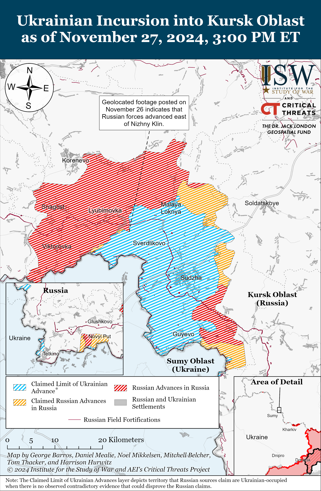
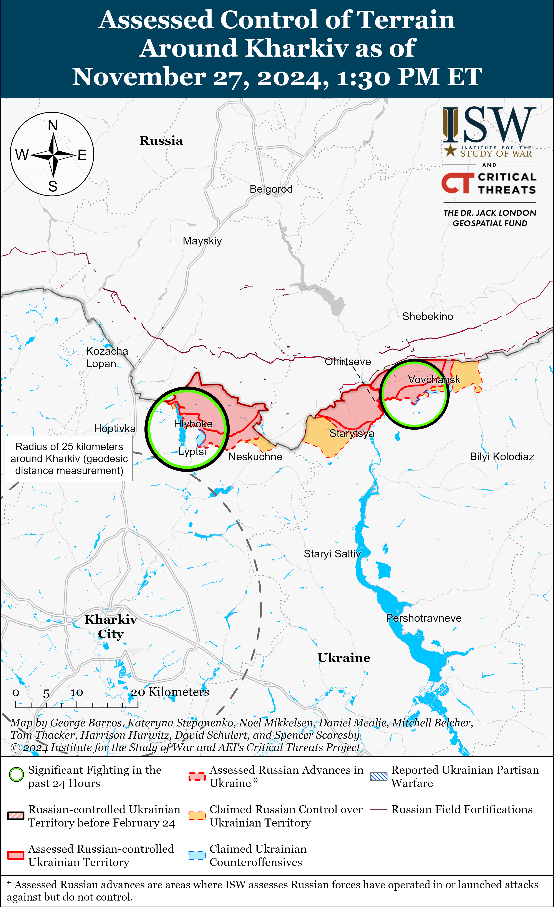
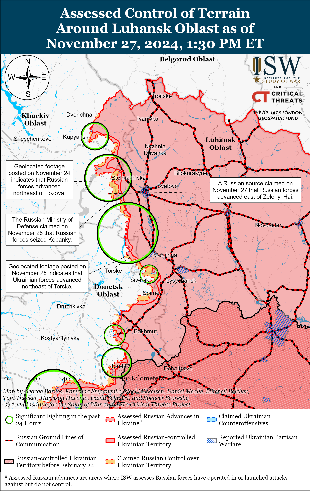
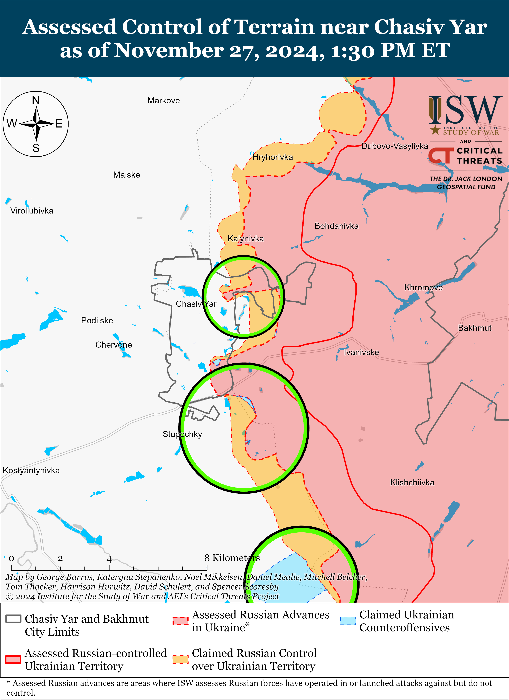
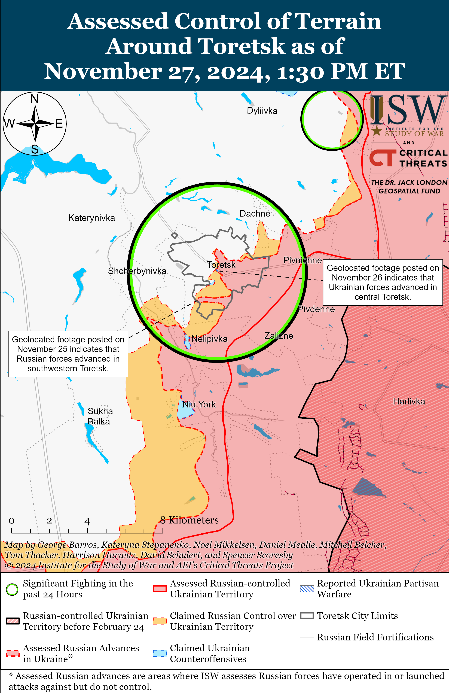
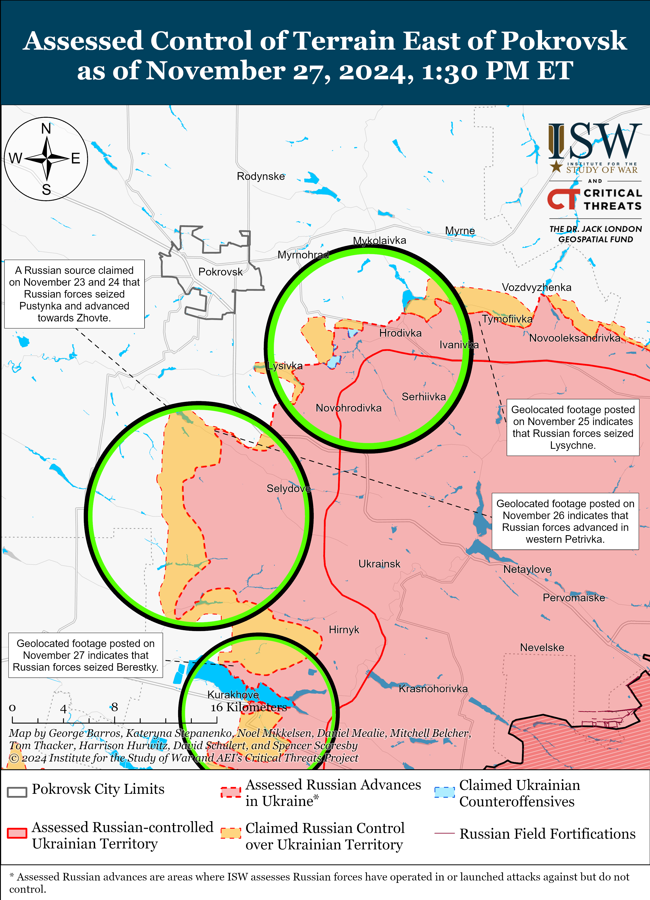
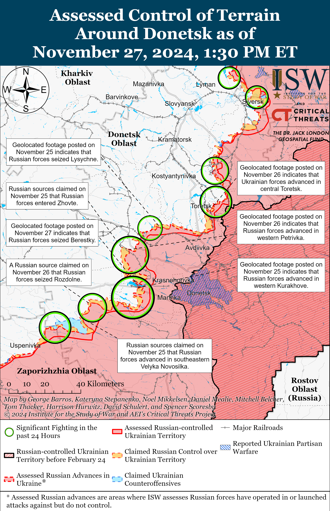
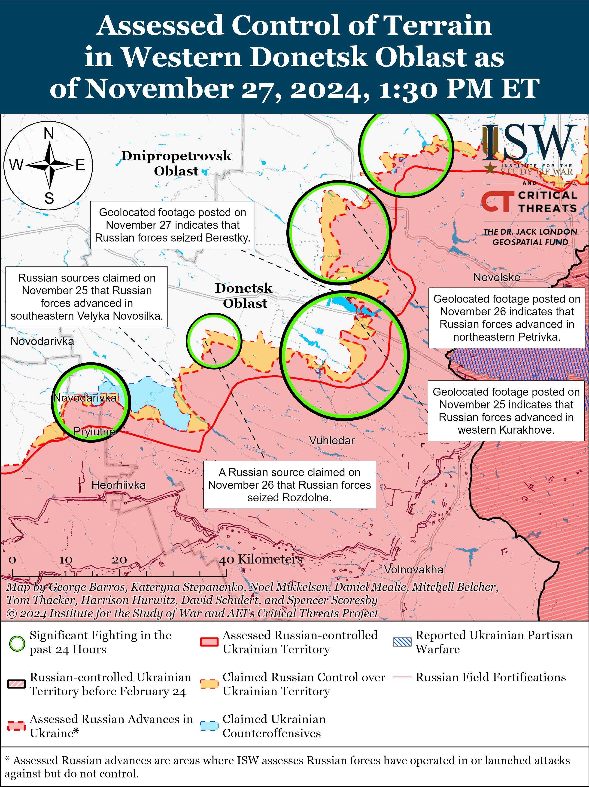
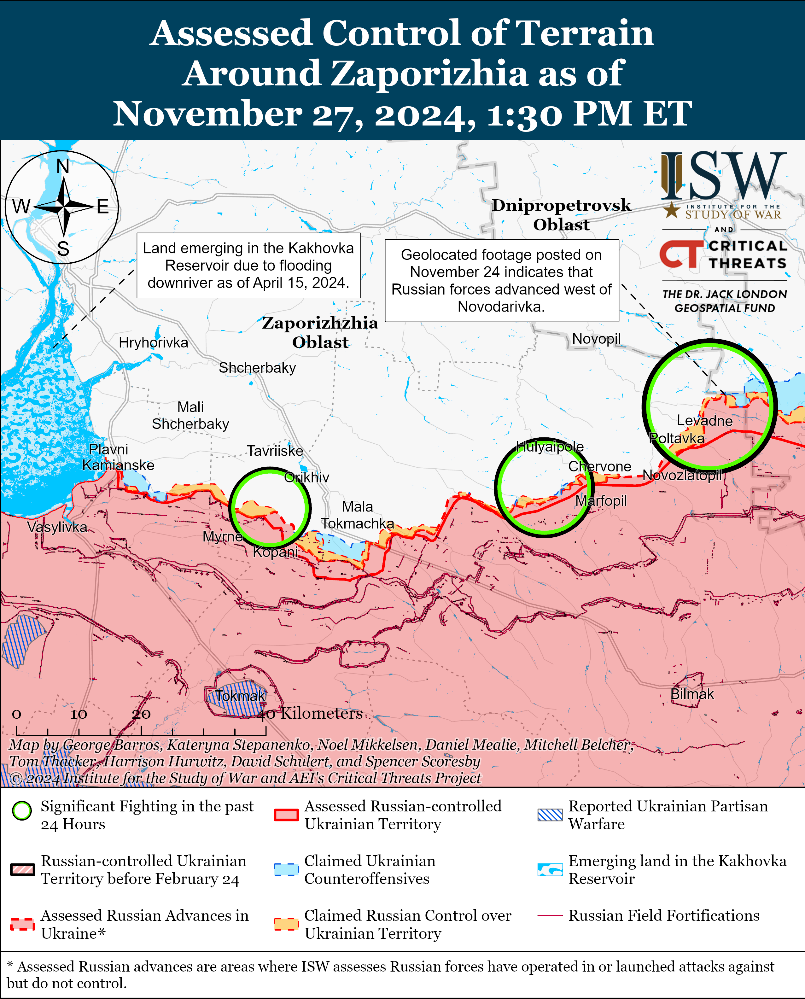
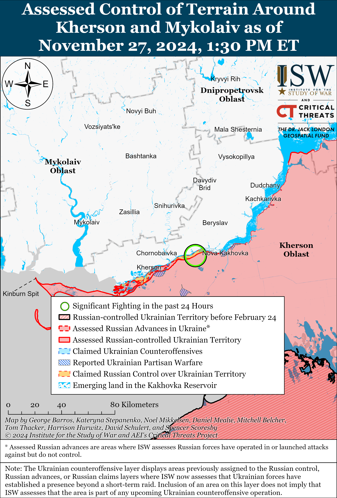

# Russian Offensive Campaign Assessment, November 27, 2024

**Grace Mappes, Kateryna Stepanenko, Nicole Wolkov, Nate Trotter, Olivia Gibson, Angelica Evans, William Runkel, and George Barros**

**November 27, 2024, 6:30 pm ET**

**Click** [**here**](https://storymaps.arcgis.com/stories/36a7f6a6f5a9448496de641cf64bd375) **to see ISW’s interactive map of the Russian invasion of Ukraine. This map is updated daily alongside the static maps present in this report.**

**Click** [**here**](https://understandingwar.maps.arcgis.com/apps/instant/3dviewer/index.html?appid=1602762dbcde419bb957dea358449580) **to see ISW’s 3D control of terrain topographic map of Ukraine. Use of a computer (not a mobile device) is strongly recommended for using this data-heavy tool.**

**Click** [**here**](https://storymaps.arcgis.com/stories/733fe90805894bfc8562d90b106aa895) **to access ISW’s archive of interactive time-lapse maps of the Russian invasion of Ukraine. These maps complement the static control-of-terrain map that ISW produces daily by showing a dynamic frontline. ISW will update this time-lapse map archive monthly.**

**Note: The data cut-off for this product was 12:30pm ET on November 27.**

**Note: ISW will not be releasing an assessment tomorrow, November 28, in celebration of Thanksgiving.**

**Ukrainian forces continue to leverage Western-provided weapons to conduct strikes using more complex strike packages against military objects in Russia’s deep rear.[1]** Russian and local Crimean sources claimed that Ukrainian forces conducted a complex drone and missile strike against occupied Sevastopol on November 27, reportedly using Neptune anti-ship missiles, modified S-200 air defense missiles, unspecified ballistic missiles, Western-provided Storm Shadow missiles, and 40 strike drones.[2] The Russian Ministry of Defense (MoD) claimed that Russian forces intercepted 25 Ukrainian drones over occupied Crimea and the Black Sea.[3] Russian sources claimed that Ukrainian forces targeted the Nakhimov Higher Naval School in occupied Sevastopol and the nearby Belbek Airfield, and an image published on November 27 shows a smoke plume reportedly near the naval school.[4] Russian sources denied reports that the strike damaged the school, however.[5] Ukrainian official military sources have not commented on this strike at the time of this report’s publication. ISW continues to assess that the provision of long-range strike weapons to Ukrainian forces will allow Ukrainian forces to augment their existing long-range strike capabilities and scale up the effects Ukraine can generate through long-range strikes against Russian rear areas.[6]

**Russian President Vladimir Putin and Kazakh President Kassym-Jomart Tokayev met in Astana on November 27 and signed a joint statement deepening the Russian-Kazakh strategic partnership within the framework of Russia’s efforts to establish a “new world order.”[7]** Putin and Tokayev signed 19 other documents deepening Russian-Kazakh political, economic, energy, and transit cooperation.[8] The Kremlin likely intends to deepen economic and transit relations with Kazakhstan, in part, to continue to leverage Kazakhstan as key intermediary to facilitate sanctions evasion schemes.[9] Putin also published an article in Kazakh state-backed newspaper *Kazakhstanskaya Pravda* on November 27 emphasizing the strength of the Russian-Kazakh relationship largely in the same style as Putin’s previous articles published in the state-backed newspapers of other states during bilateral visits.[10] Putin and Tokayev also agreed to expand Russian educational institutions and Russian language institutions in Kazakhstan, likely as part of an ongoing effort to expand Russian soft power influence in countries previously colonized by the Russian Empire and Soviet Union.[11] Putin notably did not mention the war in Ukraine in his article, during his meeting with Tokayev, or in the package of the signed documents, likely omitting any mention of the war in order to posture Russia as an economically stable and viable partner ahead of the Collective Security Treaty Organization (CSTO) summit in Astana on November 28.

**The Russian military command may have imposed controversial restrictions on the use of personal vehicles by Russian volunteers delivering military and humanitarian aid to Russian troops on the frontlines, likely as part of an ongoing force centralization effort.** A prominent Russian milblogger claimed that overnight on November 26 and 27 many Russian milbloggers received audio messages in which the Russian military command threatened all servicemembers to stop using personal vehicles that are not registered for military operations in the combat zone.[12] The audio message reportedly revealed that Russian commanders will punish servicemembers caught using personal vehicles by sending the servicemembers to fight as part of an assault group alongside any frontline commanders who authorized the use of private vehicles. The milblogger claimed that there are claims that the new Southern Military District (SMD) commander, likely referring to reportedly recently appointed Lieutenant General Alexander Sanchik, issued the order but did not confirm or deny these claims.[13] The milblogger noted that the order will effectively allow the Russian military command to stop and confiscate any private vehicles belonging to volunteers delivering humanitarian aid and to commit the drivers and their commanders to frontline assaults as a punishment for violating the order. The milblogger noted that the timing and the harshness of this order may suggest that the order is fake, possibly in an effort to allow the Russian military command to later reverse its order and appear responsive to public outcry. Other Russian milbloggers complained that the order will severely impact the community of Russian volunteers that evacuate troops and deliver military and humanitarian supplies to the frontline and warned that the Russian Ministry of Defense’s (MoD) efforts to centralize humanitarian aid deliveries to Russian servicemembers will result in supply and provision shortages among frontline units.[14] The Russian military command had been trying to restrict the use of personal vehicles personal and certain personal electronic devices in the combat zone and set stricter guidelines for the grooming standards of men on the frontlines since January 2023 in a likely attempt to centralize control over Russian forces.[15]

**Key Takeaways:**

- **Ukrainian forces continue to leverage Western-provided weapons to conduct strikes using more complex strike packages against military objects in Russia’s deep rear.**
- **Russian President Vladimir Putin and Kazakh President Kassym-Jomart Tokayev met in Astana on November 27 and signed a joint statement deepening the Russian-Kazakh strategic partnership within the framework of Russia’s efforts to establish a “new world order.”**
- **The Russian military command may have imposed controversial restrictions on the use of personal vehicles by Russian volunteers delivering military and humanitarian aid to Russian troops on the frontlines, likely as part of an ongoing force centralization effort.**
- **Ukrainian forces recently advanced within Toretsk, and Russian forces recently advanced in the Pokrovsk and Kurakhove directions, and within the main Ukrainian salient in Kursk Oblast.**
- **The Kremlin continues to promote the “Time of Heroes” program that aims to militarize the Russian government at the local, regional, and federal levels as a way to prevent the return of “Afghan syndrome” in Russia.**

***We do not report in detail on Russian war crimes because these activities are well-covered in Western media and do not directly affect the military operations we are assessing and forecasting. We will continue to evaluate and report on the effects of these criminal activities on the Ukrainian military and the Ukrainian population and specifically on combat in Ukrainian urban areas. We utterly condemn Russian violations of the laws of armed conflict and the Geneva Conventions and crimes against humanity even though we do not describe them in these reports.***

- Ukrainian Operations in the Russian Federation
- Russian Main Effort – Eastern Ukraine (comprised of three subordinate main efforts)
- Russian Subordinate Main Effort #1 – Push Ukrainian forces back from the international border with Belgorod Oblast and approach to within tube artillery range of Kharkiv City
- Russian Subordinate Main Effort #2 – Capture the remainder of Luhansk Oblast and push westward into eastern Kharkiv Oblast and encircle northern Donetsk Oblast
- Russian Subordinate Main Effort #3 – Capture the entirety of Donetsk Oblast
- Russian Supporting Effort – Southern Axis
- Russian Air, Missile, and Drone Campaign
- Russian Mobilization and Force Generation Efforts
- Russian Technological Adaptations
- Activities in Russian-occupied areas
- Significant Activity in Belarus

**Ukrainian Operations in the Russian Federation**

Russian forces recently advanced amid continued offensive operations in Kursk Oblast on November 27. Geolocated footage published on November 26 shows that Russian forces, reportedly elements of the Russian 104th Airborne (VDV) Regiment (76th VDV Division), advanced east of Nizhny Klin (southeast of Korenevo) during a roughly platoon-sized mechanized assault.[16] Russian milbloggers claimed that Russian forces also advanced near Darino (immediately southwest of Nizhny Klin) and that Ukrainian forces also counterattacked in the area.[17] Elements of the Russian 106th VDV Division continue operating in Kursk Oblast, and its 51st VDV Regiment is reportedly conducting clearing operations near Darino and Nizhny Klin and elements of its 137th and 119th VDV regiments are reportedly conducting clearing operations and striking Ukrainian positions elsewhere in Kursk Oblast.[18] Elements of the Russian 810th Naval Infantry Brigade (Black Sea Fleet [BSF]), 44th Army Corps [AC] (Leningrad Military District [LMD]), Rosgvardia Spetsnaz, and possibly elements of the 56th VDV Regiment (7th VDV Division) are reportedly operating in Kursk Oblast.[19]

Geolocated footage published on November 26 shows a Ukrainian glide bomb strike, reportedly using French-provided Hammer bombs, against a reported Russian Federal Security Service (FSB) border guard outpost in Tetkino, Kursk Oblast (along the international border).[20]

**Russian Main Effort – Eastern Ukraine**

**Russian Subordinate Main Effort #1 – Kharkiv Oblast** **(Russian objective: Push Ukrainian forces back from the international border with Belgorod Oblast and approach to within tube artillery range of Kharkiv City)**

Russian forces continued assaults northeast of Kharkiv City near Vovchansk and Tykhe (east of Vovchansk) on November 26 and 27 but did not make any confirmed advances.[21] Russian milbloggers claimed on November 27 that Russian forces advanced across the international border north of Kharkiv City near Hraniv, Kozacha Lopan, and Prudyanka toward Slatyne (just west of the Russian salient in northern Kharkiv Oblast) and that Ukrainian forces counterattacked north of Kharkiv City near Lyptsi and Hlyboke.[22] ISW has not observed visual confirmation of these claims, however. A Ukrainian brigade’s planning department head reported on November 27 that Ukrainian forces recently recaptured positions near Lyptsi and are attempting to consolidate these positions to advance further in the area despite worsening weather conditions interfering with drone and infantry operations in Kharkiv Oblast.[23] Elements of the Russian “Udaya” Drone Group are reportedly operating in the Kharkiv direction.[24]

**Russian Subordinate Main Effort #2 – Luhansk Oblast** **(Russian objective: Capture the remainder of Luhansk Oblast and push westward into eastern Kharkiv Oblast and northern Donetsk Oblast)**

Russian forces continued offensive operations along the Kupyansk-Svatove-Kreminna line on November 27. Russian milbloggers claimed that Russian forces marginally advanced near Dvorichna (north of Kupyansk) on November 27 and that fighting continues on the outskirts of the settlement.[25] Russian sources also claimed that Russian forces continue efforts to advance across the Oskil River near Novomlynsk (north of Kupyansk) and are attacking southeast of Kupyansk near Kolisnykivka and Kruhlyakivka.[26] One milblogger claimed that Russian forces have seized the eastern portion of Kupyansk itself, although ISW has only observed evidence of Russian gains along a narrow salient in eastern Kupyansk.[27] A Ukrainian brigade spokesperson operating in the Kupyansk direction reported on November 27 that Russian forces’ operational objective in this direction is to cross the Oskil River, but that Ukrainian counterstrikes are inhibiting Russian mechanized assaults in this direction and forcing Russian troops to rely on infantry.[28] Russian milbloggers claimed that Ukrainian forces are counterattacking recently-seized Russian positions near Kopanky (west of Svatove).[29] Geolocated footage published on November 26 shows that Russian forces conducted an unsuccessful platoon-sized mechanized assault east of Torske (west of Kreminna) and that Russian forces did not advance during the assault.[30] The chief of staff of a Ukrainian brigade operating in the Lyman (west of Kreminna) direction reported that the Russian forces operating in this direction are unfamiliar with the terrain and are arriving to the frontline directly from training.[31] The Ukrainian General Staff reported on November 26 and 27 that Russian forces continued offensive operations northeast of Kupyansk near Synkivka; southeast of Kupyansk near Kolisnykivka, Zahryzove, and Kruhlyakivka; south of Kupyansk near Senkove; west of Svatove near Zelenyi Hai, southwest of Svatove near Andriivka, Hrekivka, Novoyehorivka, Druzhkivka, Makiivka, Cherneshchyna; west of Kreminna near Torske; south of Kreminna near Hryhorivka; and southwest of Kreminna near the Serebryanske forest area.[32] Assault troops and reconnaissance elements of the Russian 144th Motorized Rifle Division (20th Combined Arms Army [CAA], Moscow Military District [MMD]) are reportedly operating north and east of Terny (northwest of Kreminna).[33]

**Russian Subordinate Main Effort #3 – Donetsk Oblast** **(Russian objective: Capture the entirety of Donetsk Oblast, the claimed territory of Russia’s proxies in Donbas)**

Russian forces continued offensive operations northeast of Siversk near Hryhorivka on November 26 and 27 but did not make any confirmed advances.[34]

Russian forces continued offensive operations in the Chasiv Yar direction on November 27 but did not make any confirmed advances. A Russian milblogger claimed on November 27 that Russian forces advanced into a forested area northwest of Kurdyumivka (south of Chasiv Yar).[35] ISW has not observed confirmation of this claim, however. Russian forces continued offensive operations within Chasiv Yar and south of Chasiv Yar near Bila Hora, Stupochky, Predtechyne, and Dyliivka.[36] Ukrainian Khortytsia Group of Forces Spokesperson Lieutenant Colonel Nazar Voloshyn stated that Russian forces have mined and fortified Bakhmut and that elements of the Russian 98th Airborne (VDV) Division and Russian 3rd Army Corps [AC] are using the settlement as a logistics hub for ammunition, equipment, and fuel depots.[37] Elements of the Russian 98th VDV Division and drone operators of the Russian ”Okhotnik” (Hunter) Spetsnaz Detachment (51st Combined Arms Army [CAA], formerly 1st Donetsk People’s Republic [DNR] AC) are operating near Chasiv Yar.[38] Elements of the Russian 78th ”Sever-Akhmat” Motorized Rifle Regiment (42nd Motorized Rifle Division, 58th Combined Arms Army [CAA], Southern Military District [SMD]) are reportedly operating in Ivanivske.[39]

Ukrainian forces recently regained positions in Toretsk amid continued Russian offensive operations in the Toretsk direction on November 27. Geolocated footage published on November 26 indicates that Ukrainian forces recently regained positions within central Toretsk.[40] A Ukrainian battalion commander operating in the Toretsk direction stated on November 27 that Russian forces in the area are suffering roughly 100 casualties per day and that Russian forces regularly change their direction and method of attack in an attempt to penetrate Toretsk from the flanks.[41] The Ukrainian General Staff reported that Russian forces conducted offensive operations near Toretsk itself; northeast of Toretsk near Dyliivka; and west of Toretsk near Shcherbynivka on November 26 to 27.[42]

Russian forces recently marginally advanced southeast and south of Pokrovsk amid continued offensive operations in this direction on November 27. Geolocated footage published on November 26 indicates that Russian forces recently marginally advanced west of Krutyi Yar (southeast of Pokrovsk) and in western Petrivka (south of Pokrovsk).[43] Several Ukrainian servicemembers stated on November 25 and 26 that Russian forces recently seized Zhovte (south of Pokrovsk and northwest of Selydove) and are advancing along the railway line north of the settlement.[44] Russian milbloggers claimed that Russian forces operating south of Pokrovsk are advancing towards Pushkine and Ukrainka with armored vehicle support and northwest of Selydove towards Dachenske (northeast of Zhovte) from Lysivka (just northeast of Dachenske).[45] One Russian milblogger claimed that Russian forces are advancing in an area up to 2.14 kilometers wide between Zhovte and Petrivka (east of Zhovte) and in an area up to 2.35 kilometers wide and 1.2 kilometers in depth west of Novooleksiivka (south of Pokrovsk and west of Selydove).[46] ISW has not observed visual confirmation of these claims, however. One of the Ukrainian servicemembers noted that Russian forces are mainly relying on foot infantry to advance near Zhovte, but suggested that Russian forces are using wheeled vehicles to support assaults near Pushkine (south of Zhovte).[47] A representative of a Ukrainian brigade operating in the Pokrovsk direction noted that Russian attacks remain very intense and that Russian forces have a manpower advantage in this direction.[48] Ukrainian military observer Kostyantyn Mashovets stated on November 27 that elements of the Russian 2nd CAA (Central Military District [CMD]), including its 27th Motorized Rifle Division, and the 90th Tank Division (CMD) are attacking along the Novotroitske-Ukrainka (southwest of south of Pokrovsk) line to complicate Ukraine’s defense in Pokrovsk and along in the pocket north of the Kurakhivske Reservoir.[49] Russian forces continued assaults east of Pokrovsk near Myrolyubivka and Promin; southeast of Porkovsk near Lysivka and Krasnyi Yar; and south of Pokrovsk near Dachenske, Zhovte, Chumatske, Pustynka, and Novyi Trud on November 26 and 27.[50] A Russian milblogger claimed that Ukrainian forces are counterattacking near Zhovte.[51]

Russian forces continued offensive operations in the Vuhledar direction on November 27 but did not make any confirmed advances. Russian milbloggers claimed that Russian forces advanced north of Yasnya Polyana (northwest of Vuhledar), south of Romanivka (northeast of Vuhledar), and east of Veselyi Hai (north of Vuhledar).[60] Russian sources claimed that Russian forces seized two forested areas near Yelyzavetivka and are clearing Illinka and Romanivka (all northeast of Vuhledar).[61] ISW has not observed evidence of these claims, however. Russian forces continued attacking northeast of Vuhledar near Romanivka, Yelyzavetivka, Katerynivka, and Antonivka; north of Vuhledar near Hannivka and Veselyi Hai; and northwest of Vuhledar near Sukhi Yaly, Trudove, Uspenivka, Rozlyv, and Kostyantynopolske on November 26 and 27.[62] Mashovets stated on November 27 that elements of the Russian 36th Motorized Rifle Brigade (29th CAA, Eastern Military District [EMD]), 37th Motorized Rifle Brigade (36th CAA, EMD), 5th Tank Brigade (36th CAA, EMD), 40th Naval Infantry Brigade (Pacific Fleet, EMD), and 336th Naval Infantry Brigade (Baltic Fleet, Leningrad Military District [LMD]) are attempting to bypass Ukrainian defenses north and northwest of Vuhledar along the Uspenivka-Velyka Novosilka line.[63] Mashovets also stated that Russian forces are using two assault groups composed of the elements of the 8th CAA and 39th Motorized Rifle Brigade (68th Army Corps [AC], EMD) to pin Ukrainian forces south of Kurakhove. A Russian milblogger claimed that drone operators of the Russian “Gnom” Drone Detachment are reportedly operating in the Vuhledar direction.[64]

Russian forces continued offensive operations in the Donetsk-Zaporizhia Oblast border are on November 27 but did not make any confirmed advances. Russian milbloggers claimed that Russian forces seized Rozdolne (northeast of Velyka Novosilka) and advanced within southeastern Velyka Novosilka, although ISW has not observed visual confirmation of this claim.[65] Russian forces reportedly operated an unmanned ground vehicle (UGV) that entered eastern Velyka Novosilka.[66] Russian forces continued attacking near Velyka Novosilka itself, northeast of Velyka Novosilka near Rozdolne, and southwest of Velyka Novosilka near Rivnopil and Novodarivka on November 26 and 27.[67] Mashovets stated that elements of the Russian 29th and 36th CAAs (EMD) are operating in the Velyka Novosilka and Rozdolne areas.[68]

**Russian Supporting Effort – Southern Axis** **(Russian objective: Maintain frontline positions and secure rear areas against Ukrainian strikes)**

Russian forces continued offensive operations in western Zaporizhia Oblast on November 27 but did not make any confirmed advances. Footage published on November 27 shows Ukrainian forces repelling a Russian squad-sized foot mobile assault in an unspecified area in the Zaporizhia direction on an unspecified date.[69] Ukrainian military sources continue to warn that Russian forces are preparing to increase the volume and intensity of assaults in preparation of a potential offensive operation in the Zaporizhia direction and are therefore accumulating manpower and equipment in various separate directions.[70] Elements of the Russian 7th Airborne (VDV) Division reportedly continue to operate in the Zaporizhia direction.[71]

The Ukrainian General Staff that Russian forces continued offensive operations in the Dnipro direction in east (left) bank Kherson Oblast on November 26 and 27.[72] Ukrainian Tavriisk Group of Forces Spokesperson Colonel Vladyslav Voloshyn reported that Russian forces are training near the Antonivskyi Bridge (on the left bank of the Dnipro River), Kozatskyi Island (northeast of Kherson City near Nova Kakhovka), and Kruhlyk Island (southwest of Kherson City), as well as conducting reconnaissance operations with squads of 10 to 15 people to locate Ukrainian firing positions in the Dnipro direction, including on the islands near Kherson City.[73] Voloshyn further noted that Russian forces want to establish a bridgehead on the west (right) bank of the Dnipro River to pin Ukrainian forces in the area and strike Kherson City and settlements located on the right bank.

**Russian Air, Missile, and Drone Campaign** **(Russian Objective: Target Ukrainian military and civilian infrastructure in the rear and on the frontline)**

Russian forces conducted a series of drone strikes against Ukraine on the night of November 26 to 27. The Ukrainian Air Force reported that Russian forces launched 89 Shahed drones and other unspecified drones, possibly referring to decoy drones, from Primorsko-Akhtarsk, Krasnodar Krai and Oryol, Bryansk, and Kursk oblasts and that Ukrainian forces downed 36 drones over Kyiv, Chernihiv, Sumy, Kharkiv, Poltava, Zhytomyr, Khmelnytskyi and Mykolaiv oblasts.[74] The Ukrainian Air Force reported that 48 drones became ”locally lost,” likely due to Ukrainian electronic warfare (EW) interference, and that five drones flew into Russian, Belarusian, and occupied Ukrainian airspace. Ukrainian officials reported on November 26 and 27 that falling debris from drones targeting Kyiv City and Oblast damaged civilian and residential infrastructure objects and that Russian forces launched drone strikes targeting Cherkasy City and Oblast.[75] Ukraine’s Southern Operational Command reported that Russian forces launched one Iskander-M ballistic missile from occupied Crimea towards Odesa Oblast in the afternoon on November 26.[76] Russian milbloggers claimed on November 27 that Russian forces successfully struck a Ukrainian Operational-Tactical Missile System (OTRK) Hrim-2 short range ballistic missile system for the first time with an Iskander-M ballistic missile near Novomykolaivka, Odesa Oblast.[77] ISW cannot independently confirm this claim.

Ternopil Oblast Military Administration Head Vyacheslav Nehoda stated on November 27 that a Russian drone strike on energy infrastructure in Ternopil Oblast on November 26 caused power outages throughout Ternopil Oblast and that the energy supply situation in Ternopil Oblast remains critical.[78]

*Reuters* reported on November 26 that two unspecified senior Ukrainian government officials stated that the Russian Oreshnik ballistic missile that struck Dnipro City on November 21 carried multiple warheads without any explosives and caused minimal damage.[79]

Russia is reportedly bombing Ukraine with aircraft purchased from Ukraine in the 1990s. *Radio Svoboda’s* investigative branch *Skhemy* reported on November 27 that Ukraine traded six Tu-160 bomber aircraft to Russia in 1999 in exchange for $275 million in debt relief for Russian gas purchases.[80]

**Russian Mobilization and Force Generation Efforts** **(Russian objective: Expand combat power without conducting general mobilization)**

The Kremlin continues to promote the “Time of Heroes” program that aims to militarize the Russian government at the local, regional, and federal levels as a way to prevent the return of “Afghan syndrome” – a term used to describe a period in Russian history when Soviet veterans began to return from Afghanistan and turned to organized crime in 1990s – in Russia. Kremlin newswire *TASS* published an interview with the first “Time of Heroes” veteran to be appointed to a federal level position, Russian Presidential Plenipotentiary Representative to the Ural Federal Okrug Artyom Zhoga, on November 27.[81] *TASS* attempted to favorably portray Zhoga as a down-to-earth veteran from occupied Donetsk Oblast who was one of 83 individuals selected to participate in the “Time of Heroes” program of 44,000 applicants. Zhoga notably implied that the “Time of Heroes” will allow Russia to avoid “Afghan syndrome.”[82] Zhoga expressed confidence that “Afghan syndrome” will not impact Russian veterans returning from Ukraine and that Russia will continue to engage returning veterans via the “Time of Heroes” program to ensure that these veterans work in government structures and large corporations. Russian officials have expressed concerns about the return of “Afghan syndrome” since late 2022, with Russian Federation Council Speaker Valentina Matviyenko stressing that the Russian government needs to make concerted efforts to reintegrate veterans into civilian life in December 2022.[83] ISW had previously reported on numerous instances of Russian veterans, many of whom have a prior criminal past, committing crimes upon their return from the frontlines in Ukraine.[84] Russian President Vladimir Putin had made numerous promises to the Russian society throughout the course of his presidency that Russia will not return to the economic and social despair of the 1990s, and the widespread promotion of the “Time of Heroes” program is likely aimed at reassuring the Russian public and preventing societal backlash against Russia’s full-scale invasion of Ukraine.[85]

The Russian Ministry of Defense (MoD) is reportedly recommitting Russian prisoners of war (POWs) recently released from Ukrainian captivity to the frontlines in Ukraine. Russian independent outlet *Vazhnye Istrorii* (*iStories)* reported on November 27 that a released Russian POW filed a motion against the Russian MoD’s decision to deploy him to the frontlines.[86] *iStories* noted that the Russian MoD is using a loophole in the Geneva Convention, which does not mention the possibility of POW exchanges before the end of hostilities, to recommit released POWs to the frontlines. The Russian MoD also reportedly uses Putin’s decree announcing partial mobilization on September 21, 2022, to justify the use of returned POWs in combat as the decree does not name the return from captivity as grounds for dismissal from mobilization.[87]

Russian regional authorities are continuing to increase financial incentives to recruit additional volunteers to fight in Ukraine. The Nizhny Novgorod Oblast government is offering Russian volunteers a one-time enlistment bonus of three million rubles (about $26,500), a certificate for 10 acres of land, and a monthly salary from 210,000 rubles ($1,856).[88] Ulyanovsk Oblast Governor Alexei Russkih announced on November 26 that the regional government increased increase its one-time enlistment bonus to 2.5 million rubles (about $22,000) to meet the requested recruitment quota of 900 troops before the end of 2024.[89]

Russian defense industrial base (DIB) enterprises are reportedly facing significant personnel and specialist shortages that may impact Russian DIB capacity. Chairman of the Russian State Duma Committe on Control and United Russia Deputy Oleg Morozov announced on November 27 that in the near future Russian will have a shortage of roughly 400,000 Russian DIB specialists due to the deficit of engineering specialists over the last decade.[90] Russian First Deputy Prime Minister Denis Manturov previously announced in June 2024 that Russia’s DIB specialist shortage amounted to 160,000 people.[91]

The Russian “Elektropribor” plant in Vladimir Oblast is reportedly 2.5 years behind on satisfying its contracts with the Russian Ministry of Defense (MoD) on development and production of the “Tirada-2.3” satellite jamming system.[92] A Russian insider source claimed that Russian officials falsely claimed that the “Tirada-2.3” had already been jamming Ukrainian satellite signals since 2022, whereas the Russian military only partially deployed the system in Summer 2023 due to delayed production.

**Russian Technological Adaptations** **(Russian objective: Introduce technological innovations to optimize systems for use in Ukraine)**

Nothing significant to report.

**Activities in Russian-occupied areas** **(Russian objective: Consolidate administrative control of annexed areas; forcibly integrate Ukrainian citizens into Russian sociocultural, economic, military, and governance systems)**

*ISW is not publishing coverage of activities in Russian-occupied areas today.*

**Significant activity in Belarus** **(Russian efforts to increase its military presence in Belarus and further integrate Belarus into Russian-favorable frameworks and Wagner Group activity in Belarus)**

Belarusian President Alexander Lukashenko and Belarusian military officials continue to foster military cooperation and diplomatic relations with other states. Lukashenko met with Pakistani Chief of the General Staff General Asim Munir and with the family of Pakistani Prime Minister Mian Muhammad Shehbaz Sharif while in Pakistan on November 27.[93] Belarusian Logistics Chief of Staff Major General Alexander Mosolov met with his Vietnamese counterpart Major General Pham Manh Cuong in Vietnam.[94] A Qatari military delegation met with Belarusian military officials in Minsk on November 26, discussed military cooperation, and visited a Belarusian air defense installation.[95]  
   
 The Belarusian Industry Ministry reported on November 27 that over 10,000 Belarusian and Russian industrial enterprises are currently jointly producing goods and delivering raw materials.[96]

**Note: ISW does not receive any classified material from any source, uses only publicly available information, and draws extensively on Russian, Ukrainian, and Western reporting and social media as well as commercially available satellite imagery and other geospatial data as the basis for these reports. References to all sources used are provided in the endnotes of each update.**

[1] https://isw.pub/UkrWar112024

[2] https://t.me/vrogov/18113; https://t.me/dva\_majors/58692; https://t.me/dva\_majors/58697; https://t.me/treugolniklpr/72315; https://t.me/milinfolive/135961; https://t.me/astrapress/69295; https://t.me/rusich\_army/18818; https://t.me/rusich\_army/18829

[3] https://t.me/tass\_agency/287590

[4] https://t.me/Crimeanwind/70603 ; https://t.me/Crimeanwind/70644; https://x.com/GirkinGirkin/status/1861670303736230348; https://t.me/boris\_rozhin/145771; https://t.me/rusich\_army/18829; https://t.me/andriyshTime/29933;

[5] https://t.me/Crimeanwind/70644; https://t.me/dva\_majors/58706; https://t.me/boris\_rozhin/145780; https://t.me/southtower/12087; https://t.me/razvozhaev/8962

[6] https://understandingwar.org/backgrounder/russian-offensive-campaign-assessment-november-20-2024

[7] http://kremlin dot ru/supplement/6231

[8] http://kremlin dot ru/supplement/6231

[9] https://understandingwar.org/backgrounder/russian-offensive-campaign-assessment-march-26-2024 ; https://thediplomat.com/2023/10/how-kazakhstan-helps-russia-bypass-western-sanctions/ ; https://eurasianet.org/perspectives-central-asian-states-walking-fine-line-on-russian-sanctions

[10] http://kremlin dot ru/events/president/news/75671; https://t.me/MID\_Russia/48795; https://tass dot ru/politika/22505407; https://understandingwar.org/backgrounder/russian-offensive-campaign-assessment-june-19-2024 ; https://understandingwar.org/backgrounder/russian-offensive-campaign-assessment-june-18-2024 ; https://nhandan dot vn/nga-va-viet-nam-tinh-huu-nghi-duoc-thu-thach-qua-thoi-gian-post814950.html; https://ru.nhandan dot vn/rossija-i-v-etnam-druzhba-proverennaja-vremenem-post46636.html; http://www.kremlin dot ru/events/president/news/74317; http://www.kremlin dot ru/events/president/news/74317

[11] http://kremlin dot ru/events/president/news/75684

[12] https://t.me/akashevarova/7646

[13] https://understandingwar.org/backgrounder/russian-offensive-campaign-assessment-november-26-2024

[14] https://t.me/Sladkov\_plus/11918 https://t.me/arbat/1930 ; https://t.me/dva\_majors/58704; https://t.me/NeoficialniyBeZsonoV/41759 ; https://t.me/KaskadNerv/3138 https://t.me/vrogov/18112; https://x.com/GirkinGirkin/status/1861652000624046329; https://x.com/GirkinGirkin/status/1861651065470329311

[15] https://understandingwar.org/backgrounder/russian-offensive-campaign-assessment-january-17-2023

[16] https://t.me/creamy\_caprice/7646; https://www.facebook.com/kommander.nord/videos/1083893319665999/ ; https://t.me/ok\_pivnich1/11392; https://t.me/creamy\_caprice/7646; https://www.facebook.com/kommander.nord/videos/1083893319665999/; https://t.me/ok\_pivnich1/11392; https://mil.in dot ua/uk/news/zbrojni-syly-ukrayiny-vidbyly-mehanizovanyj-shturm-na-kurshhyni/

[17] https://t.me/dva\_majors/58683; https://t.me/rusich\_army/18812

[18] https://t.me/rusich\_army/18812

[19] https://t.me/RVvoenkor/81430; https://t.me/boris\_rozhin/145732; https://t.me/mod\_russia/46234; https://t.me/DnevnikDesantnika/19945; https://t.me/tass\_agency/287527

[20] https://t.me/soniah\_hub/7806;

[21] https://www.facebook.com/GeneralStaff.ua/posts/pfbid0RprevveXDBpmXRqrchCqnmRtsUCb8qDxcDc7b7AnBzWaaih2iGzrBiZ1Mp7eALbkl ; https://www.facebook.com/GeneralStaff.ua/posts/pfbid07mK94wEJHqEc6waKnrSqgxaT6cvNj5N54eDbuWab85rKNgjzktHDKoAzr9bz95Scl ; https://www.facebook.com/GeneralStaff.ua/posts/pfbid0zRHSiLkR8XT6ugbVCtzVuyxcAzbVL6yadUiQt5ay6pJRuKwGasLnpePnu7f6kpKjl ; https://t.me/otukharkiv/2807

[22] https://t.me/Sladkov\_plus/11921 ; https://t.me/dva\_majors/58683

[23] https://armyinform dot com.ua/2024/11/27/brygada-zdijsnyla-pevni-nastupalni-diyi-cze-buv-lyshe-pershyj-etap-na-harkivshhyni-syly-oborony-jdut-vpered/

[24] https://t.me/boris\_rozhin/145748

[25] https://t.me/z\_arhiv/29814; https://t.me/motopatriot/29876; https://t.me/Sladkov\_plus/11921

[26] https://t.me/RVvoenkor/81435;https://t.me/Sladkov\_plus/11921

[27] https://t.me/Sladkov\_plus/11921

[28] https://armyinform dot com.ua/2024/11/27/legshe-vidnovyty-polk-pihoty-nizh-kilka-tankiv-t-90-na-harkivshhyni-vpered-kydayut-zasudzhenyh-i-novomobilizovanyh/; https://www.youtube.com/watch?v=aDXWlQ2K0dM

[29] https://t.me/notes\_veterans/20715; https://t.me/epoddubny/21756; https://t.me/DnevnikDesantnika/19964

[30] https://t.me/WarArchive\_ua/22768; https://t.me/ombr\_63/995

[31] https://armyinform.com dot ua/2024/11/27/vony-ne-rozumiyut-de-znahodyatsya-na-lymanskomu-napryamku-rosiyan-kydayut-v-bij-odrazu-pislya-poligonu/; https://youtu.be/qS-DnDxds80

[32] https://www.facebook.com/GeneralStaff.ua/posts/pfbid0RprevveXDBpmXRqrchCqnmRtsUCb8qDxcDc7b7AnBzWaaih2iGzrBiZ1Mp7eALbkl; https://www.facebook.com/GeneralStaff.ua/posts/pfbid07mK94wEJHqEc6waKnrSqgxaT6cvNj5N54eDbuWab85rKNgjzktHDKoAzr9bz95Scl; https://www.facebook.com/GeneralStaff.ua/posts/pfbid0zRHSiLkR8XT6ugbVCtzVuyxcAzbVL6yadUiQt5ay6pJRuKwGasLnpePnu7f6kpKjl; https://www.facebook.com/GeneralStaff.ua/posts/pfbid0zRHSiLkR8XT6ugbVCtzVuyxcAzbVL6yadUiQt5ay6pJRuKwGasLnpePnu7f6kpKjl; https://www.facebook.com/GeneralStaff.ua/posts/pfbid07mK94wEJHqEc6waKnrSqgxaT6cvNj5N54eDbuWab85rKNgjzktHDKoAzr9bz95Scl; https://www.facebook.com/GeneralStaff.ua/posts/pfbid0RprevveXDBpmXRqrchCqnmRtsUCb8qDxcDc7b7AnBzWaaih2iGzrBiZ1Mp7eALbkl

[33] https://t.me/vysokygovorit/18133

[34] https://www.facebook.com/GeneralStaff.ua/posts/pfbid07mK94wEJHqEc6waKnrSqgxaT6cvNj5N54eDbuWab85rKNgjzktHDKoAzr9bz95Scl; https://www.facebook.com/GeneralStaff.ua/posts/pfbid0zRHSiLkR8XT6ugbVCtzVuyxcAzbVL6yadUiQt5ay6pJRuKwGasLnpePnu7f6kpKjl

[35] https://t.me/DnevnikDesantnika/19947

[36] https://www.facebook.com/GeneralStaff.ua/posts/pfbid0RprevveXDBpmXRqrchCqnmRtsUCb8qDxcDc7b7AnBzWaaih2iGzrBiZ1Mp7eALbkl; https://www.facebook.com/GeneralStaff.ua/posts/pfbid07mK94wEJHqEc6waKnrSqgxaT6cvNj5N54eDbuWab85rKNgjzktHDKoAzr9bz95Scl; https://www.facebook.com/GeneralStaff.ua/posts/pfbid0zRHSiLkR8XT6ugbVCtzVuyxcAzbVL6yadUiQt5ay6pJRuKwGasLnpePnu7f6kpKjl; https://t.me/DnevnikDesantnika/19946

[37] https://armyinform dot com.ua/2024/11/27/okupanty-peretvoryly-bahmut-na-logistychnyj-hab-u-misti-rozmistyly-sklady-ta-shpytali/; https://www.youtube.com/watch?v=j5TqaWCCdUg

[38] https://t.me/DnevnikDesantnika/19945; https://t.me/nm\_dnr/13031

[39] https://t.me/RKadyrov\_95/5259

[40] https://x.com/AudaxonX/status/1861523374255620192; https://t.me/RVvoenkor/81404

[41] https://armyinform dot com.ua/2024/11/27/za-kozhnyj-budynok-kushhyk-ta-napivzrujnovanyj-zalyshok-u-toreczku-byutsya-za-kozhnyj-metr-zemli/; https://www.youtube.com/watch?v=WY8sDvZdWEA

[42] https://www.facebook.com/GeneralStaff.ua/posts/pfbid0RprevveXDBpmXRqrchCqnmRtsUCb8qDxcDc7b7AnBzWaaih2iGzrBiZ1Mp7eALbkl; https://www.facebook.com/GeneralStaff.ua/posts/pfbid07mK94wEJHqEc6waKnrSqgxaT6cvNj5N54eDbuWab85rKNgjzktHDKoAzr9bz95Scl; https://www.facebook.com/GeneralStaff.ua/posts/pfbid0zRHSiLkR8XT6ugbVCtzVuyxcAzbVL6yadUiQt5ay6pJRuKwGasLnpePnu7f6kpKjl

[43] https://x.com/AF\_LABS1/status/1861503096351789400; https://t.me/skalabatalion/451 ; https://t.me/creamy\_caprice/7642; https://t.me/DeepStateUA/20776

[44] https://t.me/muchnoyairborne/10956 ; https://t.me/muchnoyairborne/10958 ; https://t.me/RVvoenkor/81398 ; https://t.me/officer\_alex33/4290 ; https://t.me/RVvoenkor/81398

[45] https://t.me/DnevnikDesantnika/19938 ; https://t.me/DnevnikDesantnika/19963 ; https://t.me/DnevnikDesantnika/19987 ; https://t.me/voenkorKotenok/60329 ; https://t.me/voenkorKotenok/60331 ; https://t.me/voenkorKotenok/60337 ; https://t.me/voenkorKotenok/60338

[46] https://t.me/RVvoenkor/81438

[47] https://t.me/officer\_alex33/4290 ; https://t.me/RVvoenkor/81398

[48] https://armyinform dot com.ua/2024/11/27/svoyih-poranenyh-ne-gyduyut-kynuty-rosijski-generaly-ne-zhaliyut-svoyu-zhyvu-sylu-na-pokrovskomu-napryamku/; https://www.youtube.com/watch?v=WY8sDvZdWEA

[49] https://t.me/zvizdecmanhustu/2373 ; https://www.facebook.com/pashtetof/posts/pfbid0cf9CmdzrHNwAn6JeXgcBHHzJP7rebsu88A7A284Dqo6XbAy8sfGTXU1D8v9TjYVKl

[50] https://www.facebook.com/GeneralStaff.ua/posts/pfbid0RprevveXDBpmXRqrchCqnmRtsUCb8qDxcDc7b7AnBzWaaih2iGzrBiZ1Mp7eALbkl ; https://www.facebook.com/GeneralStaff.ua/posts/pfbid07mK94wEJHqEc6waKnrSqgxaT6cvNj5N54eDbuWab85rKNgjzktHDKoAzr9bz95Scl ; https://www.facebook.com/GeneralStaff.ua/posts/pfbid0zRHSiLkR8XT6ugbVCtzVuyxcAzbVL6yadUiQt5ay6pJRuKwGasLnpePnu7f6kpKjl

[51]https://t.me/voenkorKotenok/60337 ; https://t.me/voenkorKotenok/60338

[52] https://t.me/creamy\_caprice/7650?single; https://t.me/mo114rf/79 ; https://t.me/RVvoenkor/81470

[53] https://t.me/DnevnikDesantnika/19987 ; https://t.me/DnevnikDesantnika/19938 ; https://t.me/voenkorKotenok/60331 ; https://t.me/RVvoenkor/81438

[54] https://t.me/DnevnikDesantnika/19938

[55] https://understandingwar.org/backgrounder/russian-offensive-campaign-assessment-november-20-2024 ; https://t.me/mod\_russia/46241

[56] https://t.me/myro\_shnykov/6552 ; https://t.me/RVvoenkor/81412

[57] https://t.me/zvizdecmanhustu/2373

[58] https://www.facebook.com/GeneralStaff.ua/posts/pfbid0RprevveXDBpmXRqrchCqnmRtsUCb8qDxcDc7b7AnBzWaaih2iGzrBiZ1Mp7eALbkl ; https://www.facebook.com/GeneralStaff.ua/posts/pfbid07mK94wEJHqEc6waKnrSqgxaT6cvNj5N54eDbuWab85rKNgjzktHDKoAzr9bz95Scl ; https://www.facebook.com/GeneralStaff.ua/posts/pfbid0zRHSiLkR8XT6ugbVCtzVuyxcAzbVL6yadUiQt5ay6pJRuKwGasLnpePnu7f6kpKjl ; https://t.me/myro\_shnykov/6552 ; https://t.me/RVvoenkor/81412 ; https://t.me/dva\_majors/58683 ; https://t.me/voenkorKotenok/60337 ; https://t.me/voenkorKotenok/60338 ; https://t.me/voenkorKotenok/60329 ; https://ria dot ru/20241126/kurakhovo-1985691482.html; https://t.me/vrogov/18103

[59] https://t.me/RVvoenkor/81409; https://t.me/boris\_rozhin/145750

[60] https://t.me/z\_arhiv/29817 ; https://t.me/z\_arhiv/29820; https://t.me/RVvoenkor/81469

[61] https://t.me/DnevnikDesantnika/19989; https://t.me/vrogov/18106; https://ria dot ru/20241125/spetsoperatsiya-1985668360.html

[62] https://www.facebook.com/GeneralStaff.ua/posts/pfbid0RprevveXDBpmXRqrchCqnmRtsUCb8qDxcDc7b7AnBzWaaih2iGzrBiZ1Mp7eALbkl; https://www.facebook.com/GeneralStaff.ua/posts/pfbid07mK94wEJHqEc6waKnrSqgxaT6cvNj5N54eDbuWab85rKNgjzktHDKoAzr9bz95Scl; https://www.facebook.com/GeneralStaff.ua/posts/pfbid0zRHSiLkR8XT6ugbVCtzVuyxcAzbVL6yadUiQt5ay6pJRuKwGasLnpePnu7f6kpKjl; https://www.facebook.com/GeneralStaff.ua/posts/pfbid0zRHSiLkR8XT6ugbVCtzVuyxcAzbVL6yadUiQt5ay6pJRuKwGasLnpePnu7f6kpKjl; https://www.facebook.com/GeneralStaff.ua/posts/pfbid07mK94wEJHqEc6waKnrSqgxaT6cvNj5N54eDbuWab85rKNgjzktHDKoAzr9bz95Scl; https://www.facebook.com/GeneralStaff.ua/posts/pfbid0RprevveXDBpmXRqrchCqnmRtsUCb8qDxcDc7b7AnBzWaaih2iGzrBiZ1Mp7eALbkl; https://t.me/voenkorKotenok/60331; https://t.me/dva\_majors/58683

[63] https://t.me/zvizdecmanhustu/2373 ; https://www.facebook.com/pashtetof/posts/pfbid0cf9CmdzrHNwAn6JeXgcBHHzJP7rebsu88A7A284Dqo6XbAy8sfGTXU1D8v9TjYVKl

[64] https://t.me/voin\_dv/12016

[65] https://t.me/voenkorKotenok/60310; https://t.me/z\_arhiv/29820 ; https://t.me/vrogov/18117; https://ria dot ru/20241126/spetsoperatsiya-1985702538.html; https://tass dot ru/armiya-i-opk/22494955

[66] https://t.me/boris\_rozhin/145729

[67] https://t.me/voenkorKotenok/60328 ; https://www.facebook.com/GeneralStaff.ua/posts/pfbid0RprevveXDBpmXRqrchCqnmRtsUCb8qDxcDc7b7AnBzWaaih2iGzrBiZ1Mp7eALbkl ; https://www.facebook.com/GeneralStaff.ua/posts/pfbid07mK94wEJHqEc6waKnrSqgxaT6cvNj5N54eDbuWab85rKNgjzktHDKoAzr9bz95Scl ; https://www.facebook.com/GeneralStaff.ua/posts/pfbid0zRHSiLkR8XT6ugbVCtzVuyxcAzbVL6yadUiQt5ay6pJRuKwGasLnpePnu7f6kpKjl ; https://t.me/wargonzo/23368 ;

[68] https://t.me/zvizdecmanhustu/2373

[69] https://t.me/Pivnenko\_NGU/1814; https://suspilne dot media/zaporizhzhia/889561-na-zaporizkomu-napramku-nacgvardijci-zupinili-sprobu-nastupu-armii-rf/

[70] https://armyinform.com dot ua/2024/11/27/vorog-nakopychuye-tehniku-ta-zhyvu-sylu-kombat-brygady-spartan-pro-sytuacziyu-na-zaporizkomu-napryamku/; https://armyinform dot com.ua/2024/11/26/u-sylah-oborony-rozpovily-pro-pidgotovku-voroga-do-shturmiv-na-pivdni/

[71] https://t.me/DnevnikDesantnika/19938

[72] https://www.facebook.com/GeneralStaff.ua/posts/pfbid0zRHSiLkR8XT6ugbVCtzVuyxcAzbVL6yadUiQt5ay6pJRuKwGasLnpePnu7f6kpKjl; https://www.facebook.com/GeneralStaff.ua/posts/pfbid07mK94wEJHqEc6waKnrSqgxaT6cvNj5N54eDbuWab85rKNgjzktHDKoAzr9bz95Scl; https://www.facebook.com/GeneralStaff.ua/posts/pfbid0RprevveXDBpmXRqrchCqnmRtsUCb8qDxcDc7b7AnBzWaaih2iGzrBiZ1Mp7eALbkl

[73] https://suspilne dot media/kherson/888939-gotuutsa-do-sturmovih-dij-malimi-grupami-pihoti-recnik-sil-oboroni-pivdna-pro-situaciu-na-pridniprovskomu-napramku/

[74] https://www.facebook.com/PvKPivden/posts/pfbid02nhficgVecZquQMCo5CbRSPgZ4Bwj3G449J71tP4PD1iWt2AyxVSjz6ubDRFAiyxal ; https://t.me/kpszsu/23661

[75] https://suspilne dot media/888991-pentagon-pidtverdiv-dozvil-na-zastosuvanna-atacms-po-rf-nimeccina-vidilae-dodatkovi-65-mln-1008-den-vijni-onlajn/?anchor=live\_1732692978&utm\_source=copylink&utm\_medium=ps ; https://t.me/KyivCityOfficial/11652 ; https://t.me/KyivCityOfficial/11651 ; https://t.me/vitaliy\_klitschko/3780%20;%20 ; https://t.me/VA\_Kyiv/9702 ; https://t.me/kyivregionpolice/11508 ; https://www.facebook.com/RuslanKravchenkoKyiv/posts/pfbid0YuVDiC6DioPH5ARh3qh1crYwXFGZDGDtiD19x5tF8iSqfyfroWkxV48ztVuE8Khml?ref=embed\_post ; https://meduza dot io/news/2024/11/27/kiev-atakovan-rossiyskimi-bespilotnikami-postradali-dva-cheloveka ; https://suspilne dot media/888991-pentagon-pidtverdiv-dozvil-na-zastosuvanna-atacms-po-rf-nimeccina-vidilae-dodatkovi-65-mln-1008-den-vijni-onlajn/?anchor=live\_1732690648&utm\_source=copylink&utm\_medium=ps ; https://suspilne dot media/888991-pentagon-pidtverdiv-dozvil-na-zastosuvanna-atacms-po-rf-nimeccina-vidilae-dodatkovi-65-mln-1008-den-vijni-onlajn/?anchor=live\_1732692725&utm\_source=copylink&utm\_medium=ps

[76]https://www.facebook.com/PvKPivden/posts/pfbid02nhficgVecZquQMCo5CbRSPgZ4Bwj3G449J71tP4PD1iWt2AyxVSjz6ubDRFAiyxal

[77] https://t.me/DnevnikDesantnika/19962 ; https://t.me/basurin\_e/15719 ; https://t.me/RVvoenkor/81408

[78] https://www.facebook.com/permalink.php?story\_fbid=pfbid02Bt9wnwwFChA2yB16Ki8VgpRbaAcE6GUvdGhAzXieYb3KTNUZxuunZBz832enUXjql&id=61564854669117&rdid=9FN1ZTgcTWAKnL4x; https://suspilne dot media/ternopil/889513-elektropostacanna-oblasti-zalisaetsa-kriticnim-nacalnik-ternopilskoi-ova/

[79] https://www.reuters.com/world/europe/new-russian-missile-fired-ukraine-carried-warheads-without-explosives-sources-2024-11-26/

[80] https://suspilne dot media/chernihiv/889455-sist-tu-160-z-aerodromu-priluk-peredanih-rf-obstriluut-ukrainu-2/; https://www.youtube.com/watch?v=CWCgEppzOdg

[81] https://ugra-news dot ru/article/artyem\_zhoga\_rasskazal\_o\_yugre\_v\_intervyu\_tass/; https://t.me/tass\_agency/287481 ; https://t.me/tass\_agency/287489; https://eadaily dot com/ru/news/2024/11/27/veteranam-svo-ne-grozit-gorkaya-sudba-afgancev-artem-zhoga; https://realtagil dot ru/news/polpred-zhoga-rasskazal-chem-ego-vpechatlili-rabotniki-uvz-v-nizhnem-tagile/ ; https://tass dot ru/interviews/22472337

[82] https://jamestown.org/program/russia-experiencing-a-new-afghan-syndrome-with-soldiers-returning-from-ukraine/

[83] https://jamestown.org/program/russia-experiencing-a-new-afghan-syndrome-with-soldiers-returning-from-ukraine/; https://rg dot ru/2022/12/21/matvienko-rasskazala-kak-izbezhat-afganskogo-sindroma-u-uchastnikov-svo.html

[84] https://www.golosameriki.com/a/wagner-crime/7210280.html; https://verstka dot media/kak-rossijskie-voennye-popadajut-pod-sud-za-ubijstva-sosluzhivcev-i-grazhdanskih

[85] http://en.kremlin dot ru/events/president/news/73585; https://www.trud dot ru/article/04-03-2020/1386977\_putin\_vspomnil\_o\_svoem\_obeschanii\_ne\_povtorit\_krizis\_1998\_goda.html; https://tass dot ru/ekonomika/7895311; https://www.kp dot ru/daily/24201/406717/

[86] https://t.me/istories\_media/8307

[87] https://t.me/ostorozhno\_novosti/31577

[88] https://t.me/rusich\_army/18805

[89] https://www.kommersant dot ru/doc/7328784 ; https://www.idelreal dot org/a/vyplaty-kontraktnikam-v-ulyanovskoy-oblasti-podnyali-do-2-5-mln-rubley/33217637.html ; https://t.me/Russkih\_Aleksey/6634

[90] https://dumatv dot ru/news/morozov-zayavil–chto-molodie-spetsialisti-yavlyayutsya-defitsitnim-resursom; https://t.me/sotaproject/90452

[91] https://tass dot ru/ekonomika/21029587

[92] https://t.me/vchkogpu/52810

[93] https://t.me/pul\_1/14554; https://t.me/pul\_1/14555

[94] https://t.me/modmilby/43549

[95] https://t.me/modmilby/43547

[96] https://belta dot by/economics/view/minprom-bolee-10-tys-predprijatij-belarusi-i-rossii-svjazany-proizvodstvennoj-kooperatsiej-678592-2024/; https://t.me/belta\_telegramm/280688
