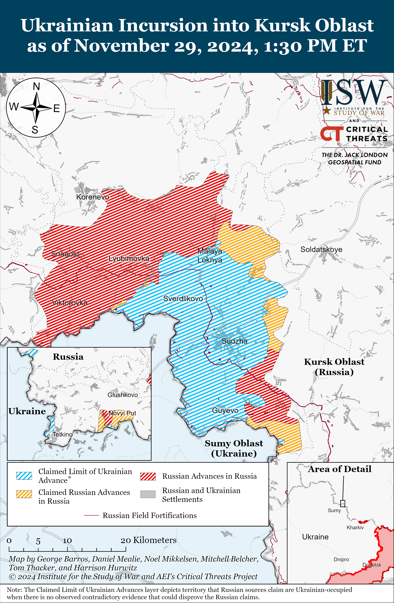
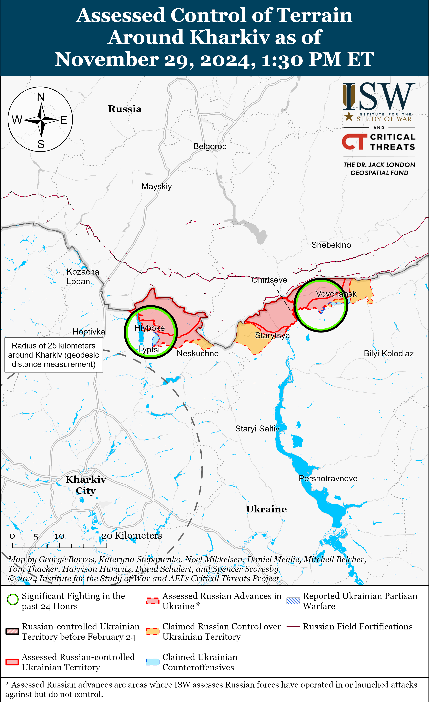
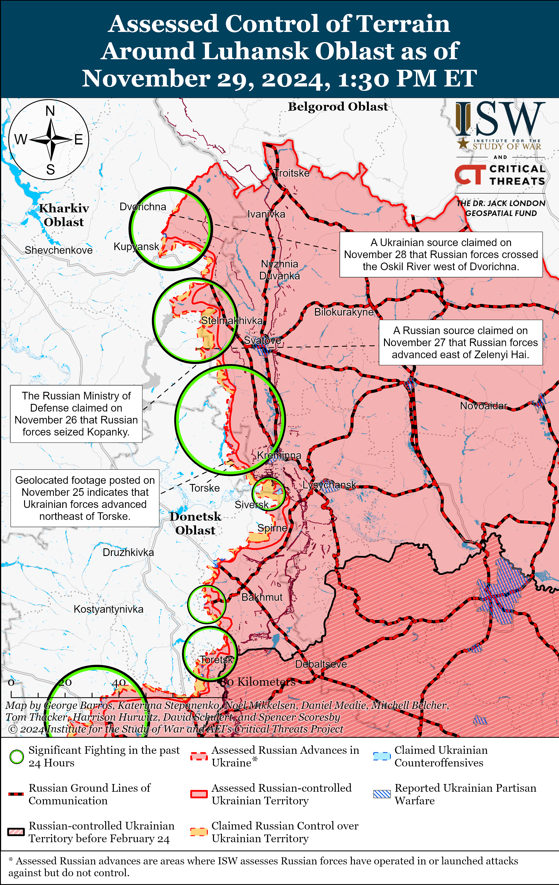
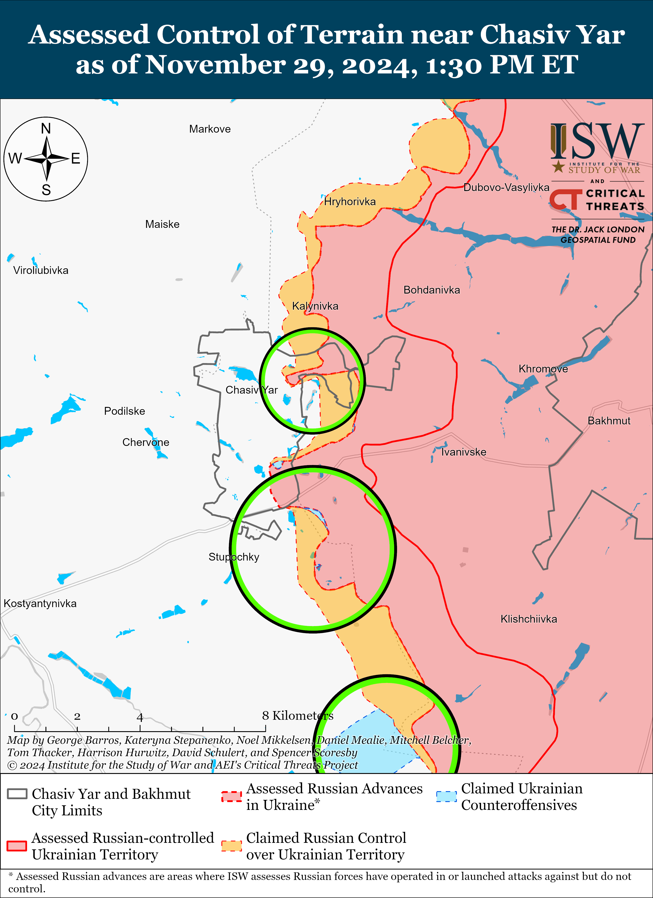
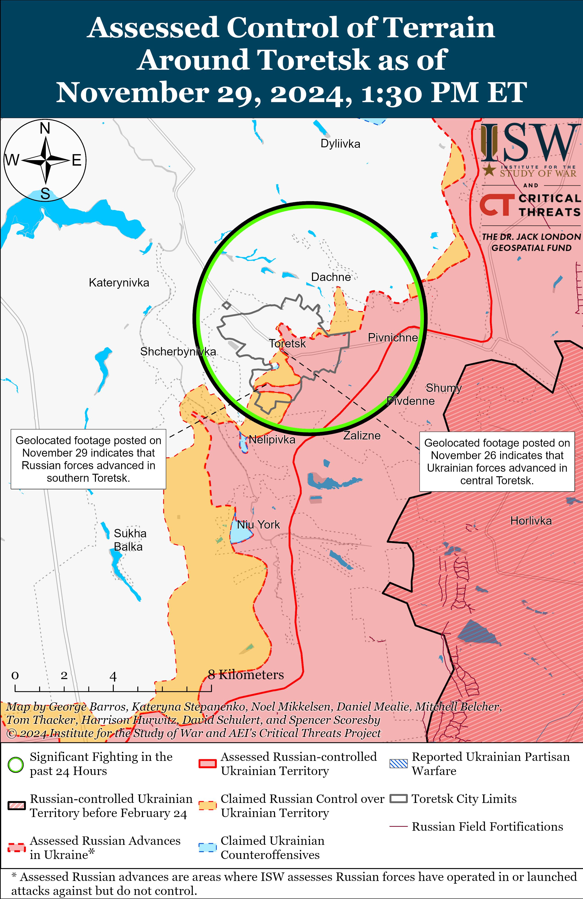
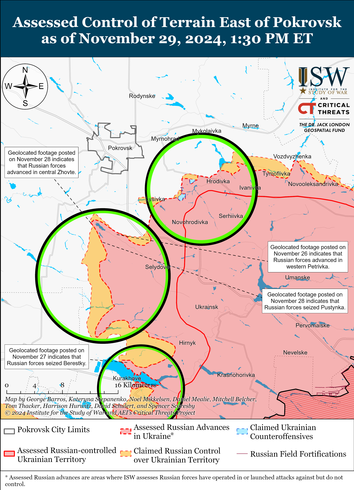
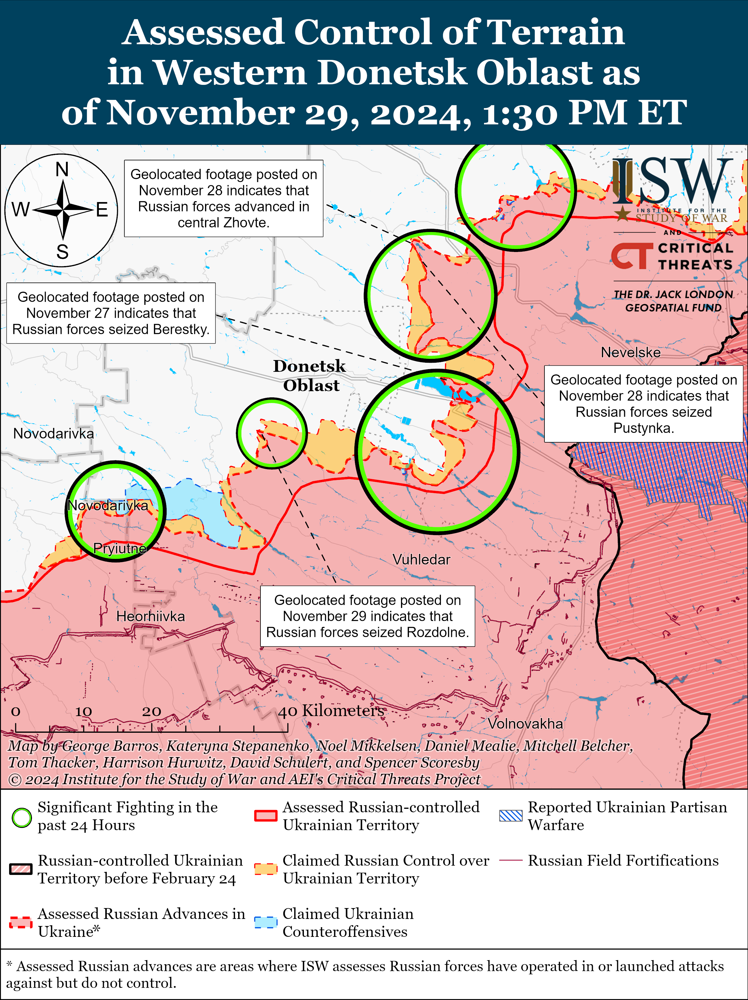
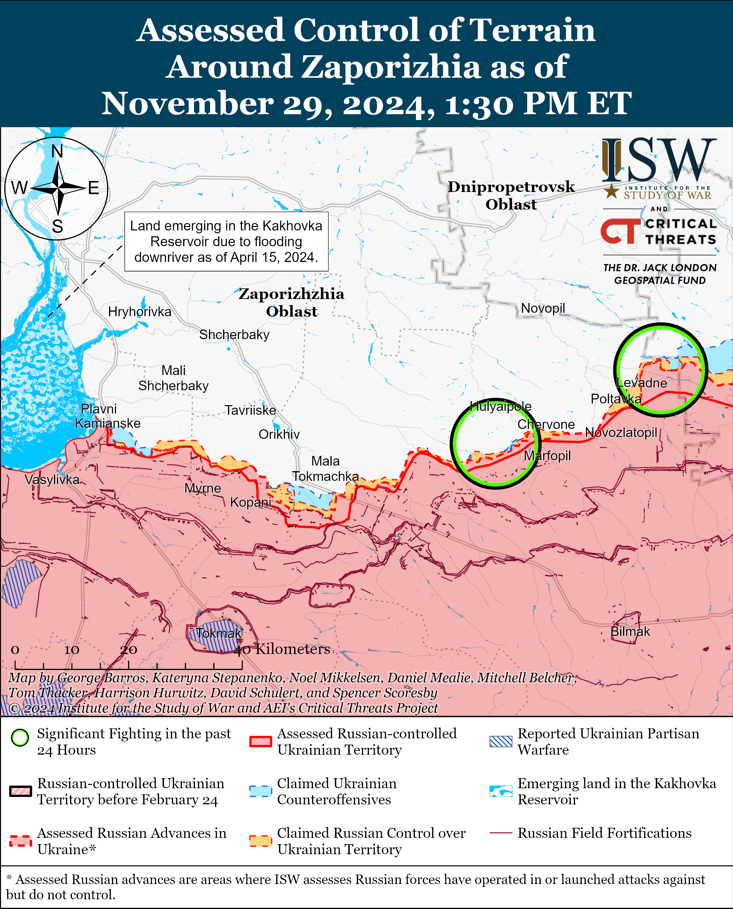
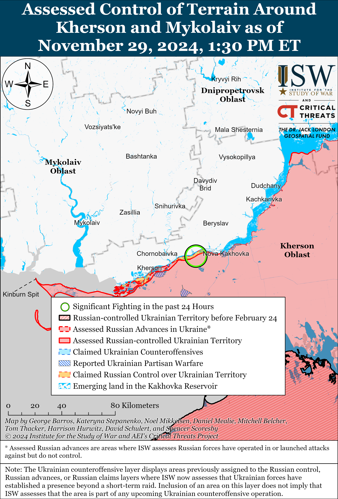

# Russian Offensive Campaign Assessment, November 29, 2024

**Karolina Hird, Kateryna Stepanenko, Angelica Evans, Grace Mappes, Nicole Wolkov, William Runkel, and George Barros**

**November 29, 2024, 7:45pm ET**

**Click** [**here**](https://storymaps.arcgis.com/stories/36a7f6a6f5a9448496de641cf64bd375) **to see ISW’s interactive map of the Russian invasion of Ukraine. This map is updated daily alongside the static maps present in this report.**

**Click** [**here**](https://understandingwar.maps.arcgis.com/apps/instant/3dviewer/index.html?appid=1602762dbcde419bb957dea358449580) **to see ISW’s 3D control of terrain topographic map of Ukraine. Use of a computer (not a mobile device) is strongly recommended for using this data-heavy tool.**

**Click** [**here**](https://storymaps.arcgis.com/stories/733fe90805894bfc8562d90b106aa895) **to access ISW’s archive of interactive time-lapse maps of the Russian invasion of Ukraine. These maps complement the static control-of-terrain map that ISW produces daily by showing a dynamic frontline. ISW will update this time-lapse map archive monthly.**

**Note: The data cut-off for this product was 2:00pm ET on November 29 and covers both November 28 and 29 due to the fact that ISW did not publish a Campaign Assessment on November 28 in observance of the Thanksgiving holiday. ISW will cover subsequent reports in the November 30 Russian Offensive Campaign Assessment.**

**Russian President Vladimir Putin continues to laud the technical specifications of the recently launched Oreshnik ballistic missile and threaten additional Oreshnik strikes against Ukraine as part of an intensified Russian reflexive control campaign aimed at forcing the West and Ukraine into self-deterrence.** Putin addressed members of the Collective Security Treaty Organization’s (CSTO) Security Council in Astana, Kazakhstan, on November 28 and reiterated several claims about the Oreshnik ballistic missile, with which Russian forces struck Dnipro City on November 21.[1] Putin’s November 28 statements closely resembled the speeches he gave on November 21 and 22 immediately following the Oreshnik strike, again presenting the Oreshnik strike as the commensurate Russian response to recent Ukrainian strikes on Russian territory using Western-provided long-range missile systems such as ATACMS and Storm Shadow/SCALPs.[2] Putin detailed the purported technical specifications of the Oreshnik during his CSTO speech and subsequent press conference with journalists on November 28, highlighting the size and maximum internal temperature of its warhead, its launch speed, and its blast radius, and compared the Oreshnik to both a “nuclear weapon” and a “meteorite” in terms of the damage it can cause.[3] Putin threateningly claimed that the Russian Ministry of Defense (MoD) and Russian General Staff are “selecting targets for destruction” in Ukraine, including “decision-making centers in Kyiv,” and later responded to a question about whether these are military or political targets by stating that “everything is possible.”[4]

**There is nothing particularly novel about the capabilities of the Oreshnik missile, and US and Ukrainian officials indicated that the Oreshnik missile does not portend a Russian escalation in the war**.[5] Putin’s efforts to stress the missile’s technical specifications are part of the larger reflexive control campaign that the Kremlin is currently pursuing, and highlighting its range and payload while comparing its destructive capabilities to that of a meteor is meant to threaten both Ukraine and the West and discourage further Ukrainian strikes on Russian territory using Western-provided systems. Even Putin’s threat of strikes on “decision-making centers” in Kyiv rings empty—Russian forces regularly strike civilian and critical infrastructure in Kyiv City with drones and nuclear-capable missiles.[6] Ukrainian President Volodymyr Zelensky summarized this fact on November 29 in response to Putin’s CSTO statements and said that “Putin wants to add thousands more to the thousands of missiles that have already hit Ukraine.”[7] *Reuters*, citing five sources close to US intelligence, reported on November 27 that the November 21 Oreshnik strike has not changed the US intelligence assessment that Russia is unlikely to use a nuclear weapon in Ukraine, even in retaliation for Ukrainian strikes into Russia with Western-provided weapons.[8] **Putin’s constant flaunting of the Oreshnik and Russian missile capabilities therefore remains part of the Kremlin’s reflexive control information operation and is unlikely to presage the development of particularly novel Russian deep strike capabilities.**

**The Russian military is considering establishing a separate service branch for unmanned systems, likely as part of the Russian MoD’s belated effort to catch up to the establishment of the Ukrainian Unmanned Systems Forces (USF) in February 2024.** Russian President Vladimir Putin stated at the press conference during his visit to Kazakhstan on November 28 that the Russian MoD and General Staff are considering establishing a new unmanned system service within the Russian Armed Forces and emphasized that drones are one of the most important factors of combat operations.[9] A milblogger affiliated with the Russian Airborne (VDV) Forces explained that Russian drone detachments currently informally operate as part of other Russian military units while simultaneously being responsible for their official tasks such as conducting assault operations or performing medical and sapper functions.[10] Putin also praised Russian Defense Minister Andrei Belousov, identified him as the lead on the establishment of the unmanned systems service, and called him a “modern defense minister.” Belousov recently faced significant backlash from the Russian ultranationalist milblogger community for failing to adequately respond to the amassing deaths of Russian drone operators and specialists in assault operations in Ukraine, and Putin’s mention of Belousov’s involvement may be an attempt to restore Belousov’s image among Russian ultranationalist and troops.[11]

A Kremlin insider source claimed that the establishment of the new service may take Belousov between six months to a year as it will require several reforms and expanding educational programs, registering new military specialties, and integrating volunteer projects into the Russian MoD bureaucracy.[12] Belousov notably established the “Rubikon” Center for Prospective Unmanned Technologies in August 2024 on the base of an unspecified unmanned aircraft unit.[13] The “Rubikon” Center appears to be the Russian MoD’s initiative to establish the educational and drone development foundation necessary for the establishment of the new unmanned systems service.

**The Russian military’s efforts to reorganize informal drone detachments into centralized, specialized military units are already introducing significant dysfunction into the Russian military.** A former Russian Storm-Z instructor and milblogger responded to Putin’s November 28 discussion of the unmanned systems service, stating there is a risk that the Russian MoD will try to formalize and monopolize drone supplies to the new unmanned systems service, which will erode a competitive and flexible environment conducive to innovation.[14] The milblogger observed that it is also unclear how the Russian military command will integrate the new drone service with the other combat operations, namely how this centralized initiative will impact the Russian tactical reconnaissance strike complex. The milblogger added that the new unmanned systems service is unlikely to preventthe Russian military command from committing drone operators to assaults given that Russian tank, engineering, artillery, and signals specialists are actively fighting as infantry in the event of manpower shortages despite being different classes of forces. Russian milbloggers previously claimed that the Russian MoD had been trying to form “joint technical drone battalions” by systematically disbanding informal Russian drone detachments and connected these efforts to the establishment of the “Rubikon” Center.[15] Russian milbloggers previously observed that Russian military commanders may have been increasingly committing drone operators to deadly assault operations in anticipation that the Russian MoD would deprive them of necessary manpower by reallocating these forces into MoD-operated “technical drone battalions.” Russian milbloggers also criticized the Russian MoD’s efforts to establish separate, specialized “technical drone battalions,” citing the lack of a joint Russian communications system that would allow dedicated drone units to closely coordinate with assault units.[16]

**Russian forces conducted a large series of drone and missile strikes against Ukraine’s energy grid and major defense industrial facilities on the nights of November 27 to 28 and 28 to 29.** The Ukrainian Air Force reported that Russian forces launched 188 drones and missiles against Ukraine on the night of November 27 to 28, including: three S-300 air defense missiles from Belgorod Oblast targeting Kharkiv Oblast; 57 Kh-101 cruise missiles from the airspace over Volgograd Oblast; 28 Kalibr cruise missiles from vessels in the Black Sea; three Kh-59/69 cruise missiles from airspace over the Black Sea; and 97 Shahed drones and unknown other strike drones (likely referring to decoy drones) from Kursk, Oryol, and Rostov oblasts and Primorsko-Akhtarsk, Krasnodar Krai as of 1030 local time on November 28.[17] The Ukrainian Air Force reported that Ukrainian forces downed 76 Kh-101 missiles, three Kh-59/69 missiles, and 35 drones, and 62 Russian drones became “lost,” likely due to Ukrainian electronic warfare (EW) interference. The Ukrainian Air Force noted that Ukrainian forces also downed 90 percent of the Russian Kalibr missiles and that at least 12 Russian drones and missiles successfully struck Ukrainian fuel and energy objects.[18]

The Ukrainian Air Force reported that Russian forces launched 132 Shahed drones and unknown other strike drones (likely referring to decoy drones) from Oryol, Rostov, and Kursk oblasts and Primorsko-Akhtarsk, Krasnodar Krai on the night of November 28 to 29 and that Ukrainian forces downed 88 drones over Kyiv, Chernihiv, Cherkassy, Sumy, Kharkiv, Poltava, Zhytomyr, Dnipropetrovsk, Zaporizhia, and Odesa oblasts at of 900 local time on November 29.[19] The Ukrainian Air Force reported that 41 Russian drones became ”lost,” likely due to Ukrainian EW interference, and that one Russian drone returned to Russian air space. Ukrainian officials reported that Russian drones and missiles damaged residential buildings and critical infrastructure in Chernihiv, Chernivitsi, Ivano-Frankivsk, Kharkiv, Khmelnytskyi, Kyiv, Odesa, Sumy, and Volyn oblasts on November 28 and 29.[20] The Ukrainian Air Force noted that Russian forces have used large numbers of missiles and drones during recent strikes to overwhelm Ukrainian air defenses and that Russian forces are launching thermal and radar interference devices and placing EW systems directly on missiles to defend against Ukrainian countermeasures.[21] The Ukrainian Air Force reported that Russian forces have also recently seized on poor weather conditions to conduct strikes under dense fog and cloud cover.

**Ukrainian forces conducted a series of strikes against four Russian air defense systems and radars in occupied Ukraine and two oil depots in Russia on November 28 and 29.** Ukraine’s Main Military Intelligence Directorate (GUR) reported on November 29 that Ukrainian drone units recently destroyed a Russian Zoopark radar system in an unspecified area of Russia or occupied Ukraine, and the Ukrainian General Staff reported that Ukrainian forces destroyed a Buk-M3 air defense system in occupied Zaporizhia Oblast.[22] The GUR reported on November 28 that Ukrainian forces destroyed a ”Podlyot” mobile radar system — which identifies targets for S-300/400 air defense systems — near occupied Kotovske, Crimea (north of Yevpatoria on Crimea‘s northwestern coast).[23] Geolocated footage published on November 29 purportedly shows Ukrainian forces also striking an S-400 air defense system near occupied Simferopol, Crimea.[24] The Ukrainian General Staff reported on November 29 that Ukrainian drones struck the Atlas Oil Depot in Rostov Oblast and caused a fire at the oil depot.[25] The Ukrainian General Staff noted that the Atlas Oil Depot supplies petrol products to the Russian military. Russian sources posted imagery claiming to show a fire near the Atlas Oil Depot and claimed that Ukrainian forces also conducted a drone strike likely against an oil depot near Slavyansk-on-Kuban, Krasnodar Krai on November 28.[26] Ukrainian forces previously conducted a drone strike against the Atlas Oil Depot in August 2024.[27]

**Russian Defense Minister Andrei Belousov made an unannounced visit to Pyongyang, North Korea on November 29 amid intensifying Russian-North Korean cooperation.** Belousov met with North Korean Defense Minister No Kwang Chol on November 29 and stated that the Russian-North Korean comprehensive strategic partnership agreement signed in June 2024 is the foundation of a “new Eurasian security system” and will play a stabilizing role in northeast Asia.[28] Belousov also highlighted expanding Russian-North Korean military cooperation. No stated that strengthening military cooperation is the “highest priority” and that the Russian and North Korean defense ministries are already engaged in high-level exchanges.[29] Ukraine’s Main Military Intelligence Directorate (GUR) told Ukrainian outlet *Interfax-Ukraine* in an article published on November 29 that North Korea has supplied over five million rounds of large-caliber artillery ammunition and 100 KN-23/24 (Hwasong-11Ga/Hwasongpho-11Na) ballistic missiles to Russia.[30] The GUR also reported that North Korea began supplying artillery systems to Russia on October 3 and has supplied over 100 M-1989 Koksan 170mm self-propelled artillery systems and M-1991 240mm multiple rocket launcher systems (MLRS). The GUR reported that over 60 M-1939 Koksan artillery systems are in Russia and that Russia will transfer some to the Saratov Artillery Command School in Saratov City to train Russian military personnel. US Alternate Representative for Special Political Affairs Robert Wood stated on November 27 that North Korea has transferred over 18,000 containers of munitions and munitions-related materiel and over 100 ballistic missiles to Russia since November 2023.[31] Wood added that North Korea is preparing to transfer “even more” ballistic missiles to Russia.

**Russian President Vladimir Putin reportedly appointed Colonel General Rustam Muradov as First Deputy Commander of the Russian Ground Forces.[32]** Head of Tabasaransky Raion in the Republic of Dagestan, Magomed Kurabanov, reported Muradov’s appointment on November 28, though the Russian MoD has yet to confirm Muradov’s reported appointment as of this publication.[33] Muradov previously served as Eastern Military District (EMD) and Eastern Grouping of Forces commander until his dismissal in March or April 2023, likely due to battlefield failures and substantial personnel and equipment casualties near Vuhledar in western Donetsk Oblast earlier in 2023.[34] Russian milbloggers extensively criticized Muradov for a previously failed offensive on Vuhledar and reiterated these criticisms of Muradov in response to his new appointment, with one milblogger criticizing the MoD’s pattern to reappoint incompetent generals perceived as loyal to the Kremlin to new positions.[35]

**The Ukrainian Prosecutor General’s Office opened additional investigations on November 28 into the apparent Russian execution of Ukrainian prisoners of war (POWs) in Donetsk and Zaporizhia oblasts.** The Prosecutor General reported that in the first instance, four Ukrainian soldiers surrendered to Russian troops near Petrivka (near Pokrovsk, Donetsk Oblast) on November 22, upon which Russian forces executed them with automatic weapons at close range.[36] Russian forces also captured six Ukrainian POWs near Novodarivka (eastern Zaporizhia Oblast) and executed five POWs at close range on November 24.[37] In both instances the Ukrainian soldiers had clearly surrendered or been captured and disarmed, meaning that they were officially *hors de combat* and protected under international law. The abuse of execution of POWs is a violation of the Geneva Convention on POWs and a violation of Rule 47 of Customary International Humanitarian Law.[38]

**Ukrainian President Volodymyr Zelensky the appointment of Major General Mykhailo Drapatyi as Ukraine’s new Ground Forces Commander on November 29, replacing Lieutenant General Oleksandr Pavlyuk.[39]** Zelensky also appointed Colonel Oleh Apostol as Deputy Commander-in-Chief of the Ukrainian Armed Forces. Zelensky stated that these appointments are intended to increase Ukraine’s combat capabilities, ensure quality training of Ukrainian forces, and introduce innovative management practices into the Ukrainian military.

**Georgians protested in Tbilisi, Georgia in response to an initiative by the ruling pro-Kremlin Georgian Dream party to delay European Union (EU) accession negotiations, prompting the Russian information space to resurrect information operations falsely framing the protests and Georgian opposition parties as potential threats to Georgian sovereignty.** Georgian Prime Minister and Georgian Dream party member Irakli Kobakhidze announced on November 28 that Georgia is suspending EU accession negotiations until 2028 and is refusing any budget grants from the EU in the meantime.[40] Georgians protested this decision outside the Georgian parliament building in Tbilisi on November 28 and 29 and clashed with riot police, prompting authorities to detain protestors and use tear gas and water cannons in attempts to disperse the protests.[41] Russian media heavily covered the protests, and Russian milbloggers – including those with connections to the Kremlin – claimed that these protests are the Georgian opposition’s attempt at a “Maidan” revolution and that successful protests could result in the installation of a new government in Georgia and Georgia “losing its sovereignty” to the West.[42] Russian government officials and Georgian Dream affiliates have previously claimed that Western countries are pursuing “Maidanization” in Georgia — a specific reference to Ukraine’s Euromaidan protests and the Revolution of Dignity in 2014 — to justify efforts to derail long-term European integration efforts that play into continued Russian hybrid operations to divide, destabilize, and weaken Georgia.[43]

**Key Takeaways:**

- **Russian President Vladimir Putin continues to laud the technical specifications of the recently launched Oreshnik ballistic missile and threaten additional Oreshnik strikes against Ukraine as part of an intensified Russian reflexive control campaign aimed at forcing the West and Ukraine into self-deterrence.**
- **There is nothing particularly novel about the capabilities of the Oreshnik missile, and US and Ukrainian officials indicated that the Oreshnik missile does not portend a Russian escalation in the war. Putin’s constant flaunting of the Oreshnik and Russian missile capabilities therefore remains part of the Kremlin’s reflexive control information operation and is unlikely to presage the development of particularly novel Russian deep strike capabilities.**
- **The Russian military is considering establishing a separate service branch for unmanned systems, likely as part of the Russian Ministry of Defense’s (MoD) in a belated effort to catch up to the establishment of the Ukrainian Unmanned Systems Forces (USF) in February 2024.**
- **Russian forces conducted a large series of drone and missile strikes against Ukraine’s energy grid and major defense industrial facilities on the nights of November 27 to 28 and 28 to 29.**
- **Ukrainian forces conducted a series of strikes against four Russian air defense systems and radars in occupied Ukraine and two oil depots in Russia on November 28 and 29.**
- **Russian Defense Minister Andrei Belousov made an unannounced visit to Pyongyang, North Korea on November 29 amid intensifying Russian-North Korean cooperation.**
- **Russian President Vladimir Putin reportedly appointed Colonel General Rustam Muradov as First Deputy Commander of the Russian Ground Forces.**
- **The Ukrainian Prosecutor General’s Office opened additional investigations on November 28 into the apparent Russian execution of Ukrainian prisoners of war (POWs) in Donetsk and Zaporizhia oblasts.**
- **Ukrainian President Volodymyr Zelensky the appointment of Major General Mykhailo Drapatyi as Ukraine’s new Ground Forces Commander on November 29, replacing Lieutenant General Oleksandr Pavlyuk.**
- **Georgians protested in Tbilisi, Georgia in response to an initiative by the ruling pro-Kremlin Georgian Dream party to delay European Union (EU) accession negotiations, prompting the Russian information space to resurrect information operations falsely framing the protests and Georgian opposition parties as potential threats to Georgian sovereignty.**
- **Ukrainian forces recently advanced northeast of Vuhledar.**
- **Russian forces recently advanced near Kupyansk, in Toretsk, near Pokrovsk, and near Velyka Novosilka.**
- **Russian opposition outlets *Mediazona* and *BBC Russian Service* reported that they have confirmed that at least 80,937 Russian soldiers have died in Ukraine since the start of Russia’s full-scale invasion in February 2022.**

***We do not report in detail on Russian war crimes because these activities are well-covered in Western media and do not directly affect the military operations we are assessing and forecasting. We will continue to evaluate and report on the effects of these criminal activities on the Ukrainian military and the Ukrainian population and specifically on combat in Ukrainian urban areas. We utterly condemn Russian violations of the laws of armed conflict and the Geneva Conventions and crimes against humanity even though we do not describe them in these reports.***

- Ukrainian Operations in the Russian Federation
- Russian Main Effort – Eastern Ukraine (comprised of three subordinate main efforts)
- Russian Subordinate Main Effort #1 – Push Ukrainian forces back from the international border with Belgorod Oblast and approach to within tube artillery range of Kharkiv City
- Russian Subordinate Main Effort #2 – Capture the remainder of Luhansk Oblast and push westward into eastern Kharkiv Oblast and encircle northern Donetsk Oblast
- Russian Subordinate Main Effort #3 – Capture the entirety of Donetsk Oblast
- Russian Supporting Effort – Southern Axis
- Russian Air, Missile, and Drone Campaign
- Russian Mobilization and Force Generation Efforts
- Russian Technological Adaptations
- Activities in Russian-occupied areas
- Significant Activity in Belarus

**Ukrainian Operations in the Russian Federation**

Russian forces continued to counterattack in Ukraine’s main salient in Kursk Oblast on November 28 and 29 but did not make any confirmed advances. Russian milbloggers claimed that elements of the Russian 11th Airborne (VDV) Brigade seized two unspecified streets in Martynovka (northeast of Sudzha) and that elements of the 106th VDV Division advanced 1.6 kilometers near Darino and reached Nikolaevo-Darino (both southeast of Korenevo).[44] Russian milbloggers also claimed that Russian forces advanced east and southeast of Nizhny Klin (southeast of Korenevo), near Kamyshovka (north of Sudzha), and southwest of Pogrebki (northwest of Sudzha).[45] ISW has not observed visual evidence confirming these claims. A Ukrainian brigade operating in the Kursk direction reported on November 29 that it repelled a Russian reinforced platoon-sized mechanized assault in an unspecified area of Kursk Oblast and destroyed five of the six Russian armored vehicles using remote mining.[46] A spokesperson of a Ukrainian brigade operating in the Kursk direction reported that Russian forces are continuing to use a large number of armored vehicles including tanks to counterattack in Kursk Oblast and that Russian VDV elements are also using motorcycles and all-terrain vehicles (ATVs) in combat.[47] A Russian VDV-affiliated milblogger noted that foggy and rainy weather conditions are inhibiting Russian and Ukrainian drone operations in the Kursk direction.[48] Russian and Ukrainian forces reportedly continued combat engagements southeast of Korenevo near Novoivanovka and Darino; northeast of Sudzha near Martynovka; northwest of Sudzha near Malaya Loknya and Sverdlikovo; and south of Sudzha near Plekhovo on November 27, 28, and 29.[49] Elements of the Russian 106th VDV Division’s 51st, 119th, and 137th VDV regiments reportedly continue to operate near Nizhny Klin, Darino, and Sverdlikovo; assault elements of the 346th Motorized Rifle Regiment of the Mobilization Reserve reportedly continue to operate near Olgovka (east of Korenevo); and elements of the 83rd VDV Brigade reportedly continue to operate along the international border area in Suzhansky Raion.[50] Elements of the Russian 810th Naval Infantry Brigade (Black Sea Fleet), 56th VDV Regiment (7th VDV Division), and of the “112” Separate Reconnaissance Battalion are reportedly operating in the Kursk direction.[51]

Sources in Ukrainian intelligence told Ukrainian outlet *Suspilne* on November 29 that the Ukrainian Main Military Intelligence Directorate (GUR) conducted a successful sabotage operation in Rylsk, Kursk Oblast and burned down a Russian vehicle transporting Russian short-range drones.[52]

**Russian Main Effort – Eastern Ukraine**

**Russian Subordinate Main Effort #1 – Kharkiv Oblast (Russian objective: Push Ukrainian forces back from the international border with Belgorod Oblast and approach to within tube artillery range of Kharkiv City)**

Russian forces continued assaults near Hlyboke (north of Kharkiv City), Vovchansk, (northeast of Kharkiv City), and Tykhe (east of Vovchansk) on November 27, 28, and 29 but did not make any confirmed advances.[53] Russian milbloggers claimed on November 28 and 29 that Russian forces made marginal advances in Vovchansk amid battles in urban areas; that fighting continues near Lyptsi (north of Kharkiv City); and that Russian forces operating along the Kozacha Lopan-Slatyne line (north of Kharkiv City) have become more active in the past two weeks (since mid-November 2024).[54] ISW has not observed confirmation of Russian gains in these areas. ISW has reported an increase in Russian cross-border raids in the Kozacha Lopan direction over the past week, however.[55] Ukrainian military sources reported on November 28 that Ukrainian drone operators repelled a Russian reinforced platoon-sized mechanized assault involving three tracked infantry fighting vehicles and one tank in the Kharkiv direction on an unspecified date.[56] The spokesperson of a Ukrainian brigade and the commander of a Ukrainian drone platoon both operating in the Kharkiv direction reported on November 29 that Ukrainian forces are using drones to control the airspace in northern Kharkiv Oblast, push Russian forces away from Kharkiv City towards the international border with Russia, have largely stopped Russian forces from using armored equipment, and have forced Russian soldiers to move on foot and conduct infantry assaults in northern Kharkiv Oblast.[57]

**Russian Subordinate Main Effort #2 – Luhansk Oblast (Russian objective: Capture the remainder of Luhansk Oblast and push westward into eastern Kharkiv Oblast and northern Donetsk Oblast)**

A Ukrainian official confirmed that a small group of Russian forces has recently crossed to the west (right) bank of the Oskil River in the Kupyansk direction amid continued fighting north of Kupyansk on November 28 and 29. The deputy commander of a Ukrainian drone battalion operating in the Kupyansk direction stated on November 28 that a small group of Russian infantry crossed to the west bank and that Ukrainian forces are working to repel the group.[58] The Ukrainian General Staff acknowledged that Russian forces conducted attacks on the west bank near Fyholivka (northeast of Kupyansk) and Holubivka and Kindrashivka (both immediately north of Kupyansk) on November 28.[59] Russian sources claimed that Russian forces established a foothold on the west bank near Dvorichna (north of Kupyansk and southwest of Fyholivka), and a Russian military expert claimed that Russian forces are clearing Dvorichna.[60] Ukrainian military observer Kostyantyn Mashovets stated on November 29 that Russian forces also crossed the Oskil River near the suspension bridge south of Novomlynsk (northeast of Dvorichna) and that the Russian contingent on the west bank is no larger than a company-sized force, but noted that the Russian command will likely seek to expand this foothold.[61] Mashovets stated that elements of the Russian 1st Guards Tank Army (GTA) (Moscow Military District [MMD]), 6th Combined Arms Army (CAA) (Leningrad Military District [LMD]), 11th Army Corps (AC) (LMD), and several battalions of the 20th CAA (MMD) are conducting offensive operations to eliminate the Ukrainian bridgehead on the east (left) bank of the Oskil River southeast of Kupyansk.[62] Mashovets stated that the command of the 1st GTA is conducting all the command and control (C2) for this grouping of forces.

**Russian Subordinate Main Effort #3 – Donetsk Oblast (Russian objective: Capture the entirety of Donetsk Oblast, the claimed territory of Russia’s proxies in Donbas)**

Neither Russian nor Ukrainian sources reported ground assaults in the Siversk direction on November 28 and 29.

The Ukrainian General Staff reported that Russian forces continued assault operations near Chasiv Yar and south of Chasiv Yar near Stupochky and Bila Hora on November 27, 28, and 29, but Russian forces did not make any confirmed advances.[67] Ukrainian sources posted geolocated footage on November 26 showing a failed Russian platoon-sized mechanized assault on Ukrainian positions north of Chasiv Yar around November 24.[68] Russian milbloggers claimed on November 27 and 28 that Ukrainian forces counterattacked west of Klishchiivka (southeast of Chasiv Yar) and that Russian forces advanced and consolidated positions near the refractory plant in central Chasiv Yar, are fighting near high rise buildings and the Avanhard stadium in central Chasiv Yar, and advanced in a forested area northwest of Kurdyumivka (southeast of Chasiv Yar).[69] ISW has not observed visual confirmation of these claims, however. Russian drone operators of the 98th Airborne (VDV) Division reportedly continue to operate near the Novyi Microraion, eastern Chasiv Yar.[70]

Russian forces recently advanced in southern Toretsk amid continued offensive operations in the Toretsk direction on November 27, 28, and 29. Geolocated footage published on November 29 indicates that Russian forces recently advanced northward along Hinky Street in southern Toretsk.[71] Russian milbloggers claimed on November 28 and 29 that Russian forces recently advanced 250 meters deep in southern Nelipivka (south of Toretsk), advanced 1.2 kilometers wide by 650 meters deep in a forested area south of Toretsk, and advanced 300 meters within the western portion of Zabalka Microraion, southern Toretsk.[72] Ukrainian Luhansk Group of Forces Spokesperson Major Anastasiya Bobovnikova reported on November 28 that the situation in Toretsk remains very difficult due to Russian air and artillery strikes and intense close quarters urban combat.[73] Bobovnikova reported on November 27 that Russian forces are conducting fewer airstrikes against Ukrainian positions in Toretsk because of poor weather but continue to use drones and conduct ground assaults using poorly trained and equipped contract military personnel.[74] The Ukrainian General Staff reported on November 28 and 29 that Russian forces continued ground assaults near Toretsk and northeast of Toretsk near Dyliivka and Druzhba.[75]

Russian forces recently advanced south of Pokrovsk amid continued offensive operations in the Pokrovsk direction on November 28 and 29. Geolocated footage published on November 28 shows that Russian forces advanced into central Zhovte (south of Pokrovsk), and geolocated footage published on November 29 shows further Russian advances in a forested area northeast of Zhovte.[76] Russian advances into central Zhovte also indicate that Russian forces likely recently seized Pustynka (southeast of Zhovte), as Russian forces would have had to advance through Pustynka to reach Zhovte. Additional geolocated footage published on November 28 indicates that Russian forces advanced south of Lysivka (northeast of Zhovte and southeast of Pokrovsk).[77] Pokrovsk City Head Serhii Dobryak noted that Russian forces are about six kilometers away from the outskirts of Pokrovsk in the Zhovte area south of Pokrovsk.[78] Russian milbloggers claimed on November 28 and 29 that Russian forces made additional advances near Lysivka and Pushkine (south of Zhovte), although ISW has not yet observed confirmation of Russian advances in these areas.[79] The Ukrainian General Staff reported that fighting continued east of Pokrovsk near Myrolyubivka and Promin; southeast of Pokrovsk near Lysivka, Krutyi Yar, and Dachenske; and south of Pokrovsk near Novyi Trud, Pustynka, Dachenske, Chumatske, and Zhovte on November 27, 28, and 29.[80] Russian sources credited unspecified elements of the Russian Central Grouping of Forces for advances near Pokrovsk.[81]

Russian forces reportedly recently advanced near Kurakhove, but ISW has not observed confirmation of any claimed Russian gains. Several Russian sources claimed on November 28 and 29 that Russian forces advanced in and west of Berestky (north of Kurakhove on the northern bank of the Kurakhivske Reservoir) towards the dacha and forested areas in the direction of Stari Terny (west of Berestky and on the northwestern bank of the Kurakhivske Reservoir).[82] One milblogger claimed that Russian forces seized a position along the Berestky-Voznesenka (north of Berestky) railway line.[83] Russian milbloggers additionally claimed that Russian forces are consolidating advances within central Kurakhove and in the Yuzhnyi Microraion (southern Kurakhove).[84] Russian milbloggers claimed that Russian forces have advanced up to one kilometer towards Dalne (south of Kurakhove) and are clearing Ukrainian positions and advancing west of Illinka (on the northeastern bank of the Kurakhivske Reservoir, west of Berestky).[85] The Ukrainian General Staff reported that Russian forces continued unsuccessful ground attacks near Kurakhove itself; northwest of Kurakhove near Sontsivka and Novodmytrivka; north of Kurakhove near Berestky; northeast of Kurakhove near Berestky and Zorya; and south of Kurakhove near Dalne on November 27, 28, and 29.[86] Elements of the Russian 114th Motorized Rifle Brigade (51st Combined Arms Army [CAA], formerly 1st Donetsk People’s Republic Army Corps [DNR AC]) are reportedly operating near Berestky; elements of the 102nd Motorized Rifle Regiment (150th Motorized Rifle Division, 8th CAA, Southern Military District [SMD]) are reportedly operating near Dalne; elements of the 5th Motorized Rifle Brigade (51st CAA) are reportedly operating within Kurakhove itself; elements of the 39th Motorized Rifle Brigade (68th AC, Eastern Military District [EMD]) are reportedly operating in the southern part of the Kurakhove direction; and elements of the 255th Motorized Rifle Brigade (20th Motorized Rifle Division, 8th CAA, SMD) are reportedly operating in the general Kurakhove direction.[87]

Ukrainian forces recently retook positions northeast of Vuhledar amid continued offensive operations in the Vuhledar direction on November 28 and 29. Geolocated footage published on November 28 indicates that Ukrainian forces recently marginally advanced on the northwestern outskirts of Yelizavetivka (northeast of Vuhledar).[88] Russian milbloggers claimed that Russian forces are clearing positions in the forest area near Yelizavetivka; consolidating positions in Illinka (northeast of Vuhledar); and advancing near Veselyi Hai (northwest of Vuhledar) and two kilometers along a road north of Yasna Polyana (northwest of Vuhledar).[89] ISW has not observed confirmation of these claims, however. A Russian milblogger claimed that elements of the Russian 39th Motorized Rifle Brigade and 1472nd Motorized Rifle Brigade (both of the 68th AC, EMD) recently advanced near Trudove and are currently two kilometers from Kostyantynopolske, which is consistent with ISW’s assessment of Russian advances in the area.[90] Russian forces continued assault north of Vuhledar near Romanivka and northwest of Vuhledar near Veselyi Hai, Trudove, Kostyantynopolske, Sukhy Yaly, and Rozlyv on November 27, 28, and 29.[91] Elements of the Russian 33rd Motorized Rifle Regiment (20th Motorized Rifle Division, 8th CAA, SMD) are reportedly operating near Antonivka (northeast of Vuhledar) and elements of the Russian 14th Spetsnaz Brigade (Russian General Staff’s Main Military Intelligence Directorate [GRU]) are reportedly operating in the south Donetsk (Vuhledar-Velyka Novosilka) direction.[92]

Russian forces recently seized Rozdolne (northeast of Velyka Novosilka) amid continued offensive operations in the Donetsk-Zaporizhia Oblast border area on November 28 and 29. Geolocated imagery published on November 29 indicates that elements of the Russian 37th Motorized Rifle Brigade (36th CAA, EMD) and 40th Naval Infantry Brigade (Pacific Fleet, EMD) recently raised a flag over central Rozdolne and seized the settlement.[93] Russian milbloggers claimed that Russian forces also advanced along the Shaytanka River west of Novodonetske (southwest of Velyka Novosilka) towards Blahodatne (south of Velyka Novosilka) and from Rivnopil (southwest of Velyka Novosilka) towards Makariivka (south of Velyka Novosilka).[94] ISW has not observed visual confirmation of these claims, however. The spokesperson for a Ukrainian brigade operating in the Donetsk-Zaporizhia Oblast border area reported on November 28 that Russian forces have two main objectives in this area: interdict Ukrainian logistics routes between Velyka Novosilka and Kurakhove and seize Velyka Novosilka itself.[95] The spokesperson noted that the situation for Ukrainian forces is more difficult east of Velyka Novosilka where Russian forces recently advanced but stated that worsening weather conditions are complicating Russian drone usage and forcing Russia to rely on foot mobile infantry to advance in the area. An officer in another Ukrainian brigade operating near Velyka Novosilka reported on November 29 that Russian forces are using armored vehicles, motorcycles, all-terrain vehicles (ATVs or “buggies“), and air support to advance in the area, however.[96] Russian forces continued assaults northeast of Velyka Novosilka near Rozdolne; on the northeastern and eastern outskirts of Velyka Novosilka; and southwest of Velyka Novosilka near Rivnopil, Novodarivka, and Novopil on November 27, 28, and 29.[97] Elements of the Russian 5th Tank Brigade (36th CAA, EMD) are reportedly operating near Velyka Novosilka and Rozdolne and drone operators of a tank battalion of the 60th Motorized Rifle Brigade (5th CAA, EMD) are reportedly operating near Makarivka.[98]

**Russian Supporting Effort – Southern Axis (Russian objective: Maintain frontline positions and secure rear areas against Ukrainian strikes)**

Russian forces continued offensive operations in western Zaporizhia Oblast on November 27, 28, and 29 but did not make confirmed advances. Zaporizhia Oblast occupation official Vladimir Rogov claimed on November 27 that Russian forces advanced northeast of Robotyne, capturing 15 square kilometers south of Mala Tokmachka and entering the town of Bilohirya (both northeast of Robotyne).[99] ISW has not observed visual confirmation of these claims, however. A Russian milblogger claimed on November 29 that Russian forces continued offensive operations north of Robotyne and near Mala Tokmachka.[100] Ukraine’s Southern Operational Command reported on November 29 that Russian forces are preparing for assault operations in the Hulyaipole (eastern Zaporizhia Oblast) and Orikhiv (western Zaporizhia Oblast) directions by launching airstrikes, conducting aerial reconnaissance and engineering missions, stockpiling equipment and ammunition, training additional assault personnel, and increasing the number of electronic warfare (EW) and anti-aircraft systems deployed to western Zaporizhia Oblast.[101] Drone operators of the Russian 503rd Motorized Rifle Regiment (19th Motorized Rifle Division, 58th Combined Arms Army [CAA], Southern Military District [SMD]) are reportedly operating in the Zaporizhia direction.[102]

Positional fighting continued in the Dnipro direction in east (left) bank Kherson Oblast on November 27, 28, and 29, but there were no changes to the frontline.[103] Ukraine’s Southern Operational Command reported that Russian forces unsuccessfully attempted to seize unspecified islands in the Dnipro River Delta between November 28 and 29.[104] Ukrainian Tavriisk Group of Forces Spokesperson Colonel Vladyslav Voloshyn reported on November 29 that Russian forces repositioned a battalion’s worth of riverboats from occupied Crimea to the occupied Kinburn and Tendrivska spits to better defend against potential Ukrainian offensive actions in the Kherson River Delta area.[105] The Ukrainian Crimea-based “Atesh” partisan group reported on November 28 that elements of the Russian 205th Motorized Rifle Brigade (49th Combined Arms Army [CAA], Southern Military District [SMD]) are reportedly abandoning their positions in the Kherson direction en masse and suffering from high rates of desertion due to systemic abuse from commanding officers.[106]

**Russian Air, Missile, and Drone Campaign (Russian Objective: Target Ukrainian military and civilian infrastructure in the rear and on the frontline)**

*See topline text for updates of Russian strikes on Ukraine on November 28 and November 29.*

**Russian Mobilization and Force Generation Efforts (Russian objective: Expand combat power without conducting general mobilization)**

Russian opposition outlets *Mediazona* and *BBC Russian Service* reported that they have confirmed that at least 80,937 Russian soldiers have died in Ukraine since the start of Russia’s full-scale invasion in February 2022.[107] *Mediazona* and *BBC Russian Service* reported on November 29 that over half of the soldiers who they confirmed to have died in Ukraine were not in the Russian military at the start of the full scale invasion in February 2022; that volunteer servicemembers usually die within two to four weeks of arriving at the frontline; that volunteers comprise 22 percent of total Russian losses; and that convict recruits comprise 18 percent of total losses.

The Russian MoD is expanding the role of the Kremlin-controlled Russian Orthodox Church Moscow Patriarchate (ROC MP) in the military, likely as part of ongoing efforts to enforce pro-Kremlin ideological narratives among Russian military personnel.[108] The Russian MoD’s Main Military Political Directorate Deputy Chief Oleg Veselkov stated that the Russian military created a role that would allow assistants to military district commanders to work with ROC MP representatives. Veselkov described the religious assistant as “the commander’s confessor, who is always with him — at the front, at the command post, among the troops” and noted that ROC MP Head Patriarch Kirill has selected and appointed these religious assistants.[109] Veselkov noted that priests in the Russian military will now work with soldiers at an individual level on the frontline.

The Kremlin is reportedly incorporating its “Time of Heroes” program that aims to place veterans of the Russian full-scale invasion of Ukraine in positions in local, regional, and federal governments into its effort to militarize occupied Ukraine and illegally integrate occupied Ukrainian territory into Russia. Former Donetsk People’s Republic (DNR) First Deputy Information Minister Danil Bezsonov claimed that the Russian presidential administration and the ruling United Russia party are attempting to create more opportunities for veterans to participate in the Russian State Duma elections in 2026 to represent occupied Ukraine.[110] Bezsonov also claimed that the Russian presidential administration and United Russia assess that the “Time of Heroes” program has been successful and that Russian authorities plan to introduce participation in the program into each occupied region of Ukraine. The Kremlin may also intend to incentivize Russian military service in occupied Ukraine through the prospects of career opportunities.

The Russian military reportedly continues to forcibly impress civilians into the military. A Russian insider source claimed on November 28 that Russian military enlistment offices are working with Russian law enforcement, public associations, and Cossack groups to conduct quarterly illegal raids to find “volunteers” to serve on the frontline across unspecified regions and cities in Russia. The insider source claimed that these raids target young adults and migrants and will target people who are inebriated during the New Year holiday.[111]

**Russian Technological Adaptations (Russian objective: Introduce technological innovations to optimize systems for use in Ukraine)**

A Ukrainian electronic warfare (EW) system manufacturer stated on November 29 that the Russian military is attempting to use and adapt stolen Ukrainian military technology, particularly to improve Russian EW capabilities.[112]

**Activities in Russian-occupied areas (Russian objective: Consolidate administrative control of annexed areas; forcibly integrate Ukrainian citizens into Russian sociocultural, economic, military, and governance systems)**

*ISW is not publishing coverage of activities in Russian-occupied areas today.*

**Significant activity in Belarus (Russian efforts to increase its military presence in Belarus and further integrate Belarus into Russian-favorable frameworks and Wagner Group activity in Belarus)**

The Russian military reportedly set up a filtration camp for Ukrainian prisoners of war (POW) and civilians in Belarus in 2022. *Radio Svoboda’s* investigative branch *Skhemy* reported on November 28 that Russian forces established a filtration center at a Belarusian state enterprise in Naroulia, Gomel Oblast in March 2022, where Russian forces detained, tortured, and abused Ukrainian POWs, civilians, and children.[113] Belarus has also been involved in Russia’s systematic deportation of Ukrainian children to Belarus and Russia.[114]

Russia and Belarus issued a joint declaration on November 28 enhancing the role of the international law. The declaration states that Russia and Belarus uphold the principles of international law, that international law is the basis of fair and equal international relations, and that both countries operate on the principle of sovereign equality of states.[115] The declaration also noted that Russia and Belarus jointly express concern over “politicization of the international justice system,” although failed to acknowledge that Russia is actively violating the international law by invading Ukraine.

**Note: ISW does not receive any classified material from any source, uses only publicly available information, and draws extensively on Russian, Ukrainian, and Western reporting and social media as well as commercially available satellite imagery and other geospatial data as the basis for these reports. References to all sources used are provided in the endnotes of each update.**

[1] http://kremlin dot ru/events/president/transcripts/75687; https://understandingwar.org/backgrounder/russian-offensive-campaign-assessment-november-21-2024

[2] http://kremlin dot ru/events/president/transcripts/75687 (November 28 address); http://kremlin dot ru/events/president/news/75623 (November 22 address); http://kremlin dot ru/events/president/news/75614 (November 21 address)

[3] http://kremlin dot ru/events/president/news/75689; http://kremlin dot ru/events/president/transcripts/75687

[4] http://kremlin dot ru/events/president/news/75689

[5] https://understandingwar.org/backgrounder/russian-offensive-campaign-assessment-november-22-2024; https://understandingwar.org/backgrounder/russian-offensive-campaign-assessment-november-21-2024

[6] https://www.nytimes.com/2024/11/13/world/europe/russia-missiles-ukraine-kyiv.html; https://www.bbc.com/ukrainian/articles/c86q8lewgego; https://www.unian.ua/war/viyna-v-ukrajini-rosiya-vdarila-po-kiyevu-raketami-detali-novini-kiyeva-12689613.html; https://understandingwar.org/backgrounder/russian-offensive-campaign-assessment-july-8-2024

[7] https://suspilne dot media/890759-putin-rozmahue-oresnikom-sob-zmusiti-prezidenta-ssa-jti-na-umovi-rf-zelenskij/

[8] https://www.reuters.com/world/europe/nuclear-attack-unlikely-despite-putins-warnings-us-intelligence-says-2024-11-27/

[9] http://kremlin dot ru/events/president/news/75689

[10] https://t.me/rusich\_army/18867

[11] https://understandingwar.org/backgrounder/russian-offensive-campaign-assessment-september-24-2024; https://understandingwar.org/backgrounder/russian-offensive-campaign-assessment-october-22-2024; https://understandingwar.org/backgrounder/russian-offensive-campaign-assessment-september-21-2024; https://understandingwar.org/backgrounder/russian-offensive-campaign-assessment-september-27-2024; https://understandingwar.org/backgrounder/russian-offensive-campaign-assessment-november-3-2024

[12] https://t.me/kremlin\_sekret/16526

[13] https://understandingwar.org/backgrounder/russian-offensive-campaign-assessment-november-3-2024; https://tass dot ru/armiya-i-opk/22099195

[14] https://t.me/philologist\_zov/1744

[15] https://understandingwar.org/backgrounder/russian-offensive-campaign-assessment-november-3-2024

[16] https://understandingwar.org/backgrounder/russian-offensive-campaign-assessment-november-3-2024

[17] https://t.me/kpszsu/23855

[18] https://t.me/kpszsu/23868

[19] https://t.me/kpszsu/23924

[20] https://suspilne dot media/lutsk/889899-u-lucku-cuti-zvuki-vibuhiv-so-vidomo/?utm\_source=telegram&utm\_medium=ps; https://t.me/volynskaODA/6285 ; https://suspilne dot media/sumy/890549-vsi-vikna-povibivalo-meskanci-sostki-rozpovili-pro-raketnij-udar/ ; https://t.me/odeskaODA/7754; https://suspilne dot media/odesa/890011-armia-rf-atakuvala-odesinu-raketami-poskodzeni-budinki-e-poranenij/?utm\_source=telegram&utm\_medium=ps; https://suspilne dot media/odesa/890119-ataka-rf-na-odesinu-8-listopada-kilkist-zagiblih-zbilsilas-do-dvoh/ ; https://suspilne dot media/kyiv/889947-raketnij-udar-po-kievu-ulamki-vpali-v-dniprovskomu-rajoni/; https://t.me/suspilne\_kyiv/13418; https://t.me/vitaliy\_klitschko/3784; https://t.me/VA\_Kyiv/9731

 ; https://www.facebook.com/sergii.tiurin.public/posts/pfbid034urkcgeWngifJ7yp8X36w4WPPoUjVHNcLJYv7jTfyT9qzLHBZRgVZcSBoJZF9HLQl ; https://t.me/synegubov/12260 ; https://t.me/synegubov/12259 ; https://t.me/synegubov/12258 https://t.me/ihor\_terekhov/1988 ; https://suspilne dot media/889867-ssa-zaklikali-kiiv-zniziti-prizovnij-vik-do-18-rokiv-tramp-obrav-predstavnika-z-pitan-ukraini-1009-den-vijni-onlajn/?anchor=live\_1732780770&utm\_source=copylink&utm\_medium=ps; https://suspilne dot media/ivano-frankivsk/890035-vijskovi-rf-atakuvali-obekti-kriticnoi-infrastrukturi-ivano-frankivsini/; https://t.me/onyshchuksvitlana/18205 ; https://suspilne dot media/chernivtsi/890067-u-seli-na-bukovini-ulamki-raketi-poskodili-visim-budinkiv/; https://suspilne dot media/chernivtsi/890017-u-cerniveckij-oblasti-ppo-znisila-rosijsku-raketu/ ; https://suspilne dot media/889867-ssa-zaklikali-kiiv-zniziti-prizovnij-vik-do-18-rokiv-tramp-obrav-predstavnika-z-pitan-ukraini-1009-den-vijni-onlajn/?anchor=live\_1732780614&utm\_source=copylink&utm\_medium=ps ; https://armyinform dot com.ua/2024/11/29/naslidky-vluchannya-drona-v-dytyachu-polikliniku-v-kyyevi-ye-rujnuvannya-ta-postrazhdalyj/; https://t.me/dsns\_telegram/35548 ; https://t.me/dsns\_telegram/35548 ; https://od.npu dot gov.ua/news/na-odeshchyni-vnaslidok-ataky-rf-poraneno-7-liudei-politsiia-fiksuie-zlochyn-krainy-terorystky ; https://armyinform dot com.ua/2024/11/29/odeshhyna-palaye-naslidky-ataky-udarnyh-droniv-po-zhytlovyh-kvartalah/; https://t.me/pgo\_gov\_ua/27644 ; https://t.me/odeskaODA/7779 ; https://www.facebook.com/OperationalCommandSouth/posts/pfbid0Tcpsfa5GYKyF1zgti3z7B8KKAqoG2BnA66h2byerZmAxLK3zciMo7kkMS5wyp3t9l

[21] https://t.me/kpszsu/23868

[22] https://armyinform dot com.ua/2024/11/29/okupanty-bidkayutsya-nashi-rozvidnyky-rozvodyat-rukamy-rosiyany-zalyshylys-bez-zooparku/; https://www.facebook.com/DefenceIntelligenceofUkraine/videos/1098201765011427/ ; https://www.facebook.com/GeneralStaff.ua/posts/pfbid02P5JRVJzvxEef1bE6vyWcy59a1d9T6s1WndgR3sCkhQgZMuap7V4Pr1gn4qdtHrcol4 ; https://armyinform dot com.ua/2024/11/29/syly-bezpilotnyh-system-urazyly-czikavu-vijskovu-czil-rosiyan-vartistyu-10-mln/; https://www.facebook.com/share/v/1HEB4rvWTT/

[23] https://t.me/DIUkraine/4920

[24] https://t.me/kiber\_boroshno/10723 ; https://t.me/chp\_crimea/53355 ; https://t.me/ButusovPlus/15432 ; https://t.me/chp\_crimea/53355 ; https://x.com/666\_mancer/status/1862488907968913442

[25] https://www.facebook.com/GeneralStaff.ua/posts/pfbid02P5JRVJzvxEef1bE6vyWcy59a1d9T6s1WndgR3sCkhQgZMuap7V4Pr1gn4qdtHrcol

[26] https://t.me/tass\_agency/287788; https://t.me/tass\_agency/287739

 ; https://t.me/vchkogpu/52857; https://t.me/vchkogpu/52856;https://t.me/astrapress/69351 ; https://t.me/astrapress/69336 ; https://t.me/astrapress/69337 ; https://t.me/astrapress/69338 ; https://t.me/astrapress/69340 ; https://t.me/boris\_rozhin/146038 ; https://t.me/astrapress/69401 ; https://t.me/astrapress/69456

[27] https://understandingwar.org/backgrounder/russian-offensive-campaign-assessment-august-28-2024

[28] https://t.me/mod\_russia/46324

[29] https://t.me/mod\_russia/46324

[30] https://interfax.com dot ua/news/general/1030885.html

[31] https://usun.usmission.gov/remarks-at-a-un-security-council-briefing-on-ukraine-22/

[32] https://golostabasarana dot ru/newsreg/media/2024/11/28/rustam-muradov-naznachen-pervyim-zamestitelem-glavnokomanduyuschego-suhoputnyimi-vojskami-rf/

[33] https://golostabasarana dot ru/newsreg/media/2024/11/28/rustam-muradov-naznachen-pervyim-zamestitelem-glavnokomanduyuschego-suhoputnyimi-vojskami-rf/

[34] https://understandingwar.org/backgrounder/russian-offensive-campaign-assessment-march-28-2023; https://isw.pub/UkrWar032723; https://understandingwar.org/backgrounder/russian-offensive-campaign-assessment-april-1-2023; https://understandingwar.org/backgrounder/russian-offensive-campaign-assessment-may-19-2023-0; https://understandingwar.org/backgrounder/russian-offensive-campaign-assessment-april-30-2023

[35] https://t.me/milinfolive/136095; https://x.com/GirkinGirkin/status/1862344967655457195; https://t.me/arbat/1932; https://t.me/ZOV\_Voevoda/24080; https://theins dot ru/news/276720; https://understandingwar.org/backgrounder/russian-offensive-campaign-assessment-march-27-2023; https://understandingwar.org/backgrounder/russian-offensive-campaign-assessment-april-24-2023; https://understandingwar.org/backgrounder/russian-offensive-campaign-assessment-february-10-2023; https://understandingwar.org/backgrounder/russian-offensive-campaign-assessment-march-10-2023; https://understandingwar.org/backgrounder/russian-offensive-campaign-assessment-february-18-2023

[36] https://t.me/pgo\_gov\_ua/27643

[37] https://t.me/pgo\_gov\_ua/27632

[38] https://www.ohchr.org/en/instruments-mechanisms/instruments/geneva-convention-relative-treatment-prisoners-war; https://ihl-databases.icrc.org/en/customary-ihl/v1/rule47

[39] https://armyinform dodt com.ua/2024/11/29/prezydent-nazvav-novyh-komanduvacha-suhoputnyh-vijsk-ta-zastupnyka-golovnokomanduvacha-zsu/; https://t.me/V\_Zelenskiy\_official/12617 ; https://www.facebook.com/OperationalCommandSouth/posts/pfbid0oNSVHZF78kYXsAyACprV9pYJmQXf1i8HKrCPRcJ5j7ojrNnSZEZk89BoywUaPrVJl ; https://www.president dot gov.ua/documents/7892024-52885?fbclid=IwY2xjawG2579leHRuA2FlbQIxMAABHTPMNJJ0baBt8KVKetgawnWxBeBzoYNKo4w1hO3FXXCRvTHUseeUvO\_3rg\_aem\_q3bFRHfRU6lusKL1ohDahQ

[40] https://www.radiotavisupleba dot ge/a/33219304.html

[41] https://www.reuters.com/world/europe/georgia-says-it-will-not-enter-eu-membership-talks-until-2028-snub-brussels-2024-11-28/ ; https://meduza dot io/news/2024/11/29/u-parlamenta-gruzii-v-tbilisi-nachalas-novaya-aktsiya-protesta-iz-za-priostanovki-peregovorov-o-vstuplenii-strany-v-es; https://t.me/tass\_agency/288156 ; https://t.me/tass\_agency/288167 ; https://t.me/tass\_agency/288169

[42] https://t.me/tass\_agency/288025; https://t.me/tass\_agency/288023; https://t.me/tass\_agency/288015; https://t.me/tass\_agency/288009; https://t.me/tass\_agency/288004; https://t.me/tass\_agency/288003; https://t.me/tass\_agency/287987; https://t.me/tass\_agency/287984 ; https://t.me/boris\_rozhin/146000 ; https://t.me/boris\_rozhin/146003 ; https://t.me/boris\_rozhin/146026; https://t.me/kremlin\_sekret/16524; https://t.me/rybar/65813; https://t.me/RVvoenkor/81565; https://t.me/tass\_agency/288156 ; https://t.me/tass\_agency/288167 ; https://t.me/tass\_agency/288169; https://t.me/boris\_rozhin/146042; https://t.me/sashakots/50475; https://t.me/boris\_rozhin/146084

[43] https://understandingwar.org/backgrounder/russian-offensive-campaign-assessment-june-4-2024; https://isw.pub/UkrWar050824 ; https://tass dot ru/politika/17236177

[44] https://t.me/DnevnikDesantnika/20100; https://t.me/z\_arhiv/29834

[45] https://t.me/z\_arhiv/29834 https://t.me/DnevnikDesantnika/20100

[46] https://t.me/ok\_pivnich1/11436

[47] https://armyinform dot com.ua/2024/11/29/vse-chudovo-myasni-shturmy-i-kolony-tehniky-nas-vlashtovuyut-na-kurshhyni-morpihy-peremololy-ochyen-gniluyu-brygadu/; https://www.youtube.com/watch?v=j5TqaWCCdUg

[48] https://t.me/rusich\_army/18859; https://t.me/rusich\_army/18894

[49] https://t.me/dva\_majors/58858; https://t.me/rusich\_army/18866; https://t.me/dva\_majors/58879; https://t.me/dva\_majors/58757https://www.facebook.com/GeneralStaff.ua/posts/pfbid027xfrr2ToFQQhH92aCAr8bZXJYA975XbKqYQ5Lb2DfDbH1nTZfZucHqvKQaPdBtRil; https://www.facebook.com/GeneralStaff.ua/posts/pfbid06XEdHePFFPDUs2sE9ca2UeSPgTrCVNjqmvTvPFGLmqkvig3Xxqw7Euni6Pi1nSe4l; https://www.facebook.com/GeneralStaff.ua/posts/pfbid03y3AFrrBHiQhxJmvkqVYWT15pR3dgvTwNww1fxPiVcCei61b7iHqCE3T5Nv3C6zBl; https://t.me/rusich\_army/18859

[50] https://t.me/rusich\_army/18894; https://t.me/DnevnikDesantnika/20009; https://t.me/RVvoenkor/81478

[51] https://armyinform.com dot ua/2024/11/27/na-kurshhyni-voyiny-sso-vzyaly-v-polon-morskyh-pihotyncziv-rf/; https://t.me/BalitskyEV/4370; https://t.me/rusich\_army/18859

[52] https://suspilne dot media/890839-zakon-pro-pidvisenna-podatkiv-nabuv-cinnosti-niderlandi-peredali-tri-ustanovki-patriot-1010-den-vijni-onlajn/?anchor=live\_1732871799&utm\_source=copylink&utm\_medium=ps

[53] https://www.facebook.com/GeneralStaff.ua/posts/pfbid02P5QjSH7c3EE7A6DZy9RTWLXV4NaMJ7SKfDNy4yQ5hThJbJ3XhRscKVeWYuPRLLHFl ; https://www.facebook.com/GeneralStaff.ua/posts/pfbid06XEdHePFFPDUs2sE9ca2UeSPgTrCVNjqmvTvPFGLmqkvig3Xxqw7Euni6Pi1nSe4l; https://www.facebook.com/GeneralStaff.ua/posts/pfbid027xfrr2ToFQQhH92aCAr8bZXJYA975XbKqYQ5Lb2DfDbH1nTZfZucHqvKQaPdBtRil ; https://www.facebook.com/GeneralStaff.ua/posts/pfbid03y3AFrrBHiQhxJmvkqVYWT15pR3dgvTwNww1fxPiVcCei61b7iHqCE3T5Nv3C6zBl ; https://www.facebook.com/GeneralStaff.ua/posts/pfbid0cV6ZHw7zELf3c5qyG5LhAR2nMU146RabKtANdNjqg8NpvzxHkWe3JyVJQPCgYobvl ;https://www.facebook.com/GeneralStaff.ua/posts/pfbid0rnf35Q648JNTm9vrcm1xp1d7NvDohokm33NgnVgVs1JagktQR28uFJN4edjqVawPl

[54]https://t.me/Sladkov\_plus/11937 ; https://t.me/dva\_majors/58879

[55] https://understandingwar.org/backgrounder/russian-offensive-campaign-assessment-november-26-2024; https://understandingwar.org/backgrounder/russian-offensive-campaign-assessment-november-25-2024

[56] https://t.me/ButusovPlus/15415 ; https://t.me/ab3army/4925 ; https://armyinform dot com.ua/2024/11/28/tank-zastryag-u-bagnyuczi-rosiyany-hotily-vtekty-yak-tretya-shturmova-vidbyvala-nastup-vorozhoyi-kolony/

[57] https://armyinform dot com.ua/2024/11/28/pidnimayetsya-voda-v-unikalnij-misczevosti-na-pivnochi-harkivshhyny-zahysnyky-protystoyat-okupantam-i-pryrodi/ ; https://armyinform dot com.ua/2024/11/29/pihoti-dovodytsya-pishky-jty-bagato-kilometriv-praktychno-vid-kordonu-na-harkivshhyni-okupanty-minimalno-vykorystovuyut-bud-yaku-tehniku/

[58] https://armyinform.com dot ua/2024/11/28/zi-100-okupantiv-do-liniyi-dohodyat-10-u-sylah-oborony-rozpovily-pro-boyi-na-richczi-oskil/

[59] https://www.facebook.com/GeneralStaff.ua/posts/pfbid0rnf35Q648JNTm9vrcm1xp1d7NvDohokm33NgnVgVs1JagktQR28uFJN4edjqVawPl;

[60] https://t.me/Sladkov\_plus/11937; https://t.me/tass\_agency/287749

[61] https://t.me/zvizdecmanhustu/2377 ; https://www.facebook.com/pashtetof/posts/pfbid02tfyVo3gHzXoYtxG9aVWXvw8FQYiqoZvUBoVbxyLQq33W2LJ1QnFxnNtR1AmvSCtyl

[62] https://t.me/zvizdecmanhustu/2377 ; https://www.facebook.com/pashtetof/posts/pfbid02tfyVo3gHzXoYtxG9aVWXvw8FQYiqoZvUBoVbxyLQq33W2LJ1QnFxnNtR1AmvSCtyl

[63] https://t.me/creamy\_caprice/7683; https://t.me/OMIBr\_60/645; https://t.me/creamy\_caprice/7685; https://t.me/rubpak\_liberatores/22

[64] https://t.me/DnevnikDesantnika/20098

[65] https://www.facebook.com/GeneralStaff.ua/posts/pfbid02P5QjSH7c3EE7A6DZy9RTWLXV4NaMJ7SKfDNy4yQ5hThJbJ3XhRscKVeWYuPRLLHFl; https://www.facebook.com/GeneralStaff.ua/posts/pfbid06XEdHePFFPDUs2sE9ca2UeSPgTrCVNjqmvTvPFGLmqkvig3Xxqw7Euni6Pi1nSe4l; https://www.facebook.com/GeneralStaff.ua/posts/pfbid027xfrr2ToFQQhH92aCAr8bZXJYA975XbKqYQ5Lb2DfDbH1nTZfZucHqvKQaPdBtRil; https://armyinform.com dot ua/2024/11/28/zi-100-okupantiv-do-liniyi-dohodyat-10-u-sylah-oborony-rozpovily-pro-boyi-na-richczi-oskil/; https://www.facebook.com/GeneralStaff.ua/posts/pfbid03y3AFrrBHiQhxJmvkqVYWT15pR3dgvTwNww1fxPiVcCei61b7iHqCE3T5Nv3C6zBl; https://www.facebook.com/GeneralStaff.ua/posts/pfbid0cV6ZHw7zELf3c5qyG5LhAR2nMU146RabKtANdNjqg8NpvzxHkWe3JyVJQPCgYobvl; https://www.facebook.com/GeneralStaff.ua/posts/pfbid0rnf35Q648JNTm9vrcm1xp1d7NvDohokm33NgnVgVs1JagktQR28uFJN4edjqVawPl

[66] https://t.me/voin\_dv/12021; https://t.me/voin\_dv/12060; https://t.me/Secrets\_of\_Vinakos/4192

[67]https://www.facebook.com/GeneralStaff.ua/posts/pfbid02P5QjSH7c3EE7A6DZy9RTWLXV4NaMJ7SKfDNy4yQ5hThJbJ3XhRscKVeWYuPRLLHFl ; https://www.facebook.com/GeneralStaff.ua/posts/pfbid027xfrr2ToFQQhH92aCAr8bZXJYA975XbKqYQ5Lb2DfDbH1nTZfZucHqvKQaPdBtRil ; https://www.facebook.com/GeneralStaff.ua/posts/pfbid06XEdHePFFPDUs2sE9ca2UeSPgTrCVNjqmvTvPFGLmqkvig3Xxqw7Euni6Pi1nSe4l ; https://www.facebook.com/GeneralStaff.ua/posts/pfbid03y3AFrrBHiQhxJmvkqVYWT15pR3dgvTwNww1fxPiVcCei61b7iHqCE3T5Nv3C6zBl ; https://www.facebook.com/GeneralStaff.ua/posts/pfbid0rnf35Q648JNTm9vrcm1xp1d7NvDohokm33NgnVgVs1JagktQR28uFJN4edjqVawPl ; https://www.facebook.com/GeneralStaff.ua/posts/pfbid0cV6ZHw7zELf3c5qyG5LhAR2nMU146RabKtANdNjqg8NpvzxHkWe3JyVJQPCgYobvl

[68] https://t.me/official24ombr/696 ; https://t.me/WarArchive\_ua/22805

[69] https://t.me/dva\_majors/58757 ; https://t.me/DnevnikDesantnika/20003 ; https://t.me/wargonzo/23388?single

[70]https://t.me/DnevnikDesantnika/20009 ; https://t.me/DnevnikDesantnika/20082 ; https://t.me/wargonzo/23405 ; https://t.me/boris\_rozhin/146061

[71] https://x.com/PuenteUribarri/status/1862422860049912063 ; https://x.com/99Dominik\_/status/1862426013243727997; https://x.com/matej0210110461/status/1862512330153599419 ; https://t.me/Khyzhak\_brigade/176

[72]https://t.me/RVvoenkor/81493 ; https://t.me/dva\_majors/58879 ; https://t.me/dva\_majors/58879 ; https://t.me/DnevnikDesantnika/20097

[73] https://armyinform.com dot ua/2024/11/28/kontakt-na-vidstani-vytyagnutoyi-ruky-u-sylah-oborony-rozpovily-pro-boyi-v-toreczku/; https://www.youtube.com/watch?v=j5TqaWCCdUg

[74] https://armyinform dot com.ua/2024/11/27/u-toreczku-idut-miski-boyi-okupanty-zakydayut-myasom-pozycziyi-syl-oborony/

[75]https://www.facebook.com/GeneralStaff.ua/posts/pfbid03y3AFrrBHiQhxJmvkqVYWT15pR3dgvTwNww1fxPiVcCei61b7iHqCE3T5Nv3C6zBl ; https://www.facebook.com/GeneralStaff.ua/posts/pfbid0cV6ZHw7zELf3c5qyG5LhAR2nMU146RabKtANdNjqg8NpvzxHkWe3JyVJQPCgYobvl ; https://www.facebook.com/GeneralStaff.ua/posts/pfbid0rnf35Q648JNTm9vrcm1xp1d7NvDohokm33NgnVgVs1JagktQR28uFJN4edjqVawPl

[76] https://t.me/creamy\_caprice/7664; https://t.me/mir\_perezagruzka/2236; https://t.me/creamy\_caprice/7684; https://t.me/groupPUMA/60

[77] https://t.me/creamy\_caprice/7668; https://t.me/moment\_war/165

[78] https://suspilne dot media/889867-ssa-zaklikali-kiiv-zniziti-prizovnij-vik-do-18-rokiv-tramp-obrav-predstavnika-z-pitan-ukraini-1009-den-vijni-onlajn/?anchor=live\_1732802486&utm\_source=copylink&utm\_medium=ps

[79] https://t.me/z\_arhiv/29843; https://t.me/rybar/65783; https://t.me/z\_arhiv/29853

[80] https://www.facebook.com/GeneralStaff.ua/posts/pfbid02P5QjSH7c3EE7A6DZy9RTWLXV4NaMJ7SKfDNy4yQ5hThJbJ3XhRscKVeWYuPRLLHFl; https://www.facebook.com/GeneralStaff.ua/posts/pfbid027xfrr2ToFQQhH92aCAr8bZXJYA975XbKqYQ5Lb2DfDbH1nTZfZucHqvKQaPdBtRil; https://www.facebook.com/GeneralStaff.ua/posts/pfbid06XEdHePFFPDUs2sE9ca2UeSPgTrCVNjqmvTvPFGLmqkvig3Xxqw7Euni6Pi1nSe4l;

https://www.facebook.com/GeneralStaff.ua/posts/pfbid03y3AFrrBHiQhxJmvkqVYWT15pR3dgvTwNww1fxPiVcCei61b7iHqCE3T5Nv3C6zBl; https://www.facebook.com/GeneralStaff.ua/posts/pfbid0cV6ZHw7zELf3c5qyG5LhAR2nMU146RabKtANdNjqg8NpvzxHkWe3JyVJQPCgYobvl; https://www.facebook.com/GeneralStaff.ua/posts/pfbid0rnf35Q648JNTm9vrcm1xp1d7NvDohokm33NgnVgVs1JagktQR28uFJN4edjqVawPl

[81] https://t.me/RVvoenkor/81577; https://t.me/boris\_rozhin/146053; https://t.me/boris\_rozhin/146099

[82] https://t.me/dva\_majors/58757; https://t.me/wargonzo/23388?single; https://t.me/boris\_rozhin/145807; https://t.me/rybar/65789; https://t.me/RVvoenkor/81573; https://t.me/dva\_majors/58879; https://t.me/z\_arhiv/29856; https://t.me/voenkorKotenok/60380

[83] https://t.me/voenkorKotenok/60380

[84] https://t.me/rybar/65758; https://t.me/DnevnikDesantnika/20003; https://t.me/boris\_rozhin/145807; https://t.me/dva\_majors/58879; https://t.me/voenkorKotenok/60381

[85] https://t.me/DnevnikDesantnika/20003; https://t.me/boris\_rozhin/145821

[86] https://www.facebook.com/GeneralStaff.ua/posts/pfbid02P5QjSH7c3EE7A6DZy9RTWLXV4NaMJ7SKfDNy4yQ5hThJbJ3XhRscKVeWYuPRLLHFl; https://www.facebook.com/GeneralStaff.ua/posts/pfbid027xfrr2ToFQQhH92aCAr8bZXJYA975XbKqYQ5Lb2DfDbH1nTZfZucHqvKQaPdBtRil; https://www.facebook.com/GeneralStaff.ua/posts/pfbid06XEdHePFFPDUs2sE9ca2UeSPgTrCVNjqmvTvPFGLmqkvig3Xxqw7Euni6Pi1nSe4l; https://www.facebook.com/GeneralStaff.ua/posts/pfbid03y3AFrrBHiQhxJmvkqVYWT15pR3dgvTwNww1fxPiVcCei61b7iHqCE3T5Nv3C6zBl; https://www.facebook.com/GeneralStaff.ua/posts/pfbid0cV6ZHw7zELf3c5qyG5LhAR2nMU146RabKtANdNjqg8NpvzxHkWe3JyVJQPCgYobvl; https://www.facebook.com/GeneralStaff.ua/posts/pfbid0rnf35Q648JNTm9vrcm1xp1d7NvDohokm33NgnVgVs1JagktQR28uFJN4edjqVawPl

[87] https://t.me/boris\_rozhin/145807; https://t.me/z\_arhiv/29826 (Berestky); https://t.me/boris\_rozhin/146076 ; https://t.me/nm\_dnr/13044 (Dalne); https://t.me/Sladkov\_plus/11941 https://t.me/Sladkov\_plus/11941 (in Kurakhove); https://t.me/voin\_dv/12038 (southern Kurakhove direction); https://t.me/dva\_majors/58867 (general Kurakhove direction)

[88] https://t.me/creamy\_caprice/7675; https://t.me/BARS14GUMANITARKA/10352

[89] https://t.me/voenkorKotenok/60345 ; https://t.me/voenkorKotenok/60369 ; https://t.me/voin\_dv/12042 ; https://t.me/dva\_majors/58879 ; https://t.me/z\_arhiv/29859 ; https://t.me/voenkorKotenok/60381

[90] https://t.me/voin\_dv/12042

[91] https://t.me/dva\_majors/58757 ; https://t.me/voenkorKotenok/60369 ; https://www.facebook.com/GeneralStaff.ua/posts/pfbid02P5QjSH7c3EE7A6DZy9RTWLXV4NaMJ7SKfDNy4yQ5hThJbJ3XhRscKVeWYuPRLLHFl ; https://www.facebook.com/GeneralStaff.ua/posts/pfbid027xfrr2ToFQQhH92aCAr8bZXJYA975XbKqYQ5Lb2DfDbH1nTZfZucHqvKQaPdBtRil ; https://www.facebook.com/GeneralStaff.ua/posts/pfbid06XEdHePFFPDUs2sE9ca2UeSPgTrCVNjqmvTvPFGLmqkvig3Xxqw7Euni6Pi1nSe4l ; https://t.me/DnevnikDesantnika/20091

[92] https://t.me/dva\_majors/58785 ; https://t.me/voin\_dv/12047

[93] https://t.me/boris\_rozhin/146067; https://t.me/creamy\_caprice/7677; https://t.me/voin\_dv/12049  ; https://t.me/RVvoenkor/81531 ; https://t.me/voin\_dv/12043 ; https://t.me/voenkorKotenok/60371 ; https://t.me/RVvoenkor/81577

[94] https://t.me/voin\_dv/12042 ; https://t.me/voenkorKotenok/60369 ; https://t.me/z\_arhiv/29837 ; https://t.me/wargonzo/23388

[95] https://suspilne dot media/donbas/890173-zahopiti-veliku-novosilku-ta-pererizati-dorogu-na-kurahove-vijskovij-pro-cili-rosijskogo-nastupu-na-pivdni-doneccini/

[96] https://armyinform dot com.ua/2024/11/29/vorog-postavyv-dlya-sebe-zadachu-vyjty-na-trasu-zaporizhzhya-doneczk-okupanty-pragnut-pererizaty-logistyku/

[97] https://t.me/wargonzo/23388 ; https://t.me/rybar/65758 ; https://www.facebook.com/OperationalCommandSouth/posts/pfbid0dA5rxHZXf8Awnuhp4jGPYSsLtzEg4zxLQEc6rzpohHGRXLmRiWhxnZrjdf2YiLfgl ; https://www.facebook.com/GeneralStaff.ua/posts/pfbid02P5QjSH7c3EE7A6DZy9RTWLXV4NaMJ7SKfDNy4yQ5hThJbJ3XhRscKVeWYuPRLLHFl ; https://www.facebook.com/GeneralStaff.ua/posts/pfbid027xfrr2ToFQQhH92aCAr8bZXJYA975XbKqYQ5Lb2DfDbH1nTZfZucHqvKQaPdBtRil ; https://www.facebook.com/GeneralStaff.ua/posts/pfbid06XEdHePFFPDUs2sE9ca2UeSPgTrCVNjqmvTvPFGLmqkvig3Xxqw7Euni6Pi1nSe4l ; https://t.me/DnevnikDesantnika/20101 ; https://t.me/wargonzo/23405 ; https://www.facebook.com/OperationalCommandSouth/posts/pfbid0Tcpsfa5GYKyF1zgti3z7B8KKAqoG2BnA66h2byerZmAxLK3zciMo7kkMS5wyp3t9l ; https://t.me/voenkorKotenok/60382 ; https://ria dot ru/20241127/svo-1985936560.html; https://t.me/vrogov/18152

[98] https://t.me/voin\_dv/12041 ; https://t.me/voin\_dv/12036

[99] https://t.me/vrogov/18128 ; https://ria dot ru/20241126/spetsoperatsiya-1985699543.html

[100] https://t.me/dva\_majors/58879

[101]https://www.facebook.com/OperationalCommandSouth/posts/pfbid0Tcpsfa5GYKyF1zgti3z7B8KKAqoG2BnA66h2byerZmAxLK3zciMo7kkMS5wyp3t9l

[102] https://t.me/dva\_majors/58781

[103]https://www.facebook.com/GeneralStaff.ua/posts/pfbid02P5QjSH7c3EE7A6DZy9RTWLXV4NaMJ7SKfDNy4yQ5hThJbJ3XhRscKVeWYuPRLLHFl ; https://www.facebook.com/GeneralStaff.ua/posts/pfbid06XEdHePFFPDUs2sE9ca2UeSPgTrCVNjqmvTvPFGLmqkvig3Xxqw7Euni6Pi1nSe4l; https://www.facebook.com/GeneralStaff.ua/posts/pfbid027xfrr2ToFQQhH92aCAr8bZXJYA975XbKqYQ5Lb2DfDbH1nTZfZucHqvKQaPdBtRil ; https://www.facebook.com/OperationalCommandSouth/posts/pfbid0dA5rxHZXf8Awnuhp4jGPYSsLtzEg4zxLQEc6rzpohHGRXLmRiWhxnZrjdf2YiLfgl ; https://www.facebook.com/GeneralStaff.ua/posts/pfbid03y3AFrrBHiQhxJmvkqVYWT15pR3dgvTwNww1fxPiVcCei61b7iHqCE3T5Nv3C6zBl ; https://www.facebook.com/GeneralStaff.ua/posts/pfbid0cV6ZHw7zELf3c5qyG5LhAR2nMU146RabKtANdNjqg8NpvzxHkWe3JyVJQPCgYobvl ; https://www.facebook.com/GeneralStaff.ua/posts/pfbid0rnf35Q648JNTm9vrcm1xp1d7NvDohokm33NgnVgVs1JagktQR28uFJN4edjqVawPl

[104]https://www.facebook.com/OperationalCommandSouth/posts/pfbid0Tcpsfa5GYKyF1zgti3z7B8KKAqoG2BnA66h2byerZmAxLK3zciMo7kkMS5wyp3t9l

[105] https://armyinform dot com.ua/2024/11/28/vorog-boyitsya-desantu-na-kinburnsku-kosu-rosiyany-ukriplyuyut-uzberezhzhya-okupovanoyi-mykolayivshhyny/

[106] https://t.me/atesh\_ua/5865

[107] https://www.bbc.com/russian/articles/clygedgp40yo ; https://meduza dot io/news/2024/11/29/mediazona-i-bi-bi-si-podtverdili-gibel-bolee-80-tysyach-rossiyskih-voennyh-v-ukraine-bolshe-poloviny-iz-nih-ne-byli-svyazany-s-armiey-do-nachala-voyny

[108] https://www.rbc dot ru/rbcfreenews/6747e1289a7947521222e0c7

[109] https://www.rbc dot ru/rbcfreenews/6747e1289a7947521222e0c7

[110] https://t.me/NeoficialniyBeZsonoV/41845

[111] https://t.me/vchkogpu/52834

[112] https://www.ukrinform dot ua/rubric-ato/3932622-u-rosijskij-zbroi-vikoristovuutsa-vkradeni-ukrainski-tehnologii-ekspert.html

[113] https://www.radiosvoboda.org/a/skhemy-narovlya-bilorus-filtratsiynyy-tabir/33219293.html

[114] https://www.state.gov/belaruss-involvement-in-russias-systematic-relocation-of-ukraines-children/

[115] https://t.me/MID\_Russia/48865
