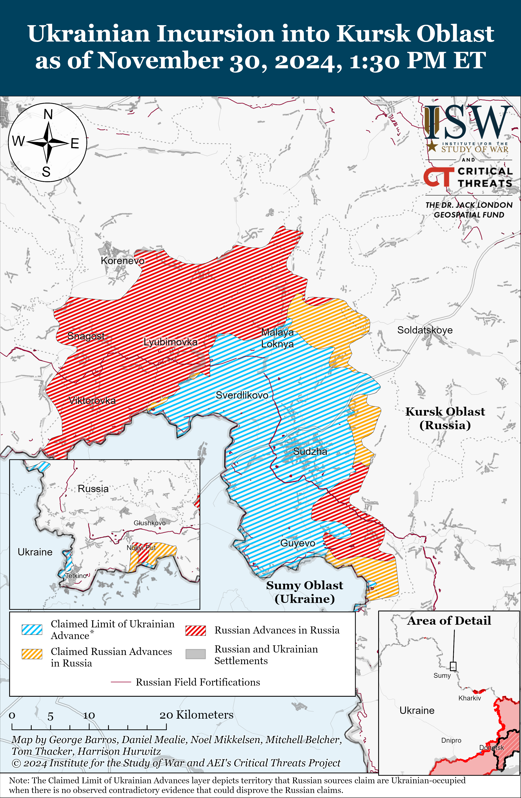
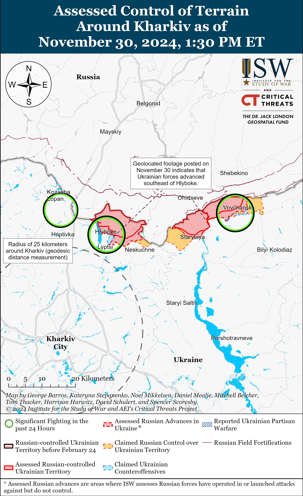
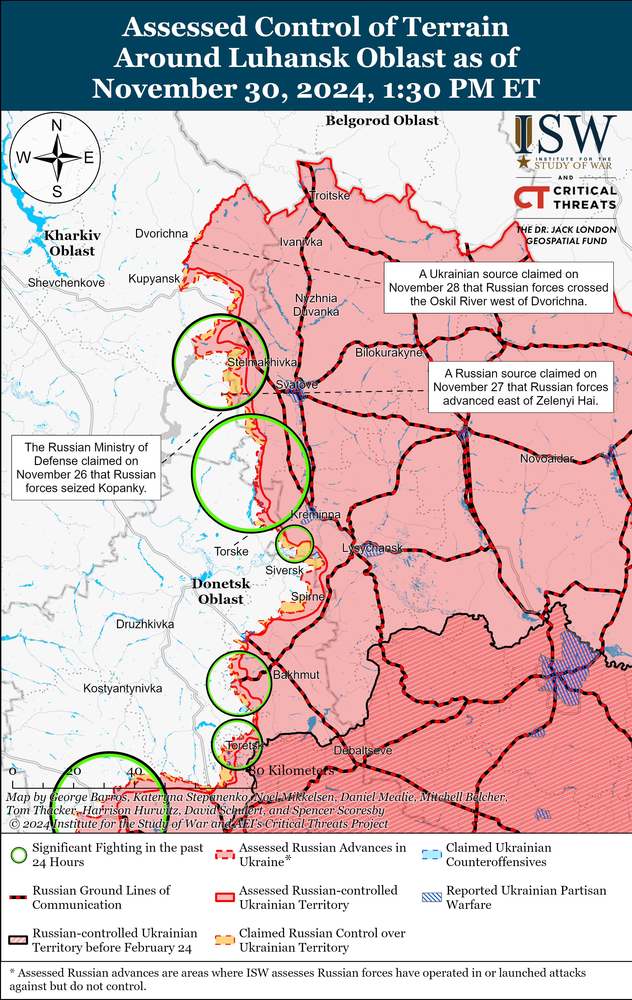
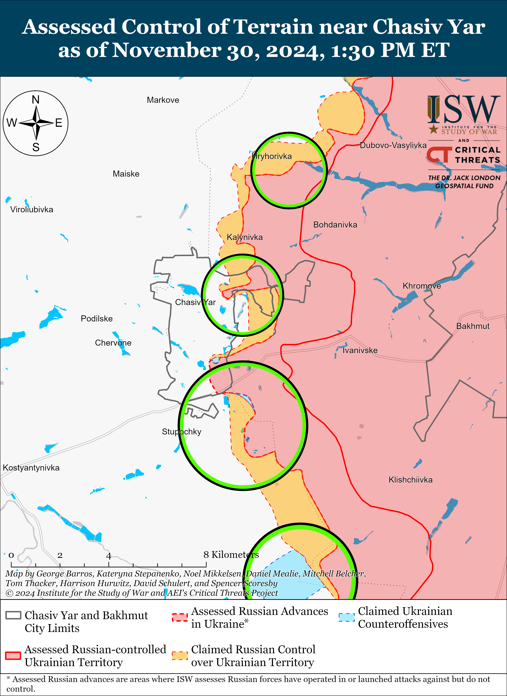
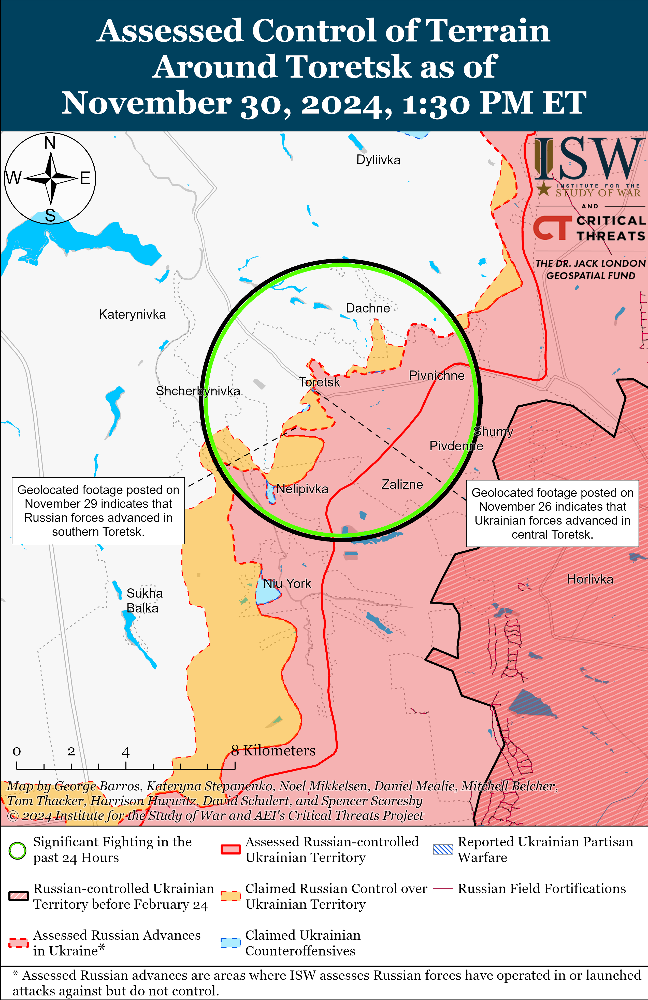
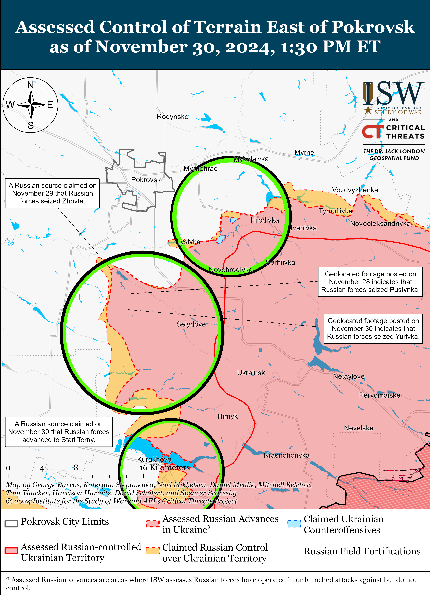
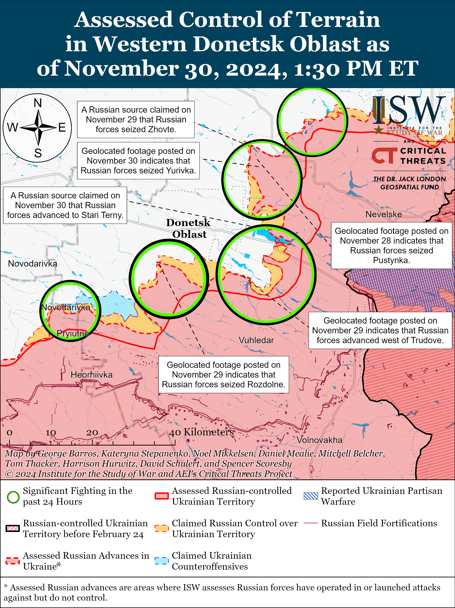
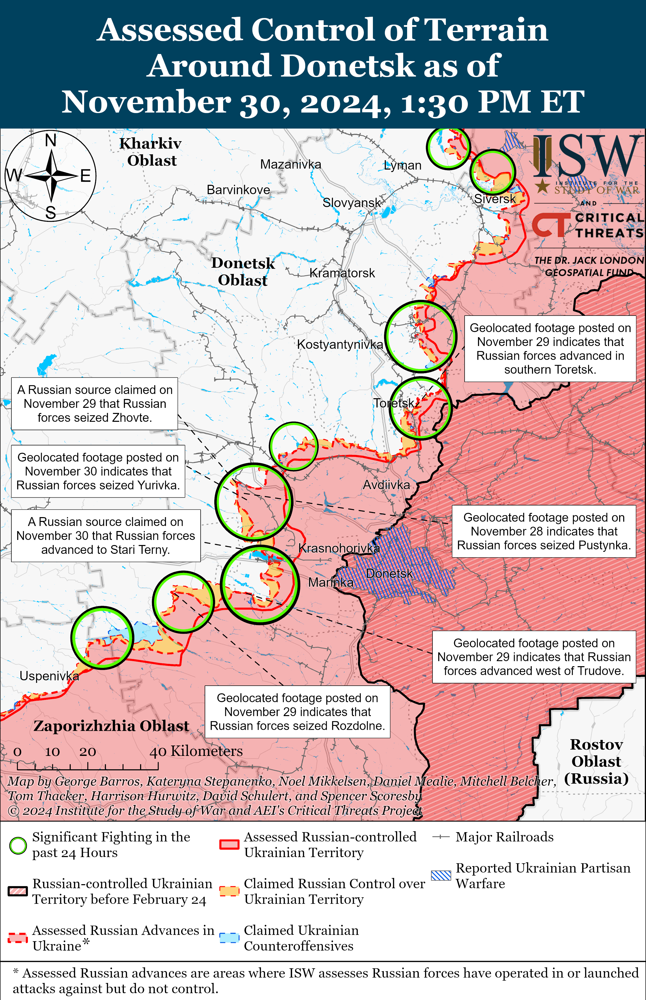
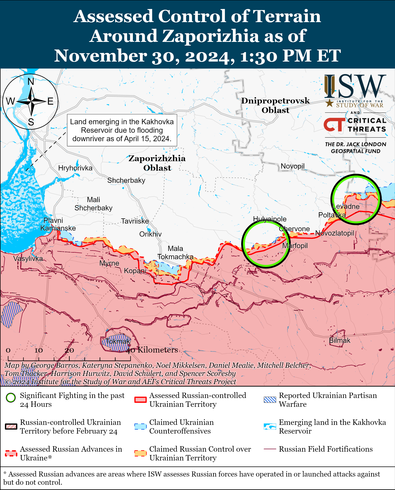
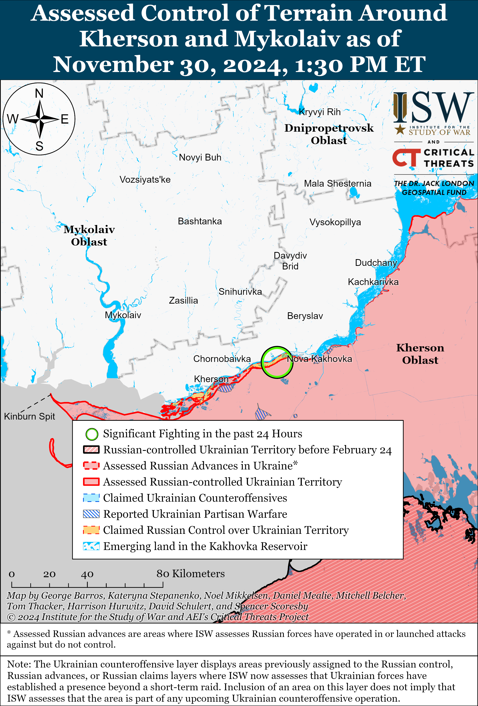

# Russian Offensive Campaign Assessment, November 30, 2024

**Christina Harward, Grace Mappes, Davit Gasparyan, Angelica Evans, Nate Trotter, and George Barros**

**November 30, 2024, 3:45 pm ET**

**Click**[**here**](https://storymaps.arcgis.com/stories/36a7f6a6f5a9448496de641cf64bd375)**to see ISW’s interactive map of the Russian invasion of Ukraine. This map is updated daily alongside the static maps present in this report.**

**Click**[**here**](https://understandingwar.maps.arcgis.com/apps/instant/3dviewer/index.html?appid=1602762dbcde419bb957dea358449580)**to see ISW’s 3D control of terrain topographic map of Ukraine. Use of a computer (not a mobile device) is strongly recommended for using this data-heavy tool.**

**Click**[**here**](https://storymaps.arcgis.com/stories/733fe90805894bfc8562d90b106aa895)**to access ISW’s archive of interactive time-lapse maps of the Russian invasion of Ukraine. These maps complement the static control-of-terrain map that ISW produces daily by showing a dynamic frontline. ISW will update this time-lapse map archive monthly.**

**Note: The data cut-off for this product was 11:30am ET on November 30. ISW will cover subsequent reports in the December 1 Russian Offensive Campaign Assessment.**

**Kremlin officials responded to Syrian opposition forces’ offensive into Syrian regime-held territory on November 29 and 30 and expressed interest in using the Astana Process to respond to the situation.**Kremlin Spokesperson Dmitry Peskov claimed on November 29 that the Syrian opposition forces’ offensive is an “encroachment on Syria’s sovereignty” and that Russia advocates for Syrian authorities to restore “constitutional order.”[1] Russian Foreign Minister Sergei Lavrov spoke on the phone with Turkish Foreign Minister Hakan Fidan on November 30 to discuss the situation in Syria.[2] The Russian Ministry of Foreign Affairs (MFA) claimed that both parties expressed serious concerns about the “dangerous developments” in Aleppo and Idlib provinces. Lavrov and Fidan reportedly discussed the need to coordinate joint Russian-Turkish actions to stabilize the situation, primarily through the Astana Process that Russia, Turkey, and Iran launched in December 2016. (The Astana Process is a rival political process to the United Nations [UN]-led Geneva Process under UN Security Council Resolution 2254.) Iranian Foreign Minister Abbas Araghchi also reportedly initiated a telephone conversation with Lavrov on November 30, during which Lavrov and Araghchi expressed “extreme concern” about the “dangerous escalation” in Syria.[3] Lavrov reportedly reaffirmed Russia’s strong support for Syria’s sovereignty and territorial integrity, and both agreed to intensify joint efforts to stabilize and review the situation through the Astana Process. It remains unclear whether the Kremlin will be able to deploy additional assets to support Syrian President Bashar al-Assad’s regime given the high tempo and operational requirements for Russia to continue conducting operations in Ukraine – the Kremlin’s priority theater. Russia withdrew S-300 systems from Syria back to Russia in 2022, likely to support Russian operations in Ukraine.[4]  ISW collected unconfirmed reports in March 2022 that Russia withdrew Russian soldiers and Wagner militants from Syria, likely to support Russian operations in Ukraine.[5]

**Russian Defense Minister Andrei Belousov met with North Korean dictator Kim Jong Un during his unannounced trip to Pyongyang on November 30.[6]**Belousov and Kim discussed the Russia-North Korea strategic partnership and relations between the Russian and North Korean militaries.[7] Kim reiterated support for Russia’s war in Ukraine and boilerplate rhetoric that the Kremlin uses to forward its reflexive control campaign aimed at forcing the West into self-deterrence.[8]

**Key Takeaways:**

- **Kremlin officials responded to Syrian opposition forces’ offensive into Syrian regime-held territory on November 29 and 30 and expressed interest in using the Astana Process to respond to the situation.**
- **Russian Defense Minister Andrei Belousov met with North Korean dictator Kim Jong Un during his unannounced trip to Pyongyang on November 30.**
- **Ukrainian forces recently regained lost positions north of Kharkiv City, and Russian forces recently advanced near Pokrovsk, Kurakhove, and Vuhledar.**
- **Russian milbloggers continued to criticize poor Russian military command decisions and poor training and discipline among Russian personnel.**

***We do not report in detail on Russian war crimes because these activities are well-covered in Western media and do not directly affect the military operations we are assessing and forecasting. We will continue to evaluate and report on the effects of these criminal activities on the Ukrainian military and the Ukrainian population and specifically on combat in Ukrainian urban areas. We utterly condemn Russian violations of the laws of armed conflict and the Geneva Conventions and crimes against humanity even though we do not describe them in these reports.***

- Ukrainian Operations in the Russian Federation
- Russian Main Effort – Eastern Ukraine (comprised of three subordinate main efforts)
- Russian Subordinate Main Effort #1 – Push Ukrainian forces back from the international border with Belgorod Oblast and approach to within tube artillery range of Kharkiv City
- Russian Subordinate Main Effort #2 – Capture the remainder of Luhansk Oblast and push westward into eastern Kharkiv Oblast and encircle northern Donetsk Oblast
- Russian Subordinate Main Effort #3 – Capture the entirety of Donetsk Oblast
- Russian Supporting Effort – Southern Axis
- Russian Air, Missile, and Drone Campaign
- Russian Mobilization and Force Generation Efforts
- Russian Technological Adaptations
- Activities in Russian-occupied areas
- Significant Activity in Belarus

**Ukrainian Operations in the Russian Federation**

Russian forces continued offensive operations in the main Ukrainian salient in Kursk Oblast on November 30 but did not make any confirmed advances. Russian milbloggers claimed that Russian forces advanced near Martynovka (northeast of Sudzha) and Darino and in eastern Tolsty Lug (both southeast of Korenevo) and seized the remainder of Darino, but ISW has not observed confirmation of these claims.[9] Russian sources claimed that fighting continued southeast of Korenevo near Novoivanovka, Darino, Nikolayevo-Darino, and Nizhny Klin; northwest of Sudzha near Sverdlikovo; and south of Sudzha near Plekhovo.[10] A Ukrainian senior non-commissioned officer of a company operating in the Kursk direction reported on November 30 that Russian forces are mostly conducting assaults on foot in teams of three-to-five people and stopped using heavy equipment following destructive Ukrainian strikes, and are instead using all-terrain vehicles (ATVs), motorcycles, and buggies.[11] The officer stated that Russian forces are concentrating reserve forces five-to-seven kilometers from the frontline but that Ukrainian strikes are preventing Russian forces from conducting rotations. Elements of the Russian 40th Naval Infantry Brigade (Pacific Fleet, Eastern Military District [EMD]) and 810th Naval Infantry Brigade (Black Sea Fleet, Southern Military District [SMD]) are reportedly operating in Kursk Oblast.[12]

Neither Russian nor Ukrainian sources reported fighting in Glushkovsky Raion west of the main Ukrainian salient on November 30.

**Russian Main Effort – Eastern Ukraine**

**Russian Subordinate Main Effort #1 – Kharkiv Oblast (Russian objective: Push Ukrainian forces back from the international border with Belgorod Oblast and approach to within tube artillery range of Kharkiv City)**

Ukrainian forces recently regained lost positions north of Kharkiv City amid continued Russian offensive operations in the Kharkiv direction on November 30. Geolocated footage published on November 30 shows Russian forces striking Ukrainian forces in a forested area southeast of Hlyboke (north of Kharkiv City), indicating that Ukrainian forces recently regained tactical positions in the area.[13] Russian milbloggers claimed that Ukrainian forces unsuccessfully counterattacked with armored vehicle support between Lyptsi (north of Kharkiv City) and Hlyboke.[14] A Russian milblogger claimed that Russian drone strikes are preventing Ukrainian forces from crossing the Vovcha River in Vovchansk (northeast of Kharkiv City).[15] Russian forces continued assaults along the international border northwest of Kharkiv City near Kudiivka, Hoptivka, and Kozacha Lopan; north of Kharkiv City near Hlyboke; and northeast of Kharkiv City near Vovchansk and Tykhe on November 29 and 30.[16]

**Russian Subordinate Main Effort #2 – Luhansk Oblast (Russian objective: Capture the remainder of Luhansk Oblast and push westward into eastern Kharkiv Oblast and northern Donetsk Oblast)**

Russian forces continued offensive operations along the Kupyansk-Svatove-Kreminna line on November 30. Russian sources claimed that Russian forces advanced near Novomlynsk (north of Kupyansk and on the western bank of the Oskil River); northwest of Kolisnykivka (southeast of Kupyansk); up to 500 meters near Lozova (southeast of Kupyansk); towards Yampolivka (northwest of Kreminna); and in eastern Terny (west of Kreminna).[17] A Russian source claimed that Russian forces control half of Zahryzove (southeast of Kupyansk).[18] ISW has not observed confirmation of these claims, however. Russian forces continued offensive operations southeast of Kupyansk near Kolisnykivka, Pishchane, Lozova, and Zahryzove; west of Svatove near Pershotravneve, Zeleny Hai, and Vyshneve; southwest of Svatove near Druzhelyubivka, Hrekivka and Novoyehorivka; northwest of Kreminna near Terny; west of Kreminna near Yampolivka, Torske, and Zarichne; southwest of Kreminna near Dibrova and the Serebryanske forest area; and south of Kreminna near Hryhorivka.[19] Elements of the Russian 1st Guards Tank Army (Moscow Military District [MMD]) are reportedly operating near Kopanky (west of Svatove); the Russian 144th Motorized Rifle Division (20th Combined Arms Army [CAA], MMD) near Terny; and drone operators of the Russian 16th Spetsnaz Brigade (Russian General Staff’s Main Directorate [GRU]) near Zarichne.[20]

**Russian Subordinate Main Effort #3 – Donetsk Oblast (Russian objective: Capture the entirety of Donetsk Oblast, the claimed territory of Russia’s proxies in Donbas)**

A Russian milblogger claimed on November 29 that fighting continues in the Siversk direction northeast of Siversk near Bilohorivka and east of Siversk near Verkhnokamyanske.[21]

Russian forces continued offensive operations near Chasiv Yar on November 30 but did not make confirmed advances in the area. Russian milbloggers claimed that Russian forces are advancing near the southern outskirts of the refractory plant in Chasiv Yar and south of Chasiv Yar.[22] A Kremlin-affiliated Russian milblogger claimed that Ukrainian forces maintain defensive positions in Novyi Microraion in eastern Chasiv Yar, but that Russian forces recently seized a position in northern Novyi Microraion that could complicate Ukraine’s defense in the area.[23] The milblogger claimed that the Block-9 mine (south of Chasiv Yar) is a contested “gray” zone and that Ukrainian forces are counterattacking near the mine. The representative of a Ukrainian brigade operating near Chasiv Yar reported that Russian forces are trying to bypass Ukrainian positions in the town and are trying to flank Chasiv Yar from the north and south.[24] The representative stated that Russian forces have not established enduring positions on the west bank of the Siversky Donets Donbas Canal within Chasiv Yar, but that Russian forces are penetrating Ukraine’s defensive lines in small groups. The representative noted that Ukrainian drone operators are striking Russian personnel concentrations in the area. Russian forces continued assaults north of Chasiv Yar near Kalynove; within Chasiv Yar itself; and south of Chasiv Yar near Predtechyne, Stupochky, and in the direction of Bila Hora on November 29 and 30.[25]

Russian forces continued offensive operations in the Toretsk direction on November 30 but did not make confirmed advances. The commander of a Ukrainian brigade operating in the Toretsk direction reported that Russian infantry are attacking only on foot in some areas of the Toretsk direction and are using vehicles to support assaults in other areas of this direction.[26] The commander stated that the Russian military command recently deployed more forces to the Toretsk area in order to penetrate Ukraine’s defensive lines. Russian forces continued assaults north of Toretsk near Druzhba, near Toretsk itself, and south of Toretsk near Nelipivka and Shcherbynivka on November 29 and 30.[27]

Russian forces recently advanced south of Pokrovsk amid continued offensive operations in the direction on November 30. Geolocated footage published on November 30 indicates that Russian forces recently advanced along the E50 highway northeast of Hryhorivka (south of Pokrovsk), seized the remainder of Yurivka (southwest of Hryhorivka), and advanced west of Pushkine (further southwest of Yurivka).[28] Russian milbloggers claimed on November 29 and 30 that Russian forces operating south of Pokrovsk advanced towards Ukrainka, to the outskirts of Novopustynaka, and also seized Zhovte, but ISW has not observed confirmation of these claims.[29] The Ukrainian General Staff reported that fighting continued east of Pokrovsk near Myrolyubivka, Myrnohrad, and Promin; southeast of Pokrovsk near Lysivka, Krasnyi Yar, and Krutyi Yar; and south of Pokrovsk near Novyi Trud, Pustynka, Dachenske, Chumatske, and Zhovte on November 29 and 30.[30]

Russian forces recently advanced north and northwest of Kurakhove amid continued offensive operations in the direction on November 30. Geolocated footage published on November 29 indicates that Russian forces recently marginally advanced north of Novodmytrivka (northwest of Kurakhove).[31] ISW currently assesses that it is unlikely that Ukrainian forces maintain a presence in the deep and narrow salient in the field south and southeast of Novoselydivka, north of Illinka, and northeast of Berestky (all north of Kurakhove). Russian forces likely hold positions in these fields given previous geolocated footage of Russian forces operating northwest and southwest of the fields. Russian milbloggers claimed on November 30 that Russian forces entered Stari Terny (north of Kurkahove and on the northwestern bank of the Kurakhivske Reservoir) but ISW has not observed confirmation of this claim.[32] The Ukrainian General Staff reported that Russian forces continued unsuccessful ground attacks near Kurakhove itself; northwest of Kurakhove near Sontsivka, Zorya, and Novodmytrivka and in the direction of Dachne; north of Kurakhove near Berestky; and south of Kurakhove near Dalne on November 29 and 30.[33] Elements of the Russian 102nd Motorized Rifle Regiment (150th Motorized Rifle Division, 8th Combined Arms Army [CAA], Southern Military District [SMD]) reportedly continue to operate near Dalne; elements of the 5th Motorized Rifle Brigade (51st CAA, formerly the 1st Donetsk People’s Republic Army Corps [DNR AC]) are reportedly operating within Kurakhove itself; and elements of the 255th Motorized Rifle Brigade (20th Motorized Rifle Division, 8th CAA, SMD) and elements of the Russian 238th Artillery Brigade (8th CAA, SMD) are reportedly operating in the Kurakhove direction.[34]

Russian forces recently advanced northwest of Vuhledar amid continued offensive operations in the Vuhledar direction on November 30. Geolocated footage published on November 29 indicates that Russian forces recently marginally advanced northwest of Trudove (northwest of Vuheldar) during a platoon-sized mechanized assault.[35] Russian milbloggers claimed that Russian forces operating northwest of Vuhledar advanced in an area 2.47 kilometers wide and 1.15 kilometers in depth west of Trudove and also advanced near Kostyantynopolske and Yansa Polyana.[36] Russian forces continued assaults north of Vuhledar near Veselyi Hai, Romanivka, Yelizavetivka, Hannivka, Katerynivka, and Antonivka and northwest of Vuhledar near Trudove, Rozlyv, Kostyantynopolske, and Sukhi Yaly on November 29 and 30.[37] Drone operators of the Russian 14th Guards Spetsnaz Brigade are reportedly operating in the south Donetsk (Vuhledar-Velyka Novosilka) direction.[38] Elements of the Russian 33rd Motorized Rifle Regiment (20th Motorized Rifle Division, 8th CAA, Southern Military District [SMD]) are reportedly operating near Illinka.[39]

Russian forces continued offensive operations in the Donetsk-Zaporizhia Oblast border area on November 30 but did not advance. Russian milbloggers claimed on November 30 that elements of the Russian 37th Motorized Rifle Brigade (36th CAA, Eastern Military District [EMD]) advanced in the fields southeast and east of Blahodatne and that Russian forces advanced southeast of Urozhaine (both south of Velyka Novosilka), although ISW has not observed confirmation of these claims.[40] Russian forces continued attacking near Velyka Novosilka itself; southwest of Velyka Novosilka near Rivnopil, Novodarivka, and in the direction of Novopil; and northeast of Velyka Novosilka near Rozdolne on November 29 and 30.[41] Elements of the Russian 143rd Motorized Rifle Regiment (127th Motorized Rifle Division, 5th CAA, EMD) are reportedly operating near Novodarivka (southwest of Velyka Novosilka).[42] Elements of the Russian 139th Separate Motorized Rifle Battalion (29th CAA, EMD) reportedly cut the T-0518 Kurakhove-Velyka Novosilka highway near Rozdolne, which a Russian milblogger claimed will complicate Ukrainian defenses in the area.[43]

**Russian Supporting Effort – Southern Axis (Russian objective: Maintain frontline positions and secure rear areas against Ukrainian strikes)**

Russian forces continued assaults in western Zaporizhia Oblast including north of Robotyne near Novodarivka on November 30 but did not make confirmed advances.[44] The commander of a Ukrainian National Guard brigade warned that Russian forces continue to prepare for a future large-scale offensive operation in Zaporizhia Oblast and are accumulating and regrouping forces and equipment in the area.[45] The commander noted that Russian forces are mainly conducting infantry assaults in Zaporizhia direction but occasionally use motorcycles and all-terrain vehicles (ATVs). Elements of the BARS “Sarmat” volunteer detachment (Russian Combat Army Reserve) are reportedly operating in the Orikhiv direction.[46]

The Ukrainian Ministry of Energy and Russian sources reported on November 30 that likely Russian shelling caused the Russian occupied Zaporizhzhia Nuclear Power Plant (ZNPP) to disconnect from the Ferrosplavna-1 power line.[47]

Russian forces continued assaults in the Dnipro direction, including in east (left) bank Kherson Oblast, on November 29 and 30 but did not make confirmed advances in the area.[48]

Ukrainian forces continue to strike Russian air defense systems and radars in occupied Crimea.[49]Ukraine’s Main Military Intelligence Directorate (GUR) reported on November 30 that Ukrainian forces struck a Russian “Kasta-2e2” radar system and two “Podlyot” radar systems in occupied Crimea on November 29.[50]

**Russian Air, Missile, and Drone Campaign (Russian Objective: Target Ukrainian military and civilian infrastructure in the rear and on the frontline)**

Russian forces conducted a small series of drone strikes on Ukraine on the night of November 29 to 30. The Ukrainian Air Force reported that Russian forces launched 10 Shahed drones and other unidentified drone types (possibly referring to decoy drones) from Kursk Oblast and Primorsk-Akhtarsk, Krasnodar Krai.[51] The Ukrainian Air Force reported that Ukrainian forces downed eight drones over Kyiv, Cherkasy, Kirovohrad, Dnipropetrovsk, and Kherson oblasts; that one drone became “lost,” likely due to Ukrainian electronic warfare (EW) Interference; and that another drone flew into airspace over occupied Ukraine. Mykolaiv Oblast Military Administration Head Vitaly Kim stated that Russian ballistic missiles caused a fire at an agricultural enterprise in Mykolaiv Raion.[52]

Ukrainian Air Force Spokesperson Major Ilya Yevlash stated on November 29 that some Russian Shahed drone variants with reduced payloads can fly around Ukraine for over 24 hours.[53] Yevlash noted that Russian forces modify the drones to have smaller warheads and larger fuel tanks, which allows them to fly for longer periods of time. Yevlash noted that the Ukrainian Air Force considers Russian drones to be “locationally lost” when the drones crash, run out of fuel or experience EW interference and reiterated that Russian forces are using decoy drones without warheads to overload Ukraine’s air defense systems.

Ukraine continues to rely on Western-provided systems to defend itself against large-scale Russian strikes. Ukrainian President Volodymyr Zelensky told UK outlet*SkyNews* during an interview published on November 29 that that Ukrainian forces used F-16 fighter jets to destroy seven Russian cruise missiles during a large-scale Russian missile strike on Ukrainian infrastructure “two nights ago,” likely referring to the large-scale Russian strike on the night of November 27 to 28.[54] Zelensky noted that Ukraine does not have enough F-16 aircraft or Patriot air defense systems to defend against large-scale Russian drone and missile strikes and called on the West to provide additional aircraft and air defense systems.

**Russian Mobilization and Force Generation Efforts (Russian objective: Expand combat power without conducting general mobilization)**

Russian milbloggers continued to criticize poor Russian military command decisions and poor training and discipline among Russian personnel. A Russian milblogger and former Storm-Z instructor complained that the command of the Russian 132nd Motorized Rifle Brigade (51st Combined Arms Army [CAA], formerly 1st Donetsk People’s Republic Army Corps [DNR AC]) is responsible for some assault elements of the 109th Motorized Rifle Regiment (1st “Slovyansk” Motorized Rifle Brigade, 51st CAA) and that the 132nd Brigade’s command sent an injured soldier back to an assault company in the Toretsk direction.[55] The milblogger noted this is a systemic problem within the 132nd Motorized Rifle Brigade and other Russian units more broadly. Another milblogger complained that Russian air defense forces in the near rear frequently attempt to shoot down Russian drones due to poor training, even though Russian drone operators always inform Russian air defenses when they launch drones.[56] The milblogger proposed that the military command punish personnel who attempt to shoot down Russia’s own drones.

The Russian Ministry of Defense (MoD) reported on November 30 that the Russian Aerospace Forces (VKS) and Chinese People’s Liberation Army (PLA) conducted a joint air patrol over the Sea of Japan, East China Sea, and western Pacific Ocean.[57]

A Russian insider source claimed that Russian law enforcement raids against nightclubs in Moscow, which Russian authorities conducted overnight on November 29 to 30 to enforce Russian censorship laws and the pseudo-state ideology, are actually intended to replenish the populations of penal colonies for Russian force generation efforts.[58] Russian authorities previously conducted raids targeting migrant communities to coerce migrants into joining the Russian military and capitalize on xenophobia against migrants following the March 2024 Crocus terrorist attack in Moscow.[59]

**Russian Technological Adaptations (Russian objective: Introduce technological innovations to optimize systems for use in Ukraine)**

Nothing significant to report.

**Activities in Russian-occupied areas (Russian objective: Consolidate administrative control of annexed areas; forcibly integrate Ukrainian citizens into Russian sociocultural, economic, military, and governance systems)**

*ISW is not publishing coverage of activities in Russian-occupied areas today.*

**Significant activity in Belarus (Russian efforts to increase its military presence in Belarus and further integrate Belarus into Russian-favorable frameworks and Wagner Group activity in Belarus)**

Nothing significant to report.

**Note: ISW does not receive any classified material from any source, uses only publicly available information, and draws extensively on Russian, Ukrainian, and Western reporting and social media as well as commercially available satellite imagery and other geospatial data as the basis for these reports. References to all sources used are provided in the endnotes of each update.**

[1] https://tass dot ru/politika/22533161

[2] https://mid dot ru/ru/foreign\_policy/news/1984573/

[3] https://mid dot ru/ru/foreign\_policy/news/1984580/

[4] https://twitter.com/manniefabian/status/1563214929938694144; https://twitter.com/SamRamani2/status/1563309536626151424; https://twitter.com/obretix/status/1563520254386802691; https://twitter.com/YorukIsik/status/1563501206668189697; https://understandingwar.org/backgrounder/russian-offensive-campaign-assessment-august-27; https://www.reuters.com/world/russia-ships-s-300-air-defence-missiles-out-syria-satellite-images-2022-08-29/

[5] https://understandingwar.org/backgrounder/russia-mobilizes-reinforcements-syria-and-africa-ukraine;

http://syria dot tv/%D8%A7%D9%84%D9%82%D9%88%D8%A7%D8%AA-%D8%A7%D9%84%D8%B1%D9%88%D8%B3%D9%8A%D8%A9-%D8%AA%D9%86%D8%B3%D8%AD%D8%A8-%D9%85%D9%86-%D9%85%D8%B3%D8%AA%D9%88%D8%AF%D8%B9%D8%A7%D8%AA-%D9%85%D9%87%D9%8A%D9%86-%D8%B4%D8%B1%D9%82%D9%8A-%D8%AD%D9%85%D8%B5

[6] https://isw.pub/UkrWar112924

[7] https://apnews.com/article/north-korea-russia-troops-ukraine-belousov-visit-35a6fd80f64ae2dd01637ed5e5b6451d ; https://t.me/tass\_agency/288190 ; https://meduza dot io/news/2024/11/30/ministr-oborony-rf-andrey-belousov-vstretilsya-s-kim-chen-ynom-i-priglasil-voennyh-severnoy-korei-na-parad-9-maya; https://t.me/mod\_russia/46353; https://kcnawatch dot org/newstream/1732968641-691807260/respected-comrade-kim-jong-un-receives-russian-minister-of-defence/; http://rodong.rep dot kp/en/index.php?MTVAMjAyNC0xMS0zMC1IMDExQA==

[8] https://kcnawatch dot org/newstream/1732968641-691807260/respected-comrade-kim-jong-un-receives-russian-minister-of-defence/; http://rodong.rep dot kp/en/index.php?MTVAMjAyNC0xMS0zMC1IMDExQA==; https://t.me/tass\_agency/288191

[9] https://t.me/dva\_majors/58963; https://t.me/RVvoenkor/81645; https://t.me/DnevnikDesantnika/20126

[10] https://t.me/dva\_majors/58963; https://t.me/RVvoenkor/81645; https://t.me/DnevnikDesantnika/20126; https://t.me/boris\_rozhin/146113; https://t.me/rusich\_army/18902; https://t.me/dva\_majors/58992

[11] https://armyinform dot com.ua/2024/11/30/obnulennya-zamist-rotacziyi-rosiyany-poshyryuyut-taktyku-zombi-shturmiv-j-na-kurshhyni/ ; https://www.youtube.com/watch?v=aDXWlQ2K0dM

[12] https://t.me/tass\_agency/288202 ; https://t.me/ombr41/930

[13] https://t.me/creamy\_caprice/7689; https://t.me/warriorofnorth/4476

[14] https://t.me/RVvoenkor/81619; https://t.me/motopatriot/29891; https://t.me/boris\_rozhin/146113

[15] https://t.me/DnevnikDesantnika/20133

[16] https://www.facebook.com/GeneralStaff.ua/posts/pfbid02aRBawRAPHgoyUJFeLTL9LQgA6vowLBvdcG6yVTq7yixwnvrXCuagQnCmPampJ8Pml; https://www.facebook.com/GeneralStaff.ua/posts/pfbid0nh8CuqBLm9McEnYz2yN7ECCaf21Q4x9M7jPedUq3SUXj749R9E8wGGX8DC4Z8cCQl; https://www.facebook.com/GeneralStaff.ua/posts/pfbid0twA2ug8EJqKjA58HhwAWWPoYbg3hpEygohFNvS7A5A2eSjf5r4oHYEMj7rGDhaBql; https://t.me/otukharkiv/2854

[17] https://t.me/tass\_agency/288201; https://t.me/boris\_rozhin/146113; https://t.me/DnevnikDesantnika/20130; https://t.me/boris\_rozhin/146113

[18] https://t.me/boris\_rozhin/146113

[19] https://www.facebook.com/GeneralStaff.ua/posts/pfbid02aRBawRAPHgoyUJFeLTL9LQgA6vowLBvdcG6yVTq7yixwnvrXCuagQnCmPampJ8Pml; https://www.facebook.com/GeneralStaff.ua/posts/pfbid0nh8CuqBLm9McEnYz2yN7ECCaf21Q4x9M7jPedUq3SUXj749R9E8wGGX8DC4Z8cCQl; https://www.facebook.com/GeneralStaff.ua/posts/pfbid0twA2ug8EJqKjA58HhwAWWPoYbg3hpEygohFNvS7A5A2eSjf5r4oHYEMj7rGDhaBql; https://www.facebook.com/GeneralStaff.ua/posts/pfbid02aRBawRAPHgoyUJFeLTL9LQgA6vowLBvdcG6yVTq7yixwnvrXCuagQnCmPampJ8Pml; https://www.facebook.com/GeneralStaff.ua/posts/pfbid0nh8CuqBLm9McEnYz2yN7ECCaf21Q4x9M7jPedUq3SUXj749R9E8wGGX8DC4Z8cCQl; https://www.facebook.com/GeneralStaff.ua/posts/pfbid0twA2ug8EJqKjA58HhwAWWPoYbg3hpEygohFNvS7A5A2eSjf5r4oHYEMj7rGDhaBql; https://t.me/dva\_majors/58963

[20] https://t.me/boris\_rozhin/146214; https://t.me/boris\_rozhin/146167; https://t.me/rian\_ru/271014; https://t.me/vysokygovorit/18167 ; https://t.me/sashakots/50496 ; https://t.me/epoddubny/21785

[21] https://t.me/boris\_rozhin/146113

[22] https://t.me/boris\_rozhin/146113 ; https://t.me/rybar/65831

[23] https://t.me/rybar/65831

[24] https://www.youtube.com/watch?v=rhp6uQ7g9Vw ; https://armyinform.com dot ua/2024/11/29/u-sylah-oborony-rozpovily-pro-bezuspishni-sproby-rosiyan-perejty-kanal-u-chasovomu-yari/

[25] https://www.facebook.com/GeneralStaff.ua/posts/pfbid02aRBawRAPHgoyUJFeLTL9LQgA6vowLBvdcG6yVTq7yixwnvrXCuagQnCmPampJ8Pml ; https://www.facebook.com/GeneralStaff.ua/posts/pfbid0nh8CuqBLm9McEnYz2yN7ECCaf21Q4x9M7jPedUq3SUXj749R9E8wGGX8DC4Z8cCQl ; https://www.facebook.com/GeneralStaff.ua/posts/pfbid0twA2ug8EJqKjA58HhwAWWPoYbg3hpEygohFNvS7A5A2eSjf5r4oHYEMj7rGDhaBql ; https://t.me/wargonzo/23420 ; https://t.me/boris\_rozhin/146113 ; https://t.me/DnevnikDesantnika/20165 ; https://t.me/rybar/65831

[26] https://www.youtube.com/watch?v=JFvyCBahZ\_k ; https://suspilne dot media/donbas/891931-aku-taktiku-zastosovue-rosijska-armia-na-toreckomu-napramku/

[27] https://www.facebook.com/GeneralStaff.ua/posts/pfbid02aRBawRAPHgoyUJFeLTL9LQgA6vowLBvdcG6yVTq7yixwnvrXCuagQnCmPampJ8Pml  ; https://www.facebook.com/GeneralStaff.ua/posts/pfbid0nh8CuqBLm9McEnYz2yN7ECCaf21Q4x9M7jPedUq3SUXj749R9E8wGGX8DC4Z8cCQl  ; https://www.facebook.com/GeneralStaff.ua/posts/pfbid0twA2ug8EJqKjA58HhwAWWPoYbg3hpEygohFNvS7A5A2eSjf5r4oHYEMj7rGDhaBql  ; https://t.me/boris\_rozhin/146113

[28] https://t.me/creamy\_caprice/7696; https://t.me/jagers68/468; https://t.me/creamy\_caprice/7697; https://www.facebook.com/3012NGU/videos/1103819791122910/ ; https://t.me/creamy\_caprice/7697; https://www.facebook.com/3012NGU/videos/1103819791122910/

[29] https://t.me/boris\_rozhin/146113  ; https://t.me/voenkorKotenok/60401

[30] https://www.facebook.com/GeneralStaff.ua/posts/pfbid02aRBawRAPHgoyUJFeLTL9LQgA6vowLBvdcG6yVTq7yixwnvrXCuagQnCmPampJ8Pml; https://www.facebook.com/GeneralStaff.ua/posts/pfbid0nh8CuqBLm9McEnYz2yN7ECCaf21Q4x9M7jPedUq3SUXj749R9E8wGGX8DC4Z8cCQl; https://www.facebook.com/GeneralStaff.ua/posts/pfbid0twA2ug8EJqKjA58HhwAWWPoYbg3hpEygohFNvS7A5A2eSjf5r4oHYEMj7rGDhaBql

[31] https://t.me/creamy\_caprice/7687; https://t.me/hydra\_subdivision137/60

[32] https://t.me/wargonzo/23420; https://t.me/voenkorKotenok/60401

[33] https://www.facebook.com/GeneralStaff.ua/posts/pfbid02aRBawRAPHgoyUJFeLTL9LQgA6vowLBvdcG6yVTq7yixwnvrXCuagQnCmPampJ8Pml; https://www.facebook.com/GeneralStaff.ua/posts/pfbid0nh8CuqBLm9McEnYz2yN7ECCaf21Q4x9M7jPedUq3SUXj749R9E8wGGX8DC4Z8cCQl; https://www.facebook.com/GeneralStaff.ua/posts/pfbid0twA2ug8EJqKjA58HhwAWWPoYbg3hpEygohFNvS7A5A2eSjf5r4oHYEMj7rGDhaBql

[34] https://t.me/nm\_dnr/13045 ; https://t.me/boris\_rozhin/146172; https://t.me/RVvoenkor/81656 ; https://t.me/RVvoenkor/81631; https://t.me/dva\_majors/58951;

[35] https://t.me/creamy\_caprice/7686; https://www.facebook.com/37obrmp/videos/592205193343557/

[36] https://t.me/boris\_rozhin/146113 ; https://t.me/dva\_majors/58998; https://t.me/Khortytsky\_wind/2747 ; https://x.com/GirkinGirkin/status/1862571235160240316

[37] https://www.facebook.com/GeneralStaff.ua/posts/pfbid02aRBawRAPHgoyUJFeLTL9LQgA6vowLBvdcG6yVTq7yixwnvrXCuagQnCmPampJ8Pml; https://www.facebook.com/GeneralStaff.ua/posts/pfbid0nh8CuqBLm9McEnYz2yN7ECCaf21Q4x9M7jPedUq3SUXj749R9E8wGGX8DC4Z8cCQl; https://www.facebook.com/GeneralStaff.ua/posts/pfbid0twA2ug8EJqKjA58HhwAWWPoYbg3hpEygohFNvS7A5A2eSjf5r4oHYEMj7rGDhaBql

[38] https://t.me/voin\_dv/12067

[39] https://t.me/dva\_majors/58991

[40] https://t.me/ne\_rybar/3208 ; https://t.me/rybar/65877

[41] https://www.facebook.com/GeneralStaff.ua/posts/pfbid02aRBawRAPHgoyUJFeLTL9LQgA6vowLBvdcG6yVTq7yixwnvrXCuagQnCmPampJ8Pml; https://www.facebook.com/GeneralStaff.ua/posts/pfbid0nh8CuqBLm9McEnYz2yN7ECCaf21Q4x9M7jPedUq3SUXj749R9E8wGGX8DC4Z8cCQl; https://www.facebook.com/GeneralStaff.ua/posts/pfbid0twA2ug8EJqKjA58HhwAWWPoYbg3hpEygohFNvS7A5A2eSjf5r4oHYEMj7rGDhaBql

[42] https://t.me/voin\_dv/12063

[43] https://t.me/RVvoenkor/81611

[44] https://www.facebook.com/OperationalCommandSouth/posts/pfbid0cjBiYYm7frVp9WFRbLgtKKKt5zjD7Jp1QkXThCRkpFX4zt37EkdwCFPedk84ywXyl ; https://t.me/SJTF\_Odes/11821

[45] https://suspilne dot media/zaporizhzhia/891535-rosijska-armia-gotuetsa-do-nastupu-v-zaporizkij-oblasti-hilcenko/

[46] https://t.me/rogozin\_do/6527

[47] https://t.me/energyofukraine/3302 ; https://suspilne dot media/zaporizhzhia/891817-timcasovo-okupovana-zaporizka-aes-vcergove-vtratila-pidklucenna-do-odniei-z-zovnisnogo-linij-zivlenna-minenergo/ ; https://t.me/tass\_agency/288224

[48] https://www.facebook.com/GeneralStaff.ua/posts/pfbid0nh8CuqBLm9McEnYz2yN7ECCaf21Q4x9M7jPedUq3SUXj749R9E8wGGX8DC4Z8cCQl ; https://www.facebook.com/GeneralStaff.ua/posts/pfbid0twA2ug8EJqKjA58HhwAWWPoYbg3hpEygohFNvS7A5A2eSjf5r4oHYEMj7rGDhaBql

[49] https://understandingwar.org/backgrounder/russian-offensive-campaign-assessment-november-29-2024

[50] https://t.me/DIUkraine/4925 ; https://suspilne dot media/crimea/891833-v-okupovanomu-krimu-zniseno-tri-radiolokacijni-stancii-gur/

[51] https://t.me/kpszsu/23957 ; https://www.facebook.com/GeneralStaff.ua/posts/pfbid0dtgDgZYjZePvbpCcfscAcVVEfvMJiyYtBpyGxE2phs5w7nqKgsDgcZpsYaR9ecdMl

[52] https://t.me/mykolaivskaODA/12306; https://armyinform.com dot ua/2024/11/30/protyvnyk-udaryv-balistykoyu-po-mykolayivshhyni-ryatuvalnyky-likviduvaly-pozhezhu/

[53] https://www.youtube.com/watch?v=1UeMazF9wqI ; https://newsukraine.rbc dot ua/news/shahed-can-fly-for-up-to-24-hours-over-ukrainian-1732914439.html

[54] https://isw.pub/UkrWar112924 ; https://news.sky.com/video/sky-news-speaks-exclusively-to-president-zelenskyy-about-putin-nato-and-trump-13263345 ; https://www.youtube.com/live/7Df0DQ7GWUc ; https://suspilne dot media/892019-zelenskij-zaaviv-so-f-16-pid-cas-ostannoi-masovanoi-ataki-znisili-sim-rosijskih-raket/ ; https://armyinform.com dot ua/2024/11/30/prezydent-rozpoviv-skilky-krylatyh-raket-znyshhyly-litaky-f-16-pid-chas-ostannoyi-ataky/

[55] https://t.me/philologist\_zov/1745

[56] https://t.me/vysokygovorit/18156

[57] https://t.me/mod\_russia/46374

[58] https://t.me/vysokygovorit/18156; https://t.me/tass\_agency/288230 ; https://meduza dot io/news/2024/11/30/politsiya-provela-reydy-v-treh-moskovskih-nochnyh-klubah ; https://t.me/astrapress/69491; https://t.me/astrapress/69492

[59] https://understandingwar.org/backgrounder/russian-offensive-campaign-assessment-september-8-2024; https://understandingwar.org/backgrounder/russian-offensive-campaign-assessment-march-27-2024; https://understandingwar.org/backgrounder/russian-offensive-campaign-assessment-april-9-2024; https://understandingwar.org/backgrounder/russian-offensive-campaign-assessment-january-14-2024
