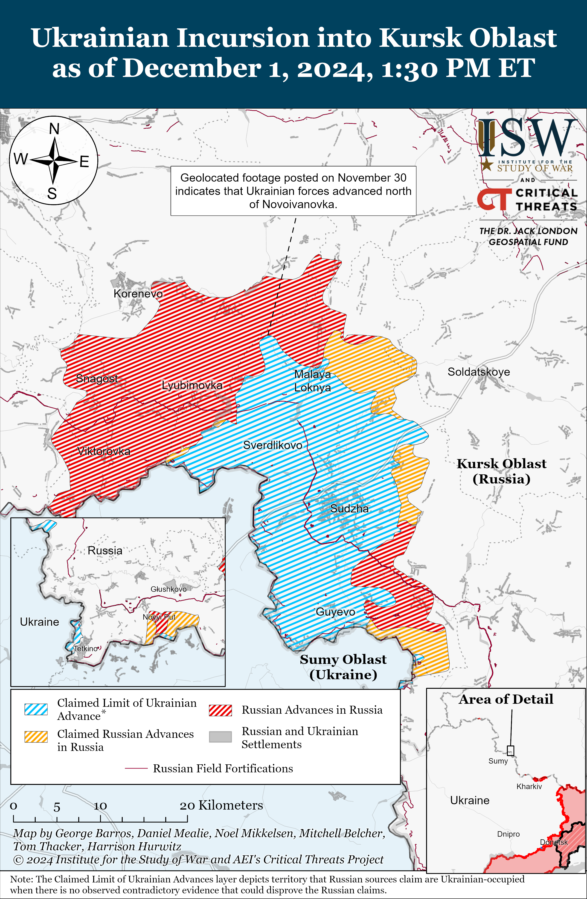
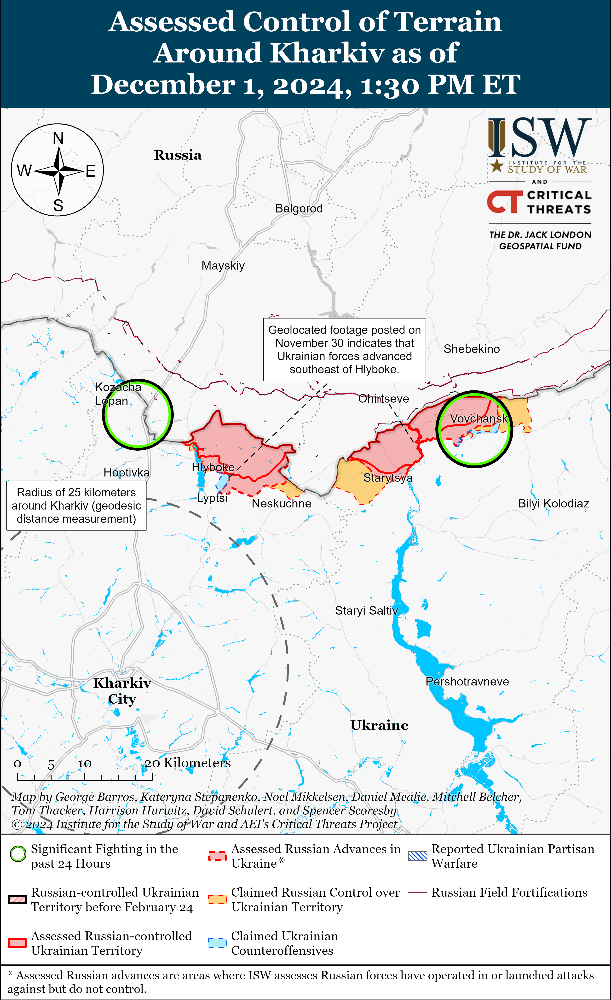
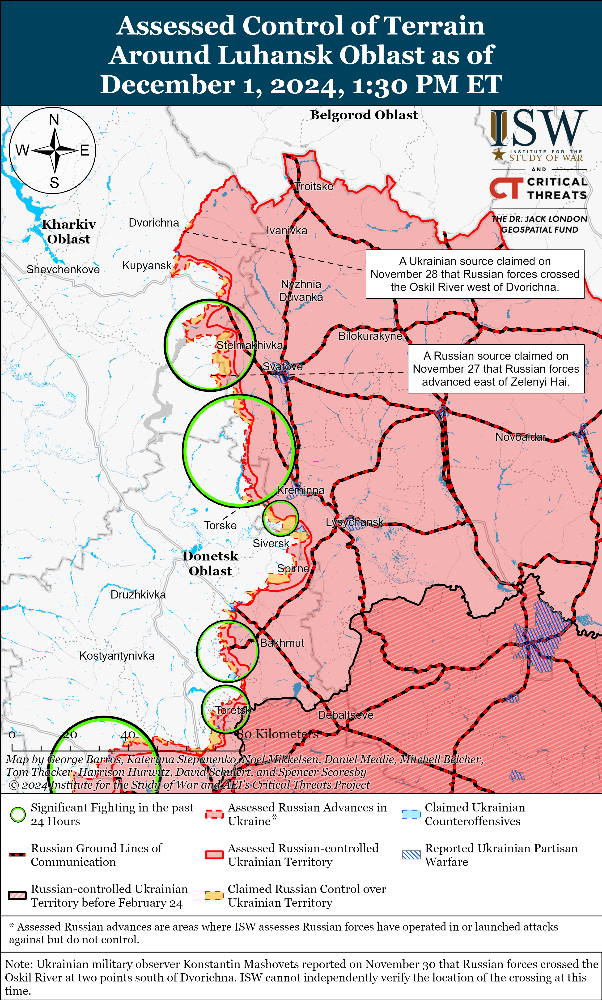
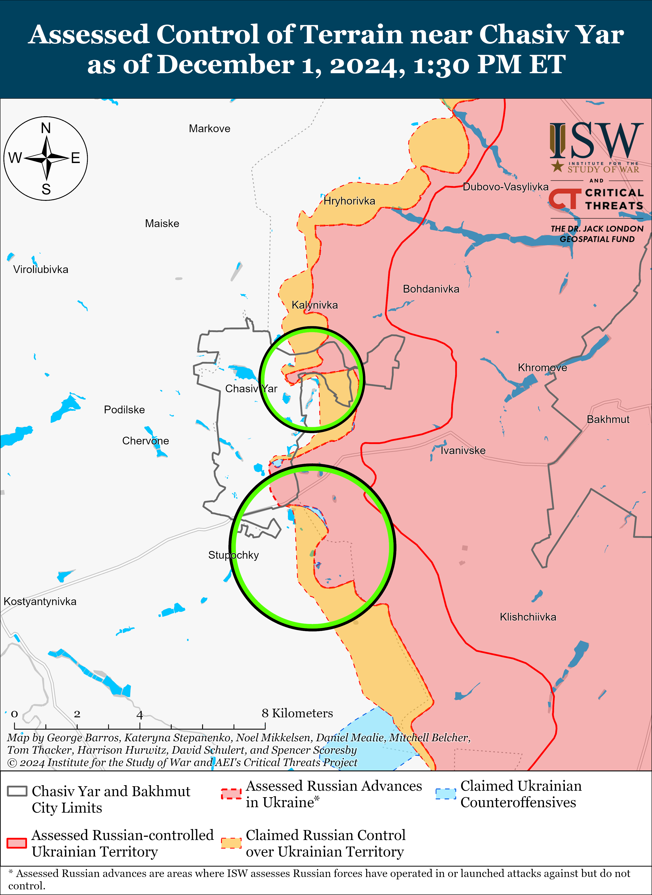
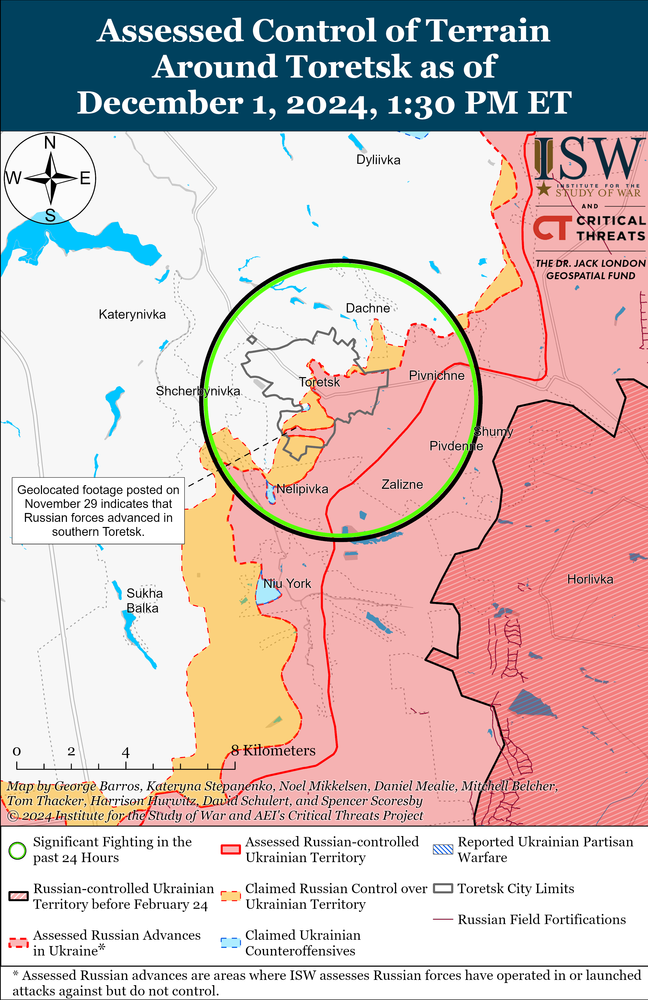
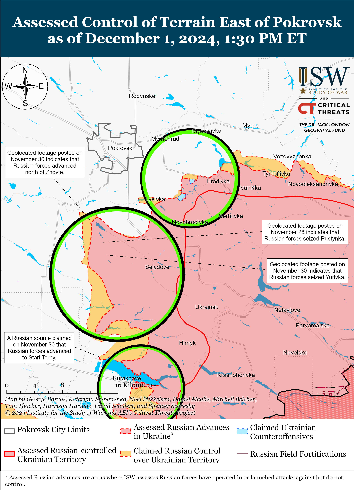
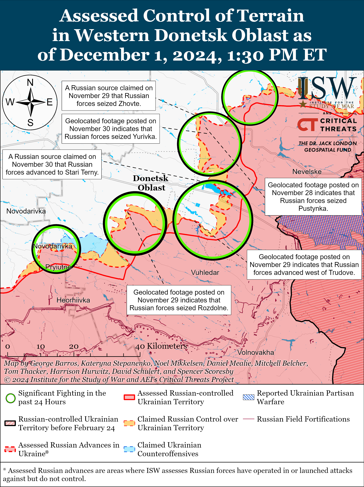
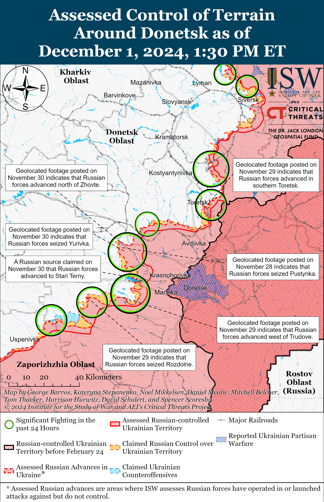
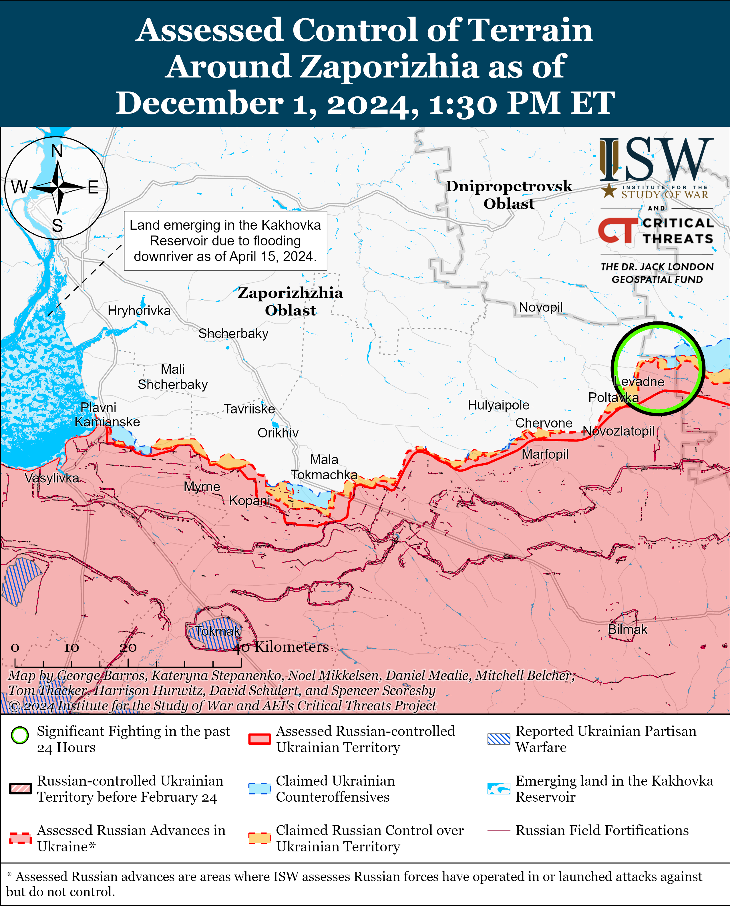
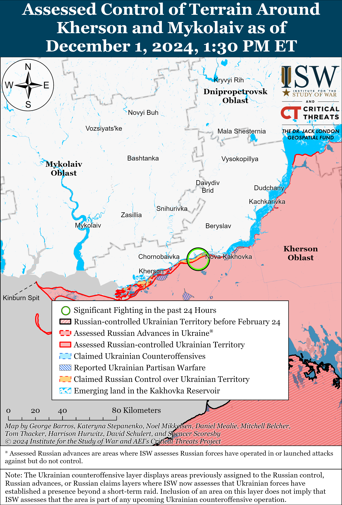

# Russian Offensive Campaign Assessment, December 1, 2024

**Grace Mappes, Davit Gasparyan, Christina Harward, Nicole Wolkov, and George Barros**

**December 1, 2024, 3:40pm ET**

**Click** [**here**](https://storymaps.arcgis.com/stories/36a7f6a6f5a9448496de641cf64bd375) **to see ISW’s interactive map of the Russian invasion of Ukraine. This map is updated daily alongside the static maps present in this report.**

**Click** [**here**](https://understandingwar.maps.arcgis.com/apps/instant/3dviewer/index.html?appid=1602762dbcde419bb957dea358449580) **to see ISW’s 3D control of terrain topographic map of Ukraine. Use of a computer (not a mobile device) is strongly recommended for using this data-heavy tool.**

**Click** [**here**](https://storymaps.arcgis.com/stories/733fe90805894bfc8562d90b106aa895) **to access ISW’s archive of interactive time-lapse maps of the Russian invasion of Ukraine. These maps complement the static control-of-terrain map that ISW produces daily by showing a dynamic frontline. ISW will update this time-lapse map archive monthly.**

**Note: The data cut-off for this product was 12:15pm ET on December 1. ISW will cover subsequent reports in the December 2 Russian Offensive Campaign Assessment.**

**The Russian Ministry of Defense (MoD) reportedly replaced Lieutenant General Sergei Kisel with Colonel General Alexander Chaiko who will reprise his previous assignment as commander of the Russian Force Grouping in Syria, though it remains unclear how Russian operations in Syria may change.** Russian ultranationalist milbloggers, including the Kremlin-linked Rybar Telegram channel, claimed on November 30 and December 1 that the MoD removed Kisel as Commander of the Russian Force Grouping in Syria and replaced him with Chaiko.[1] Ukraine’s Main Military Intelligence Directorate (GUR) reported on December 1 that Chaiko replaced Kisel and that Russian Navy Commander-in-Chief Admiral Alexander Moiseyev arrived in Tartus, Syria.[2] Chaiko served as chief of staff of the Russian Force Grouping in Syria from 2015 to 2017 and served as overall commander of the Russian Force Grouping in Syria in September 2019 to November 2020, February to June 2021, and September to December 2022.[3] It is unclear what Chaiko’s assignment was between December 2022 until present. Kisel has reportedly commanded the Russian Force Grouping in Syria since at least May 2024.[4] Some Russian milbloggers claimed that Kisel’s removal will not significantly change the situation or Russian operations in Syria because the Russian military command has routinely rotated commanders to positions in Syria after battlefield failures in Ukraine.[5] ISW is unable to independently confirm this reported command change at this time.

**Russian President Vladimir Putin signed a decree approving the 2025 federal budget and the 2026–2027 draft federal budget on December 1.[6]** The 2025 budget allocates about 41 percent of Russia’s annual expenditures to national security and defense.[7] ISW continues to assess that the increased Russian defense spending, while dangerous, does not necessarily equate to a one-to-one increase in Russian military capabilities, especially given that significant funding is going towards paying benefits to Russian soldiers, veterans, and their families.[8] Russia’s continued focus on defense spending is likely also affecting the effectiveness and sustainability of Russian social programs, which may affect the Kremlin’s ability to sustain its war in Ukraine, given mounting pressures on the Russian economy and Putin’s observed tendency to avoid risking his regime’s stability.

**Russian state media reported that the Russian military command appointed Colonel General Rustam Muradov as the First Deputy Commander of the Russian Ground Forces.** Russian state outlet *RBK* reported on December 1 that a source close to the Russian Ministry of Defense (MoD) confirmed Muradov’s appointment.[9] The head of Tabasaransky Raion in the Republic of Dagestan, Magomed Kurabanov, reported about Muradov’s appointment on November 28.[10] The Russian MoD has yet to publicly confirm the appointment.

**The Georgian opposition continues to contest the legitimacy of Georgia’s ruling Georgian Dream party’s electoral victory following Georgian Dream’s suspension of Georgia’s European Union (EU) membership accession talks.** Georgian Dream announced on November 28 that it will suspend the country’s EU accession negotiations and will reject EU grants following a European Parliament resolution deeming the largely contested the October 26 Georgian parliamentary elections as “neither free nor fair.”[11] The Georgian constitution has an enshrined aspiration to join the EU, and Georgian Dream’s suspension of EU membership talks contradicts the constitution and the demonstrated will of most Georgians who have strived for EU accession for decades.[12] The Georgian opposition – comprised of opposition parties, Georgian President Salome Zourabichvili, and Georgian civil society – immediately called for protests and continued to contest the legitimacy of the Georgian Dream party’s electoral victory and its actions. Zourabichvili stated on November 30 that she would remain the sole legal authority of the Georgian government until new elections are held and that the new Georgian Dream-dominated parliament has no right to elect a new president in December 2024, as they intend to do.[13] Georgian presidential elections are currently scheduled for December 14.[14] The Georgian opposition has been protesting Georgian Dream’s decision to suspend efforts for EU membership halt across Georgia since November 28, and Georgian riot police have violently suppressed peaceful protestors using, water cannons, beatings, and other violent tactics.[15] Various Georgian ambassadors have resigned in protest of Georgian Dream’s actions, including Georgian Ambassador to the US David Zalkaliani.[16] The US State Department announced on November 30 that it is suspending the US-Georgia Strategic Partnership in response to Georgian Dream’s “various anti-democratic actions”, while European officials have criticized Georgian Dream’s actions, voiced solidarity with the protesters, and suggested sanctioning Georgian authorities.[17] ISW previously assessed that a Georgian Dream parliamentary victory would likely derail Georgia’s EU and NATO accession aspirations and degrade Georgia’s relationships with its Western partners.[18]

**Key Takeaways:**

- **The Russian Ministry of Defense (MoD) reportedly replaced Lieutenant General Sergei Kisel with Colonel General Alexander Chaiko who will reprise his previous assignment as commander of the Russian Force Grouping in Syria, though it remains unclear how Russian operations in Syria may change.**
- **Russian President Vladimir Putin signed a decree approving the 2025 federal budget and the 2026–2027 draft federal budget on December 1.**
- **Russian state media reported that the Russian military command appointed Colonel General Rustam Muradov as the First Deputy Commander of the Russian Ground Forces.**
- **The Georgian opposition continues to contest the legitimacy of Georgia’s ruling Georgian Dream party’s electoral victory following Georgian Dream’s suspension of Georgia’s European Union (EU) membership accession talks.**
- **Ukrainian forces recently advanced in Kursk Oblast, and Russian forces recently advanced near Pokrovsk and Hulyaipole.**

***We do not report in detail on Russian war crimes because these activities are well-covered in Western media and do not directly affect the military operations we are assessing and forecasting. We will continue to evaluate and report on the effects of these criminal activities on the Ukrainian military and the Ukrainian population and specifically on combat in Ukrainian urban areas. We utterly condemn Russian violations of the laws of armed conflict and the Geneva Conventions and crimes against humanity even though we do not describe them in these reports.***

- Ukrainian Operations in the Russian Federation
- Russian Main Effort – Eastern Ukraine (comprised of three subordinate main efforts)
- Russian Subordinate Main Effort #1 – Push Ukrainian forces back from the international border with Belgorod Oblast and approach to within tube artillery range of Kharkiv City
- Russian Subordinate Main Effort #2 – Capture the remainder of Luhansk Oblast and push westward into eastern Kharkiv Oblast and encircle northern Donetsk Oblast
- Russian Subordinate Main Effort #3 – Capture the entirety of Donetsk Oblast
- Russian Supporting Effort – Southern Axis
- Russian Air, Missile, and Drone Campaign
- Russian Mobilization and Force Generation Efforts
- Russian Technological Adaptations
- Activities in Russian-occupied areas
- Significant Activity in Belarus

**Ukrainian Operations in the Russian Federation**

Ukrainian forces recently advanced in the main Ukrainian salient in Kursk Oblast amid continued fighting on December 1. Geolocated footage published on November 30 indicates that Ukrainian forces recently advanced north of Novoivanovka (southeast of Korenevo).[19] A Russian milblogger claimed that Russian forces conducted offensive operations southeast of Korenevo near Darino, north of Sudzha near Plekhovo, and northeast of Sudzha near Martynovka.[20] Ukrainian forces reportedly counterattacked near Pogrebki (northwest of Sudzha).[21] A senior Ukrainian non-commissioned officer of a platoon operating in the Kursk direction stated on December 1 that Russian forces use powerful electronic warfare (EW) systems to cover and facilitate Russian assault operations in Kursk Oblast.[22] Elements of the Russian 155th Naval Infantry Brigade (Pacific Fleet, Eastern Military District [EMD]), the 810th Naval Infantry Brigade (Black Sea Fleet [BSF], Southern Military District [SMD]), and the 56th Airborne (VDV) Regiment (7th VDV Division) are reportedly operating in Kursk Oblast.[23]

**Russian Main Effort – Eastern Ukraine**

**Russian Subordinate Main Effort #1 – Kharkiv Oblast** **(Russian objective: Push Ukrainian forces back from the international border with Belgorod Oblast and approach to within tube artillery range of Kharkiv City)**

Russian milbloggers claimed on December 1 that Russian special operations forces destroyed two bridges just across the international border in near Tymonovychi and Karpovychi, Chernihiv Oblast.[24] ISW has not observed Ukrainian sources reporting similar claims or independent confirmation of such claims.

**Russian Subordinate Main Effort #2 – Luhansk Oblast** **(Russian objective: Capture the remainder of Luhansk Oblast and push westward into eastern Kharkiv Oblast and northern Donetsk Oblast)**

Russian forces continued offensive operations along the Kupyansk-Svatove-Kreminna line on December 1, but there were no confirmed changes to the frontline. A Russian milblogger claimed that Russian forces advanced within and near Dvorichna (northeast of Kupyansk), but ISW has not observed confirmation of this claim.[28] Ukrainian military observer Kostyantyn Mashovets stated on December 1 that Russian forces crossed the Oskil River south of Dvorichna and created a second company-sized bridgehead in the Masyutivka-Zapadne area.[29] Russian milbloggers made similar claims about a Russian bridgehead in the area, with one milblogger claiming that Ukrainian forces unsuccessfully counterattacked.[30] Russian forces conducted offensive operations northeast of Kupyansk near Dvorichna and Novomlynsk; southeast of Kupyansk near Lozova, Kruhlyakivka, Pishchane, Kolisnykivka, and Zahyrzove; west of Svatove near Zeleny Hai; southwest of Svatove near Druzhlelyubivka and Novoyehorivka; northwest of Kreminna near Hrekivka; west of Kreminna near Terny, Torske, and Zarichne; and south of Kreminna near Hryhorivka on November 30 and December 1.[31] Mashovets noted that the Oskil River has not yet frozen and that Russian forces currently do not have sufficient forces and means to expand the scale of their offensive operations to seize Kupyansk.[32] Mashovets reported that elements of the Russian 1st Guards Tank Army (GTA) (Moscow Military District [MMD]), including its 2nd Motorized Rifle Division and elements of its 4th Tank Division, are operating in the Pishchane-Kolisnykivka-Kruhlaykivka area.[33] Elements of the Russian 16th Spetsnaz Brigade (Russian General Staff’s Main Directorate [GRU]) are reportedly operating near Zarichne and Novolyubivka.[34]

**Russian Subordinate Main Effort #3 – Donetsk Oblast** **(Russian objective: Capture the entirety of Donetsk Oblast, the claimed territory of Russia’s proxies in Donbas)**

Russian and Ukrainian sources did not report fighting in the Siversk direction on December 1. The commander of a Ukrainian unit operating in the Siversk direction stated that Russian forces attack in small infantry groups (likely small fireteam-sized units) and that dense ground fog inhibits drone operations in this direction.[35]

Russian forces continued offensive operations within Chasiv Yar and south of Chasiv Yar near Predtechyne and Stupochky on November 30 and December 1 but did not make confirmed advances.[36] The spokesperson of a Ukrainian brigade operating in the Chasiv Yar direction stated that Russian forces have increased the number of assaults in Chasiv Yar in recent days to penetrate Ukrainian defenses and start engagements in Ukrainian near-rear areas.[37] Elements of the Russian “Okhotnik” Spetsnaz Detachment (51st Combined Arms Army [CAA], formerly 1st Donetsk People’s Republic Army Corps [DNR AC]) reportedly continue operating in the Chasiv Yar direction.[38]

Russian forces continued offensive operations in Toretsk, west of Toretsk near Shcherbynivka, and south of Toretsk near Nelipivka on November 30 and December 1 but did not advance.[39] The spokesperson of a Ukrainian brigade operating in the Toretsk direction stated that Russian forces are increasing the number of small-group infantry attacks in the Toretsk direction and attack with groups of five-to-eight personnel.[40]

Russian forces recently marginally advanced in the Pokrovsk direction amid continued offensive operations in the area on December 1. Geolocated footage published on November 30 indicates that Russian forces recently marginally advanced north of Zhovte (south of Pokrovsk).[41] The Russian Ministry of Defense (MoD) and other Russian sources claimed that Russian forces, including elements of the “Black Hussars” detachment of the Russian 15th Motorized Rifle Brigade (2nd CAA, Central Military District [CMD]), seized Petrivka (south of Pokrovsk) as of December 1, but ISW assesses that Russian forces likely had seized the settlement as of November 27.[42] Russian milbloggers claimed that Russian forces seized Zhovte and advanced toward Novopustynka and Novotroitske (both southwest of Pokrovsk), but ISW has not observed visual evidence of these claims.[43] The Ukrainian General Staff reported that fighting continued east of Pokrovsk near Myrolyubivka, Myrnohrad, and Promin; southeast of Pokrovsk near Lysivka and Krutyi Yar; and south of Pokrovsk near Novyi Trud, Pustynka, Dachenske, Zhovte, and Pushkine on November 30 and December 1.[44] A Ukrainian artillery reconnaissance battalion commander operating in the Pokrovsk direction stated that Russian forces continue attempts to advance near Zhovte and Lysivka and along the nearby railway lines toward Pokrovsk.[45] The commander stated that Russian forces are conducting infantry assaults in groups of 20-to-30 personnel and attack again with the same number of personnel 30 to 40 minutes after Ukrainian forces repel the first assault. The commander stated that Russian forces sometimes use smaller infantry groups to conduct assaults and that Russian forces are conducting artillery and air strikes against Ukrainian ground lines of communications (GLOCs) and frontline positions. The commander also noted that low cloud cover is complicating drone usage. The spokesperson of a Ukrainian brigade operating in the Pokrovsk direction stated that their brigade is defending against elements of four Russian motorized rifle brigades, including elements of the 74th Motorized Rifle Brigade (41st CAA, CMD).[46]

Russian forces reportedly recently advanced in the Kurakhove direction but did not make any confirmed gains in the area on December 1. A Russian milblogger claimed that Russian forces advanced into central Stari Terny (northwest of Kurakhove), but ISW has not observed visual evidence of this claim.[47] The Ukrainian General Staff reported that Russian forces continued unsuccessful ground attacks near Kurakhove itself; northwest of Kurakhove near Sontsivka, Zorya, and Novodmytrivka and in the direction of Dachne; north of Kurakhove near Berestky; and south of Kurakhove near Dalne on November 30 and December 1.[48] Elements of the Russian 33rd and 10th motorized rifle regiments (20th Motorized Rifle Division, 8th CAA, Southern Military District [SMD]) and 68th Reconnaissance Battalion (possibly subordinated to the Russian General Staff’s Main Directorate [GRU]) are reportedly operating near Illinka (either south or immediately north of Kurakhove).[49] Elements of the Russian 255th Motorized Rifle Brigade (20th Motorized Rifle Division, 8th CAA, SMD) are reportedly operating in the Kurakhove direction.[50]

Russian forces continued offensive operations in the Vuhledar direction on December 1 but did not make any confirmed advances. Russian forces continued attacking north of Vuhledar near Veselyi Hai, Romanivka, Yelizavetivka, Hannivka, Katerynivka, and Antonivka and northwest of Vuhledar near Trudove, Rozlyv, Kostyantynopolske, and Sukhi Yaly on November 30 and December 1.[51] Elements of the Russian 14th Spetsnaz Brigade (GRU) are reportedly operating near Trudove and Sukhi Yaly (northwest of Vuhledar).[52]

Russian forces reportedly advanced in the Donetsk-Zaporizhia Oblast border area northeast, north, south, and southwest of Velyka Novosilka but did not make any confirmed advances on December 1. Russian milbloggers claimed that Russian forces advanced up to four kilometers wide and up to 1.2 kilometers deep south of Rozdolne (northeast of Velyka Novosilka); into Novyi Komar (north of Velyka Novosilka and west of the T0518 Velyka Novosilka-Bahatyr highway); up to 6.3 kilometers wide and up to 2.2 kilometers deep near Blahodatne (south of Velyka Novosilka); and between Novodarivka and Rivnopil (both southwest of Velyka Novosilka).[53] ISW has not observed confirmation of these claims, however. One Russian source claimed that reports that Russian force advanced to Novyi Komar are unconfirmed, and a Kremlin-affiliated Russian milblogger claimed that reports that Russian forces entered the eastern outskirts of Velyka Novosilka are also unconfirmed.[54] The Ukrainian General Staff reported that Russian forces conducted offensive operations near Velyka Novosilka; north of Velyka Novosilka near Novyi Komar; west of Velyka Novosilka towards Novosilka; and southwest of Velyka Novosilka near Novodarivka on November 30 and December 1.[55] The spokesperson of a Ukrainian brigade operating near Velyka Novosilka reported on December 1 that Russian forces are trying to envelop Velyka Novosilka and are particularly advancing on the settlement’s eastern flank.[56] The spokesperson of Ukraine’s “South” Volunteer Army reported on December 1 that Russian forces currently do not have the forces and means for a large-scale offensive on Dnipro or Zaporizhzhia cities despite Russian information operations claiming that Russian offensive operations near Velyka Novosilka aim to allow Russian forces to advance towards these major cities.[57] Elements of the Russian 37th Motorized Rifle Brigade (36th CAA, Eastern Military District [EMD]) are reportedly operating south of Velyka Novosilka, and drone operators of the 143rd Motorized Rifle Regiment (127th Motorized Rifle Division, 5th CAA, EMD) are reportedly operating near Novodarivka.[58]

Russian advances into Novyi Komar from the east, if confirmed, would support multiple courses of action (COAs) that ISW recently forecasted the Russian military command might pursue.[59] ISW recently forecasted that the Russian military command may attempt to envelop or bypass Velyka Novosilka in order to interdict the T0518 highway before advancing into Dnipropetrovsk Oblast to envelop Ukrainian forces in southwestern Donetsk Oblast.[60] ISW also forecasted that Russian forces may try to advance to Andriivka (west of Kurakhove and northeast of Bahatyr) from the south, and Russian efforts to interdict the T0518 could also support these efforts. Russian efforts to interdict Ukrainian ground lines of communication (GLOCs) supplying the Ukrainian defense in Velyka Novosilka are also likely part of Russian efforts to envelop the settlement from the flanks, and potential future Russian advances into Novyi Komar would also interdict the O0509 highway that runs north from Velyka Novosilka. Russian forces’ reported gains across the T0518, if confirmed, would mean that Russian forces have interdicted one of the three main GLOCs that support Ukrainian positions in Velyka Novosilka.

**Russian Supporting Effort – Southern Axis** **(Russian objective: Maintain frontline positions and secure rear areas against Ukrainian strikes)**

Russian forces recently marginally advanced in far eastern Zaporizhia Oblast. Geolocated footage published on December 1 shows that Russian forces recently marginally advanced in northern Dorozhnyanka (south of Hulyaipole).[61] Russian and Ukrainian sources did not report fighting in far eastern Zaporizhia Oblast on December 1.

Russian and Ukrainian forces did not report on fighting in western Zaporizhia Oblast on December 1.

Russian forces continued limited ground attacks in the Dnipro direction in east (left) bank Kherson Oblast on December 1 but did not advance.[62] Elements of the Russian 80th Arctic Motorized Rifle Brigade (14th Army Corps [AC], Leningrad Military District [LMD]) reportedly continue operating in the Kherson direction.[63]

**Russian Air, Missile, and Drone Campaign** **(Russian Objective: Target Ukrainian military and civilian infrastructure in the rear and on the frontline)**

Russian forces conducted drone strikes against Ukraine overnight on November 30 to December 1. The Ukrainian Air Force reported that Russian forces launched 78 Shahed and other unspecified drones (possibly referring to decoy drones) overnight and that Ukrainian forces downed 32 Russian drones in Kyiv, Cherkasy, Chernihiv, Zhytomyr, Sumy, and Poltava oblasts.[64] The Ukrainian Air Force reported that 45 Russian drones became “lost” likely due to Ukrainian electronic warfare (EW) interference and that one drone remained in Ukrainian airspace. Ukrainian officials reported that drone strikes and falling debris damaged residential areas in Kyiv and Chernihiv oblasts.[65]

Ukrainian President Volodymyr Zelensky stated on December 1 that Russian forces launched over 500 glide bombs, nearly 660 strike drones, and about 120 missiles against Ukraine in the past week (since about November 24).[66]

**Russian Mobilization and Force Generation Efforts** **(Russian objective: Expand combat power without conducting general mobilization)**

Former Roscosmos (Russian space agency) head and Zaporizhia Oblast occupation senator Dmitry Rogozin posted a recruitment advertisement on December 1 for the Russian BARS-Sarmat Detachment (Russian Combat Army Reserve), which he personally sponsors.[67]

**Russian Technological Adaptations** **(Russian objective: Introduce technological innovations to optimize systems for use in Ukraine)**

Nothing significant to report.

**Activities in Russian-occupied areas** **(Russian objective: Consolidate administrative control of annexed areas; forcibly integrate Ukrainian citizens into Russian sociocultural, economic, military, and governance systems)**

*ISW is not publishing coverage of activities in Russian-occupied areas today.*

**Significant activity in Belarus** **(Russian efforts to increase its military presence in Belarus and further integrate Belarus into Russian-favorable frameworks and Wagner Group activity in Belarus)**

Nothing significant to report.

**Note: ISW does not receive any classified material from any source, uses only publicly available information, and draws extensively on Russian, Ukrainian, and Western reporting and social media as well as commercially available satellite imagery and other geospatial data as the basis for these reports. References to all sources used are provided in the endnotes of each update.**

[1] https://t.me/rybar/65886; https://t.me/ASSYRIA11/46277 ; https://t.me/rybar/65823; . https://t.me/RVvoenkor/81690; https://t.me/milinfolive/136285

[2] https://armyinform dot com.ua/2024/12/01/vidstavka-komanduvacha-vtraty-otochennya-v-gur-rozpovily-pro-stanovyshhe-rosiyan-u-syriyi/; https://t.me/DIUkraine/4928

[3] https://www.rbc dot ru/society/13/11/2019/5dcbf0829a79474c814a4842; https://web.archive.org/web/20210605125503/http://syria.mil.ru/war-on-terror/info/news/more.htm?id=12342666@egNews; https://www.tatar-inform dot ru/news/na-baze-hmeymim-predstaviteli-tatarstana-vruchili-podarki-rossiyskim-voennym; https://tass dot ru/encyclopedia/person/chayko-aleksandr-yurevich; https://tvzvezda dot ru/news/20221125741-TiKyc.html

[4] https://archive dot ph/BurzO; https://function dot mil.ru/news\_page/country/more.htm?id=12512341@egNews

[5] https://t.me/milinfolive/136285; https://t.me/rybar/65886

[6] https://t.me/tass\_agency/288329; https://meduza dot io/news/2024/12/01/putin-podpisal-zakon-o-trehletnem-byudzhete-rf-v-2025-godu-v-nem-zalozheny-rekordnye-rashody-na-voynu; http://publication dot pravo.gov.ru/document/0001202412010001; https://mil.in dot ua/uk/news/u-2025-rotsi-rosiya-zaplanuvala-vijskovyj-byudzhet-v-175-5-mlrd-dolariv/; https://www.vedomosti dot ru/economics/news/2024/12/01/1078346-zakon-o-federalnom-byudzhete; https://t.me/idelrealii/38795

[7] https://understandingwar.org/backgrounder/russian-offensive-campaign-assessment-september-30-2024; https://meduza dot io/news/2024/12/01/putin-podpisal-zakon-o-trehletnem-byudzhete-rf-v-2025-godu-v-nem-zalozheny-rekordnye-rashody-na-voynu

[8] https://understandingwar.org/backgrounder/russian-offensive-campaign-assessment-september-30-2024

[9] https://www.rbc dot ru/politics/01/12/2024/674c58759a7947ed6c134e1b

[10] https://understandingwar.org/backgrounder/russian-offensive-campaign-assessment-november-29-2024

[11] https://www.politico.eu/article/georgia-pause-eu-accession-bid-until-2028-irakli-kobakhidze/

[12] https://matsne.gov dot ge/en/document/view/30346?publication=36; https://caucasusbarometer.org/en/cb2024ge/EUSUPP/ ; https://caucasusbarometer.org/en/cb2024ge/NATOSUPP/

[13] https://www.theguardian.com/world/2024/nov/30/georgian-president-calls-government-illegitimate-claiming-rigged-election

[14] https://1tv dot ge/lang/en/news/georgias-new-president-to-be-elected-by-300-voters-on-december-14/; https://civil dot ge/archives/638154

[15] https://www.facebook.com/permalink.php?story\_fbid=pfbid0aFuGJeYoeXxaEHa37xwM9PbFVmW2Rk49EHGNes2bn921zT38vz7Fkp36yy5skfFfl&id=61566854078479; https://www.radiotavisupleba dot ge/a/33222459.html; https://www.interpressnews dot ge/ka/article/822730-9-aprilis-kuchaze-samartaldamcvelebis-mobilizebaa; https://www.interpressnews dot ge/ka/article/822753-specrazmis-mobilizebaa-parlamentis-ukana-shesasvleltanac-gamochnda-cqlis-chavlis-mankanac-shenobis-qvela-shesasvleltan-sapolicio-zalebi-arian-ganlagebuli

[16] https://www.bbc.com/news/articles/cp878819l8wo; https://www.interpressnews dot ge/en/article/135505-according-to-available-information-ambassador-to-the-usa-davit-zalkaliani-also-resigned-from-his-post; https://x.com/ShapSalome/status/1862930722157134186; https://civil dot ge/archives/638801; https://civil dot ge/archives/639740

[17] https://www.state.gov/statement-on-georgias-suspension-of-european-union-accession/; https://x.com/Braze\_Baiba/status/1863224365170541022

[18] https://understandingwar.org/backgrounder/pro-russia-georgian-dream-party-likely-wins-parliamentary-elections; https://understandingwar.org/backgrounder/russia-or-west-stakes-georgia%E2%80%99s-election; https://understandingwar.org/backgrounder/possible-russian-gains-georgia-and-moldova

[19] https://t.me/creamy\_caprice/7699; https://t.me/diomeddog/3764;

[20] https://t.me/motopatriot/29933

[21] https://t.me/motopatriot/29933

[22] https://armyinform dot com.ua/2024/12/01/shturmy-lyshe-pid-rebom-na-kurshhyni-vorog-uskladnyuye-zhyttya-nashym-dronaryam/

[23] https://armyinform dot com.ua/2024/12/01/u-sylah-oborony-rozpovily-pro-riznyczyu-mizh-rosijskymy-morpihamy-ta-desantnykamy-na-kurshhyni/; https://armyinform dot com.ua/2024/11/30/sevastopil-kurshhyna-peklo-za-marshrutom-vidpravylysya-rosijski-morpihy/; https://t.me/ombr41/930; https://t.me/mod\_russia/46401

[24] https://t.me/NeoficialniyBeZsonoV/41861; https://t.me/swodki/444311 ; https://t.me/RVvoenkor/81702

[25] https://t.me/khartiia/1036

[26] https://t.me/ua\_42nd\_ombr/700

[27] https://www.facebook.com/GeneralStaff.ua/posts/pfbid02NmwLVZGy2DS49GzXgwv714N7UDwJrc1bRUZrW4drM6wbh7rLnbRSoTpgxK1YGARul ; https://www.facebook.com/GeneralStaff.ua/posts/pfbid02h2BdJeJCm2MZuBXyneDp3F4bLfza8uvx9H1g4kkUSMRwm8hxVbj5MFAZrv75evbLl; https://www.facebook.com/GeneralStaff.ua/posts/pfbid02RR3sBhQzbPBu7vbjm4CHSnMhdNV428JrQzEruoq9L6PMwU8XtbeGbx9NFsVLfZZcl

[28] https://t.me/motopatriot/29930

[29] https://t.me/zvizdecmanhustu/2381

[30] https://t.me/RVvoenkor/81697; https://t.me/boris\_rozhin/146315; https://t.me/voenkorKotenok/60433

[31] https://www.facebook.com/GeneralStaff.ua/posts/pfbid02RR3sBhQzbPBu7vbjm4CHSnMhdNV428JrQzEruoq9L6PMwU8XtbeGbx9NFsVLfZZcl ; https://www.facebook.com/GeneralStaff.ua/posts/pfbid02h2BdJeJCm2MZuBXyneDp3F4bLfza8uvx9H1g4kkUSMRwm8hxVbj5MFAZrv75evbLl; https://www.facebook.com/GeneralStaff.ua/posts/pfbid02NmwLVZGy2DS49GzXgwv714N7UDwJrc1bRUZrW4drM6wbh7rLnbRSoTpgxK1YGARul ; https://t.me/RVvoenkor/81697

[32] https://t.me/zvizdecmanhustu/2383; https://t.me/zvizdecmanhustu/2381; https://t.me/zvizdecmanhustu/2385

[33] https://t.me/zvizdecmanhustu/2382

[34] https://t.me/DnevnikDesantnika/20166; https://t.me/boris\_rozhin/146214; https://t.me/motopatriot/29929

[35] https://suspilne dot media/donbas/892275-dinamika-stabilna-na-siverskomu-napramku-rosijski-pidrozdili-namagautsa-prorvati-ukrainsku-oboronu/

[36] https://www.facebook.com/GeneralStaff.ua/posts/pfbid02NmwLVZGy2DS49GzXgwv714N7UDwJrc1bRUZrW4drM6wbh7rLnbRSoTpgxK1YGARul; https://www.facebook.com/GeneralStaff.ua/posts/pfbid02h2BdJeJCm2MZuBXyneDp3F4bLfza8uvx9H1g4kkUSMRwm8hxVbj5MFAZrv75evbLl; https://www.facebook.com/GeneralStaff.ua/posts/pfbid02RR3sBhQzbPBu7vbjm4CHSnMhdNV428JrQzEruoq9L6PMwU8XtbeGbx9NFsVLfZZcl; https://t.me/dva\_majors/59019; https://t.me/wargonzo/23441; https://t.me/motopatriot/29935

[37] https://armyinform dot com.ua/2024/11/30/vorog-kynuv-na-chasiv-yar-odrazu-i-desantni-j-mehanizovani-chastyny/

[38] https://t.me/nm\_dnr/13046

[39] https://www.facebook.com/GeneralStaff.ua/posts/pfbid02NmwLVZGy2DS49GzXgwv714N7UDwJrc1bRUZrW4drM6wbh7rLnbRSoTpgxK1YGARul; https://www.facebook.com/GeneralStaff.ua/posts/pfbid02h2BdJeJCm2MZuBXyneDp3F4bLfza8uvx9H1g4kkUSMRwm8hxVbj5MFAZrv75evbLl; https://www.facebook.com/GeneralStaff.ua/posts/pfbid02RR3sBhQzbPBu7vbjm4CHSnMhdNV428JrQzEruoq9L6PMwU8XtbeGbx9NFsVLfZZcl

[40] https://armyinform dot com.ua/2024/12/01/u-toreczku-vorog-posylyuye-shturmy-namagayetsya-uskladnyty-logistyku-sylam-oborony/

[41] https://t.me/groupPUMA/62; https://t.me/creamy\_caprice/7698;

[42] https://t.me/mod\_russia/46392 ; https://t.me/RVvoenkor/81723 ; https://understandingwar.org/backgrounder/russian-offensive-campaign-assessment-november-27-2024

[43] https://t.me/z\_arhiv/29870 ; https://t.me/boris\_rozhin/146226 ; https://t.me/voenkorKotenok/60432 ; https://t.me/RVvoenkor/81717 ; https://t.me/voenkorKotenok/60406

[44] https://www.facebook.com/GeneralStaff.ua/posts/pfbid02NmwLVZGy2DS49GzXgwv714N7UDwJrc1bRUZrW4drM6wbh7rLnbRSoTpgxK1YGARul ; https://www.facebook.com/GeneralStaff.ua/posts/pfbid02h2BdJeJCm2MZuBXyneDp3F4bLfza8uvx9H1g4kkUSMRwm8hxVbj5MFAZrv75evbLl ; https://www.facebook.com/GeneralStaff.ua/posts/pfbid02RR3sBhQzbPBu7vbjm4CHSnMhdNV428JrQzEruoq9L6PMwU8XtbeGbx9NFsVLfZZcl

[45] https://armyinform.com dot ua/2024/12/01/znyshhyly-20-rosiyan-za-piv-godyny-pryjshla-nova-grupa-okupantiv-na-pokrovskomu-napryamku-vorog-atakuye-bez-upynu/

[46] https://armyinform.com dot ua/2024/12/01/na-pokrovskomu-napryamku-odna-nasha-brygada-mozhe-protystoyaty-odrazu-chotyrom-rosijskym/

[47] https://t.me/motopatriot/29919

[48] https://www.facebook.com/GeneralStaff.ua/posts/pfbid02NmwLVZGy2DS49GzXgwv714N7UDwJrc1bRUZrW4drM6wbh7rLnbRSoTpgxK1YGARul ; https://www.facebook.com/GeneralStaff.ua/posts/pfbid02h2BdJeJCm2MZuBXyneDp3F4bLfza8uvx9H1g4kkUSMRwm8hxVbj5MFAZrv75evbLl ; https://www.facebook.com/GeneralStaff.ua/posts/pfbid02RR3sBhQzbPBu7vbjm4CHSnMhdNV428JrQzEruoq9L6PMwU8XtbeGbx9NFsVLfZZcl

[49] https://t.me/rusich\_army/18938

[50] https://t.me/dva\_majors/59014

[51] https://www.facebook.com/GeneralStaff.ua/posts/pfbid02NmwLVZGy2DS49GzXgwv714N7UDwJrc1bRUZrW4drM6wbh7rLnbRSoTpgxK1YGARul ; https://www.facebook.com/GeneralStaff.ua/posts/pfbid02h2BdJeJCm2MZuBXyneDp3F4bLfza8uvx9H1g4kkUSMRwm8hxVbj5MFAZrv75evbLl ; https://www.facebook.com/GeneralStaff.ua/posts/pfbid02RR3sBhQzbPBu7vbjm4CHSnMhdNV428JrQzEruoq9L6PMwU8XtbeGbx9NFsVLfZZcl

[52] https://t.me/voin\_dv/12072

[53] https://t.me/dva\_majors/59039 ; https://t.me/milinfolive/136368; https://t.me/z\_arhiv/29867; https://t.me/rybar/65885; https://t.me/RVvoenkor/81675; https://t.me/RVvoenkor/81726 ; https://t.me/voenkorKotenok/60406; https://t.me/voenkorKotenok/60431; https://t.me/voenkorKotenok/60435 ; https://t.me/voenkorKotenok/60436; https://t.me/boris\_rozhin/146340

[54] https://t.me/dva\_majors/59039; https://t.me/rybar/65885

[55] https://www.facebook.com/GeneralStaff.ua/posts/pfbid02NmwLVZGy2DS49GzXgwv714N7UDwJrc1bRUZrW4drM6wbh7rLnbRSoTpgxK1YGARul ; https://www.facebook.com/GeneralStaff.ua/posts/pfbid02h2BdJeJCm2MZuBXyneDp3F4bLfza8uvx9H1g4kkUSMRwm8hxVbj5MFAZrv75evbLl; https://www.facebook.com/GeneralStaff.ua/posts/pfbid02RR3sBhQzbPBu7vbjm4CHSnMhdNV428JrQzEruoq9L6PMwU8XtbeGbx9NFsVLfZZcl

[56] https://armyinform dot com.ua/2024/12/01/okupanty-namagayutsya-otochyty-velyku-novosilku-v-zsu-rozpovily-pro-diyi-voroga/

[57] https://armyinform dot com.ua/2024/12/01/vorog-maye-taktychni-prosuvannya-bilya-velykoyi-novosilky-j-lyakaye-velykym-nastupom-na-dnipro-ta-zaporizhzhya/; https://youtu.be/BoOzPa7g5TY

[58] https://t.me/dva\_majors/59012; https://t.me/boris\_rozhin/146295

[59] https://isw.pub/UkrWar112424

[60] https://isw.pub/UkrWar112424

[61] https://t.me/kiber\_boroshno/10737; https://t.me/SJTF\_Odes/11823

[62] https://www.facebook.com/GeneralStaff.ua/posts/pfbid02h2BdJeJCm2MZuBXyneDp3F4bLfza8uvx9H1g4kkUSMRwm8hxVbj5MFAZrv75evbLl; https://www.facebook.com/GeneralStaff.ua/posts/pfbid02RR3sBhQzbPBu7vbjm4CHSnMhdNV428JrQzEruoq9L6PMwU8XtbeGbx9NFsVLfZZcl

[63] https://t.me/NeoficialniyBeZsonoV/41867

[64] https://t.me/kpszsu/24009

[65] https://t.me/chernigivskaODA/16624; https://t.me/VA\_Kyiv/9792 ; https://armyinform dot com.ua/2024/12/01/udarni-bpla-vnochi-atakuvaly-kyyiv-naslidky/

[66] https://t.me/V\_Zelenskiy\_official/12627

[67] https://t.me/rogozin\_do/6528; https://understandingwar.org/backgrounder/russian-offensive-campaign-assessment-august-28-2024
