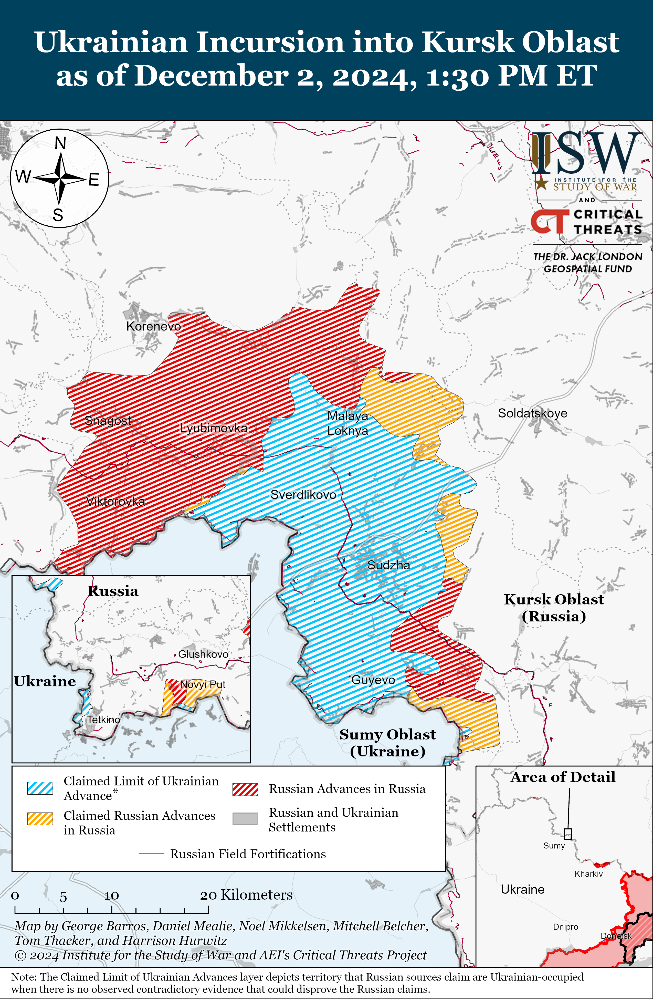
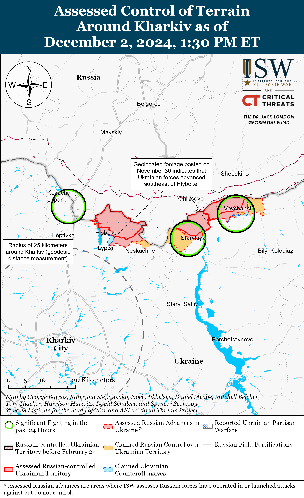
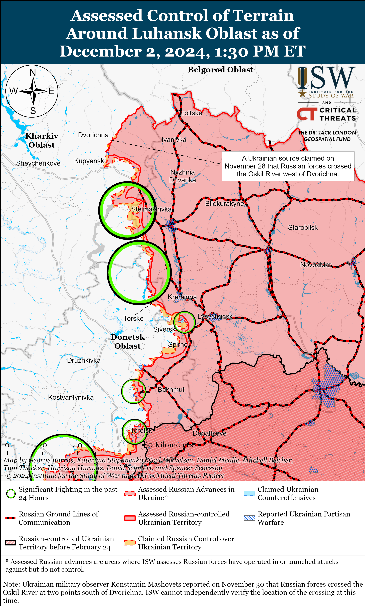
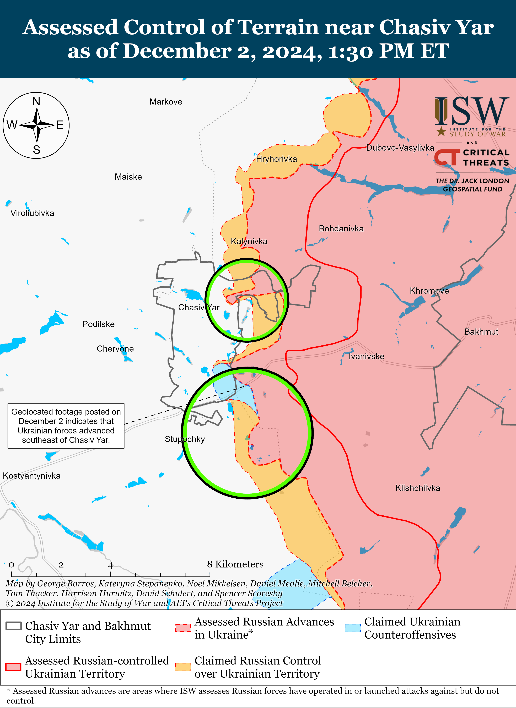
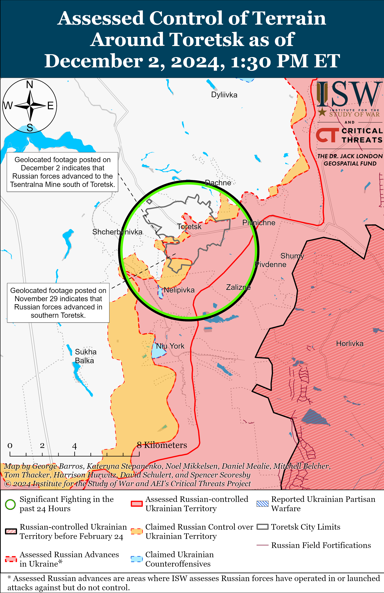
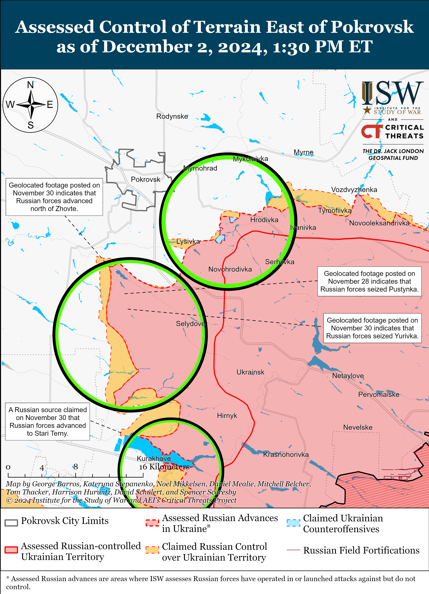
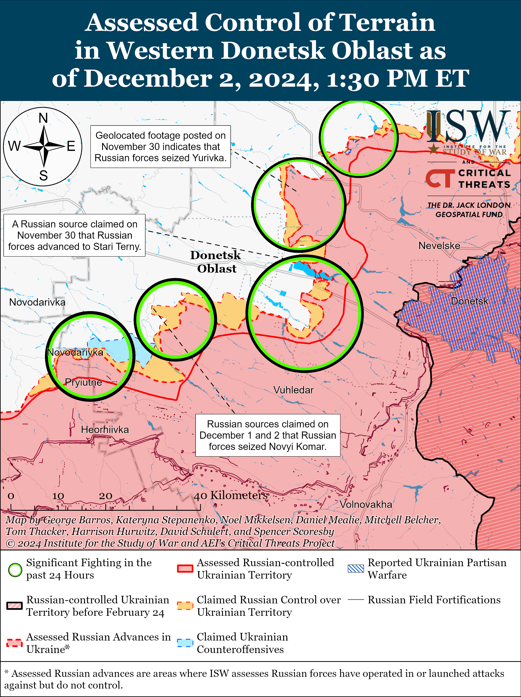
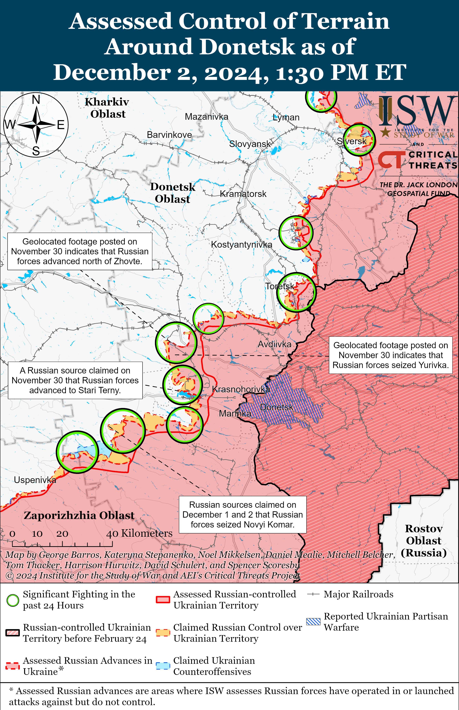
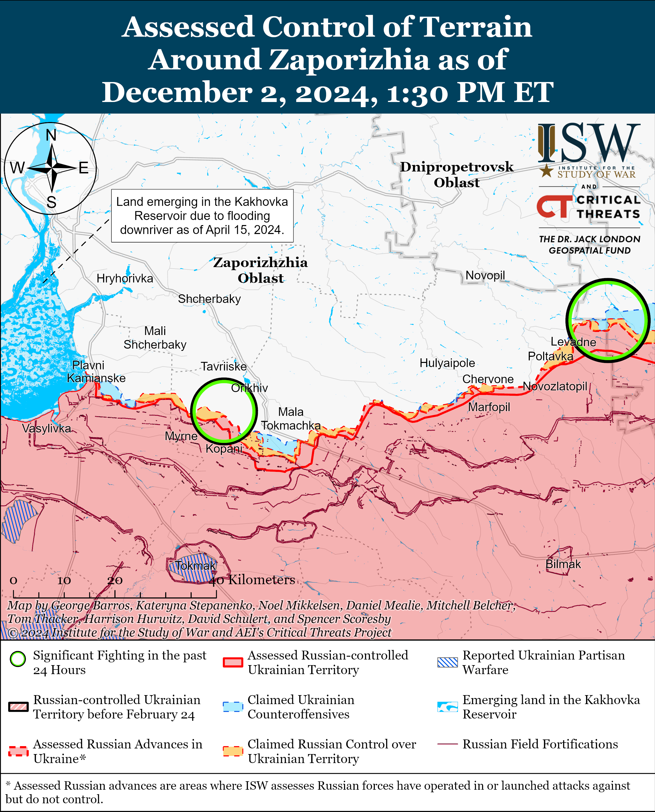
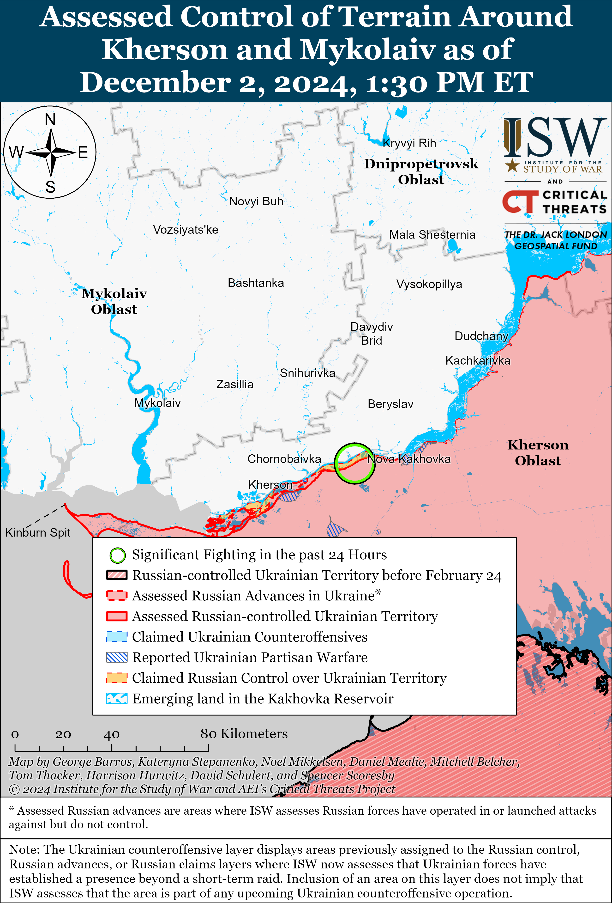

# Russian Offensive Campaign Assessment, December 2, 2024

**Angelica Evans, Karolina Hird, Davit Gasparyan, Nicole Wolkov, Olivia Gibson, Nate Trotter, William Runkel, and George Barros**

**December 2, 2024, 5pm ET**

**Click** [**here**](https://storymaps.arcgis.com/stories/36a7f6a6f5a9448496de641cf64bd375) **to see ISW’s interactive map of the Russian invasion of Ukraine. This map is updated daily alongside the static maps present in this report.**

**Click** [**here**](https://understandingwar.maps.arcgis.com/apps/instant/3dviewer/index.html?appid=1602762dbcde419bb957dea358449580) **to see ISW’s 3D control of terrain topographic map of Ukraine. Use of a computer (not a mobile device) is strongly recommended for using this data-heavy tool.**

**Click** [**here**](https://storymaps.arcgis.com/stories/733fe90805894bfc8562d90b106aa895) **to access ISW’s archive of interactive time-lapse maps of the Russian invasion of Ukraine. These maps complement the static control-of-terrain map that ISW produces daily by showing a dynamic frontline. ISW will update this time-lapse map archive monthly.**

**Note: The data cut-off for this product was 11am ET on December 2. ISW will cover subsequent reports in the December 3 Russian Offensive Campaign Assessment.**

**Prominent voices within the Russian information space continue to emphasize that Russian President Vladimir Putin is uninterested in a negotiated settlement to the war in Ukraine that results in anything less than total Ukrainian capitulation.** Kremlin-affiliated Russian oligarch and Orthodox nationalist and founder of the ultranationalist *Tsargrad* outlet Konstantin Malofeev told the *Financial Times* (FT) in an interview published on December 2 that Putin will likely reject any plan for peace negotiations that US President-elect Donald Trump puts forth unless the plan accounts for Russia’s “security concerns.”[1] Malofeev claimed that the Kremlin will only consider peace negotiations with the Trump administration if Trump reverses the US policy allowing Ukraine to use Western-provided long-range weapons to strike into Russia; “removes” Ukrainian President Volodymyr Zelensky from office; and agrees to meet with Putin to discuss the situation in Ukraine, the future European security, the conflict in the Middle East, and Russia’s growing alliance with the People’s Republic of China (PRC). Putin may intend to use such a meeting to extract future US policy concessions on these issues from Trump. Malofeev also claimed that the war in Ukraine has helped strengthen Russia’s relationships with the PRC, Iran, and North Korea and has revitalized Russia’s economy and defense industry. However, ISW continues to observe macroeconomic indications that Russia’s economy is struggling to bear the weight of inflation, ongoing international sanctions, and labor shortages and will face significant challenges in 2025 assuming Russia’s war in Ukraine continues at the current tempo.[2]

Putin and other senior Russian officials have recently issued similar statements. Malofeev’s interview further indicates that the Kremlin is not interested in good faith negotiations, no matter who mediates such talks.[3] Malofeev does not currently hold an official position within the Russian government, but his rhetoric is important given his relationships with high-level Kremlin officials and the influence of *Tsargrad* among Russian ultranationalists.[4] Malofeev has previously used *Tsargrad* to promote Kremlin narratives justifying Russia’s invasion and occupation of Ukraine and continues to be an outspoken supporter of Putin.[5] Zelensky recently acknowledged that Ukraine must find diplomatic solutions to end the war and secure the return of some parts of occupied Ukraine (including Crimea) in the future, but Malofeev’s comments indicate that Putin remains averse to good faith negotiations and is committed to destroying the Ukrainian state through military means.[6]

**Russia’s increased domestic production of Shahed-type drones has allowed Russia to increase the number of drones it is using in strike packages launched at Ukraine, but Ukrainian electronic warfare (EW) innovations are enabling Ukrainian forces to more effectively respond to Russian strike packages.** Ukrainian military expert Petro Chernyk told Ukrainian military-focused outlet *ArmyInform* on December 2 that Russia has increased the production of Shahed drone airframes while continuing to rely on Iranian or Chinese imports for other drone components.[7] Chernyk’s statements accord with ISW’s October 2024 assessment that Russia is leveraging its domestication of Shahed-type drone production to increase the number of Shahed-type drones it launches at Ukraine.[8] This dynamic is reflected in the composition of the strike packages that Russia launched at Ukraine between October and November 2024, as it has become more common for Russian forces to launch between 80 to 100 (or more) Shahed and decoy drones as part of their larger strike packages.[9] Russian forces launched 110 Shahed drones and other unspecified drones, likely decoys, at Ukraine on the night of December 1 to 2, for example.[10] Russian forces most likely use large numbers of Shahed-type drones and decoy drones to detect and overwhelm Ukrainian air defense and mobile fire groups; Russian forces most frequently launch Shaheds alongside more limited numbers of cruise and ballistic missiles.

Ukraine appears to be responding to this influx of Shahed drones in kind, however. The number of Shahed or decoy drones that are reportedly “lost” (do not reach their intended targets) due to Ukrainian electronic warfare (EW) interference increased significantly over the course of October and November 2024. Russia launched 105 Shahed-type drones at Ukraine on October 2, 78 of which Ukrainian forces directly shot down and 23 of which the Ukrainian Air Force reported were “lost” due to EW interference (22 percent).[11] In contrast, Russian forces launched 110 Shaheds and decoys at Ukraine on the night of December 1 to 2, 50 of which were “lost” due to Ukrainian EW interference (45 percent), and 52 of which Ukrainian forces shot down.[12] Chernyk noted the high Ukrainian shoot-down rate and also emphasized that Ukraine has improved its EW capabilities to the extent where Ukrainian forces can either “ground” the Shaheds, cause them to get “lost,” or cause them to deviate their paths and fly into Russian or Belarusian airspace.[13] Ukrainian EW interference is significantly impacting the performance of these Russian strike packages and notably adding an increased burden on the joint Russian-Belarusian air defense umbrella. Independent Belarusian monitoring group Hajun Project reported on November 25 that 38 Russian Shahed drones entered Belarusian airspace on November 24 and 25 – a record number of Russian drones violating Belarusian airspace.[14] Belarus scrambled jets to respond to the airspace violation—suggesting that Belarus was unprepared to receive errant Russian drones and that Russia had not anticipated the impacts of Ukrainian interference or communicated them to Belarus in advance.

**The Kremlin continues efforts to minimize the war’s social impacts on the Russian populace while tacitly resetting the goalposts for what the Kremlin initially defined as victory in Ukraine.** Russian business outlet *Kommersant*, citing internal sources, reported on December 1 that Russian officials, including those from the Presidential Administration, have set the following goals for the leading United Russia party for the 2026 legislative elections**:** achieving 55 percent of voter turnout and obtaining 55 of the total votes; surpassing United Russia’s 2021 election figures**;** and emphasizing the need for positive framing of a possible conclusion to the war in Ukraine.[15] *Kommersant* also noted that the Presidential Administration is trying to frame “the future results” of the war as a “victory” in a way that is palatable to both pro-war ultranationalists and less ideologically-concerned Russian “liberals,” by focusing the framing of the war’s outcome in a way that’s acceptable to Russia’s “silent majority.” The Kremlin is seeking to frame any outcome of the war as a victory for the whole Russian populace. The Kremlin will likely focus on spinning rhetorical and abstract achievements that are difficult to concretize, like the “denazification” and “demilitarization” of Ukraine alongside the retention of annexed Ukrainian territories while deemphasizing negative sentiments concerning the return of traumatized and injured war veterans, regardless of how the war plays out for Russian forces on the battlefield.

*Kommersant* also noted that the Russian Presidential Administration is concerned with the rehabilitation and reintegration of traumatized Russian veterans into Russian society**,** indicating that Russian authorities are aware of the potential domestic ramifications the return of a large number of discontented veterans could have on Russian society. Russia’s unemployment rate is currently very low, and many Russian war veterans may find themselves underemployed if they return to civilian life. The Kremlin’s relatively broad and ill-defined domestic informational efforts suggest that the Kremlin is still unsure of how the war will end and is therefore trying to set pre-emptive societal conditions to deal with the long-term effects of the war, including finding a way to sell Russia’s strategic and operational battlefield failures as victories. Russia has not achieved its self-defined objectives of “denazifying” or “demilitarizing” Ukraine or seizing all Donetsk, Luhansk, Zaporizhia, and Kherson oblasts.

**Pro-Kremlin Russian Telegram channel operators continue to resist Russian government efforts to deanonymize Russian social media accounts.** Russian opposition outlet *Verstka* reported on December 2 that almost 90 percent of the largest pro-Russian government Telegram channels have not yet registered with Russian federal censor Roskomnadzor as of December 1, despite the Russian Ministry of Digital Development requiring social media channels with over 10,000 subscribers to register with the Russian government by January 1, 2025.[16] *Verstka* assessed that 82 of the top 100 most popular Telegram channels, according to the TGStat catalog of Telegram channels, are pro-Russian government channels and that only 10 of these 82 channels have registered with Roskomnadzor.[17] The Russian government is requiring such channels to provide “minimal” personal information about the identity of their operators via a special platform or risk restrictions on advertising and their right to be reposted by other channels.[18] *Verstka* reported that the top five most popular Telegram channels – Chechen Republic Head Ramzan Kadyrov, a pro-war Russian military blogger and news aggregator, Russian Security Council Deputy Chairperson Dmitry Medvedev, Russian propagandist Vladimir Solovyov, and Kremlin-awarded channel *Rybar* – have not yet registered with Roskomnadzor, possibly because they are already Kremlin-aligned and do not threaten the Kremlin’s deserved control over public discourse in Russia.[19] Russian milbloggers previously criticized the deanonymization effort and will likely continue to resist ongoing Russian government efforts to monitor and control the Russian information space.[20]

**Key Takeaways:**

- **Prominent voices within the Russian information space continue to emphasize that Russian President Vladimir Putin is uninterested in a negotiated settlement to the war in Ukraine that results in anything less than total Ukrainian capitulation.**
- **Russia’s increased domestic production of Shahed-type drones has allowed Russia to increase the number of drones it is using in strike packages launched at Ukraine, but Ukrainian electronic warfare (EW) innovations are enabling Ukrainian forces to more effectively respond to Russian strike packages.**
- **The Kremlin continues efforts to minimize the war’s social impacts on the Russian populace while tacitly resetting the goalposts for what the Kremlin initially defined as victory in Ukraine.**
- **Pro-Kremlin Russian Telegram channel operators continue to resist Russian government efforts to deanonymize Russian social media accounts.**
- **Ukrainian forces recently advanced near Chasiv Yar, and Russian forces recently advanced near Toretsk, Pokrovsk, and Kurakhove.**
- **The Russian military command is focusing on training additional Russian forces and improving Russian forces’ tactical assault operations.**

***We do not report in detail on Russian war crimes because these activities are well-covered in Western media and do not directly affect the military operations we are assessing and forecasting. We will continue to evaluate and report on the effects of these criminal activities on the Ukrainian military and the Ukrainian population and specifically on combat in Ukrainian urban areas. We utterly condemn Russian violations of the laws of armed conflict and the Geneva Conventions and crimes against humanity even though we do not describe them in these reports.***

- Ukrainian Operations in the Russian Federation
- Russian Main Effort – Eastern Ukraine (comprised of three subordinate main efforts)
- Russian Subordinate Main Effort #1 – Push Ukrainian forces back from the international border with Belgorod Oblast and approach to within tube artillery range of Kharkiv City
- Russian Subordinate Main Effort #2 – Capture the remainder of Luhansk Oblast and push westward into eastern Kharkiv Oblast and encircle northern Donetsk Oblast
- Russian Subordinate Main Effort #3 – Capture the entirety of Donetsk Oblast
- Russian Supporting Effort – Southern Axis
- Russian Air, Missile, and Drone Campaign
- Russian Mobilization and Force Generation Efforts
- Russian Technological Adaptations
- Activities in Russian-occupied areas
- Significant Activity in Belarus

**Ukrainian Operations in the Russian Federation**

Fighting continued in the main Ukrainian Kursk Oblast salient on December 2, but neither Ukrainian nor Russian forces made confirmed advances. Russian milbloggers claimed that Russian forces are advancing near Martynovka (northeast of Sudzha), although ISW has not yet observed confirmation of recent Russian advances in this area.[21] Russian milbloggers also claimed that fighting continued southeast of Korenevo near Novoivanovka, Darino, and Nikolaevo-Darino and southeast of Sudzha near Pogrebki and Plekhovo.[22] Ukrainian military officials noted on December 1 and 2 that Russian forces assault Ukrainian positions in Kursk Oblast around the clock, sometimes with armored vehicles, and sometimes with lighter vehicles such as motorcycles and all-terrain vehicles (ATV), which Russian forces use to transport dismounted infantry to areas near the frontline.[23] A Russian insider source claimed on December 2 that Russian authorities have committed at least 10 million rubles ($94,000) to a project to turn the entire border into “one large, fortified area” following the failure of the Russian defensive lines in Kursk Oblast to deter the initial Ukrainian incursion into Kursk in August 2024.[24] A Russian insider source claimed on December 1 that a Ukrainian HIMARS strike hit a command post of the 83rd Airborne (VDV) Brigade in Kursk Oblast on November 30.[25] Elements of the Chechen “Aida” Spetsnaz group are reportedly operating northeast of Sudzha, and elements of the 11th VDV Brigade are reportedly operating throughout Kursk Oblast.[26]

**Russian Main Effort – Eastern Ukraine**

**Russian Subordinate Main Effort #1 – Kharkiv Oblast (Russian objective: Push Ukrainian forces back from the international border with Belgorod Oblast and approach to within tube artillery range of Kharkiv City)**

Russian forces conducted offensive operations along the international border north of Kharkiv City in the direction of Kozacha Lopan and northeast of Kharkiv City near Starytsya, Tykhe, and Vovchansk on December 1 and 2 but did not make any advances.[27] Russian milbloggers claimed that Ukrainian forces counterattacked in Vovchansk, near Hlyboke, and in the Lyptsi direction (both north of Kharkiv city).[28] A Russian milblogger claimed that Ukrainian forces have periodically attacked near Hlyboke and on its flanks in order to cut Russian forces off from ground lines of communication (GLOC) and reserves.[29] Elements of the Russian 136th Motorized Rifle Brigade (58th Combined Arms Army [CAA], Southern Military District [SMD]) are reportedly operating near the Belgorod Oblast international border area.[30]

**Russian Subordinate Main Effort #2 – Luhansk Oblast (Russian objective: Capture the remainder of Luhansk Oblast and push westward into eastern Kharkiv Oblast and northern Donetsk Oblast)**

Russian forces continued offensive operations along the Kupyansk-Svatove-Kreminna line on November 2 but did not make confirmed advances. Russian milbloggers claimed that Russian forces advanced north of Kupyansk along the west (right) bank of the Oskil River near Novomlysk and southeast of Kupyansk near Kolisnykvika, Kruhlyakivka, Zahryzove, Pishchane, and Berestove and west of Svatove near Lozova and Zeleny Hai.[31] Several Russian milbloggers reiterated claims that Russian forces operating north of Kupyansk crossed the Oskil River and advanced in a forested area west of Masyutivka (southeast of Dvorichna).[32] ISW has not observed confirmation of these claims, however. The deputy commander of a Ukrainian drone unit operating in the Kupyansk direction stated that Russian forces are attempting to bypass Ukraine’s defenses near Kupyansk and seize positions along the east (left) bank of the Oskil River.[33] The deputy commander stated that Kruhlyakivka (southeast of Kupyansk) is a contested “gray zone.” Russian forces continued assaults southeast of Kupyansk near Hlushkivka and Kruhlyakivka; west of Svatove near Lozova and Zeleny Hai; southwest of Svatove near Kopanky, Hrekivka, Cherneshchyna, and Druzhelyubivka; west of Kreminna near Yampolivka, Terny, and Torske; and south of Kreminna near Hryhorivka on December 1 and 2.[34] Elements of the Russian 16th Spetsnaz Brigade (Russian General Staff’s Main Directorate [GRU]) are reportedly operating drones controlled via fiber optic cables near Zarichne (west of Kreminna), and elements of the Russian 144th Motorized Rifle Division (20th Combined Arms Army [CAA], Moscow Military District [MMD]) are reportedly operating near Terny (west of Kreminna).[35]

**Russian Subordinate Main Effort #3 – Donetsk Oblast (Russian objective: Capture the entirety of Donetsk Oblast, the claimed territory of Russia’s proxies in Donbas)**

Russian forces continued offensive operations northeast of Siversk near Bilohorivka on December 2 but did not make any confirmed advances.[36] Ukrainian Luhansk Group of Forces Spokesperson Major Anastasiya Bobovnikova that Russian vehicles are attempting to advance across open fields in the Siversk direction making it easy for Ukrainian forces to locate and strike Russian forces.[37] Elements of the Russian “Nevsky” Volunteer Reconnaissance-Assault Brigade (Russian Volunteer Corps) are reportedly operating near Vasyukivka (southwest of Siversk).[38]

Ukrainian forces recently advanced in the Chasiv Yar direction amid continued Russian offensive operations in the area on December 2. Geolocated footage published on December 2 shows elements of the Russian “Shustry” detachment of Chechen “Akhmat” Spetsnaz and the 4th Motorized Rifle Brigade (3rd Combined Arms Army [CAA], formerly 2nd Luhansk People’s Republic Army Corps [LNR AC]) striking Ukrainian forces indicating that Ukrainian forces recently advanced southeast of Chasiv Yar along the T0504 Bakhmut-Kostyantynivka highway.[39] Russian forces continued attacking within central Chasiv Yar near the refractory plant, near Chasiv Yar, and north of Chasiv Yar near Hryhorivka on December 1 and 2.[40] A Ukrainian senior non-commissioned officer of a brigade operating in the Chasiv Yar direction stated that Russian forces attempt to “infiltrate” Chasiv Yar in groups of two to three personnel at dusk and during poor weather conditions to protect them from Ukrainian first-person view (FPV) drone strikes.[41] The officer also stated that Russian forces rarely conduct mechanized assaults near Chasiv Yar. Elements of the Russian 98th Airborne (VDV) Division reportedly continue operating near Chasiv Yar.[42]

Russian forces recently advanced in the Toretsk direction amid continued offensive operations in the area on December 2. Geolocated footage published on December 2 indicates that Russian forces recently advanced south of Toretsk to the Tsentralna Mine.[43] A Russian milblogger claimed that Russian forces seized two waste heaps near the Tsentralna Mine, but ISW has not observed visual confirmation of this claim.[44] The Ukrainian General Staff reported that Russian forces attacked near Toretsk itself; south of Toretsk near Nelipivka; and west of Toretsk near Shcherbynivka on December 1 and 2.[45] Bobovnikova stated that Russian forces are conducting infantry assaults within Toretsk since armored vehicles have difficulty moving through urban areas, but that Russian forces recently advanced with armored vehicle support near Nelipivka.[46] Bobovnikova also reported that Russian forces suffered over 500 casualties – a mechanized battalion’s worth of personnel – during one week of assaults within Toretsk.

Russian forces recently advanced in the Pokrovsk direction amid continued Russian offensive operations in the area on December 2. Geolocated footage published on November 30 indicates that Russian forces recently advanced within Zhovte (south of Pokrovsk).[47] Russian milbloggers claimed that Russian forces advanced within eastern Pushkine (south of Pokrovsk) and toward Novopustynka (southwest of Pokrovsk), but ISW has not observed visual confirmation of these claims.[48] Russian forces continued attacking east of Pokrovsk near Myrolyubivka and Promin; southeast of Pokrovsk near Lysivka and Krasnyi Yar; and south of Pokrovsk near Novyi Trud, Dachenske, Zhovte, Chomatske, and Pushkine on December 1 and 2.[49] Elements of the Russian 1437th Motorized Rifle Regiment (15th Motorized Rifle Brigade, 2nd CAA, Central Military District [CMD]) are reportedly operating near Selydove (southeast of Pokrovsk).[50]

Russian forces recently marginally advanced north and northwest of Kurakhove amid continued offensive operations in this direction on December 2. Geolocated footage published on December 1 indicates that Russian forces recently marginally advanced northwest of Sontsivka (northwest of Kurakhove) and west of Berestky (north of Kurakhove and on the northern shore of the Kurakhivske Reservoir).[51] A Russian milblogger acknowledged that Ukrainian forces maintain positions in western Sontsivka, which is consistent with ISW’s current assessed frontline.[52] Russian milbloggers claimed that Russian forces are clearing or have seized Stari Terny (north of Kurakhove and west of Berestky), are advancing along Sobornyi and Myra streets in Kurakhove, and are advancing south of Kurakhove near Dalne.[53] Russian milbloggers claimed that Russian forces occupy over half of Kurakhove, although ISW assesses that Russian forces currently only occupy 39 percent of the settlement.[54] Russian forces reportedly continued attacking near Kurakhove itself; north of Kurakhove near Berestky, and Stari Terny; northwest of Kurakhove near Sontsivka, Zorya, Novodmytrivka; and south of Kurakhove in the direction of Dalne on December 1 and 2.[55] Elements of the Russian 5th Separate Motorized Rifle Brigade (51st CAA, formerly 1st Donetsk People’s Republic’s Army Corps [DNR] AC) are reportedly operating in high-rise buildings area in Kurakhove; elements of the 114th Motorized Rifle Brigade (51st CAA) are reportedly operating in the direction of Dachne (northwest of Kurakhove); assault elements of the 255th Motorized Rifle Regiment (20th Motorized Rifle Division, 8th CAA, Southern Military District [SMD]) are operating in the Kurakhove direction; and drone operators of the 3rd Tank Battalion of the 68th Tank Regiment (150th Motorized Rifle Division, 8th CAA) are reportedly operating near southern Kurakhove.[56]

Russian sources made unconfirmed claims on December 1 and 2 that Russian forces advanced northeast of Vuhledar, but ISW cannot verify these claims. Russian milbloggers claimed that Russian forces gained a foothold on the southeastern outskirts of Yelyzavetivka (northeast of Vuhledar) and on the northwestern outskirts of Illinka (north of Vuhledar). A Russian milblogger claimed that Russian forces control 75 percent of Romanivka (northeast of Vuhledar), but ISW observed Russian forces operate in 11 percent of the settlement.[57] The Ukrainian General Staff reported that fighting continued northeast of Vuhledar near Yelyzavetivka; north of Vuhledar near Hannivka and Antonivka; and northwest of Vuhledar near Trudove and Kostyantynopolske.[58] Elements of the Russian 14th Spetsnaz Brigade (Russian General Staff’s Main Directorate [GRU]) are reportedly operating northwest of Maksymivka (northwest of Vuhledar).[59]

Russian sources claimed on December 1 and 2 that Russian forces advanced north of Velyka Novosilka in the Donetsk-Zaporizhia Oblast area, but ISW cannot independently verify these claims. Russian sources claimed that Russian forces seized Novyi Komar (north of Velyka Novosilka) and advanced in the direction of Rozlyv (northeast of Vuhledar).[60] A Russian milblogger claimed that Russian forces are improving Russian positions on Velyka Novosilka’s northern and southern flanks and disrupting Ukrainian logistics before launching a “full-scale assault” on Velyka Novosilka.[61] The Ukrainian General Staff reported that fighting continued near Velyka Novosilka itself; north of Velyka Novosilka near Novyi Komar; and southwest of Velyka Novosilka in the direction of Novopil.[62] Elements of the Russian 37th Motorized Rifle Brigade (36th CAA, Eastern Military District [EMD]) are reportedly operating on the outskirts of Velyka Novosilka.[63]

**Russian Supporting Effort – Southern Axis (Russian objective: Maintain frontline positions and secure rear areas against Ukrainian strikes)**

Russian milbloggers claimed that positional fighting continued in western Zaporizhia Oblast on December 1 and 2 but there were no changes to the frontline.[64] A Russian milblogger amplified claims that Russian forces will renew offensive operations in western Zaporizhia Oblast at an unspecified time after December 5 and that Russian forces may also attempt to cross the Dnipro River in an unspecified area in Kherson Oblast.[65] Drone operators of the Russian BARS-32 (Russian Combat Army Reserve) detachment are reportedly operating in Zaporizhia Oblast.[66]

Russian forces continued assaults in the Dnipro direction, including in east (left) bank Kherson Oblast, on December 1 and 2 but did not make confirmed advances in the area.[67] A Russian milblogger claimed on December 2 that the weather has reached freezing temperatures with the first snowfall in the Kherson direction.[68]

**Russian Air, Missile, and Drone Campaign (Russian Objective: Target Ukrainian military and civilian infrastructure in the rear and on the frontline)**

Russian forces conducted a large series of drone strikes on the night of December 1 and 2. The Ukrainian Air Force reported that Russian forces launched 110 Shahed drones and other unidentified drone types (possibly referring to decoy drones) from Kursk, Oryol, and Rostov oblasts and Primorsko-Akhtarsk, Krasnodar Krai.[69] The Ukrainian Air Force reported that Ukrainian forces downed 52 drones over Kyiv, Cherkasy, Chernihiv, Vinnytsia, Khmelnytskyi, Zhytomyr, Sumy, Poltava, Kharkiv, and Dnipropetrovsk oblasts; that 50 drone were ”lost,” likely due to Ukrainian electronic warfare (EW) interference; that six drones returned to Belarusian or Russian airspace; and that one drone remained in Ukrainian airspace as of 0830 local time. Ukrainian sources reported on December 1 and 2 that Russian drones struck residential buildings in Nizhinskyi and Prylutskyi raions, Chernihiv Oblast, and that falling drone debris damaged buildings in Dnistrovskyi Raion of Chernivitsi Oblast; and that a Russian missile struck an apartment building in Ternopil City.[70] Russian milbloggers claimed on December 1 and 2 that Russian forces struck bridges in Poltava and Ternopil oblasts, defense industrial objects in Zhytomyr and Cherkasy oblasts, logistics targets in Khmelnytskyi and Mykolaiv oblasts, railway lines in Ternopil Oblast, and a Ukrainian warehouse in Rivne, Donetsk Oblast.[71] ISW has not observed visual confirmation of these claims, however.

Ukrainian President Volodymyr Zelensky stated on December 2 that Russian forces launched 347 missiles of various types, including ballistic missiles, and over 2,500 Shahed strike drones against Ukraine in November 2024.[72]

Independent Belarusian monitoring group Hajun Project reported on December 2 that 31 Russian Shahed drones entered Belarusian airspace on the night of December 1 to 2.[73] The Hajun Project reported that the Russian drones flew towards the Belarusian settlements of Loyeu, Brahin, Rechytsa, Mazyr, Homiel, and Khoiniki and that at least one drone circled between Russian and Belarusian air space several times. The Hajun Project reported in late November 2024 that a record number of Russian drones violated Belarusian airspace.[74]

**Russian Mobilization and Force Generation Efforts (Russian objective: Expand combat power without conducting general mobilization)**

The Russian military command is focusing on training additional Russian forces and improving Russian forces’ tactical assault operations. The Head of the Russian Ministry of Defense’s (MoD) Main Combat Training Directorate, Colonel General Ivan Buvaltsev, claimed in an article published in the MoD’s official newsletter *Krasnaya Zvezda* that the Russian military trained over 300,000 contract servicemembers in reserve regiments, including over 3,000 drone operators, for service in Ukraine in 2024.[75] Ruslan Pukhov, the head of the Moscow-based Center for Analysis of Strategies and Technologies and a member of an MoD civilian advisory board, claimed in April 2024 that the Russian military could recruit roughly 300,000 total personnel in 2024 – and this claim is consistent with Buvaltsev’s report of the total number of trained contract servicemembers this year.[76] A Russian milblogger claimed that the Russian military is focusing on preparing soldiers to operate in fireteam-sized tactical assault units composed of two to five soldiers and is prioritizing training drone operators and electronic warfare (EW) system specialists.[77]

The Russian MoD is increasing one-time payments to soldiers from Russian federal subjects while neglecting to pay forcibly mobilized servicemembers from occupied Ukraine. Russian opposition outlet *Vazhnye Istorii* (*iStories*) reported that every Russian federal subject increased its one-time payments to citizens who signed a contract with the MoD at least once in 2024 and that the current average regional payment is 900,000 rubles ($8,450) per contract.[78] *Vazhnye Istorii* stated that some federal subjects increased their one-time payment 75 times in 2024, which indicates that some regional governments may be struggling to meet their recruitment quotas more than others. *Vazhnye Istorii* noted that new contract servicemembers also receive 400,000 rubles ($3,756) from the federal government for signing a military service contract, indicating that on average new contract servicemembers receive a one-time payment of 1.3 million rubles ($12,206) when they sign a contract with the Russian MoD. ISW has previously assessed that ongoing efforts by Russian officials to increase one-time payments for contract service indicate that the Russian military is struggling to recruit a sufficient number of volunteer servicemembers to replace Russian casualties in Ukraine and indefinitely delay or prevent another partial involuntary reserve call-up.[79] Ukrainian Luhansk Oblast Military Administration Head Artem Lysohor stated on December 2 that the Russian MoD is refusing to pay over 3,000 forcibly mobilized soldiers from occupied Luhansk Oblast for their service and injuries sustained in combat.[80]

The Russian military is increasingly relying on private organizations to meet drone and EW system requirements on the frontline. The head of the Russian Center for Unmanned Systems and Technologies, Andrei Bezrukov, reported on December 2 that the center, Russia’s ruling United Russia political party, and the “Our Right” fund delivered over 30,000 drones and 4,000 EW systems to the Russian military during an unspecified period.[81] Bezrukov claimed that the center is creating “special technology clusters” to lower operating costs and increase cooperation for dual-use startup companies located at the Russian “Skolkovo” innovation center.

**Russian Technological Adaptations (Russian objective: Introduce technological innovations to optimize systems for use in Ukraine)**

The Russian “MiS” design bureau claimed on December 2 that the company introduced the “Povodyr” autonomous anti-electronic warfare (EW) system modification for the Russian MiS-35M drone, which allows the drone to autonomously fly back to its launch point after losing connection during instances of EW interference.[82]

**Activities in Russian-occupied areas (Russian objective: Consolidate administrative control of annexed areas; forcibly integrate Ukrainian citizens into Russian sociocultural, economic, military, and governance systems)**

*ISW is not publishing coverage of activities in Russian-occupied areas today.*

**Significant activity in Belarus (Russian efforts to increase its military presence in Belarus and further integrate Belarus into Russian-favorable frameworks and Wagner Group activity in Belarus)**

Nothing significant to report.

**Note: ISW does not receive any classified material from any source, uses only publicly available information, and draws extensively on Russian, Ukrainian, and Western reporting and social media as well as commercially available satellite imagery and other geospatial data as the basis for these reports. References to all sources used are provided in the endnotes of each update.**

[1] https://www.ft.com/content/ac39b604-ef6d-41cb-bb8c-0eb76e002176

[2] https://www.ft.com/content/ac39b604-ef6d-41cb-bb8c-0eb76e002176 ; https://isw.pub/UkrWar111424

[3] https://understandingwar.org/backgrounder/russian-offensive-campaign-assessment-november-26-2024 ; https://www.interfax dot ru/russia/994494 ; https://understandingwar.org/backgrounder/why-putin-remains-uninterested-meaningful-negotiations-ukraine ; https://isw.pub/UkrWar101824 ; https://isw.pub/UkrWar111824 ; https://isw.pub/UkrWar111324

[4] https://meduza dot io/news/2024/09/10/neschastie-v-vide-nashih-razvodov-pozadi-propagandist-konstantin-malofeev-o-svadbe-s-mariey-lvovoy-belovoy-razyskivaetsya-mus

[5] https://www.rferl.org/a/malofeyev-russia-oligarch-finances-war-ukraine/32474096.html ; https://www.justice.gov/opa/pr/russian-oligarch-charged-violating-us-sanctions ; https://www.ft.com/content/27125702-71ec-11e5-ad6d-f4ed76f0900a ; https://secretmag dot ru/enciklopediya/konstantin-malofeev.htm

[6] https://english.kyodonews.net/news/2024/12/2b04e9c88c84-urgent-n-korean-troops-in-russia-killed-zelenskyy-tells-kyodo-news.html

[7] https://armyinform dot com.ua/2024/12/02/absolyutnogo-zanurennya-u-pitmu-ne-bude-ekspert-pro-masovani-povitryani-udary-rf/

[8] https://understandingwar.org/backgrounder/russian-offensive-campaign-assessment-october-23-2024

[9] https://t.me/kpszsu/20480; https://t.me/kpszsu/20705 https://t.me/kpszsu/21537; https://t.me/kpszsu/21696 https://t.me/kpszsu/21782; https://t.me/kpszsu/21943; https://t.me/kpszsu/21984; https://t.me/kpszsu/22298; https://t.me/kpszsu/22329; https://t.me/kpszsu/22478; https://t.me/kpszsu/22640; https://t.me/kpszsu/23111; https://t.me/kpszsu/23330; https://t.me/kpszsu/23621; https://t.me/V\_Zelenskiy\_official/12593 ; https://t.me/kpszsu/24043

[10] https://t.me/kpszsu/24043

[11] https://t.me/kpszsu/20480

[12] https://t.me/kpszsu/2404

[13] https://armyinform.com dot ua/2024/12/02/absolyutnogo-zanurennya-u-pitmu-ne-bude-ekspert-pro-masovani-povitryani-udary-rf/

[14] https://t.me/Hajun\_BY/8239

[15] https://t.me/sotaproject/90718 ; https://www.vedomosti dot ru/politics/articles/2024/12/02/1078420-kreml-nazval-zhelaemii-rezultat-edinoi-rossii-na-viborah ; https://www.kommersant dot ru/doc/7344159

[16] https://t.me/svobodnieslova/6000 ; https://understandingwar.org/backgrounder/russian-offensive-campaign-assessment-november-2-2024

[17] https://t.me/svobodnieslova/6000 ; https://tgstat dot ru/ratings/channels/politics?sort=members

[18] https://understandingwar.org/backgrounder/russian-offensive-campaign-assessment-november-2-2024

[19] https://t.me/svobodnieslova/6000 ; https://tgstat dot ru/ratings/channels/politics?sort=members

[20] https://understandingwar.org/backgrounder/russian-offensive-campaign-assessment-november-2-2024

https://understandingwar.org/backgrounder/russian-offensive-campaign-assessment-november-1-2024

[21] https://t.me/dva\_majors/59087; https://t.me/motopatriot/29960; https://t.me/wargonzo/23460; https://t.me/DnevnikDesantnika/20232

[22] https://t.me/dva\_majors/59087; https://t.me/DnevnikDesantnika/20232

[23] https://armyinform.com dot ua/2024/12/02/bredlisty-znyshhyly-dva-desyatka-odynycz-tehniky-desantnyky-shynkuyut-voroga-na-kurshhyni/; https://armyinform.com dot ua/2024/12/01/ne-berezhut-ani-lyudej-ani-tehniku-na-kurshhyni-rosiyan-ne-zupynyayut-zhodni-vtraty/

[24] https://t.me/vchkogpu/52971

[25] https://t.me/dosye\_shpiona/623

[26] https://t.me/RKadyrov\_95/5271; https://www.facebook.com/watch/?v=1764231850979039&rdid=pzdpuBlh8SVjdSD1

[27] https://t.me/otukharkiv/2890; https://www.facebook.com/GeneralStaff.ua/posts/pfbid0FLfihgNEALUgCPsbXxgtAnznLTjKGKAsEZjB6dRTVAJGBmCVboacGsSV9wAZnrVwl; https://www.facebook.com/GeneralStaff.ua/posts/pfbid0E2YpKexQvgF7GpYc5eFsQJ4v5qh29C8V9Y1yRwJdpJyVBdY4sJBqvaiioSoA7v4al; https://www.facebook.com/GeneralStaff.ua/posts/pfbid0aGtKcwcygXyVSsb3wxJSG1hbFjvRKp2rGToG6eZhCZAkH1rBonQUiyDBsywsttiSl; https://armyinform.com dot ua/2024/12/02/zaliznyj-shashlyk-na-mangalah-prygotovleno-5-tankiv-ta-6-bmp-gorilogo-rosijskogo-bruhtu-pobilshalo/

[28] https://t.me/dva\_majors/59087; https://t.me/DnevnikDesantnika/20194 ; https://t.me/DnevnikDesantnika/20197 ; https://t.me/DnevnikDesantnika/20242; https://t.me/rybar/65961

[29] https://t.me/rybar/65961

[30] https://t.me/RVvoenkor/81773

[31] https://t.me/z\_arhiv/29881 ; https://t.me/z\_arhiv/29874 ; https://t.me/DnevnikDesantnika/20197 ; https://t.me/motopatriot/29973 ; https://t.me/tass\_agency/288588

[32] https://t.me/dva\_majors/59087 ; https://t.me/Sladkov\_plus/11962

[33] https://armyinform.com dot ua/2024/12/02/ne-dijshly-do-richky-i-ne-kupayutsya-poblyzu-kupyanska-okupanty-zaznayut-maksymalnyh-vtrat/

[34] https://www.facebook.com/GeneralStaff.ua/posts/pfbid0E2YpKexQvgF7GpYc5eFsQJ4v5qh29C8V9Y1yRwJdpJyVBdY4sJBqvaiioSoA7v4al ; https://www.facebook.com/GeneralStaff.ua/posts/pfbid0aGtKcwcygXyVSsb3wxJSG1hbFjvRKp2rGToG6eZhCZAkH1rBonQUiyDBsywsttiSl

[35] https://t.me/voin\_dv/12093; https://t.me/Secrets\_of\_Vinakos/4235 (Zarichne); https://t.me/vysokygovorit/18188 ; https://t.me/sashakots/50517 (Terny)

[36] https://www.facebook.com/GeneralStaff.ua/posts/pfbid0FLfihgNEALUgCPsbXxgtAnznLTjKGKAsEZjB6dRTVAJGBmCVboacGsSV9wAZnrVwl

[37] https://armyinform.com dot ua/2024/12/02/zhyva-syla-dezertyruye-tikaye-i-navit-vchynyaye-samogubstvo-na-siverskomu-napryamku-okupantiv-ganyayut-po-polyu/

[38] https://t.me/NeoficialniyBeZsonoV/41879 ; https://t.me/NeoficialniyBeZsonoV/41876 ; https://t.me/NeoficialniyBeZsonoV/41884

[39] https://t.me/shustryii\_i/1335 ; https://t.me/creamy\_caprice/7711

[40] https://www.facebook.com/GeneralStaff.ua/posts/pfbid0FLfihgNEALUgCPsbXxgtAnznLTjKGKAsEZjB6dRTVAJGBmCVboacGsSV9wAZnrVwl ; https://www.facebook.com/GeneralStaff.ua/posts/pfbid0E2YpKexQvgF7GpYc5eFsQJ4v5qh29C8V9Y1yRwJdpJyVBdY4sJBqvaiioSoA7v4al ; https://www.facebook.com/GeneralStaff.ua/posts/pfbid0aGtKcwcygXyVSsb3wxJSG1hbFjvRKp2rGToG6eZhCZAkH1rBonQUiyDBsywsttiSl ; https://t.me/boris\_rozhin/146385 ; https://t.me/DnevnikDesantnika/20236 ; https://t.me/wargonzo/23460

[41] https://armyinform.com dot ua/2024/12/02/pr-shturmy-voroga-v-rajoni-chasovogo-yaru-zajshly-postavyly-svoyu-ganchirku-vidkotylysya/

[42] https://t.me/DnevnikDesantnika/20209

[43] https://x.com/AudaxonX/status/1863567092353560786; https://t.me/Khyzhak\_brigade/194

[44] https://t.me/voenkorKotenok/60458

[45] https://www.facebook.com/GeneralStaff.ua/posts/pfbid0FLfihgNEALUgCPsbXxgtAnznLTjKGKAsEZjB6dRTVAJGBmCVboacGsSV9wAZnrVwl ; https://www.facebook.com/GeneralStaff.ua/posts/pfbid0E2YpKexQvgF7GpYc5eFsQJ4v5qh29C8V9Y1yRwJdpJyVBdY4sJBqvaiioSoA7v4al ; https://www.facebook.com/GeneralStaff.ua/posts/pfbid0aGtKcwcygXyVSsb3wxJSG1hbFjvRKp2rGToG6eZhCZAkH1rBonQUiyDBsywsttiSl

[46] https://suspilne dot media/donbas/892991-rosijska-armia-vtracae-blizko-500-vijskovih-za-tizden-boiv-u-torecku-recnica-otu-lugansk/ ; https://armyinform.com dot ua/2024/12/02/vtrachayut-bataljon-na-tyzhden-u-toreczku-kozhen-metr-prosuvannya-dayetsya-okupantam-velykoyu-krovyu/

[47] https://t.me/answertime1/107; https://t.me/creamy\_caprice/7706

[48] https://t.me/motopatriot/29944 ; https://t.me/dva\_majors/59087 ; https://t.me/DnevnikDesantnika/20227 ; https://t.me/motopatriot/29940 ; https://t.me/boris\_rozhin/146375

[49] https://www.facebook.com/GeneralStaff.ua/posts/pfbid0FLfihgNEALUgCPsbXxgtAnznLTjKGKAsEZjB6dRTVAJGBmCVboacGsSV9wAZnrVwl ; https://www.facebook.com/GeneralStaff.ua/posts/pfbid0E2YpKexQvgF7GpYc5eFsQJ4v5qh29C8V9Y1yRwJdpJyVBdY4sJBqvaiioSoA7v4al ; https://www.facebook.com/GeneralStaff.ua/posts/pfbid0aGtKcwcygXyVSsb3wxJSG1hbFjvRKp2rGToG6eZhCZAkH1rBonQUiyDBsywsttiSl ; https://t.me/boris\_rozhin/146375

[50] https://t.me/RVvoenkor/81772

[51] https://t.me/robert\_magyar/974; https://t.me/WarArchive\_ua/23037; https://t.me/creamy\_caprice/7707 ; https://t.me/yokaiUA/188; https://t.me/creamy\_caprice/7708

[52] https://t.me/motopatriot/29944

[53] https://t.me/motopatriot/29970 ; https://t.me/motopatriot/29944 ; https://t.me/notes\_veterans/20821 ; https://t.me/dva\_majors/59087 ; https://t.me/boris\_rozhin/146438 ; https://t.me/voenkorKotenok/60443

[54] https://t.me/RVvoenkor/81796 ; https://t.me/voenkorKotenok/60451

[55] https://www.facebook.com/GeneralStaff.ua/posts/pfbid0aGtKcwcygXyVSsb3wxJSG1hbFjvRKp2rGToG6eZhCZAkH1rBonQUiyDBsywsttiSl; https://www.facebook.com/GeneralStaff.ua/posts/pfbid0E2YpKexQvgF7GpYc5eFsQJ4v5qh29C8V9Y1yRwJdpJyVBdY4sJBqvaiioSoA7v4al; https://www.facebook.com/GeneralStaff.ua/posts/pfbid0FLfihgNEALUgCPsbXxgtAnznLTjKGKAsEZjB6dRTVAJGBmCVboacGsSV9wAZnrVwl; https://t.me/wargonzo/23460; https://t.me/motopatriot/29970

[56] https://t.me/motopatriot/29963; https://t.me/motopatriot/29970; https://t.me/RVvoenkor/81776 ; https://t.me/dva\_majors/59084 ; https://t.me/dva\_majors/59100; https://t.me/nm\_dnr/13047; https://t.me/voenkorKotenok/60443

[57] https://t.me/rusich\_army/18976; https://t.me/NgP\_raZVedka/19811; https://t.me/rusich\_army/18976

[58] https://www.facebook.com/GeneralStaff.ua/posts/pfbid0FLfihgNEALUgCPsbXxgtAnznLTjKGKAsEZjB6dRTVAJGBmCVboacGsSV9wAZnrVwl; https://www.facebook.com/GeneralStaff.ua/posts/pfbid0E2YpKexQvgF7GpYc5eFsQJ4v5qh29C8V9Y1yRwJdpJyVBdY4sJBqvaiioSoA7v4al; https://www.facebook.com/GeneralStaff.ua/posts/pfbid0aGtKcwcygXyVSsb3wxJSG1hbFjvRKp2rGToG6eZhCZAkH1rBonQUiyDBsywsttiSl; https://www.facebook.com/GeneralStaff.ua/posts/pfbid0FLfihgNEALUgCPsbXxgtAnznLTjKGKAsEZjB6dRTVAJGBmCVboacGsSV9wAZnrVwl; https://www.facebook.com/GeneralStaff.ua/posts/pfbid0E2YpKexQvgF7GpYc5eFsQJ4v5qh29C8V9Y1yRwJdpJyVBdY4sJBqvaiioSoA7v4al; https://www.facebook.com/GeneralStaff.ua/posts/pfbid0aGtKcwcygXyVSsb3wxJSG1hbFjvRKp2rGToG6eZhCZAkH1rBonQUiyDBsywsttiSl

[59] https://t.me/voin\_dv/12091

[60] https://t.me/voenkorKotenok/60446; https://t.me/z\_arhiv/29878; https://t.me/motopatriot/29942; https://t.me/RVvoenkor/81775; https://t.me/dva\_majors/59091 ; https://t.me/DnevnikDesantnika/20225; https://t.me/dva\_majors/59087 ; https://t.me/motopatriot/29970;

[61] https://t.me/wargonzo/23468

[62] https://www.facebook.com/GeneralStaff.ua/posts/pfbid0aGtKcwcygXyVSsb3wxJSG1hbFjvRKp2rGToG6eZhCZAkH1rBonQUiyDBsywsttiSl; https://www.facebook.com/GeneralStaff.ua/posts/pfbid0E2YpKexQvgF7GpYc5eFsQJ4v5qh29C8V9Y1yRwJdpJyVBdY4sJBqvaiioSoA7v4al; https://www.facebook.com/GeneralStaff.ua/posts/pfbid0FLfihgNEALUgCPsbXxgtAnznLTjKGKAsEZjB6dRTVAJGBmCVboacGsSV9wAZnrVwl

[63] https://t.me/rezhim\_b/4542

[64] https://t.me/DnevnikDesantnika/20197 ; https://t.me/wargonzo/23460

[65] https://t.me/dva\_majors/59109

[66] https://t.me/rian\_ru/271324 ; https://x.com/666\_mancer/status/1863469634751443151

[67]https://www.facebook.com/GeneralStaff.ua/posts/pfbid0E2YpKexQvgF7GpYc5eFsQJ4v5qh29C8V9Y1yRwJdpJyVBdY4sJBqvaiioSoA7v4al ; https://www.facebook.com/GeneralStaff.ua/posts/pfbid0aGtKcwcygXyVSsb3wxJSG1hbFjvRKp2rGToG6eZhCZAkH1rBonQUiyDBsywsttiSl

[68] https://t.me/DnevnikDesantnika/20220

[69] https://t.me/kpszsu/24043; https://t.me/kpszsu/24043

[70] https://t.me/gunpChernihiv/2918; https://suspilne dot media/chernihiv/892837-u-selah-kobizca-j-mala-divica-na-cernigivsini-vpali-sahedi-podrobici-rosijskoi-ataki-u-nic-na-2-grudna/ ; https://www.facebook.com/DSNSTERNOPIL/posts/pfbid02fhC3rzrC6fFgEKb9ECpcBx4EHVdaDgWdE4ZdQnBecpmzWgJvfv96ZM4e2e9VtxD3l?ref=embed\_post; https://suspilne dot media/ternopil/892717-u-ternopoli-cutno-zvuk-vibuhu/; https://suspilne dot media/ternopil/892789-ataka-droniv-v-ternopoli-v-oblasnij-vijskovij-administracii-povidomili-novi-podrobici/; https://www.facebook.com/photo/?fbid=998754955625727&set=pcb.998755088959047; https://suspilne dot media/ternopil/892739-ratuvalniki-opriludnili-foto-z-misca-vlucanna-bezpilotnika-v-ternopoli/

[71] https://t.me/boris\_rozhin/146423 ; https://t.me/epoddubny/21791 ; https://t.me/DnevnikDesantnika/20226 ; https://t.me/DnevnikDesantnika/20240 ; https://t.me/DnevnikDesantnika/20240

[72] https://suspilne dot media/892641-rf-za-misac-zastosuvala-proti-ukraini-347-raket-i-22-tisaci-sahediv-zelenskij/

[73] https://x.com/Hajun\_BY/status/1863543642536956055

[74] https://understandingwar.org/backgrounder/russian-offensive-campaign-assessment-november-25-2024

[75] https://t.me/tass\_agency/288494; https://www.rbc dot ru/politics/02/12/2024/674d5eab9a79478491346b75?from=from\_main\_3; http://redstar dot ru/v-interesah-povysheniya-boevoj-vyuchki/ ; https://meduza dot io/news/2024/12/02/v-minoborony-rf-rasskazali-o-podgotovke-v-polkah-rezerva-300-tysyach-kontraktnikov-dlya-uchastiya-v-voyne-v-ukraine ; https://t.me/sotaproject/90717

[76] https://understandingwar.org/backgrounder/russian-offensive-campaign-assessment-april-18-2024

[77] https://t.me/epoddubny/21792

[78] https://t.me/istories\_media/8368 ; https://storage.googleapis dot com/istories/stories/2024/12/02/srednyaya-regionalnaya-viplata-za-zaklyuchenie-kontrakta-s-minoboroni-virosla-za-god-bolee-chem-v-5-raz/index.html

[79] https://understandingwar.org/backgrounder/russian-offensive-campaign-assessment-october-5-2024; https://understandingwar.org/backgrounder/russian-offensive-campaign-assessment-october-27-2024

[80] https://t.me/luhanskaVTSA/23090

[81] https://t.me/tass\_agency/288452 ; https://t.me/tass\_agency/288457 ; https://t.me/tass\_agency/288463 ; https://tass dot ru/interviews/22535029

[82] https://t.me/milinfolive/136439 ; https://t.me/misdronekb/105
