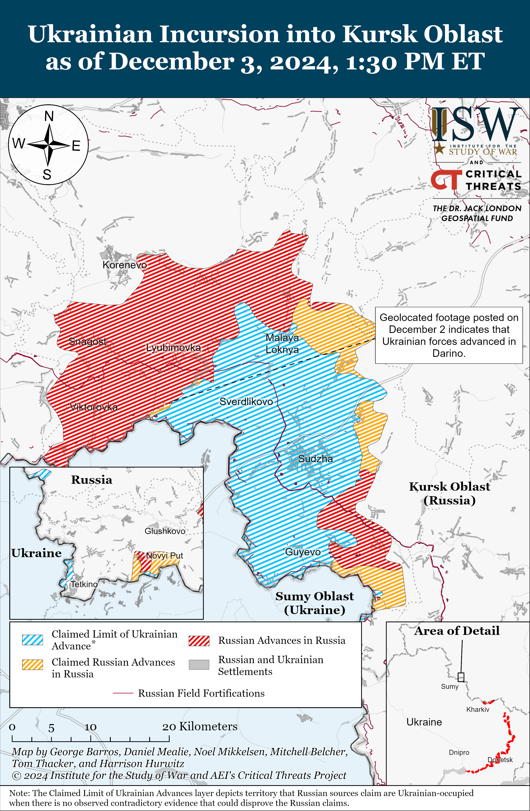
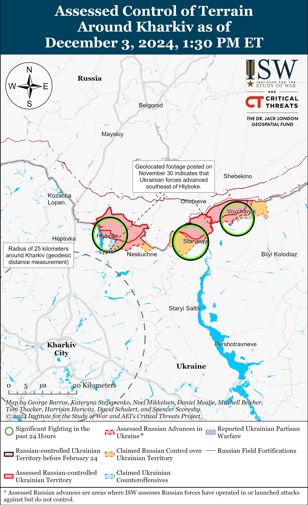
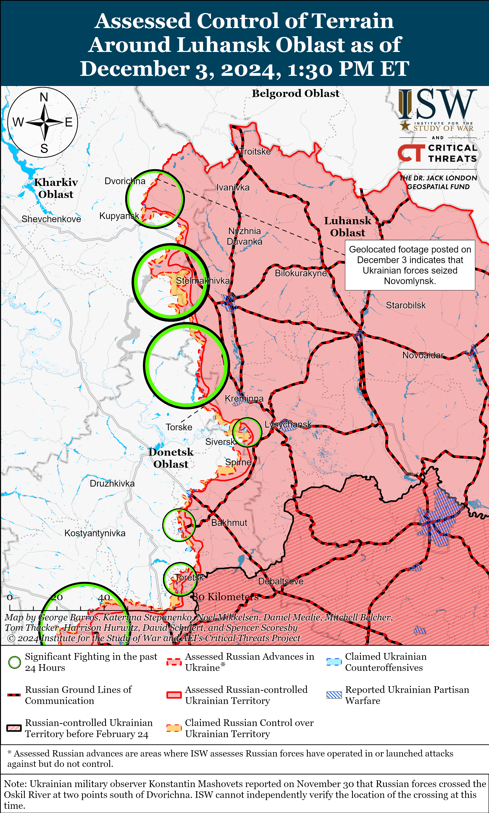
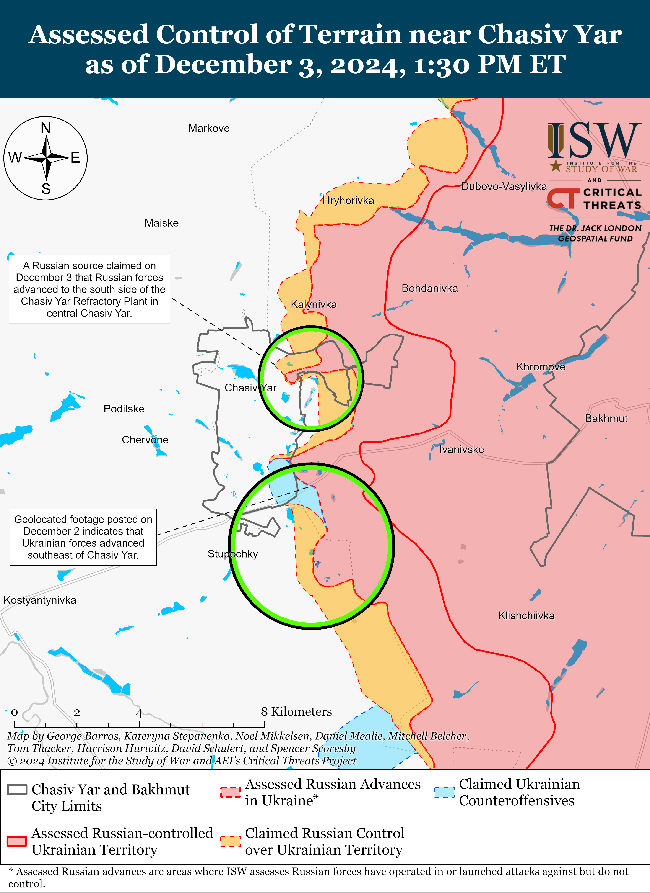
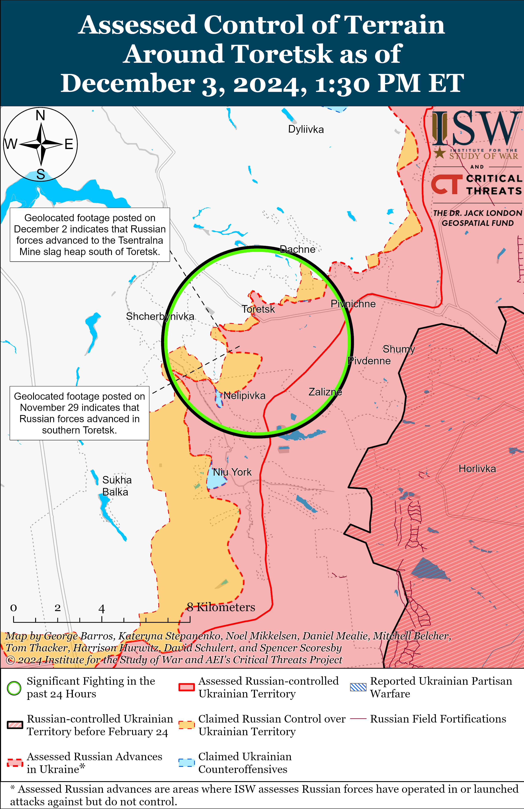
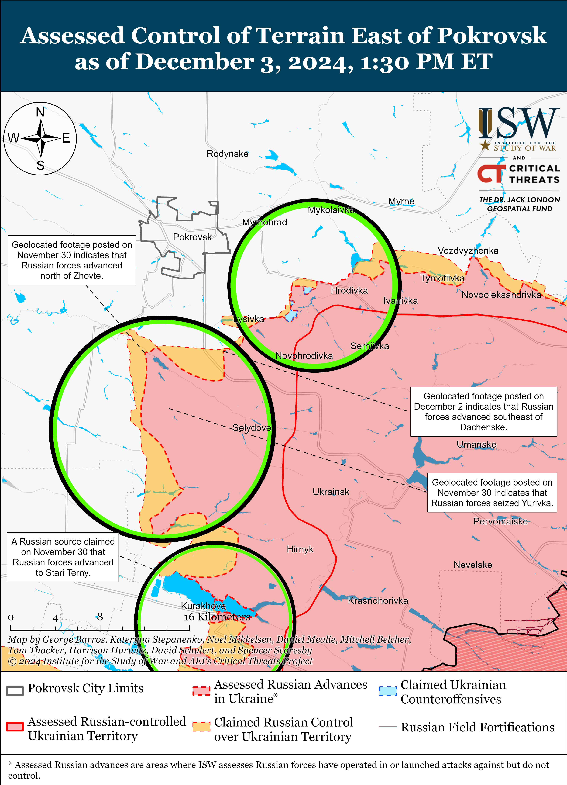
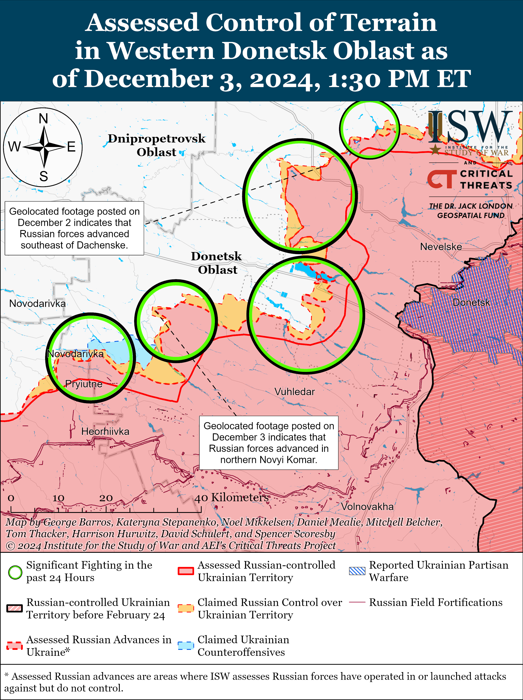
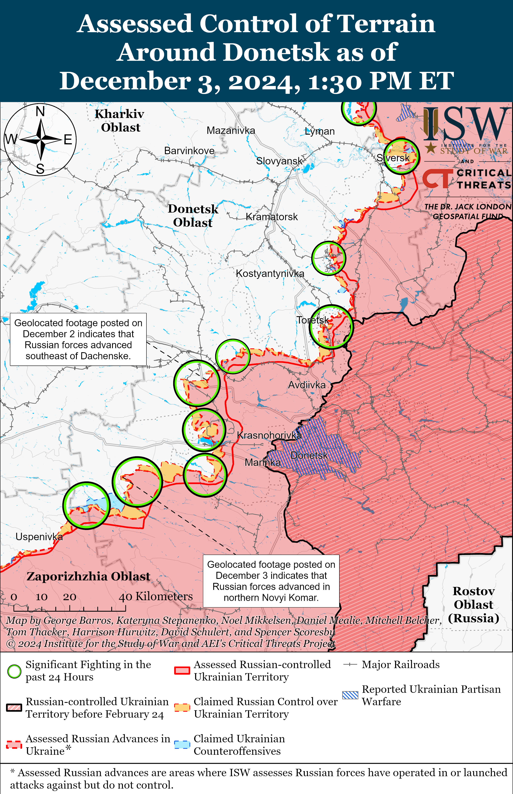
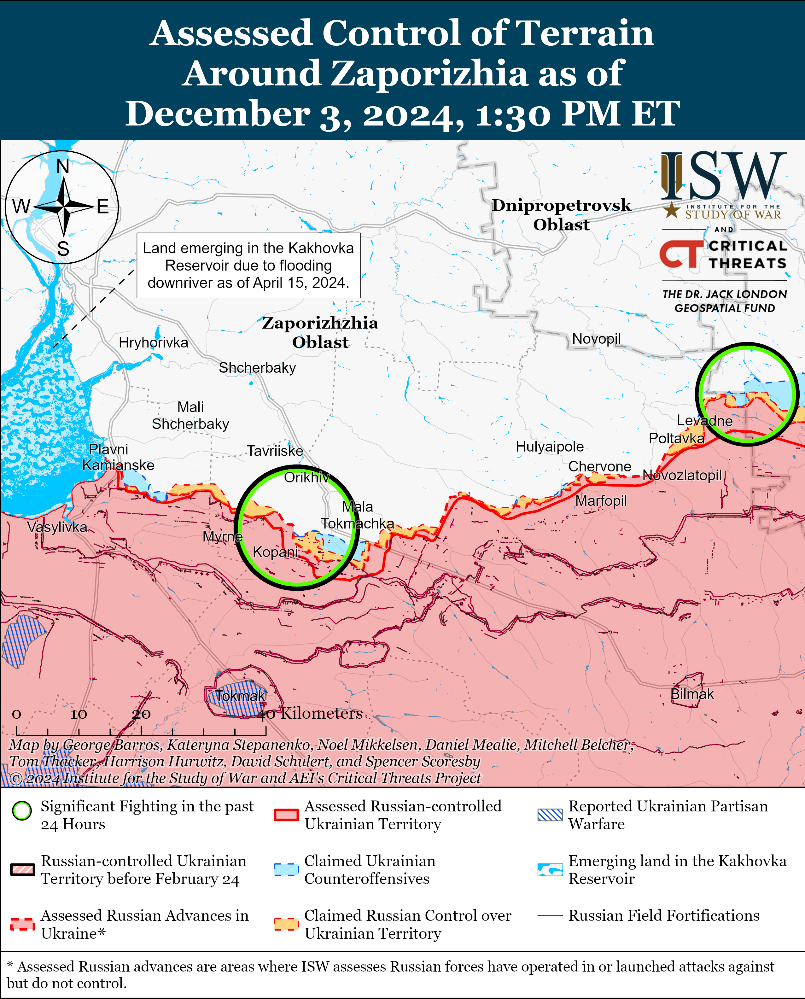
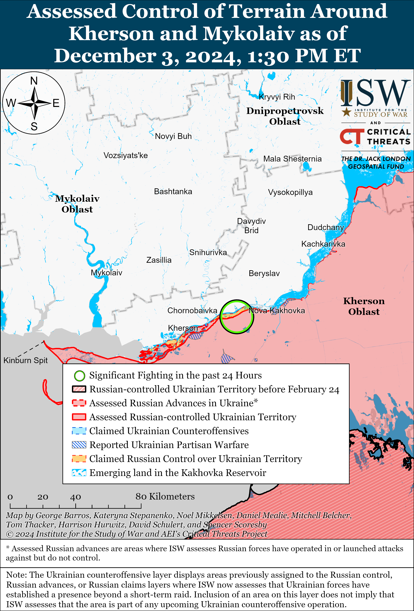

# Russian Offensive Campaign Assessment, December 3, 2024

**Christina Harward, Nicole Wolkov, Davit Gasparyan, Nate Trotter, Olivia Gibson, William Runkel, and Karolina Hird**

**December 3, 2024, 6:30 pm ET**

**Click** [**here**](https://storymaps.arcgis.com/stories/36a7f6a6f5a9448496de641cf64bd375) **to see ISW’s interactive map of the Russian invasion of Ukraine. This map is updated daily alongside the static maps present in this report.**

**Click** [**here**](https://understandingwar.maps.arcgis.com/apps/instant/3dviewer/index.html?appid=1602762dbcde419bb957dea358449580) **to see ISW’s 3D control of terrain topographic map of Ukraine. Use of a computer (not a mobile device) is strongly recommended for using this data-heavy tool.**

**Click** [**here**](https://storymaps.arcgis.com/stories/733fe90805894bfc8562d90b106aa895) **to access ISW’s archive of interactive time-lapse maps of the Russian invasion of Ukraine. These maps complement the static control-of-terrain map that ISW produces daily by showing a dynamic frontline. ISW will update this time-lapse map archive monthly.**

**Note: The data cut-off for this product was 11:30am ET on December 3. ISW will cover subsequent reports in the December 4 Russian Offensive Campaign Assessment.**

**Russia is evacuating naval assets from its base in Tartus, Syria, which may suggest that Russia does not intend to send significant reinforcements to support Syrian President Bashar al Assad’s regime in the near term.** OSINT analyst MT Anderson reported on December 2 that satellite imagery from November 30 and December 1 showed that the Russian *Admiral Gorshkov* and *Admiral Golovko* Gorskhov-class frigates, the *Admiral Grigorovich* Grigorovich-class frigate, the *Novorossiysk* Kilo-class submarine, the *Yelnya* Altay-class oiler, and the *Vyazma* Kaliningradneft-class oiler were at the Russian base in Tartus.[1] Anderson thenreported that satellite imagery from December 3 showed that Russia removed the three frigates, the submarine, and two unnamed auxiliary vessels (likely the *Yelnya* and *Vyazma*) from the base — amounting to all of the vessels that Russia had stationed at Tartus.[2] Russia cannot redeploy these vessels to its Black Sea ports because Turkey is enforcing the Montreux Convention, which prevents Russian warships from passing through the Turkish Straits.[3] Russia will likely therefore redeploy the vessels to its bases in northwestern Russia and Kaliningrad Oblast. Ukraine’s Main Military Intelligence Directorate (GUR) reported on December 3 that the Russian military command has likely deployed a force grouping of an unspecified size from its Africa Corps — the organization that the Russian Ministry of Defense’s (MoD) created to supplant the Wagner Group’s operations in Africa following Wagner financier Yevgeny Prigozhin’s death in August 2023 — to Syria.[4] ISW cannot independently confirm reports of Africa Corps elements deploying to Syria, but these reports, if true, would indicate that the Russian military command is avoiding redeploying regular Russian military forces from its priority theater in Ukraine to Syria. The Russian evacuation of Tartus and the reported deployment of Africa Corps forces to Syria suggest that Russia is worried that Syrian opposition forces may advance southward to Hama (roughly 80 kilometers northeast of Tartus) and threaten the Tartus base but that the Russian military command will not deploy significant reinforcements to Syria in the near term to prevent such advances. The Critical Threats Project’s (CTP) Africa File will cover Syria’s impact on Russian activity in Africa and the Mediterranean in its upcoming update.

**The United States announced additional military assistance worth $725 million for Ukraine on December 2.[5]** The US Department of Defense (DoD) announced its 71st tranche of military assistance under the Presidential Drawdown Authority (PDA), including Stinger man-portable air-defense system (MANPADS) missiles; HIMARS ammunition; 155mm and 105mm artillery ammunition; munitions for National Advanced Surface-to-Air Missile Systems (NASAMS); Tube-launched, Optically-tracked, Wire-guided (TOW) missiles; Counter-Unmanned Aerial Systems (c-UAS) equipment and munitions; and AT-4 and Javelin anti-armor systems.[6] US National Security Advisor Jake Sullivan stated on December 2 that US President Joe Biden has asked the DoD to deliver the aid rapidly and that the United States “will deliver hundreds of thousands of additional artillery rounds, thousands of additional rockets, and other critical capabilities” to Ukraine between early December 2024 and mid-January 2025.[7]

**Russian officials continue to perpetuate information operations about prisoner-of-war (POW) exchanges in order to portray Ukraine as unwilling to negotiate and to undermine Ukrainians’ trust in their government.** Russian Ministry of Foreign Affairs (MFA) Spokesperson Maria Zakharova claimed on November 27 that Russia has a list of 630 Ukrainian POWs that Russia is “immediately” ready to swap in a one-to-one exchange.[8] Russian Human Rights Ombudsman Tatyana Moskalkova published the list of the alleged 630 Ukrainian POWs on December 2 and claimed that Ukraine refused the swap after Russia suggested it.[9] Ukrainian Coordination Headquarters for the Treatment of POWs Secretary Brigadier General Dmytro Usov stated on December 3 that Russian authorities have not submitted requests for such POW exchanges through official channels and that the published list includes civilians and POWs whom Ukraine has already returned home.[10] Usov noted that Russian authorities are only interested in exchanging POWs that Ukrainian forces captured in Kursk Oblast. Usov stated that the Russian officials who are publicly claiming that Ukraine is undermining POW exchanges are attempting to discredit the Ukrainian government. A Russian insider source similarly noted on November 29 and December 3 that Zakharova’s and Moskalkova’s statements about Russia’s alleged willingness to conduct a large POW exchange are an attempt to present the false narrative that Ukrainian leadership is unwilling to negotiate to Ukraine’s Western partners and allies, while falsely portraying Russia as the party interested in negotiations.[11] ISW continues to assess that Kremlin information operations centered around POWs are likely intended to distract from the Kremlin’s own efforts to disrupt the POW exchange process and from consistent reports of Russian human rights abuses, including executions, perpetrated against Ukrainian POWs.[12] Russia — not Ukraine — has previously demonstrated an unwillingness to conduct POW exchanges, as Russia reportedly rebuffed Ukrainian overtures for exchanges for months before the start of Ukraine’s offensive in Kursk Oblast in August 2024.[13]

**India is reportedly attempting to decouple its defense industry from Russia as it increases cooperation with Western defense companies and builds up its own defense industrial base (DIB).** *Bloomberg* reported on December 3 that senior Indian officials stated that India has sharply reduced its defense equipment orders from Russia and instead started purchasing defense equipment from Western suppliers.[14] The officials reportedly stated that India canceled plans to jointly develop and manufacture helicopters and advanced fighter jets with Russia “some time ago” and that India is unlikely to move forward with plans to lease a Russian nuclear-powered submarine to train Indian crews as India is building its own submarines. One unnamed senior Indian official reportedly stated that Russian-made weapons are often cheaper than Western weapons but need frequent repairs, which increases their long-term costs. ISW has previously reported on other sources of increased tensions within the Russia-India relationship, including Indian Prime Minister Narendra Modi’s August 23 visit to Ukraine and the reported transfer of Indian artillery shells through European intermediaries to Ukraine.[15]

**Key Takeaways:**

- **Russia is evacuating naval assets from its base in Tartus, Syria, which may suggest that Russia does not intend to send significant reinforcements to support Syrian President Bashar al Assad’s regime in the near term.**
- **The US announced additional military assistance worth $725 million for Ukraine on December 2.**
- **Russian officials continue to perpetuate information operations about prisoner-of-war (POW) exchanges in order to portray Ukraine as unwilling to negotiate and to undermine Ukrainians’ trust in their government.**
- **India is reportedly attempting to decouple its defense industry from Russia as it increases cooperation with Western defense companies and builds up its own defense industrial base (DIB).**
- **Ukrainian forces recently advanced in Kursk Oblast and regained lost positions near Kupyansk. Russian forces recently advanced near Toretsk, Pokrovsk, and Velyka Novosilka.**
- **Russian forces reportedly continued to suffer significant personnel and armored vehicle losses throughout November 2024 as they attempted to maintain intensified offensive operations in eastern Ukraine.**

***We do not report in detail on Russian war crimes because these activities are well-covered in Western media and do not directly affect the military operations we are assessing and forecasting. We will continue to evaluate and report on the effects of these criminal activities on the Ukrainian military and the Ukrainian population and specifically on combat in Ukrainian urban areas. We utterly condemn Russian violations of the laws of armed conflict and the Geneva Conventions and crimes against humanity even though we do not describe them in these reports.***

- Ukrainian Operations in the Russian Federation
- Russian Main Effort – Eastern Ukraine (comprised of three subordinate main efforts)
- Russian Subordinate Main Effort #1 – Push Ukrainian forces back from the international border with Belgorod Oblast and approach to within tube artillery range of Kharkiv City
- Russian Subordinate Main Effort #2 – Capture the remainder of Luhansk Oblast and push westward into eastern Kharkiv Oblast and encircle northern Donetsk Oblast
- Russian Subordinate Main Effort #3 – Capture the entirety of Donetsk Oblast
- Russian Supporting Effort – Southern Axis
- Russian Air, Missile, and Drone Campaign
- Russian Mobilization and Force Generation Efforts
- Russian Technological Adaptations
- Activities in Russian-occupied areas
- Significant Activity in Belarus

**Ukrainian Operations in the Russian Federation**

Ukrainian forces recently advanced in the main Ukrainian salient in Kursk Oblast amid continued fighting in the area on December 3. Geolocated footage published on December 2 indicates that Ukrainian forces recently advanced in southern Darino (southeast of Korenevo).[16] Russian milbloggers claimed that Russian forces advanced in Novoivanovka (southeast of Korenevo) and near Malaya Loknya (north of Sudzha).[17] ISW has not observed confirmation of these claims, however. Russian sources claimed that Ukrainian forces unsuccessfully counterattacked near Darino, Nikolayevo-Darino (southeast of Korenevo), Novoivanovka, and Pogrebki (northwest of Sudzha).[18] The commander of a Ukrainian unit operating in Kursk Oblast reported on December 3 that Russian forces are struggling to supply frontline units, transport armored vehicles to the frontline, and accumulate forces for large-scale attacks due to poor logistical support.[19] Elements of the Russian 106th Airborne (VDV) Division are reportedly operating in Kursk Oblast, and elements of the Chechen “Akhmat” Spetsnaz are reportedly operating in the Sudzha direction.[20]

**Russian Main Effort – Eastern Ukraine**

**Russian Subordinate Main Effort #1 – Kharkiv Oblast (Russian objective: Push Ukrainian forces back from the international border with Belgorod Oblast and approach to within tube artillery range of Kharkiv City)**

Russian forces conducted offensive operations along the international border north of Kharkiv City towards Kozacha Lopan, north of Kharkiv City near Hlyboke, and northeast of Kharkiv City near Starytsya and Vovchansk on December 2 and 3 but did not make any confirmed advances.[21] A Russian milblogger claimed on December 2 that Ukrainian forces conducted counterattacks southwest of Hlyboke.[22]

**Russian Subordinate Main Effort #2 – Luhansk Oblast (Russian objective: Capture the remainder of Luhansk Oblast and push westward into eastern Kharkiv Oblast and northern Donetsk Oblast)**

Ukrainian forces recently repelled a Russian attempt to establish a foothold on the west (right) bank of the Oskil River north of Kupyansk. Geolocated footage published on December 3 indicates that Ukrainian forces control Novomlynsk (north of Kupyansk and on the western bank of the Oskil River), despite recent Russian claims that Russian forces advanced in the area.[23] The Ukrainian General Staff reported on December 3 that Russian forces attempted to cross to the west bank of the Oskil River near Novomlynsk and establish a foothold, but that Ukrainian artillery and drone strikes cleared Russian forces from the area.[24]

Russian forces continued offensive operations along the Kupyansk-Svatove-Kreminna line on December 3 but did not make any confirmed advances. Russian milbloggers claimed that Russian forces advanced near Kopanky (southwest of Svatove) and that elements of the Russian 27th Motorized Rifle Brigade (1st Guards Tank Army [GTA], Moscow Military District [MMD]) advanced near Lozova (west of Svatove).[25] A Russian source claimed that Russian forces advanced near Kupyansk and established fire control over a section of the P-97 Dvorichna-Kupyansk highway.[26] ISW has not observed confirmation of these claims, however. Russian forces continued assaults north of Kupyansk near Dvorichna; east of Kupyansk near Petropavlivka; southeast of Kupyansk near Hlushkivka, Kruhlyakivka, and Kolisnykivka; west of Svatove near Lozova, Pershotravneve, and Zelenyi Hai; southwest of Svatove near Kopanky, Novoyehorivka, Hrekivka, Cherneshchyna, and Druzhelyubivka; and west of Kreminna near Yampolivka and Terny on December 2 and 3.[27]

**Russian Subordinate Main Effort #3 – Donetsk Oblast (Russian objective: Capture the entirety of Donetsk Oblast, the claimed territory of Russia’s proxies in Donbas)**

Russian forces continued offensive operations northeast of Siversk near Bilohorivka on December 2 and 3 but did not make any confirmed advances.[28]

Russian forces continued offensive operations in the Chasiv Yar direction on December 3 but did not make any confirmed advances. A Russian milblogger claimed on December 3 that Russian forces advanced into the southern side of the Chasiv Yar Refractory Plant in central Chasiv Yar, but ISW has not observed confirmation of this claim.[29] Russian forces continued attacking near Chasiv Yar, within central Chasiv Yar, and north of Chasiv Yar near Hryhorivka on December 2 and 3.[30] The spokesperson of the Ukrainian brigade operating in the Chasiv Yar direction stated on December 3 that the tempo of Russian assaults and the number of Russian airstrikes in the area have decreased recently and that Russian forces are struggling with logistics due to a lack of natural camouflage from foliage.[31] A Russian milblogger claimed on December 3 that unfavorable winter weather conditions have negatively impacted both Russian and Ukrainian forces’ abilities to operate drones in the Chasiv Yar direction.[32] The milblogger also noted that Russian forces are taking advantage of the weather conditions to conduct ground assaults against Ukrainian positions in Chasiv Yar – likely due to decreased Ukrainian drone activity. Another Russian milblogger claimed on December 2 that Russian forces struck a Ukrainian bunker south of Chasiv Yar with an Iskander missile, but ISW has not observed confirmation or other claims of this Russian missile strike.[33] Elements of the Russian 98th Airborne (VDV) Division, drone operators of the Russian “Okhotnik” (Hunter) Spetsnaz Detachment (51st Combined Arms Army [CAA], formerly 1st Donetsk People’s Republic Army Corps [DNR AC]), and the Russian 5th “Terek” Cossack Reconnaissance Brigade (reportedly of the volunteer Cossack Assault Corps) are reportedly operating near Chasiv Yar.[34]

Russian forces recently advanced south of Toretsk amid continued offensive operations in this direction on December 3. Geolocated footage published on December 2 indicates that Russian forces recently advanced near the Tsentralna Mine waste heaps southwest of Toretsk.[35] Russian forces attacked near Toretsk itself; south of Toretsk near Nelipivka; and west of Toretsk near Shcherbynivka on December 2 and 3.[36] A Russian milblogger claimed on December 3 that Ukrainian forces are counterattacking near the Tsentralna Mine.[37] A Russian milblogger claimed that Russian forces are attempting to advance between the two waste heaps at the Tsentralna Mine and that the layout of the frontline in the nearby Zabalka Microraion (southern Toretsk) is unclear even to Russian military sources on the ground, likely due to the fluid frontline situation.[38] Elements of the Russian “Sparta” Separate Reconnaissance Battalion (51st CAA) are reportedly operating in Toretsk.[39]

Russian forces recently advanced south of Pokrovsk amid continued offensive operations on December 3. Geolocated footage published on December 2 indicates that Russian forces recently advanced southeast of Dachenske (south of Pokrovsk), and a Russian milblogger claimed that Russian forces advanced further southeast of Dachenske.[40] Russian sources claimed that Russian forces advanced west of Mykolaivka (east of Pokrovsk), south of Lysivka (southeast of Pokrovsk), north of Petrivka, north and southwest of Zhovte (both south of Pokrovsk), and north of Novopustynka (southwest of Pokrovsk).[41] ISW has not observed confirmation of these claims, however. Russian forces continued ground attacks east of Pokrovsk near Myrolyubivka and Promin; southeast of Pokrovsk near Lysivka and Krasnyi Yar; south of Pokrovsk near Dachenske, Pushkine, Zhovte, and Novyi Trud; and southwest of Pokrovsk near Novopustynka on December 2 and 3.[42] The spokesperson for a Ukrainian brigade operating in the Pokrovsk direction observed on December 3 that Russian forces used to regularly assign 50 troops to assault Ukrainian positions but have since begun to deploy notably fewer troops, likely a result of high Russian attrition rates in the Pokrovsk direction.[43]

Russian sources claimed that Russian forces advanced in the Kurakhove direction amid continued offensive operations in the area on December 3. Russian sources claimed that Russian forces advanced north of Stari Terny (northwest of Kurakhove) and to Prokofieva Street in western Kurakhove, but ISW has not observed confirmation of these claims.[44] Russian and Ukrainian sources stated that fighting continued in Kurakhove; north of Kurakhove near Berestky; northwest of Kurakhove near Stari Terny, Sontsivka, Zorya, and Novodmytrivka; and south of Kurakhove near Dalne.[45] Assault elements of the Russian 3rd Battalion of the 255th Motorized Rifle Regiment (20th Motorized Rifle Division, 8th CAA, Southern Military District [SMD]), reconnaissance elements of the 238th Artillery Brigade (8th CAA, SMD), and drone operators of the 5th Motorized Rifle Brigade (51st CAA) are reportedly operating near Kurakhove; and elements of the 114th Motorized Rifle Brigade (51st CAA) are reportedly operating in Stary Terni and crossed the Ternivska Dam.[46]

Russian sources made unconfirmed claims that Russian forces advanced northeast of Vuhledar on December 3. Russian sources, including the Russian Ministry of Defense (MoD), claimed on December 3 that Russian forces seized Romanivka (northeast of Vuhledar), but ISW has not observed confirmation of these Russian claims.[47] A Ukrainian source posted footage on December 3 showing a Ukrainian reconnaissance detachment repelling a Russian company-sized mechanized assault near Maksymivka (northwest of Vuhledar) consisting of four tanks and six infantry fighting vehicles (IFVs), of which Ukrainian forces destroyed two tanks and two IFVs.[48] Russian forces continued offensive operations northeast of Vuhledar near Antonivka, Yelyzavetivka, and Katerynivka; north of Vuhledar near Hannivka; and northwest of Vuhledar near Sukhi Yaly and Kostyantynopolske on December 2 and 3.[49] Drone operators of the Russian 3rd Motorized Rifle Battalion (39th Motorized Rifle Brigade, 68th AC, Eastern Military District [EMD]) are reportedly operating near the southern bank of the Sukhyi Yaly River, and elements of the Russian 40th Naval Infantry Brigade (Pacific Fleet, EMD) are reportedly operating near Vuhledar.[50]

Russian forces recently advanced north of Velyka Novosilka amid continued offensive operations in the Donetsk-Zaporizhia Oblast border area on December 3. Geolocated footage published on December 3 indicates that Russian forces recently advanced in northern Novyi Komar (north of Velyka Novosilka)[51] Russian advances into Novyi Komar support multiple courses of action (COAs) that ISW recently forecasted the Russian military command might pursue, including enveloping or bypassing Velyka Novosilka to interdict the T0518 Velyka Novosilka-Bahatyr highway and advance into Dnipropetrovsk Oblast, and advancing to Andriivka (west of Kurakhove) from the south. The Russian MoD claimed that Russian forces seized Novodarivka (southwest of Velyka Novosilka) on December 3, but ISW has yet to observe confirmation of the claim. Ukrainian Tavriisk Group of Forces Spokesperson Colonel Vladyslav Voloshyn noted that Russian forces are conducting 20 to 25 assaults daily in the Vremivka direction (Donetsk-Zaporizhia Oblast border area) using small assault groups with armored vehicles and are trying to reach the border between Donetsk and Dnipropetrovsk oblasts. Voloshyn added that Russian forces continue to make slow, incremental advances near Velyka Novosilka and that Ukrainian forces are counterattacking in the area. Russian forces conducted offensive operations near Velyka Novosilka itself; north of Velyka Novosilka near Novyi Komar; northeast of Velyka Novosilka near Rozdolne; west of Velyka Novosilka near Novosilka; and southwest of Velyka Novosilka near Novodarivka and Novopil on December 2 and 3.

**Russian Supporting Effort – Southern Axis (Russian objective: Maintain frontline positions and secure rear areas against Ukrainian strikes)**

Russian forces continued offensive operations near Robotyne, Novoandriivka (northwest of Robotyne), and Novodanylivka (north of Robotyne), on December 2 and 3 but did not make any advances.[52] Ukraine’s Southern Operational Command reported on December 2 that Russian forces continue to train new assault units, conduct air and engineering reconnaissance, build up electronic warfare (EW) and air defense capabilities, and rotate units in the Hulyaipole and Orikhiv directions.[53] A Russian milblogger claimed on December 2 and 3 that Ukrainian forces are preparing for an intensification in Russian offensive operations in the Zaporizhia and Kherson directions.[54]

Russian forces continued assaults in the Dnipro direction, including near Kozatskyi Island (northeast of Kherson City near Nova Kakhovka), on December 2 and 3 but did not make confirmed advances[55]

**Russian Air, Missile, and Drone Campaign (Russian Objective: Target Ukrainian military and civilian infrastructure in the rear and on the frontline)**

Russian forces conducted a limited series of drone strikes targeting energy infrastructure in Ukraine on the night of December 2 to 3. The Ukraine Air Force reported that Russian forces launched 28 Shahed drones and other unidentified drone types (likely referring to decoy drones) fromKursk and Oryol oblasts, Primorsko-Akhtarsk, Krasnodar Krai, and Millerovo, Rostov Oblast.[56] The Ukrainian Air Force reported that Ukrainian forces downed 22 drones over Kyiv, Chernihiv, Vinnytsia, Khmelnytskyi, Zhytomyr, Sumy, Odesa, Mykolaiv, and Dnipropetrovsk oblasts; that one drone became “lost,” likely due to Ukrainian electronic warfare (EW) interference; and that two drones flew into airspace over occupied Ukraine and Belarus. Ukrainian official sources reported that Russian drones struck energy infrastructure in Ternopil City, Ternopil Oblast, and Rivne Oblast and that drone debris damaged residential homes and a gas pipeline in Kyiv Oblast.[57]

Ukrainian President Volodymyr Zelensky stated on December 2 that Ukraine is actively seeking new ways to protect 20 undisclosed “special objects” across the country[58] Zelensky added that Ukraine still does not possess sufficient air defense systems to protect critical facilities across the country.

**Russian Mobilization and Force Generation Efforts (Russian objective: Expand combat power without conducting general mobilization)**

Russian forces reportedly continued to suffer significant personnel and armored vehicle losses throughout November 2024 as they attempted to maintain intensified offensive operations in eastern Ukraine.Ukrainian military observer Petro Chernyk stated on December 3 that Russian forces are losing 1,700 troops per day and suffered 45,000 total casualties in November 2024.[59] Chernyk assessed that the Russian MoD would have to increase the monthly mobilization rates from 40,000-42,000 to 50,000 in order to seize the entirety of Donetsk Oblast while maintaining their current loss rate. Chernyk noted that the Russian defense industrial base can provide the Russian military with 25 T-90 tanks per month and that Russia currently has 3,000-6,000 armored vehicles in storage, including Soviet-era PT-76 light tanks. Chernyk did not specify if Russia is producing 25 new T-90 tanks per month or if some of these 25 tanks are repaired tanks, and ISW continues to assess that Russia is repairing many of its newer tank models.[60] Chernyk also noted that Russian forces are using tanks with almost no ammunition to transport infantry to the frontline in Kursk Oblast, likely due to 125mm ammunition shortages. Ukrainian Khortytsia Group of Forces Spokesperson Lieutenant Colonel Nazar Voloshyn reported on December 3 that Russian forces suffered almost 9,000 casualties and lost almost 40 tanks in eastern Ukraine over the past week (since roughly November 26).[61] Voloshyn also noted that the Russian military started restaffing “Storm” penal recruit assault groups with female convicts and that Russia is running out of prisoners to recruit into the military. Russian opposition outlet *Verstka* reported that the Russian 810th Naval Infantry Brigade (Black Sea Fleet [BSF], Southern Military District [SMD]) incurred three times the number of losses in Kursk Oblast compared to any other Russian unit operating in the area and that 71 out of the 350 Russian soldiers that are confirmed missing in action (MIA) in Kursk Oblast served in the 810th Naval Infantry Brigade.[62] ISW has observed reports that the 810th Naval Infantry Brigade has suffered heavy losses during costly frontal assaults in Kursk Oblast.[63] The Russian military command reconstituted the 810th Naval Infantry Brigade several times before suffering significant personnel losses in Kursk Oblast.[64] ISW previously assessed that Russian forces suffered an estimated 80,000 casualties in September and October 2024 and cannot sustain such significant loss rates indefinitely in return for gradual, creeping battlefield gains.[65]

A prominent Russian milblogger claimed on December 3 that the Russian MoD is concerned about reports that some Russian military officials are forcing mobilized Russian soldiers and officers to sign military service contracts and sending those who refuse to sign contracts to conduct infantry-led assaults in Ukraine.[66] The milblogger claimed that Russian Defense Minister Andrei Belousov would not support such coercion. The milblogger previously claimed that former Russian Defense Minister Sergei Shoigu attempted to coopt them in an effort to persuade them to report more favorable information regarding Russia’s conduct of its war in Ukraine.[67] The milblogger, however, praised Belousov’s appointment, and the milblogger’s December 3 praise of Belousov, while criticizing other parts of the Russian MoD, suggests that the milblogger views Belousov as separate from the wider problem. ISW has not observed reports of Russian MoD officials addressing these issues, however.

The Kremlin continues to focus on integrating Russian veterans of the war in Ukraine into Russian government positions via the “Time of Heroes” program and similar regional programs. Russian President Vladimir Putin met with Time of Heroes participants at the Central Scientific-Research Institute of Trauma and Orthopedics (CITO) medical and rehabilitation facility in Moscow City on December 3 to discuss the continued recruitment of Russian veterans into the Time of Heroes program.[68] Russian state business outlet *Vedomosti,* citing two unspecified sources in the Russian Presidential Administration, reported that the Presidential Administration instructed regional authorities to develop programs similar to the Time of Heroes program since the federal government cannot accommodate all Russian veterans.[69] *Vedemosti* noted that Samara Oblast Governor Vyacheslav Fedorishchev signed a decree in September 2024 establishing a regional “School of Heroes” program to help veterans gain higher education.

**Russian Technological Adaptations (Russian objective: Introduce technological innovations to optimize systems for use in Ukraine)**

Nothing significant to report.

**Activities in Russian-occupied areas (Russian objective: Consolidate administrative control of annexed areas; forcibly integrate Ukrainian citizens into Russian sociocultural, economic, military, and governance systems)**

*ISW is not publishing coverage of activities in Russian-occupied areas today.*

**Significant activity in Belarus (Russian efforts to increase its military presence in Belarus and further integrate Belarus into Russian-favorable frameworks and Wagner Group activity in Belarus)**

Belarus continues efforts to intensify military cooperation with Azerbaijan. The Belarusian Ministry of Defense (MoD) will host an Azerbaijani MoD delegation from December 3 to 5 to discuss bilateral cooperation to provide logistical support to both countries’ armed forces.[70]

**Note: ISW does not receive any classified material from any source, uses only publicly available information, and draws extensively on Russian, Ukrainian, and Western reporting and social media as well as commercially available satellite imagery and other geospatial data as the basis for these reports. References to all sources used are provided in the endnotes of each update.**

[1] https://x.com/MT\_Anderson/status/1863586574782374296

[2] https://x.com/MT\_Anderson/status/1863961047335338225 ; https://www.navalnews dot com/naval-news/2024/12/first-sign-russian-navy-evacuating-naval-vessels-from-tartus-syria/

[3] https://www.mfa.gov dot tr/implementation-of-the-montreux-convention.en.mfa

[4] https://t.me/DIUkraine/4942

[5] https://www.defense.gov/News/Releases/Release/Article/3982157/biden-administration-announces-additional-security-assistance-for-ukraine/ ; https://t.me/NgP\_raZVedka/19819 ; https://www.nytimes.com/2024/12/02/us/politics/ukraine-weapons-shipments.html

[6] https://www.defense.gov/News/Releases/Release/Article/3982157/biden-administration-announces-additional-security-assistance-for-ukraine/ ; https://t.me/NgP\_raZVedka/19819 ; https://www.nytimes.com/2024/12/02/us/politics/ukraine-weapons-shipments.html

[7] https://www.whitehouse.gov/briefing-room/statements-releases/2024/12/02/statement-from-national-security-advisor-jake-sullivan/;

[8] https://www.mid dot ru/ru/foreign\_policy/news/1984067/#6

[9] https://t.me/ombudsmanrf/5784 ; https://t.me/tass\_agency/288594 ; https://t.me/tass\_agency/288600

[10] https://t.me/Koord\_shtab/9483

[11] https://t.me/kremlin\_sekret/16551 ; https://t.me/kremlin\_sekret/16528

[12] https://understandingwar.org/backgrounder/russian-offensive-campaign-assessment-november-3-2024 ; https://understandingwar.org/backgrounder/russian-offensive-campaign-assessment-october-24-2024

[13] https://isw.pub/UkrWar091524

[14] https://www.bloomberg.com/news/articles/2024-12-03/india-pivots-from-russia-to-us-for-cutting-edge-weapons

[15] https://understandingwar.org/backgrounder/russian-offensive-campaign-assessment-september-19-2024; https://understandingwar.org/backgrounder/russian-offensive-campaign-assessment-august-23-2024

[16] https://t.me/WarArchive\_ua/23064; https://t.me/kryvyirih17otbr/3961

[17] https://t.me/dva\_majors/59222

[18] https://t.me/dva\_majors/59222; https://t.me/rusich\_army/19010; https://t.me/motopatriot/30017

[19] https://armyinform dot com.ua/2024/12/03/zhahlyvi-umovy-zelenky-nemaye-skladna-logistyka-ale-vony-prodovzhuyut-lizty-zyma-lyshe-trohy-upovilnyla-shturmy-okupantiv/; https://www.youtube.com/watch?v=WY8sDvZdWEA

[20] https://t.me/DnevnikDesantnika/20280 ; https://t.me/DnevnikDesantnika/20263 ; https://t.me/RKadyrov\_95/5273

[21]https://www.facebook.com/GeneralStaff.ua/posts/pfbid02BC5VnT4mD3rCji9swqueNanfNQiB35p81kAouY5RSLd16FMcsSf4JZHhqAZsbWt1l ;https://www.facebook.com/GeneralStaff.ua/posts/pfbid02DX4YvwvCfyPfhupfeHYosAQgAB1WEsLAAVzgzq2NA4ETh62pPkUxz8RVqSrm15Pnl ; https://www.facebook.com/GeneralStaff.ua/posts/pfbid02Hgk5eDWMKDjRFk1ziqB67UU83hXPGVW5s4ByyLEdWEsSndVZ6uEBY4SsXwcCXD32l

[22] https://t.me/DnevnikDesantnika/20251

[23] https://x.com/moklasen/status/1863863481159569786; https://t.me/DeepStateUA/20813 ; https://understandingwar.org/backgrounder/russian-offensive-campaign-assessment-december-2-2024

[24] https://t.me/GeneralStaffZSU/19059 ; https://www.facebook.com/GeneralStaff.ua/videos/1281158793014887

[25] https://t.me/z\_arhiv/29887; https://t.me/motopatriot/29994; https://t.me/boris\_rozhin/146545

[26] https://t.me/tass\_agency/288674

[27] https://www.facebook.com/GeneralStaff.ua/posts/pfbid02BC5VnT4mD3rCji9swqueNanfNQiB35p81kAouY5RSLd16FMcsSf4JZHhqAZsbWt1l ; https://www.facebook.com/GeneralStaff.ua/posts/pfbid02DX4YvwvCfyPfhupfeHYosAQgAB1WEsLAAVzgzq2NA4ETh62pPkUxz8RVqSrm15Pnl ; https://www.facebook.com/GeneralStaff.ua/posts/pfbid02Hgk5eDWMKDjRFk1ziqB67UU83hXPGVW5s4ByyLEdWEsSndVZ6uEBY4SsXwcCXD32l ; https://t.me/rybar/65979; https://t.me/dva\_majors/59222

[28] https://www.facebook.com/GeneralStaff.ua/posts/pfbid02DX4YvwvCfyPfhupfeHYosAQgAB1WEsLAAVzgzq2NA4ETh62pPkUxz8RVqSrm15Pnl; https://www.facebook.com/GeneralStaff.ua/posts/pfbid02Hgk5eDWMKDjRFk1ziqB67UU83hXPGVW5s4ByyLEdWEsSndVZ6uEBY4SsXwcCXD32l

[29] https://t.me/motopatriot/30008

[30] https://www.facebook.com/GeneralStaff.ua/posts/pfbid02DX4YvwvCfyPfhupfeHYosAQgAB1WEsLAAVzgzq2NA4ETh62pPkUxz8RVqSrm15Pnl; https://www.facebook.com/GeneralStaff.ua/posts/pfbid02Hgk5eDWMKDjRFk1ziqB67UU83hXPGVW5s4ByyLEdWEsSndVZ6uEBY4SsXwcCXD32l; https://t.me/wargonzo/23477

[31] https://suspilne dot media/donbas/893953-kilkist-boezitknen-ta-aviaudariv-v-napramku-casiv-ar-zmensilas-za-ostanni-tizni-24-brigada/

[32] https://t.me/rusich\_army/18997

[33] https://t.me/DnevnikDesantnika/20251

[34] https://t.me/wargonzo/23475 ; https://t.me/readovkanews/90119; https://t.me/nm\_dnr/13048; https://t.me/NeoficialniyBeZsonoV/41895; https://t.me/DnevnikDesantnika/20263; https://t.me/motopatriot/30008

[35] https://t.me/creamy\_caprice/7716; https://t.me/opbr\_zsu/416; https://x.com/AudaxonX/status/1863708766509604996

[36] https://www.facebook.com/GeneralStaff.ua/posts/pfbid02BC5VnT4mD3rCji9swqueNanfNQiB35p81kAouY5RSLd16FMcsSf4JZHhqAZsbWt1l; https://www.facebook.com/GeneralStaff.ua/posts/pfbid02DX4YvwvCfyPfhupfeHYosAQgAB1WEsLAAVzgzq2NA4ETh62pPkUxz8RVqSrm15Pnl; https://www.facebook.com/GeneralStaff.ua/posts/pfbid02Hgk5eDWMKDjRFk1ziqB67UU83hXPGVW5s4ByyLEdWEsSndVZ6uEBY4SsXwcCXD32l

[37] https://t.me/voenkorKotenok/60467

[38] https://t.me/motopatriot/29989

[39] https://x.com/AudaxonX/status/1863897508449042862; https://t.me/orbSparta\_Officially/232

[40] https://t.me/creamy\_caprice/7717; https://t.me/motopatriot/30005 ; https://t.me/boris\_rozhin/146545

[41] https://t.me/motopatriot/30012; https://t.me/motopatriot/30005; https://t.me/motopatriot/30005; https://t.me/z\_arhiv/29893 https://t.me/motopatriot/30005; https://t.me/motopatriot/30005; https://t.me/creamy\_caprice/7717 ; https://t.me/jagers68/475; https://t.me/z\_arhiv/29893 ; https://x.com/small10space/status/1863664842260816070; https://t.me/motopatriot/30005

[42] https://www.facebook.com/GeneralStaff.ua/posts/pfbid02BC5VnT4mD3rCji9swqueNanfNQiB35p81kAouY5RSLd16FMcsSf4JZHhqAZsbWt1l; https://www.facebook.com/GeneralStaff.ua/posts/pfbid02DX4YvwvCfyPfhupfeHYosAQgAB1WEsLAAVzgzq2NA4ETh62pPkUxz8RVqSrm15Pnl; https://www.facebook.com/GeneralStaff.ua/posts/pfbid02Hgk5eDWMKDjRFk1ziqB67UU83hXPGVW5s4ByyLEdWEsSndVZ6uEBY4SsXwcCXD32l

[43] https://armyinform dot com.ua/2024/12/03/90-vorozhoyi-grupy-znyshhuyemo-zahodyt-insha-okupanty-ne-prypynyayut-shturmy-na-pokrovskomu-napryamku/; https://www.youtube.com/watch?v=aDXWlQ2K0dM

[44] https://t.me/z\_arhiv/29887; https://t.me/z\_arhiv/29887

[45] https://www.facebook.com/GeneralStaff.ua/posts/pfbid02BC5VnT4mD3rCji9swqueNanfNQiB35p81kAouY5RSLd16FMcsSf4JZHhqAZsbWt1l; https://www.facebook.com/GeneralStaff.ua/posts/pfbid02DX4YvwvCfyPfhupfeHYosAQgAB1WEsLAAVzgzq2NA4ETh62pPkUxz8RVqSrm15Pnl; https://www.facebook.com/GeneralStaff.ua/posts/pfbid02Hgk5eDWMKDjRFk1ziqB67UU83hXPGVW5s4ByyLEdWEsSndVZ6uEBY4SsXwcCXD32l; https://t.me/tass\_agency/288782; https://t.me/wargonzo/23477?single; https://t.me/boris\_rozhin/146539; https://t.me/voenkorKotenok/60475; https://t.me/tass\_agency/288792

[46] https://t.me/Sladkov\_plus/11966; https://t.me/RVvoenkor/81842; https://t.me/voenkorKotenok/60477

[47] https://t.me/mod\_russia/46451 ; https://t.me/DnevnikDesantnika/20276; https://t.me/sashakots/50549

[48] https://t.me/gostrikartuzy/741

[49] https://www.facebook.com/GeneralStaff.ua/posts/pfbid02Hgk5eDWMKDjRFk1ziqB67UU83hXPGVW5s4ByyLEdWEsSndVZ6uEBY4SsXwcCXD32l; https://www.facebook.com/GeneralStaff.ua/posts/pfbid02DX4YvwvCfyPfhupfeHYosAQgAB1WEsLAAVzgzq2NA4ETh62pPkUxz8RVqSrm15Pnl; https://www.facebook.com/GeneralStaff.ua/posts/pfbid02BC5VnT4mD3rCji9swqueNanfNQiB35p81kAouY5RSLd16FMcsSf4JZHhqAZsbWt1l; https://www.facebook.com/GeneralStaff.ua/posts/pfbid02Hgk5eDWMKDjRFk1ziqB67UU83hXPGVW5s4ByyLEdWEsSndVZ6uEBY4SsXwcCXD32l; https://www.facebook.com/GeneralStaff.ua/posts/pfbid02DX4YvwvCfyPfhupfeHYosAQgAB1WEsLAAVzgzq2NA4ETh62pPkUxz8RVqSrm15Pnl; https://www.facebook.com/GeneralStaff.ua/posts/pfbid02BC5VnT4mD3rCji9swqueNanfNQiB35p81kAouY5RSLd16FMcsSf4JZHhqAZsbWt1l

[50] https://t.me/voin\_dv/12104; https://t.me/rt\_russian/222880

[51] https://t.me/creamy\_caprice/7721 ; https://t.me/wild\_hornets/2205

[52]https://www.facebook.com/GeneralStaff.ua/posts/pfbid02BC5VnT4mD3rCji9swqueNanfNQiB35p81kAouY5RSLd16FMcsSf4JZHhqAZsbWt1l

[53] https://www.facebook.com/OperationalCommandSouth/posts/pfbid0knAkHdHd4QSd2bWwiEE8SmvbCsCNuLmWqYW3LnYfPCNWEMmWmogoY8mWJNMr3fxml?locale=uk\_UA; https://suspilne dot media/zaporizhzhia/893401-na-gulajpilskomu-ta-orihivskomu-napramkah-armia-rf-provodit-rotaciu-pidrozdiliv-ok-pivden/

[54] https://t.me/rybar/65979 ; https://t.me/dva\_majors/59222

[55]https://www.facebook.com/GeneralStaff.ua/posts/pfbid02BC5VnT4mD3rCji9swqueNanfNQiB35p81kAouY5RSLd16FMcsSf4JZHhqAZsbWt1l ; https://www.facebook.com/GeneralStaff.ua/posts/pfbid02DX4YvwvCfyPfhupfeHYosAQgAB1WEsLAAVzgzq2NA4ETh62pPkUxz8RVqSrm15Pnl ; https://www.facebook.com/GeneralStaff.ua/posts/pfbid02Hgk5eDWMKDjRFk1ziqB67UU83hXPGVW5s4ByyLEdWEsSndVZ6uEBY4SsXwcCXD32l

[56] https://t.me/kpszsu/24074

[57] https://www.facebook.com/Nadal.Sergij; https://suspilne dot media/ternopil/893547-u-ternopoli-sahed-vluciv-v-obekt-infrastrukturi/ ; https://t.me/V\_Negoda\_TODA/1350 ; https://t.me/Ukrenergo/3501; https://suspilne dot media/893707-ukrenergo-rf-dronami-atakuvala-ukrainsku-energosistemu-e-vlucanna/ ; https://www.facebook.com/MNS.GOV.UA/posts/pfbid0281qizYpy3uMzxQ5EAXN5VWt4oSzk5FZYNTAf1AMNndLZdUNPJeDFNyMGWZgJ87dml?ref=embed\_post ; https://t.me/oleksandrkoval\_rv/3959; https://suspilne dot media/rivne/893563-armia-rf-atakuvala-rivnensinu-so-vidomo/; https://t.me/dsns\_telegram/35683 ; https://www.facebook.com/RuslanKravchenkoKyiv/posts/pfbid0UbQ78jE2dj4HMsc1EsTHq8GmEtsZip6ZJPgMBbmssbS4WRo3whEDBJwY2ssdY56Ql?locale=uk\_UA ; https://suspilne dot media/kyiv/893575-poskodzeni-privatni-budinki-avtomobili-parkan-ta-gazova-truba-naslidki-dronovoi-ataki-kiivsini/

[58]https://www.facebook.com/RuslanKravchenkoKyiv/posts/pfbid0UbQ78jE2dj4HMsc1EsTHq8GmEtsZip6ZJPgMBbmssbS4WRo3whEDBJwY2ssdY56Ql?locale=uk\_UA ; https://suspilne dot media/kyiv/893575-poskodzeni-privatni-budinki-avtomobili-parkan-ta-gazova-truba-naslidki-dronovoi-ataki-kiivsini/

[59] https://armyinform.com dot ua/2024/12/03/40-tysyach-mobilizovanyh-rosiyan-125-j-kalibr-ta-kurskyj-placzdarm-ekspert-pro-bezpreczedentni-vtraty-rf-u-lystopadi/

[60] https://understandingwar.org/backgrounder/russian-offensive-campaign-assessment-february-11-2024

[61] https://armyinform dot com.ua/2024/12/03/vyaznyczi-porozhni-do-shturmovyh-dij-zalucheni-zhinky-na-shodi-rosiyany-zapysuyut-u-shturmovyky-vsih/; https://www.youtube.com/watch?v=j5TqaWCCdUg

[62] https://t.me/svobodnieslova/6004

[63] https://understandingwar.org/backgrounder/russian-offensive-campaign-assessment-october-31-2024

[64] https://understandingwar.org/backgrounder/russian-offensive-campaign-assessment-september-12; https://understandingwar.org/backgrounder/russian-offensive-campaign-assessment-october-5-2023; https://understandingwar.org/backgrounder/russian-offensive-campaign-assessment-november-29-2023

[65] https://understandingwar.org/backgrounder/russian-offensive-campaign-assessment-november-9-2024

[66] https://t.me/Sladkov\_plus/11968; https://t.me/Sladkov\_plus/11969

[67] https://understandingwar.org/backgrounder/russian-offensive-campaign-assessment-september-8-2024

[68] https://t.me/tass\_agency/288754; https://t.me/mod\_russia/46461; http://kremlin dot ru/events/president/news/75743

[69] https://www.vedomosti dot ru/politics/articles/2024/12/03/1078702-programma-vremya-geroev-budet-zapuschena-v-rossiiskih-regionah; https://meduza dot io/news/2024/12/03/vedomosti-vitse-gubernatoram-poruchili-sozdavat-analogi-programmy-vremya-geroev-v-regionah-i-davat-rabotu-vo-vlasti-uchastnikam-voyny

[70] https://t.me/modmilby/43658
