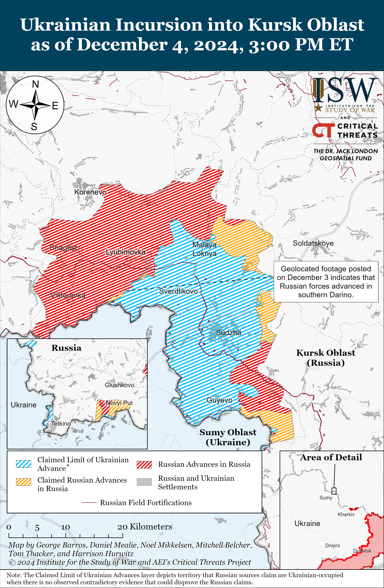
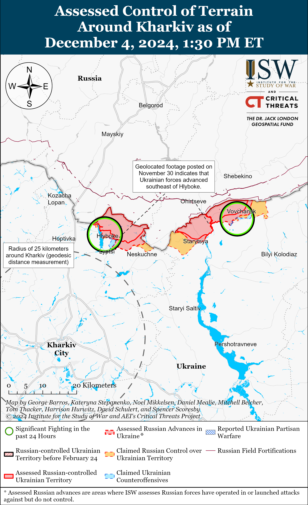
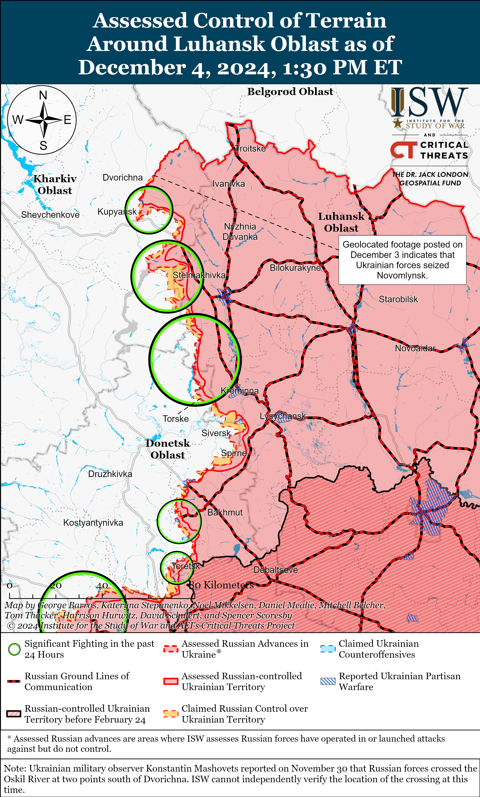
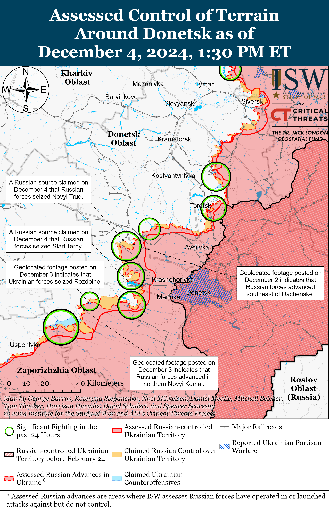
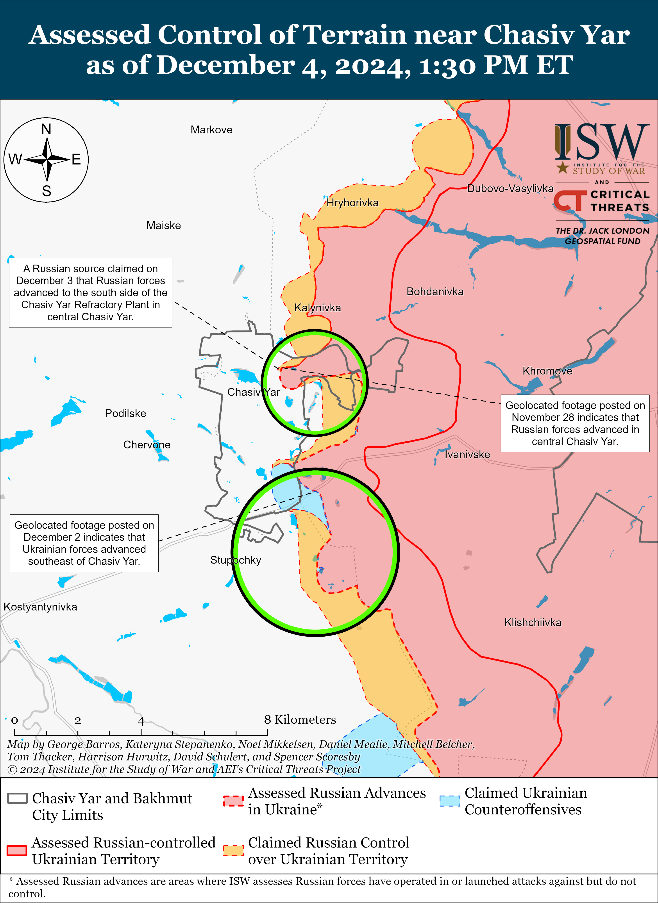
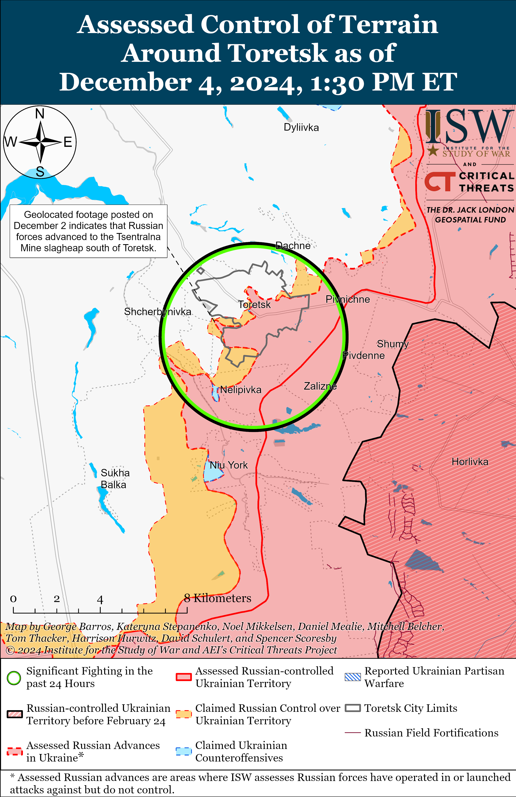
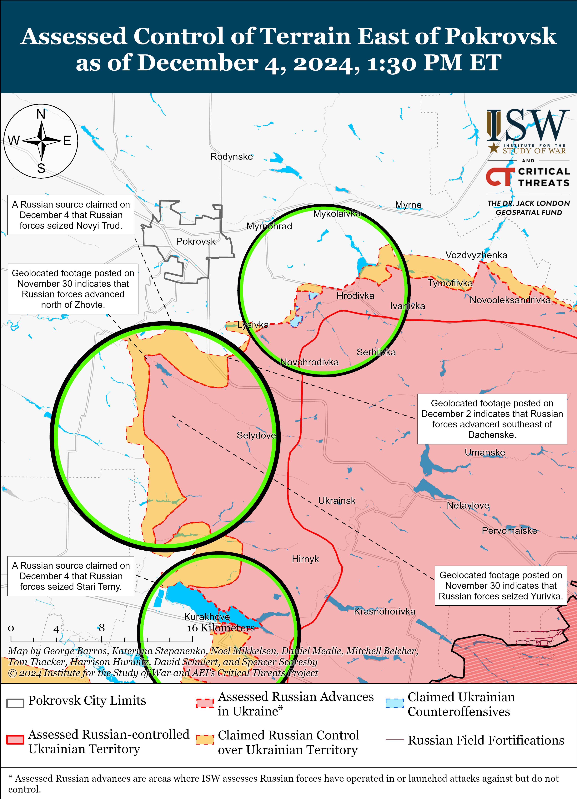
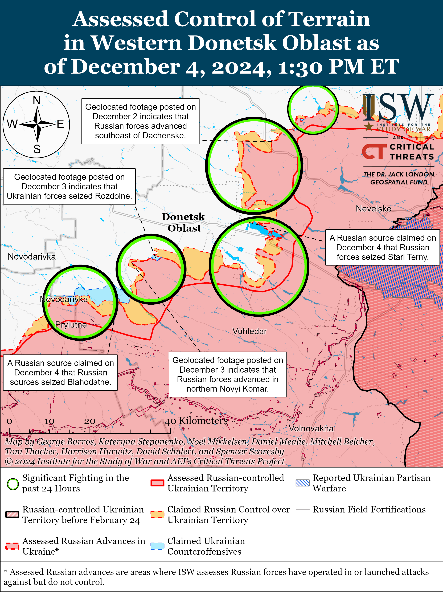
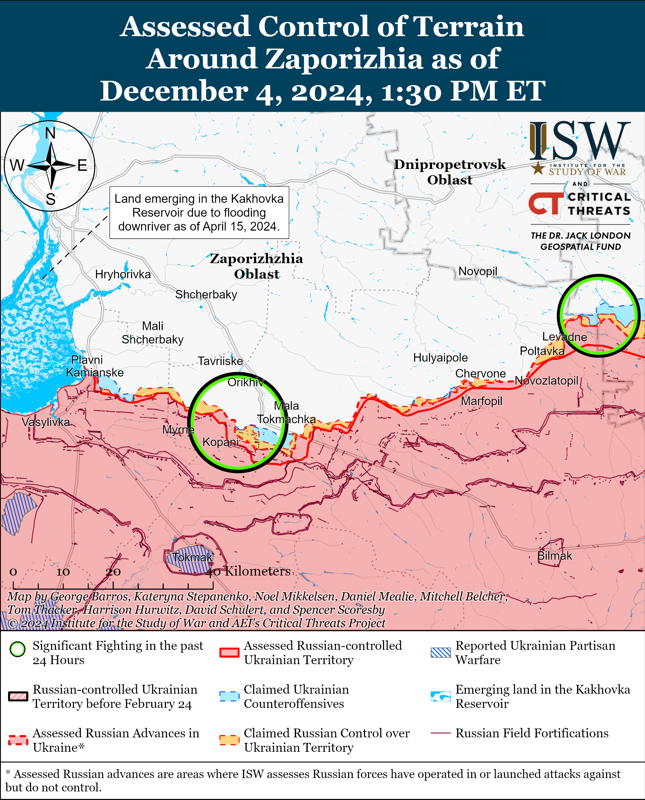
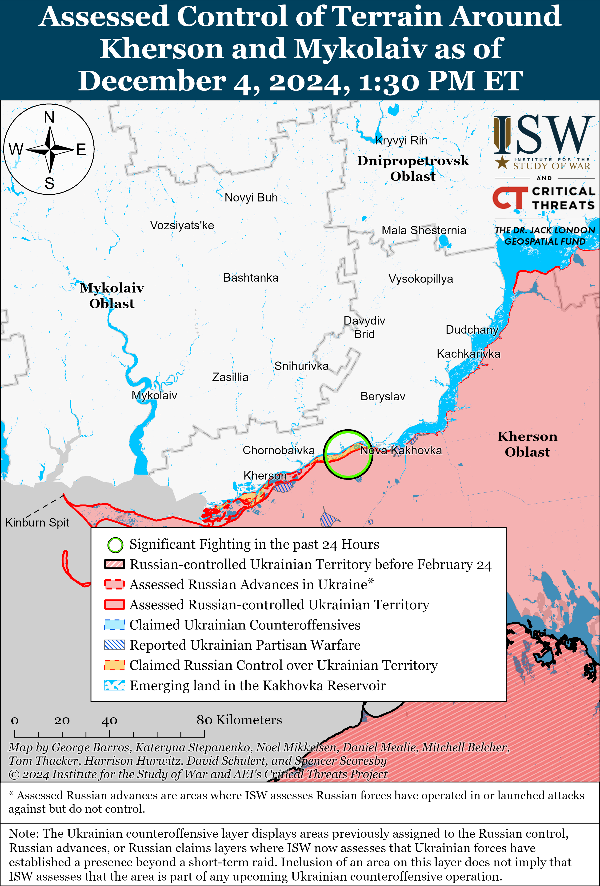

# Russian Offensive Campaign Assessment, December 4, 2024

**Angelica Evans, Nicole Wolkov, Davit Gasparyan, Olivia Gibson, Grace Mappes, Nate Trotter, William Runkel, and Kateryna Stepanenko**

**December 4, 2024, 6:30pm ET**

**Click** [**here**](https://storymaps.arcgis.com/stories/36a7f6a6f5a9448496de641cf64bd375) **to see ISW’s interactive map of the Russian invasion of Ukraine and** [**here**](https://isw.pub/KurskIncursionMap2024) **to see ISW’s interactive map of the Ukrainian incursion into Kursk Oblast. These maps are updated daily alongside the static maps present in this report.**

**Click** [**here**](https://understandingwar.maps.arcgis.com/apps/instant/3dviewer/index.html?appid=1602762dbcde419bb957dea358449580) **to see ISW’s 3D control of terrain topographic map of Ukraine. Use of a computer (not a mobile device) is strongly recommended for using this data-heavy tool.**

**Click** [**here**](https://storymaps.arcgis.com/stories/733fe90805894bfc8562d90b106aa895) **to access ISW’s archive of interactive time-lapse maps of the Russian invasion of Ukraine. These maps complement the static control-of-terrain map that ISW produces daily by showing a dynamic frontline. ISW will update this time-lapse map archive monthly.**

**Note: The data cut-off for this product was 11:00am ET on December 4. ISW will cover subsequent reports in the December 5 Russian Offensive Campaign Assessment.**

**Mounting evidence continues to personally implicate Russian President Vladimir Putin and other senior Kremlin officials in the forced deportation and “re-education” of Ukrainian children in Russia.** The US Department of State and Yale University’s Humanitarian Research Lab published a report on December 3 detailing the role of Putin, Kremlin Commissioner on Children’s Rights Maria Lvova-Belova, members of Russia’s ruling United Russia party, Russia’s Ministry of Education, and occupation officials in Donetsk and Luhansk oblasts in at least 314 confirmed cases of child deportation from occupied Ukraine.[1] The report states that Putin maintains primary control over and is the main decision-maker for Russia’s deportation program and that Lvova-Belova acts as Putin’s executive officer who oversees the implementation of the program. The report notes that Russian authorities have used military transport aircraft and aircraft under Putin’s personal control to deport children from occupied Ukraine to intermediary holding facilities in Russia. The report states that Russian and occupation authorities have primarily deported to Russia children whom Russian authorities claim to be orphans or children without parental care and that Russian authorities have placed most of the children in Russian foster or adoptive families. The report assesses that it is highly likely that most, if not all, deported Ukrainian children have been naturalized as Russian citizens and that Russian authorities force the children to participate in a patriotic re-education program intended to Russify, militarize, and indoctrinate them into Russian cultural and historical narratives and forcibly separate them from their Ukrainian heritage. The report notes that the true number of Ukrainian children that Russia has forcibly deported to Russia remains unclear and that the number is significantly higher than the 314 children identified in the report. ISW has reported extensively on Russia’s crimes in occupied Ukraine, including the forced deportation of Ukrainian youth to Russia.[2] The Geneva Convention on the Prevention and Punishment of the Crime of Genocide defines “forcibly transferring children of a group to another group” as an act constituting genocide.[3]

**Russian President Vladimir Putin continues to posture Russian economic stability and growth while high interest rates and efforts to combat inflation suggest that the Kremlin is worried about economic stability in the long-term.** Putin claimed at the Russian state-owned bank VTB Bank’s investment forum on December 4 that the Russian economy will grow by four precent by the end of 2024 and that Russia’s GDP grew by 4.1 percent from January to October 2024.[4] Putin is likely attempting to posture economic stability despite reports that Russia may raise key interest rates to 25 percent in December 2024, after the Russian Central Bank already raised the key interest rate to 21 percent in October 2024.[5] Russian Central Bank Head Elvira Nabiullina stated on December 4 that the Central Bank may raise the key interest rate at the upcoming Central Bank’s board of directors meeting.[6] Putin tacitly acknowledged some economic problems on December 4 by calling on the Central Bank to contain inflation.[7] Russian state outlet *RBK* reported on December 4, citing Central Bank data, that Russians’ cash savings have fallen to a historical low and that cash rubles account for only 15 percent of Russian citizens’ savings.[8] VTB Banks Deputy Chairperson Georgy Gorshkov assessed that cash savings may fall by “a couple” percentage points by the end of 2024.[9] Putin also suggested that the Russian economy is growing by boasting a record low country-wide unemployment rate of 2.3 percent and claiming that unemployment rates, particularly for Russians 25-years-old and younger, have decreased significantly.[10] Putin failed to note that unemployment rates are likely at a record low for youth as many young Russian men are fighting in Ukraine and that Russia is suffering significant labor shortages.[11]

**Armenian Prime Minister Nikol Pashinyan announced on December 4 that Armenia has effectively reached “the point of no return” in its ties with the Russian-led Collective Security Treaty Organization (CSTO).[12]** Pashinyan criticized CSTO allies for failing to respond to Azerbaijan’s encroachment on Armenia’s internationally recognized territory in 2021 and 2022 – likely referring to encroachments into Syunik and Gegharkunik provinces – despite prior assurances that any violation of Armenia’s territorial integrity was a “red line” for the CSTO.[13] Pashinyan stated that the CSTO lacks credibility because it does not have a clearly defined zone of responsibility in Armenia — despite Armenia still formally being a member state – and emphasized that Armenia’s issues with the CSTO are not necessarily related to the Nagorno-Karabakh conflict. Pashinyan indicated that Armenia no longer participates in CSTO activities or policymaking. ISW continues to observe souring Armenian-Russian bilateral relations and assesses that a formal Armenian withdrawal from the CSTO would serve as another blow to Russian power projection across the countries that the Soviet Union once colonized.[14]

**Key Takeaways:**

- **Mounting evidence continues to personally implicate Russian President Vladimir Putin and other senior Kremlin officials in the forced deportation and “re-education” of Ukrainian children in Russia.**
- **Russian President Vladimir Putin continues to posture Russian economic stability and growth while high interest rates and efforts to combat inflation suggest that the Kremlin is worried about economic stability in the long-term.**
- **Armenian Prime Minister Nikol Pashinyan announced on December 4 that Armenia has effectively reached “the point of no return” in its ties with the Russian-led Collective Security Treaty Organization (CSTO).**
- **Ukrainian forces recently regained lost positions in Toretsk and near Velyka Novosilka. Russian forces recently advanced in Chasiv Yar, near Toretsk, Pokrovsk, Vuhledar, Velyka Novosilka, and in Kursk Oblast.**
- **The Kremlin continues to use its “Time of Heroes” program to place veterans of the war in Ukraine in leadership positions within the Russian government and major state companies**.

***We do not report in detail on Russian war crimes because these activities are well-covered in Western media and do not directly affect the military operations we are assessing and forecasting. We will continue to evaluate and report on the effects of these criminal activities on the Ukrainian military and the Ukrainian population and specifically on combat in Ukrainian urban areas. We utterly condemn Russian violations of the laws of armed conflict and the Geneva Conventions and crimes against humanity even though we do not describe them in these reports.***

- Ukrainian Operations in the Russian Federation
- Russian Main Effort — Eastern Ukraine (comprised of three subordinate main efforts)
- Russian Subordinate Main Effort #1 — Push Ukrainian forces back from the international border with Belgorod Oblast and approach to within tube artillery range of Kharkiv City
- Russian Subordinate Main Effort #2 — Capture the remainder of Luhansk Oblast and push westward into eastern Kharkiv Oblast and encircle northern Donetsk Oblast
- Russian Subordinate Main Effort #3 — Capture the entirety of Donetsk Oblast
- Russian Supporting Effort — Southern Axis
- Russian Air, Missile, and Drone Campaign
- Russian Mobilization and Force Generation Efforts
- Russian Technological Adaptations
- Activities in Russian-occupied areas
- Significant Activity in Belarus

**Ukrainian Operations in the Russian Federation**

Russian forces recently advanced in Ukraine’s main salient in Kursk Oblast amid continued fighting in the area on December 4. Geolocated footage published on December 4 indicates that Russian forces recently advanced in southern Darino (southeast of Korenevo).[15] A Russian milblogger claimed that Russian forces advanced into forested areas near Malaya Loknya (north of Sudzha) and are clearing the the area, but ISW has not observed confirmation of this claim.[16] Russian milbloggers claimed that Ukrainian forces counterattacked near Nikolayevo-Darino, Darino, and Novoivanovka (all southeast of Korenevo).[17] Russian forces continued assaults near Darino and northeast of Sudzha near Martynovka.[18] Reconnaissance elements of the Russian 51st Airborne (VDV) Regiment (106th VDV Division) and drone operators of the Russian 83rd VDV Brigade are reportedly operating in Kursk Oblast.[19]

Russian sources claimed that Ukrainian forces conducted drone strikes on Russian military targets in Ryazan Oblast and Republic of Chechnya on the night of December 3 to 4 and during the day of December 4. The Russian Ministry of Defense (MoD) claimed that Russian forces destroyed three Ukrainian drones over Ryazan Oblast over the night of December 3 to 4 and another drone during the day on December 4.[20] Russian sources claimed that three drones struck the Russian Dyagilevo Air Base near Ryazan City and that a Ukrainian drone struck the Chechen “Kadyrov” Spetsnaz Police Regiment’s barracks in Grozny, Republic of Chechnya on December 4.[21]

**Russian Main Effort — Eastern Ukraine**

**Russian Subordinate Main Effort #1 — Kharkiv Oblast (Russian objective: Push Ukrainian forces back from the international border with Belgorod Oblast and approach to within tube artillery range of Kharkiv City)**

Russian forces conducted offensive operations along the international border north of Kharkiv City towards Kozacha Lopan and near Hlyboke, and northeast of Kharkiv City near Vovchansk on December 3 and 4 but did not make any confirmed advances.[22] The spokesperson of a Ukrainian brigade operating in the Kharkiv direction reported on December 4 that Russian forces are constructing complex defensive positions between underground trenches up to 10 meters deep to provide cover from Ukrainian drone strikes.[23] The spokesperson added that the complexity and depth of these underground positions make it difficult for Ukrainian forces to attack Russian positions. Drone operators of the Russian 44th Army Corps (AC) (Leningrad Military District [LMD]) are reportedly operating in the Kharkiv direction.[24]

**Russian Subordinate Main Effort #2 — Luhansk Oblast (Russian objective: Capture the remainder of Luhansk Oblast and push westward into eastern Kharkiv Oblast and northern Donetsk Oblast)**

Ukrainian forces reportedly pushed Russian forces from recently taken positions north of Kupyansk. Ukrainian military observer Kostyantyn Mashovets stated on December 4 that Ukrainian forces eliminated a Russian bridgehead on the west (right) bank of the Oskil River near Novomlynsk (north of Kupyansk and northeast of Dvorichna) and significantly reduced another Russian bridgehead on the right bank in the direction of Masyutivka-Zapadne area (southeast of Dvorichna).[25]

Russian forces continued offensive operations along the Kupyansk-Svatove-Kreminna line on December 4 but did not advance. Russian forces continued assaults northeast of Kupyansk near Synkivka; north of Kupyansk near Dvorichna; east of Kupyansk near Kucherivka and Petropavlivka; southeast of Kupyansk near Stelmakhivka and Kolisnykivka; west of Svatove near Lozova, Pershotravneve, and Zelenyi Hai; southwest of Svatove near Novoyehorivka, Hrekivka, and Druzhelyubivka; northwest of Kreminna near Terny and Makiivka; and west of Kreminna near Zarichne and Yampolivka on December 3 and 4.[26] A Russian milblogger claimed that Russian forces advanced 1.2 kilometers deep in the direction of Lozova and attacked Ukrainian forces from several directions in the area.[27] Ukrainian Luhansk Oblast Military Administration Head Artem Lysohor stated on December 4 that Russian forces have significantly increased their use of drones in the Luhansk direction.[28]

**Russian Subordinate Main Effort #3 — Donetsk Oblast (Russian objective: Capture the entirety of Donetsk Oblast, the claimed territory of Russia’s proxies in Donbas)**

Russian and Ukrainian sources did not report combat engagements in the Siversk direction on December 4. Artillery elements of the Russian “Nevsky” Volunteer Reconnaissance-Assault Brigade (Russian Volunteer Corps) reportedly continue operating near Vasyukivka (southwest of Siversk).[29]

Russian forces marginally advanced within Chasiv Yar amid continued offensive operations in the area on December 4. Geolocated footage published on November 28 shows that Russian forces advanced south of and within the Refractory Plant in central Chasiv Yar.[30] A Russian milblogger claimed on December 4 that elements of the Russian 98th Airborne (VDV) Division entered the Refractory Plant in central Chasiv Yar from the southeast and secured positions.[31] The milblogger claimed that a Ukrainian counterattack from Ivanivske (south of Chasiv Yar) forced Russian forces to withdraw from some positions along the H-32 Bakhmut-Kostyantynivka highway. Russian forces continued attacks within Chasiv Yar and south of Chasiv Yar near Stupochky and Bila Hora on December 3 and 4.[32]

Ukrainian forces recently marginally advanced within Toretsk amid continued Russian offensive operations in the area on December 4. Geolocated footage published on December 3 indicates that Ukrainian forces recently marginally advanced along Ryaboshapky Street in central Toretsk.[33] Additional geolocated footage published on December 3 indicates that Russian forces also advanced in northern Leonidivka (southwest of Toretsk), although this advance did not occur within the past 24 hours and likely occurred in September 2024.[34] Russian milbloggers claimed on December 3 and 4 that Russian forces have seized most of Zabalka Microraion (southernmost Toretsk) and advanced south of Toretsk to the Tsentralna Mine and adjacent waste heaps.[35] A Ukrainian brigade spokesperson stated that Russian forces in the Toretsk direction continue attacking in groups of up to eight personnel under the cover of smokescreens and with drone and artillery support.[36] Russian forces continued ground attacks within Toretsk and to the south near Nelipivka on December 3 and 4.[37]

Russian forces recently advanced in the Pokrovsk direction. Geolocated footage published on December 4 shows that Russian forces recently marginally advanced to northwestern Zhovte (south of Pokrovsk).[38] A Russian milblogger claimed that Russian forces seized Novyi Trud (south of Pokrovsk) and reached the outskirts of Zelene and Shevchenko (immediately east and west of Novyi Trud, respectively).[39] Russian milbloggers claimed that Russian forces bypassed Novopustynka (southwest of Pokrovsk) by advancing in fields northeast of the settlement to cut the T-0515 Pokrovsk-Novotroitske highway and also bypassed Lysivka (southeast of Pokrovsk) from the south to advance towards Dachenske (south of Pokrovsk).[40] ISW has not observed visual confirmation of these claims, however. Russian forces also continued offensive operations east of Pokrovsk near Myrolyubivka and Promin; southeast of Pokrovsk near Lysivka; south of Pokrovsk near Dachenske, Shevchenko, Pushkine (Chumatske), and Zhovte; and southwest of Pokrovsk near Novopustynka on December 3 and 4.[41]

Russian forces reportedly advanced north of Kurakhove amid continued offensive operations in the Kurakhove direction on December 4. Russian sources claimed that elements of the Russian 114th Motorized Rifle Brigade (51st Combined Arms Army [CAA], formerly the 1st Donetsk People’s Republic Army Corps [DNR AC]) seized Stari Terny (north of Kurakhove and on the northern shore of the Kurakhivske Reservoir) on December 3 and are advancing south toward the western outskirts of Kurakhove and Dachne (west of Kurakhove).[42] One Russian milblogger claimed that Russian forces seized Stari Terny on December 1 and accused other Russian milbloggers of falsely presenting this as a new advance.[43] ISW has not observed visual evidence to verify these Russian claims, however, and still has not observed evidence of Russian forces operating in Stari Terny. The Ukrainian General Staff reported on December 3 and 4 that Russian forces continued offensive operations northwest of Kurakhove near Sonstivka, Zorya, and Novodmytrivka; in Kurakhove itself; north of Kurakhove near Berestky; west of Kurakhove near Dachne; and south of Kurakhove near Dalne.[44]

Russian forces recently advanced northwest of Vuhledar amid continued offensive operations in the Vuhledar direction on December 4. Geolocated footage posted on December 3 indicates that Russian forces marginally advanced southeast of Kostyantynopolske (northwest of Vuhledar) during a reinforced platoon-sized mechanized assault.[45] Russian sources further claimed that Russian forces advanced toward Sukhi Yaly (northeast of Vuhledar) and reiterated claims that Russian forces have seized and are securing positions in Romanivka (north of Vuhledar).[46] ISW has not yet observed visual confirmation that Russian forces have seized Romanivka, however. A Russian milblogger also claimed on December 4 that Russian forces are currently attacking two Ukrainian ground lines of communication (GLOCs) – the Novomykhailivka-Zelenivka road which passes through Kostyantynopolske and Uspenivka (northwest of Vuhledar) and the H-15 Kurakhove-Zaporizhzhia City highway which runs through Kurakhove and Dachne (west of Kurakhove).[47] Russian sources asserted that Russian forces operating northwest of Vuhledar continue to conduct ground attacks toward Kostyantynopolske, which could complicate Ukrainian defensive operations and future withdrawals from Uspenivka, Hannivka, and Veselyi Hai. The Ukrainian General Staff reported on December 3 and 4 that Russian forces continued offensive operations north of Vuhledar near Hannivka; northeast of Vuhledar near Romanivka and Yelyzavetivka; and northwest of Vuhledar near Uspenivka, Sukhi Yaly, and Kostyantynopolske.[48] Elements of the Russian 36th Guards Motorized Rifle Brigade (29th CAA, Eastern Military District [EMD]) are reportedly operating northeast of Vuhledar near Sukhi Yaly and northwest of Vuhledar near Yantarne and surrounding forest belts; and artillery elements of the Russian 1472nd Motorized Rifle Regiment (68th AC, EMD), including drone operators of the regiment’s “Aleppo” detachment, are purportedly operating northwest of Trudove (northwest of Vuhledar).[49]

Both Ukrainian and Russian forces recently advanced near Velyka Novosilka amid intense Russian offensive operations in this direction on December 4. Geolocated footage published on December 3 shows that Ukrainian forces regained positions in southeastern Rozdolne (northeast of Velyka Novosilka), and a Ukrainian brigade operating in the area reported that it repelled Russian forces from the settlement.[50] Additional geolocated footage published on December 4 indicates that elements of the Russian 37th Motorized Rifle Brigade (36th CAA, EMD) advanced in southern Blahodatne and east of Makarivka (both south of Velyka Novosilka), and some Russian sources claimed that Russian forces have seized Blahodatne.[51] ISW has not observed visual confirmation of further Russian advances into Blahodatne beyond the southern part of the settlement, however. Russian sources claimed that Russian forces advanced near Novyi Komar (north of Velyka Novosilka), where Ukrainian forces are conducting counterattacks.[52] Russian milbloggers also claimed that Russian forces are enveloping Velyka Novosilka and gained “fire control” (the ability to prosecute close-range artillery fires on an area to inhibit movement) over all roads into the city.[53] The Ukrainian General Staff reported on December 3 and 4 that Russian forces conducted offensive operations near Rozdolne (northeast of Velyka Novosilka), Makarivka (south of Velyka Novosilka), and Novodarivka (southwest of Velyka Novosilka).[54] Elements of the Russian 36th Guards Motorized Rifle Brigade (29th CAA, EMD) are reportedly operating near Velyka Novosilka; elements of the Russian 5th Tank Brigade (36th CAA, EMD) and other detachments of the 36th CAA are purportedly operating northeast of Blahodatne; and elements of the Russian 143rd and 394th motorized rifle regiments (both 5th CAA, EMD) are reportedly operating in the Vremivka (Donetsk-Zaporizhia Oblast border area) direction.[55]

**Russian Supporting Effort — Southern Axis (Russian objective: Maintain frontline positions and secure rear areas against Ukrainian strikes)**

Russian forces continued offensive operations in western Zaporizhia Oblast near Robotyne, Novoandriivka (northwest of Robotyne), and Novodanylivka (north of Robotyne) on December 3 and 4 but did not make any advances.[56]

Russian forces continued assaults in the Dnipro direction on December 3 and 4 but did not make any confirmed advances in the area.[57] Ukrainian Volunteer Army’s Southern Group of Forces Spokesperson Serhiy Bratchuk told the *Financial Times* (FT) in an article published on December 4 that Russian forces recently conducted a “large attack” against Ukrainian forces on Kozatskyi Island (northeast of Kherson City near Nova Kakhovka).[58] Bratchuk reported that Russian forces hope to seize the Dnipro River Delta islands and advance closer to the west (right) bank of the Dnipro River. Ukrainian Tavriisk Group of Forces Spokesperson Colonel Vladyslav Voloshyn reported on December 4 that Russian forces are constantly assaulting Ukrainian positions on the islands in the Dnipro River Delta.[59] Voloshyn added that Russian forces continue to train assault units of the so-called “Dnipro Flotilla” to conduct naval assault operations using boats in occupied Kherson and Zaporizhia oblasts and that the Russian military command transferred these boats to occupied Tendrivska Spit in Kherson Oblast and Kinburn Spit in Mykolaiv Oblast in early Fall 2024. Voloshyn also noted that the Ukrainian military intelligence is aware that Russian forces transferred about 300 boats in the Dnipro direction. Voloshyn stated that Russian forces have transferred more artillery and air defense systems and river boats to the occupied Kinburn Spit since October 2024.[60] Ukrainian Kherson Oblast Military Administration Head Oleksandr Prokudin told FT that the Russian military deployed several of its best drone units to Kherson Oblast to refine drone tactics, train new drone operators, and support Russian assaults against Ukrainian positions on the Dnipro River islands.[61]

**Russian Air, Missile, and Drone Campaign (Russian Objective: Target Ukrainian military and civilian infrastructure in the rear and on the frontline)**

Russian forces conducted a series of drone and missile strikes in Ukraine on the night of December 3 to 4. The Ukrainian Air Force reported that Russian forces launched one Kh-59/69 cruise missile from Kursk Oblast and 50 Shahed drones and other unidentified drone types (likely referring to decoy drones) from Primorsko-Akhtarsk, Krasnodar Krai; Millerovo, Rostov Oblast; and Oryol City.[62] The Ukrainian Air Force reported that Ukrainian forces downed 29 drones over Kyiv, Kharkiv, Poltava, Sumy, Chernihiv, Khmelnytskyi, Ternopil, Mykolaiv, and Donetsk oblasts; that 18 drones became ”locally lost”, likely due to Ukrainian electronic warfare (EW) interference; and that one drone flew into the airspace over occupied Ukraine. A Russian milblogger claimed that a Russian naval drone destroyed a gas terminal located near Odesa City’s port on December 4.[63] ISW has not observed official confirmation of this claim, however.

**Russian Mobilization and Force Generation Efforts (Russian objective: Expand combat power without conducting general mobilization)**

The Kremlin continues to use its “Time of Heroes” program to place veterans of the war in Ukraine in leadership positions within the Russian government and major state companies. Russian sources claimed that Russian authorities appointed “Time of Heroes” participant Captain Second Rank Nikolai Korolev to be St. Petersburg’s Deputy Chairman of the Committee on Legality, Law, and Order and Security; and appointed “Time of Heroes” participant Captain Pavel Yakushev to be an advisor to the Deputy General Director for Personnel on Patriotic Education at Russian state nuclear energy operator Rosatom.[64]

**Russian Technological Adaptations (Russian objective: Introduce technological innovations to optimize systems for use in Ukraine)**

Nothing significant to report.

**Activities in Russian-occupied areas (Russian objective: Consolidate administrative control of annexed areas; forcibly integrate Ukrainian citizens into Russian sociocultural, economic, military, and governance systems)**

*See topline text.*

**Significant activity in Belarus (Russian efforts to increase its military presence in Belarus and further integrate Belarus into Russian-favorable frameworks and Wagner Group activity in Belarus)**

Belarusian and People’s Republic of China (PRC) military representatives met on December 4 in Minsk to discuss deepening bilateral military cooperation.[65]

**Note: ISW does not receive any classified material from any source, uses only publicly available information, and draws extensively on Russian, Ukrainian, and Western reporting and social media as well as commercially available satellite imagery and other geospatial data as the basis for these reports. References to all sources used are provided in the endnotes of each update.**

[1] https://www.justsecurity.org/wp-content/uploads/2024/12/Russias\_Systematic\_Program\_of\_Coerced\_Adoption\_and\_Fostering\_of\_Ukraines\_Children.pdf

[2] https://understandingwar.org/backgrounder/kremlins-occupation-playbook-coerced-russification-and-ethnic-cleansing-occupied

[3] https://www.ohchr.org/en/instruments-mechanisms/instruments/convention-prevention-and-punishment-crime-genocide

[4] https://t.me/tass\_agency/288969 ; http://kremlin dot ru/events/president/news/75751

[5] https://understandingwar.org/backgrounder/russian-offensive-campaign-assessment-november-14-2024 ; https://www.rbc dot ru/quote/news/article/67484ec19a7947ff8940370b

[6] https://ura dot news/news/1052851782

[7] https://t.me/tass\_agency/288946 ; http://kremlin dot ru/events/president/news/75751

[8] https://www.rbc dot ru/finances/04/12/2024/674f31f09a7947dbf7cbd2f8 ; https://meduza dot io/news/2024/12/04/dolya-nalichnyh-sberezheniy-rossiyan-upala-do-istoricheskogo-minimuma

[9] https://www.rbc dot ru/finances/04/12/2024/674f31f09a7947dbf7cbd2f8

[10] http://kremlin dot ru/events/president/news/75751

[11] https://isw.pub/UkrWar111424 ; https://isw.pub/UkrWar110924 ; https://isw.pub/UkrWar101624

[12] https://armenpress dot am/en/article/1206671 ; https://meduza dot io/news/2024/12/04/my-schitaem-sebya-vne-odkb-my-proshli-tochku-nevozvrata-pashinyan-o-ne-uchastii-armenii-v-organizatsii-dogovora-o-kollektivnoy-bezopasnosti; https://www.civilnet dot am/en/news/808128/point-of-no-return-pashinyan-signals-definitive-split-from-russia-led-military-alliance/

[13] https://mil dot am/hy/news/10460 ; https://oc-media dot org/live-updates-azerbaijan-launches-attacks-along-armenian-border/ ; https://hetq dot am/en/article/144181

[14] https://understandingwar.org/backgrounder/russian-offensive-campaign-assessment-june-12-2024; https://understandingwar.org/backgrounder/russian-offensive-campaign-assessment-may-22-2024

[15] https://x.com/blinzka/status/1863959221177393635; https://t.me/kryvyirih17otbr/3961; https://t.me/ua\_marines\_36brigade/2500

[16] https://t.me/dva\_majors/59286; https://t.me/rybar/66007

[17] https://t.me/dva\_majors/59286; https://t.me/DnevnikDesantnika/20346

[18] https://t.me/rybar/66000; https://t.me/pentagonkh/119; https://t.me/motopatriot/30107; https://www.facebook.com/GeneralStaff.ua/posts/pfbid0dpRJvqK2Z3RzPejmg6LT66n5BZLsYBzezMfWk9n5SPK52egMv7h8GwEnSCRKbFtml

[19] https://t.me/DnevnikDesantnika/20305; https://t.me/DnevnikDesantnika/20309; https://t.me/rusich\_army/19016

[20] https://t.me/mod\_russia/46470; https://t.me/mod\_russia/46471 ; https://t.me/mod\_russia/46485

[21] https://t.me/vchkogpu/53007; https://t.me/bbbreaking/195286 ; https://t.me/abusaddamshishani/6378 ; https://t.me/abusaddamshishani/6379 ; https://t.me/astrapress/69721 ; https://t.me/vchkogpu/53005 ; https://t.me/milinfolive/136662

[22]https://www.facebook.com/GeneralStaff.ua/posts/pfbid0dpRJvqK2Z3RzPejmg6LT66n5BZLsYBzezMfWk9n5SPK52egMv7h8GwEnSCRKbFtml ; https://www.facebook.com/GeneralStaff.ua/posts/pfbid02R7MrM3M1PsyfyWkfMkktGUJEzJKpcTPK1dw9WvzZuuhY8aLNH1zeG4vgHUJaDufYl ; https://www.facebook.com/GeneralStaff.ua/posts/pfbid04vxQs37PenZy7KrrSZmajsULfk5aBT4ghw16xudZi3D6wzFCq4mC2YrBkCTykc6pl ; https://t.me/otukharkiv/2919

[23] https://armyinform dot com.ua/2024/12/04/shozhe-na-vyetnamsku-vijnu-okupanty-rozumiyut-yakshho-vony-budut-kopaty-to-duzhe-shvydko-zakinchatsya/; https://www.youtube.com/watch?v=ScdUZNkwcYc

[24] https://t.me/boris\_rozhin/146686

[25] https://t.me/zvizdecmanhustu/2386 ; https://www.facebook.com/pashtetof/posts/pfbid02gUd9R1jjpUy4LQ5qsvuYSAg5SkJcTw7DFGvtUhiRWywk7syn8nZ6dvakDwpexpobl?\_\_cft\_\_[0]=AZX1cYZGE-FpuL4UnFkXFUd1SPMGKxtWyAi4Xxi7PO46bNGLWt0kK\_ZvagjKR8WCMwaFhEE61-31yPSudyOr4IAppWBH7MSHqM\_cf7daQ-ijOqARzTa4yQ-GkkflBkMrcSsbf2vycaP9AdcXZP0mhvv-nMBesndXvM1KydjQLFdCxlmjKLzQ2W0UBeiufuZQohM&\_\_tn\_\_=%2CO%2CP-R

[26] https://www.facebook.com/GeneralStaff.ua/posts/pfbid0dpRJvqK2Z3RzPejmg6LT66n5BZLsYBzezMfWk9n5SPK52egMv7h8GwEnSCRKbFtml; https://www.facebook.com/GeneralStaff.ua/posts/pfbid02R7MrM3M1PsyfyWkfMkktGUJEzJKpcTPK1dw9WvzZuuhY8aLNH1zeG4vgHUJaDufYl; https://www.facebook.com/GeneralStaff.ua/posts/pfbid04vxQs37PenZy7KrrSZmajsULfk5aBT4ghw16xudZi3D6wzFCq4mC2YrBkCTykc6pl

[27] https://t.me/boris\_rozhin/146637

[28] https://t.me/luhanskaVTSA/23135

[29] https://t.me/NeoficialniyBeZsonoV/41938

[30] https://t.me/creamy\_caprice/7732; https://t.me/RVP244/2157

[31] https://t.me/DnevnikDesantnika/20335

[32] https://www.facebook.com/GeneralStaff.ua/posts/pfbid02R7MrM3M1PsyfyWkfMkktGUJEzJKpcTPK1dw9WvzZuuhY8aLNH1zeG4vgHUJaDufYl; https://www.facebook.com/GeneralStaff.ua/posts/pfbid04vxQs37PenZy7KrrSZmajsULfk5aBT4ghw16xudZi3D6wzFCq4mC2YrBkCTykc6pl; https://t.me/wargonzo/23499; https://t.me/DnevnikDesantnika/20305; https://t.me/DnevnikDesantnika/20335

[33] https://x.com/AudaxonX/status/1864113389183651950; https://t.me/ZParaBellumMD/13476

[34] https://x.com/AudaxonX/status/1864099954433630554; https://t.me/azov\_media/6311; https://x.com/99Dominik\_/status/1864061425141821567

[35] https://t.me/rybar/66000 ; https://t.me/dva\_majors/59286; https://t.me/rybar/66007; https://t.me/DnevnikDesantnika/20337; https://t.me/RVvoenkor/81906; https://t.me/z\_arhiv/29897

[36] https://armyinform dot com.ua/2024/12/04/odyn-dva-distayutsya-okopiv-tam-yih-znyshhuye-pihota-abo-drony-poblyzu-toreczka-vorog-dotrymuyetsya-taktyky-targaniv/; https://www.youtube.com/watch?v=aDXWlQ2K0dM

[37] https://www.facebook.com/GeneralStaff.ua/posts/pfbid0dpRJvqK2Z3RzPejmg6LT66n5BZLsYBzezMfWk9n5SPK52egMv7h8GwEnSCRKbFtml; https://www.facebook.com/GeneralStaff.ua/posts/pfbid02R7MrM3M1PsyfyWkfMkktGUJEzJKpcTPK1dw9WvzZuuhY8aLNH1zeG4vgHUJaDufYl; https://www.facebook.com/GeneralStaff.ua/posts/pfbid04vxQs37PenZy7KrrSZmajsULfk5aBT4ghw16xudZi3D6wzFCq4mC2YrBkCTykc6pl; https://t.me/RVvoenkor/81906;

[38] https://t.me/creamy\_caprice/7731; https://t.me/answertime1/108

[39] https://t.me/voenkorKotenok/60482

[40] https://t.me/rybar/66000; https://t.me/dva\_majors/59286; https://t.me/rybar/66007; https://t.me/DnevnikDesantnika/20340; https://t.me/motopatriot/30090; https://t.me/z\_arhiv/29907; https://t.me/RVvoenkor/81933;

[41] https://www.facebook.com/GeneralStaff.ua/posts/pfbid0dpRJvqK2Z3RzPejmg6LT66n5BZLsYBzezMfWk9n5SPK52egMv7h8GwEnSCRKbFtml; https://www.facebook.com/GeneralStaff.ua/posts/pfbid02R7MrM3M1PsyfyWkfMkktGUJEzJKpcTPK1dw9WvzZuuhY8aLNH1zeG4vgHUJaDufYl

[42] https://t.me/boris\_rozhin/146612 ; https://t.me/boris\_rozhin/146635 ; https://t.me/boris\_rozhin/146636; https://t.me/epoddubny/21817; https://t.me/notes\_veterans/20865; https://t.me/voenkorKotenok/60481 https://t.me/RVvoenkor/81920; https://t.me/dva\_majors/59286; https://t.me/rybar/66007

[43] https://t.me/motopatriot/30034 ; https://t.me/motopatriot/30041

[44] https://www.facebook.com/GeneralStaff.ua/posts/pfbid02R7MrM3M1PsyfyWkfMkktGUJEzJKpcTPK1dw9WvzZuuhY8aLNH1zeG4vgHUJaDufYl; https://www.facebook.com/GeneralStaff.ua/posts/pfbid0dpRJvqK2Z3RzPejmg6LT66n5BZLsYBzezMfWk9n5SPK52egMv7h8GwEnSCRKbFtml; https://www.facebook.com/GeneralStaff.ua/posts/pfbid0dpRJvqK2Z3RzPejmg6LT66n5BZLsYBzezMfWk9n5SPK52egMv7h8GwEnSCRKbFtml

[45] https://t.me/creamy\_caprice/7725; https://www.facebook.com/37obrmp/videos/1360811338236121/

[46] https://t.me/boris\_rozhin/146685; https://t.me/voenkorKotenok/60481; https://t.me/boris\_rozhin/146685; https://t.me/DnevnikDesantnika/20341; https://t.me/DnevnikDesantnika/20305; https://t.me/boris\_rozhin/146612;

[47] https://t.me/voenkorKotenok/60485

[48] https://www.facebook.com/GeneralStaff.ua/posts/pfbid0dpRJvqK2Z3RzPejmg6LT66n5BZLsYBzezMfWk9n5SPK52egMv7h8GwEnSCRKbFtml; https://www.facebook.com/GeneralStaff.ua/posts/pfbid02R7MrM3M1PsyfyWkfMkktGUJEzJKpcTPK1dw9WvzZuuhY8aLNH1zeG4vgHUJaDufYl; https://www.facebook.com/GeneralStaff.ua/posts/pfbid04vxQs37PenZy7KrrSZmajsULfk5aBT4ghw16xudZi3D6wzFCq4mC2YrBkCTykc6pl

[49] https://t.me/voin\_dv/12115; https://t.me/voin\_dv/12113

[50] https://www.youtube.com/watch?v=2qsqxa1VqVs ; https://x.com/99Dominik\_/status/1864248892017045723 ; https://t.me/skalabatalion/459

[51] https://t.me/creamy\_caprice/7729 ; https://t.me/burpobeda/9201 ; https://t.me/RVvoenkor/81947

[52] https://t.me/voenkorKotenok/60481;https://t.me/wargonzo/23499

[53] https://t.me/wargonzo/23504; https://t.me/dva\_majors/59286 ; https://t.me/rybar/66007; https://t.me/RVvoenkor/81920 ;

[54] https://www.facebook.com/GeneralStaff.ua/posts/pfbid04vxQs37PenZy7KrrSZmajsULfk5aBT4ghw16xudZi3D6wzFCq4mC2YrBkCTykc6pl; https://www.facebook.com/GeneralStaff.ua/posts/pfbid02R7MrM3M1PsyfyWkfMkktGUJEzJKpcTPK1dw9WvzZuuhY8aLNH1zeG4vgHUJaDufYl; https://www.facebook.com/GeneralStaff.ua/posts/pfbid0dpRJvqK2Z3RzPejmg6LT66n5BZLsYBzezMfWk9n5SPK52egMv7h8GwEnSCRKbFtml

[55] https://t.me/boris\_rozhin/146623; https://t.me/dva\_majors/59336; https://t.me/RVvoenkor/81947

[56]https://www.facebook.com/GeneralStaff.ua/posts/pfbid02R7MrM3M1PsyfyWkfMkktGUJEzJKpcTPK1dw9WvzZuuhY8aLNH1zeG4vgHUJaDufYl ; https://www.facebook.com/GeneralStaff.ua/posts/pfbid04vxQs37PenZy7KrrSZmajsULfk5aBT4ghw16xudZi3D6wzFCq4mC2YrBkCTykc6pl

[57]https://www.facebook.com/GeneralStaff.ua/posts/pfbid0dpRJvqK2Z3RzPejmg6LT66n5BZLsYBzezMfWk9n5SPK52egMv7h8GwEnSCRKbFtml ; https://www.facebook.com/GeneralStaff.ua/posts/pfbid02R7MrM3M1PsyfyWkfMkktGUJEzJKpcTPK1dw9WvzZuuhY8aLNH1zeG4vgHUJaDufYl ; https://www.facebook.com/GeneralStaff.ua/posts/pfbid04vxQs37PenZy7KrrSZmajsULfk5aBT4ghw16xudZi3D6wzFCq4mC2YrBkCTykc6pl

[58] https://www.ft.com/content/31b630b3-2639-456c-ba50-3caea7a9b2b5

[59] https://suspilne dot media/kherson/873777-vijskovi-rf-namagautsa-zakripitisa-na-ostrovah-poblizu-hersona-j-zibrali-300-kateriv-na-livoberezzi-volosin/

[60] https://www.radiosvoboda.org/a/news-armiia-rosii-kilkist-pidrozdiliv-kinburnka-kosa/33225408.html ; https://suspilne dot media/mykolaiv/894629-rosiani-stagnuli-svoi-pidrozdili-na-kinburnskij-pivostriv-so-na-mikolaivsini-sili-oboroni-pivdna/

[61] https://www.ft.com/content/31b630b3-2639-456c-ba50-3caea7a9b2b5 ; https://suspilne dot media/894345-ssa-vidilat-825-mln-na-posilenna-energostijkosti-ukraini-golova-opu-ermak-ide-do-vasingtona-1015-den-vijni-onlajn/?anchor=live\_1733304958&utm\_source=copylink&utm\_medium=ps

[62] https://t.me/kpszsu/24101

[63] https://t.me/boris\_rozhin/146696 ; https://t.me/boris\_rozhin/146700

[64] https://xn--b1aachba0csne6n dot xn--p1ai/news/tpost/02343mcnz1-uchastnik-programmi-vremya-geroev-nikola ; https://t.me/readovkanews/90120

[65] https://t.me/modmilby/43671
